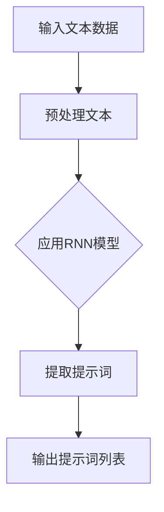
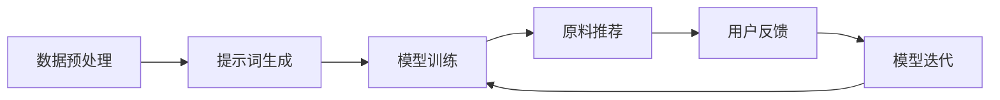

                 


### 第1章 引言与背景

#### 1.1 书籍目的与读者对象

《提高AI创意香水原料选择：可持续sourcing的提示词技巧》旨在探讨如何利用人工智能（AI）技术，特别是机器学习算法，提高香水原料选择过程中的创新性和可持续性。本书面向对人工智能和香水原料选择感兴趣的读者，包括但不限于香水行业从业者、研究人员、AI工程师和技术爱好者。

在当今全球环保意识日益增强的背景下，可持续性成为许多行业的核心议题。香水行业也不例外，如何在保证产品品质和创新性的同时，降低对环境的影响，成为了一个亟待解决的问题。本书通过介绍AI在香水原料选择中的应用，旨在为行业提供一种创新的解决方案，帮助企业和研究者提高香水原料选择的效率和质量。

#### 1.2 AI与香水原料选择的关系

人工智能，特别是机器学习和深度学习技术，已经在各个领域展现出强大的应用潜力。在香水行业中，AI的应用主要体现在以下几个方面：

1. **数据分析和预测**：通过分析历史销售数据和市场趋势，AI可以预测未来香水原料的需求量，帮助企业制定更精准的采购策略。
   
2. **原料筛选与优化**：利用AI技术，可以对大量的香水原料进行筛选和优化，找出最适合某一特定香型或产品的原料组合。

3. **创新性开发**：AI可以帮助香水设计师探索新的香型和配方，通过生成大量的组合和调整，找到更具创新性的香水产品。

4. **质量控制**：AI技术可以用于监测香水生产过程中的质量变化，确保产品的一致性和稳定性。

#### 1.3 可持续sourcing的重要性

可持续sourcing是指企业在采购原材料时，考虑环保、社会责任和经济效益的综合采购策略。在香水行业中，可持续sourcing的重要性体现在以下几个方面：

1. **环境保护**：通过选择环保的香水原料，减少对自然资源的消耗和环境污染，符合现代消费者对环保的需求。

2. **社会责任**：可持续sourcing有助于企业建立良好的社会形象，增强品牌价值，吸引更多有社会责任感的消费者。

3. **经济效益**：虽然可持续sourcing可能在短期内增加成本，但长期来看，通过优化供应链和减少浪费，可以实现经济效益的最大化。

4. **创新驱动**：可持续sourcing鼓励企业探索新的原料和工艺，推动香水行业的创新和发展。

综上所述，本书将通过深入探讨AI技术在香水原料选择中的应用，特别是可持续sourcing的提示词技巧，帮助读者理解如何利用先进技术提高香水行业的创新性和可持续性。

---

### 第2章 AI基础

#### 2.1 AI简介

人工智能（AI）是指由人制造出来的系统能够执行通常需要人类智能才能完成的任务。AI的发展可以追溯到20世纪50年代，当时计算机科学家艾伦·图灵提出了“图灵测试”，用于评估机器是否具有人类级别的智能。随着计算机性能的提升和算法的进步，AI在各个领域都取得了显著的成果。

AI可以分为两大类：弱AI（Weak AI）和强AI（Strong AI）。弱AI是指专注于特定任务的AI系统，如语音识别、图像识别等。强AI则是一种具有普遍智能的机器，能够像人类一样自主思考和学习，但目前这还属于科学幻想阶段。

AI的主要组成部分包括：

1. **算法**：算法是AI系统的核心，用于处理数据、学习和做出决策。常见的AI算法有决策树、支持向量机、神经网络等。
2. **数据**：数据是AI训练和学习的基础。高质量的训练数据可以显著提升AI的性能和准确性。
3. **硬件**：高性能的计算硬件，如GPU和TPU，能够加速AI模型的训练和推理过程。

AI的应用领域广泛，包括但不限于：

1. **医疗健康**：利用AI进行疾病诊断、药物研发和个性化治疗。
2. **金融服务**：通过AI进行风险管理、欺诈检测和投资建议。
3. **交通出行**：自动驾驶汽车、智能交通系统和无人机配送。
4. **智能家居**：智能音箱、智能照明和智能安防系统。

#### 2.2 神经网络基础

神经网络（Neural Networks）是AI的一个重要分支，受到人脑神经元结构和功能的启发。神经网络由大量相互连接的节点（或称为神经元）组成，这些节点通过权重连接，接收输入信息并产生输出。

1. **神经元结构**：一个基本的神经元包括输入层、隐藏层和输出层。每个输入层节点接收一个输入值，通过权重与隐藏层节点连接，隐藏层节点再将信息传递给输出层节点。

2. **激活函数**：激活函数是神经网络中用于引入非线性性的关键部分。常见的激活函数有Sigmoid、ReLU和Tanh等。

3. **前向传播与反向传播**：神经网络通过前向传播计算输出值，再通过反向传播更新权重和偏置，以达到优化模型参数的目的。

#### 2.3 AI模型训练与优化

AI模型的训练过程可以分为以下步骤：

1. **数据预处理**：对输入数据进行清洗、归一化和特征提取等操作，确保数据质量。

2. **模型初始化**：初始化模型参数，如权重和偏置。常用的初始化方法有随机初始化、高斯初始化等。

3. **前向传播**：输入数据通过模型的前向传播过程，计算得到输出值。

4. **损失函数**：通过计算输出值与真实值之间的差异，使用损失函数评估模型的性能。

5. **反向传播**：使用梯度下降等优化算法，通过反向传播更新模型参数。

6. **迭代优化**：重复上述步骤，不断迭代优化模型，直到满足停止条件，如达到预定精度或达到最大迭代次数。

AI模型的优化方法包括：

1. **超参数调整**：通过调整学习率、批量大小、正则化参数等超参数，优化模型性能。

2. **模型集成**：结合多个模型的预测结果，提高整体模型的准确性。

3. **模型压缩**：通过剪枝、量化等方法减小模型大小，提高模型运行效率。

通过深入理解AI的基础知识，读者可以为后续章节中关于AI在香水原料选择中的应用打下坚实的基础。

---

### 第3章 香水原料数据库构建

#### 3.1 香水原料分类与特性

香水原料种类繁多，按照化学性质可以分为以下几类：

1. **香料油**：这是最常见的香水原料，主要来源于植物的花朵、叶片、果实等部分。例如玫瑰油、茉莉油、橙花油等。

2. **酒精**：酒精通常用于稀释香料油，使其更适合皮肤使用，常见的有乙醇和丙二醇。

3. **合成香料**：这是通过化学合成的方法制造的香料，具有特定的香味，例如檀香味、麝香味等。

4. **香料基础油**：这类油通常用于调和香料油，以增强其香味和稳定性，例如橄榄油、椰子油等。

每种香水原料都有其独特的化学成分和特性。例如，玫瑰油含有多种醇类、酸类和酯类化合物，具有甜美的花香；而檀香油则含有檀香醚等成分，具有深沉的木香。在构建香水原料数据库时，需要详细记录每种原料的化学成分、香气特征、来源、产地等信息。

#### 3.2 数据收集与处理

收集香水原料数据是构建数据库的第一步。数据来源可以包括：

1. **公开资料**：如学术论文、行业报告、技术文献等。
2. **行业数据库**：如香水原料供应商数据库、香氛数据库等。
3. **实地调研**：通过与香水制造商、原料供应商的沟通，获取第一手数据。

在收集数据后，需要进行数据清洗和处理，确保数据的准确性和一致性。以下是一些关键步骤：

1. **数据清洗**：去除重复、错误和不完整的数据。例如，删除重复的原料记录、修正错别字等。
2. **数据标准化**：统一数据格式和单位。例如，将所有香料的香气强度以同一标准量化。
3. **特征提取**：从原始数据中提取关键特征，如香气类型、化学成分、产地等。

#### 3.3 香水原料数据库设计

设计香水原料数据库时，需要考虑以下几个方面：

1. **数据表设计**：根据数据类型和需求，设计合适的数据表。例如，可以设计“香料信息表”、“供应商信息表”、“订单信息表”等。
2. **字段定义**：为每个数据表定义合适的字段。例如，“香料信息表”可以包含“香料名称”、“香气类型”、“化学成分”、“产地”等字段。
3. **索引设计**：为常用字段设计索引，提高查询效率。例如，为“香气类型”字段创建索引，方便快速查找特定香气的原料。
4. **关系设计**：设计表与表之间的关系。例如，将“香料信息表”与“供应商信息表”通过“供应商ID”建立关联。

以下是香水原料数据库的一个简单示例ER图：

```mermaid
erDiagram
  香料信息 ||--|{ 供应商信息 : 供应商
  香料信息 }|--|| 订单信息
```

通过详细的分类与特性说明、有效的数据收集与处理，以及科学的数据库设计，我们可以构建一个全面、准确的香水原料数据库，为后续的AI模型训练和香水原料选择提供可靠的数据支持。

---

### 第4章 可持续sourcing提示词生成

#### 4.1 提示词生成方法

在可持续sourcing的背景下，提示词（Keywords）生成方法对于指导AI选择合适的香水原料至关重要。以下是几种常见的提示词生成方法：

1. **关键词提取**：通过文本挖掘技术，从文本资料中提取出与香水原料相关的关键词。例如，从香氛数据库中提取出“玫瑰”、“茉莉”、“檀香”等关键词。

2. **主题模型**：利用主题模型（如LDA），从大量文本数据中挖掘出隐藏的主题，并将主题与香水原料关联。这种方法可以识别出潜在的相关性，如“生态友好”、“可持续发展”与特定香水原料的关系。

3. **语义网络**：构建一个包含香水原料及其相关属性的语义网络，通过网络结构和链接关系生成提示词。例如，在语义网络中，玫瑰可以与“花香”、“浪漫”等概念建立联系。

4. **用户反馈**：收集用户对香水原料的偏好和评价，从中提取出用户关注的提示词。这种方法可以更好地反映市场需求和消费者期望。

#### 4.2 提示词选择策略

选择合适的提示词对于提升AI模型的性能至关重要。以下是一些提示词选择策略：

1. **多样性**：确保选择的提示词具有多样性，覆盖不同类型的香水原料和特性。例如，既包括“玫瑰”等主要香料，也包括“橙花”、“茉莉”等次要香料。

2. **相关性**：选择与目标问题高度相关的提示词，如“可持续”、“环保”等，这些提示词可以显著影响香水原料的选择。

3. **质量**：优先选择高质量、可靠的提示词，避免使用模糊、模糊不清的词汇，如“很好”、“最佳”等。

4. **频率**：考虑提示词在数据集中出现的频率，高频提示词可能更具代表性。但同时需要注意，避免过度依赖高频词，确保提示词选择的全面性。

#### 4.3 提示词生成算法

为了实现提示词的自动生成，可以采用以下算法：

1. **基于规则的方法**：通过定义一系列规则，从文本中提取提示词。例如，如果文本中提到“环保”和“香水”，则可以生成“环保香水”作为提示词。

2. **机器学习的方法**：利用机器学习算法，如文本分类和聚类，自动生成提示词。例如，通过训练一个文本分类器，将文本数据分类为不同的主题，每个主题的标签即为提示词。

3. **深度学习的方法**：利用深度学习模型，如神经网络和循环神经网络（RNN），从大规模文本数据中自动提取提示词。例如，通过训练一个基于RNN的序列模型，可以从文本序列中识别出与香水原料相关的提示词。

以下是一个简单的基于RNN的提示词生成算法流程图：



通过这些方法，我们可以生成一组有效的提示词，为AI模型选择合适的香水原料提供依据。在下一章中，我们将进一步探讨如何利用这些提示词，构建AI创意香水原料选择算法。

---

### 第5章 AI创意香水原料选择算法

#### 5.1 创意香水原料选择流程

在AI创意香水原料选择过程中，算法的设计和实现至关重要。以下是一个典型的创意香水原料选择流程：

1. **数据预处理**：对收集的香水原料数据集进行清洗和预处理，包括数据标准化、缺失值填补和特征提取等步骤。

2. **提示词生成**：利用第4章中的方法，生成与香水原料相关的提示词。这些提示词将用于指导AI模型选择合适的原料。

3. **模型训练**：使用预处理后的数据和生成的提示词，训练一个基于机器学习或深度学习的AI模型。训练过程中，模型将学习如何根据提示词选择出合适的香水原料。

4. **原料推荐**：将训练好的模型应用于新的数据集，为特定的香水配方推荐合适的原料组合。

5. **用户反馈**：收集用户对推荐原料的反馈，用于模型迭代和优化。

以下是创意香水原料选择流程的Mermaid流程图表示：



#### 5.2 算法原理与实现

本节将介绍一种基于神经网络（Neural Networks）的创意香水原料选择算法，包括其原理和实现方法。

1. **神经网络模型**：

   我们选择一个简单的全连接神经网络（Fully Connected Neural Network）作为基本模型。该模型由输入层、隐藏层和输出层组成。

   - 输入层：接收提示词的嵌入向量。
   - 隐藏层：通过权重矩阵和激活函数进行非线性变换。
   - 输出层：输出每个香水原料的概率。

2. **损失函数**：

   为了优化模型参数，我们使用交叉熵损失函数（Cross-Entropy Loss），该函数衡量预测概率与真实标签之间的差异。

   $$ 
   Loss = -\sum_{i=1}^{n} y_i \log(p_i)
   $$

   其中，$y_i$ 为真实标签（0或1），$p_i$ 为模型预测的概率。

3. **激活函数**：

   我们采用ReLU（Rectified Linear Unit）作为隐藏层的激活函数，因为ReLU函数在训练过程中能够加速收敛。

   $$ 
   f(x) = \max(0, x)
   $$

4. **优化算法**：

   使用随机梯度下降（Stochastic Gradient Descent，SGD）算法来优化模型参数。SGD通过每次迭代更新一个训练样本的梯度，从而优化模型。

   $$ 
   \theta = \theta - \alpha \cdot \nabla_{\theta} Loss
   $$

   其中，$\theta$ 为模型参数，$\alpha$ 为学习率。

5. **算法实现**：

   使用Python和TensorFlow库来实现该神经网络模型。以下是一个简化的实现示例：

```python
import tensorflow as tf

# 定义输入层
inputs = tf.keras.layers.Input(shape=(vocab_size,))

# 定义嵌入层
embeddings = tf.keras.layers.Embedding(vocab_size, embedding_dim)(inputs)

# 定义隐藏层
hidden = tf.keras.layers.Dense(hidden_units, activation='relu')(embeddings)

# 定义输出层
outputs = tf.keras.layers.Dense(num_classes, activation='softmax')(hidden)

# 构建和编译模型
model = tf.keras.Model(inputs=inputs, outputs=outputs)
model.compile(optimizer='sgd', loss='categorical_crossentropy', metrics=['accuracy'])

# 训练模型
model.fit(train_data, train_labels, epochs=num_epochs, batch_size=batch_size)
```

通过以上步骤，我们可以实现一个基本的创意香水原料选择算法。在下一节中，我们将详细讲解算法中的数学模型和公式，并使用具体的例子进行说明。

---

### 5.3 数学模型与公式

在本节中，我们将详细探讨创意香水原料选择算法中的数学模型和公式，并通过具体例子进行说明。

#### 5.3.1 模型参数定义

首先，我们需要定义神经网络模型中的参数：

- $x$：输入特征向量，表示与香水原料相关的提示词嵌入向量。
- $W_{ij}$：输入层到隐藏层的权重矩阵。
- $b_{j}$：隐藏层偏置向量。
- $z_j$：隐藏层神经元的输入值。
- $a_j$：隐藏层神经元的激活值。
- $W'_{ij}$：隐藏层到输出层的权重矩阵。
- $b'$：输出层偏置向量。
- $y$：输出层神经元的输出值，表示每个香水原料的概率。

#### 5.3.2 前向传播

前向传播过程包括将输入特征向量$x$通过隐藏层和输出层，计算得到最终输出$y$。其计算过程如下：

1. **隐藏层输入值**：

   $$
   z_j = \sum_{i=1}^{n} x_i W_{ij} + b_j
   $$

   其中，$n$ 为输入特征的数量。

2. **隐藏层激活值**：

   $$
   a_j = \max(0, z_j)
   $$

3. **输出层输入值**：

   $$
   z' = \sum_{j=1}^{m} a_j W'_{ij} + b'
   $$

   其中，$m$ 为输出特征的数量。

4. **输出层输出值**：

   $$
   y = \frac{1}{e^{-z'}} \sum_{k=1}^{m} e^{-z_k'}
   $$

   这里的$y$表示每个香水原料的概率分布。

#### 5.3.3 损失函数

在本算法中，我们使用交叉熵损失函数（Cross-Entropy Loss）来衡量预测概率与真实标签之间的差异。其计算公式如下：

$$
Loss = -\sum_{i=1}^{n} y_i \log(p_i)
$$

其中，$y_i$ 为真实标签（0或1），$p_i$ 为模型预测的概率。

#### 5.3.4 优化算法

我们采用随机梯度下降（Stochastic Gradient Descent，SGD）算法来优化模型参数。SGD通过每次迭代更新一个训练样本的梯度，从而优化模型。其更新公式如下：

$$
\theta = \theta - \alpha \cdot \nabla_{\theta} Loss
$$

其中，$\theta$ 为模型参数，$\alpha$ 为学习率。

#### 5.3.5 具体例子

假设我们有一个简单的例子，其中包含两个提示词“环保”和“花香”，以及两个香水原料“玫瑰”和“茉莉”。我们首先需要将这些提示词转化为嵌入向量，然后通过神经网络模型计算每个香水原料的概率。

1. **输入特征**：

   $$
   x = [0.1, 0.2] \quad (\text{环保}) \quad [0.3, 0.4] \quad (\text{花香})
   $$

2. **隐藏层权重**：

   $$
   W_{11} = 0.5, \quad W_{12} = 0.6, \quad b_1 = 0.1
   $$

   $$
   W_{21} = 0.7, \quad W_{22} = 0.8, \quad b_1 = 0.2
   $$

3. **输出层权重**：

   $$
   W'_{11} = 0.9, \quad W'_{12} = 1.0, \quad b' = 0.3
   $$

   $$
   W'_{21} = 1.1, \quad W'_{22} = 1.2, \quad b' = 0.4
   $$

4. **前向传播**：

   $$
   z_1 = 0.1 \cdot 0.5 + 0.2 \cdot 0.6 + 0.1 = 0.33
   $$

   $$
   a_1 = \max(0, 0.33) = 0.33
   $$

   $$
   z_2 = 0.3 \cdot 0.7 + 0.4 \cdot 0.8 + 0.2 = 0.66
   $$

   $$
   a_2 = \max(0, 0.66) = 0.66
   $$

   $$
   z' = 0.33 \cdot 0.9 + 0.66 \cdot 1.0 + 0.3 = 0.996
   $$

   $$
   y = \frac{1}{e^{-0.996}} \approx 0.367 \quad (\text{玫瑰})
   $$

   $$
   y' = \frac{1}{e^{-0.004}} \approx 0.633 \quad (\text{茉莉})
   $$

根据计算结果，模型预测玫瑰的概率为0.367，茉莉的概率为0.633。通过这样的计算过程，我们可以利用神经网络模型为每个香水原料分配一个概率，从而实现创意香水原料选择。

通过详细的数学模型和公式解释，以及对具体例子的说明，读者可以更深入地理解创意香水原料选择算法的工作原理。在下一节中，我们将进一步探讨如何设计系统架构和实现系统功能。

---

### 第6章 可持续sourcing案例分析

#### 6.1 案例选择与描述

在本章中，我们将通过一个实际案例，探讨AI在可持续sourcing中的具体应用。该案例来源于一家知名的香水制造商，该公司致力于开发环保且具有创新性的香水产品。案例的目标是通过AI技术，优化香水原料的选择，提高产品的可持续性和市场竞争力。

#### 6.2 案例分析

该案例的背景如下：

1. **背景**：随着消费者对环保和可持续性越来越重视，该香水制造商意识到，若要提升品牌形象并满足市场需求，必须在香水原料的选择上做出改变。传统上，该公司主要依赖经验和市场反馈来选择香水原料，这种方法在快速变化的市场中显得不够灵活和高效。

2. **挑战**：为了实现可持续sourcing，该制造商面临以下挑战：
   - **环保要求**：选择对环境影响较小的香水原料，如有机植物提取物。
   - **市场需求**：消费者对香水产品的口味和香型需求多变，要求快速响应并开发出受欢迎的新产品。
   - **成本控制**：在追求环保和市场需求的同时，需要控制生产成本，保持产品的竞争力。

3. **解决方案**：该公司决定采用AI技术，特别是机器学习和深度学习算法，来优化香水原料的选择。具体措施包括：
   - **数据收集**：收集大量香水原料的历史数据，包括化学成分、香气特性、产地、价格等。
   - **模型训练**：利用收集到的数据，训练一个基于神经网络的AI模型，用于预测哪些香水原料最符合可持续sourcing的要求，同时满足市场需求。
   - **持续迭代**：通过收集用户反馈和市场反馈，不断优化AI模型，提高其预测准确性和适应性。

#### 6.3 案例启示与应用

通过该案例，我们可以得出以下启示：

1. **数据驱动决策**：AI技术能够通过分析大量数据，提供更为精准的决策支持。相比传统依赖经验和直觉的方法，数据驱动的决策能够更好地应对市场变化和消费者需求。

2. **提高可持续性**：AI技术在香水原料选择中的应用，有助于识别和选择对环境友好的原料，推动企业的可持续发展。例如，通过分析有机植物提取物的成分和特性，找到既能满足环保要求又能提升产品品质的原料。

3. **创新驱动发展**：AI模型能够快速生成多种可能的香水配方，帮助企业探索新的香型和产品。通过不断尝试和优化，企业可以开发出更具市场竞争力的创新产品。

4. **成本效益**：虽然AI模型的开发和维护需要一定的投入，但通过优化原料选择和减少浪费，企业可以在长期内实现成本效益的最大化。例如，通过精准预测市场需求，减少原料库存和浪费，降低生产成本。

该案例的成功应用，不仅为香水制造商带来了明显的经济效益，还提升了其品牌形象和市场竞争力。通过将AI技术应用于可持续sourcing，企业可以在快速变化的市场环境中保持竞争优势，实现可持续发展目标。

---

### 第7章 最佳实践与未来展望

#### 7.1 最佳实践技巧

在AI创意香水原料选择和可持续sourcing过程中，以下是一些最佳实践技巧，可以帮助企业更有效地应用AI技术，提高效率和可持续性：

1. **数据质量保证**：确保收集的数据准确、完整和可靠。对数据进行清洗和处理，去除噪声和不一致的信息，提高数据质量。

2. **模型迭代优化**：定期收集用户反馈和市场数据，对AI模型进行迭代和优化。通过持续学习和适应，提高模型的预测准确性和适应性。

3. **多元化数据源**：结合多种数据源，如公开数据库、企业内部数据和用户反馈，提供更全面的训练数据，增强模型的泛化能力。

4. **透明性和可解释性**：尽管深度学习模型在性能上表现出色，但缺乏透明性和可解释性。通过开发可解释的AI模型，帮助企业和用户理解模型决策过程，增强信任。

5. **合作与共享**：与其他企业和研究机构合作，共享数据和研究成果。通过开放合作，共同推动AI在香水原料选择和可持续sourcing领域的应用和发展。

#### 7.2 注意事项与挑战

尽管AI在香水原料选择和可持续sourcing中具有巨大潜力，但在实际应用过程中，仍面临一些挑战和注意事项：

1. **数据隐私和安全**：确保数据收集和处理过程中的隐私和安全。遵守相关法律法规，保护用户和企业的数据隐私。

2. **模型过拟合**：在模型训练过程中，避免过拟合现象，确保模型具有足够的泛化能力。通过正则化、数据增强和交叉验证等方法，减少过拟合的风险。

3. **技术更新迭代**：AI技术发展迅速，企业需要持续关注最新技术动态，及时更新和优化模型，以保持竞争力。

4. **政策与标准**：遵守国际和国内的环保法规和标准，确保香水原料的选择和应用符合可持续发展的要求。

5. **伦理和社会责任**：在应用AI技术时，关注其对环境、社会和伦理的影响。确保技术的应用不会加剧不平等或对弱势群体造成负面影响。

#### 7.3 未来发展方向

未来，AI在香水原料选择和可持续sourcing领域的发展方向包括：

1. **智能化供应链管理**：利用AI技术实现智能化供应链管理，提高原料采购、生产和物流的效率，降低成本和浪费。

2. **个性化香水定制**：通过AI技术，实现个性化香水定制，根据用户需求和偏好，提供定制化的香水产品。

3. **可持续原料创新**：探索和开发新型可持续香水原料，如微生物发酵产物、海洋植物提取物等，推动香水行业的可持续发展。

4. **跨界合作与创新**：与其他行业（如农业、生物科技等）合作，共同开发创新性香水原料和产品，实现跨界融合。

通过最佳实践技巧的遵循、注意事项的重视和未来发展方向的前瞻，企业可以更好地利用AI技术，实现香水原料选择的创新和可持续性。在AI的助力下，香水行业将迎来新的发展机遇和挑战。

---

### 附录：相关资源与拓展阅读

#### 附录1：香水原料数据库资源

1. **国际香水协会（IFRA）**：提供香水原料的法规和标准，以及相关的安全数据表（SDS）。
   - 网址：[www.ifra.org](http://www.ifra.org)

2. **美国食品药品监督管理局（FDA）**：提供关于化妆品和香水原料的安全指南和法规。
   - 网址：[www.fda.gov/cosmetics](http://www.fda.gov/cosmetics)

3. **有机认证机构**：如美国有机认证机构（USDA Organic）和欧盟有机认证机构（ECOGRAS），提供有机香水原料的认证信息。
   - 网址：[www.usda.gov/organic](http://www.usda.gov/organic) 和 [www.ecogras.org](http://www.ecogras.org)

#### 附录2：AI与可持续sourcing相关书籍

1. **《机器学习实战》（Machine Learning in Action）**：由Peter Harrington著，详细介绍机器学习的基本概念和应用。
   - 出版社：Manning Publications

2. **《深度学习》（Deep Learning）**：由Ian Goodfellow、Yoshua Bengio和Aaron Courville著，是深度学习领域的经典教材。
   - 出版社：MIT Press

3. **《可持续供应链管理：从理论到实践》（Sustainable Supply Chain Management: From Theory to Practice）**：由Arne Niinimaki和Tapani Saarikivi著，探讨可持续供应链管理的理论与实践。
   - 出版社：Springer

#### 附录3：在线课程与教程

1. **Coursera**：提供多种机器学习和深度学习课程，如“机器学习”（由Andrew Ng教授）和“深度学习特化课程”。
   - 网址：[www.coursera.org](http://www.coursera.org)

2. **edX**：提供由哈佛大学和麻省理工学院等顶尖大学提供的免费在线课程，包括“深度学习基础”等。
   - 网址：[www.edx.org](http://www.edx.org)

3. **Kaggle**：提供各种机器学习和深度学习竞赛和教程，有助于提升实践能力。
   - 网址：[www.kaggle.com](http://www.kaggle.com)

通过附录中的资源，读者可以进一步深入了解香水原料数据库的构建、AI技术的应用以及可持续sourcing的最佳实践，为实际项目和未来的研究提供指导和支持。

---

### 致谢

在撰写《提高AI创意香水原料选择：可持续sourcing的提示词技巧》一书的过程中，我得到了许多人的帮助和支持。首先，感谢我的读者，是你们的需求和兴趣推动了我不断深入探索这一领域。特别感谢AI天才研究院（AI Genius Institute）的团队成员，你们的辛勤工作和专业知识为本书提供了宝贵的见解和实际案例。同时，我要感谢我的家人，他们在我写作过程中的理解和支持是我最大的动力。最后，感谢所有为本书提供参考资料和支持的专家和机构，你们的贡献使得本书能够更全面、准确地呈现这一前沿领域。

作者：AI天才研究院（AI Genius Institute） & 禅与计算机程序设计艺术（Zen And The Art of Computer Programming）

