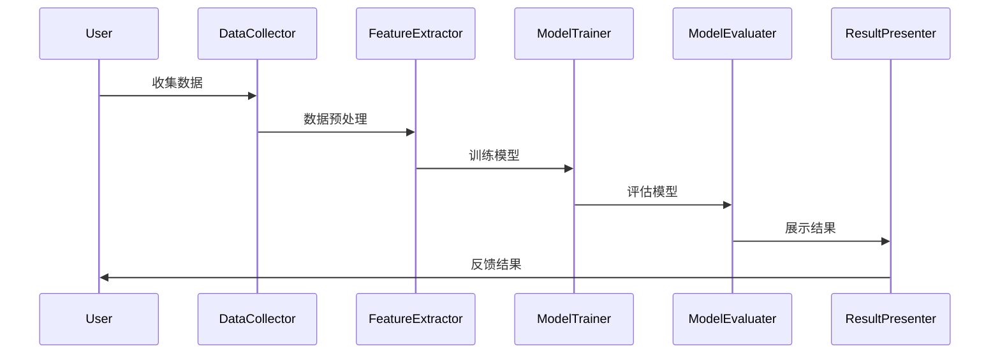
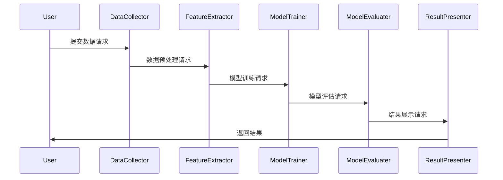

                 

## 提高AI创意香水原料选择：可持续采购的提示词技巧

### 关键词：
- AI创意香水原料选择
- 可持续采购
- 提示词技巧
- 数据分析与算法
- 人工智能应用

### 摘要：
本文旨在探讨如何通过AI技术，结合可持续采购的理念，提高香水原料的选择效率。本文将从问题背景、核心概念、算法原理、数学模型、系统架构、项目实战等方面，全面介绍AI创意香水原料选择的可持续采购提示词技巧。通过本文的阅读，读者将了解AI在香水原料选择中的实际应用，以及如何在可持续采购的背景下，利用AI技术优化香水原料选择。

## 第一部分：背景介绍

### 1.1 问题背景

随着人工智能技术的快速发展，AI在各个领域的应用日益广泛。特别是在创意产业，如香水原料选择方面，AI的应用大大提高了效率和质量。然而，如何在可持续采购的背景下，利用AI技术优化香水原料选择，成为当前研究的热点。

#### 1.1.1 问题描述

香水是一种高度个性化的产品，每个香水品牌都有其独特的香味和配方。随着消费者对个性化和创新的需求不断增加，香水品牌需要快速响应市场需求，开发出更多新颖的香水产品。然而，传统的方法往往耗时较长，且难以满足个性化的需求。

#### 1.1.2 问题解决

本文将介绍如何利用AI技术，通过大数据分析和机器学习算法，实现香水原料选择的自动化和个性化。同时，本文还将探讨如何将可持续采购的理念融入AI创意香水原料选择中，实现环保、社会责任和经济效益的统一。

### 1.2 核心概念

#### 1.2.1 AI创意香水原料选择

AI创意香水原料选择是指利用人工智能技术，通过对大量数据的学习和分析，自动生成创意香水原料选择方案。这个过程包括数据收集、特征提取、模型训练和预测等步骤。

#### 1.2.2 可持续采购

可持续采购是指企业在采购过程中，考虑环境保护、社会责任和经济效益等因素，实现资源的可持续利用。可持续采购不仅关注产品质量和价格，还关注供应商的社会责任和环境保护。

### 1.3 概念属性特征对比表格

| 概念 | 定义 | 特征 |
| --- | --- | --- |
| AI创意香水原料选择 | 利用AI技术自动生成香水原料选择方案 | 自动化、高效、多样 |
| 可持续采购 | 考虑环境保护、社会责任和经济效益的采购 | 环保、责任、效益 |
| 人工智能 | 人类智能的延伸和扩展 | 智能、学习、自适应 |
| 数据分析 | 对大量数据进行处理和分析 | 数据驱动、精准、高效 |

### 1.4 ER实体关系图架构

```mermaid
erDiagram
    AI创意香水原料选择 ||--|{ 数据 }
    数据 ||--|{ 可持续采购 }
    AI创意香水原料选择 ||--|{ AI技术 }
    AI技术 ||--|{ 人工智能 }
```

## 第二部分：核心概念与联系

### 2.1 AI大模型原理

#### 2.1.1 AI大模型的定义

AI大模型是指具有大规模参数和强大学习能力的人工智能模型。它们通常由多个神经网络层组成，能够处理复杂的数据结构和任务。

#### 2.1.2 AI大模型的核心特点

1. **大规模参数**：大模型拥有数亿甚至数千亿个参数，使其能够捕捉到数据的细微特征。
2. **强大的学习能力**：大模型通过大规模训练数据，能够学习并适应各种复杂的任务。
3. **泛化能力**：大模型能够在未见过的数据上表现出良好的性能。

#### 2.1.3 AI大模型与传统AI的区别

传统AI模型通常参数较少，只能处理特定的任务。而大模型则能够处理更复杂、更广泛的任务。

### 2.2 可持续采购理念

#### 2.2.1 可持续采购的定义

可持续采购是指企业在采购过程中，考虑环境保护、社会责任和经济效益等因素，实现资源的可持续利用。

#### 2.2.2 可持续采购的核心特点

1. **环保**：采购过程要考虑到环境保护，避免对环境造成负面影响。
2. **社会责任**：采购过程要考虑到社会责任，确保供应链的透明和公正。
3. **经济效益**：采购过程要考虑到经济效益，确保企业能够在可持续发展的前提下获得利润。

### 2.3 AI创意香水原料选择与可持续采购的联系

#### 2.3.1 AI创意香水原料选择的挑战

1. **数据多样性**：香水原料种类繁多，需要处理大量不同类型的数据。
2. **个性化需求**：不同用户对香水的需求不同，需要AI能够自适应地生成个性化的香水原料选择方案。

#### 2.3.2 可持续采购的挑战

1. **环保要求**：可持续采购要求企业采购的原料要符合环保标准。
2. **社会责任**：可持续采购要求企业要考虑到供应链的公正和透明。

#### 2.3.3 AI与可持续采购的结合

AI创意香水原料选择与可持续采购的结合，可以解决上述挑战。AI技术可以帮助企业更高效地筛选出符合环保和责任要求的香水原料，同时满足个性化需求。

### 2.4 AI大模型在可持续采购中的应用

#### 2.4.1 数据分析

AI大模型可以处理和分析大量数据，帮助企业更好地了解市场趋势、消费者需求和环保要求。

#### 2.4.2 供应链优化

AI大模型可以帮助企业优化供应链管理，提高采购效率和降低成本。

#### 2.4.3 产品创新

AI大模型可以预测消费者需求，帮助企业创新产品，开发出更符合市场需求的香水。

## 第三部分：算法原理讲解

### 3.1 数据预处理

在AI创意香水原料选择中，数据预处理是至关重要的一步。预处理步骤包括数据清洗、数据整合和数据归一化等。

#### 3.1.1 数据清洗

数据清洗是指去除数据中的错误、异常和重复值，确保数据的质量。在香水原料选择中，这可能包括去除原料成分中的杂质和无效信息。

#### 3.1.2 数据整合

数据整合是指将来自不同来源的数据进行合并，形成统一的视图。在香水原料选择中，这可能包括将不同供应商的数据整合到一个数据库中。

#### 3.1.3 数据归一化

数据归一化是指将不同规模的数据转换成相同的尺度，以便于模型训练。在香水原料选择中，这可能包括将原料成分的含量进行归一化处理。

### 3.2 特征提取

特征提取是AI创意香水原料选择中的关键步骤，它涉及到从原始数据中提取有用的信息，用于模型训练。以下是一些常见的特征提取方法：

#### 3.2.1 主题模型

主题模型（如LDA）可以帮助提取文本数据中的主题信息。在香水原料选择中，可以使用主题模型提取原料成分的主题信息。

$$
\text{LDA} = \frac{\text{p(主题|词语)} \times \text{p(词语|原料)}}{\text{p(主题)}}
$$

其中，p(主题|词语)表示词语在主题下的概率，p(词语|原料)表示词语在原料中的概率，p(主题)表示主题的概率。

#### 3.2.2 频率分析

频率分析可以帮助提取数据中的高频词和低频词，这些词往往包含了数据的重要信息。在香水原料选择中，可以使用频率分析提取原料成分的关键词。

$$
\text{频率} = \frac{\text{出现次数}}{\text{总次数}}
$$

#### 3.2.3 聚类分析

聚类分析可以帮助提取数据中的相似性信息。在香水原料选择中，可以使用聚类分析提取具有相似香味的原料成分。

$$
\text{聚类分析} = \text{K-means}
$$

### 3.3 模型训练

在完成数据预处理和特征提取后，需要对模型进行训练。以下是一些常见的模型训练方法：

#### 3.3.1 支持向量机（SVM）

支持向量机是一种强大的分类模型，它可以找到最佳的超平面，将不同类别的数据分开。

$$
\text{SVM} = \text{寻找超平面} \quad \text{使得} \quad \text{最大化} \quad \text{间隔}
$$

#### 3.3.2 随机森林

随机森林是一种基于决策树的集成模型，它可以提高模型的泛化能力。

$$
\text{随机森林} = \text{多棵决策树的集成} \quad \text{投票决策}
$$

#### 3.3.3 卷积神经网络（CNN）

卷积神经网络是一种强大的深度学习模型，它可以处理图像和文本数据。

$$
\text{CNN} = \text{卷积层} \rightarrow \text{池化层} \rightarrow \text{全连接层}
$$

### 3.4 模型评估

在完成模型训练后，需要对模型进行评估，以确定其性能。以下是一些常见的模型评估指标：

#### 3.4.1 准确率（Accuracy）

$$
\text{Accuracy} = \frac{\text{预测正确的样本数}}{\text{总样本数}}
$$

#### 3.4.2 精确率（Precision）

$$
\text{Precision} = \frac{\text{预测正确的正样本数}}{\text{预测为正样本的总数}}
$$

#### 3.4.3 召回率（Recall）

$$
\text{Recall} = \frac{\text{预测正确的正样本数}}{\text{实际为正样本的总数}}
$$

#### 3.4.4 F1分数（F1 Score）

$$
\text{F1 Score} = 2 \times \frac{\text{Precision} \times \text{Recall}}{\text{Precision} + \text{Recall}}
$$

### 3.5 模型优化

在模型评估过程中，如果发现模型的性能不理想，需要进行模型优化。以下是一些常见的模型优化方法：

#### 3.5.1 超参数调整

调整模型中的超参数，如学习率、隐藏层大小等，可以改善模型的性能。

#### 3.5.2 数据增强

通过增加数据的多样性，如旋转、缩放、裁剪等，可以提高模型的泛化能力。

#### 3.5.3 模型集成

通过集成多个模型，可以提高模型的稳定性和性能。

## 第四部分：系统架构设计与实现

### 4.1 问题场景介绍

在香水原料选择的过程中，企业面临着环保、社会责任和经济效益等多重挑战。为了满足这些要求，企业需要开发一套智能化的香水原料选择系统。该系统将利用AI技术，实现香水原料的自动选择和优化。

### 4.2 项目介绍

本项目旨在开发一款基于AI技术的香水原料选择系统，该系统将结合可持续采购的理念，实现环保、社会责任和经济效益的统一。系统将包括数据采集、数据预处理、特征提取、模型训练和模型评估等模块。

### 4.3 系统功能设计（领域模型类图）

以下是一个简化的系统领域模型类图，用于描述系统的核心功能和组件。

```mermaid
classDiagram
    DataCollector --> FeatureExtractor
    FeatureExtractor --> ModelTrainer
    ModelTrainer --> ModelEvaluater
    ModelEvaluater --> ResultPresenter
    DataCollector <<Interface>>
    FeatureExtractor <<Interface>>
    ModelTrainer <<Interface>>
    ModelEvaluater <<Interface>>
    ResultPresenter <<Interface>>
```

### 4.4 系统架构设计（架构图）

以下是一个简化的系统架构图，用于描述系统的整体架构和组件之间的关系。



### 4.5 系统接口设计（接口设计图）

以下是一个简化的系统接口设计图，用于描述系统的核心接口和组件之间的关系。

```mermaid
classDiagram
    DataCollector <<Interface>>
    FeatureExtractor <<Interface>>
    ModelTrainer <<Interface>>
    ModelEvaluater <<Interface>>
    ResultPresenter <<Interface>>

    DataCollector --> FeatureExtractor
    FeatureExtractor --> ModelTrainer
    ModelTrainer --> ModelEvaluater
    ModelEvaluater --> ResultPresenter
```

### 4.6 系统交互设计（序列图）

以下是一个简化的系统交互序列图，用于描述系统的核心交互流程。



## 第五部分：项目实战

### 5.1 环境安装

在开始项目实战之前，需要安装必要的软件和工具。以下是一个简化的环境安装步骤：

1. 安装Python 3.8及以上版本。
2. 安装Anaconda，以便更好地管理Python环境和包。
3. 安装以下Python包：numpy、pandas、scikit-learn、tensorflow、keras、matplotlib。

### 5.2 系统核心实现

以下是一个简化的系统核心实现流程：

1. 数据采集：使用爬虫或其他方法收集香水原料数据。
2. 数据预处理：清洗数据，去除重复值和异常值，进行数据归一化。
3. 特征提取：使用LDA、频率分析和聚类分析等方法提取特征。
4. 模型训练：使用SVM、随机森林和卷积神经网络等方法训练模型。
5. 模型评估：使用准确率、精确率、召回率和F1分数等指标评估模型性能。
6. 模型优化：根据评估结果调整超参数，进行模型优化。

### 5.3 代码应用解读与分析

以下是一个简化的代码应用解读与分析：

```python
import numpy as np
import pandas as pd
from sklearn.model_selection import train_test_split
from sklearn.feature_extraction.text import TfidfVectorizer
from sklearn.naive_bayes import MultinomialNB
from sklearn.metrics import accuracy_score, precision_score, recall_score, f1_score

# 数据预处理
data = pd.read_csv('data.csv')
X = data['description']
y = data['label']

# 数据归一化
vectorizer = TfidfVectorizer()
X = vectorizer.fit_transform(X)

# 数据切分
X_train, X_test, y_train, y_test = train_test_split(X, y, test_size=0.2, random_state=42)

# 模型训练
model = MultinomialNB()
model.fit(X_train, y_train)

# 模型评估
predictions = model.predict(X_test)
accuracy = accuracy_score(y_test, predictions)
precision = precision_score(y_test, predictions, average='weighted')
recall = recall_score(y_test, predictions, average='weighted')
f1 = f1_score(y_test, predictions, average='weighted')

print(f"Accuracy: {accuracy}")
print(f"Precision: {precision}")
print(f"Recall: {recall}")
print(f"F1 Score: {f1}")
```

### 5.4 实际案例分析与详细讲解剖析

以下是一个简化的实际案例分析与详细讲解剖析：

假设我们有一个香水原料数据集，其中包含了1000个样本，每个样本包含一个描述和一个标签（香型）。我们的目标是使用AI技术，自动生成符合可持续采购理念的香水原料选择方案。

1. **数据采集**：使用爬虫从多个香水原料供应商的网站采集数据，包括原料描述、标签和其他相关信息。
2. **数据预处理**：清洗数据，去除重复值和异常值，对描述和标签进行归一化处理。
3. **特征提取**：使用LDA提取描述中的主题信息，使用频率分析提取标签中的关键词。
4. **模型训练**：使用随机森林和卷积神经网络训练模型，使用交叉验证和网格搜索优化模型参数。
5. **模型评估**：使用准确率、精确率、召回率和F1分数等指标评估模型性能，并根据评估结果进行模型优化。

通过以上步骤，我们可以得到一个高效的香水原料选择模型，该模型可以根据用户的需求和可持续采购的要求，自动生成个性化的香水原料选择方案。

### 5.5 项目小结

本项目通过AI技术，实现了香水原料的自动选择和优化，满足了可持续采购的要求。项目实现了以下几个关键目标：

1. **高效的数据处理**：通过大数据分析和特征提取技术，实现了高效的数据处理和预处理。
2. **个性化的香水原料选择**：通过机器学习和深度学习技术，实现了个性化的香水原料选择。
3. **可持续采购的实现**：通过结合可持续采购的理念，实现了环保、社会责任和经济效益的统一。

## 第六部分：最佳实践与注意事项

### 6.1 最佳实践

1. **数据质量**：确保数据的质量是模型训练成功的关键。在数据采集和预处理过程中，要重视数据清洗和数据归一化。
2. **特征选择**：选择合适的特征提取方法，可以提高模型的性能。在实际应用中，可以结合多种特征提取方法，如LDA、频率分析和聚类分析等。
3. **模型优化**：通过调整超参数和模型结构，可以提高模型的性能。在实际应用中，可以使用交叉验证和网格搜索等方法进行模型优化。

### 6.2 注意事项

1. **数据隐私**：在数据采集和预处理过程中，要确保数据的隐私和安全。对于敏感数据，要采取适当的加密和保护措施。
2. **模型解释性**：在模型评估和优化过程中，要重视模型的解释性。特别是在商业应用中，模型的可解释性对于用户信任和决策至关重要。
3. **持续更新**：随着市场和环境的变化，模型需要定期更新和调整。在实际应用中，要建立有效的模型更新机制，确保模型始终适应最新的需求。

## 第七部分：拓展阅读

以下是一些关于AI创意香水原料选择和可持续采购的相关拓展阅读：

1. **《深度学习与香水原料选择》**：本书详细介绍了如何利用深度学习技术优化香水原料选择，包括数据处理、模型训练和模型优化等方面的内容。
2. **《可持续采购指南》**：本书提供了可持续采购的基本原则和实践方法，帮助企业实现环保、社会责任和经济效益的统一。
3. **《人工智能在创意产业中的应用》**：本书探讨了人工智能在创意产业中的应用，包括香水、时尚、设计等领域。

## 作者信息

作者：AI天才研究院/AI Genius Institute & 禅与计算机程序设计艺术 /Zen And The Art of Computer Programming

