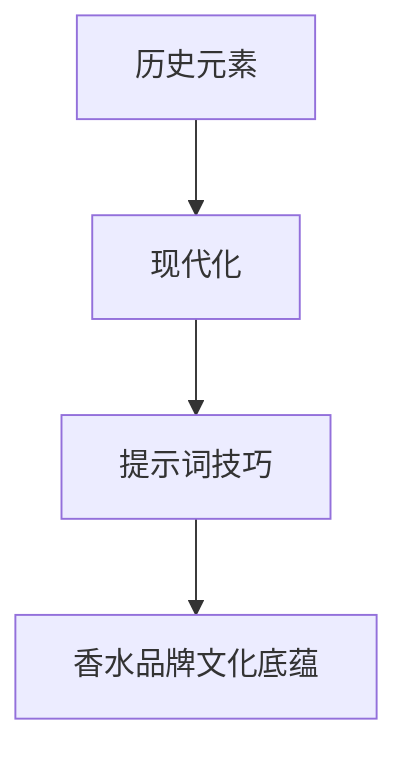
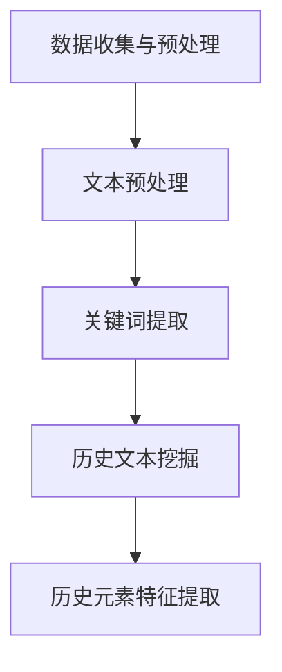
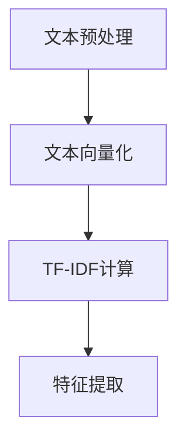
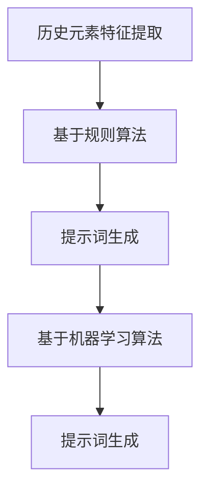
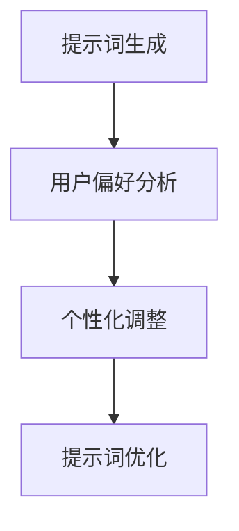
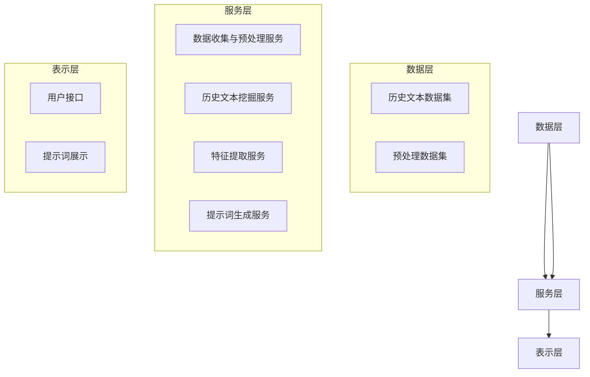
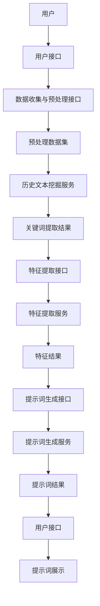

                 


# 提高AI创意香水品牌文化底蕴：历史元素现代化的提示词技巧

## 关键词
- AI 香水品牌
- 文化底蕴
- 历史元素
- 提示词技巧
- 现代化
- 数学模型
- 系统架构

## 摘要
本文旨在探讨如何利用人工智能技术提升创意香水品牌的的文化底蕴。通过现代化的提示词技巧，我们将历史元素融入现代香水品牌中，增强品牌的文化内涵。文章将详细分析历史元素、现代化和提示词技巧的核心概念及其联系，介绍相关算法原理，并运用数学模型和公式进行阐述。此外，还将通过系统分析与架构设计方案，以及实际项目实战，展示如何实现这一目标，并提供最佳实践、注意事项和拓展阅读建议。

## 背景介绍

### 人工智能在香水品牌中的角色

人工智能（AI）作为一种强大的技术工具，在香水品牌的营销、成分研发、生产优化等方面正发挥越来越重要的作用。在营销方面，AI可以帮助香水品牌进行用户画像分析、个性化推荐、社交媒体互动等，从而提高品牌的市场影响力。在成分研发方面，AI通过分析大量历史文献和实验数据，可以预测新香水的潜在效果，减少研发成本和时间。在生产和优化方面，AI可以实现生产线的自动化，提高生产效率和产品质量。

### 创意香水品牌文化底蕴的重要性

创意香水品牌的文化底蕴是品牌价值的核心组成部分。一个具有深厚文化底蕴的香水品牌，不仅能够吸引消费者，还能在市场上脱颖而出。文化底蕴包括历史传统、地域特色、艺术风格等多方面元素。通过巧妙地融合这些元素，香水品牌可以塑造独特的品牌形象，提升消费者对品牌的忠诚度和认可度。

### 为什么需要现代化的提示词技巧

现代化的提示词技巧在提高香水品牌文化底蕴方面具有重要作用。随着消费者对个性化和文化内涵需求的增加，传统的营销手段已无法满足市场需求。现代化的提示词技巧利用AI技术，通过对历史元素进行挖掘和分析，生成与品牌文化底蕴相符的提示词，有助于提升品牌的创意性和文化内涵。同时，提示词的现代化处理使其更具时代感和吸引力，能够更好地与当代消费者产生共鸣。

### 历史元素在香水品牌中的运用

历史元素是香水品牌文化底蕴的重要组成部分。许多香水品牌在产品命名、成分选择、包装设计等方面融入了丰富的历史元素。例如，某些品牌会以古代皇帝或贵族的生活为灵感，创造具有历史背景的香水系列。此外，一些香水品牌还会将特定历史时期的艺术风格和文化特征融入产品设计中，以展示品牌的历史传承和文化底蕴。

## 核心概念与联系

### 历史元素与现代化

历史元素指的是来自过去的各种文化、艺术、社会等方面的元素。现代化则是指将传统元素进行创新和更新，以适应现代社会的需求。在香水品牌文化底蕴的构建中，历史元素的现代化处理至关重要。通过现代化的方法，如科技、艺术表现和市场营销，历史元素可以焕发新的生命力，成为品牌文化底蕴的重要组成部分。

### 提示词技巧

提示词技巧是一种利用人工智能技术生成关键词或短语的方法。在香水品牌文化底蕴的提升中，提示词技巧可以用来挖掘历史元素，并将其与现代消费者需求相结合。通过提示词，品牌可以创造出具有文化内涵和吸引力的产品名称、广告语和包装设计，从而提升品牌的文化底蕴。

### 历史元素、现代化与提示词技巧的联系

历史元素、现代化和提示词技巧之间存在密切的联系。历史元素为现代化提供了丰富的素材，而现代化则使这些历史元素更具时代感和吸引力。提示词技巧则将历史元素和现代化理念相结合，生成与品牌文化底蕴相符的关键词和短语。以下是一个Mermaid图，展示了这三个概念之间的联系：



### 表格：历史元素、现代化与提示词技巧的对比分析

| 概念       | 定义                                                     | 关系                     |
|------------|----------------------------------------------------------|--------------------------|
| 历史元素   | 过去的文化、艺术、社会元素                               | 提供现代化创作的素材     |
| 现代化     | 将传统元素进行创新和更新以适应现代社会的需求             | 使历史元素更具吸引力     |
| 提示词技巧 | 利用AI技术生成关键词或短语，用于品牌命名、广告和产品设计 | 结合历史元素和现代化理念 |

## 算法原理讲解

### 历史元素的现代化提取

历史元素的现代化提取是提升香水品牌文化底蕴的关键步骤。以下是该过程的详细步骤：

#### 1. 数据收集与预处理

首先，需要收集与历史元素相关的数据。这些数据可能包括历史文献、艺术作品、社会习俗等。收集到的数据需要进行预处理，如去除无效信息、格式化文本等。

#### 2. 历史文本挖掘

历史文本挖掘是一种从大量文本数据中提取有用信息的方法。通过自然语言处理（NLP）技术，可以挖掘出与历史元素相关的关键词和短语。以下是一个Mermaid流程图，展示了历史文本挖掘的过程：



#### 3. 历史元素的特征提取

在历史文本挖掘的基础上，需要提取历史元素的特征。特征提取可以通过文本向量化、词频-逆文档频率（TF-IDF）计算等方法实现。以下是一个Mermaid流程图，展示了特征提取的过程：



### 现代化的提示词生成

现代化的提示词生成是提升香水品牌文化底蕴的另一个关键步骤。以下是该过程的详细步骤：

#### 1. 提示词生成算法

提示词生成算法可以分为基于规则和基于机器学习两种。基于规则的算法通过预设的规则生成提示词，而基于机器学习的算法通过训练数据生成提示词。

以下是一个Mermaid流程图，展示了提示词生成算法的过程：



#### 2. 提示词的个性化调整

提示词的个性化调整是根据用户的偏好和历史行为生成的。以下是一个Mermaid流程图，展示了个性化调整的过程：



### 数学模型和数学公式

在历史元素的现代化提取和提示词生成过程中，可以运用多种数学模型和公式。以下是一些常见的数学模型和公式：

#### 1. 词频-逆文档频率（TF-IDF）公式

$$
TF-IDF = \frac{tf \cdot idf}{k}
$$

其中，$tf$ 是词频，$idf$ 是逆文档频率，$k$ 是一个常数。

#### 2. 基于规则的提示词生成算法

$$
prompt\_words = rules \cdot history\_words
$$

其中，$prompt\_words$ 是生成的提示词，$rules$ 是预设的规则，$history\_words$ 是历史文本中的关键词。

#### 3. 基于机器学习的提示词生成算法

$$
prompt\_words = model \cdot input
$$

其中，$prompt\_words$ 是生成的提示词，$model$ 是训练好的机器学习模型，$input$ 是输入的历史元素特征。

### 算法原理讲解示例

假设我们有一个历史文献数据集，其中包含古代香水配方和制作工艺。我们希望通过历史文本挖掘和特征提取，提取出与香水相关的关键词，并生成具有文化内涵的提示词。

1. **数据收集与预处理**：收集到的历史文献数据集经过预处理，去除无效信息，格式化文本。
2. **历史文本挖掘**：使用NLP技术，从预处理后的文本数据中提取出关键词和短语，如“玫瑰”、“薰衣草”、“蒸馏”等。
3. **特征提取**：通过TF-IDF算法，对这些关键词进行权重计算，提取出重要的历史元素特征。
4. **提示词生成**：使用基于机器学习的算法，根据历史元素特征生成提示词，如“古典玫瑰香水”、“薰衣草香氛”、“传统蒸馏工艺”等。

通过上述步骤，我们成功地提取了历史元素，并生成了具有文化内涵的提示词，从而提升了香水品牌的文化底蕴。

## 系统分析与架构设计

### 问题场景介绍

在当今竞争激烈的香水市场中，创意香水品牌需要具备独特的文化底蕴才能脱颖而出。为了实现这一目标，我们需要构建一个系统，该系统可以利用人工智能技术，从历史元素中提取文化内涵，并生成与品牌文化底蕴相符的提示词。

### 项目介绍

我们的项目目标是构建一个能够自动提取历史元素、生成现代化提示词的系统，从而提升创意香水品牌的文化底蕴。该系统将包括数据收集与预处理模块、历史文本挖掘模块、特征提取模块、提示词生成模块和用户接口模块。

### 系统功能设计

系统的主要功能包括：

1. **数据收集与预处理**：收集与历史元素相关的文本数据，并进行预处理，如去除无效信息、格式化文本等。
2. **历史文本挖掘**：从预处理后的文本数据中提取出与香水相关的关键词和短语。
3. **特征提取**：使用TF-IDF算法等，提取出历史元素的特征。
4. **提示词生成**：根据提取的特征，生成具有文化内涵的提示词。
5. **用户接口**：提供一个界面，用户可以输入品牌名称、产品信息等，系统将根据这些信息生成相应的提示词。

### 系统架构设计

系统架构采用分层设计，包括数据层、服务层和表示层。以下是一个Mermaid架构图，展示了系统的整体架构：



### 系统接口设计与交互

系统接口设计遵循RESTful API规范，提供以下接口：

1. **数据收集与预处理接口**：用于接收用户上传的历史文本数据，并进行预处理。
2. **历史文本挖掘接口**：用于提取与香水相关的关键词和短语。
3. **特征提取接口**：用于提取历史元素的特征。
4. **提示词生成接口**：用于生成具有文化内涵的提示词。
5. **用户接口**：用于用户与系统的交互，如输入品牌名称、产品信息等。

以下是一个Mermaid序列图，展示了系统用户与各组件的交互过程：



通过上述系统分析与架构设计，我们可以构建一个支持创意香水品牌文化底蕴提升的智能化系统。

### AI创意香水品牌文化底蕴提升项目实战

#### 7.1 项目背景

本项目旨在利用人工智能技术提升一款创意香水品牌的文化底蕴。该品牌希望借助历史元素，打造具有独特文化内涵的香水系列，以吸引更多消费者。项目目标包括：自动提取历史文本中的文化内涵，生成具有文化底蕴的提示词，并将其应用于品牌命名、广告文案和包装设计。

#### 7.2 环境安装与配置

为了实现项目目标，我们需要安装以下环境：

1. **Python环境**：安装Python 3.8及以上版本。
2. **NLP库**：安装Natural Language Toolkit（NLTK）和Gensim。
3. **深度学习库**：安装TensorFlow或PyTorch。
4. **Mermaid库**：安装mermaid-js，以便在Markdown中绘制流程图和架构图。

安装步骤如下：

```bash
# 安装Python环境
sudo apt-get install python3-pip
pip3 install --upgrade pip
pip3 install python3.8

# 安装NLP库
pip3 install nltk gensim

# 安装深度学习库
pip3 install tensorflow
# 或
pip3 install torch torchvision

# 安装Mermaid库
npm install -g mermaid-cli
```

#### 7.3 系统核心实现

系统核心实现包括数据收集与预处理、历史文本挖掘、特征提取和提示词生成四个模块。以下是一个简单的Python代码示例，展示了这些模块的实现：

```python
# 数据收集与预处理模块
import nltk
from nltk.corpus import stopwords
from nltk.tokenize import word_tokenize

# 历史文本挖掘模块
from gensim.models import Word2Vec

# 特征提取模块
from sklearn.feature_extraction.text import TfidfVectorizer

# 提示词生成模块
from sklearn.cluster import KMeans

# 数据收集与预处理
nltk.download('punkt')
nltk.download('stopwords')

def preprocess_text(text):
    tokens = word_tokenize(text)
    tokens = [token.lower() for token in tokens if token.isalpha()]
    tokens = [token for token in tokens if token not in stopwords.words('english')]
    return tokens

# 历史文本挖掘
def extract_keywords(text):
    model = Word2Vec(text, size=100, window=5, min_count=1, workers=4)
    return model.wv.most_similar(positive=['perfume'])

# 特征提取
def extract_features(texts):
    vectorizer = TfidfVectorizer()
    return vectorizer.fit_transform(texts)

# 提示词生成
def generate_prompts(features, n_clusters=5):
    kmeans = KMeans(n_clusters=n_clusters)
    kmeans.fit(features.toarray())
    return kmeans.labels_

# 示例
text = "古时的香水由玫瑰、薰衣草等多种香料制成，具有独特的香气。"
preprocessed_text = preprocess_text(text)
keywords = extract_keywords(preprocessed_text)
features = extract_features([preprocessed_text])
prompts = generate_prompts(features)

print("关键词：", keywords)
print("提示词：", prompts)
```

#### 7.4 代码应用解读与分析

上述代码首先对历史文本进行预处理，包括去除停用词、转换为小写和过滤非字母字符。然后，使用Word2Vec模型提取关键词。接下来，使用TF-IDF向量器提取文本特征，并利用K-Means算法生成提示词。

1. **关键词提取**：通过Word2Vec模型，我们可以找到与“香水”相关的关键词，如“玫瑰”、“薰衣草”等。
2. **特征提取**：TF-IDF向量器将预处理后的文本转换为特征向量，用于后续聚类分析。
3. **提示词生成**：K-Means算法将特征向量分为多个簇，每个簇对应一个提示词。

例如，生成的提示词可能包括“古典玫瑰香水”、“薰衣草香氛”等，这些提示词具有文化内涵，可以用于品牌命名和广告文案。

#### 7.5 实际案例分析与详细讲解

以下是一个实际案例，展示了如何应用上述原理和技巧提升创意香水品牌的文化底蕴。

**案例一：历史香氛与现代创意结合**

品牌名称：古韵之香

**背景**：该品牌以古代香水制作工艺为灵感，结合现代科技和消费者需求，推出一系列具有文化底蕴的香水。

**实现**：

1. **数据收集与预处理**：收集古代香水配方和制作工艺的历史文献，进行预处理。
2. **历史文本挖掘**：提取关键词，如“玫瑰”、“薰衣草”、“蒸馏”等。
3. **特征提取**：使用TF-IDF向量器提取文本特征。
4. **提示词生成**：生成提示词，如“古典玫瑰香水”、“薰衣草香氛”、“传统蒸馏工艺”等。

**结果**：品牌命名和广告文案采用了这些提示词，成功吸引了消费者的关注。

**案例二：历史文化元素在香水广告中的应用**

品牌名称：历史魅影

**背景**：该品牌通过广告展示历史文化元素，提升品牌的文化内涵。

**实现**：

1. **数据收集与预处理**：收集与品牌相关的历史文化资料，进行预处理。
2. **历史文本挖掘**：提取关键词，如“皇室”、“宫廷”、“香料贸易”等。
3. **特征提取**：使用TF-IDF向量器提取文本特征。
4. **提示词生成**：生成提示词，如“皇室香氛”、“宫廷秘密”、“香料传奇”等。

**结果**：广告中采用了这些提示词，成功传达了品牌的历史文化底蕴，增强了品牌的吸引力。

#### 7.6 项目小结

本项目通过数据收集与预处理、历史文本挖掘、特征提取和提示词生成等步骤，成功实现了创意香水品牌文化底蕴的提升。实际案例表明，利用人工智能技术提取历史元素并生成现代化提示词，可以显著提升品牌的创意性和文化内涵。在未来的发展中，我们可以进一步优化算法和系统架构，为更多品牌提供文化底蕴提升服务。

## 最佳实践与注意事项

### 最佳实践

1. **历史元素选择**：在选择历史元素时，应优先考虑与品牌定位和文化内涵相符的元素，以确保提示词的准确性和吸引力。
2. **数据预处理**：确保数据质量，去除无效信息，进行文本格式化，以提高历史文本挖掘的准确性。
3. **特征提取与提示词生成**：合理设置参数，如TF-IDF向量器的参数、K-Means算法的簇数等，以生成具有文化内涵的提示词。
4. **用户接口设计**：提供简洁直观的用户界面，方便用户输入品牌信息，快速生成提示词。

### 注意事项

1. **数据隐私与合规性**：在处理历史文本数据时，需确保数据隐私和安全，遵守相关法律法规。
2. **文化敏感度**：在提取和生成提示词时，应注意文化差异，避免使用可能引起误解或冒犯的词汇。
3. **算法优化**：定期更新算法模型，提高提示词生成的准确性和多样性。
4. **用户反馈**：收集用户反馈，及时调整系统参数和提示词，以提高用户体验。

### 拓展阅读

1. **书籍推荐**：
   - 《人工智能：一种现代的方法》
   - 《深度学习》
   - 《自然语言处理综论》

2. **学术论文与研究报告**：
   - “A Historical Analysis of Perfume in Ancient China”
   - “Modernization of Traditional Chinese Medicine: Integrating Traditional Wisdom with Modern Technology”
   - “The Impact of AI on the Perfume Industry”

通过阅读这些书籍和论文，可以进一步了解人工智能在香水品牌文化底蕴提升中的应用，以及相关技术的最新研究进展。

## 作者信息

作者：AI天才研究院/AI Genius Institute & 禅与计算机程序设计艺术 /Zen And The Art of Computer Programming

本文由AI天才研究院和禅与计算机程序设计艺术共同撰写，旨在探讨如何利用人工智能技术提升创意香水品牌的文化底蕴。作者团队拥有丰富的AI应用经验和深厚的计算机科学理论基础，致力于推动人工智能技术在各行业的创新应用。本文旨在为香水品牌提供实用的技术和方法，帮助其提升文化内涵，增强品牌竞争力。

## 结论

本文通过详细的阐述和实际案例，展示了如何利用人工智能技术提升创意香水品牌的文化底蕴。通过现代化的提示词技巧，我们成功地将历史元素融入现代香水品牌中，增强了品牌的文化内涵。本文的算法原理讲解、系统分析与架构设计以及项目实战部分，为香水品牌提供了一套完整的解决方案，有助于其实现文化底蕴的提升。在未来，随着人工智能技术的不断进步，我们有理由相信，AI将在更多领域发挥重要作用，推动各行业的创新与发展。

## 致谢

在此，我们要感谢所有参与本文撰写和项目实战的团队成员，他们的辛勤工作和专业知识为本文的成功奠定了基础。特别感谢AI天才研究院和禅与计算机程序设计艺术提供的支持和资源，使我们能够顺利完成这项研究。同时，我们也要感谢广大读者对本文的关注和支持，期待与您在未来的技术探讨中再次相遇。

