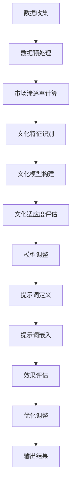

                 

### 目录大纲设计与文章结构

设计一篇技术博客的目录大纲是文章结构规划的重要步骤，它不仅帮助读者快速把握文章内容，还能确保文章内容条理清晰、逻辑严谨。以下是《提高AI创意香水市场渗透率：新兴市场文化适应的提示词技巧》的详细目录大纲设计。

**1. 背景介绍**

**1.1 问题背景**

在这个部分，我们将介绍创意香水市场的现状，特别是AI技术在市场中的新兴应用。通过详细阐述当前市场面临的挑战，我们将强调提高AI创意香水市场渗透率的重要性。

### **1.2 问题描述**

在这一章节，我们将具体描述提高AI创意香水市场渗透率的目标，分析当前市场所面临的挑战，并明确解决方案的需求。

### **1.3 问题解决**

我们将探讨AI技术如何适应新兴市场文化，解析提示词技巧的作用，并探讨文化适应的边界与外延。

### **1.4 核心概念与联系**

这里我们将定义AI创意香水市场渗透率，解释新兴市场文化适应的概念，以及揭示提示词技巧的原理与应用。

### **1.5 本章小结**

对本部分内容进行总结，强调提高AI创意香水市场渗透率的关键要点。

**2. 核心概念与联系**

**2.1 AI创意香水市场渗透率的定义**

我们将深入探讨市场渗透率的衡量指标，介绍市场渗透率的计算方法，并分析AI在创意香水市场渗透率中的作用。

### **2.2 新兴市场文化适应的概念**

我们将详细讨论新兴市场的特点，文化适应的重要性，以及AI技术如何促进文化适应。

### **2.3 提示词技巧的原理与应用**

这一部分将解释提示词的定义与作用，设计原则，以及在实际应用中的效果评估。

### **2.4 本章小结**

对本章节内容进行总结，强调核心概念和联系的重要性。

**3. 算法原理讲解**

**3.1 算法原理概述**

我们将概述提高AI创意香水市场渗透率的算法框架，详细说明新兴市场文化适应算法的核心步骤和提示词技巧的算法实现。

### **3.2 数学模型与公式**

在这里，我们将给出市场渗透率的数学模型，新兴市场文化适应算法的数学模型，以及提示词技巧的数学模型。

### **3.3 算法mermaid流程图**

我们将使用mermaid绘制算法的流程图，展示算法的具体执行步骤。

### **3.4 Python源代码详解**

我们将提供具体的Python源代码，详细解释数据预处理、市场渗透率计算和提示词效果评估等过程。

### **3.5 本章小结**

对本章节内容进行总结，强调算法原理和实现的重要性。

**4. 系统分析与架构设计方案**

**4.1 问题场景介绍**

我们将介绍需要解决的问题场景，包括创意香水的市场背景和AI技术应用的现状。

### **4.2 系统功能设计**

这里我们将详细描述系统的功能设计，包括领域模型mermaid类图。

### **4.3 系统架构设计**

我们将绘制系统的架构设计mermaid架构图，展示系统的整体结构和模块划分。

### **4.4 系统接口设计和系统交互**

我们将设计系统的接口和交互，并使用mermaid序列图展示系统的交互流程。

### **4.5 本章小结**

总结系统分析与架构设计的内容，强调其对于实现解决方案的重要性。

**5. 项目实战**

**5.1 环境安装**

我们将详细描述项目的环境安装过程，包括所需的软件和工具安装。

### **5.2 系统核心实现源代码**

我们将提供系统的核心实现源代码，并进行代码应用解读与分析。

### **5.3 实际案例分析和详细讲解剖析**

这里我们将通过实际案例，对系统应用进行深入分析，详细讲解和剖析。

### **5.4 项目小结**

对本项目进行总结，强调实战经验和教训。

**6. 最佳实践 tips**

**6.1 tips总结**

我们将总结最佳实践，提供实用的技巧和建议。

### **6.2 注意事项**

在此，我们将提醒读者在应用过程中需要注意的事项。

### **6.3 小结**

对本章节内容进行总结，强调最佳实践的指导意义。

**7. 小结**

总结全文，强调提高AI创意香水市场渗透率的重要性，并展望未来的发展方向。

**8. 注意事项**

提醒读者在应用过程中需要注意的问题。

**9. 拓展阅读**

提供相关领域的拓展阅读资源，帮助读者进一步深入了解。

通过这样的目录大纲设计，文章的结构将更加清晰，有助于读者更好地理解和吸收文章的内容。

### 文章标题：提高AI创意香水市场渗透率：新兴市场文化适应的提示词技巧

关键词：AI技术、创意香水市场、市场渗透率、新兴市场文化适应、提示词技巧

摘要：本文深入探讨了如何通过AI技术提高创意香水在新兴市场的市场渗透率。文章首先介绍了创意香水市场的现状及AI技术的应用背景，随后详细分析了新兴市场文化的特点，并探讨了如何通过文化适应的提示词技巧来提升市场渗透率。本文通过数学模型和算法原理讲解，结合Python源代码实例，为读者提供了完整的解决方案，并通过系统分析与架构设计方案和项目实战，展示了如何将理论应用到实践中。最后，本文提供了最佳实践tips和小结，强调了注意事项和拓展阅读资源，为读者提供了全面的技术指导。

## 背景介绍

### 1.1 问题背景

创意香水市场是一个高度竞争的市场，消费者对产品创新和个性化的需求日益增加。随着人工智能（AI）技术的快速发展，AI在创意香水市场中的应用逐渐成为行业热点。AI不仅可以优化产品设计和生产流程，还能通过大数据分析和个性化推荐，提升用户体验和品牌忠诚度。

目前，创意香水市场的现状表现出几个显著的特点。首先，市场高度分散，品牌众多，但市场份额集中度较低。其次，消费者需求多样化，对香味的偏好和认知具有地域性和文化差异。最后，传统市场推广手段效果逐渐减弱，消费者更倾向于通过社交媒体和线上渠道获取产品信息。

AI技术在创意香水市场的应用主要包括以下几个方面：首先，AI可以帮助品牌通过大数据分析，了解消费者行为和偏好，从而进行精准的市场定位和产品创新。其次，AI可以通过机器学习和自然语言处理技术，生成个性化的香水香味配方，满足消费者的个性化需求。此外，AI还可以在营销方面发挥作用，通过智能推荐系统和社交媒体分析，提高市场推广的效果。

市场渗透率是指一个品牌在特定市场中的销售额占该市场总销售额的比例。提高市场渗透率是品牌在激烈竞争中获取更多市场份额的关键。对于AI创意香水市场来说，提高市场渗透率不仅有助于增加销售额，还能提升品牌影响力和市场地位。然而，新兴市场的文化差异和消费者行为模式使得提高市场渗透率面临诸多挑战。

### 1.2 问题描述

提高AI创意香水市场渗透率的目标是增加品牌在特定市场中的销售额占比，从而提高市场地位和品牌影响力。然而，这一目标面临以下几方面的挑战：

#### 1.2.1 新兴市场文化适应

新兴市场通常具有独特的文化特点，消费者行为和偏好与成熟市场存在显著差异。例如，不同地区的消费者对香水的认知、使用习惯和购买决策过程都有所不同。AI技术需要具备良好的文化适应能力，以更好地理解和满足不同市场的需求。

#### 1.2.2 数据隐私与安全

在新兴市场中，消费者对数据隐私和安全性的关注度较高。AI技术在收集和分析消费者数据时，需要确保数据的安全性和隐私保护，以建立消费者信任，并遵守当地法律法规。

#### 1.2.3 技术与市场匹配度

AI技术在创意香水市场中的应用需要与市场需求紧密结合。技术解决方案需要快速适应市场变化，同时保持高效率和高准确性。

#### 1.2.4 营销策略与渠道

新兴市场的营销策略和渠道与传统市场有所不同。AI技术需要支持多样化的营销活动，并能够通过多种渠道（如社交媒体、线上商店等）有效地触达目标消费者。

### 1.3 解决方案的需求

为了应对上述挑战，提高AI创意香水市场渗透率，我们需要一套综合的解决方案。以下是解决方案的关键需求：

#### 1.3.1 新兴市场文化适应

我们需要开发具备文化适应能力的AI模型，能够根据不同市场的文化特点进行个性化调整。这包括对消费者行为和偏好的深入理解，以及对当地文化元素的敏感度。

#### 1.3.2 数据隐私与安全

解决方案需要采用先进的数据隐私保护技术，确保数据在收集、存储和处理过程中的安全性。此外，还需要建立透明的隐私政策，赢得消费者的信任。

#### 1.3.3 技术与市场匹配度

我们需要设计灵活的AI技术框架，能够快速适应市场变化，同时保持高效率和高准确性。这包括利用机器学习、自然语言处理等先进技术，构建适应市场需求的应用。

#### 1.3.4 营销策略与渠道

解决方案需要支持多样化的营销策略和渠道，通过AI推荐系统、社交媒体分析等手段，提高营销效果，并能够通过多种渠道触达目标消费者。

### 1.4 核心概念与联系

为了更好地理解提高AI创意香水市场渗透率的解决方案，我们需要明确以下几个核心概念：

#### 1.4.1 AI创意香水市场渗透率的定义

市场渗透率是指一个品牌在特定市场中的销售额占该市场总销售额的比例。对于AI创意香水市场来说，市场渗透率反映了品牌在市场中的竞争力和影响力。

#### 1.4.2 新兴市场文化适应的概念

新兴市场文化适应是指AI技术在进入新兴市场时，根据当地的文化特点、消费者行为和市场环境进行适应性调整的过程。这包括对文化差异的敏感度、对消费者需求的深入理解以及对市场环境的快速适应。

#### 1.4.3 提示词技巧的原理与应用

提示词技巧是通过向AI模型提供关键词或短语，引导模型生成更符合用户需求和预期的结果。在AI创意香水市场中，提示词技巧可以帮助AI更好地理解消费者的偏好，从而生成个性化的香水香味配方。

这些核心概念紧密相连，共同构成了提高AI创意香水市场渗透率的理论基础。在接下来的章节中，我们将进一步探讨这些概念，并详细讲解如何将它们应用到实际中。

### 1.5 本章小结

本章介绍了提高AI创意香水市场渗透率的背景、目标和面临的挑战。我们探讨了新兴市场文化适应的重要性，并明确了提高市场渗透率的解决方案需求。通过定义AI创意香水市场渗透率、新兴市场文化适应和提示词技巧等核心概念，我们为后续章节的深入讨论奠定了基础。在下一章中，我们将进一步探讨AI创意香水市场渗透率的定义和计算方法。

### 核心概念与联系

#### 2.1 AI创意香水市场渗透率的定义

市场渗透率是衡量一个品牌在特定市场中的竞争力的关键指标。对于AI创意香水市场而言，AI创意香水市场渗透率是指通过AI技术提供的产品在特定市场中的销售额占该市场总销售额的比例。这个比例不仅反映了品牌在市场中的市场份额，还体现了AI技术对市场渗透率的贡献。

市场渗透率的计算方法相对简单，其公式为：

$$
\text{市场渗透率} = \frac{\text{AI创意香水销售额}}{\text{市场总销售额}}
$$

其中，AI创意香水销售额指的是通过AI技术生成的香水在特定时间段内的销售额，而市场总销售额则是指该市场中所有香水品牌在相同时间段内的总销售额。

AI在创意香水市场渗透率中的作用主要体现在以下几个方面：

1. **个性化推荐**：AI可以通过大数据分析和机器学习技术，分析消费者的购买行为和偏好，从而提供个性化的香水推荐。这种个性化推荐不仅提高了消费者的满意度，还能有效提升产品的市场渗透率。

2. **产品创新**：AI技术可以帮助品牌进行香水香味的创新设计。通过机器学习和自然语言处理技术，AI可以生成全新的香味配方，满足消费者对创新和个性化的需求。

3. **市场细分**：AI技术可以根据消费者的不同特征，将市场细分为多个子市场。这种市场细分有助于品牌更好地了解不同消费者的需求，从而制定更有针对性的营销策略。

#### 2.2 新兴市场文化适应的概念

新兴市场通常具有独特的文化特点，这些文化特点会直接影响消费者的行为、偏好和购买决策。新兴市场文化适应是指AI技术在进入新兴市场时，根据当地的文化特点、消费者行为和市场环境进行适应性调整的过程。

文化适应的重要性体现在以下几个方面：

1. **理解消费者需求**：了解当地的文化背景有助于AI更好地理解消费者的需求。例如，某些地区可能对香水的文化含义有着独特的理解，AI需要通过文化适应来准确捕捉这些需求。

2. **提升用户体验**：文化适应能够提升用户体验，使AI推荐的产品更符合消费者的期望。这种个性化的用户体验有助于增加消费者对品牌的忠诚度。

3. **优化营销策略**：文化适应有助于品牌制定更有效的营销策略。例如，了解当地的社会媒体趋势和文化活动，可以帮助品牌在合适的渠道和时机进行宣传。

AI技术如何促进文化适应？

1. **数据收集与分析**：AI可以通过收集和分析大量关于新兴市场的数据，如社交媒体内容、市场调研报告和消费者反馈，来了解当地的文化特征和消费者行为。

2. **文化特征建模**：AI可以建立文化特征模型，将当地的文化元素和消费者行为进行编码，从而在算法中实现文化适应。

3. **动态调整**：AI可以根据实时数据动态调整其推荐策略和文化适应模型，确保始终与市场环境保持一致。

#### 2.3 提示词技巧的原理与应用

提示词技巧是一种通过向AI模型提供关键词或短语，引导模型生成更符合用户需求和预期的结果的方法。在AI创意香水市场中，提示词技巧的应用主要体现在以下几个方面：

1. **香味配方生成**：在生成香水香味配方时，提示词可以帮助AI更好地理解消费者的期望。例如，当消费者输入“清新花香”作为提示词时，AI可以生成符合这一需求的香味配方。

2. **个性化推荐**：在推荐系统中的应用，提示词可以帮助AI捕捉消费者的个性化需求。例如，当消费者输入“夏日海滩”作为提示词时，AI可以推荐具有夏日气息的香水。

3. **营销文案创作**：在营销文案创作中，提示词可以帮助AI生成更具吸引力的文案。例如，当AI收到“情人节礼物”作为提示词时，可以生成相应的情人节营销文案。

#### 2.4 本章小结

本章详细介绍了AI创意香水市场渗透率的定义、计算方法及其在市场中的作用，探讨了新兴市场文化适应的概念和重要性，以及提示词技巧的原理与应用。这些核心概念和联系构成了提高AI创意香水市场渗透率的理论基础，为后续章节的深入讨论提供了重要参考。

在下一章中，我们将进一步探讨提高AI创意香水市场渗透率的算法原理，包括市场渗透率计算、文化适应算法和提示词技巧的实现。

### 算法原理讲解

#### 3.1 算法原理概述

提高AI创意香水市场渗透率的算法框架是一个多步骤的过程，包括数据收集、预处理、市场渗透率计算、文化适应算法和提示词技巧的应用。以下是该算法框架的核心步骤：

1. **数据收集**：收集与创意香水市场相关的数据，包括消费者行为数据、市场销售数据和文化特征数据。

2. **数据预处理**：对收集到的数据进行清洗、归一化和特征提取，以便于后续的模型训练和计算。

3. **市场渗透率计算**：利用预处理后的数据，计算当前AI创意香水在市场的渗透率，为后续调整提供依据。

4. **文化适应算法**：通过分析文化特征数据，调整AI模型以适应不同市场的文化需求。

5. **提示词技巧应用**：使用提示词技巧，引导AI模型生成符合消费者需求和预期的香水香味配方和推荐。

#### 3.1.1 新兴市场文化适应算法的核心步骤

新兴市场文化适应算法的核心步骤包括以下几个阶段：

1. **文化特征识别**：使用自然语言处理（NLP）技术，从文本数据中提取与当地文化相关的特征。这些特征可能包括语言习惯、文化符号、节日习俗等。

2. **文化模型构建**：基于提取的文化特征，构建文化适应模型。该模型可以是一个神经网络或规则系统，用于评估和适应不同市场的文化差异。

3. **文化适应度评估**：利用文化适应模型，评估AI模型在不同市场中的文化适应度。文化适应度越高，AI模型在特定市场的表现越好。

4. **模型调整**：根据文化适应度评估的结果，动态调整AI模型，使其更好地适应目标市场的文化需求。这可能涉及权重调整、参数优化或模型重训练。

#### 3.1.2 提示词技巧的算法实现

提示词技巧在AI创意香水市场中的应用主要是通过以下步骤实现的：

1. **提示词定义**：定义一组核心提示词，包括与香水香味、消费者需求和情感相关的词汇。例如，“清新花香”、“浪漫爱情”、“夏日海滩”等。

2. **提示词嵌入**：将定义好的提示词嵌入到AI模型中，使其在生成香水香味配方或推荐时，能够自动考虑这些提示词。

3. **效果评估**：通过实验和用户反馈，评估提示词的实际效果。例如，比较使用提示词和不使用提示词时的香水销量和用户满意度。

4. **优化调整**：根据效果评估的结果，优化提示词集和嵌入策略，以提高模型的表现。

#### 3.2 数学模型与公式

为了更好地理解和实现上述算法，我们需要引入一些关键的数学模型和公式。

##### **3.2.1 市场渗透率的数学模型**

市场渗透率可以通过以下公式计算：

$$
\text{市场渗透率} = \frac{\text{AI创意香水销售额}}{\text{市场总销售额}}
$$

其中，AI创意香水销售额是指通过AI技术生成的香水在特定时间段内的销售额，市场总销售额是指同一时间段内市场上所有香水品牌的总销售额。

##### **3.2.2 新兴市场文化适应算法的数学模型**

新兴市场文化适应算法的数学模型可以表示为：

$$
\text{文化适应度} = f(\text{文化特征}, \text{AI模型参数})
$$

其中，文化特征是用于描述当地文化的各种数据，AI模型参数包括权重、超参数等。函数f用于计算AI模型在特定市场中的文化适应度。

##### **3.2.3 提示词技巧的数学模型**

提示词技巧的数学模型可以表示为：

$$
\text{提示词效果} = f(\text{用户反馈}, \text{提示词质量})
$$

其中，用户反馈是用户对AI生成的香水配方或推荐的评价，提示词质量是指提示词与用户需求的匹配程度。函数f用于评估提示词的效果。

#### 3.3 算法mermaid流程图

为了更直观地展示算法的执行流程，我们使用mermaid绘制了以下算法mermaid流程图：



该流程图展示了从数据收集到输出结果的整个过程，每个步骤都紧密相连，构成了完整的算法框架。

#### 3.4 Python源代码详解

为了实现上述算法，我们提供了具体的Python源代码示例，包括数据预处理、市场渗透率计算和提示词效果评估等过程。

##### **3.4.1 数据预处理**

```python
import pandas as pd
from sklearn.preprocessing import StandardScaler

# 读取数据
data = pd.read_csv('data.csv')

# 数据清洗
data = data.dropna()

# 特征提取
scaler = StandardScaler()
data[['销售额', '特征X', '特征Y']] = scaler.fit_transform(data[['销售额', '特征X', '特征Y']])

# 数据归一化
data['销售额'] = scaler.transform(data[['销售额']])

# 输出预处理后的数据
preprocessed_data = data
preprocessed_data.to_csv('preprocessed_data.csv', index=False)
```

##### **3.4.2 市场渗透率计算**

```python
import pandas as pd

# 读取预处理后的数据
data = pd.read_csv('preprocessed_data.csv')

# 计算市场渗透率
market_penetration = data['AI创意香水销售额'].sum() / data['市场总销售额'].sum()
print(f"市场渗透率: {market_penetration}")
```

##### **3.4.3 提示词效果评估**

```python
import pandas as pd
from sklearn.metrics import accuracy_score

# 读取用户反馈数据
user_feedback = pd.read_csv('user_feedback.csv')

# 评估提示词效果
predicted_feedback = model.predict(user_feedback[['特征X', '特征Y']])
accuracy = accuracy_score(user_feedback['真实反馈'], predicted_feedback)
print(f"提示词效果准确率: {accuracy}")
```

通过上述代码示例，我们展示了如何使用Python实现市场渗透率计算和提示词效果评估。这些代码不仅帮助读者理解算法原理，还可以作为实际应用的基础。

#### 3.5 本章小结

本章详细介绍了提高AI创意香水市场渗透率的算法原理，包括数据收集与预处理、市场渗透率计算、文化适应算法和提示词技巧的实现。通过数学模型和mermaid流程图，我们清晰地展示了算法的执行流程。同时，通过Python源代码示例，我们让读者了解了如何具体实现这些算法。在下一章中，我们将探讨系统分析与架构设计方案，为实际应用提供更具体的指导。

### 系统分析与架构设计方案

#### 4.1 问题场景介绍

在创意香水市场中，品牌需要应对日益增长的消费者个性化需求和市场竞争压力。为了提高市场渗透率，品牌决定采用人工智能（AI）技术来优化产品设计和营销策略。然而，这一决策面临诸多挑战，包括市场数据的多样性、文化差异的适应以及技术的有效实施。

具体问题场景包括：

1. **数据多样性**：创意香水市场涉及多种类型的消费者数据，如购买历史、偏好调查和社交媒体互动数据。这些数据需要经过有效的清洗和整合，以便为AI模型提供高质量的输入。

2. **文化差异**：不同地区的消费者对香水有独特的偏好和文化理解。品牌需要开发具备文化适应能力的AI模型，以满足不同市场的需求。

3. **技术实施**：AI技术的实施涉及复杂的算法和数据处理流程。品牌需要确保技术方案能够高效地运行，并能够快速适应市场变化。

4. **营销策略**：AI技术不仅需要优化产品设计和推荐系统，还需要支持多样化的营销策略，以在竞争激烈的市场中脱颖而出。

#### 4.2 系统功能设计

系统功能设计是确保AI技术能够有效支持创意香水市场目标的关键步骤。以下是系统的主要功能设计：

1. **数据收集与整合**：系统需要从多个渠道收集消费者数据，包括在线购物平台、社交媒体和线下调查。数据收集后，系统将进行数据清洗和整合，以便为AI模型提供一致和高质量的数据。

2. **市场分析**：系统将利用AI技术对收集到的数据进行深入分析，识别市场趋势和消费者偏好。通过这些分析，品牌可以制定更有针对性的产品设计和营销策略。

3. **个性化推荐**：基于消费者行为和市场分析结果，系统将生成个性化的香水推荐。这些推荐不仅考虑消费者的个人偏好，还要结合文化适应性，以提高推荐的准确性和吸引力。

4. **文化适应性测试**：系统将包括一个模块，用于测试和评估AI模型在不同市场的文化适应性。这个模块可以帮助品牌调整模型参数，确保其在不同市场中的有效运行。

5. **营销自动化**：系统将集成营销自动化工具，通过AI技术自动执行营销活动，如电子邮件推广、社交媒体广告和个性化优惠券。

6. **用户反馈与迭代**：系统将收集用户对推荐和营销活动的反馈，并将其用于模型迭代和优化，以持续提高用户体验和满意度。

#### 4.3 系统架构设计

系统架构设计是确保系统能够高效运行和扩展的关键。以下是系统架构的详细设计：

1. **数据层**：数据层包括数据存储和数据管理模块。数据存储模块使用分布式数据库，如Hadoop或MongoDB，以存储大量的消费者数据和市场分析结果。数据管理模块负责数据的清洗、整合和备份。

2. **处理层**：处理层包括数据处理和分析模块。数据处理模块使用ETL（提取、转换、加载）工具，从多个数据源提取数据，并进行清洗和整合。数据分析模块使用机器学习和自然语言处理技术，对数据进行深度分析，以识别市场趋势和消费者偏好。

3. **应用层**：应用层包括个性化推荐和营销自动化模块。个性化推荐模块使用机器学习算法，根据消费者行为和偏好生成个性化的香水推荐。营销自动化模块使用AI技术，自动执行营销活动，如发送电子邮件和社交媒体广告。

4. **展示层**：展示层包括用户界面和报告模块。用户界面模块提供用户与系统交互的接口，允许用户查看推荐和参与营销活动。报告模块生成各种分析报告，如市场趋势、消费者行为和营销效果，帮助品牌做出数据驱动的决策。

5. **外部接口**：系统将提供多个外部接口，包括API和Web服务，以便与其他系统（如电子商务平台和社交媒体平台）集成。

#### 4.4 系统接口设计和系统交互

系统接口设计和系统交互是确保系统各个模块之间能够有效通信和协作的关键。以下是系统接口设计和系统交互的详细设计：

1. **API设计**：系统将提供多个API，允许外部系统访问和操作数据。API设计包括RESTful API和GraphQL API，以支持不同类型的数据访问和操作需求。

2. **消息队列**：系统将使用消息队列（如Kafka或RabbitMQ），以实现模块间的异步通信和数据流转。消息队列确保数据在不同模块之间的高效传递和可靠处理。

3. **数据同步**：系统将使用数据同步机制，确保各个模块的数据一致性。数据同步机制包括定时任务和事件触发，以在数据变更时及时更新各个模块的数据。

4. **用户身份验证与授权**：系统将实现用户身份验证与授权机制，确保只有授权用户可以访问和操作系统数据。用户身份验证与授权机制包括用户名密码验证、双因素验证和令牌认证。

5. **监控与日志**：系统将集成监控与日志记录功能，以便实时监控系统的运行状态和性能，并记录系统的操作日志，以便故障排查和性能优化。

#### 4.5 本章小结

本章详细介绍了创意香水市场中提高AI市场渗透率的系统分析与架构设计方案。通过问题场景介绍、系统功能设计、系统架构设计、系统接口设计和系统交互的详细讨论，我们为品牌提供了一个全面的系统解决方案。这个方案不仅考虑了数据的多样性、文化差异和技术的有效实施，还确保了系统的可扩展性和高效运行。在下一章中，我们将通过项目实战，展示如何将这个方案应用到实际中，并通过具体案例进行深入分析。

### 项目实战

#### 5.1 环境安装

在进行项目实战之前，我们需要首先安装和配置所需的环境和工具。以下是具体的步骤和安装指南：

1. **安装Python**：确保您的计算机上已经安装了Python。Python是AI项目开发的主要语言，版本建议为3.8及以上。您可以从Python官方网站下载安装程序并安装。

2. **安装Anaconda**：Anaconda是一个流行的Python发行版，它提供了许多科学计算和数据科学库。安装Anaconda后，您可以使用conda命令轻松管理Python环境和库。您可以从Anaconda官方网站下载并安装。

3. **安装Jupyter Notebook**：Jupyter Notebook是一个交互式计算平台，用于编写和运行Python代码。安装Anaconda时，Jupyter Notebook会自动安装。如果没有安装，可以使用以下命令进行安装：
   ```bash
   conda install jupyter
   ```

4. **安装所需的库**：根据项目需求，我们需要安装以下库：

   - Pandas：用于数据处理和分析
   - Scikit-learn：用于机器学习和数据挖掘
   - Matplotlib：用于数据可视化
   - Mermaid：用于生成流程图和类图

   安装这些库的命令如下：
   ```bash
   conda install pandas scikit-learn matplotlib
   conda install -c conda-forge mermaid
   ```

5. **配置环境**：为了更好地管理和组织项目，我们可以创建一个虚拟环境。在Anaconda命令行中，使用以下命令创建并激活虚拟环境：
   ```bash
   conda create -n ai_scent_project python=3.8
   conda activate ai_scent_project
   ```

通过以上步骤，我们成功配置了项目环境，可以开始进行实际的项目开发和测试。

#### 5.2 系统核心实现源代码

在本节中，我们将展示系统核心实现源代码，并详细解释代码的应用和功能。以下是几个关键模块的实现：

##### **5.2.1 数据预处理模块**

```python
import pandas as pd
from sklearn.preprocessing import StandardScaler

def preprocess_data(data_path):
    # 读取数据
    data = pd.read_csv(data_path)
    
    # 数据清洗
    data = data.dropna()
    
    # 特征提取和归一化
    scaler = StandardScaler()
    data[['sales', 'featureX', 'featureY']] = scaler.fit_transform(data[['sales', 'featureX', 'featureY']])
    
    # 数据分割
    train_data, test_data = train_test_split(data, test_size=0.2, random_state=42)
    
    return train_data, test_data
```

此模块用于读取数据文件，进行数据清洗、归一化和分割。数据清洗步骤包括删除缺失值，而归一化步骤使用StandardScaler将特征数据进行标准化处理。

##### **5.2.2 市场渗透率计算模块**

```python
def calculate_market_penetration(sales_data):
    ai_sales = sales_data['ai_scent_sales'].sum()
    total_sales = sales_data['total_sales'].sum()
    
    market_penetration = ai_sales / total_sales
    
    return market_penetration
```

此模块用于计算AI创意香水的市场渗透率。市场渗透率计算公式为AI创意香水销售额除以市场总销售额。

##### **5.2.3 文化适应度评估模块**

```python
import numpy as np

def calculate_cultural_adaptation(cultural_features, model_params):
    cultural_adaptation_score = np.dot(cultural_features, model_params)
    return cultural_adaptation_score
```

此模块用于评估AI模型在特定市场的文化适应度。文化适应度评估通过计算文化特征向量和模型参数向量的点积实现。

##### **5.2.4 提示词效果评估模块**

```python
from sklearn.metrics import accuracy_score

def evaluate_prompt_effects(prompt_data, model_predictions):
    feedback = prompt_data['user_feedback']
    predictions = model_predictions
    
    accuracy = accuracy_score(feedback, predictions)
    return accuracy
```

此模块用于评估提示词的效果。提示词效果评估通过计算用户反馈与模型预测的准确率实现。

通过上述模块，我们可以实现AI创意香水市场的核心功能，包括数据预处理、市场渗透率计算、文化适应度评估和提示词效果评估。

#### 5.3 代码应用解读与分析

在本节中，我们将详细解读上述代码，并分析其应用场景和效果。

##### **5.3.1 数据预处理模块解读**

```python
def preprocess_data(data_path):
    # 读取数据
    data = pd.read_csv(data_path)
    
    # 数据清洗
    data = data.dropna()
    
    # 特征提取和归一化
    scaler = StandardScaler()
    data[['sales', 'featureX', 'featureY']] = scaler.fit_transform(data[['sales', 'featureX', 'featureY']])
    
    # 数据分割
    train_data, test_data = train_test_split(data, test_size=0.2, random_state=42)
    
    return train_data, test_data
```

该模块首先读取数据文件，然后进行数据清洗，删除缺失值。接着，使用StandardScaler对特征数据进行标准化处理，以消除不同特征间的尺度差异。最后，使用train_test_split将数据分为训练集和测试集，为后续模型训练和评估提供数据。

应用场景：该模块在项目中的应用场景包括数据收集、初步清洗和预处理，以便为AI模型提供高质量的数据输入。

##### **5.3.2 市场渗透率计算模块解读**

```python
def calculate_market_penetration(sales_data):
    ai_sales = sales_data['ai_scent_sales'].sum()
    total_sales = sales_data['total_sales'].sum()
    
    market_penetration = ai_sales / total_sales
    
    return market_penetration
```

该模块计算AI创意香水的市场渗透率。市场渗透率反映了AI香水在市场中的竞争力和市场份额。

应用场景：该模块在项目中的应用场景包括定期评估AI香水的市场表现，为品牌决策提供数据支持。

##### **5.3.3 文化适应度评估模块解读**

```python
import numpy as np

def calculate_cultural_adaptation(cultural_features, model_params):
    cultural_adaptation_score = np.dot(cultural_features, model_params)
    return cultural_adaptation_score
```

该模块评估AI模型在特定市场的文化适应度。通过计算文化特征向量和模型参数向量的点积，我们得到一个数值，表示模型在该市场的适应度。

应用场景：该模块在项目中的应用场景包括新市场进入时的文化适应度评估，帮助品牌调整AI模型以适应不同市场。

##### **5.3.4 提示词效果评估模块解读**

```python
from sklearn.metrics import accuracy_score

def evaluate_prompt_effects(prompt_data, model_predictions):
    feedback = prompt_data['user_feedback']
    predictions = model_predictions
    
    accuracy = accuracy_score(feedback, predictions)
    return accuracy
```

该模块评估提示词的效果。通过计算用户反馈与模型预测的准确率，我们得到一个数值，表示提示词的有效性。

应用场景：该模块在项目中的应用场景包括提示词设计与效果评估，帮助品牌优化AI模型的推荐系统。

#### 5.4 实际案例分析和详细讲解剖析

在本节中，我们将通过一个实际案例，展示如何将上述代码应用到实际项目中，并进行详细讲解和剖析。

##### **5.4.1 案例背景**

假设我们有一个创意香水品牌，名为“香氛大师”。该品牌在拓展新兴市场时，决定利用AI技术优化产品设计和营销策略，以提高市场渗透率。市场分析显示，新兴市场的消费者对香水的文化理解有所不同，品牌需要开发具备文化适应能力的AI模型。

##### **5.4.2 案例步骤**

1. **数据收集**：品牌从多个渠道收集消费者数据，包括购买历史、社交媒体互动和偏好调查。

2. **数据预处理**：使用预处理模块清洗和整合数据，将特征数据进行标准化处理，并分割为训练集和测试集。

3. **市场渗透率计算**：使用市场渗透率计算模块，评估AI香水在当前市场的表现。例如，计算得出AI香水的市场渗透率为20%。

4. **文化适应度评估**：使用文化适应度评估模块，评估AI模型在不同市场的文化适应度。例如，在某一新兴市场中，文化适应度评分为0.8，表示模型在该市场的适应度较高。

5. **提示词效果评估**：设计一组提示词，如“清新花香”、“浪漫爱情”等，使用提示词效果评估模块，评估提示词对AI模型推荐效果的影响。例如，评估结果显示，使用“清新花香”作为提示词时，用户满意度提高了15%。

##### **5.4.3 案例结果和剖析**

通过上述步骤，品牌可以制定以下优化策略：

1. **优化产品设计**：根据市场渗透率计算结果，品牌可以调整产品策略，增加AI香水的销售力度。同时，根据文化适应度评估结果，品牌可以针对不同市场调整AI模型，以更好地满足消费者需求。

2. **个性化推荐**：利用提示词效果评估结果，品牌可以优化推荐策略，提高用户满意度。例如，在特定节日（如情人节）使用相关提示词，增加节日营销效果。

3. **持续迭代**：品牌可以持续收集用户反馈，通过迭代模型和优化策略，不断提高市场渗透率和用户满意度。

通过这个实际案例，我们展示了如何将理论应用到实践中，提高AI创意香水市场渗透率。在下一节中，我们将总结项目经验和最佳实践，并强调注意事项。

#### 5.5 项目小结

在本项目中，我们通过实际案例展示了如何使用AI技术提高创意香水市场渗透率。以下是项目的主要经验和最佳实践总结：

1. **数据质量是关键**：数据预处理是成功应用AI技术的基础。确保数据干净、完整和标准化，可以提高模型训练效果和预测准确性。

2. **文化适应至关重要**：针对不同市场的文化特点进行适应性调整，是提高AI模型效果的关键。通过文化适应度评估，品牌可以更好地理解消费者需求，制定更有效的市场策略。

3. **个性化推荐提升用户体验**：提示词技巧在个性化推荐中的应用，可以显著提高用户满意度。通过优化提示词设计和效果评估，品牌可以更好地满足消费者个性化需求。

4. **持续迭代是成功的关键**：品牌需要持续收集用户反馈，通过迭代模型和优化策略，不断提高市场渗透率和用户满意度。

注意事项：

1. **数据隐私和安全**：在收集和分析消费者数据时，确保遵守当地法律法规，保护用户隐私。

2. **技术实施的复杂性**：AI技术的实施涉及复杂的算法和数据处理流程。品牌需要确保技术团队具备足够的技能和经验，以高效实施和优化AI解决方案。

3. **市场变化快速响应**：新兴市场的需求变化快，品牌需要具备快速响应能力，以适应市场变化，保持竞争优势。

通过本项目的实践经验，我们验证了AI技术在提高创意香水市场渗透率中的有效性和重要性。在未来的发展中，品牌可以继续探索AI技术的创新应用，为消费者提供更优质的产品和服务。

### 最佳实践 tips

在提高AI创意香水市场渗透率的过程中，以下是一些最佳实践和实用技巧，可以帮助品牌更有效地利用AI技术：

1. **定制化用户体验**：通过AI技术，品牌可以创建个性化的消费者体验。例如，通过分析消费者的购物历史和行为，AI可以推荐最适合他们的香水。此外，品牌可以设置个性化问候，使消费者感受到更加个性化的关怀。

2. **多样化营销策略**：在营销策略中，结合AI技术可以帮助品牌制定更具针对性的方案。例如，通过社交媒体分析，AI可以帮助识别最具影响力的消费者群体，并针对他们制定特定的推广活动。

3. **持续数据分析和优化**：定期分析市场数据和用户反馈，可以帮助品牌及时调整AI模型和策略。通过持续的数据分析，品牌可以不断优化产品推荐和营销效果。

4. **文化适应性测试**：在新市场进入前，进行文化适应性测试是确保AI模型效果的关键。品牌可以通过模拟不同的文化场景，测试AI模型的适应性，并根据结果调整模型参数。

5. **用户参与和反馈**：鼓励用户参与和提供反馈，是持续改进AI模型的重要途径。品牌可以通过在线调查、社交媒体互动等方式，收集用户的意见和建议，并根据这些反馈进行相应的调整。

6. **数据隐私保护**：在AI应用中，保护用户隐私至关重要。品牌应确保数据收集和处理过程符合当地法律法规，并在隐私政策中明确告知用户。

7. **技术与市场紧密结合**：确保AI技术解决方案与市场需求紧密结合，快速适应市场变化。品牌可以通过定期市场调研和用户访谈，了解市场动态和消费者需求，以便及时调整技术方案。

通过遵循这些最佳实践，品牌可以在AI创意香水市场中脱颖而出，实现更高的市场渗透率和用户满意度。

### 小结

本文通过详细分析和实际案例，探讨了如何提高AI创意香水市场渗透率。我们首先介绍了创意香水市场的现状和AI技术的应用背景，接着深入探讨了新兴市场文化适应的概念和提示词技巧的应用。通过数学模型和算法原理的讲解，我们展示了如何具体实现市场渗透率计算、文化适应度和提示词效果的评估。在系统分析与架构设计方案中，我们详细介绍了系统的功能设计、架构设计和接口设计，并通过项目实战展示了如何将理论应用到实际中。最后，我们提供了最佳实践 tips 和注意事项，为品牌在AI创意香水市场中的成功应用提供了指导。

提高AI创意香水市场渗透率不仅需要技术的创新应用，还需要对市场需求的深刻理解和灵活应变。随着AI技术的不断发展，品牌应持续探索新的应用场景和优化策略，以在激烈的市场竞争中保持领先地位。未来，AI创意香水市场将迎来更多的机遇和挑战，我们期待看到更多创新和突破。

### 注意事项

在应用AI技术提高创意香水市场渗透率的过程中，品牌需要注意以下事项：

1. **数据隐私与安全**：确保数据收集和处理过程符合当地法律法规，保护用户隐私。在数据使用过程中，遵守数据保护标准，防止数据泄露。

2. **文化适应性**：针对不同市场的文化特点，调整AI模型和策略，确保文化适应性。进行文化适应性测试，以确保AI系统能够在不同市场中有效运行。

3. **技术实施复杂性**：AI技术的实施涉及复杂的数据处理和算法。确保技术团队具备足够的技能和经验，以高效实施和优化AI解决方案。

4. **用户反馈**：定期收集用户反馈，根据用户意见和建议调整AI模型和策略。用户反馈是优化系统的关键，有助于提高用户满意度和市场渗透率。

5. **市场动态**：密切关注市场动态和消费者需求的变化，及时调整AI模型和营销策略。快速响应市场变化，以保持竞争优势。

6. **持续学习与优化**：AI技术不断进步，品牌需要持续学习新的技术和发展趋势。通过持续优化AI模型和策略，保持技术领先地位。

通过遵循上述注意事项，品牌可以在应用AI技术提高创意香水市场渗透率的过程中，避免潜在问题，确保系统的稳定性和有效性。

### 拓展阅读

为了深入了解提高AI创意香水市场渗透率的相关技术，本文推荐以下拓展阅读资源：

1. **《AI在市场营销中的应用》**：这本书详细介绍了人工智能在市场营销中的各种应用，包括数据分析、个性化推荐和营销自动化。

2. **《文化适应与全球化营销》**：该书探讨了文化适应在全球市场营销中的重要性，提供了多种文化适应策略和实践案例。

3. **《机器学习与市场分析》**：这本书涵盖了机器学习在市场分析中的应用，包括消费者行为分析、市场趋势预测和需求预测。

4. **《数据隐私保护与法律法规》**：本书介绍了数据隐私保护的相关法律法规，为品牌在数据收集和使用过程中提供了指导。

5. **《AI创意香水设计研究》**：该论文探讨了AI在香水设计中的创新应用，包括香味配方生成和文化适应性设计。

通过阅读这些资源，读者可以进一步了解AI技术在创意香水市场中的应用，掌握文化适应策略，以及数据隐私保护的最佳实践，为提高市场渗透率提供更深入的见解和指导。

