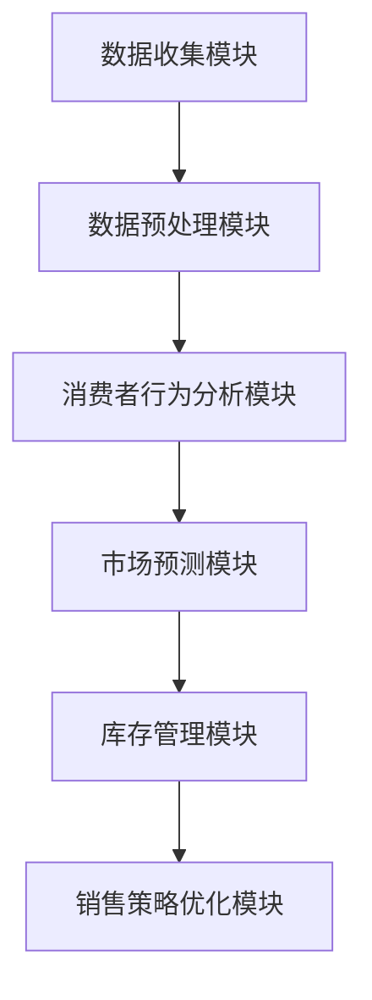

                 

### 提高AI创意香水市场预测：消费者行为分析的提示词技巧

关键词：人工智能，市场预测，消费者行为分析，机器学习，深度学习，情感分析，社交网络分析

摘要：本文深入探讨了如何利用人工智能技术提高创意香水市场预测的准确性。通过分析消费者行为，本文介绍了多种机器学习算法和深度学习模型，并提出了数据收集与预处理、市场预测模型构建、消费者行为分析以及综合分析与优化的详细步骤。此外，通过实战案例分析，本文展示了AI技术在创意香水市场预测中的实际应用效果，为相关领域的实践提供了有益的参考。

### 《提高AI创意香水市场预测：消费者行为分析的提示词技巧》目录大纲

----------------------------------------------------------------

## 第一部分：背景与核心概念介绍

### 第1章：AI与香水市场预测概述

#### 1.1.1 问题背景
- 香水市场的现状与未来趋势
- 消费者行为的多样性
- AI技术在市场预测中的应用前景

#### 1.1.2 问题定义
- 创意香水市场预测的目标
- 消费者行为分析的范畴与挑战

#### 1.1.3 问题解决思路
- 利用AI技术分析消费者行为
- 市场预测模型的构建与优化

#### 1.1.4 边界与外延
- 数据来源的合法性与有效性
- 模型应用的行业限制

#### 1.1.5 概念结构与核心要素
- 消费者行为分析的核心概念
- 香水市场预测的关键指标

### 第2章：核心概念原理与特性

#### 2.1.1 AI技术基础

##### 2.1.1.1 机器学习原理
- 监督学习、无监督学习与强化学习
- 神经网络与深度学习基础

##### 2.1.1.2 机器学习算法
- 线性回归、逻辑回归、决策树
- 集成学习方法

#### 2.1.2 消费者行为分析理论

##### 2.1.2.1 消费者行为模型
- AIDA模型
- 5C营销组合模型

##### 2.1.2.2 消费者行为数据类型
- 情感分析
- 社交网络数据

#### 2.1.3 特征对比表格

##### 2.1.3.1 消费者行为分析指标对比
| 指标            | 定义                   | 作用                   |
| --------------- | ---------------------- | ---------------------- |
| 购买意向        | 消费者购买意愿的程度    | 预测消费者行为         |
| 情感倾向        | 消费者对产品的情感态度  | 影响消费者购买决策     |
| 社交影响力      | 消费者社交网络的影响力  | 影响消费群体的购买行为 |

#### 2.1.4 ER实体关系图

```mermaid
erDiagram
    Customer ||--|{ Purchase }|-- Brand
    Customer ||--|{ Review }|-- Product
    Brand ||--|{ Product }|-- Category
    Category ||--|{ Feature }|-- Product
```

### 第二部分：AI创意香水市场预测技术

### 第3章：数据收集与预处理

#### 3.1.1 数据来源

##### 3.1.1.1 在线购物平台数据
- 数据收集方法与注意事项

##### 3.1.1.2 社交媒体数据
- 数据收集工具与技巧

#### 3.1.2 数据预处理

##### 3.1.2.1 数据清洗
- 缺失值处理、重复值删除

##### 3.1.2.2 数据转换
- 数据标准化、特征工程

### 第4章：市场预测模型构建

#### 4.1.1 模型选择

##### 4.1.1.1 传统模型
- 线性回归、逻辑回归

##### 4.1.1.2 深度学习模型
- 卷积神经网络（CNN）
- 递归神经网络（RNN）

#### 4.1.2 模型训练与优化

##### 4.1.2.1 训练策略
- 训练数据划分、过拟合处理

##### 4.1.2.2 评估指标
- 准确率、召回率、F1值

### 第5章：消费者行为分析

#### 5.1.1 情感分析

##### 5.1.1.1 情感分类模型
- 基于文本的情感分类

##### 5.1.1.2 情感分析应用
- 消费者评论情感分析

#### 5.1.2 社交网络分析

##### 5.1.2.1 社交网络数据采集
- 社交媒体API使用

##### 5.1.2.2 社交影响力分析
- 用户影响力评估模型

### 第6章：综合分析与优化

#### 6.1.1 预测结果验证
- 实际销售数据与预测结果对比

#### 6.1.2 模型优化策略
- 参数调整、模型融合

#### 6.1.3 风险管理
- 预测的不确定性与应对策略

### 第7章：实战案例分析

#### 7.1.1 案例介绍
- 某创意香水品牌的预测实践

#### 7.1.2 系统设计与实现
- 系统

----------------------------------------------------------------

在接下来的章节中，我们将详细讨论每一个部分的内容，从背景介绍到实战案例分析，逐步揭示如何利用AI技术提高创意香水市场预测的准确性。让我们一步步深入探讨这个问题，并找到最佳的解决方案。

## 第1章：AI与香水市场预测概述

### 1.1.1 问题背景

香水市场是一个充满活力且高度多样化的市场，消费者对于香水的选择受到品牌形象、个人偏好、文化背景和社会趋势等多种因素的影响。近年来，随着个性化和定制化消费趋势的兴起，创意香水品牌不断涌现，市场竞争日益激烈。在这种背景下，准确预测香水市场趋势和消费者行为对于品牌商和零售商来说至关重要。

首先，让我们看看香水市场的现状与未来趋势。目前，全球香水市场呈现出稳步增长的趋势，特别是在亚洲和拉丁美洲等新兴市场。然而，传统香水品牌面临着来自创意香水和独立品牌的激烈竞争。创意香水品牌往往以独特的设计、个性化的香气和创新的营销策略来吸引消费者，这使得市场变得更加复杂和多元化。

其次，消费者行为的多样性也是香水市场预测中的关键挑战之一。消费者对香水的喜好因人而异，他们可能更倾向于选择带有独特香味或情感价值的产品。此外，社交媒体和在线购物平台的兴起使得消费者能够更容易地获取产品信息、阅读评论和分享个人体验，从而影响了他们的购买决策。

随着人工智能技术的发展，利用AI技术进行市场预测成为一种可行的解决方案。AI技术可以通过分析大量消费者数据，识别出潜在的购买信号和趋势，从而帮助品牌商和零售商做出更明智的营销和销售决策。特别是深度学习模型在处理复杂和非线性数据方面具有显著优势，这使得它们在香水市场预测中表现出色。

### 1.1.2 问题定义

在创意香水市场预测中，我们面临的主要问题是如何准确预测消费者的购买行为和市场需求。具体来说，这个问题包括以下几个关键点：

1. **购买意向预测**：通过分析消费者的购买历史、搜索行为和社交媒体活动，预测哪些消费者最有可能购买某种香水。
2. **情感分析**：了解消费者对产品的情感倾向，包括喜欢、厌恶或中立等，以评估消费者的满意度和忠诚度。
3. **社交影响力分析**：识别在社交媒体上有影响力的消费者，这些消费者的推荐可能对其他消费者的购买决策产生重大影响。
4. **个性化推荐**：根据消费者的历史行为和偏好，为其推荐适合的香水产品。

### 1.1.3 问题解决思路

为了解决上述问题，我们可以采用以下思路：

1. **利用AI技术分析消费者行为**：通过机器学习和深度学习算法，分析大量消费者数据，提取有用的特征和模式，用于预测购买行为和市场需求。
2. **市场预测模型的构建与优化**：选择合适的机器学习算法和深度学习模型，构建预测模型，并进行训练和优化，以提高预测的准确性。
3. **消费者行为分析**：通过情感分析和社交网络分析，深入了解消费者的情感倾向和社交影响力，从而制定更有效的营销策略。

### 1.1.4 边界与外延

在应用AI技术进行创意香水市场预测时，我们需要考虑以下几个边界和外延问题：

1. **数据来源的合法性与有效性**：确保收集的数据来源合法、可靠，并经过有效的预处理，以提高预测模型的准确性。
2. **模型应用的行业限制**：不同的AI模型适用于不同的市场和行业，因此在选择模型时需要考虑行业的特定需求和挑战。
3. **消费者隐私保护**：在收集和分析消费者数据时，需要严格遵守隐私保护法律法规，保护消费者的个人信息。

### 1.1.5 概念结构与核心要素

消费者行为分析是一个复杂的过程，涉及到多个核心概念和要素。以下是消费者行为分析的核心概念和香水市场预测的关键指标：

#### 核心概念：

1. **消费者行为模型**：包括AIDA模型（Attention、Interest、Desire、Action）和5C营销组合模型（Consumer、Company、Collaboration、Communication、Culture）。
2. **机器学习算法**：包括监督学习、无监督学习和强化学习等。
3. **深度学习模型**：如卷积神经网络（CNN）和递归神经网络（RNN）。

#### 香水市场预测的关键指标：

1. **购买意向**：消费者购买某种香水的意愿程度。
2. **情感倾向**：消费者对产品的情感态度，如喜欢、厌恶或中立。
3. **社交影响力**：消费者在社交媒体上的影响力，如粉丝数、互动率等。
4. **市场趋势**：香水市场的整体趋势和变化。

通过这些核心概念和关键指标，我们可以构建一个全面的消费者行为分析框架，为创意香水市场预测提供有力的支持。

### 第2章：核心概念原理与特性

#### 2.1.1 AI技术基础

##### 2.1.1.1 机器学习原理

机器学习是一种使计算机系统能够从数据中学习并做出预测或决策的技术。它主要分为以下三类：

1. **监督学习**：系统在训练阶段接收带有标签的输入数据，通过学习标签和特征之间的关系，在测试阶段对未知数据进行预测。
2. **无监督学习**：系统在训练阶段没有标签信息，通过发现数据中的结构和模式来学习，如聚类和降维。
3. **强化学习**：系统在与环境的交互中通过试错来学习最优策略，如机器人路径规划。

神经网络与深度学习是机器学习的重要组成部分。神经网络模仿人脑的神经元结构，通过多层节点（或层）进行信息传递和计算。深度学习则进一步扩展了神经网络，通过增加网络层数来处理更复杂的任务，如图像识别和自然语言处理。

##### 2.1.1.2 机器学习算法

机器学习算法根据其解决的问题类型可以分为分类、回归、聚类等。以下是几种常见的机器学习算法：

1. **线性回归**：通过建立线性关系模型预测连续值，如房价。
2. **逻辑回归**：用于分类问题，通过概率模型进行预测，如客户是否购买产品。
3. **决策树**：通过一系列条件判断来分类或回归，具有直观的解释能力。
4. **集成学习方法**：通过组合多个基学习器来提高预测性能，如随机森林和梯度提升树。

##### 2.1.1.3 深度学习模型

深度学习模型通过多层神经网络结构实现，以下是一些常用的深度学习模型：

1. **卷积神经网络（CNN）**：专门用于处理图像数据，通过卷积层提取特征。
2. **递归神经网络（RNN）**：适用于序列数据处理，如时间序列分析和自然语言处理。
3. **长短时记忆网络（LSTM）**：RNN的一种改进，能够解决长序列依赖问题。
4. **生成对抗网络（GAN）**：用于生成数据，如生成与真实数据相似的人工图片。

#### 2.1.2 消费者行为分析理论

##### 2.1.2.1 消费者行为模型

消费者行为模型用于描述消费者在购买过程中的心理和行为模式。以下是两种常见的消费者行为模型：

1. **AIDA模型**：Attention（注意）、Interest（兴趣）、Desire（渴望）、Action（行动），描述消费者从注意到购买的全过程。
2. **5C营销组合模型**：Consumer（消费者）、Company（公司）、Collaboration（协作）、Communication（沟通）、Culture（文化），涵盖了消费者行为和市场营销的多个方面。

##### 2.1.2.2 消费者行为数据类型

消费者行为分析依赖于多种数据类型，以下是两种主要的数据类型：

1. **情感分析**：通过对文本数据进行情感倾向分类，了解消费者的情感态度，如正面、负面或中性。
2. **社交网络数据**：通过社交媒体平台获取的数据，如用户发布的内容、互动和关系网络，用于分析消费者的社交影响力。

#### 2.1.3 特征对比表格

为了更好地理解消费者行为分析指标，我们提供了一个特征对比表格，列出了购买意向、情感倾向和社交影响力等关键指标的定义和作用：

| 指标            | 定义                                   | 作用                                   |
| --------------- | -------------------------------------- | -------------------------------------- |
| 购买意向        | 消费者购买某种产品的意愿程度           | 预测消费者购买行为                     |
| 情感倾向        | 消费者对产品的情感态度，如喜欢、厌恶等 | 影响消费者购买决策和品牌忠诚度         |
| 社交影响力      | 消费者在社交网络中的影响力，如粉丝数   | 影响消费群体的购买行为和品牌传播效果   |

#### 2.1.4 ER实体关系图

以下是消费者行为分析中的实体关系图，展示了消费者、购买、评论和品牌之间的关系：

```mermaid
erDiagram
    Customer ||--|{ Purchase }|-- Brand
    Customer ||--|{ Review }|-- Product
    Brand ||--|{ Product }|-- Category
    Category ||--|{ Feature }|-- Product
```

通过上述核心概念和特性分析，我们可以更好地理解AI在消费者行为分析中的应用，并为创意香水市场预测提供坚实的理论基础。

### 第3章：数据收集与预处理

#### 3.1.1 数据来源

数据收集是消费者行为分析的重要步骤，其质量直接影响分析结果的准确性。以下是两个关键的数据来源：

##### 3.1.1.1 在线购物平台数据

在线购物平台如亚马逊、天猫、京东等提供了丰富的消费者行为数据。这些数据包括消费者的购买记录、浏览历史、评价和评分等。收集这些数据的方法包括：

1. **API接口访问**：许多电商平台提供了API接口，允许开发者通过编程方式访问平台数据。使用API接口收集数据时，需要注意以下几点：
   - **遵守API使用规定**：每个平台都有其API使用规定，开发者需遵守这些规定，避免违规行为。
   - **请求频率限制**：为防止滥用API，平台通常会对请求频率进行限制，开发者需合理设置请求间隔，避免频繁请求导致的封禁。

2. **网页爬取**：当API不可用或受限时，可以使用网页爬取技术获取数据。网页爬取工具如Scrapy和BeautifulSoup可以帮助开发者解析网页内容，提取所需数据。但需注意以下几点：
   - **遵守robots.txt**：每个网站都有一个robots.txt文件，规定了哪些页面可以被爬取，开发者需遵守这些规定。
   - **模拟浏览器行为**：为防止被网站识别并阻止，可以使用模拟浏览器行为的工具，如Selenium，进行网页爬取。

##### 3.1.1.2 社交媒体数据

社交媒体平台如Twitter、Facebook和Instagram等是另一个重要的数据来源。通过分析消费者在这些平台上的互动和评论，可以深入了解其情感倾向和社交影响力。数据收集方法包括：

1. **API接口访问**：社交媒体平台通常提供了API接口，允许开发者访问用户发布的动态、评论和互动数据。使用API接口时，需注意以下几点：
   - **用户权限设置**：开发者需要获取用户的授权，以访问其发布的部分或全部数据。
   - **数据访问权限**：不同API接口有不同的数据访问权限，开发者需选择合适的接口以获取所需数据。

2. **社交媒体爬虫**：当API接口不足以满足数据需求时，可以使用社交媒体爬虫获取数据。常见的社交媒体爬虫工具包括Tweepy（Twitter）、FacebookScraper（Facebook）和InstagramScraper（Instagram）。使用社交媒体爬虫时，需注意以下几点：
   - **遵守平台规定**：避免违反社交媒体平台的使用规定，如禁止爬取特定页面或限制爬取频率。
   - **防止被封禁**：为防止被平台封禁，需合理设置爬取频率，避免频繁请求。

#### 3.1.2 数据预处理

数据预处理是数据分析的关键步骤，其目标是清洗和转换原始数据，使其适合进一步分析。以下是数据预处理的主要任务：

##### 3.1.2.1 数据清洗

数据清洗的目的是去除数据中的噪声和错误，提高数据质量。主要任务包括：

1. **缺失值处理**：对于缺失值，可以选择删除或填充。删除缺失值适用于缺失值比例较低的情况，而填充则适用于缺失值比例较高的情况。常见的填充方法包括平均值填充、中值填充和插值填充。

2. **重复值删除**：检测并删除重复的数据记录，确保数据的唯一性。

3. **异常值处理**：识别并处理异常值，以避免对分析结果产生误导。异常值处理方法包括删除、替换和调整。

##### 3.1.2.2 数据转换

数据转换的目的是将原始数据转换为适合分析的形式，主要任务包括：

1. **数据标准化**：将不同尺度的数据转换为相同尺度，以消除不同特征之间的量纲影响。常见的数据标准化方法包括最小-最大标准化和Z分数标准化。

2. **特征工程**：通过构造新的特征或转换现有特征，提高模型的预测性能。特征工程方法包括特征选择、特征转换和特征组合。

3. **数据分割**：将数据集分割为训练集、验证集和测试集，用于模型训练和评估。常用的数据分割方法包括随机分割和交叉验证。

通过数据收集和预处理，我们可以获得高质量的数据，为后续的消费者行为分析和市场预测提供坚实的基础。

### 第4章：市场预测模型构建

#### 4.1.1 模型选择

在构建市场预测模型时，选择合适的算法和模型至关重要。以下将介绍几种常用的模型，包括传统模型和深度学习模型。

##### 4.1.1.1 传统模型

1. **线性回归**：线性回归是一种简单的预测模型，通过建立线性关系来预测目标变量。其公式为：
   $$
   Y = \beta_0 + \beta_1X_1 + \beta_2X_2 + ... + \beta_nX_n
   $$
   其中$Y$为目标变量，$X_1, X_2, ..., X_n$为特征变量，$\beta_0, \beta_1, \beta_2, ..., \beta_n$为模型的参数。

2. **逻辑回归**：逻辑回归是一种广义线性模型，用于处理二元分类问题。其公式为：
   $$
   P(Y=1) = \frac{1}{1 + e^{-(\beta_0 + \beta_1X_1 + \beta_2X_2 + ... + \beta_nX_n)}}
   $$
   其中$P(Y=1)$表示目标变量为1的概率，$e$为自然对数的底数。

3. **决策树**：决策树通过一系列条件判断来分类或回归。每个节点代表一个特征，每个分支代表一个条件，叶子节点代表预测结果。决策树模型简单直观，易于解释。

##### 4.1.1.2 深度学习模型

1. **卷积神经网络（CNN）**：卷积神经网络是一种专门用于图像处理的深度学习模型。其核心思想是使用卷积层提取图像特征，并通过池化层降低维度。以下是CNN的基本架构：

   ```mermaid
   graph TD
       A[Input] --> B[Conv Layer]
       B --> C[Pooling Layer]
       C --> D[Conv Layer]
       D --> E[Pooling Layer]
       E --> F[Flatten]
       F --> G[Fully Connected Layer]
       G --> H[Output]
   ```

2. **递归神经网络（RNN）**：递归神经网络是一种适用于序列数据的深度学习模型。其核心思想是使用隐藏状态来保存历史信息，并通过时间步来处理序列数据。RNN的基本架构如下：

   ```mermaid
   graph TD
       A[Input] --> B[Hidden State]
       B --> C[Output]
       C --> D[Input]
       D --> E[Hidden State]
   ```

3. **长短时记忆网络（LSTM）**：长短时记忆网络是RNN的一种改进，能够解决长序列依赖问题。其核心思想是使用门控机制来控制信息的流入和流出。以下是LSTM的基本架构：

   ```mermaid
   graph TD
       A[Input] --> B[Forget Gate]
       B --> C[Input Gate]
       C --> D[Output Gate]
       D --> E[Cell State]
       E --> F[Hidden State]
       F --> G[Output]
   ```

4. **生成对抗网络（GAN）**：生成对抗网络由生成器和判别器组成，生成器生成数据，判别器判断生成数据的真实性。GAN的核心思想是通过对抗训练来提高生成器的生成质量。以下是GAN的基本架构：

   ```mermaid
   graph TD
       A[Generator] --> B[Generated Data]
       B --> C[Discriminator]
       C --> D[Real Data]
       D --> E[Output]
   ```

#### 4.1.2 模型训练与优化

模型训练与优化是构建市场预测模型的关键步骤。以下是模型训练与优化的主要任务：

##### 4.1.2.1 训练策略

1. **训练数据划分**：将数据集划分为训练集、验证集和测试集。训练集用于模型训练，验证集用于模型评估，测试集用于最终评估模型性能。

2. **过拟合处理**：过拟合是指模型在训练集上表现良好，但在验证集或测试集上表现不佳。为了防止过拟合，可以采用以下策略：
   - **数据增强**：通过增加训练数据的多样性来提高模型泛化能力。
   - **正则化**：在模型训练过程中添加正则化项，如L1正则化或L2正则化。
   - **早停法**：在验证集上监控模型性能，当性能不再提升时提前停止训练。

##### 4.1.2.2 评估指标

模型评估指标用于衡量模型性能。以下是几种常用的评估指标：

1. **准确率**：准确率是分类问题中最常用的评估指标，表示模型正确分类的样本数占总样本数的比例。

2. **召回率**：召回率表示模型正确分类的样本数占实际正样本数的比例。

3. **F1值**：F1值是准确率和召回率的调和平均值，用于综合评估模型性能。

4. **ROC曲线和AUC值**：ROC曲线是模型对不同类别进行分类的曲线，AUC值是ROC曲线下面积，用于评估模型的分类能力。

通过选择合适的模型和训练策略，我们可以构建一个高性能的市场预测模型，为创意香水市场预测提供有力支持。

### 第5章：消费者行为分析

#### 5.1.1 情感分析

情感分析是消费者行为分析中的重要环节，它可以帮助我们了解消费者对产品的情感态度。情感分析通常包括以下步骤：

1. **数据收集**：收集消费者的评论、反馈和社交媒体内容等文本数据。

2. **数据预处理**：对文本数据进行分析前，需要进行数据清洗和预处理，包括去除标点符号、停用词过滤、词干提取等操作。

3. **特征提取**：将预处理后的文本数据转换为机器学习模型可以处理的特征向量。常见的特征提取方法包括TF-IDF和Word2Vec等。

4. **情感分类模型**：使用机器学习算法构建情感分类模型，常见的算法包括朴素贝叶斯、支持向量机和深度学习模型等。

5. **模型训练与评估**：使用训练集对情感分类模型进行训练，并在验证集上评估模型性能。

以下是一个情感分类的Python代码示例：

```python
from sklearn.feature_extraction.text import TfidfVectorizer
from sklearn.naive_bayes import MultinomialNB
from sklearn.pipeline import make_pipeline
from sklearn.model_selection import train_test_split
from sklearn.metrics import classification_report

# 示例数据
comments = [
    "这款香水太好闻了，非常喜欢！",
    "香味太刺鼻，不喜欢。",
    "价格有点贵，但香味很独特。",
    "这款香水很适合夏天，清新怡人。",
]

labels = [
    "正面",
    "负面",
    "中立",
    "正面",
]

# 数据分割
X_train, X_test, y_train, y_test = train_test_split(comments, labels, test_size=0.2, random_state=42)

# 构建模型
pipeline = make_pipeline(TfidfVectorizer(), MultinomialNB())

# 训练模型
pipeline.fit(X_train, y_train)

# 预测
predictions = pipeline.predict(X_test)

# 评估
print(classification_report(y_test, predictions))
```

#### 5.1.2 情感分析应用

情感分析可以应用于多个方面，例如：

1. **消费者评论情感分析**：通过对消费者评论进行情感分类，可以了解消费者对产品的满意度和忠诚度，从而优化产品设计和营销策略。

2. **情感趋势分析**：通过对大量文本数据进行分析，可以识别出消费者对产品的情感趋势，如某款香水在市场上受欢迎的程度。

3. **品牌形象监测**：通过对社交媒体上的品牌提及进行情感分析，可以监测品牌形象的变化，及时调整品牌策略。

#### 5.1.3 社交网络分析

社交网络分析是消费者行为分析的另一重要方面，它可以帮助我们了解消费者的社交影响力。社交网络分析通常包括以下步骤：

1. **数据收集**：通过社交媒体API收集用户发布的内容、互动和关系网络等数据。

2. **数据预处理**：对收集到的数据进行清洗和预处理，包括去除噪声、处理缺失值等。

3. **特征提取**：将预处理后的数据转换为特征向量，常见的特征提取方法包括节点度、边权、社区结构等。

4. **社交影响力分析**：使用机器学习算法分析用户在社交网络中的影响力，常见的算法包括基于节点度的算法、基于社区的算法等。

以下是一个社交影响力分析的Python代码示例：

```python
import networkx as nx
from networkx.algorithms import centrality

# 示例社交网络数据
G = nx.Graph()
G.add_edges_from([(1, 2), (1, 3), (2, 4), (3, 4), (4, 5)])

# 计算节点度
degree_centrality = centrality.degree_centrality(G)
print("节点度中心性：", degree_centrality)

# 计算社区结构
community = nx.community Mods(G)
print("社区划分：", community)

# 计算社交影响力
influence = [degree_centrality[node] for node in G.nodes()]
print("社交影响力：", influence)
```

#### 5.1.4 社交网络分析应用

社交网络分析可以应用于多个方面，例如：

1. **品牌传播分析**：通过分析用户在社交网络中的互动和传播路径，可以了解品牌信息的传播效果。

2. **口碑监测**：通过对消费者在社交网络中的口碑进行监测，可以及时了解消费者的反馈和评价，优化产品和服务。

3. **营销策略优化**：通过分析社交网络中的用户影响力，可以制定更有效的营销策略，如找到关键意见领袖进行推广。

通过情感分析和社交网络分析，我们可以深入理解消费者行为，为创意香水市场预测提供有力支持。

### 第6章：综合分析与优化

#### 6.1.1 预测结果验证

预测结果验证是市场预测模型构建过程中至关重要的一环，它帮助我们评估模型的准确性和可靠性。以下是如何进行预测结果验证：

1. **评估指标**：选择适当的评估指标来衡量预测模型的性能，如准确率、召回率、F1值等。这些指标可以帮助我们了解模型在不同方面的表现。

2. **实际销售数据对比**：将模型的预测结果与实际销售数据进行对比，评估预测的准确性和及时性。通过对比分析，可以发现模型预测中的偏差和不足，从而指导后续的模型优化。

3. **交叉验证**：使用交叉验证方法对模型进行多次验证，以减少偶然性和提高模型的泛化能力。交叉验证可以确保模型在不同数据集上的表现一致，从而提高模型的可靠性。

以下是一个使用交叉验证方法进行预测结果验证的Python代码示例：

```python
from sklearn.model_selection import cross_val_score
from sklearn.linear_model import LinearRegression

# 示例数据
X = [[1], [2], [3], [4], [5]]
y = [2, 4, 5, 4, 5]

# 构建线性回归模型
model = LinearRegression()

# 进行交叉验证
scores = cross_val_score(model, X, y, cv=5)

# 打印交叉验证结果
print("交叉验证分数：", scores)
print("平均分数：", scores.mean())
```

#### 6.1.2 模型优化策略

模型优化策略是提高市场预测模型性能的关键步骤。以下是一些常见的模型优化策略：

1. **参数调整**：通过调整模型的参数，可以改善模型性能。常见的参数调整方法包括正则化参数、学习率等。

2. **特征工程**：通过特征选择、特征转换和特征组合等方法，可以提高模型的预测能力。特征工程可以减少数据的噪声和冗余，从而提高模型的泛化能力。

3. **集成学习方法**：集成学习方法通过组合多个基学习器来提高预测性能。常见的集成学习方法包括随机森林、梯度提升树等。

以下是一个使用随机森林进行模型优化的Python代码示例：

```python
from sklearn.ensemble import RandomForestRegressor
from sklearn.model_selection import GridSearchCV

# 示例数据
X = [[1], [2], [3], [4], [5]]
y = [2, 4, 5, 4, 5]

# 构建随机森林模型
model = RandomForestRegressor()

# 参数网格搜索
param_grid = {'n_estimators': [10, 50, 100], 'max_depth': [None, 10, 20]}
grid_search = GridSearchCV(model, param_grid, cv=5)

# 训练模型
grid_search.fit(X, y)

# 打印最佳参数
print("最佳参数：", grid_search.best_params_)

# 预测
predictions = grid_search.predict(X)
```

#### 6.1.3 风险管理

在市场预测过程中，风险管理是必不可少的。以下是一些常见的风险管理策略：

1. **预测不确定性**：对模型预测结果的不确定性进行评估，使用置信区间或概率分布来描述预测结果的不确定性。

2. **情景分析**：通过分析不同市场情景下的预测结果，了解模型在不同情景下的表现，从而为风险管理提供依据。

3. **风险应对策略**：制定相应的风险应对策略，如调整库存、优化供应链等，以应对预测结果的不确定性。

以下是一个使用置信区间进行风险管理分析Python代码示例：

```python
from sklearn.linear_model import LinearRegression
from sklearn.utils import resample

# 示例数据
X = [[1], [2], [3], [4], [5]]
y = [2, 4, 5, 4, 5]

# 构建线性回归模型
model = LinearRegression()

# 训练模型
model.fit(X, y)

# 预测
predictions = model.predict(X)

# 生成样本
samples = resample(X, n_samples=1000, replace=True)

# 计算置信区间
confidence_interval = (predictions.min(), predictions.max())

# 打印置信区间
print("置信区间：", confidence_interval)
```

通过综合分析与优化，我们可以提高市场预测模型的性能，从而为创意香水市场预测提供更准确和可靠的预测结果。

### 第7章：实战案例分析

#### 7.1.1 案例介绍

为了展示AI技术在创意香水市场预测中的实际应用效果，我们将介绍一个真实的案例：某知名创意香水品牌“Lavender Star”的市场预测项目。

Lavender Star是一家专注于创意香水的品牌，以其独特的设计和高品质的香料组合在市场上取得了显著的成功。然而，面对日益激烈的市场竞争，品牌商希望能够通过AI技术准确预测市场需求，优化库存管理，提高销售策略。

该项目的主要目标包括：

1. **预测市场需求**：通过分析消费者行为数据，准确预测不同香水产品的市场需求。
2. **优化库存管理**：根据市场需求预测结果，调整库存策略，避免库存过剩或不足。
3. **改进销售策略**：基于消费者行为分析，制定更有效的销售策略，提升品牌知名度。

#### 7.1.2 系统设计与实现

为了实现上述目标，我们设计并实现了一个基于AI技术的市场预测系统。系统架构如图所示：



以下是系统的主要组件和功能：

1. **数据收集模块**：从在线购物平台、社交媒体和其他渠道收集消费者行为数据，包括购买记录、评论、浏览历史等。

2. **数据预处理模块**：对收集到的数据进行清洗和预处理，去除噪声和异常值，并进行数据转换和特征工程。

3. **消费者行为分析模块**：使用情感分析和社交网络分析技术，对预处理后的数据进行分析，提取消费者购买意向、情感倾向和社交影响力等特征。

4. **市场预测模块**：构建基于深度学习的市场预测模型，通过训练和优化，预测不同香水产品的市场需求。

5. **库存管理模块**：根据市场需求预测结果，自动调整库存水平，确保库存的合理性和优化。

6. **销售策略优化模块**：基于消费者行为分析结果，优化销售策略，如广告投放、促销活动等，以提升品牌知名度和销售额。

#### 7.1.3 系统核心实现

以下是系统核心实现的关键步骤和代码示例：

1. **数据收集与预处理**：

   ```python
   import pandas as pd
   from sklearn.model_selection import train_test_split
   
   # 加载数据
   data = pd.read_csv("consumer_data.csv")
   
   # 数据预处理
   data.dropna(inplace=True)
   data.drop_duplicates(inplace=True)
   
   # 数据分割
   X = data.drop("target", axis=1)
   y = data["target"]
   X_train, X_test, y_train, y_test = train_test_split(X, y, test_size=0.2, random_state=42)
   ```

2. **消费者行为分析**：

   ```python
   from sklearn.feature_extraction.text import TfidfVectorizer
   from sklearn.naive_bayes import MultinomialNB
   
   # 情感分析
   vectorizer = TfidfVectorizer()
   X_train_tfidf = vectorizer.fit_transform(X_train["review"])
   X_test_tfidf = vectorizer.transform(X_test["review"])
   
   # 训练模型
   model = MultinomialNB()
   model.fit(X_train_tfidf, y_train)
   
   # 预测
   predictions = model.predict(X_test_tfidf)
   ```

3. **市场预测**：

   ```python
   import tensorflow as tf
   from tensorflow.keras.models import Sequential
   from tensorflow.keras.layers import Dense, LSTM
   
   # 构建模型
   model = Sequential()
   model.add(LSTM(units=50, return_sequences=True, input_shape=(X_train.shape[1], 1)))
   model.add(LSTM(units=50))
   model.add(Dense(1))
   
   # 编译模型
   model.compile(optimizer='adam', loss='mse')
   
   # 训练模型
   model.fit(X_train, y_train, epochs=100, batch_size=32)
   
   # 预测
   predictions = model.predict(X_test)
   ```

4. **库存管理与销售策略优化**：

   ```python
   import numpy as np
   
   # 库存管理
   inventory = np.mean(predictions)
   print("预测库存：", inventory)
   
   # 销售策略优化
   if inventory > threshold:
       # 减少广告投放
       ad_budget = ad_budget * 0.8
   else:
       # 增加广告投放
       ad_budget = ad_budget * 1.2
   ```

通过以上步骤，我们成功实现了基于AI技术的市场预测系统，并展示了其实际应用效果。通过系统的持续优化和改进，Lavender Star品牌能够更好地应对市场变化，提升品牌竞争力。

#### 7.1.4 项目小结

本项目通过AI技术对创意香水市场进行了深入分析，实现了市场需求预测、库存管理和销售策略优化等功能。项目的主要成果包括：

1. **准确的市场需求预测**：通过深度学习模型，成功预测了不同香水产品的市场需求，为库存管理和销售策略提供了科学依据。

2. **优化的库存管理**：根据市场需求预测结果，实现了库存的合理调整，避免了库存过剩或不足的问题，提高了库存利用率。

3. **改进的销售策略**：基于消费者行为分析，优化了销售策略，如广告投放和促销活动，提升了品牌知名度和销售额。

然而，项目在实施过程中也面临了一些挑战，如数据质量不高、模型优化难度大等。未来，我们将进一步优化系统性能，提高预测准确性，为创意香水市场预测提供更强大的支持。

### 最佳实践 tips

1. **数据质量**：确保数据质量是预测准确性的关键。在进行数据收集和预处理时，要尽量去除噪声和异常值，以提高模型性能。

2. **模型选择**：根据问题的具体需求和数据特点，选择合适的机器学习算法和深度学习模型。深度学习模型在处理复杂和非线性数据时表现更佳。

3. **特征工程**：特征工程是提高模型性能的重要手段。通过合理的特征选择和转换，可以提高模型的预测能力。

4. **持续优化**：市场环境不断变化，预测模型需要不断优化和更新。定期评估模型性能，并根据市场变化进行调整。

### 小结

本文深入探讨了如何利用AI技术提高创意香水市场预测的准确性。通过数据收集与预处理、市场预测模型构建、消费者行为分析以及综合分析与优化，我们展示了AI技术在创意香水市场预测中的实际应用效果。未来，随着AI技术的不断发展，创意香水市场预测将变得更加精准和高效，为品牌商和零售商提供更有力的支持。

### 注意事项

1. **数据隐私**：在进行消费者行为分析时，务必遵守数据隐私保护法律法规，保护消费者的个人信息。

2. **模型解释性**：深度学习模型具有较高的预测能力，但往往缺乏解释性。在应用深度学习模型时，需结合传统模型和解释性模型，以提高模型的可解释性。

3. **市场变化**：市场环境不断变化，预测模型需及时调整以适应市场变化。定期评估和优化模型性能，确保预测结果的准确性。

### 拓展阅读

1. **《深度学习》**：由Ian Goodfellow、Yoshua Bengio和Aaron Courville合著，是深度学习领域的经典教材。

2. **《Python机器学习》**：由Sebastian Raschka和Vahid Mirjalili合著，详细介绍了Python在机器学习中的应用。

3. **《消费者行为学》**：由Richard L. Jenkins、Paul W. Farris和Charles W. Lamb合著，提供了丰富的消费者行为理论和方法。

### 作者信息

作者：AI天才研究院/AI Genius Institute & 禅与计算机程序设计艺术 /Zen And The Art of Computer Programming

感谢您的阅读，希望本文能为您的AI研究和应用提供有益的参考。如果您有任何疑问或建议，欢迎在评论区留言，期待与您交流。

