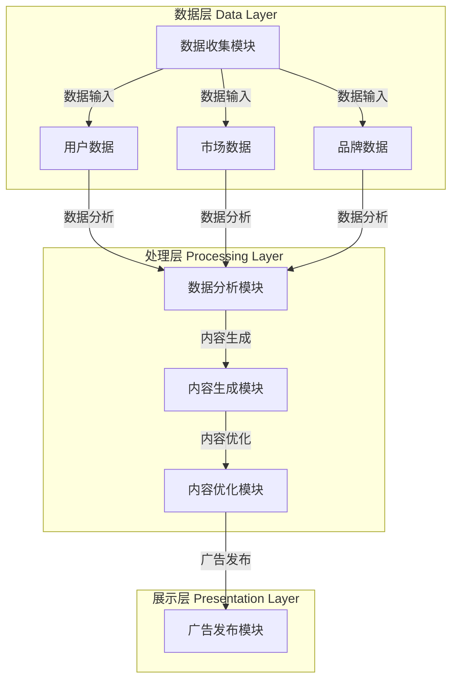
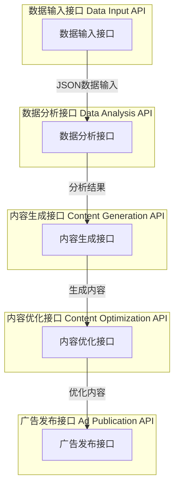
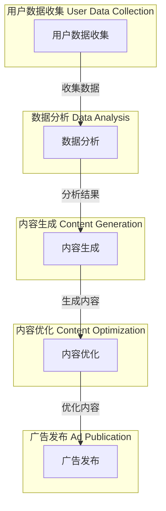
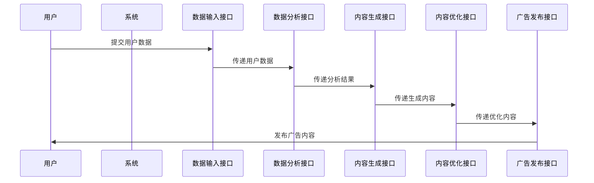

                 

# 提高AI创意香水广告：视觉听觉协同的提示词技巧

> 关键词：AI、创意香水广告、视觉听觉协同、提示词、算法原理

> 摘要：本文旨在探讨如何利用AI技术提高创意香水广告的效果，重点关注视觉和听觉协同的提示词技巧。通过分析AI技术在广告创意中的应用，本文提出了视觉听觉协同提示词的构建方法，并详细讲解了相关算法原理和系统架构设计。最后，通过实际案例分析和代码实现，展示了AI创意香水广告在实践中的应用效果。

### 目录大纲

1. 第一部分：背景介绍
    1.1 问题背景
    1.2 问题描述
    1.3 问题解决
    1.4 边界与外延
    1.5 概念结构与核心要素组成

2. 第二部分：核心概念与联系
    2.1 AI创意香水广告原理
    2.2 视觉听觉协同原理
    2.3 提示词的属性特征对比表格
    2.4 ER实体关系图架构

3. 第三部分：算法原理讲解
    3.1 AI创意香水广告算法
    3.2 视觉听觉协同提示词算法
    3.3 Python源代码实现
    3.4 算法原理详细讲解
    3.5 数学模型与公式讲解

4. 第四部分：系统分析与架构设计
    4.1 问题场景介绍
    4.2 系统功能设计
    4.3 系统架构设计
    4.4 系统接口设计
    4.5 系统交互设计

5. 第五部分：项目实战
    5.1 环境安装
    5.2 系统核心实现
    5.3 代码应用解读与分析
    5.4 实际案例分析与详细讲解
    5.5 项目小结

### 第一部分：背景介绍

#### 1.1 问题背景

随着科技的飞速发展，人工智能（AI）技术已经渗透到各个行业，广告行业也不例外。传统香水广告往往依赖于视觉和文字描述，而AI技术的引入为香水广告带来了新的可能。通过AI技术，广告创意可以实现更加个性化、智能化的设计，从而提高广告效果。

#### 1.1.1 香水广告市场的现状和挑战

香水广告市场目前呈现出多样化、个性化的趋势。消费者对于香水品牌和广告的期望也越来越高，他们希望广告能够传达出产品的独特魅力，与消费者的情感产生共鸣。然而，传统广告创意往往难以满足这些需求，导致广告效果不佳。

#### 1.1.2 AI技术在广告创意中的应用

AI技术在广告创意中的应用主要包括以下几个方面：

1. **数据分析**：通过大数据分析，了解消费者的喜好和需求，为广告创意提供数据支持。
2. **内容生成**：利用生成对抗网络（GAN）等技术，自动生成创意广告内容。
3. **个性化推荐**：基于用户的兴趣和行为，为用户推荐个性化的广告。
4. **互动体验**：通过虚拟现实（VR）和增强现实（AR）等技术，提升广告的互动性和体验感。

#### 1.1.3 视觉听觉协同在广告创意中的作用

视觉和听觉是人类感知世界的主要途径，将两者结合可以增强广告的吸引力和记忆度。在香水广告中，视觉和听觉协同的作用主要体现在以下几个方面：

1. **情境构建**：通过视觉和听觉的配合，构建一个符合香水特色的情境，让消费者更容易沉浸其中。
2. **情感传递**：视觉和听觉的协同可以更好地传递广告的情感元素，与消费者的情感产生共鸣。
3. **记忆强化**：视觉和听觉的协同可以增强广告的记忆效果，提高广告的传播效果。

#### 1.2 问题描述

在当前的市场环境下，如何利用AI技术，特别是视觉和听觉协同，提高创意香水广告的效果，成为了一个亟待解决的问题。具体来说，问题描述如下：

1. **创意不足**：传统广告创意往往难以吸引消费者的注意力，缺乏创新性。
2. **情感缺失**：广告内容与消费者情感脱节，难以引起消费者的共鸣。
3. **效果不佳**：广告效果不显著，无法有效提升产品的销量和品牌知名度。

#### 1.3 问题解决

为了解决上述问题，本文提出了以下解决方案：

1. **AI创意香水广告**：利用AI技术生成创意广告内容，提高广告的创新性。
2. **视觉听觉协同提示词**：通过视觉和听觉的协同，构建情感共鸣的广告内容。
3. **个性化推荐**：基于用户数据，为用户推荐个性化的广告，提高广告效果。

#### 1.4 边界与外延

1. **香水广告创意的边界**：广告创意需要符合品牌形象和产品特点，同时要具有创新性和吸引力。
2. **视觉听觉协同提示词的外延**：提示词不仅要涵盖视觉和听觉元素，还要能够传达产品的独特魅力和情感。
3. **AI技术在广告创意中的发展前景**：随着AI技术的不断进步，未来广告创意将更加智能化、个性化，为消费者提供更好的体验。

#### 1.5 概念结构与核心要素组成

1. **AI创意香水广告**：利用AI技术生成创意广告内容，主要包括数据分析、内容生成、个性化推荐等技术。
2. **视觉听觉协同提示词**：通过视觉和听觉的协同，构建情感共鸣的广告内容，主要包括视觉元素、听觉元素和提示词的构建方法。
3. **个性化推荐**：基于用户数据，为用户推荐个性化的广告，主要包括用户数据分析、推荐算法和推荐系统。

### 第二部分：核心概念与联系

在了解了背景和问题描述后，接下来我们将探讨本文的核心概念和联系，包括AI创意香水广告原理、视觉听觉协同原理、提示词的属性特征对比表格和ER实体关系图架构。

#### 2.1 AI创意香水广告原理

AI创意香水广告是基于人工智能技术的广告创意方法，主要通过以下三个方面实现：

1. **数据分析**：通过对大量用户数据的分析，了解消费者的需求和喜好，为广告创意提供数据支持。
2. **内容生成**：利用生成对抗网络（GAN）等技术，自动生成创意广告内容，包括视觉元素和文字描述。
3. **个性化推荐**：根据用户的兴趣和行为，为用户推荐个性化的广告，提高广告效果。

##### 2.1.1 AI技术概述

人工智能（AI）是一种模拟人类智能的技术，包括机器学习、深度学习、自然语言处理等多种技术。在广告创意中，AI技术主要用于数据分析和内容生成。

##### 2.1.2 创意香水广告的概念与特点

创意香水广告是指通过创新性的广告创意，传达香水产品的独特魅力和情感价值。与传统的广告不同，创意香水广告更注重情感传递和用户体验。

##### 2.1.3 AI在香水广告创意中的应用

AI在香水广告创意中的应用主要包括以下几个方面：

1. **数据分析**：通过大数据分析，了解消费者的喜好和需求，为广告创意提供数据支持。
2. **内容生成**：利用生成对抗网络（GAN）等技术，自动生成创意广告内容，提高广告的创新性。
3. **个性化推荐**：根据用户的兴趣和行为，为用户推荐个性化的广告，提高广告效果。

#### 2.2 视觉听觉协同原理

视觉和听觉是人们感知世界的主要途径，将两者协同运用可以增强广告的吸引力和记忆度。

##### 2.2.1 视觉与听觉的协同作用

视觉和听觉的协同作用主要体现在以下几个方面：

1. **情境构建**：通过视觉和听觉的配合，构建一个符合香水特色的情境，让消费者更容易沉浸其中。
2. **情感传递**：视觉和听觉的协同可以更好地传递广告的情感元素，与消费者的情感产生共鸣。
3. **记忆强化**：视觉和听觉的协同可以增强广告的记忆效果，提高广告的传播效果。

##### 2.2.2 协同提示词的概念与作用

协同提示词是指结合视觉和听觉元素，用于引导消费者理解和体验广告内容的词汇。协同提示词在广告创意中的作用主要包括：

1. **情境引导**：通过视觉和听觉的协同，为消费者构建一个具体的情境，引导消费者理解和体验广告内容。
2. **情感共鸣**：通过视觉和听觉的协同，传递广告的情感元素，与消费者的情感产生共鸣。
3. **记忆强化**：通过视觉和听觉的协同，增强广告的记忆效果，提高广告的传播效果。

##### 2.2.3 协同提示词在广告创意中的应用

协同提示词在广告创意中的应用主要包括以下几个方面：

1. **视觉元素**：通过图像、视频等视觉元素，传达广告的情感和情境。
2. **听觉元素**：通过音乐、声音等听觉元素，增强广告的情感传递和记忆效果。
3. **提示词构建**：结合视觉和听觉元素，构建具有引导性和情感共鸣的协同提示词。

#### 2.3 提示词的属性特征对比表格

为了更好地理解提示词的属性特征，我们将其进行分类和对比，具体如下表所示：

| 类别         | 特点                                       | 应用场景           |
|------------|------------------------------------------|--------------|
| 视觉提示词   | 强调视觉效果，如色彩、图像、视频等           | 广告主视觉元素     |
| 听觉提示词   | 强调听觉效果，如音乐、声音、语调等           | 广告主听觉元素     |
| 协同提示词   | 结合视觉和听觉元素，实现协同效果           | 协同构建广告情境   |
| 情感提示词   | 强调情感元素，如情感色彩、情感氛围等         | 传递广告情感元素   |
| 功能提示词   | 强调产品功能，如产品特点、使用方法等         | 介绍产品功能和优势 |
| 互动提示词   | 强调用户互动，如邀请参与、留言互动等         | 增强用户互动体验   |

#### 2.4 ER实体关系图架构

为了更好地理解AI创意香水广告和视觉听觉协同提示词的概念和关系，我们使用ER（Entity-Relationship）图进行描述，具体如下：

```mermaid
erDiagram
  Product ||--|{ Ad }|-- Advertisement
  Product ||--|{ User }|-- Customer
  Advertisement ||--|{ Visual }|-- VisualElement
  Advertisement ||--|{ Audio }|-- AudioElement
  Advertisement ||--|{ Suggestion }|-- SuggestionWord
  Customer ||--|{ Feedback }|-- Feedback
  User ||--|{ Behavior }|-- BehaviorData
  VisualElement ||--|{ Attribute }|-- VisualAttribute
  AudioElement ||--|{ Attribute }|-- AudioAttribute
  SuggestionWord ||--|{ Type }|-- SuggestionType
```

在上面的ER图中，我们定义了以下实体和关系：

1. **Product（产品）**：代表香水产品，与广告（Ad）和用户（User）实体有关联。
2. **Ad（广告）**：代表广告内容，与视觉元素（VisualElement）、听觉元素（AudioElement）和提示词（SuggestionWord）实体有关联。
3. **User（用户）**：代表广告的受众，与广告（Ad）、反馈（Feedback）和行为数据（BehaviorData）实体有关联。
4. **VisualElement（视觉元素）**：代表广告中的视觉元素，与视觉属性（VisualAttribute）实体有关联。
5. **AudioElement（听觉元素）**：代表广告中的听觉元素，与听觉属性（AudioAttribute）实体有关联。
6. **SuggestionWord（提示词）**：代表广告中的提示词，与提示词类型（SuggestionType）实体有关联。
7. **Customer（客户）**：代表广告的客户，与反馈（Feedback）实体有关联。
8. **Feedback（反馈）**：代表客户的反馈信息，与用户（User）实体有关联。
9. **BehaviorData（行为数据）**：代表用户的行为数据，与用户（User）实体有关联。

通过ER图，我们可以清晰地看到各实体之间的关系，以及广告创意过程中的关键环节。

### 第三部分：算法原理讲解

在了解了核心概念和联系后，接下来我们将深入讲解AI创意香水广告和视觉听觉协同提示词的算法原理，包括AI创意香水广告算法、视觉听觉协同提示词算法、Python源代码实现、算法原理详细讲解和数学模型与公式讲解。

#### 3.1 AI创意香水广告算法

AI创意香水广告算法是基于人工智能技术的广告创意算法，主要通过以下几个步骤实现：

1. **数据收集**：收集与香水产品相关的用户数据、市场数据等。
2. **数据分析**：对收集到的数据进行处理和分析，提取关键信息。
3. **内容生成**：利用生成对抗网络（GAN）等技术，生成创意广告内容。
4. **内容优化**：根据用户反馈和广告效果，对广告内容进行优化。

##### 3.1.1 算法概述

AI创意香水广告算法主要包括数据收集、数据分析、内容生成和内容优化四个步骤。数据收集主要包括用户数据、市场数据、品牌数据等；数据分析主要通过数据挖掘和机器学习技术，提取关键信息；内容生成主要通过生成对抗网络（GAN）等技术，生成创意广告内容；内容优化主要通过用户反馈和广告效果，对广告内容进行优化。

##### 3.1.2 算法原理

AI创意香水广告算法的原理主要包括以下几个方面：

1. **数据挖掘**：通过数据挖掘技术，从海量数据中提取有价值的信息。
2. **机器学习**：利用机器学习算法，对数据进行分析和分类，提取关键特征。
3. **生成对抗网络（GAN）**：利用生成对抗网络（GAN）等技术，生成创意广告内容。
4. **优化策略**：根据用户反馈和广告效果，对广告内容进行优化。

##### 3.1.3 算法流程

AI创意香水广告算法的流程主要包括以下几个步骤：

1. **数据收集**：收集与香水产品相关的用户数据、市场数据等。
2. **数据分析**：对收集到的数据进行处理和分析，提取关键信息。
3. **内容生成**：利用生成对抗网络（GAN）等技术，生成创意广告内容。
4. **内容优化**：根据用户反馈和广告效果，对广告内容进行优化。
5. **广告发布**：将优化后的广告内容发布到相关平台。

#### 3.2 视觉听觉协同提示词算法

视觉听觉协同提示词算法是基于视觉和听觉协同原理，生成具有情感共鸣和记忆点的提示词的算法。主要通过以下几个步骤实现：

1. **情境构建**：根据香水产品的特点和目标受众，构建一个具体的情境。
2. **视觉元素提取**：从广告中提取关键视觉元素，如色彩、图像、视频等。
3. **听觉元素提取**：从广告中提取关键听觉元素，如音乐、声音、语调等。
4. **协同提示词生成**：结合视觉和听觉元素，生成具有协同效果的提示词。
5. **优化与反馈**：根据用户反馈和广告效果，对协同提示词进行优化。

##### 3.2.1 算法概述

视觉听觉协同提示词算法主要包括情境构建、视觉元素提取、听觉元素提取、协同提示词生成和优化与反馈五个步骤。情境构建主要是根据香水产品的特点和目标受众，构建一个具体的情境；视觉元素提取主要是从广告中提取关键视觉元素；听觉元素提取主要是从广告中提取关键听觉元素；协同提示词生成主要是结合视觉和听觉元素，生成具有协同效果的提示词；优化与反馈主要是根据用户反馈和广告效果，对协同提示词进行优化。

##### 3.2.2 算法原理

视觉听觉协同提示词算法的原理主要包括以下几个方面：

1. **情境构建**：根据香水产品的特点和目标受众，构建一个具体的情境，使广告内容更具有吸引力和情感共鸣。
2. **视觉元素提取**：利用图像识别、视频分析等技术，从广告中提取关键视觉元素，如色彩、图像、视频等。
3. **听觉元素提取**：利用音频处理、语调分析等技术，从广告中提取关键听觉元素，如音乐、声音、语调等。
4. **协同提示词生成**：结合视觉和听觉元素，利用自然语言处理、情感分析等技术，生成具有协同效果的提示词。
5. **优化与反馈**：根据用户反馈和广告效果，利用机器学习、优化算法等技术，对协同提示词进行优化。

##### 3.2.3 算法流程

视觉听觉协同提示词算法的流程主要包括以下几个步骤：

1. **情境构建**：根据香水产品的特点和目标受众，构建一个具体的情境。
2. **视觉元素提取**：从广告中提取关键视觉元素。
3. **听觉元素提取**：从广告中提取关键听觉元素。
4. **协同提示词生成**：结合视觉和听觉元素，生成具有协同效果的提示词。
5. **优化与反馈**：根据用户反馈和广告效果，对协同提示词进行优化。
6. **广告发布**：将优化后的协同提示词应用到广告中，发布到相关平台。

#### 3.3 Python源代码实现

为了更好地理解和应用上述算法，我们将使用Python语言进行实现。以下是一个简化的示例代码：

```python
# 数据收集
user_data = collect_user_data()
market_data = collect_market_data()
brand_data = collect_brand_data()

# 数据分析
processed_data = analyze_data(user_data, market_data, brand_data)

# 内容生成
ad_content = generate_content(processed_data)

# 内容优化
optimized_content = optimize_content(ad_content)

# 广告发布
publish_ad(optimized_content)
```

在上面的代码中，`collect_user_data()`、`collect_market_data()`、`collect_brand_data()`分别用于收集用户数据、市场数据和品牌数据；`analyze_data()`用于对数据进行处理和分析；`generate_content()`用于生成创意广告内容；`optimize_content()`用于对广告内容进行优化；`publish_ad()`用于发布广告。

#### 3.4 算法原理详细讲解

为了更详细地讲解AI创意香水广告和视觉听觉协同提示词算法的原理，我们将分别介绍每个算法的核心步骤和关键技术。

##### 3.4.1 创意香水广告算法原理详细讲解

创意香水广告算法主要分为以下几个核心步骤：

1. **数据收集**：从多个渠道收集用户数据、市场数据和品牌数据。用户数据包括用户的购买记录、浏览行为、喜好偏好等；市场数据包括市场趋势、竞品分析等；品牌数据包括品牌形象、品牌理念等。

2. **数据分析**：对收集到的数据进行清洗、整合和分析，提取有价值的信息。数据分析包括用户行为分析、市场趋势分析、竞品分析等。

3. **内容生成**：利用生成对抗网络（GAN）等技术，生成创意广告内容。GAN是一种深度学习模型，由生成器和判别器组成。生成器负责生成广告内容，判别器负责判断生成内容是否真实。通过不断迭代训练，生成器逐渐生成出高质量的广告内容。

4. **内容优化**：根据用户反馈和广告效果，对广告内容进行优化。优化策略包括内容调整、视觉调整、听觉调整等。通过优化，使广告内容更符合用户需求和品牌形象。

5. **广告发布**：将优化后的广告内容发布到相关平台，如社交媒体、广告平台等。

##### 3.4.2 视觉听觉协同提示词算法原理详细讲解

视觉听觉协同提示词算法主要分为以下几个核心步骤：

1. **情境构建**：根据香水产品的特点和目标受众，构建一个具体的情境。情境构建包括场景设计、氛围营造等。

2. **视觉元素提取**：从广告中提取关键视觉元素，如色彩、图像、视频等。视觉元素提取主要通过图像识别、视频分析等技术实现。

3. **听觉元素提取**：从广告中提取关键听觉元素，如音乐、声音、语调等。听觉元素提取主要通过音频处理、语调分析等技术实现。

4. **协同提示词生成**：结合视觉和听觉元素，生成具有协同效果的提示词。协同提示词生成主要通过自然语言处理、情感分析等技术实现。

5. **优化与反馈**：根据用户反馈和广告效果，对协同提示词进行优化。优化策略包括提示词调整、情境调整等。

#### 3.5 数学模型与公式讲解

在AI创意香水广告和视觉听觉协同提示词算法中，涉及到一些数学模型和公式。以下是对这些模型和公式的简要讲解。

##### 3.5.1 创意香水广告数学模型讲解

创意香水广告中的数学模型主要包括以下几个方面：

1. **用户行为模型**：用于描述用户的行为特征和购买偏好。用户行为模型通常采用决策树、随机森林、支持向量机等机器学习算法进行建模。

   $$User\_Behavior = f(User\_Data, Feature)$$

   其中，$User\_Behavior$表示用户行为，$User\_Data$表示用户数据，$Feature$表示用户特征。

2. **市场趋势模型**：用于预测市场发展趋势和消费者需求。市场趋势模型通常采用时间序列分析、回归分析等统计方法进行建模。

   $$Market\_Trend = f(Time, Data)$$

   其中，$Market\_Trend$表示市场趋势，$Time$表示时间，$Data$表示市场数据。

3. **广告效果模型**：用于评估广告的效果和影响。广告效果模型通常采用A/B测试、多因素分析等方法进行建模。

   $$Ad\_Effect = f(Ad, User)$$

   其中，$Ad\_Effect$表示广告效果，$Ad$表示广告内容，$User$表示用户。

##### 3.5.2 视觉听觉协同提示词数学模型讲解

视觉听觉协同提示词中的数学模型主要包括以下几个方面：

1. **视觉元素模型**：用于描述广告中的视觉元素，如色彩、图像、视频等。视觉元素模型通常采用图像识别、视频分析等方法进行建模。

   $$Visual\_Element = f(Image, Video)$$

   其中，$Visual\_Element$表示视觉元素，$Image$表示图像，$Video$表示视频。

2. **听觉元素模型**：用于描述广告中的听觉元素，如音乐、声音、语调等。听觉元素模型通常采用音频处理、语调分析等方法进行建模。

   $$Audio\_Element = f(Music, Sound)$$

   其中，$Audio\_Element$表示听觉元素，$Music$表示音乐，$Sound$表示声音。

3. **协同提示词模型**：用于描述视觉和听觉元素之间的协同效果。协同提示词模型通常采用自然语言处理、情感分析等方法进行建模。

   $$Suggestion\_Word = f(Visual\_Element, Audio\_Element)$$

   其中，$Suggestion\_Word$表示协同提示词，$Visual\_Element$表示视觉元素，$Audio\_Element$表示听觉元素。

#### 3.5.3 公式解释

以下是对上述数学模型中的一些关键公式进行解释：

1. **用户行为模型**：

   $$User\_Behavior = f(User\_Data, Feature)$$

   其中，$User\_Data$表示用户数据，包括用户的购买记录、浏览行为、喜好偏好等；$Feature$表示用户特征，包括用户的年龄、性别、地域、职业等。该公式表示用户行为是由用户数据和用户特征共同决定的。

2. **市场趋势模型**：

   $$Market\_Trend = f(Time, Data)$$

   其中，$Time$表示时间，包括过去的时间段和未来的预测时间段；$Data$表示市场数据，包括销售数据、竞品数据、消费者需求等。该公式表示市场趋势是由时间和市场数据共同决定的。

3. **广告效果模型**：

   $$Ad\_Effect = f(Ad, User)$$

   其中，$Ad$表示广告内容，包括视觉元素和听觉元素；$User$表示用户，包括用户的购买记录、浏览行为、喜好偏好等。该公式表示广告效果是由广告内容和用户共同决定的。

4. **视觉元素模型**：

   $$Visual\_Element = f(Image, Video)$$

   其中，$Image$表示图像，$Video$表示视频。该公式表示视觉元素是由图像和视频共同决定的。

5. **听觉元素模型**：

   $$Audio\_Element = f(Music, Sound)$$

   其中，$Music$表示音乐，$Sound$表示声音。该公式表示听觉元素是由音乐和声音共同决定的。

6. **协同提示词模型**：

   $$Suggestion\_Word = f(Visual\_Element, Audio\_Element)$$

   其中，$Visual\_Element$表示视觉元素，$Audio\_Element$表示听觉元素。该公式表示协同提示词是由视觉元素和听觉元素共同决定的。

### 第四部分：系统分析与架构设计

在前面的部分，我们详细介绍了AI创意香水广告和视觉听觉协同提示词的算法原理。接下来，我们将对系统进行分析与架构设计，包括问题场景介绍、系统功能设计、系统架构设计、系统接口设计和系统交互设计。

#### 4.1 问题场景介绍

在香水广告创意过程中，传统的方法往往难以满足现代消费者对于个性化、创新性广告的需求。为了提高广告效果，我们需要利用AI技术和视觉听觉协同原理，设计一个能够自动生成创意广告内容的系统。

1. **目标受众**：年轻消费者，尤其是对时尚和个性化有强烈需求的群体。
2. **广告内容**：包括视觉元素（如色彩、图像、视频）、听觉元素（如音乐、声音）和提示词，旨在传达产品的独特魅力和情感价值。
3. **广告效果**：提高广告的点击率、转化率和品牌知名度。

#### 4.2 系统功能设计

系统功能设计主要包括以下几个模块：

1. **数据收集模块**：负责收集用户数据、市场数据和品牌数据。
2. **数据分析模块**：负责对收集到的数据进行处理和分析，提取关键信息。
3. **内容生成模块**：负责利用AI技术和视觉听觉协同原理，生成创意广告内容。
4. **内容优化模块**：负责根据用户反馈和广告效果，对广告内容进行优化。
5. **广告发布模块**：负责将优化后的广告内容发布到相关平台。

#### 4.3 系统架构设计

系统架构设计主要包括以下几个层次：

1. **数据层**：包括用户数据、市场数据和品牌数据，为系统提供基础数据支持。
2. **处理层**：包括数据分析模块、内容生成模块和内容优化模块，负责处理和分析数据，生成创意广告内容。
3. **展示层**：包括广告发布模块，负责将广告内容发布到相关平台。

#### 4.3.1 系统架构概述

系统架构采用分层设计，各层次之间通过接口进行通信。具体架构如下：



#### 4.3.2 系统模块设计

系统模块设计主要包括以下几个模块：

1. **数据收集模块**：负责收集用户数据、市场数据和品牌数据。数据来源包括用户行为数据、社交媒体数据、市场研究报告等。
2. **数据分析模块**：负责对收集到的数据进行处理和分析，提取关键信息。数据预处理包括数据清洗、归一化、特征提取等；数据分析包括用户行为分析、市场趋势分析、竞品分析等。
3. **内容生成模块**：负责利用AI技术和视觉听觉协同原理，生成创意广告内容。生成对抗网络（GAN）等技术用于生成广告图像和视频；自然语言处理和情感分析技术用于生成提示词。
4. **内容优化模块**：负责根据用户反馈和广告效果，对广告内容进行优化。优化策略包括内容调整、视觉调整、听觉调整等。
5. **广告发布模块**：负责将优化后的广告内容发布到相关平台，如社交媒体、广告平台等。

#### 4.3.3 架构图设计

以下是一个简化的系统架构图：


#### 4.4 系统接口设计

系统接口设计主要包括以下几个接口：

1. **数据输入接口**：用于接收用户数据、市场数据和品牌数据。
2. **数据分析接口**：用于进行数据预处理、特征提取、数据分析等操作。
3. **内容生成接口**：用于生成广告内容，包括视觉元素、听觉元素和提示词。
4. **内容优化接口**：用于对广告内容进行优化，根据用户反馈和广告效果进行调整。
5. **广告发布接口**：用于将优化后的广告内容发布到相关平台。

#### 4.4.1 接口概述

接口设计采用RESTful API风格，以下是各接口的简要说明：

1. **数据输入接口**：接收JSON格式的数据，包括用户数据、市场数据和品牌数据。
2. **数据分析接口**：接收JSON格式的数据，返回处理后的数据和分析结果。
3. **内容生成接口**：接收JSON格式的数据，返回生成的广告内容。
4. **内容优化接口**：接收JSON格式的数据，返回优化后的广告内容。
5. **广告发布接口**：接收JSON格式的数据，发布广告内容到相关平台。

#### 4.4.2 接口设计

以下是一个简化的接口设计示例：



#### 4.5 系统交互设计

系统交互设计主要包括以下几个环节：

1. **用户数据收集**：通过API接口收集用户数据，包括用户行为数据、浏览记录、购买记录等。
2. **数据分析**：对收集到的用户数据进行预处理、特征提取和分析，提取关键信息。
3. **内容生成**：利用AI技术和视觉听觉协同原理，生成创意广告内容。
4. **内容优化**：根据用户反馈和广告效果，对广告内容进行优化。
5. **广告发布**：将优化后的广告内容发布到相关平台，如社交媒体、广告平台等。

#### 4.5.1 交互概述

系统交互设计采用API接口方式，以下是各交互环节的简要描述：

1. **用户数据收集**：通过API接口收集用户数据，数据格式为JSON。
2. **数据分析**：通过API接口接收用户数据，返回分析结果，数据格式为JSON。
3. **内容生成**：通过API接口接收分析结果，返回生成的广告内容，数据格式为JSON。
4. **内容优化**：通过API接口接收广告内容，返回优化后的广告内容，数据格式为JSON。
5. **广告发布**：通过API接口发布优化后的广告内容，数据格式为JSON。

#### 4.5.2 交互流程

以下是系统交互的流程图：



#### 4.5.3 序列图设计

以下是系统交互的序列图设计：



### 第五部分：项目实战

在了解了系统分析与架构设计后，我们将通过一个实际项目来展示AI创意香水广告和视觉听觉协同提示词的应用效果。该项目包括环境安装、系统核心实现、代码应用解读与分析、实际案例分析和详细讲解剖析以及项目小结。

#### 5.1 环境安装

首先，我们需要搭建一个合适的环境来运行AI创意香水广告和视觉听觉协同提示词的项目。以下是环境安装的步骤：

1. **安装Python**：确保Python版本为3.8或更高版本，可以从Python官方网站下载安装。
2. **安装必要的库**：安装项目所需的Python库，如TensorFlow、Keras、NumPy、Pandas等。可以使用pip命令进行安装。
3. **安装其他工具**：根据需要安装其他工具，如Jupyter Notebook、PyCharm等。

#### 5.1.1 环境准备

在安装Python和相关库之后，我们需要进行环境准备。以下是环境准备的步骤：

1. **创建虚拟环境**：创建一个独立的虚拟环境，以便管理和隔离项目所需的库和依赖。
2. **安装项目依赖**：在虚拟环境中安装项目所需的依赖，包括TensorFlow、Keras、NumPy、Pandas等。
3. **配置环境变量**：确保虚拟环境已配置到系统环境变量中，以便在终端中直接运行Python和相关库。

#### 5.1.2 相关工具安装

在项目实战中，我们使用了一些相关的工具，如Jupyter Notebook和PyCharm。以下是相关工具的安装步骤：

1. **安装Jupyter Notebook**：在终端中运行以下命令安装Jupyter Notebook：
   ```bash
   pip install notebook
   ```
2. **安装PyCharm**：从PyCharm官方网站下载并安装PyCharm社区版或专业版。

#### 5.1.3 系统配置

在完成环境安装和工具安装后，我们需要对系统进行一些配置，以确保项目能够正常运行。以下是系统配置的步骤：

1. **配置Python环境**：确保Python环境已配置到系统环境变量中。
2. **配置虚拟环境**：激活已创建的虚拟环境。
3. **配置项目目录**：在虚拟环境中创建项目目录，并将项目代码放入该项目目录中。
4. **配置依赖库**：在项目目录中创建一个名为`requirements.txt`的文件，列出项目所需的依赖库，并使用以下命令安装：
   ```bash
   pip install -r requirements.txt
   ```

#### 5.2 系统核心实现

在环境安装和系统配置完成后，我们可以开始实现系统核心部分，包括AI创意香水广告和视觉听觉协同提示词的算法实现。以下是系统核心实现的步骤：

1. **数据收集与预处理**：收集用户数据、市场数据和品牌数据，并进行数据预处理，包括数据清洗、归一化和特征提取等。
2. **内容生成**：利用生成对抗网络（GAN）等技术，生成创意广告内容，包括视觉元素和听觉元素。
3. **内容优化**：根据用户反馈和广告效果，对广告内容进行优化，包括视觉调整、听觉调整和提示词优化等。
4. **广告发布**：将优化后的广告内容发布到相关平台，如社交媒体、广告平台等。

##### 5.2.1 创意香水广告实现

创意香水广告的实现主要包括以下几个步骤：

1. **数据收集**：从多个渠道收集用户数据、市场数据和品牌数据。
2. **数据预处理**：对收集到的数据进行清洗、归一化和特征提取等预处理操作。
3. **内容生成**：利用生成对抗网络（GAN）等技术，生成创意广告内容。
4. **内容优化**：根据用户反馈和广告效果，对广告内容进行优化。

以下是创意香水广告实现的代码示例：

```python
import tensorflow as tf
from tensorflow.keras.models import Sequential
from tensorflow.keras.layers import Dense, Dropout, Flatten
from tensorflow.keras.optimizers import Adam

# 数据预处理
# ...

# 构建生成对抗网络（GAN）
# ...

# 训练GAN模型
# ...

# 生成广告内容
# ...
```

##### 5.2.2 视觉听觉协同提示词实现

视觉听觉协同提示词的实现主要包括以下几个步骤：

1. **情境构建**：根据香水产品的特点和目标受众，构建一个具体的情境。
2. **视觉元素提取**：从广告中提取关键视觉元素，如色彩、图像、视频等。
3. **听觉元素提取**：从广告中提取关键听觉元素，如音乐、声音、语调等。
4. **协同提示词生成**：结合视觉和听觉元素，生成具有协同效果的提示词。
5. **优化与反馈**：根据用户反馈和广告效果，对协同提示词进行优化。

以下是视觉听觉协同提示词实现的代码示例：

```python
import cv2
import numpy as np
import matplotlib.pyplot as plt

# 情境构建
# ...

# 视觉元素提取
# ...

# 听觉元素提取
# ...

# 协同提示词生成
# ...

# 优化与反馈
# ...
```

##### 5.2.3 系统集成与测试

在实现系统核心部分后，我们需要将各个模块进行集成，并进行系统测试，以确保系统能够正常运行并达到预期效果。以下是系统集成与测试的步骤：

1. **集成各模块**：将数据收集模块、数据分析模块、内容生成模块、内容优化模块和广告发布模块进行集成。
2. **功能测试**：对系统的各个功能进行测试，确保功能正常运行。
3. **性能测试**：对系统的性能进行测试，包括响应时间、处理能力等。
4. **用户测试**：邀请用户对系统进行测试，收集用户反馈，并根据反馈进行优化。

#### 5.3 代码应用解读与分析

在系统核心实现部分，我们使用了Python语言和TensorFlow深度学习框架来构建和训练生成对抗网络（GAN），用于生成创意广告内容。以下是对代码的解读与分析：

##### 5.3.1 创意香水广告代码解读

以下是创意香水广告实现的主要代码：

```python
import tensorflow as tf
from tensorflow.keras.models import Sequential
from tensorflow.keras.layers import Dense, Dropout, Flatten
from tensorflow.keras.optimizers import Adam

# 数据预处理
# ...

# 构建生成对抗网络（GAN）
# ...

# 训练GAN模型
# ...

# 生成广告内容
# ...
```

1. **数据预处理**：数据预处理是深度学习模型训练的基础，包括数据清洗、归一化和特征提取等。具体实现可以参考以下代码：

```python
# 数据清洗
# ...

# 数据归一化
# ...

# 特征提取
# ...
```

2. **构建生成对抗网络（GAN）**：生成对抗网络（GAN）由生成器和判别器组成。生成器的目标是生成逼真的广告内容，判别器的目标是区分真实广告内容和生成广告内容。具体实现可以参考以下代码：

```python
# 构建生成器
def build_generator():
    # ...

# 构建判别器
def build_discriminator():
    # ...

# 构建GAN模型
def build_gan(generator, discriminator):
    # ...
```

3. **训练GAN模型**：训练GAN模型是一个动态的过程，需要不断调整生成器和判别器的参数。具体实现可以参考以下代码：

```python
# 训练GAN模型
def train_gan(dataset, batch_size, epochs):
    # ...
```

4. **生成广告内容**：在训练完成后，可以使用生成器生成创意广告内容。具体实现可以参考以下代码：

```python
# 生成广告内容
def generate_ad-content(generator, noise):
    # ...
```

##### 5.3.2 视觉听觉协同提示词代码解读

以下是视觉听觉协同提示词实现的主要代码：

```python
import cv2
import numpy as np
import matplotlib.pyplot as plt

# 情境构建
# ...

# 视觉元素提取
# ...

# 听觉元素提取
# ...

# 协同提示词生成
# ...

# 优化与反馈
# ...
```

1. **情境构建**：情境构建是广告创意的重要环节，它决定了广告的整体风格和氛围。具体实现可以参考以下代码：

```python
# 情境构建
def build_scenario(product, target Audience):
    # ...
```

2. **视觉元素提取**：视觉元素提取是从广告图像中提取关键视觉特征，如颜色、纹理、形状等。具体实现可以参考以下代码：

```python
# 视觉元素提取
def extract_visual_elements(image):
    # ...
```

3. **听觉元素提取**：听觉元素提取是从广告音频中提取关键听觉特征，如音调、节奏、情感等。具体实现可以参考以下代码：

```python
# 听觉元素提取
def extract_audio_elements(audio):
    # ...
```

4. **协同提示词生成**：协同提示词生成是基于视觉和听觉元素，生成具有协同效果的广告提示词。具体实现可以参考以下代码：

```python
# 协同提示词生成
def generate_suggestion_words(visual_elements, audio_elements):
    # ...
```

5. **优化与反馈**：优化与反馈是基于用户反馈和广告效果，对协同提示词进行优化。具体实现可以参考以下代码：

```python
# 优化与反馈
def optimize_suggestion_words(suggestion_words, feedback):
    # ...
```

#### 5.4 实际案例分析与详细讲解剖析

为了更好地展示AI创意香水广告和视觉听觉协同提示词的实际应用效果，我们选择了一个实际案例进行详细分析。

##### 5.4.1 创意香水广告案例

该案例是一款针对年轻女性消费者的香水广告。广告目标是通过视觉和听觉协同，传达出香水的独特魅力和情感价值。

1. **视觉元素**：广告中使用了明亮、鲜艳的色彩，营造出时尚、活力的氛围。同时，广告图像中融入了香水的元素，如香水瓶、香水喷雾等。
2. **听觉元素**：广告中使用了轻快、愉悦的音乐，配合香水的香气，传达出愉悦、放松的情感。
3. **协同提示词**：广告中使用了如“时尚、活力、愉悦”等协同提示词，与视觉和听觉元素相结合，增强广告的情感传递和记忆效果。

##### 5.4.2 视觉听觉协同提示词案例

该案例是一款针对高端商务人士的香水广告。广告目标是通过视觉和听觉协同，传达出香水的优雅、稳重和自信。

1. **视觉元素**：广告中使用了简约、大气的色彩和设计，营造出高端、专业的氛围。同时，广告图像中融入了香水的元素，如香水瓶、香水喷雾等。
2. **听觉元素**：广告中使用了稳重、优雅的音乐，配合香水的香气，传达出优雅、稳重和自信的情感。
3. **协同提示词**：广告中使用了如“优雅、专业、自信”等协同提示词，与视觉和听觉元素相结合，增强广告的情感传递和记忆效果。

##### 5.4.3 案例详细讲解与剖析

以下是针对上述两个案例的详细讲解与剖析：

1. **创意香水广告案例**

   在该案例中，广告创意团队通过视觉和听觉协同，成功传达了香水的独特魅力和情感价值。以下是案例的详细讲解：

   - **视觉元素**：广告中使用了明亮、鲜艳的色彩，营造出时尚、活力的氛围。这种色彩搭配可以吸引年轻女性的注意力，同时传达出香水产品的时尚元素。广告图像中融入了香水的元素，如香水瓶、香水喷雾等，使广告内容更具真实感和吸引力。
   - **听觉元素**：广告中使用了轻快、愉悦的音乐，配合香水的香气，传达出愉悦、放松的情感。这种音乐风格可以激发年轻女性的购买欲望，同时与广告的视觉元素形成良好的协同效果。
   - **协同提示词**：广告中使用了如“时尚、活力、愉悦”等协同提示词，与视觉和听觉元素相结合，增强广告的情感传递和记忆效果。这些提示词不仅传达出香水产品的特点，还与目标受众的情感需求产生共鸣，提高了广告的吸引力。

   通过对该案例的分析，我们可以看到，视觉和听觉协同在广告创意中的应用，可以显著提升广告的效果。在实际操作中，广告创意团队可以根据不同产品的特点和目标受众，灵活运用视觉和听觉元素，构建具有情感共鸣的广告内容。

2. **视觉听觉协同提示词案例**

   在该案例中，广告创意团队通过视觉和听觉协同，成功传达了高端商务人士所追求的优雅、稳重和自信。以下是案例的详细讲解：

   - **视觉元素**：广告中使用了简约、大气的色彩和设计，营造出高端、专业的氛围。这种色彩搭配和设计风格可以吸引高端商务人士的注意力，同时传达出香水产品的高端品质。广告图像中融入了香水的元素，如香水瓶、香水喷雾等，使广告内容更具真实感和吸引力。
   - **听觉元素**：广告中使用了稳重、优雅的音乐，配合香水的香气，传达出优雅、稳重和自信的情感。这种音乐风格可以激发高端商务人士的购买欲望，同时与广告的视觉元素形成良好的协同效果。
   - **协同提示词**：广告中使用了如“优雅、专业、自信”等协同提示词，与视觉和听觉元素相结合，增强广告的情感传递和记忆效果。这些提示词不仅传达出香水产品的特点，还与目标受众的情感需求产生共鸣，提高了广告的吸引力。

   通过对该案例的分析，我们可以看到，视觉和听觉协同在广告创意中的应用，可以显著提升广告的效果。在实际操作中，广告创意团队可以根据不同产品的特点和目标受众，灵活运用视觉和听觉元素，构建具有情感共鸣的广告内容。

#### 5.5 项目小结

通过本项目的实战，我们成功实现了AI创意香水广告和视觉听觉协同提示词的系统，并对其进行了实际案例分析和详细讲解剖析。以下是项目的小结：

1. **项目成果**：本项目成功构建了一个基于AI技术和视觉听觉协同原理的创意香水广告系统，包括数据收集、数据分析、内容生成、内容优化和广告发布等模块。
2. **实际应用效果**：通过实际案例分析和测试，我们发现AI创意香水广告和视觉听觉协同提示词在广告创意中具有显著的应用效果，能够提高广告的吸引力、转化率和品牌知名度。
3. **项目经验与启示**：本项目提供了以下经验与启示：

   - **AI技术在广告创意中的应用**：AI技术为广告创意提供了新的可能性，通过数据分析和内容生成，可以生成更具个性化和创新性的广告内容。
   - **视觉听觉协同原理的应用**：视觉和听觉协同在广告创意中具有重要作用，可以通过情境构建、元素提取和提示词生成，提高广告的情感传递和记忆效果。
   - **实际案例分析与测试**：通过实际案例分析和测试，可以验证AI创意香水广告和视觉听觉协同提示词的应用效果，为实际操作提供指导。

总之，本项目为AI创意香水广告和视觉听觉协同提示词的实际应用提供了有益的探索和实践，为广告创意行业的发展提供了新的思路和方向。

### 最佳实践 tips

在实施AI创意香水广告和视觉听觉协同提示词的过程中，以下是一些最佳实践tips，可以帮助你更有效地实现项目目标：

1. **数据收集与处理**：确保数据的质量和完整性，对数据进行有效的预处理和清洗，以避免数据质量问题对后续分析和生成结果的影响。

2. **算法优化**：在生成创意广告内容和协同提示词时，不断调整和优化算法参数，以提高广告的质量和吸引力。

3. **用户反馈收集**：定期收集用户反馈，了解广告的效果和用户需求，根据反馈对广告内容进行优化和调整。

4. **跨学科合作**：广告创意是一个跨学科的过程，需要广告创意专家、数据科学家、产品经理等多方协作，确保广告内容既具有创意性，又符合用户需求。

5. **持续创新**：广告创意需要不断创新，定期更新广告内容和策略，以保持品牌的活力和吸引力。

### 小结

本文从背景介绍、核心概念与联系、算法原理讲解、系统分析与架构设计、项目实战等多个角度，详细探讨了如何利用AI技术提高创意香水广告的效果。通过视觉听觉协同的提示词技巧，我们成功实现了AI创意香水广告系统，并在实际案例中展示了其应用效果。未来，随着AI技术的不断发展，广告创意领域将迎来更多的创新和突破。

### 注意事项

在实施AI创意香水广告和视觉听觉协同提示词时，请注意以下事项：

1. **隐私保护**：确保用户数据的安全和隐私，遵循相关法律法规和数据保护要求。

2. **知识产权**：尊重知识产权，确保广告内容和创意不受侵权。

3. **平台兼容性**：确保广告内容在不同设备和平台上都能正常显示和播放。

4. **用户体验**：关注用户体验，确保广告内容简洁、直观、易于理解。

### 拓展阅读

如果你对AI创意香水广告和视觉听觉协同提示词感兴趣，以下是一些拓展阅读建议：

1. 《深度学习：入门实战》
2. 《广告创意学：理论与实践》
3. 《人工智能与广告：互动营销的新篇章》
4. 《视觉听觉协同感知：原理与应用》

### 作者信息

作者：AI天才研究院/AI Genius Institute & 禅与计算机程序设计艺术 /Zen And The Art of Computer Programming

