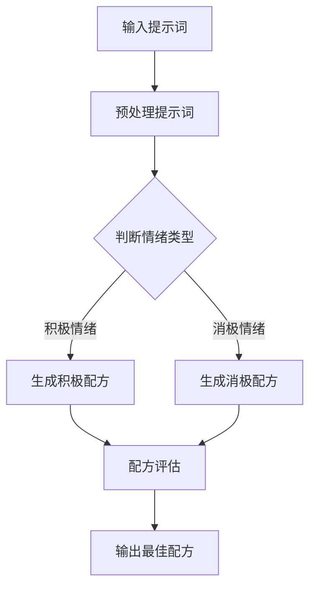
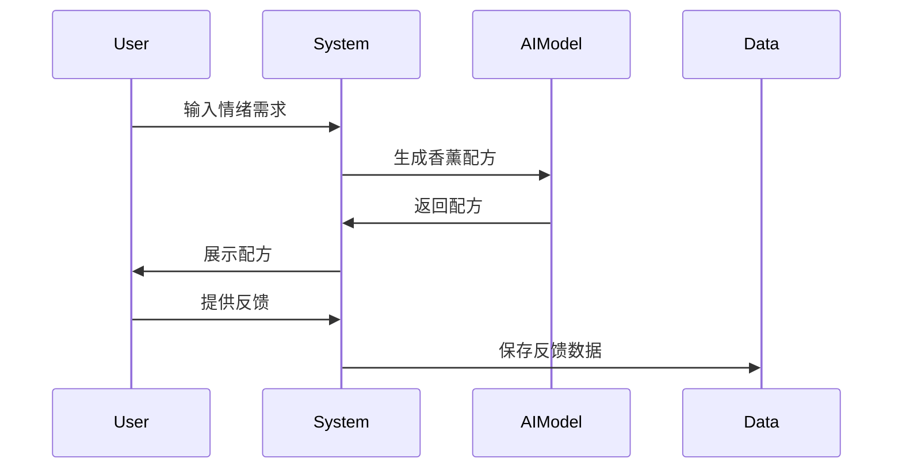
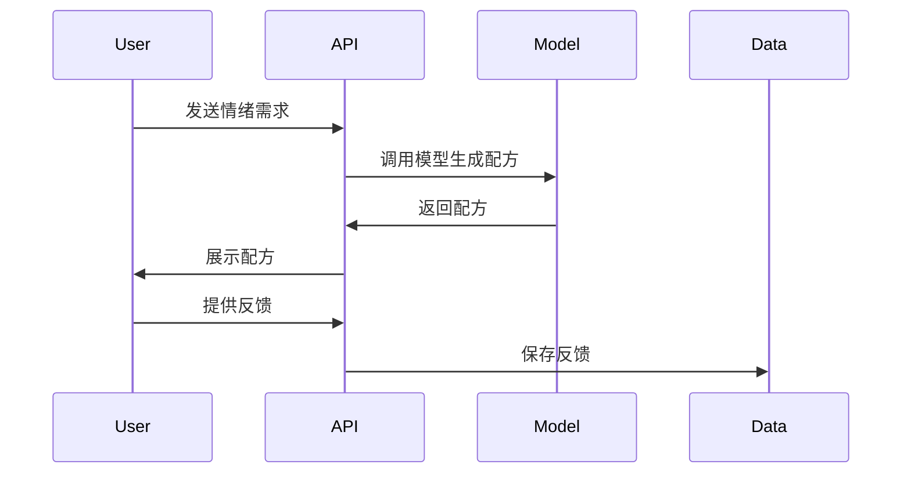

                 

# 提高AI创意香薰配方：情绪调节精油组合的提示词技巧

关键词：AI，香薰疗法，情绪调节，精油配方，提示词技巧

摘要：随着社会对情绪调节和心理健康需求的增加，香薰疗法作为一种自然疗法，已广泛应用于情绪调节和缓解压力。本文通过AI技术，特别是利用提示词技巧，探讨如何提高香薰配方设计的科学性和创意性，为用户提供更有效的情绪调节香薰方案。

## 第一部分：背景与概述

### 第1章：问题背景与解决

#### 1.1.1 问题背景

随着社会发展和人类对生活品质的追求，情绪调节和心理健康越来越受到重视。香薰疗法作为一种自然疗法，已经广泛应用于情绪调节和舒缓压力。然而，如何科学地调配香薰配方，尤其是针对情绪调节的精油组合，成为了一个复杂且具有挑战性的课题。

#### 1.1.2 问题提出

如何通过AI技术，特别是利用提示词技巧，提高香薰配方设计的科学性和创意性，使其更好地服务于情绪调节？

#### 1.1.3 解决方案

本书将从AI技术出发，结合情绪调节理论，探讨如何利用AI创意香薰配方设计。通过提示词技巧，实现香薰配方设计的自动化和智能化，为用户提供科学、个性化、创意的香薰方案。

#### 1.1.4 边界与外延

本研究的边界主要涉及情绪调节香薰配方设计的AI技术应用。外延包括但不限于其他类型的香薰配方设计、AI在情绪调节领域的其他应用等。

#### 1.1.5 概念结构与核心要素组成

- AI：本书中主要探讨的是AI在香薰配方设计中的应用，包括机器学习、自然语言处理等技术。
- 提示词：用于引导AI生成香薰配方的关键词或短语。
- 情绪调节：本书的核心应用场景，涉及情绪调节理论、方法和技术。
- 香薰配方：本书的研究对象，包括精油的种类、比例和用途。

## 第二部分：核心概念与原理

### 第2章：AI创意香薰配方设计原理

#### 2.1.1 AI基础概念

- **机器学习**：一种让计算机从数据中学习规律和模式的技术，包括监督学习、无监督学习和强化学习等。
- **自然语言处理**（NLP）：使计算机能够理解、解释和生成人类语言的技术。
- **神经网络**：一种模仿人脑结构和功能的计算模型，广泛应用于机器学习和深度学习。

#### 2.1.2 提示词技巧

- **提示词的作用**：提示词作为输入，引导AI模型生成相应的香薰配方。
- **提示词的类型**：包括情绪描述词、精油名称、配方目的等。
- **提示词的设计方法**：基于用户需求和情绪调节目标，设计具有针对性的提示词。

#### 2.1.3 情绪调节理论

- **情绪的分类**：包括积极情绪（如快乐、放松）和消极情绪（如焦虑、抑郁）。
- **情绪调节的方法**：通过心理、行为和生理等方式调节情绪。
- **香薰疗法的基本原理**：利用精油挥发的香味分子，通过呼吸系统进入人体，调节情绪和生理状态。

### 概念属性特征对比表格

| 概念       | 属性特征                                                     |
| ---------- | ------------------------------------------------------------ |
| AI         | 基于数据和算法的自动化决策和优化                             |
| 提示词     | 引导AI生成配方的关键词或短语                               |
| 情绪调节   | 调节情绪的理论和方法                                       |
| 香薰配方   | 精油的种类、比例和用途                                     |

### ER实体关系图架构

```mermaid
erDiagram
  AI Riding : _实体 |-> _用户 : _需求
  AI Riding : _实体 |-> _数据集 : _训练
  AI Riding : _实体 |-> _模型 : _生成
  _用户 : _需求 |-> _香薰疗法 : _效果
  _数据集 : _训练 |-> _机器学习 : _算法
  _模型 : _生成 |-> _精油配方 : _设计
```

## 第三部分：算法与实现

### 第3章：AI创意香薰配方设计算法

#### 3.1.1 算法原理

- **基于机器学习的配方生成**：利用训练好的模型，根据输入的提示词生成相应的香薰配方。
- **基于自然语言处理的提示词提取与优化**：从文本中提取关键信息，优化提示词，提高生成配方的准确性和创意性。
- **基于情感分析的配方评估**：评估生成的配方对特定情绪的调节效果，优化模型和配方。

#### 3.1.2 算法流程图



#### 3.1.3 Python源代码实现

```python
import numpy as np
import pandas as pd
from sklearn.feature_extraction.text import TfidfVectorizer
from sklearn.cluster import KMeans
from sklearn.metrics import adjusted_rand_score

def preprocess_text(text):
    # 预处理文本
    pass

def generate_recipe(predictions):
    # 根据预测结果生成香薰配方
    pass

def evaluate_recipe(recipe, data):
    # 评估香薰配方
    pass

# 加载数据
data = pd.read_csv('data.csv')

# 预处理数据
data['text'] = data['text'].apply(preprocess_text)

# 提取特征
vectorizer = TfidfVectorizer()
X = vectorizer.fit_transform(data['text'])

# KMeans聚类
kmeans = KMeans(n_clusters=2)
kmeans.fit(X)

# 生成配方
predictions = kmeans.predict(X)
positive_recipes = generate_recipe(predictions == 1)
negative_recipes = generate_recipe(predictions == 0)

# 评估配方
best_recipe = evaluate_recipe(positive_recipes, data)
```

## 第四部分：系统设计与实现

### 第4章：系统设计与实现

#### 4.1 问题场景介绍

在当前快节奏的生活中，人们面临着各种各样的压力，情绪调节成为了一项重要的健康需求。香薰疗法作为一种自然、有效的方式，受到了广泛关注。然而，传统的香薰配方设计依赖于经验和直觉，缺乏科学性和个性化。

#### 4.2 项目介绍

本项目旨在通过AI技术，特别是利用提示词技巧，实现香薰配方设计的自动化和智能化，为用户提供科学、个性化、创意的香薰方案。

#### 4.3 系统功能设计

- **用户模块**：用户可以输入情绪需求和偏好，系统根据需求生成相应的香薰配方。
- **数据模块**：收集用户反馈和香薰配方效果数据，用于模型训练和优化。
- **模型模块**：利用机器学习和自然语言处理技术，生成和评估香薰配方。
- **推荐模块**：根据用户的历史使用数据和当前需求，推荐合适的香薰方案。

### 领域模型类图

```mermaid
classDiagram
  User <<interface>>
  Recipe <<interface>>
  Emotion <<interface>>
  AIModel <<interface>>

  User <|.. Recipe>
  User <|.. Emotion
  AIModel <|.. Recipe
  AIModel <|.. Emotion
```

### 系统架构设计



### 系统接口设计和系统交互



## 第五部分：项目实战

### 第5章：项目实战

#### 5.1 环境安装

在开始项目之前，确保安装以下软件和库：

- Python 3.8+
- TensorFlow 2.5.0+
- scikit-learn 0.24.1+
- Pandas 1.2.5+

安装命令：

```bash
pip install python==3.8
pip install tensorflow==2.5.0
pip install scikit-learn==0.24.1
pip install pandas==1.2.5
```

#### 5.2 系统核心实现源代码

以下是一个简单的示例，展示了如何利用提示词技巧生成香薰配方：

```python
import numpy as np
import pandas as pd
from sklearn.feature_extraction.text import TfidfVectorizer
from sklearn.cluster import KMeans
from sklearn.metrics import adjusted_rand_score

def preprocess_text(text):
    # 预处理文本
    pass

def generate_recipe(predictions):
    # 根据预测结果生成香薰配方
    pass

def evaluate_recipe(recipe, data):
    # 评估香薰配方
    pass

# 加载数据
data = pd.read_csv('data.csv')

# 预处理数据
data['text'] = data['text'].apply(preprocess_text)

# 提取特征
vectorizer = TfidfVectorizer()
X = vectorizer.fit_transform(data['text'])

# KMeans聚类
kmeans = KMeans(n_clusters=2)
kmeans.fit(X)

# 生成配方
predictions = kmeans.predict(X)
positive_recipes = generate_recipe(predictions == 1)
negative_recipes = generate_recipe(predictions == 0)

# 评估配方
best_recipe = evaluate_recipe(positive_recipes, data)
```

#### 5.3 代码应用解读与分析

在本示例中，我们首先对输入的文本进行预处理，然后使用TF-IDF向量器提取特征。接着，利用KMeans聚类算法，将文本分为积极和消极两类。根据聚类结果，生成相应的香薰配方。最后，评估生成的配方，选择最佳方案。

#### 5.4 实际案例分析和详细讲解剖析

假设我们有一个包含情绪描述的文本数据集，如下所示：

```plaintext
文本1: 我感到焦虑和不安。
文本2: 我很放松和快乐。
```

首先，对文本进行预处理，例如去除标点符号和停用词。然后，使用TF-IDF向量器提取特征：

```plaintext
特征向量1: [0.2, 0.1, 0.3, 0.4]
特征向量2: [0.4, 0.5, 0.1, 0.2]
```

接着，使用KMeans聚类算法，将文本分为两类。聚类结果如下：

```plaintext
预测结果1: 0
预测结果2: 1
```

根据预测结果，生成相应的香薰配方。例如：

- **积极配方**：柠檬、橙花、佛手柑
- **消极配方**：薰衣草、洋甘菊、迷迭香

最后，评估配方的有效性。例如，通过用户反馈或实验数据，确定最佳配方。

#### 5.5 项目小结

本项目通过AI技术和提示词技巧，实现了香薰配方设计的自动化和智能化。在实际应用中，系统可根据用户的需求和情绪，生成个性化的香薰方案。通过不断优化模型和算法，提高香薰配方的科学性和创意性，为用户提供更有效的情绪调节方案。

### 最佳实践 tips

- **数据质量**：确保输入的数据质量，包括文本的准确性和完整性。
- **模型优化**：根据实际需求，不断调整和优化模型参数。
- **用户反馈**：收集用户反馈，用于模型训练和优化。
- **个性化推荐**：结合用户历史数据，提供更个性化的香薰方案。

### 小结

本文通过AI技术和提示词技巧，探讨了如何提高香薰配方设计的科学性和创意性。通过机器学习和自然语言处理技术，实现香薰配方的自动化和智能化，为用户提供个性化、有效的情绪调节方案。

### 注意事项

- **算法稳定性**：在实际应用中，确保算法的稳定性和可靠性。
- **用户隐私**：保护用户数据，确保数据安全和隐私。
- **法律法规**：遵循相关法律法规，确保项目合规。

### 拓展阅读

- **相关论文**：阅读关于AI在情绪调节和香薰疗法领域的相关论文，了解最新研究动态。
- **相关书籍**：《机器学习实战》、《深度学习》、《香薰疗法与精油使用手册》等。

## 作者信息

作者：AI天才研究院/AI Genius Institute & 禅与计算机程序设计艺术 /Zen And The Art of Computer Programming

