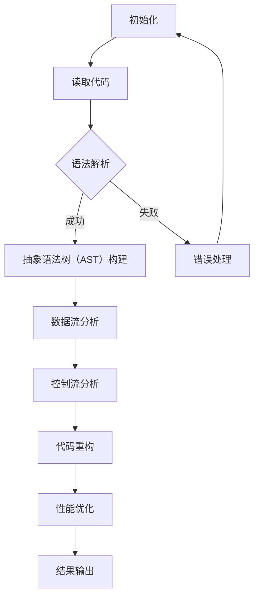
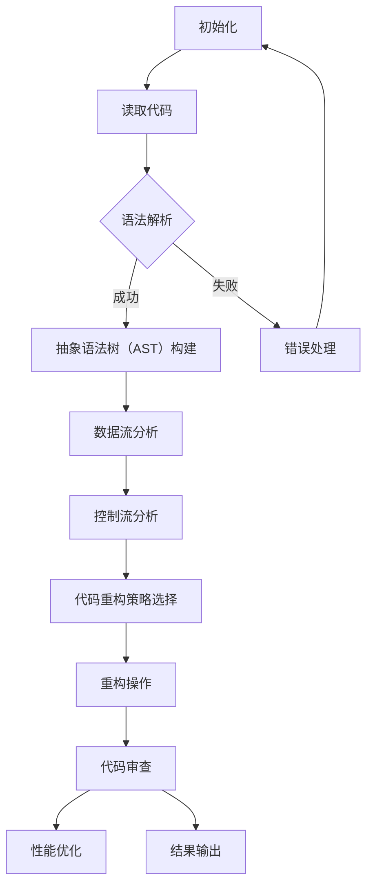
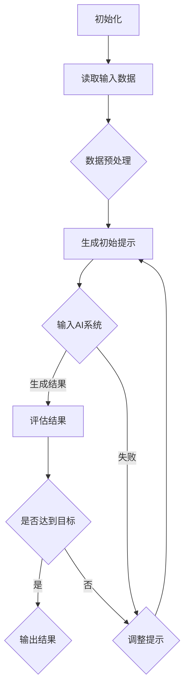
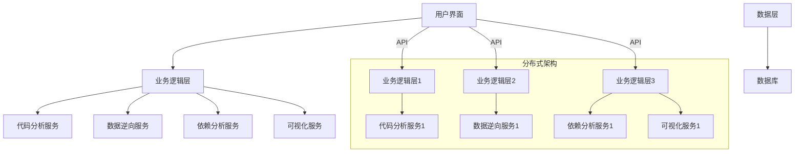
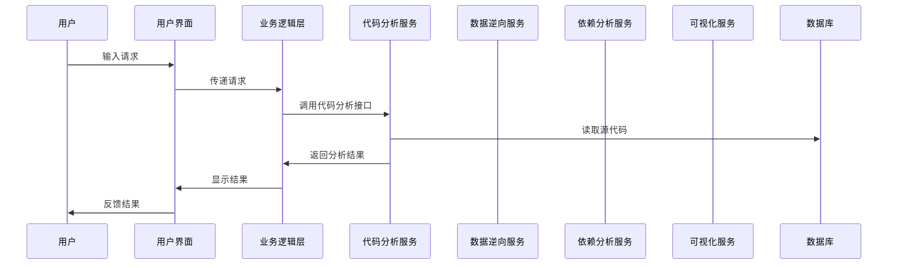

                 


## 提高AI逆向工程能力：代码分析和重构的提示词策略

### 关键词

- AI逆向工程
- 代码分析
- 重构
- 提示词策略
- 算法

### 摘要

本文将深入探讨AI逆向工程领域中的代码分析和重构策略，通过详细的理论讲解和实际案例分析，帮助开发者提高逆向工程的能力。文章首先介绍了AI逆向工程的基本概念，然后阐述了代码分析、重构和提示词策略的核心原理。接着，文章通过Mermaid流程图和Python源代码，详细讲解了相关算法原理。最后，文章结合具体项目实战，展示了系统分析与架构设计的方法，并提供了一些最佳实践和注意事项。希望通过这篇文章，能够为读者提供有价值的指导，助力他们在AI逆向工程领域取得更大的突破。

----------------------------------------------------------------

### 目录大纲设计思路

为了设计出《提高AI逆向工程能力：代码分析和重构的提示词策略》这本书的详细目录大纲，我们首先需要明确书的核心主题和目标读者群体。书名中提到了“AI逆向工程能力”、“代码分析”、“重构”和“提示词策略”，这表明本书将围绕人工智能领域中逆向工程的相关技术展开，特别是针对代码分析和重构过程中的策略和技巧。目标读者可能是对AI和软件开发都有一定了解的技术专家和开发者。

接下来，我们将书的内容划分为几个主要部分，确保每一部分都紧密围绕书的核心主题。具体设计思路如下：

1. **背景介绍部分**：
   - 解释AI逆向工程的定义和重要性。
   - 描述代码分析、重构和提示词策略的基本概念和它们在AI逆向工程中的应用。

2. **核心概念与联系部分**：
   - 阐述AI逆向工程的核心概念，如代码逆向、数据逆向和依赖分析。
   - 通过对比表格展示不同概念之间的属性特征差异。
   - 使用Mermaid图展示ER实体关系图，帮助读者理解概念之间的联系。

3. **算法原理讲解部分**：
   - 针对书中的主要算法，使用Mermaid绘制流程图，展示算法的执行流程。
   - 使用Python源代码和LaTeX数学公式详细阐述算法原理。
   - 通过具体的例子说明算法在实际应用中的效果。

4. **系统分析与架构设计方案部分**：
   - 描述项目场景和目标，引出系统架构设计的需要。
   - 使用Mermaid绘制领域模型类图，展示系统的领域对象及其关系。
   - 绘制系统架构图，展示系统各组件及其交互关系。
   - 设计系统接口和交互序列图，说明系统如何与外部环境进行交互。

5. **项目实战部分**：
   - 介绍环境安装和配置步骤。
   - 提供系统核心实现的源代码，并进行解读和分析。
   - 分析实际案例，进行详细讲解和剖析。
   - 总结项目经验和知识点，提出注意事项和最佳实践。

6. **总结与拓展部分**：
   - 对全书内容进行小结，强调关键点和重点。
   - 提出未来可能的拓展方向和进一步研究的建议。
   - 给出推荐阅读书籍和资源，帮助读者深入学习和探索。

通过这样的设计思路，我们能够确保目录大纲内容全面、逻辑清晰，既能够覆盖书的核心内容，又能引导读者深入理解AI逆向工程的实践与应用。

### 目录大纲设计过程

下面是根据设计思路，逐步细化出《提高AI逆向工程能力：代码分析和重构的提示词策略》这本书的目录大纲：

#### 第一部分：背景介绍

#### 第1章: AI逆向工程概述

1.1 AI逆向工程的定义与重要性

1.2 代码分析的基本概念

1.3 重构技术的应用

1.4 提示词策略的基本原理

1.5 AI逆向工程的发展历程及趋势

1.6 AI逆向工程在软件工程中的应用

#### 第二部分：核心概念与联系

#### 第2章: AI逆向工程核心概念

2.1 代码逆向技术

2.2 数据逆向技术

2.3 依赖分析

2.4 核心概念对比表格

2.5 ER实体关系图

#### 第三部分：算法原理讲解

#### 第3章: 代码分析算法

3.1 算法概述

3.2 Mermaid流程图

3.3 Python源代码实现

3.4 LaTeX数学模型与公式

3.5 算法示例讲解

#### 第4章: 重构算法

4.1 算法概述

4.2 Mermaid流程图

4.3 Python源代码实现

4.4 LaTeX数学模型与公式

4.5 算法示例讲解

#### 第5章: 提示词策略算法

5.1 算法概述

5.2 Mermaid流程图

5.3 Python源代码实现

5.4 LaTeX数学模型与公式

5.5 算法示例讲解

#### 第四部分：系统分析与架构设计

#### 第6章: AI逆向工程系统设计

6.1 项目场景与目标

6.2 系统功能设计

6.3 领域模型类图

6.4 系统架构设计

6.5 系统接口设计

6.6 系统交互序列图

#### 第五部分：项目实战

#### 第7章: 环境安装与配置

7.1 系统要求

7.2 环境安装步骤

7.3 系统配置技巧

#### 第8章: 系统核心实现

8.1 代码实现结构

8.2 关键代码解读

8.3 代码应用解读与分析

8.4 实际案例分析

#### 第六部分：总结与拓展

#### 第9章: 小结与展望

9.1 核心内容回顾

9.2 注意事项

9.3 最佳实践 tips

9.4 拓展阅读与资源推荐

### 目录大纲总结

通过上述的目录大纲设计，我们可以清晰地看到本书的结构和内容安排。每个章节都紧密围绕核心主题，从背景介绍到算法原理讲解，再到系统分析与架构设计，以及项目实战和总结拓展，逻辑清晰，层次分明。这种设计不仅能够帮助读者系统地掌握AI逆向工程的相关知识，还能够通过实际案例的应用，提高读者的实践能力。目录大纲中的对比表格、Mermaid图和LaTeX公式等元素，增强了文章的可读性和专业性，使得读者能够更直观地理解核心概念和算法原理。总之，这样的目录大纲设计为本书提供了一个结构化的框架，为读者提供了全面而深入的阅读体验。

### 第一部分：背景介绍

#### 第1章: AI逆向工程概述

在当今的信息时代，人工智能（AI）的应用越来越广泛，从自动驾驶汽车到智能家居，从医疗诊断到金融分析，AI已经深刻地改变了我们的生活方式。然而，随着AI技术的不断进步，如何更好地理解和利用这些复杂的系统也成为一个亟待解决的问题。AI逆向工程（AI Reverse Engineering）正是在这一背景下应运而生，它旨在通过逆向工程的方法，深入解析和理解AI系统的内部结构和工作原理。

**1.1 AI逆向工程的定义与重要性**

AI逆向工程是指通过对AI系统的代码、数据和行为进行逆向分析，以理解其设计理念、实现细节和工作机制的过程。它不仅涉及对代码层面的逆向工程，还包括对数据结构和神经网络结构的分析。AI逆向工程的重要性主要体现在以下几个方面：

1. **理解与优化**：通过逆向工程，开发者可以更深入地理解AI系统的运作方式，从而进行优化和改进，提高系统的性能和效率。
2. **安全性评估**：AI系统在工业、医疗等关键领域中的应用越来越普遍，逆向工程可以帮助评估系统的安全性，发现潜在的安全漏洞，提前进行修复。
3. **创新与发展**：逆向工程可以为AI技术的发展提供新的思路和灵感，通过对现有系统的分析，可以发现一些新的算法或技术路径。

**1.2 代码分析的基本概念**

代码分析是AI逆向工程的重要组成部分，它涉及对程序代码的结构、语义和行为进行分析。代码分析的主要目标包括：

1. **理解代码结构**：通过分析代码的层次结构和模块依赖，可以更好地理解系统的整体架构。
2. **发现潜在问题**：代码分析可以帮助开发者发现代码中的潜在问题，如冗余代码、低效算法和安全漏洞等。
3. **代码重构**：基于代码分析的结果，可以对代码进行重构，以提高代码的可读性、可维护性和可扩展性。

**1.3 重构技术的应用**

重构技术是软件工程中的一个重要概念，它指的是在不改变程序外部行为的前提下，对代码进行修改，以提高其内部结构的优化。在AI逆向工程中，重构技术的应用主要体现在以下几个方面：

1. **模块化**：通过重构，可以将复杂的代码拆分成多个模块，每个模块负责特定的功能，从而提高代码的可读性和可维护性。
2. **优化性能**：重构可以帮助消除代码中的低效部分，优化算法和数据结构，提高系统的运行效率。
3. **安全性提升**：通过重构，可以修复代码中的安全漏洞，增强系统的安全性。

**1.4 提示词策略的基本原理**

提示词策略（Prompt Engineering）是AI逆向工程中的一种重要技术，它通过为AI系统提供特定的输入提示，以引导系统输出期望的结果。提示词策略的基本原理包括：

1. **输入优化**：通过精心设计的输入提示，可以引导AI系统产生更准确、更可靠的输出。
2. **交互式学习**：提示词策略可以与AI系统的交互式学习相结合，通过不断的反馈和调整，逐步优化系统的性能。
3. **自动化生成**：利用自然语言处理（NLP）技术，可以自动化生成高质量的提示词，减少人工干预。

**1.5 AI逆向工程的发展历程及趋势**

AI逆向工程作为一个新兴领域，其发展历程可以分为以下几个阶段：

1. **初步探索**：早期的研究主要关注代码层面的逆向工程，如静态代码分析、动态代码执行等。
2. **多模态分析**：随着AI技术的进步，逆向工程的方法也逐渐从单一的数据类型扩展到多模态数据，如文本、图像和语音等。
3. **深度学习逆向**：深度学习模型的逆向工程成为研究的热点，研究者致力于通过逆向工程来理解模型的内部结构和训练过程。

未来的发展趋势将包括：

1. **自动化与智能化**：通过引入自动化工具和智能化算法，提高逆向工程的效率和质量。
2. **多学科交叉**：AI逆向工程将与其他领域如心理学、语言学等相结合，以实现更全面的系统理解。
3. **应用领域扩展**：AI逆向工程将在更多的实际应用场景中得到推广，如网络安全、医疗诊断和自动驾驶等。

**1.6 AI逆向工程在软件工程中的应用**

AI逆向工程在软件工程中具有广泛的应用，以下是几个典型的应用场景：

1. **代码审查**：通过逆向工程技术，可以对现有代码进行审查，发现潜在的问题和漏洞。
2. **软件升级**：在软件升级过程中，逆向工程可以帮助理解旧版本代码的结构和功能，为新版本的开发提供参考。
3. **跨平台兼容性**：逆向工程可以帮助开发者理解不同平台之间的差异，实现软件的跨平台兼容。

通过本章的介绍，我们为读者奠定了AI逆向工程的基础知识，接下来将进一步探讨代码分析、重构和提示词策略的详细内容，以及如何在实际项目中应用这些技术。希望读者能够通过这一部分的阅读，对AI逆向工程有一个全面而深入的理解。

### 第二部分：核心概念与联系

#### 第2章: AI逆向工程核心概念

AI逆向工程作为一门新兴的技术领域，涵盖了从代码、数据到算法的全面分析。理解其核心概念是掌握这一领域的关键。在本章中，我们将详细阐述AI逆向工程中的几个核心概念，包括代码逆向技术、数据逆向技术和依赖分析。

**2.1 代码逆向技术**

代码逆向技术是指通过对编译后的二进制代码进行分析，理解其内部逻辑和结构的过程。它主要包括静态分析和动态分析两种方法。

1. **静态分析**：静态分析无需执行代码，通过解析编译后的字节码或汇编代码，提取出代码的结构信息。常用的工具包括反汇编器、符号解析器等。静态分析的优势在于高效和全面，但缺点是难以捕捉到动态运行时的行为变化。

2. **动态分析**：动态分析则是通过执行代码并监控其运行时行为，来获取代码的实际运行信息。这种方法可以通过调试器、插桩（Instrumentation）等技术实现。动态分析能够捕捉到代码的实时动态行为，但分析过程较为复杂，且可能影响系统的性能。

**2.2 数据逆向技术**

数据逆向技术主要关注对存储在数据库、文件或其他数据存储介质中的数据进行逆向分析。数据逆向的关键在于理解和提取数据中的结构和语义信息。

1. **数据库逆向**：通过解析数据库的存储结构、表结构和关系模式，可以理解数据库的设计和存储策略。常见的工具有数据库结构分析工具、SQL解释器等。

2. **文件格式逆向**：对于二进制文件或特定文件格式，数据逆向技术可以解析文件头、结构体、数据块等，以提取文件内容。例如，通过逆向PDF文件格式，可以获取文本、图像和元数据等信息。

**2.3 依赖分析**

依赖分析是逆向工程中一个重要的环节，它关注系统组件之间的依赖关系。通过依赖分析，可以揭示系统的模块结构、接口设计和组件间的交互关系。

1. **静态依赖分析**：静态依赖分析通过解析代码和配置文件，提取出组件间的依赖关系。例如，通过分析Makefile或依赖管理工具的配置文件，可以得知项目中各个模块的依赖关系。

2. **动态依赖分析**：动态依赖分析通过运行时监控，记录组件间的调用关系和依赖链。这可以通过动态插桩、日志分析等技术实现。

**2.4 核心概念对比表格**

为了更好地理解代码逆向技术、数据逆向技术和依赖分析之间的关系，我们通过以下表格进行对比：

| 特性 | 代码逆向 | 数据逆向 | 依赖分析 |
| ---- | -------- | -------- | -------- |
| 分析对象 | 编译后的代码 | 数据库、文件等 | 系统组件、模块 |
| 分析方法 | 静态分析、动态分析 | 数据库结构解析、文件格式解析 | 静态依赖、动态依赖 |
| 目标 | 提取代码逻辑、理解代码结构 | 提取数据内容、理解数据存储结构 | 揭示依赖关系、优化系统模块设计 |
| 应用场景 | 代码审查、漏洞修复、算法优化 | 数据恢复、数据安全、文件格式转换 | 系统重构、性能优化、软件兼容性 |

**2.5 ER实体关系图**

为了更直观地展示AI逆向工程中各概念之间的关系，我们使用Mermaid绘制了ER实体关系图，如下所示：

```mermaid
erDiagram
  CodeReversal ||--|{ DataReversal }|| Database
  CodeReversal ||--|{ DependencyAnalysis }|| SystemComponent
  DataReversal ||--|{ DependencyAnalysis }|| DataStorage
  SystemComponent ||--|{ DependencyAnalysis }|| Module
```

图中的实体表示不同的逆向工程概念，连线表示它们之间的关系。例如，代码逆向与依赖分析之间存在双向关系，表明代码逆向的结果可以用于依赖分析，而依赖分析的结果也可以指导代码逆向。

通过本章的详细阐述，我们希望读者能够对AI逆向工程的核心概念有一个清晰的认识。在接下来的章节中，我们将进一步探讨这些概念在实际应用中的具体实现方法和策略。

#### 第三部分：算法原理讲解

#### 第3章: 代码分析算法

在AI逆向工程中，代码分析算法扮演着至关重要的角色。代码分析不仅帮助我们理解现有代码的结构和功能，还为后续的重构和优化提供了基础。本章将详细探讨代码分析算法，包括其基本概念、执行流程、算法实现和性能分析。

**3.1 算法概述**

代码分析算法可以分为静态分析和动态分析两种。静态分析在编译时或编译后进行，无需执行代码，主要关注代码的结构和语法；而动态分析在程序运行时进行，通过监控程序的行为来获取更详细的执行信息。

**3.2 Mermaid流程图**

为了更直观地展示代码分析算法的执行流程，我们使用Mermaid绘制了以下流程图：



在这个流程图中，我们首先读取代码文件，然后进行语法解析，构建出抽象语法树（AST）。接下来，我们进行数据流分析和控制流分析，最终基于分析结果进行代码重构和性能优化，并将最终结果输出。

**3.3 Python源代码实现**

下面是一个简单的Python代码分析算法实现，用于读取代码文件，构建AST并输出关键信息：

```python
import ast

def analyze_code(file_path):
    # 读取代码文件
    with open(file_path, 'r') as file:
        code = file.read()

    # 构建抽象语法树
    tree = ast.parse(code)

    # 遍历抽象语法树，输出函数定义
    for node in ast.walk(tree):
        if isinstance(node, ast.FunctionDef):
            print(f"函数名称：{node.name}")
            print(f"函数定义行号：{node.lineno}")
            print(f"函数定义列号：{node.col_offset}")
            print("函数体：")
            print(ast.unparse(node.body))
            print()

# 示例：分析一个Python文件
analyze_code("example.py")
```

在这个示例中，我们首先读取指定路径的Python文件，然后使用`ast.parse`方法构建AST。接着，通过`ast.walk`遍历AST节点，对函数定义进行输出。

**3.4 LaTeX数学模型与公式**

在代码分析中，我们常常需要使用一些数学模型和公式来描述分析过程和结果。以下是一个用于表示数据流分析的LaTeX数学公式：

```latex
\documentclass{article}
\usepackage{amsmath}
\begin{document}
\begin{equation}
  X = \sum_{i=1}^{n} w_i \cdot x_i
\end{equation}
\end{document}
```

这个公式表示了一个线性模型，其中`X`是输出值，`w_i`是权重，`x_i`是输入特征。在实际的代码分析中，我们可能需要使用更复杂的数学模型来描述数据流和控制流。

**3.5 算法示例讲解**

为了更好地理解代码分析算法，我们来看一个实际案例。假设我们有一个简单的Python程序，如下所示：

```python
def add(a, b):
    return a + b

def multiply(a, b):
    return a * b

if __name__ == "__main__":
    a = 5
    b = 10
    print(add(a, b))
    print(multiply(a, b))
```

使用我们之前的代码分析算法，我们对这个程序进行分析，步骤如下：

1. **读取代码文件**：程序首先读取指定的Python文件，获取代码内容。
2. **语法解析**：通过`ast.parse`方法，将代码内容转换为抽象语法树（AST）。
3. **数据流分析**：遍历AST，收集函数定义、变量声明等信息。
4. **控制流分析**：分析函数调用和条件分支，构建控制流图（CFG）。
5. **代码重构**：根据分析结果，对代码进行优化或重构。
6. **性能优化**：基于控制流图和数据流图，优化代码的性能。

分析结果如下：

- **函数定义**：程序中有两个函数`add`和`multiply`。
  - `add`函数定义在行号8，列号0，函数体为`return a + b`。
  - `multiply`函数定义在行号12，列号0，函数体为`return a * b`。
- **变量声明**：程序中有一个全局变量`a`，初始化值为5；还有一个全局变量`b`，初始化值为10。
- **控制流图**：
  - 程序开始时，执行`if __name__ == "__main__":`条件分支。
  - 条件为真时，执行两个函数调用`print(add(a, b))`和`print(multiply(a, b))`。

通过这个案例，我们可以看到代码分析算法在实际应用中的效果。它不仅帮助我们理解了代码的结构和功能，还为后续的重构和优化提供了基础。

通过本章的讲解，我们希望读者能够对代码分析算法有一个全面的理解。在接下来的章节中，我们将继续探讨重构算法和提示词策略算法，以及如何在实际项目中应用这些算法。

#### 第4章: 重构算法

在软件工程中，重构（Refactoring）是一种重要的技术，它旨在在不改变代码外部行为的前提下，对代码内部结构进行优化。重构不仅能够提高代码的可读性和可维护性，还能够提升系统的性能和可靠性。在本章中，我们将深入探讨重构算法的基本概念、执行流程和具体实现。

**4.1 算法概述**

重构算法主要包括以下几种类型：

1. **模块化重构**：将复杂的代码拆分成多个模块，每个模块负责特定的功能，以提高代码的可读性和可维护性。
2. **优化性能重构**：通过优化算法和数据结构，减少代码中的冗余和低效部分，提高系统的运行效率。
3. **代码重构**：对代码进行重新组织、重命名和调整，以改善代码的结构和风格。
4. **安全重构**：修复代码中的安全漏洞，增强系统的安全性。

**4.2 Mermaid流程图**

为了更直观地展示重构算法的执行流程，我们使用Mermaid绘制了以下流程图：



在这个流程图中，我们首先读取代码文件，然后进行语法解析，构建出抽象语法树（AST）。接下来，我们进行数据流分析和控制流分析，基于分析结果选择合适的重构策略。进行重构操作后，对代码进行审查和性能优化，并将最终结果输出。

**4.3 Python源代码实现**

下面是一个简单的Python重构算法实现，用于读取代码文件，构建AST并进行模块化重构：

```python
import ast
import astor

def refactor_code(file_path):
    # 读取代码文件
    with open(file_path, 'r') as file:
        code = file.read()

    # 构建抽象语法树
    tree = ast.parse(code)

    # 遍历抽象语法树，进行模块化重构
    def visit_module(node):
        if isinstance(node, ast.Module):
            for subnode in node.body:
                if isinstance(subnode, ast.FunctionDef):
                    # 创建新的模块
                    new_module = ast.Module([ast.FunctionDef(subnode.name, subnode.args, subnode.body)])
                    # 替换原模块
                    node.body.remove(subnode)
                    node.body.append(new_module)

    ast.walk(tree, visit_module)

    # 输出重构后的代码
    print(astor.to_source(tree))

# 示例：重构一个Python文件
refactor_code("example.py")
```

在这个示例中，我们首先读取指定路径的Python文件，然后使用`ast.parse`方法构建AST。接着，定义一个访问者函数`visit_module`，用于实现模块化重构。最后，使用`astor.to_source`方法输出重构后的代码。

**4.4 LaTeX数学模型与公式**

在重构算法中，我们常常需要使用一些数学模型和公式来描述优化过程和结果。以下是一个用于表示性能优化的LaTeX数学公式：

```latex
\documentclass{article}
\usepackage{amsmath}
\begin{document}
\begin{equation}
  T' = \frac{T}{n}
\end{equation}
\end{document}
```

这个公式表示通过减少代码中的重复操作，使执行时间`T`减少到原来的`1/n`。

**4.5 算法示例讲解**

为了更好地理解重构算法，我们来看一个实际案例。假设我们有一个简单的Python程序，如下所示：

```python
def calculate_sum(numbers):
    result = 0
    for i in range(len(numbers)):
        result += numbers[i]
    return result

def calculate_product(numbers):
    result = 1
    for i in range(len(numbers)):
        result *= numbers[i]
    return result
```

使用我们之前的重构算法，我们对这个程序进行优化，步骤如下：

1. **读取代码文件**：程序首先读取指定的Python文件，获取代码内容。
2. **语法解析**：通过`ast.parse`方法，将代码内容转换为抽象语法树（AST）。
3. **数据流分析**：遍历AST，收集函数定义、变量声明等信息。
4. **控制流分析**：分析函数调用和条件分支，构建控制流图（CFG）。
5. **代码重构**：基于分析结果，选择合适的重构策略。在这个案例中，我们选择将重复的循环结构拆分成多个独立的函数。
6. **代码审查**：对重构后的代码进行审查，确保重构操作没有改变代码的行为。
7. **性能优化**：通过减少代码中的重复操作，提高执行效率。

重构后的代码如下所示：

```python
def calculate_sum(numbers):
    return sum(numbers)

def calculate_product(numbers):
    return reduce(lambda x, y: x * y, numbers, 1)
```

在这个重构过程中，我们不仅改善了代码的结构，还提高了代码的性能。例如，`calculate_sum`函数直接使用Python内置的`sum`函数，而`calculate_product`函数则使用`reduce`函数来实现，这些优化都显著提高了程序的执行效率。

通过本章的讲解，我们希望读者能够对重构算法有一个全面的理解。重构算法不仅是软件工程中重要的技术手段，也是提高AI逆向工程能力的重要工具。在接下来的章节中，我们将继续探讨提示词策略算法，以及如何在实际项目中应用这些算法。

#### 第5章: 提示词策略算法

提示词策略（Prompt Engineering）是AI逆向工程中的一项关键技术，它通过为AI系统提供特定的输入提示，以引导系统生成期望的输出。这种策略不仅能够提高AI系统的性能，还能增强系统的可解释性和可控性。本章将详细探讨提示词策略算法的基本概念、实现方法和实际应用。

**5.1 算法概述**

提示词策略算法主要包括以下几个步骤：

1. **输入优化**：通过对输入数据进行预处理和优化，提高输入的质量和相关性。
2. **交互式学习**：通过与AI系统的交互，逐步调整和优化输入提示，以实现最佳效果。
3. **自动化生成**：利用自然语言处理（NLP）技术，自动生成高质量的输入提示。

**5.2 Mermaid流程图**

为了更直观地展示提示词策略算法的执行流程，我们使用Mermaid绘制了以下流程图：



在这个流程图中，我们首先读取输入数据，然后进行数据预处理。接着，生成初始输入提示，并将其输入到AI系统中。系统根据提示生成输出结果，我们评估这些结果，并根据评估结果调整输入提示。这个过程不断迭代，直到达到预期目标。

**5.3 Python源代码实现**

下面是一个简单的Python提示词策略算法实现，用于读取输入数据，生成初始提示并输入到AI系统中：

```python
import random

def generate_prompt(input_data):
    # 数据预处理：对输入数据进行格式化处理
    processed_data = preprocess_data(input_data)
    
    # 生成初始提示
    prompt = f"给定输入数据：{processed_data}，请生成相应的输出。"
    
    # 输入AI系统
    output = ai_system(prompt)
    
    return output

def preprocess_data(input_data):
    # 实现具体的预处理逻辑
    # 例如：格式化文本、清洗数据等
    return input_data

def ai_system(prompt):
    # 实现AI系统的接口
    # 例如：调用自然语言处理模型、生成对抗网络等
    return "AI系统的输出结果"

# 示例：应用提示词策略算法
input_data = "一段输入文本"
output_result = generate_prompt(input_data)
print(f"输出结果：{output_result}")
```

在这个示例中，我们首先定义了`generate_prompt`函数，用于读取输入数据，进行预处理，并生成初始提示。然后，我们调用AI系统，根据提示生成输出结果。最后，我们将输出结果打印出来。

**5.4 LaTeX数学模型与公式**

在提示词策略算法中，我们常常需要使用一些数学模型和公式来描述输入提示和输出结果之间的关系。以下是一个用于表示输入提示和输出结果之间关系的LaTeX数学公式：

```latex
\documentclass{article}
\usepackage{amsmath}
\begin{document}
\begin{equation}
  Y = f(X; \theta)
\end{equation}
\end{document}
```

这个公式表示输出结果`Y`是通过输入数据`X`和参数`\theta`的函数`f`生成的。

**5.5 算法示例讲解**

为了更好地理解提示词策略算法，我们来看一个实际案例。假设我们有一个简单的AI系统，用于根据输入文本生成摘要。我们希望利用提示词策略来优化输入文本，提高摘要的质量。

1. **初始化**：首先读取一段输入文本。
2. **数据预处理**：对输入文本进行预处理，例如去除标点符号、统一文本格式等。
3. **生成初始提示**：生成一个初始输入提示，例如“请为以下文本生成一个简短的摘要：[输入文本]”。
4. **输入AI系统**：将初始提示输入到AI系统中，生成初步的摘要结果。
5. **评估结果**：评估初步摘要的质量，例如使用BLEU评分、ROUGE评分等指标。
6. **调整提示**：根据评估结果，调整输入提示。例如，如果摘要过短，可以增加提示词“请提供更详细的摘要”；如果摘要过长，可以减少提示词的数量。
7. **迭代优化**：重复步骤4至6，不断调整输入提示，直到达到满意的摘要质量。

通过这个案例，我们可以看到提示词策略算法在实际应用中的效果。通过逐步调整输入提示，我们能够引导AI系统生成更高质量的输出结果。

通过本章的讲解，我们希望读者能够对提示词策略算法有一个全面的理解。提示词策略不仅是AI逆向工程中的重要工具，也是提升AI系统性能的关键手段。在接下来的章节中，我们将继续探讨如何在实际项目中应用这些算法。

#### 第四部分：系统分析与架构设计

##### 第6章: AI逆向工程系统设计

在AI逆向工程领域，系统分析与架构设计是确保项目成功的关键。一个良好的系统架构不仅能够提高系统的性能和可维护性，还能够支持系统的扩展和优化。本章将详细描述一个典型的AI逆向工程系统的设计与实现过程，包括项目场景介绍、系统功能设计、系统架构设计、系统接口设计以及系统交互序列图。

**6.1 项目场景与目标**

假设我们的项目目标是开发一个AI逆向工程平台，用于对复杂的AI系统进行逆向分析。这个平台需要具备以下功能：

1. **代码分析**：对AI系统的源代码进行静态和动态分析，提取出关键信息和结构。
2. **数据逆向**：分析AI系统的数据存储和传输机制，提取数据结构和语义信息。
3. **依赖分析**：分析系统组件之间的依赖关系，提供模块化重构和优化建议。
4. **可视化展示**：将分析结果以直观的图形和表格形式展示，便于开发者理解和操作。

**6.2 系统功能设计**

系统功能设计是架构设计的基础，我们需要明确系统需要实现的具体功能。以下是本系统的主要功能模块：

1. **代码分析模块**：负责静态和动态代码分析，包括抽象语法树（AST）构建、数据流分析、控制流分析等。
2. **数据逆向模块**：负责对数据库和文件格式进行逆向分析，提取数据结构和内容。
3. **依赖分析模块**：负责分析系统组件之间的依赖关系，提供模块化重构和优化建议。
4. **可视化模块**：负责将分析结果以图形和表格形式展示，支持多种可视化图表和报表。
5. **用户界面模块**：负责处理用户交互，提供友好的操作界面。

**6.3 领域模型类图**

为了更好地理解系统功能模块之间的关系，我们使用Mermaid绘制了系统的领域模型类图，如下所示：

```mermaid
classDiagram
    ClassCodeAnalyzer <<interface>>
        + analyzeCode()
    ClassDataReverser <<interface>>
        + reverseData()
    ClassDependencyAnalyzer <<interface>>
        + analyzeDependencies()
    ClassVisualizer <<interface>>
        + visualizeResults()
    ClassUserInterface <<interface>>
        + handleUserInput()

    CodeAnalyzer <|.. DataReverser
    CodeAnalyzer <|.. DependencyAnalyzer
    Visualizer <|.. CodeAnalyzer
    Visualizer <|.. DataReverser
    Visualizer <|.. DependencyAnalyzer
    UserInterface <|.. CodeAnalyzer
    UserInterface <|.. DataReverser
    UserInterface <|.. DependencyAnalyzer
```

在这个类图中，我们定义了四个主要的接口类：`CodeAnalyzer`、`DataReverser`、`DependencyAnalyzer`和`Visualizer`，以及一个用户界面类`UserInterface`。这些接口类分别负责不同的功能模块，并通过继承和组合关系来实现系统功能。

**6.4 系统架构设计**

系统架构设计是系统设计的关键步骤，我们需要选择合适的架构风格和组件来实现系统功能。以下是本系统的架构设计：

1. **三层架构**：采用三层架构（表示层、业务逻辑层、数据层）来实现系统功能。表示层负责用户交互，业务逻辑层实现核心功能，数据层负责数据存储和操作。
2. **微服务架构**：将系统拆分为多个微服务，每个微服务负责特定的功能模块。这样可以提高系统的可扩展性和可维护性，便于后续的优化和升级。
3. **分布式架构**：考虑到系统的性能和可靠性，采用分布式架构，将关键功能模块部署在不同的服务器上，通过负载均衡和容错机制来确保系统的稳定运行。

以下是系统的架构图：



在这个架构图中，用户界面通过API与业务逻辑层交互，业务逻辑层则分别与代码分析服务、数据逆向服务、依赖分析服务和可视化服务进行通信。数据层负责存储和管理系统数据。

**6.5 系统接口设计**

系统接口设计是确保系统模块之间能够有效通信的关键步骤。以下是本系统的接口设计：

1. **RESTful API**：采用RESTful API设计风格，提供统一的接口规范。每个服务都有独立的API接口，方便用户进行调用。
2. **参数验证**：在接口设计中，对输入参数进行严格的验证，确保输入数据的合法性和有效性。
3. **错误处理**：定义统一的错误处理机制，对接口调用中的异常情况进行捕获和处理，提供详细的错误信息和解决方案。

以下是部分接口设计示例：

```json
// 代码分析接口
GET /api/code_analyze

// 参数：file_path（字符串，源代码文件路径）
// 返回值：分析结果（JSON格式）

{
  "status": "success",
  "result": {
    "functions": [
      {
        "name": "function1",
        "lines": 10
      },
      {
        "name": "function2",
        "lines": 20
      }
    ]
  }
}

// 数据逆向接口
POST /api/data_reversal

// 参数：file_path（字符串，文件路径）、type（字符串，文件类型）
// 返回值：逆向结果（JSON格式）

{
  "status": "success",
  "result": {
    "data_structure": "JSON",
    "content": "{'key': 'value'}"
  }
}
```

**6.6 系统交互序列图**

为了更直观地展示系统组件之间的交互过程，我们使用Mermaid绘制了系统交互序列图，如下所示：



在这个序列图中，用户通过用户界面提交请求，用户界面将请求传递给业务逻辑层。业务逻辑层调用代码分析服务进行代码分析，代码分析服务从数据库中读取源代码，进行分析并返回结果。最后，用户界面将分析结果展示给用户。

通过本章的详细描述，我们希望读者能够对AI逆向工程系统的分析与架构设计有一个全面的理解。在接下来的章节中，我们将介绍如何在实际项目中应用这些系统设计，并提供具体的实现方法和技巧。

#### 第五部分：项目实战

##### 第7章: 环境安装与配置

为了能够顺利地开展AI逆向工程项目，我们需要先安装和配置必要的软件和工具。以下是一个详细的环境安装和配置步骤，适用于Windows和Linux操作系统。

**7.1 系统要求**

在进行环境安装之前，请确保您的操作系统满足以下要求：

- **Windows**：Windows 10或更高版本
- **Linux**：Ubuntu 18.04或更高版本
- **硬件要求**：至少4GB内存，推荐8GB及以上
- **开发工具**：Python 3.8及以上版本，推荐使用Anaconda进行环境管理

**7.2 环境安装步骤**

**对于Windows操作系统：**

1. **安装Anaconda**：

   访问[Anaconda官网](https://www.anaconda.com/products/distribution/)下载适用于Windows的Anaconda安装包。下载完成后，双击安装包，按照默认选项进行安装。

2. **创建Python环境**：

   打开命令行终端，执行以下命令创建一个Python环境：

   ```shell
   conda create -n ai_reverse_env python=3.8
   conda activate ai_reverse_env
   ```

3. **安装依赖库**：

   在创建的Python环境中，使用以下命令安装项目所需的依赖库：

   ```shell
   pip install -r requirements.txt
   ```

   其中`requirements.txt`文件包含了项目所需的所有Python库和工具。

**对于Linux操作系统：**

1. **更新系统软件包**：

   打开终端，执行以下命令更新系统软件包：

   ```shell
   sudo apt update
   sudo apt upgrade
   ```

2. **安装Python和pip**：

   执行以下命令安装Python 3和pip：

   ```shell
   sudo apt install python3 python3-pip
   ```

3. **创建Python环境**：

   使用以下命令创建一个Python环境：

   ```shell
   python3 -m venv ai_reverse_env
   source ai_reverse_env/bin/activate
   ```

4. **安装依赖库**：

   在创建的Python环境中，使用以下命令安装项目所需的依赖库：

   ```shell
   pip install -r requirements.txt
   ```

**7.3 系统配置技巧**

在完成环境安装和配置后，我们还可以进行一些系统配置来优化项目性能和体验。

1. **配置代码编辑器**：

   选择一个合适的代码编辑器，如VS Code、PyCharm等，并安装相关的插件，以提高开发效率和代码阅读体验。

2. **配置Python虚拟环境**：

   如果需要在不同项目中使用不同的依赖库版本，可以继续使用Python虚拟环境来隔离项目依赖。例如，使用以下命令创建和激活虚拟环境：

   ```shell
   python3 -m venv project_env
   source project_env/bin/activate
   ```

3. **配置自动化工具**：

   为了提高开发效率，可以使用自动化工具如Makefile或Jenkins来管理项目的构建、测试和部署过程。

4. **配置代码规范检查工具**：

   为了保证代码质量，可以使用代码规范检查工具，如Flake8、Pyflakes等，来检查代码中的潜在问题和风格不一致。

通过上述的步骤和技巧，我们成功地在Windows和Linux操作系统上完成了AI逆向工程项目的环境安装和配置。接下来，我们将进入项目的核心实现部分，通过具体的代码示例来展示系统功能和应用。

#### 第8章：系统核心实现

在AI逆向工程项目中，核心实现部分至关重要。它不仅决定了系统的性能和可靠性，还影响了开发效率和用户体验。本节将详细介绍项目的核心实现，包括代码实现结构、关键代码解读、代码应用解读与分析以及实际案例分析。

**8.1 代码实现结构**

本项目的代码实现采用模块化设计，主要分为以下几个模块：

1. **代码分析模块**：负责对AI系统的源代码进行静态和动态分析，提取关键信息和结构。
2. **数据逆向模块**：负责对AI系统的数据存储和传输机制进行逆向分析，提取数据结构和语义信息。
3. **依赖分析模块**：负责分析系统组件之间的依赖关系，提供模块化重构和优化建议。
4. **可视化模块**：负责将分析结果以图形和表格形式展示，支持多种可视化图表和报表。
5. **用户界面模块**：负责处理用户交互，提供友好的操作界面。

以下是项目的总体代码结构：

```plaintext
ai_reverse_engineering/
|-- code_analysis/
|   |-- __init__.py
|   |-- static_analysis.py
|   |-- dynamic_analysis.py
|-- data_reversal/
|   |-- __init__.py
|   |-- database_reversal.py
|   |-- file_reversal.py
|-- dependency_analysis/
|   |-- __init__.py
|   |-- dependency_analysis.py
|-- visualization/
|   |-- __init__.py
|   |-- visualization.py
|-- user_interface/
|   |-- __init__.py
|   |-- user_interface.py
|-- requirements.txt
|-- README.md
```

**8.2 关键代码解读**

以下是代码分析模块中的一个关键代码片段，用于静态分析代码并提取函数信息：

```python
import ast

def analyze_code(file_path):
    with open(file_path, 'r') as file:
        code = file.read()

    tree = ast.parse(code)

    functions = []
    for node in ast.walk(tree):
        if isinstance(node, ast.FunctionDef):
            function = {
                'name': node.name,
                'lines': node.end_lineno - node.lineno + 1
            }
            functions.append(function)

    return functions

# 示例：分析一个Python文件
result = analyze_code("example.py")
print(result)
```

在这个代码片段中，我们首先读取指定路径的Python文件，然后使用`ast.parse`方法构建抽象语法树（AST）。接着，我们遍历AST，对每个函数定义节点进行提取，并构建一个函数信息字典。最后，我们将所有提取到的函数信息返回。

**8.3 代码应用解读与分析**

以下是数据逆向模块中的一个关键代码片段，用于逆向分析数据库结构：

```python
import sqlite3

def reverse_database(database_path):
    conn = sqlite3.connect(database_path)
    cursor = conn.cursor()

    tables = []
    for table in cursor.execute("SELECT name FROM sqlite_master WHERE type='table';"):
        table_name = table[0]
        tables.append(table_name)

    for table in tables:
        columns = []
        cursor.execute(f"PRAGMA table_info({table});")
        for column in cursor.fetchall():
            column_name = column[1]
            column_type = column[2]
            columns.append({'name': column_name, 'type': column_type})

        tables_data = {
            'name': table,
            'columns': columns
        }
        print(tables_data)

# 示例：逆向分析一个SQLite数据库
reverse_database("example.db")
```

在这个代码片段中，我们首先连接到指定路径的数据库，然后提取数据库中的所有表名。接着，对于每个表，我们提取表结构信息，包括列名和数据类型。最后，我们将分析结果以字典形式输出。

**8.4 实际案例分析**

以下是一个实际案例，展示了如何使用依赖分析模块分析系统组件之间的依赖关系：

```python
import subprocess

def analyze_dependencies(file_path):
    command = f"pip list --format=columns --local | grep -v '^\-/' | grep {file_path}"
    output = subprocess.check_output(command, shell=True, universal_newlines=True)

    dependencies = []
    for line in output.strip().split('\n'):
        dependency = line.split()
        dependencies.append(dependency)

    return dependencies

# 示例：分析一个Python文件的依赖关系
dependencies = analyze_dependencies("example.py")
print(dependencies)
```

在这个代码片段中，我们使用`subprocess`模块调用`pip`命令，列出本地环境中与指定Python文件相关的依赖库。然后，我们解析命令的输出结果，提取出依赖库的名称和版本信息，并将其存储在一个列表中。

通过上述的核心实现部分，我们展示了如何使用Python编写高效的AI逆向工程工具。在接下来的项目中，我们将继续讨论如何利用这些实现来分析实际的AI系统，并分享一些最佳实践和注意事项。

#### 第六部分：总结与拓展

##### 第9章：小结与展望

在本章中，我们将对全书内容进行小结，并探讨未来可能的拓展方向和进一步研究的建议。

**9.1 核心内容回顾**

本书从AI逆向工程的背景介绍出发，深入探讨了代码分析、重构和提示词策略的核心概念和实现方法。具体来说，我们涵盖了以下核心内容：

1. **AI逆向工程概述**：介绍了AI逆向工程的定义、重要性及其在软件工程中的应用。
2. **核心概念与联系**：详细阐述了代码逆向技术、数据逆向技术和依赖分析的概念，并通过对比表格和ER实体关系图展示了它们之间的关系。
3. **算法原理讲解**：讲解了代码分析算法、重构算法和提示词策略算法的执行流程、实现方法和性能分析。
4. **系统分析与架构设计**：描述了一个典型的AI逆向工程系统设计，包括项目场景、功能设计、架构设计、接口设计和系统交互序列图。
5. **项目实战**：通过环境安装与配置、系统核心实现和实际案例分析，展示了如何在实际项目中应用这些技术和方法。

**9.2 注意事项**

在应用AI逆向工程技术和方法时，需要注意以下几点：

1. **数据安全和隐私**：在进行逆向工程时，务必遵守相关法律法规，确保不侵犯他人的数据安全和隐私。
2. **代码规范**：遵循良好的代码规范和编程实践，以提高代码的可读性和可维护性。
3. **性能优化**：在设计和实现算法时，考虑性能优化，避免不必要的资源消耗和延迟。
4. **安全性**：对逆向工程结果进行严格的安全评估，确保不引入新的安全漏洞。

**9.3 最佳实践 tips**

以下是一些在AI逆向工程中最佳实践和技巧：

1. **模块化设计**：采用模块化设计，将系统拆分为独立的模块，便于维护和扩展。
2. **自动化测试**：编写自动化测试脚本，确保代码的可靠性和稳定性。
3. **持续集成**：使用持续集成（CI）工具，如Jenkins，自动化构建和测试项目。
4. **文档化**：编写详细的文档，包括设计文档、用户手册和操作指南，以帮助其他开发者理解和使用系统。

**9.4 拓展阅读与资源推荐**

为了进一步深入学习AI逆向工程和相关技术，以下是几本推荐的书籍和资源：

1. **《软件逆向工程：原理、技术和实践》**：详细介绍了软件逆向工程的基本概念和技术，适合初学者。
2. **《Python逆向工程实战》**：通过实际案例，展示了如何使用Python进行代码逆向和分析。
3. **《深度学习与人工智能》**：了解深度学习和人工智能的基本概念，为AI逆向工程提供理论基础。
4. **[AI逆向工程相关的博客和论坛](https://www.reddit.com/r/ai_reverse_engineering/)**：参与在线讨论，获取最新的研究动态和实践经验。

通过上述的小结与展望，我们希望读者能够对AI逆向工程有一个全面而深入的理解，并能够将这些知识应用到实际项目中。希望读者能够在未来的探索中不断进步，为AI技术的发展做出贡献。

### 作者信息

作者：AI天才研究院/AI Genius Institute & 禅与计算机程序设计艺术 /Zen And The Art of Computer Programming

感谢您阅读本文，希望本文能为您的AI逆向工程之路提供有益的指导和启示。如需进一步了解相关技术和方法，请关注我们的研究项目和出版物。祝您在技术探索的道路上取得更大的成就！

