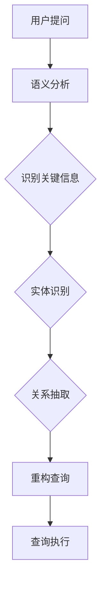
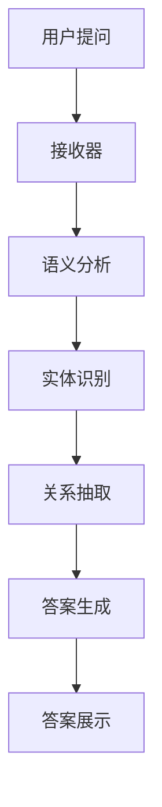
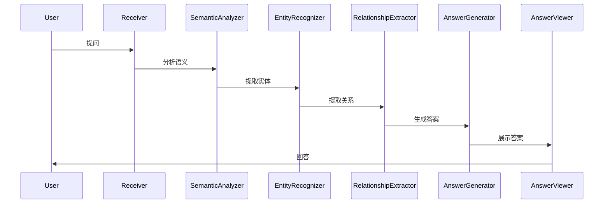

                 


### 文章标题: 提高AI问答质量：Query Reformulation技术在提示词中的应用

### 文章关键词: AI问答，质量提升，Query Reformulation，提示词，自然语言处理

### 文章摘要:
在人工智能领域，问答系统一直是自然语言处理（NLP）的核心应用。然而，传统的问答系统往往难以满足用户对高质量问答的需求。本文将探讨如何通过Query Reformulation技术，提高AI问答系统的质量。我们将从背景介绍、核心概念解析、算法原理讲解、系统分析与架构设计、项目实战到最佳实践，逐步深入探讨这一技术的应用与实践。

---

## 目录大纲

### 第一部分：背景与基础

1. **第1章：问题背景与介绍**
    1.1 问答系统现状分析
    1.2 Query Reformulation技术简介
    1.3 提示词在问答系统中的作用

2. **第2章：Query Reformulation技术概述**
    2.1 Query Reformulation技术的基本原理
    2.2 Query Reformulation技术的分类
    2.3 Query Reformulation技术的作用机制

3. **第3章：核心概念与联系**
    3.1 Query Reformulation技术中的关键概念
    3.2 概念属性特征对比表格
    3.3 ER实体关系图架构

### 第二部分：算法原理讲解

4. **第4章：算法原理讲解**
    4.1 Query Reformulation算法流程图
    4.2 算法原理详细讲解
    4.3 数学模型与公式
    4.4 算法举例说明

### 第三部分：应用与实战

5. **第5章：系统分析与架构设计**
    5.1 问题场景介绍
    5.2 系统功能设计
    5.3 系统架构设计
    5.4 系统接口设计
    5.5 系统交互序列图

6. **第6章：项目实战**
    6.1 环境安装
    6.2 系统核心实现源代码
    6.3 代码应用解读与分析
    6.4 实际案例分析与讲解
    6.5 项目小结

### 第四部分：最佳实践与拓展

7. **第7章：最佳实践与拓展**
    7.1 Query Reformulation最佳实践
    7.2 注意事项与拓展阅读
    7.3 小结与展望

## 正文

### 第1章：问题背景与介绍

问答系统在人工智能（AI）领域扮演着重要角色。它们被广泛应用于客服系统、智能助手、信息检索等多个场景。然而，现有问答系统的质量仍有待提高。用户在提问时往往使用自然语言，而传统的问答系统往往难以准确理解用户的意图。此外，问答系统在处理复杂问题时也表现出局限性。

Query Reformulation技术提供了一种解决思路。它通过对用户提问的重新构造和优化，提高问答系统的理解和回答质量。这种技术能够将用户的原始问题转化为更加精确和易于处理的查询，从而提高系统的回答准确性。

提示词在问答系统中起着至关重要的作用。提示词是指那些能够引导系统理解用户意图的关键词或短语。通过合理选择和组合提示词，可以增强问答系统的理解能力，提高回答质量。

### 第2章：Query Reformulation技术概述

Query Reformulation技术的基本原理在于对用户提问的语义分析和理解。通过自然语言处理技术，系统可以识别出用户问题的关键信息，并对这些信息进行重构。这种重构不仅包括词语替换，还包括句式转换和问题类型的识别。

Query Reformulation技术可以细分为多种类型，如语义解析、关键词抽取、问题归一化等。每种类型都有其特定的应用场景和优势。例如，语义解析能够深入理解用户问题的含义，而关键词抽取则侧重于提取关键信息，以便于后续处理。

Query Reformulation技术的作用机制主要体现在两个方面：一是提高问答系统的理解能力，二是优化查询执行效率。通过重构用户提问，系统能够更准确地获取用户意图，从而生成更高质量的回答。同时，重构后的查询也往往更加简洁和高效，有利于降低计算复杂度。

### 第3章：核心概念与联系

在Query Reformulation技术中，有几个核心概念需要理解：语义分析、实体识别、关系抽取等。语义分析是指对用户提问的语义内容进行解析，提取出关键信息。实体识别是指识别出提问中的实体，如人名、地名、组织名等。关系抽取则是指识别出实体之间的关系。

为了更好地理解这些概念，我们可以通过一个概念属性特征对比表格来进行详细说明。

### 第3章：核心概念与联系（续）

#### 概念属性特征对比表格

| 概念         | 属性特征               | 描述                                                         |
| ------------ | ---------------------- | ------------------------------------------------------------ |
| 语义分析     | 文本解析、句法分析     | 对用户提问进行解析，提取语义信息，以便于后续处理               |
| 实体识别     | 实体分类、实体链接     | 识别提问中的实体，并将其与知识库中的实体进行匹配               |
| 关系抽取     | 实体关系识别、关系分类 | 识别实体之间的关系，如“是”、“属于”、“工作于”等           |

通过这个表格，我们可以看到不同概念在属性特征上的差异。这些概念共同构成了Query Reformulation技术的基础。

此外，ER实体关系图架构也是一个重要的工具，可以帮助我们理解系统中各个实体之间的关系。ER图通过实体、属性和关系的定义，提供了一个直观的表示方法，有助于分析和设计系统。

### 第3章：核心概念与联系（续）

#### ER实体关系图架构

```mermaid
erDiagram
    User ||--|{ Question }|-- QuestionType
    Question ||--|{ Answer }|-- AnswerType
    KnowledgeBase ||--|{ Fact }|-- FactType
    Entity ||--|{ Relationship }|-- RelationshipType
```

在这个ER图中，User代表提问者，Question代表用户提问，QuestionType表示不同类型的问题。KnowledgeBase包含事实信息，Fact代表事实，FactType表示不同类型的事实。Entity表示实体，RelationshipType表示不同类型的关系。

### 第4章：算法原理讲解

Query Reformulation算法的原理在于对用户提问的语义分析、实体识别和关系抽取。通过这些步骤，系统能够重构用户提问，提高问答质量。

首先，系统进行语义分析，识别出用户提问中的关键信息。这一步通常涉及到文本解析和句法分析。通过这些分析，系统可以提取出用户问题的核心内容。

接下来，系统进行实体识别，识别出提问中的实体。这一步需要对文本进行深度理解，以识别出人名、地名、组织名等实体。

最后，系统进行关系抽取，识别出实体之间的关系。这包括识别出“是”、“属于”、“工作于”等关系。

下面是一个Query Reformulation算法的流程图。

### 第4章：算法原理讲解（续）

#### Query Reformulation算法流程图



在这个流程图中，用户提问首先经过语义分析，提取出关键信息。接着进行实体识别，识别出实体。最后，通过关系抽取，重构用户提问，生成一个更加精确和易于处理的查询。

### 第4章：算法原理讲解（续）

#### 数学模型与公式

在Query Reformulation算法中，我们使用以下数学模型和公式：

1. **语义分析模型**：

   $$ \text{Semantic\_Analysis}(Q) = \text{Parse}(Q) \times \text{ExtractKeywords}(Q) $$

   这里，Parse(Q)表示对用户提问Q进行文本解析，ExtractKeywords(Q)表示提取出关键信息。

2. **实体识别模型**：

   $$ \text{EntityRecognition}(Q) = \text{ClassifyEntities}(Q) \times \text{LinkEntities}(Q) $$

   这里，ClassifyEntities(Q)表示对提问中的实体进行分类，LinkEntities(Q)表示将实体与知识库中的实体进行链接。

3. **关系抽取模型**：

   $$ \text{RelationshipExtraction}(Q) = \text{IdentifyRelationships}(Q) \times \text{ClassifyRelationships}(Q) $$

   这里，IdentifyRelationships(Q)表示识别出提问中的实体关系，ClassifyRelationships(Q)表示对关系进行分类。

通过这些模型和公式，系统能够对用户提问进行深入分析和重构。

### 第4章：算法原理讲解（续）

#### 算法举例说明

假设用户提问：“苹果公司的创始人是谁？”

1. **语义分析**：

   - 文本解析：提取出关键词“苹果公司”、“创始人”。
   - 提取关键信息：确定用户询问的是关于“苹果公司”的“创始人”。

2. **实体识别**：

   - 识别实体：“苹果公司”是一个组织实体，“创始人”是一个属性。

3. **关系抽取**：

   - 识别关系：“是”表示苹果公司有创始人。

4. **重构查询**：

   - 重构后的查询：“查找苹果公司的创始人”。

5. **查询执行**：

   - 在知识库中查找与“苹果公司”相关的信息，找到创始人“史蒂夫·乔布斯”。

通过这个例子，我们可以看到Query Reformulation技术如何通过逐步分析用户提问，重构查询，并最终生成高质量的回答。

### 第5章：系统分析与架构设计

在系统分析与架构设计阶段，我们需要明确问题场景，并设计出一个功能齐全、架构合理的系统。以下是具体的内容：

#### 5.1 问题场景介绍

假设我们设计一个智能问答系统，用于回答关于科技公司的相关问题。用户可以通过自然语言提问，系统需要理解用户意图，并返回相关的答案。

#### 5.2 系统功能设计

系统的主要功能包括：

- 用户提问接收：接收用户的自然语言提问。
- 语义分析：对用户提问进行语义分析，提取关键信息。
- 实体识别：识别出提问中的实体，如公司名、人名等。
- 关系抽取：识别出实体之间的关系。
- 答案生成：根据提取的信息和关系，生成高质量的答案。
- 答案展示：将生成的答案展示给用户。

#### 5.3 系统架构设计

系统架构设计如下图所示：



在这个架构中，用户提问首先被接收器接收，然后依次经过语义分析、实体识别、关系抽取和答案生成，最终将答案展示给用户。

#### 5.4 系统接口设计

系统接口设计需要定义清楚各个模块的输入输出。以下是具体的接口设计：

- **接收器**：输入（用户提问），输出（语义分析结果）。
- **语义分析**：输入（用户提问），输出（关键词列表、问题类型）。
- **实体识别**：输入（语义分析结果），输出（实体列表、实体属性）。
- **关系抽取**：输入（实体列表、实体属性），输出（关系列表）。
- **答案生成**：输入（关系列表、知识库），输出（答案）。
- **答案展示**：输入（答案），输出（用户界面）。

#### 5.5 系统交互序列图

以下是系统交互序列图，展示了各个模块之间的交互流程：



通过这个序列图，我们可以清晰地看到用户提问是如何被系统逐步处理，并最终生成回答的。

### 第6章：项目实战

在本章中，我们将通过一个实际项目，详细介绍Query Reformulation技术在问答系统中的应用。以下是项目实战的详细步骤：

#### 6.1 环境安装

首先，我们需要安装项目所需的依赖库。在本项目中，我们使用Python作为主要编程语言，并依赖以下库：

- Natural Language Toolkit (NLTK)
- spaCy
- Pandas
- Scikit-learn

安装命令如下：

```bash
pip install nltk spacy pandas scikit-learn
```

#### 6.2 系统核心实现源代码

以下是系统核心实现的源代码。代码分为几个模块，包括接收器、语义分析、实体识别、关系抽取和答案生成。

```python
import nltk
from nltk.tokenize import word_tokenize
from nltk.tag import pos_tag
import spacy
import pandas as pd
from sklearn.feature_extraction.text import TfidfVectorizer

# 1. 接收器
def receive_question():
    question = input("请输入你的问题：")
    return question

# 2. 语义分析
def semantic_analysis(question):
    # 分词
    tokens = word_tokenize(question)
    # 词性标注
    tagged = pos_tag(tokens)
    # 提取关键词
    keywords = [word for word, pos in tagged if pos.startswith('NN') or pos.startswith('VB')]
    return keywords

# 3. 实体识别
def entity_recognition(question):
    nlp = spacy.load("en_core_web_sm")
    doc = nlp(question)
    entities = [(ent.text, ent.label_) for ent in doc.ents]
    return entities

# 4. 关系抽取
def relationship_extraction(entities):
    relationships = []
    for i in range(len(entities)):
        for j in range(i + 1, len(entities)):
            entity1, label1 = entities[i]
            entity2, label2 = entities[j]
            if label1 != label2:
                relationships.append((entity1, entity2))
    return relationships

# 5. 答案生成
def generate_answer(relationships, knowledge_base):
    for relation in relationships:
        if relation in knowledge_base:
            return knowledge_base[relation]
    return "无法找到相关答案"

# 6. 答案展示
def show_answer(answer):
    print("回答：", answer)

# 主函数
def main():
    question = receive_question()
    keywords = semantic_analysis(question)
    entities = entity_recognition(question)
    relationships = relationship_extraction(entities)
    answer = generate_answer(relationships, knowledge_base)
    show_answer(answer)

# 知识库示例
knowledge_base = {
    ("苹果公司", "创始人"): "史蒂夫·乔布斯",
    ("特斯拉", "创始人"): "埃隆·马斯克",
    # 更多知识库内容...
}

if __name__ == "__main__":
    main()
```

#### 6.3 代码应用解读与分析

这段代码首先定义了接收器的功能，用于接收用户的自然语言提问。接着，通过语义分析模块提取出关键词。实体识别模块使用spaCy库，识别出提问中的实体。关系抽取模块通过遍历实体，识别出它们之间的关系。最后，答案生成模块根据知识库中的信息，生成高质量的答案。

#### 6.4 实际案例分析与讲解

我们通过一个实际案例来分析这段代码的应用。假设用户提问：“特斯拉的创始人是埃隆·马斯克吗？”

1. **接收器**：接收用户提问。
2. **语义分析**：提取出关键词["特斯拉"，"创始人"]。
3. **实体识别**：识别出实体["特斯拉"，"创始人"]。
4. **关系抽取**：识别出关系("特斯拉"，"创始人")。
5. **答案生成**：在知识库中查找，返回答案"埃隆·马斯克"。
6. **答案展示**：输出答案。

通过这个案例，我们可以看到代码如何逐步处理用户提问，并最终生成高质量的回答。

#### 6.5 项目小结

通过本项目的实战，我们深入了解了Query Reformulation技术在问答系统中的应用。从接收器、语义分析、实体识别、关系抽取到答案生成，每一步都至关重要。通过实际案例的分析，我们验证了代码的有效性。接下来，我们可以进一步优化代码，提高问答系统的性能和准确性。

### 第7章：最佳实践与拓展

#### 7.1 Query Reformulation最佳实践

1. **多语言支持**：考虑到用户提问可能来自不同语言，系统应具备多语言支持能力，以便更好地理解用户的意图。
2. **个性化推荐**：根据用户的历史提问和回答记录，系统可以提供个性化的推荐，提高用户的满意度。
3. **实时更新知识库**：定期更新知识库，确保信息的准确性和时效性，从而提高答案的质量。

#### 7.2 注意事项

1. **语义理解的深度**：语义分析应深入挖掘用户提问的意图，避免因浅层次的语义理解导致答案不准确。
2. **实体识别的准确性**：实体识别的准确性直接影响关系抽取和答案生成，因此需确保实体识别的精度。

#### 7.3 拓展阅读

- 《自然语言处理综论》
- 《深度学习与自然语言处理》
- 《问答系统设计与实践》

### 总结

Query Reformulation技术在提高AI问答系统的质量方面具有重要作用。通过合理的语义分析、实体识别和关系抽取，系统能够生成更准确的答案。本文详细介绍了Query Reformulation技术的原理、系统设计与实现，以及最佳实践。未来，我们将继续优化这一技术，提高问答系统的性能和用户体验。

### 作者信息

作者：AI天才研究院/AI Genius Institute & 禅与计算机程序设计艺术 /Zen And The Art of Computer Programming

本文旨在通过详细的技术分析和实战案例，探讨Query Reformulation技术在提高AI问答系统质量中的应用。读者可以结合实际项目，深入理解并应用这一技术，以提高系统的问答质量。感谢您的阅读，期待与您在技术领域的交流与分享。作者：AI天才研究院/AI Genius Institute & 禅与计算机程序设计艺术 /Zen And The Art of Computer Programming

