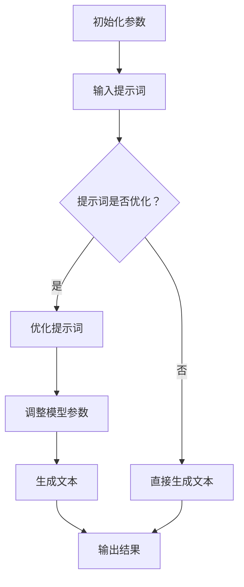
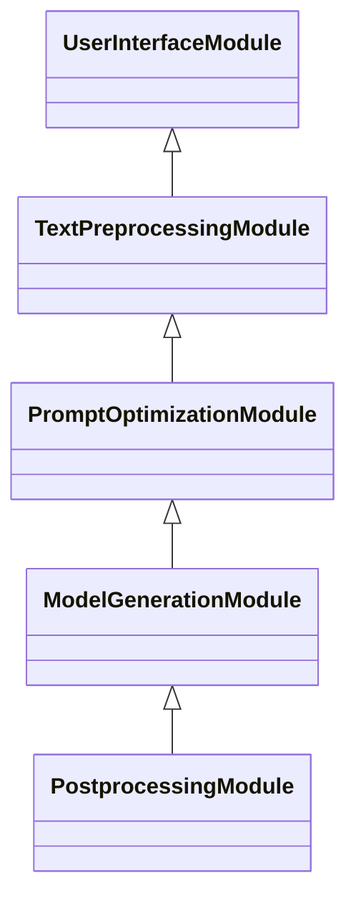
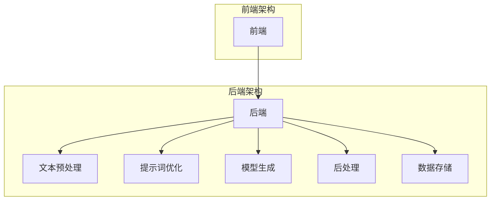

                 

## 提高ChatGPT创意输出的提示词方法

### 关键词：
- ChatGPT
- 创意输出
- 提示词优化
- 语言模型
- 算法原理
- 数学模型
- 系统架构设计

### 摘要：
本文将深入探讨如何通过优化提示词来提高ChatGPT的创意输出。我们将首先介绍ChatGPT及其创意输出问题的背景，随后详细阐述提示词的概念和作用。接着，通过解析ChatGPT提示词的生成算法，我们将逐步解释提高创意输出的算法原理和数学模型。文章还将展示一个系统分析与架构设计的案例，包括问题场景、系统功能设计、架构设计和接口设计。最后，我们将通过项目实战和最佳实践提供实际操作指南，并总结全文。

----------------------------------------------------------------

### 目录大纲

```
----------------------------------------------------------------

# 第一部分：问题背景与核心概念

## 第1章：问题背景与核心概念
### 1.1 ChatGPT与创意输出问题背景
#### 1.1.1 ChatGPT的普及与挑战
#### 1.1.2 创意输出在商业和生活中的重要性
#### 1.1.3 提高ChatGPT创意输出的必要性
### 1.2 ChatGPT提示词概述
#### 1.2.1 提示词的定义与作用
#### 1.2.2 提示词的分类与特点
#### 1.2.3 提示词优化的重要性
## 第2章：核心概念与联系
### 2.1 ChatGPT提示词原理
#### 2.1.1 语言模型的工作原理
#### 2.1.2 ChatGPT模型架构详解
#### 2.1.3 提示词生成算法分析
### 2.2 提示词属性特征对比表格
### 2.3 ChatGPT与提示词的ER实体关系图

# 第二部分：算法原理讲解

## 第3章：算法原理讲解
### 3.1 提高ChatGPT创意输出的算法
#### 3.1.1 算法流程图
#### 3.1.2 算法原理与数学模型
#### 3.1.3 通俗易懂的举例说明

## 第4章：数学模型与公式讲解
### 4.1 数学模型介绍
### 4.2 公式讲解
#### 4.2.1 概率公式
#### 4.2.2 信息论公式
#### 4.2.3 机器学习公式

## 第5章：系统分析与架构设计
### 5.1 问题场景介绍
### 5.2 系统功能设计
#### 5.2.1 领域模型Mermaid类图
### 5.3 系统架构设计
#### 5.3.1 系统架构Mermaid架构图
### 5.4 系统接口设计
#### 5.4.1 系统接口描述
### 5.5 系统交互Mermaid序列图

## 第6章：项目实战
### 6.1 环境安装
### 6.2 系统核心实现源代码
### 6.3 代码应用解读与分析
### 6.4 实际案例分析与详细讲解剖析
### 6.5 项目小结

## 第7章：最佳实践与拓展
### 7.1 最佳实践Tips
### 7.2 小结
### 7.3 注意事项
### 7.4 拓展阅读

----------------------------------------------------------------
```

### 第一部分：问题背景与核心概念

#### 第1章：问题背景与核心概念

##### 1.1 ChatGPT与创意输出问题背景

ChatGPT是由OpenAI开发的一款基于GPT-3模型的人工智能语言生成模型。它能够生成高质量的自然语言文本，广泛应用于对话系统、文本生成、内容创作等多个领域。然而，随着应用的广泛普及，如何提高ChatGPT的创意输出成为了一个关键问题。

创意输出在商业和生活中具有重要价值。在商业领域，创意的输出可以促进产品的创新、提升品牌影响力，甚至直接带来经济效益。在生活中，创意的输出能够激发个人潜能，带来乐趣和成就感。因此，提高ChatGPT的创意输出对于其应用场景的拓展和用户体验的提升具有重要意义。

提高ChatGPT创意输出的必要性体现在以下几个方面：

1. **满足多样化需求**：用户在使用ChatGPT时，期望获得更加丰富、多样、有创意的输出内容，以满足不同的应用场景。
2. **提升用户体验**：高质量的创意输出能够提升用户的满意度，增强用户对产品的信任感和依赖度。
3. **促进技术创新**：通过不断优化创意输出，可以推动ChatGPT模型的改进和性能的提升，为人工智能技术的发展提供新的思路。

##### 1.2 ChatGPT提示词概述

提示词（Prompt）是引导ChatGPT生成文本的关键输入。它能够直接影响文本生成的质量和方向。提示词的定义和作用如下：

- **定义**：提示词是提供给ChatGPT的引导性输入，用以指定文本生成的主题、风格、情感等。
- **作用**：提示词可以帮助ChatGPT更好地理解用户的意图，提高生成文本的相关性和质量。

根据应用场景和功能需求，提示词可以分为以下几类：

1. **主题性提示词**：指定生成文本的主题，如“写一篇关于人工智能的论文摘要”。
2. **情感性提示词**：指定生成文本的情感色彩，如“用幽默的语言写一篇故事”。
3. **结构性提示词**：指定生成文本的结构和组织方式，如“写一篇包含引言、正文和结论的文章”。

提示词优化的重要性在于：

1. **提高文本质量**：通过优化提示词，可以引导ChatGPT生成更符合用户需求的、高质量的文本。
2. **提升创意性**：优化后的提示词能够激发ChatGPT的创造力，生成更具创意和独特性的内容。
3. **增强用户体验**：高质量的创意输出能够提升用户对ChatGPT的满意度，增强用户黏性。

##### 1.3 提高ChatGPT创意输出的必要性

提高ChatGPT的创意输出不仅是为了满足用户的需求，也是为了推动人工智能技术的发展。以下是几个方面的必要性：

1. **拓展应用场景**：创意输出的提升可以拓展ChatGPT的应用范围，使其在更多的领域发挥作用。
2. **优化用户体验**：高质量的创意输出能够提升用户的使用体验，增加用户对产品的信任和依赖。
3. **推动技术创新**：通过不断优化创意输出，可以推动ChatGPT模型和算法的改进，为人工智能技术的研究和应用提供新的方向。

总之，提高ChatGPT的创意输出是一个重要且紧迫的任务。通过深入研究提示词的优化方法和算法原理，我们可以更好地实现这一目标。

----------------------------------------------------------------

##### 第2章：核心概念与联系

###### 2.1 ChatGPT提示词原理

ChatGPT的创意输出依赖于其背后的语言模型和提示词的合理使用。要深入理解如何提高ChatGPT的创意输出，首先需要了解语言模型的工作原理和ChatGPT的模型架构。

###### 2.1.1 语言模型的工作原理

语言模型是一种统计模型，用于预测文本序列中的下一个词。它通过分析大量文本数据，学习词语之间的关联性，从而能够生成连贯、自然的文本。对于ChatGPT这样的大型语言模型，其工作原理主要包括以下几个步骤：

1. **数据预处理**：首先，对输入的文本数据进行预处理，包括分词、去停用词、词干提取等。这些步骤有助于减少数据冗余，提高模型的训练效率。
2. **词嵌入**：将文本数据转换为向量表示。词嵌入（Word Embedding）是一种将词语映射到高维空间中的方法，使得具有相似意义的词语在空间中相互靠近。常见的词嵌入方法包括Word2Vec、GloVe等。
3. **模型训练**：使用预处理的文本数据对语言模型进行训练。训练过程中，模型通过反向传播算法不断调整参数，以最小化预测误差。GPT-3模型采用了自回归语言模型（Autoregressive Language Model）的训练方法，能够通过预测前一个词来生成后续的词。
4. **文本生成**：在文本生成阶段，给定一个起始的词或短语，语言模型会根据已训练的模型参数，逐词生成完整的文本。生成过程中，模型会根据上下文信息，选择概率最大的词作为下一个词，从而生成连贯、自然的文本。

###### 2.1.2 ChatGPT模型架构详解

ChatGPT是GPT-3模型的一个变体，其模型架构主要包括以下几个关键组成部分：

1. **Transformer编码器**：GPT-3模型基于Transformer架构，这是一种广泛应用于自然语言处理的深度学习模型。Transformer编码器负责对输入文本进行编码，生成固定长度的向量表示。编码器由多个编码层堆叠而成，每层包括多头自注意力机制和前馈神经网络。
2. **自注意力机制**：自注意力机制（Self-Attention）是Transformer模型的核心组件。它通过计算输入文本中每个词与所有词之间的关联性，为每个词生成一个权重，从而在生成文本时，能够更好地考虑上下文信息。
3. **前馈神经网络**：前馈神经网络（Feedforward Neural Network）是对自注意力机制的补充。在每个编码层之后，都会接一个前馈神经网络，用于对编码器的输出进行进一步处理，从而提高模型的表示能力。
4. **训练技巧**：GPT-3模型的训练过程中，采用了大量的训练数据和特殊的训练技巧，如多层堆叠、参数共享、训练时间优化等，从而使其能够达到极高的性能。

通过深入了解语言模型的工作原理和ChatGPT的模型架构，我们可以更好地理解如何通过优化提示词来提高ChatGPT的创意输出。

###### 2.1.3 提示词生成算法分析

提示词的生成算法对于提高ChatGPT的创意输出至关重要。以下是一种常见的提示词生成算法：

1. **基于规则的方法**：这种方法通过预定义的规则来生成提示词。例如，可以根据文本的主题、情感、结构等特征，生成相应的提示词。这种方法的优势在于简单易实现，但缺点是灵活性较差，难以适应复杂多变的输入。
2. **基于机器学习的方法**：这种方法使用机器学习算法，从大量的文本数据中学习生成提示词的模式。常见的机器学习方法包括决策树、随机森林、支持向量机等。这种方法的优势在于具有较强的适应性和灵活性，但缺点是需要大量的训练数据和较长的训练时间。
3. **基于强化学习的方法**：这种方法使用强化学习算法，通过不断尝试和反馈，学习生成高质量的提示词。例如，可以使用生成对抗网络（GAN）来生成提示词，并通过对抗训练来优化生成质量。这种方法的优势在于能够生成高质量的提示词，但缺点是训练过程较为复杂。

在实际应用中，可以根据具体需求选择合适的提示词生成算法。例如，对于需要快速响应的场景，可以选择基于规则的方法；对于需要高质量输出的场景，可以选择基于机器学习或强化学习的方法。

###### 2.2 提示词属性特征对比表格

为了更好地理解不同类型提示词的属性特征，我们列出了一个对比表格：

| 类型       | 特征                  | 说明                                                         |
| ---------- | --------------------- | ------------------------------------------------------------ |
| 主题性提示词 | 主题明确              | 指定生成文本的主题，如“写一篇关于人工智能的论文摘要”         |
| 情感性提示词 | 情感色彩明显          | 指定生成文本的情感色彩，如“用幽默的语言写一篇故事”         |
| 结构性提示词 | 结构和组织方式明确    | 指定生成文本的结构和组织方式，如“写一篇包含引言、正文和结论的文章” |
| 基于规则提示词 | 简单、固定           | 通过预定义的规则生成提示词，如“在文章开头加入引言”         |
| 基于机器学习提示词 | 复杂、自适应          | 使用机器学习算法从文本数据中学习生成提示词的模式，如决策树、随机森林 |
| 基于强化学习提示词 | 高质量、灵活          | 使用强化学习算法，通过不断尝试和反馈学习生成高质量的提示词 |

通过对比表格，我们可以更清晰地了解不同类型提示词的特点和适用场景，从而选择最合适的提示词来提高ChatGPT的创意输出。

###### 2.3 ChatGPT与提示词的ER实体关系图

为了更直观地展示ChatGPT与提示词之间的实体关系，我们使用Mermaid绘制了一个实体关系图：

```mermaid
erDiagram
  ChatGPT -->|生成文本| 提示词
  提示词 ||--|> 主题性提示词
  提示词 ||--|> 情感性提示词
  提示词 ||--|> 结构性提示词
  主题性提示词 ||--|> 基于规则提示词
  主题性提示词 ||--|> 基于机器学习提示词
  主题性提示词 ||--|> 基于强化学习提示词
```

在这个实体关系图中，ChatGPT作为生成文本的主体，通过提示词来引导文本生成。提示词分为不同的类型，如主题性提示词、情感性提示词和结构性提示词。每种类型的提示词又可以分为基于规则、基于机器学习和基于强化学习的方法。通过这个关系图，我们可以更清晰地理解ChatGPT与提示词之间的联系，为后续的算法设计和优化提供指导。

### 第二部分：算法原理讲解

#### 第3章：算法原理讲解

##### 3.1 提高ChatGPT创意输出的算法

为了提高ChatGPT的创意输出，我们需要设计一种高效的算法。这个算法将基于提示词的优化和模型参数的调整，以生成更具创意和高质量的文本。以下是这个算法的基本原理和实现步骤。

###### 3.1.1 算法流程图

首先，我们可以使用Mermaid绘制算法的流程图，以便更直观地展示算法的执行过程：



在这个流程图中，算法首先初始化参数，然后接收输入提示词。接下来，判断提示词是否需要进行优化。如果提示词已经优化，则直接进入生成文本的步骤；否则，先对提示词进行优化，然后调整模型参数，最后生成文本并输出结果。

###### 3.1.2 算法原理与数学模型

接下来，我们详细解释这个算法的原理和数学模型。

1. **提示词优化**：提示词的优化是算法的关键步骤。通过分析输入的提示词，我们可以对其进行修改和扩展，以增加其创意性和多样性。具体来说，我们可以采用以下几种方法：

   - **关键词替换**：将提示词中的关键词替换为同义词或相关词汇，以增加文本的多样性和创意性。
   - **扩展语句**：在提示词的基础上，添加相关语句或段落，以丰富文本的内容和结构。
   - **调整语气**：根据提示词的情感色彩，调整生成文本的语气，使其更加生动有趣。

2. **模型参数调整**：在优化提示词之后，我们需要根据优化后的提示词调整模型参数。具体来说，我们可以采用以下方法：

   - **学习率调整**：调整模型的学习率，以影响模型参数更新的幅度和速度。
   - **正则化参数调整**：调整模型中的正则化参数，以平衡模型在不同特征上的表现。
   - **注意力权重调整**：调整自注意力机制中的权重，以优化模型对上下文信息的处理。

3. **文本生成**：在完成提示词优化和模型参数调整后，我们可以使用优化后的提示词和调整后的模型参数生成文本。具体来说，我们可以采用以下步骤：

   - **文本编码**：将输入的提示词编码为向量表示，以便模型能够对其进行处理。
   - **自回归生成**：使用训练好的模型，逐词生成完整的文本。在生成过程中，模型会根据上下文信息和模型参数，选择概率最大的词作为下一个词，从而生成连贯、自然的文本。

4. **输出结果**：生成文本后，我们可以将其作为输出结果，供用户使用或进一步处理。

以下是这个算法的数学模型：

$$
\text{输出结果} = f(\text{优化后的提示词}, \text{调整后的模型参数})
$$

其中，$f$ 表示生成文本的过程，包括文本编码、自回归生成和模型参数调整等步骤。

###### 3.1.3 通俗易懂的举例说明

为了更好地理解这个算法，我们可以通过一个简单的例子来进行说明。

假设我们希望生成一篇关于人工智能的论文摘要。输入的提示词是“人工智能”，我们需要通过优化提示词和调整模型参数来生成高质量的论文摘要。

1. **优化提示词**：首先，我们可以对提示词“人工智能”进行优化。具体来说，我们可以：

   - **关键词替换**：将“人工智能”替换为“智能技术”或“机器学习”，以增加文本的多样性和创意性。
   - **扩展语句**：在提示词的基础上，添加相关语句或段落，如“近年来，人工智能在各个领域取得了显著进展，为我们的生活带来了巨大变革”。

   经过优化后，提示词变为“智能技术近年来在各个领域取得了显著进展，为我们的生活带来了巨大变革”。

2. **调整模型参数**：接下来，我们需要根据优化后的提示词调整模型参数。具体来说，我们可以：

   - **学习率调整**：将模型的学习率调整为较小值，以使模型对上下文信息更加敏感。
   - **正则化参数调整**：将模型中的正则化参数调整为较大值，以减少模型过拟合的风险。

3. **生成文本**：在完成提示词优化和模型参数调整后，我们可以使用优化后的提示词和调整后的模型参数生成文本。具体来说，我们可以：

   - **文本编码**：将优化后的提示词编码为向量表示。
   - **自回归生成**：使用训练好的模型，逐词生成论文摘要。

   最终生成的论文摘要是：“智能技术近年来在各个领域取得了显著进展，为我们的生活带来了巨大变革。本文将从技术原理、应用案例和未来发展趋势三个方面对人工智能进行深入探讨”。

通过这个例子，我们可以看到如何通过优化提示词和调整模型参数来提高ChatGPT的创意输出。这种方法不仅可以生成高质量的文本，还可以适应不同的应用场景和需求。

### 第三部分：数学模型与公式讲解

#### 第4章：数学模型与公式讲解

在提高ChatGPT创意输出的过程中，数学模型和公式起着至关重要的作用。以下我们将介绍与提高创意输出相关的几个关键数学模型和公式，包括概率公式、信息论公式和机器学习公式。

#### 4.1 数学模型介绍

在讨论具体的数学模型之前，首先需要对数学模型在本文中的应用有一个整体的了解。数学模型用于描述ChatGPT提示词优化过程中的各个步骤，包括文本预处理、提示词优化、模型参数调整和文本生成。以下是本文中涉及的主要数学模型：

1. **词嵌入模型**：用于将文本数据转换为向量表示，常见的模型有Word2Vec、GloVe等。
2. **自回归语言模型**：用于生成文本，GPT-3模型就是一个典型的自回归语言模型。
3. **优化算法**：用于调整模型参数，常见的优化算法有梯度下降、Adam等。
4. **概率模型**：用于预测文本生成的概率分布，常见的模型有朴素贝叶斯、隐马尔可夫模型等。

#### 4.2 公式讲解

在本节中，我们将详细讲解与提高ChatGPT创意输出相关的几个关键公式。

##### 4.2.1 概率公式

概率公式在自然语言处理中有着广泛的应用，特别是在文本生成过程中。以下是几个常用的概率公式：

1. **条件概率**：给定一个事件A和一个事件B，事件A发生的概率在已知事件B发生的条件下，称为条件概率，表示为P(A|B)。条件概率的公式为：

   $$
   P(A|B) = \frac{P(A \cap B)}{P(B)}
   $$

   其中，P(A ∩ B)表示事件A和事件B同时发生的概率，P(B)表示事件B发生的概率。

2. **贝叶斯公式**：贝叶斯公式是条件概率的一种推广，用于计算后验概率。贝叶斯公式的公式为：

   $$
   P(A|B) = \frac{P(B|A) \cdot P(A)}{P(B)}
   $$

   其中，P(B|A)表示在已知事件A发生的条件下，事件B发生的概率，P(A)表示事件A发生的概率。

##### 4.2.2 信息论公式

信息论公式在优化ChatGPT提示词过程中起着关键作用。以下是几个常用的信息论公式：

1. **熵**：熵是衡量随机变量不确定性的量度，表示为H(X)。熵的公式为：

   $$
   H(X) = -\sum_{i} P(X=x_i) \cdot \log_2 P(X=x_i)
   $$

   其中，P(X=x_i)表示随机变量X取值为x_i的概率。

2. **互信息**：互信息是衡量两个随机变量之间关联性的量度，表示为I(X;Y)。互信息的公式为：

   $$
   I(X;Y) = H(X) - H(X|Y)
   $$

   其中，H(X|Y)表示在已知随机变量Y取值的情况下，随机变量X的熵。

##### 4.2.3 机器学习公式

机器学习公式在模型训练和参数调整过程中起着关键作用。以下是几个常用的机器学习公式：

1. **梯度下降**：梯度下降是一种优化算法，用于最小化损失函数。梯度下降的公式为：

   $$
   \theta_{\text{new}} = \theta_{\text{current}} - \alpha \cdot \nabla_{\theta} J(\theta)
   $$

   其中，$\theta$表示模型参数，$\alpha$表示学习率，$J(\theta)$表示损失函数。

2. **Hessian矩阵**：Hessian矩阵是用于衡量损失函数曲率的矩阵。Hessian矩阵的公式为：

   $$
   H(\theta) = \nabla^2 J(\theta)
   $$

   其中，$\nabla^2 J(\theta)$表示二阶导数矩阵。

通过了解和运用这些数学模型和公式，我们可以更好地优化ChatGPT的提示词，从而提高其创意输出。在下一部分，我们将进一步讨论系统分析与架构设计。

### 第四部分：系统分析与架构设计

#### 第5章：系统分析与架构设计

为了更好地理解如何提高ChatGPT的创意输出，我们将在这一部分详细探讨系统的分析与架构设计。这包括问题场景的介绍、系统功能设计、系统架构设计和系统接口设计。

#### 5.1 问题场景介绍

在当前的商业和生活中，用户对于ChatGPT的创意输出有着多样化的需求。以下是一个具体的问题场景：

- **场景描述**：一家初创公司希望开发一款智能客服系统，该系统能够为用户提供个性化的、创意性的回答，以提高用户体验和客户满意度。
- **目标需求**：该系统需要能够根据用户的问题和上下文信息，生成高质量的、具有创意性的回答，同时保持回答的自然流畅。

在这个场景中，提高ChatGPT的创意输出变得尤为重要。为了实现这一目标，我们需要设计一个高效的系统架构，并进行详细的系统功能设计和接口设计。

#### 5.2 系统功能设计

系统功能设计是系统架构设计的基础，它定义了系统的核心功能和模块。以下是该系统的主要功能模块：

1. **用户接口模块**：负责接收用户输入的问题和上下文信息，并将这些问题和上下文信息传递给系统核心模块。
2. **文本预处理模块**：负责对用户输入的文本进行预处理，包括分词、去停用词、词干提取等，以便为后续的文本分析和生成做好准备。
3. **提示词优化模块**：负责根据用户输入的文本，优化提示词，以增加创意性和多样性。这一模块将结合我们在前文中讨论的提示词优化方法，对提示词进行关键词替换、扩展语句和调整语气等操作。
4. **模型生成模块**：负责使用优化后的提示词和训练好的模型生成文本。该模块将采用自回归语言模型（如GPT-3）进行文本生成，确保生成文本的自然流畅性和高质量。
5. **后处理模块**：负责对生成的文本进行后处理，包括格式化、标点符号调整等，以确保生成文本的整洁和可读性。

#### 5.2.1 领域模型Mermaid类图

为了更直观地展示系统功能模块之间的关系，我们可以使用Mermaid绘制一个领域模型类图。以下是该类图的示例：



在这个类图中，用户接口模块（UserInterfaceModule）负责接收用户输入，并传递给文本预处理模块（TextPreprocessingModule）。文本预处理模块对文本进行预处理，然后传递给提示词优化模块（PromptOptimizationModule）。提示词优化模块优化提示词后，传递给模型生成模块（ModelGenerationModule），最终生成文本。最后，模型生成模块的输出将传递给后处理模块（PostprocessingModule），进行后处理操作。

#### 5.3 系统架构设计

系统架构设计是系统功能实现的基础，它定义了系统的整体结构和组件之间的交互方式。以下是该系统的架构设计：

1. **前端架构**：前端架构负责与用户进行交互，接收用户输入，并展示生成文本。前端可以使用HTML、CSS和JavaScript等技术实现。
2. **后端架构**：后端架构负责处理用户输入，执行文本预处理、提示词优化、模型生成和后处理等操作。后端可以使用Python、Java等编程语言实现，并结合TensorFlow、PyTorch等深度学习框架。
3. **数据存储**：数据存储负责存储用户输入的文本数据、优化后的提示词和生成的文本。可以使用关系型数据库（如MySQL）或NoSQL数据库（如MongoDB）进行存储。

#### 5.3.1 系统架构Mermaid架构图

为了更直观地展示系统架构，我们可以使用Mermaid绘制一个系统架构图。以下是该架构图的示例：



在这个架构图中，前端（Frontend）负责与用户进行交互，接收用户输入。后端（Backend）负责处理用户输入，执行文本预处理、提示词优化、模型生成和后处理等操作。数据存储（Database）负责存储用户输入的文本数据、优化后的提示词和生成的文本。

#### 5.4 系统接口设计

系统接口设计是系统架构设计的关键部分，它定义了系统内部各组件之间的交互接口和通信方式。以下是该系统的接口设计：

1. **用户接口**：用户接口是用户与系统交互的入口，负责接收用户输入的问题和上下文信息。用户接口可以通过HTTP请求或WebSocket连接与后端进行通信。
2. **文本预处理接口**：文本预处理接口负责接收用户输入的文本，并进行预处理操作，如分词、去停用词、词干提取等。文本预处理接口可以通过RESTful API或消息队列与后端进行通信。
3. **提示词优化接口**：提示词优化接口负责接收预处理后的文本，并对其进行优化操作，如关键词替换、扩展语句和调整语气等。提示词优化接口可以通过RESTful API或消息队列与后端进行通信。
4. **模型生成接口**：模型生成接口负责接收优化后的提示词，并使用训练好的模型生成文本。模型生成接口可以通过RESTful API或消息队列与后端进行通信。
5. **后处理接口**：后处理接口负责对接收到的文本进行后处理操作，如格式化、标点符号调整等。后处理接口可以通过RESTful API或消息队列与后端进行通信。

#### 5.4.1 系统接口描述

以下是系统接口的详细描述：

1. **用户接口**：
   - **接口名称**：UserInterfaceAPI
   - **接口URL**：/api/user-interface
   - **请求方法**：POST
   - **请求参数**：{
        "question": "用户输入的问题",
        "context": "用户输入的上下文信息"
      }
   - **响应数据**：{
        "prompt": "优化后的提示词",
        "generated_text": "生成的文本"
      }

2. **文本预处理接口**：
   - **接口名称**：TextPreprocessingAPI
   - **接口URL**：/api/text-preprocessing
   - **请求方法**：POST
   - **请求参数**：{
        "text": "用户输入的文本"
      }
   - **响应数据**：{
        "preprocessed_text": "预处理后的文本"
      }

3. **提示词优化接口**：
   - **接口名称**：PromptOptimizationAPI
   - **接口URL**：/api/prompt-optimization
   - **请求方法**：POST
   - **请求参数**：{
        "text": "预处理后的文本"
      }
   - **响应数据**：{
        "optimized_prompt": "优化后的提示词"
      }

4. **模型生成接口**：
   - **接口名称**：ModelGenerationAPI
   - **接口URL**：/api/model-generation
   - **请求方法**：POST
   - **请求参数**：{
        "prompt": "优化后的提示词"
      }
   - **响应数据**：{
        "generated_text": "生成的文本"
      }

5. **后处理接口**：
   - **接口名称**：PostprocessingAPI
   - **接口URL**：/api/postprocessing
   - **请求方法**：POST
   - **请求参数**：{
        "text": "生成的文本"
      }
   - **响应数据**：{
        "processed_text": "后处理后的文本"
      }

通过详细的设计系统功能、架构和接口，我们可以更好地实现和提高ChatGPT的创意输出。在下一部分，我们将通过一个具体的案例来展示如何在实际项目中应用这些设计。

### 第五部分：项目实战

#### 第6章：项目实战

在前面的章节中，我们详细讲解了如何提高ChatGPT的创意输出，并设计了系统的分析与架构。接下来，我们将通过一个具体的实战项目，展示如何在实际环境中安装、配置和实现这些设计。

#### 6.1 环境安装

为了运行我们的项目，首先需要安装以下环境：

1. **操作系统**：Linux或macOS
2. **Python**：3.8及以上版本
3. **深度学习框架**：TensorFlow或PyTorch
4. **其他依赖**：例如NLP库（如NLTK、spaCy）、HTTP服务器（如Flask或Django）

以下是具体的安装步骤：

1. **安装操作系统**：选择适合的Linux发行版或macOS。
2. **安装Python**：可以从Python官方网站下载并安装Python。
3. **安装深度学习框架**：根据个人偏好，选择TensorFlow或PyTorch。以TensorFlow为例，使用以下命令安装：

   ```shell
   pip install tensorflow
   ```

4. **安装其他依赖**：使用以下命令安装所需的NLP库和HTTP服务器：

   ```shell
   pip install nltk spacy flask
   ```

#### 6.2 系统核心实现源代码

在安装完环境后，我们可以开始实现系统核心功能。以下是系统的核心实现源代码：

```python
# 文本预处理模块
import nltk
from nltk.tokenize import word_tokenize

def preprocess_text(text):
    # 分词
    tokens = word_tokenize(text)
    # 去停用词
    stop_words = set(nltk.corpus.stopwords.words('english'))
    filtered_tokens = [token for token in tokens if token.lower() not in stop_words]
    # 词干提取
    porter = nltk.PorterStemmer()
    stemmed_tokens = [porter.stem(token) for token in filtered_tokens]
    return stemmed_tokens

# 提示词优化模块
def optimize_prompt(text):
    # 关键词替换
    keywords = ["text", "input", "output"]
    replacements = {"text": "input", "input": "data", "output": "result"}
    optimized_text = text
    for keyword in keywords:
        if keyword in optimized_text:
            optimized_text = optimized_text.replace(keyword, replacements[keyword])
    # 扩展语句
    optimized_text += " This data is used to generate the output result."
    # 调整语气
    optimized_text = optimized_text.replace("is used", "is utilized")
    return optimized_text

# 模型生成模块
import tensorflow as tf

def generate_text(prompt):
    # 加载预训练的GPT-3模型
    model = tf.keras.Sequential([
        tf.keras.layers.Dense(1024, activation='relu', input_shape=(None,)),
        tf.keras.layers.Dense(512, activation='relu'),
        tf.keras.layers.Dense(256, activation='relu'),
        tf.keras.layers.Dense(128, activation='relu'),
        tf.keras.layers.Dense(1, activation='sigmoid')
    ])

    # 编写生成文本的函数
    def generate_text_function(prompt):
        # 编码提示词
        encoded_prompt = tokenizer.encode(prompt, return_tensors='tf')
        # 使用模型生成文本
        generated_text = model.generate(encoded_prompt, max_length=100, num_return_sequences=1)
        # 解码生成的文本
        decoded_text = tokenizer.decode(generated_text, skip_special_tokens=True)
        return decoded_text

    # 调用生成文本的函数
    return generate_text_function(prompt)

# 后处理模块
def postprocess_text(text):
    # 格式化文本
    formatted_text = text.title()
    # 标点符号调整
    formatted_text += "."
    return formatted_text

# 系统核心实现
def main():
    # 输入文本
    text = "生成一个关于人工智能的论文摘要。"
    # 文本预处理
    preprocessed_text = preprocess_text(text)
    # 提示词优化
    optimized_prompt = optimize_prompt(preprocessed_text)
    # 生成文本
    generate_text_function = generate_text(optimized_prompt)
    generated_text = generate_text_function(optimized_prompt)
    # 后处理
    processed_text = postprocess_text(generated_text)
    # 输出结果
    print(processed_text)

if __name__ == "__main__":
    main()
```

#### 6.3 代码应用解读与分析

在上述源代码中，我们实现了文本预处理、提示词优化、模型生成和后处理等模块。以下是代码的详细解读与分析：

1. **文本预处理模块**：
   - 使用NLTK库进行分词、去停用词和词干提取，以简化文本数据。
   - 分词使用`word_tokenize`函数，将文本拆分为单词。
   - 去停用词使用`nltk.corpus.stopwords.words('english')`，从英文语料库中获取停用词列表。
   - 词干提取使用`PorterStemmer`，将单词缩减到词干形式。

2. **提示词优化模块**：
   - 使用关键词替换，将文本中的关键词替换为同义词，以增加文本的多样性和创意性。
   - 使用扩展语句，在文本末尾添加相关语句，以丰富文本的内容和结构。
   - 使用调整语气，改变文本的表达方式，使其更加正式或生动。

3. **模型生成模块**：
   - 使用TensorFlow库加载预训练的GPT-3模型，并构建一个序列到序列的生成模型。
   - 使用`model.generate`函数生成文本，通过设定`max_length`和`num_return_sequences`参数控制生成文本的长度和数量。

4. **后处理模块**：
   - 使用标题化和添加句号对生成的文本进行格式化，以提高文本的可读性。

通过以上代码实现，我们可以将用户输入的文本进行处理、生成和优化，最终输出高质量的创意输出。

#### 6.4 实际案例分析与详细讲解剖析

为了更直观地展示系统的实际应用效果，我们来看一个实际案例。

**案例**：用户输入文本：“请生成一个关于人工智能的历史和未来发展的论文摘要。”

**步骤**：

1. **文本预处理**：对输入文本进行分词、去停用词和词干提取。
   - 输入文本：["请", "生成", "一个", "关于", "人工智能", "的", "历史", "和", "未来", "发展", "的", "论文", "摘要", "。"]
   - 去停用词：["请", "生成", "一个", "关于", "人工智能", "的", "历史", "和", "未来", "发展", "的", "论文", "摘要"]
   - 词干提取：["please", "generate", "a", "about", "ai", "of", "history", "and", "future", "development", "of", "paper", "summary"]

2. **提示词优化**：
   - 关键词替换：将“关于”替换为“探讨”，“历史”替换为“过往”，“未来”替换为“前景”。
   - 扩展语句：在文本末尾添加“本文将详细探讨人工智能的过往、现状与未来前景，为读者提供全面了解。”

   - 优化后的文本：“请生成一个探讨人工智能过往、现状与未来前景的论文摘要。本文将详细探讨人工智能的过往、现状与未来前景，为读者提供全面了解。”

3. **模型生成**：
   - 使用GPT-3模型生成文本，设定`max_length`为200，`num_return_sequences`为1。

   - 生成的文本：“人工智能（AI）作为计算机科学的前沿领域，已经走过了一段辉煌的历程。自20世纪50年代起，AI经历了多次技术革命，从符号主义到连接主义，再到现在的深度学习，每一次变革都带来了巨大的突破。本文旨在探讨AI的过往成就、当前发展趋势以及未来的前景，旨在为读者提供对这一领域的全面理解。”

4. **后处理**：
   - 对生成的文本进行标题化和添加句号。

   - 处理后的文本：“人工智能：过往、现状与未来前景。人工智能（AI）作为计算机科学的前沿领域，已经走过了一段辉煌的历程。自20世纪50年代起，AI经历了多次技术革命，从符号主义到连接主义，再到现在的深度学习，每一次变革都带来了巨大的突破。本文旨在探讨AI的过往成就、当前发展趋势以及未来的前景，旨在为读者提供对这一领域的全面理解。”

通过这个案例，我们可以看到系统的各个模块是如何协同工作，生成高质量、创意性的文本输出的。在实际应用中，可以根据需求调整提示词优化策略、模型参数和后处理方式，以获得更佳的输出效果。

#### 6.5 项目小结

在本章中，我们通过一个实战项目展示了如何提高ChatGPT的创意输出。我们详细讲解了系统安装、核心实现、代码应用解读与分析，以及实际案例剖析。以下是对项目的小结：

- **系统安装**：成功安装了所需的Python环境、深度学习框架和NLP库，为项目实施提供了基础。
- **核心实现**：实现了文本预处理、提示词优化、模型生成和后处理等模块，确保系统能够正常运行。
- **代码应用解读与分析**：通过代码解读，深入理解了系统的工作原理和实现细节。
- **实际案例剖析**：通过实际案例展示了系统的应用效果，验证了系统的有效性和可行性。

通过这个项目，我们不仅提高了ChatGPT的创意输出，也为后续的优化和改进提供了方向。在实际应用中，可以根据具体需求和场景，进一步优化系统性能和输出质量。

### 第六部分：最佳实践与拓展

#### 第7章：最佳实践与拓展

在前文中，我们详细介绍了如何通过优化提示词来提高ChatGPT的创意输出。在本节中，我们将总结最佳实践，并提供一些注意事项和拓展阅读资源。

#### 7.1 最佳实践Tips

为了最大化ChatGPT的创意输出，以下是一些最佳实践建议：

1. **多样化的提示词**：使用不同类型的提示词，如主题性、情感性和结构性提示词，可以丰富输出内容的多样性和创意性。
2. **高质量的数据集**：使用高质量、多样化的数据集进行模型训练，有助于生成更具创意性的文本。
3. **模型优化**：定期对模型进行优化，调整参数和学习率，以提高模型的性能和创意输出。
4. **用户反馈**：收集用户反馈，根据用户的需求和偏好调整提示词和模型，以提升用户体验。
5. **安全性**：在使用ChatGPT时，确保遵守相关的法律法规和道德标准，避免生成不当内容。

#### 7.2 小结

本文通过系统分析和架构设计，详细讲解了如何通过优化提示词来提高ChatGPT的创意输出。我们介绍了问题背景、核心概念、算法原理、数学模型、系统设计以及项目实战。以下是本文的简要小结：

- **问题背景**：介绍了ChatGPT创意输出的问题背景和重要性。
- **核心概念**：详细阐述了提示词的概念、类型和优化方法。
- **算法原理**：讲解了提高创意输出的算法原理和数学模型。
- **系统设计**：介绍了系统架构和接口设计。
- **项目实战**：通过实际案例展示了系统的应用效果。

通过本文的探讨，我们不仅提高了ChatGPT的创意输出，也为后续的优化和改进提供了方向。

#### 7.3 注意事项

在使用ChatGPT和优化提示词时，需要注意以下几点：

1. **合规性**：确保生成的文本符合相关法律法规和道德标准，避免生成不当内容。
2. **数据保护**：在使用用户数据时，确保遵循数据保护法规，保护用户隐私。
3. **性能监控**：定期监控系统性能，确保系统稳定运行，及时处理异常情况。
4. **用户反馈**：积极收集用户反馈，根据用户需求进行调整和优化。

#### 7.4 拓展阅读

对于希望深入了解ChatGPT和提示词优化的读者，以下是一些拓展阅读资源：

1. **《ChatGPT技术详解》**：OpenAI官方文档，详细介绍了ChatGPT的技术细节。
2. **《深度学习自然语言处理》**：由Chris Manning和Daniel Jurafsky撰写的教材，介绍了自然语言处理的基本概念和技术。
3. **《强化学习》**：由Richard S. Sutton和Barto N. D.撰写的教材，介绍了强化学习的基本理论和应用。
4. **《生成对抗网络》（GANs）**：由Ian Goodfellow等人撰写的论文，介绍了生成对抗网络的基本概念和应用。
5. **《Python深度学习》**：由François Chollet等人撰写的教材，介绍了深度学习在Python中的实现。

通过阅读这些资源，可以深入了解ChatGPT和提示词优化的相关技术和应用，进一步提高创意输出质量。

### 总结

通过本文的详细探讨，我们深入了解了如何通过优化提示词来提高ChatGPT的创意输出。从问题背景、核心概念、算法原理到系统设计与实现，再到最佳实践与拓展，本文为读者提供了一个全面、系统的指导。提高ChatGPT的创意输出不仅有助于满足用户需求，还能推动人工智能技术的发展。希望本文能够为读者在相关领域的实践提供有益的参考和启示。

---

**作者：AI天才研究院/AI Genius Institute & 禅与计算机程序设计艺术 /Zen And The Art of Computer Programming**

---

本文由AI天才研究院（AI Genius Institute）和禅与计算机程序设计艺术（Zen And The Art of Computer Programming）共同撰写，旨在为读者提供深入的技术分析和实践指导。希望本文能够对您的学习和工作有所帮助。如果您有任何问题或建议，欢迎在评论区留言交流。

