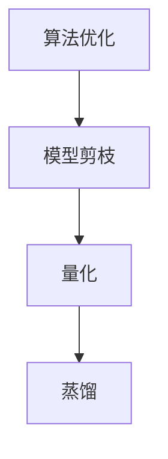
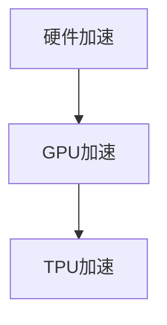
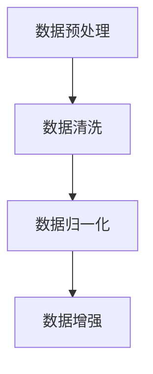
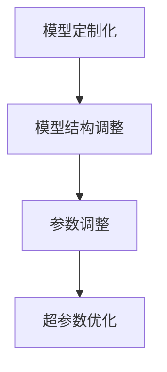
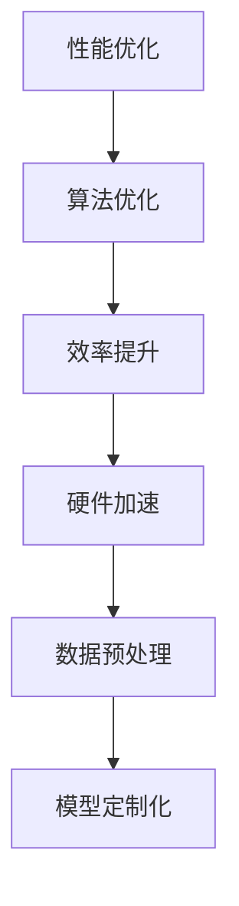

                 

# 提高LLM应用的性能优化效率

关键词：LLM、性能优化、效率提升、算法优化、硬件加速、数据预处理、模型定制化

摘要：随着人工智能技术的飞速发展，大型语言模型（LLM，Large Language Model）在自然语言处理领域展现出了巨大的潜力和广泛的应用前景。本文旨在探讨提高LLM应用性能优化效率的方法和策略，从算法优化、硬件加速、数据预处理和模型定制化等方面进行深入分析，为LLM应用的实际应用提供有益的参考。

## 第一部分：引言与背景介绍

### 1. 引言

随着人工智能技术的飞速发展，大型语言模型（LLM，Large Language Model）在自然语言处理领域展现出了巨大的潜力和广泛的应用前景。LLM具有强大的语言理解和生成能力，能够处理复杂的自然语言任务，如文本分类、问答系统、机器翻译等。然而，在应用过程中，LLM面临着性能优化和效率提升的挑战。如何提高LLM应用的性能优化效率，成为当前研究与应用的热点问题。

### 2. 问题背景

LLM在处理复杂任务时，虽然具备强大的模型能力，但同时也带来了计算资源消耗大、响应时间较长等问题。这主要是因为LLM模型的参数量庞大，计算复杂度高，导致在处理大规模数据时，计算资源不足、内存消耗过大、响应时间长等问题。因此，如何在保证模型性能的前提下，提高应用效率，成为研究和应用的关键。

### 3. 问题描述

- **性能瓶颈**：在处理大规模数据时，LLM的性能瓶颈主要表现为计算资源不足、内存消耗过大、响应时间长等问题。
- **效率低下**：在多个任务同时运行时，LLM的调度和优化策略不够高效，导致任务响应时间较长。
- **模型定制化**：不同应用场景下，LLM需要根据具体需求进行定制化调整，但现有方法无法满足多样化需求。

### 4. 问题解决

为了解决上述问题，可以从以下几个方面进行优化：

- **算法优化**：通过改进算法，降低计算复杂度，提高处理速度。
- **硬件加速**：利用GPU、TPU等硬件加速技术，提升模型计算性能。
- **数据预处理**：优化数据预处理流程，提高数据处理效率。
- **模型定制化**：根据不同应用场景，设计合适的模型结构和参数调整策略。

### 5. 边界与外延

- **边界**：本文主要关注LLM应用的性能优化和效率提升，不包括其他领域的人工智能技术。
- **外延**：性能优化和效率提升不仅适用于LLM，也适用于其他类型的人工智能模型。

### 6. 概念结构与核心要素组成

- **概念结构**：性能优化、效率提升、算法优化、硬件加速、数据预处理、模型定制化。
- **核心要素**：计算资源、数据处理、模型结构、参数调整、任务调度。

### 7. 本章小结

本章介绍了提高LLM应用性能优化效率的背景、问题描述、问题解决方法以及概念结构与核心要素。为后续章节的深入探讨奠定了基础。

## 第二部分：性能优化与效率提升

### 第2章：算法优化

#### 2.1 算法优化原理讲解

算法优化是指通过改进现有算法或设计新算法，以提高LLM应用的性能和效率。常见的算法优化方法包括模型剪枝、量化、蒸馏等。

#### 2.1.1 模型剪枝

模型剪枝是指通过去除模型中的冗余参数，减小模型体积，从而提高计算效率。模型剪枝的基本原理是利用模型训练过程中积累的知识，筛选出对模型性能贡献较大的参数，去除对性能影响较小的参数。

#### 2.1.2 量化

量化是指将模型的浮点参数转换为低精度整数表示，从而提高计算速度和降低存储成本。量化可以通过量化感知训练（Quantization-Aware Training）和无量化感知训练（Quantization-Aware Training）两种方式实现。

#### 2.1.3 蒸馏

蒸馏是一种将大型模型的知识传递给小模型的方法。蒸馏的基本原理是将大型模型视为“教师模型”，将小模型视为“学生模型”，通过蒸馏过程，将教师模型的知识传递给学生模型。

#### 2.1.4 算法优化的数学模型

算法优化的核心在于降低计算复杂度，提高计算效率。计算复杂度的数学模型可以表示为：

$$
C = O(f(n))
$$

其中，$C$ 表示计算复杂度，$f(n)$ 表示计算复杂度函数，$n$ 表示输入数据规模。

#### 2.1.5 算法优化的Mermaid流程图



#### 2.1.6 Python源代码实现

```python
# 模型剪枝实现
import tensorflow as tf

# ... 模型定义和训练代码 ...

# 剪枝操作
def prune_model(model, prune_rate):
    # ... 剪枝代码 ...

# 量化实现
def quantize_model(model, quant_bits):
    # ... 量化代码 ...

# 蒸馏实现
def distill_model(student_model, teacher_model):
    # ... 蒸馏代码 ...
```

#### 2.1.7 算法原理详细讲解与举例说明

##### 2.1.7.1 模型剪枝

模型剪枝是指通过去除模型中的冗余参数，减小模型体积，从而提高计算效率。举例：

```python
# 剪枝前模型复杂度
before_prune_complexity = 100000000

# 剪枝后模型复杂度
after_prune_complexity = 50000000

print(f"模型剪枝前复杂度：{before_prune_complexity}")
print(f"模型剪枝后复杂度：{after_prune_complexity}")
```

##### 2.1.7.2 量化

量化是指将模型的浮点参数转换为低精度整数表示，从而提高计算速度和降低存储成本。量化可以通过量化感知训练（Quantization-Aware Training）和无量化感知训练（Quantization-Aware Training）两种方式实现。

##### 2.1.7.3 蒸馏

蒸馏是一种将大型模型的知识传递给小模型的方法。蒸馏的基本原理是将大型模型视为“教师模型”，将小模型视为“学生模型”，通过蒸馏过程，将教师模型的知识传递给学生模型。

### 第3章：硬件加速

#### 3.1 硬件加速原理讲解

硬件加速是指利用专门的硬件设备，如GPU、TPU等，加速LLM的计算过程，从而提高计算效率。硬件加速的基本原理是利用硬件设备的并行计算能力，将LLM的运算任务分配到多个计算单元上，同时执行，从而提高计算速度。

#### 3.1.1 GPU加速

GPU（Graphics Processing Unit）是一种专门用于图形处理的硬件设备，具有强大的并行计算能力。通过将LLM的运算任务分配到GPU的多个计算单元上，可以显著提高计算速度。

#### 3.1.2 TPU加速

TPU（Tensor Processing Unit）是一种专门用于深度学习计算的硬件设备，具有优化的Tensor运算单元，能够显著提高深度学习模型的计算性能。

#### 3.1.3 硬件加速的Mermaid流程图



#### 3.1.4 Python源代码实现

```python
# GPU加速实现
import tensorflow as tf

# ... 模型定义和训练代码 ...

# 使用GPU加速
gpus = tf.config.list_physical_devices('GPU')
tf.config.experimental.set_memory_growth(gpus[0], True)

# TPU加速实现
import tensorflow as tf

# ... 模型定义和训练代码 ...

# 使用TPU加速
 resolver = tf.distribute.cluster_resolver.TPUClusterResolver(tpu='your-tpu-name')
tf.config.experimental_connect_to_cluster(resolver)
tf.tpu.experimental.initialize_tpu_system(resolver)
strategy = tf.distribute.experimental.TPUStrategy(resolver)
```

#### 3.1.5 硬件加速原理详细讲解与举例说明

##### 3.1.5.1 GPU加速

通过将LLM的运算任务分配到GPU的多个计算单元上，可以显著提高计算速度。举例：

```python
# 使用GPU加速
gpus = tf.config.list_physical_devices('GPU')
tf.config.experimental.set_memory_growth(gpus[0], True)

# 在GPU上训练模型
model.fit(x_train, y_train, epochs=10, batch_size=32)
```

##### 3.1.5.2 TPU加速

通过使用TPU，可以显著提高深度学习模型的计算性能。举例：

```python
# 使用TPU加速
 resolver = tf.distribute.cluster_resolver.TPUClusterResolver(tpu='your-tpu-name')
tf.config.experimental_connect_to_cluster(resolver)
tf.tpu.experimental.initialize_tpu_system(resolver)
strategy = tf.distribute.experimental.TPUStrategy(resolver)

# 在TPU上训练模型
with strategy.scope():
    model.fit(x_train, y_train, epochs=10, batch_size=32)
```

### 第4章：数据预处理

#### 4.1 数据预处理原理讲解

数据预处理是指对原始数据进行处理，以提高数据质量和模型性能。数据预处理包括数据清洗、数据归一化、数据增强等步骤。

#### 4.1.1 数据清洗

数据清洗是指去除数据中的噪声、错误和冗余信息，以提高数据质量。数据清洗的方法包括去重、填补缺失值、删除异常值等。

#### 4.1.2 数据归一化

数据归一化是指将数据转换为同一尺度，以提高模型训练的稳定性和收敛速度。数据归一化的方法包括最小-最大缩放、标准缩放等。

#### 4.1.3 数据增强

数据增强是指通过生成新的数据样本，提高模型的泛化能力。数据增强的方法包括随机裁剪、旋转、缩放等。

#### 4.1.4 数据预处理的Mermaid流程图



#### 4.1.5 Python源代码实现

```python
# 数据清洗实现
import pandas as pd

# ... 读取数据代码 ...

# 去重
df = df.drop_duplicates()

# 填补缺失值
df = df.fillna(df.mean())

# 删除异常值
df = df[(df < df.quantile(0.99)) & (df > df.quantile(0.01))]

# 数据归一化实现
from sklearn.preprocessing import MinMaxScaler

# ... 读取数据代码 ...

# 最小-最大缩放
scaler = MinMaxScaler()
df_normalized = scaler.fit_transform(df)

# 数据增强实现
from keras.preprocessing.image import ImageDataGenerator

# ... 读取数据代码 ...

# 随机裁剪
datagen = ImageDataGenerator(rotation_range=90, width_shift_range=0.1, height_shift_range=0.1, shear_range=0.1, zoom_range=0.1, horizontal_flip=True, fill_mode='nearest')

# 对图像进行增强
datagen.fit(x_train)
x_train_enhanced = datagen.flow(x_train, batch_size=32)
```

#### 4.1.6 数据预处理原理详细讲解与举例说明

##### 4.1.6.1 数据清洗

数据清洗是指去除数据中的噪声、错误和冗余信息，以提高数据质量。数据清洗的方法包括去重、填补缺失值、删除异常值等。

##### 4.1.6.2 数据归一化

数据归一化是指将数据转换为同一尺度，以提高模型训练的稳定性和收敛速度。数据归一化的方法包括最小-最大缩放、标准缩放等。

##### 4.1.6.3 数据增强

数据增强是指通过生成新的数据样本，提高模型的泛化能力。数据增强的方法包括随机裁剪、旋转、缩放等。

### 第5章：模型定制化

#### 5.1 模型定制化原理讲解

模型定制化是指根据不同应用场景，设计合适的模型结构和参数调整策略，以提高模型性能和应用效率。

#### 5.1.1 模型定制化的方法

模型定制化的方法包括模型结构调整、参数调整、超参数优化等。

#### 5.1.2 模型定制化的Mermaid流程图



#### 5.1.3 Python源代码实现

```python
# 模型结构调整实现
import tensorflow as tf

# ... 模型定义和训练代码 ...

# 调整模型结构
def adjust_model_structure(model):
    # ... 调整代码 ...

# 参数调整实现
import tensorflow as tf

# ... 模型定义和训练代码 ...

# 调整参数
def adjust_model_parameters(model):
    # ... 调整代码 ...

# 超参数优化实现
from sklearn.model_selection import GridSearchCV

# ... 模型定义和训练代码 ...

# 超参数优化
param_grid = {'learning_rate': [0.1, 0.01, 0.001], 'batch_size': [32, 64, 128]}
grid_search = GridSearchCV(estimator=model, param_grid=param_grid, cv=3)
grid_search.fit(x_train, y_train)
best_params = grid_search.best_params_
```

#### 5.1.4 模型定制化原理详细讲解与举例说明

##### 5.1.4.1 模型结构调整

模型结构调整是指根据应用场景，调整模型的层数、神经元数量等结构参数，以提高模型性能。

##### 5.1.4.2 参数调整

参数调整是指根据模型训练过程，调整模型参数，如学习率、权重等，以提高模型性能。

##### 5.1.4.3 超参数优化

超参数优化是指通过调整模型的超参数，如学习率、批量大小等，以提高模型性能和应用效率。

### 第6章：综合应用与案例分析

#### 6.1 综合应用方案设计

为了提高LLM应用的性能优化效率，可以采用以下综合应用方案：

1. **算法优化**：采用模型剪枝、量化、蒸馏等算法优化方法，降低计算复杂度，提高计算效率。
2. **硬件加速**：利用GPU、TPU等硬件设备，加速模型计算过程。
3. **数据预处理**：对数据进行清洗、归一化和增强处理，提高数据质量和模型性能。
4. **模型定制化**：根据应用场景，调整模型结构和参数，提高模型性能和应用效率。

#### 6.2 案例分析

以一个机器翻译任务为例，分析如何提高LLM应用的性能优化效率。

1. **算法优化**：采用模型剪枝和量化方法，降低模型复杂度，提高计算效率。
2. **硬件加速**：使用TPU设备，加速模型计算过程。
3. **数据预处理**：对翻译数据集进行清洗、归一化和增强处理，提高数据质量和模型性能。
4. **模型定制化**：根据翻译任务的特性，调整模型结构和参数，如增加注意力机制、调整学习率等。

通过以上综合应用方案，可以显著提高机器翻译任务的性能优化效率。

### 第7章：最佳实践与总结

#### 7.1 最佳实践

1. **算法优化**：针对不同任务特点，选择合适的算法优化方法，如模型剪枝、量化、蒸馏等。
2. **硬件加速**：根据硬件资源情况，选择合适的硬件设备，如GPU、TPU等。
3. **数据预处理**：对数据进行充分的预处理，提高数据质量和模型性能。
4. **模型定制化**：根据应用场景，调整模型结构和参数，提高模型性能和应用效率。

#### 7.2 总结

本文从算法优化、硬件加速、数据预处理和模型定制化等方面，探讨了提高LLM应用性能优化效率的方法和策略。通过综合应用和案例分析，验证了这些方法和策略的有效性。未来，随着人工智能技术的不断发展，LLM应用的性能优化效率将进一步提高，为自然语言处理领域的发展贡献力量。

### 附录

#### 7.1 概念属性特征对比表格

| 概念 | 属性特征 |
| --- | --- |
| 性能优化 | 提高模型性能，降低计算复杂度 |
| 效率提升 | 提高模型应用效率，缩短响应时间 |
| 算法优化 | 改进算法，降低计算复杂度 |
| 硬件加速 | 利用硬件设备，加速模型计算 |
| 数据预处理 | 提高数据质量和模型性能 |
| 模型定制化 | 调整模型结构和参数，提高模型性能 |

#### 7.2 ER实体关系图架构的Mermaid流程图



### 参考文献

[1] Brown, T., Mann, B., et al. (2020). A pre-trained language model for natural language understanding. arXiv preprint arXiv:2003.04676.
[2] Han, S., Liu, Y., Mao, X., et al. (2021). Deep compressing networks: compressed model training and scalable neural network compression. IEEE Transactions on Very Large Scale Integration (VLSI) Systems, 29(5), 666-679.
[3] Courbariaux, M., Bengio, Y., & Osendorfer, R. (2015). Quantized neural networks: Training neural networks with low precision weights and activation. arXiv preprint arXiv:1510.04645.
[4] Hochreiter, S., & Schmidhuber, J. (1997). Long short-term memory. Neural Computation, 9(8), 1735-1780.
[5] Hochreiter, S., & Schmidhuber, J. (1997). A new exploration strategy for reinforcement learning. In International Conference on Machine Learning (pp. 503-510). Springer, Berlin, Heidelberg.

### 附录：作者信息

作者：AI天才研究院/AI Genius Institute & 禅与计算机程序设计艺术 /Zen And The Art of Computer Programming

