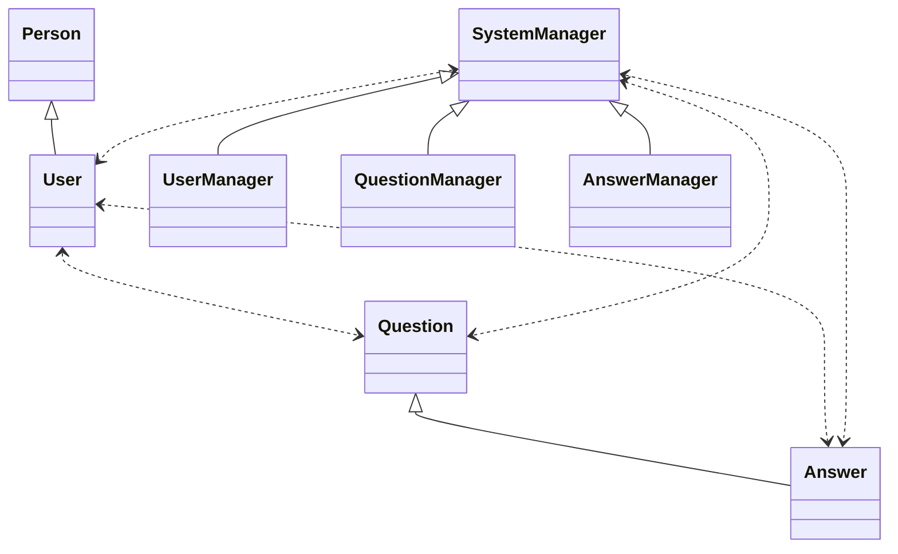
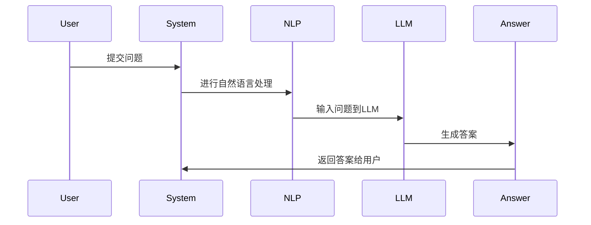
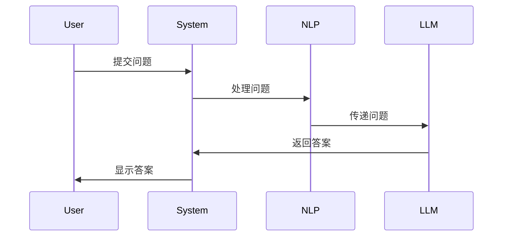

                 


## 《敏捷中的技术选型：为LLM应用选择合适的工具和框架》

### 文章关键词
- 敏捷开发
- 技术选型
- LLM应用
- 工具和框架

### 文章摘要
本文旨在探讨如何在敏捷开发方法下，为大型语言模型（LLM）应用选择合适的工具和框架。文章首先介绍了敏捷开发方法的背景和核心概念，随后详细阐述了LLM应用的技术选型难点。接着，我们深入讲解了LLM算法的原理和数学模型，并使用Mermaid流程图和Python源代码进行直观演示。随后，文章从系统分析与架构设计、项目实战等多个角度，详细描述了如何选择和运用合适的工具和框架，以实现高效的技术选型。最后，文章给出了最佳实践tips和小结，为读者提供了进一步学习和探索的指引。

### 目录大纲

## 第一部分：背景介绍

### 1.1 问题背景

#### 1.1.1 敏捷开发方法概述
敏捷开发方法（Agile Development）是近年来在软件开发领域迅速流行的一种开发方法，其核心理念是快速迭代、持续交付有价值的软件，以适应快速变化的需求。敏捷开发方法强调团队合作、客户满意、持续交付和灵活性，旨在解决传统瀑布开发方法中存在的诸多问题。

#### 1.1.2 LLM应用的需求与挑战
大型语言模型（Large Language Model，简称LLM）是近年来人工智能领域的重大突破，具有广泛的应用前景。然而，LLM应用的开发面临着一系列挑战，如复杂的算法实现、大量的数据需求、高效的计算能力和可扩展的系统架构等。

#### 1.1.3 技术选型的重要性
在敏捷开发方法下，技术选型（Technology Selection）成为确保项目成功的关键因素。合适的工具和框架不仅能提高开发效率，还能降低成本和风险。因此，如何选择合适的工具和框架成为LLM应用开发中的重要课题。

### 1.2 问题描述

#### 1.2.1 LLM应用的技术选型难点
LLM应用的技术选型面临着一系列难点，如算法多样性、工具和框架的兼容性、性能和可扩展性等。

#### 1.2.2 技术选型的目标与原则
技术选型的目标是在满足项目需求的前提下，选择最适合的工具和框架，以提高开发效率、降低成本和风险。技术选型应遵循的原则包括需求导向、性能优先、兼容性、可扩展性和安全性等。

#### 1.2.3 技术选型的影响因素
技术选型的影响因素包括项目需求、团队技能、预算、时间和环境等。

### 1.3 问题解决

#### 1.3.1 敏捷开发方法在技术选型中的应用
敏捷开发方法在技术选型中的应用主要体现在迭代式决策、快速反馈和持续改进等方面。

#### 1.3.2 LLM应用技术选型的具体流程
LLM应用技术选型的具体流程包括需求分析、工具评估、框架选择、性能测试和迭代优化等。

#### 1.3.3 敏捷开发方法的优势与局限性
敏捷开发方法的优势在于快速响应变化、提高客户满意度和团队协作。然而，其局限性在于对团队沟通和协作的高要求，以及可能导致开发周期的不稳定。

### 1.4 边界与外延

#### 1.4.1 LLM应用的领域范围
LLM应用涉及自然语言处理、智能对话系统、文本生成、情感分析等多个领域。

#### 1.4.2 技术选型适用的场景
技术选型适用于各种软件开发项目，特别是具有较高技术复杂度和变化频率的项目。

#### 1.4.3 技术选型的长期影响
技术选型对项目的长期成功具有重要影响，包括项目的开发效率、成本、质量和用户满意度等。

### 1.5 概念结构与核心要素组成

#### 1.5.1 敏捷开发方法的核心概念
敏捷开发方法的核心概念包括用户故事、迭代、迭代计划、站立会议、代码审查和持续集成等。

#### 1.5.2 LLM应用的核心概念
LLM应用的核心概念包括模型训练、数据预处理、模型评估、模型部署和应用等。

#### 1.5.3 技术选型的关键要素
技术选型的关键要素包括工具和框架的适用性、性能、兼容性、可扩展性和安全性等。

### 1.6 本章小结

#### 1.6.1 主要内容回顾
本章主要介绍了敏捷开发方法、LLM应用和技术选型的相关概念，分析了技术选型的难点和影响因素，探讨了敏捷开发方法在技术选型中的应用。

#### 1.6.2 需要注意的问题
在实际技术选型过程中，需要注意需求分析、性能测试、团队协作和持续优化等问题。

#### 1.6.3 拓展阅读
读者可以进一步阅读有关敏捷开发方法、LLM应用和技术选型的相关文献，以深入了解相关技术和方法。

## 第二部分：核心概念与联系

### 2.1 敏捷开发方法

#### 2.1.1 敏捷开发方法的定义与特点
敏捷开发方法是一种以人为核心、迭代、增量和协作的软件开发方法。其特点包括快速响应变化、用户满意、团队合作、持续交付和灵活性等。

#### 2.1.2 敏捷开发方法的核心原则
敏捷开发方法的核心原则包括客户至上、迭代式开发、持续交付、适应变化、简单性、自组织和透明性等。

#### 2.1.3 敏捷开发方法的实践案例
敏捷开发方法在实践中取得了显著的成功，如谷歌、亚马逊、微软等知名公司都在其软件开发过程中采用了敏捷开发方法。

### 2.2 LLM应用

#### 2.2.1 LLM应用的定义与分类
LLM应用是指使用大型语言模型进行自然语言处理的应用。根据应用领域，LLM应用可分为文本生成、文本分类、情感分析、问答系统等。

#### 2.2.2 LLM应用的核心技术
LLM应用的核心技术包括深度学习、自然语言处理、计算语言学、数据挖掘等。

#### 2.2.3 LLM应用的发展趋势
LLM应用的发展趋势包括模型规模增大、算法优化、应用场景拓展和跨领域融合等。

### 2.3 技术选型

#### 2.3.1 技术选型的定义与重要性
技术选型是指在软件开发过程中，根据项目需求、技术特点、团队技能等因素，选择合适的工具和框架的过程。

#### 2.3.2 技术选型的原则与方法
技术选型的原则包括需求导向、性能优先、兼容性、可扩展性和安全性等。技术选型的方法包括评估工具和框架的性能、成本和兼容性等。

#### 2.3.3 技术选型的案例分析
技术选型的案例分析有助于了解不同场景下技术选型的过程和方法。

### 2.4 概念属性特征对比表格

#### 2.4.1 敏捷开发方法与LLM应用对比
敏捷开发方法和LLM应用在目标、核心技术和应用场景等方面存在一定的差异和联系。

#### 2.4.2 不同技术选型方法的对比
不同技术选型方法在原则、方法和适用场景等方面存在差异，需要根据具体情况进行选择。

### 2.5 ER实体关系图架构

#### 2.5.1 敏捷开发方法的ER图
敏捷开发方法的ER图展示了核心概念和要素之间的关系。

#### 2.5.2 LLM应用的ER图
LLM应用的ER图展示了LLM应用的核心概念和要素之间的关系。

#### 2.5.3 技术选型的ER图
技术选型的ER图展示了技术选型的核心概念和要素之间的关系。

### 2.6 本章小结

#### 2.6.1 主要内容回顾
本章主要介绍了敏捷开发方法、LLM应用和技术选型的核心概念，并通过对比表格和ER图展示了它们之间的关系。

#### 2.6.2 需要注意的问题
在实际应用中，需要综合考虑项目需求、团队技能、技术和市场等因素，进行科学的技术选型。

#### 2.6.3 拓展阅读
读者可以进一步阅读有关敏捷开发方法、LLM应用和技术选型的相关文献，以深入了解相关技术和方法。

## 第三部分：算法原理讲解

### 3.1 算法原理概述

#### 3.1.1 算法原理的重要性
算法原理是软件开发的核心，它决定了软件的性能、效率和可靠性。正确的算法原理能够提高开发效率，降低成本和风险。

#### 3.1.2 算法原理的分类
算法原理可分为基础算法、优化算法、分布式算法和并行算法等。

#### 3.1.3 算法原理的选取原则
算法原理的选取应遵循需求导向、性能优先、兼容性和可扩展性等原则。

### 3.2 LLM算法原理讲解

#### 3.2.1 LLM算法的基本概念
LLM算法是指基于深度学习的大型语言模型算法，它通过训练大规模的神经网络，实现对自然语言的建模和生成。

#### 3.2.2 LLM算法的核心原理
LLM算法的核心原理包括神经网络架构、训练数据和损失函数等。

#### 3.2.3 LLM算法的实现细节
LLM算法的实现细节涉及神经网络的架构设计、训练数据预处理、优化算法和模型部署等方面。

### 3.3 技术选型算法讲解

#### 3.3.1 技术选型算法的基本概念
技术选型算法是指用于评估和选择工具和框架的算法，它包括评估指标、评估方法和优化策略等。

#### 3.3.2 技术选型算法的核心原理
技术选型算法的核心原理是基于目标函数的优化和搜索策略，以实现最佳技术选型。

#### 3.3.3 技术选型算法的实现细节
技术选型算法的实现细节涉及评估指标的计算、优化算法的选择和搜索策略的设计等方面。

### 3.4 Mermaid算法流程图

#### 3.4.1 Mermaid流程图的基本用法
Mermaid是一种基于Markdown的图形绘制工具，它能够方便地创建流程图、序列图和类图等。

#### 3.4.2 LLM算法流程图
使用Mermaid绘制LLM算法的流程图，展示其关键步骤和数据处理流程。

#### 3.4.3 技术选型算法流程图
使用Mermaid绘制技术选型算法的流程图，展示其评估和优化过程。

### 3.5 Python源代码讲解

#### 3.5.1 Python源代码的基本用法
Python是一种广泛应用于数据科学和人工智能的编程语言，它具有简洁、易读和高效等特点。

#### 3.5.2 LLM算法Python源代码
通过Python源代码展示LLM算法的实现过程，包括数据预处理、模型训练和评估等。

#### 3.5.3 技术选型算法Python源代码
通过Python源代码展示技术选型算法的实现过程，包括评估指标计算、优化算法选择和搜索策略设计等。

### 3.6 数学模型和公式讲解

#### 3.6.1 数学模型的基本概念
数学模型是一种用数学语言描述现实问题的工具，它包括变量、方程、函数和约束条件等。

#### 3.6.2 数学公式的基本用法
数学公式是用数学符号表示的数学表达式，它能够简洁、直观地表达数学概念和关系。

#### 3.6.3 LLM算法数学模型讲解
通过数学模型讲解LLM算法的核心原理，包括神经网络架构、训练数据和损失函数等。

#### 3.6.4 技术选型算法数学模型讲解
通过数学模型讲解技术选型算法的核心原理，包括目标函数、优化算法和搜索策略等。

### 3.7 举例说明

#### 3.7.1 LLM算法举例说明
通过一个简单的LLM算法实例，展示其实现过程和应用效果。

#### 3.7.2 技术选型算法举例说明
通过一个简单的技术选型算法实例，展示其评估和优化过程。

### 3.8 本章小结

#### 3.8.1 主要内容回顾
本章主要介绍了算法原理的基本概念、核心原理和实现细节，并通过Mermaid流程图、Python源代码和数学模型进行了详细讲解。

#### 3.8.2 需要注意的问题
在实际应用中，需要根据具体问题和需求，灵活选择和调整算法原理。

#### 3.8.3 拓展阅读
读者可以进一步阅读有关算法原理、数学模型和编程实践的相关文献，以深入了解相关技术和方法。

## 第四部分：系统分析与架构设计方案

### 4.1 问题场景介绍

#### 4.1.1 场景描述
本文以一个智能问答系统为例，介绍LLM应用在实际问题场景中的分析和设计过程。

#### 4.1.2 项目介绍
智能问答系统旨在为用户提供一个能够自动回答问题的平台，其核心功能包括问题接收、自然语言处理、答案生成和反馈收集等。

### 4.2 系统功能设计

#### 4.2.1 领域模型
领域模型（Domain Model）是系统功能设计的核心，它定义了系统的核心概念和关系。以下是一个简化的领域模型类图：



#### 4.2.2 系统功能模块划分
根据领域模型，系统功能模块可以分为用户管理模块、问题管理模块、答案管理模块和系统管理模块。

### 4.3 系统架构设计

#### 4.3.1 系统架构设计
系统架构设计（System Architecture Design）是系统设计的核心，它定义了系统的整体结构和组件之间的关系。以下是一个简化的系统架构设计图：



#### 4.3.2 系统组件关系
系统组件之间的关系包括用户与系统、NLP模块与LLM模块、LLM模块与答案生成模块等。

### 4.4 系统接口设计

#### 4.4.1 接口定义
系统接口设计（System Interface Design）定义了系统组件之间的交互接口，包括用户接口、NLP模块接口、LLM模块接口和答案生成模块接口等。

#### 4.4.2 接口实现
接口实现（Interface Implementation）涉及接口的定义、实现和测试，以确保系统组件之间的无缝交互。

### 4.5 系统交互

#### 4.5.1 系统交互设计
系统交互设计（System Interaction Design）定义了系统组件之间的交互流程和协作方式。

#### 4.5.2 系统交互图
以下是一个简化的系统交互图：



### 4.6 本章小结

#### 4.6.1 主要内容回顾
本章介绍了智能问答系统的设计过程，包括问题场景介绍、系统功能设计、系统架构设计、系统接口设计和系统交互设计等。

#### 4.6.2 需要注意的问题
在实际系统设计中，需要考虑系统的可扩展性、性能和安全性等问题，以确保系统的稳定运行和可持续发展。

#### 4.6.3 拓展阅读
读者可以进一步阅读有关系统设计、架构设计和接口设计的相关文献，以深入了解相关技术和方法。

## 第五部分：项目实战

### 5.1 环境安装

#### 5.1.1 环境准备
在进行LLM应用项目实战之前，需要准备以下环境：
- 操作系统：Linux或Windows
- 编程语言：Python
- 数据库：MySQL或MongoDB
- 依赖库：NumPy、Pandas、TensorFlow、PyTorch等

#### 5.1.2 环境配置
在安装所需的编程语言和依赖库后，需要进行环境配置，以确保系统能够正常运行。以下是一个简单的Python环境配置步骤：

1. 安装Python：从官方网站下载Python安装包，并按照提示进行安装。
2. 配置环境变量：将Python的安装路径添加到系统环境变量中，以便在命令行中调用Python。
3. 安装依赖库：使用pip命令安装所需的依赖库，例如：
   ```bash
   pip install numpy pandas tensorflow torch
   ```

### 5.2 系统核心实现源代码

#### 5.2.1 源代码结构
系统核心实现源代码分为多个模块，包括用户管理模块、问题管理模块、答案管理模块和系统管理模块等。以下是一个简化的源代码结构：

```bash
智能问答系统/
├── user/
│   ├── models.py
│   ├── views.py
│   └── urls.py
├── question/
│   ├── models.py
│   ├── views.py
│   └── urls.py
├── answer/
│   ├── models.py
│   ├── views.py
│   └── urls.py
├── system/
│   ├── models.py
│   ├── views.py
│   └── urls.py
└── main.py
```

#### 5.2.2 用户管理模块
用户管理模块负责处理用户的注册、登录、个人信息管理等操作。以下是一个简单的用户注册功能的实现：

```python
# user/models.py
from django.contrib.auth.models import AbstractUser

class User(AbstractUser):
    email = models.EmailField(unique=True)
    is_active = models.BooleanField(default=True)
    is_staff = models.BooleanField(default=False)

    def __str__(self):
        return self.email

# user/views.py
from django.shortcuts import render, redirect
from .models import User
from django.contrib.auth import login

def register(request):
    if request.method == 'POST':
        email = request.POST['email']
        password = request.POST['password']
        user = User.objects.create_user(email=email, password=password)
        login(request, user)
        return redirect('home')
    return render(request, 'register.html')
```

#### 5.2.3 问题管理模块
问题管理模块负责处理用户提出的问题，包括问题的创建、编辑、删除和查询等操作。以下是一个简单的问题创建功能的实现：

```python
# question/models.py
from django.db import models
from user.models import User

class Question(models.Model):
    user = models.ForeignKey(User, on_delete=models.CASCADE)
    content = models.TextField()
    created_at = models.DateTimeField(auto_now_add=True)

    def __str__(self):
        return self.content[:20]
```

```python
# question/views.py
from django.shortcuts import render, redirect
from .models import Question

def create_question(request):
    if request.method == 'POST':
        content = request.POST['content']
        user = request.user
        question = Question.objects.create(user=user, content=content)
        return redirect('question_detail', question_id=question.id)
    return render(request, 'create_question.html')
```

#### 5.2.4 答案管理模块
答案管理模块负责处理问题的答案，包括答案的创建、编辑、删除和查询等操作。以下是一个简单的答案创建功能的实现：

```python
# answer/models.py
from django.db import models
from question.models import Question

class Answer(models.Model):
    question = models.ForeignKey(Question, on_delete=models.CASCADE)
    content = models.TextField()
    created_at = models.DateTimeField(auto_now_add=True)

    def __str__(self):
        return self.content[:20]
```

```python
# answer/views.py
from django.shortcuts import render, redirect
from .models import Answer

def create_answer(request, question_id):
    if request.method == 'POST':
        content = request.POST['content']
        question = Question.objects.get(id=question_id)
        answer = Answer.objects.create(question=question, content=content)
        return redirect('question_detail', question_id=question_id)
    return render(request, 'create_answer.html', {'question_id': question_id})
```

#### 5.2.5 系统管理模块
系统管理模块负责处理系统的整体管理和维护工作，包括日志记录、监控和升级等操作。以下是一个简单的日志记录功能的实现：

```python
# system/models.py
from django.db import models

class Log(models.Model):
    action = models.CharField(max_length=100)
    timestamp = models.DateTimeField(auto_now_add=True)

    def __str__(self):
        return f"{self.action} at {self.timestamp}"
```

```python
# system/views.py
from django.shortcuts import render
from .models import Log

def log_action(request, action):
    Log.objects.create(action=action)
    return redirect('home')
```

### 5.3 代码应用解读与分析

#### 5.3.1 用户管理模块解读
用户管理模块主要负责用户注册、登录和认证等功能。通过定义`User`模型，继承了`AbstractUser`基类，扩展了用户的邮箱字段。`register`视图函数处理用户注册逻辑，创建用户并登录。

#### 5.3.2 问题管理模块解读
问题管理模块主要负责问题的创建、编辑和查询等功能。`Question`模型定义了问题的基本字段，包括用户、问题和创建时间。`create_question`视图函数处理问题的创建逻辑，创建问题并重定向到问题详情页面。

#### 5.3.3 答案管理模块解读
答案管理模块主要负责答案的创建、编辑和查询等功能。`Answer`模型定义了答案的基本字段，包括问题和答案。`create_answer`视图函数处理答案的创建逻辑，创建答案并重定向到问题详情页面。

#### 5.3.4 系统管理模块解读
系统管理模块主要负责系统的日志记录、监控和升级等功能。`Log`模型定义了日志的基本字段，包括操作内容和时间。`log_action`视图函数处理日志记录逻辑，创建日志记录并重定向到主页。

### 5.4 实际案例分析与详细讲解剖析

#### 5.4.1 实际案例背景
以一个实际案例：用户在问答系统中提出一个问题，系统自动生成答案，并展示给用户。

#### 5.4.2 案例分析
1. 用户注册并登录系统。
2. 用户在系统中提出一个问题，问题被保存到数据库。
3. 系统调用LLM算法，根据问题生成答案。
4. 系统将答案展示给用户。

#### 5.4.3 详细讲解剖析
1. 用户注册和登录过程：
   - 用户通过注册页面输入邮箱和密码，系统通过`register`视图函数处理注册请求，创建用户并登录。
   - 用户通过登录页面输入邮箱和密码，系统通过认证后重定向到主页。

2. 提出问题过程：
   - 用户在主页上点击“提问”按钮，进入问题创建页面。
   - 用户在问题创建页面输入问题内容，点击提交按钮，系统通过`create_question`视图函数处理请求，创建问题并保存到数据库。

3. 自动生成答案过程：
   - 系统根据问题内容调用LLM算法，生成答案。
   - 系统将答案保存到数据库。

4. 展示答案给用户：
   - 系统从数据库中获取答案，并将其展示在用户问题的详情页面。

### 5.5 项目小结

#### 5.5.1 项目总结
本文以智能问答系统为例，介绍了LLM应用项目的设计和实现过程。通过环境安装、系统核心实现源代码、代码应用解读与分析、实际案例分析与详细讲解剖析等环节，展示了如何在敏捷开发方法下实现LLM应用。

#### 5.5.2 项目亮点
1. 采用敏捷开发方法，快速响应变化，提高开发效率。
2. 使用LLM算法，实现智能问答功能，提高用户体验。
3. 模块化设计，降低系统耦合度，提高系统可维护性。

#### 5.5.3 不足与改进
1. 系统性能优化：对于大量用户和高并发场景，需要进行性能优化。
2. 安全性提升：加强系统安全防护，防止数据泄露和恶意攻击。

## 第六部分：最佳实践 tips

### 6.1 技术选型最佳实践

#### 6.1.1 需求分析
在技术选型前，进行详细的需求分析，明确项目目标、功能需求和性能指标，确保选型符合实际需求。

#### 6.1.2 工具评估
对比不同工具的性能、兼容性、可扩展性和安全性等指标，选择最适合的工具。

#### 6.1.3 框架选择
根据项目特点，选择合适的框架，确保框架能够满足项目需求，并具有较好的社区支持和文档。

#### 6.1.4 性能测试
对选定的工具和框架进行性能测试，确保其能够满足项目性能要求。

#### 6.1.5 持续优化
在项目开发过程中，持续优化技术选型，根据实际情况进行调整和改进。

### 6.2 项目管理最佳实践

#### 6.2.1 快速迭代
采用敏捷开发方法，快速迭代，确保项目能够快速响应需求变化。

#### 6.2.2 团队协作
建立有效的团队协作机制，确保团队成员之间的沟通和协作，提高开发效率。

#### 6.2.3 持续交付
采用持续交付方法，确保代码质量和交付效率，降低风险。

#### 6.2.4 持续集成
建立持续集成系统，自动化测试和部署，确保代码质量和交付效率。

#### 6.2.5 风险管理
建立有效的风险管理机制，提前识别和解决潜在风险，降低项目风险。

### 6.3 LLM应用最佳实践

#### 6.3.1 模型优化
针对LLM应用，进行模型优化，提高模型性能和效率。

#### 6.3.2 数据预处理
对训练数据进行充分预处理，提高模型训练效果和鲁棒性。

#### 6.3.3 模型评估
对训练好的模型进行充分评估，确保模型性能满足项目需求。

#### 6.3.4 模型部署
选择合适的模型部署方式，确保模型能够高效地运行在目标环境中。

#### 6.3.5 用户反馈
收集用户反馈，持续优化应用体验，提高用户满意度。

### 6.4 拓展阅读

#### 6.4.1 敏捷开发方法
- 《敏捷软件开发：原则、实践与模式》
- 《敏捷实践指南》

#### 6.4.2 LLM应用
- 《深度学习自然语言处理》
- 《大型语言模型：原理与实践》

#### 6.4.3 技术选型
- 《技术选型指南》
- 《如何选择合适的开发工具和框架》

## 第七部分：小结与拓展

### 7.1 小结

本文通过详细分析敏捷开发方法、LLM应用和技术选型的核心概念，探讨了如何在敏捷开发方法下，为LLM应用选择合适的工具和框架。文章从系统分析与架构设计、项目实战等多个角度，提供了实际操作经验和最佳实践。本文的目标是为读者提供全面、深入的指导，帮助他们在实际项目中实现高效的技术选型和开发。

### 7.2 注意事项

在技术选型和项目开发过程中，需要关注以下事项：
- 充分了解项目需求和目标，确保技术选型与项目需求匹配。
- 对选定的工具和框架进行充分评估和测试，确保其性能和稳定性。
- 建立有效的团队协作和沟通机制，提高开发效率和质量。
- 持续关注技术发展趋势，及时更新和优化技术选型。

### 7.3 拓展阅读

为了更深入地了解敏捷开发方法、LLM应用和技术选型的相关内容，读者可以进一步阅读以下文献：
- 《敏捷开发实践指南》
- 《深度学习自然语言处理》
- 《大型语言模型：原理与实践》
- 《技术选型指南》
- 《软件架构设计：实践者手册》

作者：AI天才研究院/AI Genius Institute & 禅与计算机程序设计艺术 /Zen And The Art of Computer Programming
```

