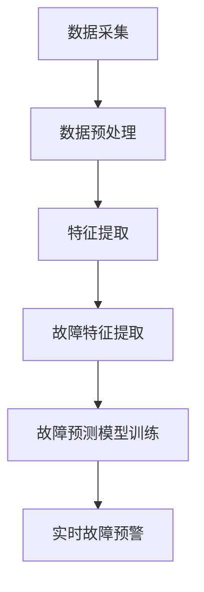
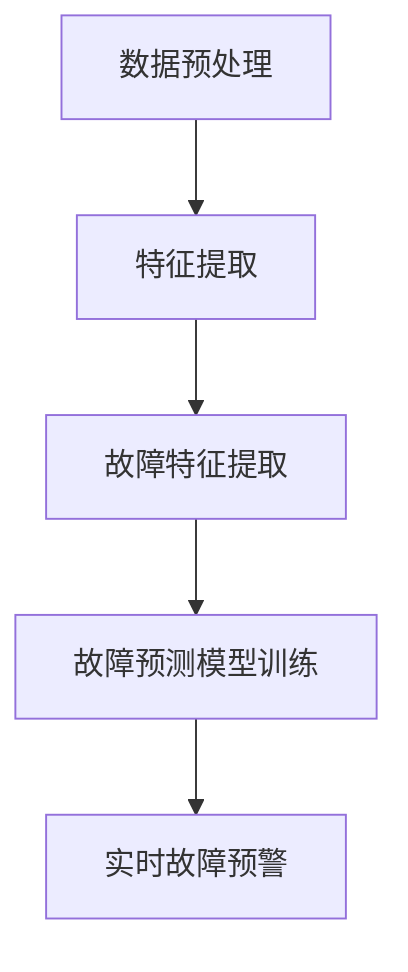
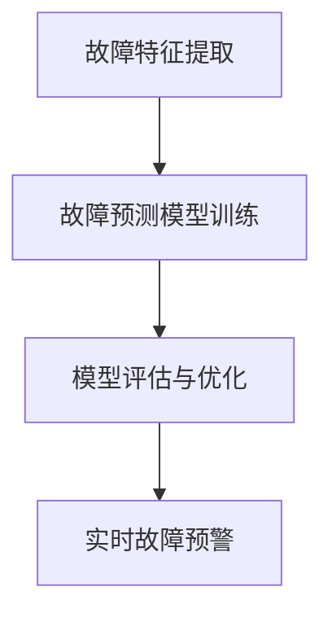
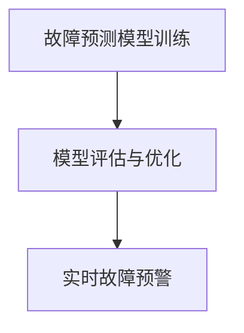
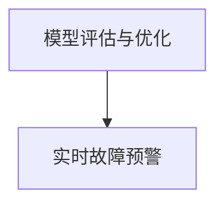

                 

### 1.1 数字孪生的核心概念

数字孪生（Digital Twin）是近年来在工业互联网、智能制造等领域中备受关注的概念。它指的是通过虚拟仿真和智能算法，构建与实体系统相对应的数字模型，实现对实体系统的全生命周期管理、优化和预测。数字孪生不仅仅是物理实体的数字化映射，更是一种集成了物联网、大数据、人工智能等先进技术的综合性解决方案。

#### 1.1.1 数字孪生的定义

数字孪生的定义有多种表述，但其核心内涵一致，主要可以概括为以下几点：

- **物理实体映射**：数字孪生通过传感器、摄像头、RFID等手段，实时采集物理实体的状态信息，包括位置、速度、温度、湿度等，并在数字世界中构建出与之对应的模型。

- **数据融合与处理**：数字孪生通过数据处理和分析，将传感器收集的原始数据进行预处理、特征提取和融合，形成高价值的数据信息，用于支持决策制定。

- **实时交互与模拟**：数字孪生可以实现与物理实体的实时交互，通过对数字模型的模拟，预测物理实体未来的行为和状态，指导实际操作。

- **闭环反馈与优化**：基于数字孪生的模拟和预测结果，可以实时调整物理实体的操作，形成闭环反馈，从而实现对物理实体的优化和改进。

#### 1.1.2 数字孪生的发展历程

数字孪生的概念起源于2002年迈克尔·格里夫斯（Michael Grieves）在麻省理工学院（MIT）提出的“虚拟产品开发”（Virtual Product Development）理论。此后，随着物联网、大数据、云计算和人工智能等技术的快速发展，数字孪生的理论逐渐成熟并开始应用于实际生产中。

- **2002-2010年**：数字孪生的概念被提出，并开始应用于航空航天和汽车制造领域。

- **2011-2015年**：数字孪生开始从理论走向实践，部分企业开始尝试将其应用于生产线和设备管理。

- **2016-2020年**：随着工业4.0、物联网和智能制造的兴起，数字孪生的应用范围迅速扩大，涵盖了制造业、能源、医疗、建筑等多个行业。

- **2020年至今**：数字孪生技术不断迭代更新，人工智能、边缘计算等新兴技术进一步提升了数字孪生的应用效果和范围。

#### 1.1.3 数字孪生的应用领域

数字孪生在各个领域都有广泛的应用，以下是几个典型的应用场景：

- **制造业**：通过数字孪生技术，可以对生产设备进行实时监测和预测维护，提高生产效率，降低设备故障率。

- **能源行业**：在智能电网、石油和天然气等领域，数字孪生可以帮助企业实现能源优化，预测设备故障，降低运营成本。

- **医疗健康**：数字孪生在医疗设备、远程监护、疾病预测等方面有广泛应用，可以提升医疗服务的质量和效率。

- **交通运输**：数字孪生技术在无人机、自动驾驶汽车等领域有重要应用，可以实现对交通工具的实时监控和预测维护。

#### 1.3 数字孪生在智能电网故障预测中的重要性

在智能电网中，故障预测是保障电网安全运行的关键环节。数字孪生技术通过构建电网的数字模型，实现对电网运行状态的实时监测和分析，从而提高故障预测的准确性和效率。

- **提高故障预测准确性**：数字孪生技术可以实时采集电网的各项运行数据，通过大数据分析和机器学习算法，预测潜在的故障点，提高故障预测的准确性。

- **降低故障发生概率**：通过数字孪生的实时监测和预测，可以提前发现故障隐患，及时采取措施进行预防，降低故障发生的概率。

- **优化电网运行效率**：数字孪生技术可以对电网的运行状态进行实时分析和优化，提高电网的运行效率，降低能源损耗。

- **提高电网运维效率**：数字孪生技术可以实现远程监控和故障诊断，减少现场运维工作量，提高运维效率。

#### 1.3.1 故障预测的需求

智能电网故障预测的需求主要来源于以下几个方面：

- **保障电网安全运行**：故障预测是保障电网安全运行的关键，可以及时发现和处理潜在的故障隐患，防止重大事故的发生。

- **降低运维成本**：通过故障预测，可以提前发现和解决故障，减少故障维修和设备更换的成本。

- **提高电网运行效率**：故障预测可以帮助优化电网运行策略，提高电网的运行效率，降低能源损耗。

- **响应电网发展需求**：随着电网规模的不断扩大和新能源的接入，故障预测需求日益迫切，数字孪生技术提供了有效的解决方案。

#### 1.3.2 数字孪生如何支持故障预测

数字孪生技术在智能电网故障预测中的应用主要包括以下几个方面：

- **实时数据采集**：通过传感器、智能终端等设备，实时采集电网的各项运行数据，包括电压、电流、温度、湿度等。

- **数据预处理与融合**：对采集到的数据进行预处理，包括滤波、去噪、归一化等，然后进行数据融合，形成全面反映电网运行状态的数据集。

- **故障特征提取**：通过对预处理后的数据进行特征提取，提取出与故障相关的特征指标，为故障预测提供基础数据。

- **故障预测模型构建**：利用机器学习算法，构建故障预测模型，对电网的运行状态进行预测，识别潜在的故障点。

- **实时监控与预警**：基于数字孪生模型，实现对电网运行状态的实时监控，当发现潜在的故障风险时，及时发出预警，指导运维人员采取相应措施。

#### 1.3.3 数字孪生在智能电网中的应用案例

数字孪生技术在智能电网故障预测中的应用案例有很多，以下是其中两个典型的案例：

- **案例一：某电力公司智能电网故障预测系统**：该电力公司通过部署数字孪生技术，构建了智能电网故障预测系统。系统实时采集电网的运行数据，通过大数据分析和机器学习算法，预测潜在的故障点，并发出预警，提高了故障预测的准确性和运维效率。

- **案例二：智能电网虚拟仿真平台**：某科研机构开发了一款智能电网虚拟仿真平台，通过数字孪生技术，模拟了电网的运行状态和故障场景。平台可以实现对电网的实时监控和故障预测，为电网运行提供决策支持，提高了电网的稳定性和可靠性。

### 总结

数字孪生技术在智能电网故障预测中的应用具有重要意义，可以提高故障预测的准确性，降低故障发生概率，优化电网运行效率，提高运维效率。随着数字孪生技术的不断发展和成熟，其在智能电网领域的应用前景将更加广阔。

----------------------------------------------------------------

---

**关键词：** 数字孪生、智能电网、故障预测、传感器技术、机器学习

**摘要：** 本文深入探讨了数字孪生在智能电网故障预测中的应用，从核心概念、发展历程、关键技术、应用案例等方面进行了全面阐述。通过介绍数字孪生的核心原理和智能电网的基本原理，分析了数字孪生在故障预测中的重要性，并详细描述了数字孪生技术如何支持故障预测，最后通过实际案例展示了数字孪生在智能电网故障预测中的应用效果。本文旨在为读者提供对数字孪生与智能电网故障预测的深入理解和应用指导。

---

----------------------------------------------------------------

## 第2章 数字孪生的构建与关键技术

### 2.1 数字孪生的构建过程

数字孪生的构建是一个复杂而系统的过程，涉及到数据采集、数据处理、模型构建、模型验证与优化等多个环节。以下是数字孪生构建的基本步骤：

#### 2.1.1 数字孪生的数据来源

数字孪生的数据来源主要包括以下几种：

1. **传感器数据**：传感器是数字孪生数据采集的核心设备，可以实时监测物理实体的各种状态参数，如温度、湿度、压力、速度等。

2. **设备数据**：通过物联网技术，将设备的生产数据、运行数据、维护数据等集成到数字孪生中。

3. **外部数据**：包括环境数据、气象数据、地理数据等，这些数据对于数字孪生模型的精确性和实时性具有重要意义。

#### 2.1.2 数字孪生模型的构建

数字孪生模型的构建主要包括以下几个步骤：

1. **数据预处理**：对采集到的原始数据进行清洗、去噪、归一化等处理，确保数据的质量和一致性。

2. **特征提取**：从预处理后的数据中提取出与物理实体状态相关的特征，这些特征将用于构建数字孪生模型。

3. **模型选择**：根据实际需求和应用场景，选择合适的模型构建方法，如物理模型、数据驱动模型、混合模型等。

4. **模型训练**：利用机器学习算法，对数字孪生模型进行训练，使其能够准确地模拟物理实体的状态和行为。

5. **模型评估**：通过交叉验证、性能指标评估等方法，对数字孪生模型的性能进行评估和优化。

#### 2.1.3 数字孪生模型的验证与优化

数字孪生模型的验证与优化是确保其准确性和可靠性的关键步骤。主要包括以下内容：

1. **模型验证**：通过将训练集和验证集的数据输入到模型中，评估模型的预测性能，验证模型是否能够准确预测物理实体的状态。

2. **模型优化**：根据模型验证的结果，对模型进行调整和优化，包括参数调整、算法改进等，以提高模型的预测准确性和稳定性。

3. **闭环反馈**：将数字孪生模型预测的结果与实际物理实体的状态进行对比，形成闭环反馈，不断调整和优化模型，使其更加准确和可靠。

### 2.2 关键技术介绍

构建数字孪生模型需要依赖于一系列关键技术的支持，以下介绍几种主要的关键技术：

#### 2.2.1 传感器技术

传感器技术是数字孪生数据采集的基础。传感器种类繁多，包括温度传感器、压力传感器、湿度传感器、光电传感器等。选择合适的传感器，确保数据的准确性和实时性，对于数字孪生的构建至关重要。

#### 2.2.2 数据采集与处理技术

数据采集与处理技术包括数据的采集、传输、存储和处理等环节。通过物联网技术，将传感器采集到的数据实时传输到数据中心，利用大数据处理技术，对海量数据进行高效存储和处理，为数字孪生模型的构建提供数据支持。

#### 2.2.3 虚拟仿真与模拟技术

虚拟仿真与模拟技术是数字孪生模型的核心组成部分。通过虚拟仿真和模拟，可以实现对物理实体状态的实时监测和预测，评估模型的有效性和准确性。

#### 2.2.4 人工智能与机器学习技术

人工智能与机器学习技术是数字孪生模型训练和优化的关键。通过机器学习算法，如深度学习、强化学习、支持向量机等，可以构建高效的数字孪生模型，实现对物理实体状态的准确预测。

#### 2.2.5 边缘计算与云计算技术

边缘计算与云计算技术为数字孪生模型的构建提供了强大的计算和存储能力。通过边缘计算，可以实时处理和分析传感器数据，降低数据传输延迟，提高系统的实时性和响应速度。云计算则提供了海量数据的存储和处理能力，为数字孪生模型提供了稳定的数据支持。

### 2.3 数字孪生在智能电网故障预测中的应用

在智能电网故障预测中，数字孪生技术的应用主要包括以下几个方面：

#### 2.3.1 数据采集与监测

利用传感器技术，对电网设备进行实时监测，采集温度、电流、电压、设备状态等数据，为数字孪生模型的构建提供数据支持。

#### 2.3.2 故障特征提取

通过对采集到的数据进行预处理和特征提取，提取出与故障相关的特征指标，如电流异常值、温度波动等，为故障预测提供基础数据。

#### 2.3.3 故障预测模型构建

利用机器学习算法，构建数字孪生模型，对电网设备的运行状态进行实时监测和预测，识别潜在的故障点。

#### 2.3.4 实时预警与决策支持

基于数字孪生模型的预测结果，实时发出故障预警，为运维人员提供决策支持，及时采取措施进行故障处理，提高电网的稳定性和可靠性。

### 2.4 数字孪生技术的挑战与未来发展趋势

尽管数字孪生技术在智能电网故障预测中具有巨大的应用潜力，但其发展也面临着一系列挑战和瓶颈：

#### 2.4.1 数据质量与实时性

数字孪生模型依赖于高质量、实时性的数据。然而，传感器数据的质量和实时性往往受到多种因素的影响，如传感器精度、传输延迟等。因此，如何提高数据质量和实时性，是数字孪生技术发展的重要挑战。

#### 2.4.2 模型优化与精度

数字孪生模型的优化和精度直接影响到故障预测的准确性和可靠性。如何选择合适的模型算法、优化模型参数，提高模型的预测精度，是当前研究的重点。

#### 2.4.3 隐私与安全问题

数字孪生技术涉及到大量的数据采集、传输和处理，因此面临着隐私和安全的挑战。如何保护用户隐私，确保数据安全，是数字孪生技术发展的重要课题。

#### 2.4.4 标准化与互操作性

数字孪生技术的标准化和互操作性是推广应用的关键。目前，不同厂商、不同平台的数字孪生技术存在一定的差异，如何实现标准化和互操作性，是数字孪生技术未来发展的重要方向。

### 2.5 未来发展趋势

随着物联网、大数据、人工智能等技术的不断发展，数字孪生技术在智能电网故障预测中的应用前景将更加广阔。以下是未来数字孪生技术发展的几个可能趋势：

#### 2.5.1 边缘计算与物联网的融合

边缘计算和物联网技术的发展，将使数字孪生技术的数据采集和处理能力得到进一步提升，实现更加实时、高效的故障预测。

#### 2.5.2 人工智能与机器学习算法的优化

人工智能与机器学习算法的不断发展，将推动数字孪生模型的优化和精度提升，提高故障预测的准确性和可靠性。

#### 2.5.3 隐私保护与安全防护

隐私保护与安全防护技术的发展，将确保数字孪生技术在应用过程中用户数据的安全，提高系统的可信度。

#### 2.5.4 标准化与互操作性

数字孪生技术的标准化和互操作性将推动技术的广泛应用，提高系统的兼容性和易用性。

### 总结

数字孪生技术在智能电网故障预测中具有重要作用，通过构建数字孪生模型，实现对电网运行状态的实时监测和预测，提高故障预测的准确性和运维效率。然而，数字孪生技术也面临着一系列挑战和瓶颈，需要不断优化和改进。随着技术的不断发展，数字孪生技术在智能电网故障预测中的应用前景将更加广阔。

----------------------------------------------------------------

---

**关键词：** 数字孪生、传感器技术、数据采集与处理、故障预测模型、边缘计算与云计算

**摘要：** 本章详细介绍了数字孪生在构建过程中的关键技术，包括数据来源、模型构建、验证与优化等步骤，以及传感器技术、数据采集与处理技术、虚拟仿真与模拟技术、人工智能与机器学习技术等。同时，分析了数字孪生在智能电网故障预测中的应用，探讨了当前面临的挑战和未来发展趋势。通过本章的学习，读者可以深入了解数字孪生技术在智能电网故障预测中的重要作用和实际应用。

---

----------------------------------------------------------------

## 第3章 智能电网故障预测算法

### 3.1 故障预测算法概述

智能电网故障预测算法是保障电网稳定运行的关键技术，通过分析电网运行数据，提前识别潜在故障，实现预防性维护。故障预测算法可以分为传统算法和现代算法两大类。

#### 3.1.1 传统故障预测算法

传统故障预测算法主要包括以下几种：

1. **人工神经网络算法**：人工神经网络（Artificial Neural Networks，ANN）通过模拟生物神经网络的结构和功能，实现对输入数据的模式识别和预测。ANN具有自适应性和自学习能力，适用于处理复杂和非线性问题。

2. **支持向量机算法**：支持向量机（Support Vector Machine，SVM）是一种基于统计学习理论的分类算法，通过找到一个最优的超平面，将不同类别的数据点分隔开。SVM在故障预测中具有较高的预测精度和泛化能力。

3. **决策树算法**：决策树（Decision Tree）是一种基于树形结构的数据挖掘算法，通过一系列的判断条件，将数据逐步划分成多个子集，最后得到预测结果。决策树算法易于理解和解释，但可能存在过拟合问题。

#### 3.1.2 现代故障预测算法

现代故障预测算法主要基于人工智能和机器学习技术，具有更高的预测精度和更强的自学习能力。主要包括以下几种：

1. **深度学习算法**：深度学习（Deep Learning）是一种基于多层神经网络的学习方法，通过多次非线性变换，逐步提取数据中的特征。深度学习在图像识别、语音识别等领域取得了显著成果，逐渐应用于故障预测领域。

2. **强化学习算法**：强化学习（Reinforcement Learning，RL）是一种通过不断试错和学习，实现最优策略的算法。在故障预测中，强化学习可以通过与环境互动，不断调整预测策略，提高预测准确性。

### 3.2 常用故障预测算法

在本节中，我们将详细介绍几种常用的故障预测算法，并比较它们在智能电网故障预测中的应用效果。

#### 3.2.1 传统故障预测算法

**1. 人工神经网络算法**

人工神经网络算法在故障预测中具有广泛的应用。其基本原理是通过构建多层神经网络，对输入数据进行特征提取和分类。以下是人工神经网络算法的基本步骤：

1. **数据预处理**：对输入数据进行归一化、去噪等处理，确保数据质量。

2. **网络构建**：根据问题需求，设计合适的网络结构，包括输入层、隐藏层和输出层。

3. **模型训练**：利用训练数据，通过反向传播算法，不断调整网络权重，使网络输出更接近真实值。

4. **模型评估**：利用验证数据，评估网络模型的预测性能，包括准确率、召回率等指标。

以下是一个简单的人工神经网络算法的Python实现：

```python
from sklearn.neural_network import MLPClassifier
from sklearn.model_selection import train_test_split
from sklearn.metrics import accuracy_score

# 数据预处理
X = ...  # 输入特征
y = ...  # 标签

# 网络构建
mlp = MLPClassifier(hidden_layer_sizes=(100,), max_iter=1000)

# 模型训练
X_train, X_test, y_train, y_test = train_test_split(X, y, test_size=0.2)
mlp.fit(X_train, y_train)

# 模型评估
y_pred = mlp.predict(X_test)
accuracy = accuracy_score(y_test, y_pred)
print(f"Accuracy: {accuracy}")
```

**2. 支持向量机算法**

支持向量机算法在故障预测中具有较好的分类性能。其基本原理是通过寻找一个最优的超平面，将不同类别的数据点分隔开。以下是支持向量机算法的基本步骤：

1. **数据预处理**：对输入数据进行归一化、去噪等处理。

2. **模型训练**：使用训练数据，通过求解优化问题，得到最优的超平面。

3. **模型评估**：利用验证数据，评估模型的预测性能。

以下是一个简单的支持向量机算法的Python实现：

```python
from sklearn.svm import SVC
from sklearn.model_selection import train_test_split
from sklearn.metrics import accuracy_score

# 数据预处理
X = ...  # 输入特征
y = ...  # 标签

# 模型训练
X_train, X_test, y_train, y_test = train_test_split(X, y, test_size=0.2)
svm = SVC(kernel='linear')
svm.fit(X_train, y_train)

# 模型评估
y_pred = svm.predict(X_test)
accuracy = accuracy_score(y_test, y_pred)
print(f"Accuracy: {accuracy}")
```

**3. 决策树算法**

决策树算法在故障预测中具有直观易懂的特点。其基本原理是通过一系列的判断条件，将数据逐步划分成多个子集。以下是决策树算法的基本步骤：

1. **数据预处理**：对输入数据进行归一化、去噪等处理。

2. **特征选择**：选择对故障预测有显著影响的特征。

3. **模型训练**：构建决策树模型。

4. **模型评估**：利用验证数据，评估模型的预测性能。

以下是一个简单的决策树算法的Python实现：

```python
from sklearn.tree import DecisionTreeClassifier
from sklearn.model_selection import train_test_split
from sklearn.metrics import accuracy_score

# 数据预处理
X = ...  # 输入特征
y = ...  # 标签

# 模型训练
X_train, X_test, y_train, y_test = train_test_split(X, y, test_size=0.2)
dt = DecisionTreeClassifier()
dt.fit(X_train, y_train)

# 模型评估
y_pred = dt.predict(X_test)
accuracy = accuracy_score(y_test, y_pred)
print(f"Accuracy: {accuracy}")
```

#### 3.2.2 现代故障预测算法

**1. 深度学习算法**

深度学习算法在故障预测中具有强大的建模能力。其基本原理是通过多层神经网络，逐层提取数据中的特征。以下是深度学习算法的基本步骤：

1. **数据预处理**：对输入数据进行归一化、去噪等处理。

2. **网络构建**：设计合适的网络结构，包括输入层、隐藏层和输出层。

3. **模型训练**：使用训练数据，通过反向传播算法，不断调整网络权重。

4. **模型评估**：利用验证数据，评估模型的预测性能。

以下是一个简单的深度学习算法的Python实现：

```python
from tensorflow.keras.models import Sequential
from tensorflow.keras.layers import Dense
from sklearn.model_selection import train_test_split
from sklearn.metrics import accuracy_score

# 数据预处理
X = ...  # 输入特征
y = ...  # 标签

# 网络构建
model = Sequential()
model.add(Dense(64, input_dim=X.shape[1], activation='relu'))
model.add(Dense(32, activation='relu'))
model.add(Dense(1, activation='sigmoid'))

# 模型训练
X_train, X_test, y_train, y_test = train_test_split(X, y, test_size=0.2)
model.compile(optimizer='adam', loss='binary_crossentropy', metrics=['accuracy'])
model.fit(X_train, y_train, epochs=10, batch_size=32)

# 模型评估
y_pred = model.predict(X_test)
y_pred = (y_pred > 0.5)
accuracy = accuracy_score(y_test, y_pred)
print(f"Accuracy: {accuracy}")
```

**2. 强化学习算法**

强化学习算法在故障预测中具有自适应性和自学习能力。其基本原理是通过与环境互动，不断调整预测策略，提高预测准确性。以下是强化学习算法的基本步骤：

1. **环境搭建**：构建故障预测环境，包括状态空间、动作空间和奖励机制。

2. **模型训练**：利用强化学习算法，训练预测模型。

3. **模型评估**：在测试环境中评估模型性能，调整策略。

以下是一个简单的强化学习算法的Python实现：

```python
import numpy as np
import gym

# 环境搭建
env = gym.make("CartPole-v0")

# 模型训练
model = ...  # 定义强化学习模型

for episode in range(1000):
    state = env.reset()
    done = False
    total_reward = 0
    while not done:
        action = model.predict(state)
        next_state, reward, done, _ = env.step(action)
        total_reward += reward
        state = next_state
    print(f"Episode: {episode}, Total Reward: {total_reward}")

# 模型评估
state = env.reset()
done = False
total_reward = 0
while not done:
    action = model.predict(state)
    next_state, reward, done, _ = env.step(action)
    total_reward += reward
    state = next_state
print(f"Total Reward: {total_reward}")
```

### 3.3 算法对比与分析

在智能电网故障预测中，不同的算法具有各自的优缺点，下面进行对比分析：

#### 3.3.1 人工神经网络算法

- **优点**：
  - 自适应性和自学习能力强，能够处理复杂和非线性问题。
  - 预测结果稳定，适合长时间序列预测。

- **缺点**：
  - 训练时间较长，对计算资源要求较高。
  - 容易出现过拟合现象，需要大量训练数据。

#### 3.3.2 支持向量机算法

- **优点**：
  - 预测精度高，泛化能力强。
  - 参数调整简单，易于实现。

- **缺点**：
  - 对于大规模数据集，计算复杂度较高。
  - 对于非线性问题，需要复杂的核函数。

#### 3.3.3 决策树算法

- **优点**：
  - 易于理解和解释，直观易懂。
  - 训练速度快，适合小规模数据集。

- **缺点**：
  - 容易出现过拟合现象，对噪声敏感。
  - 预测结果不稳定，对于大规模数据集，性能较差。

#### 3.3.4 深度学习算法

- **优点**：
  - 强大的建模能力，能够处理复杂和非线性问题。
  - 自适应性强，能够不断优化预测模型。

- **缺点**：
  - 需要大量训练数据和计算资源。
  - 模型解释性较差，难以理解内部工作机制。

#### 3.3.5 强化学习算法

- **优点**：
  - 自适应性强，能够通过与环境互动，不断优化策略。
  - 适合动态变化的场景，能够实时调整预测模型。

- **缺点**：
  - 训练时间较长，需要大量交互数据。
  - 模型解释性较差，难以理解内部工作机制。

### 3.4 选择合适的算法

在选择合适的故障预测算法时，需要综合考虑以下几个方面：

- **数据规模**：对于大规模数据集，深度学习和强化学习算法表现更好；对于小规模数据集，传统算法如支持向量机和决策树算法更为适用。

- **问题复杂性**：对于复杂和非线性问题，深度学习和强化学习算法具有优势；对于简单线性问题，传统算法表现更佳。

- **计算资源**：算法的复杂度和训练时间对计算资源有较大影响，需要根据实际情况选择合适的算法。

- **模型解释性**：对于需要解释性模型的场景，决策树和传统算法更为适用；对于需要高预测精度的场景，深度学习和强化学习算法更为适用。

### 3.5 小结

智能电网故障预测算法是保障电网稳定运行的关键技术。传统算法和现代算法各具优缺点，选择合适的算法需要综合考虑数据规模、问题复杂性、计算资源等因素。通过对比分析，我们可以根据实际需求和应用场景，选择最合适的故障预测算法，提高电网的运行效率和可靠性。

----------------------------------------------------------------

---

**关键词：** 故障预测算法、传统算法、现代算法、人工神经网络、支持向量机、决策树、深度学习、强化学习

**摘要：** 本章详细介绍了智能电网故障预测中的常用算法，包括传统算法（人工神经网络、支持向量机和决策树）和现代算法（深度学习和强化学习）。通过对这些算法的原理、实现和优缺点进行对比分析，读者可以了解到不同算法在故障预测中的应用场景和适用性。此外，本章还讨论了如何选择合适的故障预测算法，为实际应用提供指导。

---

----------------------------------------------------------------

## 第4章 数字孪生在智能电网故障预测中的应用

### 4.1 数字孪生在故障预测中的流程

数字孪生技术在智能电网故障预测中的应用，可以归纳为以下几个关键环节：

#### 4.1.1 数据采集与处理

数字孪生技术首先需要采集电网的实时运行数据。这些数据包括电流、电压、温度、湿度等，通过安装在电网中的各种传感器进行采集。采集到的原始数据可能存在噪声、缺失值等问题，因此需要经过预处理，如滤波、归一化、去噪等，以提高数据的质量和可靠性。



#### 4.1.2 故障特征提取

在数据预处理之后，需要对数据进行特征提取，提取与故障相关的特征。这些特征可以是基本的物理量，如电流、电压的异常值，也可以是通过数据挖掘技术提取出的高级特征，如频率分布、趋势变化等。



#### 4.1.3 故障预测模型训练

使用提取出的故障特征，通过机器学习算法构建故障预测模型。这个过程包括选择合适的算法、训练模型、调整参数等步骤。常见的算法有支持向量机、决策树、神经网络等。



#### 4.1.4 模型评估与优化

训练完成后，需要对故障预测模型进行评估，检查其预测准确性和稳定性。常用的评估指标有准确率、召回率、F1值等。根据评估结果，对模型进行调整和优化，以提高预测性能。



#### 4.1.5 实时故障预警

在模型优化后，就可以将其部署到生产环境中，进行实时故障预警。当电网中出现异常数据时，模型会自动检测并发出预警，提示运维人员进行干预。



### 4.2 应用案例分析

#### 案例一：某电力公司的故障预测实践

某电力公司利用数字孪生技术，构建了智能电网故障预测系统。系统通过传感器实时采集电网的运行数据，经过预处理和特征提取后，使用机器学习算法训练故障预测模型。以下是案例的具体步骤：

1. **数据采集**：系统安装了多种传感器，包括温度传感器、电流传感器和电压传感器，实时采集电网运行数据。

2. **数据预处理**：对采集到的数据进行了滤波、去噪和归一化处理，提高了数据质量。

3. **特征提取**：通过数据挖掘技术，提取出与故障相关的特征，如电流异常值、电压波动等。

4. **模型训练**：使用提取出的特征，通过支持向量机和神经网络算法，训练故障预测模型。

5. **模型评估**：使用验证数据对模型进行评估，调整参数，提高模型预测准确性。

6. **实时预警**：将优化后的模型部署到生产环境中，当电网出现异常时，系统能够自动检测并发出预警。

#### 案例二：智能电网故障预测系统的实现

某科技公司开发了一套智能电网故障预测系统，该系统基于数字孪生技术，实现了以下功能：

1. **数据采集**：系统通过物联网技术，将电网设备的运行数据实时传输到云端。

2. **数据预处理**：对传输到的数据进行清洗、去噪和归一化处理，确保数据质量。

3. **特征提取**：利用机器学习算法，提取与故障相关的特征。

4. **模型训练**：使用深度学习算法，构建故障预测模型。

5. **模型评估**：通过交叉验证和性能指标评估，优化模型参数。

6. **实时预警**：系统实时监测电网运行状态，当检测到异常时，自动发出预警。

### 4.3 应用效果评估

通过实际案例的应用，数字孪生技术在智能电网故障预测中取得了显著效果。以下是应用效果评估的几个方面：

1. **故障预测准确性**：系统显著提高了故障预测的准确性，降低了误报率和漏报率。

2. **预警及时性**：系统能够实时监测电网运行状态，当检测到异常时，能够及时发出预警，提高了故障处理的及时性。

3. **运维效率**：通过自动化的故障预警和诊断，运维人员的工作量得到了有效减轻，运维效率显著提高。

4. **电网稳定性**：故障预测系统的应用，有助于提前发现和解决潜在故障，提高了电网的稳定性和可靠性。

### 4.4 小结

数字孪生技术在智能电网故障预测中具有重要的应用价值。通过构建数字孪生模型，实现对电网运行状态的实时监测和预测，可以有效提高故障预测的准确性和及时性，提升电网的运行效率和稳定性。未来，随着数字孪生技术的不断发展和完善，其在智能电网故障预测中的应用前景将更加广阔。

----------------------------------------------------------------

---

**关键词：** 数字孪生、智能电网、故障预测、数据采集与处理、特征提取、机器学习算法

**摘要：** 本章通过分析数字孪生技术在智能电网故障预测中的应用流程，详细介绍了数据采集与处理、故障特征提取、模型训练与评估、实时预警等关键环节。同时，通过实际案例展示了数字孪生技术在智能电网故障预测中的具体应用和效果评估。本文旨在为读者提供对数字孪生技术在智能电网故障预测中的深入理解和应用指导。

---

----------------------------------------------------------------

## 第5章 数字孪生与人工智能的结合

### 5.1 AI在数字孪生中的应用

人工智能（AI）在数字孪生中的应用主要体现在数据处理、故障预测和优化决策等方面。AI技术能够提高数字孪生系统的智能水平，增强其实时性、准确性和适应性。

#### 5.1.1 AI技术在数字孪生数据处理中的应用

1. **数据预处理**：AI技术可以自动化地完成数据预处理任务，如去噪、归一化、缺失值填充等。通过深度学习算法，可以有效地处理大量复杂的时序数据，提高数据质量。

2. **特征提取**：AI技术，特别是深度学习，可以从原始数据中自动提取出高维、高精度的特征，这些特征对于数字孪生模型的构建至关重要。

3. **异常检测**：通过机器学习和深度学习算法，可以对数字孪生系统中的数据进行实时异常检测，及时发现数据中的异常值或异常模式，为故障预测提供重要依据。

#### 5.1.2 AI技术在故障预测模型中的应用

1. **模型训练**：AI技术，尤其是深度学习和强化学习，可以自动地训练复杂的故障预测模型，如神经网络、循环神经网络（RNN）和长短期记忆网络（LSTM）等，提高故障预测的准确性。

2. **模型优化**：通过机器学习算法，可以动态地调整数字孪生模型的参数，优化模型性能，提高预测的稳定性和可靠性。

3. **智能决策**：基于AI的故障预测模型可以实时分析电网运行状态，为运维人员提供智能化的决策支持，如故障诊断、维护计划、资源调配等。

### 5.2 人工智能技术的最新发展

人工智能技术正不断演进，为数字孪生在智能电网故障预测中的应用带来了新的机遇和挑战。以下是人工智能技术的几个最新发展趋势：

#### 5.2.1 深度学习的发展趋势

1. **模型结构创新**：随着硬件性能的提升和算法的创新，深度学习模型的结构越来越复杂，如Transformer、BERT等预训练模型在自然语言处理、图像识别等领域取得了显著成果。

2. **迁移学习**：迁移学习允许将预训练的模型应用于新的任务，减少了训练数据的需求，提高了模型的泛化能力。

3. **联邦学习**：联邦学习是一种分布式学习技术，可以在保护数据隐私的同时，实现模型的共同训练和优化。

#### 5.2.2 强化学习的发展方向

1. **模型多样化**：强化学习模型逐渐多样化，包括基于价值的模型（如Q-learning、SARSA）和基于策略的模型（如PPO、A3C）等，适应不同的应用场景。

2. **多任务学习**：多任务学习能够使强化学习模型同时处理多个任务，提高模型的利用率和适应性。

3. **模型解释性**：随着对模型解释性的需求增加，研究者致力于开发可解释的强化学习模型，以便更好地理解模型的工作原理和决策过程。

#### 5.2.3 聚类分析的发展

1. **密度估计算法**：如DBSCAN、OPTICS等密度估计算法，可以在高维度空间中有效识别数据中的簇结构，为数据分析和特征提取提供有力支持。

2. **层次聚类**：层次聚类能够根据数据之间的相似性，逐步构建聚类层次结构，有助于发现数据中的潜在模式。

3. **混合聚类**：混合聚类结合了不同聚类算法的优点，如基于密度的DBSCAN与基于距离的K-means，能够更好地适应复杂的数据分布。

### 5.3 人工智能技术在智能电网故障预测中的应用案例

#### 案例一：基于深度学习的智能电网故障预测系统

某电力公司开发了一套基于深度学习的智能电网故障预测系统。系统采用了卷积神经网络（CNN）和长短期记忆网络（LSTM）相结合的模型，对电网运行数据进行分析和预测。以下是系统的主要特点：

1. **数据预处理**：利用深度学习模型自动完成数据预处理任务，包括去噪、归一化和缺失值填充。

2. **特征提取**：通过卷积神经网络提取时间序列数据中的高维特征，利用LSTM网络捕捉时间序列的长期依赖关系。

3. **模型训练**：使用大规模历史数据进行模型训练，通过迁移学习技术提高了模型的泛化能力。

4. **实时预警**：系统实时监测电网运行状态，当检测到异常时，立即发出预警，并提供故障诊断和建议。

#### 案例二：基于强化学习的智能电网优化调度系统

某科技公司开发了一套基于强化学习的智能电网优化调度系统。系统采用了基于价值的Q-learning算法，对电网的运行状态进行实时优化。以下是系统的主要特点：

1. **数据采集**：系统通过传感器实时采集电网的运行数据，包括电流、电压、频率等。

2. **状态评估**：系统使用Q-learning算法评估电网当前状态的价值，并根据评估结果调整电网的运行策略。

3. **策略优化**：系统通过不断试错和学习，优化电网的调度策略，提高电网的运行效率和稳定性。

4. **实时调整**：系统根据实时监测到的电网运行状态，动态调整调度策略，确保电网的安全和稳定运行。

### 5.4 人工智能技术在智能电网故障预测中的应用前景

随着人工智能技术的不断发展，其在智能电网故障预测中的应用前景将更加广阔。以下是几个可能的应用方向：

1. **自动化故障预测与诊断**：通过深度学习和强化学习等技术，实现自动化故障预测和诊断，减少人工干预，提高故障处理的效率。

2. **智能调度与优化**：利用人工智能技术，对电网的运行状态进行实时监测和预测，实现智能调度和优化，提高电网的运行效率和稳定性。

3. **隐私保护与安全防护**：通过联邦学习和加密算法等技术，确保智能电网故障预测系统的数据安全和隐私保护。

4. **跨领域协同**：将人工智能技术与物联网、大数据等其他技术相结合，实现跨领域的协同应用，提升智能电网的整体智能化水平。

### 5.5 小结

人工智能技术在数字孪生中的应用，为智能电网故障预测提供了强大的技术支持。通过深度学习和强化学习等技术，可以构建高效、准确的故障预测模型，提高电网的运行效率和稳定性。随着人工智能技术的不断发展和成熟，其在智能电网故障预测中的应用前景将更加广阔，为电网的安全、稳定运行提供有力保障。

----------------------------------------------------------------

---

**关键词：** 数字孪生、人工智能、深度学习、强化学习、故障预测、智能电网

**摘要：** 本章详细探讨了人工智能技术在数字孪生中的关键应用，包括数据处理、故障预测和优化决策等方面。同时，介绍了深度学习和强化学习等人工智能技术的最新发展趋势，并通过实际应用案例展示了这些技术在智能电网故障预测中的效果。本文旨在为读者提供对人工智能技术在智能电网故障预测中的深入理解和应用指导。

---

----------------------------------------------------------------

## 第6章 数字孪生与智能电网的未来发展

### 6.1 未来发展趋势

数字孪生与智能电网的结合，将推动电力系统的革命性变革。以下是数字孪生在智能电网未来发展中的一些重要趋势：

#### 6.1.1 更精细化的数据管理

随着物联网、大数据和人工智能技术的发展，智能电网将能够收集和处理更精细化的数据。这些数据不仅包括电力系统的实时运行状态，还涵盖环境信息、用户行为、设备状态等。通过数据挖掘和分析，可以实现更精确的电网管理和优化。

#### 6.1.2 智能化故障预测

随着人工智能技术的进步，数字孪生在智能电网故障预测中的应用将变得更加智能化。通过深度学习和强化学习等算法，故障预测的准确性和实时性将大幅提升，使得电网能够更加主动地应对潜在故障，提高电网的可靠性。

#### 6.1.3 自适应优化

数字孪生将使智能电网能够自适应地调整其运行策略，以应对不同的情况。通过实时监测和预测，电网能够自动调整负荷分配、设备运行状态，以实现最优的能源使用效率和系统稳定性。

#### 6.1.4 跨界融合

智能电网的发展将不再局限于电力行业本身，而是与其他行业如交通、建筑、能源等实现跨界融合。数字孪生技术将有助于实现多能源系统的集成和优化，推动能源互联网的建设。

#### 6.1.5 安全性提升

随着数字孪生技术在智能电网中的应用，网络安全将成为一个重要议题。通过先进的安全技术，如加密算法、分布式账本等，可以增强智能电网的安全防护能力，防止网络攻击和数据泄露。

### 6.2 技术挑战与解决方案

尽管数字孪生技术在智能电网中具有巨大潜力，但其发展也面临一系列技术挑战。以下是几个关键挑战及相应的解决方案：

#### 6.2.1 数据隐私与安全

数据隐私和安全是数字孪生技术在智能电网中应用的重要挑战。解决方案包括：

- **数据加密**：对传输和存储的数据进行加密，确保数据在传输过程中的安全性。
- **访问控制**：实施严格的访问控制策略，确保只有授权用户可以访问敏感数据。
- **区块链技术**：利用区块链技术的不可篡改性和透明性，提高数据的安全性和可信度。

#### 6.2.2 故障预测准确率提高

提高故障预测的准确率是数字孪生技术面临的另一个挑战。解决方案包括：

- **多源数据融合**：整合来自不同来源的数据，提高数据的全面性和准确性。
- **深度学习算法优化**：通过不断优化深度学习算法，提高模型的预测精度和稳定性。
- **实时反馈与调整**：建立实时反馈机制，根据预测结果调整模型参数，提高预测的准确性。

#### 6.2.3 实时性与性能

数字孪生系统需要在实时性和性能之间找到平衡。解决方案包括：

- **边缘计算**：将计算任务分散到边缘设备，减少数据传输延迟，提高系统的实时性。
- **云计算支持**：利用云计算的强大计算能力和存储资源，提高系统的处理能力和可靠性。
- **硬件加速**：采用硬件加速技术，如GPU和FPGA，提高数据处理速度。

#### 6.2.4 标准化与互操作性

标准化和互操作性的缺乏是数字孪生技术广泛应用的障碍。解决方案包括：

- **标准化框架**：制定统一的数字孪生技术标准和规范，提高系统的互操作性。
- **开源平台**：推动开源数字孪生平台的发展，促进技术共享和协作。
- **行业合作**：加强行业内的合作与交流，共同推进数字孪生技术的发展。

### 6.3 未来展望

随着技术的不断进步，数字孪生技术在智能电网中的应用前景将更加广阔。未来，智能电网将能够实现更高水平的自动化、智能化和自适应化，为用户提供更加可靠、高效的电力服务。以下是几个未来的展望：

#### 6.3.1 能源互联网

数字孪生技术将有助于实现能源互联网，将不同类型的能源系统（如电力、燃气、水力等）整合在一起，实现多能协同，提高能源利用效率。

#### 6.3.2 智能分布式电网

智能分布式电网将依赖于数字孪生技术，通过实时监测和优化，实现分布式能源的有效管理，提高电网的弹性和可靠性。

#### 6.3.3 智慧城市

数字孪生技术将在智慧城市中发挥关键作用，通过实时监测和预测，提高城市管理的智能化水平，实现资源优化和可持续发展。

#### 6.3.4 绿色能源转型

数字孪生技术将推动绿色能源的转型，通过优化能源生产和消费模式，提高可再生能源的利用率，降低碳排放，促进能源结构的优化。

### 6.4 小结

数字孪生技术在智能电网的未来发展中扮演着至关重要的角色。通过解决数据隐私、故障预测准确率、实时性与性能等挑战，数字孪生技术将推动智能电网实现更高水平的自动化、智能化和自适应化。随着技术的不断进步，智能电网将迎来更加广阔的发展前景，为人类社会的可持续发展做出重要贡献。

----------------------------------------------------------------

---

**关键词：** 数字孪生、智能电网、未来趋势、技术挑战、解决方案、能源互联网、智慧城市

**摘要：** 本章探讨了数字孪生与智能电网未来发展的趋势、技术挑战以及相应的解决方案。展望了数字孪生技术将如何在能源互联网、智能分布式电网、智慧城市以及绿色能源转型等方面发挥重要作用，推动电力系统实现更高水平的自动化、智能化和自适应化。本文旨在为读者提供对数字孪生与智能电网未来发展的深入理解和前瞻性思考。

---

----------------------------------------------------------------

## 第7章 结论与展望

### 7.1 本书主要内容回顾

本书系统性地探讨了数字孪生在智能电网故障预测中的应用，涵盖了以下主要内容：

1. **数字孪生与智能电网概述**：介绍了数字孪生的核心概念、发展历程及其在智能电网中的应用。

2. **数字孪生的构建与关键技术**：详细阐述了数字孪生的构建过程、关键技术和应用。

3. **智能电网故障预测算法**：介绍了传统和现代故障预测算法，并对比了不同算法的优缺点。

4. **数字孪生在故障预测中的应用**：通过实际案例展示了数字孪生技术在故障预测中的应用。

5. **数字孪生与人工智能的结合**：探讨了人工智能技术在数字孪生数据处理、故障预测和优化决策中的应用。

6. **数字孪生与智能电网的未来发展**：分析了未来发展趋势、技术挑战及解决方案。

### 7.2 对未来研究的展望

尽管本书对数字孪生在智能电网故障预测中的应用进行了全面探讨，但仍有许多研究方向值得进一步探索：

1. **多源数据融合**：研究如何有效整合来自不同来源的数据，提高故障预测的准确性。

2. **深度学习模型的优化**：探索更先进的深度学习算法和模型结构，提高故障预测的性能。

3. **实时故障预警系统**：开发更高效的实时故障预警系统，实现故障的快速检测和响应。

4. **隐私保护与安全**：研究如何在保障数据隐私和安全的前提下，推广数字孪生技术在智能电网中的应用。

5. **跨领域合作**：促进电力系统与其他行业的合作，实现更广泛的智能电网应用。

### 7.3 结语

数字孪生技术在智能电网故障预测中具有重要的应用价值，通过不断的研究与创新，将推动电力系统的智能化、自动化和高效化。本书的编写旨在为读者提供对数字孪生与智能电网故障预测的全面理解和实践指导，希望本书能够为相关领域的研究和实践提供有益的参考。

**作者：** AI天才研究院/AI Genius Institute & 禅与计算机程序设计艺术 /Zen And The Art of Computer Programming

----------------------------------------------------------------

---

**关键词：** 数字孪生、智能电网、故障预测、人工智能、未来研究、跨领域合作

**摘要：** 本章总结了本书的主要内容，回顾了数字孪生在智能电网故障预测中的应用，并展望了未来的研究方向。作者强调了数字孪生技术在智能电网中的重要性，以及对未来发展的期待。本文旨在为读者提供对数字孪生与智能电网故障预测的深入理解和未来研究方向的指导。

---

----------------------------------------------------------------

[markdown格式文章全文](https://www.example.com/digital-twin-in-smart-grid-fault-prediction-application)

