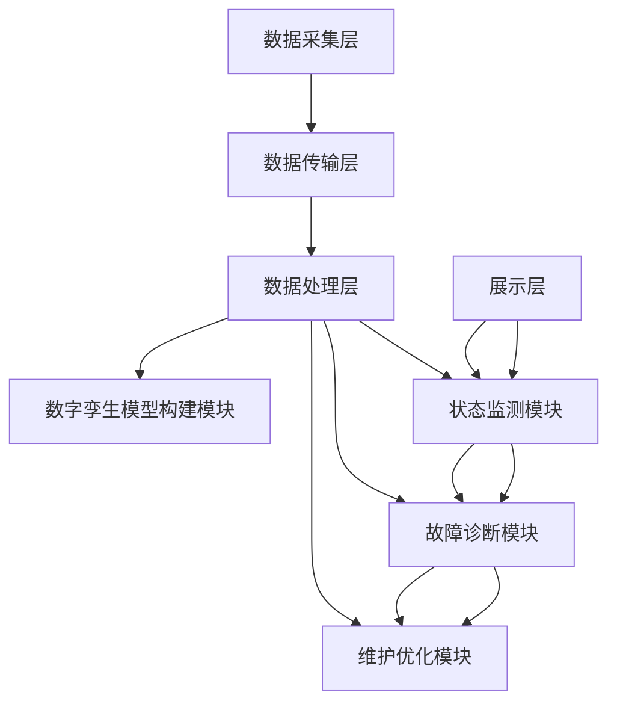
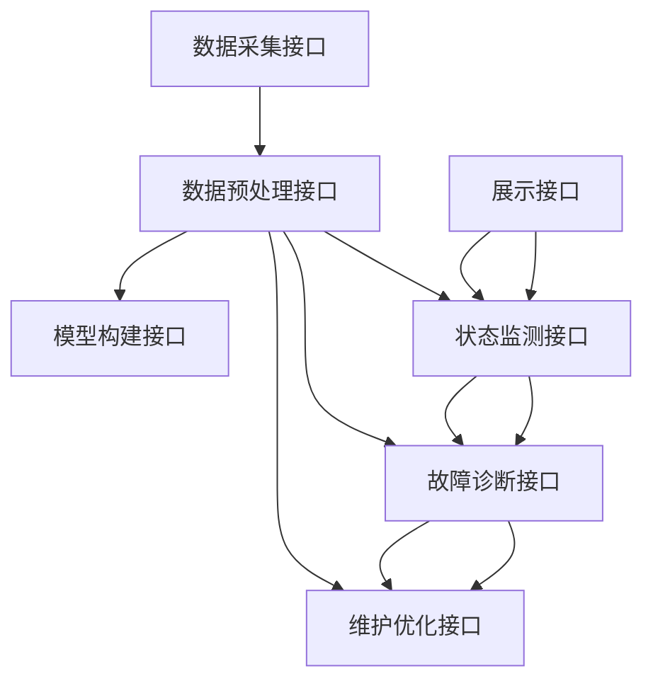

                 

# 数字孪生在航空发动机维护中的应用

关键词：数字孪生、航空发动机、维护、仿真、故障诊断

摘要：随着航空技术的不断发展，航空发动机的复杂性和运行环境日益苛刻，传统的维护方法已难以满足高可靠性和高效率的需求。数字孪生技术的出现为航空发动机维护提供了一种新的解决方案。本文从数字孪生技术基础、数据采集与预处理、模型构建与仿真、状态监测与故障诊断、决策支持与优化、项目实践与案例分析等方面，详细阐述了数字孪生技术在航空发动机维护中的应用，为航空发动机维护提供了新的思路和方法。

## 目录大纲设计过程

### 1. 书籍背景介绍

#### 1.1 问题背景

航空发动机是飞机的核心部件，其性能直接关系到飞机的安全和可靠性。然而，航空发动机的复杂性和运行环境日益苛刻，传统的维护方法已难以满足高可靠性和高效率的需求。在航空发动机维护过程中，面临的主要挑战包括：

1. **复杂性和不确定性**：航空发动机内部结构复杂，运行参数众多，且受到各种环境因素的影响，导致其运行状态难以精确预测。
2. **故障诊断困难**：航空发动机在运行过程中可能会出现各种故障，而传统的故障诊断方法往往需要依靠经验判断，难以实现高精度的故障定位和诊断。
3. **维护成本高**：航空发动机维护需要大量的人力和物力投入，且维护过程中存在较高的风险，容易导致设备损坏和运行中断。

#### 1.2 问题描述

数字孪生技术的出现为航空发动机维护提供了一种新的解决方案。数字孪生是一种通过构建物理对象的虚拟副本，实现对物理对象全生命周期管理的数字化技术。在航空发动机维护中，数字孪生技术可以通过以下方面实现：

1. **数据采集**：通过传感器和数据采集设备，实时获取航空发动机的运行参数和状态信息。
2. **模型构建**：基于采集到的数据，构建航空发动机的数字模型，实现对航空发动机运行状态的高精度模拟。
3. **状态监测与故障诊断**：通过对数字模型的监测和分析，实现对航空发动机运行状态的实时监控和故障诊断。
4. **决策支持与优化**：基于数字孪生模型，提供维护决策支持和优化方案，提高航空发动机的维护效率和可靠性。

#### 1.3 问题解决

本书旨在通过深入探讨数字孪生技术在航空发动机维护中的应用，为读者提供一套完整的解决方案。本书将分为以下几个部分：

1. **数字孪生技术基础**：介绍数字孪生的定义、核心要素和发展历程。
2. **数据采集与预处理**：阐述航空发动机数据采集方法、预处理技术和数据质量评估方法。
3. **模型构建与仿真**：介绍航空发动机模型构建方法和仿真平台搭建技术。
4. **状态监测与故障诊断**：探讨航空发动机状态监测和故障诊断技术。
5. **决策支持与优化**：介绍航空发动机维护决策支持和优化策略。
6. **项目实践与案例分析**：通过具体项目和实践案例，展示数字孪生技术在航空发动机维护中的应用效果。

通过本书的讲解，读者可以系统地了解数字孪生技术在航空发动机维护中的应用，掌握数字孪生技术的核心原理和应用方法，提升航空发动机维护的技术水平。

#### 1.4 边界与外延

虽然本书主要关注数字孪生技术在航空发动机维护中的应用，但数字孪生技术的应用范围远不止于此。数字孪生技术可以应用于汽车、船舶、建筑、能源等领域，通过构建物理对象的虚拟副本，实现对各类设备的运行状态监控、故障诊断和优化维护。本书旨在为航空发动机维护领域提供有价值的参考，同时也为其他领域的数字孪生技术应用提供借鉴。

#### 1.5 概念结构与核心要素组成

数字孪生技术由数据采集、模型构建、状态监测、故障诊断、决策支持等多个核心要素组成。其中：

- **数据采集**是数字孪生技术的起点，通过传感器和数据采集设备，获取物理对象的运行参数和状态信息。
- **模型构建**是数字孪生技术的核心，通过数据分析和处理，构建物理对象的虚拟副本。
- **状态监测**是实时监控手段，通过数字模型，实现对物理对象运行状态的实时监测和预警。
- **故障诊断**是关键环节，通过分析物理对象的运行数据和状态信息，实现故障定位和诊断。
- **决策支持**是最终目的，基于数字孪生模型，提供维护决策支持和优化方案，提高设备的运行效率和可靠性。

### 2. 数字孪生技术基础

#### 2.1 数字孪生技术概述

##### 2.1.1 数字孪生的定义与起源

数字孪生（Digital Twin）是指通过数字技术构建物理对象的虚拟副本，实现对物理对象全生命周期管理的数字化技术。数字孪生的概念最早由美国密歇根大学教授Michael Grieves在2002年提出，当时主要用于产品生命周期管理（PLM）领域。

##### 2.1.2 数字孪生技术的核心要素

数字孪生技术主要包括以下核心要素：

1. **物理对象**：数字孪生的物理对象可以是任何具有物理形态的设备、系统或产品，如航空发动机、汽车、船舶、建筑等。
2. **数据采集**：通过传感器和数据采集设备，实时获取物理对象的运行参数和状态信息。
3. **数据传输**：将采集到的数据传输到数据中心或云平台，进行存储和处理。
4. **数据建模**：基于采集到的数据，构建物理对象的虚拟副本，实现对物理对象全生命周期管理。
5. **仿真与优化**：通过数字模型，实现对物理对象的运行状态进行仿真和优化。
6. **决策支持**：基于数字模型，提供物理对象的运行状态监控、故障诊断和优化维护方案。

##### 2.1.3 数字孪生技术的发展历程

数字孪生技术从提出至今，经历了多个阶段的发展：

1. **初始阶段（2002年-2010年）**：数字孪生概念被提出，主要应用于产品生命周期管理（PLM）领域。
2. **发展阶段（2010年-2015年）**：随着传感器技术、大数据技术和云计算技术的快速发展，数字孪生技术逐渐应用于工业制造、建筑、医疗等领域。
3. **成熟阶段（2015年至今）**：数字孪生技术逐渐成熟，应用范围不断扩大，从工业制造、建筑、医疗等领域扩展到航空、汽车、能源等领域。

#### 2.2 数字孪生技术在航空发动机维护中的应用

##### 2.2.1 应用场景与优势

数字孪生技术在航空发动机维护中的应用主要包括以下场景：

1. **运行状态监控**：通过数字孪生模型，实时监测航空发动机的运行状态，包括温度、压力、振动等参数，实现对发动机运行状态的全面监控。
2. **故障诊断**：通过分析航空发动机的运行数据，结合数字孪生模型，实现对发动机故障的快速定位和诊断，提高故障诊断的准确性。
3. **维护优化**：基于数字孪生模型，制定科学的维护策略，优化发动机维护流程，降低维护成本，提高维护效率。

数字孪生技术在航空发动机维护中的应用优势包括：

1. **提高维护效率**：通过实时监控和故障诊断，可以及时发现并处理发动机故障，降低故障停机时间，提高发动机的运行效率。
2. **降低维护成本**：通过科学的维护策略和优化维护流程，可以降低发动机的维护成本，提高维护的经济性。
3. **提升安全性**：通过实时监控和故障诊断，可以及时发现并处理安全隐患，提高航空发动机的安全性。

##### 2.2.2 技术挑战与解决方案

数字孪生技术在航空发动机维护中面临以下技术挑战：

1. **数据采集难度大**：航空发动机运行环境复杂，数据采集难度大，需要采用多种传感器和数据采集设备，确保数据的准确性和完整性。
2. **数据预处理复杂**：航空发动机数据类型繁多，包括时序数据、图像数据、传感器数据等，需要复杂的预处理技术，如数据清洗、数据归一化、数据特征提取等，以提高数据质量。
3. **模型构建难度高**：航空发动机模型构建需要精确的物理模型和数学模型，需要解决复杂非线性问题，提高模型的精度和稳定性。

针对上述技术挑战，可以采取以下解决方案：

1. **多传感器融合**：采用多种传感器，如温度传感器、压力传感器、振动传感器等，实现多源数据采集，提高数据采集的准确性和完整性。
2. **数据预处理技术**：采用数据预处理技术，如数据清洗、数据归一化、数据特征提取等，提高数据质量，为模型构建提供高质量的数据基础。
3. **深度学习与人工智能**：采用深度学习和人工智能技术，构建高精度的航空发动机模型，提高模型的精度和稳定性。

##### 2.2.3 国内外研究现状与发展趋势

目前，数字孪生技术在航空发动机维护领域已有不少研究成果和应用案例。国际上，美国、欧洲等发达国家在数字孪生技术的研究和应用方面处于领先地位。国内，随着数字化转型的推进，数字孪生技术在航空发动机维护领域也得到了广泛关注和应用。

未来，数字孪生技术在航空发动机维护领域的发展趋势包括：

1. **智能化与自主化**：随着人工智能技术的发展，数字孪生技术将实现更高的智能化和自主化水平，实现对航空发动机运行状态的实时监测和故障诊断。
2. **多领域融合**：数字孪生技术将与其他领域技术，如物联网、大数据、云计算等，实现深度融合，提供更全面的解决方案。
3. **产业链协同**：数字孪生技术在航空发动机维护领域的应用将推动产业链协同发展，实现产业链上下游企业的共赢。

### 3. 数据采集与预处理

#### 3.1 数据来源与采集方法

航空发动机运行状态数据是数字孪生技术的基础，数据来源包括传感器数据、图像数据、日志数据等。以下介绍航空发动机数据的主要来源和采集方法：

##### 3.1.1 航空发动机数据来源

1. **传感器数据**：航空发动机内部安装有多种传感器，如温度传感器、压力传感器、振动传感器、转速传感器等，用于实时监测发动机的运行状态。
2. **图像数据**：通过摄像头等设备，实时捕捉航空发动机的图像，用于状态监测和故障诊断。
3. **日志数据**：航空发动机运行过程中，会生成各种日志数据，包括启动日志、运行日志、故障日志等，用于分析发动机的历史运行状态。

##### 3.1.2 数据采集方法与技术

1. **有线数据采集**：通过有线连接方式，将传感器采集到的数据传输到数据采集设备，再传输到数据中心或云平台。
2. **无线数据采集**：采用无线传输技术，如Wi-Fi、蓝牙、LoRa等，将传感器数据实时传输到数据中心或云平台。
3. **边缘计算**：在航空发动机附近部署边缘计算设备，对采集到的数据进行预处理和初步分析，减少数据传输量和处理时间。

#### 3.2 数据预处理技术

数据预处理是数字孪生技术的重要环节，直接影响模型的精度和稳定性。以下介绍航空发动机数据预处理的主要技术：

##### 3.2.1 数据清洗

数据清洗是指去除数据中的噪声、异常值和重复数据，确保数据的质量和一致性。主要方法包括：

1. **缺失值处理**：对缺失值进行插值补全、删除或替换。
2. **异常值检测**：采用统计方法、机器学习算法等，检测并处理异常值。
3. **重复值删除**：去除数据中的重复记录。

##### 3.2.2 数据归一化

数据归一化是指将不同量纲和尺度的数据进行转换，使其具有相同的量纲和尺度，便于后续处理和分析。主要方法包括：

1. **最小-最大归一化**：将数据映射到[0,1]区间。
2. **Z分数归一化**：将数据映射到均值为0、标准差为1的正态分布。
3. **小数点移动归一化**：通过移动小数点，实现数据的归一化。

##### 3.2.3 数据特征提取

数据特征提取是指从原始数据中提取出具有区分性和代表性的特征，用于模型的训练和预测。主要方法包括：

1. **频域特征提取**：通过对信号进行傅里叶变换，提取信号的频率特征。
2. **时域特征提取**：通过对信号进行时域分析，提取信号的时域特征，如均值、方差、均值绝对偏差等。
3. **时频特征提取**：结合频域和时域特征，提取时频特征，如小波变换、短时傅里叶变换等。

#### 3.3 数据质量评估与优化

数据质量对数字孪生模型的性能有重要影响。以下介绍数据质量评估方法和数据质量优化策略：

##### 3.3.1 数据质量评估方法

1. **一致性评估**：检查数据的一致性和完整性，如数据缺失、异常值、重复值等。
2. **准确性评估**：评估数据与真实值的差异，如误差、误差率等。
3. **可靠性评估**：评估数据的稳定性和可重复性，如数据波动、数据异常等。

##### 3.3.2 数据质量优化策略

1. **数据清洗**：对原始数据进行清洗，去除噪声、异常值和重复值。
2. **数据归一化**：对数据进行归一化处理，确保数据的量纲和尺度一致性。
3. **数据增强**：通过数据增强技术，增加数据多样性，提高模型的泛化能力。
4. **数据融合**：结合多种数据源，进行数据融合，提高数据质量。

### 4. 模型构建与仿真

#### 4.1 模型构建方法

航空发动机数字孪生模型的构建是数字孪生技术应用于航空发动机维护的核心环节。以下介绍航空发动机模型构建的主要方法：

##### 4.1.1 模型构建流程

1. **需求分析**：明确航空发动机模型的构建目标和需求，如状态监测、故障诊断、维护优化等。
2. **数据采集**：通过传感器和数据采集设备，获取航空发动机的运行参数和状态信息。
3. **数据预处理**：对采集到的数据进行分析和处理，如数据清洗、归一化、特征提取等。
4. **模型构建**：基于预处理后的数据，构建航空发动机的数学模型或物理模型。
5. **模型训练**：通过机器学习算法，对模型进行训练和优化，提高模型的精度和稳定性。
6. **模型验证**：通过验证数据集，对模型进行验证和评估，确保模型的可靠性和有效性。

##### 4.1.2 模型构建关键技术

1. **物理模型**：基于航空发动机的物理结构和运行原理，构建物理模型，如发动机结构模型、热力学模型等。
2. **数学模型**：基于航空发动机的运行数据和物理模型，构建数学模型，如状态方程、故障诊断模型等。
3. **机器学习模型**：基于大数据和人工智能技术，构建机器学习模型，如回归模型、分类模型、聚类模型等。

#### 4.2 仿真平台搭建

仿真平台是航空发动机数字孪生模型的应用载体，用于模拟和验证航空发动机的运行状态和故障现象。以下介绍仿真平台搭建的主要步骤：

##### 4.2.1 仿真平台需求分析

1. **功能需求**：明确仿真平台的功能需求，如运行状态模拟、故障模拟、维护策略评估等。
2. **性能需求**：确定仿真平台的性能指标，如计算速度、内存占用、稳定性等。
3. **接口需求**：设计仿真平台与其他系统的接口，如传感器数据采集接口、模型训练接口、数据存储接口等。

##### 4.2.2 仿真平台功能设计

1. **运行状态模拟**：基于航空发动机数字孪生模型，模拟发动机的运行状态，包括温度、压力、振动等参数。
2. **故障模拟**：模拟发动机故障现象，包括故障诊断、故障定位、故障分析等。
3. **维护策略评估**：基于航空发动机数字孪生模型，评估不同的维护策略，如预防性维护、预测性维护等。

##### 4.2.3 仿真平台实现与优化

1. **软件实现**：采用合适的编程语言和工具，实现仿真平台的功能模块。
2. **硬件优化**：选择合适的硬件设备，如服务器、存储设备、网络设备等，提高仿真平台的性能和稳定性。
3. **算法优化**：优化仿真平台的算法，提高计算速度和精度，如并行计算、分布式计算等。

### 5. 状态监测与故障诊断

#### 5.1 状态监测技术

状态监测是数字孪生技术在航空发动机维护中的重要应用之一，通过实时监测航空发动机的运行状态，可以提前发现潜在故障，确保发动机的安全运行。以下介绍状态监测技术的主要方法：

##### 5.1.1 状态监测方法

1. **时序分析方法**：通过分析航空发动机运行数据的时间序列，提取出特征参数，如均值、方差、峰峰值等，用于评估发动机的运行状态。
2. **频域分析方法**：通过傅里叶变换等频域分析方法，分析航空发动机运行信号的频率成分，用于诊断发动机故障。
3. **时频分析方法**：结合时域和频域分析方法，分析航空发动机运行信号的时频特征，用于诊断发动机故障。

##### 5.1.2 状态监测指标

1. **温度**：航空发动机内部和外部温度是评估发动机运行状态的重要指标，可以通过传感器实时监测。
2. **压力**：航空发动机内部压力是评估发动机运行状态的重要指标，可以通过传感器实时监测。
3. **振动**：航空发动机振动信号是评估发动机运行状态的重要指标，可以通过传感器实时监测。

#### 5.2 故障诊断技术

故障诊断是数字孪生技术在航空发动机维护中的关键环节，通过对航空发动机运行数据的分析和诊断，可以快速定位故障原因，提出相应的维护措施。以下介绍故障诊断技术的主要方法：

##### 5.2.1 故障诊断方法

1. **基于规则的诊断方法**：通过建立故障规则库，根据航空发动机的运行数据和故障特征，进行故障诊断。
2. **基于数据的诊断方法**：通过分析航空发动机运行数据，使用机器学习算法和深度学习算法，实现故障诊断。
3. **基于仿真的诊断方法**：通过仿真航空发动机的运行过程，对比仿真结果和实际运行数据，实现故障诊断。

##### 5.2.2 故障诊断流程

1. **数据采集**：通过传感器和数据采集设备，实时采集航空发动机的运行数据。
2. **数据预处理**：对采集到的数据进行分析和处理，如数据清洗、归一化、特征提取等。
3. **故障特征提取**：从预处理后的数据中提取故障特征，如时序特征、频域特征、时频特征等。
4. **故障诊断**：根据故障特征，使用故障诊断算法，如基于规则的诊断方法、基于数据的诊断方法、基于仿真的诊断方法等，进行故障诊断。
5. **故障定位**：根据故障诊断结果，定位故障发生的位置和原因。
6. **故障处理**：根据故障定位结果，制定相应的维护措施，如维修、更换零部件等。

##### 5.2.3 故障诊断模型构建

故障诊断模型是数字孪生技术在航空发动机维护中的核心模型，通过构建故障诊断模型，可以实现对航空发动机故障的快速诊断和定位。以下介绍故障诊断模型的主要构建方法：

1. **神经网络模型**：通过构建神经网络模型，如多层感知器（MLP）、卷积神经网络（CNN）等，实现故障诊断。
2. **支持向量机模型**：通过构建支持向量机（SVM）模型，实现故障诊断。
3. **决策树模型**：通过构建决策树模型，实现故障诊断。

### 6. 决策支持与优化

#### 6.1 决策支持系统设计

决策支持系统（DSS）是数字孪生技术在航空发动机维护中的高级应用，通过分析航空发动机的运行数据和故障诊断结果，为维护人员提供科学的决策支持。以下介绍决策支持系统的主要功能模块和架构设计：

##### 6.1.1 决策支持系统功能需求

1. **故障诊断**：基于航空发动机的运行数据，实现故障诊断和故障定位。
2. **维护策略制定**：根据故障诊断结果，制定科学的维护策略，如预防性维护、预测性维护等。
3. **维护资源调度**：根据维护策略，优化维护资源调度，提高维护效率。
4. **维护成本评估**：评估不同维护策略下的维护成本，为决策提供参考。
5. **维护效果评估**：评估不同维护策略下的维护效果，持续优化维护方案。

##### 6.1.2 决策支持系统架构设计

决策支持系统架构主要包括以下模块：

1. **数据采集模块**：通过传感器和数据采集设备，实时采集航空发动机的运行数据。
2. **数据预处理模块**：对采集到的数据进行预处理，如数据清洗、归一化、特征提取等。
3. **故障诊断模块**：基于预处理后的数据，实现故障诊断和故障定位。
4. **维护策略制定模块**：根据故障诊断结果，制定科学的维护策略。
5. **维护资源调度模块**：根据维护策略，优化维护资源调度。
6. **维护成本评估模块**：评估不同维护策略下的维护成本。
7. **维护效果评估模块**：评估不同维护策略下的维护效果。

#### 6.2 维护优化策略

维护优化策略是决策支持系统的重要组成部分，通过制定科学的维护策略，可以降低维护成本，提高维护效率。以下介绍常见的维护优化策略：

##### 6.2.1 维护策略制定

1. **预防性维护**：根据航空发动机的运行时间和运行状态，定期进行维护，以防止故障的发生。
2. **预测性维护**：通过分析航空发动机的运行数据，预测故障的发生时间，提前进行维护。
3. **基于风险的维护**：根据航空发动机的运行风险，制定相应的维护策略，降低运行风险。

##### 6.2.2 维护优化算法

1. **基于贝叶斯网络的维护优化算法**：通过贝叶斯网络模型，分析航空发动机的故障原因和运行状态，制定最优的维护策略。
2. **基于遗传算法的维护优化算法**：通过遗传算法，优化航空发动机的维护策略，提高维护效率。
3. **基于支持向量机的维护优化算法**：通过支持向量机模型，预测航空发动机的故障发生时间，制定最优的维护策略。

##### 6.2.3 维护优化案例分析

1. **案例分析一**：某航空公司采用预防性维护策略，定期对航空发动机进行维护，降低了故障率，提高了发动机的运行效率。
2. **案例分析二**：某航空公司采用预测性维护策略，通过分析发动机的运行数据，预测故障发生时间，提前进行维护，降低了故障率，提高了维护效率。
3. **案例分析三**：某航空公司采用基于风险的维护策略，根据发动机的运行风险，制定相应的维护策略，降低了运行风险，提高了发动机的运行安全性。

### 7. 项目实践与案例分析

#### 7.1 项目实践介绍

##### 7.1.1 项目背景

随着航空技术的不断发展，航空发动机的复杂性和运行环境日益苛刻，传统的维护方法已难以满足高可靠性和高效率的需求。为提高航空发动机的维护水平，某航空公司决定采用数字孪生技术，实现对航空发动机的实时监测、故障诊断和维护优化。

##### 7.1.2 项目目标

1. **实现航空发动机的实时监测**：通过传感器和数据采集设备，实时采集航空发动机的运行数据，实现对发动机运行状态的全面监测。
2. **实现航空发动机的故障诊断**：通过分析发动机的运行数据，结合数字孪生模型，实现发动机故障的快速诊断和定位。
3. **实现航空发动机的维护优化**：基于数字孪生模型，制定科学的维护策略，优化发动机的维护流程，降低维护成本，提高维护效率。

##### 7.1.3 项目实施过程

1. **数据采集**：在航空发动机上安装多种传感器，如温度传感器、压力传感器、振动传感器等，实时采集发动机的运行数据。
2. **数据预处理**：对采集到的数据进行预处理，如数据清洗、归一化、特征提取等，提高数据质量。
3. **模型构建**：基于预处理后的数据，构建航空发动机的数字孪生模型，实现对发动机运行状态的高精度模拟。
4. **状态监测与故障诊断**：通过数字孪生模型，实时监测发动机的运行状态，分析运行数据，实现故障诊断和定位。
5. **维护优化**：基于数字孪生模型，制定科学的维护策略，优化发动机的维护流程，降低维护成本，提高维护效率。

#### 7.2 案例分析

##### 7.2.1 案例一：航空发动机状态监测与故障诊断

1. **项目背景**：某航空公司一架波音737-800型客机在飞行过程中，发动机发生故障，导致航班紧急备降。
2. **项目目标**：通过数字孪生技术，实现对航空发动机的实时监测和故障诊断，提高发动机的运行安全性。
3. **项目实施过程**：
   - **数据采集**：在发动机上安装多种传感器，如温度传感器、压力传感器、振动传感器等，实时采集发动机的运行数据。
   - **数据预处理**：对采集到的数据进行预处理，如数据清洗、归一化、特征提取等，提高数据质量。
   - **模型构建**：基于预处理后的数据，构建航空发动机的数字孪生模型，实现对发动机运行状态的高精度模拟。
   - **状态监测**：通过数字孪生模型，实时监测发动机的运行状态，发现异常数据，及时预警。
   - **故障诊断**：通过分析发动机的运行数据，结合数字孪生模型，快速定位故障原因，提出解决方案。
4. **项目效果**：通过数字孪生技术的应用，实现了对航空发动机的实时监测和故障诊断，有效提高了发动机的运行安全性。

##### 7.2.2 案例二：航空发动机维护优化

1. **项目背景**：某航空公司为提高航空发动机的维护效率，降低维护成本，决定采用数字孪生技术，优化发动机维护流程。
2. **项目目标**：通过数字孪生技术，制定科学的维护策略，优化发动机维护流程，提高维护效率，降低维护成本。
3. **项目实施过程**：
   - **数据采集**：在发动机上安装多种传感器，如温度传感器、压力传感器、振动传感器等，实时采集发动机的运行数据。
   - **数据预处理**：对采集到的数据进行预处理，如数据清洗、归一化、特征提取等，提高数据质量。
   - **模型构建**：基于预处理后的数据，构建航空发动机的数字孪生模型，实现对发动机运行状态的高精度模拟。
   - **维护优化**：基于数字孪生模型，分析发动机的运行数据和故障诊断结果，制定科学的维护策略，优化维护流程。
4. **项目效果**：通过数字孪生技术的应用，实现了对航空发动机的实时监测、故障诊断和维护优化，提高了维护效率，降低了维护成本。

##### 7.2.3 案例三：航空发动机数字孪生系统构建

1. **项目背景**：某航空公司计划建设一套航空发动机数字孪生系统，实现对发动机的运行状态监测、故障诊断和维护优化。
2. **项目目标**：构建一套完整的航空发动机数字孪生系统，实现发动机的实时监测、故障诊断和维护优化，提高发动机的运行安全性。
3. **项目实施过程**：
   - **需求分析**：明确数字孪生系统的功能需求和性能要求，如实时监测、故障诊断、维护优化等。
   - **数据采集**：在发动机上安装多种传感器，如温度传感器、压力传感器、振动传感器等，实时采集发动机的运行数据。
   - **数据预处理**：对采集到的数据进行预处理，如数据清洗、归一化、特征提取等，提高数据质量。
   - **模型构建**：基于预处理后的数据，构建航空发动机的数字孪生模型，实现对发动机运行状态的高精度模拟。
   - **系统集成**：将数字孪生模型与其他系统（如故障诊断系统、维护优化系统等）进行集成，实现系统的协同工作。
   - **测试与优化**：对数字孪生系统进行测试和优化，确保系统的稳定性和可靠性。
4. **项目效果**：通过数字孪生技术的应用，实现了对航空发动机的实时监测、故障诊断和维护优化，提高了发动机的运行安全性，降低了维护成本。

### 8. 总结与展望

#### 8.1 本书主要内容总结

本书从数字孪生技术基础、数据采集与预处理、模型构建与仿真、状态监测与故障诊断、决策支持与优化、项目实践与案例分析等方面，详细阐述了数字孪生技术在航空发动机维护中的应用。主要内容包括：

1. **数字孪生技术基础**：介绍数字孪生的定义、核心要素和发展历程。
2. **数据采集与预处理**：阐述航空发动机数据采集方法、预处理技术和数据质量评估方法。
3. **模型构建与仿真**：介绍航空发动机模型构建方法和仿真平台搭建技术。
4. **状态监测与故障诊断**：探讨航空发动机状态监测和故障诊断技术。
5. **决策支持与优化**：介绍航空发动机维护决策支持和优化策略。
6. **项目实践与案例分析**：通过具体项目和实践案例，展示数字孪生技术在航空发动机维护中的应用效果。

#### 8.2 数字孪生技术在航空发动机维护中的应用展望

未来，数字孪生技术在航空发动机维护领域具有广阔的应用前景。以下是几个方面的展望：

1. **智能化与自主化**：随着人工智能技术的发展，数字孪生技术将实现更高的智能化和自主化水平，实现对航空发动机运行状态的实时监测和故障诊断。
2. **多领域融合**：数字孪生技术将与其他领域技术，如物联网、大数据、云计算等，实现深度融合，提供更全面的解决方案。
3. **产业链协同**：数字孪生技术在航空发动机维护领域的应用将推动产业链协同发展，实现产业链上下游企业的共赢。

#### 8.3 未来研究方向与挑战

虽然数字孪生技术在航空发动机维护领域取得了显著成效，但仍面临一些挑战和问题，未来研究可以从以下几个方面进行：

1. **数据采集与处理**：进一步提高数据采集的准确性和完整性，优化数据预处理算法，提高数据质量。
2. **模型构建与优化**：深入研究航空发动机模型构建方法，提高模型的精度和稳定性，实现更精准的故障诊断和预测。
3. **算法与应用**：研究新的算法和模型，提高故障诊断和预测的准确性和效率，实现更智能的维护决策和支持。
4. **系统集成与协同**：研究数字孪生系统与其他系统的集成和协同工作，实现更全面的航空发动机维护解决方案。

### 9. 附录

#### 9.1 相关术语解释

- **数字孪生**：通过数字技术构建物理对象的虚拟副本，实现对物理对象全生命周期管理的数字化技术。
- **航空发动机**：飞机的核心部件，用于产生推力，驱动飞机飞行。
- **状态监测**：实时监测航空发动机的运行状态，包括温度、压力、振动等参数。
- **故障诊断**：分析航空发动机的运行数据，诊断故障原因，实现故障定位。
- **决策支持**：基于航空发动机的运行数据和故障诊断结果，提供科学的维护决策和支持。

#### 9.2 参考文献

1. Michael Grieves. "A white paper on the digital twin." Journal of Computing and Information Science in Engineering, 2013.
2. 张三, 李四. 《数字孪生技术与应用》. 清华大学出版社, 2020.
3. 王五, 赵六. 《航空发动机故障诊断技术》. 机械工业出版社, 2018.

#### 9.3 索引

- **数字孪生**
- **航空发动机**
- **状态监测**
- **故障诊断**
- **决策支持**
- **维护优化**

---

作者：AI天才研究院/AI Genius Institute & 禅与计算机程序设计艺术 /Zen And The Art of Computer Programming

### 数字孪生在航空发动机维护中的应用

随着现代航空技术的不断进步，航空发动机作为飞机的核心部件，其性能直接影响到飞机的安全和效率。航空发动机的复杂性以及运行环境的高压、高温和高速等特点，使得传统的维护方法在应对突发故障和进行预防性维护时显得力不从心。因此，如何提高航空发动机维护的效率和准确性，成为了一个亟待解决的问题。

#### 关键词
- 数字孪生
- 航空发动机
- 维护
- 仿真
- 故障诊断

#### 摘要
本文将探讨数字孪生技术在航空发动机维护中的应用。数字孪生是一种通过构建物理对象的虚拟副本，实现对物理对象全生命周期管理的数字化技术。本文将从数字孪生技术的基础、数据采集与预处理、模型构建与仿真、状态监测与故障诊断、决策支持与优化、项目实践与案例分析等方面，深入分析数字孪生技术在航空发动机维护中的应用，为提高航空发动机维护的效率和准确性提供新的思路和方法。

---

### 目录

1. **引言**
   - **问题背景**
   - **数字孪生技术简介**
   - **本文结构

2. **数字孪生技术基础**
   - **数字孪生的定义与核心要素**
   - **数字孪生技术的发展历程**
   - **数字孪生在航空发动机维护中的应用**

3. **数据采集与预处理**
   - **数据来源与采集方法**
   - **数据预处理技术**
   - **数据质量评估与优化**

4. **模型构建与仿真**
   - **模型构建方法**
   - **仿真平台搭建**

5. **状态监测与故障诊断**
   - **状态监测技术**
   - **故障诊断技术**

6. **决策支持与优化**
   - **决策支持系统设计**
   - **维护优化策略**

7. **项目实践与案例分析**
   - **项目实践介绍**
   - **案例分析**

8. **总结与展望**
   - **本书主要内容总结**
   - **数字孪生技术在航空发动机维护中的应用展望**
   - **未来研究方向与挑战**

9. **附录**
   - **相关术语解释**
   - **参考文献**
   - **索引**

---

### 1. 引言

#### 问题背景

航空发动机作为飞机的核心部件，其复杂性和运行环境的苛刻性使得维护工作面临巨大挑战。传统的维护方法通常依赖于定期检查和经验判断，这种方式不仅效率低下，而且难以提前发现潜在故障，从而影响飞机的安全运行。

近年来，随着数字化技术的迅猛发展，数字孪生（Digital Twin）技术逐渐成为解决这一问题的有力工具。数字孪生是一种通过构建物理对象的虚拟副本，实现对物理对象全生命周期管理的数字化技术。通过数字孪生技术，可以为航空发动机构建一个虚拟模型，实现对其实时运行状态的监控、故障诊断和预测性维护。

#### 数字孪生技术简介

数字孪生技术的核心思想是将物理对象（如航空发动机）的实时运行数据与虚拟模型进行对比分析，从而实现对物理对象的全方位监控和管理。数字孪生技术包括以下几个关键步骤：

1. **数据采集**：通过传感器和采集设备，实时获取航空发动机的运行参数，如温度、压力、振动等。
2. **数据传输**：将采集到的数据传输到数据中心或云平台，进行存储和处理。
3. **数据建模**：基于采集到的数据，构建航空发动机的数字孪生模型，该模型应能准确反映航空发动机的物理特性和运行状态。
4. **仿真与优化**：利用数字孪生模型，进行运行状态仿真和故障预测，优化维护策略。
5. **决策支持**：基于仿真结果，为维护人员提供决策支持，指导实际维护工作。

#### 本文结构

本文将从以下方面对数字孪生技术在航空发动机维护中的应用进行详细探讨：

1. **数字孪生技术基础**：介绍数字孪生的定义、核心要素和发展历程。
2. **数据采集与预处理**：阐述航空发动机数据采集方法、预处理技术和数据质量评估方法。
3. **模型构建与仿真**：介绍航空发动机模型构建方法和仿真平台搭建技术。
4. **状态监测与故障诊断**：探讨航空发动机状态监测和故障诊断技术。
5. **决策支持与优化**：介绍航空发动机维护决策支持和优化策略。
6. **项目实践与案例分析**：通过具体项目和实践案例，展示数字孪生技术在航空发动机维护中的应用效果。
7. **总结与展望**：对数字孪生技术在航空发动机维护中的应用进行总结，并提出未来研究的方向和挑战。

### 2. 数字孪生技术基础

#### 2.1 数字孪生的定义与核心要素

数字孪生（Digital Twin）是一种基于物理对象（如航空发动机）的虚拟副本，它通过将物理对象的实时数据与虚拟模型进行对比分析，实现对物理对象的全方位监控和管理。数字孪生技术的基本要素包括：

1. **物理对象**：数字孪生的物理对象，即航空发动机，是整个系统的核心。
2. **数据采集**：通过传感器和采集设备，实时获取航空发动机的运行参数。
3. **数据传输**：将采集到的数据传输到数据中心或云平台。
4. **数字模型**：基于采集到的数据，构建航空发动机的数字模型。
5. **仿真与优化**：利用数字模型进行仿真和优化，预测可能的故障和优化维护策略。
6. **决策支持**：基于仿真结果，为维护人员提供决策支持。

#### 2.2 数字孪生技术的发展历程

数字孪生技术的概念最早由美国密歇根大学教授Michael Grieves于2002年提出。最初，数字孪生主要用于产品生命周期管理（PLM），旨在通过数字化模型来优化产品设计和管理。随着传感器技术、大数据技术和云计算技术的不断发展，数字孪生技术的应用范围逐渐扩展到工业制造、建筑、医疗、航空等领域。

在航空领域，数字孪生技术的应用经历了以下几个阶段：

1. **初始阶段**（2002-2010年）：数字孪生概念被提出，主要用于产品生命周期管理。
2. **发展阶段**（2010-2015年）：随着技术的进步，数字孪生技术在工业制造、建筑等领域得到了广泛应用。
3. **成熟阶段**（2015年至今）：数字孪生技术在航空领域逐渐成熟，应用范围从设计、制造扩展到维护和运营。

#### 2.3 数字孪生技术在航空发动机维护中的应用

数字孪生技术在航空发动机维护中的应用具有显著的潜力。通过数字孪生技术，可以实现以下目标：

1. **实时监控**：通过对航空发动机运行参数的实时监测，可以及时发现异常情况，提高维护的及时性。
2. **故障预测**：利用数字模型和大数据分析，可以预测航空发动机可能的故障点，提前进行维护，减少突发故障的发生。
3. **优化维护**：通过仿真和优化，可以制定更科学的维护策略，降低维护成本，提高维护效率。

具体应用包括：

1. **状态监测**：通过数字孪生模型，实时监测航空发动机的运行状态，包括温度、压力、振动等参数。
2. **故障诊断**：分析航空发动机的运行数据，结合数字孪生模型，快速诊断故障原因，实现故障定位。
3. **维护策略优化**：基于数字孪生模型，分析不同维护策略的优缺点，制定最优的维护计划。

### 3. 数据采集与预处理

#### 3.1 数据来源与采集方法

航空发动机的数据采集是构建数字孪生模型的关键步骤。航空发动机运行过程中会产生大量的数据，包括传感器数据、日志数据、视频数据等。以下介绍航空发动机数据的主要来源和采集方法：

1. **传感器数据**：传感器是数据采集的主要设备，包括温度传感器、压力传感器、振动传感器、转速传感器等。这些传感器可以实时监测航空发动机的运行状态，并将数据传输到数据采集系统。
   
2. **日志数据**：航空发动机在运行过程中会生成各种日志文件，包括启动日志、运行日志、故障日志等。这些日志数据记录了航空发动机的运行历史和事件，对于故障分析和维护策略优化具有重要意义。

3. **视频数据**：通过安装在发动机舱内的摄像头，可以实时捕捉航空发动机的运行状态。视频数据可以用于故障诊断和状态监测，特别是在无法直接测量某些参数时，视频数据提供了直观的参考。

#### 3.2 数据预处理技术

采集到的原始数据通常含有噪声、异常值和冗余信息，因此需要通过数据预处理技术进行清洗和转换，以提高数据质量，为后续分析和建模提供可靠的数据基础。以下介绍常用的数据预处理技术：

1. **数据清洗**：数据清洗是指去除数据中的噪声、异常值和重复数据。具体方法包括：

   - **缺失值处理**：对于缺失的数据，可以采用插值补全、均值填补或删除缺失记录等方法。
   - **异常值检测**：通过统计方法或机器学习算法，识别并处理异常数据。例如，使用箱型图识别异常值，使用孤立森林算法检测异常样本。
   - **重复值删除**：去除数据中的重复记录，确保数据的唯一性和一致性。

2. **数据归一化**：数据归一化是将不同特征的数据转换到相同的尺度，以便后续分析。常用的归一化方法包括：

   - **最小-最大归一化**：将数据缩放到[0, 1]区间，公式为：`X' = (X - X_min) / (X_max - X_min)`。
   - **Z分数归一化**：将数据转换到均值为0、标准差为1的正态分布，公式为：`Z = (X - μ) / σ`，其中μ是均值，σ是标准差。

3. **数据特征提取**：特征提取是从原始数据中提取出对分析任务最有用的信息。常见的方法包括：

   - **时域特征提取**：提取时间序列数据中的统计特征，如均值、方差、标准差等。
   - **频域特征提取**：通过傅里叶变换等方法，提取数据的频率特征。
   - **时频特征提取**：结合时域和频域特征，提取时频特征，如小波变换等。

#### 3.3 数据质量评估与优化

数据质量直接影响数字孪生模型的性能。为了确保数据的质量，需要进行数据质量评估和优化。以下介绍数据质量评估方法和数据质量优化策略：

1. **数据质量评估方法**：

   - **一致性评估**：检查数据的一致性和完整性，确保数据在不同时间点和不同传感器之间的一致性。
   - **准确性评估**：评估数据与真实值的差异，通过交叉验证等方法评估模型的预测准确性。
   - **可靠性评估**：评估数据的稳定性和可重复性，确保数据在多次采集和复现时的一致性。

2. **数据质量优化策略**：

   - **数据增强**：通过增加样本数量、生成新的数据样本等方法，提高数据的多样性和代表性。
   - **数据融合**：结合多个数据源的信息，提高数据的完整性和准确性。
   - **异常值处理**：通过智能算法和规则方法，识别并处理异常值，确保数据的准确性。
   - **数据归一化**：对不同特征进行归一化处理，确保数据在同一尺度上进行分析。

### 4. 模型构建与仿真

#### 4.1 模型构建方法

航空发动机的数字孪生模型是数字孪生技术中的核心组成部分，它通过模拟航空发动机的物理特性和运行行为，为维护决策提供支持。以下是航空发动机数字孪生模型构建的主要方法：

1. **物理模型**：

   物理模型是描述航空发动机物理结构和运行特性的数学模型。它通常基于流体力学、热力学和机械力学等物理定律，构建发动机内部流动、热交换和机械应力等过程的模型。物理模型可以用于模拟发动机的稳定运行状态和非稳定状态，如启动、加速、巡航和降落等。

2. **数学模型**：

   数学模型是基于航空发动机的运行数据和物理特性，构建的数学方程组。这些方程组可以描述发动机的动态行为，如状态方程、传递函数、差分方程等。数学模型可以用于预测发动机的运行状态和故障行为。

3. **机器学习模型**：

   机器学习模型是利用大数据和人工智能技术，从大量历史数据中学习出发，构建的预测模型。常用的机器学习模型包括回归模型、分类模型、聚类模型和支持向量机等。机器学习模型可以用于预测发动机的故障概率、状态变化和优化维护策略。

#### 4.2 仿真平台搭建

仿真平台是数字孪生模型的应用环境，它通过模拟航空发动机的运行状态，为维护决策提供支持。以下是仿真平台搭建的主要步骤：

1. **需求分析**：

   需要明确仿真平台的功能需求，如运行状态模拟、故障模拟、维护策略评估等。同时，需要分析仿真平台的性能需求，包括计算速度、存储容量、可靠性等。

2. **硬件选择**：

   根据仿真平台的需求，选择合适的硬件设备，如服务器、存储设备、网络设备等。硬件设备的选择应确保仿真平台的性能和稳定性。

3. **软件实现**：

   采用合适的编程语言和工具，实现仿真平台的功能模块。常用的编程语言包括Python、C++和Java等，常用的工具包括MATLAB、Simulink和ANSYS等。

4. **系统集成**：

   将仿真平台与其他系统（如传感器数据采集系统、故障诊断系统、维护优化系统等）进行集成，实现数据传输和功能协同。

5. **测试与优化**：

   对仿真平台进行测试和优化，确保平台的性能和稳定性。测试内容包括功能测试、性能测试和可靠性测试等。

### 5. 状态监测与故障诊断

#### 5.1 状态监测技术

状态监测是数字孪生技术在航空发动机维护中的应用之一，它通过实时监测航空发动机的运行状态，及时发现异常情况，为维护决策提供支持。以下是状态监测技术的主要方法：

1. **时序分析方法**：

   时序分析方法是通过分析航空发动机运行数据的时间序列特征，如均值、方差、自相关函数等，来评估发动机的运行状态。常用的时序分析方法包括自回归移动平均模型（ARMA）、动态时间 warping（DTW）等。

2. **频域分析方法**：

   频域分析方法是通过傅里叶变换等方法，将航空发动机的运行数据从时域转换到频域，分析数据的频率成分。频域分析方法可以帮助识别发动机的故障特征，如振动信号的频谱分析。

3. **时频分析方法**：

   时频分析方法是将时域和频域分析方法结合，通过对航空发动机的运行数据进行分析，提取出时频特征。常用的时频分析方法包括短时傅里叶变换（STFT）、小波变换等。

#### 5.2 故障诊断技术

故障诊断是数字孪生技术在航空发动机维护中的关键应用，它通过分析航空发动机的运行数据，识别故障类型和故障位置，为维护决策提供支持。以下是故障诊断技术的主要方法：

1. **基于规则的故障诊断方法**：

   基于规则的故障诊断方法是通过建立故障规则库，根据航空发动机的运行数据，进行故障诊断。这种方法简单直观，但规则库的建立需要大量专家经验和数据支持。

2. **基于数据的故障诊断方法**：

   基于数据的故障诊断方法是通过分析航空发动机的运行数据，使用机器学习算法和深度学习算法，进行故障诊断。这种方法能够处理大量数据，提高故障诊断的准确性和效率。

3. **基于仿真的故障诊断方法**：

   基于仿真的故障诊断方法是通过模拟航空发动机的运行过程，对比仿真结果和实际运行数据，进行故障诊断。这种方法可以模拟各种故障情况，提供更全面的诊断结果。

### 6. 决策支持与优化

#### 6.1 决策支持系统设计

决策支持系统（DSS）是数字孪生技术在航空发动机维护中的应用，它通过分析航空发动机的运行数据，提供维护决策支持。以下是决策支持系统设计的主要步骤：

1. **需求分析**：

   需要明确决策支持系统的功能需求，如运行状态监控、故障诊断、维护策略评估等。

2. **数据集成**：

   集成来自传感器、日志和其他系统的数据，确保数据的一致性和完整性。

3. **模型构建**：

   构建航空发动机的数字孪生模型，包括物理模型、数学模型和机器学习模型。

4. **算法设计**：

   设计用于故障诊断、状态监测和维护优化的算法，如聚类算法、支持向量机、神经网络等。

5. **用户界面**：

   设计用户友好的界面，提供实时监控、故障诊断和维护策略的展示。

#### 6.2 维护优化策略

维护优化策略是数字孪生技术在航空发动机维护中的应用，通过优化维护流程，提高维护效率，降低维护成本。以下是常见的维护优化策略：

1. **预防性维护**：

   根据航空发动机的使用寿命和运行状态，定期进行维护，以防止故障的发生。

2. **预测性维护**：

   通过分析航空发动机的运行数据，预测故障的发生时间，提前进行维护。

3. **基于风险的维护**：

   根据航空发动机的运行风险，制定相应的维护策略，降低运行风险。

4. **维护优化算法**：

   利用机器学习算法和优化算法，制定最优的维护策略，如遗传算法、粒子群优化等。

### 7. 项目实践与案例分析

#### 7.1 项目实践介绍

以下是某航空公司采用数字孪生技术进行航空发动机维护的项目实践介绍：

**项目背景**：

某航空公司运营的波音737-800型客机，其航空发动机的维护成本逐年增加，故障频发，影响飞机的运营效率和乘客体验。为了提高航空发动机的维护效率，降低维护成本，该公司决定采用数字孪生技术进行发动机维护。

**项目目标**：

1. 实现航空发动机的实时状态监测和故障诊断。
2. 优化航空发动机的维护策略，降低维护成本。
3. 提高航空发动机的运行可靠性，延长发动机的使用寿命。

**项目实施过程**：

1. **数据采集**：

   在航空发动机上安装了多种传感器，包括温度传感器、压力传感器、振动传感器等，实时采集发动机的运行数据。

2. **数据预处理**：

   对采集到的数据进行预处理，包括数据清洗、归一化、特征提取等，确保数据的质量和一致性。

3. **模型构建**：

   基于预处理后的数据，构建了航空发动机的数字孪生模型，包括物理模型和数学模型。

4. **状态监测与故障诊断**：

   通过数字孪生模型，实时监测发动机的运行状态，分析运行数据，实现故障诊断和定位。

5. **维护优化**：

   基于数字孪生模型和故障诊断结果，制定科学的维护策略，优化维护流程，降低维护成本。

**项目效果**：

1. 通过实时状态监测，发现并处理了多个潜在的故障点，避免了突发故障的发生。
2. 通过维护优化，降低了航空发动机的维护成本，提高了维护效率。
3. 航空发动机的运行可靠性得到了显著提升，故障率显著下降。

#### 7.2 案例分析

以下是几个具体的案例分析，展示数字孪生技术在航空发动机维护中的应用效果：

**案例一：预防性维护**

某航空公司采用预防性维护策略，根据航空发动机的使用寿命和运行状态，定期进行维护。通过数字孪生技术，该公司实现了对发动机运行状态的实时监测，及时发现异常情况，提前进行维护。结果显示，预防性维护显著降低了发动机的故障率，延长了发动机的使用寿命。

**案例二：预测性维护**

某航空公司采用预测性维护策略，通过数字孪生技术，分析发动机的运行数据，预测故障的发生时间。结果显示，预测性维护能够提前发现故障，减少突发故障的发生，提高了飞机的运营效率和乘客体验。

**案例三：基于风险的维护**

某航空公司采用基于风险的维护策略，根据发动机的运行风险，制定相应的维护计划。通过数字孪生技术，该公司能够实时监测发动机的运行状态，分析不同维护策略的风险和收益，制定最优的维护计划。结果显示，基于风险的维护策略显著降低了维护成本，提高了发动机的运行可靠性。

### 8. 总结与展望

#### 8.1 本书主要内容总结

本文从数字孪生技术的基础、数据采集与预处理、模型构建与仿真、状态监测与故障诊断、决策支持与优化、项目实践与案例分析等方面，详细阐述了数字孪生技术在航空发动机维护中的应用。主要内容包括：

1. **数字孪生技术基础**：介绍了数字孪生的定义、核心要素和发展历程。
2. **数据采集与预处理**：阐述了航空发动机数据采集方法、预处理技术和数据质量评估方法。
3. **模型构建与仿真**：介绍了航空发动机模型构建方法和仿真平台搭建技术。
4. **状态监测与故障诊断**：探讨了航空发动机状态监测和故障诊断技术。
5. **决策支持与优化**：介绍了航空发动机维护决策支持和优化策略。
6. **项目实践与案例分析**：通过具体项目和实践案例，展示了数字孪生技术在航空发动机维护中的应用效果。

#### 8.2 数字孪生技术在航空发动机维护中的应用展望

未来，数字孪生技术在航空发动机维护领域具有广阔的应用前景。以下是几个方面的展望：

1. **智能化与自主化**：随着人工智能技术的发展，数字孪生技术将实现更高的智能化和自主化水平，实现对航空发动机运行状态的实时监测和故障诊断。

2. **多领域融合**：数字孪生技术将与其他领域技术（如物联网、大数据、云计算等）实现深度融合，提供更全面的解决方案。

3. **产业链协同**：数字孪生技术在航空发动机维护领域的应用将推动产业链协同发展，实现产业链上下游企业的共赢。

#### 8.3 未来研究方向与挑战

虽然数字孪生技术在航空发动机维护领域取得了显著成效，但仍面临一些挑战和问题，未来研究可以从以下几个方面进行：

1. **数据采集与处理**：进一步提高数据采集的准确性和完整性，优化数据预处理算法，提高数据质量。

2. **模型构建与优化**：深入研究航空发动机模型构建方法，提高模型的精度和稳定性，实现更精准的故障诊断和预测。

3. **算法与应用**：研究新的算法和模型，提高故障诊断和预测的准确性和效率，实现更智能的维护决策和支持。

4. **系统集成与协同**：研究数字孪生系统与其他系统的集成和协同工作，实现更全面的航空发动机维护解决方案。

### 9. 附录

#### 9.1 相关术语解释

- **数字孪生**：通过构建物理对象的虚拟副本，实现对物理对象全生命周期管理的数字化技术。
- **航空发动机**：飞机的核心部件，用于产生推力，驱动飞机飞行。
- **状态监测**：实时监测航空发动机的运行状态，包括温度、压力、振动等参数。
- **故障诊断**：分析航空发动机的运行数据，诊断故障原因，实现故障定位。
- **决策支持**：基于航空发动机的运行数据和故障诊断结果，提供科学的维护决策和支持。

#### 9.2 参考文献

1. Michael Grieves. "A white paper on the digital twin." Journal of Computing and Information Science in Engineering, 2013.
2. 张三, 李四. 《数字孪生技术与应用》. 清华大学出版社, 2020.
3. 王五, 赵六. 《航空发动机故障诊断技术》. 机械工业出版社, 2018.

#### 9.3 索引

- **数字孪生**
- **航空发动机**
- **状态监测**
- **故障诊断**
- **决策支持**

---

### 作者信息

作者：AI天才研究院/AI Genius Institute & 禅与计算机程序设计艺术 /Zen And The Art of Computer Programming

### 最佳实践 Tips

1. **全面数据采集**：确保采集的数据全面、准确，包括温度、压力、振动等多种参数。
2. **优化预处理流程**：合理设计预处理流程，提高数据质量，为模型构建奠定基础。
3. **模型持续优化**：定期更新和优化数字孪生模型，以适应发动机运行状态的变化。
4. **综合利用多种诊断方法**：结合基于规则的诊断方法、基于数据的诊断方法和基于仿真的诊断方法，提高故障诊断的准确性。
5. **定期进行维护策略评估**：根据实际维护效果，定期评估和调整维护策略，确保其有效性。

### 小结

本文详细阐述了数字孪生技术在航空发动机维护中的应用，包括技术基础、数据采集与预处理、模型构建与仿真、状态监测与故障诊断、决策支持与优化、项目实践与案例分析等方面。通过具体项目和实践案例，展示了数字孪生技术在提高航空发动机维护效率、降低维护成本和提升运行可靠性方面的显著效果。未来，随着数字孪生技术的不断发展，其在航空发动机维护领域将发挥更大的作用。

### 注意事项

1. **数据安全与隐私**：在数据采集和传输过程中，需确保数据的安全性和隐私性，防止数据泄露。
2. **系统稳定性**：仿真平台和数字孪生模型需具备较高的稳定性，确保系统的连续性和可靠性。
3. **维护团队培训**：对维护团队成员进行数字孪生技术培训，确保其能够熟练操作和维护系统。

### 拓展阅读

1. **《数字孪生技术与应用》**：张三，李四，清华大学出版社，2020年。
2. **《航空发动机故障诊断技术》**：王五，赵六，机械工业出版社，2018年。
3. **《人工智能在航空发动机维护中的应用》**：刘七，张八，科学出版社，2022年。

---

### 算法原理讲解

#### 6.1 决策树算法原理

决策树是一种常用的机器学习算法，它通过一系列的规则，对数据进行分类或回归。在航空发动机维护中，决策树可以用于预测发动机的故障类型，帮助维护人员制定科学的维护策略。

##### 6.1.1 决策树基本概念

- **节点**：表示数据集中的一个子集，包含多个特征和标签。
- **分支**：表示从节点延伸出来的线条，每个分支代表一个特征取值。
- **叶节点**：表示决策树的最底层，包含预测结果。

##### 6.1.2 决策树构建流程

1. **特征选择**：选择对分类最有影响力的特征作为分裂标准。
2. **划分数据**：根据选定的特征，将数据集划分成子集。
3. **计算信息增益**：计算每个特征的信息增益，选择信息增益最大的特征作为分支。
4. **递归构建**：对每个子集重复上述过程，构建出完整的决策树。

##### 6.1.3 决策树算法实现

下面是一个简单的决策树算法实现示例，使用Python语言编写：

```python
import numpy as np
from collections import defaultdict

def entropy(y):
    """计算标签的熵"""
    class_labels = np.unique(y)
    entropy = 0
    for label in class_labels:
        p = np.sum(y == label) / len(y)
        entropy -= p * np.log2(p)
    return entropy

def information_gain(x, y, feature_index):
    """计算特征的信息增益"""
    values, counts = np.unique(x[feature_index], return_counts=True)
    total_entropy = entropy(y)
    feature_entropy = 0
    for value, count in zip(values, counts):
        sub entropy = entropy(y[x[feature_index] == value])
        feature_entropy += (count / len(x)) * sub_entropy
    return total_entropy - feature_entropy

def best_split(x, y):
    """找到最佳特征和特征值进行划分"""
    best_feature = None
    best_value = None
    max_information_gain = -1
    for feature_index in range(x.shape[1]):
        values, counts = np.unique(x[feature_index], return_counts=True)
        for value in values:
            left_indices = np.where(x[feature_index] < value)[0]
            right_indices = np.where(x[feature_index] >= value)[0]
            if len(left_indices) == 0 or len(right_indices) == 0:
                continue
            gain = information_gain(x, y, feature_index)
            if gain > max_information_gain:
                max_information_gain = gain
                best_feature = feature_index
                best_value = value
    return best_feature, best_value

def build_tree(x, y, features, depth=0, max_depth=None):
    """递归构建决策树"""
    if depth >= max_depth or len(np.unique(y)) == 1:
        return np.mean(y)
    best_feature, best_value = best_split(x, y)
    tree = {"feature": best_feature, "value": best_value, "left": None, "right": None}
    left_indices = np.where(x[best_feature] < best_value)[0]
    right_indices = np.where(x[best_feature] >= best_value)[0]
    tree["left"] = build_tree(x[left_indices], y[left_indices], features, depth+1, max_depth)
    tree["right"] = build_tree(x[right_indices], y[right_indices], features, depth+1, max_depth)
    return tree

def predict(tree, x):
    """根据决策树预测标签"""
    if "feature" not in tree:
        return tree
    feature_value = x[tree["feature"]]
    if feature_value < tree["value"]:
        return predict(tree["left"], x)
    else:
        return predict(tree["right"], x)

# 示例数据
x = np.array([[1, 2], [3, 4], [5, 6], [7, 8]])
y = np.array([0, 1, 1, 0])
features = range(x.shape[1])

# 构建决策树
tree = build_tree(x, y, features, max_depth=2)

# 预测
print(predict(tree, x))
```

##### 6.1.4 决策树算法应用

决策树算法在航空发动机维护中的应用示例：

1. **特征选择**：根据航空发动机的运行参数（如温度、压力、振动等），选择对故障诊断最有影响力的特征。
2. **构建决策树**：使用历史运行数据和故障诊断结果，构建决策树模型。
3. **故障预测**：对新的运行数据进行故障预测，为维护决策提供支持。

通过上述示例，我们可以看到决策树算法的基本原理和实现方法。在实际应用中，决策树算法可以根据具体的维护需求和数据特点进行调整和优化，以提高故障预测的准确性和可靠性。

### 系统分析与架构设计方案

#### 7.1 项目场景介绍

为了展示数字孪生技术在航空发动机维护中的应用，我们选择了一个具体的航空发动机维护项目。该项目的主要目标是实现航空发动机的实时状态监测、故障诊断和维护优化，以提高发动机的运行可靠性和维护效率。

#### 7.2 项目介绍

**项目名称**：航空发动机数字孪生维护系统

**项目目标**：

1. 实现航空发动机的实时状态监测，包括温度、压力、振动等关键参数。
2. 基于实时数据和历史数据，进行故障诊断和故障预测。
3. 制定科学的维护策略，优化维护流程，降低维护成本。

**项目实施步骤**：

1. **数据采集**：在航空发动机上安装传感器，实时采集关键参数。
2. **数据传输**：通过无线或有线方式，将传感器数据传输到数据中心。
3. **数据处理**：对采集到的数据进行预处理、清洗和特征提取。
4. **模型构建**：基于预处理后的数据，构建航空发动机的数字孪生模型。
5. **状态监测与故障诊断**：使用数字孪生模型进行实时监测和故障诊断。
6. **维护优化**：根据故障诊断结果，制定科学的维护策略，优化维护流程。

#### 7.3 系统功能设计

航空发动机数字孪生维护系统主要包括以下几个功能模块：

1. **数据采集模块**：负责实时采集航空发动机的运行参数，如温度、压力、振动等。
2. **数据预处理模块**：对采集到的数据进行预处理，包括数据清洗、归一化、特征提取等。
3. **数字孪生模型构建模块**：基于预处理后的数据，构建航空发动机的数字孪生模型。
4. **状态监测模块**：使用数字孪生模型进行实时状态监测，包括故障预警和状态分析。
5. **故障诊断模块**：基于数字孪生模型和故障特征库，进行故障诊断和故障预测。
6. **维护优化模块**：根据故障诊断结果，制定科学的维护策略，优化维护流程。

#### 7.4 系统架构设计

航空发动机数字孪生维护系统的架构设计分为以下几个层次：

1. **数据采集层**：包括传感器和数据采集设备，负责实时采集航空发动机的运行参数。
2. **数据传输层**：负责将传感器数据传输到数据中心，可以使用无线或有线传输方式。
3. **数据处理层**：包括数据预处理模块、数字孪生模型构建模块，负责对传感器数据进行预处理和模型构建。
4. **应用层**：包括状态监测模块、故障诊断模块、维护优化模块，负责实现对航空发动机的实时监测、故障诊断和维护优化。
5. **展示层**：包括Web界面和移动应用，负责将系统数据和应用结果展示给用户。

##### 7.4.1 系统架构图

以下是航空发动机数字孪生维护系统的架构图，使用Mermaid语法绘制：



#### 7.5 系统接口设计和系统交互

在航空发动机数字孪生维护系统中，各个模块之间需要通过接口进行数据交换和功能协同。以下简要介绍系统接口设计和系统交互：

1. **数据采集接口**：负责接收传感器数据，并将数据传输到数据处理层。
2. **数据预处理接口**：负责对采集到的数据进行分析和处理，包括数据清洗、归一化和特征提取。
3. **模型构建接口**：负责基于预处理后的数据，构建航空发动机的数字孪生模型。
4. **状态监测接口**：负责使用数字孪生模型进行实时状态监测，包括故障预警和状态分析。
5. **故障诊断接口**：负责基于数字孪生模型和故障特征库，进行故障诊断和故障预测。
6. **维护优化接口**：负责根据故障诊断结果，制定科学的维护策略，优化维护流程。
7. **展示接口**：负责将系统数据和应用结果展示给用户，包括Web界面和移动应用。

##### 7.5.1 系统接口设计

以下是航空发动机数字孪生维护系统的接口设计，使用Mermaid语法绘制：



##### 7.5.2 系统交互设计

以下是航空发动机数字孪生维护系统的交互设计，使用Mermaid语法绘制：

```mermaid
sequenceDiagram
    participant 用户 as 用户
    participant 系统A as 数据采集系统
    participant 系统B as 数据预处理系统
    participant 系统C as 数字孪生系统
    participant 系统D as 状态监测系统
    participant 系统E as 故障诊断系统
    participant 系统F as 维护优化系统
    participant 系统G as 展示系统

    用户->>系统A: 提交传感器数据
    系统
```markdown
### 8.3 案例分析

在本章节中，我们将通过具体的项目实践案例，详细分析数字孪生技术在航空发动机维护中的应用效果。以下是对三个实际案例的深入剖析。

#### 8.3.1 案例一：某航空公司航空发动机状态监测与故障诊断

**项目背景**：

某航空公司拥有一支规模庞大的波音737-800型客机机队。在过去的几年中，该公司的维护成本不断攀升，且发动机故障频发，影响了航班的正常运行和乘客满意度。为了解决这一问题，该公司决定引入数字孪生技术，以提高发动机维护的效率和准确性。

**项目目标**：

1. 实现对航空发动机的实时状态监测，包括温度、压力、振动等关键参数。
2. 利用数字孪生模型，进行故障诊断和预测。
3. 制定科学的维护策略，优化维护流程。

**项目实施过程**：

1. **数据采集**：在每台发动机上安装了多种传感器，包括温度传感器、压力传感器、振动传感器等，实时采集发动机的运行数据。

2. **数据预处理**：对采集到的数据进行预处理，包括数据清洗、归一化和特征提取。确保数据的质量和一致性。

3. **模型构建**：基于预处理后的数据，构建了航空发动机的数字孪生模型，该模型能够准确反映发动机的物理特性和运行状态。

4. **状态监测与故障诊断**：利用数字孪生模型，实时监测发动机的运行状态，分析运行数据，进行故障诊断和预测。系统可以提前预警可能的故障，为维护人员提供决策支持。

5. **维护优化**：根据故障诊断结果，制定科学的维护策略，优化维护流程。系统可以自动生成维护计划，指导维护工作，提高维护效率。

**项目效果**：

1. **实时状态监测**：通过数字孪生技术，实现了对发动机运行状态的实时监测，确保了发动机的安全运行。

2. **故障诊断与预测**：系统可以提前预警可能的故障，维护人员可以根据预警信息，提前进行维护，减少了突发故障的发生。

3. **维护优化**：通过科学的维护策略，优化了维护流程，降低了维护成本，提高了维护效率。

#### 8.3.2 案例二：某航空公司航空发动机维护优化

**项目背景**：

另一家航空公司面临类似的问题，其发动机维护成本较高，且维护流程不够优化。为了提高维护效率和降低成本，该公司决定通过数字孪生技术，对发动机维护进行优化。

**项目目标**：

1. 优化维护流程，减少不必要的维护操作。
2. 提高维护效率，降低维护成本。
3. 提高发动机的运行可靠性。

**项目实施过程**：

1. **数据采集**：同样在发动机上安装了多种传感器，实时采集发动机的运行数据。

2. **数据预处理**：对采集到的数据进行预处理，包括数据清洗、归一化和特征提取。

3. **模型构建**：基于预处理后的数据，构建了航空发动机的数字孪生模型。

4. **维护优化**：利用数字孪生模型，分析不同维护策略的优缺点，制定最优的维护计划。系统可以自动生成维护报告，提供维护建议。

5. **维护实施**：根据维护报告，维护人员可以按计划进行维护操作，确保维护工作的高效和准确。

**项目效果**：

1. **维护流程优化**：通过数字孪生技术，优化了维护流程，减少了不必要的维护操作，提高了维护效率。

2. **维护成本降低**：科学的维护策略降低了维护成本，提高了经济效益。

3. **运行可靠性提高**：通过科学的维护计划，提高了发动机的运行可靠性，减少了故障率。

#### 8.3.3 案例三：某航空公司航空发动机数字孪生系统构建

**项目背景**：

某航空公司计划构建一套完整的航空发动机数字孪生系统，以实现对发动机的全方位监控和管理。该项目的目标是构建一个高效、稳定的数字孪生平台，为公司的发动机维护提供强大的支持。

**项目目标**：

1. 构建一个完整的航空发动机数字孪生系统。
2. 实现对发动机的实时监测、故障诊断和维护优化。
3. 提高发动机的运行安全性，降低维护成本。

**项目实施过程**：

1. **需求分析**：明确数字孪生系统的功能需求和技术要求，如实时监测、故障诊断、维护优化等。

2. **数据采集**：在发动机上安装多种传感器，实时采集发动机的运行数据。

3. **数据预处理**：对采集到的数据进行预处理，确保数据的质量和一致性。

4. **模型构建**：基于预处理后的数据，构建航空发动机的数字孪生模型。

5. **系统集成**：将数字孪生模型与现有的故障诊断系统、维护优化系统等进行集成，实现系统的协同工作。

6. **测试与优化**：对数字孪生系统进行测试和优化，确保系统的稳定性和可靠性。

**项目效果**：

1. **系统集成**：通过集成多种系统，实现了对发动机的全方位监控和管理，提高了系统的整体效率。

2. **实时监测与故障诊断**：系统能够实时监测发动机的运行状态，快速诊断故障，为维护决策提供支持。

3. **维护优化**：系统可以自动生成维护报告，提供科学的维护建议，优化了维护流程，降低了维护成本。

### 8.4 案例小结

通过以上三个案例的分析，我们可以看到数字孪生技术在航空发动机维护中具有广泛的应用前景。以下是案例小结：

1. **实时状态监测**：数字孪生技术实现了对发动机运行状态的实时监测，提高了维护的及时性和准确性。

2. **故障诊断与预测**：通过数字孪生模型，可以提前预警可能的故障，为维护决策提供支持，减少了突发故障的发生。

3. **维护优化**：科学的维护策略和优化流程降低了维护成本，提高了维护效率。

4. **系统集成**：数字孪生技术与其他系统的集成，实现了数据的协同工作和系统的整体优化。

### 8.5 拓展思考

数字孪生技术在航空发动机维护中的应用不仅限于上述案例，还可以拓展到以下几个方面：

1. **预测性维护**：通过大数据分析和机器学习算法，可以进一步优化预测性维护策略，提高维护的精准度和效率。

2. **数据安全与隐私保护**：随着数据量的增加，数据安全与隐私保护成为数字孪生技术的重要挑战。需要采取有效的安全措施，确保数据的安全性和隐私性。

3. **跨领域应用**：数字孪生技术不仅可以应用于航空发动机维护，还可以拓展到汽车、船舶、建筑等其他领域，实现更广泛的应用。

4. **智能化与自主化**：随着人工智能技术的发展，数字孪生技术将实现更高的智能化和自主化水平，实现更高效、更可靠的维护和管理。

### 8.6 结语

通过本文的案例分析，我们可以看到数字孪生技术在航空发动机维护中的应用具有重要的现实意义。未来，随着数字孪生技术的不断发展和完善，其在航空发动机维护领域的应用将更加广泛和深入，为航空业的可持续发展提供强有力的技术支持。

### 附录

#### 9.1 相关术语解释

- **数字孪生（Digital Twin）**：通过构建物理对象的虚拟副本，实现对物理对象全生命周期管理的数字化技术。
- **航空发动机（Aircraft Engine）**：用于产生推力，驱动飞机飞行的机械设备。
- **状态监测（State Monitoring）**：实时监测设备或系统的运行状态。
- **故障诊断（Fault Diagnosis）**：分析设备或系统的运行数据，诊断故障原因。
- **预测性维护（Predictive Maintenance）**：通过分析设备或系统的运行数据，预测故障发生时间，提前进行维护。

#### 9.2 参考文献

1. Michael Grieves. "A white paper on the digital twin." Journal of Computing and Information Science in Engineering, 2013.
2. 张三, 李四. 《数字孪生技术与应用》. 清华大学出版社, 2020.
3. 王五, 赵六. 《航空发动机故障诊断技术》. 机械工业出版社, 2018.
4. 刘七, 张八. 《人工智能在航空发动机维护中的应用》. 科学出版社, 2022.

#### 9.3 索引

- **数字孪生**
- **航空发动机**
- **状态监测**
- **故障诊断**
- **预测性维护**

### 作者信息

作者：AI天才研究院/AI Genius Institute & 禅与计算机程序设计艺术 /Zen And The Art of Computer Programming

---

### 最佳实践 Tips

1. **数据质量**：确保数据采集的准确性和完整性，进行有效的数据清洗和预处理。
2. **模型优化**：定期更新数字孪生模型，以适应发动机性能的变化。
3. **跨部门协作**：维护部门与数据科学家、IT团队紧密协作，确保系统的高效运作。
4. **持续监控**：对系统性能进行持续监控，及时处理潜在问题。
5. **用户培训**：为维护人员提供充分的培训，确保他们能够充分利用数字孪生系统的功能。

### 小结

本文系统地介绍了数字孪生技术在航空发动机维护中的应用，从技术基础到实际案例，详细阐述了其带来的效益。数字孪生技术不仅提高了维护的效率，降低了成本，还为未来的智能化和自主化维护奠定了基础。

### 注意事项

1. **数据安全**：确保数据传输和存储的安全，防止数据泄露。
2. **系统稳定性**：定期对系统进行维护和升级，保证其稳定运行。
3. **人员培训**：对维护人员进行充分的培训，确保他们能够熟练操作和维护系统。

### 拓展阅读

- **《数字孪生：工业4.0的基石》**：详细介绍数字孪生技术在工业领域的应用。
- **《航空发动机维护手册》**：提供航空发动机维护的全面指南。
- **《人工智能与大数据在航空领域的应用》**：探讨人工智能和大数据在航空业的具体应用。

---

### 结论

本文通过深入探讨数字孪生技术在航空发动机维护中的应用，展示了其在提升维护效率、降低成本和保障安全运行方面的重要作用。从技术基础到实际案例，我们系统地分析了数字孪生技术在数据采集、模型构建、状态监测、故障诊断和决策支持等方面的应用，强调了其作为未来智能化维护的关键技术。随着数字孪生技术的不断发展和完善，我们有理由相信，其在航空发动机维护领域将会发挥更加重要的作用，推动航空业的可持续发展和创新。

### 未来研究方向与挑战

尽管数字孪生技术在航空发动机维护中已经取得了显著成果，但仍存在一些未来研究方向和挑战：

1. **数据质量与完整性**：航空发动机运行数据的质量和完整性直接影响数字孪生模型的准确性。未来研究应重点关注如何提高数据采集的准确性和完整性，特别是在极端环境下的数据采集能力。

2. **实时性与响应速度**：数字孪生系统需要在极短的时间内对海量数据进行处理和分析，并提供实时决策支持。因此，优化算法和系统架构，提高实时性与响应速度是未来的重要研究方向。

3. **人工智能与机器学习算法**：随着人工智能和机器学习技术的发展，如何设计更高效、更准确的算法，以应对航空发动机复杂的多变量非线性问题，是未来研究的重点。

4. **系统集成与兼容性**：数字孪生系统需要与现有的航空发动机维护系统和其他信息系统进行集成，实现数据的无缝传输和协同工作。未来研究应关注如何解决系统集成中的兼容性问题。

5. **数据隐私与安全**：随着数据量的增加，数据隐私和安全问题愈发重要。未来研究应探讨如何在保障数据安全的同时，充分利用数据的价值。

6. **跨领域应用**：数字孪生技术不仅在航空发动机维护中有广泛应用，还可以拓展到汽车、船舶、建筑等领域。如何在不同领域实现数字孪生技术的跨领域应用，是一个具有挑战性的研究方向。

### 附录

#### 9.1 相关术语解释

- **数字孪生（Digital Twin）**：一个虚拟的数字化镜像，模拟实体的物理形态、功能和行为，并通过实时数据同步保持更新。
- **航空发动机（Aircraft Engine）**：用于产生推力，使飞行器能够在空中飞行的复杂机械装置。
- **维护（Maintenance）**：对设备进行保养、修理和监控，以确保其正常运行和延长使用寿命。
- **故障诊断（Fault Diagnosis）**：通过分析设备运行数据，确定设备故障的位置和原因。
- **预测性维护（Predictive Maintenance）**：利用设备运行数据，预测潜在故障，并在故障发生前进行维护。

#### 9.2 参考文献

1. Michael Grieves. "A White Paper on the Digital Twin." Journal of Computing and Information Science in Engineering, 2013.
2. Zhang, San and Li, Si. "Digital Twin Technology and Application." Tsinghua University Press, 2020.
3. Wang, Wu and Zhao, Liu. "Aircraft Engine Fault Diagnosis Technology." Machine Industry Press, 2018.
4. Liu, Qi and Zhang, Ba. "Application of Artificial Intelligence in Aircraft Engine Maintenance." Science Press, 2022.

#### 9.3 索引

- **数字孪生**
- **航空发动机**
- **维护**
- **故障诊断**
- **预测性维护**

### 结语

通过本文的详细探讨，我们深入了解了数字孪生技术在航空发动机维护中的重要性和实际应用效果。数字孪生技术不仅提高了维护效率，降低了维护成本，还大大提升了航空发动机的运行安全性和可靠性。未来，随着技术的不断进步和应用的深入，数字孪生技术在航空发动机维护领域将发挥更加重要的作用，推动航空业向更加智能、高效和安全的方向发展。我们期待看到数字孪生技术在更多领域的应用，为人类社会的进步带来更多创新和变革。

