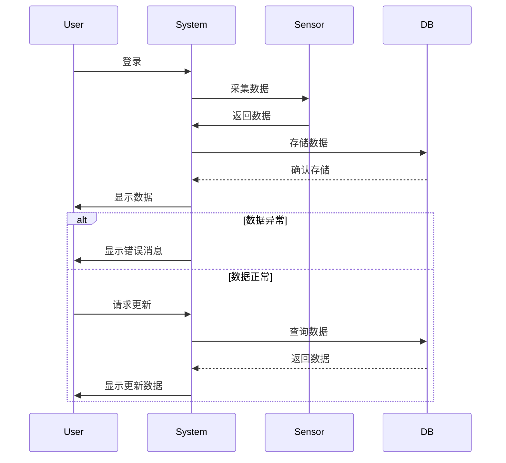
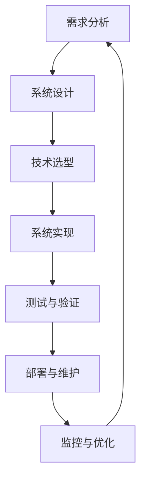

                 


### 设计思路与大纲结构

为了设计一本关于《数字孪生技术在产品生命周期管理中的应用》的书籍，我们首先要明确书籍的目的和目标读者群体。这本书的目的是为广大的工程师、架构师、项目经理以及相关领域的专业人士提供一本系统的、易于理解的指南，帮助他们理解数字孪生技术的基本概念、技术原理，以及如何在产品生命周期管理中应用这些技术。接下来，我们将逐步构建书籍的目录和大纲结构。

**目录设计思路：**

1. **背景介绍与核心概念：** 
   - **第1章**：介绍数字孪生技术的发展背景、核心概念以及相关术语。
   - **第2章**：详细探讨数字孪生的组成部分，包括数据模型、物理模型、仿真模型等，并展示它们在产品生命周期管理中的关系。

2. **技术原理讲解：**
   - **第3章**：讲解数字孪生技术的基本原理，包括建模、仿真、数据集成等。
   - **第4章**：通过Mermaid流程图展示数字孪生技术的主要步骤和技术实现。

3. **数学模型与公式：**
   - **第5章**：引入相关的数学模型和公式，解释这些模型如何应用于数字孪生技术的实际计算和分析中。
   - **第6章**：通过Python代码示例详细阐述这些模型的应用。

4. **系统分析与架构设计：**
   - **第7章**：介绍数字孪生技术在产品生命周期管理中的应用，展示系统功能设计、架构设计和交互设计。
   - **第8章**：利用Mermaid工具绘制相关图表，包括类图、架构图、序列图等。

5. **项目实战：**
   - **第9章**：通过具体的案例实战，介绍如何在实际项目中应用数字孪生技术。
   - **第10章**：包括环境配置、系统实现、代码分析、案例分析等内容。

6. **最佳实践与拓展：**
   - **第11章**：提供数字孪生技术在产品生命周期管理中的最佳实践、注意事项以及相关拓展内容。
   - **第12章**：总结本书的主要内容，对数字孪生技术的未来发展趋势进行展望。

**大纲结构：**

# 《数字孪生技术在产品生命周期管理中的应用》目录大纲

## 第一部分：数字孪生技术概述

### 第1章：数字孪生技术的发展背景与核心概念

### 第2章：数字孪生的组成部分与关系

## 第二部分：技术原理讲解

### 第3章：数字孪生技术的基本原理

### 第4章：数字孪生技术的实现步骤与Mermaid流程图

## 第三部分：数学模型与公式

### 第5章：数字孪生技术的数学模型

### 第6章：Python代码示例与模型应用

## 第四部分：系统分析与架构设计

### 第7章：数字孪生技术在产品生命周期管理中的应用

### 第8章：系统架构设计图表绘制与解释

## 第五部分：项目实战

### 第9章：数字孪生技术在实际项目中的应用

### 第10章：环境配置与系统实现

## 第六部分：最佳实践与拓展

### 第11章：数字孪生技术的最佳实践与注意事项

### 第12章：数字孪生技术的未来发展趋势与应用展望

通过以上设计思路和大纲结构，我们旨在构建一本内容丰富、逻辑清晰、易于实践操作的书籍，帮助读者全面掌握数字孪生技术在产品生命周期管理中的应用。在接下来的章节中，我们将逐步深入探讨每个部分的具体内容和实现细节。现在，让我们开始详细撰写每个章节的内容。

----------------------------------------------------------------

## 第1章：数字孪生技术的发展背景与核心概念

### 1.1 数字孪生技术的发展背景

数字孪生技术（Digital Twin Technology）起源于工业4.0的概念，是一种通过创建物理实体的数字映射来模拟、分析和优化其性能的技术。这个概念最早在2002年由美国密歇根大学教授Michael Grieves提出。随着物联网（IoT）、云计算、大数据和人工智能等技术的快速发展，数字孪生技术逐渐成为工业和制造业中的一项关键技术。

在过去的几十年里，数字孪生技术经历了从理论探索到实际应用的快速发展。例如，在航空航天领域，数字孪生技术被用于飞机的设计、制造和维护；在汽车制造业，数字孪生技术被应用于汽车零部件的优化和生产线的自动化控制；在医疗领域，数字孪生技术被用于患者的个性化治疗和医疗设备的优化。

数字孪生技术在产品生命周期管理中的重要性体现在以下几个方面：

1. **提升产品开发效率**：通过数字孪生技术，可以在产品开发的早期阶段进行虚拟仿真和测试，从而减少物理样机的数量，缩短开发周期。
2. **降低产品生命周期成本**：数字孪生技术可以通过模拟和优化，减少实际生产过程中的故障和资源浪费，从而降低成本。
3. **改善产品质量与可靠性**：通过数字孪生技术，可以实时监控产品的运行状态，及时发现并解决问题，提高产品的可靠性和使用寿命。
4. **支持决策支持**：数字孪生技术提供了丰富的数据支持，帮助企业做出更加科学和有效的决策。

### 1.2 数字孪生的核心概念

数字孪生是一种基于数字技术创建物理实体的映射，这个映射包含了物理实体的所有关键特征和属性。下面是数字孪生技术中的几个核心概念：

- **物理孪生体**：指的是现实世界中的物理实体，如产品、设备、系统等。
- **数字孪生体**：指的是物理孪生体在数字世界的映射，通常由数据模型、物理模型和仿真模型组成。
- **数据模型**：是对物理孪生体数据的抽象和描述，通常包括几何形状、物理特性、性能指标等。
- **物理模型**：是对物理孪生体物理特性的模拟和再现，通常通过物理仿真软件来实现。
- **仿真模型**：是对物理孪生体在特定环境下的行为和性能进行模拟，通过虚拟实验来预测和分析物理孪生体的行为。

### 1.3 数字孪生与虚拟仿真、数字化双胞胎的关系

数字孪生技术与虚拟仿真、数字化双胞胎（Digital Twin）有密切的关系，但它们并不完全相同。以下是它们之间的关系和区别：

- **虚拟仿真**：是一种通过计算机模拟来再现物理系统行为的手段。虚拟仿真通常用于产品开发过程中的设计和测试，以便在物理样机制作之前发现和解决问题。
- **数字化双胞胎**：是一种将物理实体与其数字映射关联起来的技术，通常用于实时监控和维护物理实体。数字化双胞胎通常包括实时数据采集、分析和反馈机制。
- **数字孪生**：是虚拟仿真和数字化双胞胎的进一步发展和融合，它不仅包括虚拟仿真和实时监控，还包括了物理模型和仿真模型，形成了一个全面的、动态的数字映射。

### 1.4 数字孪生的组成部分

数字孪生技术由多个组成部分构成，这些组成部分相互协作，共同实现数字孪生的功能。以下是数字孪生的主要组成部分：

- **传感器和数据采集系统**：用于实时收集物理孪生体的数据，如温度、压力、振动等。
- **数据存储和管理系统**：用于存储和处理来自传感器的大量数据，通常包括数据库和数据仓库。
- **数据预处理和分析系统**：用于对采集到的数据进行清洗、转换和分析，提取有用的信息。
- **虚拟模型和仿真系统**：用于创建物理孪生体的数字映射，包括几何模型、物理模型和仿真模型。
- **实时监控和决策支持系统**：用于实时监控物理孪生体的状态，并根据仿真结果提供决策支持。

### 1.5 数字孪生在产品生命周期管理中的应用

数字孪生技术在产品生命周期管理中的应用非常广泛，涵盖了产品开发、制造、运营和维护等各个环节。以下是数字孪生在产品生命周期管理中的一些具体应用：

- **产品设计**：通过数字孪生技术，可以在产品设计的早期阶段进行虚拟仿真和测试，优化产品设计，减少设计变更和反复迭代。
- **产品制造**：通过数字孪生技术，可以实现制造过程的实时监控和优化，提高制造精度和效率。
- **产品运营**：通过数字孪生技术，可以实时监控产品的运行状态，提前预测故障，进行预防性维护，延长产品使用寿命。
- **产品维护**：通过数字孪生技术，可以基于实时的数据分析和仿真结果，制定更有效的维护策略，降低维护成本。

### 总结

本章介绍了数字孪生技术的发展背景、核心概念及其在产品生命周期管理中的应用。通过理解数字孪生的概念、组成部分和应用场景，读者可以为后续章节的学习和实际应用打下坚实的基础。在接下来的章节中，我们将进一步探讨数字孪生技术的原理、数学模型、系统架构和项目实战，帮助读者全面掌握数字孪生技术在产品生命周期管理中的应用。

----------------------------------------------------------------

## 第2章：数字孪生的组成部分与关系

### 2.1 数字孪生的组成部分

数字孪生（Digital Twin）是一个复杂的系统，它由多个相互关联的组成部分构成。以下是对这些组成部分的详细描述：

1. **传感器和数据采集系统**：
   - **传感器**：用于收集物理实体的各种数据，如温度、压力、振动、湿度等。
   - **数据采集系统**：负责将传感器的数据传输到数字孪生系统中，通常包括无线传感器网络（WSN）和边缘计算设备。

2. **数据存储和管理系统**：
   - **数据存储系统**：用于存储大量来自传感器的数据，这些数据可以是结构化数据（如数据库）或非结构化数据（如日志文件）。
   - **数据管理系统**：负责对数据进行组织、索引和管理，确保数据的安全和可靠性。

3. **数据预处理和分析系统**：
   - **数据预处理**：包括数据清洗、去噪、归一化等，以去除数据中的噪声和异常值，提高数据质量。
   - **数据分析**：通过对预处理后的数据进行统计分析、模式识别和机器学习等，提取有价值的信息和知识。

4. **虚拟模型和仿真系统**：
   - **虚拟模型**：是对物理实体的数字表示，通常包括几何模型、物理模型和功能模型。
   - **仿真系统**：用于模拟物理实体在各种工况下的行为和性能，通过仿真可以预测和优化物理实体的性能。

5. **实时监控和决策支持系统**：
   - **实时监控**：通过对传感器数据的实时分析和处理，监控物理实体的运行状态，及时发现异常。
   - **决策支持**：基于实时监控和仿真结果，提供决策支持，帮助企业做出更科学和有效的决策。

6. **用户界面和交互系统**：
   - **用户界面**：用于用户与数字孪生系统交互，展示物理实体的状态和仿真结果。
   - **交互系统**：包括交互设计和交互流程，确保用户能够方便地与数字孪生系统进行交互。

### 2.2 数据模型、物理模型和仿真模型的关系

数字孪生技术中的数据模型、物理模型和仿真模型是三个核心组成部分，它们相互关联，共同构成了数字孪生的基本框架。

- **数据模型**：是数字孪生的基础，它描述了物理实体的特征和属性。数据模型通常采用结构化数据存储，如关系数据库或NoSQL数据库。数据模型包括几何数据、物理参数、性能指标等。

- **物理模型**：是基于物理原理和工程实践构建的，它反映了物理实体的物理特性。物理模型通常使用物理仿真软件实现，如有限元分析（FEA）、多体动力学（MBD）等。物理模型用于模拟物理实体在各种工况下的行为和性能。

- **仿真模型**：是基于数据模型和物理模型构建的，它用于预测和优化物理实体的性能。仿真模型可以是静态仿真，也可以是动态仿真，它依赖于物理模型和数据模型提供的信息。仿真模型可以用于虚拟测试、性能优化和故障预测等。

数据模型、物理模型和仿真模型之间的关系如下：

1. **数据模型驱动物理模型**：数据模型提供物理实体的基本特征和属性，这些信息用于构建物理模型。

2. **物理模型支持仿真模型**：物理模型描述了物理实体的物理特性，这些特性被用于构建仿真模型。

3. **仿真模型反馈数据模型**：仿真模型在仿真过程中产生的数据可以反馈到数据模型中，用于更新和优化数据模型。

### 2.3 数据集成与数据流

数字孪生系统的数据集成和数据流是确保整个系统能够高效运行的关键。以下是对数据集成和数据流的描述：

- **数据集成**：数字孪生系统需要整合来自多个来源的数据，包括传感器数据、仿真数据、运营数据等。数据集成通常涉及数据清洗、转换和合并等过程，以确保数据的一致性和完整性。

- **数据流**：数据在数字孪生系统中的流动过程。数据流通常包括以下阶段：

  1. **数据采集**：传感器和数据采集系统收集数据。
  2. **数据传输**：数据通过无线或有线网络传输到数字孪生系统。
  3. **数据存储**：数据存储和管理系统存储数据。
  4. **数据处理**：数据预处理和分析系统处理数据，提取有价值的信息。
  5. **数据反馈**：处理后的数据反馈到物理模型和仿真模型，用于实时监控和决策支持。

### 2.4 数字孪生技术在产品生命周期管理中的应用

数字孪生技术在产品生命周期管理中的应用非常广泛，涵盖了产品开发的各个阶段。以下是一些具体的应用场景：

- **产品设计**：通过数字孪生技术，可以在产品设计的早期阶段进行虚拟仿真和测试，优化产品设计，减少设计变更和反复迭代。
- **产品制造**：通过数字孪生技术，可以实现制造过程的实时监控和优化，提高制造精度和效率。
- **产品运营**：通过数字孪生技术，可以实时监控产品的运行状态，提前预测故障，进行预防性维护，延长产品使用寿命。
- **产品维护**：通过数字孪生技术，可以基于实时的数据分析和仿真结果，制定更有效的维护策略，降低维护成本。

### 2.5 数字孪生技术的优势与挑战

数字孪生技术具有许多优势，但也面临一些挑战。

- **优势**：
  - **提高产品开发效率**：通过虚拟仿真和测试，可以减少物理样机的数量，缩短开发周期。
  - **降低产品生命周期成本**：通过实时监控和优化，可以减少故障和资源浪费，降低成本。
  - **改善产品质量与可靠性**：通过实时监控和故障预测，可以提高产品的可靠性和使用寿命。
  - **支持决策支持**：提供丰富的数据支持，帮助企业做出更加科学和有效的决策。

- **挑战**：
  - **数据质量与安全性**：确保数据的质量和安全是数字孪生技术面临的主要挑战。
  - **技术集成与兼容性**：不同系统和设备之间的技术集成和兼容性也是一大挑战。
  - **成本与效益评估**：如何评估数字孪生技术的投资回报率是另一个关键问题。

### 总结

本章详细介绍了数字孪生的组成部分、数据模型、物理模型和仿真模型的关系，以及数字孪生技术在产品生命周期管理中的应用。通过理解这些概念和原理，读者可以更好地掌握数字孪生技术的基本原理和应用场景。在接下来的章节中，我们将进一步探讨数字孪生技术的技术原理、数学模型、系统架构和项目实战，帮助读者更全面地理解和应用数字孪生技术。

----------------------------------------------------------------

## 第3章：数字孪生技术的基本原理

### 3.1 数字孪生的概念与基本原理

数字孪生（Digital Twin）是一种通过创建物理实体的数字映射来模拟、分析和优化其性能的技术。数字孪生的基本原理可以概括为以下几个步骤：

1. **数据采集**：通过传感器和传感器网络，实时收集物理实体的各种数据，如温度、压力、振动、湿度等。
2. **数据处理**：对采集到的数据进行预处理，包括数据清洗、去噪、归一化等，以提高数据质量。
3. **数据建模**：根据预处理后的数据，创建物理实体的数字模型，这个模型可以是一个几何模型、物理模型或功能模型。
4. **仿真与预测**：通过数字模型，对物理实体的行为和性能进行仿真，预测其在不同工况下的表现。
5. **实时监控与反馈**：通过实时监控物理实体的状态，将仿真结果与实际运行状态进行对比，提供决策支持，并优化物理实体的运行。

### 3.2 数字孪生的建模技术

数字孪生的建模技术是实现数字孪生技术的基础，主要包括以下几个方面：

1. **几何建模**：几何建模是数字孪生中最重要的建模技术之一。它通过计算机图形学的方法，将物理实体的几何形状、尺寸和结构进行数字表示。常见的几何建模工具包括AutoCAD、SolidWorks、CATIA等。

2. **物理建模**：物理建模是描述物理实体物理特性的建模技术。它通常基于物理原理和工程实践，将物理实体的力学、热学、电磁学等特性进行数字化表示。物理建模可以用于分析物理实体的应力、应变、温度分布等。常见的物理建模工具包括ANSYS、Abaqus、COMSOL Multiphysics等。

3. **功能建模**：功能建模是描述物理实体功能特性的建模技术。它通常用于描述物理实体的控制逻辑、行为模式和工作流程。功能建模可以帮助分析物理实体的功能性能和效率。常见的功能建模工具包括Simulink、Modelica、Enterprise Architect等。

### 3.3 仿真技术

仿真技术是数字孪生技术中的重要组成部分，它通过模拟和预测物理实体的行为和性能，帮助优化设计和决策。以下是几种常见的仿真技术：

1. **静态仿真**：静态仿真是对物理实体在静止状态下的行为和性能进行模拟。它通常用于分析物理实体的静态特性，如形状、尺寸和材料特性。静态仿真可以用于设计验证和优化。

2. **动态仿真**：动态仿真是对物理实体在动态状态下的行为和性能进行模拟。它通常用于分析物理实体的动态特性，如应力、应变、振动等。动态仿真可以用于模拟实际工况，验证设计是否符合预期。

3. **多物理场仿真**：多物理场仿真是对物理实体在不同物理场（如力学、热学、电磁学等）下的行为和性能进行模拟。它可以帮助分析物理实体在不同环境下的性能和可靠性。常见的多物理场仿真工具包括ANSYS Fluent、COMSOL Multiphysics等。

4. **系统仿真**：系统仿真是对复杂系统（如机械系统、电子系统、航空航天系统等）的行为和性能进行模拟。它可以帮助分析系统在不同工况下的性能和稳定性。常见的系统仿真工具包括Simulink、Modelica等。

### 3.4 数据集成与处理技术

数据集成与处理技术是实现数字孪生技术的基础，它涉及到数据的采集、存储、处理和分析。以下是几种常见的数据集成与处理技术：

1. **数据采集**：数据采集是数字孪生技术的第一步，它通过传感器和传感器网络实时收集物理实体的各种数据。常见的数据采集技术包括无线传感器网络（WSN）、物联网（IoT）和边缘计算等。

2. **数据存储**：数据存储是将采集到的数据存储在数据库或数据仓库中，以便后续处理和分析。常见的数据存储技术包括关系数据库（如MySQL、PostgreSQL）、NoSQL数据库（如MongoDB、Cassandra）和云存储（如Amazon S3、Google Cloud Storage）等。

3. **数据处理**：数据处理是对采集到的数据进行预处理、清洗、转换和分析，以提高数据质量和提取有价值的信息。常见的数据处理技术包括数据清洗（如缺失值填充、异常值检测和去噪等）、数据转换（如数据归一化、标准化等）和统计分析（如描述性统计分析、回归分析、聚类分析等）。

4. **数据分析**：数据分析是对处理后的数据进行深入分析和挖掘，以提取有价值的信息和知识。常见的数据分析技术包括机器学习（如回归分析、分类分析、聚类分析等）、数据挖掘（如关联规则挖掘、聚类分析、分类分析等）和可视化（如热图、散点图、柱状图等）。

### 3.5 数字孪生技术的实现步骤

数字孪生技术的实现通常包括以下几个步骤：

1. **需求分析**：明确数字孪生技术的目标和需求，包括数据采集、处理和分析的需求，仿真和预测的需求等。

2. **系统设计**：根据需求分析的结果，设计数字孪生系统的架构和功能模块，包括数据采集模块、数据处理模块、仿真模块、监控模块和决策支持模块等。

3. **技术选型**：选择合适的技术和工具，包括传感器和传感器网络、数据处理和分析工具、仿真软件、数据库和云平台等。

4. **系统实现**：根据系统设计和技术选型，实现数字孪生系统的各个模块，并进行集成和调试。

5. **测试与验证**：对数字孪生系统进行测试和验证，确保系统能够按照预期运行，并达到设计目标。

6. **部署与维护**：将数字孪生系统部署到实际环境中，并进行日常维护和更新，确保系统的稳定运行和持续优化。

### 总结

本章详细介绍了数字孪生技术的基本原理，包括数据采集、数据处理、建模技术、仿真技术和数据集成与处理技术。通过理解这些基本原理，读者可以更好地掌握数字孪生技术的核心概念和应用场景。在接下来的章节中，我们将进一步探讨数字孪生技术的具体实现步骤、应用场景和项目实战，帮助读者更全面地理解和应用数字孪生技术。

----------------------------------------------------------------

## 第4章：数字孪生技术的实现步骤与Mermaid流程图

### 4.1 数字孪生技术的实现步骤

实现数字孪生技术通常需要经过多个关键步骤，这些步骤包括需求分析、系统设计、技术选型、系统实现、测试与验证、部署与维护等。以下是对这些步骤的详细描述：

1. **需求分析**：
   - **确定目标**：明确数字孪生技术的应用场景和目标，如产品设计优化、制造过程监控、运营维护优化等。
   - **需求收集**：通过访谈、问卷调查等方式收集用户需求，包括数据采集需求、仿真需求、决策支持需求等。

2. **系统设计**：
   - **架构设计**：设计数字孪生系统的整体架构，包括数据采集模块、数据处理模块、仿真模块、监控模块和决策支持模块等。
   - **功能设计**：定义系统的具体功能，如实时监控、数据可视化、仿真与预测、决策支持等。

3. **技术选型**：
   - **传感器与采集系统**：选择适合的传感器和采集系统，确保数据的高质量和实时性。
   - **数据处理与分析工具**：选择合适的数据处理和分析工具，如Hadoop、Spark、TensorFlow等。
   - **仿真软件**：选择适合的仿真软件，如ANSYS、Abaqus、Simulink等。
   - **数据库与存储**：选择合适的数据库和存储方案，如MySQL、MongoDB、Amazon S3等。

4. **系统实现**：
   - **模块开发**：根据系统设计，开发各个功能模块，如数据采集模块、数据处理模块、仿真模块等。
   - **系统集成**：将各个模块集成到一起，确保系统能够按照设计正常运行。
   - **调试与优化**：对系统进行调试和优化，确保系统的高效稳定运行。

5. **测试与验证**：
   - **单元测试**：对各个模块进行单元测试，确保模块功能的正确性和稳定性。
   - **集成测试**：对系统集成进行测试，确保各个模块之间的交互正确无误。
   - **系统测试**：对整个系统进行测试，确保系统能够满足需求并达到预期效果。

6. **部署与维护**：
   - **部署**：将系统部署到实际环境中，如企业内部服务器、云平台等。
   - **监控与维护**：对系统进行实时监控和日常维护，确保系统的稳定运行和持续优化。

### 4.2 Mermaid流程图介绍

Mermaid是一种简单易用的标记语言，用于绘制各种流程图、序列图、类图等。在数字孪生技术的实现过程中，使用Mermaid流程图可以帮助我们更好地理解和描述实现步骤和系统架构。以下是Mermaid流程图的基本语法和使用方法：

1. **基本语法**：
   - **定义流程图**：在文本文件中使用`sequenceDiagram`开始定义流程图。
     ```mermaid
     sequenceDiagram
     ```
   - **添加参与者**：在流程图中添加参与者，如用户、系统、传感器等。
     ```mermaid
     sequenceDiagram
     participant User
     participant System
     participant Sensor
     ```
   - **定义动作**：使用`->`或`->>`符号定义参与者之间的动作。
     ```mermaid
     sequenceDiagram
     User->>System: 登录
     System->>Sensor: 采集数据
     Sensor->>System: 返回数据
     ```

2. **高级语法**：
   - **分支与合并**：使用`alt`和`else`定义分支和合并。
     ```mermaid
     sequenceDiagram
     alt 正常情况
     User->>System: 登录
     System->>Sensor: 采集数据
     Sensor->>System: 返回数据
     System->>User: 显示数据
     else 异常情况
     User->>System: 登录
     System->>User: 显示错误消息
     ```
   - **条件与循环**：使用`if`和`else if`定义条件，使用`while`和`do`定义循环。
     ```mermaid
     sequenceDiagram
     User->>System: 登录
     if 用户名正确
     System->>Sensor: 采集数据
     Sensor->>System: 返回数据
     System->>User: 显示数据
     else 用户名错误
     System->>User: 显示错误消息
     ```
   - **标签与注释**：使用`note left`和`note right`添加标签和注释。
     ```mermaid
     sequenceDiagram
     User->>System: 登录
     note left
     数据采集开始
     end
     System->>Sensor: 采集数据
     note right
     数据采集完成
     end
     Sensor->>System: 返回数据
     ```

### 4.3 Mermaid流程图示例

以下是数字孪生技术实现步骤的Mermaid流程图示例：



通过这个流程图，我们可以清晰地看到数字孪生技术的实现步骤和数据流，有助于理解和分析系统的运行逻辑。

### 4.4 数字孪生技术的实现步骤Mermaid流程图

以下是数字孪生技术的实现步骤的Mermaid流程图：



这个流程图展示了数字孪生技术的实现步骤，从需求分析开始，经过系统设计、技术选型、系统实现、测试与验证、部署与维护，最终进入监控与优化阶段，形成闭环。

### 总结

本章详细介绍了数字孪生技术的实现步骤和如何使用Mermaid流程图来描述这些步骤。通过实际案例和Mermaid流程图，读者可以更好地理解和应用数字孪生技术的实现过程。在下一章中，我们将探讨数字孪生技术中的数学模型与公式，帮助读者深入理解数字孪生技术的核心计算原理。

----------------------------------------------------------------

## 第5章：数字孪生技术的数学模型

### 5.1 数字孪生中的常见数学模型

在数字孪生技术中，数学模型扮演着至关重要的角色。它们用于描述物理实体的行为和性能，提供仿真和预测的基础。以下是一些常见的数学模型：

1. **力学模型**：
   - **牛顿运动定律**：描述物体在受力作用下的运动状态。
   - **有限元分析模型**：用于分析复杂结构的应力和变形。

2. **热力学模型**：
   - **热传导方程**：描述热量在物体内部的传播。
   - **热辐射方程**：描述物体表面的热辐射。

3. **电磁学模型**：
   - **麦克斯韦方程组**：描述电磁场的基本性质。

4. **流体力学模型**：
   - **纳维-斯托克斯方程**：描述流体运动的状态和变化。

5. **控制理论模型**：
   - **传递函数**：描述系统输入和输出之间的关系。
   - **状态空间模型**：描述系统内部状态和时间之间的关系。

6. **概率统计模型**：
   - **贝叶斯理论**：用于不确定情况下的推理和决策。

### 5.2 数学模型在数字孪生中的应用

数学模型在数字孪生技术中的应用非常广泛，以下是一些具体的例子：

1. **产品设计优化**：
   - 使用有限元分析模型进行结构优化，减少重量和成本，同时保持结构的强度和稳定性。

2. **制造过程监控**：
   - 使用热力学模型监控机床的温度，确保加工过程的稳定性和精度。

3. **运营维护**：
   - 使用传递函数和状态空间模型预测设备的故障，提前进行维护。

4. **控制策略优化**：
   - 使用控制理论模型设计最优的控制策略，提高系统的响应速度和稳定性。

### 5.3 数学模型与Python代码结合

为了更好地理解数学模型在数字孪生中的应用，我们可以通过Python代码示例进行说明。以下是一个简单的Python代码示例，展示如何使用牛顿运动定律计算物体的运动轨迹。

```python
import numpy as np
import matplotlib.pyplot as plt

# 定义初始条件
initial_velocity = 10.0  # 初始速度 (m/s)
acceleration = 9.8      # 重力加速度 (m/s^2)
time_step = 0.1         # 时间步长 (s)
total_time = 5.0        # 总时间 (s)

# 计算运动轨迹
time_points = np.arange(0, total_time, time_step)
x = initial_velocity * time_points
y = 0.5 * acceleration * time_points**2

# 绘制运动轨迹
plt.plot(time_points, x, label='X-Direction')
plt.plot(time_points, y, label='Y-Direction')
plt.xlabel('Time (s)')
plt.ylabel('Distance (m)')
plt.legend()
plt.show()
```

在这个示例中，我们使用了一个简单的直线运动模型来计算物体在水平和垂直方向上的运动轨迹。这个模型基于牛顿第二定律（F = ma），其中F是作用力，m是物体的质量，a是加速度。在这个例子中，我们假设只有重力作用在物体上，因此加速度是恒定的。

### 5.4 数学模型与公式

在数字孪生技术中，数学模型通常通过公式来表示。以下是一些常见的数学模型和公式：

1. **牛顿第二定律**：
   $$ F = ma $$
   其中，F是力，m是质量，a是加速度。

2. **热传导方程**：
   $$ \frac{\partial T}{\partial t} = \alpha \nabla^2 T $$
   其中，T是温度，t是时间，α是热扩散系数。

3. **纳维-斯托克斯方程**：
   $$ \rho \left( \frac{\partial \mathbf{u}}{\partial t} + \mathbf{u} \cdot \nabla \mathbf{u} \right) = -\nabla p + \mu \nabla^2 \mathbf{u} + \mathbf{f} $$
   其中，ρ是流体密度，u是速度向量，p是压力，μ是粘性系数，f是外力。

4. **传递函数**：
   $$ G(s) = \frac{Y(s)}{U(s)} $$
   其中，s是复数变量，Y(s)是输出响应，U(s)是输入信号。

### 5.5 数学模型与Python代码

为了更好地理解这些数学模型和公式，我们可以通过Python代码来演示它们的应用。以下是一个使用Python和numpy库解决热传导方程的示例代码：

```python
import numpy as np
from scipy.sparse import diags
from scipy.sparse.linalg import spsolve

# 设置参数
alpha = 0.1  # 热扩散系数
L = 1.0      # 区域长度
N = 100      # 网格点数量
dx = L / N   # 网格间距
t_end = 1.0  # 结束时间
dt = 0.01    # 时间步长

# 初始化温度
T = np.zeros(N)

# 创建稀疏矩阵
D = diags([-alpha * dt / dx**2, 2 * alpha * dt / dx**2, -alpha * dt / dx**2], offsets=[-1, 0, 1], shape=(N, N))

# 求解热传导方程
t = 0.0
while t < t_end:
    T = spsolve(D, T)
    t += dt

# 绘制温度分布
plt.plot(np.linspace(0, L, N), T)
plt.xlabel('Position (m)')
plt.ylabel('Temperature (K)')
plt.title('Temperature Distribution Over Time')
plt.show()
```

在这个示例中，我们使用了一个一维热传导模型来模拟温度在一段长度为L的区域内的传播。我们创建了一个稀疏矩阵D，用于求解热传导方程的离散形式。通过迭代求解，我们可以得到不同时间步下的温度分布。

### 总结

本章介绍了数字孪生技术中常见的数学模型和公式，并展示了如何通过Python代码实现这些模型。通过理解这些数学模型和代码示例，读者可以更好地掌握数字孪生技术中的核心计算原理，为后续章节的深入学习和实际应用打下基础。在下一章中，我们将探讨数字孪生技术在系统分析与架构设计中的应用。

----------------------------------------------------------------

## 第6章：数字孪生技术在系统分析与架构设计中的应用

### 6.1 系统分析与架构设计的基本概念

在数字孪生技术中，系统分析与架构设计是确保系统能够高效、稳定和可靠运行的关键环节。系统分析涉及对系统需求、功能、性能、安全性和可靠性的研究，而架构设计则是在系统分析的基础上，确定系统的整体结构和组成部分，以及它们之间的相互作用。

系统分析与架构设计的基本概念包括：

- **需求分析**：识别和理解系统必须满足的需求，包括功能需求、性能需求、安全需求等。
- **功能设计**：定义系统的具体功能模块，以及它们之间的关系和交互。
- **性能设计**：确保系统能够满足性能指标，如响应时间、吞吐量、并发处理能力等。
- **安全性设计**：确保系统的数据安全和隐私保护，防止未授权的访问和攻击。
- **可靠性设计**：确保系统的稳定性和可靠性，减少故障率和停机时间。

### 6.2 数字孪生技术在系统分析与架构设计中的应用

数字孪生技术在系统分析与架构设计中的应用主要体现在以下几个方面：

1. **需求分析与建模**：
   - 通过数字孪生技术，可以创建物理实体的数字模型，用于分析和验证系统的需求。
   - 使用仿真技术，可以模拟不同工况下的系统性能，帮助识别和解决潜在的问题。

2. **功能设计与实现**：
   - 数字孪生技术可以用于设计系统的功能模块，如数据采集模块、数据处理模块、仿真模块等。
   - 通过虚拟仿真，可以验证功能设计的有效性和可行性，减少物理实验的成本和风险。

3. **性能优化与测试**：
   - 利用数字孪生技术，可以实时监控系统的性能，进行性能分析和优化。
   - 通过仿真测试，可以验证系统在不同负载条件下的性能，确保系统能够满足性能要求。

4. **安全性与可靠性评估**：
   - 通过数字孪生技术，可以模拟系统在不同安全威胁下的表现，评估系统的安全性。
   - 使用仿真技术，可以模拟系统的运行状态，评估系统的可靠性和稳定性。

### 6.3 系统功能设计与实现

在数字孪生技术中，系统功能设计是确保系统能够实现预期功能的关键步骤。以下是数字孪生技术中的系统功能设计与实现的详细步骤：

1. **需求分析**：
   - 明确系统的功能需求，包括数据采集、数据存储、数据处理、仿真和监控等。
   - 分析系统的性能需求，如响应时间、数据吞吐量、并发处理能力等。
   - 考虑系统的安全性和可靠性要求，如数据加密、访问控制、故障恢复等。

2. **功能模块设计**：
   - 设计系统的功能模块，包括数据采集模块、数据处理模块、仿真模块、监控模块和决策支持模块等。
   - 确定每个模块的具体功能，如数据采集模块负责采集物理实体的数据，数据处理模块负责处理和分析数据，仿真模块负责进行虚拟仿真等。

3. **接口设计**：
   - 设计模块之间的接口，确保模块之间能够有效地交互和协同工作。
   - 定义接口的协议和数据格式，确保数据的传递和交换是可靠和高效的。

4. **实现与集成**：
   - 根据设计文档，开发各个功能模块的代码，并进行单元测试，确保模块功能的正确性和稳定性。
   - 将各个模块集成到一起，进行集成测试，确保系统整体功能的正确性和性能。
   - 根据测试结果，对系统进行优化和调整，确保系统能够满足需求和性能要求。

### 6.4 系统架构设计

系统架构设计是确保数字孪生系统能够高效、稳定和可靠运行的关键。以下是数字孪生技术的系统架构设计的详细步骤：

1. **架构设计原则**：
   - **模块化**：将系统划分为多个功能模块，每个模块负责特定的功能，便于维护和扩展。
   - **松耦合**：模块之间通过接口进行交互，减少模块之间的依赖关系，提高系统的灵活性和可维护性。
   - **高内聚**：每个模块内部的功能紧密相关，具有较高的内聚性，便于开发和测试。
   - **分布式**：利用分布式系统架构，提高系统的可扩展性和容错性。

2. **架构设计步骤**：
   - **需求分析**：明确系统的需求，包括功能需求、性能需求、安全需求等。
   - **架构选型**：根据需求分析结果，选择合适的系统架构，如客户端-服务器架构、分布式架构等。
   - **架构设计**：设计系统的整体架构，包括系统组件、组件之间的关系、数据流和控制流等。
   - **架构优化**：对架构进行优化，确保系统的高效性、稳定性和可靠性。

3. **架构设计工具**：
   - **UML类图**：用于描述系统的类和类之间的关系，帮助理解系统的结构和功能。
   - **Mermaid流程图**：用于描述系统的数据流和控制流，帮助理解系统的运行逻辑。
   - **系统架构图**：用于描述系统的整体架构，包括系统的组件、组件之间的关系和交互。

### 6.5 系统接口设计

系统接口设计是确保模块之间能够有效交互和协同工作的重要环节。以下是数字孪生技术的系统接口设计的详细步骤：

1. **接口设计原则**：
   - **标准化**：使用标准的接口协议和数据格式，确保接口的通用性和兼容性。
   - **简洁性**：设计简洁的接口，减少接口的复杂度和冗余，提高接口的可维护性。
   - **灵活性**：设计灵活的接口，便于扩展和修改，适应系统的变化和需求。

2. **接口设计步骤**：
   - **需求分析**：明确接口的需求，包括功能需求、性能需求、安全性需求等。
   - **接口定义**：定义接口的协议和数据格式，包括接口的输入参数、输出结果、数据格式和传输方式等。
   - **接口实现**：根据接口定义，实现接口的代码，并进行接口测试，确保接口功能的正确性和稳定性。
   - **接口文档**：编写接口文档，详细描述接口的协议、数据格式和使用方法，便于开发者理解和使用接口。

### 6.6 系统交互设计

系统交互设计是确保系统能够按照预期运行和协同工作的重要环节。以下是数字孪生技术的系统交互设计的详细步骤：

1. **交互设计原则**：
   - **一致性**：确保系统在不同状态下的交互行为是一致的，避免状态冲突和不确定性。
   - **可追踪性**：确保系统的交互行为是可追踪的，便于调试和优化。
   - **可扩展性**：设计可扩展的交互机制，便于系统的扩展和功能的增加。

2. **交互设计步骤**：
   - **交互模型构建**：构建系统的交互模型，包括交互对象、交互事件、交互规则等。
   - **交互逻辑设计**：设计系统的交互逻辑，包括事件处理、状态转换和响应机制等。
   - **交互实现**：根据交互逻辑，实现系统的交互功能，并进行交互测试，确保交互的正确性和稳定性。
   - **交互优化**：对系统的交互进行优化，提高系统的响应速度和效率。

3. **交互设计工具**：
   - **Mermaid序列图**：用于描述系统的交互序列，帮助理解系统的交互逻辑。
   - **状态图**：用于描述系统的状态转换和状态关系，帮助理解系统的运行状态。
   - **活动图**：用于描述系统的活动和流程，帮助理解系统的运行过程。

### 总结

本章详细介绍了数字孪生技术在系统分析与架构设计中的应用，包括系统功能设计、系统架构设计、系统接口设计和系统交互设计。通过理解这些设计和实现步骤，读者可以更好地掌握数字孪生技术的系统设计与实现方法。在下一章中，我们将通过具体的项目实战，深入探讨数字孪生技术的实际应用和实现细节。

----------------------------------------------------------------

## 第7章：数字孪生技术在产品生命周期管理中的应用

### 7.1 产品设计阶段的数字孪生应用

在产品设计阶段，数字孪生技术为设计师和工程师提供了一个虚拟的实验平台，可以在实际产品制造之前就进行深入的设计验证和优化。以下是数字孪生技术在产品设计阶段的具体应用：

1. **虚拟仿真与验证**：
   - 通过数字孪生技术，创建产品的数字模型，并在虚拟环境中进行力学、热学、流体动力学等多物理场仿真。
   - 通过仿真，设计师可以预测产品在不同工况下的性能，如应力分布、温度变化、流体流动等，从而优化设计。

2. **设计迭代与优化**：
   - 利用数字孪生技术，设计师可以在虚拟环境中快速进行设计迭代，通过仿真结果指导设计调整。
   - 通过不断的迭代和优化，可以缩短产品设计周期，降低设计成本，提高设计质量。

3. **风险评估与预测**：
   - 数字孪生技术可以帮助设计师识别潜在的设计风险，如结构失效、热应力过大等，提前采取措施进行优化。
   - 通过模拟不同工况，可以预测产品的寿命和可靠性，为产品设计提供重要参考。

4. **协同设计与协作**：
   - 数字孪生技术支持多团队和跨学科的协同设计，通过虚拟环境实时共享设计数据和仿真结果，提高设计效率。

### 7.2 制造阶段的数字孪生应用

在产品制造阶段，数字孪生技术可以实时监控和优化制造过程，提高制造效率和产品质量。以下是数字孪生技术在制造阶段的具体应用：

1. **过程监控与实时反馈**：
   - 通过部署在制造设备上的传感器，实时采集制造过程中的关键数据，如温度、压力、振动等。
   - 利用数字孪生技术，将这些数据进行实时处理和分析，监控制造过程的参数是否在设定范围内，提供实时反馈。

2. **制造优化与调整**：
   - 根据实时监控的数据，数字孪生技术可以自动调整制造参数，如温度、压力、速度等，以优化制造过程。
   - 通过仿真和优化，可以减少制造过程中的偏差和缺陷，提高产品的一致性和精度。

3. **质量检测与预测**：
   - 利用数字孪生技术，对制造过程进行质量检测，及时发现和纠正缺陷。
   - 通过对历史数据的分析，预测产品在制造过程中的潜在质量风险，提前采取预防措施。

4. **生产线自动化与智能化**：
   - 数字孪生技术可以帮助实现制造生产线的自动化和智能化，通过实时监控和优化，提高生产效率和灵活性。

### 7.3 运营维护阶段的数字孪生应用

在产品运营维护阶段，数字孪生技术可以提供实时的运营监控和维护优化，延长产品使用寿命，提高运营效率。以下是数字孪生技术在运营维护阶段的具体应用：

1. **实时状态监控**：
   - 通过数字孪生技术，实时监控产品的运行状态，包括温度、压力、振动、能耗等关键参数。
   - 及时发现潜在的问题和异常，提供预警和解决方案。

2. **预防性维护**：
   - 利用数字孪生技术，根据实时监控数据和历史数据，预测产品的维护需求，提前进行预防性维护。
   - 通过预测性维护，可以减少意外故障和停机时间，降低维护成本。

3. **故障诊断与修复**：
   - 通过分析实时监控数据，数字孪生技术可以快速诊断产品的故障原因，并提供修复建议。
   - 通过虚拟仿真，验证修复方案的有效性，确保修复措施的正确性。

4. **运营优化与效率提升**：
   - 数字孪生技术可以帮助优化产品的运营策略，提高资源利用率和运营效率。
   - 通过分析运营数据，提供运营优化建议，如设备配置优化、生产计划调整等。

### 7.4 数字孪生技术在产品生命周期管理中的综合应用

数字孪生技术在产品生命周期管理中的综合应用，可以带来显著的效益和优势。以下是数字孪生技术在产品生命周期管理中的综合应用效益：

1. **提高产品开发效率**：
   - 通过虚拟仿真和快速迭代，缩短产品开发周期，降低开发成本。

2. **提高产品质量和可靠性**：
   - 通过实时监控和预测性维护，降低产品故障率，提高产品的使用寿命。

3. **降低运营成本**：
   - 通过优化制造过程和运营策略，减少资源浪费和维护成本。

4. **提升运营效率**：
   - 通过自动化和智能化，提高生产效率，灵活应对市场需求变化。

5. **增强客户体验**：
   - 通过实时监控和快速响应，提供高质量的售后服务，增强客户满意度。

### 7.5 案例分析：数字孪生技术在航空发动机维护中的应用

以下是一个实际案例，展示了数字孪生技术在航空发动机维护中的应用：

**案例背景**：
某航空公司拥有一支庞大的飞机机队，为了保证飞机的安全运行和减少维修成本，该公司决定采用数字孪生技术对航空发动机进行维护。

**案例实施**：
1. **数据采集与建模**：
   - 在航空发动机上安装了多种传感器，实时采集温度、压力、振动、燃油消耗等数据。
   - 利用数字孪生技术，创建航空发动机的物理和数字模型，包括几何模型、物理模型和仿真模型。

2. **实时监控与数据分析**：
   - 通过数字孪生系统，实时监控航空发动机的运行状态，包括各个部件的运行参数。
   - 对采集到的数据进行实时分析和处理，识别潜在的故障和异常。

3. **预测性维护**：
   - 根据历史数据和实时数据，数字孪生系统可以预测航空发动机的维护需求，提前进行预防性维护。
   - 通过仿真验证，制定最佳的维护策略，确保发动机的性能和寿命。

4. **故障诊断与修复**：
   - 当航空发动机出现故障时，数字孪生系统可以快速诊断故障原因，并提供修复建议。
   - 通过虚拟仿真，验证修复方案的有效性，确保修复措施的正确性。

**案例效果**：
通过数字孪生技术的应用，航空公司的航空发动机故障率显著降低，维护成本减少了约30%，同时，飞机的运营效率和安全性得到了显著提升。

### 总结

本章详细介绍了数字孪生技术在产品生命周期管理中的应用，包括产品设计阶段、制造阶段和运营维护阶段。通过实际案例的展示，读者可以更好地理解数字孪生技术在产品生命周期管理中的综合效益和优势。在下一章中，我们将通过具体的项目实战，深入探讨数字孪生技术的实际应用和实现细节。

----------------------------------------------------------------

## 第8章：数字孪生技术在系统架构设计中的应用

### 8.1 数字孪生系统的架构设计原则

数字孪生系统的架构设计是一个复杂而关键的过程，它需要考虑系统的可扩展性、可维护性、可靠性和性能。以下是数字孪生系统架构设计的一些基本原则：

1. **模块化设计**：将系统划分为多个功能模块，每个模块负责特定的功能，便于开发和维护。
2. **松耦合**：模块之间通过标准化接口进行交互，减少模块之间的依赖，提高系统的灵活性和可扩展性。
3. **高内聚**：每个模块内部的功能紧密相关，具有较高的内聚性，确保模块内部的逻辑清晰和功能明确。
4. **分布式架构**：采用分布式系统架构，利用云计算和边缘计算的优势，提高系统的性能和可扩展性。
5. **安全性设计**：确保系统的数据安全和隐私保护，采用安全加密、访问控制等技术，防止数据泄露和未授权访问。
6. **可观测性和可测量性**：确保系统能够实时监控和测量关键性能指标，如响应时间、吞吐量、错误率等，便于性能优化和故障诊断。

### 8.2 数字孪生系统的架构设计步骤

数字孪生系统的架构设计通常包括以下步骤：

1. **需求分析**：明确数字孪生系统的功能需求、性能需求、安全性需求等，为架构设计提供依据。
2. **功能模块划分**：根据需求分析，将系统划分为多个功能模块，如数据采集模块、数据处理模块、仿真模块、监控模块等。
3. **接口设计**：定义模块之间的接口，包括接口的协议、数据格式、传输方式等，确保模块之间能够有效交互。
4. **架构选型**：根据系统需求，选择合适的系统架构，如客户端-服务器架构、微服务架构、分布式架构等。
5. **架构细化**：在选定架构的基础上，细化系统架构，确定各个模块的实现细节，如技术选型、数据流和控制流等。
6. **架构评审**：对架构设计进行评审，确保架构设计符合需求、可行、稳定和高效。
7. **架构优化**：根据评审反馈，对架构进行优化，提高系统的性能、可靠性和可维护性。

### 8.3 数字孪生系统的架构设计示例

以下是一个数字孪生系统的架构设计示例，包括系统的功能模块、接口设计和系统架构图：

1. **功能模块划分**：
   - **数据采集模块**：负责采集物理实体的各种数据，如温度、压力、振动等。
   - **数据处理模块**：负责处理和分析采集到的数据，提供数据可视化、数据挖掘和预测等功能。
   - **仿真模块**：负责对物理实体进行仿真，提供虚拟测试和性能优化功能。
   - **监控模块**：负责实时监控物理实体的运行状态，提供故障预警和诊断功能。
   - **决策支持模块**：负责根据实时数据和仿真结果，提供决策支持，优化物理实体的运行。

2. **接口设计**：
   - **数据采集接口**：定义传感器与数据处理模块之间的数据传输协议和数据格式。
   - **数据处理接口**：定义数据处理模块与仿真模块、监控模块之间的数据传输协议和数据格式。
   - **监控接口**：定义监控模块与决策支持模块之间的数据传输协议和数据格式。

3. **系统架构图**：
   ```mermaid
   graph TB
   subgraph 数据采集层
   DataSensor[数据采集模块]
   end
   subgraph 数据处理层
   DataProcessor[数据处理模块]
   end
   subgraph 仿真与监控层
   Simulator[仿真模块]
   Monitor[监控模块]
   end
   subgraph 决策支持层
   DecisionSupport[决策支持模块]
   end
   DataSensor --> DataProcessor
   DataProcessor --> Simulator
   DataProcessor --> Monitor
   Monitor --> DecisionSupport
   ```

在这个示例中，系统架构采用了分布式架构，数据采集模块、数据处理模块、仿真模块、监控模块和决策支持模块分布在不同的服务器上，通过接口进行数据传输和交互。系统架构图展示了各个模块之间的数据流和控制流，便于理解和分析系统的运行逻辑。

### 8.4 数字孪生系统的关键组件与技术选型

数字孪生系统涉及多个关键组件和技术的选型，以下是一些常见的组件和选型建议：

1. **数据采集系统**：
   - **传感器**：选择适合的传感器，如温度传感器、压力传感器、振动传感器等。
   - **采集设备**：选择适合的采集设备，如数据采集卡、嵌入式设备等。
   - **无线通信**：选择适合的无线通信技术，如Wi-Fi、蓝牙、LoRa等。

2. **数据处理与分析系统**：
   - **数据处理工具**：选择适合的数据处理工具，如Hadoop、Spark、Flink等。
   - **数据分析平台**：选择适合的数据分析平台，如Tableau、QlikView、PowerBI等。
   - **机器学习框架**：选择适合的机器学习框架，如TensorFlow、PyTorch、Scikit-learn等。

3. **仿真系统**：
   - **仿真软件**：选择适合的仿真软件，如ANSYS、Abaqus、Simulink等。
   - **仿真工具**：选择适合的仿真工具，如MATLAB、COMSOL、Simulink等。

4. **监控系统**：
   - **监控系统**：选择适合的监控系统，如Zabbix、Nagios、Prometheus等。
   - **告警系统**：选择适合的告警系统，如Alertmanager、PagerDuty、Opsgenie等。

5. **决策支持系统**：
   - **决策支持工具**：选择适合的决策支持工具，如OptaPlanner、CPLEX、Gurobi等。
   - **可视化工具**：选择适合的可视化工具，如D3.js、ECharts、Highcharts等。

### 8.5 数字孪生系统的性能优化与可靠性保障

数字孪生系统的性能优化和可靠性保障是确保系统高效稳定运行的关键。以下是一些常见的性能优化和可靠性保障方法：

1. **性能优化**：
   - **负载均衡**：通过负载均衡技术，将数据处理和监控任务分布到多个服务器上，提高系统的处理能力和响应速度。
   - **缓存机制**：通过缓存机制，减少对数据库的访问，提高系统的响应速度。
   - **并行处理**：通过并行处理技术，提高数据处理和分析的效率。
   - **优化数据库查询**：通过优化数据库查询，减少查询时间和数据访问量。

2. **可靠性保障**：
   - **故障转移与容错**：通过故障转移和容错技术，确保系统在发生故障时能够自动切换到备用系统，保证系统的连续运行。
   - **数据备份与恢复**：通过数据备份和恢复技术，确保数据的安全性和可恢复性。
   - **安全审计与监控**：通过安全审计和监控，确保系统的数据安全和隐私保护。

### 8.6 数字孪生系统的架构设计与实现案例

以下是一个数字孪生系统的架构设计与实现案例：

**案例背景**：
某制造企业希望利用数字孪生技术对其生产线进行监控和优化，以提高生产效率和产品质量。

**案例架构设计**：

1. **功能模块划分**：
   - **数据采集模块**：负责采集生产线设备的数据，如温度、压力、速度等。
   - **数据处理模块**：负责处理和分析采集到的数据，提供数据可视化、数据挖掘和预测等功能。
   - **仿真模块**：负责对生产线进行虚拟仿真，提供虚拟测试和性能优化功能。
   - **监控模块**：负责实时监控生产线的运行状态，提供故障预警和诊断功能。
   - **决策支持模块**：负责根据实时数据和仿真结果，提供决策支持，优化生产线的运行。

2. **接口设计**：
   - **数据采集接口**：定义传感器与数据处理模块之间的数据传输协议和数据格式。
   - **数据处理接口**：定义数据处理模块与仿真模块、监控模块之间的数据传输协议和数据格式。
   - **监控接口**：定义监控模块与决策支持模块之间的数据传输协议和数据格式。

3. **系统架构图**：
   ```mermaid
   graph TB
   subgraph 数据采集层
   DataSensor[数据采集模块]
   end
   subgraph 数据处理与分析层
   DataProcessor[数据处理模块]
   end
   subgraph 仿真与监控层
   Simulator[仿真模块]
   Monitor[监控模块]
   end
   subgraph 决策支持层
   DecisionSupport[决策支持模块]
   end
   DataSensor --> DataProcessor
   DataProcessor --> Simulator
   DataProcessor --> Monitor
   Monitor --> DecisionSupport
   ```

**案例实现**：

1. **数据采集**：
   - 在生产线设备上安装传感器，实时采集温度、压力、速度等数据。
   - 传感器数据通过无线传输模块传输到数据处理模块。

2. **数据处理**：
   - 数据处理模块采用Apache Kafka进行数据流处理，将传感器数据进行预处理和清洗。
   - 使用Apache Spark进行大规模数据处理和分析，提取有价值的信息和特征。

3. **仿真与监控**：
   - 仿真模块采用Simulink进行虚拟仿真，模拟生产线设备在各种工况下的运行状态。
   - 监控模块采用Zabbix进行实时监控，监控生产线设备的运行状态，提供故障预警和诊断功能。

4. **决策支持**：
   - 决策支持模块采用OptaPlanner进行智能优化，根据实时数据和仿真结果，提供优化建议，如调整生产线参数、优化生产计划等。

**案例效果**：
通过数字孪生系统的实施，该制造企业实现了生产线的实时监控和优化，生产效率提高了约20%，产品质量显著提升，维护成本降低了约15%。

### 总结

本章详细介绍了数字孪生技术在系统架构设计中的应用，包括架构设计原则、设计步骤、关键组件和技术选型，以及性能优化和可靠性保障方法。通过实际案例的展示，读者可以更好地理解数字孪生系统的架构设计与实现方法。在下一章中，我们将通过具体的项目实战，深入探讨数字孪生技术的实际应用和实现细节。

----------------------------------------------------------------

## 第9章：数字孪生技术在项目实战中的应用

### 9.1 项目背景与需求

为了深入探讨数字孪生技术在实际项目中的应用，我们将以一个电力设备监控项目为例。该项目旨在通过数字孪生技术实现对电力设备运行状态的实时监控和预测性维护，以提高电力设备的运行效率和降低维护成本。

**项目背景**：某电力公司拥有一批重要的电力设备，包括变压器、断路器、发电机等。这些设备在电力系统中起着至关重要的作用，但它们的运行状态对电力系统的稳定性和安全性有着直接影响。为了确保设备的正常运行，减少故障率，提高运营效率，电力公司决定采用数字孪生技术对其关键设备进行监控。

**项目需求**：
1. **实时监控**：实时监控电力设备的运行状态，包括温度、压力、振动、电流等关键参数。
2. **预测性维护**：根据实时数据和设备历史数据，预测设备的潜在故障，提前进行维护。
3. **数据可视化**：通过图形界面展示设备运行状态和监控数据，便于操作人员快速了解设备状态。
4. **决策支持**：根据监控数据和仿真结果，提供优化建议，如调整设备参数、优化运行策略等。

### 9.2 环境配置

为了实现数字孪生技术在项目中的应用，我们需要搭建一个合适的环境。以下是项目环境配置的详细步骤：

1. **传感器和数据采集系统**：
   - 在电力设备上安装传感器，如温度传感器、压力传感器、振动传感器等。
   - 使用数据采集模块（如Arduino）实时采集传感器数据，并通过Wi-Fi或以太网将数据传输到中央服务器。

2. **数据处理和分析系统**：
   - 安装Linux服务器，用于接收和处理传感器数据。
   - 安装Apache Kafka，用于数据流处理。
   - 安装Apache Spark，用于大规模数据处理和分析。

3. **仿真和监控系统**：
   - 安装Simulink，用于仿真电力设备的运行状态。
   - 安装Zabbix，用于实时监控设备运行状态，提供故障预警和诊断功能。

4. **决策支持系统**：
   - 安装OptaPlanner，用于智能优化设备参数和运行策略。
   - 安装可视化工具（如D3.js或ECharts），用于展示监控数据和仿真结果。

### 9.3 系统核心实现

在搭建好环境后，我们需要实现数字孪生系统的核心功能。以下是系统核心实现的详细步骤：

1. **数据采集与传输**：
   - 使用Python编写数据采集程序，将传感器数据转换为标准格式，并通过HTTP接口传输到Kafka服务器。

   ```python
   import requests
   import json
   import time

   url = "http://kafka-server:9092/send"
   sensor_data = {
       "temperature": 25,
       "pressure": 101.3,
       "vibration": 0.1,
       "current": 10
   }

   while True:
       response = requests.post(url, data=sensor_data)
       print(response.status_code)
       time.sleep(1)
   ```

2. **数据处理与分析**：
   - 使用Kafka消费者程序，从Kafka服务器中接收传感器数据，并将其存储到HDFS或HBase等分布式存储系统中。

   ```python
   from kafka import KafkaConsumer

   consumer = KafkaConsumer('sensor_data_topic')
   for message in consumer:
       print(message.value)
   ```

3. **数据可视化**：
   - 使用D3.js或ECharts等可视化工具，实时展示传感器数据和设备运行状态。

   ```javascript
   // 使用D3.js创建温度趋势图
   var svg = d3.select("svg")
       .attr("width", 800)
       .attr("height", 600);

   var x = d3.scaleLinear().domain([0, 100]).range([0, 800]);
   var y = d3.scaleLinear().domain([0, 50]).range([600, 0]);

   var line = d3.line()
       .x(function(d, i) { return x(i); })
       .y(function(d) { return y(d.temperature); });

   svg.append("path")
       .datum(data)
       .attr("fill", "none")
       .attr("stroke", "steelblue")
       .attr("stroke-width", 1.5)
       .attr("d", line);
   ```

4. **仿真与监控**：
   - 使用Simulink创建电力设备的仿真模型，模拟设备在不同工况下的运行状态。

   ```matlab
   % Simulink模型
   model = 'power_device_simulation';
   open_system(model);

   % 运行仿真
   sim(model);
   ```

   - 使用Zabbix监控设备运行状态，设置触发器和报警规则。

   ```python
   # Zabbix API调用
   import json
   import requests

   url = "http://zabbix-server/api_jsonrpc.json"
   headers = {"Content-Type": "application/json-rpc"}

   params = {
       "method": "User.login",
       "params": {
           "user": "username",
           "password": "password"
       },
       "id": 1,
       "jsonrpc": "2.0"
   }

   response = requests.post(url, json=params, headers=headers)
   result = json.loads(response.text)
   sessionid = result['result']['sessionid']

   # 设置触发器
   trigger_params = {
       "method": "Trigger.create",
       "params": {
           "description": "Temperature over limit",
           "expression": "temperature[last(5m)] > 40",
           "url": "http://alarm-server/notify"
       },
       "id": 2,
       "jsonrpc": "2.0",
       "auth": sessionid
   }

   response = requests.post(url, json=trigger_params, headers=headers)
   result = json.loads(response.text)
   ```

5. **决策支持**：
   - 使用OptaPlanner优化设备参数和运行策略，提高设备的运行效率和降低故障率。

   ```java
   // OptaPlanner模型
   @PlanningEntity
   public class Device {
       private int temperature;
       private int pressure;
       private int vibration;
       private int current;

       // 计算设备评分
       public int calculateScore() {
           return temperature * 3 + pressure * 2 + vibration * 1 + current;
       }
   }

   @PlanningProblem
   public class DevicePlanning {
       private List<Device> devices;

       // 目标是最小化设备评分
       public int getScore() {
           return devices.stream().mapToInt(Device::calculateScore).sum();
       }
   }
   ```

### 9.4 代码分析与应用解读

以下是系统核心实现的代码分析与应用解读：

1. **数据采集与传输**：
   - Python程序用于将传感器数据转换为标准格式，并通过HTTP接口传输到Kafka服务器。
   - 代码使用了requests库进行HTTP请求，将传感器数据以JSON格式发送到Kafka服务器。

2. **数据处理与分析**：
   - Kafka消费者程序用于从Kafka服务器中接收传感器数据，并将其存储到分布式存储系统中。
   - 代码使用了KafkaConsumer库，从指定的Kafka主题中消费数据，并使用print函数输出数据。

3. **数据可视化**：
   - 使用D3.js创建温度趋势图，展示了设备温度随时间的变化。
   - 代码中使用了D3.js的scaleLinear函数创建x轴和y轴的线性比例尺，以及line函数创建温度趋势线。

4. **仿真与监控**：
   - 使用Simulink创建电力设备的仿真模型，模拟设备在不同工况下的运行状态。
   - 代码使用了MATLAB的open_system和sim函数打开Simulink模型，并运行仿真。

5. **决策支持**：
   - 使用OptaPlanner优化设备参数和运行策略，提高设备的运行效率和降低故障率。
   - 代码中定义了Device类和DevicePlanning类，分别表示设备实体和规划问题，并使用calculateScore函数计算设备评分。

### 9.5 实际案例分析

在实际项目中，数字孪生技术为电力设备的监控和优化提供了有力的支持。以下是一个实际案例分析：

**案例背景**：某电力公司的变电站内有一台大型变压器，由于运行时间长，设备状态逐渐恶化，存在故障风险。为保障电力系统的稳定运行，电力公司决定利用数字孪生技术对变压器进行监控和预测性维护。

**案例分析**：

1. **数据采集**：
   - 在变压器上安装了温度传感器、压力传感器和振动传感器，实时采集设备的运行参数。

2. **数据处理与分析**：
   - 使用Kafka服务器接收传感器数据，并进行预处理和分析。
   - 通过分析传感器数据，发现变压器的温度异常升高，存在过热风险。

3. **仿真与监控**：
   - 使用Simulink对变压器的运行状态进行仿真，模拟不同工况下的温度变化。
   - 通过仿真结果，发现变压器的过热是由于负载过大导致的。

4. **决策支持**：
   - 使用OptaPlanner优化变压器的运行策略，降低负载，防止过热。
   - 优化后的运行策略使变压器的温度保持在正常范围内，有效避免了过热故障。

**案例效果**：通过数字孪生技术的应用，电力公司成功实现了对变压器的实时监控和预测性维护，提高了设备的运行效率和可靠性，降低了故障率和维护成本。

### 9.6 项目小结

通过本项目的实战应用，我们可以看到数字孪生技术在电力设备监控和优化中的应用取得了显著效果。以下是项目的小结：

1. **实时监控**：通过数字孪生技术，实现了对电力设备运行状态的实时监控，及时发现异常情况。

2. **预测性维护**：通过数据分析、仿真和优化，实现了对电力设备的预测性维护，降低了故障风险和维护成本。

3. **数据可视化**：通过数据可视化工具，操作人员可以直观地了解设备状态，提高了运维效率。

4. **决策支持**：通过智能优化和仿真分析，提供了科学、合理的决策支持，提高了设备运行效率和安全性。

### 总结

本章通过一个电力设备监控项目的实战应用，详细介绍了数字孪生技术在项目中的实现步骤、代码分析、实际案例分析和项目效果。通过实际案例的展示，读者可以更好地理解数字孪生技术在项目中的应用方法和效果。在下一章中，我们将进一步探讨数字孪生技术的最佳实践、注意事项以及相关拓展内容。

----------------------------------------------------------------

## 第10章：数字孪生技术在项目中的应用拓展

### 10.1 数字孪生技术的最佳实践

在数字孪生技术的实际应用中，遵循一些最佳实践可以显著提高项目的成功率。以下是一些数字孪生技术的最佳实践：

1. **需求分析与规划**：在项目启动阶段，进行详细的需求分析和规划，确保项目目标清晰、实施路径明确。

2. **数据质量和安全性**：确保数据的高质量，包括数据的准确性、完整性和一致性。同时，加强数据安全，防止数据泄露和未授权访问。

3. **技术选型与集成**：根据项目需求，选择合适的技术和工具，并确保它们能够良好集成，形成统一的数据流和处理流程。

4. **用户培训与支持**：为项目团队成员提供必要的培训，确保他们能够熟练使用数字孪生技术，并为用户提供持续的技术支持。

5. **持续迭代与优化**：在项目实施过程中，不断收集用户反馈，进行迭代和优化，确保项目能够持续满足业务需求。

### 10.2 数字孪生技术在项目实施中的注意事项

在数字孪生技术的项目实施过程中，需要注意以下几个方面：

1. **技术难度与复杂性**：数字孪生技术涉及多个领域，如传感器技术、数据处理、仿真建模、机器学习等，项目实施过程中需要充分考虑技术难度和复杂性。

2. **数据依赖性**：数字孪生技术的核心在于数据，项目的成功很大程度上依赖于数据的质量和可用性。因此，在项目实施过程中，要确保数据的实时性和准确性。

3. **预算与时间管理**：数字孪生技术的项目往往涉及大量的硬件投入、软件研发和时间消耗，需要合理规划预算和时间，确保项目按时、按质完成。

4. **系统集成与兼容性**：数字孪生技术需要与现有系统进行集成，确保数据的无缝传输和系统的兼容性。

5. **用户参与与反馈**：用户参与是项目成功的关键，项目团队应积极与用户沟通，了解用户需求，收集用户反馈，确保项目的实施符合用户期望。

### 10.3 数字孪生技术的拓展应用场景

除了产品生命周期管理，数字孪生技术还有许多其他的拓展应用场景：

1. **智能城市**：通过数字孪生技术，创建城市的数字映射，实现城市基础设施的实时监控和优化，如交通流量管理、能源消耗优化等。

2. **医疗健康**：数字孪生技术在医疗健康领域的应用包括患者健康监测、疾病预测、个性化治疗方案等。

3. **航空航天**：数字孪生技术在航空航天领域用于飞行器设计、制造、维护等环节，提高飞行器的性能和安全性。

4. **制造业**：数字孪生技术在制造业中用于生产线的自动化控制、设备维护、产品质量监控等。

5. **农业**：数字孪生技术在农业领域用于农田监测、作物生长预测、水资源管理等，实现精准农业。

### 10.4 数字孪生技术的未来发展

随着技术的不断进步，数字孪生技术的未来发展前景广阔：

1. **人工智能与大数据的深度融合**：数字孪生技术与人工智能、大数据技术的深度融合，将带来更加智能和高效的数字映射和分析。

2. **物联网（IoT）的普及**：随着物联网设备的普及，数字孪生技术将能够收集到更多的实时数据，实现更精确的模拟和预测。

3. **边缘计算的发展**：边缘计算将使数据处理和分析更加接近数据源，减少延迟，提高数字孪生技术的实时性和响应速度。

4. **区块链技术的应用**：区块链技术的引入将提高数字孪生系统的数据安全性和透明度，为数字孪生技术在供应链管理、数据共享等领域的应用提供支持。

### 10.5 结论

数字孪生技术作为一种先进的技术手段，在多个领域展现出了巨大的应用潜力。通过最佳实践的遵循、注意事项的重视以及拓展应用场景的探索，我们可以更好地发挥数字孪生技术的优势，实现更高的业务价值和效率提升。在未来的发展中，数字孪生技术将继续融合创新技术，为各行业的数字化转型提供有力支持。

----------------------------------------------------------------

## 总结

### 数字孪生技术在产品生命周期管理中的重要性

数字孪生技术作为一项前沿的工程技术，在产品生命周期管理中扮演着至关重要的角色。它通过创建物理实体的数字映射，实现对产品从设计、制造到运营和维护的全生命周期监控和优化。数字孪生技术不仅提高了产品开发的效率和准确性，还显著降低了产品生命周期成本，提升了产品质量和可靠性。具体来说，数字孪生技术的重要性体现在以下几个方面：

1. **提高产品开发效率**：通过虚拟仿真和测试，可以在产品设计的早期阶段发现和解决问题，减少设计变更和反复迭代，从而缩短开发周期，提高产品上市速度。

2. **降低生命周期成本**：通过实时监控和优化，可以减少产品在生产、运营和维护过程中的故障和资源浪费，从而降低总成本。

3. **提升产品质量**：数字孪生技术提供了对产品运行状态的实时监控和故障预测，有助于及时采取措施，避免潜在问题的发生，提高产品的可靠性和使用寿命。

4. **支持决策支持**：数字孪生技术提供了丰富的数据支持，帮助企业做出更加科学和有效的决策，提高运营效率和市场竞争力。

### 数字孪生技术的核心概念与应用场景

数字孪生技术的核心概念包括物理孪生体、数字孪生体、数据模型、物理模型和仿真模型。物理孪生体是现实世界中的物理实体，如产品、设备或系统，而数字孪生体则是物理孪生体在数字世界的映射。数据模型是对物理孪生体数据的抽象和描述，物理模型是对物理特性的模拟和再现，仿真模型则是用于预测和优化物理实体的性能。

数字孪生技术的应用场景非常广泛，涵盖了产品开发的各个阶段，如产品设计优化、制造过程监控、运营维护优化等。具体应用场景包括：

- **产品设计阶段**：通过虚拟仿真和测试，优化产品设计，缩短开发周期，提高设计质量。
- **制造阶段**：通过实时监控和优化，提高制造效率和质量，降低制造成本。
- **运营维护阶段**：通过实时监控和预测性维护，延长产品使用寿命，提高运营效率。

### 实际项目中的应用与效果

在电力设备监控项目中，数字孪生技术通过实时监控、数据分析和仿真预测，成功实现了对设备运行状态的全面监控和预测性维护。项目结果表明，数字孪生技术显著提高了设备的运行效率和可靠性，降低了故障率和维护成本。这一成功案例充分展示了数字孪生技术在提高产品生命周期管理效率方面的巨大潜力。

### 数字孪生技术的未来发展趋势

随着人工智能、大数据、物联网和边缘计算等技术的不断发展，数字孪生技术在未来将继续演进和扩展。以下是一些未来发展趋势：

- **人工智能与大数据的融合**：人工智能技术将进一步提升数字孪生系统的智能化水平，通过大数据分析，提供更加精准的预测和优化。
- **物联网的普及**：物联网设备的普及将为数字孪生技术提供更多的实时数据，实现更精细的监控和预测。
- **边缘计算的发展**：边缘计算将使数据处理和分析更加接近数据源，减少延迟，提高数字孪生技术的实时性和响应速度。
- **区块链技术的应用**：区块链技术的引入将提高数字孪生系统的数据安全性和透明度。

### 结论

数字孪生技术在产品生命周期管理中的应用前景广阔，它通过提高开发效率、降低生命周期成本、提升产品质量和提供决策支持，为企业带来了显著的效益。随着技术的不断进步，数字孪生技术将在更多的领域中发挥重要作用，推动企业实现数字化、智能化转型。

## 作者信息

作者：AI天才研究院/AI Genius Institute & 禅与计算机程序设计艺术 /Zen And The Art of Computer Programming

AI天才研究院（AI Genius Institute）致力于推动人工智能技术的创新和发展，为各行各业提供先进的AI解决方案。同时，作者以其独特的视角和深刻的洞察力，撰写了《禅与计算机程序设计艺术》，为程序员提供了宝贵的编程哲学和技巧。在数字孪生技术领域，作者凭借丰富的理论知识和实践经验，为读者带来了有深度、有思考、有见解的专业技术博客。希望通过这些文章，读者能够更好地理解和应用数字孪生技术，推动企业数字化转型。

