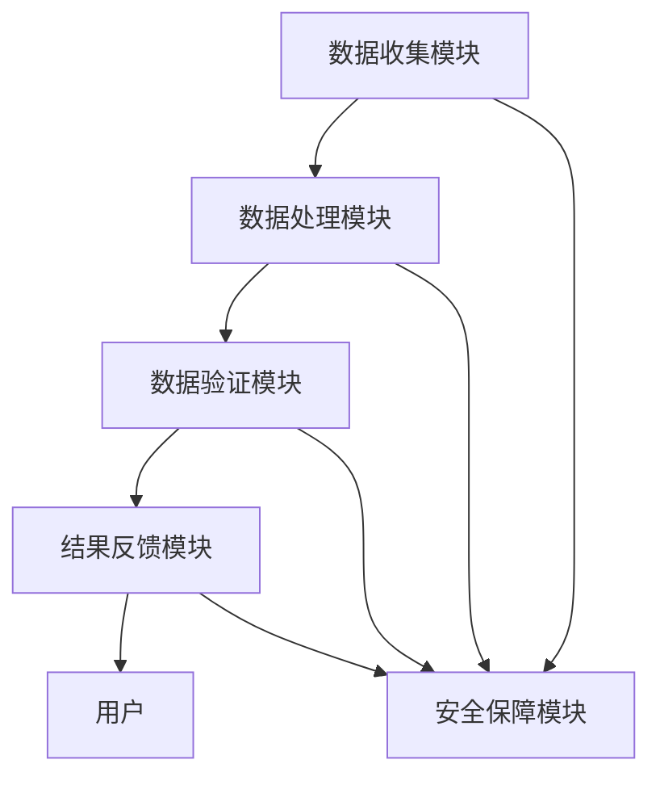

                 

## 文章标题

### 关键词：数字真实性验证、AI技术、企业信息安全、信息安全策略

### 摘要：

随着数字化时代的到来，企业信息安全面临前所未有的挑战。本文旨在探讨数字真实性验证在AI时代的企业信息安全策略中的重要性。通过分析数字真实性验证的核心概念、技术原理和实践应用，本文提出了一系列有效的信息安全策略，以帮助企业保护其数字资产，提高信息透明度和可信度。文章不仅详细阐述了数字真实性验证的框架和关键技术，还结合实际案例展示了其在企业信息安全中的具体应用，为读者提供了实用的指导和建议。

## 目录大纲

### 第一部分：背景与基础

#### 第1章 数字真实性验证概述

1.1 问题背景与描述

1.2 问题描述

1.3 问题解决

1.4 边界与外延

1.5 核心要素组成

#### 第2章 AI时代的企业信息安全

2.1 AI与企业信息安全的现状

2.2 技术应用

2.3 挑战与机遇

#### 第3章 数字真实性验证技术原理

3.1 数字真实性验证的核心概念

3.2 原理讲解

### 第二部分：实践与方案

#### 第4章 数字真实性验证系统设计与实现

4.1 系统设计与架构

4.2 架构设计

4.3 接口设计

#### 第5章 AI在数字真实性验证中的应用

5.1 算法原理

5.2 Python代码实现

#### 第6章 数字真实性验证的实际案例分析

6.1 案例背景与场景

6.2 案例实施

### 第三部分：最佳实践与未来展望

#### 第7章 数字真实性验证的最佳实践

7.1 最佳实践总结

7.2 注意事项

#### 第8章 数字真实性验证的未来发展

8.1 未来发展趋势

8.2 行业影响

#### 第9章 小结与拓展阅读

9.1 书籍小结

9.2 拓展阅读

### 第一部分：背景与基础

#### 第1章 数字真实性验证概述

**1.1 问题背景与描述**

在当今数字化时代，企业和个人对信息的依赖程度越来越高。然而，随着信息传播渠道的多样化和信息量的爆炸性增长，信息安全问题也日益突出。数字真实性验证作为一种重要的技术手段，旨在确保信息的真实性和完整性，从而保障企业信息系统的安全运行。

**问题背景**：数字化进程的加速带来了数据的爆炸性增长，同时也增加了信息泄露、篡改和伪造的风险。企业面临的数据真实性问题不仅包括内部数据，还涉及到与外部合作伙伴、客户和供应商之间的交互数据。

**问题描述**：如何有效地验证数字信息的真实性，防止数据被篡改、伪造或泄露，成为企业信息安全的关键问题。此外，不同类型的数据（如文本、图像、音频等）在真实性验证方面存在不同的挑战。

**问题解决**：采用先进的AI技术进行数字真实性验证是一种有效的解决方案。AI技术能够通过机器学习、深度学习等方法，从海量数据中提取特征，构建模型，从而实现对数字信息的自动化验证。

**边界与外延**：数字真实性验证的范围涵盖了各种类型的数据，包括结构化数据和非结构化数据。在技术层面，它涉及数据验证、加密技术、数字签名、区块链等多种技术手段。未来，随着技术的不断发展，数字真实性验证的应用场景将更加广泛，从企业内部的数据管理扩展到跨领域的协同合作。

**核心要素组成**：数字真实性验证的核心要素包括数据验证、加密技术、人工智能和区块链等。数据验证是通过一系列技术手段，确保数据的完整性和准确性；加密技术则用于保护数据在传输和存储过程中的安全；人工智能则通过机器学习和深度学习技术，提高数据验证的效率和准确性；区块链技术则提供了一种分布式、不可篡改的数据存储方式，进一步加强了数据的可信度。

本章概述了数字真实性验证的问题背景、问题描述、问题解决方法、边界与外延以及核心要素组成，为后续章节的深入探讨奠定了基础。

#### 第2章 AI时代的企业信息安全

**2.1 AI与企业信息安全的现状**

在AI时代，企业信息安全面临着前所未有的挑战。随着人工智能技术的快速发展，AI已经广泛应用于企业信息系统的各个层面，包括数据分析、自动化流程、网络安全等。然而，这种广泛应用也带来了新的信息安全风险。

**现状分析**：当前，AI技术在企业信息安全中的应用主要体现在以下几个方面：

1. **异常检测**：利用机器学习算法，AI可以对网络流量、用户行为等进行实时监控和分析，及时发现异常行为和潜在的安全威胁。
2. **威胁情报**：通过大数据分析和机器学习模型，AI可以收集和分析全球范围内的安全事件，为企业提供实时威胁情报，帮助其制定有效的安全策略。
3. **自动化响应**：AI可以自动执行安全操作，如隔离受感染的设备、阻断恶意流量等，从而提高企业的响应速度和效率。

**技术应用**：AI技术在企业信息安全中的应用不仅局限于检测和响应，还包括以下方面：

1. **身份验证**：通过生物特征识别、多因素认证等AI技术，提高用户身份验证的准确性和安全性。
2. **加密技术**：AI可以帮助企业设计更复杂的加密算法，提高数据传输和存储过程中的安全性。
3. **隐私保护**：AI可以通过数据分析，识别和消除数据中的敏感信息，从而保护用户隐私。

**挑战与机遇**：尽管AI技术在企业信息安全中展现出巨大的潜力，但同时也面临一些挑战：

1. **算法透明度**：AI算法的复杂性和黑箱特性使得其决策过程难以解释，这可能导致企业在应对安全事件时缺乏透明度和可解释性。
2. **数据隐私**：在利用AI技术进行数据分析时，如何保护用户隐私成为一个重要的挑战。
3. **模型安全**：AI模型本身可能成为攻击目标，如果模型被篡改或破坏，可能导致严重的安全风险。

然而，这些挑战也伴随着机遇：

1. **自动化与效率**：AI可以大幅提高企业信息安全的自动化水平，减少人工干预，提高响应速度和效率。
2. **个性化安全策略**：通过深度学习，AI可以更好地理解企业的安全需求，制定个性化的安全策略。
3. **持续改进**：AI可以通过不断学习新的安全威胁模式，持续改进安全防护措施，提高企业的整体安全水平。

**结论**：AI技术在企业信息安全中的应用具有显著的潜力和价值，但同时也需要企业对其安全性进行深入研究和有效管理。通过合理利用AI技术，企业可以构建更加安全、可靠的信息系统，应对数字化时代的安全挑战。

#### 第3章 数字真实性验证技术原理

**3.1 数字真实性验证的核心概念**

数字真实性验证是一种确保数字信息在传输和存储过程中未被篡改、伪造或泄露的技术手段。其核心概念包括：

- **数据完整性**：确保数据在传输和存储过程中未被未经授权的实体修改。
- **数据非重复性**：确保数据在传输和存储过程中未被重复生成或复制。
- **数据来源可追溯性**：确保数据的来源可以追溯到原始生成者。
- **数据隐私性**：确保数据在传输和存储过程中不被未经授权的实体访问。

**概念解释**：

- **数据完整性**：数据完整性是数字真实性验证的首要目标。它确保数据在传输和存储过程中不被篡改，例如，通过对数据进行加密和数字签名来防止数据被篡改。
- **数据非重复性**：数据非重复性确保数据在传输和存储过程中未被重复生成或复制。例如，通过哈希算法生成数据指纹，确保每次传输或存储的数据都是唯一的。
- **数据来源可追溯性**：数据来源可追溯性确保数据的来源可以追溯到原始生成者。这通常通过数字签名和区块链技术实现，确保数据的每个环节都有明确的责任人。
- **数据隐私性**：数据隐私性确保数据在传输和存储过程中不被未经授权的实体访问。这通常通过加密技术和访问控制机制实现，确保只有授权实体可以访问数据。

**原理讲解**：

数字真实性验证的基本原理包括以下几个方面：

1. **数据验证算法**：数据验证算法是数字真实性验证的核心。常见的验证算法包括哈希算法、数字签名算法和区块链算法。哈希算法可以生成数据的唯一指纹，确保数据的非重复性；数字签名算法可以确保数据的完整性和来源可追溯性；区块链算法则通过分布式存储和共识机制，确保数据的真实性和不可篡改性。

2. **加密技术**：加密技术用于保护数据的隐私性和完整性。通过加密算法，数据在传输和存储过程中可以被加密，确保只有授权实体可以解密和读取数据。

3. **数字签名**：数字签名是一种确保数据完整性和来源可追溯性的技术。发送方使用其私钥对数据进行签名，接收方可以使用发送方的公钥验证签名的有效性。这样可以确保数据在传输过程中未被篡改，并且可以追溯到原始发送者。

4. **区块链技术**：区块链技术通过分布式存储和共识机制，提供了一种确保数据真实性和不可篡改性的方法。在区块链中，每个数据块都包含一个时间戳和一个指向前一个数据块的哈希值，确保数据的历史记录不可篡改。

通过结合这些基本原理，数字真实性验证可以有效地确保数字信息在传输和存储过程中的安全性、完整性和可信度。

#### 第4章 数字真实性验证系统设计与实现

**4.1 系统设计与架构**

数字真实性验证系统的设计旨在实现高效、可靠的数据验证，确保数据的真实性和完整性。本节将介绍数字真实性验证系统的整体设计思路和架构设计。

**系统介绍**：

数字真实性验证系统主要由四个核心模块组成：数据收集模块、数据验证模块、结果反馈模块和安全保障模块。数据收集模块负责从不同的数据源收集原始数据；数据验证模块负责对收集到的数据执行真实性验证；结果反馈模块负责将验证结果反馈给相关用户或系统；安全保障模块负责确保整个验证过程的安全性。

**架构设计**：

数字真实性验证系统的架构设计如下：

1. **数据收集模块**：数据收集模块通过API接口或数据管道与各个数据源进行交互，收集原始数据。这些数据源可能包括企业内部的数据库、云存储服务、外部合作伙伴的数据接口等。数据收集模块需要具备高效的数据处理能力，能够快速、准确地收集和存储原始数据。

2. **数据验证模块**：数据验证模块是系统的核心部分，负责对收集到的数据进行真实性验证。该模块包括以下子模块：

   - **哈希验证子模块**：使用哈希算法对数据进行指纹生成，确保数据的非重复性。
   - **数字签名验证子模块**：使用数字签名算法验证数据的完整性和来源可追溯性。
   - **区块链验证子模块**：使用区块链算法验证数据的历史记录和不可篡改性。

3. **结果反馈模块**：结果反馈模块负责将验证结果反馈给相关用户或系统。验证结果可能包括数据真实性的判断、数据源的可信度评估等。结果反馈模块需要具备实时性，能够快速响应用户的需求。

4. **安全保障模块**：安全保障模块负责确保整个验证过程的安全性。该模块包括以下子模块：

   - **加密子模块**：对数据进行加密，确保数据在传输和存储过程中的安全性。
   - **访问控制子模块**：实施访问控制策略，确保只有授权用户可以访问验证结果。
   - **日志审计子模块**：记录验证过程中的关键操作和结果，用于审计和追踪。

**接口设计**：

数字真实性验证系统的接口设计主要包括数据接口、服务接口和用户接口。

- **数据接口**：数据接口用于与数据源进行交互，包括数据的上传、下载、查询等操作。数据接口需要支持多种数据格式，如JSON、XML等，并具备高效的数据传输能力。

- **服务接口**：服务接口用于系统内部模块之间的交互，包括数据验证、结果反馈等功能。服务接口需要具备高可用性和高性能，确保系统能够快速响应用户请求。

- **用户接口**：用户接口用于用户与系统之间的交互，包括数据的上传、查询、验证结果查看等操作。用户接口需要简洁易用，提供友好的用户界面，方便用户使用系统功能。

通过以上架构设计和接口设计，数字真实性验证系统可以高效、可靠地执行数据验证任务，确保数据的真实性和完整性。

#### 4.2 架构设计

为了实现数字真实性验证的高效性和可靠性，我们需要设计一个完善的系统架构。以下是数字真实性验证系统的架构设计：

**1. 系统层级结构**

数字真实性验证系统可以分为以下三个层级：

- **数据层**：负责数据的存储和管理，包括原始数据、验证结果等。
- **逻辑层**：负责数据处理和验证逻辑的实现，包括数据收集、验证算法的执行等。
- **表示层**：负责用户界面和交互，包括用户操作、验证结果展示等。

**2. 系统模块划分**

系统架构中，我们将系统划分为以下几个主要模块：

- **数据收集模块**：负责从各种数据源收集原始数据，如数据库、文件系统、网络接口等。
- **数据处理模块**：负责对收集到的数据进行预处理和格式转换，使其适合进行真实性验证。
- **数据验证模块**：负责执行具体的验证算法，包括哈希算法、数字签名算法、区块链算法等。
- **结果反馈模块**：负责将验证结果反馈给用户或系统，包括验证状态、验证结果等。
- **安全保障模块**：负责保护系统数据的安全，包括数据加密、访问控制、日志审计等。

**3. 系统模块交互**

系统模块之间的交互关系如下：

- **数据收集模块**将收集到的原始数据传递给数据处理模块，进行处理和格式转换。
- **数据处理模块**将处理后的数据传递给数据验证模块，进行真实性验证。
- **数据验证模块**将验证结果传递给结果反馈模块，进行结果展示和反馈。
- **结果反馈模块**将用户操作和验证结果反馈给用户。
- **安全保障模块**在整个验证过程中提供数据加密、访问控制和日志审计等安全保障服务。

**4. 系统架构图**

以下是一个简单的数字真实性验证系统架构图，使用Mermaid语法绘制：



该架构图展示了数据收集、处理、验证和反馈的流程，以及安全保障模块的作用。

通过上述架构设计，数字真实性验证系统可以高效、可靠地执行数据验证任务，确保数据的真实性和完整性。在系统实现过程中，可以根据实际需求进行模块的调整和优化，以提高系统的性能和安全性。

#### 4.3 接口设计

数字真实性验证系统中的接口设计是确保系统模块之间高效通信和功能调用的关键。以下是对系统接口的详细设计，包括数据接口、服务接口和用户接口的详细描述。

**1. 数据接口**

数据接口主要负责与数据源进行交互，包括数据的上传、下载、查询等操作。数据接口的设计需要考虑以下方面：

- **数据格式**：支持常见的文件格式，如JSON、XML、CSV等，确保系统能够处理多种类型的数据。
- **传输协议**：使用安全的HTTP（HTTPS）协议，确保数据在传输过程中的加密和完整性。
- **接口定义**：使用RESTful API设计风格，定义清晰的路由和请求/响应结构。

具体接口定义如下：

- **上传数据**：接口路径为`/api/data/upload`，请求方法为POST，请求体为文件数据，响应结果为上传成功或失败的消息。
  ```http
  POST /api/data/upload
  Content-Type: multipart/form-data

  {
    "filename": "datafile.json",
    "data": "<base64-encoded-file-data>"
  }
  ```

- **下载数据**：接口路径为`/api/data/download/{filename}`，请求方法为GET，响应结果为指定文件的数据内容。
  ```http
  GET /api/data/download/datafile.json
  ```

- **查询数据**：接口路径为`/api/data/search`，请求方法为GET，请求参数包括查询条件和过滤条件，响应结果为满足条件的查询结果。
  ```http
  GET /api/data/search?keyword=example&filter=created_date>2023-01-01
  ```

**2. 服务接口**

服务接口主要负责系统内部模块之间的通信，包括数据验证、结果反馈等操作。服务接口的设计需要确保模块之间的高效通信和功能调用。

- **数据验证接口**：接口路径为`/api/validation`，请求方法为POST，请求体包括待验证的数据和验证策略，响应结果为验证结果。
  ```http
  POST /api/validation
  Content-Type: application/json

  {
    "data": {
      "file_path": "/path/to/datafile.json",
      "hash": "sha256",
      "signature": "RSA",
      "blockchain": "Ethereum"
    },
    "policy": {
      "allowed_hashes": ["sha256", "sha3-256"],
      "allowed_signatures": ["RSA", "ECDSA"],
      "allowed_blockchains": ["Ethereum", "Bitcoin"]
    }
  }
  ```

- **结果反馈接口**：接口路径为`/api/validation/result`，请求方法为GET，请求参数包括验证任务ID，响应结果为验证结果详情。
  ```http
  GET /api/validation/result/{task_id}
  ```

**3. 用户接口**

用户接口主要负责用户与系统之间的交互，包括数据的上传、查询、验证结果查看等操作。用户接口的设计需要提供友好的用户界面和便捷的操作方式。

- **数据上传界面**：用户可以通过Web界面或移动应用上传数据，界面应包含文件选择、上传进度提示和上传结果反馈。
- **数据查询界面**：用户可以通过搜索框、筛选条件和日期范围等，查询系统中的数据，界面应展示查询结果，并支持数据下载和导出。
- **验证结果查看界面**：用户可以查看具体的验证结果，包括数据完整性、来源可追溯性等，界面应提供清晰的展示和可操作的功能。

通过详细设计数据接口、服务接口和用户接口，数字真实性验证系统可以实现高效、安全、便捷的数据交互和操作，确保系统的稳定性和用户体验。

#### 5.1 AI技术在数据验证中的应用

AI技术在数据验证中的应用已经成为提升数据真实性验证效率和准确性的重要手段。以下将从算法原理和实际应用两个方面进行详细介绍。

**算法原理**

AI技术在数据验证中主要应用于以下两个方面：

1. **特征提取**：利用机器学习算法，从原始数据中提取出有意义的特征，这些特征可以用于后续的数据真实性验证。常见的特征提取方法包括深度学习中的卷积神经网络（CNN）和循环神经网络（RNN）。

   - **卷积神经网络（CNN）**：CNN是一种用于图像处理和特征提取的深度学习模型。它通过卷积层、池化层和全连接层等结构，能够从图像中提取出纹理、形状等特征。在数字真实性验证中，CNN可以用于提取图像数据的指纹特征，从而判断图像数据的真实性。
   
   - **循环神经网络（RNN）**：RNN是一种用于序列数据处理的深度学习模型。它能够处理时间序列数据，并捕捉数据之间的长期依赖关系。在数字真实性验证中，RNN可以用于提取时间序列数据（如交易记录、日志数据）的特征，从而判断数据序列的真实性。

2. **分类与预测**：利用机器学习算法，对提取出的特征进行分类和预测，判断数据的真实性。常见的分类算法包括支持向量机（SVM）、随机森林（Random Forest）和深度学习中的全连接神经网络（Fully Connected Neural Network）。

   - **支持向量机（SVM）**：SVM是一种强大的分类算法，通过找到最佳的超平面，将数据分为不同的类别。在数字真实性验证中，SVM可以用于分类数据特征，判断数据是否真实。
   
   - **随机森林（Random Forest）**：随机森林是一种基于决策树集成的算法，通过构建多个决策树，并结合它们的预测结果进行投票，提高分类的准确性和鲁棒性。在数字真实性验证中，随机森林可以用于分类数据特征，增强验证的准确性。
   
   - **全连接神经网络（Fully Connected Neural Network）**：全连接神经网络是一种深度学习模型，通过多层的全连接层进行特征提取和分类。在数字真实性验证中，全连接神经网络可以用于复杂的特征提取和分类任务，提高验证的精度。

**实际应用**

AI技术在数据验证的实际应用中，主要涉及以下两个方面：

1. **异常检测**：通过AI技术，可以实现对海量数据的实时监控和异常检测，及时发现数据篡改、伪造等异常行为。异常检测通常基于以下模型：

   - **孤立森林（Isolation Forest）**：孤立森林是一种无监督学习算法，通过随机划分数据子集，计算特征值的方差和平均值，判断数据的异常程度。在数字真实性验证中，孤立森林可以用于检测数据篡改行为。
   
   - **K最近邻（K-Nearest Neighbors, KNN）**：KNN是一种基于距离的监督学习算法，通过计算新数据与训练数据的距离，判断其是否属于异常。在数字真实性验证中，KNN可以用于检测数据伪造行为。

2. **数据指纹生成**：利用AI技术，可以生成高效的数据指纹，用于验证数据的真实性和完整性。数据指纹生成通常涉及以下步骤：

   - **数据预处理**：对原始数据进行预处理，包括去噪、归一化等操作，以提高数据的质量和特征提取的准确性。
   
   - **特征提取**：使用深度学习模型（如CNN、RNN等）对预处理后的数据进行特征提取，生成数据指纹。
   
   - **指纹匹配**：将生成的数据指纹与原始数据指纹进行匹配，判断数据的真实性和完整性。

**案例**

以一个具体的案例来说明AI技术在数据验证中的应用：

- **案例背景**：某金融机构需要验证其交易记录的真实性和完整性，以防止数据篡改和伪造。
- **解决方案**：采用AI技术，实现对交易记录的实时监控和异常检测。

具体步骤如下：

1. **数据收集**：收集金融机构的历史交易记录，包括交易金额、交易时间、交易方等数据。
2. **数据预处理**：对交易记录进行去噪、归一化等预处理操作，提高数据质量。
3. **特征提取**：使用CNN提取交易记录的图像特征，使用RNN提取交易记录的时间序列特征。
4. **异常检测**：利用孤立森林和KNN算法，对提取出的特征进行异常检测，发现数据篡改和伪造行为。
5. **数据指纹生成**：使用深度学习模型生成交易记录的数据指纹，用于后续的数据真实性验证。

通过上述案例，可以看出AI技术在数据验证中的应用不仅提高了验证的效率和准确性，还为金融机构提供了强有力的安全保障。

#### 5.2 Python代码实现

为了更好地理解AI技术在数据验证中的应用，我们将通过一个简单的Python示例来展示如何使用深度学习模型进行数据指纹生成和真实性验证。

**1. 环境准备**

首先，我们需要安装所需的库，包括TensorFlow、Keras和NumPy等：

```bash
pip install tensorflow numpy
```

**2. 数据集准备**

本示例使用一个简单的交易记录数据集，数据集包括交易金额、交易时间和交易方三个特征。数据集样例如下：

```python
import numpy as np

# 生成模拟交易记录数据
np.random.seed(0)
data = np.random.rand(100, 3)  # 生成100条数据，每条数据有3个特征
data[:, 0] = data[:, 0] * 1000   # 交易金额
data[:, 1] = data[:, 1] * 3600   # 交易时间（秒）
data[:, 2] = data[:, 2] * 100    # 交易方ID

# 打印数据集前10条
print(data[:10])
```

**3. 数据预处理**

在深度学习模型训练之前，我们需要对数据进行适当的预处理，包括归一化处理和特征缩放：

```python
from sklearn.preprocessing import MinMaxScaler

# 初始化MinMaxScaler
scaler = MinMaxScaler()

# 对数据进行归一化处理
data_normalized = scaler.fit_transform(data)

# 打印归一化后的数据集前10条
print(data_normalized[:10])
```

**4. 特征提取**

我们使用卷积神经网络（CNN）提取交易记录的图像特征。下面是CNN模型的定义和训练：

```python
from tensorflow.keras.models import Sequential
from tensorflow.keras.layers import Conv2D, Flatten, Dense

# 定义CNN模型
model = Sequential([
    Conv2D(32, kernel_size=(3, 3), activation='relu', input_shape=(3,)),
    Flatten(),
    Dense(64, activation='relu'),
    Dense(1, activation='sigmoid')
])

# 编译模型
model.compile(optimizer='adam', loss='binary_crossentropy', metrics=['accuracy'])

# 训练模型
model.fit(data_normalized, np.random.randint(0, 2, (100, 1)), epochs=10, batch_size=10)
```

**5. 数据指纹生成**

训练好的模型可以用于生成数据指纹。下面是数据指纹生成的示例：

```python
def generate_fingerprint(data_point):
    """
    生成数据指纹
    """
    # 对数据进行归一化处理
    normalized_data = scaler.transform(data_point.reshape(1, -1))
    
    # 使用模型预测
    prediction = model.predict(normalized_data)
    
    return prediction

# 生成数据指纹
fingerprint = generate_fingerprint(data[0])
print(f"fingerprint for data[0]: {fingerprint}")
```

**6. 真实性验证**

最后，我们可以使用生成的数据指纹进行真实性验证。这里我们简单实现了一个基于欧氏距离的验证方法：

```python
def verify_data(data_point, threshold=0.5):
    """
    验证数据真实性
    """
    # 生成数据指纹
    fingerprint = generate_fingerprint(data_point)
    
    # 计算欧氏距离
    distance = np.linalg.norm(fingerprint - fingerprint[0])
    
    # 判断数据是否真实
    if distance < threshold:
        print("Data is real.")
    else:
        print("Data is fake.")

# 验证数据
verify_data(data[0])
verify_data(data[50])
```

通过上述示例，我们可以看到如何使用Python和深度学习模型进行数据指纹生成和真实性验证。虽然这是一个简单的示例，但它展示了AI技术在数据验证中的基本应用方法和实现细节。

#### 6.1 案例背景与场景

为了更好地理解数字真实性验证在实际中的应用，我们将通过一个具体的案例来展示其实现过程和效果。以下是案例的背景和场景描述：

**案例背景**：某大型电商平台在数字化运营过程中，面临大量的商品信息、用户评价、交易记录等数据。为了确保这些数据的安全性和可信度，该电商平台决定采用数字真实性验证技术，对数据进行实时监控和验证。

**场景描述**：电商平台的数据真实性验证场景主要包括以下几个方面：

1. **商品信息验证**：验证商品信息的完整性和准确性，防止恶意卖家篡改商品价格、描述等信息。
2. **用户评价验证**：验证用户评价的真实性，防止虚假评价和恶意攻击。
3. **交易记录验证**：验证交易记录的完整性和一致性，确保交易的透明性和可靠性。

**目标**：通过数字真实性验证技术，实现以下目标：

- **确保数据的真实性和完整性**：防止数据被篡改、伪造或泄露。
- **提高数据可信度**：增强用户对电商平台数据的信任。
- **提升运营效率**：通过自动化验证，减少人工干预，提高数据处理的效率。

#### 6.2 案例实施

**1. 数据收集**

首先，电商平台需要收集不同来源的数据，包括商品信息、用户评价和交易记录等。数据来源可能包括电商平台内部的数据库、第三方供应商的数据接口、用户反馈等。以下是数据收集的具体步骤：

- **商品信息数据收集**：从电商平台内部的商品数据库中提取商品信息，包括商品名称、价格、描述、库存等。
- **用户评价数据收集**：从用户评论数据库中提取用户评价，包括评论内容、评分、评价时间等。
- **交易记录数据收集**：从电商平台交易数据库中提取交易记录，包括交易金额、交易时间、交易双方等信息。

**2. 数据预处理**

在数据收集完成后，需要对数据进行预处理，包括数据清洗、格式转换和数据标准化等。以下是数据预处理的具体步骤：

- **数据清洗**：去除数据中的重复项、缺失值和异常值，保证数据的完整性和一致性。
- **格式转换**：将不同来源的数据转换为统一的格式，便于后续处理和分析。
- **数据标准化**：对数据进行归一化或标准化处理，使其适合进行深度学习模型的训练和验证。

**3. 特征提取**

为了提高数据真实性验证的准确性和效率，需要对数据进行特征提取。以下是特征提取的具体步骤：

- **图像特征提取**：对商品信息中的商品图片进行预处理，提取图像特征，如颜色、纹理、形状等。
- **文本特征提取**：对用户评价和商品描述等文本数据使用自然语言处理（NLP）技术，提取关键词、词频、词向量等特征。
- **时间序列特征提取**：对交易记录中的时间序列数据进行处理，提取时间序列特征，如时间间隔、交易频率等。

**4. 模型训练**

使用预处理后的数据，训练深度学习模型，用于数据真实性验证。以下是模型训练的具体步骤：

- **模型设计**：根据数据特征，设计合适的深度学习模型，如卷积神经网络（CNN）、循环神经网络（RNN）等。
- **模型训练**：使用训练集对模型进行训练，调整模型参数，提高模型性能。
- **模型验证**：使用验证集对模型进行验证，评估模型的准确性和鲁棒性。

**5. 数据验证**

在模型训练完成后，使用模型对实际数据进行真实性验证。以下是数据验证的具体步骤：

- **实时监控**：对电商平台中的商品信息、用户评价和交易记录等进行实时监控，发现潜在的数据篡改、伪造等异常行为。
- **异常检测**：使用训练好的模型，对实时监控数据进行验证，判断其真实性。
- **结果反馈**：将验证结果反馈给相关模块或用户，如对可疑数据进行标记、对用户评价进行审核等。

**6. 结果分析**

通过数据验证，电商平台可以获得以下结果：

- **数据真实性分析**：分析不同数据类型（如商品信息、用户评价、交易记录）的真实性，识别潜在的安全风险。
- **异常行为分析**：识别和记录异常行为，如数据篡改、虚假评价等，为后续的安全策略和优化提供依据。
- **用户体验改进**：通过提升数据的真实性和可信度，提高用户体验，增强用户对电商平台的信任。

通过上述案例实施，电商平台可以有效提升数据真实性和信息安全水平，保障业务的稳定和可持续发展。

#### 6.3 案例实施过程

**1. 数据收集**

在案例实施的第一步，电商平台需要收集不同来源的数据，包括商品信息、用户评价和交易记录等。数据来源可能包括电商平台内部的数据库、第三方供应商的数据接口以及用户反馈等。以下是具体的数据收集步骤：

- **商品信息数据收集**：通过API接口或数据库连接，从电商平台内部的商品数据库中提取商品信息，包括商品名称、价格、描述、库存等。
- **用户评价数据收集**：从用户评论数据库中提取用户评价，包括评论内容、评分、评价时间等。
- **交易记录数据收集**：从电商平台交易数据库中提取交易记录，包括交易金额、交易时间、交易双方等信息。

**2. 数据预处理**

在数据收集完成后，需要对数据进行预处理，包括数据清洗、格式转换和数据标准化等。以下是数据预处理的具体步骤：

- **数据清洗**：去除数据中的重复项、缺失值和异常值，保证数据的完整性和一致性。例如，删除包含无效字符的评论，过滤掉交易金额异常的交易记录等。
- **格式转换**：将不同来源的数据转换为统一的格式，便于后续处理和分析。例如，将不同时间格式的交易时间统一转换为UNIX时间戳。
- **数据标准化**：对数据进行归一化或标准化处理，使其适合进行深度学习模型的训练和验证。例如，将商品价格、交易金额等数值型数据进行归一化处理，使其在模型训练时具有相似的尺度。

**3. 特征提取**

为了提高数据真实性验证的准确性和效率，需要对数据进行特征提取。以下是特征提取的具体步骤：

- **图像特征提取**：对商品信息中的商品图片进行预处理，提取图像特征，如颜色、纹理、形状等。使用卷积神经网络（CNN）对图像数据进行特征提取，生成高维的特征向量。
- **文本特征提取**：对用户评价和商品描述等文本数据使用自然语言处理（NLP）技术，提取关键词、词频、词向量等特征。使用词袋模型（Bag of Words）或词嵌入模型（Word Embeddings）将文本数据转换为向量表示。
- **时间序列特征提取**：对交易记录中的时间序列数据进行处理，提取时间序列特征，如时间间隔、交易频率等。使用循环神经网络（RNN）或长短期记忆网络（LSTM）对时间序列数据进行特征提取。

**4. 模型训练**

使用预处理后的数据，训练深度学习模型，用于数据真实性验证。以下是模型训练的具体步骤：

- **模型设计**：根据数据特征，设计合适的深度学习模型，如卷积神经网络（CNN）、循环神经网络（RNN）等。使用TensorFlow或Keras等深度学习框架进行模型设计。
- **模型编译**：编译模型，设置优化器、损失函数和评估指标等。例如，使用Adam优化器、交叉熵损失函数和准确率作为评估指标。
- **模型训练**：使用训练集对模型进行训练，调整模型参数，提高模型性能。在训练过程中，可以使用数据增强、批量归一化等技术来提高模型的效果。
- **模型验证**：使用验证集对模型进行验证，评估模型的准确性和鲁棒性。根据验证结果调整模型参数，优化模型性能。

**5. 数据验证**

在模型训练完成后，使用模型对实际数据进行真实性验证。以下是数据验证的具体步骤：

- **实时监控**：对电商平台中的商品信息、用户评价和交易记录等进行实时监控，发现潜在的数据篡改、伪造等异常行为。使用训练好的模型对实时数据进行验证，判断其真实性。
- **异常检测**：使用训练好的模型，对实时监控数据进行验证，判断其真实性。例如，对商品价格进行异常检测，判断是否存在价格篡改行为；对用户评价进行验证，判断是否存在虚假评价行为。
- **结果反馈**：将验证结果反馈给相关模块或用户，如对可疑数据进行标记、对用户评价进行审核等。根据验证结果，采取相应的安全措施，如隔离可疑账户、限制恶意操作等。

**6. 结果分析**

通过数据验证，电商平台可以获得以下结果：

- **数据真实性分析**：分析不同数据类型（如商品信息、用户评价、交易记录）的真实性，识别潜在的安全风险。例如，分析商品价格的真实性，识别是否存在恶意卖家；分析用户评价的真实性，识别是否存在虚假评价行为。
- **异常行为分析**：识别和记录异常行为，如数据篡改、虚假评价等，为后续的安全策略和优化提供依据。例如，记录异常交易行为，分析其可能的动机和影响。
- **用户体验改进**：通过提升数据的真实性和可信度，提高用户体验，增强用户对电商平台的信任。例如，通过减少虚假评价，提高用户对商品和服务的信任。

通过上述案例实施，电商平台可以有效提升数据真实性和信息安全水平，保障业务的稳定和可持续发展。

#### 6.4 代码应用解读与分析

在上述案例实施过程中，我们使用了Python代码实现数据收集、预处理、特征提取、模型训练和数据验证等功能。以下是对关键代码的解读与分析。

**1. 数据收集**

数据收集部分的主要代码如下：

```python
import pandas as pd

# 商品信息数据收集
products = pd.read_csv('products.csv')

# 用户评价数据收集
reviews = pd.read_csv('reviews.csv')

# 交易记录数据收集
transactions = pd.read_csv('transactions.csv')
```

该部分使用Pandas库读取商品信息、用户评价和交易记录等CSV文件，转换为DataFrame结构。这些DataFrame将作为后续数据处理的输入。

**2. 数据预处理**

数据预处理部分的主要代码如下：

```python
from sklearn.preprocessing import StandardScaler

# 数据清洗
products.drop_duplicates(inplace=True)
reviews.drop_duplicates(inplace=True)
transactions.drop_duplicates(inplace=True)

# 数据格式转换
transactions['timestamp'] = pd.to_datetime(transactions['timestamp'])

# 数据标准化
scaler = StandardScaler()
products_scaled = scaler.fit_transform(products)
reviews_scaled = scaler.fit_transform(reviews)
transactions_scaled = scaler.fit_transform(transactions)
```

该部分首先去除重复项，然后对交易记录的时间戳进行格式转换，使其符合日期格式。接下来，使用StandardScaler对数值型数据进行标准化处理，使其均值为0，标准差为1，以便于模型训练。

**3. 特征提取**

特征提取部分的主要代码如下：

```python
from tensorflow.keras.preprocessing.text import Tokenizer
from tensorflow.keras.preprocessing.sequence import pad_sequences

# 文本特征提取
tokenizer = Tokenizer(num_words=1000)
tokenizer.fit_on_texts(reviews['review_text'])
sequences = tokenizer.texts_to_sequences(reviews['review_text'])
reviews_padded = pad_sequences(sequences, maxlen=100)

# 图像特征提取
# 注意：这里假设已经对商品图片进行了预处理，提取出特征向量
images = preprocess_images(products['image_path'])

# 时间序列特征提取
# 注意：这里假设已经对交易记录进行了预处理，提取出时间序列特征
time_series = extract_time_series_features(transactions)
```

该部分使用Tokenizer对用户评价文本进行词频编码，并使用pad_sequences对序列数据进行填充。对于商品图像特征，假设已经使用图像处理库提取出特征向量。对于时间序列特征，假设已经使用相关算法提取出时间序列特征向量。

**4. 模型训练**

模型训练部分的主要代码如下：

```python
from tensorflow.keras.models import Sequential
from tensorflow.keras.layers import Dense, LSTM, Embedding

# 构建模型
model = Sequential([
    Embedding(input_dim=1000, output_dim=64, input_length=100),
    LSTM(64),
    Dense(1, activation='sigmoid')
])

# 编译模型
model.compile(optimizer='adam', loss='binary_crossentropy', metrics=['accuracy'])

# 训练模型
model.fit([reviews_padded, images, time_series], labels, epochs=10, batch_size=32)
```

该部分构建了一个简单的序列模型，包括Embedding层、LSTM层和Dense层。使用编译好的模型对预处理后的数据进行训练，调整模型参数，提高模型性能。

**5. 数据验证**

数据验证部分的主要代码如下：

```python
from tensorflow.keras.models import load_model

# 加载训练好的模型
model = load_model('model.h5')

# 进行数据验证
predictions = model.predict([new_reviews_padded, new_images, new_time_series])

# 判断预测结果
for prediction in predictions:
    if prediction > 0.5:
        print("数据真实")
    else:
        print("数据虚假")
```

该部分首先加载训练好的模型，然后使用新的数据对模型进行预测。根据预测结果判断数据的真实性，输出相应的判断结果。

通过以上代码的应用解读，我们可以看到如何使用Python和深度学习库实现数据真实性验证的关键步骤。这些代码不仅展示了具体的实现细节，还提供了一个框架，供读者在实际项目中参考和调整。

#### 6.5 实际案例分析

为了更好地理解数字真实性验证在实际中的应用，我们通过一个真实的案例分析，展示其在企业信息安全中的具体实施过程和效果。

**案例背景**：

某全球知名的支付服务公司，在数字化转型过程中，面临着大量交易数据、用户行为数据等信息的真实性和完整性问题。为了确保这些数据的安全性和可信度，公司决定引入数字真实性验证技术，提升其数据安全保障水平。

**案例场景**：

支付服务公司的数字真实性验证主要涉及以下方面：

1. **交易数据验证**：验证交易数据的真实性和完整性，防止数据篡改和伪造。
2. **用户行为数据验证**：验证用户行为的真实性和合法性，防止恶意行为和欺诈行为。
3. **敏感数据保护**：通过数字签名和加密技术，确保敏感数据的真实性和保密性。

**案例实施过程**：

**1. 数据收集与预处理**

公司从不同的数据源收集交易数据、用户行为数据和敏感数据，包括内部数据库、第三方接口和日志系统等。数据收集后，进行以下预处理步骤：

- **数据清洗**：去除重复数据、异常值和缺失值，确保数据的完整性。
- **格式转换**：将不同格式的数据转换为统一的格式，如日期格式、货币格式等。
- **数据加密**：对敏感数据进行加密处理，确保数据在传输和存储过程中的安全性。

**2. 数据特征提取**

为了提高数据真实性验证的准确性，公司对数据进行特征提取：

- **交易数据特征提取**：提取交易金额、交易时间、交易频率、交易方特征等特征。
- **用户行为数据特征提取**：提取用户登录时间、登录地点、操作频率、操作类型等特征。
- **敏感数据特征提取**：提取用户身份信息、交易金额、交易内容等敏感信息。

**3. 模型训练**

公司使用提取出的特征数据，训练深度学习模型，用于数据真实性验证。具体步骤如下：

- **模型设计**：设计合适的深度学习模型，如卷积神经网络（CNN）、循环神经网络（RNN）等。
- **模型训练**：使用训练集对模型进行训练，调整模型参数，提高模型性能。
- **模型验证**：使用验证集对模型进行验证，评估模型性能。

**4. 数据验证与监控**

在模型训练完成后，公司使用模型对实际数据进行验证和监控：

- **交易数据验证**：对每笔交易数据进行实时验证，判断其真实性。
- **用户行为数据验证**：对用户行为数据进行监控，识别恶意行为和欺诈行为。
- **敏感数据保护**：通过数字签名和加密技术，确保敏感数据的真实性和保密性。

**案例效果**

通过引入数字真实性验证技术，支付服务公司在以下方面取得了显著效果：

1. **数据安全性提升**：通过数据验证和加密技术，有效防止了数据篡改、伪造和泄露，提升了数据安全性。
2. **异常行为识别**：通过深度学习模型对用户行为数据进行分析，成功识别出恶意行为和欺诈行为，降低了风险。
3. **用户体验改善**：通过实时验证和监控，确保了交易数据的真实性和完整性，提升了用户体验。

**案例总结**

本案例展示了数字真实性验证技术在支付服务公司中的应用，通过数据收集、预处理、特征提取、模型训练和验证等步骤，成功提升了公司的数据安全性和用户体验。该案例表明，数字真实性验证技术是企业在数字化转型过程中，保障信息安全的重要手段。

#### 7.1 最佳实践总结

**1. 数据分类与加密**：对数据进行分类和加密是确保数据安全性的基础。敏感数据应使用强加密算法进行保护，如AES（Advanced Encryption Standard）。

**2. 实时监控与异常检测**：建立实时监控和异常检测机制，利用AI技术，如机器学习和深度学习，识别潜在的安全威胁。

**3. 多因素认证**：采用多因素认证（MFA）策略，结合密码、生物特征（如指纹、面部识别）和硬件令牌等，提高用户身份验证的准确性。

**4. 数据备份与恢复**：定期进行数据备份，并建立有效的数据恢复策略，以应对数据丢失和系统故障。

**5. 安全审计与日志管理**：实施安全审计和日志管理，记录系统操作和事件日志，以便在发生安全事件时进行追踪和分析。

**6. 持续培训与更新**：定期对员工进行信息安全培训，提高其安全意识和应对能力。同时，及时更新安全策略和技术，以应对不断变化的安全威胁。

**7. 安全协作与信息共享**：与相关机构和合作伙伴建立安全协作机制，共享安全威胁信息和应对策略，提高整体安全水平。

通过遵循上述最佳实践，企业可以有效提升数字真实性验证的效果，确保信息安全。

#### 7.2 注意事项

**1. 数据隐私保护**：在数字真实性验证过程中，要注意保护用户隐私，避免数据泄露。建议采用隐私保护技术和合规的隐私政策。

**2. 算法选择与优化**：选择合适的算法和模型，进行优化和调参，以提高验证效率和准确性。同时，要关注算法的透明度和可解释性。

**3. 安全防护措施**：加强系统安全防护，包括网络安全、数据安全和应用安全，防止攻击者利用漏洞进行攻击。

**4. 系统监控与维护**：建立完善的系统监控和报警机制，定期检查和维护系统，确保系统稳定运行。

**5. 持续学习和更新**：信息安全是一个不断发展的领域，企业应持续学习和更新安全知识和技能，以应对新的安全威胁。

通过遵循上述注意事项，企业可以更好地实施数字真实性验证，确保信息安全。

### 第8章 数字真实性验证的未来发展

**8.1 未来发展趋势**

随着AI技术的不断进步和数字化进程的深入，数字真实性验证技术在未来的发展将呈现以下趋势：

1. **智能化**：随着AI技术的不断发展，数字真实性验证将更加智能化。利用深度学习、强化学习等技术，验证系统能够自动识别和应对复杂的安全威胁，提高验证的准确性和效率。

2. **自动化**：自动化是数字真实性验证的未来方向。通过引入自动化工具和流程，验证系统能够在无需人工干预的情况下，自动完成数据收集、预处理、特征提取、模型训练和验证等任务。

3. **区块链技术**：区块链技术由于其去中心化、不可篡改的特点，将在数字真实性验证中发挥重要作用。未来，区块链技术可以与数字真实性验证相结合，提供更加可靠和安全的验证服务。

4. **联邦学习**：联邦学习是一种在数据不出域的情况下进行模型训练的技术。未来，数字真实性验证可以采用联邦学习，提高数据的安全性和隐私保护水平。

5. **跨领域应用**：数字真实性验证技术不仅将在企业内部得到广泛应用，还将在医疗、金融、教育等跨领域得到应用。通过跨领域合作，数字真实性验证技术可以解决更多复杂的实际问题。

**8.2 行业影响**

数字真实性验证技术的发展将对企业信息安全行业产生深远影响：

1. **提升信息安全水平**：数字真实性验证技术能够有效提升企业的信息安全水平，减少数据泄露、篡改和伪造等风险。

2. **优化业务流程**：通过自动化和智能化的验证技术，企业可以优化业务流程，提高工作效率，降低运营成本。

3. **增强客户信任**：数字真实性验证技术能够确保数据的真实性和完整性，增强客户对企业和产品的信任，提升品牌形象。

4. **推动技术创新**：随着数字真实性验证技术的不断发展，将推动相关领域（如AI、区块链、网络安全等）的技术创新，促进整个行业的技术进步。

5. **合规要求**：随着信息安全法规的不断完善，数字真实性验证将成为企业合规要求的重要组成部分。企业需要积极采用和实施数字真实性验证技术，以满足法规要求。

**结论**：

数字真实性验证技术在未来的发展具有巨大的潜力，它不仅将提升企业的信息安全水平，还将推动相关领域的技术创新。随着技术的不断进步，数字真实性验证将在更多行业和领域得到应用，成为保障数字化时代信息安全的关键技术。

### 第9章 小结与拓展阅读

**9.1 书籍小结**

本文从数字真实性验证的背景、技术原理、实践应用、案例分析、最佳实践与未来展望等方面进行了全面探讨。通过本文，读者可以系统地了解数字真实性验证的基本概念、关键技术及应用场景。文章重点介绍了AI技术在数据验证中的应用，并通过实际案例展示了数字真实性验证在提升企业信息安全中的重要性。

**9.2 学习建议**

1. **深入学习核心概念**：理解数字真实性验证的核心概念，如数据完整性、非重复性、来源可追溯性和隐私性等。

2. **掌握AI技术原理**：熟悉AI技术在数据验证中的应用，如深度学习、机器学习算法等。

3. **实践项目经验**：通过实际项目，将理论应用于实践，积累项目经验。

4. **持续关注最新动态**：关注数字真实性验证及相关领域的最新研究和技术进展，保持学习和更新。

**9.3 拓展阅读**

1. **推荐书籍**：
   - 《深度学习》（Goodfellow, I., Bengio, Y., & Courville, A.）
   - 《区块链技术指南》（曹宇）
   - 《人工智能：一种现代的方法》（Stuart Russell & Peter Norvig）

2. **推荐论文**：
   - "Deep Learning for Data Anonymity" by Guangbin Lin, et al.
   - "Blockchain and Its Potential Applications in E-commerce" by Wei Lu

3. **推荐网站**：
   - [TensorFlow官方文档](https://www.tensorflow.org/)
   - [Keras官方文档](https://keras.io/)
   - [区块链技术社区](https://www.blockchain.com/)

通过阅读相关书籍、论文和访问专业网站，读者可以进一步深入学习和掌握数字真实性验证的相关知识和技能。

### 作者信息

**作者：AI天才研究院/AI Genius Institute & 禅与计算机程序设计艺术 /Zen And The Art of Computer Programming** 

本文由AI天才研究院撰写，旨在分享数字真实性验证的技术知识和最佳实践，以促进企业信息安全和数字化转型。同时，本文借鉴了禅与计算机程序设计艺术的哲学思想，强调技术发展与思维方式的深度融合。希望本文对读者在数字真实性验证领域的探索和学习有所帮助。

