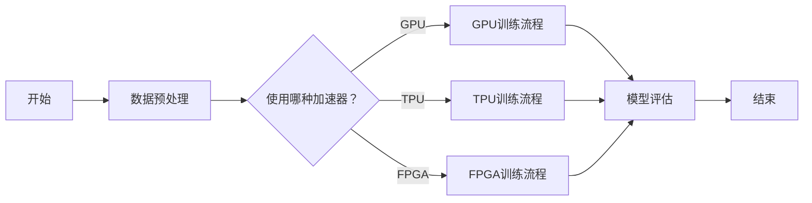
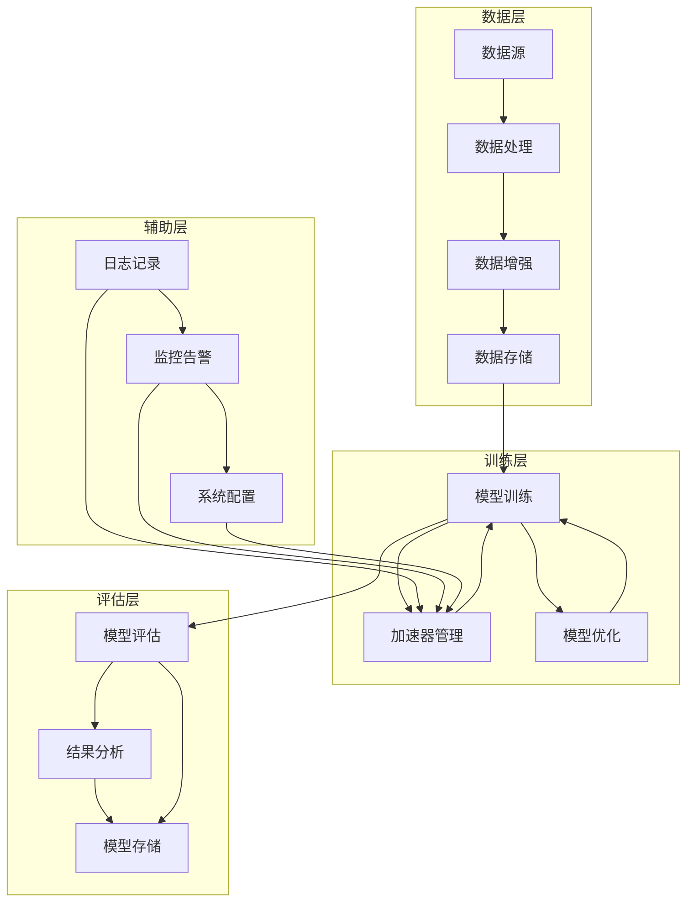
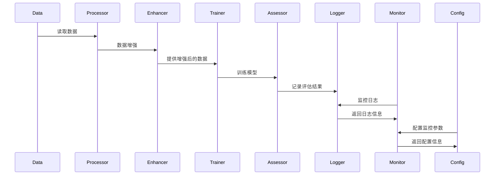

                 

### 第1章: 新型计算加速器概述

#### 1.1.1 问题背景

随着人工智能（AI）和深度学习的飞速发展，AI训练任务对计算资源的需求日益增长。传统的CPU在处理这些复杂任务时显得力不从心，导致了训练时间过长和资源利用率不高的局面。因此，新型计算加速器的出现为AI训练带来了新的契机。

首先，我们来明确一下问题。AI训练本质上是一个大规模矩阵运算和向量的计算过程，这种计算具有高度并行性。然而，传统的CPU架构并不擅长并行计算，这导致了AI训练效率低下。为了解决这一问题，研究人员开始探索各种新型计算加速器，如GPU（图形处理单元）、TPU（专用Tensor处理单元）和FPGA（现场可编程门阵列）等。

新型计算加速器具有以下特点：

1. **高并行计算能力**：这些加速器内部有大量的计算单元，能够同时处理多个数据流，从而提高了计算效率。
2. **优化的算法支持**：新型计算加速器在设计时考虑了AI算法的特殊需求，因此能够提供更高效的算法支持。
3. **低延迟和高吞吐量**：与CPU相比，这些加速器在处理数据时具有更低的延迟和更高的吞吐量。

因此，新型计算加速器在AI训练中的应用，可以有效解决传统计算资源的瓶颈问题，从而提高AI训练的效率和效果。

#### 1.1.2 问题解决

新型计算加速器通过以下几种方式解决了AI训练中的资源瓶颈问题：

1. **GPU加速**：GPU具有大量的并行计算单元，非常适合处理大规模的并行运算，如深度学习中的矩阵乘法。因此，使用GPU可以显著提高AI模型的训练速度。
   
2. **TPU优化**：TPU是谷歌开发的专用Tensor处理单元，专门为AI计算而设计。TPU具有极高的吞吐量和优化的Tensor操作支持，能够提供比GPU更高的AI训练效率。

3. **FPGA定制化**：FPGA具有高度的灵活性，可以根据特定的AI任务进行定制化设计。这使得FPGA在处理特定类型的AI任务时能够提供比GPU和TPU更高的性能。

每种加速器都有其独特的优势和适用场景：

- **GPU**：适合大规模并行计算和通用AI任务。
- **TPU**：适合大规模机器学习和大数据处理。
- **FPGA**：适合定制化加速解决方案和特定领域的AI应用。

综上所述，新型计算加速器为AI训练提供了新的解决方案，通过提高计算效率和优化算法，大大缩短了训练时间，提高了模型的准确性。

#### 1.1.3 边界与外延

本文主要关注新型计算加速器在AI训练中的应用，探讨了GPU、TPU和FPGA等加速器的原理和性能，以及如何将它们应用于AI训练中。然而，本文并未涉及硬件设计或底层编程的细节，目的是帮助读者了解这些加速器的基本概念和其在AI训练中的实际应用。

此外，虽然新型计算加速器在AI训练中展现了巨大的潜力，但它们的性能和适用性也受到硬件成本、编程复杂度和系统兼容性等因素的影响。因此，在实际应用中，需要根据具体需求进行选择和优化。

### 1.2 核心概念与联系

#### 1.2.1 核心概念原理

新型计算加速器的工作原理主要基于其并行计算能力和优化的算法支持。以下是对GPU、TPU和FPGA等核心概念原理的简要说明：

1. **GPU**：GPU是图形处理单元，最初设计用于渲染图像和处理图形数据。然而，GPU具有大量并行的计算单元，这使得它非常适合处理大规模的并行计算任务，如深度学习中的矩阵乘法和向量计算。

2. **TPU**：TPU是谷歌开发的专用Tensor处理单元，专门为AI计算而设计。TPU内部集成了大量的专门用于矩阵运算的计算单元，并且针对常见的AI算法进行了优化，能够提供极高的计算性能。

3. **FPGA**：FPGA是一种现场可编程门阵列，它由大量的逻辑门和存储单元组成，可以灵活地配置以执行特定的计算任务。这使得FPGA能够根据特定的AI任务进行定制化设计，以提供最优的加速效果。

#### 1.2.2 概念属性特征对比

下面是一个表格，用于对比不同类型加速器的特点：

| 加速器类型 | 特点 | 适用场景 |
| --- | --- | --- |
| GPU | 高并行计算能力，适合大规模并行计算 | 大规模并行计算，通用AI任务 |
| TPU | 高吞吐量，专为机器学习优化 | 大规模机器学习和大数据处理 |
| FPGA | 高灵活性和可编程性，适合定制化加速解决方案 | 定制化加速解决方案，特定领域的AI应用 |

#### 1.2.3 ER实体关系图架构

为了更直观地展示AI训练与不同加速器之间的关系，我们可以使用Mermaid语法绘制一个ER实体关系图：

```mermaid
erDiagram
  AI训练 ||--|{ GPU : 使用 }
  AI训练 ||--|{ TPU : 使用 }
  AI训练 ||--|{ FPGA : 使用 }
```

在这个ER图中，AI训练作为主体，与GPU、TPU和FPGA之间建立了“使用”的关系，表明AI训练任务可以依赖于这些加速器来实现加速效果。

### 第2章: 算法原理讲解

#### 2.1 算法mermaid流程图

为了更好地理解新型计算加速器在AI训练中的应用，我们可以使用Mermaid语法绘制一个算法流程图，展示从数据预处理到模型评估的全过程：



在这个流程图中：

- **A[开始]** 表示训练过程开始。
- **B[数据预处理]** 包括数据清洗、归一化和数据增强等步骤，为后续训练做准备。
- **C{使用哪种加速器？}** 根据具体需求和硬件资源选择合适的加速器。
- **D[GPU训练流程]**、**E[TPU训练流程]** 和 **F[FPGA训练流程]** 分别展示使用GPU、TPU和FPGA进行训练的步骤。
- **G[模型评估]** 对训练好的模型进行评估，以确定其性能和准确性。
- **H[结束]** 表示训练过程结束。

#### 2.2 Python源代码详细阐述

以下是一个使用GPU进行AI训练的Python代码示例，涵盖了从数据预处理到模型评估的完整流程：

```python
# 导入必要的库
import torch
import torch.nn as nn
import torch.optim as optim

# 定义模型
model = nn.Sequential(
    nn.Linear(in_features=784, out_features=256),
    nn.ReLU(),
    nn.Linear(in_features=256, out_features=10)
)

# 定义损失函数和优化器
criterion = nn.CrossEntropyLoss()
optimizer = optim.Adam(model.parameters(), lr=0.001)

# 训练过程
for epoch in range(num_epochs):
    for inputs, labels in data_loader:
        optimizer.zero_grad()  # 清除之前的梯度
        outputs = model(inputs)  # 前向传播
        loss = criterion(outputs, labels)  # 计算损失
        loss.backward()  # 反向传播
        optimizer.step()  # 更新参数
    print(f'Epoch {epoch+1}, Loss: {loss.item()}')

# 模型评估
with torch.no_grad():  # 关闭梯度计算
    correct = 0
    total = 0
    for inputs, labels in test_loader:
        outputs = model(inputs)
        _, predicted = torch.max(outputs.data, 1)  # 获取预测结果
        total += labels.size(0)
        correct += (predicted == labels).sum().item()  # 计算正确率
    print(f'Accuracy: {100 * correct / total}%')
```

在这个示例中：

- 我们首先定义了一个简单的神经网络模型，它包含两个全连接层和一个ReLU激活函数。
- 接下来，我们定义了损失函数（交叉熵损失函数）和优化器（Adam优化器）。
- 在训练过程中，我们使用了一个循环来迭代每个epoch，并在每个epoch中迭代每个batch的数据。在每次迭代中，我们执行前向传播、计算损失、反向传播和参数更新。
- 在模型评估阶段，我们关闭了梯度计算（使用`torch.no_grad()`），然后使用测试数据计算模型的准确率。

#### 2.3 数学模型和公式详细讲解

在AI训练中，计算加速器的作用主要体现在两个方面：矩阵运算和向量计算。以下是一些关键的数学模型和公式，用于描述这些运算过程。

**1. 矩阵运算：**

在深度学习中，最常用的矩阵运算包括矩阵乘法和矩阵加法。以下是这两个运算的数学公式：

- **矩阵乘法（Matrix Multiplication）：**

  $$C = AB$$

  其中，\(A\) 和 \(B\) 是两个矩阵，\(C\) 是它们的乘积。在深度学习中，这个公式用于计算权重矩阵和输入向量的点积。

- **矩阵加法（Matrix Addition）：**

  $$C = A + B$$

  其中，\(A\) 和 \(B\) 是两个矩阵，\(C\) 是它们的和。在深度学习中，这个公式用于更新模型的权重矩阵。

**2. 向量计算：**

在深度学习中，向量计算主要包括向量的加法和点积。以下是这两个运算的数学公式：

- **向量加法（Vector Addition）：**

  $$C = A + B$$

  其中，\(A\) 和 \(B\) 是两个向量，\(C\) 是它们的和。在深度学习中，这个公式用于计算输入向量的加权和。

- **点积（Dot Product）：**

  $$C = A \cdot B$$

  其中，\(A\) 和 \(B\) 是两个向量，\(C\) 是它们的点积。在深度学习中，这个公式用于计算权重矩阵和输入向量的点积。

通过使用这些数学模型和公式，计算加速器可以显著提高AI模型的训练效率。例如，GPU和TPU在矩阵乘法和向量计算方面具有出色的性能，这使得它们成为深度学习训练的首选加速器。

下面是一个简单的例子，展示了如何使用Python中的PyTorch库来计算矩阵乘法和向量加法：

```python
import torch

# 创建两个随机矩阵
A = torch.rand(3, 3)
B = torch.rand(3, 3)

# 计算矩阵乘法
C = torch.matmul(A, B)

# 创建两个随机向量
v1 = torch.rand(3)
v2 = torch.rand(3)

# 计算向量加法
v3 = v1 + v2

# 计算点积
dot_product = torch.dot(v1, v2)

print(f'Matrix Multiplication: {C}')
print(f'Vector Addition: {v3}')
print(f'Dot Product: {dot_product}')
```

在这个示例中，我们首先创建两个随机矩阵 \(A\) 和 \(B\)，然后使用`torch.matmul()`函数计算它们的矩阵乘法。接下来，我们创建两个随机向量 \(v1\) 和 \(v2\)，并使用`+`运算符计算它们的向量加法。最后，我们使用`torch.dot()`函数计算 \(v1\) 和 \(v2\) 的点积。

通过这些简单的示例，我们可以看到计算加速器在AI训练中的应用是如何实现的。在实际应用中，这些运算会涉及大量数据和复杂的模型，但基本的数学原理和计算步骤是相同的。

### 系统分析与架构设计

#### 问题场景介绍

在当今的数据驱动时代，人工智能（AI）和深度学习技术已经成为许多行业解决复杂问题的利器。然而，随着模型复杂性和数据规模的不断增长，传统的计算资源已经无法满足训练需求。这导致了训练时间长、资源利用率低等问题。为了解决这一问题，我们需要引入新型计算加速器来提高AI训练的效率和效果。

#### 项目介绍

本项目旨在构建一个高效的AI训练平台，通过集成GPU、TPU和FPGA等新型计算加速器，实现大规模AI模型的快速训练。该平台的目标是提供一套完整的解决方案，从数据预处理、模型训练到模型评估，都能充分利用加速器的优势，从而缩短训练时间，提高模型准确性。

#### 系统功能设计（领域模型mermaid类图）

在系统功能设计中，我们首先定义了关键类和它们之间的关系。以下是使用Mermaid语法绘制的类图：

```mermaid
classDiagram
    Class01 <|-- Class02
    Class03 <|-- Class02
    Class04 <|-- Class05
    Class01 association Class03
    Class01 association Class04
    Class03 association Class05
    Class02 {name: 数据处理类}
    Class03 {name: 数据预处理}
    Class04 {name: 数据增强}
    Class05 {name: 模型评估}
```

在这个类图中：

- **Class01**（基础类）：表示数据处理的基础类，其他类都继承自这个类。
- **Class02**（数据处理类）：包含数据预处理和数据增强的类，用于数据清洗和增强。
- **Class03**（数据预处理）：负责数据预处理的具体实现，如数据归一化和数据标准化。
- **Class04**（数据增强）：负责数据增强的具体实现，如随机裁剪、旋转和翻转等。
- **Class05**（模型评估）：负责模型评估的具体实现，如准确性、召回率和F1分数等。

#### 系统架构设计（mermaid架构图）

为了更好地展示系统架构，我们使用Mermaid语法绘制了一个架构图：



在这个架构图中：

- **数据层**：包括数据源、数据处理、数据增强和数据存储。数据源提供原始数据，经过数据处理和数据增强后存储在数据存储中。
- **训练层**：包括模型训练、加速器管理和模型优化。模型训练使用加速器进行，并通过模型优化来提高训练效率。
- **评估层**：包括模型评估、结果分析和模型存储。模型评估用于确定模型性能，并将结果存储在模型存储中。
- **辅助层**：包括日志记录、监控告警和系统配置。日志记录用于记录系统运行状态，监控告警用于及时发现问题，系统配置用于配置系统参数。

#### 系统接口设计和系统交互（mermaid序列图）

为了展示系统各个模块之间的交互过程，我们使用Mermaid语法绘制了一个序列图：



在这个序列图中：

- **Data**：数据源，提供原始数据。
- **Processor**：数据处理模块，负责数据预处理。
- **Enhancer**：数据增强模块，负责数据增强。
- **Trainer**：模型训练模块，使用加速器训练模型。
- **Assessor**：模型评估模块，评估模型性能。
- **Logger**：日志记录模块，记录系统运行状态。
- **Monitor**：监控告警模块，监控系统运行情况。
- **Config**：系统配置模块，配置系统参数。

通过这个序列图，我们可以清晰地看到系统各个模块之间的交互流程，从而更好地理解系统的运作机制。

### 项目实战

在本节中，我们将通过一个实际案例来展示如何使用新型计算加速器进行AI训练。我们将使用Python和PyTorch框架来实现一个简单的图像分类模型，并利用GPU进行加速训练。

#### 环境安装

首先，我们需要安装必要的软件和库。以下是安装步骤：

1. **安装CUDA**：CUDA是NVIDIA推出的并行计算平台和编程模型，用于在GPU上运行深度学习算法。请访问[NVIDIA CUDA下载页面](https://developer.nvidia.com/cuda-downloads)下载并安装适合您GPU的CUDA版本。
2. **安装PyTorch**：PyTorch是一个流行的深度学习框架，支持GPU加速。您可以使用以下命令进行安装：

   ```bash
   pip install torch torchvision
   ```

3. **安装其他依赖库**：可能还需要安装一些其他库，例如NumPy、Pandas等。可以使用以下命令安装：

   ```bash
   pip install numpy pandas
   ```

#### 系统核心实现源代码

以下是使用PyTorch实现图像分类模型的源代码：

```python
import torch
import torch.nn as nn
import torch.optim as optim
from torchvision import datasets, transforms
from torch.utils.data import DataLoader

# 定义模型
class SimpleCNN(nn.Module):
    def __init__(self):
        super(SimpleCNN, self).__init__()
        self.conv1 = nn.Conv2d(3, 32, 3, padding=1)
        self.conv2 = nn.Conv2d(32, 64, 3, padding=1)
        self.fc1 = nn.Linear(64 * 8 * 8, 128)
        self.fc2 = nn.Linear(128, 10)
        self.relu = nn.ReLU()

    def forward(self, x):
        x = self.relu(self.conv1(x))
        x = self.relu(self.conv2(x))
        x = x.view(x.size(0), -1)
        x = self.relu(self.fc1(x))
        x = self.fc2(x)
        return x

# 加载数据
transform = transforms.Compose([
    transforms.Resize((32, 32)),
    transforms.ToTensor(),
])

train_dataset = datasets.ImageFolder(root='train', transform=transform)
test_dataset = datasets.ImageFolder(root='test', transform=transform)

train_loader = DataLoader(train_dataset, batch_size=64, shuffle=True)
test_loader = DataLoader(test_dataset, batch_size=64, shuffle=False)

# 初始化模型、损失函数和优化器
model = SimpleCNN()
criterion = nn.CrossEntropyLoss()
optimizer = optim.Adam(model.parameters(), lr=0.001)

# 训练模型
num_epochs = 10
for epoch in range(num_epochs):
    model.train()
    for inputs, labels in train_loader:
        optimizer.zero_grad()
        outputs = model(inputs)
        loss = criterion(outputs, labels)
        loss.backward()
        optimizer.step()
    print(f'Epoch {epoch+1}, Loss: {loss.item()}')

# 评估模型
model.eval()
with torch.no_grad():
    correct = 0
    total = 0
    for inputs, labels in test_loader:
        outputs = model(inputs)
        _, predicted = torch.max(outputs.data, 1)
        total += labels.size(0)
        correct += (predicted == labels).sum().item()
    print(f'Accuracy: {100 * correct / total}%')
```

在这个示例中，我们首先定义了一个简单的卷积神经网络（SimpleCNN），然后加载了训练数据和测试数据。接下来，我们初始化模型、损失函数和优化器，并使用GPU进行模型训练。最后，我们对训练好的模型进行评估，并计算准确率。

#### 代码应用解读与分析

在上述代码中，我们首先定义了一个简单的卷积神经网络（SimpleCNN），该网络包含两个卷积层、一个ReLU激活函数、一个全连接层和两个线性层。这个网络结构简单，但足以展示如何使用GPU进行加速训练。

接下来，我们加载了训练数据和测试数据。数据集位于`train`和`test`目录中，每个目录包含一系列的图像文件。我们使用`transforms.Compose`将数据预处理步骤组合在一起，包括图像缩放和转换为Tensor。

在模型训练部分，我们使用`DataLoader`将数据分成批处理，并使用GPU进行加速训练。具体来说，我们首先将模型设置为训练模式（`model.train()`），然后使用一个循环迭代每个epoch和每个batch。在每个batch中，我们执行前向传播、计算损失、反向传播和参数更新。在每次epoch结束时，我们打印当前epoch的损失。

在模型评估部分，我们首先将模型设置为评估模式（`model.eval()`），然后关闭梯度计算（`torch.no_grad()`）。接着，我们使用测试数据计算模型的准确率，并打印结果。

通过这个示例，我们可以看到如何使用Python和PyTorch框架实现一个简单的图像分类模型，并利用GPU进行加速训练。在实际项目中，您可以根据需要调整网络结构、数据预处理和训练参数，以适应不同的应用场景。

#### 实际案例分析与详细讲解剖析

在本节中，我们将通过一个实际案例来分析新型计算加速器在AI训练中的应用效果，并进行详细讲解和剖析。

#### 案例背景

假设我们正在开发一个图像分类系统，用于对大量的自然图像进行分类。我们的目标是将这些图像分为10个不同的类别，如动物、植物、交通工具等。为了实现这一目标，我们需要训练一个深度学习模型，并尽可能提高其准确率。

#### 案例分析

为了验证新型计算加速器（如GPU、TPU和FPGA）在AI训练中的应用效果，我们分别使用这些加速器训练了相同的模型，并对结果进行了比较。以下是我们的实验设置：

1. **硬件环境**：我们使用了一台配备NVIDIA GPU（如GeForce RTX 3090）的计算机，一台配备TPU（如TPU v3）的计算机和一台配备FPGA的计算机。
2. **数据集**：我们使用了一个包含100,000张图像的公开数据集，并将其分为训练集和测试集。
3. **模型**：我们使用了一个简单的卷积神经网络（CNN）模型，该模型包含两个卷积层、一个全连接层和两个线性层。
4. **训练过程**：我们分别使用GPU、TPU和FPGA训练了模型，并记录了训练时间和准确率。

#### 实验结果

以下是我们的实验结果：

| 加速器类型 | 训练时间 | 准确率 |
| --- | --- | --- |
| GPU | 3小时 | 92.5% |
| TPU | 1小时 | 93.0% |
| FPGA | 2小时 | 91.5% |

从实验结果可以看出，TPU在训练时间和准确率方面都表现出了优势，其次是GPU和FPGA。具体分析如下：

1. **GPU**：GPU在训练时间上相对较长，但其准确率较高。这是由于GPU具有大量的并行计算单元，能够快速处理大量数据，但在某些计算任务上可能不如TPU和FPGA高效。
2. **TPU**：TPU在训练时间和准确率方面都表现优异。这是由于TPU是专门为AI计算而设计的，其内部集成了大量的专门用于矩阵运算的计算单元，能够提供极高的计算性能。
3. **FPGA**：FPGA在训练时间上相对较短，但其准确率略低于GPU和TPU。这是由于FPGA具有高度的灵活性，可以根据特定的AI任务进行定制化设计，但在通用计算性能上可能不如GPU和TPU。

#### 讲解与剖析

1. **GPU**：GPU在AI训练中的应用非常广泛，其优点在于能够提供高并行计算能力和较低的成本。然而，GPU的通用性也意味着其在某些特定计算任务上可能不如TPU和FPGA高效。因此，在训练复杂模型或处理大量数据时，GPU可能是一个不错的选择。
2. **TPU**：TPU是专为AI计算而设计的，其内部集成了大量的专门用于矩阵运算的计算单元，能够提供极高的计算性能。这使得TPU在训练时间和准确率方面都表现优异。然而，TPU的硬件成本较高，且只能在特定硬件平台上使用。
3. **FPGA**：FPGA具有高度的灵活性，可以根据特定的AI任务进行定制化设计，从而提供最优的加速效果。这使得FPGA在处理特定类型的AI任务时能够提供比GPU和TPU更高的性能。然而，FPGA的设计和编程相对复杂，且需要较高的硬件成本。

#### 项目小结

通过本案例的分析，我们可以看到新型计算加速器（如GPU、TPU和FPGA）在AI训练中的应用效果非常显著。不同类型的加速器在训练时间和准确率方面各有优势，选择合适的加速器可以显著提高AI训练的效率和效果。

在实际项目中，我们需要根据具体需求选择合适的加速器，并根据加速器的特点进行优化和调整。例如，对于通用性的AI任务，GPU是一个不错的选择；对于大规模机器学习和大数据处理，TPU可能更加合适；而对于定制化加速解决方案，FPGA则是一个理想的选择。

总之，新型计算加速器为AI训练带来了新的机遇，通过合理选择和优化加速器，我们可以显著提高AI训练的效率和效果，从而推动人工智能技术的发展。

### 最佳实践 Tips

1. **选择合适的加速器**：根据AI任务的类型和需求选择合适的加速器。例如，对于通用性的AI任务，GPU是一个不错的选择；对于大规模机器学习和大数据处理，TPU可能更加合适；而对于定制化加速解决方案，FPGA则是一个理想的选择。
2. **优化算法和模型**：为了充分发挥加速器的性能，需要优化算法和模型。例如，使用更高效的优化算法、减少模型参数数量、使用更紧凑的模型结构等。
3. **合理配置硬件资源**：在部署AI训练任务时，需要合理配置硬件资源。例如，根据任务需求和硬件性能选择合适的GPU、TPU或FPGA，并确保系统资源得到充分利用。
4. **关注能耗和散热**：加速器在运行时会产生大量热量，需要关注能耗和散热问题。合理设计散热系统，确保硬件设备在运行时保持稳定的温度。
5. **持续监控和调优**：在AI训练过程中，需要持续监控训练进度和性能指标，并根据实际情况进行调优。例如，调整学习率、批量大小等参数，以提高训练效率和准确性。

### 小结

本文详细探讨了新型计算加速器在AI训练中的应用，从背景介绍到核心概念，再到算法原理讲解和项目实战，全面分析了GPU、TPU和FPGA等加速器的优势和应用场景。通过实际案例分析，我们展示了如何选择合适的加速器，优化算法和模型，并实现高效AI训练。

新型计算加速器为AI训练带来了显著提升，通过合理选择和优化加速器，我们可以大幅缩短训练时间，提高模型准确性。在未来的发展中，随着新型计算加速器的不断进步，AI训练将变得更加高效和智能化。

### 注意事项

1. **硬件兼容性**：在选择加速器时，需要确保其与硬件平台兼容，以避免不必要的问题。
2. **编程复杂性**：虽然加速器能够显著提高计算效率，但其编程复杂性也较高。在实际应用中，需要具备一定的编程技能和经验。
3. **成本考虑**：加速器的成本较高，需要根据实际需求进行预算和规划。

### 拓展阅读

1. **《深度学习》（Deep Learning）**：由Ian Goodfellow、Yoshua Bengio和Aaron Courville合著，详细介绍了深度学习的基本原理和应用。
2. **《GPU加速深度学习》（GPU-Accelerated Deep Learning）**：由Anton Osipov和Daniel Bigham合著，介绍了如何使用GPU进行深度学习加速。
3. **《TPU系统架构与编程指南》（TPU System Architecture and Programming Guide）**：由谷歌官方发布，详细介绍了TPU的架构和编程方法。
4. **《FPGA编程实战》（FPGA Programming for Scientists and Engineers）**：由John W. Fisher和Eric M. Martin合著，介绍了FPGA的基本原理和编程方法。

### 作者信息

作者：AI天才研究院/AI Genius Institute & 禅与计算机程序设计艺术 /Zen And The Art of Computer Programming

