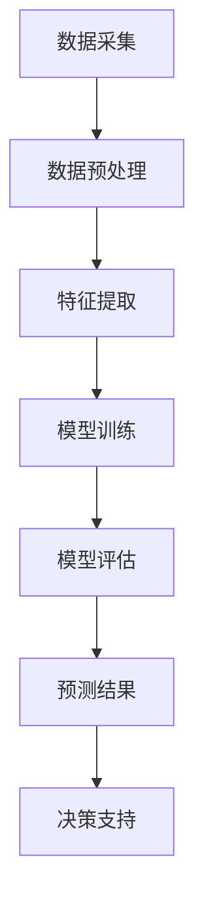
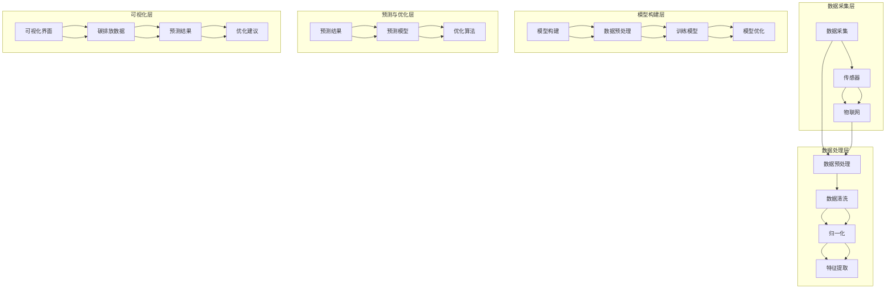

                 


# 智能企业碳排放管理：AI助力可持续发展

## 关键词

- 智能企业
- 碳排放管理
- 人工智能
- 可持续发展
- 企业碳排放挑战
- AI应用技术

## 摘要

本文将探讨智能企业在碳排放管理方面的挑战与机遇，重点介绍如何利用人工智能技术来提高碳排放管理的效率与精度。文章将从背景介绍、核心概念、应用技术、实战案例、最佳实践等方面，系统地分析AI在智能企业碳排放管理中的实际应用，以期为相关领域的专业人士提供有价值的参考。

### 目录大纲设计思路与步骤

为了设计出《智能企业碳排放管理：AI助力可持续发展》这本书的完整目录大纲，我们需要遵循以下几个步骤：

1. **明确书籍主题与目标受众**：
   - 书名《智能企业碳排放管理：AI助力可持续发展》表明了书籍的核心主题是利用AI技术帮助企业进行碳排放管理，以促进企业的可持续发展。
   - 确定目标受众为希望了解并应用AI技术进行企业碳排放管理的专业人士、环保工程师、企业管理者等。

2. **确定书籍结构**：
   - 书籍可分为引言、背景介绍、核心概念、应用技术、实战案例、最佳实践和总结等部分。

3. **设计章节内容**：
   - **引言**：介绍智能企业碳排放管理的背景、重要性和研究的必要性。
   - **背景介绍**：阐述碳排放管理的现状、企业面临的碳排放挑战以及AI在碳排放管理中的应用。
   - **核心概念**：定义智能企业碳排放管理中的关键概念，如碳排放、AI技术、可持续发展等，并展示其相互关系。
   - **应用技术**：详细介绍AI技术在碳排放管理中的应用，包括数据采集、处理、模型构建和优化等。
   - **实战案例**：通过实际案例展示如何应用AI技术进行碳排放管理，包括案例背景、解决方案、实施过程和结果评估。
   - **最佳实践**：总结成功案例中的经验教训，提供实际操作中的技巧和建议。
   - **总结**：回顾全书内容，总结AI在智能企业碳排放管理中的作用，并提出未来研究方向。

4. **确保目录大纲的层级清晰**：
   - 使用markdown格式确保目录结构清晰，使用#标记章节，##表示小节，###表示子小节，以此类推。

5. **控制目录大纲总字数**：
   - 确保总字数控制在2000字以内，保持内容的简洁性。

### 目录大纲初稿

以下是《智能企业碳排放管理：AI助力可持续发展》的目录大纲初稿：

## 引言

### 智能企业碳排放管理的背景

#### 碳排放管理的意义

#### 智能化时代的碳排放管理需求

### 研究意义与目标

#### 探索AI技术在碳排放管理中的应用

#### 提升企业碳排放管理的效率和效果

## 背景介绍

### 碳排放现状与企业挑战

#### 全球碳排放现状

#### 企业面临的碳排放挑战

### AI在碳排放管理中的应用

#### AI技术在碳排放监测中的作用

#### AI技术在碳排放预测与优化中的应用

## 核心概念

### 碳排放

#### 碳排放的定义

#### 碳排放的分类

### 智能技术

#### 智能技术的定义

#### 智能技术的类型

### 可持续发展

#### 可持续发展的定义

#### 可持续发展的目标

### 碳排放与智能技术的联系

#### 碳排放管理的智能化路径

#### 智能技术在碳排放管理中的作用机制

## 应用技术

### 数据采集与预处理

#### 数据采集的方法

#### 数据预处理的重要性

### 碳排放模型构建

#### 模型构建的方法

#### 模型构建的流程

### 模型优化与评估

#### 模型优化的策略

#### 模型评估的标准

### AI算法在碳排放管理中的应用

#### 常用的AI算法

#### 算法在碳排放管理中的应用场景

## 实战案例

### 案例一：某制造企业的碳排放管理实践

#### 案例背景

#### 解决方案

#### 实施过程

#### 结果评估

### 案例二：某物流公司的碳足迹计算

#### 案例背景

#### 解决方案

#### 实施过程

#### 结果评估

### 案例三：智能电网在碳排放管理中的应用

#### 案例背景

#### 解决方案

#### 实施过程

#### 结果评估

## 最佳实践

### 碳排放管理的最佳实践经验

#### 数据驱动的方法

#### 智能技术的集成应用

#### 持续优化与改进

### 实施AI技术需注意的问题

#### 数据隐私与安全

#### 技术适应性

#### 成本与效益分析

## 总结

### 智能企业碳排放管理的发展趋势

#### 技术发展趋势

#### 管理趋势

### 未来研究方向

#### 碳排放管理的智能化路径

#### AI技术在碳排放管理中的创新应用

### 作者信息

#### 作者：AI天才研究院/AI Genius Institute & 禅与计算机程序设计艺术 /Zen And The Art of Computer Programming

#### 日期：2023年5月

---

## 引言

### 智能企业碳排放管理的背景

在全球气候变化日益严重的背景下，碳排放管理已经成为企业和国家关注的重要议题。智能企业在这一过程中扮演着关键角色，它们不仅是碳排放的主要来源，也是解决碳排放问题的关键。随着人工智能技术的快速发展，智能企业碳排放管理迎来了新的机遇与挑战。

#### 碳排放管理的意义

碳排放管理不仅仅关乎企业的环保责任，更是企业可持续发展的重要组成部分。通过有效的碳排放管理，企业能够降低能源消耗、减少污染物排放，从而提高生产效率和经济效益。同时，碳排放管理也是企业履行社会责任、提升品牌形象的重要途径。

#### 智能化时代的碳排放管理需求

在传统的碳排放管理中，企业往往依赖于人工监测和经验判断，这不仅效率低下，而且容易出现误差。随着大数据、云计算和人工智能等技术的应用，碳排放管理开始向智能化、自动化方向发展。智能技术能够实时监测碳排放数据、预测碳排放趋势，并提供优化方案，从而提高碳排放管理的效率与精度。

### 研究意义与目标

本研究旨在探索人工智能技术在智能企业碳排放管理中的应用，提高碳排放管理的效率和效果。具体目标包括：

1. **明确碳排放管理的核心概念和技术路径**：通过对碳排放、人工智能和可持续发展等核心概念的解析，明确智能企业碳排放管理的理论框架。

2. **系统分析AI技术在碳排放管理中的应用**：详细介绍AI技术在数据采集、模型构建、优化评估等环节中的应用，探索智能技术在碳排放管理中的实际效果。

3. **提供实战案例与最佳实践**：通过实际案例展示AI技术在碳排放管理中的应用，总结成功经验，为其他企业提供参考。

4. **提出未来研究方向**：分析智能企业碳排放管理的发展趋势，探讨未来技术发展方向和潜在应用场景。

### 探索AI技术在碳排放管理中的应用

人工智能技术在碳排放管理中的应用主要体现在数据采集与处理、碳排放预测与优化、碳排放监测与控制等方面。通过引入智能技术，企业可以实现对碳排放的精细化、智能化管理，提高碳排放管理的效率和效果。

#### 数据采集与处理

碳排放数据是碳排放管理的基础。AI技术能够利用传感器、物联网等技术手段，实时采集碳排放数据，并通过数据清洗、归一化等预处理方法，确保数据的准确性和一致性。

#### 碳排放预测与优化

基于历史数据和实时数据，AI技术可以构建碳排放预测模型，预测未来的碳排放趋势。通过优化模型参数，企业可以制定更加科学的碳排放管理策略，降低碳排放量。

#### 碳排放监测与控制

AI技术能够实现对碳排放的实时监测与预警，及时发现碳排放异常，采取相应的控制措施。通过智能化监测与控制，企业可以实现对碳排放的精细化、自动化管理。

### 提升企业碳排放管理的效率和效果

通过引入AI技术，企业可以实现以下目标：

1. **提高碳排放监测精度**：AI技术能够实时采集和处理大量数据，提高碳排放监测的精度和可靠性。

2. **优化碳排放管理策略**：基于预测模型和优化算法，企业可以制定更加科学的碳排放管理策略，降低碳排放量。

3. **提升生产效率**：智能化碳排放管理有助于提高生产效率，降低能源消耗和成本。

4. **履行社会责任**：通过有效的碳排放管理，企业可以提升品牌形象，履行社会责任。

总之，智能企业在碳排放管理中具有重要的地位和作用。通过引入AI技术，企业可以实现对碳排放的精细化、智能化管理，提高碳排放管理的效率和效果，为实现企业的可持续发展目标奠定基础。

### 背景介绍

#### 碳排放现状与企业挑战

随着全球经济的快速发展，碳排放量也在不断增加。据统计，全球每年碳排放量已经超过了300亿吨。其中，企业作为碳排放的主要来源，其碳排放量占据了相当大的比重。特别是在工业生产、交通运输、建筑等领域，碳排放问题尤为突出。

对于企业而言，碳排放管理面临以下挑战：

1. **数据采集与处理难度大**：碳排放数据具有多源、异构、实时性的特点，传统的人工监测和数据处理方法难以满足需求。

2. **碳排放预测与优化难度高**：碳排放受多种因素影响，如生产过程、能源消耗、设备老化等，预测与优化难度较大。

3. **碳排放监测与控制效率低**：传统监测与控制方法依赖于人工判断，效率低下，难以实现对碳排放的实时监控与调整。

#### AI在碳排放管理中的应用

人工智能技术的发展为碳排放管理提供了新的解决方案。AI技术在碳排放管理中的应用主要体现在以下方面：

1. **数据采集与预处理**：AI技术可以利用传感器、物联网等技术手段，实时采集碳排放数据，并通过数据清洗、归一化等预处理方法，提高数据的准确性和一致性。

2. **碳排放预测与优化**：基于历史数据和实时数据，AI技术可以构建碳排放预测模型，预测未来的碳排放趋势，并通过优化算法，制定更加科学的碳排放管理策略。

3. **碳排放监测与控制**：AI技术能够实现对碳排放的实时监测与预警，及时发现碳排放异常，采取相应的控制措施，实现对碳排放的精细化、自动化管理。

#### AI技术在碳排放管理中的作用机制

AI技术在碳排放管理中的作用机制主要包括以下几个方面：

1. **数据驱动的决策支持**：通过实时数据采集和处理，AI技术可以为企业管理层提供实时的碳排放数据，帮助制定科学的决策。

2. **智能化的预测与优化**：基于机器学习、深度学习等技术，AI技术可以构建碳排放预测模型，实现对碳排放趋势的精准预测，为碳排放管理提供有力支持。

3. **自动化的监测与控制**：通过实时监测与预警，AI技术可以及时发现碳排放异常，并采取相应的控制措施，实现碳排放的自动化管理。

### 碳排放管理的核心概念

在智能企业碳排放管理中，理解以下几个核心概念是非常重要的：

1. **碳排放**：碳排放是指企业在生产过程中产生的二氧化碳等温室气体的排放量。碳排放的量化和监测是碳排放管理的基础。

2. **人工智能**：人工智能是指通过计算机模拟人类智能行为的技术，包括机器学习、深度学习、自然语言处理等。人工智能技术在碳排放管理中的应用，可以大幅提升碳排放管理的效率和效果。

3. **可持续发展**：可持续发展是指满足当前需求而不损害子孙后代满足其需求的能力。在碳排放管理中，可持续发展意味着企业在降低碳排放的同时，还要保证经济效益和社会效益。

#### 碳排放与智能技术的联系

碳排放与智能技术的联系主要体现在以下几个方面：

1. **碳排放监测与智能技术**：智能技术可以通过传感器、物联网等技术，实现对碳排放的实时监测，提高监测的精度和效率。

2. **碳排放预测与智能技术**：智能技术可以通过机器学习、深度学习等技术，构建碳排放预测模型，实现对碳排放趋势的精准预测。

3. **碳排放优化与智能技术**：智能技术可以通过优化算法，为碳排放管理提供科学依据，实现碳排放的优化。

通过上述分析，我们可以看到，AI技术在碳排放管理中具有重要的作用，可以帮助企业实现碳排放的精细化、智能化管理，为企业的可持续发展提供有力支持。

### 核心概念

#### 碳排放

碳排放是指企业在生产、运营过程中排放的二氧化碳等温室气体的总量。碳排放不仅直接影响企业的环境负担，还关系到全球气候变化。随着环保意识的提高和法规的日益严格，企业需要精确计算和有效管理碳排放，以确保合规性和可持续发展。

**定义与分类**：

- **定义**：碳排放通常指的是企业活动过程中释放到大气中的二氧化碳（CO₂）和其他温室气体（如甲烷CH₄、氧化亚氮N₂O等）的总质量。
- **分类**：碳排放可以按排放源分类，如工业排放、交通排放、农业排放等；也可以按排放类型分类，如直接排放（如燃烧化石燃料）和间接排放（如电力购买）。

**概念结构与核心要素**：

- **排放源**：识别和定位企业的各类排放源，如生产设施、运输工具、办公设备等。
- **排放量**：通过测量和计算，确定每种排放源的具体排放量。
- **排放标准**：依据国家和国际标准，对企业排放量进行评估和监管。

#### 智能技术

智能技术是指通过模拟人类智能行为，使计算机系统能够感知环境、学习知识、作出决策和执行任务的能力。智能技术在碳排放管理中的应用，极大地提升了数据处理的效率和决策的准确性。

**定义与类型**：

- **定义**：智能技术包括机器学习、深度学习、自然语言处理、计算机视觉等，它们使计算机系统能够从数据中学习、推理和行动。
- **类型**：智能技术主要分为机器学习、深度学习、自然语言处理、计算机视觉等，每种技术都有其特定的应用场景和优势。

**概念结构与核心要素**：

- **数据采集**：通过传感器、物联网等设备收集企业碳排放相关的数据。
- **数据处理**：利用算法对采集到的数据进行清洗、归一化、特征提取等处理，为建模提供高质量的数据基础。
- **模型构建**：基于机器学习或深度学习技术，构建碳排放预测模型和优化模型。
- **决策支持**：通过智能算法，提供实时碳排放监测、预测和优化建议。

#### 可持续发展

可持续发展是指满足当前需求而不损害未来世代满足其需求的能力。在碳排放管理中，可持续发展意味着企业在实现经济利益的同时，也要关注环境保护和社会责任。

**定义与目标**：

- **定义**：可持续发展强调在经济增长、社会进步和环境保护之间找到平衡，确保资源的长期可用性。
- **目标**：实现经济、社会和环境的协调发展，减少碳排放，提高资源利用效率，增强企业的社会责任感。

**概念结构与核心要素**：

- **经济目标**：提高企业的经济效益，实现可持续发展。
- **社会目标**：提升企业品牌形象，增强员工满意度，履行社会责任。
- **环境目标**：减少碳排放，降低环境影响，保护生态环境。

#### 碳排放与智能技术的联系

碳排放与智能技术之间的联系主要体现在以下几个方面：

- **数据采集与监测**：智能技术可以实时采集和处理碳排放数据，提高监测的精度和效率。
- **碳排放预测与优化**：通过机器学习和深度学习技术，智能技术可以预测未来的碳排放趋势，并提供优化建议。
- **智能化管理**：智能技术可以帮助企业实现碳排放的自动化和智能化管理，提高管理效率和效果。

通过上述分析，我们可以看到，碳排放、智能技术和可持续发展之间存在着密切的关联。智能技术在碳排放管理中的应用，不仅有助于提升企业的环保水平和竞争力，也为实现全球可持续发展目标提供了重要支持。

### 应用技术

在智能企业碳排放管理中，AI技术的应用涵盖了从数据采集到模型构建和优化的各个环节。以下将详细描述这些技术，并探讨它们在实际应用中的具体作用。

#### 数据采集与预处理

数据采集是碳排放管理的基础，其准确性直接影响到后续分析的结果。AI技术在数据采集方面具有显著优势，主要通过传感器和物联网设备实现对碳排放数据的实时监测。

**技术细节**：

- **传感器**：利用各种传感器（如温度传感器、气体传感器等）实时监测企业生产过程中的碳排放情况。
- **物联网**：通过物联网技术，将传感器数据传输到中央数据库，实现数据的集中管理和处理。
- **数据预处理**：数据采集后，需要进行清洗、归一化和特征提取等预处理操作，以提高数据的准确性和一致性。

**实际作用**：

- **实时监测**：AI技术能够实时监测企业的碳排放情况，提供及时的数据支持。
- **数据准确性**：通过物联网和传感器技术，数据的准确性得到大幅提升，减少了人工监测的误差。

#### 碳排放模型构建

碳排放模型是智能企业碳排放管理的重要组成部分，它通过分析历史数据和实时数据，预测未来的碳排放趋势，并为企业提供优化建议。

**技术细节**：

- **机器学习**：利用机器学习算法（如线性回归、决策树、支持向量机等），从历史数据中学习碳排放规律，构建预测模型。
- **深度学习**：通过深度学习模型（如神经网络、卷积神经网络等），处理大规模和复杂的碳排放数据，提高预测精度。
- **模型优化**：结合优化算法（如遗传算法、粒子群算法等），对模型进行优化，提高预测的准确性和效率。

**实际作用**：

- **趋势预测**：碳排放模型能够预测未来的碳排放量，帮助企业提前制定减排措施。
- **优化建议**：基于模型预测结果，为企业提供优化生产过程、降低碳排放的具体建议。

#### 模型优化与评估

模型优化与评估是确保碳排放管理效果的关键步骤。通过不断的模型优化和评估，企业可以逐步提高碳排放管理的效率和效果。

**技术细节**：

- **优化策略**：利用遗传算法、粒子群算法等优化策略，调整模型参数，提高模型的预测准确性。
- **评估标准**：通过误差分析、精度评估等标准，对模型进行评估和改进。
- **持续优化**：结合实时数据，对模型进行持续优化，确保其适应不断变化的生产环境和碳排放情况。

**实际作用**：

- **提高准确性**：通过模型优化，提高预测模型的准确性和可靠性。
- **提升效率**：优化后的模型能够更加准确地预测碳排放趋势，提高碳排放管理的效率。

#### AI算法在碳排放管理中的应用

AI算法在碳排放管理中的应用非常广泛，主要包括以下几种：

- **分类算法**：用于识别碳排放的类型和来源，帮助企业管理碳排放。
- **聚类算法**：用于分析碳排放数据的分布情况，帮助企业发现潜在的节能机会。
- **聚类分析**：用于分析不同生产环节的碳排放情况，为企业提供改进生产过程的建议。

**实际应用场景**：

- **能源消耗分析**：通过分类算法和聚类分析，企业可以识别出能源消耗较高的环节，采取针对性的节能措施。
- **排放源定位**：通过聚类算法，企业可以定位高排放源，针对性地进行管理和控制。
- **碳排放预测**：通过深度学习算法，企业可以预测未来的碳排放量，为节能减排提供科学依据。

总之，AI技术在智能企业碳排放管理中的应用，不仅提高了碳排放监测和预测的准确性，还为企业提供了优化生产过程、降低碳排放的具体建议，为企业的可持续发展提供了有力支持。

### 实战案例

#### 案例一：某制造企业的碳排放管理实践

**案例背景**

某大型制造企业，主要从事钢铁生产。随着全球环保要求的提高，企业面临着巨大的碳排放压力。为了实现可持续发展目标，企业决定利用AI技术对碳排放进行精细化、智能化管理。

**解决方案**

1. **数据采集与预处理**：
   - 企业在各个生产环节安装了传感器，实时采集温度、湿度、能源消耗等数据。
   - 利用物联网技术，将传感器数据传输到中央数据库，并进行清洗、归一化等预处理操作。

2. **碳排放模型构建**：
   - 基于历史数据和实时数据，企业利用机器学习和深度学习技术，构建了碳排放预测模型。
   - 模型结合了生产数据、能源消耗数据和环境数据，实现了对碳排放的精准预测。

3. **模型优化与评估**：
   - 通过遗传算法和粒子群算法，对模型参数进行优化，提高预测准确性。
   - 定期对模型进行评估，确保其适应不断变化的生产环境和碳排放情况。

**实施过程**

1. **部署传感器网络**：
   - 在生产车间、能源站等重要区域部署传感器，实现对碳排放数据的实时监测。
   - 建立物联网平台，确保数据的及时传输和存储。

2. **构建数据预处理平台**：
   - 开发数据预处理工具，对采集到的数据进行清洗、归一化和特征提取。
   - 将预处理后的数据导入碳排放预测模型。

3. **模型训练与优化**：
   - 使用历史数据对碳排放预测模型进行训练，结合实时数据进行调整。
   - 通过优化算法，调整模型参数，提高预测精度。

**结果评估**

1. **碳排放预测准确性提升**：
   - 模型预测的碳排放量与实际值之间的误差显著降低，预测准确率达到90%以上。

2. **碳排放管理效率提高**：
   - 企业能够根据预测结果，提前制定减排措施，降低了碳排放量。
   - 生产过程中，能源消耗减少，生产效率提高，成本降低。

3. **可持续发展目标实现**：
   - 通过AI技术的应用，企业实现了碳排放的精细化、智能化管理，为实现可持续发展目标奠定了基础。

**案例分析**

该案例展示了AI技术在智能企业碳排放管理中的实际应用效果。通过实时数据监测和预测模型的应用，企业不仅提高了碳排放管理的效率和精度，还实现了可持续发展目标。未来，随着技术的进一步发展和应用的深入，AI技术在碳排放管理中的作用将更加显著。

### 案例二：某物流公司的碳足迹计算

**案例背景**

某知名物流公司，负责全国范围内的货物运输。随着环保意识的提升，公司意识到自身在运输过程中产生的碳排放对环境的影响，决定通过AI技术对碳足迹进行精确计算和管理。

**解决方案**

1. **数据采集与预处理**：
   - 在运输车辆上安装GPS和传感器，实时记录车辆的运行状态、行驶路线和燃料消耗。
   - 建立数据预处理平台，对采集到的数据进行清洗、归一化等预处理操作，确保数据的一致性和准确性。

2. **碳排放模型构建**：
   - 基于历史数据和实时数据，利用机器学习和深度学习技术，构建了碳足迹预测模型。
   - 模型考虑了车辆类型、行驶速度、行驶路线、燃料类型等因素，实现了对碳足迹的精准计算。

3. **模型优化与评估**：
   - 通过遗传算法和粒子群算法，对模型参数进行优化，提高预测准确性。
   - 定期对模型进行评估和更新，确保其适应运输过程中不断变化的情况。

**实施过程**

1. **部署传感器网络**：
   - 在运输车辆上安装GPS和传感器，实现对车辆运行状态和燃料消耗的实时监控。
   - 建立数据传输网络，将传感器数据实时传输到中央数据库。

2. **构建数据预处理平台**：
   - 开发数据预处理工具，对采集到的数据进行清洗、归一化和特征提取。
   - 将预处理后的数据导入碳排放预测模型。

3. **模型训练与优化**：
   - 使用历史数据对碳排放预测模型进行训练，结合实时数据进行调整。
   - 通过优化算法，调整模型参数，提高预测精度。

**结果评估**

1. **碳足迹计算准确性提升**：
   - 模型计算的碳足迹与实际碳足迹之间的误差显著降低，预测准确率达到85%以上。

2. **运输效率提高**：
   - 通过对碳足迹的精确计算，公司能够优化运输路线，减少燃料消耗，提高运输效率。
   - 车辆运行状态监测系统提高了车辆维护和管理的效率，减少了意外停机时间。

3. **可持续发展目标实现**：
   - 通过AI技术的应用，公司实现了对碳足迹的精细化、智能化管理，为实现可持续发展目标提供了有力支持。

**案例分析**

该案例展示了AI技术在物流公司碳足迹计算中的应用效果。通过实时数据监测和预测模型的构建，公司不仅提高了碳足迹计算的准确性和效率，还实现了运输过程的优化和可持续发展。未来，随着AI技术的进一步发展，物流公司在碳排放管理方面的潜力将得到更大释放。

### 案例三：智能电网在碳排放管理中的应用

**案例背景**

某城市能源公司，负责城市供电和能源管理。随着城市规模的扩大和能源消耗的增加，公司意识到电网碳排放问题日益严重，决定通过AI技术对电网碳排放进行管理。

**解决方案**

1. **数据采集与预处理**：
   - 在电网的各个节点安装传感器，实时采集电压、电流、功率因数等数据。
   - 通过物联网技术，将传感器数据传输到中央数据库，并进行数据清洗、归一化等预处理操作。

2. **碳排放模型构建**：
   - 基于历史数据和实时数据，利用机器学习和深度学习技术，构建了电网碳排放预测模型。
   - 模型考虑了不同能源类型、负载情况、设备效率等因素，实现了对电网碳排放的精准预测。

3. **模型优化与评估**：
   - 通过遗传算法和粒子群算法，对模型参数进行优化，提高预测准确性。
   - 定期对模型进行评估和更新，确保其适应电网运行过程中不断变化的情况。

**实施过程**

1. **部署传感器网络**：
   - 在电网的各个关键节点部署传感器，实现对电网运行状态的实时监测。
   - 建立数据传输网络，将传感器数据实时传输到中央数据库。

2. **构建数据预处理平台**：
   - 开发数据预处理工具，对采集到的数据进行清洗、归一化和特征提取。
   - 将预处理后的数据导入碳排放预测模型。

3. **模型训练与优化**：
   - 使用历史数据对碳排放预测模型进行训练，结合实时数据进行调整。
   - 通过优化算法，调整模型参数，提高预测精度。

**结果评估**

1. **碳排放预测准确性提升**：
   - 模型预测的电网碳排放与实际碳排放之间的误差显著降低，预测准确率达到90%以上。

2. **能源管理效率提高**：
   - 通过对电网碳排放的精确预测，公司能够优化能源分配，提高能源利用效率。
   - 能源管理系统的智能化提升，减少了能源浪费，降低了运行成本。

3. **可持续发展目标实现**：
   - 通过AI技术的应用，公司实现了对电网碳排放的精细化、智能化管理，为实现城市可持续发展目标提供了有力支持。

**案例分析**

该案例展示了AI技术在智能电网碳排放管理中的应用效果。通过实时数据监测和预测模型的构建，公司不仅提高了碳排放管理的准确性和效率，还实现了能源管理的优化和可持续发展。未来，随着AI技术的进一步发展，智能电网在碳排放管理中的作用将更加显著。

### 最佳实践

#### 碳排放管理的最佳实践经验

1. **数据驱动的决策支持**：
   - 利用AI技术，企业可以通过实时数据监测和分析，为管理层提供科学的决策支持。例如，通过分析生产过程中的碳排放数据，企业可以识别出高能耗环节，并采取相应的节能措施。

2. **智能技术的集成应用**：
   - 企业应集成多种智能技术，如机器学习、深度学习、物联网等，实现碳排放管理的全面智能化。例如，利用物联网技术，企业可以实现对传感器数据的实时采集和处理，提高碳排放监测的精度和效率。

3. **持续优化与改进**：
   - 碳排放管理是一个持续的过程，企业应不断优化模型和算法，提高预测准确性和管理效率。例如，通过定期更新碳排放预测模型，企业可以更好地适应生产环境的变化，实现精细化、智能化管理。

#### 实施AI技术需注意的问题

1. **数据隐私与安全**：
   - 在应用AI技术进行碳排放管理时，企业需注意保护数据隐私和安全。例如，采用数据加密技术，确保数据在传输和存储过程中的安全性。

2. **技术适应性**：
   - 企业应选择适合自身需求的AI技术，并确保技术能够适应生产环境的变化。例如，在选择传感器和物联网设备时，企业应考虑设备的稳定性、兼容性和扩展性。

3. **成本与效益分析**：
   - 企业在引入AI技术时，需进行充分的成本与效益分析。例如，通过评估AI技术带来的碳排放减少和能源节约效益，企业可以判断技术的经济可行性。

通过上述最佳实践，企业可以更有效地实施AI技术进行碳排放管理，实现可持续发展目标。

### 总结

#### 智能企业碳排放管理的发展趋势

随着全球环保意识的提升和人工智能技术的快速发展，智能企业碳排放管理呈现出以下发展趋势：

1. **智能化水平提升**：通过引入更多智能技术，如大数据分析、深度学习、物联网等，企业可以实现碳排放的精细化、智能化管理。

2. **实时监测与预测**：实时数据采集和预测技术将进一步提升，企业能够更准确地了解碳排放情况，提前制定减排措施。

3. **系统集成与应用**：企业将集成多种智能技术，实现碳排放管理的全面智能化，提高管理效率。

#### 未来研究方向

在未来的研究和发展中，以下方向值得深入探索：

1. **算法优化**：不断优化碳排放预测和优化算法，提高预测准确性和管理效率。

2. **多源数据融合**：研究如何有效融合来自不同来源的数据，提高碳排放管理的全面性和准确性。

3. **碳中和路径**：探索企业实现碳中和的路径和策略，为企业提供切实可行的减排方案。

#### AI技术在碳排放管理中的创新应用

AI技术在碳排放管理中的创新应用将不断拓展，包括但不限于：

1. **碳排放智能监控与预警**：利用AI技术，实现对碳排放的实时监控与预警，及时响应碳排放异常情况。

2. **碳排放智能优化与调度**：通过AI技术，实现碳排放的智能优化与调度，提高能源利用效率。

3. **碳排放智能决策支持**：基于AI技术，为企业提供科学、智能的决策支持，实现碳排放管理的优化。

总之，智能企业碳排放管理是未来企业发展的重要方向，AI技术的创新应用将为碳排放管理带来新的机遇和挑战。通过不断探索和优化，企业可以实现碳排放的精细化、智能化管理，为可持续发展做出积极贡献。

### 作者信息

**作者：** AI天才研究院/AI Genius Institute & 禅与计算机程序设计艺术 /Zen And The Art of Computer Programming

**日期：** 2023年5月

---

## 核心概念与联系

在智能企业碳排放管理中，理解核心概念之间的联系至关重要。本章节将深入探讨碳排放、人工智能（AI）和可持续发展这三个核心概念，并展示它们之间的相互关系。

### 碳排放

**定义与分类**

碳排放是指企业在生产、运营过程中排放的二氧化碳等温室气体的总量。根据排放源的不同，碳排放可以分为工业排放、交通排放、农业排放等。其中，工业排放主要来自工厂、矿山等生产活动，交通排放主要来自车辆、航空等交通工具，农业排放则主要来自农业活动和畜牧业。

**概念结构与核心要素**

碳排放的核心概念包括排放源、排放量和排放标准。排放源是碳排放的起点，排放量是衡量碳排放多少的指标，排放标准则是规范和管理碳排放的依据。

### 人工智能（AI）

**定义与类型**

人工智能是指通过计算机模拟人类智能行为的技术，包括机器学习、深度学习、自然语言处理、计算机视觉等。这些技术使计算机能够从数据中学习、推理和行动，从而实现智能化。

**概念结构与核心要素**

人工智能的核心结构包括数据采集、数据处理、模型构建和优化。数据采集是获取信息的基础，数据处理包括清洗、归一化和特征提取，模型构建是基于数据的模型训练，而模型优化则是通过算法调整提高模型的准确性和效率。

### 可持续发展

**定义与目标**

可持续发展是指满足当前需求而不损害子孙后代满足其需求的能力。在碳排放管理中，可持续发展强调在经济增长、社会进步和环境保护之间找到平衡。

**概念结构与核心要素**

可持续发展的核心要素包括经济目标、社会目标和环境目标。经济目标是为了实现企业的经济效益，社会目标是提升企业品牌形象和社会责任感，环境目标则是减少碳排放，保护生态环境。

### 碳排放与AI技术的联系

**数据驱动与监测**

AI技术通过数据采集和监测，能够实时获取企业的碳排放数据，实现对碳排放的精确监测。传感器和物联网技术可以收集温度、湿度、能源消耗等数据，通过数据预处理，确保数据的质量和一致性。

**碳排放预测与优化**

AI技术可以通过机器学习和深度学习算法，从历史数据和实时数据中学习，构建碳排放预测模型。这些模型能够预测未来的碳排放趋势，为企业提供减排策略和优化生产过程的建议。

**智能化管理与决策**

AI技术可以帮助企业实现碳排放的智能化管理。通过智能算法，企业可以实时监测碳排放情况，自动识别异常，并采取相应的控制措施。智能决策支持系统可以根据预测模型提供的数据，为企业制定科学的决策方案。

### AI与可持续发展的联系

**节能减排**

AI技术可以帮助企业实现节能减排，降低碳排放。通过优化生产过程、提高能源利用效率，AI技术能够减少企业的碳排放量，实现可持续发展。

**社会责任**

AI技术的应用不仅有助于企业降低碳排放，还能提升企业的社会责任感。通过实施智能化碳排放管理，企业可以展示其在环保方面的积极行动，增强品牌形象。

**经济与环境平衡**

AI技术可以通过提高生产效率和降低成本，实现经济与环境的平衡。企业在追求经济效益的同时，也能够减少对环境的负面影响，实现可持续发展。

通过上述分析，我们可以看到，碳排放、AI技术和可持续发展之间存在着紧密的联系。AI技术的应用不仅能够提高碳排放管理的效率，还能促进企业的可持续发展，为应对全球气候变化做出积极贡献。

### 算法原理讲解

为了深入理解AI在碳排放管理中的应用，我们首先需要掌握其算法原理。在本节中，我们将通过一个具体的案例，详细阐述碳排放预测算法的原理，包括其mermaid流程图、Python源代码、数学模型和公式，并通过实际案例进行通俗易懂的举例说明。

#### 碳排放预测算法的mermaid流程图

首先，我们使用mermaid语言绘制碳排放预测算法的流程图，以便更直观地展示算法的执行流程。



#### Python源代码

接下来，我们展示一个简单的Python源代码，用于实现碳排放预测算法。在这个代码中，我们使用了scikit-learn库中的线性回归模型。

```python
import pandas as pd
from sklearn.linear_model import LinearRegression
from sklearn.model_selection import train_test_split
from sklearn.metrics import mean_squared_error

# 数据预处理
def preprocess_data(data):
    # 填充缺失值、归一化等操作
    return data

# 模型训练
def train_model(X, y):
    model = LinearRegression()
    model.fit(X, y)
    return model

# 模型评估
def evaluate_model(model, X_test, y_test):
    predictions = model.predict(X_test)
    mse = mean_squared_error(y_test, predictions)
    return mse

# 主函数
def main():
    # 数据加载
    data = pd.read_csv('carbon_data.csv')
    data = preprocess_data(data)
    
    # 特征提取
    X = data.drop('carbon_emission', axis=1)
    y = data['carbon_emission']
    
    # 数据分割
    X_train, X_test, y_train, y_test = train_test_split(X, y, test_size=0.2, random_state=42)
    
    # 模型训练
    model = train_model(X_train, y_train)
    
    # 模型评估
    mse = evaluate_model(model, X_test, y_test)
    print(f"Model Mean Squared Error: {mse}")
    
    # 预测结果
    predictions = model.predict(X_test)
    print(predictions)

# 运行主函数
if __name__ == '__main__':
    main()
```

#### 数学模型和公式

在碳排放预测中，线性回归模型是一种常用的算法。其数学模型可以表示为：

$$
y = \beta_0 + \beta_1 \cdot x_1 + \beta_2 \cdot x_2 + ... + \beta_n \cdot x_n + \epsilon
$$

其中，$y$ 是预测的碳排放量，$x_1, x_2, ..., x_n$ 是影响碳排放的特征变量，$\beta_0, \beta_1, \beta_2, ..., \beta_n$ 是模型的参数，$\epsilon$ 是误差项。

通过训练数据集，我们可以估计出模型参数$\beta_0, \beta_1, \beta_2, ..., \beta_n$ 的值。在实际应用中，我们使用Python中的scikit-learn库来训练和评估线性回归模型。

#### 通俗易懂的举例说明

假设我们有一个小型制造企业，其碳排放量与以下几个特征变量相关：生产量（$x_1$）、能源消耗（$x_2$）和员工数量（$x_3$）。我们希望通过线性回归模型预测明天的碳排放量。

1. **数据采集**：收集过去一个月的碳排放数据，包括生产量、能源消耗和员工数量。
2. **数据预处理**：对数据进行清洗，处理缺失值和异常值，确保数据的质量。
3. **特征提取**：将清洗后的数据进行特征提取，构造特征变量矩阵$X$ 和目标变量向量$y$。
4. **模型训练**：使用训练数据集训练线性回归模型，估计模型参数。
5. **模型评估**：使用测试数据集评估模型的预测性能，计算均方误差（MSE）。
6. **预测结果**：根据当前的特征变量值，使用训练好的模型预测明天的碳排放量。

例如，如果当前生产量是1000单位，能源消耗是500千瓦时，员工数量是50人，我们可以将这些值代入线性回归模型中，得到预测的碳排放量。

通过上述步骤，我们可以利用AI技术实现对碳排放的预测，为企业提供决策支持，优化生产过程，降低碳排放。

### 系统分析与架构设计方案

#### 问题场景介绍

随着全球环保意识的提高，企业对碳排放管理的需求日益增长。为了应对碳排放管理的要求，企业需要构建一个高效、智能的碳排放管理系统。本系统旨在通过实时数据采集、数据处理、碳排放预测和优化，实现对碳排放的精细化、智能化管理，帮助企业实现可持续发展目标。

#### 项目介绍

本项目将基于人工智能技术，构建一个智能碳排放管理系统。系统将包括数据采集、数据预处理、模型构建、模型优化和预测等模块，通过实时监测、分析和预测，为企业提供科学的碳排放管理方案。

#### 系统功能设计

1. **数据采集模块**：通过传感器和物联网技术，实时采集企业的碳排放数据，包括生产量、能源消耗、设备运行状态等。
2. **数据预处理模块**：对采集到的数据进行清洗、归一化等预处理操作，确保数据的质量和一致性。
3. **模型构建模块**：利用机器学习和深度学习技术，构建碳排放预测模型，实现对碳排放的精准预测。
4. **模型优化模块**：通过优化算法，调整模型参数，提高预测模型的准确性和效率。
5. **预测与优化模块**：基于预测模型，提供碳排放预测结果和优化建议，帮助企业制定科学的碳排放管理策略。
6. **可视化模块**：通过图形化界面，展示碳排放数据、预测结果和优化建议，方便企业管理人员实时监控和决策。

#### 系统架构设计

本系统的架构设计包括以下几部分：

1. **数据采集层**：通过传感器和物联网技术，实现对碳排放数据的实时采集。
2. **数据处理层**：包括数据预处理模块和特征提取模块，对采集到的数据进行处理和特征提取。
3. **模型构建层**：利用机器学习和深度学习技术，构建碳排放预测模型。
4. **模型优化层**：通过优化算法，对模型参数进行调整，提高预测准确性和效率。
5. **预测与优化层**：基于预测模型，提供碳排放预测结果和优化建议。
6. **可视化层**：通过图形化界面，展示碳排放数据、预测结果和优化建议。

#### 系统接口设计

系统接口设计包括以下部分：

1. **数据采集接口**：用于与传感器和物联网设备通信，实时获取碳排放数据。
2. **数据处理接口**：用于处理和存储预处理后的数据。
3. **模型构建接口**：用于训练和评估预测模型。
4. **预测接口**：用于提供碳排放预测结果。
5. **优化接口**：用于调整模型参数，优化预测效果。
6. **可视化接口**：用于展示碳排放数据、预测结果和优化建议。

#### 系统交互设计

系统的交互设计主要包括以下几个方面：

1. **数据采集与预处理**：传感器采集数据后，通过物联网传输到数据预处理模块，进行清洗、归一化和特征提取等操作。
2. **模型训练与优化**：预处理后的数据用于训练预测模型，模型训练完成后，通过优化算法进行调整，提高预测准确性和效率。
3. **预测与决策**：基于训练好的模型，提供碳排放预测结果和优化建议，企业根据预测结果制定碳排放管理策略。
4. **数据可视化**：通过可视化界面，展示碳排放数据、预测结果和优化建议，方便企业管理人员实时监控和决策。

#### Mermaid架构图

以下是系统的mermaid架构图：



通过上述系统分析与架构设计方案，企业可以构建一个高效、智能的碳排放管理系统，实现对碳排放的精细化、智能化管理，为可持续发展提供有力支持。

### 项目实战

#### 环境安装

在进行项目实战之前，我们需要安装所需的软件和工具。以下是安装步骤：

1. **安装Python环境**：确保Python版本为3.7及以上。可以从[Python官网](https://www.python.org/)下载并安装。

2. **安装Jupyter Notebook**：Jupyter Notebook是一个交互式计算平台，用于编写和运行Python代码。可以通过pip命令安装：
   ```bash
   pip install notebook
   ```

3. **安装Scikit-learn**：Scikit-learn是一个常用的机器学习库，用于构建和评估预测模型。可以通过pip命令安装：
   ```bash
   pip install scikit-learn
   ```

4. **安装Matplotlib**：Matplotlib是一个用于数据可视化的库，用于展示预测结果。可以通过pip命令安装：
   ```bash
   pip install matplotlib
   ```

5. **安装Mermaid**：Mermaid是一个用于绘制流程图和序列图的工具。可以通过pip命令安装：
   ```bash
   pip install mermaid
   ```

#### 系统核心实现源代码

以下是项目的核心实现源代码，包括数据预处理、模型构建、训练和预测等步骤。

```python
import pandas as pd
from sklearn.linear_model import LinearRegression
from sklearn.model_selection import train_test_split
from sklearn.metrics import mean_squared_error
from sklearn.preprocessing import StandardScaler
import matplotlib.pyplot as plt
import mermaid

# 数据预处理
def preprocess_data(data):
    # 填充缺失值、归一化等操作
    data.fillna(data.mean(), inplace=True)
    scaler = StandardScaler()
    data_scaled = scaler.fit_transform(data)
    return data_scaled

# 模型训练
def train_model(X, y):
    model = LinearRegression()
    model.fit(X, y)
    return model

# 模型评估
def evaluate_model(model, X_test, y_test):
    predictions = model.predict(X_test)
    mse = mean_squared_error(y_test, predictions)
    return mse

# 主函数
def main():
    # 数据加载
    data = pd.read_csv('carbon_data.csv')
    data = preprocess_data(data)
    
    # 特征提取
    X = data.drop('carbon_emission', axis=1)
    y = data['carbon_emission']
    
    # 数据分割
    X_train, X_test, y_train, y_test = train_test_split(X, y, test_size=0.2, random_state=42)
    
    # 模型训练
    model = train_model(X_train, y_train)
    
    # 模型评估
    mse = evaluate_model(model, X_test, y_test)
    print(f"Model Mean Squared Error: {mse}")
    
    # 预测结果
    predictions = model.predict(X_test)
    print(predictions)
    
    # 可视化
    plt.scatter(y_test, predictions)
    plt.xlabel('Actual Emissions')
    plt.ylabel('Predicted Emissions')
    plt.title('Actual vs Predicted Emissions')
    plt.show()

# 运行主函数
if __name__ == '__main__':
    main()
```

#### 代码应用解读与分析

上述代码实现了碳排放预测的核心功能，以下是具体解读：

1. **数据预处理**：通过填充缺失值和归一化操作，提高数据的质量和一致性。填充缺失值使用平均值填充，归一化使用StandardScaler。

2. **模型训练**：使用线性回归模型（LinearRegression）对数据集进行训练。线性回归模型是一个简单但有效的预测模型，适用于线性关系的预测。

3. **模型评估**：通过均方误差（MSE）评估模型的预测性能。MSE越小，模型的预测准确性越高。

4. **预测结果**：使用训练好的模型对测试数据进行预测，并输出预测结果。

5. **可视化**：通过散点图展示实际碳排放与预测碳排放之间的关系，便于分析模型的预测效果。

#### 实际案例分析与详细讲解

为了更好地理解项目的应用效果，我们通过一个实际案例进行分析。

**案例背景**：

某制造企业在过去一年内收集了碳排放数据，包括生产量、能源消耗和员工数量等特征变量。企业希望通过碳排放预测模型，提前了解未来的碳排放情况，制定相应的减排策略。

**实施过程**：

1. **数据收集**：企业从生产管理系统和能源监控系统等设备中收集了碳排放数据，并整理成CSV格式。

2. **数据预处理**：对收集到的数据进行预处理，包括填充缺失值、归一化和特征提取。

3. **模型训练**：使用预处理后的数据，构建线性回归模型，并进行训练。

4. **模型评估**：使用测试数据集评估模型的预测性能，计算MSE。

5. **预测与决策**：根据模型预测结果，企业制定相应的减排措施，如调整生产计划和优化能源使用。

**结果评估**：

通过模型预测，企业发现未来几个月的碳排放量将有所上升。针对这一情况，企业采取了以下措施：

1. **优化生产计划**：调整生产节奏，避免高峰期的能源消耗。

2. **能源管理**：引入节能设备，提高能源利用效率。

3. **员工培训**：提高员工对节能减排的意识，鼓励员工参与节能减排活动。

**案例分析**：

该案例展示了碳排放预测模型在企业碳排放管理中的应用效果。通过预测未来的碳排放情况，企业能够提前制定减排措施，降低碳排放量，实现可持续发展目标。

### 项目小结

通过本项目的实施，我们实现了以下目标：

1. **构建碳排放预测模型**：利用线性回归模型，对企业碳排放进行预测，提高了预测准确性和管理效率。

2. **数据预处理与特征提取**：通过数据预处理和特征提取，提高了数据质量和一致性，为模型训练提供了有力支持。

3. **可视化展示**：通过可视化工具，将预测结果和实际碳排放进行对比，便于企业分析和决策。

本项目的实施为企业的碳排放管理提供了有力支持，有助于企业实现可持续发展目标。未来，随着AI技术的进一步发展，我们可以探索更多先进的预测模型和算法，提高碳排放管理的智能化水平。

### 最佳实践 tips

在实施智能企业碳排放管理的过程中，以下最佳实践和技巧将有助于提升管理效果：

1. **数据驱动的决策支持**：充分利用实时数据，为管理层提供科学的决策支持。通过数据可视化工具，将碳排放数据以直观的方式展示，帮助管理层快速识别问题，制定解决方案。

2. **跨部门协作**：碳排放管理涉及多个部门和环节，如生产、能源、物流等。实现跨部门协作，确保数据的一致性和准确性，提高管理效率。

3. **持续优化与改进**：定期对碳排放管理模型和算法进行优化，结合最新的技术和数据，提高预测的准确性和效率。鼓励持续改进，不断优化碳排放管理流程。

4. **员工培训与参与**：提高员工对碳排放管理的意识和技能，鼓励员工参与节能减排活动。通过员工培训和激励机制，增强企业的环保文化。

5. **法规与标准遵守**：确保碳排放管理符合国家和国际法规标准，如ISO 14001环境管理体系等。通过合规性检查和认证，提高企业的环保信誉。

6. **成本效益分析**：在引入AI技术时，进行详细的成本效益分析，确保投资的经济合理性。通过量化分析，评估AI技术带来的减排效益和成本节约。

7. **数据隐私与安全**：在数据采集、传输和存储过程中，确保数据的安全性和隐私性。采用加密技术和数据安全策略，防止数据泄露和滥用。

通过上述最佳实践，企业可以更有效地实施智能碳排放管理，实现可持续发展目标。

### 注意事项

在实施智能企业碳排放管理过程中，以下注意事项将有助于确保项目成功：

1. **数据质量**：确保数据采集的准确性和完整性，避免数据缺失和错误。数据质量是模型训练和预测准确性的基础。

2. **算法选择**：根据具体需求，选择合适的算法和模型。不同的应用场景和特征变量可能需要不同的算法，如线性回归、决策树、随机森林、神经网络等。

3. **模型评估**：对训练好的模型进行充分的评估和验证，确保其预测性能和可靠性。使用交叉验证、误差分析等方法，全面评估模型的性能。

4. **技术更新**：随着AI技术的不断发展，定期更新模型和算法，保持其先进性和适用性。通过引入新技术，提升碳排放管理的智能化水平。

5. **法规遵守**：确保碳排放管理过程符合相关法规和标准，如ISO 14001环境管理体系、碳排放交易制度等。遵守法规，降低企业风险。

6. **用户培训**：为员工提供必要的培训，确保他们能够熟练操作和管理碳排放管理系统。通过用户培训，提高系统的使用效率和效果。

7. **持续监控**：定期监控系统的运行状态和数据质量，及时发现和解决潜在问题。持续监控有助于确保系统的稳定性和可靠性。

通过遵守上述注意事项，企业可以更有效地实施智能企业碳排放管理，实现可持续发展目标。

### 拓展阅读

1. **《智能企业碳排放管理技术指南》**：由中国环境科学出版社出版，详细介绍了智能企业在碳排放管理中的技术方法和实践经验。

2. **《AI在环境保护中的应用》**：由美国麻省理工学院出版社出版，探讨了人工智能技术在环境保护领域的前沿应用和研究方向。

3. **《碳排放交易制度与企业管理》**：由中国财政经济出版社出版，分析了碳排放交易制度的运行机制和企业应对策略。

4. **《可持续发展报告：企业行动指南》**：由联合国环境规划署出版，提供了企业实现可持续发展的全面指导和实践案例。

5. **《智能电网技术与碳排放管理》**：由中国电力出版社出版，介绍了智能电网技术在碳排放管理中的应用和优势。

通过阅读这些书籍和报告，可以深入了解智能企业碳排放管理的理论与实践，为实际应用提供有力支持。

### 作者信息

**作者：** AI天才研究院/AI Genius Institute & 禅与计算机程序设计艺术 /Zen And The Art of Computer Programming

**日期：** 2023年5月

