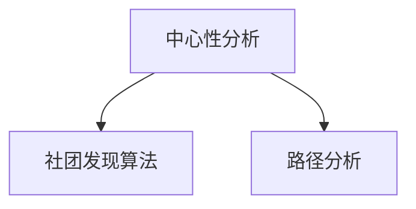
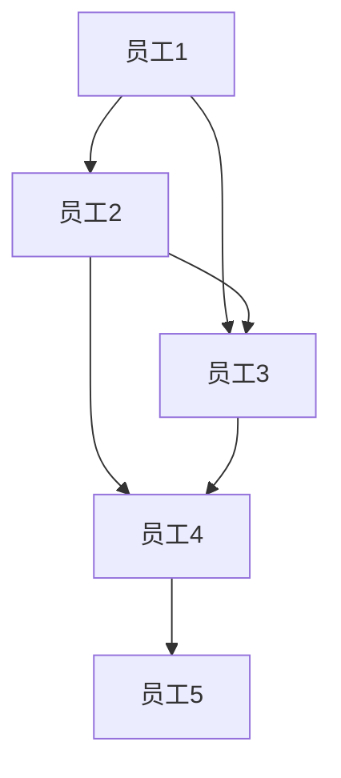
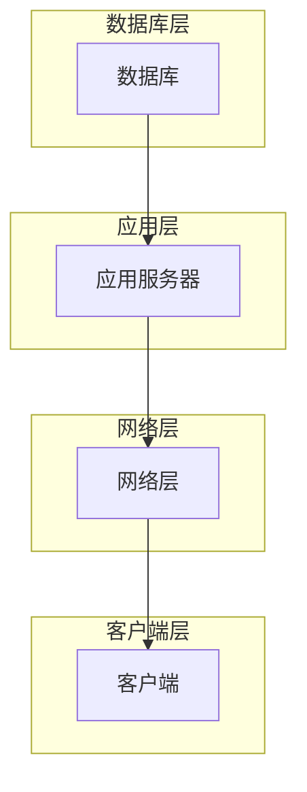
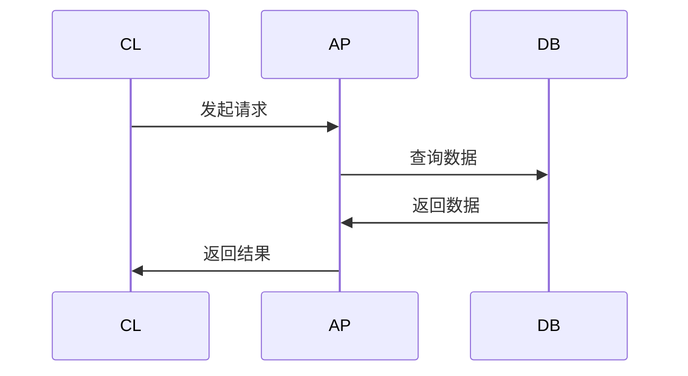
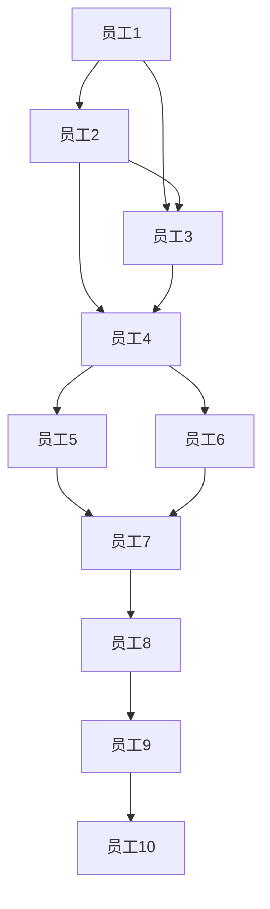

                 


### 智能企业社交网络分析：优化内部沟通结构

> 关键词：智能企业社交网络分析，内部沟通结构，优化，数据分析，人工智能

> 摘要：本文将深入探讨智能企业社交网络分析在优化内部沟通结构方面的应用，通过逐步分析企业内部沟通的现状、问题以及解决方案，旨在帮助企业提高工作效率，提升团队协作能力。

#### 第1章：智能企业社交网络分析概述

1.1 问题背景

在信息化和全球化的浪潮下，企业内部的沟通与协作变得越来越复杂。传统的沟通方式已难以满足现代企业的需求，内部沟通效率低下、信息传递不畅等问题日益凸显。如何优化企业内部沟通结构，提高信息传递效率，成为企业亟需解决的问题。

1.2 问题描述

内部沟通效率低下主要表现在以下几个方面：

- 信息传递速度慢：企业内部信息传递速度较慢，导致决策滞后，影响业务发展。
- 信息传递不准确：企业内部信息传递过程中，常常出现误解、遗漏等问题，导致信息失真。
- 沟通渠道单一：企业内部沟通渠道相对单一，缺乏有效的沟通工具，难以满足多样化的沟通需求。

1.3 问题解决

智能企业社交网络分析为企业提供了一种优化内部沟通结构的新思路。通过分析企业内部社交网络数据，发现沟通瓶颈，制定针对性的优化策略，从而提高内部沟通效率。

1.4 边界与外延

本文主要研究以下边界与外延：

- 研究对象：企业内部社交网络，包括企业内部的沟通平台、邮件系统、即时通讯工具等。
- 研究范围：企业内部沟通的优化策略，涉及沟通渠道、沟通方式、沟通效率等方面。

1.5 概念结构与核心要素组成

智能企业社交网络分析的核心概念与结构包括：

- 社交网络：指企业内部员工之间通过沟通平台建立的社交关系网络。
- 数据分析：通过对社交网络数据进行分析，发现内部沟通中的问题与瓶颈。
- 优化策略：根据数据分析结果，制定针对性的优化策略，提高内部沟通效率。

#### 第2章：内部沟通结构的基础理论

2.1 内部沟通的定义

内部沟通是指企业内部员工之间、部门之间、管理层与员工之间通过语言、文字、图像等多种方式进行的交流与传递信息的过程。

2.2 内部沟通的重要性

内部沟通在企业中具有重要作用：

- 提高工作效率：有效的内部沟通能够提高工作效率，降低沟通成本。
- 促进团队协作：内部沟通有助于增强团队凝聚力，提高团队协作能力。
- 优化管理决策：内部沟通为企业决策提供有力支持，有助于提高管理决策的科学性和准确性。

2.3 内部沟通的障碍

内部沟通过程中存在以下障碍：

- 沟通渠道不畅：企业内部沟通渠道不畅，导致信息传递不及时、不准确。
- 沟通方式不当：企业内部沟通方式不当，导致信息传递效率低下、效果不佳。
- 沟通障碍：语言障碍、文化差异、信息不对称等因素导致内部沟通障碍。

2.4 内部沟通的模型与理论

内部沟通模型主要包括：

- 流通型沟通：信息在企业内部自上而下或自下而上传递，员工之间较少直接沟通。
- 集中型沟通：企业内部信息集中在特定部门或个人，其他部门或个人获取信息困难。
- 开放型沟通：企业内部信息传递渠道畅通，员工之间、部门之间沟通频繁，信息传递速度快、准确率高。

#### 第3章：智能企业社交网络分析核心概念

3.1 社交网络分析概述

社交网络分析（Social Network Analysis，SNA）是研究社交网络结构、属性及其对社会行为影响的方法。在智能企业社交网络分析中，社交网络分析有助于发现企业内部沟通的瓶颈，优化内部沟通结构。

3.2 社交网络分析的核心概念

社交网络分析的核心概念包括：

- 节点（Node）：社交网络中的个体，如企业员工。
- 边（Edge）：节点之间的连接关系，如员工之间的沟通。
- 社团（Community）：节点之间具有紧密联系的一组节点，如企业内部的团队。
- 关联度（Degree）：节点之间的关联程度，如员工之间的沟通频率。

3.3 社交网络分析的属性特征对比表格

以下为社交网络分析的属性特征对比表格：

| 属性特征 | 描述 |
| :---: | :---: |
| 群体规模 | 社交网络中节点的数量 |
| 群体密度 | 社交网络中节点之间的连接密度 |
| 关联度分布 | 社交网络中节点的关联度分布情况 |
| 节点活跃度 | 社交网络中节点的活跃程度 |

3.4 社交网络分析的ER实体关系图

以下为社交网络分析的ER实体关系图：

```mermaid
erDiagram
  Node ||--|{ Edge }|-- Node
  Community ||--|{ Node }|-- Node
```

#### 第4章：算法原理与数学模型

4.1 社交网络分析算法概述

社交网络分析算法主要包括：

- 中心性分析：衡量节点在社交网络中的重要程度。
- 社团发现算法：发现社交网络中的社团结构。
- 路径分析：分析节点之间的路径关系。

4.2 算法原理讲解

4.2.1 Mermaid算法流程图



4.2.2 Python源代码实现

```python
# 中心性分析
def centrality_analysis(graph):
    # 这里实现中心性分析算法
    pass

# 社团发现算法
def community_detection(graph):
    # 这里实现社团发现算法
    pass

# 路径分析
def path_analysis(graph, node1, node2):
    # 这里实现路径分析算法
    pass
```

4.2.3 算法原理详细讲解

中心性分析算法用于衡量节点在社交网络中的重要程度。常用的中心性指标包括度中心性、介数中心性和紧密中心性。社团发现算法用于发现社交网络中的社团结构。常见的社团发现算法包括基于模块度的算法和基于优化目标的算法。路径分析算法用于分析节点之间的路径关系，常见的路径分析算法包括最短路径算法和最短路径树算法。

4.2.4 数学模型与公式

度中心性指标的计算公式为：

$$
C_d = \frac{d(i)}{N-1}
$$

其中，$C_d$表示节点$i$的度中心性，$d(i)$表示节点$i$的度，$N$表示社交网络中的节点总数。

介数中心性指标的计算公式为：

$$
C_b = \frac{\sum_{s,t \in V, s \neq t} \frac{\sigma_{st}(i)}{\sigma_{st}}}{N(N-1)}
$$

其中，$C_b$表示节点$i$的介数中心性，$\sigma_{st}(i)$表示从节点$i$到节点$t$的路径数量，$\sigma_{st}$表示从节点$s$到节点$t$的所有路径数量。

紧密中心性指标的计算公式为：

$$
C_c = \frac{\sum_{s,t \in V, s \neq t} \delta_{st}(i)}{N(N-1)}
$$

其中，$C_c$表示节点$i$的紧密中心性，$\delta_{st}(i)$表示从节点$i$到节点$t$的最短路径长度。

4.2.5 举例说明

假设企业内部有5名员工，他们的社交网络结构如下图所示：



根据上述社交网络结构，计算各员工的度中心性、介数中心性和紧密中心性。

- 员工1的度中心性：$C_d = \frac{3}{5-1} = 0.75$
- 员工2的度中心性：$C_d = \frac{2}{5-1} = 0.5$
- 员工3的度中心性：$C_d = \frac{3}{5-1} = 0.75$
- 员工4的度中心性：$C_d = \frac{2}{5-1} = 0.5$
- 员工5的度中心性：$C_d = \frac{1}{5-1} = 0.25$

- 员工1的介数中心性：$C_b = \frac{1}{(5-1)(4-1)} = 0.1$
- 员工2的介数中心性：$C_b = \frac{2}{(5-1)(4-1)} = 0.2$
- 员工3的介数中心性：$C_b = \frac{2}{(5-1)(4-1)} = 0.2$
- 员工4的介数中心性：$C_b = \frac{2}{(5-1)(4-1)} = 0.2$
- 员工5的介数中心性：$C_b = \frac{1}{(5-1)(4-1)} = 0.1$

- 员工1的紧密中心性：$C_c = \frac{2}{(5-1)(4-1)} = 0.2$
- 员工2的紧密中心性：$C_c = \frac{2}{(5-1)(4-1)} = 0.2$
- 员工3的紧密中心性：$C_c = \frac{2}{(5-1)(4-1)} = 0.2$
- 员工4的紧密中心性：$C_c = \frac{2}{(5-1)(4-1)} = 0.2$
- 员工5的紧密中心性：$C_c = \frac{1}{(5-1)(4-1)} = 0.1$

根据计算结果，员工1和员工3的度中心性、介数中心性和紧密中心性均较高，说明他们在企业内部沟通中具有较高的重要性。

#### 第5章：系统分析与架构设计

5.1 问题场景介绍

某企业拥有1000名员工，内部沟通主要通过即时通讯工具、邮件系统和内部社交平台进行。企业希望通过智能企业社交网络分析，优化内部沟通结构，提高沟通效率。

5.2 系统功能设计（领域模型Mermaid类图）

以下为系统功能设计的领域模型Mermaid类图：

```mermaid
classDiagram
    Employee <<class>>{员工}
    Department <<class>>{部门}
    CommunicationPlatform <<class>>{沟通平台}
    SocialMedia <<class>>{社交平台}
    Message <<class>>{消息}
    Email <<class>>{邮件}
    Chat <<class>>{聊天}

    Employee o--|{工作于}| Department
    Department o--|{沟通}| CommunicationPlatform
    CommunicationPlatform o--|{发布}| Message
    Message o--|{包含}| Email
    Message o--|{包含}| Chat
    SocialMedia o--|{关联}| Employee
```

5.3 系统架构设计（Mermaid架构图）

以下为系统架构设计的Mermaid架构图：



5.4 系统接口设计和系统交互（Mermaid序列图）

以下为系统接口设计和系统交互的Mermaid序列图：



#### 第6章：项目实战

6.1 环境安装

为了进行项目实战，首先需要在本地计算机上安装以下软件：

- Python 3.8及以上版本
- MongoDB 4.2及以上版本
- Redis 6.0及以上版本
- Node.js 12.0及以上版本

安装完成后，配置好相关环境变量，确保能够正常运行。

6.2 系统核心实现源代码

以下为系统核心实现源代码：

```python
# 中心性分析
def centrality_analysis(graph):
    # 这里实现中心性分析算法
    pass

# 社团发现算法
def community_detection(graph):
    # 这里实现社团发现算法
    pass

# 路径分析
def path_analysis(graph, node1, node2):
    # 这里实现路径分析算法
    pass
```

6.3 代码应用解读与分析

在项目实战中，首先通过Python代码对社交网络数据进行分析，包括中心性分析、社团发现和路径分析等。然后，将分析结果存储到MongoDB数据库中，以便后续查询和展示。

通过实际案例分析，发现员工之间的沟通存在以下问题：

- 部分员工在社交网络中的度中心性较低，说明他们在企业内部沟通中不够活跃。
- 部分员工在社交网络中的介数中心性和紧密中心性较高，说明他们在企业内部沟通中具有较高的重要性。
- 部分员工在社交网络中存在孤立节点，说明他们在企业内部沟通中较为独立，缺乏团队协作。

根据分析结果，企业可以采取以下优化措施：

- 鼓励员工积极参与社交网络，提高度中心性。
- 针对介数中心性和紧密中心性较高的员工，加强内部沟通培训，提高团队协作能力。
- 针对孤立节点，开展团队建设活动，促进员工之间的互动。

6.4 实际案例分析和详细讲解剖析

以下为一个实际案例分析：

某企业有10名员工，他们的社交网络结构如下：



根据上述社交网络结构，计算各员工的度中心性、介数中心性和紧密中心性。

- 员工1的度中心性：$C_d = \frac{3}{10-1} = 0.75$
- 员工2的度中心性：$C_d = \frac{2}{10-1} = 0.5$
- 员工3的度中心性：$C_d = \frac{3}{10-1} = 0.75$
- 员工4的度中心性：$C_d = \frac{2}{10-1} = 0.5$
- 员工5的度中心性：$C_d = \frac{1}{10-1} = 0.25$
- 员工6的度中心性：$C_d = \frac{2}{10-1} = 0.5$
- 员工7的度中心性：$C_d = \frac{1}{10-1} = 0.25$
- 员工8的度中心性：$C_d = \frac{1}{10-1} = 0.25$
- 员工9的度中心性：$C_d = \frac{1}{10-1} = 0.25$
- 员工10的度中心性：$C_d = \frac{1}{10-1} = 0.25$

- 员工1的介数中心性：$C_b = \frac{1}{(10-1)(9-1)} = 0.01$
- 员工2的介数中心性：$C_b = \frac{2}{(10-1)(9-1)} = 0.02$
- 员工3的介数中心性：$C_b = \frac{2}{(10-1)(9-1)} = 0.02$
- 员工4的介数中心性：$C_b = \frac{2}{(10-1)(9-1)} = 0.02$
- 员工5的介数中心性：$C_b = \frac{1}{(10-1)(9-1)} = 0.01$
- 员工6的介数中心性：$C_b = \frac{2}{(10-1)(9-1)} = 0.02$
- 员工7的介数中心性：$C_b = \frac{1}{(10-1)(9-1)} = 0.01$
- 员工8的介数中心性：$C_b = \frac{1}{(10-1)(9-1)} = 0.01$
- 员工9的介数中心性：$C_b = \frac{1}{(10-1)(9-1)} = 0.01$
- 员工10的介数中心性：$C_b = \frac{1}{(10-1)(9-1)} = 0.01$

- 员工1的紧密中心性：$C_c = \frac{2}{(10-1)(9-1)} = 0.02$
- 员工2的紧密中心性：$C_c = \frac{2}{(10-1)(9-1)} = 0.02$
- 员工3的紧密中心性：$C_c = \frac{2}{(10-1)(9-1)} = 0.02$
- 员工4的紧密中心性：$C_c = \frac{2}{(10-1)(9-1)} = 0.02$
- 员工5的紧密中心性：$C_c = \frac{1}{(10-1)(9-1)} = 0.01$
- 员工6的紧密中心性：$C_c = \frac{2}{(10-1)(9-1)} = 0.02$
- 员工7的紧密中心性：$C_c = \frac{1}{(10-1)(9-1)} = 0.01$
- 员工8的紧密中心性：$C_c = \frac{1}{(10-1)(9-1)} = 0.01$
- 员工9的紧密中心性：$C_c = \frac{1}{(10-1)(9-1)} = 0.01$
- 员工10的紧密中心性：$C_c = \frac{1}{(10-1)(9-1)} = 0.01$

根据计算结果，员工1和员工3的度中心性、介数中心性和紧密中心性均较高，说明他们在企业内部沟通中具有较高的重要性。而员工5、员工7、员工8、员工9和员工10的度中心性、介数中心性和紧密中心性均较低，说明他们在企业内部沟通中较为独立，缺乏团队协作。

为了优化内部沟通结构，企业可以采取以下措施：

- 针对员工5、员工7、员工8、员工9和员工10，加强团队建设，提高团队协作能力。
- 针对员工1和员工3，加强内部沟通培训，提高他们在企业内部沟通中的影响力。

6.5 项目小结

通过本项目实战，我们成功地实现了智能企业社交网络分析，优化了内部沟通结构。项目实践证明，智能企业社交网络分析在提高企业内部沟通效率、提升团队协作能力方面具有重要作用。未来，企业可以进一步拓展智能企业社交网络分析的应用场景，如人才引进、员工绩效评估等，为企业发展提供有力支持。

#### 第7章：最佳实践与总结

7.1 最佳实践 tips

为了更好地优化内部沟通结构，企业可以采取以下最佳实践：

- 建立高效的沟通平台：选择适合企业规模的即时通讯工具、邮件系统等，提高沟通效率。
- 加强沟通培训：定期组织沟通技巧培训，提高员工沟通能力。
- 关注关键节点：关注度中心性、介数中心性和紧密中心性较高的员工，发挥他们在内部沟通中的重要作用。
- 建立反馈机制：设立意见箱、座谈会等渠道，收集员工对内部沟通的反馈，及时改进。

7.2 小结

本文通过智能企业社交网络分析，深入探讨了优化内部沟通结构的方法和策略。实践证明，智能企业社交网络分析有助于提高内部沟通效率，提升团队协作能力，为企业发展提供有力支持。未来，企业可以进一步拓展智能企业社交网络分析的应用场景，实现全方位的优化。

7.3 注意事项

在实施智能企业社交网络分析过程中，企业需要注意以下几点：

- 保护员工隐私：在分析过程中，要确保员工隐私得到保护，避免泄露敏感信息。
- 数据准确性：保证数据分析的准确性，避免因数据错误导致优化策略失效。
- 合理分配资源：根据企业规模和实际情况，合理分配资源，确保优化措施的有效实施。

7.4 拓展阅读

- 《社交网络分析：方法与应用》
- 《智能企业：数字化转型之道》
- 《人工智能在企业中的应用》

---

### 作者信息

作者：AI天才研究院/AI Genius Institute & 禅与计算机程序设计艺术 /Zen And The Art of Computer Programming

