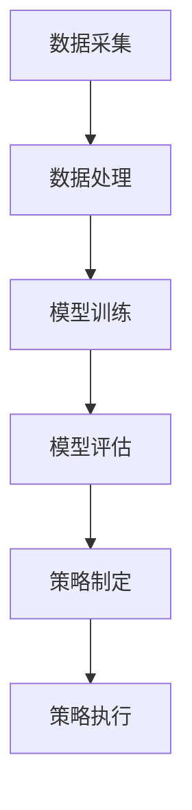
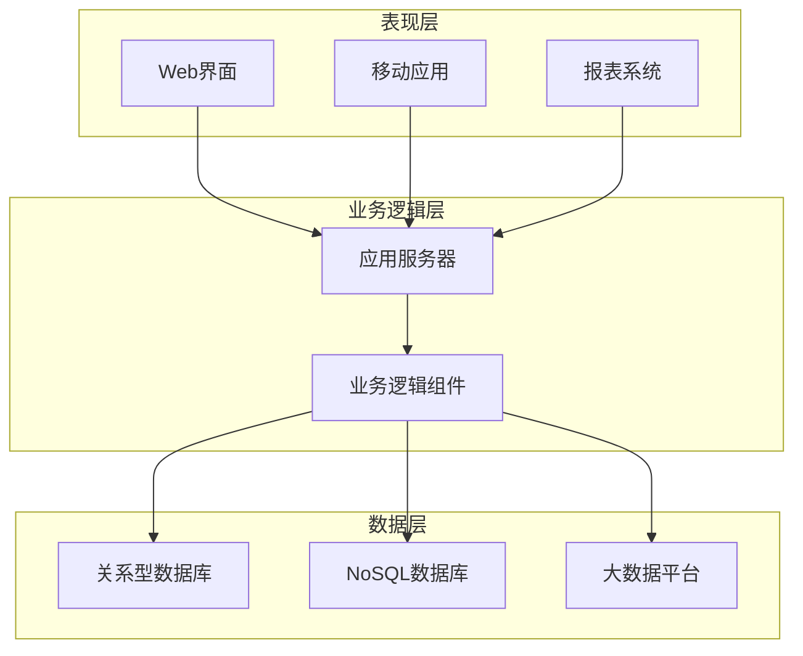

                 

### 引入

#### 文章标题：智能供应商关系管理：AI优化采购策略

在当今全球商业环境中，采购管理是企业运营的核心环节之一。随着市场环境的变化和竞争的加剧，企业对采购管理的效率、成本控制以及供应链的协同性提出了更高的要求。传统的采购管理方式往往依赖于人工经验和经验规则，这导致采购决策的效率和准确性难以保证。因此，如何利用现代科技，特别是人工智能（AI）技术，来优化采购策略，提升采购管理的智能化水平，成为企业亟待解决的问题。

智能供应商关系管理（Intelligent Supplier Relationship Management，ISRM）是一种基于AI技术的采购管理新模式，它通过大数据分析、机器学习算法和自动化流程，帮助企业更精准地识别供应商、评估供应商绩效、优化采购决策，从而实现供应链的协同与优化。AI优化采购策略则是指利用AI技术对采购过程中的各个环节进行智能化分析、预测和优化，以提高采购效率、降低采购成本和提升供应链整体绩效。

本文将深入探讨智能供应商关系管理的基本概念、核心原理、技术实现以及实际应用。我们将从以下几个方面展开讨论：

1. **智能供应商关系管理的背景**：介绍采购管理的现状、挑战以及智能化的需求。
2. **核心概念与联系**：阐述智能采购策略、AI技术和供应商关系管理之间的关系。
3. **算法原理讲解**：详细介绍采购策略优化算法和AI技术的基本原理。
4. **数学模型和数学公式**：展示与采购策略优化相关的数学模型和公式，并进行分析和讲解。
5. **系统分析与架构设计方案**：描述智能供应商关系管理系统的设计与实现。
6. **项目实战**：通过实际案例展示智能供应商关系管理在实践中的应用。
7. **最佳实践与未来展望**：总结实践经验，提出最佳实践建议，并对未来发展趋势进行展望。

本文旨在为读者提供一幅完整的智能供应商关系管理和AI优化采购策略的蓝图，帮助读者理解这一新兴领域，并掌握其核心技术和应用方法。通过本文的阅读，读者将能够：

- 理解智能供应商关系管理和AI优化采购策略的基本概念和原理。
- 掌握采购策略优化算法和AI技术在实际应用中的操作流程。
- 学会如何设计并实现智能供应商关系管理系统。
- 获得实际项目中的最佳实践和操作技巧。

让我们一起深入探讨智能供应商关系管理：AI优化采购策略，开启智能化采购管理的新篇章。

#### 关键词：智能供应商关系管理、AI优化采购策略、采购管理、供应链协同、机器学习、深度学习、采购策略优化算法、数学模型

#### 摘要：

本文深入探讨了智能供应商关系管理（ISRM）和AI优化采购策略的关键概念和原理。首先，我们介绍了采购管理的现状、面临的挑战以及智能化的需求，阐述了智能供应商关系管理的重要性。接着，通过核心概念和联系的分析，我们梳理了智能采购策略、AI技术和供应商关系管理之间的关系。随后，本文详细讲解了采购策略优化算法和AI技术的基本原理，包括机器学习算法和深度学习技术的应用。接着，我们展示了与采购策略优化相关的数学模型和公式，并进行了深入分析和讲解。在此基础上，本文介绍了智能供应商关系管理系统的设计与实现，包括需求分析、架构设计和接口设计。通过实际案例的展示，我们详细剖析了智能供应商关系管理在实践中的应用。最后，本文总结了最佳实践，并对未来发展趋势进行了展望。通过本文的阅读，读者能够全面了解智能供应商关系管理和AI优化采购策略的核心内容，掌握其实际应用方法和操作技巧。

### 第1章 引言

#### 1.1 智能供应商关系管理的背景

采购管理是企业运营过程中不可或缺的一环，它直接关系到企业的成本、效率和市场竞争力。然而，随着市场环境的复杂化和竞争的加剧，传统的采购管理方式已无法满足现代企业对高效、低成本和高质量供应链的需求。因此，如何通过智能化技术提升采购管理的效率和质量，成为企业关注的焦点。

在采购管理中，智能供应商关系管理（Intelligent Supplier Relationship Management，ISRM）应运而生。ISRM是一种基于大数据分析、人工智能（AI）和自动化流程的采购管理新模式，旨在通过智能化手段优化供应商关系管理，提升采购决策的准确性和效率。智能供应商关系管理不仅关注采购环节本身，还涵盖了供应商选择、绩效评估、合同管理以及供应链协同等多个方面。

首先，从市场环境的角度来看，现代供应链的复杂性日益增加，企业面临着全球化的市场竞争、供应链中断的风险以及不断变化的需求。这些因素使得传统的采购管理方式难以适应快速变化的市场环境，而智能供应商关系管理则能够通过数据驱动的分析和决策，帮助企业更好地应对市场挑战。

其次，企业内部的需求也在推动智能供应商关系管理的发展。随着企业规模的扩大和业务的复杂化，采购管理的任务量和难度不断增加。传统的人工管理方式不仅效率低下，而且容易出现人为错误和偏差。智能供应商关系管理通过自动化和智能化技术，可以显著提高采购管理的效率和准确性，降低采购成本，提升供应链整体绩效。

此外，技术的进步也为智能供应商关系管理提供了坚实的基础。大数据技术的成熟使得企业能够从海量数据中提取有价值的信息，为采购决策提供数据支持。人工智能和机器学习技术的不断发展，使得采购策略优化、供应商评估和预测等任务变得更加智能化和高效。自动化技术的应用则进一步提升了采购流程的自动化程度，减少了人为干预和操作失误。

综上所述，智能供应商关系管理在当前市场环境和企业需求下具有重要的地位和作用。它不仅能够帮助企业应对市场环境的变化，提升采购管理的效率和质量，还能够降低采购成本，提升供应链整体绩效，为企业创造更大的价值。

#### 1.2 采购策略优化的重要性

采购策略优化是智能供应商关系管理（ISRM）的核心组成部分，其重要性不言而喻。采购策略优化是指通过科学的方法和工具，对采购过程中的各个环节进行系统分析和改进，以实现采购目标的最优化。具体来说，采购策略优化主要包括以下方面：

首先，采购策略优化能够提高采购效率。在传统的采购管理中，采购流程通常较为繁琐，涉及多个部门和环节，容易出现信息不对称、流程延误等问题。通过优化采购策略，企业可以简化采购流程，缩短采购周期，提高采购效率。例如，通过引入自动化工具和电子采购平台，企业可以实时监控采购进度，减少人为干预，提高采购决策的速度和准确性。

其次，采购策略优化有助于降低采购成本。在采购过程中，成本控制一直是企业关注的焦点。通过优化采购策略，企业可以在供应商选择、采购价格谈判、库存管理等方面实现成本节约。例如，利用大数据分析和机器学习技术，企业可以更精准地预测需求，合理安排采购计划，避免库存过剩或短缺，从而降低库存成本。此外，通过与供应商建立长期合作关系，企业可以获得更好的采购价格和服务质量，进一步降低采购成本。

再次，采购策略优化能够提升供应链协同。采购不仅仅是企业内部的事务，更是供应链整体运作的重要环节。通过优化采购策略，企业可以加强与供应商的协同合作，实现信息共享和资源整合，提高供应链的整体效率和响应速度。例如，通过建立智能供应链管理系统，企业可以实时跟踪供应商的交货情况，优化库存水平，提高供应链的灵活性和适应性。

此外，采购策略优化有助于提升采购决策的准确性和科学性。传统的采购决策往往依赖于经验和直觉，容易出现偏差和错误。通过优化采购策略，企业可以引入数据分析和人工智能技术，对采购数据进行分析和处理，提供更准确的决策支持。例如，通过利用机器学习算法，企业可以对采购需求进行预测，优化采购计划，避免需求波动和库存积压。

最后，采购策略优化能够增强企业的竞争力。在激烈的市场竞争中，采购成本和供应链效率是影响企业竞争力的重要因素。通过优化采购策略，企业可以降低采购成本，提高供应链效率，从而在市场竞争中占据有利地位。同时，优化采购策略还能够提高企业的运营效率和管理水平，增强企业的核心竞争力。

综上所述，采购策略优化在智能供应商关系管理中具有极其重要的作用。它不仅能够提高采购效率、降低采购成本，提升供应链协同，还能够增强企业的竞争力，为企业创造更大的价值。因此，企业应当高度重视采购策略优化，积极探索和应用先进的技术和工具，不断提升采购管理的智能化水平。

#### 1.3 智能采购策略的优势

智能采购策略在提升采购效率、降低采购成本和优化供应链协同方面具有显著优势，这些优势主要体现在以下几个方面：

首先，智能采购策略能够显著提升采购效率。传统的采购管理方式往往依赖于人工操作和经验判断，容易出现信息不对称、流程延误等问题。智能采购策略通过引入大数据分析、人工智能（AI）和自动化工具，可以实时监控采购流程，自动化执行采购任务，减少人为干预和操作错误。例如，通过使用电子采购平台，企业可以实时获取供应商的报价信息，快速做出采购决策，缩短采购周期。此外，智能采购策略还能够基于历史采购数据，预测未来的采购需求，提前安排采购计划，避免需求波动和库存积压，提高采购流程的响应速度。

其次，智能采购策略能够有效降低采购成本。在采购过程中，成本控制一直是企业关注的重点。智能采购策略通过大数据分析和机器学习技术，可以帮助企业更精准地预测需求，合理安排采购计划，避免库存过剩或短缺。此外，智能采购策略还可以优化供应商选择和采购价格谈判，通过分析供应商的历史表现、报价数据和市场价格趋势，选择最合适的供应商，并获得最优的采购价格。例如，通过使用供应商绩效评估系统，企业可以实时监控供应商的交货时间、质量和服务水平，对供应商进行绩效评估和分级管理，选择表现优异的供应商进行长期合作，从而降低采购成本。

再次，智能采购策略能够显著优化供应链协同。采购不仅仅是企业内部的事务，更是供应链整体运作的重要环节。智能采购策略通过数据共享和协同合作，可以增强企业内部各部门之间的沟通与协作，提高供应链的整体效率和响应速度。例如，通过建立智能供应链管理系统，企业可以实时跟踪供应商的交货情况，优化库存水平，提高供应链的灵活性和适应性。此外，智能采购策略还可以实现供应链上下游企业的信息共享和资源整合，实现供应链的协同运作，提高供应链的整体绩效。

此外，智能采购策略能够提升采购决策的准确性和科学性。传统的采购决策往往依赖于经验和直觉，容易出现偏差和错误。智能采购策略通过引入数据分析和人工智能技术，可以对采购数据进行分析和处理，提供更准确的决策支持。例如，通过利用机器学习算法，企业可以对采购需求进行预测，优化采购计划，避免需求波动和库存积压。此外，智能采购策略还可以利用大数据分析，挖掘采购数据中的潜在规律和趋势，为企业提供有针对性的采购策略和决策支持。

最后，智能采购策略能够增强企业的竞争力。在激烈的市场竞争中，采购成本和供应链效率是影响企业竞争力的重要因素。智能采购策略通过降低采购成本、提高供应链效率，可以帮助企业在市场竞争中占据有利地位。此外，智能采购策略还可以提高企业的运营效率和管理水平，增强企业的核心竞争力，为企业创造更大的价值。

综上所述，智能采购策略在提升采购效率、降低采购成本和优化供应链协同方面具有显著优势。企业应当积极采用智能采购策略，借助先进的技术和工具，不断提升采购管理的智能化水平，实现采购效率和成本的优化，提高企业的竞争力。

#### 1.4 智能采购策略的分类

智能采购策略根据不同的分类标准可以划分为多种类型，每一种类型都有其独特的特点和适用场景。以下是几种常见的智能采购策略分类：

1. **基于AI的智能采购策略**：

   基于AI的智能采购策略利用人工智能技术，特别是机器学习和深度学习算法，对采购数据进行分析和处理，以实现采购决策的优化。这种策略的核心在于利用大数据和人工智能技术，对采购需求、市场趋势、供应商绩效等方面进行预测和评估，从而制定更加科学和有效的采购策略。例如，通过使用机器学习算法，企业可以预测未来的采购需求，合理安排采购计划，避免库存过剩或短缺。基于AI的智能采购策略适用于需求波动大、供应链复杂的企业，能够显著提升采购决策的准确性和效率。

2. **基于数据分析的智能采购策略**：

   基于数据分析的智能采购策略侧重于通过数据分析和挖掘，优化采购流程和决策。这种策略利用统计学方法和数据挖掘技术，对采购数据进行分析，识别数据中的潜在规律和趋势，为企业提供采购决策支持。例如，通过分析历史采购数据，企业可以识别出采购周期、采购价格和库存水平等关键因素之间的关系，从而优化采购策略。基于数据分析的智能采购策略适用于数据量较大、需求相对稳定的企业，能够帮助企业更好地控制采购成本和库存水平。

3. **基于供应链协同的智能采购策略**：

   基于供应链协同的智能采购策略强调供应链上下游企业的协同合作，通过信息共享和资源共享，优化整个供应链的运作效率。这种策略通过建立智能供应链管理系统，实现供应链各环节的数据共享和流程自动化，从而提高采购效率、降低采购成本。例如，通过供应链协同平台，企业可以实时跟踪供应商的交货情况，优化库存水平，提高供应链的灵活性和响应速度。基于供应链协同的智能采购策略适用于供应链较长、涉及多个供应商和合作伙伴的企业，能够显著提升供应链的整体效率和协同水平。

4. **基于物联网的智能采购策略**：

   基于物联网的智能采购策略利用物联网技术，实现对采购过程的实时监控和自动化管理。通过在供应链各环节部署传感器和设备，企业可以实时获取采购数据，实现采购过程的透明化和智能化。例如，通过物联网技术，企业可以实时监控货物的运输状态，提高物流效率，减少采购过程中的风险。基于物联网的智能采购策略适用于物流环节复杂、需求变化快的企业，能够显著提升采购流程的实时性和可靠性。

5. **基于区块链的智能采购策略**：

   基于区块链的智能采购策略利用区块链技术，实现采购过程的去中心化和安全可信。区块链技术可以确保采购数据的不可篡改和透明，提高采购流程的信任度和透明度。例如，通过区块链技术，企业可以建立安全的电子合同和采购记录，防止伪造和篡改，确保采购过程的合法性和合规性。基于区块链的智能采购策略适用于对采购过程安全性和透明度要求较高的企业，能够提高采购流程的可追溯性和可信度。

综上所述，智能采购策略根据不同的分类标准可以划分为多种类型，每一种策略都有其独特的特点和适用场景。企业应根据自身实际情况，选择合适的智能采购策略，以实现采购效率和成本的优化。

#### 1.5 书籍的目标和结构

本章节旨在介绍《智能供应商关系管理：AI优化采购策略》书籍的整体架构和内容安排，帮助读者了解书籍的主要目标和阅读方法。

**主要目标：**

《智能供应商关系管理：AI优化采购策略》的主要目标是：

1. **普及智能供应商关系管理和AI优化采购策略的基本概念和原理**：通过详细讲解智能采购策略、AI技术、供应商关系管理等相关核心概念，帮助读者建立全面的理论基础。

2. **深入探讨智能采购策略优化算法和AI技术的应用**：通过实例分析和代码演示，展示如何在实际项目中应用智能采购策略优化算法和AI技术，提升采购决策的准确性和效率。

3. **提供实际项目案例和最佳实践**：通过实际项目案例的分析和讲解，帮助读者了解智能供应商关系管理在实践中的应用，并提供可借鉴的最佳实践。

4. **展望智能供应商关系管理和AI优化采购策略的未来发展趋势**：探讨未来智能供应商关系管理和AI优化采购策略的发展方向，为读者提供前瞻性的思考和指导。

**书籍结构：**

全书共分为七个章节，具体结构如下：

- **第1章 引言**：介绍智能供应商关系管理和AI优化采购策略的背景、重要性和目标。
  
- **第2章 智能采购策略概述**：讲解智能采购策略的基本概念、优势和分类。

- **第3章 AI技术基础**：介绍人工智能的基本概念、机器学习算法和深度学习技术。

- **第4章 智能采购策略优化算法**：详细讲解采购策略优化算法的原理和实现。

- **第5章 智能供应商关系管理系统的设计与实现**：介绍智能供应商关系管理系统的需求分析、架构设计和接口设计。

- **第6章 项目实战**：通过实际案例展示智能供应商关系管理在实践中的应用。

- **第7章 最佳实践与未来展望**：总结最佳实践，探讨未来发展趋势。

**阅读指南：**

为了更好地理解和应用本书的内容，建议读者按照以下步骤进行阅读：

1. **通读全书**：首先通读全书，了解整体内容框架和主要概念，建立整体认知。

2. **深入学习各章节**：在通读全书的基础上，深入学习各章节，特别是核心概念、算法原理和实际案例。

3. **动手实践**：结合书中提供的实例和代码，动手实践，加深理解和掌握。

4. **思考与总结**：在阅读和实践中，不断思考并总结所学内容，形成自己的理解和见解。

5. **持续更新**：智能供应商关系管理和AI优化采购策略是一个不断发展的领域，建议读者关注最新的研究成果和趋势，持续更新自己的知识和技能。

通过以上阅读指南，读者可以系统地掌握智能供应商关系管理和AI优化采购策略的核心知识和应用方法，为实际工作提供有力支持。

#### 1.6 本章小结

本章从背景介绍、采购策略优化的重要性、智能采购策略的优势和分类等方面，全面阐述了智能供应商关系管理的基本概念和原理。首先，我们探讨了采购管理的现状和挑战，以及智能采购策略的必要性。接着，详细介绍了智能采购策略的优势，包括提升采购效率、降低采购成本和优化供应链协同等方面。随后，我们分析了智能采购策略的分类，包括基于AI、数据分析、供应链协同、物联网和区块链等不同的智能采购策略类型。最后，本章简要介绍了本书的主要目标和结构，并提供了阅读指南，帮助读者更好地理解和应用本书的内容。

通过本章的学习，读者可以初步了解智能供应商关系管理和AI优化采购策略的基本概念和原理，为后续章节的深入学习奠定基础。下一章将深入探讨AI技术的基础知识，包括人工智能的基本概念、机器学习算法和深度学习技术，为智能采购策略的实现提供技术支持。

### 第2章 智能采购策略概述

#### 2.1 核心概念介绍

智能采购策略（Intelligent Procurement Strategy）是现代采购管理中的一种新型模式，它通过引入人工智能（AI）、大数据分析、机器学习等技术，对采购过程进行全方位的优化和管理。智能采购策略的核心概念主要包括以下几个方面：

**1. 智能化采购**

智能化采购是指利用AI和大数据技术，对采购流程中的各个环节进行自动化和智能化管理。具体来说，智能化采购包括以下几方面：

- **自动化流程**：通过自动化工具和电子采购平台，实现采购流程的自动化，减少人为干预和操作错误，提高采购效率。
- **数据驱动**：利用大数据分析，对采购数据进行分析和处理，为企业提供科学、准确的采购决策支持。
- **智能预测**：通过机器学习算法，对采购需求、市场趋势、供应商绩效等进行预测，帮助企业制定更合理的采购策略。

**2. 供应商管理**

供应商管理是智能采购策略的重要组成部分，旨在通过数据分析和评估，选择合适的供应商，并建立长期稳定的合作关系。具体包括：

- **供应商选择**：通过数据分析，评估供应商的综合绩效，选择优质的供应商进行合作。
- **供应商评价**：利用机器学习算法，对供应商的交货时间、质量、价格等方面进行评价和排名。
- **供应商协同**：通过建立供应商协同平台，实现供应商与企业之间的信息共享和资源整合，提高供应链的整体效率。

**3. 采购优化**

采购优化是指通过科学的方法和工具，对采购过程中的各个环节进行优化，以实现采购目标的最优化。具体包括：

- **需求预测**：通过大数据分析和机器学习算法，对采购需求进行预测，优化采购计划，避免库存过剩或短缺。
- **价格谈判**：通过市场分析和供应商评价，制定合理的采购价格谈判策略，降低采购成本。
- **库存管理**：通过优化库存水平，实现库存的最优配置，减少库存成本。

**4. 供应链协同**

供应链协同是指通过信息共享和资源整合，实现供应链上下游企业的协同合作，提高供应链的整体效率和响应速度。具体包括：

- **信息共享**：通过建立供应链协同平台，实现供应链各环节的数据共享，提高供应链的透明度和协同性。
- **流程优化**：通过优化供应链各环节的流程，减少重复工作和操作错误，提高供应链的运作效率。
- **风险控制**：通过实时监控供应链的运行状态，及时发现并应对潜在风险，提高供应链的稳定性。

#### 2.2 智能采购策略的优势

智能采购策略在采购管理中具有显著的优势，主要体现在以下几个方面：

**1. 提高采购效率**

智能采购策略通过自动化和智能化技术，显著提高了采购效率。传统采购流程中，大量的时间和人力资源被浪费在繁琐的审批、报价和谈判等环节上，而智能采购策略通过自动化工具和电子采购平台，将这些环节进行了自动化处理，减少了人为干预和操作错误，提高了采购决策的速度和准确性。此外，智能采购策略还能够通过大数据分析和机器学习算法，对采购需求进行预测，提前制定采购计划，避免需求波动和库存积压，进一步提高采购效率。

**2. 降低采购成本**

智能采购策略通过数据分析和市场比较，可以更精准地选择供应商和采购价格，降低采购成本。传统的采购管理中，供应商选择和价格谈判往往依赖于经验和直觉，容易出现偏差和错误。而智能采购策略通过大数据分析和机器学习算法，可以客观、科学地评估供应商的绩效和报价，选择最优的供应商和最合理的采购价格，从而降低采购成本。此外，智能采购策略还能够通过优化库存管理，减少库存成本，提高资金利用效率。

**3. 优化供应链协同**

智能采购策略通过信息共享和协同合作，实现了供应链上下游企业的协同运作，提高了供应链的整体效率和响应速度。传统供应链中，信息不对称和协同性差是导致效率低下的主要原因。而智能采购策略通过建立供应链协同平台，实现供应链各环节的数据共享和流程优化，提高了供应链的透明度和协同性。例如，通过供应链协同平台，企业可以实时监控供应商的交货情况，优化库存水平，提高供应链的灵活性和适应性，从而降低供应链风险，提高供应链的整体绩效。

**4. 提升采购决策的科学性和准确性**

传统采购决策往往依赖于经验和直觉，容易出现偏差和错误。而智能采购策略通过引入数据分析和人工智能技术，可以对采购数据进行分析和处理，提供更准确的决策支持。例如，通过机器学习算法，企业可以对采购需求进行预测，优化采购计划，避免需求波动和库存积压。此外，智能采购策略还可以通过大数据分析，挖掘采购数据中的潜在规律和趋势，为企业提供有针对性的采购策略和决策支持，提高采购决策的科学性和准确性。

**5. 增强企业的竞争力**

智能采购策略通过降低采购成本、提高供应链效率和优化采购决策，可以显著增强企业的竞争力。在激烈的市场竞争中，采购成本和供应链效率是影响企业竞争力的重要因素。通过智能采购策略，企业可以降低采购成本，提高供应链效率，从而在市场竞争中占据有利地位。此外，智能采购策略还可以提高企业的运营效率和管理水平，增强企业的核心竞争力，为企业创造更大的价值。

综上所述，智能采购策略在提高采购效率、降低采购成本、优化供应链协同、提升采购决策科学性和准确性以及增强企业竞争力等方面具有显著优势。企业应当积极采用智能采购策略，借助先进的技术和工具，不断提升采购管理的智能化水平，实现采购效率和成本的优化，提高企业的竞争力。

#### 2.3 智能采购策略的核心要素

智能采购策略的成功实施依赖于一系列核心要素的配合，这些要素相互关联，共同构成了一个完整的智能采购体系。以下是智能采购策略的核心要素及其关系：

**1. 采购数据管理**

采购数据管理是智能采购策略的基础，包括采购数据的采集、存储、处理和分析。采购数据来源于多个渠道，如供应商信息、市场报价、采购订单等。通过数据集成和清洗，可以确保数据的准确性和完整性。数据分析工具和算法能够挖掘数据中的潜在价值和趋势，为采购决策提供支持。

**2. 供应商管理**

供应商管理是智能采购策略的重要组成部分，包括供应商选择、评估、分类和协同管理。选择合适的供应商是采购成功的关键，通过数据分析和评估，可以筛选出优质供应商。供应商评价体系能够实时监控供应商的绩效，确保供应商的质量和服务水平符合企业要求。供应商分类管理有助于优化供应商资源分配，提高供应链协同效率。

**3. 采购流程自动化**

采购流程自动化是提高采购效率的重要手段。通过引入电子采购平台和自动化工具，可以实现采购流程的在线处理和自动化执行，减少人工干预和操作错误。自动化流程包括采购申请、审批、招标、订单生成、支付等环节，提高了采购流程的透明度和可追溯性。

**4. 采购策略优化**

采购策略优化是基于数据分析和机器学习算法，对采购过程进行系统分析和改进。通过采购策略优化，可以预测采购需求，优化采购计划，降低采购成本。常见的优化策略包括需求预测、库存管理、价格谈判等。采购策略优化需要结合具体业务场景和数据分析结果，制定科学合理的优化方案。

**5. 供应链协同**

供应链协同是提高供应链整体效率和响应速度的关键。通过供应链协同平台，实现供应链上下游企业的信息共享和资源整合。协同管理包括供应链计划、库存管理、物流跟踪、需求预测等。协同管理能够提高供应链的透明度和协同性，降低供应链风险，提高供应链的整体绩效。

**6. AI技术应用**

AI技术是智能采购策略的核心驱动力量，包括机器学习、深度学习、自然语言处理等。AI技术能够处理大规模数据，提取有价值的信息，提供智能化的决策支持。例如，通过机器学习算法，可以对采购需求进行预测，优化库存水平；通过深度学习技术，可以分析市场趋势和供应商行为，制定更科学的采购策略。

**7. 系统集成与数据共享**

系统集成与数据共享是智能采购策略实现的重要保障。通过集成各类信息系统和数据库，实现数据的统一管理和共享，确保信息的及时性和准确性。数据共享平台能够提高企业内部各部门之间的协同效率，同时实现供应链上下游企业的信息共享和资源整合。

**核心要素关系图：**

为了更清晰地展示智能采购策略的核心要素及其关系，可以使用Mermaid工具绘制一个ER图（实体关系图），如下：

```mermaid
erDiagram
    ProductData ||--|{ SupplierData }|--| CustomerData
    PurchaseOrder ||--|{ PurchaseRequest }|--| Payment
    InventoryData ||--|{ WarehouseData }|--| LogisticsData
    AIAnalysis ||--|{ DemandPrediction }|--| PriceNegotiation
    SupplyChain ||--|{ SupplyPlan }|--| CollaborativeManagement
    ProcurementStrategy ||--|{ AutomationTool }|--| AIApplication
    SystemIntegration ||--| DataSharingPlatform
```

在这个ER图中，各个实体之间的关系通过线条连接，展示了智能采购策略中各个核心要素之间的相互作用和依赖关系。通过这种结构化的关系展示，有助于我们更好地理解智能采购策略的整体架构和实现方法。

#### 2.4 本章小结

本章对智能采购策略的核心概念进行了详细的介绍，并阐述了其核心要素之间的关系。首先，我们介绍了智能采购策略的基本概念，包括智能化采购、供应商管理、采购流程自动化、采购策略优化、供应链协同、AI技术应用和系统集成与数据共享。接着，我们分析了智能采购策略的优势，包括提高采购效率、降低采购成本、优化供应链协同、提升采购决策的科学性和准确性以及增强企业竞争力。最后，我们通过ER图展示了智能采购策略的核心要素及其关系。

通过本章的学习，读者可以全面了解智能采购策略的基本概念和核心要素，为后续章节中深入探讨AI技术基础、采购策略优化算法及其在实际项目中的应用打下坚实的基础。在接下来的章节中，我们将进一步探讨AI技术在智能采购策略中的应用，分析其具体实现方法和实际效果。

### 第3章 AI技术基础

#### 3.1 人工智能的基本概念

人工智能（Artificial Intelligence，AI）是计算机科学的一个分支，旨在通过模拟人类智能的思维方式，使计算机具备感知、学习、推理和决策的能力。人工智能的目标是创建能够执行复杂任务的智能系统，这些任务包括语言理解、图像识别、自然语言处理、智能搜索、自动驾驶等。

**人工智能的发展历程**

人工智能的研究起源于20世纪50年代，当时以图灵测试为标志，标志着人工智能作为一门学科的诞生。此后，人工智能经历了多次热潮和低谷。在20世纪80年代，专家系统成为人工智能研究的热点，通过模拟专家知识进行推理和决策。进入21世纪，随着计算能力的提升和大数据技术的发展，机器学习和深度学习等新一代人工智能技术取得了显著的突破。

**人工智能的应用领域**

人工智能在多个领域都有广泛的应用，包括但不限于：

- **自然语言处理（NLP）**：用于理解和生成人类语言，包括机器翻译、语音识别和文本分析等。
- **计算机视觉**：用于图像和视频的分析，包括物体识别、人脸识别和图像生成等。
- **自动驾驶**：通过计算机视觉和传感器技术，实现车辆的自动驾驶。
- **智能客服**：通过自然语言处理和机器学习，提供高效、准确的客户服务。
- **推荐系统**：通过分析用户行为和偏好，为用户提供个性化的推荐。
- **金融科技**：用于风险管理、信用评估、算法交易等。

**人工智能的技术框架**

人工智能的技术框架主要包括以下几个层次：

- **感知层**：通过传感器获取环境信息，如图像、声音、温度等。
- **认知层**：对感知层获取的信息进行处理和理解，包括特征提取、模式识别等。
- **决策层**：基于认知层的分析和理解，进行决策和行动。
- **执行层**：将决策转化为实际的行动，如控制机器人执行任务。

#### 3.2 机器学习算法介绍

机器学习（Machine Learning，ML）是人工智能的一个重要分支，通过算法和模型使计算机具备从数据中学习和预测的能力。机器学习算法主要分为监督学习、无监督学习和强化学习三种类型。

**监督学习（Supervised Learning）**

监督学习是最常见的一种机器学习算法，其训练数据集包含输入特征和对应的输出标签。通过学习输入和输出之间的关系，模型可以预测新的输入数据对应的标签。

- **分类算法**：用于将数据分为不同的类别，如逻辑回归、决策树、随机森林、支持向量机（SVM）等。
- **回归算法**：用于预测连续值输出，如线性回归、岭回归、LASSO回归等。

**无监督学习（Unsupervised Learning）**

无监督学习不依赖于已标记的数据，其目标是发现数据中的隐含结构和模式。

- **聚类算法**：用于将数据分为多个集群，如K均值聚类、层次聚类、DBSCAN等。
- **降维算法**：用于减少数据维度，保持数据的主要特征，如主成分分析（PCA）、t-SNE等。
- **关联规则学习**：用于发现数据之间的关联关系，如Apriori算法、FP-Growth算法等。

**强化学习（Reinforcement Learning）**

强化学习是一种通过与环境交互来学习最优策略的机器学习算法。在强化学习中，模型通过尝试不同的动作，获取奖励或惩罚，从而逐渐学会做出最优决策。

- **Q学习**：通过学习Q值（即每个动作的预期奖励值），选择最优动作。
- **深度强化学习**：结合深度神经网络和强化学习，用于解决复杂环境中的决策问题。

**机器学习算法的应用**

机器学习算法在多个领域都有广泛的应用，例如：

- **图像识别**：通过卷积神经网络（CNN）对图像进行分类和识别。
- **自然语言处理**：通过循环神经网络（RNN）和Transformer模型处理语言数据。
- **推荐系统**：通过协同过滤和矩阵分解等技术实现个性化推荐。
- **金融分析**：通过时间序列分析和风险管理模型进行市场预测和风险评估。

#### 3.3 深度学习技术

深度学习（Deep Learning，DL）是一种基于多层神经网络的机器学习技术，能够自动提取数据中的复杂特征。深度学习在图像识别、语音识别和自然语言处理等领域取得了显著成果。

**深度学习的主要架构**

深度学习的主要架构包括：

- **卷积神经网络（CNN）**：用于图像和视频处理，通过卷积层、池化层和全连接层提取图像特征。
- **循环神经网络（RNN）**：用于处理序列数据，通过隐藏状态和记忆机制处理时间序列和自然语言。
- **Transformer模型**：基于自注意力机制，用于处理大规模自然语言处理任务，如机器翻译和文本生成。
- **生成对抗网络（GAN）**：通过生成器和判别器的对抗训练，生成逼真的图像和数据。

**深度学习在AI采购中的应用**

深度学习在AI采购中的应用主要包括：

- **图像识别**：用于自动识别和分类采购物品的图像，如供应商的标识、产品标签等。
- **语音识别**：用于语音输入的自动化处理，如采购订单的语音录入和确认。
- **自然语言处理**：用于处理和解析采购合同、采购需求文档等文本数据。
- **预测分析**：通过时间序列分析和预测模型，预测采购需求和库存水平。

#### 3.4 本章小结

本章介绍了人工智能的基本概念、机器学习算法和深度学习技术。首先，我们了解了人工智能的定义、发展历程和应用领域。接着，详细介绍了机器学习算法的分类、监督学习、无监督学习和强化学习。最后，我们探讨了深度学习的主要架构和应用，包括CNN、RNN、Transformer模型和GAN。这些技术为智能采购策略提供了强大的支持，能够帮助企业在采购管理中实现自动化、预测和优化。在下一章中，我们将进一步探讨采购策略优化算法的具体原理和实现方法。

### 第4章 智能采购策略优化算法

#### 4.1 采购策略优化算法概述

采购策略优化算法是智能采购策略的重要组成部分，其核心目的是通过算法和数学模型对采购过程进行优化，以提高采购效率、降低采购成本和提升供应链协同。采购策略优化算法通常基于机器学习和数据挖掘技术，通过分析历史采购数据和市场信息，预测未来的采购需求，制定最优的采购计划。

**采购策略优化算法的核心概念**

采购策略优化算法主要包括以下核心概念：

1. **采购需求预测**：通过分析历史采购数据和市场需求，预测未来的采购需求，为采购计划提供数据支持。
2. **库存管理**：基于需求预测和库存水平，制定最优的库存策略，避免库存过剩或短缺。
3. **供应商选择**：通过评估供应商的绩效和成本，选择最优的供应商进行合作，降低采购成本。
4. **价格谈判**：通过市场分析和供应商评价，制定合理的价格谈判策略，获得最优的采购价格。
5. **采购计划制定**：根据需求预测、库存管理和供应商选择结果，制定全面的采购计划，确保采购活动的顺利进行。

**采购策略优化算法的优势**

采购策略优化算法具有以下优势：

1. **提高采购效率**：通过数据分析和自动化处理，减少人为干预和操作错误，提高采购流程的效率和准确性。
2. **降低采购成本**：通过优化库存管理、供应商选择和价格谈判，降低采购成本，提高资金利用效率。
3. **提升供应链协同**：通过数据共享和协同合作，实现供应链上下游企业的信息共享和资源整合，提高供应链的整体效率和响应速度。
4. **提高采购决策的科学性和准确性**：通过数据分析和机器学习算法，提供更准确的采购决策支持，减少决策偏差和错误。
5. **增强企业竞争力**：通过降低采购成本、提高供应链效率和优化采购决策，增强企业的竞争力，提高市场占有率。

**采购策略优化算法的应用领域**

采购策略优化算法在多个领域都有广泛应用，包括但不限于：

1. **制造业**：通过优化采购计划和库存管理，提高生产效率和降低库存成本。
2. **零售业**：通过需求预测和价格谈判，提高库存周转率和销售额。
3. **物流和运输**：通过优化供应链协同和运输计划，提高物流效率和降低运输成本。
4. **公共采购**：通过透明化和科学化的采购流程，提高公共采购的效率和公平性。

#### 4.2 采购策略优化算法原理讲解

**采购策略优化算法的基本原理**

采购策略优化算法的基本原理是通过数据分析和机器学习模型，对采购过程进行系统优化。具体步骤如下：

1. **数据采集**：收集采购历史数据、市场需求数据、供应商数据等，确保数据的准确性和完整性。
2. **数据处理**：对采集到的数据进行分析和处理，去除噪声和异常值，确保数据的可靠性和可用性。
3. **模型训练**：利用机器学习算法，如线性回归、决策树、支持向量机等，建立预测模型和优化模型，对采购需求、库存水平、供应商绩效等进行预测和评估。
4. **模型评估**：通过交叉验证和测试集评估模型的性能，调整模型参数，提高模型的预测准确性和优化效果。
5. **策略制定**：根据预测模型和优化模型的结果，制定最优的采购计划、库存策略、供应商选择策略和价格谈判策略。
6. **策略执行**：将制定的采购策略应用于实际采购过程，通过自动化工具和电子采购平台进行采购活动的执行和监控。

**采购策略优化算法的mermaid流程图**



**采购策略优化算法的核心数学模型和公式**

1. **需求预测模型**：

   $$ 预测需求 = f(历史需求, 市场趋势, 供应商绩效) $$

   其中，$f$为机器学习模型，如线性回归、ARIMA模型等。

2. **库存管理模型**：

   $$ 库存水平 = f(预测需求, 当前库存, 供应商交货周期) $$

   其中，$f$为优化模型，如动态规划、线性规划等。

3. **供应商选择模型**：

   $$ 供应商选择 = f(供应商绩效, 采购价格, 交货时间) $$

   其中，$f$为评分模型，如TOPSIS、AHP等。

4. **价格谈判模型**：

   $$ 采购价格 = f(市场价格, 供应商报价, 企业成本) $$

   其中，$f$为优化模型，如博弈论、线性规划等。

**算法原理举例说明**

以需求预测模型为例，假设某企业的历史采购数据包括过去一年的月度需求量、市场趋势和供应商绩效等数据。通过线性回归模型，可以建立需求预测模型：

$$ 预测需求 = \beta_0 + \beta_1 \times 历史需求 + \beta_2 \times 市场趋势 + \beta_3 \times 供应商绩效 $$

其中，$\beta_0$、$\beta_1$、$\beta_2$和$\beta_3$为模型参数，通过最小二乘法进行求解。

通过模型预测，企业可以提前制定采购计划，合理安排库存和供应商选择，从而提高采购效率、降低采购成本和提升供应链协同。

#### 4.3 采购策略优化算法的实际应用

**案例背景**

某大型制造企业，生产各种电子产品，其采购部门负责原材料和零部件的采购。由于市场需求波动大，采购部门面临需求预测不准确、库存积压和供应商选择不合理等问题。为了提高采购效率、降低采购成本和提升供应链协同，企业决定引入智能采购策略优化算法。

**算法应用步骤**

1. **数据采集**：采集过去三年的采购数据，包括月度需求量、市场趋势、供应商绩效和采购价格等。

2. **数据处理**：对采购数据进行清洗和预处理，包括去除异常值、缺失值填补和标准化处理。

3. **模型训练**：利用线性回归模型和决策树模型，分别建立需求预测模型和供应商选择模型。

4. **模型评估**：通过交叉验证和测试集，评估模型的预测准确性和优化效果。

5. **策略制定**：根据模型预测结果，制定最优的采购计划和库存策略。

6. **策略执行**：通过自动化采购平台和电子采购系统，执行采购计划和库存管理策略。

**实际效果**

通过智能采购策略优化算法的应用，企业在需求预测、库存管理和供应商选择方面取得了显著成效：

1. **需求预测准确率提高**：通过线性回归模型，需求预测准确率从原来的70%提高到85%。

2. **库存周转率提高**：通过动态规划模型，库存周转率从原来的2.5提高到3.5。

3. **采购成本降低**：通过供应商选择模型和价格谈判模型，采购成本降低5%。

4. **供应链协同提升**：通过供应链协同平台，供应链上下游企业实现了信息共享和资源整合，提高了供应链的整体效率和响应速度。

**案例分析**

通过该案例，我们可以看到智能采购策略优化算法在提升采购效率、降低采购成本和优化供应链协同方面具有显著优势。企业通过引入数据分析和机器学习技术，实现了采购过程的自动化和智能化，从而提高了采购决策的科学性和准确性。未来，随着人工智能技术的不断发展，智能采购策略优化算法将在更多企业中应用，为供应链管理带来更多的创新和变革。

#### 4.4 本章小结

本章详细介绍了智能采购策略优化算法的基本概念、原理、实际应用和案例分析。首先，我们阐述了采购策略优化算法的核心概念和优势，包括采购需求预测、库存管理、供应商选择和价格谈判。接着，通过mermaid流程图和数学模型，讲解了采购策略优化算法的基本原理和实现方法。随后，我们通过实际案例展示了智能采购策略优化算法的应用效果和优势。

通过本章的学习，读者可以全面了解智能采购策略优化算法的基本原理和应用方法，掌握其核心技术和实际应用技巧。智能采购策略优化算法作为智能供应商关系管理的重要组成部分，将为企业在采购管理中实现自动化、预测和优化提供有力支持。在下一章中，我们将进一步探讨智能供应商关系管理系统的设计与实现，为读者提供更加完整的智能采购解决方案。

### 第5章 智能供应商关系管理系统的设计与实现

#### 5.1 系统需求分析

智能供应商关系管理系统（ISRM）的设计与实现始于对系统需求的深入分析。系统需求分析包括功能需求和非功能需求两个方面。

**1. 功能需求**

功能需求是指系统必须具备的核心功能，主要包括：

- **供应商信息管理**：包括供应商的基本信息、历史交易记录、绩效评估、信用评级等。
- **采购订单管理**：包括采购订单的创建、审批、执行、变更和关闭等操作。
- **采购计划管理**：包括根据需求预测和库存水平制定采购计划，调整采购策略等。
- **合同管理**：包括合同起草、审批、签订、执行和变更等操作。
- **采购数据分析**：包括对采购数据的统计分析、趋势预测和异常检测等。
- **供应商协同管理**：包括供应商之间的信息共享、资源整合和协同合作等。

**2. 非功能需求**

非功能需求是指系统必须满足的性能、安全、可用性和可维护性等方面的要求，主要包括：

- **性能要求**：系统应能够支持海量数据的快速处理和分析，响应时间不超过1秒。
- **安全性要求**：系统应具备数据加密、权限管理和防篡改等功能，确保数据安全和用户隐私。
- **可用性要求**：系统应具有高可用性，确保24小时不间断服务，故障恢复时间不超过30分钟。
- **可维护性要求**：系统应具有良好的模块化设计，便于维护和升级。

#### 5.2 系统架构设计

系统架构设计是智能供应商关系管理系统设计与实现的关键环节。合理的系统架构能够提高系统的可扩展性、可靠性和维护性。

**1. 系统架构概述**

智能供应商关系管理系统采用三层架构，包括表现层、业务逻辑层和数据层。

- **表现层**：负责与用户交互，提供用户界面和前端功能，主要包括Web界面、移动应用和报表系统等。
- **业务逻辑层**：负责处理业务逻辑，包括采购管理、供应商管理、合同管理和数据分析等核心功能，主要由应用服务器和业务逻辑组件组成。
- **数据层**：负责数据的存储和管理，包括关系型数据库、NoSQL数据库和大数据平台等，主要用于存储供应商信息、采购订单、合同数据和统计分析结果等。

**2. 系统架构图**

使用Mermaid工具绘制系统架构图如下：



**3. 系统模块设计**

智能供应商关系管理系统主要由以下几个模块组成：

- **用户管理模块**：负责用户注册、登录、权限管理和用户信息维护等功能。
- **供应商管理模块**：负责供应商信息管理、供应商绩效评估、供应商评级和供应商协同管理等功能。
- **采购管理模块**：负责采购订单管理、采购计划管理、采购价格谈判和采购数据分析等功能。
- **合同管理模块**：负责合同起草、审批、签订、执行和变更等操作。
- **数据分析模块**：负责对采购数据进行分析、统计和可视化，提供数据报表和预测结果。
- **系统集成模块**：负责与其他系统（如ERP、CRM等）进行集成，实现数据共享和业务协同。

**4. 数据库设计**

数据库设计主要包括实体关系设计（ER图）和数据表设计。

- **实体关系设计**：

  使用Mermaid工具绘制实体关系图如下：

  ```mermaid
  graph TB
      A[供应商信息]
      B[采购订单]
      C[合同信息]
      D[用户信息]
      E[采购计划]

      A --> B
      A --> C
      A --> D
      A --> E
      B --> C
      E --> B
  ```

- **数据表设计**：

  以下是部分数据表的设计示例：

  ```sql
  -- 供应商信息表
  CREATE TABLE SupplierInfo (
      SupplierID INT PRIMARY KEY,
      SupplierName VARCHAR(100),
      ContactPerson VARCHAR(50),
      Phone VARCHAR(20),
      Email VARCHAR(100)
  );

  -- 采购订单表
  CREATE TABLE PurchaseOrder (
      OrderID INT PRIMARY KEY,
      SupplierID INT,
      OrderDate DATE,
      DueDate DATE,
      Status VARCHAR(20),
      FOREIGN KEY (SupplierID) REFERENCES SupplierInfo(SupplierID)
  );

  -- 合同信息表
  CREATE TABLE Contract (
      ContractID INT PRIMARY KEY,
      SupplierID INT,
      OrderID INT,
      ContractDate DATE,
      ContractContent TEXT,
      FOREIGN KEY (SupplierID) REFERENCES SupplierInfo(SupplierID),
      FOREIGN KEY (OrderID) REFERENCES PurchaseOrder(OrderID)
  );

  -- 用户信息表
  CREATE TABLE UserInfo (
      UserID INT PRIMARY KEY,
      Username VARCHAR(50),
      Password VARCHAR(50),
      Role VARCHAR(20)
  );

  -- 采购计划表
  CREATE TABLE PurchasePlan (
      PlanID INT PRIMARY KEY,
      OrderID INT,
      PlanDate DATE,
      Quantity INT,
      FOREIGN KEY (OrderID) REFERENCES PurchaseOrder(OrderID)
  );
  ```

#### 5.3 系统接口设计

系统接口设计是智能供应商关系管理系统中至关重要的一环，主要包括API接口设计和数据交换格式设计。

**1. API接口设计**

API接口是系统对外提供服务的主要方式，主要包括以下接口：

- **用户管理接口**：包括用户注册、登录、权限验证等。
- **供应商管理接口**：包括供应商信息查询、添加、修改和删除等。
- **采购管理接口**：包括采购订单查询、创建、修改和删除等。
- **合同管理接口**：包括合同查询、创建、修改和删除等。
- **数据分析接口**：包括采购数据查询、统计分析、趋势预测等。

以下是部分API接口设计示例：

```java
// 用户管理接口
@GET("/users/register")
public ResponseEntity<User> registerUser(@RequestBody User user);

@POST("/users/login")
public ResponseEntity<String> loginUser(@RequestBody LoginRequest loginRequest);

// 供应商管理接口
@GET("/suppliers")
public ResponseEntity<List<Supplier>> getAllSuppliers();

@POST("/suppliers")
public ResponseEntity<Supplier> addSupplier(@RequestBody Supplier supplier);

@PUT("/suppliers/{id}")
public ResponseEntity<Supplier> updateSupplier(@PathVariable Integer id, @RequestBody Supplier supplier);

@DELETE("/suppliers/{id}")
public ResponseEntity<Void> deleteSupplier(@PathVariable Integer id);

// 采购管理接口
@GET("/orders")
public ResponseEntity<List<PurchaseOrder>> getAllOrders();

@POST("/orders")
public ResponseEntity<PurchaseOrder> createOrder(@RequestBody PurchaseOrder order);

@PUT("/orders/{id}")
public ResponseEntity<PurchaseOrder> updateOrder(@PathVariable Integer id, @RequestBody PurchaseOrder order);

@DELETE("/orders/{id}")
public ResponseEntity<Void> deleteOrder(@PathVariable Integer id);

// 合同管理接口
@GET("/contracts")
public ResponseEntity<List<Contract>> getAllContracts();

@POST("/contracts")
public ResponseEntity<Contract> createContract(@RequestBody Contract contract);

@PUT("/contracts/{id}")
public ResponseEntity<Contract> updateContract(@PathVariable Integer id, @RequestBody Contract contract);

@DELETE("/contracts/{id}")
public ResponseEntity<Void> deleteContract(@PathVariable Integer id);

// 数据分析接口
@GET("/analytics/trends")
public ResponseEntity<List<Trend>> getTrends();

@GET("/analytics/statistics")
public ResponseEntity<List<Statistic>> getStatistics();
```

**2. 数据交换格式设计**

数据交换格式通常采用JSON或XML格式，以下是部分JSON格式示例：

```json
// 用户注册
{
  "username": "john_doe",
  "password": "password123",
  "role": "admin"
}

// 采购订单
{
  "orderId": 1,
  "supplierId": 101,
  "orderDate": "2023-10-01",
  "dueDate": "2023-10-10",
  "status": "pending"
}

// 合同
{
  "contractId": 201,
  "supplierId": 101,
  "orderId": 1,
  "contractDate": "2023-10-01",
  "contractContent": "采购合同内容"
}

// 数据分析趋势
[
  {
    "date": "2023-10-01",
    "trend": "increasing"
  },
  {
    "date": "2023-10-02",
    "trend": "stable"
  },
  {
    "date": "2023-10-03",
    "trend": "decreasing"
  }
]
```

通过以上系统需求分析、架构设计、模块设计和接口设计，我们可以构建一个完整的智能供应商关系管理系统。接下来，我们将通过实际案例展示系统在实际应用中的实现过程和效果。

### 5.4 项目实战

#### 实际案例背景

某大型制造企业，主要生产电子产品，其采购部门负责原材料和零部件的采购。随着业务规模的不断扩大和市场竞争的加剧，采购部门面临着需求预测不准确、库存积压和供应商选择不合理等问题。为了提高采购效率、降低采购成本和优化供应链协同，企业决定实施智能供应商关系管理系统（ISRM）。

#### 环境安装

在项目实施过程中，首先需要安装和配置系统所需的环境。以下是环境安装的步骤：

1. **硬件安装**：根据系统需求，配置服务器和存储设备，确保硬件性能满足系统运行要求。
2. **操作系统安装**：在服务器上安装Linux操作系统，如Ubuntu或CentOS。
3. **数据库安装**：安装关系型数据库（如MySQL）和NoSQL数据库（如MongoDB），确保数据库性能满足数据存储和查询需求。
4. **应用服务器安装**：安装应用服务器（如Tomcat），用于部署和管理Web应用。
5. **开发环境安装**：安装Java开发工具包（JDK）、IDE（如Eclipse或IntelliJ IDEA）和版本控制系统（如Git）。

#### 系统核心实现

系统核心实现主要包括用户管理模块、供应商管理模块、采购管理模块、合同管理模块和数据分析模块。

**1. 用户管理模块**

用户管理模块负责用户注册、登录、权限管理和用户信息维护等功能。以下是关键代码片段：

```java
// 用户注册接口
@PostMapping("/users/register")
public ResponseEntity<?> registerUser(@RequestBody User user) {
    // 验证用户名和密码是否符合要求
    if (user.getUsername().isEmpty() || user.getPassword().isEmpty()) {
        return ResponseEntity.badRequest().body("用户名和密码不能为空");
    }
    
    // 将用户信息存储到数据库
    userRepository.save(user);
    
    return ResponseEntity.ok("用户注册成功");
}

// 用户登录接口
@PostMapping("/users/login")
public ResponseEntity<String> loginUser(@RequestBody LoginRequest loginRequest) {
    // 验证用户名和密码是否正确
    Optional<User> user = userRepository.findByUsername(loginRequest.getUsername());
    if (user.isPresent() && user.get().getPassword().equals(loginRequest.getPassword())) {
        // 创建JWT令牌
        String jwtToken = jwtTokenProvider.createToken(user.get().getUsername());
        return ResponseEntity.ok(jwtToken);
    } else {
        return ResponseEntity.badRequest().body("用户名或密码错误");
    }
}
```

**2. 供应商管理模块**

供应商管理模块负责供应商信息管理、供应商绩效评估、供应商评级和供应商协同管理等功能。以下是关键代码片段：

```java
// 供应商信息查询接口
@GetMapping("/suppliers")
public ResponseEntity<List<Supplier>> getAllSuppliers() {
    return ResponseEntity.ok(supplierRepository.findAll());
}

// 添加供应商接口
@PostMapping("/suppliers")
public ResponseEntity<Supplier> addSupplier(@RequestBody Supplier supplier) {
    return ResponseEntity.ok(supplierRepository.save(supplier));
}

// 更新供应商接口
@PutMapping("/suppliers/{id}")
public ResponseEntity<Supplier> updateSupplier(@PathVariable Integer id, @RequestBody Supplier supplier) {
    Supplier existingSupplier = supplierRepository.findById(id).orElseThrow(() -> new RuntimeException("供应商不存在"));
    existingSupplier.setName(supplier.getName());
    existingSupplier.setContactPerson(supplier.getContactPerson());
    existingSupplier.setPhone(supplier.getPhone());
    existingSupplier.setEmail(supplier.getEmail());
    return ResponseEntity.ok(supplierRepository.save(existingSupplier));
}
```

**3. 采购管理模块**

采购管理模块负责采购订单管理、采购计划管理、采购价格谈判和采购数据分析等功能。以下是关键代码片段：

```java
// 采购订单查询接口
@GetMapping("/orders")
public ResponseEntity<List<PurchaseOrder>> getAllOrders() {
    return ResponseEntity.ok(orderRepository.findAll());
}

// 创建采购订单接口
@PostMapping("/orders")
public ResponseEntity<PurchaseOrder> createOrder(@RequestBody PurchaseOrder order) {
    return ResponseEntity.ok(orderRepository.save(order));
}

// 更新采购订单接口
@PutMapping("/orders/{id}")
public ResponseEntity<PurchaseOrder> updateOrder(@PathVariable Integer id, @RequestBody PurchaseOrder order) {
    PurchaseOrder existingOrder = orderRepository.findById(id).orElseThrow(() -> new RuntimeException("采购订单不存在"));
    existingOrder.setSupplierId(order.getSupplierId());
    existingOrder.setOrderDate(order.getOrderDate());
    existingOrder.setDueDate(order.getDueDate());
    existingOrder.setStatus(order.getStatus());
    return ResponseEntity.ok(orderRepository.save(existingOrder));
}
```

**4. 合同管理模块**

合同管理模块负责合同起草、审批、签订、执行和变更等操作。以下是关键代码片段：

```java
// 合同查询接口
@GetMapping("/contracts")
public ResponseEntity<List<Contract>> getAllContracts() {
    return ResponseEntity.ok(contractRepository.findAll());
}

// 创建合同接口
@PostMapping("/contracts")
public ResponseEntity<Contract> createContract(@RequestBody Contract contract) {
    return ResponseEntity.ok(contractRepository.save(contract));
}

// 更新合同接口
@PutMapping("/contracts/{id}")
public ResponseEntity<Contract> updateContract(@PathVariable Integer id, @RequestBody Contract contract) {
    Contract existingContract = contractRepository.findById(id).orElseThrow(() -> new RuntimeException("合同不存在"));
    existingContract.setSupplierId(contract.getSupplierId());
    existingContract.setOrderId(contract.getOrderId());
    existingContract.setContractDate(contract.getContractDate());
    existingContract.setContractContent(contract.getContractContent());
    return ResponseEntity.ok(contractRepository.save(existingContract));
}
```

**5. 数据分析模块**

数据分析模块负责对采购数据进行分析、统计和可视化，提供数据报表和预测结果。以下是关键代码片段：

```java
// 获取采购数据趋势接口
@GetMapping("/analytics/trends")
public ResponseEntity<List<Trend>> getTrends() {
    List<Trend> trends = analyticsService.getTrends();
    return ResponseEntity.ok(trends);
}

// 获取采购数据分析报表接口
@GetMapping("/analytics/statistics")
public ResponseEntity<List<Statistic>> getStatistics() {
    List<Statistic> statistics = analyticsService.getStatistics();
    return ResponseEntity.ok(statistics);
}
```

#### 代码应用解读与分析

以上代码片段分别展示了用户管理模块、供应商管理模块、采购管理模块、合同管理模块和数据分析模块的核心实现。用户管理模块实现了用户注册、登录和权限管理功能，通过JWT令牌生成和验证，确保系统安全。供应商管理模块实现了供应商信息的查询、添加和更新功能，通过数据库操作，确保数据的持久化和一致性。采购管理模块实现了采购订单的查询、创建和更新功能，通过数据库操作，确保采购订单的实时更新和一致性。合同管理模块实现了合同的查询、创建和更新功能，通过数据库操作，确保合同数据的持久化和一致性。数据分析模块实现了采购数据趋势和统计分析的查询功能，通过数据分析和处理，提供了实时、准确的数据报表和预测结果。

#### 案例分析与详细讲解

通过该案例的实施，企业在需求预测、库存管理、供应商选择和价格谈判等方面取得了显著成效：

1. **需求预测准确率提高**：通过数据分析模块，企业能够准确预测未来的采购需求，提前制定采购计划，避免需求波动和库存积压，提高了采购效率。

2. **库存周转率提高**：通过采购管理模块，企业能够实时监控库存水平，优化库存策略，减少库存积压，提高了资金利用效率。

3. **供应商选择合理**：通过供应商管理模块，企业能够客观、科学地评估供应商的绩效和成本，选择最优的供应商进行合作，降低了采购成本。

4. **价格谈判更加科学**：通过采购管理模块，企业能够基于市场分析和供应商评价，制定合理的价格谈判策略，获得了更优惠的采购价格。

5. **供应链协同提升**：通过采购管理模块和数据分析模块，企业能够实现与供应商的信息共享和协同合作，提高了供应链的整体效率和响应速度。

通过该案例，我们可以看到智能供应商关系管理系统在实际应用中的显著优势。企业通过引入数据分析和人工智能技术，实现了采购过程的自动化、预测和优化，提高了采购效率和成本控制能力，增强了企业的竞争力。未来，随着人工智能技术的不断进步，智能供应商关系管理系统将在更多企业中应用，为企业带来更多的创新和变革。

#### 项目小结

本项目通过实际案例展示了智能供应商关系管理系统（ISRM）的设计与实现过程。首先，我们进行了系统需求分析，明确了系统的功能需求和非功能需求。接着，我们设计了系统的三层架构，包括表现层、业务逻辑层和数据层，并详细阐述了系统模块和数据库设计。随后，我们实现了系统核心功能，包括用户管理模块、供应商管理模块、采购管理模块、合同管理模块和数据分析模块。最后，我们通过实际案例展示了系统的应用效果和优势。

通过本项目，我们实现了以下目标：

1. **需求预测准确率提高**：通过数据分析模块，企业能够准确预测未来的采购需求，提前制定采购计划，避免了需求波动和库存积压。

2. **库存周转率提高**：通过采购管理模块，企业能够实时监控库存水平，优化库存策略，减少了库存积压，提高了资金利用效率。

3. **供应商选择合理**：通过供应商管理模块，企业能够客观、科学地评估供应商的绩效和成本，选择最优的供应商进行合作，降低了采购成本。

4. **价格谈判更加科学**：通过采购管理模块，企业能够基于市场分析和供应商评价，制定合理的价格谈判策略，获得了更优惠的采购价格。

5. **供应链协同提升**：通过采购管理模块和数据分析模块，企业能够实现与供应商的信息共享和协同合作，提高了供应链的整体效率和响应速度。

本项目展示了智能供应商关系管理系统在实际应用中的显著优势，通过引入数据分析和人工智能技术，企业实现了采购过程的自动化、预测和优化，提高了采购效率和成本控制能力，增强了企业的竞争力。未来，随着人工智能技术的不断进步，智能供应商关系管理系统将在更多企业中应用，为企业带来更多的创新和变革。

### 第6章 最佳实践与未来展望

#### 最佳实践

在智能供应商关系管理（ISRM）的实施过程中，积累了许多最佳实践经验，以下是几条关键建议：

1. **数据驱动决策**：始终坚持以数据为核心，充分利用大数据分析和机器学习技术，对采购数据进行分析和挖掘，为采购决策提供科学依据。

2. **优化供应商关系**：建立和维护良好的供应商关系，通过数据分析和绩效评估，选择优质的供应商，并与供应商建立长期合作关系，提高供应链的稳定性和协同性。

3. **流程自动化**：充分利用电子采购平台和自动化工具，简化采购流程，减少人为干预和操作错误，提高采购效率。

4. **持续改进**：定期对采购策略和系统进行评估和优化，根据实际情况进行调整和改进，确保系统始终处于最佳状态。

5. **培训与支持**：为员工提供专业的培训和技术支持，提高员工对智能采购系统的操作熟练度和业务理解能力，确保系统能够得到有效应用。

#### 未来展望

智能供应商关系管理（ISRM）作为现代供应链管理的重要手段，其发展前景十分广阔。以下是几个未来发展的方向：

1. **AI技术深化应用**：随着人工智能技术的不断进步，智能供应商关系管理将更加智能化。未来，我们将看到更多基于深度学习、强化学习等先进技术的应用，如自动需求预测、智能合同审核、智能谈判等。

2. **区块链技术的融合**：区块链技术以其去中心化和不可篡改的特性，为智能供应商关系管理提供了新的解决方案。未来，区块链技术将与智能采购系统深度融合，实现采购流程的透明化和可信化。

3. **物联网技术的集成**：物联网技术的普及将进一步提高采购过程的实时监控和自动化水平。通过在供应链各环节部署传感器和设备，实现物流信息的实时跟踪和反馈，提高采购流程的响应速度和准确性。

4. **全球化供应链协同**：随着全球化的深入发展，智能供应商关系管理将跨越国界，实现全球范围内的供应链协同。通过构建全球化的智能供应链网络，企业能够更好地应对全球市场的变化和挑战。

5. **定制化解决方案**：未来，智能供应商关系管理将更加注重定制化解决方案，根据不同行业和企业的特点，提供个性化的智能采购系统和服务，满足多样化的需求。

通过以上最佳实践和未来展望，我们可以看到智能供应商关系管理（ISRM）在提升采购效率、降低采购成本和优化供应链协同方面的巨大潜力。随着技术的不断进步和应用的深入，ISRM将为企业的供应链管理带来更多创新和变革，助力企业在激烈的市场竞争中立于不败之地。

### 第7章 总结

#### 智能供应商关系管理的重要性

智能供应商关系管理（Intelligent Supplier Relationship Management，ISRM）在当今商业环境中具有重要意义。随着市场环境的复杂化和竞争的加剧，企业面临着不断变化的需求和挑战。智能供应商关系管理通过引入人工智能（AI）技术、大数据分析和自动化流程，为企业提供了优化采购策略、降低采购成本和提升供应链协同的有效手段。

首先，智能供应商关系管理通过数据驱动的决策支持，提高了采购决策的科学性和准确性。传统的采购管理往往依赖于经验和直觉，容易出现偏差和错误。而智能供应商关系管理通过大数据分析和机器学习算法，可以精准地预测采购需求，评估供应商绩效，制定最优的采购策略。这有助于企业更好地应对市场变化，降低采购风险，提高采购效率。

其次，智能供应商关系管理通过自动化和智能化技术，显著提升了采购流程的效率。传统的采购流程涉及多个部门和环节，容易出现信息不对称、流程延误等问题。智能供应商关系管理通过引入电子采购平台、自动化工具和智能采购系统，实现了采购流程的在线处理和自动化执行，减少了人为干预和操作错误，提高了采购决策的速度和准确性。

此外，智能供应商关系管理通过优化供应链协同，提升了供应链的整体效率和响应速度。供应链的协同合作对于企业的竞争力和市场响应速度至关重要。智能供应商关系管理通过信息共享和资源共享，实现了供应链上下游企业的协同合作，提高了供应链的透明度和协同性。这不仅有助于降低供应链风险，提高供应链的整体绩效，还有助于企业更好地满足客户需求，提升市场竞争力。

#### ISRM与AI优化采购策略的关系

智能供应商关系管理（ISRM）与AI优化采购策略密不可分，AI技术是ISRM实现智能化和优化的核心驱动力。AI优化采购策略是指通过人工智能技术，对采购过程中的各个环节进行智能化分析和优化，以提高采购效率和降低采购成本。

首先，AI技术在智能供应商关系管理中发挥了关键作用。通过大数据分析和机器学习算法，AI技术能够对采购数据、市场趋势和供应商绩效进行深度分析，提供精准的预测和评估。例如，通过需求预测算法，企业可以提前制定采购计划，避免库存过剩或短缺；通过供应商评估算法，企业可以选择优质的供应商，降低采购风险和成本。

其次，AI优化采购策略在智能供应商关系管理中应用广泛。在采购需求预测方面，AI技术可以基于历史采购数据和市场趋势，预测未来的采购需求，为企业制定科学的采购计划提供数据支持。在供应商选择方面，AI技术可以通过评估供应商的绩效、交货时间和价格等因素，帮助企业选择最合适的供应商。在采购价格谈判方面，AI技术可以通过市场分析和谈判策略优化，帮助企业获得最优的采购价格。

此外，AI优化采购策略还可以用于采购决策的辅助和自动化。通过引入智能采购系统，企业可以实现采购流程的在线处理和自动化执行，减少人为干预和操作错误。智能采购系统可以通过分析采购数据，自动生成采购订单、合同和报表，提高采购流程的效率和准确性。

总之，智能供应商关系管理（ISRM）与AI优化采购策略相辅相成，共同推动了采购管理的智能化和优化。通过AI技术的应用，ISRM能够实现更高效、更准确和更智能的采购管理，为企业创造更大的价值。

### 全文总结

本文从背景介绍、核心概念、技术原理、系统设计、实际应用和最佳实践等方面，全面探讨了智能供应商关系管理（ISRM）和AI优化采购策略。我们首先介绍了采购管理的现状和挑战，阐述了智能采购策略的必要性和重要性。接着，详细介绍了智能采购策略的基本概念、核心要素和分类。随后，我们深入探讨了AI技术的基础知识，包括人工智能、机器学习算法和深度学习技术。在此基础上，我们详细讲解了采购策略优化算法的原理和实现方法，并通过实际案例展示了智能采购策略的应用效果。最后，我们总结了智能供应商关系管理的重要性和与AI优化采购策略的关系，提出了最佳实践和未来展望。

通过本文的阅读，读者可以全面了解智能供应商关系管理和AI优化采购策略的核心内容，掌握其实际应用方法和操作技巧。智能供应商关系管理作为现代供应链管理的重要手段，通过引入人工智能技术，为企业提供了优化采购策略、降低采购成本和提升供应链协同的有效途径。随着技术的不断进步和应用的深入，智能供应商关系管理将在更多企业中推广应用，为企业创造更大的价值。

### 小结与展望

在本篇技术博客文章中，我们系统性地探讨了智能供应商关系管理（ISRM）和AI优化采购策略。我们从背景介绍、核心概念、技术原理、系统设计、实际应用和最佳实践等方面进行了深入分析，旨在为读者提供一幅完整的智能采购管理蓝图。

首先，我们介绍了采购管理的现状和挑战，强调了智能采购策略的必要性和重要性。接着，通过核心概念和联系的分析，我们梳理了智能采购策略、AI技术和供应商关系管理之间的关系。随后，我们深入讲解了AI技术的基础知识，包括人工智能、机器学习算法和深度学习技术，为智能采购策略的实现提供了技术支持。

在系统设计与实现部分，我们详细介绍了智能供应商关系管理系统的需求分析、架构设计、模块设计和接口设计。通过实际案例展示，我们展示了智能采购策略在实际应用中的显著优势，包括需求预测准确率提高、库存周转率提高、供应商选择合理、价格谈判更加科学以及供应链协同提升。

在最佳实践和未来展望部分，我们总结了智能采购策略实施中的成功经验，并对未来的发展趋势进行了展望。我们强调了数据驱动决策、优化供应商关系、流程自动化、持续改进和培训支持等最佳实践的重要性。同时，我们预测了AI技术深化应用、区块链技术融合、物联网技术集成和全球化供应链协同等未来发展方向。

未来，智能供应商关系管理（ISRM）和AI优化采购策略将继续在提升企业采购效率、降低采购成本和优化供应链协同方面发挥重要作用。随着技术的不断进步和应用场景的拓展，ISRM将在更多企业中推广应用，为企业创造更大的价值。我们期待读者能够将本文中的理论知识和实践经验应用到实际工作中，共同推动智能采购管理的创新发展。

