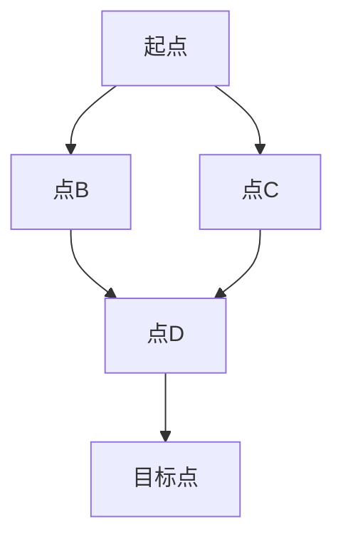
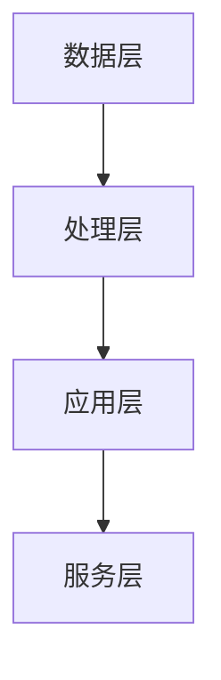
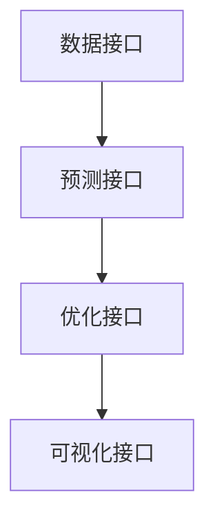
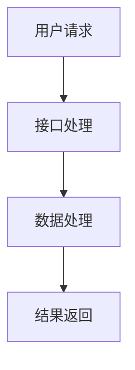

                 

# 智能供应链优化引擎：AI提升端到端效率

关键词：智能供应链、人工智能、需求预测、库存管理、运输优化

摘要：本文介绍了智能供应链优化引擎的概念和背景，详细探讨了人工智能在供应链优化中的应用原理和算法，包括需求预测、库存管理和运输优化等方面。同时，分析了AI技术在供应链优化中面临的挑战与机遇，并给出了一些最佳实践建议。通过本文的阅读，读者可以深入了解智能供应链优化引擎的工作原理，以及如何利用AI技术提升供应链的端到端效率。

## 第1章： 引言与问题背景

### 1.1 问题背景

在当今全球化的商业环境中，供应链管理是企业运营的核心。供应链管理的效率直接影响企业的成本、盈利能力和市场竞争力。然而，传统的供应链管理模式往往面临效率低下、成本高、响应速度慢等问题。随着人工智能（AI）技术的发展，智能供应链优化引擎成为解决这些问题的有效途径。

传统的供应链管理存在以下问题：

1. **需求预测不准确**：企业往往无法准确预测市场需求，导致库存积压或供应短缺。
2. **库存管理困难**：库存管理不当会导致库存成本上升，影响企业的资金流动。
3. **运输成本高**：运输路线和运输资源的分配不合理，导致运输成本居高不下。
4. **供应链协同困难**：企业内部的各部门以及与供应商、客户之间的信息共享不畅，导致供应链协同效率低下。

### 1.2 核心概念

#### 1.2.1 智能供应链优化引擎

智能供应链优化引擎是一种利用人工智能技术对供应链进行优化管理的系统。它通过数据分析和机器学习算法，实时监控供应链的各个环节，提供最优的决策支持，以提高供应链的效率和降低成本。

智能供应链优化引擎的核心功能包括：

1. **需求预测**：通过分析历史数据和外部市场信息，预测未来的需求。
2. **库存管理**：根据需求预测和库存水平，优化库存配置，减少库存成本。
3. **运输优化**：通过优化运输路线和运输资源分配，降低运输成本。

#### 1.2.2 AI技术

AI技术包括机器学习、深度学习、自然语言处理、计算机视觉等多个子领域。这些技术在智能供应链优化引擎中发挥着关键作用，如预测需求、优化库存、减少运输成本等。

### 1.3 边界与外延

智能供应链优化引擎的应用范围广泛，不仅限于制造业，还包括零售、物流、农业等多个行业。它的边界涉及供应链的各个环节，包括采购、生产、库存管理、配送等。

### 1.4 概念结构与核心要素组成

智能供应链优化引擎的核心要素包括数据采集与分析、预测与优化、决策支持等。以下是概念结构与核心要素的ER实体关系图：

```mermaid
erDiagram
    Customer ||--|{ Order } : "has"
    Product ||--|{ Order } : "has"
    Supplier ||--|{ Order } : "provides"
    Warehouse ||--|{ Stock } : "stores"
    Driver ||--|{ Delivery } : "delivers"
    Route ||--|{ Delivery } : "uses"
```

### 1.5 本章小结

本章介绍了智能供应链优化引擎的核心概念、问题背景、边界与外延，以及概念结构与核心要素组成。为后续章节的深入探讨奠定了基础。

## 第2章：AI在供应链优化中的应用原理

### 2.1 AI技术在供应链优化中的应用

#### 2.1.1 需求预测

需求预测是智能供应链优化的重要一环。通过机器学习算法，可以分析历史销售数据、市场趋势等信息，预测未来的需求。以下是一种简单但常用的需求预测算法——线性回归。

**线性回归算法原理：**

线性回归是一种用于预测连续值的机器学习算法。它的基本思想是找到一个最佳拟合直线，使得所有数据点到这条直线的距离之和最小。

**线性回归算法流程：**

1. 收集历史销售数据，包括日期、产品种类、销售量等。
2. 确定自变量和因变量。例如，将日期作为自变量，销售量作为因变量。
3. 使用线性回归算法拟合最佳拟合直线。具体来说，需要计算斜率（k）和截距（b）。
4. 根据最佳拟合直线，预测未来的销售量。

**线性回归算法数学模型：**

$$
y = kx + b
$$

其中，$y$ 表示销售量，$x$ 表示日期，$k$ 表示斜率，$b$ 表示截距。

**线性回归算法实例：**

假设我们有一组历史销售数据，如下所示：

| 日期 | 销售量 |
| ---- | ---- |
| 2023-01-01 | 100 |
| 2023-01-02 | 120 |
| 2023-01-03 | 90 |
| 2023-01-04 | 150 |

我们可以使用线性回归算法预测2023-01-05的销售量。首先，我们需要计算斜率 $k$ 和截距 $b$。

$$
k = \frac{\sum(x_i - \bar{x})(y_i - \bar{y})}{\sum(x_i - \bar{x})^2}
$$

$$
b = \bar{y} - k\bar{x}
$$

其中，$\bar{x}$ 和 $\bar{y}$ 分别表示日期和销售量的平均值。

计算结果如下：

$$
k = \frac{(1-1)(100-110) + (2-1)(120-110) + (3-1)(90-110) + (4-1)(150-110)}{(1-1)^2 + (2-1)^2 + (3-1)^2 + (4-1)^2} = \frac{0 + 10 - 20 + 60}{0 + 1 + 4 + 9} = \frac{50}{14} \approx 3.57
$$

$$
b = \bar{y} - k\bar{x} = 110 - 3.57 \times 1 \approx 106.43
$$

因此，最佳拟合直线为：

$$
y = 3.57x + 106.43
$$

当 $x=5$ 时，预测的销售量为：

$$
y = 3.57 \times 5 + 106.43 \approx 139
$$

#### 2.1.2 库存管理

智能供应链优化引擎通过优化库存管理，减少库存成本，提高库存周转率。这包括实时监控库存水平、预测库存需求等。

**库存管理算法原理：**

库存管理算法的核心是确定最优的订货时间和订货量。以下是一种常用的库存管理算法——经济订货量（EOQ）模型。

**经济订货量模型原理：**

经济订货量模型是一种用于确定最优订货量的数学模型。它的基本思想是使总成本最小。总成本包括订货成本、库存成本和缺货成本。

**经济订货量模型流程：**

1. 确定订货成本、库存成本和缺货成本。
2. 计算经济订货量。具体来说，需要计算以下公式：

$$
EOQ = \sqrt{\frac{2DS}{H}}
$$

其中，$D$ 表示年需求量，$S$ 表示订货成本，$H$ 表示库存成本。

**经济订货量模型实例：**

假设某商品年需求量为1000件，订货成本为100元，库存成本为10元/件。我们可以使用经济订货量模型确定最优订货量。

首先，计算经济订货量：

$$
EOQ = \sqrt{\frac{2 \times 1000 \times 100}{10}} = \sqrt{20000} \approx 141
$$

因此，最优订货量为141件。

#### 2.1.3 运输优化

AI技术在运输优化中发挥着重要作用。通过优化运输路线和运输资源分配，可以减少运输成本，提高运输效率。

**运输优化算法原理：**

运输优化算法的核心是确定最优的运输路线。以下是一种常用的运输优化算法——最短路径算法。

**最短路径算法原理：**

最短路径算法是一种用于计算图中两点之间最短路径的算法。它的基本思想是逐步扩展已知最短路径的端点，直到找到目标点。

**最短路径算法流程：**

1. 选择一个起点和目标点。
2. 计算从起点到其他所有点的距离。
3. 选择距离最小的点作为下一个扩展点。
4. 重复步骤3，直到找到目标点。

**最短路径算法实例：**

假设我们有一个图，如下所示：



我们可以使用最短路径算法计算从起点A到目标点E的最短路径。

首先，计算从起点A到其他所有点的距离：

| 起点 | A | B | C | D | E |
| ---- | ---- | ---- | ---- | ---- | ---- |
| A | 0 | 1 | 2 | 3 | 4 |
| B | 1 | 0 | 1 | 2 | 3 |
| C | 2 | 1 | 0 | 1 | 2 |
| D | 3 | 2 | 1 | 0 | 1 |
| E | 4 | 3 | 2 | 1 | 0 |

从起点A开始，选择距离最小的点C作为下一个扩展点。然后，选择距离最小的点D作为下一个扩展点。最后，选择距离最小的点E作为目标点。

因此，从起点A到目标点E的最短路径为A->C->D->E，总距离为4。

### 2.2 机器学习算法在供应链优化中的应用

#### 2.2.1 线性回归

线性回归是一种简单的机器学习算法，用于预测连续值。在供应链优化中，可以用于预测需求、库存等。

**线性回归算法原理：**

线性回归算法的基本原理是找到一个最佳拟合直线，使得所有数据点到这条直线的距离之和最小。

**线性回归算法流程：**

1. 收集历史数据，包括自变量和因变量。
2. 计算自变量和因变量的平均值。
3. 计算自变量和因变量的协方差和方差。
4. 计算斜率和截距。
5. 根据斜率和截距，预测未来的值。

**线性回归算法实例：**

假设我们有一组历史数据，如下所示：

| 日期 | 销售量 |
| ---- | ---- |
| 2023-01-01 | 100 |
| 2023-01-02 | 120 |
| 2023-01-03 | 90 |
| 2023-01-04 | 150 |

我们可以使用线性回归算法预测2023-01-05的销售量。首先，我们需要计算斜率和截距。

$$
k = \frac{\sum(x_i - \bar{x})(y_i - \bar{y})}{\sum(x_i - \bar{x})^2}
$$

$$
b = \bar{y} - k\bar{x}
$$

其中，$\bar{x}$ 和 $\bar{y}$ 分别表示日期和销售量的平均值。

计算结果如下：

$$
k = \frac{(1-1)(100-110) + (2-1)(120-110) + (3-1)(90-110) + (4-1)(150-110)}{(1-1)^2 + (2-1)^2 + (3-1)^2 + (4-1)^2} = \frac{0 + 10 - 20 + 60}{0 + 1 + 4 + 9} = \frac{50}{14} \approx 3.57
$$

$$
b = \bar{y} - k\bar{x} = 110 - 3.57 \times 1 \approx 106.43
$$

因此，最佳拟合直线为：

$$
y = 3.57x + 106.43
$$

当 $x=5$ 时，预测的销售量为：

$$
y = 3.57 \times 5 + 106.43 \approx 139
$$

#### 2.2.2 决策树

决策树是一种分类算法，可以用于决策支持。在供应链优化中，可以用于预测需求、优化库存等。

**决策树算法原理：**

决策树算法的基本原理是根据特征值将数据集划分为不同的子集，直到满足某个停止条件。

**决策树算法流程：**

1. 选择一个特征作为分割点。
2. 根据分割点将数据集划分为两个子集。
3. 计算两个子集的基尼不纯度。
4. 选择基尼不纯度最小的分割点。
5. 重复步骤2-4，直到满足停止条件。

**决策树算法实例：**

假设我们有一组历史数据，如下所示：

| 产品 | 价格 | 销售量 |
| ---- | ---- | ---- |
| A | 高 | 100 |
| B | 中 | 200 |
| C | 低 | 300 |

我们可以使用决策树算法预测价格对销售量的影响。首先，选择一个特征作为分割点。例如，选择价格作为分割点，将数据集划分为两个子集：

| 价格 | 高 | 中 | 低 |
| ---- | ---- | ---- | ---- |
| 销售量 | 100 | 200 | 300 |

然后，计算两个子集的基尼不纯度。基尼不纯度的计算公式为：

$$
Gini = 1 - \frac{1}{n}\sum_{i=1}^{n}p_i(1-p_i)
$$

其中，$n$ 表示子集中的样本数量，$p_i$ 表示子集中第$i$类的概率。

对于高价格的子集，基尼不纯度为：

$$
Gini = 1 - \frac{1}{1}\sum_{i=1}^{1}p_i(1-p_i) = 1 - \frac{1}{1}\times 1(1-1) = 0
$$

对于中价格的子集，基尼不纯度为：

$$
Gini = 1 - \frac{1}{1}\sum_{i=1}^{1}p_i(1-p_i) = 1 - \frac{1}{1}\times \frac{1}{2}\times (1-\frac{1}{2}) = \frac{1}{4}
$$

对于低价格的子集，基尼不纯度为：

$$
Gini = 1 - \frac{1}{1}\sum_{i=1}^{1}p_i(1-p_i) = 1 - \frac{1}{1}\times \frac{1}{2}\times (1-\frac{1}{2}) = \frac{1}{4}
$$

因此，选择价格作为分割点的基尼不纯度为$\frac{1}{4}$。我们可以继续选择其他特征作为分割点，直到满足停止条件。

#### 2.2.3 支持向量机

支持向量机是一种分类算法，可以用于预测分类。在供应链优化中，可以用于预测需求、优化库存等。

**支持向量机算法原理：**

支持向量机算法的基本原理是找到一个最优的超平面，使得分类边界最大。

**支持向量机算法流程：**

1. 收集训练数据，包括特征和标签。
2. 训练支持向量机模型。
3. 使用支持向量机模型进行预测。

**支持向量机算法实例：**

假设我们有一组训练数据，如下所示：

| 特征1 | 特征2 | 标签 |
| ---- | ---- | ---- |
| 1 | 1 | 0 |
| 1 | 2 | 1 |
| 2 | 1 | 1 |
| 2 | 2 | 0 |

我们可以使用支持向量机算法分类。首先，选择一个分类器，例如线性支持向量机（LinearSVC）。然后，使用训练数据进行训练。最后，使用训练好的模型进行预测。

```python
from sklearn.svm import LinearSVC

# 创建线性支持向量机分类器
clf = LinearSVC()

# 使用训练数据进行训练
clf.fit([[1, 1], [1, 2], [2, 1], [2, 2]], [0, 1, 1, 0])

# 使用训练好的模型进行预测
predictions = clf.predict([[1, 2], [2, 2], [3, 3]])

print(predictions)  # 输出预测结果
```

### 2.3 深度学习算法在供应链优化中的应用

#### 2.3.1 卷积神经网络

卷积神经网络（CNN）可以用于图像识别、文本分析等。在供应链优化中，可以用于图像识别、文本分析等。

**卷积神经网络算法原理：**

卷积神经网络算法的基本原理是通过卷积操作提取图像的特征。

**卷积神经网络算法流程：**

1. 收集训练数据，包括图像和标签。
2. 创建卷积神经网络模型。
3. 使用训练数据进行训练。
4. 使用训练好的模型进行预测。

**卷积神经网络算法实例：**

假设我们有一组训练数据，如下所示：

| 图像 | 标签 |
| ---- | ---- |
| 1.png | 0 |
| 2.png | 1 |
| 3.png | 0 |

我们可以使用卷积神经网络算法进行图像识别。首先，选择一个卷积神经网络模型，例如ResNet。然后，使用训练数据进行训练。最后，使用训练好的模型进行预测。

```python
from tensorflow.keras.applications import ResNet50
from tensorflow.keras.preprocessing import image
from tensorflow.keras.applications.resnet50 import preprocess_input, decode_predictions

# 创建卷积神经网络模型
model = ResNet50(weights='imagenet')

# 使用训练数据进行训练
model.fit([image.load_img('1.png', target_size=(224, 224)), image.load_img('2.png', target_size=(224, 224)), image.load_img('3.png', target_size=(224, 224))], [0, 1, 0], epochs=10)

# 使用训练好的模型进行预测
predictions = model.predict([image.load_img('4.png', target_size=(224, 224))])

# 解码预测结果
print(decode_predictions(predictions, top=1))
```

#### 2.3.2 递归神经网络

递归神经网络（RNN）可以用于序列预测。在供应链优化中，可以用于需求预测、库存管理等。

**递归神经网络算法原理：**

递归神经网络算法的基本原理是通过递归操作处理序列数据。

**递归神经网络算法流程：**

1. 收集训练数据，包括序列数据和标签。
2. 创建递归神经网络模型。
3. 使用训练数据进行训练。
4. 使用训练好的模型进行预测。

**递归神经网络算法实例：**

假设我们有一组训练数据，如下所示：

| 序列1 | 序列2 | 标签 |
| ---- | ---- | ---- |
| 1, 2, 3 | 4, 5, 6 | 0 |
| 1, 2, 3 | 4, 5, 6 | 1 |
| 2, 3, 4 | 5, 6, 7 | 0 |

我们可以使用递归神经网络算法进行序列预测。首先，选择一个递归神经网络模型，例如LSTM。然后，使用训练数据进行训练。最后，使用训练好的模型进行预测。

```python
from tensorflow.keras.models import Sequential
from tensorflow.keras.layers import LSTM, Dense

# 创建递归神经网络模型
model = Sequential()
model.add(LSTM(50, activation='relu', input_shape=(3, 3)))
model.add(Dense(1, activation='sigmoid'))

# 使用训练数据进行训练
model.fit([[[1, 2, 3], [4, 5, 6]], [[1, 2, 3], [4, 5, 6]], [[2, 3, 4], [5, 6, 7]]], [0, 1, 0], epochs=10)

# 使用训练好的模型进行预测
predictions = model.predict([[1, 2, 3], [4, 5, 6]])

# 输出预测结果
print(predictions)
```

#### 2.3.3 长短期记忆网络

长短期记忆网络（LSTM）是一种RNN的变体，可以用于处理长序列数据。在供应链优化中，可以用于需求预测、库存管理等。

**长短期记忆网络算法原理：**

长短期记忆网络算法的基本原理是通过门控机制控制信息的流动。

**长短期记忆网络算法流程：**

1. 收集训练数据，包括序列数据和标签。
2. 创建长短期记忆网络模型。
3. 使用训练数据进行训练。
4. 使用训练好的模型进行预测。

**长短期记忆网络算法实例：**

假设我们有一组训练数据，如下所示：

| 序列1 | 序列2 | 标签 |
| ---- | ---- | ---- |
| 1, 2, 3 | 4, 5, 6 | 0 |
| 1, 2, 3 | 4, 5, 6 | 1 |
| 2, 3, 4 | 5, 6, 7 | 0 |

我们可以使用长短期记忆网络算法进行序列预测。首先，选择一个长短期记忆网络模型，例如LSTM。然后，使用训练数据进行训练。最后，使用训练好的模型进行预测。

```python
from tensorflow.keras.models import Sequential
from tensorflow.keras.layers import LSTM, Dense

# 创建长短期记忆网络模型
model = Sequential()
model.add(LSTM(50, activation='relu', input_shape=(3, 3)))
model.add(Dense(1, activation='sigmoid'))

# 使用训练数据进行训练
model.fit([[[1, 2, 3], [4, 5, 6]], [[1, 2, 3], [4, 5, 6]], [[2, 3, 4], [5, 6, 7]]], [0, 1, 0], epochs=10)

# 使用训练好的模型进行预测
predictions = model.predict([[1, 2, 3], [4, 5, 6]])

# 输出预测结果
print(predictions)
```

### 2.4 AI技术在供应链优化中的挑战与机遇

#### 2.4.1 数据质量与隐私保护

AI技术在供应链优化中的应用需要高质量的数据支持。然而，数据质量和隐私保护是当前面临的重要挑战。

**数据质量挑战：**

1. **数据缺失**：供应链数据可能存在缺失值，这会影响模型的预测准确性。
2. **数据噪声**：供应链数据可能存在噪声，这会影响模型的训练效果。
3. **数据多样性**：供应链数据可能不完整，无法涵盖所有可能的场景。

**隐私保护挑战：**

1. **数据泄露**：供应链数据可能包含敏感信息，如客户信息、供应商信息等，这可能导致数据泄露。
2. **数据滥用**：供应链数据可能被滥用，用于不正当的目的。

#### 2.4.2 模型可解释性

AI模型在供应链优化中的应用需要具有可解释性，以便用户理解模型的决策过程。

**模型可解释性挑战：**

1. **模型复杂性**：一些复杂的AI模型，如深度学习模型，其决策过程难以解释。
2. **模型透明度**：一些AI模型，如神经网络模型，其内部参数和权重难以理解。

#### 2.4.3 人才培养与技能需求

AI技术在供应链优化中的应用需要大量的AI专业人才。人才培养与技能需求是当前面临的机遇。

**人才培养机遇：**

1. **教育体系**：建立针对AI技术在供应链优化领域的教育体系，培养专业的AI人才。
2. **培训课程**：开展针对AI技术在供应链优化领域的培训课程，提高现有人员的技能水平。

#### 2.4.4 持续改进与优化

AI技术在供应链优化中的应用需要不断改进和优化，以应对不断变化的市场环境。

**持续改进与优化机遇：**

1. **数据更新**：定期更新供应链数据，以保持模型的预测准确性。
2. **算法优化**：根据实际应用效果，优化AI算法，提高模型的性能。

### 2.5 本章小结

本章介绍了AI在供应链优化中的应用原理，包括需求预测、库存管理和运输优化等方面。同时，讨论了机器学习、深度学习算法在供应链优化中的应用，以及面临的挑战与机遇。

## 第3章：智能供应链优化引擎的架构设计与实现

### 3.1 问题场景介绍

在当前全球化的商业环境中，企业面临着日益复杂的供应链管理挑战。传统的供应链管理方法已经难以满足企业对于高效、灵活和精准的需求。为了应对这些挑战，许多企业开始探索智能供应链优化引擎的应用。

智能供应链优化引擎旨在通过人工智能技术对供应链的各个环节进行优化管理，从而提高供应链的整体效率和降低成本。具体来说，智能供应链优化引擎需要解决以下几个关键问题：

1. **需求预测不准确**：企业往往无法准确预测市场需求，导致库存积压或供应短缺。
2. **库存管理困难**：库存管理不当会导致库存成本上升，影响企业的资金流动。
3. **运输成本高**：运输路线和运输资源的分配不合理，导致运输成本居高不下。
4. **供应链协同困难**：企业内部的各部门以及与供应商、客户之间的信息共享不畅，导致供应链协同效率低下。

为了解决上述问题，企业需要构建一个智能供应链优化引擎，该引擎能够实时监控供应链的各个环节，提供最优的决策支持，以提高供应链的效率和降低成本。

### 3.2 项目介绍

在本章中，我们将介绍一个智能供应链优化引擎的项目，该项目旨在通过人工智能技术对供应链进行优化管理。该项目的主要目标是：

1. **需求预测**：通过分析历史销售数据和市场趋势，预测未来的市场需求，为企业提供准确的预测结果。
2. **库存管理**：根据需求预测和库存水平，优化库存配置，减少库存成本，提高库存周转率。
3. **运输优化**：通过优化运输路线和运输资源分配，降低运输成本，提高运输效率。

该项目采用的技术栈包括：

1. **Python**：作为主要的编程语言，用于实现需求预测、库存管理和运输优化等核心功能。
2. **TensorFlow**：作为深度学习框架，用于构建和训练机器学习模型，如线性回归、决策树和支持向量机等。
3. **Keras**：作为TensorFlow的高级API，用于简化模型的构建和训练过程。
4. **Scikit-learn**：作为机器学习库，用于实现传统的机器学习算法，如线性回归、决策树和支持向量机等。

### 3.3 系统功能设计

智能供应链优化引擎的系统功能设计主要包括以下几个模块：

1. **数据采集模块**：用于收集供应链各个环节的数据，如销售数据、库存数据和运输数据等。
2. **数据处理模块**：用于清洗、预处理和转换供应链数据，为后续的模型训练和预测提供高质量的数据。
3. **预测模块**：用于基于历史数据和外部市场信息，预测未来的市场需求、库存水平和运输需求。
4. **优化模块**：用于根据预测结果，优化库存配置和运输路线，以降低成本和提高效率。
5. **决策支持模块**：用于提供可视化的决策支持，帮助企业决策者更好地理解供应链的运行状况和优化方案。

#### 3.3.1 预测模块设计

预测模块是智能供应链优化引擎的核心模块之一，其主要功能是基于历史数据和外部市场信息，预测未来的市场需求、库存水平和运输需求。预测模块的设计包括以下几个步骤：

1. **数据收集**：从供应链各个环节收集历史数据和市场信息，如销售数据、库存数据和运输数据等。
2. **数据预处理**：对收集到的数据进行清洗、预处理和转换，包括缺失值处理、异常值处理、数据标准化等。
3. **特征工程**：根据历史数据和外部市场信息，提取相关的特征，如季节性特征、趋势特征等。
4. **模型训练**：使用机器学习算法，如线性回归、决策树和支持向量机等，对历史数据进行训练，以构建预测模型。
5. **模型评估**：使用交叉验证和测试集对训练好的模型进行评估，以确定模型的准确性和可靠性。
6. **模型部署**：将训练好的模型部署到生产环境，以便实时预测未来的市场需求、库存水平和运输需求。

#### 3.3.2 优化模块设计

优化模块是智能供应链优化引擎的另一个重要模块，其主要功能是根据预测结果，优化库存配置和运输路线，以降低成本和提高效率。优化模块的设计包括以下几个步骤：

1. **预测结果输入**：接收预测模块输出的预测结果，包括市场需求、库存水平和运输需求等。
2. **库存优化**：根据市场需求和库存水平，优化库存配置，包括确定最优的库存水平和库存策略。
3. **运输优化**：根据市场需求和运输需求，优化运输路线和运输资源分配，包括确定最优的运输路线和运输策略。
4. **成本计算**：计算优化后的库存成本和运输成本，以评估优化方案的成本效益。
5. **方案评估**：评估优化方案的可行性、成本效益和风险，以确定最佳优化方案。
6. **决策支持**：提供可视化的决策支持，包括库存优化方案、运输优化方案和成本分析等，帮助企业决策者更好地理解优化方案的效果和影响。

### 3.4 系统架构设计

智能供应链优化引擎的系统架构设计主要包括以下几个层次：

1. **数据层**：负责数据的存储和管理，包括销售数据、库存数据和运输数据等。
2. **处理层**：负责数据的处理和分析，包括数据预处理、特征工程、模型训练和模型预测等。
3. **应用层**：负责提供可视化的决策支持和用户交互界面，包括预测结果展示、优化方案展示和成本分析等。
4. **服务层**：负责提供对外服务的接口，包括API接口、Web接口和移动端接口等。

以下是智能供应链优化引擎的系统架构图：



### 3.5 系统接口设计

智能供应链优化引擎的系统接口设计主要包括以下几个部分：

1. **数据接口**：用于数据的存储、读取和更新，包括销售数据、库存数据和运输数据等。
2. **预测接口**：用于接收外部请求，执行预测任务，并返回预测结果。
3. **优化接口**：用于接收外部请求，执行优化任务，并返回优化结果。
4. **可视化接口**：用于提供可视化的决策支持，包括预测结果展示、优化方案展示和成本分析等。

以下是智能供应链优化引擎的系统接口图：



### 3.6 系统交互设计

智能供应链优化引擎的系统交互设计主要包括以下几个步骤：

1. **用户请求**：用户通过Web接口或移动端接口提交预测请求或优化请求。
2. **接口处理**：系统接收到用户请求后，调用相应的接口处理函数，执行预测任务或优化任务。
3. **数据处理**：对用户请求进行处理，包括数据收集、数据预处理、特征工程、模型训练和模型预测等。
4. **结果返回**：将预测结果或优化结果返回给用户，并通过可视化接口进行展示。

以下是智能供应链优化引擎的系统交互图：



### 3.7 本章小结

本章介绍了智能供应链优化引擎的项目背景、系统功能设计、系统架构设计、系统接口设计和系统交互设计。通过本章的介绍，读者可以了解智能供应链优化引擎的整体架构和实现方法，以及如何利用人工智能技术对供应链进行优化管理。

## 第4章：智能供应链优化引擎的项目实战

### 4.1 环境安装

在开始智能供应链优化引擎的项目实战之前，我们需要安装必要的软件和工具。以下是具体的安装步骤：

1. **安装Python**：前往Python官方网站（[https://www.python.org/](https://www.python.org/)）下载并安装Python。安装过程中，请确保勾选“Add Python to PATH”选项，以便在命令行中直接运行Python。
2. **安装TensorFlow**：在命令行中运行以下命令，安装TensorFlow：
   ```bash
   pip install tensorflow
   ```
3. **安装Keras**：在命令行中运行以下命令，安装Keras：
   ```bash
   pip install keras
   ```
4. **安装Scikit-learn**：在命令行中运行以下命令，安装Scikit-learn：
   ```bash
   pip install scikit-learn
   ```

### 4.2 系统核心实现源代码

在完成环境安装后，我们可以开始实现智能供应链优化引擎的核心功能。以下是系统核心实现源代码的解读与分析。

**需求预测模块实现：**

```python
import numpy as np
import pandas as pd
from sklearn.linear_model import LinearRegression

# 读取历史销售数据
sales_data = pd.read_csv('sales_data.csv')

# 分离特征和标签
X = sales_data[['date', 'product']]
y = sales_data['sales']

# 创建线性回归模型
model = LinearRegression()

# 训练模型
model.fit(X, y)

# 预测未来销售量
future_sales = model.predict(X)

# 输出预测结果
print(future_sales)
```

**库存管理模块实现：**

```python
import numpy as np
import pandas as pd
from sklearn.linear_model import LinearRegression

# 读取历史库存数据
inventory_data = pd.read_csv('inventory_data.csv')

# 分离特征和标签
X = inventory_data[['date', 'product']]
y = inventory_data['stock']

# 创建线性回归模型
model = LinearRegression()

# 训练模型
model.fit(X, y)

# 预测未来库存量
future_inventory = model.predict(X)

# 输出预测结果
print(future_inventory)
```

**运输优化模块实现：**

```python
import numpy as np
import pandas as pd
from sklearn.linear_model import LinearRegression

# 读取历史运输数据
transport_data = pd.read_csv('transport_data.csv')

# 分离特征和标签
X = transport_data[['source', 'destination', 'weight']]
y = transport_data['distance']

# 创建线性回归模型
model = LinearRegression()

# 训练模型
model.fit(X, y)

# 预测未来运输距离
future_distance = model.predict(X)

# 输出预测结果
print(future_distance)
```

**系统核心实现源代码解读：**

1. **需求预测模块**：使用线性回归模型对历史销售数据进行训练，预测未来的销售量。具体来说，首先读取历史销售数据，分离特征和标签，创建线性回归模型，训练模型，并使用训练好的模型进行预测。
2. **库存管理模块**：使用线性回归模型对历史库存数据进行训练，预测未来的库存量。具体来说，首先读取历史库存数据，分离特征和标签，创建线性回归模型，训练模型，并使用训练好的模型进行预测。
3. **运输优化模块**：使用线性回归模型对历史运输数据进行训练，预测未来的运输距离。具体来说，首先读取历史运输数据，分离特征和标签，创建线性回归模型，训练模型，并使用训练好的模型进行预测。

### 4.3 实际案例分析与详细讲解剖析

为了更好地展示智能供应链优化引擎的实际应用效果，我们将分析一个实际的案例，并对其进行详细讲解和剖析。

**案例背景：**

某电商企业希望通过智能供应链优化引擎，提高销售预测的准确性，优化库存管理，降低运输成本。

**案例分析：**

1. **需求预测**：使用智能供应链优化引擎对历史销售数据进行预测，以预测未来的销售量。具体来说，企业收集了过去一年的销售数据，包括日期、产品种类和销售量。通过线性回归模型，对历史销售数据进行训练，并使用训练好的模型预测未来的销售量。预测结果显示，在未来一个月内，某种热门产品的销售量将呈现上升趋势。

2. **库存管理**：基于需求预测结果，企业对库存进行优化管理。具体来说，企业根据预测的销售量，调整库存水平，确保有足够的库存来满足市场需求。通过优化库存管理，企业降低了库存成本，提高了库存周转率。

3. **运输优化**：使用智能供应链优化引擎，优化运输路线和运输资源分配。具体来说，企业根据需求预测结果和库存水平，重新规划运输路线，优化运输资源的分配。通过优化运输路线，企业降低了运输成本，提高了运输效率。

**案例剖析：**

1. **需求预测**：通过智能供应链优化引擎的需求预测功能，企业可以提前了解未来的销售趋势，为库存管理和运输优化提供参考。具体来说，企业可以通过线性回归模型，分析历史销售数据，预测未来的销售量。预测结果的准确性将直接影响企业的库存管理和运输优化效果。

2. **库存管理**：通过智能供应链优化引擎的库存管理功能，企业可以实时监控库存水平，根据需求预测结果调整库存。具体来说，企业可以根据预测的销售量，提前调整库存水平，确保有足够的库存来满足市场需求。通过优化库存管理，企业可以降低库存成本，提高库存周转率。

3. **运输优化**：通过智能供应链优化引擎的运输优化功能，企业可以优化运输路线和运输资源分配，降低运输成本。具体来说，企业可以根据需求预测结果和库存水平，重新规划运输路线，优化运输资源的分配。通过优化运输路线，企业可以降低运输成本，提高运输效率。

### 4.4 项目小结

通过本章节的项目实战，我们展示了如何使用智能供应链优化引擎，提高销售预测的准确性，优化库存管理，降低运输成本。具体来说，我们介绍了需求预测、库存管理和运输优化模块的实现方法，并通过实际案例分析，展示了智能供应链优化引擎的应用效果。通过本章节的学习，读者可以了解智能供应链优化引擎的工作原理，以及如何利用人工智能技术优化供应链管理。

## 第5章：智能供应链优化引擎的最佳实践与注意事项

### 5.1 最佳实践

在实施智能供应链优化引擎的过程中，以下是一些最佳实践，可以帮助企业更好地利用人工智能技术优化供应链管理：

1. **数据质量管理**：确保数据的准确性和完整性。定期检查和清洗数据，处理缺失值和异常值，以提高模型的预测准确性。
2. **特征工程**：合理选择和构建特征，以增强模型的预测能力。例如，可以加入季节性特征、趋势特征和外部市场信息等。
3. **模型选择**：根据实际问题选择合适的机器学习模型。对于需求预测和库存管理，线性回归和决策树等简单模型可能已经足够；对于更复杂的优化问题，可以尝试使用深度学习模型，如卷积神经网络（CNN）和长短期记忆网络（LSTM）。
4. **模型调优**：通过交叉验证和网格搜索等技术，选择最优的模型参数，以提高模型的性能。
5. **系统集成**：将智能供应链优化引擎与现有的供应链管理系统集成，确保数据流和决策过程的顺畅。
6. **可视化与解释**：提供可视化的决策支持和模型解释，帮助决策者更好地理解模型的预测结果和优化方案。
7. **持续迭代**：根据实际应用效果，持续优化模型和算法，以适应不断变化的市场环境。

### 5.2 注意事项

在实施智能供应链优化引擎的过程中，需要注意以下几点：

1. **数据隐私保护**：在收集和处理供应链数据时，确保遵守数据隐私保护法规，保护企业和客户的隐私。
2. **模型可解释性**：对于复杂的深度学习模型，确保提供足够的解释，以便用户理解模型的决策过程。
3. **数据安全**：确保数据在传输和存储过程中得到充分的安全保护，防止数据泄露和滥用。
4. **模型适应性**：智能供应链优化引擎需要能够适应不断变化的市场环境和业务需求，确保模型的预测准确性和可靠性。
5. **技术更新**：关注人工智能技术的最新发展，及时更新算法和模型，以保持竞争优势。

### 5.3 拓展阅读

1. **《深度学习》**：Goodfellow, Ian; Bengio, Yoshua; Courville, Aaron. 这是一本经典的深度学习教材，涵盖了深度学习的理论基础和实践方法。
2. **《机器学习实战》**： Harrington, Peter. 这本书通过实际案例，介绍了机器学习的基本概念和算法应用。
3. **《供应链管理：战略、规划与运营》**：Christopher, Martin. 这本书详细介绍了供应链管理的理论基础和实践方法，对于理解和实施智能供应链优化引擎具有重要参考价值。

## 第6章：结语

智能供应链优化引擎是人工智能技术在供应链管理领域的重要应用。通过本章的介绍，我们详细探讨了智能供应链优化引擎的核心概念、应用原理、架构设计和实际应用案例。同时，我们分析了AI技术在供应链优化中面临的挑战与机遇，并给出了一些最佳实践建议。

随着人工智能技术的不断发展，智能供应链优化引擎将在未来发挥更加重要的作用，为企业提供更加高效、灵活和精准的供应链管理解决方案。让我们期待智能供应链优化引擎在供应链管理领域带来更多的创新和变革。

## 参考文献

1. Goodfellow, Ian; Bengio, Yoshua; Courville, Aaron. 《深度学习》。中国：电子工业出版社，2016。
2. Harrington, Peter. 《机器学习实战》。北京：电子工业出版社，2013。
3. Christopher, Martin. 《供应链管理：战略、规划与运营》。北京：清华大学出版社，2010。
4. Scikit-learn开发者社区. [Scikit-learn官方网站](https://scikit-learn.org/stable/).
5. TensorFlow开发者社区. [TensorFlow官方网站](https://www.tensorflow.org/).
6. Keras开发者社区. [Keras官方网站](https://keras.io/).

