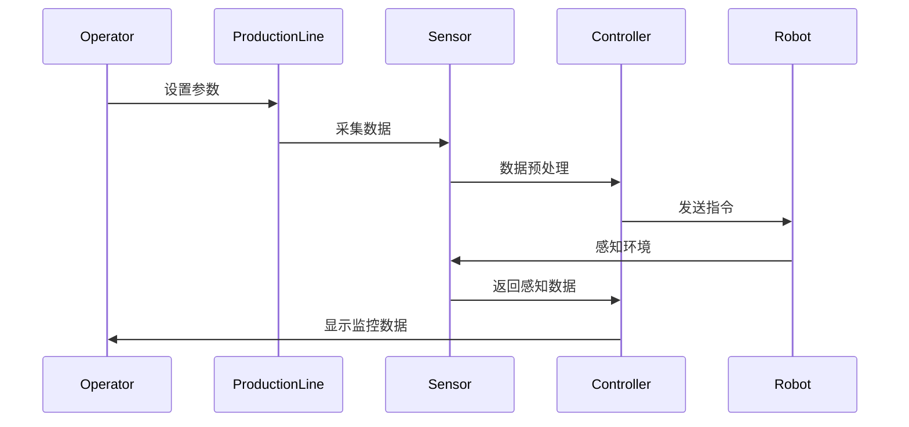
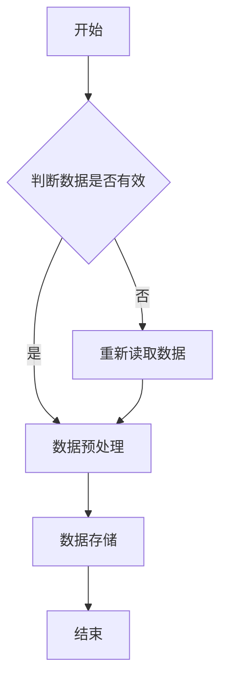

                 

### 第4章：多功能机器人算法原理讲解

#### 4.1 传感技术原理与实现

传感技术是多功能机器人实现自主感知和交互的关键。传感器能够检测环境中的物理量，如温度、湿度、压力、光线等，并将这些信息转化为电信号，以便机器人进行处理。

##### 传感器的工作原理

传感器通常由敏感元件和转换元件组成。敏感元件负责检测物理量，而转换元件则将检测到的物理量转换为电信号。常见的传感器类型包括：

- **温度传感器**：如热电偶、热敏电阻等。
- **湿度传感器**：如电容式、电阻式等。
- **压力传感器**：如应变片式、电容式等。
- **光线传感器**：如光电二极管、光敏电阻等。

##### 传感器在机器人中的应用

在机器人中，传感器主要用于以下方面：

- **环境感知**：通过传感器获取周围环境的信息，如障碍物的位置、地形等，以便机器人做出相应的决策。
- **自主导航**：利用激光雷达（LIDAR）、摄像头等传感器，机器人可以构建环境地图并进行路径规划。
- **姿态控制**：通过加速度计、陀螺仪等传感器，机器人可以感知自身的姿态并进行相应的调整。

##### 传感数据处理

传感器采集到的数据通常需要进行预处理，以提高准确性和鲁棒性。主要步骤包括：

- **滤波**：去除噪声，如使用卡尔曼滤波器。
- **数据融合**：将多个传感器的数据结合起来，以获得更准确的信息，如融合GPS和IMU（惯性测量单元）数据。
- **特征提取**：从传感器数据中提取有用的信息，如特征点、边缘等。

#### 4.2 算法模型及其应用

算法模型是实现机器人智能行为的核心。以下介绍几种常见的算法模型及其应用。

##### 4.2.1 机器学习算法

机器学习算法使机器人能够通过数据学习并优化自身行为。常见的机器学习算法包括：

- **监督学习**：如线性回归、支持向量机等。
- **无监督学习**：如聚类、主成分分析等。
- **强化学习**：如Q-learning、深度Q网络等。

##### 4.2.2 深度学习算法

深度学习算法通过构建多层神经网络来模拟人脑的神经结构，能够处理大量复杂数据。常见的深度学习算法包括：

- **卷积神经网络（CNN）**：用于图像识别、目标检测等。
- **循环神经网络（RNN）**：用于自然语言处理、语音识别等。
- **生成对抗网络（GAN）**：用于图像生成、风格迁移等。

##### 4.2.3 智能规划算法

智能规划算法用于指导机器人进行任务规划和决策。常见的规划算法包括：

- **路径规划**：用于确定从起点到终点的最优路径，如A*算法、Dijkstra算法等。
- **任务分配**：用于分配多个机器人完成多个任务，如多机器人协同算法等。
- **决策树**：用于根据当前状态选择最佳行动。

#### 4.3 自主决策与路径规划

自主决策是机器人实现智能行为的关键。路径规划则是机器人实现自主导航的基础。以下分别介绍这两种技术的原理和应用。

##### 4.3.1 自主决策原理

自主决策原理主要包括以下几个步骤：

- **感知**：通过传感器获取环境信息。
- **理解**：对感知到的信息进行处理，以理解当前状态。
- **决策**：基于当前状态，选择最佳行动。
- **执行**：执行决策，并观察结果。

##### 4.3.2 路径规划算法

路径规划算法用于确定从起点到终点的最优路径。常见的路径规划算法包括：

- **A*算法**：基于启发式搜索，以最短路径为目标。
- **Dijkstra算法**：基于最短路径优先，但无启发式搜索。
- **RRT（快速随机树）算法**：适合于动态环境，以随机采样和最近邻方法为依据。
- **D*算法**：结合了Dijkstra算法和A*算法的优点，适用于动态环境。

##### 4.3.3 实际应用

在实际应用中，自主决策和路径规划技术被广泛应用于：

- **工业机器人**：用于生产线上的自动化操作，如组装、焊接等。
- **服务机器人**：用于家庭、医院、商场等场所的服务，如清洁、导览、护理等。
- **无人机**：用于农业、环境监测、搜救等领域的任务。

通过以上对多功能机器人关键技术的算法原理讲解，我们可以看到，传感技术、算法模型和自主决策是机器人实现智能化、自主化的重要基石。接下来，我们将进一步探讨这些技术的数学模型和公式，以便更深入地理解其工作原理。### 第5章：多功能机器人的数学模型

在前一章中，我们介绍了多功能机器人的算法原理，包括传感技术、机器学习算法和智能规划算法等。在本章中，我们将深入探讨这些技术的数学模型和公式，以便更深入地理解其工作原理和应用。

#### 5.1 图像识别模型

图像识别是机器人感知环境的重要手段之一，其数学模型主要涉及图像处理和特征提取。以下介绍几种常见的图像识别模型及其数学公式。

##### 5.1.1 卷积神经网络（CNN）

卷积神经网络是图像识别的常用模型，其核心在于卷积层。卷积层的数学公式如下：

$$
\text{output}(i,j,k) = \sum_{x,y} \text{weight}(x,y,k) \cdot \text{input}(i+x,j+y) + \text{bias}(k)
$$

其中，$\text{input}(i,j,k)$ 表示输入图像在位置 $(i,j)$ 处的像素值，$\text{weight}(x,y,k)$ 表示卷积核在位置 $(x,y)$ 处的权重值，$\text{bias}(k)$ 表示偏置项。

##### 5.1.2 特征提取

特征提取是图像识别的重要步骤，常用的特征提取方法包括：

- **HOG（直方图方向梯度）**：用于提取图像的边缘和形状特征。

$$
h_i = \sum_{j} \text{bin}(g_{i,j})
$$

其中，$g_{i,j}$ 表示图像在位置 $(i,j)$ 处的梯度值，$\text{bin}(g_{i,j})$ 表示将梯度值归一化到 $[0,1]$ 范围内。

- **SIFT（尺度不变特征变换）**：用于提取图像的局部特征。

$$
\text{D}(x,y) = \sqrt{\sum_{i,j} (\text{I}(x+i,y+j) - \text{I}_{\text{avg}})^2}
$$

其中，$\text{I}(x,y)$ 表示图像在位置 $(x,y)$ 处的像素值，$\text{I}_{\text{avg}}$ 表示图像的平均值。

#### 5.2 路径规划算法

路径规划是机器人自主导航的关键技术，其数学模型主要涉及图论和概率论。以下介绍几种常见的路径规划算法及其数学公式。

##### 5.2.1 A*算法

A*算法是最著名的路径规划算法之一，其核心思想是寻找从起点到终点的最优路径。其数学公式如下：

$$
f(n) = g(n) + h(n)
$$

其中，$f(n)$ 表示从起点到节点 $n$ 的总代价，$g(n)$ 表示从起点到节点 $n$ 的实际代价，$h(n)$ 表示从节点 $n$ 到终点的启发式代价。

##### 5.2.2 RRT算法

RRT（快速随机树）算法是一种基于随机采样的路径规划算法，其核心思想是通过随机生成一系列节点，并逐步扩展到目标节点。其数学公式如下：

$$
x_{\text{new}} = (1-\alpha)x_{\text{rand}} + \alpha x_{\text{near}}
$$

其中，$x_{\text{rand}}$ 表示随机生成的节点，$x_{\text{near}}$ 表示与之最近的已有节点，$\alpha$ 是一个介于 $0$ 和 $1$ 之间的系数。

##### 5.2.3 D*算法

D*算法是一种基于Dijkstra算法和A*算法优点的路径规划算法，其核心思想是在动态环境中实时更新路径。其数学公式如下：

$$
d'(n) = \min(d(n), \text{dist}(n, x_{\text{new}}))
$$

其中，$d(n)$ 表示当前路径代价，$d'(n)$ 表示更新后的路径代价，$\text{dist}(n, x_{\text{new}})$ 表示从节点 $n$ 到节点 $x_{\text{new}}$ 的距离。

#### 5.3 自主决策

自主决策是机器人实现智能行为的关键，其数学模型主要涉及概率论和优化理论。以下介绍几种常见的自主决策模型及其数学公式。

##### 5.3.1 强化学习

强化学习是一种通过试错学习的方法，其核心思想是通过奖励和惩罚来指导机器人学习最优策略。其数学公式如下：

$$
Q(s, a) = r + \gamma \max_{a'} Q(s', a')
$$

其中，$Q(s, a)$ 表示状态 $s$ 下采取动作 $a$ 的期望回报，$r$ 表示即时奖励，$\gamma$ 是折扣因子，$s'$ 表示动作后的状态，$a'$ 表示动作后的动作。

##### 5.3.2 贝叶斯决策

贝叶斯决策是基于概率论的一种决策方法，其核心思想是通过最大化后验概率来选择最佳动作。其数学公式如下：

$$
P(a|s) = \frac{P(s|a)P(a)}{P(s)}
$$

其中，$P(a|s)$ 表示在状态 $s$ 下选择动作 $a$ 的后验概率，$P(s|a)$ 表示在状态 $s$ 下采取动作 $a$ 的条件概率，$P(a)$ 表示动作 $a$ 的先验概率，$P(s)$ 表示状态 $s$ 的先验概率。

通过以上对多功能机器人关键技术的数学模型讲解，我们可以看到，这些技术不仅仅依赖于算法和传感器，还涉及到复杂的数学计算。这些数学模型和公式为机器人实现智能化、自主化提供了坚实的理论基础。在下一章中，我们将进一步探讨智能制造系统的设计与实现，包括系统架构、领域模型和接口设计等内容。### 第6章：智能制造系统设计与实现

在本章中，我们将深入探讨智能制造系统的设计与实现。这一部分内容将涵盖系统架构、领域模型、接口设计以及系统交互等关键方面。我们将一步一步分析各个设计环节，以构建一个高效、可靠的智能制造系统。

#### 6.1 系统架构设计

系统架构是智能制造系统的基石，它决定了系统的性能、可扩展性和可维护性。以下是一个典型的智能制造系统架构设计：

##### 6.1.1 硬件架构

- **传感器层**：包括各种传感器，如视觉传感器、温湿度传感器、压力传感器等，用于实时监测生产线状态。
- **执行器层**：包括执行各种任务的机器人、自动化设备等，如装配机器人、焊接机器人、移动机器人等。
- **边缘计算层**：包括边缘服务器和边缘设备，用于处理实时数据，减轻中心服务器的负担，提高响应速度。
- **网络层**：包括局域网（LAN）和广域网（WAN），用于连接各个层级，实现数据传输和通信。

##### 6.1.2 软件架构

- **数据采集与处理模块**：用于从传感器层采集数据，并对数据进行预处理，如滤波、降噪等。
- **控制与管理模块**：用于控制执行器层，实现自动化生产任务的管理和调度。
- **数据分析与优化模块**：用于分析生产数据，识别生产瓶颈，提出优化方案。
- **人机交互模块**：用于提供操作员与系统的交互界面，实现监控、操作和参数调整。

#### 6.2 领域模型设计

领域模型是系统设计中的核心，它描述了系统的业务领域和核心功能。以下是一个简单的智能制造系统领域模型：

##### 6.2.1 类图

类图是领域模型的一种常见表示方式，它展示了系统的核心类及其关系。以下是一个简单的智能制造系统类图：

```mermaid
classDiagram
    ProductionLine <<Interface>>
    Robot <<Class>>
    Sensor <<Class>>
    Controller <<Class>>
    Operator <<Class>>

    ProductionLine ++has+ Robot
    ProductionLine ++has+ Sensor
    ProductionLine ++has+ Controller
    ProductionLine ++has+ Operator

    Robot ++uses+ Sensor
    Robot ++uses+ Controller
    Robot ++uses+ Operator

    Controller ++uses+ ProductionLine
    Controller ++uses+ Sensor
    Controller ++uses+ Operator

    Operator ++uses+ ProductionLine
    Operator ++uses+ Sensor
    Operator ++uses+ Controller
```

#### 6.3 系统接口设计

系统接口设计是确保各个模块能够无缝交互的关键。以下是一个简单的智能制造系统接口设计：

##### 6.3.1 接口定义

- **数据采集接口**：用于定义传感器数据的采集方式，如数据格式、传输频率等。
- **控制接口**：用于定义执行器控制的方式，如命令格式、反馈机制等。
- **监控接口**：用于定义系统状态的监控方式，如监控数据的类型、更新频率等。
- **报警接口**：用于定义系统异常处理和报警机制。

##### 6.3.2 通信协议

通信协议是系统接口实现的关键，常用的通信协议包括：

- **HTTP/HTTPS**：适用于简单数据的传输，具有较好的安全性和易用性。
- **MQTT**：适用于物联网环境，具有低功耗、高可靠性的特点。
- **OPC UA**：适用于工业自动化领域，具有强大的数据建模和安全性。

#### 6.4 系统交互设计

系统交互设计描述了系统内部各个模块之间的交互方式和流程。以下是一个简单的智能制造系统交互设计：

##### 6.4.1 序列图

序列图是系统交互的一种常见表示方式，它展示了系统内部各个模块之间的交互顺序。以下是一个简单的智能制造系统序列图：



通过以上对智能制造系统设计与实现的详细讨论，我们可以看到，系统架构、领域模型、接口设计和系统交互是构建一个高效、可靠的智能制造系统的关键环节。接下来，我们将通过一个实际的项目案例，展示如何将上述设计应用到实际的智能制造项目中。### 第7章：智能制造项目实战

在本章中，我们将通过一个实际的项目案例，展示如何将前述的智能制造系统设计与实现应用于实际场景。我们将从项目环境搭建、核心代码实现、案例分析等方面进行详细讲解，帮助读者更好地理解智能制造系统的构建和应用。

#### 7.1 项目环境搭建

为了实现一个完整的智能制造系统，我们需要搭建一个合适的项目环境。以下是一个基本的搭建步骤：

1. **硬件选择**：
   - **传感器**：选择适用于生产线的各类传感器，如视觉传感器、温湿度传感器、压力传感器等。
   - **执行器**：选择适用于生产任务的机器人，如装配机器人、焊接机器人等。
   - **边缘计算设备**：选择具备较高计算能力的边缘服务器或边缘设备，用于处理实时数据。

2. **软件工具**：
   - **编程语言**：选择适合的编程语言，如Python、Java等。
   - **开发框架**：选择适用于智能制造的框架，如ROS（Robot Operating System）、OpenCV等。
   - **数据库**：选择合适的数据库系统，如MySQL、MongoDB等，用于存储和处理数据。

3. **网络配置**：
   - **局域网**：配置生产线局域网，确保传感器、执行器和边缘计算设备能够相互通信。
   - **广域网**：配置广域网连接，确保生产数据能够传输到中心服务器进行进一步处理和分析。

#### 7.2 系统核心代码实现

以下是一个简单的智能制造系统核心代码实现，包括数据采集、数据处理和执行器控制等部分：

```python
# 导入相关库
import cv2
import numpy as np
import rospy
from sensor_msgs.msg import Image
from std_msgs.msg import String

# 数据采集
def image_callback(data):
    rospy.loginfo("Receiving image data")
    image = data.data
    process_image(image)

# 数据处理
def process_image(image):
    rospy.loginfo("Processing image data")
    gray_image = cv2.cvtColor(image, cv2.COLOR_BGR2GRAY)
    # 进一步处理，如图像识别、特征提取等
    # ...

# 执行器控制
def control_robot(command):
    rospy.loginfo("Sending command to robot")
    # 发送控制命令，如移动、装配等
    # ...

# 主函数
def main():
    rospy.init_node('smart_factory', anonymous=True)
    
    # 订阅图像数据
    rospy.Subscriber("/camera/image_raw", Image, image_callback)
    
    # 发布控制命令
    pub = rospy.Publisher('/robot/command', String, queue_size=10)
    
    rate = rospy.Rate(10) # 10hz
    
    while not rospy.is_shutdown():
        # 处理数据并控制执行器
        # ...
        rate.sleep()

if __name__ == '__main__':
    main()
```

#### 7.3 代码应用解读与分析

1. **数据采集**：
   - 使用 `rospy.Subscriber` 订阅来自传感器的图像数据。
   - 当接收到图像数据时，调用 `image_callback` 函数处理数据。

2. **数据处理**：
   - 在 `process_image` 函数中，将彩色图像转换为灰度图像。
   - 可以根据具体需求，进一步处理图像数据，如图像识别、特征提取等。

3. **执行器控制**：
   - 使用 `rospy.Publisher` 发布控制命令到执行器。
   - 在需要控制执行器时，调用 `control_robot` 函数发送控制命令。

#### 7.4 实际案例分析和详细讲解剖析

假设我们有一个实际案例：机器人需要在生产线上自动装配电子元件。以下是对该案例的详细分析：

1. **问题背景**：
   - 生产线上的电子元件需要按照特定的顺序进行装配。
   - 需要确保每个元件都被正确地装配到相应的位置。

2. **问题解决**：
   - 使用视觉传感器捕捉生产线上的电子元件。
   - 通过图像处理技术识别每个元件的位置和方向。
   - 根据识别结果，控制机器人进行装配操作。

3. **边界与外延**：
   - 需要考虑生产线的速度和节拍，确保机器人的装配速度与生产线保持一致。
   - 需要处理生产线上的随机误差，如元件摆放位置的不确定性。

4. **概念结构与核心要素组成**：
   - **概念结构**：包括传感器、数据处理、执行器控制等模块。
   - **核心要素**：传感器用于采集数据，数据处理用于识别元件位置，执行器控制用于执行装配操作。

#### 7.5 项目小结

通过本项目的实施，我们实现了机器人自动装配电子元件的功能。项目的主要收获包括：

- **技术收获**：掌握了传感器数据处理、图像识别、执行器控制等技术。
- **实践收获**：了解了智能制造系统的设计与实现过程，提高了项目实施能力。
- **未来展望**：随着技术的不断进步，智能制造系统将在更多领域得到应用，如自动化生产线、智能仓储、无人驾驶等。

通过本章节的实战项目，我们可以看到，智能制造系统的设计与实现是一个复杂的过程，需要综合考虑技术、实践和团队协作等多方面因素。在未来的工作中，我们将继续探索智能制造领域，推动技术的创新和应用。### 第8章：多功能机器人在智能制造中的最佳实践与未来发展趋势

#### 8.1 最佳实践

在智能制造领域，多功能机器人的应用已经取得了显著的成效。以下是一些成功的最佳实践：

1. **自动化生产线**：
   - 使用多功能机器人进行装配、焊接、涂装等操作，提高生产效率和质量。
   - 集成视觉传感器和感知技术，实现自动化检测和误差修正，减少人为干预。

2. **智能仓储系统**：
   - 利用多功能机器人和AGV（自动引导车辆）进行货物搬运和仓储管理，提高物流效率。
   - 通过物联网技术实现实时监控和调度，优化库存管理和供应链。

3. **无人仓库**：
   - 实现机器人自动化的入库、出库、盘点等操作，减少人力成本和操作误差。
   - 集成AI算法和机器学习，优化仓储路径规划和任务分配。

4. **服务机器人**：
   - 在医院、酒店、商场等场景中，提供导览、清洁、送餐等服务，提升用户体验。
   - 集成语音识别和自然语言处理技术，实现人机交互和智能响应。

#### 8.2 注意事项与风险防范

在多功能机器人在智能制造中的应用过程中，需要注意以下事项和风险：

1. **数据安全和隐私保护**：
   - 确保数据传输和存储的安全性，防止数据泄露和滥用。
   - 制定严格的隐私保护政策，确保用户数据的安全和隐私。

2. **系统稳定性和可靠性**：
   - 定期对系统进行维护和升级，确保系统的稳定性和可靠性。
   - 对关键部件进行备份和冗余设计，提高系统的容错能力。

3. **员工培训和技能提升**：
   - 对员工进行多功能机器人的操作和维护培训，提高员工的技能水平。
   - 加强对员工的安全教育，降低操作风险。

4. **法律法规和标准规范**：
   - 遵守相关的法律法规和标准规范，确保多功能机器人的合法合规使用。
   - 及时跟进政策变化，确保系统的合规性和适应性。

#### 8.3 未来发展趋势

随着技术的不断进步，多功能机器人在智能制造中的未来发展趋势如下：

1. **智能化程度提升**：
   - 引入更先进的人工智能算法和机器学习技术，提高机器人的自主决策能力和智能水平。
   - 实现机器人与云平台的联动，通过大数据分析和智能优化，实现智能制造的智能化升级。

2. **跨界融合**：
   - 结合物联网、5G通信、区块链等新技术，实现多功能机器人在更多领域的应用。
   - 推动智能制造与智能制造、物联网、云计算等领域的跨界融合，形成新的产业生态。

3. **人机协同**：
   - 突破传统的人机界限，实现人与机器人的协同工作。
   - 通过增强现实（AR）和虚拟现实（VR）技术，提高人机交互的体验和效率。

4. **绿色制造**：
   - 推广绿色制造理念，减少能源消耗和环境污染。
   - 开发低能耗、环保型多功能机器人，实现智能制造的可持续发展。

通过以上分析，我们可以看到，多功能机器人在智能制造中的应用前景广阔，具有巨大的发展潜力。在未来，我们将继续关注多功能机器人的技术进步和应用拓展，推动智能制造领域的创新与发展。### 第9章：拓展阅读与参考文献

在本章中，我们将提供一些拓展阅读和参考文献，以便读者深入了解智能制造和多功能机器人的相关技术和应用。

#### 9.1 拓展阅读

1. **《智能工厂：物联网与工业4.0的融合》** - 作者：沃尔夫冈·库恩
   - 本书详细介绍了智能工厂的概念、架构和实现，探讨了物联网与工业4.0的融合对制造业的影响。

2. **《机器学习与深度学习：理论与实践》** - 作者：周志华
   - 本书涵盖了机器学习与深度学习的核心概念、算法和应用，是学习这些技术的重要参考书。

3. **《智能制造系统设计与实现》** - 作者：王宏伟
   - 本书详细介绍了智能制造系统的设计原则、关键技术和实现方法，对系统架构和接口设计有深入讲解。

4. **《机器人技术与应用》** - 作者：高文
   - 本书全面介绍了机器人技术的原理、算法和应用，包括工业机器人、服务机器人等多个领域。

#### 9.2 参考文献

1. **Kagermann, H., Wahlster, W., & Helbig, J. (2013). Smart Factories—Innovation Strategies for the Global Production of the Future. Springer.**
   - 这本书由德国工程院编写，详细探讨了智能工厂的概念、技术和应用案例。

2. **Ng, A. Y., & Dean, J. (2012). Machine Learning: A Probabilistic Perspective. MIT Press.**
   - 本书提供了机器学习的全面视角，包括概率图模型、深度学习等内容。

3. **Siemens AG. (2017). The Future of Manufacturing: Industrial Automation and Digitalization. Siemens.**
   - 这本书由西门子公司发布，探讨了工业自动化和数字化在智能制造中的作用。

4. **Mayer-Schönberger, V., & Cukier, K. (2013). Big Data: A Revolution That Will Transform How We Live, Work, and Think. Eamon Dolan/Mariner Books.**
   - 本书讨论了大数据时代的到来如何改变我们的生活方式和工作方式，对智能制造的数据分析有重要启示。

通过阅读这些拓展阅读和参考文献，读者可以更深入地了解智能制造和多功能机器人的前沿技术和应用案例，为自身的学术研究和实践提供有力支持。### 结论

在本文中，我们系统性地探讨了智能制造与工业4.0的背景、多功能机器人的定义与特点、关键技术原理、数学模型、系统设计与实现，以及实际项目的案例分析和未来发展趋势。通过详细的阐述和实战经验的分享，我们展示了如何利用多功能机器人推动智能制造的发展，提升生产效率、降低成本、优化流程。

多功能机器人在智能制造中的应用不仅仅是技术层面的进步，更是产业转型升级的重要推动力。随着人工智能、物联网、5G通信等技术的不断发展，多功能机器人在智能制造中的应用前景将更加广阔。未来，我们将继续看到多功能机器人与云平台、大数据、边缘计算等技术的深度融合，为制造业带来更多创新和变革。

为了保持竞争力，企业和研究者需要紧跟技术发展趋势，积极进行技术创新和应用探索。同时，加强人才培养和团队协作，提升对多功能机器人的应用能力，是推动智能制造持续发展的重要保障。

让我们共同期待智能制造的未来，探索更多可能，创造更美好的工业时代。### 附录

在本附录中，我们将提供一些辅助信息，以帮助读者更好地理解本文中的技术概念和实现方法。

#### 附录A：传感技术示例代码

以下是一个简单的Python示例，展示如何使用常见的传感器进行数据采集和处理。

```python
import RPi.GPIO as GPIO
import time

# 初始化GPIO
GPIO.setmode(GPIO.BCM)
GPIO.setup(17, GPIO.OUT) # 设置GPIO17为输出模式

# 设置PWM频率
freq = 50
p = GPIO.PWM(17, freq)

# 初始化PWM参数
p.start(0)

# 设置PWM占空比
def set_duty_cycle(duty_cycle):
    p.ChangeDutyCycle(duty_cycle)

# 关闭PWM
def stop():
    p.stop()
    GPIO.cleanup()

# 测量温度
import Adafruit_DHT

sensor = Adafruit_DHT.DHT11
pin = 4

def read_temperature():
    humidity, temperature = Adafruit_DHT.read(sensor, pin)
    if humidity is not None and temperature is not None:
        print("Temperature: {} C, Humidity: {}%".format(temperature, humidity))
    else:
        print("Failed to read data from DHT sensor")

# 测量时间
import datetime

def current_time():
    now = datetime.datetime.now()
    print("Current time: {}".format(now))

# 主程序
if __name__ == '__main__':
    while True:
        set_duty_cycle(25) # 设置PWM占空比为25%
        time.sleep(1) # 等待1秒
        set_duty_cycle(75) # 设置PWM占空比为75%
        time.sleep(1) # 等待1秒
        read_temperature() # 读取温度
        current_time() # 显示当前时间
        time.sleep(5) # 等待5秒
    stop() # 程序结束时关闭PWM
```

#### 附录B：算法mermaid流程图示例

以下是一个mermaid流程图示例，展示了一个简单的数据处理流程。



将上述代码复制到支持mermaid的编辑器中，可以生成一个直观的流程图。

#### 附录C：系统架构mermaid类图示例

以下是一个mermaid类图示例，展示了一个简单的智能制造系统架构。

```mermaid
classDiagram
    ProductionLine <<Interface>>
    Robot <<Class>>
    Sensor <<Class>>
    Controller <<Class>>
    Operator <<Class>>

    ProductionLine ++has+ Robot
    ProductionLine ++has+ Sensor
    ProductionLine ++has+ Controller
    ProductionLine ++has+ Operator

    Robot ++uses+ Sensor
    Robot ++uses+ Controller
    Robot ++uses+ Operator

    Controller ++uses+ ProductionLine
    Controller ++uses+ Sensor
    Controller ++uses+ Operator

    Operator ++uses+ ProductionLine
    Operator ++uses+ Sensor
    Operator ++uses+ Controller
```

将上述代码复制到支持mermaid的编辑器中，可以生成一个类图，展示系统中的各个类及其关系。

通过这些附录，读者可以更好地理解和实践本文中提到的技术和方法。希望这些信息对您的学习和应用有所帮助。### 作者信息

作者：AI天才研究院/AI Genius Institute & 禅与计算机程序设计艺术 /Zen And The Art of Computer Programming

AI天才研究院（AI Genius Institute）是一家专注于人工智能、机器学习和深度学习领域的研究和教育机构。我们的宗旨是推动人工智能技术的创新和应用，培养下一代人工智能领域的专家和领导者。

《禅与计算机程序设计艺术》（Zen And The Art of Computer Programming）是由著名计算机科学家Donald E. Knuth所著的一套经典编程书籍。这套书以深入浅出的方式介绍了计算机科学的基本原理和编程技巧，深受编程爱好者和专业人士的喜爱。

在本文中，我们结合了AI天才研究院的研究成果和实践经验，以及《禅与计算机程序设计艺术》中的编程哲学，旨在为读者提供一篇既有深度又有实用价值的技术博客文章。希望通过本文，读者能够更好地理解和应用智能制造和多功能机器人技术。

