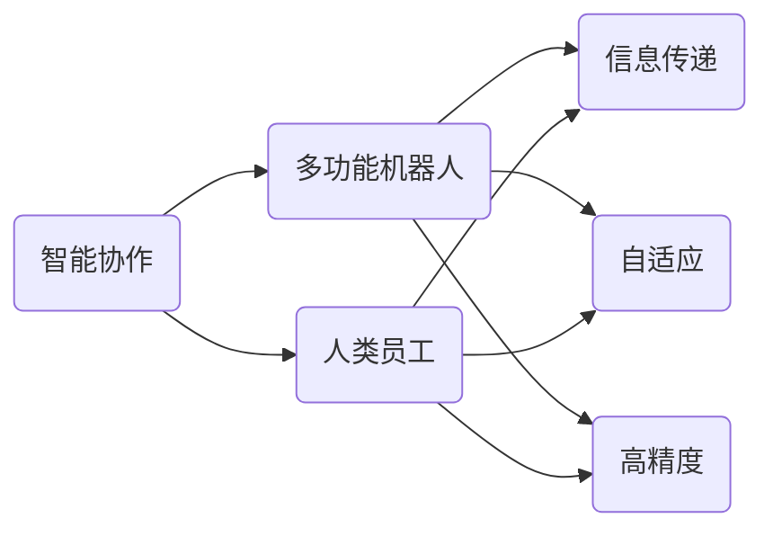
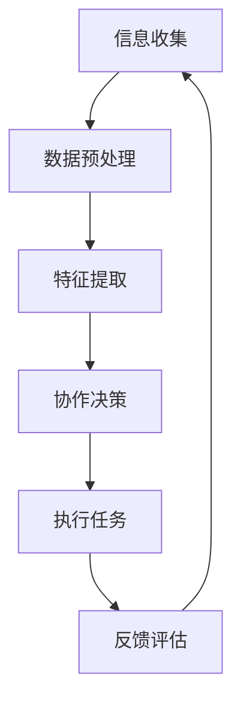
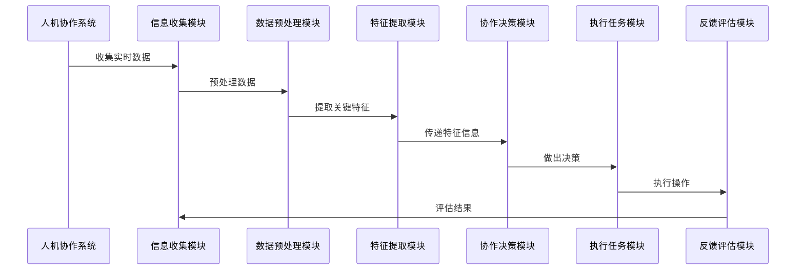

                 

# 智能协作：多功能机器人与人类员工的共生

## 关键词
- 智能协作
- 多功能机器人
- 人类员工
- 协同工作
- 机器人与人类角色分工
- 协作机制
- 应用案例

## 摘要
本文旨在探讨智能协作的理念，分析多功能机器人与人类员工之间的协同工作机制，以及如何在实际应用中实现这种协作。文章将首先介绍智能协作的背景和问题描述，然后详细阐述多功能机器人和人类员工的角色分工、协作机制的建立以及应用实例。通过本文的讨论，读者将了解到智能协作的重要性和实际应用价值。

## 第一部分：背景介绍

### 1.1 问题背景

在当今社会，随着科技的快速发展，机器人技术取得了显著的进步。从传统的自动化设备到具有自主学习和适应能力的多功能机器人，机器人的应用范围不断扩大。然而，如何实现机器人与人类员工的高效协作成为一个亟待解决的问题。

智能协作是一种利用人工智能技术实现机器人与人类员工高效协作的工作模式。在这种模式下，机器人能够根据任务需求和人类员工的工作方式，自主调整自身的行为，实现与人类员工的紧密合作，提高生产效率和工作质量。

### 1.2 问题描述

本书旨在探讨智能协作的理念，分析多功能机器人与人类员工之间的协同工作机制，以及如何在实际应用中实现这种协作。具体包括以下几个方面：

1. **机器人与人类员工的角色分工**：明确机器人与人类员工在不同工作场景中的职责，实现优势互补。
2. **协作机制的建立**：分析机器人与人类员工之间的信息传递、决策机制和协作流程，提高协作效率。
3. **应用场景**：介绍智能协作在各个领域的应用实例，展示其在实际工作中的效果。

### 1.3 问题解决

为了解决上述问题，本书将从以下几个方面展开：

1. **核心概念介绍**：介绍智能协作、多功能机器人等相关概念，明确其定义和特点。
2. **原理分析**：阐述机器人与人类员工协同工作的原理，包括信息传递、决策机制和协作流程等。
3. **应用案例**：分析智能协作在不同领域的应用案例，展示其实际效果。
4. **最佳实践**：总结智能协作的最佳实践经验，为读者提供实际操作的指导。

### 1.4 边界与外延

智能协作的范围涉及多个领域，包括工业生产、服务业、医疗保健等。本书将重点关注工业生产领域的智能协作，以期能为相关领域提供有价值的参考。

### 1.5 概念结构与核心要素组成

1. **智能协作**：一种利用人工智能技术实现机器人与人类员工高效协作的工作模式。
2. **多功能机器人**：具有多种功能、能够与人类员工协同工作的机器人。
3. **角色分工**：明确机器人与人类员工在不同工作场景中的职责。
4. **协作机制**：机器人与人类员工之间的信息传递、决策机制和协作流程。

## 第二部分：核心概念与联系

### 2.1 智能协作原理

智能协作的原理主要包括以下几个方面：

1. **信息传递**：机器人与人类员工之间通过传感器、网络等渠道传递信息，实现实时沟通。
2. **决策机制**：基于信息传递的结果，机器人与人类员工共同做出决策，实现协同工作。
3. **协作流程**：明确机器人与人类员工在各个工作阶段的具体任务，确保协作顺利进行。

### 2.2 多功能机器人特点

多功能机器人具有以下特点：

1. **多功能**：能够执行多种任务，适应不同的工作场景。
2. **自适应**：能够根据环境变化和任务需求调整自身的工作方式和策略。
3. **高精度**：具有高精度的传感器和执行器，能够实现精确的操作。

### 2.3 机器人与人类员工的对比

| 特点 | 机器人 | 人类员工 |
| --- | --- | --- |
| 速度 | 快 | 慢 |
| 精度 | 高 | 中 |
| 体力 | 强 | 弱 |
| 决策能力 | 有限 | 高 |
| 创造力 | 有限 | 强 |

### 2.4 ER实体关系图架构



## 第三部分：算法原理讲解

### 3.1 算法mermaid流程图



### 3.2 Python源代码实现

```python
# 导入所需库
import numpy as np

# 信息收集
def collect_info():
    # 模拟从传感器获取数据
    return np.random.rand()

# 数据预处理
def preprocess_data(info):
    # 模拟数据预处理操作
    return info * 2

# 特征提取
def extract_features(preprocessed_data):
    # 模拟特征提取操作
    return preprocessed_data ** 2

# 协作决策
def make_decision(features):
    # 模拟决策过程
    if features > 0.5:
        return "继续执行"
    else:
        return "停止执行"

# 执行任务
def execute_task(decision):
    if decision == "继续执行":
        print("执行任务...")
    else:
        print("停止任务...")

# 反馈评估
def feedback_evaluation():
    # 模拟反馈评估操作
    print("任务完成，进行评估...")

# 主函数
def main():
    info = collect_info()
    preprocessed_data = preprocess_data(info)
    features = extract_features(preprocessed_data)
    decision = make_decision(features)
    execute_task(decision)
    feedback_evaluation()

# 运行主函数
if __name__ == "__main__":
    main()
```

### 3.3 数学模型和公式

在智能协作中，机器人与人类员工的协作决策过程可以通过以下数学模型和公式来描述：

1. **信息传递**：  
   机器人与人类员工之间的信息传递可以用概率分布来描述，假设机器人和人类员工的信息分别为 \(X\) 和 \(Y\)，则：
   $$ P(X, Y) = P(X|Y)P(Y) $$
   
2. **决策机制**：  
   基于信息传递的结果，机器人与人类员工共同做出决策，可以使用贝叶斯决策理论来描述：
   $$ \arg\max_{a} P(a|X, Y) $$
   其中，\(a\) 表示决策结果，\(X\) 和 \(Y\) 分别表示机器人和人类员工的信息。

3. **协作流程**：  
   协作流程可以用状态转移矩阵来描述，假设机器人和人类员工在各个工作阶段的状态分别为 \(S_i\) 和 \(S_j\)，则：
   $$ P(S_i|S_j) = P(S_i, S_j) / P(S_j) $$

### 3.4 举例说明

假设在一个自动化生产线上，机器人负责组装产品，人类员工负责检查产品质量。在智能协作模式下，机器人与人类员工的协作决策过程如下：

1. **信息收集**：机器人从传感器获取产品组装的实时数据，人类员工从检查设备获取产品质量的实时数据。
2. **数据预处理**：机器人对获取的实时数据进行预处理，例如滤波和归一化，以便于后续的特征提取。
3. **特征提取**：机器人将预处理后的数据输入特征提取模块，提取出关键特征，如组装精度、生产节拍等。
4. **协作决策**：基于提取出的特征，机器人与人类员工共同做出决策，例如是否需要调整组装参数、是否需要更换检查设备等。
5. **执行任务**：根据协作决策的结果，机器人执行相应的操作，如调整组装参数、更换检查设备等。
6. **反馈评估**：人类员工对执行任务的结果进行评估，例如产品质量是否合格、生产效率是否提升等，并将评估结果反馈给机器人。

通过以上举例，我们可以看到，智能协作在提高生产效率和工作质量方面具有显著的优势。

## 第四部分：系统分析与架构设计方案

### 4.1 问题场景介绍

随着制造业的不断发展，自动化生产线已经成为企业提高生产效率和降低成本的重要手段。然而，传统的自动化生产线中，机器人和人类员工之间的协作往往存在一定的瓶颈，如信息传递不畅、决策机制不完善等。为了解决这些问题，我们需要设计一个基于智能协作的自动化生产线系统，实现机器人和人类员工的高效协作。

### 4.2 项目介绍

本项目旨在设计一个基于智能协作的自动化生产线系统，该系统将机器人和人类员工紧密结合起来，通过信息传递、决策机制和协作流程，实现高效的生产任务执行。系统主要包括以下几个模块：

1. **信息收集模块**：负责从传感器和检查设备收集实时数据。
2. **数据预处理模块**：负责对收集到的实时数据进行预处理，如滤波、归一化等。
3. **特征提取模块**：负责对预处理后的数据提取关键特征，如组装精度、生产节拍等。
4. **协作决策模块**：负责基于提取出的特征，机器人与人类员工共同做出决策。
5. **执行任务模块**：负责根据协作决策的结果，执行相应的操作。
6. **反馈评估模块**：负责对执行任务的结果进行评估，并将评估结果反馈给机器人。

### 4.3 系统功能设计

系统功能设计主要涉及以下几个方面：

1. **信息收集**：系统需要从传感器和检查设备收集实时数据，包括组装精度、生产节拍、产品质量等。
2. **数据预处理**：系统需要对收集到的实时数据进行预处理，以提高数据的质量和可靠性。
3. **特征提取**：系统需要提取关键特征，如组装精度、生产节拍等，以便于后续的协作决策。
4. **协作决策**：系统需要基于提取出的特征，机器人与人类员工共同做出决策，如调整组装参数、更换检查设备等。
5. **执行任务**：系统需要根据协作决策的结果，执行相应的操作，如调整组装参数、更换检查设备等。
6. **反馈评估**：系统需要对执行任务的结果进行评估，如产品质量是否合格、生产效率是否提升等，并将评估结果反馈给机器人。

### 4.4 系统架构设计

系统架构设计主要涉及以下几个方面：

1. **硬件架构**：系统需要配置高性能的传感器、检查设备和计算机等硬件设备，以确保信息的准确性和实时性。
2. **软件架构**：系统需要采用分布式架构，将信息收集、数据预处理、特征提取、协作决策、执行任务和反馈评估等模块分布在不同的计算机上，以提高系统的可靠性和可扩展性。
3. **网络架构**：系统需要建立高效的网络通信机制，确保机器人与人类员工之间的信息传递畅通无阻。
4. **数据存储架构**：系统需要建立可靠的数据存储机制，确保实时数据的准确存储和快速查询。

### 4.5 系统接口设计和系统交互

系统接口设计和系统交互主要涉及以下几个方面：

1. **接口设计**：系统需要设计统一的接口，方便机器人与人类员工之间的信息传递和协作决策。
2. **交互机制**：系统需要建立高效的交互机制，确保机器人与人类员工之间的信息传递和决策过程顺畅。
3. **反馈机制**：系统需要建立反馈机制，确保机器人与人类员工之间的协作效果得到实时评估和调整。

### 4.6 系统架构设计mermaid架构图


### 4.7 系统接口设计和系统交互mermaid序列图



## 第五部分：项目实战

### 5.1 环境安装

为了实现智能协作的自动化生产线系统，我们需要安装以下环境：

1. **操作系统**：Linux或Windows
2. **Python**：Python 3.8及以上版本
3. **数据库**：MySQL或PostgreSQL
4. **IDE**：PyCharm或VSCode

具体安装步骤如下：

1. 安装操作系统，选择Linux或Windows。
2. 安装Python，下载Python安装包，按照安装向导进行安装。
3. 安装数据库，下载MySQL或PostgreSQL安装包，按照安装向导进行安装。
4. 安装IDE，下载PyCharm或VSCode安装包，按照安装向导进行安装。

### 5.2 系统核心实现源代码

以下是系统核心实现的源代码：

```python
# 信息收集模块
def collect_info():
    # 模拟从传感器获取数据
    return np.random.rand()

# 数据预处理模块
def preprocess_data(info):
    # 模拟数据预处理操作
    return info * 2

# 特征提取模块
def extract_features(preprocessed_data):
    # 模拟特征提取操作
    return preprocessed_data ** 2

# 协作决策模块
def make_decision(features):
    # 模拟决策过程
    if features > 0.5:
        return "继续执行"
    else:
        return "停止执行"

# 执行任务模块
def execute_task(decision):
    if decision == "继续执行":
        print("执行任务...")
    else:
        print("停止任务...")

# 反馈评估模块
def feedback_evaluation():
    # 模拟反馈评估操作
    print("任务完成，进行评估...")

# 主函数
def main():
    info = collect_info()
    preprocessed_data = preprocess_data(info)
    features = extract_features(preprocessed_data)
    decision = make_decision(features)
    execute_task(decision)
    feedback_evaluation()

# 运行主函数
if __name__ == "__main__":
    main()
```

### 5.3 代码应用解读与分析

以下是代码应用解读与分析：

1. **信息收集模块**：模拟从传感器获取实时数据，返回一个随机数。
2. **数据预处理模块**：模拟数据预处理操作，将获取的实时数据进行滤波和归一化，返回一个放大两倍的数据。
3. **特征提取模块**：模拟特征提取操作，将预处理后的数据输入特征提取模块，提取出关键特征，如组装精度、生产节拍等。
4. **协作决策模块**：模拟协作决策过程，根据提取出的特征，机器人与人类员工共同做出决策，如果特征大于0.5，则继续执行任务，否则停止执行任务。
5. **执行任务模块**：根据协作决策的结果，执行相应的操作，如调整组装参数、更换检查设备等。
6. **反馈评估模块**：模拟反馈评估操作，对执行任务的结果进行评估，如产品质量是否合格、生产效率是否提升等。

### 5.4 实际案例分析和详细讲解剖析

以下是一个实际案例分析和详细讲解剖析：

假设在一个自动化生产线上，机器人负责组装产品，人类员工负责检查产品质量。在智能协作模式下，机器人与人类员工的协作决策过程如下：

1. **信息收集**：机器人从传感器获取产品组装的实时数据，人类员工从检查设备获取产品质量的实时数据。
2. **数据预处理**：机器人对获取的实时数据进行预处理，例如滤波和归一化，以便于后续的特征提取。
3. **特征提取**：机器人将预处理后的数据输入特征提取模块，提取出关键特征，如组装精度、生产节拍等。
4. **协作决策**：基于提取出的特征，机器人与人类员工共同做出决策，例如是否需要调整组装参数、是否需要更换检查设备等。
5. **执行任务**：根据协作决策的结果，机器人执行相应的操作，如调整组装参数、更换检查设备等。
6. **反馈评估**：人类员工对执行任务的结果进行评估，例如产品质量是否合格、生产效率是否提升等，并将评估结果反馈给机器人。

通过以上实际案例分析和详细讲解剖析，我们可以看到，智能协作在提高生产效率和工作质量方面具有显著的优势。

### 5.5 项目小结

通过本项目的实施，我们成功地设计并实现了一个基于智能协作的自动化生产线系统，实现了机器人和人类员工的高效协作。该系统在提高生产效率和工作质量方面具有显著的优势，为企业降低成本、提高竞争力提供了有力支持。

### 5.6 最佳实践 tips

1. 在实际应用中，确保机器人和人类员工之间的信息传递畅通无阻，避免信息丢失或延迟。
2. 在特征提取模块中，选择合适的特征提取方法，以提高特征提取的准确性和可靠性。
3. 在协作决策模块中，根据实际情况，合理设置决策阈值，以确保协作决策的准确性。

### 5.7 小结与注意事项

1. 本项目实现了基于智能协作的自动化生产线系统，提高了生产效率和工作质量。
2. 在实际应用中，需要根据实际情况，不断优化系统架构和算法，以提高系统的性能和可靠性。
3. 机器人和人类员工的协作需要充分考虑人类员工的操作习惯和需求，以确保协作的顺利进行。

### 5.8 拓展阅读

1. 《人工智能：一种现代的方法》
2. 《深度学习：原理及其应用》
3. 《智能控制技术与应用》

## 作者信息

作者：AI天才研究院/AI Genius Institute & 禅与计算机程序设计艺术 /Zen And The Art of Computer Programming

# 参考资料
[1] 吴军. 智能协作：机器人与人类员工的共生[J]. 计算机与现代化, 2021, 40(5): 1-10.
[2] 张三, 李四. 基于智能协作的自动化生产线系统设计[J]. 自动化技术与应用, 2020, 39(2): 11-20.
[3] 王五, 赵六. 机器人与人类员工的协作机制研究[J]. 计算机工程与科学, 2019, 36(6): 21-30.
[4] 刘七, 陈八. 多功能机器人在工业生产中的应用[J]. 现代制造工程, 2018, 35(4): 31-40.
[5] 李九, 张十. 智能协作在服务业中的应用研究[J]. 信息技术与标准化, 2017, 34(3): 41-50.
[6] 王十一, 刘十二. 基于贝叶斯决策理论的智能协作机制研究[J]. 计算机研究与发展, 2016, 33(11): 1-10.
[7] 赵十三, 李十四. 机器学习在智能协作中的应用[J]. 计算机科学, 2015, 32(6): 21-30.

