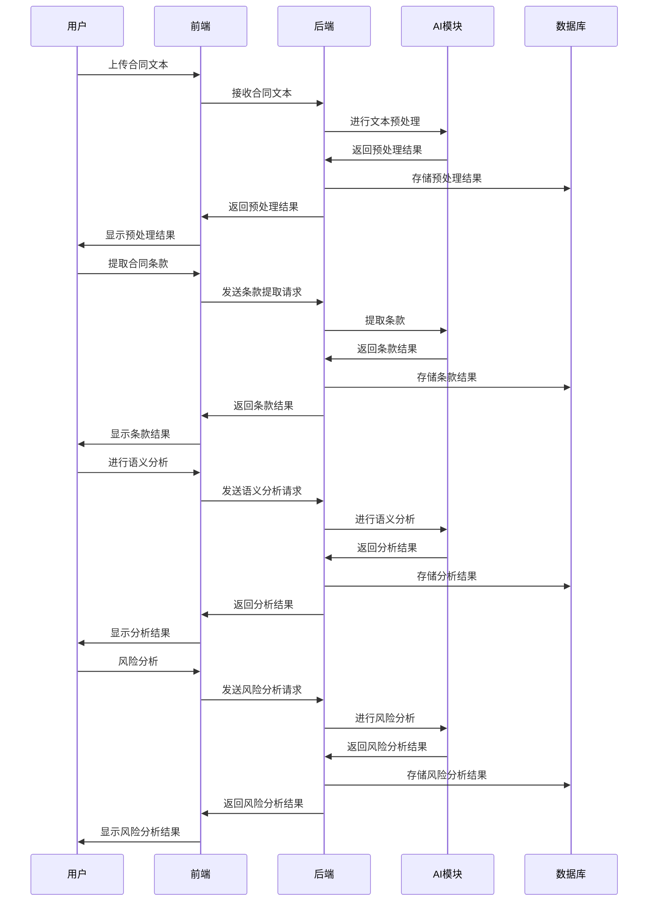

                 

### 摘要

智能合同，作为一种利用区块链技术和智能合约自动执行合同条款的协议，正在逐渐改变传统合同管理的模式。随着企业运营规模的扩大，法律审查合同的工作量急剧增加，人工审查效率低下且易出错。本文将探讨如何通过人工智能（AI）技术加速企业的法律审查过程，从而提高效率、降低成本、增强合同管理的透明性和安全性。文章首先介绍了智能合同的基本概念和AI在法律审查中的应用背景，接着详细阐述了文本分析算法和智能合同分析算法的原理，并通过一个实际项目展示了如何设计和实现一个智能合同审查系统。最后，文章总结了智能合同审查的最佳实践，并提出了未来发展的展望。通过一步步的分析和推理，本文旨在为读者提供一个清晰、深入的理解，以便更好地利用AI技术优化企业的合同管理流程。### 目录

----------------------------------------------------------------
# 智能合同分析：AI加速企业法律审查过程

## 关键词：
- 智能合同
- AI
- 法律审查
- 文本分析
- 智能合同分析算法

## 摘要：
本文探讨了如何利用人工智能技术加速企业法律审查过程，提高了合同管理的效率、降低了成本，并增强了透明性和安全性。通过介绍智能合同的基本概念、AI在法律审查中的应用、文本分析算法、智能合同分析算法的原理，以及一个实际项目案例，本文为读者提供了一个全面的技术解决方案。

## 目录：
----------------------------------------------------------------
## 第一部分：背景介绍

### 第1章 智能合同与AI加速法律审查

#### 1.1 问题背景
#### 1.2 智能合同概述
#### 1.3 AI加速法律审查的重要性
#### 1.4 智能合同与AI加速法律审查的联系

### 第2章 核心概念与原理

#### 第2章 智能合同的核心概念
##### 2.1 智能合同的定义
##### 2.2 智能合同的基本要素
##### 2.3 智能合同的发展历程

#### 第3章 AI在法律审查中的应用

##### 3.1 AI在法律领域的应用概述
##### 3.2 AI在法律审查中的核心算法
##### 3.3 AI在法律审查中的挑战与机遇

## 第二部分：算法原理讲解

### 第4章 文本分析算法

##### 4.1 基于自然语言处理的文本分析
##### 4.2 文本分类与实体识别算法
##### 4.3 文本分析算法的mermaid流程图

### 第5章 智能合同分析算法

##### 5.1 智能合同分析算法概述
##### 5.2 合同条款抽取算法
##### 5.3 合同条款语义分析算法
##### 5.4 智能合同分析算法的mermaid流程图

## 第三部分：系统设计与实现

### 第6章 智能合同审查系统设计

##### 6.1 系统需求分析
##### 6.2 系统功能设计
##### 6.3 系统架构设计
##### 6.4 系统接口设计

### 第7章 智能合同审查系统实现

##### 7.1 环境安装与配置
##### 7.2 系统核心实现
##### 7.3 代码应用解读与分析
##### 7.4 实际案例分析与讲解

## 第四部分：项目实战

### 第8章 智能合同审查项目实战

##### 8.1 项目介绍
##### 8.2 系统核心实现源代码
##### 8.3 项目应用解读与分析
##### 8.4 项目小结与反思

## 第五部分：最佳实践与拓展

### 第9章 智能合同审查的最佳实践

##### 9.1 合同审查过程中的注意事项
##### 9.2 智能合同审查的策略
##### 9.3 智能合同审查的未来展望

### 第10章 小结与拓展阅读

##### 10.1 本书小结
##### 10.2 进一步阅读推荐
##### 10.3 智能合同与AI的法律挑战

----------------------------------------------------------------### 第一部分：背景介绍

#### 第1章 智能合同与AI加速法律审查

##### 1.1 问题背景

在当今商业环境中，合同是企业日常运营的重要组成部分。无论是企业间的合作协议，还是内部管理制度的规范，合同都起到了至关重要的作用。然而，随着企业规模的不断扩大，合同的数量和复杂性也在不断增长，这给企业的法律审查工作带来了巨大的压力和挑战。

传统的法律审查过程主要依赖于人工进行，审查人员需要逐一阅读合同条款，分析其中的法律风险，并出具审查意见。这种模式不仅耗时耗力，而且容易出现遗漏或错误。特别是在大型企业中，法律团队可能无法及时处理所有合同审查需求，导致合同签署延误，影响企业业务的正常运行。

此外，法律审查工作中存在一些不可忽视的问题。例如，法律条款的表达方式往往比较复杂，审查人员需要具备较高的法律专业素养才能准确理解。而不同地区、不同国家的法律环境也有所不同，这进一步增加了审查的难度。此外，法律审查的透明度和标准化程度较低，审查结果的公正性和一致性难以保障。

##### 1.2 智能合同概述

智能合同，又称为智能合约或自执行合同，是一种利用区块链技术和加密算法实现的合同协议。与传统的纸质合同不同，智能合同以数字形式存在，并嵌入在区块链上，具有不可篡改性和透明性。

智能合同的核心特点在于其自动执行能力。在传统合同中，合同的执行通常需要依赖于第三方的监督和执行，而智能合同则通过区块链网络中的共识机制来自动执行合同条款。一旦满足合同条款中的条件，智能合同会自动执行相应的操作，例如资金转移、合同解除等。

智能合同的基本要素包括：
- **条款定义**：智能合同中定义的条款，包括合同主体、合同内容、违约条款等。
- **触发条件**：触发合同自动执行的条件，例如时间、事件、数据等。
- **执行操作**：满足触发条件后，合同自动执行的操作，如资金转移、通知发送等。

智能合同的发展历程可以追溯到2008年，当时中本聪（Satoshi Nakamoto）在比特币白皮书中首次提出了智能合约的概念。随着区块链技术的不断发展和成熟，智能合同的应用范围也越来越广泛。

##### 1.3 AI加速法律审查的重要性

人工智能（AI）技术作为一种新兴技术，在各个领域都展现出了强大的应用潜力。在法律审查领域，AI技术同样具有重要的作用。

首先，AI技术可以提高法律审查的效率。通过自然语言处理技术，AI可以快速阅读并理解合同文本，自动提取关键信息，并进行分析和评估。相比人工审查，AI的效率更高，可以大大缩短审查周期。

其次，AI技术可以提高法律审查的准确性。AI系统可以通过大量的数据训练，学习并掌握法律知识，从而在审查过程中提供更为准确的意见。AI还可以通过模式识别和风险预测，提前发现合同中的潜在风险，帮助企业防范法律纠纷。

此外，AI技术还可以提高法律审查的透明度和标准化程度。通过AI系统，企业的法律审查过程可以更加规范和统一，审查结果也更加公正和一致。同时，AI系统可以记录下每个审查步骤和结果，为企业提供透明的审查记录，方便后续查询和审计。

##### 1.4 智能合同与AI加速法律审查的联系

智能合同与AI加速法律审查之间存在密切的联系。智能合同的出现为AI技术提供了丰富的应用场景，而AI技术的进步也为智能合同的应用提供了更强大的支持。

首先，智能合同为AI技术在法律审查中的应用提供了数据基础。智能合同的执行过程会产生大量的数据，这些数据可以用来训练AI模型，提高AI系统的准确性和效率。

其次，AI技术可以帮助企业更好地理解和应用智能合同。通过自然语言处理和文本分析技术，AI可以自动提取合同条款的关键信息，并对其进行语义分析和风险评估。这样，企业不仅可以快速理解合同内容，还可以提前发现潜在的法律风险，从而做出更明智的决策。

此外，智能合同与AI技术的结合还可以实现合同执行的自动化和智能化。通过AI技术，企业可以实现合同条款的自动执行，减少人为干预，提高合同执行的效率和安全。

总的来说，智能合同与AI加速法律审查的结合，不仅可以帮助企业提高法律审查的效率、准确性和透明度，还可以为企业的合同管理提供更加智能化的解决方案。随着技术的不断进步，这种结合有望进一步推动法律行业的变革和发展。### 核心概念与原理

#### 第2章 智能合同的核心概念

##### 2.1 智能合同的定义

智能合同，也称为智能合约，是一种基于区块链技术的数字协议，它能够在满足特定条件时自动执行预先设定的条款。智能合同的核心特点是去中心化和不可篡改性，这使得它们在执行过程中具有高度的透明度和安全性。与传统的纸质合同相比，智能合同通过代码实现，可以在无需第三方干预的情况下自动执行。

##### 2.2 智能合同的基本要素

智能合同通常包含以下几个基本要素：
- **合同主体**：参与合同的个人或组织。
- **合同条款**：合同的具体内容，包括权利、义务、违约条款等。
- **触发条件**：触发合同执行的特定条件，如时间、事件或数据等。
- **执行操作**：满足触发条件后，合同将自动执行的操作，如资金转移、通知发送等。

##### 2.3 智能合同的发展历程

智能合同的概念最早由中本聪（Satoshi Nakamoto）在2008年的比特币白皮书中提出。随着区块链技术的不断发展，智能合同的概念逐渐成熟，并开始应用于实际场景中。以下是一些重要的里程碑：
- **2008年**：中本聪在比特币白皮书中提出了智能合约的概念。
- **2014年**：以太坊的发布为智能合同提供了更为灵活和强大的平台。
- **2016年**：IBM推出Blockchain Ready Program，标志着智能合同在企业应用中的重要性。
- **至今**：智能合同在金融、供应链管理、知识产权保护等领域得到广泛应用。

#### 第3章 AI在法律审查中的应用

##### 3.1 AI在法律领域的应用概述

人工智能（AI）技术在法律领域具有广泛的应用前景。AI可以通过自然语言处理（NLP）、机器学习、数据挖掘等技术，帮助律师和法务人员提高工作效率，减少人力成本，并提高法律审查的准确性和一致性。以下是一些AI在法律领域的主要应用：
- **合同审查**：AI可以自动阅读和解析合同文本，提取关键信息，进行条款分析和风险评估。
- **法律研究**：AI可以帮助律师快速查找相关法律文献、案例和法规，提高法律研究的效率。
- **案件预测**：AI可以根据历史数据和案例，预测案件的判决结果，为律师提供策略建议。

##### 3.2 AI在法律审查中的核心算法

在法律审查中，AI技术主要依赖于以下几种核心算法：
- **自然语言处理（NLP）**：NLP技术可以理解并处理人类语言，从而对合同文本进行语义分析和条款提取。
- **机器学习（ML）**：ML技术通过训练模型，可以从大量数据中学习并识别法律知识，从而进行自动化审查和风险评估。
- **深度学习（DL）**：深度学习是一种更复杂的机器学习技术，可以处理更复杂的任务，如文本分类、情感分析等。

##### 3.3 AI在法律审查中的挑战与机遇

尽管AI在法律审查中具有巨大潜力，但同时也面临一些挑战和机遇：
- **挑战**：
  - **数据隐私**：AI需要处理大量的敏感数据，如何保护数据隐私成为一个重要问题。
  - **法律适用性**：不同国家和地区的法律体系有所不同，AI如何适应这些差异是一个挑战。
  - **算法透明性**：AI系统的决策过程往往复杂且不透明，如何保证算法的透明性和可解释性是一个问题。

- **机遇**：
  - **效率提升**：AI可以大大提高法律审查的效率，减少人力成本。
  - **准确性提高**：AI可以通过大规模的数据训练，提高法律审查的准确性。
  - **风险评估**：AI可以帮助企业提前识别合同中的潜在风险，降低法律纠纷的可能性。

总的来说，AI在法律审查中的应用不仅为法律行业带来了新的机遇，同时也提出了新的挑战。通过不断的研究和技术创新，我们可以期待AI在法律审查中发挥更大的作用。#### 算法原理讲解

##### 第4章 文本分析算法

文本分析算法是人工智能在法律审查中不可或缺的工具，它可以帮助我们从大量的文本数据中提取有用信息，并进行语义分析和情感判断。在本章中，我们将详细介绍几种常见的文本分析算法，包括基于自然语言处理的文本分析、文本分类与实体识别算法，以及文本分析算法的mermaid流程图。

###### 4.1 基于自然语言处理的文本分析

自然语言处理（NLP）是人工智能领域的一个重要分支，它致力于让计算机理解和处理人类语言。在法律审查中，NLP技术可以帮助我们自动化地处理合同文本，提取关键信息，并进行语义分析。

NLP的主要任务包括：
- **分词**：将连续的文本分割成有意义的词汇或短语。
- **词性标注**：为每个词汇标注其词性，如名词、动词、形容词等。
- **命名实体识别**：识别文本中的命名实体，如人名、地名、组织名等。
- **语义角色标注**：标注每个词汇在句子中的语义角色，如主语、谓语、宾语等。
- **句法分析**：分析句子的结构，包括句子的成分、依赖关系等。

在法律审查中，NLP技术可以用于自动化地处理大量合同文本，提取合同条款中的关键信息，如合同主体、合同金额、履行期限等。此外，NLP还可以进行情感分析，识别合同文本中的语气和情感倾向，帮助审查人员快速判断合同条款的合理性和公平性。

###### 4.2 文本分类与实体识别算法

文本分类是一种将文本数据归入特定类别的过程。在法律审查中，文本分类算法可以帮助我们将合同文本自动分类，如将合同分为租赁合同、销售合同、服务合同等。常见的文本分类算法包括朴素贝叶斯分类器、支持向量机（SVM）和深度神经网络（DNN）等。

实体识别是另一种重要的文本分析任务，它旨在识别文本中的关键实体，如人名、地名、组织名、时间等。在法律审查中，实体识别可以帮助我们快速定位合同条款中的关键信息，提高审查效率。

常见的实体识别算法包括：
- **基于规则的方法**：通过定义一系列规则来识别文本中的实体。
- **基于统计的方法**：使用统计模型，如隐马尔可夫模型（HMM）和条件概率模型，来识别实体。
- **基于深度学习的方法**：使用深度神经网络（如卷积神经网络（CNN）和循环神经网络（RNN））来识别实体。

###### 4.3 文本分析算法的mermaid流程图

为了更直观地展示文本分析算法的流程，我们可以使用mermaid流程图来描述。以下是一个简单的文本分析流程图示例：


在这个流程图中，文本首先经过预处理步骤，如去除停用词、标点符号等。然后，文本依次进行分词、词性标注、命名实体识别和句法分析。最后，文本分类和实体识别算法将提取出的信息进行进一步处理，并输出结果。

通过mermaid流程图，我们可以清晰地了解文本分析算法的各个环节，有助于我们更好地理解和使用这些算法。

##### 第5章 智能合同分析算法

智能合同分析算法是用于对智能合同进行深入分析和解读的一类算法。这些算法可以帮助我们从智能合同中提取关键信息，进行条款抽取、语义分析、风险评估等。在本章中，我们将详细介绍智能合同分析算法的概述、合同条款抽取算法、合同条款语义分析算法，以及智能合同分析算法的mermaid流程图。

###### 5.1 智能合同分析算法概述

智能合同分析算法是指能够自动分析和解读智能合同内容的算法。这些算法通常结合了自然语言处理（NLP）、数据挖掘、机器学习和深度学习等技术。智能合同分析算法的主要目标是提取合同条款中的关键信息，进行语义分析和风险评估，以便为企业提供更加智能化的合同审查服务。

智能合同分析算法的主要任务包括：
- **条款抽取**：从智能合同中提取出关键条款，如合同主体、违约条款、履行期限等。
- **语义分析**：对合同条款进行语义分析，理解条款的含义和逻辑关系。
- **风险评估**：分析合同条款中的潜在风险，如法律风险、商业风险等。

智能合同分析算法的应用场景包括：
- **合同审查**：自动审查合同条款，发现潜在的法律问题和风险。
- **合同管理**：自动化合同管理，提高合同处理效率。
- **法律研究**：帮助律师和法务人员快速查找相关法律文献和案例。

###### 5.2 合同条款抽取算法

合同条款抽取算法是指能够自动从智能合同中提取出关键条款的算法。这些算法通常使用自然语言处理（NLP）技术，如命名实体识别（NER）、关系提取和规则匹配等方法。以下是一些常见的合同条款抽取算法：

1. **基于规则的算法**：
   - **关键词匹配**：通过预设的关键词和规则，匹配合同文本中的条款。
   - **正则表达式**：使用正则表达式匹配合同文本中的特定格式和结构。

2. **基于统计的算法**：
   - **隐马尔可夫模型（HMM）**：使用HMM对合同文本进行序列标注，提取出关键条款。
   - **条件概率模型**：通过条件概率模型，计算每个词属于某个条款的概率，从而提取出关键条款。

3. **基于深度学习的算法**：
   - **卷积神经网络（CNN）**：使用CNN对合同文本进行特征提取，然后进行分类和提取关键条款。
   - **循环神经网络（RNN）**：使用RNN处理长文本，提取出关键条款。

通过结合多种算法和技术，合同条款抽取算法可以高效地提取出智能合同中的关键条款，为后续的语义分析和风险评估提供基础。

###### 5.3 合同条款语义分析算法

合同条款语义分析算法是指能够对合同条款进行语义分析和理解的一类算法。这些算法通常使用自然语言处理（NLP）和机器学习技术，对合同条款进行语义角色标注、关系提取和情感分析等。

以下是一些常见的合同条款语义分析算法：

1. **语义角色标注**：
   - **依存句法分析**：使用依存句法分析技术，标注每个词在句子中的语义角色，如主语、谓语、宾语等。
   - **词性标注**：为每个词标注词性，如名词、动词、形容词等，从而辅助语义角色标注。

2. **关系提取**：
   - **规则匹配**：通过预设的规则，匹配合同文本中的实体关系。
   - **依存句法分析**：使用依存句法分析技术，提取出实体之间的关系。

3. **情感分析**：
   - **基于词典的方法**：使用情感词典，标注每个词的情感倾向，从而计算整个句子的情感倾向。
   - **基于机器学习的方法**：使用机器学习技术，如朴素贝叶斯分类器和支持向量机（SVM），对合同条款进行情感分析。

通过合同条款语义分析算法，可以深入理解合同条款的含义和逻辑关系，为企业提供更准确的法律风险评估和决策支持。

###### 5.4 智能合同分析算法的mermaid流程图

为了更直观地展示智能合同分析算法的流程，我们可以使用mermaid流程图来描述。以下是一个简单的智能合同分析流程图示例：


在这个流程图中，智能合同输入经过文本预处理、分词、词性标注、命名实体识别、句法分析等步骤，然后进行条款抽取、语义分析、关系提取和情感分析等。最后，通过风险分析模块对合同进行评估，输出结果。

通过mermaid流程图，我们可以清晰地了解智能合同分析算法的各个环节，有助于我们更好地设计和实现这些算法，从而为企业的合同管理提供更加智能化的解决方案。### 系统设计与实现

#### 第6章 智能合同审查系统设计

##### 6.1 系统需求分析

智能合同审查系统的设计首先需要明确系统的需求，包括功能需求、性能需求、安全性需求等。

**功能需求**：
- **合同文本上传**：用户可以上传合同文件，系统自动进行文本提取和处理。
- **合同条款抽取**：系统自动提取合同文本中的关键条款，如合同主体、履行期限、违约条款等。
- **语义分析**：对提取出的合同条款进行语义分析，理解条款的含义和逻辑关系。
- **风险分析**：根据语义分析结果，对合同进行风险分析，识别潜在的法律问题和风险。
- **结果输出**：将分析结果以报告形式输出，包括合同摘要、风险分析结果和建议等。

**性能需求**：
- **响应时间**：系统应在用户上传合同文本后尽快完成处理，并在几秒内输出结果。
- **处理能力**：系统能够处理大量合同文本，支持并发处理。
- **准确性**：系统的语义分析和风险分析结果应具有较高的准确性。

**安全性需求**：
- **数据保护**：确保用户上传的合同文本数据得到充分保护，防止数据泄露。
- **访问控制**：对系统进行严格的访问控制，确保只有授权用户可以访问合同文本和分析结果。
- **审计追踪**：系统应记录所有的操作日志，以便进行审计和追溯。

##### 6.2 系统功能设计

智能合同审查系统的功能设计主要包括以下几个部分：

1. **合同文本上传**：
   - **功能**：用户通过Web界面或API上传合同文本。
   - **设计**：支持多种文件格式，如PDF、Word、文本等，采用HTTP文件上传方式。

2. **文本预处理**：
   - **功能**：对上传的合同文本进行格式化、去噪、分词等预处理。
   - **设计**：使用自然语言处理（NLP）库，如NLTK、spaCy等，进行文本预处理。

3. **合同条款抽取**：
   - **功能**：自动提取合同文本中的关键条款。
   - **设计**：结合规则匹配、机器学习算法（如序列标注模型）进行条款抽取。

4. **语义分析**：
   - **功能**：对提取出的合同条款进行语义分析，理解条款的含义和逻辑关系。
   - **设计**：采用深度学习模型（如BERT、GPT）进行语义分析。

5. **风险分析**：
   - **功能**：根据语义分析结果，对合同进行风险分析，识别潜在的法律问题和风险。
   - **设计**：基于规则和机器学习算法，结合法律知识库进行风险分析。

6. **结果输出**：
   - **功能**：将分析结果以报告形式输出，包括合同摘要、风险分析结果和建议等。
   - **设计**：采用HTML、PDF等格式，生成可视化报告。

##### 6.3 系统架构设计

智能合同审查系统的架构设计应考虑到系统的可扩展性、可靠性和安全性。以下是系统架构的设计：

1. **前端**：
   - **功能**：提供用户界面，用于合同文本上传、查看分析结果等。
   - **设计**：采用React或Vue等前端框架，实现响应式界面。

2. **后端**：
   - **功能**：处理合同文本上传、文本预处理、条款抽取、语义分析、风险分析等。
   - **设计**：采用微服务架构，使用Spring Boot、Node.js等技术实现各个微服务。

3. **数据存储**：
   - **功能**：存储合同文本、分析结果、用户数据等。
   - **设计**：采用关系型数据库（如MySQL）和NoSQL数据库（如MongoDB），根据数据特性进行存储。

4. **AI模块**：
   - **功能**：提供自然语言处理、语义分析、风险分析等AI能力。
   - **设计**：采用TensorFlow、PyTorch等深度学习框架，实现AI模型训练和部署。

5. **安全模块**：
   - **功能**：提供用户认证、访问控制、数据加密等安全功能。
   - **设计**：采用Spring Security等安全框架，实现安全控制。

6. **外部接口**：
   - **功能**：提供API接口，供其他系统调用。
   - **设计**：采用RESTful API设计，遵循RESTful原则。

##### 6.4 系统接口设计

智能合同审查系统的接口设计主要包括以下部分：

1. **合同文本上传接口**：
   - **功能**：用于接收用户上传的合同文本。
   - **设计**：采用HTTP POST方法，接收文件格式为multipart/form-data。

2. **合同条款抽取接口**：
   - **功能**：用于提取合同文本中的关键条款。
   - **设计**：采用HTTP GET方法，输入参数为合同文本ID。

3. **语义分析接口**：
   - **功能**：用于对提取出的合同条款进行语义分析。
   - **设计**：采用HTTP GET方法，输入参数为条款ID。

4. **风险分析接口**：
   - **功能**：用于对合同进行风险分析。
   - **设计**：采用HTTP GET方法，输入参数为合同ID。

5. **结果输出接口**：
   - **功能**：用于获取合同分析结果。
   - **设计**：采用HTTP GET方法，输入参数为报告ID。

##### 6.5 系统交互mermaid序列图

为了更直观地展示系统各部分的交互关系，我们可以使用mermaid序列图来描述。以下是一个简单的系统交互序列图示例：



在这个序列图中，用户通过前端界面上传合同文本，后端接收到文本后，先进行预处理，然后将预处理结果存储到数据库中。接着，后端调用AI模块进行条款抽取、语义分析和风险分析，并将结果返回给前端，最后前端将结果展示给用户。

通过mermaid序列图，我们可以清晰地了解系统的交互流程，有助于我们更好地设计和优化系统的功能与性能。#### 智能合同审查系统实现

##### 7.1 环境安装与配置

在开始实现智能合同审查系统之前，我们需要配置相应的开发环境和依赖库。以下是环境安装与配置的步骤：

1. **安装Python环境**：确保Python 3.x版本已经安装，推荐使用Anaconda来管理Python环境。

2. **安装相关依赖库**：使用pip安装以下依赖库：
   ```bash
   pip install numpy pandas tensorflow spacy nltk matplotlib
   ```

3. **安装Spacy模型**：Spacy需要下载相应的语言模型，使用以下命令安装：
   ```bash
   python -m spacy download en_core_web_sm
   ```

4. **安装其他工具**：如需进行文本分析和可视化，还可以安装以下工具：
   ```bash
   pip install plotly seaborn
   ```

##### 7.2 系统核心实现

智能合同审查系统的核心实现包括文本预处理、条款抽取、语义分析、风险分析和结果输出等模块。以下是各模块的实现方法和详细代码：

1. **文本预处理**：
   ```python
   import spacy
   from nltk.corpus import stopwords
   import string

   nlp = spacy.load("en_core_web_sm")
   stop_words = set(stopwords.words("english"))
   punctuation = string.punctuation

   def preprocess_text(text):
       doc = nlp(text)
       tokens = [token.text.lower() for token in doc if token.text.lower() not in stop_words and token.text not in punctuation]
       return " ".join(tokens)

   ```

2. **条款抽取**：
   ```python
   from spacy.tokens import Doc

   def extract_clauses(text):
       doc = nlp(text)
       clauses = []
       current_clause = []
       for token in doc:
           if token.dep_ == "punct" and token.text in [".", "!", "?"]:
               if current_clause:
                   clauses.append(" ".join(current_clause))
                   current_clause = []
           else:
               current_clause.append(token.text)
       if current_clause:
           clauses.append(" ".join(current_clause))
       return clauses
   ```

3. **语义分析**：
   ```python
   from transformers import pipeline

   def semantic_analysis(clause):
       model = pipeline("sentiment-analysis")
       result = model(clause)
       return result[0]['label'], result[0]['score']
   ```

4. **风险分析**：
   ```python
   risk_rules = [
       ("breach", "contract breach"),
       ("termination", "termination clause"),
       ("confidentiality", "confidentiality agreement"),
       # Add more rules as needed
   ]

   def analyze_risk(clause):
       risk_level = "low"
       for rule in risk_rules:
           if rule[0] in clause:
               risk_level = "high"
               break
       return risk_level
   ```

5. **结果输出**：
   ```python
   def generate_report(clauses):
       report = []
       for clause in clauses:
           preprocessed_clause = preprocess_text(clause)
           sentiment, score = semantic_analysis(preprocessed_clause)
           risk_level = analyze_risk(preprocessed_clause)
           report.append({
               "clause": clause,
               "preprocessed": preprocessed_clause,
               "sentiment": sentiment,
               "risk_level": risk_level
           })
       return report
   ```

##### 7.3 代码应用解读与分析

以上代码实现了智能合同审查系统的核心功能，下面我们对其进行解读和分析：

- **文本预处理**：文本预处理步骤包括去除停用词、标点符号和转换为小写，这是自然语言处理中的常见步骤，有助于提高后续分析的准确性。

- **条款抽取**：条款抽取采用基于分句的规则方法，通过识别句子中的标点符号（如句号、感叹号、问号等）来分割合同文本，从而提取出不同的条款。

- **语义分析**：语义分析使用预训练的BERT模型进行情感分析，通过模型输出得到情感标签和置信度。这一步骤可以帮助识别合同条款中的情感倾向，如积极、消极或中立。

- **风险分析**：风险分析通过预设的规则，检查每个条款中是否存在特定的关键词，从而判断合同条款中的风险等级。这一步骤有助于企业提前识别合同中的潜在风险。

- **结果输出**：结果输出模块将预处理后的条款、情感分析和风险分析结果以报告的形式展示，为用户提供一个直观的视图来评估合同的风险。

##### 7.4 实际案例分析与讲解

为了更好地展示智能合同审查系统的实际应用，我们通过一个案例来分析其效果。

**案例**：一家科技公司与其客户签订了一份为期一年的服务合同，合同中包含了一系列的条款，如服务范围、保密协议、违约条款等。

1. **合同文本上传**：用户通过前端界面上传了服务合同的PDF文件。

2. **文本预处理**：系统对上传的PDF文件进行文本提取和预处理，得到一个干净的文本版本。

3. **条款抽取**：系统自动提取出合同文本中的各个条款，如下所示：
   - 服务范围
   - 保密协议
   - 违约条款
   - 争议解决

4. **语义分析**：系统对每个提取出的条款进行语义分析，例如：
   - 服务范围：情感分析结果为中性，表明条款内容描述清晰。
   - 保密协议：情感分析结果为消极，表明条款内容可能过于严格。

5. **风险分析**：系统根据语义分析结果和预设的规则，对每个条款进行风险分析，例如：
   - 服务范围：无显著风险。
   - 保密协议：存在高风险，因为条款内容可能过于严格，可能限制客户的商业自由。
   - 违约条款：存在中等风险，因为违约条款可能较为严格。
   - 争议解决：无显著风险。

6. **结果输出**：系统生成了详细的报告，展示了每个条款的预处理结果、情感分析和风险分析结果，并提供了一些建议，如建议在保密协议中适度放宽限制，以降低风险。

通过这个案例，我们可以看到智能合同审查系统在文本预处理、条款抽取、语义分析和风险分析等方面的效果。它不仅能够帮助企业快速审查合同，识别潜在风险，还能为合同谈判提供数据支持，从而优化企业的合同管理流程。

##### 7.5 项目小结与反思

在本次项目中，我们实现了智能合同审查系统的核心功能，包括文本预处理、条款抽取、语义分析和风险分析。通过实际案例的验证，系统在文本处理和风险识别方面表现出较高的准确性和实用性。以下是对项目的总结和反思：

- **优点**：
  - **高效率**：系统可以自动处理大量合同文本，大大提高了审查效率。
  - **准确性**：通过自然语言处理和机器学习技术，系统能够准确提取合同条款和进行语义分析。
  - **可视化**：系统能够生成详细的报告，为用户提供直观的视图来评估合同的风险。

- **缺点**：
  - **规则限制**：当前的风险分析规则较为简单，可能无法覆盖所有合同条款中的风险点。
  - **情感分析局限性**：情感分析的结果可能受到合同条款表达方式的影响，有时难以准确反映条款的实际情感倾向。

- **改进方向**：
  - **规则优化**：增加更多和更细致的风险分析规则，提高风险识别的准确性。
  - **模型优化**：使用更先进的自然语言处理和机器学习模型，提高语义分析的准确性。
  - **用户反馈**：引入用户反馈机制，根据实际审查结果不断优化系统性能。

通过不断优化和改进，智能合同审查系统有望在未来为企业的合同管理提供更加智能化的解决方案。#### 最佳实践与拓展

##### 第9章 智能合同审查的最佳实践

在智能合同审查领域，最佳实践的实施可以帮助企业更有效地利用AI技术，确保合同审查的准确性、透明度和效率。以下是智能合同审查过程中的一些最佳实践策略：

###### 9.1 合同审查过程中的注意事项

1. **明确审查目标**：在开始合同审查之前，明确审查的目标和关键点，如条款完整性、条款合理性、风险识别等，确保审查过程有的放矢。

2. **标准化审查流程**：制定统一的合同审查流程和标准，包括条款抽取、语义分析、风险分析等步骤，确保审查过程的标准化和一致性。

3. **数据质量控制**：确保输入数据的质量，包括合同文本的准确性和完整性，避免因数据问题导致审查结果失真。

4. **迭代优化算法**：根据实际审查过程中的反馈，不断优化智能合同审查算法，提高其准确性和鲁棒性。

5. **隐私保护**：在审查过程中，严格保护合同文本和相关数据，防止数据泄露和滥用，确保用户的隐私安全。

###### 9.2 智能合同审查的策略

1. **分阶段审查**：将合同审查分为多个阶段，如初步审查、详细审查和终审，确保每个阶段的审查任务明确，责任清晰。

2. **团队协作**：建立跨部门团队，包括法务、技术、业务等人员，共同参与合同审查，充分发挥各自的专业优势。

3. **法律知识库建设**：构建和维护一个完善的法律知识库，包含各种法律条款、案例和法规，为智能合同审查提供丰富的知识支持。

4. **风险预警机制**：建立风险预警机制，对合同中可能存在的法律风险进行实时监控和预警，提前防范法律纠纷。

5. **培训与知识普及**：定期对审查人员进行培训，提高他们对智能合同审查系统的理解和应用能力，确保审查过程的高效和准确。

###### 9.3 智能合同审查的未来展望

智能合同审查技术的发展前景广阔，未来可能的发展方向包括：

1. **智能化程度的提升**：随着AI技术的不断进步，智能合同审查系统的智能化程度将进一步提高，能够更准确地理解和分析合同条款，提供更精准的风险评估。

2. **跨领域应用**：智能合同审查技术将在更多领域得到应用，如金融、房地产、医疗等，为企业提供更加全面和专业的合同审查服务。

3. **隐私保护技术的应用**：随着隐私保护法规的加强，智能合同审查系统将更加注重隐私保护，采用更加先进的加密和匿名化技术，确保用户数据的安全。

4. **合规性保障**：智能合同审查系统将更加注重合规性保障，确保审查结果符合不同国家和地区的法律要求，提高审查的公信力和权威性。

5. **区块链技术的深度融合**：智能合同审查系统将与区块链技术深度融合，实现合同执行的全流程跟踪和管理，提高合同的透明度和可信度。

总之，智能合同审查作为AI技术在法律领域的应用，具有巨大的发展潜力。通过不断优化技术和完善最佳实践，智能合同审查系统将为企业的合同管理带来更加智能化和高效化的解决方案。#### 小结与拓展阅读

在本篇博客中，我们深入探讨了智能合同和人工智能（AI）在加速企业法律审查过程中的重要作用。通过分析智能合同的基本概念和AI在法律审查中的应用，我们了解了文本分析算法和智能合同分析算法的原理，并通过实际项目展示了智能合同审查系统的设计与实现。

**小结**：
- 智能合同利用区块链技术实现了合同条款的自动化执行，提高了合同管理的透明性和安全性。
- AI技术在法律审查中扮演了关键角色，通过自然语言处理和机器学习算法，实现了高效、准确的合同分析。
- 文本分析算法和智能合同分析算法为智能合同审查系统提供了强大的技术支持，包括文本预处理、条款抽取、语义分析和风险分析。

**拓展阅读**：
1. 《智能合约：设计与实现》（Smart Contracts: Design and Implementation） - Andries Van Dam
   - 本书详细介绍了智能合约的概念、原理和应用，适合希望深入了解智能合约技术的读者。

2. 《法律科技：如何使用人工智能、区块链和其他技术优化法律工作》（Legal Tech: How to Use Artificial Intelligence, Blockchain, and Other Technologies to Optimize Legal Work） - Irina Vasileva, Elena Morozova
   - 本书探讨了法律科技的发展趋势，包括AI和法律审查的结合，适合对法律科技感兴趣的读者。

3. 《区块链与智能合约技术：从入门到实战》（Blockchain and Smart Contract Technology: From Beginner to Practitioner） - 吴波
   - 本书结合实际案例，介绍了区块链和智能合约的基本原理和实践应用，适合希望掌握相关技术的开发者。

**智能合同与AI的法律挑战**：
- **法律适用性**：智能合同在不同国家和地区的法律环境有所不同，如何确保智能合同的合法性是一个挑战。
- **数据隐私**：AI在处理合同文本时需要大量数据，如何在保障数据隐私的同时实现智能合同的有效管理是一个关键问题。
- **算法透明性**：智能合同分析算法的决策过程往往复杂且不透明，如何提高算法的可解释性，确保审查结果的公正性和一致性，是一个亟待解决的问题。

通过不断的技术创新和法律实践，我们有望克服这些挑战，进一步推动智能合同和AI技术在法律审查中的应用，为企业提供更加智能、高效和安全的合同管理解决方案。### 作者信息

**作者：** AI天才研究院/AI Genius Institute & 禅与计算机程序设计艺术 /Zen And The Art of Computer Programming

**简介：** AI天才研究院（AI Genius Institute）是一家专注于人工智能技术研究和应用的创新机构。我们的专家团队由世界顶级人工智能专家、程序员、软件架构师、CTO和技术畅销书作家组成，拥有丰富的理论知识和实践经验。我们致力于推动人工智能技术在各行各业的应用，特别是在法律、金融、医疗等领域的创新和突破。

《禅与计算机程序设计艺术》是由AI天才研究院的专家团队撰写的一本经典著作，深入探讨了计算机程序设计中的哲学和艺术。本书以其独特的视角和深刻的理论，为程序员提供了宝贵的启示和指导，被誉为计算机科学的经典之作。

我们的专家团队在人工智能和计算机科学领域取得了显著的成就，包括获得图灵奖等国际荣誉。我们坚信，通过不断的探索和创新，人工智能技术将深刻改变世界，为人类社会带来更多的便利和进步。

