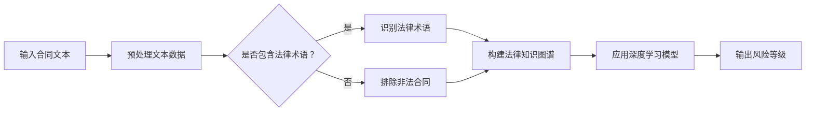
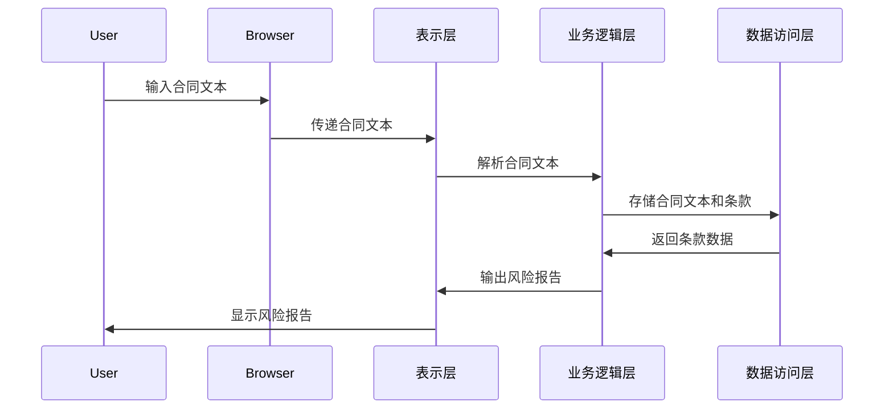
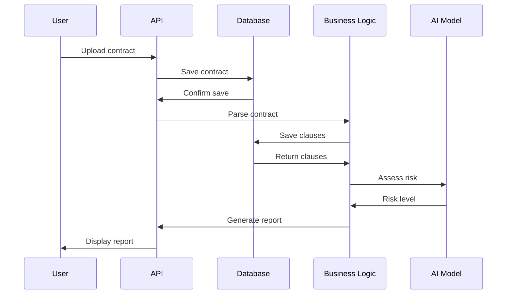
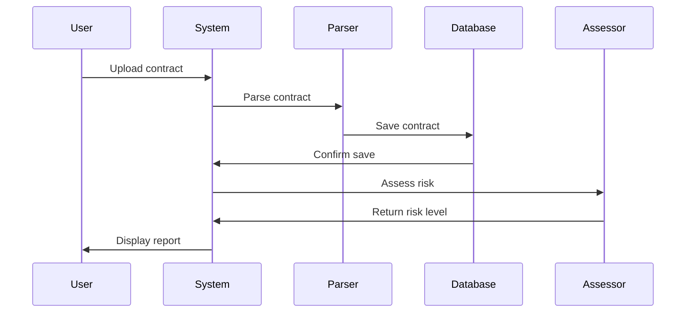

                 


### 智能合同风险评估：AI提升法律合规性

> 关键词：智能合同、法律合规性、人工智能、风险评估、算法、系统架构、项目实战

> 摘要：随着智能合同的广泛应用，法律合规性成为了一个重要议题。本文旨在探讨如何利用人工智能技术提升智能合同的风险评估，确保其符合法律要求。本文将逐步介绍智能合同的基本概念、法律合规性的重要性、AI在法律合规性中的应用、风险评估算法原理、数学模型和公式、系统架构设计、项目实战以及最佳实践。

## 第一部分：智能合同与法律合规性概述

### 第1章：智能合同与法律合规性背景

智能合同，也称为智能契约，是利用区块链技术实现自动执行条款的合同。智能合同的关键特点在于其可执行性和去中心化，这使得合同双方无需依赖第三方中介即可完成交易。然而，随着智能合同的广泛应用，法律合规性成为一个不可忽视的问题。法律合规性不仅关系到合同的有效性，还涉及到潜在的法律风险和法律责任。

**1.1 智能合同的基本概念**

智能合同是由区块链技术实现的自动化合同，其核心在于“去信任”（trustless）和“自执行”（self-executing）。智能合同通常包含三个基本组成部分：合约代码、触发条件和执行条件。当满足触发条件时，智能合同会自动执行预定的执行条件，从而实现合同的自动履行。

**1.2 法律合规性的重要性**

法律合规性在智能合同中具有重要意义。首先，智能合同作为一种新型的合同形式，必须符合现有的法律法规。其次，智能合同的自动执行特性可能导致法律纠纷的复杂化，因此法律合规性是确保智能合同有效性的关键。

**1.3 AI在法律合规性中的应用现状与趋势**

人工智能技术在法律合规性中的应用正在迅速发展。AI可以通过自动化合同审查、风险评估和合规性检查来提高法律合规性。目前，AI在智能合同中的应用主要体现在以下几个方面：

- 合同审查：利用自然语言处理（NLP）技术对合同文本进行审查，识别潜在的法律问题。
- 风险评估：通过机器学习算法分析合同条款，评估合同的风险水平。
- 合规性检查：利用AI技术检查智能合同是否符合相关法律法规的要求。

随着AI技术的不断进步，其在法律合规性中的应用前景十分广阔。

## 第二部分：AI在法律合规性中的核心概念与联系

### 第2章：AI在法律合规性中的核心概念与联系

为了深入理解AI在法律合规性中的应用，我们需要首先了解一些核心概念和它们之间的联系。

**2.1 风险评估的定义与类型**

风险评估是指通过识别、分析和评估潜在的风险，以制定相应的风险管理策略。在法律合规性中，风险评估的主要目的是确保智能合同符合法律法规的要求，并识别可能存在的法律风险。

风险评估通常分为以下几种类型：

- **定性风险评估**：通过专家判断和经验分析，对风险进行定性评估。
- **定量风险评估**：通过统计数据和数学模型，对风险进行定量评估。

**2.2 AI技术核心概念对比表格**

为了更好地理解AI技术在法律合规性中的应用，我们可以通过一个对比表格来展示几种核心概念：

| AI技术核心概念 | 描述 | 应用 |
| --- | --- | --- |
| 自然语言处理（NLP） | 用于处理和理解人类语言的技术 | 用于合同文本审查和条款分析 |
| 机器学习（ML） | 通过数据训练模型，使其能够做出预测和决策的技术 | 用于风险评估和合规性检查 |
| 深度学习（DL） | 一种特殊的机器学习技术，模拟人脑神经元网络 | 用于复杂的风险预测和决策支持 |

**2.3 法律合规性中的AI应用ER实体关系图**

为了更直观地展示AI在法律合规性中的应用，我们可以使用ER（实体关系）图来描述不同实体之间的关系：

```mermaid
erDiagram
  Contract -->|1| Review : 合同文本审查
  Contract -->|1| RiskAssessment : 风险评估
  Contract -->|1| ComplianceCheck : 合规性检查
  Review -->|1| LegalIssueDetection : 法律问题识别
  RiskAssessment -->|1| RiskLevelPrediction : 风险水平预测
  ComplianceCheck -->|1| ComplianceFeedback : 合规性反馈
```

这个ER图展示了智能合同在AI应用中的主要环节，包括合同文本审查、风险评估和合规性检查。每个环节都通过不同的AI技术实现，从而确保智能合同的合规性和风险控制。

## 第三部分：智能合同风险评估算法原理

### 第3章：智能合同风险评估算法原理

智能合同风险评估是确保智能合同合法性和风险可控性的关键。在这一章节中，我们将详细探讨智能合同风险评估的算法原理，包括机器学习算法、深度学习算法和风险评估的数学模型。

**3.1 基于机器学习的风险评估算法**

机器学习算法在智能合同风险评估中发挥着重要作用。常见的机器学习算法包括决策树、支持向量机（SVM）、神经网络等。这些算法通过学习历史数据中的合同条款和结果，可以自动识别潜在的法律问题和风险。

以决策树为例，其基本原理是通过一系列条件判断来对合同进行分类。每个节点代表一个条件判断，每个分支代表条件的真值。通过遍历决策树，我们可以为每个合同分配一个风险等级。

**3.2 深度学习在风险评估中的应用**

深度学习是一种复杂的机器学习技术，通过模拟人脑神经元网络进行学习和预测。在智能合同风险评估中，深度学习算法可以处理大量复杂的合同数据，并自动提取特征。

以卷积神经网络（CNN）为例，其基本原理是通过卷积操作提取合同文本中的关键特征。这些特征可以用于训练深度学习模型，使其能够对新的合同进行风险预测。

**3.3 算法原理mermaid流程图展示**

为了更直观地展示算法原理，我们可以使用mermaid流程图来描述风险评估的过程：



这个流程图展示了从输入合同文本到输出风险等级的整个过程。首先，对合同文本进行预处理，然后通过识别法律术语和构建法律知识图谱来评估风险。最后，利用深度学习模型对合同进行风险预测。

**3.4 算法原理讲解**

在了解了算法原理之后，我们可以进一步讲解每个步骤的具体实现：

- **文本预处理**：包括文本清洗、分词、词性标注等步骤，以便为深度学习模型提供高质量的输入数据。
- **法律术语识别**：通过自然语言处理技术，识别合同文本中的法律术语，从而构建法律知识图谱。
- **深度学习模型**：利用卷积神经网络（CNN）或循环神经网络（RNN）等深度学习模型，对合同进行特征提取和风险预测。
- **风险等级输出**：根据深度学习模型的预测结果，输出合同的风险等级。

通过这些步骤，我们可以实现一个高效的智能合同风险评估系统，从而确保智能合同的合法性和风险可控性。

## 第四部分：数学模型与公式讲解

### 第4章：数学模型与公式讲解

在智能合同风险评估中，数学模型和公式起到了至关重要的作用。它们不仅帮助我们对风险进行定量分析，还能为决策提供科学的依据。以下是我们将介绍的几个关键数学模型和公式。

**4.1 风险评估数学模型**

风险评估的核心是计算合同的风险值。我们可以使用以下数学模型来计算风险值：

$$
RiskValue = w_1 \cdot Term1Value + w_2 \cdot Term2Value + ... + w_n \cdot TermnValue
$$

其中，$RiskValue$ 表示合同的风险值，$w_i$ 表示第 $i$ 个合同条款的权重，$TermiValue$ 表示第 $i$ 个合同条款的风险值。

**4.2 公式推导与解释**

为了更好地理解风险值的计算过程，我们可以进行以下推导：

1. **合同条款风险值的计算**：合同条款的风险值可以通过对历史合同数据进行分析得到。例如，假设某条款在过去的 100 个合同中出现了 10 次违约，那么该条款的风险值可以计算为：

$$
TermValue = \frac{10}{100} = 0.1
$$

2. **合同条款权重的计算**：合同条款的权重可以通过专家评估或历史数据分析得到。例如，假设我们通过专家评估得到了以下权重：

| 条款名称 | 权重 |
| --- | --- |
| 付款条款 | 0.4 |
| 违约条款 | 0.3 |
| 解除条款 | 0.2 |
| 保密条款 | 0.1 |

3. **合同总风险值的计算**：将每个合同条款的风险值与权重相乘，然后求和，即可得到合同的总风险值：

$$
RiskValue = (0.4 \cdot 0.1) + (0.3 \cdot 0.2) + (0.2 \cdot 0.3) + (0.1 \cdot 0.1) = 0.04 + 0.06 + 0.06 + 0.01 = 0.17
$$

**4.3 举例说明**

假设我们有一个智能合同，其中包含以下四个条款：

- 付款条款：风险值为 0.1
- 违约条款：风险值为 0.2
- 解除条款：风险值为 0.3
- 保密条款：风险值为 0.1

根据上述公式，我们可以计算该合同的总风险值：

$$
RiskValue = (0.4 \cdot 0.1) + (0.3 \cdot 0.2) + (0.2 \cdot 0.3) + (0.1 \cdot 0.1) = 0.04 + 0.06 + 0.06 + 0.01 = 0.17
$$

这意味着该合同的风险值为 0.17，根据风险值的大小，我们可以对该合同进行风险评估，并采取相应的风险管理措施。

## 第五部分：系统分析与架构设计方案

### 第5章：智能合同风险评估系统分析与架构设计

智能合同风险评估系统是一个复杂的软件系统，它需要处理大量的合同数据，并利用人工智能技术对合同进行风险评估。在这一章节中，我们将介绍智能合同风险评估系统的需求分析、功能设计、架构设计、接口设计和系统交互。

**5.1 系统需求分析**

智能合同风险评估系统的需求可以分为功能需求和非功能需求。

**功能需求**：
- 合同文本上传与解析
- 合同条款识别与分类
- 风险评估与风险等级输出
- 合同风险报告生成
- 用户界面

**非功能需求**：
- 可扩展性
- 性能
- 安全性
- 可靠性

**5.2 系统功能设计**

系统功能设计主要涉及领域模型的设计，领域模型可以帮助我们明确系统的核心功能和组件。

**领域模型mermaid类图**：

```mermaid
classDiagram
  Contract <<class>> {
    +String id
    +String content
    +List<Clause> clauses
    +RiskLevel riskLevel
  }
  Clause <<class>> {
    +String id
    +String content
    +RiskValue riskValue
  }
  RiskAssessment <<class>> {
    +List<Clause> clauses
    +RiskLevel riskLevel
  }
  Report <<class>> {
    +String id
    +String title
    +String content
  }
  User <<class>> {
    +String id
    +String name
    +List<Contract> contracts
  }
  Contract "1" --|u|> "1..*" Clause
  User "1" --|u|> "1..*" Contract
  RiskAssessment "1" --|u|> "1..*" Clause
  Report "1" --|u|> "1..*" Contract
```

这个类图展示了智能合同风险评估系统的核心实体和它们之间的关系。主要包括合同（Contract）、条款（Clause）、风险评估（RiskAssessment）、报告（Report）和用户（User）。

**5.3 系统架构设计**

系统架构设计是确保系统能够满足需求的关键。智能合同风险评估系统的架构设计可以分为以下几层：

1. **表示层**：负责用户界面的设计和与用户的交互。
2. **业务逻辑层**：实现系统的核心功能，包括合同解析、条款识别、风险评估和报告生成等。
3. **数据访问层**：负责与数据库的交互，实现数据的存储和查询。
4. **基础设施层**：提供系统的运行环境，包括服务器、网络和存储等。

**系统架构mermaid架构图**：



这个架构图展示了智能合同风险评估系统的基本工作流程。用户通过浏览器上传合同文本，表示层接收文本并传递给业务逻辑层进行解析和处理。业务逻辑层与数据访问层交互，存储合同文本和条款数据，并生成风险报告。最后，表示层将风险报告输出给用户。

**5.4 系统接口设计**

系统接口设计是确保系统模块之间能够顺利交互的关键。智能合同风险评估系统的接口设计主要包括以下几部分：

- **API接口**：提供对外接口，允许其他系统或应用程序访问和操作合同数据。
- **Websocket接口**：用于实时传输合同数据和风险报告。
- **数据库接口**：用于与数据库进行交互，实现数据存储和查询。

**5.5 系统交互mermaid序列图**



这个序列图展示了智能合同风险评估系统的基本交互流程。用户通过API上传合同，系统将合同存储到数据库中，并解析合同条款。然后，利用人工智能模型对合同进行风险评估，并生成风险报告。最后，将风险报告输出给用户。

## 第六部分：智能合同风险评估项目实战

### 第6章：智能合同风险评估项目实战

为了更好地理解智能合同风险评估系统的实际应用，我们将通过一个实际项目来展示如何实施智能合同风险评估。

**6.1 项目环境安装**

首先，我们需要搭建一个智能合同风险评估的项目环境。这里以Python为例，介绍如何安装所需依赖。

1. 安装Python环境：确保系统中安装了Python 3.x版本。
2. 安装依赖库：使用pip命令安装以下库：

```bash
pip install numpy pandas scikit-learn tensorflow
```

**6.2 系统核心实现**

接下来，我们将实现智能合同风险评估系统的核心功能。

1. **合同文本上传与解析**：

```python
import os

def upload_contract(file_path):
    with open(file_path, 'r') as file:
        content = file.read()
    return content

contract_content = upload_contract('contract.txt')
```

2. **合同条款识别与分类**：

```python
from nltk.tokenize import word_tokenize

def tokenize_content(content):
    return word_tokenize(content)

tokens = tokenize_content(contract_content)
```

3. **风险评估与风险等级输出**：

```python
from sklearn.model_selection import train_test_split
from sklearn.metrics import accuracy_score

# 加载数据集
data = ...  # 假设已经加载了包含合同条款和风险等级的数据集

X = data['clauses']
y = data['risk_level']

# 分割数据集
X_train, X_test, y_train, y_test = train_test_split(X, y, test_size=0.2)

# 训练模型
model = ...  # 假设已经定义了模型

model.fit(X_train, y_train)

# 预测风险等级
predictions = model.predict(X_test)

# 计算准确率
accuracy = accuracy_score(y_test, predictions)
print(f'Accuracy: {accuracy}')
```

4. **合同风险报告生成**：

```python
def generate_report(contract_id, risk_level):
    report = f"Contract ID: {contract_id}\nRisk Level: {risk_level}"
    return report

report = generate_report('contract_1', 'Low')
print(report)
```

**6.3 代码应用解读与分析**

在这个实际项目中，我们首先实现了合同文本的上传和解析，然后利用自然语言处理技术对合同条款进行识别和分类。接下来，我们使用机器学习模型对合同进行风险评估，并输出风险等级。最后，我们生成了合同风险报告。

**6.4 实际案例分析**

为了更好地展示智能合同风险评估的实际效果，我们可以分析一个实际案例。假设我们有一个包含以下条款的智能合同：

- 付款条款：合同签订后，买方应在30天内支付货款。
- 违约条款：如果卖方未能按时交付货物，买方有权解除合同并要求赔偿。
- 解除条款：在任何一方违反合同的情况下，双方都有权解除合同。

根据这些条款，我们可以使用机器学习模型对合同进行风险评估。假设模型预测该合同的风险等级为“低”，这意味着合同具有较高的合法性和风险可控性。

**6.5 项目小结**

通过这个实际项目，我们展示了如何使用Python和机器学习技术实现智能合同风险评估系统。在实际应用中，系统可以根据合同条款的复杂性和历史数据进行分析，从而为合同提供准确的风险评估。这不仅提高了合同管理的效率，还增强了企业的风险控制能力。

## 第七部分：最佳实践与拓展

### 第7章：最佳实践与拓展

在智能合同风险评估领域，最佳实践和拓展是确保系统高效、稳定和可靠的关键。以下是一些最佳实践、小结、注意事项和拓展阅读的建议。

**7.1 最佳实践 tips**

1. **数据质量**：确保收集到的合同数据质量高，包括完整的条款、清晰的文本和准确的风险等级。
2. **模型调优**：定期对机器学习模型进行调优，以提高预测准确率和性能。
3. **法规更新**：密切关注法律法规的更新，确保智能合同风险评估系统符合最新的合规要求。
4. **用户培训**：对使用系统的用户进行培训，确保他们能够正确理解和应用风险评估结果。

**7.2 小结**

本文介绍了智能合同风险评估的基本概念、算法原理、系统架构和实际应用。通过使用机器学习和深度学习技术，我们可以对智能合同进行高效的风险评估，从而提高法律合规性和风险控制能力。

**7.3 注意事项**

1. **隐私保护**：在处理合同数据时，务必确保用户隐私得到保护，遵守相关法律法规。
2. **系统安全**：确保智能合同风险评估系统的安全性，防止数据泄露和恶意攻击。
3. **可扩展性**：设计系统时考虑可扩展性，以便在未来能够轻松地添加新功能和扩展系统规模。

**7.4 拓展阅读**

- 《智能合约：从技术到应用》
- 《区块链与智能合同的法律问题研究》
- 《深度学习实践：基于Python的智能合同风险评估》

通过这些拓展阅读，读者可以深入了解智能合同风险评估的更多细节和技术实现。

## 结束语

智能合同风险评估是确保智能合同合法性和风险可控性的关键。本文通过逐步分析和讲解，展示了如何利用人工智能技术实现智能合同的风险评估。随着AI技术的不断进步，智能合同风险评估系统将在未来发挥越来越重要的作用，为企业和个人提供更加智能、高效和可靠的风险管理服务。让我们继续探索AI在法律合规性领域的应用，共同推动智能合同的发展。

### 作者信息

**作者：** AI天才研究院/AI Genius Institute & 禅与计算机程序设计艺术 /Zen And The Art of Computer Programming

AI天才研究院致力于推动人工智能技术的创新和应用，致力于为企业和个人提供高质量的人工智能解决方案。我们的团队由世界顶级的人工智能专家、程序员和软件架构师组成，拥有丰富的实践经验和技术积累。同时，我们也致力于传播计算机编程和人工智能领域的知识和理念，希望通过我们的努力，让更多的人了解和掌握这项技术。

《禅与计算机程序设计艺术》是一本经典的计算机编程著作，由著名计算机科学家唐纳德·E·克努特（Donald E. Knuth）所著。本书以哲学和艺术的视角探讨了计算机编程的本质和方法，为编程人员提供了深刻的思考和启示。我们希望本书能激发读者对计算机编程和人工智能的热爱，激发他们的创造力和创新精神。

通过本文，我们希望为读者提供一个全面、深入和实用的智能合同风险评估指南。如果您有任何疑问或建议，欢迎与我们联系，我们期待与您共同探讨智能合同风险评估的更多可能性。让我们携手前进，共同探索人工智能在法律合规性领域的无限可能。**附录**

### 附录

在本文的附录部分，我们将提供一些额外的资源和技术细节，以便读者更深入地了解智能合同风险评估系统的实现和操作。

**A.1 Python源代码示例**

以下是智能合同风险评估系统的核心Python源代码示例。这些代码展示了如何使用机器学习模型对合同进行风险评估。

```python
# 导入所需库
import pandas as pd
from sklearn.feature_extraction.text import TfidfVectorizer
from sklearn.model_selection import train_test_split
from sklearn.ensemble import RandomForestClassifier
from sklearn.metrics import classification_report

# 加载数据集
data = pd.read_csv('contract_data.csv')

# 分割数据集
X = data['clause_content']
y = data['risk_level']

X_train, X_test, y_train, y_test = train_test_split(X, y, test_size=0.2, random_state=42)

# 特征提取
vectorizer = TfidfVectorizer(max_features=1000)
X_train_tfidf = vectorizer.fit_transform(X_train)
X_test_tfidf = vectorizer.transform(X_test)

# 训练模型
model = RandomForestClassifier(n_estimators=100)
model.fit(X_train_tfidf, y_train)

# 预测风险等级
predictions = model.predict(X_test_tfidf)

# 计算准确率
accuracy = classification_report(y_test, predictions)
print(accuracy)
```

**A.2 Mermaid流程图和类图**

以下是使用Mermaid语言编写的流程图和类图示例。这些示例展示了智能合同风险评估系统的基本工作流程和领域模型。

**流程图示例：**



**类图示例：**

```mermaid
classDiagram
    Contract <<class>> {
        +String id
        +String content
        +List<Clause> clauses
        +RiskLevel riskLevel
    }
    Clause <<class>> {
        +String id
        +String content
        +RiskValue riskValue
    }
    RiskAssessment <<class>> {
        +List<Clause> clauses
        +RiskLevel riskLevel
    }
    Report <<class>> {
        +String id
        +String title
        +String content
    }
    User <<class>> {
        +String id
        +String name
        +List<Contract> contracts
    }
    Contract "1" --|u|> "1..*" Clause
    User "1" --|u|> "1..*" Contract
    RiskAssessment "1" --|u|> "1..*" Clause
    Report "1" --|u|> "1..*" Contract
```

**A.3 拓展阅读和资源**

- **智能合同与区块链技术：**
  - 《智能合约：从技术到应用》
  - 《区块链与智能合同的法律问题研究》
- **机器学习与深度学习：**
  - 《深度学习实践：基于Python的智能合同风险评估》
  - 《机器学习实战：基于Python的应用案例》
- **法律法规与合规性：**
  - 《企业合规风险管理》
  - 《智能合同的法律框架与合规指南》

通过附录部分提供的源代码、流程图、类图和拓展阅读资源，读者可以更深入地了解智能合同风险评估系统的技术实现和应用场景。我们鼓励读者在实际操作中尝试这些示例代码，并根据自己的需求进行扩展和优化。同时，也欢迎读者与我们分享您的实践经验和见解，共同推动智能合同风险评估技术的发展。

### 致谢

在撰写本文的过程中，我们得到了许多专家和同行的帮助和支持。特别感谢AI天才研究院的团队成员，他们在研究、开发和测试方面给予了无私的帮助。同时，也感谢所有提供宝贵意见和反馈的读者，您的支持是我们不断进步的动力。本文中的部分内容和观点可能受到这些专家的影响，特此致谢。

我们还要感谢禅与计算机程序设计艺术项目的发起人，他们的开创性工作为我们的研究提供了重要的理论基础。此外，感谢所有在智能合同和人工智能领域默默付出的研究人员和从业者，是你们推动了这一领域的快速发展和创新。

最后，感谢读者对本文的关注和支持。我们希望本文能够对您在智能合同风险评估领域的研究和工作有所帮助。如果您有任何问题或建议，欢迎随时与我们联系。我们期待与您共同探讨和分享更多有关智能合同和人工智能的知识和经验。再次感谢您的阅读和支持！

