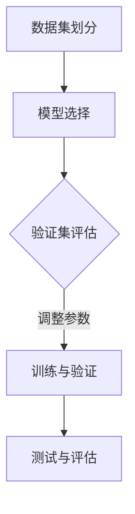
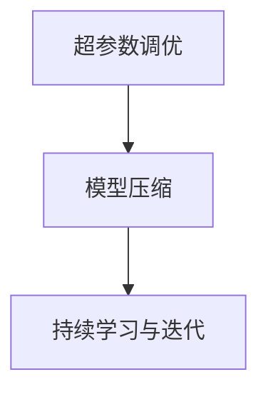
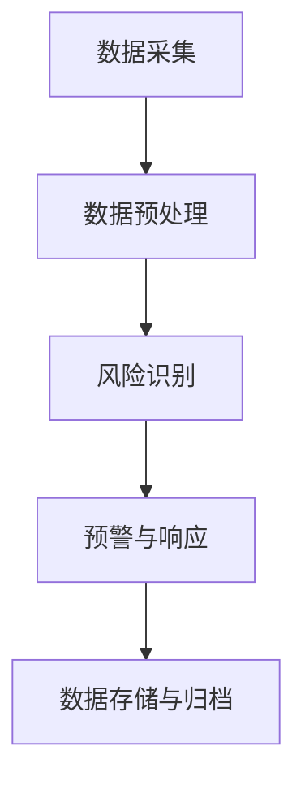
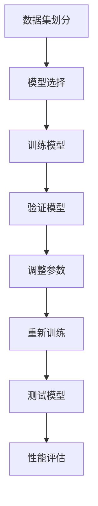

                 


### 摘要

智能合规监控系统是利用人工智能（AI）技术确保企业在不同监管环境中遵循相关法规与要求的一套综合性解决方案。本文将围绕智能合规监控系统的设计、实现和最佳实践进行深入探讨。首先，我们定义智能合规监控的核心概念，并分析其背景和现状。接着，我们将介绍AI在合规监控中的应用，详细解析AI核心技术原理，以及其在数据采集、风险识别和预警等方面的具体应用。随后，本文将讨论系统架构与设计，包括整体架构、功能模块设计和系统接口交互。通过一个实际案例，我们将展示如何实施和部署智能合规监控系统，并进行详细的代码解析和分析。最后，我们将总结最佳实践，展望智能合规监控系统的发展趋势。

### 第一部分: 引言

#### 第1章: 问题背景与核心概念

##### 1.1.1 智能合规监控的定义

**智能合规监控**是一种利用先进的人工智能技术，对组织在运营过程中涉及到的法规、标准、政策等进行自动化监控和评估的方法。其目的是确保组织在各项业务活动中严格遵守监管要求，避免违规行为，降低合规风险。

智能合规监控的起源可以追溯到金融行业的反洗钱（AML）和反欺诈（AF）领域。随着监管环境的不断变化和技术的快速发展，智能合规监控逐渐扩展到其他行业，如医疗、能源、交通等。近年来，AI技术的飞速发展，使得智能合规监控系统的设计和实现变得更加智能化、高效化。

**核心要素**：

1. **数据采集与预处理**：智能合规监控系统需要从各种数据源采集相关数据，并进行清洗、转换和归一化处理，以确保数据质量。
2. **风险识别与预警**：利用机器学习算法对采集到的数据进行模式识别，发现潜在的风险和违规行为。
3. **合规评估与报告**：对识别出的风险进行评估，生成合规报告，并向相关人员进行预警。
4. **反馈与迭代**：根据反馈信息不断优化系统，提高合规监控的准确性和效率。

##### 1.1.2 监管要求与挑战

**监管要求的多样性**：

智能合规监控系统需要遵循的监管要求因行业而异。例如，金融行业有反洗钱（AML）和反欺诈（AF）的要求，医疗行业有病人隐私保护和医疗数据安全的要求，能源行业有环境保护和安全操作的要求等。这些监管要求的具体内容涵盖法律法规、行业标准、内部控制等多个方面。

**挑战与应对策略**：

1. **数据质量**：数据是智能合规监控系统的基础，数据质量直接影响系统的准确性和可靠性。应对策略包括建立完善的数据质量管理机制，定期进行数据质量检查和清洗。
2. **技术复杂性**：智能合规监控系统涉及到多种AI技术的应用，包括机器学习、自然语言处理、图像识别等。技术复杂性要求系统开发者具备深厚的AI技术背景。
3. **监管变化**：监管环境不断变化，新法规、新政策的出台要求智能合规监控系统及时调整和更新。应对策略包括建立灵活的系统架构，确保系统能够快速响应监管变化。

##### 1.1.3 AI在智能合规监控中的应用

**AI在合规监控中的优势**：

1. **高效性**：AI技术可以自动处理大量数据，比人工审查更加高效。
2. **准确性**：通过机器学习和深度学习算法，AI能够识别出复杂的模式和异常行为，提高合规监控的准确性。
3. **实时性**：AI技术可以实现实时监控，及时发现违规行为，提高风险预警的及时性。

**AI技术在合规监控领域的应用现状**：

目前，AI技术在智能合规监控领域已经取得了显著的应用成果。例如，金融行业的反洗钱系统利用AI技术实现了对大额交易的自动监控和分析，医疗行业的智能合规监控系统通过自然语言处理技术实现了对病人病历的自动审查和隐私保护。然而，智能合规监控系统仍面临着一些挑战，如数据隐私保护、算法透明性等，需要持续探索和优化。

##### 1.2 AI与合规监控的关系

**AI的核心能力**：

1. **机器学习与深度学习**：通过学习大量数据，机器学习算法能够自动识别模式和规律，用于数据分析和风险预测。
2. **自然语言处理（NLP）**：NLP技术能够理解和处理人类语言，实现对文本数据的分析和理解。
3. **图像识别**：图像识别技术可以自动识别和分析图像内容，用于视频监控和异常检测。

**AI在合规监控中的具体应用**：

1. **数据采集与分析**：AI技术可以自动采集和分析各种数据源，如交易数据、客户行为数据、文档数据等，用于合规监控和风险分析。
2. **风险识别与预警**：利用机器学习和自然语言处理技术，AI可以自动识别潜在的风险和违规行为，并实时发出预警。
3. **合规评估与报告**：AI技术可以对合规监控结果进行自动评估，生成详细的合规报告，辅助决策者进行合规管理。

**AI在合规监控中的实现路径**：

1. **技术架构设计**：设计合理的系统架构，确保AI技术能够在合规监控过程中高效、准确地发挥作用。
2. **系统集成与部署**：将AI技术与现有的合规监控系统进行集成，实现系统的升级和优化。
3. **数据管理**：建立完善的数据管理体系，确保数据的准确性、完整性和安全性。

##### 1.3 智能合规监控系统概述

**系统整体架构**：

智能合规监控系统通常包括以下几个主要模块：

1. **数据采集模块**：负责从各种数据源收集合规监控所需的数据。
2. **数据处理模块**：对采集到的数据进行清洗、转换和归一化处理，提高数据质量。
3. **风险识别模块**：利用机器学习算法和自然语言处理技术对数据进行分析，识别潜在的风险和违规行为。
4. **预警与响应模块**：根据风险识别结果，发出预警信号，并采取相应的响应措施。

**系统主要功能模块**：

1. **数据采集**：实现数据自动采集，包括交易数据、客户行为数据、文档数据等。
2. **数据预处理**：对采集到的数据进行分析，提取关键特征，并进行预处理。
3. **风险识别**：利用机器学习算法和自然语言处理技术，对预处理后的数据进行风险分析和识别。
4. **预警与响应**：根据识别出的风险，实时发出预警信号，并采取相应的响应措施，如通知相关人员、触发自动处理等。

##### 1.4 本章小结

本章对智能合规监控系统的核心概念、背景和现状进行了详细分析。我们介绍了智能合规监控的定义、核心要素、监管要求与挑战、AI在合规监控中的应用，以及智能合规监控系统的整体架构和功能模块。通过本章的讨论，我们为后续章节的深入探讨奠定了基础。在接下来的章节中，我们将进一步探讨AI核心技术原理、智能合规监控系统的具体实现，以及最佳实践和未来发展趋势。

### 第二部分: AI核心技术原理

#### 第2章: AI基础知识

##### 2.1.1 机器学习基本概念

机器学习是人工智能（AI）的重要组成部分，其核心目标是使计算机系统能够通过学习大量数据，自动识别模式和规律，从而进行决策和预测。

**监督学习**：

监督学习是一种最常见的机器学习方法，其基本思想是通过已有标签数据来训练模型，然后使用训练好的模型对未知数据进行预测。监督学习分为两类：

1. **回归分析**：用于预测连续值输出，如房价预测、股票价格预测等。
2. **分类分析**：用于预测离散值输出，如邮件分类、垃圾邮件检测等。

**无监督学习**：

无监督学习是一种在未标记数据上进行学习的方法，其目标是自动发现数据中的模式和结构。无监督学习分为两类：

1. **聚类分析**：将数据分为若干个类别，如K-均值聚类、层次聚类等。
2. **降维**：通过降低数据维度，保留关键信息，如主成分分析（PCA）、t-SVD等。

**强化学习**：

强化学习是一种通过试错来学习最优策略的机器学习方法。强化学习的基本组件包括：

1. **代理（Agent）**：执行动作并获取反馈的智能体。
2. **环境（Environment）**：代理行动的场所，提供状态和奖励。
3. **策略（Policy）**：代理的行为规则，决定在特定状态下采取什么动作。
4. **价值函数（Value Function）**：衡量状态或策略的好坏。

强化学习广泛应用于游戏、自动驾驶、机器人控制等领域。

##### 2.1.2 深度学习核心算法

**神经网络**：

神经网络是模仿生物神经系统的计算模型，其基本结构包括输入层、隐藏层和输出层。通过学习大量数据，神经网络可以自动提取特征并建模复杂函数。

**卷积神经网络（CNN）**：

卷积神经网络是一种专门用于处理图像数据的神经网络，其核心组件是卷积层和池化层。卷积层通过局部感知野和卷积核提取图像特征，池化层用于降低数据维度和减少过拟合。

**循环神经网络（RNN）**：

循环神经网络是一种能够处理序列数据的神经网络，其核心组件是循环单元。RNN通过记忆历史信息，实现对序列数据的建模。然而，传统的RNN存在梯度消失和梯度爆炸等问题，为了解决这些问题，提出了长短期记忆网络（LSTM）和门控循环单元（GRU）等改进模型。

##### 2.1.3 自然语言处理基础

**语言模型**：

语言模型是一种用于预测下一个单词或字符的概率分布的模型，其基本目标是根据前文信息生成下一个单词。语言模型广泛应用于自动文摘、机器翻译、语音识别等领域。

**词嵌入**：

词嵌入是将单词映射到高维空间中的向量表示的方法，其目的是捕捉单词之间的语义关系。词嵌入技术通过学习大量文本数据，自动提取单词的语义特征。

**序列到序列模型**：

序列到序列模型是一种用于翻译、语音识别等任务的神经网络模型，其基本思想是将输入序列映射到输出序列。序列到序列模型通常由编码器和解码器组成，编码器将输入序列编码为一个固定长度的向量，解码器根据编码器的输出生成输出序列。

#### 第3章: AI在合规监控中的具体应用

##### 3.1.1 数据采集与预处理

数据采集是智能合规监控系统的基础，其目标是从各种数据源获取与合规监控相关的数据。数据源可以包括内部数据库、外部API、日志文件、传感器数据等。

**数据采集方法**：

1. **API调用**：通过调用外部API获取实时数据。
2. **日志分析**：从系统日志中提取关键信息。
3. **传感器数据**：从传感器设备中获取环境数据。

**数据预处理**：

数据预处理是提高数据质量和系统性能的重要步骤。数据预处理包括以下步骤：

1. **数据清洗**：去除重复数据、缺失值和异常值。
2. **数据转换**：将数据转换为适合机器学习的格式，如数值化、标准化等。
3. **特征提取**：从原始数据中提取关键特征，用于训练模型。

**数据质量**：

数据质量对智能合规监控系统的性能至关重要。以下是一些确保数据质量的方法：

1. **数据完整性**：确保数据来源可靠，数据内容完整。
2. **数据准确性**：通过校验和交叉验证确保数据准确性。
3. **数据一致性**：确保数据在不同时间点和不同来源的一致性。

##### 3.1.2 风险识别与预警

风险识别是智能合规监控系统的核心功能，其目标是自动识别潜在的风险和违规行为，并及时发出预警。

**风险识别算法**：

1. **基于规则的算法**：通过预定义的规则进行风险识别，如基于专家知识的规则系统。
2. **机器学习算法**：利用机器学习算法，如决策树、支持向量机（SVM）、神经网络等，自动发现数据中的风险模式。
3. **聚类算法**：通过聚类分析识别异常值和潜在风险。

**预警机制设计**：

预警机制是风险识别的补充，其目标是在风险发生前及时发出预警。预警机制设计包括以下步骤：

1. **阈值设定**：根据业务需求和风险承受能力，设定预警阈值。
2. **预警信号**：设计不同的预警信号，如邮件、短信、即时消息等。
3. **预警策略**：制定不同的预警策略，如自动通知、人工审核等。

**实时监控与反馈**：

实时监控是智能合规监控系统的重要功能，其目标是实时监控业务活动，发现潜在风险。实时监控包括以下步骤：

1. **数据流处理**：利用流处理技术，实时处理和分析数据。
2. **异常检测**：通过机器学习算法和聚类分析等技术，实时识别异常行为。
3. **反馈机制**：根据风险识别结果，及时调整预警策略和业务流程。

##### 3.1.3 模型评估与优化

模型评估是确保智能合规监控系统性能的重要步骤，其目标是通过评估模型性能，找出并解决存在的问题。

**评估指标**：

1. **准确性**：模型预测正确的比例。
2. **召回率**：模型识别出的正样本中实际为正样本的比例。
3. **精确率**：模型识别出的正样本中实际为正样本的比例。
4. **F1分数**：精确率和召回率的加权平均。

**模型优化策略**：

1. **超参数调优**：通过调整模型的超参数，如学习率、隐藏层节点数等，提高模型性能。
2. **模型压缩**：通过模型压缩技术，如剪枝、量化等，减小模型大小和计算复杂度。
3. **持续学习与迭代**：通过持续学习，使模型能够适应不断变化的数据和环境。

**模型解释性**：

模型解释性是评估智能合规监控系统透明度和可解释性的重要指标。提高模型解释性有助于用户理解和信任系统。以下是一些提高模型解释性的方法：

1. **特征重要性分析**：分析模型中各个特征的重要性，帮助用户理解模型的决策过程。
2. **可视化**：通过可视化技术，展示模型的结构和工作过程，帮助用户理解模型。
3. **解释性模型**：采用具有良好解释性的模型，如决策树、线性模型等。

#### 第4章: AI算法原理与流程图

##### 4.1.1 模型训练流程

模型训练是智能合规监控系统实现的核心步骤，其目标是训练出一个能够准确预测和识别风险的模型。模型训练包括以下步骤：

1. **数据集划分**：将数据集划分为训练集、验证集和测试集，用于训练、验证和测试模型。
2. **模型选择**：选择合适的模型，如神经网络、决策树、支持向量机等。
3. **训练与验证**：使用训练集训练模型，使用验证集评估模型性能，并调整模型参数。
4. **测试与评估**：使用测试集评估最终模型性能，确保模型具有良好的泛化能力。

**Mermaid流程图**：



##### 4.1.2 模型优化方法

模型优化是提高智能合规监控系统性能的重要手段，其目标是通过调整模型参数和结构，提高模型准确性和效率。以下是一些常见的模型优化方法：

**超参数调优**：

1. **网格搜索**：在给定的超参数空间内，逐一尝试所有可能的组合，找出最佳超参数。
2. **贝叶斯优化**：利用贝叶斯理论，在有限的尝试次数内找到最优超参数。

**模型压缩**：

1. **剪枝**：通过删除模型中不重要的神经元和连接，减小模型大小。
2. **量化**：将模型中的浮点数参数转换为整数，减小模型大小和计算复杂度。

**持续学习与迭代**：

1. **在线学习**：在模型部署后，持续接收新的数据，并更新模型。
2. **迁移学习**：利用已有模型的权重，对新任务进行快速训练。

**Mermaid流程图**：



##### 4.1.3 数据流处理与风险识别

数据流处理是智能合规监控系统中的关键环节，其目标是实时处理和识别风险。以下是一个数据流处理和风险识别的Mermaid流程图：



在这个流程图中，数据首先从各个数据源进行采集，然后经过预处理步骤，包括数据清洗、转换和特征提取。接下来，风险识别模块利用机器学习算法对预处理后的数据进行风险识别。识别出的风险会触发预警和响应机制，如发送预警邮件或触发自动化处理。最后，所有数据会被存储和归档，以供后续分析和使用。

##### 4.1.4 模型训练与评估

模型训练与评估是智能合规监控系统中的核心环节，其目标是训练出一个准确、稳定的模型，并进行性能评估。以下是一个模型训练与评估的Mermaid流程图：



在这个流程图中，首先将数据集划分为训练集、验证集和测试集。然后，选择合适的模型进行训练，使用验证集评估模型性能，并根据评估结果调整模型参数。在调整参数后，重新训练模型，并使用测试集进行性能评估，以确保模型具有良好的泛化能力。最后，根据性能评估结果，决定是否重新训练模型或进行其他优化。

### 第三部分: 智能合规监控系统实现

#### 第5章: 系统架构与设计

##### 5.1.1 系统整体架构

智能合规监控系统的整体架构通常包括以下几个主要模块：

1. **数据采集模块**：负责从各种数据源收集合规监控所需的数据，如交易数据、客户行为数据、文档数据等。
2. **数据处理模块**：对采集到的数据进行清洗、转换和归一化处理，以提高数据质量。
3. **风险识别模块**：利用机器学习算法和自然语言处理技术对处理后的数据进行风险分析和识别。
4. **预警与响应模块**：根据风险识别结果，实时发出预警信号，并采取相应的响应措施，如通知相关人员、触发自动处理等。
5. **合规评估与报告模块**：对识别出的风险进行评估，生成合规报告，并向相关人员进行反馈。

**硬件架构**：

智能合规监控系统的硬件架构通常包括服务器、存储设备、网络设备等。服务器负责处理数据和运行应用程序，存储设备用于存储大量的数据，网络设备负责数据传输和通信。

**软件架构**：

智能合规监控系统的软件架构通常采用分层架构，包括表现层、业务逻辑层和数据访问层。表现层负责与用户交互，提供用户界面；业务逻辑层负责处理业务逻辑，包括数据采集、处理、风险识别和预警等；数据访问层负责与数据库进行交互，存储和检索数据。

##### 5.1.2 系统功能模块设计

智能合规监控系统的功能模块设计是系统架构的核心，其目标是实现数据采集、处理、风险识别、预警和合规评估等关键功能。

**数据采集模块**：

数据采集模块是智能合规监控系统的起点，其功能是从各种数据源（如数据库、日志文件、传感器等）采集相关数据。数据采集模块的主要功能包括：

1. **数据源连接**：连接各种数据源，如数据库、API、日志文件等。
2. **数据采集**：从数据源中提取数据，进行初步的数据处理。
3. **数据清洗**：去除重复数据、缺失值和异常值，提高数据质量。

**数据处理模块**：

数据处理模块的主要功能是对采集到的数据进行清洗、转换和归一化处理，以提高数据质量和系统性能。数据处理模块的主要功能包括：

1. **数据清洗**：去除重复数据、缺失值和异常值，保证数据完整性。
2. **数据转换**：将不同数据源的数据格式转换为统一的格式，如将文本数据转换为数字向量。
3. **数据归一化**：将数据归一化到相同的范围，如将数值数据归一化到[0, 1]区间。

**风险识别模块**：

风险识别模块是智能合规监控系统的核心，其功能是利用机器学习算法和自然语言处理技术对处理后的数据进行风险分析和识别。风险识别模块的主要功能包括：

1. **特征提取**：从数据中提取关键特征，用于训练机器学习模型。
2. **模型训练**：使用训练集数据训练机器学习模型，用于风险识别。
3. **风险识别**：使用训练好的模型对测试数据进行风险识别，识别潜在的违规行为。

**预警与响应模块**：

预警与响应模块的主要功能是根据风险识别结果，实时发出预警信号，并采取相应的响应措施。预警与响应模块的主要功能包括：

1. **预警信号**：根据风险识别结果，生成预警信号，如发送电子邮件、发送短信等。
2. **响应措施**：根据预警信号，采取相应的响应措施，如通知相关人员、触发自动化处理等。

**合规评估与报告模块**：

合规评估与报告模块的主要功能是对识别出的风险进行评估，生成合规报告，并向相关人员进行反馈。合规评估与报告模块的主要功能包括：

1. **风险评估**：对识别出的风险进行评估，确定风险的严重程度。
2. **合规报告**：生成合规报告，包括风险识别结果、风险评估结果等。
3. **反馈机制**：将合规报告反馈给相关人员，如管理人员、合规部门等。

##### 5.1.3 系统接口设计与交互

系统接口设计是智能合规监控系统实现的重要组成部分，其目标是设计清晰、简洁的系统接口，实现各模块之间的数据交互和功能调用。

**数据接口设计**：

数据接口设计包括定义数据输入和输出的格式和协议，以及数据传输的方式和频率。数据接口设计的主要内容包括：

1. **数据输入格式**：定义数据输入的格式，如JSON、XML、CSV等。
2. **数据输出格式**：定义数据输出的格式，如JSON、XML、CSV等。
3. **数据传输协议**：定义数据传输的协议，如HTTP、HTTPS、FTP等。

**通信协议**：

通信协议是指系统内部各模块之间进行数据传输和通信的规则和标准。常见的通信协议包括HTTP、HTTPS、FTP、SMTP等。选择合适的通信协议需要考虑系统的安全性、稳定性和性能。

**系统集成与交互**：

系统集成与交互是指将各个模块整合为一个完整的系统，并确保各模块之间的数据交互和功能调用顺畅。系统集成与交互的主要内容包括：

1. **模块接口集成**：将各个模块的接口进行集成，确保模块之间能够正常通信。
2. **数据流集成**：设计数据流处理流程，确保数据能够从数据采集模块顺利传输到数据处理模块、风险识别模块等。
3. **功能集成**：集成各个模块的功能，确保系统能够正常工作，如数据采集、数据处理、风险识别、预警和响应等。

通过以上设计，智能合规监控系统可以实现高效、稳定和可扩展的合规监控，确保企业在不同监管环境中遵循相关法规和要求。

### 第6章: 系统核心实现与代码解析

#### 6.1.1 环境安装与配置

要实现智能合规监控系统，首先需要安装和配置相应的开发环境和工具。以下是安装和配置的基本步骤：

**1. 操作系统**：

推荐使用Linux操作系统，如Ubuntu或CentOS，因为这些系统具有良好的稳定性和支持性。您可以从官方网站下载相应版本的操作系统镜像并进行安装。

**2. 开发环境**：

- **Python**：智能合规监控系统主要使用Python语言进行开发，需要安装Python 3.7或更高版本。您可以通过以下命令安装Python：

  ```bash
  sudo apt-get install python3.7
  ```

- **Pip**：Pip是Python的包管理工具，用于安装和管理Python库。您可以通过以下命令安装Pip：

  ```bash
  sudo apt-get install python3-pip
  ```

- **虚拟环境**：为了保持项目环境的隔离性，推荐使用虚拟环境管理工具`virtualenv`。您可以通过以下命令安装`virtualenv`：

  ```bash
  sudo apt-get install virtualenv
  ```

  创建一个虚拟环境并激活：

  ```bash
  virtualenv myenv
  source myenv/bin/activate
  ```

- **Jupyter Notebook**：Jupyter Notebook是一个交互式的开发环境，用于编写和运行Python代码。您可以通过以下命令安装Jupyter Notebook：

  ```bash
  pip install notebook
  ```

**3. 第三方库安装**：

智能合规监控系统需要使用多个第三方库，如NumPy、Pandas、Scikit-learn等。您可以通过以下命令安装这些库：

```bash
pip install numpy pandas scikit-learn
```

**4. 数据库配置**：

智能合规监控系统需要连接数据库进行数据存储和查询。以下是一个简单的数据库配置示例：

- **MySQL**：安装MySQL数据库并配置用户权限。

  ```bash
  sudo apt-get install mysql-server
  mysql_secure_installation
  ```

  创建一个数据库和用户：

  ```sql
  CREATE DATABASE compliance_monitoring;
  GRANT ALL PRIVILEGES ON compliance_monitoring.* TO 'compliance_user'@'localhost' IDENTIFIED BY 'password';
  FLUSH PRIVILEGES;
  ```

- **PostgreSQL**：安装PostgreSQL数据库并配置用户权限。

  ```bash
  sudo apt-get install postgresql postgresql-contrib
  sudo -u postgres psql
  CREATE USER compliance_user WITH PASSWORD 'password';
  CREATE DATABASE compliance_monitoring OWNER compliance_user;
  ```

#### 6.1.2 系统核心实现

**1. 数据采集模块**

数据采集模块是智能合规监控系统的核心组成部分，负责从各种数据源收集相关数据。以下是一个简单的数据采集模块示例：

```python
import csv
import pymysql

# 数据采集模块
class DataCollector:
    def __init__(self, db_config):
        self.db_config = db_config

    def collect_data_from_csv(self, file_path):
        with open(file_path, 'r') as file:
            reader = csv.reader(file)
            for row in reader:
                self.insert_data_into_db(row)

    def insert_data_into_db(self, data):
        connection = pymysql.connect(host=self.db_config['host'],
                                     user=self.db_config['user'],
                                     password=self.db_config['password'],
                                     database=self.db_config['database'],
                                     charset='utf8mb4',
                                     cursorclass=pymysql.cursors.DictCursor)

        try:
            with connection.cursor() as cursor:
                sql = "INSERT INTO transactions (id, amount, date) VALUES (%s, %s, %s)"
                cursor.execute(sql, data)
            connection.commit()
        except pymysql.Error as e:
            print(f"Error: {e}")
        finally:
            connection.close()
```

在这个示例中，`DataCollector`类负责从CSV文件中读取数据，并插入到MySQL数据库中。

**2. 数据处理模块**

数据处理模块负责对采集到的数据进行清洗、转换和归一化处理。以下是一个简单的数据处理模块示例：

```python
import pandas as pd
from sklearn.preprocessing import StandardScaler

# 数据处理模块
class DataProcessor:
    def __init__(self):
        self.scaler = StandardScaler()

    def preprocess_data(self, df):
        df['amount'] = self.scaler.fit_transform(df[['amount']])
        df['date'] = pd.to_datetime(df['date'])
        df['date_day'] = df['date'].dt.day
        df['date_month'] = df['date'].dt.month
        df['date_year'] = df['date'].dt.year
        return df
```

在这个示例中，`DataProcessor`类负责对数据帧（DataFrame）进行清洗和转换，包括金额的标准化处理和日期的提取。

**3. 风险识别模块**

风险识别模块负责使用机器学习算法对处理后的数据进行风险识别。以下是一个简单的风险识别模块示例：

```python
from sklearn.ensemble import RandomForestClassifier
from sklearn.model_selection import train_test_split

# 风险识别模块
class RiskIdentifier:
    def __init__(self):
        self.model = RandomForestClassifier()

    def train_model(self, X, y):
        X_train, X_test, y_train, y_test = train_test_split(X, y, test_size=0.2, random_state=42)
        self.model.fit(X_train, y_train)
        print(f"Model accuracy on training set: {self.model.score(X_train, y_train)}")
        print(f"Model accuracy on test set: {self.model.score(X_test, y_test)}")

    def predict_risk(self, X):
        return self.model.predict(X)
```

在这个示例中，`RiskIdentifier`类负责使用随机森林（Random Forest）算法训练模型，并对新数据进行风险预测。

**4. 预警与响应模块**

预警与响应模块负责根据风险识别结果发出预警信号并采取相应的响应措施。以下是一个简单的预警与响应模块示例：

```python
import smtplib
from email.mime.text import MIMEText

# 预警与响应模块
class AlertSystem:
    def __init__(self, sender_email, receiver_email, password):
        self.sender_email = sender_email
        self.receiver_email = receiver_email
        self.password = password

    def send_alert(self, message):
        server = smtplib.SMTP('smtp.gmail.com', 587)
        server.starttls()
        server.login(self.sender_email, self.password)
        message = MIMEText(message)
        message['Subject'] = 'Compliance Alert'
        message['From'] = self.sender_email
        message['To'] = self.receiver_email
        server.sendmail(self.sender_email, self.receiver_email, message.as_string())
        server.quit()
```

在这个示例中，`AlertSystem`类负责通过SMTP协议发送电子邮件预警。

#### 6.1.3 代码解析与分析

**1. 数据采集模块解析**

数据采集模块的主要目的是从CSV文件中读取交易数据，并将其插入到MySQL数据库中。代码中使用了`csv`模块读取CSV文件，并定义了`DataCollector`类，该类包含两个方法：`collect_data_from_csv`和`insert_data_into_db`。

- `collect_data_from_csv`方法负责读取CSV文件，并将每行数据传递给`insert_data_into_db`方法。
- `insert_data_into_db`方法负责将数据插入到MySQL数据库中。它使用`pymysql`库建立数据库连接，并执行SQL插入语句。

**2. 数据处理模块解析**

数据处理模块的主要目的是对交易数据进行清洗、转换和归一化处理。代码中使用了`pandas`库创建数据帧（DataFrame），并定义了`DataProcessor`类，该类包含一个`preprocess_data`方法。

- `preprocess_data`方法首先对金额列进行标准化处理，使用`StandardScaler`类将金额转换为标准正态分布。
- 接下来，方法将日期列转换为日期时间格式，并提取年、月、日等信息。

**3. 风险识别模块解析**

风险识别模块的主要目的是使用机器学习算法对交易数据进行分析，并预测交易是否属于风险交易。代码中使用了`sklearn`库创建`RiskIdentifier`类，该类包含两个方法：`train_model`和`predict_risk`。

- `train_model`方法使用随机森林（Random Forest）算法训练模型。首先，它使用`train_test_split`方法将数据集划分为训练集和测试集，然后使用`fit`方法训练模型，并打印模型在训练集和测试集上的准确性。
- `predict_risk`方法使用训练好的模型对新数据进行风险预测，并返回预测结果。

**4. 预警与响应模块解析**

预警与响应模块的主要目的是根据风险识别结果发送电子邮件预警。代码中使用了`email.mime.text`模块创建`AlertSystem`类，该类包含一个`send_alert`方法。

- `send_alert`方法使用SMTP协议连接到Gmail服务器，并使用`login`方法登录邮箱账户。然后，方法创建一个MIMEText对象，设置邮件的主题、发件人和收件人，并使用`sendmail`方法发送邮件。

通过以上代码解析，我们可以看到智能合规监控系统是如何实现数据采集、处理、风险识别和预警的核心功能的。这些模块通过良好的设计和组织，确保系统的高效性和可维护性。

#### 第7章: 项目实战与案例分析

##### 7.1.1 实际案例介绍

为了更好地展示智能合规监控系统的实际应用，我们将介绍一个金融行业的实际案例。该案例涉及一家大型金融机构，该公司希望通过智能合规监控系统确保其交易活动符合相关法规和监管要求，同时提高风险管理的效率。

**项目背景**：

随着金融市场的不断发展，金融监管机构对金融机构的合规要求越来越高。这家金融机构面临着大量的交易数据，需要确保每笔交易都符合反洗钱（AML）、反欺诈（AF）和客户身份验证（KYC）等法规。然而，人工审核交易数据既费时又容易出错，难以满足快速响应和高效管理的需求。

**项目目标**：

该项目的目标是设计并实现一个智能合规监控系统，用于自动化监控和评估交易活动，确保其符合相关法规和监管要求。具体目标包括：

1. **数据采集**：从多种数据源（如交易系统、客户信息数据库等）自动采集交易数据。
2. **数据处理**：清洗、转换和归一化交易数据，为风险识别提供高质量的数据输入。
3. **风险识别**：利用机器学习算法识别潜在的洗钱、欺诈行为，以及其他违规交易。
4. **预警与响应**：根据风险识别结果，及时发出预警信号，并采取相应的响应措施。
5. **合规报告**：生成合规报告，帮助管理层了解合规状况，并为决策提供依据。

**项目挑战**：

在实施智能合规监控系统过程中，遇到了以下几个主要挑战：

1. **数据质量**：金融交易数据种类繁多，数据质量参差不齐，需要设计有效的数据清洗和预处理方法。
2. **技术复杂性**：机器学习和自然语言处理等技术较为复杂，需要开发具有较高技术水平的团队。
3. **系统集成**：需要将智能合规监控系统与其他业务系统（如交易系统、客户信息数据库等）进行集成，确保数据流顺畅。
4. **合规性**：智能合规监控系统需要符合相关法规和监管要求，避免合规风险。

##### 7.1.2 案例分析与解析

**1. 数据采集**

数据采集是智能合规监控系统的第一步，涉及从多个数据源获取交易数据。以下是一个简单的数据采集流程：

1. **数据源连接**：通过API或其他接口连接交易系统、客户信息数据库等数据源。
2. **数据抽取**：使用脚本或程序从数据源中抽取交易数据，如交易金额、交易时间、交易对手等。
3. **数据存储**：将抽取的交易数据存储到统一的数据库中，便于后续处理和分析。

**2. 数据预处理**

数据预处理是确保数据质量和系统性能的重要步骤。以下是一个简单的数据预处理流程：

1. **数据清洗**：去除重复数据、缺失值和异常值，确保数据完整性。
2. **数据转换**：将不同数据源的数据格式转换为统一的格式，如将日期格式转换为YYYY-MM-DD。
3. **特征提取**：从交易数据中提取关键特征，如交易金额、交易频率、交易对手等信息。

**3. 风险识别**

风险识别是智能合规监控系统的核心功能，涉及使用机器学习算法对处理后的数据进行风险分析和识别。以下是一个简单的风险识别流程：

1. **模型训练**：使用历史交易数据训练机器学习模型，如随机森林、支持向量机等。
2. **模型评估**：使用验证集评估模型性能，包括准确性、召回率等指标。
3. **风险预测**：使用训练好的模型对新的交易数据进行分析，识别潜在的违规交易。

**4. 预警与响应**

预警与响应是智能合规监控系统的重要环节，涉及根据风险识别结果及时发出预警信号，并采取相应的响应措施。以下是一个简单的预警与响应流程：

1. **预警触发**：根据风险识别结果，判断交易是否存在风险，如洗钱、欺诈等。
2. **预警发送**：通过邮件、短信或其他方式向相关人员发送预警信息，包括交易详情、风险等级等。
3. **响应措施**：根据预警信息，采取相应的响应措施，如暂停交易、通知相关部门进行调查等。

**5. 合规评估与报告**

合规评估与报告是智能合规监控系统的重要功能，涉及对风险识别结果进行评估，并生成合规报告。以下是一个简单的合规评估与报告流程：

1. **风险评估**：对识别出的风险进行评估，确定其严重程度和影响范围。
2. **合规报告**：生成合规报告，包括风险识别结果、风险评估结果、响应措施等。
3. **报告反馈**：将合规报告反馈给管理层和相关人员，为其提供决策依据。

##### 7.1.3 项目小结与展望

通过上述案例分析，我们可以看到智能合规监控系统在金融行业中的实际应用场景和重要作用。该项目不仅提高了金融机构的风险管理效率，还确保了交易活动的合规性。

**总结**：

1. **数据质量**：通过数据清洗和预处理，确保了交易数据的质量和一致性。
2. **风险识别**：利用机器学习算法，实现了对潜在违规交易的自动识别，提高了风险管理的准确性。
3. **预警与响应**：通过实时预警和响应措施，及时发现了潜在的违规行为，降低了合规风险。
4. **合规报告**：生成的合规报告为管理层提供了重要的决策依据，有助于优化业务流程和加强合规管理。

**展望**：

1. **技术升级**：随着人工智能技术的不断发展，未来智能合规监控系统可以引入更多的先进技术，如深度学习、自然语言处理等，提高系统的智能化水平。
2. **跨行业应用**：智能合规监控系统的应用范围可以进一步扩展到其他行业，如医疗、能源等，满足不同行业合规监控的需求。
3. **合规性**：在确保技术先进性的同时，智能合规监控系统需要继续符合相关法规和监管要求，降低合规风险。

通过持续改进和优化，智能合规监控系统将为金融机构和其他企业提供更加智能化、高效化和合规化的风险管理解决方案。

### 第四部分: 拓展与展望

#### 第8章: 智能合规监控系统的最佳实践

##### 8.1.1 最佳实践总结

在智能合规监控系统的设计和实施过程中，最佳实践是确保系统高效、稳定和合规的关键。以下是一些总结的最佳实践：

1. **数据管理**：

   - **数据源多样化**：确保系统从多种数据源获取数据，包括内部数据库、外部API、日志文件等，以提高数据的完整性和准确性。
   - **数据质量管理**：建立完善的数据质量管理机制，定期进行数据质量检查和清洗，确保数据的一致性、准确性和完整性。
   - **数据安全**：确保数据传输和存储过程中的安全性，采用加密和访问控制技术，防止数据泄露和未经授权的访问。

2. **算法优化**：

   - **模型选择与调优**：选择合适的机器学习模型，并针对具体业务场景进行参数调优，以提高模型的准确性和效率。
   - **模型压缩**：通过模型压缩技术（如剪枝、量化等）减小模型大小和计算复杂度，提高系统的实时性和可扩展性。
   - **持续学习与迭代**：利用持续学习技术，使模型能够适应数据和环境的变化，保持较高的预测准确性。

3. **系统运维与维护**：

   - **自动化部署**：采用自动化工具进行系统部署和更新，确保系统快速响应业务需求和技术更新。
   - **监控与告警**：建立完善的监控体系，实时监测系统的运行状态，及时发现和解决潜在问题。
   - **合规审查**：定期进行合规审查，确保系统设计和实现符合相关法规和监管要求。

##### 8.1.2 案例分享

**成功案例**：

1. **金融行业的反洗钱系统**：

   一家大型银行采用了智能合规监控系统进行反洗钱（AML）监控。通过集成多种数据源，系统实现了对大额交易、可疑交易和异常行为的自动识别和预警。经过一年的运行，该系统有效地减少了人工审核的工作量，提高了交易合规性，降低了合规风险。

2. **医疗行业的患者隐私保护**：

   一家大型医疗集团引入了智能合规监控系统来确保患者隐私保护。系统通过对电子健康记录（EHR）进行实时监控，识别出未经授权的访问和数据泄露行为。该系统不仅提高了患者隐私保护水平，还增强了医疗集团的信息安全管理能力。

**失败案例**：

1. **能源行业的合规监控系统**：

   一家能源公司在实施合规监控系统时，由于缺乏对数据质量和算法准确性的重视，导致系统无法准确识别违规行为。此外，系统在集成过程中出现了诸多问题，导致业务中断和用户不满。最终，该系统不得不进行大规模重构和优化。

2. **零售行业的欺诈检测系统**：

   一家零售公司采用了未经充分测试的欺诈检测模型，导致系统误报率高，误判了大量合法交易。这不仅增加了运营成本，还损害了用户体验。公司随后对模型进行了重新设计和优化，并加强了对数据质量和算法准确性的控制。

通过上述案例，我们可以看到智能合规监控系统在实施过程中需要充分考虑数据质量、算法优化和系统运维等因素。成功案例表明，通过合理的设计和实施，智能合规监控系统可以显著提高业务效率和合规性。而失败案例则提醒我们，在系统设计和实施过程中，必须重视数据质量、算法性能和系统稳定性，确保系统在实际应用中能够发挥作用。

#### 第9章: 智能合规监控系统的发展趋势

##### 9.1.1 技术发展趋势

智能合规监控系统的发展离不开人工智能技术的不断进步。以下是一些关键技术发展趋势：

1. **深度学习与强化学习**：

   深度学习和强化学习在智能合规监控中的应用将越来越广泛。深度学习技术可以处理更复杂的数据模式，提高风险识别的准确性。强化学习技术则可以学习最佳策略，优化系统的决策过程。

2. **自然语言处理（NLP）**：

   NLP技术的发展将进一步提升智能合规监控系统对文本数据的处理能力。通过对监管文本、合同条款和报告等进行深入分析，NLP技术可以帮助系统更准确地理解和应对复杂的合规要求。

3. **区块链技术**：

   区块链技术的应用将增强智能合规监控系统的透明性和可追溯性。通过将交易数据上链，系统可以确保数据的不可篡改性，从而提高合规性。

4. **自动化与自动化**：

   自动化技术在智能合规监控系统中的应用将不断深化。通过自动化脚本和工具，系统可以实现数据采集、预处理、模型训练和预警等过程的自动化，提高工作效率和准确性。

5. **云计算与边缘计算**：

   云计算和边缘计算的结合将使智能合规监控系统具备更高的灵活性和可扩展性。云计算提供了强大的计算资源和存储能力，而边缘计算则可以实现实时数据处理和决策，满足低延迟和高可靠性的要求。

##### 9.1.2 新技术在智能合规监控系统中的应用

随着技术的不断进步，新的技术也将被应用于智能合规监控系统，以提升其性能和效果：

1. **联邦学习**：

   联邦学习技术可以在保护数据隐私的同时，实现跨机构的数据共享和协同学习。这对于金融、医疗等行业具有重要意义，可以促进合规监控系统的整体性能提升。

2. **图神经网络（GNN）**：

   图神经网络可以更好地处理复杂的关系网络数据，如社交网络、供应链网络等。在智能合规监控系统中，GNN可以用于识别和预警复杂的网络异常行为。

3. **增强现实（AR）与虚拟现实（VR）**：

   AR和VR技术可以用于模拟合规场景和风险评估，提供直观的可视化工具，帮助用户更好地理解和应对合规挑战。

4. **量子计算**：

   量子计算在解决大规模数据处理和复杂优化问题时具有巨大潜力。虽然目前量子计算在智能合规监控系统中的应用尚处于早期阶段，但其未来潜力不容忽视。

##### 9.1.3 智能合规监控系统的发展前景

智能合规监控系统的发展前景十分广阔，以下是一些潜在的发展方向：

1. **行业定制化**：

   随着不同行业合规要求的差异，智能合规监控系统将更加注重行业定制化。通过深入理解各行业的合规要求，系统可以实现更高水平的合规监控和风险管理。

2. **合规合作**：

   智能合规监控系统将促进企业之间的合规合作，通过数据共享和协同监控，提高整体合规水平。这有助于降低合规风险，提升整个行业的运营效率。

3. **法规适应性**：

   随着监管环境的变化，智能合规监控系统需要具备更高的法规适应性。通过灵活的系统架构和智能算法，系统可以快速适应新的法规要求，确保合规监控的持续有效性。

4. **监管科技（RegTech）融合**：

   智能合规监控系统将与其他监管科技（如风险管理、反洗钱系统等）融合，形成一个更加全面的监管科技生态系统。这将为企业提供一个集成化的合规解决方案，提升监管效率和效果。

5. **人工智能伦理**：

   随着人工智能技术的应用，智能合规监控系统也需要关注人工智能伦理问题。确保系统的透明性、公正性和可解释性，避免对人类决策和隐私的潜在影响，将成为未来发展的重要方向。

通过不断的技术创新和应用，智能合规监控系统将为各行各业提供更加高效、智能和合规的风险管理解决方案，助力企业应对日益复杂的监管环境。

### 作者信息

作者：AI天才研究院/AI Genius Institute & 禅与计算机程序设计艺术 /Zen And The Art of Computer Programming

AI天才研究院致力于推动人工智能技术的创新和应用，专注于研究智能合规监控系统等领域的前沿技术。研究院的专家团队拥有丰富的理论知识和实践经验，为企业和机构提供高质量的技术咨询和解决方案。

《禅与计算机程序设计艺术》是作者在计算机编程和人工智能领域的经典著作，深入探讨了编程哲学和设计原则，对提升程序员的技术水平和创新能力具有深远影响。作者的研究成果和贡献在业界得到了广泛认可，为人工智能技术的发展做出了重要贡献。

