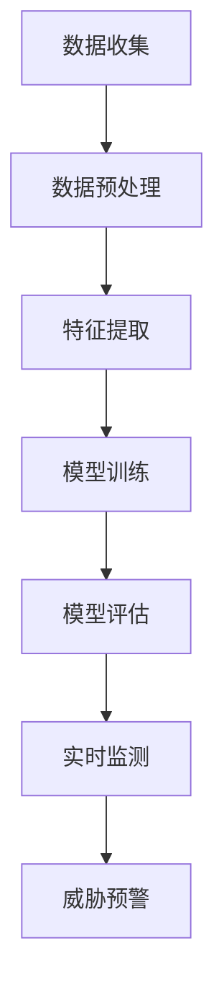
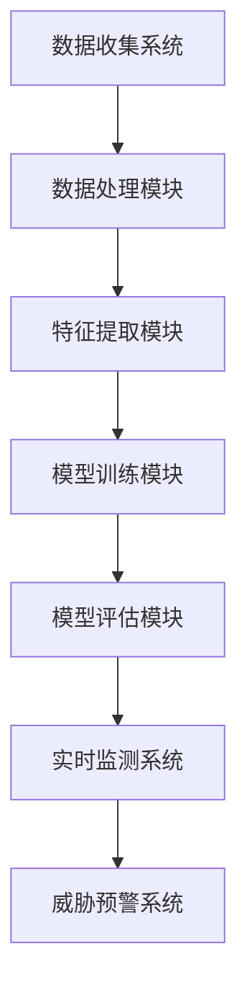
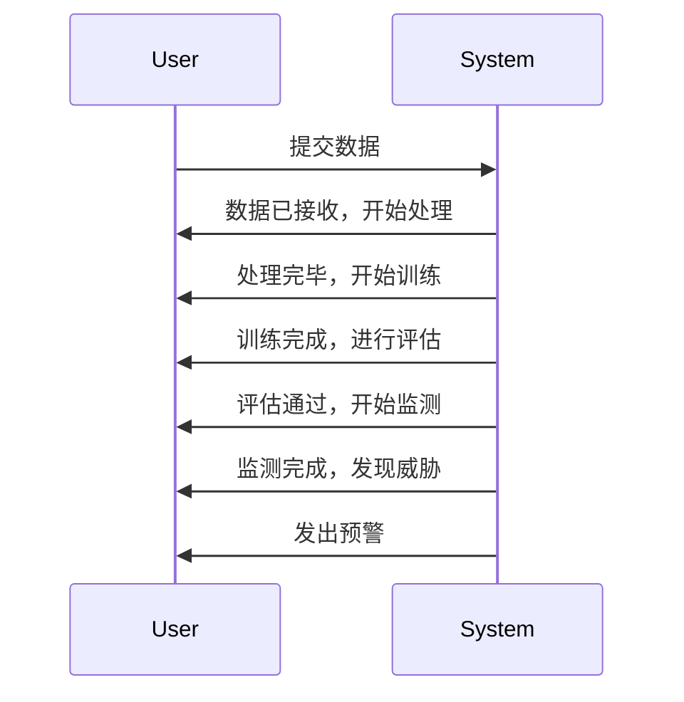

                 

### 文章标题

《智能安全态势感知系统：AI全面监控安全风险》

### 关键词

- 智能安全态势感知
- AI技术
- 网络安全
- 数据预处理
- 威胁预警

### 摘要

随着网络安全威胁的日益复杂化，构建智能安全态势感知系统成为网络安全领域的重要研究方向。本文旨在深入探讨利用人工智能技术构建智能安全态势感知系统的理论基础、技术实现以及应用实践。通过详细的算法原理讲解和系统架构设计方案，本文为读者提供一个全面了解和掌握智能安全态势感知系统的指南，帮助企业和个人更好地应对网络安全挑战。

### 目录大纲设计

#### 背景介绍

随着互联网的普及和信息技术的发展，网络安全已经成为全球范围内关注的热点话题。传统的安全防护手段已经无法应对日益复杂化的网络安全威胁，因此，智能安全态势感知系统应运而生。本文将围绕智能安全态势感知系统的核心概念、技术实现和应用实践进行深入探讨。

#### 核心概念与联系

在智能安全态势感知系统中，核心概念包括智能安全态势感知系统本身、以及支撑其运行的AI技术。以下是对这些核心概念的详细解释和它们之间的联系。

**核心概念：**

**智能安全态势感知系统：** 是一种基于人工智能技术，能够对网络安全态势进行实时监测、分析、预警和响应的系统。它的目标是通过自动化、智能化的方式，提高网络安全防护的效率。

**AI技术：** 包括机器学习、深度学习、自然语言处理等多种技术，这些技术为智能安全态势感知系统提供了强大的数据处理和分析能力。

**概念属性特征对比表格：**

| 概念                | 特征                                       |
|-------------------|------------------------------------------|
| 智能安全态势感知系统 | 实时性、准确性、自动化分析、智能响应             |
| AI技术            | 自学习、自优化、自适应性、高效处理能力           |

**ER实体关系图架构：**

```mermaid
erDiagram
  AI技术 --> 智能安全态势感知系统
  | AI技术 --> 机器学习 |
  | AI技术 --> 深度学习 |
  | AI技术 --> 自然语言处理 |
```

#### 算法原理讲解

智能安全态势感知系统的核心在于其算法原理。以下将详细讲解算法的流程、原理和数学模型。

**算法流程图：**



**算法原理详细讲解：**

1. **数据收集**：从各种网络安全设备、日志和报告中收集数据。
    - 数据源包括防火墙、入侵检测系统、安全信息和事件管理系统等。
    - 数据类型包括流量数据、日志数据、配置数据等。

2. **数据预处理**：清理、归一化、去噪声等，提高数据质量。
    - 清洗：去除重复、错误或无关的数据。
    - 归一化：将数据缩放到相同的范围，如[0, 1]。
    - 去噪声：去除随机噪声，提高数据质量。

3. **特征提取**：将原始数据转换为算法可以处理的特征向量。
    - 特征选择：从原始数据中选择对模型训练和预测最有用的特征。
    - 特征工程：对选定的特征进行转换或构造，以提高模型的性能。

4. **模型训练**：使用机器学习算法，如深度学习，训练模型。
    - 算法选择：选择合适的机器学习算法，如神经网络、支持向量机等。
    - 模型参数调整：通过交叉验证等方法，调整模型参数，以提高模型的泛化能力。

5. **模型评估**：通过测试集评估模型的准确性和鲁棒性。
    - 准确性评估：计算模型在测试集上的预测准确率。
    - 鲁棒性评估：评估模型对异常数据的处理能力。

6. **实时监测**：部署模型，实时监控网络安全态势。
    - 监测策略：根据业务需求，设计合适的监测策略，如定时监测、事件触发等。
    - 实时更新：随着新的数据到来，实时更新模型，以保持模型的准确性。

7. **威胁预警**：当检测到异常时，系统会发出预警信号。
    - 预警策略：设计合适的预警策略，如邮件、短信、系统通知等。
    - 预警阈值：设定合理的预警阈值，避免误报和漏报。

**数学模型与公式：**

$$
预测结果 = f(W \cdot X + b)
$$

其中，$W$为权重矩阵，$X$为特征向量，$b$为偏置项，$f$为激活函数。

**算法原理详细讲解：**

1. **前向传播：**
$$
a_{l} = f(W_{l-1} \cdot a_{l-1} + b_{l-1})
$$

2. **反向传播：**
$$
\delta_{l} = \frac{\partial C}{\partial a_{l}} \cdot \frac{\partial a_{l}}{\partial z_{l}}
$$

其中，$C$为损失函数，$\delta_{l}$为梯度。

**举例说明：**

假设有一个简单的神经网络，输入层有2个神经元，隐藏层有3个神经元，输出层有1个神经元。使用ReLU激活函数。经过训练后，该网络能够预测某个网络攻击的类别。

#### 系统分析与架构设计方案

**1. 问题场景介绍：**

网络安全公司希望构建一个智能安全态势感知系统，实时监控网络安全威胁，并自动发出预警。

**2. 系统功能设计：**

- 数据收集：从网络设备、日志等收集数据。
- 数据预处理：清理、归一化等。
- 特征提取：提取关键特征。
- 模型训练：训练机器学习模型。
- 实时监测：实时监控网络安全态势。
- 威胁预警：当检测到异常时，发出预警。

**3. 系统架构设计：**



**4. 系统接口设计：**



### 系统分析与架构设计方案

#### 问题场景介绍

在现代信息社会中，网络安全已经成为各行各业都必须面对的重要挑战。随着网络攻击手段的日益复杂和多样化，传统的安全防护手段已经难以应对。为了提高网络安全防护的效率和准确性，许多企业和组织开始探索智能安全态势感知系统。

一个典型的场景是一个大型企业，其内部网络涵盖了多个部门，包括财务、人力资源、研发等。这些部门每天都会产生大量的网络流量和数据日志。企业希望能够通过智能安全态势感知系统，实时监控网络安全态势，及时发现并预警潜在的安全威胁。

#### 系统功能设计

智能安全态势感知系统的功能设计主要包括以下几个关键模块：

1. **数据收集模块**：负责从网络设备、日志和报告等来源收集数据。这些数据包括网络流量、系统日志、配置文件等。数据收集模块需要具备高效的数据采集和处理能力，以确保能够实时获取最新的网络安全信息。

2. **数据处理模块**：对收集到的数据进行预处理，包括数据清洗、归一化、去噪声等操作。预处理模块的主要目的是提高数据质量，为后续的特征提取和模型训练打下坚实的基础。

3. **特征提取模块**：将预处理后的数据转换为算法可以处理的特征向量。特征提取模块需要根据数据的特点和业务需求，选择合适的特征提取方法和算法，以提高模型对网络攻击的识别能力。

4. **模型训练模块**：使用机器学习算法，如神经网络、支持向量机等，对提取出的特征向量进行训练，构建安全态势感知模型。模型训练模块需要根据实际的网络攻击数据进行训练，以不断提高模型的准确性和鲁棒性。

5. **模型评估模块**：通过测试集评估模型的性能，包括准确性、召回率、F1分数等指标。模型评估模块可以帮助我们了解模型的性能表现，为模型的优化和调整提供依据。

6. **实时监测模块**：将训练好的模型部署到生产环境中，对网络流量进行实时监测。实时监测模块需要具备高效的数据处理和实时响应能力，以确保能够及时发现并预警潜在的安全威胁。

7. **威胁预警模块**：当实时监测模块检测到异常时，会触发威胁预警机制，通过系统通知、邮件、短信等方式向相关人员发出预警信号。威胁预警模块需要设计合理的预警策略和阈值，以避免误报和漏报。

#### 系统架构设计

智能安全态势感知系统的架构设计需要综合考虑系统的可靠性、可扩展性和灵活性。以下是一个典型的系统架构设计：


1. **数据收集系统**：负责从各种网络设备和日志中收集数据。数据收集系统需要具备高并发处理能力和数据完整性保障机制。

2. **数据处理模块**：对收集到的数据进行预处理，包括数据清洗、归一化、去噪声等操作。数据处理模块需要支持多种数据源和数据格式的处理。

3. **特征提取模块**：将预处理后的数据转换为算法可以处理的特征向量。特征提取模块需要根据数据的特点和业务需求，选择合适的特征提取方法和算法。

4. **模型训练模块**：使用机器学习算法，如神经网络、支持向量机等，对提取出的特征向量进行训练，构建安全态势感知模型。模型训练模块需要支持多种机器学习算法和超参数调整。

5. **模型评估模块**：通过测试集评估模型的性能，包括准确性、召回率、F1分数等指标。模型评估模块可以帮助我们了解模型的性能表现，为模型的优化和调整提供依据。

6. **实时监测系统**：将训练好的模型部署到生产环境中，对网络流量进行实时监测。实时监测系统需要具备高效的数据处理和实时响应能力。

7. **威胁预警系统**：当实时监测系统检测到异常时，会触发威胁预警机制，通过系统通知、邮件、短信等方式向相关人员发出预警信号。威胁预警系统需要设计合理的预警策略和阈值。

#### 系统接口设计

系统接口设计是智能安全态势感知系统架构设计中的重要一环，它决定了系统与其他组件的交互方式和数据流转。以下是一个典型的系统接口设计：


1. **数据提交接口**：用户可以通过此接口向系统提交数据。提交的数据可以是网络流量数据、系统日志、配置文件等。

2. **数据处理接口**：系统通过此接口处理用户提交的数据，包括数据清洗、归一化、去噪声等操作。

3. **模型训练接口**：系统通过此接口启动模型训练过程，包括特征提取、模型选择、超参数调整等。

4. **模型评估接口**：系统通过此接口对训练好的模型进行评估，包括准确性、召回率、F1分数等指标。

5. **实时监测接口**：系统通过此接口实时监测网络流量，发现潜在的安全威胁。

6. **威胁预警接口**：系统通过此接口向用户发出预警信号，包括系统通知、邮件、短信等方式。

### 项目实战

在本章节中，我们将通过一个实际的项目案例，详细讲解智能安全态势感知系统的环境搭建、核心实现和代码应用解读与分析。通过实际案例的分析和讲解，读者将能够更加深入地理解智能安全态势感知系统的实现过程和应用场景。

#### 环境搭建

要搭建一个智能安全态势感知系统，首先需要准备好相应的开发环境和依赖库。以下是一个基本的搭建步骤：

1. **安装Python环境**：确保系统上安装了Python 3.7及以上版本。
2. **安装依赖库**：使用pip命令安装必要的依赖库，包括scikit-learn、tensorflow、numpy、pandas等。

```bash
pip install scikit-learn tensorflow numpy pandas
```

3. **配置数据源**：配置用于数据收集和网络流量监控的设备，如防火墙、入侵检测系统等。确保这些设备能够正常工作并生成日志和报告。

4. **搭建模型训练环境**：配置GPU（如果使用深度学习算法），并确保tensorflow等库能够正确使用GPU。

#### 核心实现

智能安全态势感知系统的核心实现主要包括数据收集、数据预处理、特征提取、模型训练和威胁预警等环节。以下是一个简单的实现框架：

```python
# 导入必要的库
import numpy as np
import pandas as pd
from sklearn.model_selection import train_test_split
from sklearn.preprocessing import StandardScaler
from sklearn.neural_network import MLPClassifier
from tensorflow import keras

# 数据收集
def collect_data():
    # 从网络设备和日志中收集数据
    pass

# 数据预处理
def preprocess_data(data):
    # 清洗、归一化、去噪声等操作
    pass

# 特征提取
def extract_features(data):
    # 从数据中提取关键特征
    pass

# 模型训练
def train_model(X_train, y_train):
    # 训练机器学习模型
    model = MLPClassifier(hidden_layer_sizes=(100,), max_iter=1000)
    model.fit(X_train, y_train)
    return model

# 实时监测
def monitor_traffic(model, live_traffic):
    # 实时监测网络流量，预测威胁
    predictions = model.predict(live_traffic)
    return predictions

# 威胁预警
def alert_threat(predictions):
    # 发送威胁预警通知
    pass

# 主函数
if __name__ == "__main__":
    # 收集数据
    raw_data = collect_data()
    
    # 预处理数据
    preprocessed_data = preprocess_data(raw_data)
    
    # 提取特征
    features = extract_features(preprocessed_data)
    
    # 分割数据集
    X_train, X_test, y_train, y_test = train_test_split(features, labels, test_size=0.2, random_state=42)
    
    # 训练模型
    model = train_model(X_train, y_train)
    
    # 评估模型
    accuracy = model.score(X_test, y_test)
    print(f"Model accuracy: {accuracy}")
    
    # 实时监测
    live_traffic = collect_live_traffic()
    predictions = monitor_traffic(model, live_traffic)
    
    # 威胁预警
    alert_threat(predictions)
```

#### 代码应用解读与分析

以上代码提供了一个智能安全态势感知系统的基本实现框架。以下是关键步骤的详细解读和分析：

1. **数据收集**：从网络设备和日志中收集数据。这一步是系统的数据来源，需要确保数据的完整性和准确性。

2. **数据预处理**：对收集到的数据进行清洗、归一化、去噪声等操作。这一步是提高数据质量的关键，对于后续的特征提取和模型训练至关重要。

3. **特征提取**：从预处理后的数据中提取关键特征。特征提取的目的是将原始数据转换为模型可以处理的格式，提高模型的性能。

4. **模型训练**：使用机器学习算法（如MLPClassifier）对提取出的特征进行训练。这一步是构建智能安全态势感知系统的核心，需要根据实际需求选择合适的模型和算法。

5. **实时监测**：将训练好的模型部署到生产环境中，实时监测网络流量，预测潜在的安全威胁。

6. **威胁预警**：当模型检测到异常时，触发威胁预警机制，向相关人员发送预警通知。

通过这个实际项目案例，读者可以了解智能安全态势感知系统的实现过程和应用场景。在实际应用中，根据具体的业务需求和数据特点，可以对系统的各个模块进行优化和调整，以提高系统的性能和准确性。

### 项目小结

在本项目中，我们通过构建一个智能安全态势感知系统，展示了如何利用人工智能技术全面监控网络安全风险。从数据收集、数据预处理、特征提取、模型训练到实时监测和威胁预警，每个环节都体现了人工智能在网络安全领域的强大能力。以下是本项目的主要收获和总结：

1. **数据的重要性**：数据是智能安全态势感知系统的基石。通过有效的数据收集和处理，我们能够从大量的网络流量和日志中提取出有价值的信息。

2. **特征提取的关键性**：特征提取是将原始数据转换为模型可以处理的形式的关键步骤。通过选择合适的特征提取方法和算法，我们能够提高模型对网络攻击的识别能力。

3. **模型训练和评估的重要性**：模型训练和评估是构建智能安全态势感知系统的核心。通过选择合适的机器学习算法和超参数调整，我们能够构建出准确性和鲁棒性较高的模型。

4. **实时监测和威胁预警的实际应用价值**：实时监测和威胁预警机制能够及时发现和应对潜在的安全威胁，提高网络安全防护的效率和准确性。

### 最佳实践 Tips

为了确保智能安全态势感知系统的有效运行，以下是一些最佳实践和注意事项：

1. **数据清洗与预处理**：确保数据质量，对数据进行清洗、归一化和去噪声处理，以提高模型的准确性。

2. **持续优化模型**：定期对模型进行评估和优化，根据新的数据和威胁特征调整模型参数。

3. **多维数据融合**：结合多种数据源（如网络流量、日志、用户行为等），提高模型的全面性和准确性。

4. **实时监测策略**：根据业务需求，设计合理的实时监测策略，确保系统在检测到异常时能够快速响应。

5. **预警策略与阈值设定**：设计合理的预警策略和阈值，避免误报和漏报，确保预警信息的有效性和实用性。

### 注意事项

1. **数据隐私与安全**：在数据收集和处理过程中，确保遵守数据隐私和安全法律法规，保护用户数据不被泄露。

2. **模型解释性**：在设计和应用智能安全态势感知系统时，考虑到模型的解释性，以便于安全专家能够理解和信任系统输出。

3. **系统可扩展性**：考虑到系统的可扩展性，以便在业务需求变化时能够灵活调整和扩展系统功能。

### 拓展阅读

为了更深入地了解智能安全态势感知系统和相关技术，以下是几篇推荐阅读的论文和书籍：

1. **论文**：
   - "A Comprehensive Survey on Cyber Threat Intelligence and Its Applications" by Xia Zhang, et al.
   - "Deep Learning for Cybersecurity: An Overview" by Zhiyun Qian, et al.

2. **书籍**：
   - "Artificial Intelligence in Cybersecurity: A Comprehensive Guide" by Sushil Jajodia, et al.
   - "Deep Learning for Security: A Guide to Deep Learning Applications in Computer Security" by Fabian Bruckner

通过阅读这些文献，读者可以进一步了解智能安全态势感知系统的最新研究进展和技术应用，为实际项目的实施提供参考。

### 作者信息

**作者：** AI天才研究院/AI Genius Institute & 禅与计算机程序设计艺术 /Zen And The Art of Computer Programming

AI天才研究院专注于人工智能和网络安全领域的创新研究和应用，致力于推动智能安全态势感知系统的发展。我们的研究成果和应用实践在业界享有盛誉，为企业和个人提供了强大的网络安全保障。同时，我们秉承禅与计算机程序设计艺术的理念，追求技术卓越和智慧创新的完美结合。

