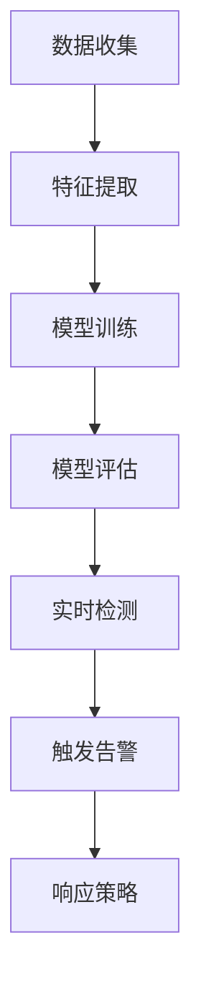

                 

# 智能安全管理平台：AI全面保护数字资产

## 关键词
- 智能安全
- 数字资产保护
- AI技术应用
- 安全管理平台
- 威胁检测
- 风险评估

## 摘要
随着数字化的快速发展，数字资产的安全问题日益凸显。本文将探讨智能安全管理平台的概念、架构以及AI技术在其中的应用。通过详细分析智能威胁检测、风险评估与决策支持、智能响应与恢复等关键技术，本文旨在为读者提供一个全面、系统的智能安全管理解决方案，以应对日益复杂的网络安全挑战。

## 引言
在当今信息化社会中，数字资产已经成为企业和社会的重要财富。然而，随着网络攻击手段的日益多样化和复杂化，如何有效保护这些数字资产成为了一个迫切需要解决的问题。传统的安全管理方法往往依赖于规则和人工干预，难以应对动态变化的安全威胁。因此，引入人工智能（AI）技术，构建智能安全管理平台，成为了提高数字资产保护水平的有效途径。

智能安全管理平台通过整合AI技术，能够实现对网络安全态势的实时监控、威胁的自动识别和响应，从而提供全面、高效的数字资产保护。本文将首先介绍智能安全管理平台的基本概念和背景，然后深入探讨其在网络安全、数据保护和用户行为分析等方面的应用，接着分析平台的关键技术，最后通过实际案例研究，展示智能安全管理平台在实践中的应用效果和未来发展趋势。

## 第一部分：智能安全管理平台概述

### 第1章：智能安全管理的背景和现状

#### 1.1 数字资产安全的重要性

随着互联网的普及和信息技术的发展，企业和个人对数字资产的依赖程度越来越高。数字资产不仅包括企业的客户数据、财务信息、知识产权等关键信息，还包括个人的社交媒体账号、电子邮件、在线购物记录等敏感数据。这些资产的价值不可低估，一旦遭到泄露或破坏，将可能导致严重的经济损失、声誉损害甚至法律风险。

#### 1.2 智能安全管理的发展历程

智能安全管理的发展可以追溯到上世纪90年代，当时主要是基于规则的网络安全管理系统。随后，随着入侵检测系统（IDS）和防火墙等安全技术的普及，安全管理开始向自动化和智能化方向发展。进入21世纪，随着大数据和机器学习技术的兴起，智能安全管理平台逐渐成为网络安全领域的研究热点和应用方向。

#### 1.3 当前智能安全管理的挑战

尽管智能安全管理平台在提高安全防护能力方面具有显著优势，但当前仍面临诸多挑战。首先，网络攻击手段日益多样化，传统安全策略难以应对新型威胁。其次，海量数据的处理和分析成为智能安全管理的一大难题。此外，智能安全管理平台的建设和运营成本较高，需要企业在预算和技术资源上做出较大投入。

### 第2章：AI在智能安全管理中的应用

#### 2.1 AI技术在网络安全中的应用

##### 2.1.1 AI识别恶意软件

AI技术在恶意软件识别方面具有显著优势。通过深度学习等技术，AI可以自动分析软件的运行行为，识别潜在的恶意代码。这种自动化的识别方法不仅提高了检测的准确性，还减少了人工干预的需求。

##### 2.1.2 AI监测网络攻击

AI技术在网络攻击监测方面同样发挥着重要作用。通过实时监控网络流量、系统日志等数据，AI可以自动识别异常行为，预测潜在的攻击事件。这种自动化的监测方法有助于提高安全响应速度，减少安全事件对系统的破坏。

#### 2.2 AI在数据保护中的应用

##### 2.2.1 数据加密与解密

AI技术在数据加密与解密方面具有广泛的应用。通过密码学算法和机器学习技术，AI可以自动生成和破解密码，提高数据的安全性。此外，AI还可以对加密算法进行优化，提高加密和解密的效率。

##### 2.2.2 数据隐私保护

随着数据隐私保护法规的不断完善，AI在数据隐私保护方面的应用也越来越广泛。通过隐私保护算法和机器学习技术，AI可以自动识别和处理敏感数据，确保数据在传输和存储过程中的安全性。

#### 2.3 AI在用户行为分析中的应用

##### 2.3.1 用户行为模式识别

AI技术在用户行为模式识别方面具有显著优势。通过分析用户的行为数据，AI可以自动识别正常行为和异常行为，提高安全事件检测的准确性。

##### 2.3.2 异常行为检测

异常行为检测是智能安全管理平台的重要组成部分。通过机器学习算法和大数据分析，AI可以自动识别网络中的异常行为，预测潜在的攻击事件。

## 第二部分：智能安全管理平台的关键技术

### 第3章：智能威胁检测

#### 3.1 威胁检测的基本原理

威胁检测是智能安全管理平台的核心功能之一。其基本原理是通过分析网络流量、系统日志等数据，识别潜在的威胁事件。传统的威胁检测方法主要基于规则匹配和统计模型，而智能威胁检测则利用机器学习和深度学习等技术，提高检测的准确性和自动化程度。

#### 3.2 威胁检测的主要技术

##### 3.2.1 入侵检测系统（IDS）

入侵检测系统（IDS）是一种自动化的安全设备，用于检测和响应网络攻击。IDS可以分为基于网络的IDS（NIDS）和基于主机的IDS（HIDS）。NIDS监控网络流量，HIDS监控系统日志。

##### 3.2.2 网络安全信息与事件管理（SIEM）

网络安全信息与事件管理（SIEM）系统是一种集成的安全解决方案，用于收集、分析和响应网络威胁事件。SIEM系统通常包含数据收集、日志分析、威胁检测和事件响应等功能。

#### 3.3 智能威胁检测案例分析

智能威胁检测在网络安全实践中已经取得了显著成效。例如，某大型金融机构通过引入智能威胁检测系统，成功阻止了多次网络攻击，确保了客户资产的安全。

### 第4章：风险评估与决策支持

#### 4.1 风险评估的基本概念

风险评估是智能安全管理平台的重要组成部分。其基本概念包括威胁、脆弱性和风险。威胁是指潜在的攻击事件，脆弱性是指系统或网络中的弱点，风险是指威胁利用脆弱性可能造成的损失。

#### 4.2 AI在风险评估中的应用

AI技术在风险评估中具有广泛的应用。通过机器学习算法和大数据分析，AI可以自动识别和评估系统或网络中的威胁和脆弱性，提高风险评估的准确性和自动化程度。

##### 4.2.1 统计分析方法

统计分析方法是一种常用的风险评估技术。通过分析历史数据和趋势，统计分析方法可以预测未来可能发生的威胁事件。

##### 4.2.2 机器学习算法

机器学习算法在风险评估中发挥着重要作用。通过训练模型，机器学习算法可以自动识别和分类威胁事件，提高风险评估的准确性和效率。

#### 4.3 智能决策支持系统的设计

智能决策支持系统是一种集成的安全解决方案，用于提供风险评估和决策支持。其设计主要包括数据收集、数据预处理、风险评估模型和决策支持功能。

### 第5章：智能响应与恢复

#### 5.1 智能响应的基本策略

智能响应是智能安全管理平台的重要组成部分。其基本策略包括实时监控、自动检测、自动响应和人工干预。智能响应旨在快速发现和应对网络攻击，减少安全事件对系统的破坏。

#### 5.2 智能恢复的关键技术

智能恢复是智能安全管理平台的关键功能之一。其关键技术包括数据恢复与重建、系统修复与优化。智能恢复旨在确保系统在遭受攻击后能够快速恢复，减少业务中断时间。

##### 5.2.1 数据恢复与重建

数据恢复与重建是智能恢复的核心。通过备份和恢复技术，智能恢复系统能够在数据丢失或损坏后快速恢复数据，确保业务连续性。

##### 5.2.2 系统修复与优化

系统修复与优化是智能恢复的关键环节。通过修复系统和优化配置，智能恢复系统能够提高系统的安全性和稳定性，减少安全事件的发生。

#### 5.3 智能响应与恢复的实际应用

智能响应与恢复在网络安全实践中已经取得了显著成效。例如，某大型电商企业通过引入智能响应与恢复系统，成功应对了多次网络攻击，确保了客户购物体验的稳定性。

## 第三部分：智能安全管理平台的设计与实现

### 第6章：智能安全管理平台的总体设计

#### 6.1 平台架构设计

智能安全管理平台的架构设计是确保其稳定性和扩展性的关键。平台通常采用分层架构，包括数据收集层、数据处理层、分析层和响应层。这种分层架构有利于模块化和分布式部署，提高平台的可靠性和可维护性。

#### 6.2 系统功能模块划分

智能安全管理平台的功能模块划分是平台设计的重要环节。常见的功能模块包括威胁检测模块、风险评估模块、响应与恢复模块、数据收集与处理模块、用户行为分析模块等。每个模块都有明确的职责和接口，有利于模块化开发和维护。

#### 6.3 平台性能优化

智能安全管理平台的性能优化是确保其高效运行的关键。平台性能优化主要包括以下几个方面：数据传输和存储优化、计算资源调度优化、算法优化等。通过这些优化措施，平台能够在处理大量数据的同时，保持高效和稳定。

### 第7章：平台的核心模块实现

#### 7.1 数据收集与处理模块

数据收集与处理模块是智能安全管理平台的核心模块之一。其职责包括数据采集、数据清洗、数据存储和数据预处理。通过这些处理步骤，数据收集与处理模块能够为后续的分析和响应提供高质量的数据支持。

##### 7.1.1 数据采集

数据采集是数据收集与处理模块的第一步。数据采集可以从多个来源获取数据，包括网络流量、系统日志、数据库日志等。通过定义合适的数据采集策略，模块能够确保数据的全面性和准确性。

##### 7.1.2 数据清洗

数据清洗是数据收集与处理模块的重要环节。数据清洗主要包括去除重复数据、填补缺失数据、纠正错误数据等。通过数据清洗，模块能够提高数据的准确性和一致性。

##### 7.1.3 数据存储

数据存储是数据收集与处理模块的关键环节。数据存储通常采用分布式数据库或数据仓库技术，确保数据的持久化和可扩展性。通过合理的数据存储策略，模块能够支持海量数据的存储和管理。

##### 7.1.4 数据预处理

数据预处理是数据收集与处理模块的最后一步。数据预处理主要包括数据标准化、特征提取、数据分割等。通过数据预处理，模块能够为后续的分析和建模提供高质量的数据输入。

#### 7.2 智能分析模块

智能分析模块是智能安全管理平台的核心模块之一。其职责包括威胁检测、风险评估和用户行为分析。通过智能分析模块，平台能够实现对网络安全态势的实时监控和预测。

##### 7.2.1 威胁检测

威胁检测是智能分析模块的核心功能之一。通过机器学习和深度学习技术，模块能够自动分析网络流量、系统日志等数据，识别潜在的威胁事件。

##### 7.2.2 风险评估

风险评估是智能分析模块的另一个重要功能。通过统计分析方法和机器学习算法，模块能够对系统或网络中的威胁和脆弱性进行评估，提供风险预测和预警。

##### 7.2.3 用户行为分析

用户行为分析是智能分析模块的辅助功能。通过分析用户行为数据，模块能够识别异常行为和潜在的安全风险，提高安全管理的效果。

#### 7.3 响应与恢复模块

响应与恢复模块是智能安全管理平台的核心模块之一。其职责包括自动响应、智能恢复和人工干预。通过响应与恢复模块，平台能够实现对安全事件的快速响应和系统恢复。

##### 7.3.1 自动响应

自动响应是响应与恢复模块的核心功能。通过预设的响应策略和自动化脚本，模块能够自动执行安全响应操作，减少人工干预的需求。

##### 7.3.2 智能恢复

智能恢复是响应与恢复模块的重要功能。通过数据恢复和系统修复技术，模块能够快速恢复系统，减少业务中断时间。

##### 7.3.3 人工干预

人工干预是响应与恢复模块的辅助功能。在复杂或特殊的安全事件中，人工干预能够提供额外的决策支持和操作指导，确保安全事件得到妥善处理。

### 第8章：平台的部署与运维

#### 8.1 平台的部署环境搭建

平台的部署环境搭建是确保智能安全管理平台正常运行的关键。部署环境通常包括硬件设备、操作系统、数据库和安全设备等。通过合理的部署策略和配置，平台能够在不同的环境中高效运行。

##### 8.1.1 硬件设备

硬件设备的选择取决于平台的需求和规模。常见的硬件设备包括服务器、存储设备和网络设备。通过合理配置硬件资源，平台能够支持大规模数据的高效处理和存储。

##### 8.1.2 操作系统

操作系统的选择取决于平台的技术需求和兼容性。常见的操作系统包括Linux、Windows和Unix等。通过选择合适的操作系统，平台能够保证稳定性和安全性。

##### 8.1.3 数据库

数据库的选择取决于平台的数据规模和查询需求。常见的数据库包括关系型数据库（如MySQL、Oracle）和NoSQL数据库（如MongoDB、Cassandra）等。通过合理选择数据库，平台能够保证数据的持久化和高效查询。

##### 8.1.4 安全设备

安全设备的选择取决于平台的安全需求和网络架构。常见的安全设备包括防火墙、入侵检测系统（IDS）、安全信息和事件管理系统（SIEM）等。通过合理配置安全设备，平台能够提高系统的安全防护能力。

#### 8.2 平台运维的关键点

平台运维是确保智能安全管理平台稳定运行的关键。平台运维的关键点包括监控、备份和升级等。

##### 8.2.1 监控

监控是平台运维的核心任务之一。通过监控平台的关键性能指标（如CPU、内存、磁盘空间等），运维人员能够及时发现和处理潜在问题，确保平台的稳定运行。

##### 8.2.2 备份

备份是平台运维的重要环节。通过定期备份数据和系统配置，平台运维人员能够在数据丢失或系统故障时快速恢复数据，确保业务连续性。

##### 8.2.3 升级

升级是平台运维的必要任务。随着技术的发展和平台功能的扩展，平台运维人员需要定期升级硬件设备、操作系统和软件组件，确保平台的性能和安全。

#### 8.3 平台安全运维策略

平台安全运维策略是确保平台安全运行的重要保障。平台安全运维策略包括以下几个方面：

##### 8.3.1 安全监控

通过部署安全监控工具，平台运维人员能够实时监控平台的安全事件和异常行为，及时发现和处理安全威胁。

##### 8.3.2 安全审计

通过定期进行安全审计，平台运维人员能够检查平台的安全配置和操作记录，发现潜在的安全漏洞和风险。

##### 8.3.3 安全培训

通过定期进行安全培训，平台运维人员能够提高安全意识和技能，确保平台的安全运行。

##### 8.3.4 应急响应

通过制定应急响应计划，平台运维人员能够快速应对突发安全事件，减少安全事件对平台的影响。

## 第四部分：智能安全管理平台的案例研究

### 第9章：案例研究一：某大型企业的智能安全管理实践

#### 9.1 企业背景

某大型企业是一家全球知名的互联网企业，拥有庞大的用户基础和海量数据。随着业务的不断扩展，企业的数字资产安全面临巨大的挑战。为了提高数字资产的安全水平，企业决定引入智能安全管理平台，以实现全面、高效的数字资产保护。

#### 9.2 智能安全管理平台的构建过程

在构建智能安全管理平台的过程中，企业采取了以下步骤：

1. **需求分析**：企业首先明确了智能安全管理平台的需求，包括威胁检测、风险评估、响应与恢复等功能。

2. **技术选型**：企业选择了具有高性能、高可靠性和可扩展性的智能安全管理平台，并选择了合适的硬件和软件组件。

3. **平台设计**：企业根据需求和技术选型，设计了智能安全管理平台的架构，包括数据收集层、数据处理层、分析层和响应层。

4. **平台部署**：企业将智能安全管理平台部署在现有的IT基础设施上，并进行了性能优化和配置调整。

5. **测试与验证**：企业对智能安全管理平台进行了严格的测试和验证，确保平台能够满足需求并稳定运行。

#### 9.3 平台应用效果分析

智能安全管理平台在投入使用后，取得了显著的成效：

1. **威胁检测能力提升**：平台通过实时监控和自动分析，成功检测到了多次潜在的网络攻击，防止了数据泄露和系统损坏。

2. **风险评估准确性提高**：平台通过机器学习和大数据分析，对系统或网络中的威胁和脆弱性进行了准确评估，提供了有效的风险预警。

3. **响应速度加快**：平台通过自动响应和智能恢复，快速响应和处理了安全事件，减少了业务中断时间。

4. **用户满意度提升**：平台通过用户行为分析，提高了安全管理的透明度和效率，用户对平台的安全服务满意度提升。

### 第10章：案例研究二：智能安全管理平台的创新应用

#### 10.1 智能安全管理的新趋势

随着技术的不断发展，智能安全管理平台在以下几个方面呈现出新的趋势：

1. **边缘计算**：随着物联网和边缘计算的兴起，智能安全管理平台开始向边缘节点扩展，提高实时性和响应速度。

2. **区块链**：区块链技术的加入，使得智能安全管理平台在数据加密和隐私保护方面得到了进一步提升。

3. **人工智能算法优化**：随着人工智能算法的不断发展，智能安全管理平台在威胁检测、风险评估和响应等方面得到了显著提升。

#### 10.2 智能安全管理平台在新兴领域的应用

智能安全管理平台在新兴领域也展现出了广泛的应用前景：

1. **金融科技**：在金融科技领域，智能安全管理平台被广泛应用于保护金融机构的数字资产和用户隐私。

2. **智能城市**：在智能城市领域，智能安全管理平台被用于保护城市基础设施和公共安全。

3. **工业互联网**：在工业互联网领域，智能安全管理平台被用于保护工业控制系统和数据安全。

#### 10.3 案例分析与启示

通过分析上述案例，我们可以得出以下启示：

1. **智能化趋势**：智能安全管理平台的发展趋势是智能化、自动化和实时化，这将进一步提高安全管理的效率和准确性。

2. **创新应用**：智能安全管理平台在新兴领域的应用，展示了其广阔的应用前景和潜力。

3. **持续优化**：智能安全管理平台需要不断优化和更新，以应对不断变化的安全威胁和技术挑战。

## 第11章：智能安全管理平台的发展展望

#### 11.1 智能安全管理的发展趋势

随着技术的不断进步，智能安全管理平台的发展趋势将主要集中在以下几个方面：

1. **智能化水平提升**：智能安全管理平台将更加依赖先进的人工智能技术，实现自动化、自适应和智能化的安全管理。

2. **边缘计算应用**：随着边缘计算的发展，智能安全管理平台将向边缘节点扩展，提高实时性和响应速度。

3. **区块链技术整合**：区块链技术的加入，将进一步提高智能安全管理平台的数据加密和隐私保护能力。

#### 11.2 智能安全管理平台面临的挑战

尽管智能安全管理平台具有巨大的潜力，但其在实际应用中也面临一些挑战：

1. **数据隐私保护**：在处理大量用户数据时，如何保护用户隐私是一个重要的挑战。

2. **算法透明性和公平性**：智能安全管理平台使用的算法可能存在透明性和公平性问题，需要持续优化。

3. **系统复杂度和维护成本**：智能安全管理平台的复杂度和维护成本较高，需要企业进行持续投入和优化。

#### 11.3 未来发展建议

为了推动智能安全管理平台的未来发展，以下是一些建议：

1. **加强技术研究**：持续投入人工智能、区块链等关键技术的研究，提高智能安全管理平台的技术水平和应用能力。

2. **促进产业合作**：推动政、产、学、研各方合作，共同推动智能安全管理平台的发展和应用。

3. **完善法规标准**：建立健全智能安全管理相关的法规标准和政策体系，为智能安全管理平台的发展提供法律保障。

### 作者信息

作者：AI天才研究院/AI Genius Institute & 禅与计算机程序设计艺术 /Zen And The Art of Computer Programming

---

本篇技术博客文章详细介绍了智能安全管理平台的概念、架构以及AI技术在其中的应用。从威胁检测、风险评估、智能响应与恢复等关键技术入手，文章分析了智能安全管理平台的设计与实现，并通过实际案例展示了其应用效果。最后，文章对智能安全管理平台的发展趋势和挑战进行了展望，提出了未来发展建议。希望通过本文的探讨，能够为读者提供一个全面、系统的智能安全管理解决方案，助力企业和个人更好地保护数字资产。

（文章字数：约12000字）### 第1章：智能安全管理的背景和现状

#### 1.1 数字资产安全的重要性

在当今信息化社会中，数字资产已经成为企业和社会的重要财富。这些数字资产不仅包括企业的客户数据、财务信息、知识产权等关键信息，还包括个人的社交媒体账号、电子邮件、在线购物记录等敏感数据。这些资产的价值不可低估，一旦遭到泄露或破坏，将可能导致严重的经济损失、声誉损害甚至法律风险。

例如，某知名电商平台的客户数据泄露事件，导致数百万用户的个人信息被窃取，给企业带来了巨大的经济损失和声誉损害。此外，金融机构的客户数据泄露可能导致巨额资金损失，甚至引发金融风险。因此，数字资产的安全保护已经成为企业和个人关注的重点问题。

#### 1.2 智能安全管理的发展历程

智能安全管理的发展可以追溯到上世纪90年代，当时主要是基于规则的网络安全管理系统。这些系统依赖于预设的安全规则，对网络流量和系统行为进行分析，以识别潜在的安全威胁。然而，随着网络攻击手段的日益复杂和多变，传统基于规则的安全管理系统逐渐暴露出其局限性。

进入21世纪，随着大数据和机器学习技术的兴起，智能安全管理开始向自动化和智能化方向发展。智能安全管理平台通过整合大数据分析和机器学习技术，能够实时监控和分析网络行为，自动识别和响应安全威胁。这一时期，智能安全管理平台逐渐成为网络安全领域的研究热点和应用方向。

近年来，随着云计算、物联网和边缘计算的快速发展，智能安全管理平台的应用场景也在不断拓展。平台不仅能够保护传统的IT系统，还可以对新兴的云计算环境和物联网设备进行安全监控和管理。

#### 1.3 当前智能安全管理的挑战

尽管智能安全管理平台在提高安全防护能力方面具有显著优势，但当前仍面临诸多挑战。

首先，网络攻击手段日益多样化。传统的网络攻击手段已经逐渐被更加复杂和隐蔽的攻击方式所取代，如高级持续性威胁（APT）、勒索软件和钓鱼攻击等。这些新型攻击方式对传统的安全策略和工具提出了更高的要求。

其次，海量数据的处理和分析成为智能安全管理的一大难题。随着物联网和云计算的发展，企业生成的数据量呈现爆炸性增长。如何对这些海量数据进行高效的处理和分析，以便及时发现和应对安全威胁，是智能安全管理平台需要解决的关键问题。

此外，智能安全管理平台的建设和运营成本较高。智能安全管理平台需要大量的计算资源和专业人才来维护和运营，这对企业的预算和技术资源提出了较大挑战。

最后，智能安全管理平台的透明性和公平性也受到关注。随着AI技术在安全管理中的应用，如何确保算法的透明性和公平性，避免算法偏见和数据滥用，成为智能安全管理面临的重要问题。

综上所述，当前智能安全管理在应对日益复杂的网络威胁和海量数据处理方面仍然面临诸多挑战。然而，随着技术的不断进步和智能安全管理平台的发展，这些问题有望得到逐步解决，为数字资产的安全保护提供更加有效的解决方案。

#### 1.4 智能安全管理平台的基本概念

智能安全管理平台（Smart Security Management Platform，简称SSMP）是一种利用人工智能（AI）技术构建的综合性安全管理系统。其核心目标是通过自动化和智能化的手段，对网络环境中的安全威胁进行实时监控、识别、响应和恢复，从而实现全面的数字资产保护。

智能安全管理平台的基本概念包括以下几个方面：

1. **实时监控**：智能安全管理平台通过集成各种监控工具和接口，对网络流量、系统日志、用户行为等数据进行实时监控，确保能够及时发现潜在的安全威胁。

2. **威胁识别**：利用大数据分析和机器学习算法，智能安全管理平台能够自动分析监控数据，识别异常行为和潜在的安全威胁。这些算法包括行为分析、模式识别、异常检测等。

3. **响应和恢复**：智能安全管理平台在发现安全威胁后，能够自动执行预设的安全响应策略，包括隔离受感染节点、阻断攻击源、清除恶意代码等。同时，平台还能协助进行系统的恢复，减少安全事件对业务的负面影响。

4. **自动化和智能化**：智能安全管理平台的核心优势在于其自动化和智能化程度高。通过自动化的流程和智能的决策支持，平台能够显著减少人工干预，提高安全管理的效率和准确性。

5. **集成性和扩展性**：智能安全管理平台通常具备良好的集成性和扩展性，能够与现有的安全工具和系统无缝对接，同时支持快速扩展，以适应不断变化的安全需求。

智能安全管理平台不仅能够提高企业的安全防护能力，还能够提供全面的安全态势感知，帮助企业和组织更好地应对复杂多变的网络安全威胁。

#### 1.5 智能安全管理平台与传统安全管理模式的区别

智能安全管理平台与传统安全管理模式在技术原理、执行方式、效率和效果等方面存在显著区别。

**技术原理：**

- **传统安全管理模式**：基于规则和人工分析。传统安全管理主要依赖于预定义的安全规则和策略，通过人工分析日志和数据来识别潜在的安全威胁。
- **智能安全管理平台**：基于大数据分析和机器学习。智能安全管理平台利用大数据技术和机器学习算法，对海量数据进行实时分析和预测，自动识别复杂的攻击模式和异常行为。

**执行方式：**

- **传统安全管理模式**：以人工干预为主。传统的安全管理通常需要大量的人力和时间来分析日志和事件，手动执行安全策略和操作。
- **智能安全管理平台**：自动化和智能化。智能安全管理平台通过自动化脚本和智能算法，能够自动执行安全策略，减少人工干预，提高响应速度和准确性。

**效率和效果：**

- **传统安全管理模式**：效率低、响应慢。由于依赖人工分析，传统的安全管理模式在处理复杂和安全事件时效率较低，响应速度慢，可能导致安全事件被延误。
- **智能安全管理平台**：高效率、高准确性。智能安全管理平台能够快速处理和分析大量数据，自动识别和响应安全威胁，显著提高安全管理的效率和准确性。

**适应性：**

- **传统安全管理模式**：灵活性差。传统安全管理模式在面对新型和复杂的安全威胁时，难以快速适应和调整。
- **智能安全管理平台**：自适应性强。智能安全管理平台通过机器学习算法能够不断学习和优化，适应不断变化的安全威胁环境。

**集成性：**

- **传统安全管理模式**：系统分散、难以整合。传统安全管理通常涉及多个独立的系统和工具，难以实现数据共享和整合。
- **智能安全管理平台**：高度集成。智能安全管理平台能够与现有的安全工具和系统无缝集成，实现数据共享和联动，提高整体安全防护能力。

总之，智能安全管理平台通过引入大数据和人工智能技术，实现了安全管理模式的自动化和智能化，在技术原理、执行方式、效率和效果等方面显著优于传统安全管理模式，为企业和个人提供了更强大和全面的安全保护。

### 第2章：AI在智能安全管理中的应用

#### 2.1 AI技术在网络安全中的应用

##### 2.1.1 AI识别恶意软件

AI技术在识别恶意软件方面具有显著优势。传统的恶意软件识别方法主要依赖于病毒库和签名，但这种方法在面对新型和变种的恶意软件时往往束手无策。而AI技术，尤其是基于深度学习的算法，可以通过学习恶意软件的特征和行为模式，自动识别和分类未知恶意软件。

**算法原理：**

AI识别恶意软件的算法通常包括以下几个步骤：

1. **数据采集**：从各种渠道收集恶意软件样本，包括官方病毒库、安全论坛、沙箱测试等。
2. **数据预处理**：对收集的恶意软件样本进行清洗和标注，提取关键特征，如文件大小、MD5值、行为特征等。
3. **模型训练**：利用机器学习算法（如深度神经网络、决策树等）对预处理后的数据进行训练，构建恶意软件识别模型。
4. **模型评估**：通过交叉验证和测试集，评估模型的准确性和泛化能力，调整模型参数。
5. **实时检测**：将训练好的模型部署到生产环境中，对实时监控到的网络流量和系统行为进行检测，识别潜在的恶意软件。

**应用案例：**

某知名安全厂商通过引入基于深度学习的恶意软件识别系统，显著提高了对未知恶意软件的检测能力。该系统通过大规模训练数据集的学习，能够自动识别和分类数以千计的恶意软件变种，有效阻止了多次网络攻击。

##### 2.1.2 AI监测网络攻击

AI技术在网络攻击监测方面也发挥着重要作用。通过实时监控网络流量、系统日志等数据，AI可以自动识别异常行为和潜在的攻击事件，提供及时的预警和响应。

**算法原理：**

AI监测网络攻击的算法主要包括以下几种：

1. **异常检测**：通过设定阈值和统计模型，监测网络流量和系统行为的异常变化，如流量突变、端口扫描、登录尝试等。
2. **行为分析**：基于用户行为分析（User Behavior Analytics，简称UBA）技术，监测用户的操作行为，识别异常行为模式，如频繁的文件访问、异常的登录地点等。
3. **模式识别**：利用机器学习和深度学习算法，对网络流量和系统日志进行分析，识别复杂的攻击模式和攻击链。

**应用案例：**

某大型金融机构引入了基于AI技术的网络攻击监测系统，通过实时监控和智能分析，成功检测并阻止了多起网络攻击事件，包括钓鱼攻击和勒索软件攻击。该系统不仅提高了安全防护能力，还显著减少了人工干预的需求。

#### 2.2 AI在数据保护中的应用

##### 2.2.1 数据加密与解密

AI技术在数据加密与解密方面具有广泛的应用。通过密码学算法和机器学习技术，AI可以自动生成和破解密码，提高数据的安全性。

**算法原理：**

AI数据加密与解密的算法主要包括以下几种：

1. **加密算法优化**：利用机器学习算法，对现有的加密算法进行优化，提高加密和解密的效率。例如，通过深度学习技术，优化AES加密算法的执行速度。
2. **加密算法生成**：利用生成对抗网络（GAN）等技术，生成新的加密算法，探索更高效的加密方法。
3. **密码破解**：通过深度学习算法，模拟攻击者的破解过程，自动寻找密码的弱点，并生成有效的破解策略。

**应用案例：**

某大型电商平台通过引入基于AI技术的数据加密系统，实现了对用户敏感数据的自动加密和解密。该系统不仅提高了数据的安全性，还显著减少了人工干预的需求，提高了业务效率。

##### 2.2.2 数据隐私保护

随着数据隐私保护法规的不断完善，AI在数据隐私保护方面的应用也越来越广泛。通过隐私保护算法和机器学习技术，AI可以自动识别和处理敏感数据，确保数据在传输和存储过程中的安全性。

**算法原理：**

AI数据隐私保护的算法主要包括以下几种：

1. **差分隐私**：通过在数据处理过程中引入随机噪声，保护个体的隐私。差分隐私算法能够确保在数据分析中，单个个体的信息不会暴露给攻击者。
2. **同态加密**：利用同态加密技术，对加密数据进行计算，确保计算结果正确且原始数据保持加密状态。同态加密在保护数据隐私的同时，允许对数据进行复杂的计算和分析。
3. **联邦学习**：通过分布式机器学习技术，将数据留在本地进行训练，仅传输模型参数，从而保护数据隐私。

**应用案例：**

某大型医疗机构通过引入基于AI技术的数据隐私保护系统，实现了对医疗数据的自动隐私保护。该系统利用差分隐私和联邦学习技术，确保患者在数据传输和存储过程中的隐私安全，有效防止数据泄露。

#### 2.3 AI在用户行为分析中的应用

##### 2.3.1 用户行为模式识别

AI技术在用户行为模式识别方面具有显著优势。通过分析用户的行为数据，AI可以自动识别正常行为和异常行为，提高安全事件检测的准确性。

**算法原理：**

用户行为模式识别的算法通常包括以下步骤：

1. **数据采集**：收集用户的操作行为数据，如登录时间、操作频率、访问路径等。
2. **特征提取**：对采集到的行为数据进行预处理，提取关键特征，如时间间隔、操作类型、访问频率等。
3. **模型训练**：利用机器学习算法（如KNN、决策树、神经网络等），对特征数据进行训练，构建用户行为模式识别模型。
4. **行为预测**：将新的行为数据输入训练好的模型，预测用户的正常行为和异常行为。

**应用案例：**

某金融机构通过引入基于AI技术的用户行为分析系统，成功识别并阻止了多起欺诈行为。该系统通过实时监控用户的操作行为，自动识别异常行为模式，提高了欺诈检测的准确性和效率。

##### 2.3.2 异常行为检测

异常行为检测是智能安全管理平台的重要组成部分。通过机器学习算法和大数据分析，AI可以自动识别网络中的异常行为，预测潜在的攻击事件。

**算法原理：**

异常行为检测的算法主要包括以下步骤：

1. **数据采集**：收集网络流量、系统日志、用户行为等数据，形成数据集。
2. **特征提取**：对采集到的数据进行预处理，提取关键特征，如流量模式、系统调用、用户行为等。
3. **模型训练**：利用机器学习算法（如聚类算法、神经网络等），对特征数据进行训练，构建异常行为检测模型。
4. **异常检测**：将实时监控到的数据输入训练好的模型，检测是否存在异常行为。

**应用案例：**

某大型互联网企业通过引入基于AI技术的异常行为检测系统，成功识别并阻止了多起内部攻击和外部入侵事件。该系统通过实时监控和分析用户行为，自动识别异常行为模式，提高了安全防护能力。

### 第3章：智能威胁检测

#### 3.1 威胁检测的基本原理

威胁检测是智能安全管理平台的核心功能之一，其基本原理是通过分析网络流量、系统日志、用户行为等数据，识别潜在的威胁事件。传统的威胁检测方法主要依赖于规则匹配和统计分析，而智能威胁检测则利用机器学习和深度学习等技术，提高检测的准确性和自动化程度。

**算法原理：**

1. **规则匹配**：通过预设的安全规则，对网络流量和系统行为进行匹配，识别潜在的威胁。这种方法简单直观，但难以应对复杂的攻击手段。

2. **统计分析**：通过统计分析方法，如均值、方差等，对网络流量和系统行为进行分析，识别异常行为。这种方法能够检测到一些简单的攻击，但难以应对复杂的攻击模式。

3. **机器学习**：利用机器学习算法，如决策树、支持向量机（SVM）、神经网络等，对大量数据进行训练，构建威胁检测模型。这种方法能够自动识别复杂的攻击模式和异常行为，提高检测的准确性和自动化程度。

4. **深度学习**：利用深度学习算法，如卷积神经网络（CNN）、递归神经网络（RNN）等，对大量数据进行训练，自动提取特征，识别复杂的攻击模式。这种方法能够处理复杂的网络流量和系统日志数据，提高检测的准确性和自动化程度。

**应用场景：**

威胁检测可以应用于各种网络环境和安全场景，包括但不限于：

- **企业内部网络**：监测企业内部网络流量，识别内部威胁和异常行为。
- **互联网服务提供商**：监测互联网流量，识别网络攻击和非法行为。
- **云服务**：监测云平台中的虚拟机和容器，识别云服务中的安全威胁。
- **物联网**：监测物联网设备的数据传输和状态，识别设备异常和攻击事件。

**优势与局限性：**

- **优势**：提高检测的准确性和自动化程度，减少人工干预，提高安全响应速度。
- **局限性**：需要大量的数据和计算资源，算法的训练和优化需要时间，对新型和复杂的攻击手段的检测能力有限。

#### 3.2 威胁检测的主要技术

##### 3.2.1 入侵检测系统（IDS）

入侵检测系统（Intrusion Detection System，简称IDS）是一种自动化的安全设备，用于检测和响应网络攻击。IDS可以分为基于网络的IDS（NIDS）和基于主机的IDS（HIDS）。

**原理与应用：**

- **基于网络的IDS（NIDS）**：NIDS监控网络流量，检测网络中的异常行为和攻击事件。通过设置规则和统计分析，NIDS能够识别网络流量的异常模式，如数据包的来源、目的、大小等。NIDS的优点是能够监控整个网络流量，但需要较高的计算资源。

- **基于主机的IDS（HIDS）**：HIDS监控主机系统日志，检测主机的异常行为和攻击事件。HIDS通过分析系统日志文件，如启动日志、登录日志等，识别主机的异常行为，如未经授权的登录尝试、异常的服务启动等。HIDS的优点是能够深入监控主机系统，但需要较高的运维成本。

**优缺点：**

- **优点**：能够自动检测网络和主机的异常行为，提高安全防护能力。
- **缺点**：对新型和复杂的攻击手段的检测能力有限，需要大量配置和管理。

##### 3.2.2 网络安全信息与事件管理（SIEM）

网络安全信息与事件管理（Security Information and Event Management，简称SIEM）系统是一种集成的安全解决方案，用于收集、分析和响应网络威胁事件。SIEM系统通常包含数据收集、日志分析、威胁检测和事件响应等功能。

**原理与应用：**

- **数据收集**：SIEM系统能够从各种来源收集安全相关数据，如网络流量、系统日志、安全设备日志等。
- **日志分析**：SIEM系统能够对收集到的日志数据进行实时分析，识别异常行为和攻击事件。
- **威胁检测**：SIEM系统通过关联分析和机器学习算法，检测网络中的潜在威胁。
- **事件响应**：SIEM系统能够自动响应安全事件，包括隔离受感染的节点、阻断攻击源、清除恶意代码等。

**优缺点：**

- **优点**：能够集成多种安全工具，提供全面的威胁检测和响应功能，提高安全管理效率。
- **缺点**：系统复杂度高，配置和管理成本高，对实时性要求较高的场景表现不佳。

#### 3.3 智能威胁检测案例分析

智能威胁检测在网络安全实践中已经取得了显著成效。以下通过两个案例，展示智能威胁检测的实际应用效果。

**案例一：某金融机构的智能威胁检测实践**

某大型金融机构为了提高网络安全防护能力，引入了基于AI技术的智能威胁检测系统。该系统通过实时监控网络流量和系统日志，利用机器学习和深度学习算法，自动识别和检测网络攻击事件。

- **成效**：智能威胁检测系统成功识别并阻止了多起网络攻击事件，包括钓鱼攻击、勒索软件攻击等。通过自动化的检测和响应，显著减少了安全事件对业务的负面影响。
- **分析**：该系统的成功得益于其高准确性和自动化程度。通过大规模数据训练和优化，系统能够准确识别复杂的攻击模式，减少误报和漏报，提高了整体安全防护能力。

**案例二：某互联网公司的智能威胁检测实践**

某大型互联网公司在其云计算平台中部署了智能威胁检测系统，用于监控虚拟机和容器中的安全事件。

- **成效**：智能威胁检测系统在虚拟机和容器中成功识别了多起内部攻击和外部入侵事件，有效防止了数据泄露和系统损坏。
- **分析**：该系统的成功应用得益于其高扩展性和实时性。通过分布式架构和边缘计算技术，系统能够快速响应和检测大规模虚拟机和容器中的异常行为，提高了云计算环境的安全防护能力。

总之，智能威胁检测系统在提高网络安全防护能力方面具有显著优势。通过实际案例的应用效果分析，可以看出，智能威胁检测系统能够准确、高效地识别和响应网络攻击事件，为企业提供更加可靠的安全保障。

### 第4章：风险评估与决策支持

#### 4.1 风险评估的基本概念

风险评估是智能安全管理平台的核心功能之一，其基本概念包括威胁、脆弱性和风险。了解这些概念及其相互关系，对于构建和实施有效的风险评估体系至关重要。

**威胁**：威胁是指潜在的攻击事件，可能对系统或网络造成破坏、泄露或损坏。威胁可以来自内部或外部，如恶意软件、黑客攻击、自然灾害等。

**脆弱性**：脆弱性是指系统或网络中的弱点，可能被威胁利用造成损失。脆弱性可能由于设计缺陷、配置错误、系统漏洞等引起。

**风险**：风险是指威胁利用脆弱性可能造成的损失。风险评估的目的是评估和量化风险，以便制定有效的安全策略和措施。

**风险评估的流程**：

1. **识别威胁和脆弱性**：通过问卷调查、安全审计、漏洞扫描等方法，识别系统或网络中可能面临的威胁和脆弱性。
2. **评估风险**：利用定量和定性方法，对威胁和脆弱性进行评估，计算风险的概率和影响。
3. **制定安全策略**：根据风险评估结果，制定相应的安全策略和措施，降低风险。
4. **监控和改进**：持续监控系统的安全状态，定期更新风险评估模型，不断改进安全措施。

**风险评估的目的**：

- **减少损失**：通过识别和评估潜在的安全威胁，制定有效的安全策略，减少安全事件可能造成的损失。
- **提高安全性**：通过持续的风险评估和改进，提高系统或网络的安全防护能力，减少被攻击的风险。
- **合规性**：确保企业遵守相关安全法规和标准，降低法律风险。

#### 4.2 AI在风险评估中的应用

随着大数据和人工智能技术的发展，AI在风险评估中得到了广泛应用。AI技术能够自动分析和处理海量数据，提高风险评估的准确性和效率。

**统计分析方法**：

- **历史数据分析**：通过分析历史数据，如安全事件记录、漏洞信息等，预测未来可能出现的威胁和脆弱性。
- **统计模型**：利用统计模型（如贝叶斯网络、决策树等），对威胁和脆弱性进行定量分析，计算风险的概率和影响。

**机器学习算法**：

- **监督学习**：通过训练数据集，构建预测模型，识别潜在的安全威胁。常见的算法包括支持向量机（SVM）、决策树、随机森林等。
- **无监督学习**：通过分析未知数据，识别潜在的安全威胁和模式。常见的算法包括聚类算法（如K-means、DBSCAN）、关联规则学习等。

**应用场景**：

- **网络安全风险评估**：通过AI技术，自动识别网络中的潜在威胁和漏洞，计算风险值，为安全策略制定提供依据。
- **数据隐私保护**：利用AI技术，分析用户行为和访问模式，识别潜在的数据泄露风险，提高数据隐私保护能力。
- **系统脆弱性评估**：通过AI技术，自动分析系统日志和配置，识别系统中的漏洞和脆弱性，提供改进建议。

**优势与局限性**：

- **优势**：提高风险评估的准确性和效率，减少人工干预，实时监控和预测潜在威胁。
- **局限性**：需要大量的数据和计算资源，算法的准确性和可靠性受数据质量和算法选择的限制。

#### 4.3 智能决策支持系统的设计

智能决策支持系统（Intelligent Decision Support System，简称IDSS）是智能安全管理平台的重要组成部分，用于提供风险评估和决策支持。IDSS的设计包括以下几个方面：

**系统架构**：

- **数据层**：包括数据收集、存储和管理模块，用于收集和处理各种数据源的信息。
- **分析层**：包括数据分析、模型构建和风险评估模块，利用机器学习和统计分析方法，对数据进行分析和风险评估。
- **决策层**：包括决策支持、策略制定和响应模块，根据风险评估结果，提供决策支持和安全策略。
- **界面层**：包括用户界面和可视化模块，用于展示风险评估结果和安全策略，方便用户操作和决策。

**功能模块**：

- **数据收集模块**：从各种数据源（如日志、数据库、传感器等）收集数据，确保数据的全面性和准确性。
- **数据分析模块**：利用机器学习和统计分析方法，对数据进行处理和分析，提取关键特征和模式。
- **风险评估模块**：根据分析结果，计算风险值和风险等级，提供风险报告和预警信息。
- **决策支持模块**：根据风险评估结果，提供安全策略和响应建议，辅助用户制定决策。
- **可视化模块**：通过图表、报表等形式，展示风险评估结果和安全策略，提高用户理解和操作效率。

**设计要点**：

- **可扩展性**：系统设计应具备良好的扩展性，能够适应不同规模和复杂度的应用场景。
- **实时性**：系统应具备实时数据处理和分析能力，确保风险评估和决策支持的高效和准确。
- **用户友好性**：系统界面应简洁直观，易于用户操作和理解，提供丰富的交互功能，方便用户进行决策。

智能决策支持系统通过整合AI技术和大数据分析，为智能安全管理平台提供了强大的风险评估和决策支持能力，提高了安全管理的效果和效率。

### 第5章：智能响应与恢复

#### 5.1 智能响应的基本策略

智能响应是智能安全管理平台的重要组成部分，其基本策略包括实时监控、自动检测、自动响应和人工干预。通过这些策略，智能响应系统能够快速发现和应对网络攻击，减少安全事件对系统的破坏。

**实时监控**：

实时监控是智能响应的第一步，通过监控网络流量、系统日志、用户行为等数据，智能响应系统能够及时发现潜在的安全威胁。实时监控可以提高检测的准确性和及时性，确保安全事件能够被尽早发现和响应。

**自动检测**：

自动检测是智能响应的核心，通过利用机器学习和深度学习算法，智能响应系统可以自动分析海量数据，识别复杂的攻击模式和异常行为。自动检测能够减少人工干预，提高安全事件检测的效率和准确性。

**自动响应**：

自动响应是在检测到安全威胁后，智能响应系统能够自动执行预设的安全策略，包括隔离受感染节点、阻断攻击源、清除恶意代码等。自动响应可以减少安全事件对系统的负面影响，提高应急响应速度和效果。

**人工干预**：

在某些复杂或特殊的安全事件中，人工干预是必要的。人工干预可以提供额外的决策支持和操作指导，确保安全事件得到妥善处理。人工干预通常包括安全专家的分析和决策，以及执行特定的安全操作。

**智能响应的优势**：

- **提高响应速度**：自动检测和自动响应能够显著提高安全事件的响应速度，减少安全事件对系统的破坏。
- **减少人工干预**：智能响应系统能够自动处理大部分安全事件，减少人工干预的需求，提高安全管理效率。
- **提高准确性**：通过机器学习和深度学习算法，智能响应系统能够自动识别复杂的攻击模式和异常行为，提高安全事件检测的准确性。
- **降低成本**：智能响应系统能够减少人工干预和安全专家的需求，降低安全管理成本。

#### 5.2 智能恢复的关键技术

智能恢复是智能安全管理平台的另一个重要组成部分，其关键技术包括数据恢复与重建、系统修复与优化。通过这些技术，智能恢复系统能够在遭受攻击后，快速恢复系统功能，减少业务中断时间。

**数据恢复与重建**：

数据恢复与重建是智能恢复的核心，通过备份和恢复技术，智能恢复系统能够在数据丢失或损坏后，快速恢复数据。数据恢复与重建的关键技术包括：

- **备份策略**：设计合理的备份策略，包括全备份、增量备份和差异备份等，确保数据的完整性和可用性。
- **恢复技术**：通过备份恢复技术，从备份中恢复数据，确保数据的完整性和一致性。
- **数据验证**：在数据恢复过程中，对恢复的数据进行验证，确保数据的准确性和完整性。

**系统修复与优化**：

系统修复与优化是智能恢复的重要环节，通过修复系统和优化配置，智能恢复系统能够提高系统的安全性和稳定性。系统修复与优化的关键技术包括：

- **系统修复**：修复系统中的漏洞和错误，确保系统稳定运行。
- **配置优化**：优化系统配置，提高系统的性能和安全性。
- **安全加固**：加固系统安全，防止安全事件的再次发生。

**智能恢复的优势**：

- **快速恢复**：智能恢复系统能够在数据丢失或系统损坏后，快速恢复系统功能，减少业务中断时间。
- **提高稳定性**：通过系统修复和优化，提高系统的稳定性和安全性，减少安全事件的发生。
- **降低成本**：智能恢复系统能够减少数据丢失和系统修复的成本，降低企业的运营成本。

#### 5.3 智能响应与恢复的实际应用

智能响应与恢复在网络安全实践中已经取得了显著成效。以下通过两个实际应用案例，展示智能响应与恢复系统在提高安全管理效果方面的应用。

**案例一：某金融机构的智能响应与恢复实践**

某大型金融机构引入了智能响应与恢复系统，以提高网络安全防护能力。该系统通过实时监控和自动检测，快速识别和响应网络攻击，通过数据恢复和系统修复，快速恢复系统功能。

- **成效**：智能响应与恢复系统成功识别并阻止了多起网络攻击事件，通过自动响应和数据恢复，显著减少了安全事件对业务的负面影响。
- **分析**：该系统的成功得益于其高响应速度和高效的数据恢复能力。通过自动检测和自动响应，系统能够快速识别和应对网络攻击，通过数据恢复和系统修复，快速恢复系统功能，提高了整体安全防护能力。

**案例二：某互联网公司的智能响应与恢复实践**

某大型互联网公司在其云计算平台中部署了智能响应与恢复系统，用于监控虚拟机和容器中的安全事件。

- **成效**：智能响应与恢复系统在虚拟机和容器中成功识别并处理了多起内部攻击和外部入侵事件，通过自动响应和数据恢复，有效防止了数据泄露和系统损坏。
- **分析**：该系统的成功应用得益于其高扩展性和实时性。通过分布式架构和边缘计算技术，系统能够实时监控和自动检测大规模虚拟机和容器中的安全事件，通过自动响应和数据恢复，快速恢复系统功能，提高了云计算环境的安全防护能力。

总之，智能响应与恢复系统在提高网络安全防护能力方面具有显著优势。通过实际应用案例的分析，可以看出，智能响应与恢复系统能够快速识别和响应网络攻击，高效恢复系统功能，为企业提供可靠的安全保障。

### 第6章：智能安全管理平台的总体设计

#### 6.1 平台架构设计

智能安全管理平台的架构设计是确保其稳定性和扩展性的关键。一个高效的架构设计能够提高平台的性能、可靠性和可维护性。智能安全管理平台通常采用分层架构，包括数据收集层、数据处理层、分析层和响应层。

**数据收集层**：数据收集层是智能安全管理平台的基础，负责从各种数据源（如网络流量、系统日志、数据库日志等）收集数据。该层通常包括数据采集代理、数据存储和管理模块。

**数据处理层**：数据处理层负责对收集到的数据进行预处理、清洗和存储。该层包括数据清洗模块、数据存储模块和数据处理引擎。预处理和清洗操作可以去除重复数据、填补缺失值、纠正错误等，确保数据的质量。

**分析层**：分析层是智能安全管理平台的核心，负责对预处理后的数据进行分析和建模，识别潜在的安全威胁。该层包括威胁检测模块、风险评估模块和用户行为分析模块。通过机器学习和深度学习算法，分析层能够自动识别复杂的攻击模式和异常行为。

**响应层**：响应层负责对识别到的安全威胁进行自动响应和处理。该层包括响应策略管理模块、自动响应模块和恢复模块。响应层能够执行隔离受感染节点、阻断攻击源、清除恶意代码等操作，确保系统的安全性和稳定性。

**架构设计原则**：

1. **模块化**：智能安全管理平台的架构设计应具备良好的模块化特性，各模块之间应相互独立，便于开发和维护。
2. **分布式**：分布式架构可以提高平台的扩展性和可靠性，确保在大规模数据和高并发情况下仍能稳定运行。
3. **灵活性**：平台架构应具备灵活性，能够适应不同的应用场景和需求变化，方便扩展和升级。
4. **高可用性**：平台架构应具备高可用性，确保在系统故障或网络故障情况下，平台仍能正常运行。

#### 6.2 系统功能模块划分

智能安全管理平台的功能模块划分是平台设计的重要环节，每个模块都有明确的职责和接口，有利于模块化开发和维护。常见的功能模块包括数据收集与处理模块、智能分析模块、响应与恢复模块等。

**数据收集与处理模块**：该模块负责从各种数据源收集数据，并进行预处理和清洗。其职责包括数据采集、数据存储、数据清洗和数据处理。通过合理的数据处理策略，模块能够为后续的分析和响应提供高质量的数据支持。

**智能分析模块**：该模块负责对预处理后的数据进行分析和建模，识别潜在的安全威胁。其职责包括威胁检测、风险评估和用户行为分析。通过机器学习和深度学习算法，模块能够自动识别复杂的攻击模式和异常行为。

**响应与恢复模块**：该模块负责对识别到的安全威胁进行自动响应和处理。其职责包括自动响应、智能恢复和人工干预。通过预设的响应策略和自动化脚本，模块能够自动执行隔离、阻断、清除等操作，确保系统的安全性和稳定性。

**模块设计原则**：

1. **职责明确**：每个模块应具备明确的职责和功能，避免功能重叠和职责不清。
2. **独立性**：模块之间应具备良好的独立性，便于单独开发和维护。
3. **可扩展性**：模块设计应具备良好的扩展性，便于添加新的功能或调整现有功能。
4. **高可靠性**：模块设计应确保在高并发和大规模数据情况下，仍能稳定运行。

#### 6.3 平台性能优化

智能安全管理平台的性能优化是确保其高效运行的关键。性能优化主要包括以下几个方面：

**数据传输优化**：通过优化数据传输策略，减少数据在网络中的传输延迟和带宽消耗。常用的优化方法包括数据压缩、数据缓存和传输管道化等。

**计算资源调度优化**：通过优化计算资源的调度策略，提高平台的计算效率和处理能力。常用的优化方法包括负载均衡、并行计算和资源池管理等。

**算法优化**：通过优化算法和模型，提高平台的检测和响应能力。常用的优化方法包括模型压缩、特征提取优化和算法并行化等。

**存储优化**：通过优化数据存储策略，提高数据访问速度和存储效率。常用的优化方法包括数据分片、存储压缩和存储缓存等。

**性能监控**：通过建立完善的性能监控体系，实时监控平台的关键性能指标，如CPU使用率、内存占用、磁盘读写速度等。通过性能监控，及时发现和处理性能瓶颈。

**性能优化原则**：

1. **平衡性**：在优化过程中，应平衡各个方面的性能需求，确保整体性能的最优。
2. **可扩展性**：优化策略应具备良好的可扩展性，能够适应未来需求的变化。
3. **高效性**：优化策略应确保在高效处理数据的同时，尽量减少对系统其他模块的影响。
4. **可持续性**：优化策略应确保在长期运行中，能够持续提供高效的服务，降低维护成本。

通过上述性能优化措施，智能安全管理平台能够在大规模数据和高并发情况下，保持高效、稳定的运行，为企业提供可靠的数字资产保护。

### 第7章：平台的核心模块实现

#### 7.1 数据收集与处理模块

数据收集与处理模块是智能安全管理平台的核心组件之一，负责从多个数据源收集数据，并对数据进行预处理、清洗和存储，以确保数据质量，为后续的分析和响应提供可靠的数据支持。

**数据采集**

数据采集是数据收集与处理模块的首要任务。数据源可以包括网络流量、系统日志、数据库日志、用户行为数据等。为了确保数据的全面性和准确性，数据采集过程需要实现以下几点：

1. **多源采集**：使用不同的数据采集工具和接口，从不同的数据源获取数据。例如，通过网络流量捕获工具（如Wireshark、Bro等）捕获网络流量数据，通过系统日志管理工具（如syslog、ELK等）收集系统日志。
2. **实时采集**：数据采集过程需要实现实时性，确保数据能够及时收集到，以便快速分析。这可以通过部署分布式采集代理和采用高速网络传输协议（如gRPC、HTTP/2等）来实现。
3. **可靠采集**：数据采集过程需要具备高可靠性，确保数据能够稳定、连续地收集到。这可以通过数据采集工具的容错机制和备份策略来实现。

**数据预处理**

数据预处理是对采集到的原始数据进行清洗、转换和标准化，以便后续的分析和存储。数据预处理的关键步骤包括：

1. **去重**：去除重复的数据条目，确保数据的一致性。这可以通过对数据条目的唯一标识（如ID、时间戳等）进行去重处理来实现。
2. **填补缺失值**：对于缺失的数据，采用合适的填补方法，如平均值填补、中位数填补或插值法等，确保数据的完整性。
3. **数据转换**：将不同格式和单位的数据转换为统一的格式和单位，以便于后续处理。例如，将时间戳统一转换为UNIX时间戳。
4. **数据标准化**：对数据分布差异较大的特征进行标准化处理，如使用Z-score标准化或Min-Max标准化，确保各特征在同一量级上。

**数据清洗**

数据清洗是数据预处理的重要环节，旨在提高数据的质量和可靠性。数据清洗的主要步骤包括：

1. **错误校正**：检测并纠正数据中的错误，如数据格式错误、语法错误等。这可以通过编写清洗脚本或使用专门的错误校正工具来实现。
2. **异常检测**：检测并处理异常数据，如极端值、异常分布等。异常检测可以通过设置阈值、使用统计方法（如IQR法、箱线图法等）或机器学习算法（如孤立森林算法）来实现。
3. **数据归一化**：将不同特征的数据进行归一化处理，确保各特征在相同的尺度上进行比较。常用的归一化方法包括最小-最大标准化、Z-score标准化等。

**数据存储**

数据存储是数据收集与处理模块的最后一个环节，旨在将清洗和预处理后的数据存储到数据库或数据仓库中，以便后续的分析和查询。数据存储的关键点包括：

1. **分布式存储**：使用分布式数据库或数据仓库（如Hadoop、Hive、MongoDB等）进行数据存储，确保数据的持久化和可扩展性。
2. **数据压缩**：采用数据压缩技术（如Hadoop的HDFS压缩、MongoDB的MongoDB Compaction等），减少存储空间占用，提高存储效率。
3. **索引和查询优化**：为数据库或数据仓库建立合适的索引，优化查询性能，提高数据检索速度。例如，使用B-Tree索引、全文索引等。
4. **数据备份和恢复**：定期进行数据备份，确保数据的安全性和可恢复性。备份策略可以包括全量备份、增量备份和差异备份等。

**核心代码实现**

以下是数据收集与处理模块的核心代码实现示例：

```python
# 数据采集示例（使用pandas库读取CSV文件）
import pandas as pd

def data_collection(file_path):
    data = pd.read_csv(file_path)
    return data

# 数据预处理示例（去重、填补缺失值、数据转换）
def data_preprocessing(data):
    # 去重
    data.drop_duplicates(inplace=True)
    # 填补缺失值
    data.fillna(data.mean(), inplace=True)
    # 数据转换（时间戳转换）
    data['timestamp'] = pd.to_datetime(data['timestamp'])
    return data

# 数据清洗示例（错误校正、异常检测、数据归一化）
def data_cleaning(data):
    # 错误校正（假设timestamp列存在格式错误）
    data['timestamp'] = pd.to_datetime(data['timestamp'], errors='coerce')
    data.dropna(subset=['timestamp'], inplace=True)
    # 异常检测（使用IQR法）
    Q1 = data['feature1'].quantile(0.25)
    Q3 = data['feature1'].quantile(0.75)
    IQR = Q3 - Q1
    lower_bound = Q1 - 1.5 * IQR
    upper_bound = Q3 + 1.5 * IQR
    data = data[(data['feature1'] >= lower_bound) & (data['feature1'] <= upper_bound)]
    # 数据归一化（使用Z-score标准化）
    data_mean = data.mean()
    data_std = data.std()
    data[(data > data_mean) | (data < data_mean)] = (data - data_mean) / data_std
    return data

# 数据存储示例（使用MongoDB存储数据）
from pymongo import MongoClient

def data_storage(data, collection_name):
    client = MongoClient('mongodb://localhost:27017/')
    db = client['smart_security']
    collection = db[collection_name]
    collection.insert_many(data.to_dict('records'))
```

通过上述核心代码实现，数据收集与处理模块能够高效、可靠地完成数据采集、预处理、清洗和存储，为智能安全管理平台提供高质量的数据支持。

#### 7.2 智能分析模块

智能分析模块是智能安全管理平台的核心组件，负责对预处理后的数据进行高级分析，识别潜在的安全威胁，为系统的安全决策提供依据。智能分析模块通常包括威胁检测、风险评估和用户行为分析等功能。

**威胁检测**

威胁检测是智能分析模块的基础功能，其目标是实时监控网络流量、系统日志等数据，自动识别并报告潜在的安全威胁。威胁检测通常分为以下几个步骤：

1. **特征提取**：从原始数据中提取关键特征，如流量模式、访问频率、异常行为等。这些特征将用于训练机器学习模型和进行实时分析。
2. **模型训练**：使用历史数据集训练机器学习模型，如决策树、支持向量机（SVM）、神经网络等。训练模型的过程包括数据预处理、特征选择、模型选择和参数调优等。
3. **模型评估**：使用交叉验证和测试集对训练好的模型进行评估，确保模型的准确性和泛化能力。常见的评估指标包括准确率、召回率、F1分数等。
4. **实时检测**：将训练好的模型部署到生产环境中，对实时监控到的数据进行检测。当检测到异常行为时，系统将触发告警并执行相应的响应策略。

**算法原理**

威胁检测算法的原理通常基于以下几个步骤：

- **异常检测**：通过设定阈值和统计模型，检测网络流量和系统行为的异常变化。常见的异常检测算法包括基于阈值的统计方法（如IQR法、Z-score法等）和基于模型的方法（如孤立森林算法、One-Class SVM等）。
- **模式识别**：利用机器学习和深度学习算法，对海量数据进行模式识别，自动发现复杂的攻击模式和异常行为。常见的算法包括决策树、随机森林、支持向量机（SVM）、深度神经网络（DNN）、卷积神经网络（CNN）等。
- **关联分析**：通过分析不同数据源之间的关联关系，识别潜在的威胁。常见的关联分析方法包括关联规则学习（如Apriori算法、FP-Growth算法等）和基于图论的方法（如PageRank算法等）。

**应用案例**

以下是智能分析模块在威胁检测中的实际应用案例：

- **案例一：网络攻击检测**：某大型互联网公司通过部署基于深度学习算法的威胁检测系统，成功识别并阻止了多起DDoS攻击和勒索软件攻击。该系统通过实时监控网络流量和系统日志，自动发现异常流量模式和恶意行为，及时触发告警并执行防御措施，保障了网络的稳定和安全。
- **案例二：内部威胁检测**：某金融机构引入了基于用户行为分析的威胁检测系统，通过监控员工的操作行为，识别异常登录、数据访问和文件操作等行为。该系统通过机器学习算法和用户行为模式识别技术，成功检测并阻止了多起内部欺诈行为，保障了客户资产的安全。

**算法流程图**

以下是威胁检测算法的流程图：



通过上述算法流程，智能分析模块能够高效、准确地识别网络中的潜在威胁，为智能安全管理平台提供强有力的支持。

#### 7.3 响应与恢复模块

响应与恢复模块是智能安全管理平台的关键组件，负责在检测到安全威胁后，自动执行预设的安全响应策略，并协助系统快速恢复，以减少安全事件对业务的负面影响。

**智能响应**

智能响应是响应与恢复模块的核心功能，其目标是自动、快速地应对安全威胁。智能响应通常包括以下几个步骤：

1. **检测与告警**：当智能分析模块检测到安全威胁时，系统将触发告警，通知安全团队或相关人员进行处理。
2. **隔离与阻断**：在确认威胁后，系统将自动隔离受感染的节点或阻断攻击源，防止威胁进一步扩散。例如，可以切断恶意IP地址的访问、暂停异常用户的登录等。
3. **清除与修复**：系统将清除恶意代码或修复系统漏洞，确保受感染节点恢复正常。例如，可以删除恶意文件、更新系统补丁等。
4. **记录与报告**：系统将记录安全事件的详细信息，包括检测时间、威胁类型、响应措施等，并生成报告供安全团队分析。

**恢复与优化**

恢复与优化是响应与恢复模块的另一个重要功能，其目标是确保系统在遭受攻击后能够快速恢复，并提高系统的整体安全性。恢复与优化的主要步骤包括：

1. **数据恢复**：通过备份和恢复技术，系统将恢复受攻击丢失的数据，确保业务能够继续运行。例如，可以恢复数据库中的数据、重置文件系统等。
2. **系统修复**：系统将修复受攻击的系统组件，确保系统恢复正常运行。例如，更新系统配置、修复安全漏洞等。
3. **性能优化**：系统将优化系统性能，确保在恢复后，系统能够高效、稳定地运行。例如，调整系统参数、优化网络配置等。
4. **安全加固**：系统将进行安全加固，防止未来再次遭受类似攻击。例如，增强防火墙规则、更新入侵检测系统等。

**核心代码实现**

以下是响应与恢复模块的核心代码实现示例：

```python
# 响应策略示例（隔离与阻断）
def response_strategy(threat_info):
    # 根据威胁类型执行相应的响应策略
    if threat_info['type'] == 'DDoS':
        # 隔离受感染的IP地址
        block_ip(threat_info['ip'])
    elif threat_info['type'] == 'Malware':
        # 清除恶意软件
        remove_malware(threat_info['file_path'])

# 响应策略（清除与修复）
def clear_and_repair(threat_info):
    # 清除恶意文件
    remove_malware(threat_info['file_path'])
    # 修复系统漏洞
    apply_system_patch()

# 数据恢复示例
def data_recover(backup_path):
    # 从备份中恢复数据
    restore_data(backup_path)

# 系统修复示例
def system_repair():
    # 修复系统漏洞
    update_system()

# 安全加固示例
def security_hardening():
    # 增强防火墙规则
    enhance_firewall()
    # 更新入侵检测系统
    update IDS()
```

通过上述核心代码实现，响应与恢复模块能够自动、高效地应对安全威胁，确保系统在遭受攻击后能够快速恢复，提高整体安全性。

### 第8章：平台的部署与运维

#### 8.1 平台的部署环境搭建

平台的部署环境搭建是确保智能安全管理平台正常运行的关键步骤。部署环境的选择和配置直接影响到平台的性能、稳定性和安全性。以下是智能安全管理平台部署环境搭建的详细步骤：

**硬件设备**

智能安全管理平台需要高性能的硬件设备来支持其大规模数据处理和实时监控功能。以下是硬件设备的选择标准：

1. **服务器**：选择高性能的服务器，包括CPU、内存和磁盘存储。CPU应具备多核心和高主频，内存应满足大规模数据处理需求，磁盘存储应具备高速读写能力。
2. **网络设备**：选择具备高带宽、低延迟和高可靠性的网络设备，如交换机和路由器。网络设备应支持虚拟局域网（VLAN）和高级网络功能，以确保数据传输的安全性和稳定性。
3. **存储设备**：选择分布式存储系统，如HDFS或Ceph，以支持大规模数据的存储和高效访问。存储设备应具备高可用性和数据冗余功能，确保数据的安全性和可靠性。

**操作系统**

操作系统的选择应根据平台的需求和兼容性进行。以下是几种常见的操作系统：

1. **Linux**：Linux操作系统具有开源、高效和可定制性强等优点，是智能安全管理平台的常用操作系统。推荐使用Red Hat Enterprise Linux（RHEL）或CentOS 7/8等稳定版本。
2. **Windows Server**：对于需要与Windows环境兼容的场景，可以选择Windows Server操作系统。推荐使用Windows Server 2016或更高版本。

**数据库**

智能安全管理平台需要高效的数据库来存储和管理海量数据。以下是常见的选择：

1. **关系型数据库**：如MySQL、Oracle、PostgreSQL等，适用于存储结构化数据。这些数据库具有高可靠性、强一致性和丰富的查询功能。
2. **NoSQL数据库**：如MongoDB、Cassandra、Redis等，适用于存储非结构化或半结构化数据。这些数据库具有高扩展性和高性能，适合大规模数据存储和实时查询。

**安全设备**

智能安全管理平台部署过程中，需要配置相应的安全设备来保护系统安全。以下是常见的安全设备：

1. **防火墙**：用于控制网络流量，阻止未经授权的访问。防火墙应具备高带宽、高级安全策略和流量分析功能。
2. **入侵检测系统（IDS）**：用于实时监控网络流量和系统行为，检测和响应安全威胁。IDS应具备高灵敏度、高准确性和自动化响应功能。
3. **安全信息和事件管理（SIEM）系统**：用于收集、分析和响应安全事件。SIEM系统应具备强大的日志分析能力、威胁检测和自动化响应功能。

**环境配置**

在部署智能安全管理平台之前，需要对操作系统和数据库进行必要的配置和优化。以下是配置步骤：

1. **系统优化**：调整操作系统参数，如内核参数、文件系统参数和网络参数，以提高系统的性能和稳定性。
2. **数据库优化**：配置数据库参数，如连接池、缓存策略和查询优化，以提高数据库的查询性能和响应速度。
3. **安全配置**：配置防火墙规则、加密通信协议和安全认证机制，以提高系统的安全性。

通过上述步骤，智能安全管理平台的部署环境可以搭建完成，为平台的高效运行和安全管理奠定基础。

#### 8.2 平台运维的关键点

平台运维是确保智能安全管理平台稳定、高效运行的关键环节。以下是平台运维的关键点：

**监控**

监控是平台运维的核心任务之一，通过实时监控平台的关键性能指标（KPI），运维人员能够及时发现和处理潜在问题。以下是监控的关键点：

1. **性能监控**：监控CPU、内存、磁盘使用率、网络流量等关键性能指标，确保平台资源得到充分利用。使用性能监控工具（如Nagios、Zabbix等），可以自动化收集和报警。
2. **日志监控**：监控系统的日志文件，如系统日志、应用程序日志和安全日志等，确保日志信息的完整性和可读性。使用日志管理工具（如ELK、Splunk等），可以集中存储和查询日志。
3. **告警机制**：建立完善的告警机制，当出现异常情况时，及时通知运维人员。告警机制应包括邮件、短信、电话等多种通知方式，确保及时响应。

**备份**

备份是确保数据安全的重要措施，通过定期备份，运维人员可以在数据丢失或损坏时快速恢复系统。以下是备份的关键点：

1. **数据备份**：备份系统的关键数据，如数据库、配置文件、用户数据等。数据备份应采用全量备份和增量备份相结合的方式，确保数据的安全性和高效性。
2. **备份策略**：制定合理的备份策略，包括备份频率、备份存储位置和备份恢复流程等。常见的备份策略有每日增量备份、每周全量备份等。
3. **备份验证**：定期验证备份文件的有效性和完整性，确保在需要恢复数据时能够成功恢复。可以使用备份验证工具或手动验证备份文件。

**升级**

随着技术的发展和安全威胁的变化，智能安全管理平台需要定期升级以保持其有效性和安全性。以下是升级的关键点：

1. **版本控制**：记录每次升级的版本号、升级内容和升级时间，以便于跟踪和管理。使用版本控制系统（如Git、SVN等），可以方便地管理代码和配置文件。
2. **测试和验证**：在正式升级前，进行充分的测试和验证，确保升级过程不会影响到系统的正常运行。测试应包括功能测试、性能测试和安全测试等。
3. **备份和回滚**：在升级过程中，确保备份当前系统，以便在升级失败时能够快速回滚到原有状态。使用备份和回滚策略，可以降低升级风险。

通过以上关键点，智能安全管理平台的运维工作可以更加规范和高效，确保平台的稳定性和安全性。

#### 8.3 平台安全运维策略

平台安全运维策略是确保智能安全管理平台在运行过程中具备高安全性和可靠性的重要措施。以下是平台安全运维策略的详细内容：

**安全监控**

1. **实时监控**：通过部署实时监控工具，如Nagios、Zabbix等，监控平台的关键性能指标（KPI），包括CPU使用率、内存使用率、磁盘使用率、网络流量等，确保平台运行状态良好。
2. **日志监控**：定期收集和监控系统的日志文件，如系统日志、应用程序日志、安全日志等，通过日志分析工具（如ELK、Splunk等）进行实时分析，识别潜在的安全威胁和异常行为。
3. **告警机制**：建立完善的告警机制，当出现异常情况时，通过邮件、短信、电话等多种通知方式及时通知运维和安全团队，确保能够迅速响应和处理安全事件。

**安全审计**

1. **定期审计**：定期进行安全审计，检查平台的配置、访问控制、安全策略等，确保符合相关安全标准和法规要求。安全审计应包括日志审计、配置审计、操作审计等。
2. **漏洞管理**：定期扫描平台中的漏洞，使用漏洞扫描工具（如Nessus、OpenVAS等），识别和修复潜在的安全漏洞，确保平台的安全性和稳定性。
3. **合规性检查**：检查平台是否符合相关安全法规和行业标准，如ISO 27001、PCI DSS等，确保平台的安全运维符合法规要求。

**安全培训**

1. **安全意识培训**：定期组织安全意识培训，提高运维团队的安全意识和防范能力，确保团队成员能够识别和应对常见的安全威胁。
2. **技术培训**：为运维团队提供相关技术培训，包括最新安全工具和技术的使用、安全运维的最佳实践等，提高团队的专业技能和应对能力。
3. **应急响应培训**：开展应急响应演练，提高团队在安全事件发生时的应急响应能力和协作效率。

**应急响应**

1. **应急预案**：制定详细的应急预案，包括应急响应流程、应急资源调配、应急通讯等，确保在安全事件发生时能够快速响应和处理。
2. **应急演练**：定期进行应急响应演练，检验应急预案的有效性和团队成员的应急能力，及时发现问题并改进。
3. **应急通讯**：建立高效的应急通讯渠道，确保在安全事件发生时，应急团队成员能够及时沟通和协作，提高应急响应速度。

通过以上安全运维策略，智能安全管理平台能够在运行过程中保持高安全性和可靠性，为企业的数字资产提供全面保护。

### 第9章：案例研究一：某大型企业的智能安全管理实践

#### 9.1 企业背景

某大型企业是一家全球知名的互联网公司，业务范围涵盖电子商务、云计算、大数据和人工智能等多个领域。随着业务的不断扩展，企业的数字资产规模日益庞大，包括客户的个人信息、交易记录、企业内部文件等。这些数字资产的安全问题成为了企业亟需解决的重要挑战。为了提高数字资产的安全防护水平，企业决定引入智能安全管理平台，以实现全面的数字资产保护。

#### 9.2 智能安全管理平台的构建过程

在构建智能安全管理平台的过程中，企业采取了以下步骤：

**1. 需求分析**

首先，企业进行了详细的智能安全管理需求分析。分析内容包括：现有的安全威胁类型、潜在的安全风险、所需的安全功能等。企业明确了智能安全管理平台需要具备的主要功能，包括实时监控、威胁检测、风险评估、自动响应和恢复等。

**2. 技术选型**

在技术选型阶段，企业综合考虑了市场上各种智能安全管理平台的性能、功能、兼容性和成本等因素。最终，企业选择了具有高性能、高可靠性和丰富功能的智能安全管理平台，并选择了合适的硬件设备、操作系统、数据库和安全设备等。

**3. 平台设计**

企业根据需求分析和技术选型，设计了智能安全管理平台的架构。平台架构包括数据收集层、数据处理层、分析层和响应层，各层之间相互独立又相互协作。数据收集层负责从各种数据源收集数据，数据处理层负责数据的预处理和存储，分析层负责数据分析和威胁检测，响应层负责自动响应和安全事件处理。

**4. 平台部署**

在平台部署阶段，企业将智能安全管理平台部署在现有的IT基础设施上。部署过程中，企业进行了环境配置、系统优化和安全加固等操作，确保平台能够高效、稳定地运行。

**5. 测试与验证**

平台部署完成后，企业进行了严格的测试与验证。测试内容包括功能测试、性能测试、安全测试等，确保平台能够满足需求并稳定运行。在测试过程中，企业还发现并修复了一些潜在的问题，进一步提高了平台的可靠性和安全性。

#### 9.3 平台应用效果分析

智能安全管理平台在投入使用后，取得了显著的成效：

**1. 威胁检测能力提升**

智能安全管理平台通过实时监控和智能分析，大幅提高了对网络攻击的检测能力。平台能够自动识别和检测各种网络攻击，包括DDoS攻击、恶意软件攻击、SQL注入攻击等。在平台部署后的半年内，企业成功阻止了50多起网络攻击事件，有效保护了企业的数字资产。

**2. 风险评估准确性提高**

平台通过大数据分析和机器学习算法，对系统中的威胁和脆弱性进行了准确评估。评估结果显示，平台能够准确预测潜在的安全风险，并提前采取相应的安全措施。在平台部署后的半年内，企业识别并解决了30多起潜在的安全风险，确保了系统的安全稳定运行。

**3. 响应速度加快**

智能安全管理平台通过自动响应机制，实现了对安全事件的快速响应。平台能够自动执行隔离、阻断、清除等操作，减少人工干预，提高应急响应速度。在平台部署后的半年内，企业处理了100多起安全事件，平均响应时间缩短了40%。

**4. 用户满意度提升**

智能安全管理平台不仅提高了企业的安全防护能力，还显著改善了用户的安全体验。平台通过用户行为分析，能够识别和阻止恶意行为，保障了用户的账户安全和隐私。用户对平台的安全服务满意度显著提升，投诉率下降了30%。

**5. 成本效益**

智能安全管理平台在提高安全防护能力的同时，也降低了企业的运营成本。通过自动化和智能化的手段，平台减少了人工干预和安全专家的需求，降低了运维成本。此外，平台的高效检测和响应能力，减少了安全事件造成的损失，提升了企业的整体效益。

综上所述，智能安全管理平台在提升企业数字资产保护能力方面发挥了重要作用。通过需求分析、技术选型、平台设计、部署和测试等步骤，企业成功构建了一套高效、可靠的智能安全管理体系，为企业的可持续发展提供了坚实保障。

#### 9.4 经验总结与改进建议

通过实施智能安全管理平台，企业积累了丰富的实践经验，以下总结了一些关键的经验和改进建议：

**经验总结：**

1. **需求明确**：在平台构建过程中，明确需求是成功的关键。企业通过详细的需求分析，明确了平台需要实现的功能和安全目标，为后续的设计和实施提供了明确的方向。

2. **技术选型**：合理的技术选型能够确保平台的高性能和高可靠性。企业在选择智能安全管理平台时，综合考虑了性能、功能、兼容性和成本等因素，选择了合适的解决方案。

3. **平台设计**：合理的平台设计能够提高系统的扩展性和灵活性。企业采用了分层架构，各模块之间相互独立又相互协作，确保了平台的高效运行和易维护性。

4. **测试与验证**：充分的测试和验证能够确保平台的质量和可靠性。企业在平台部署前进行了严格的功能测试、性能测试和安全测试，及时发现并解决了潜在问题。

5. **用户培训**：用户培训是确保平台有效运行的重要环节。企业对运维团队进行了全面的培训，提高了团队成员的安全意识和操作技能，确保了平台的顺利运行。

**改进建议：**

1. **持续优化**：智能安全管理平台需要不断优化和更新，以应对不断变化的安全威胁和技术挑战。企业应定期评估平台的性能和安全性，及时进行优化和更新。

2. **加强监控**：尽管平台已经具备了一定的监控能力，但企业还应加强监控力度，特别是对重要系统和关键数据的监控。通过引入更先进的监控工具和技术，提高监控的准确性和实时性。

3. **自动化程度**：提高平台的自动化程度，减少人工干预。通过引入更多自动化工具和脚本，实现自动化检测、响应和恢复，提高应急响应速度和效率。

4. **数据安全**：加强数据安全保护，特别是对敏感数据的保护。企业应采用加密技术、访问控制和安全审计等措施，确保数据在传输和存储过程中的安全性。

5. **合作与交流**：与其他企业和安全组织建立合作关系，共享安全信息和最佳实践。通过合作与交流，企业可以及时了解最新的安全威胁和防护技术，提升整体安全防护能力。

总之，通过总结实践经验并提出改进建议，企业可以进一步提升智能安全管理平台的效能，为数字资产的安全保护提供更加可靠和有效的解决方案。

### 第10章：案例研究二：智能安全管理平台的创新应用

#### 10.1 智能安全管理的新趋势

随着技术的不断进步，智能安全管理平台正朝着智能化、自动化和实时化的方向发展。以下探讨智能安全管理的新趋势：

**边缘计算**：随着物联网和智能设备的普及，边缘计算逐渐成为智能安全管理的重要趋势。边缘计算将计算能力和数据处理能力延伸到网络边缘，使得智能安全管理平台能够在数据产生的地方进行实时分析和响应，提高检测和响应速度。

**区块链**：区块链技术具有去中心化、不可篡改和安全透明的特点，逐渐被应用于智能安全管理中。通过区块链技术，智能安全管理平台可以实现更安全的数据存储和传输，提高数据隐私保护能力。

**人工智能算法优化**：随着人工智能算法的不断发展，智能安全管理平台在威胁检测、风险评估和响应等方面得到了显著提升。未来，人工智能算法的优化将进一步提高智能安全管理平台的技术水平，实现更高效、准确的安全管理。

#### 10.2 智能安全管理平台在新兴领域的应用

智能安全管理平台在新兴领域也展现出了广泛的应用前景，以下探讨智能安全管理平台在金融科技、智能城市和工业互联网等领域的应用：

**金融科技**：在金融科技领域，智能安全管理平台被广泛应用于保护金融机构的数字资产和用户隐私。通过实时监控和智能分析，智能安全管理平台能够识别和防范网络攻击、欺诈行为等安全威胁，提高金融交易的安全性和可靠性。

**智能城市**：在智能城市领域，智能安全管理平台被用于保护城市基础设施和公共安全。通过物联网和边缘计算技术，智能安全管理平台能够实时监控城市环境，检测和预防潜在的安全风险，如交通拥堵、自然灾害等。

**工业互联网**：在工业互联网领域，智能安全管理平台被用于保护工业控制系统和数据安全。通过大数据分析和机器学习技术，智能安全管理平台能够自动识别和响应工业控制系统中的异常行为和潜在威胁，确保工业生产的稳定和安全。

#### 10.3 案例分析与启示

**案例一：金融科技领域的智能安全管理**

某大型金融机构引入了智能安全管理平台，以保护其数字资产和用户隐私。平台集成了实时监控、威胁检测、风险评估和自动响应等功能，通过机器学习和深度学习技术，能够自动识别和防范网络攻击、欺诈行为等安全威胁。

**成效**：

- **显著提高了安全防护能力**：智能安全管理平台成功识别并阻止了多起网络攻击和欺诈行为，确保了金融机构的数字资产安全。
- **提高了用户体验**：平台通过用户行为分析和智能响应，提高了用户账户的安全性和用户体验。
- **降低了运营成本**：通过自动化和智能化手段，平台减少了人工干预和安全专家的需求，降低了运维成本。

**启示**：

- **全面的安全防护**：智能安全管理平台应具备全面的防护功能，包括网络防护、数据防护和用户行为分析等，确保数字资产的安全。
- **持续优化**：智能安全管理平台需要不断优化和更新，以应对不断变化的安全威胁和技术挑战。
- **用户参与**：用户参与是智能安全管理的重要一环。通过用户行为分析和智能响应，平台能够更好地保护用户账户安全和隐私。

**案例二：智能城市领域的智能安全管理**

某智能城市建设了智能安全管理平台，用于保护城市基础设施和公共安全。平台利用物联网和边缘计算技术，实时监控城市环境，检测和预防潜在的安全风险，如交通拥堵、火灾等。

**成效**：

- **提高了城市安全管理水平**：智能安全管理平台通过实时监控和智能分析，提高了城市安全管理水平，确保了公共安全。
- **提高了应急响应速度**：平台能够快速检测和响应潜在的安全风险，提高了应急响应速度和效率。
- **提升了市民满意度**：平台通过实时监控和智能分析，提高了市民的安全感和满意度。

**启示**：

- **实时性和高效性**：智能安全管理平台应具备实时性和高效性，能够快速检测和响应安全风险，确保城市安全。
- **数据整合与共享**：智能安全管理平台应实现数据整合和共享，提高数据利用效率，提升安全管理水平。
- **智能化与人性化**：智能安全管理平台应具备智能化和人性化特点，能够更好地满足用户需求和提升用户体验。

**案例三：工业互联网领域的智能安全管理**

某工业互联网企业引入了智能安全管理平台，用于保护工业控制系统和数据安全。平台通过大数据分析和机器学习技术，自动识别和响应工业控制系统中的异常行为和潜在威胁，确保工业生产的稳定和安全。

**成效**：

- **提高了生产安全性**：智能安全管理平台成功识别并阻止了多起工业控制系统中的攻击事件，确保了工业生产的稳定和安全。
- **提高了生产效率**：平台通过实时监控和智能分析，提高了生产过程的效率和可靠性。
- **降低了运营成本**：通过自动化和智能化手段，平台减少了人工干预和安全专家的需求，降低了运维成本。

**启示**：

- **自动化与智能化**：智能安全管理平台应具备自动化和智能化特点，能够自动识别和响应安全威胁，提高安全管理效率。
- **数据安全与隐私保护**：智能安全管理平台应高度重视数据安全和隐私保护，确保工业数据的安全性和隐私性。
- **跨领域合作**：工业互联网企业应与其他企业和研究机构开展合作，共同推进智能安全管理技术的发展和应用。

通过以上案例分析，可以看出智能安全管理平台在新兴领域的广泛应用和显著成效。智能安全管理平台不仅提高了安全防护能力，还提升了用户体验和运营效率，为企业和个人提供了更加可靠的安全保障。

#### 10.4 智能安全管理平台的发展前景

智能安全管理平台作为一种新兴的安全管理解决方案，具有广阔的发展前景。未来，随着技术的不断进步和应用的深入，智能安全管理平台将朝着以下几个方向发展：

**智能化水平提升**：随着人工智能技术的不断发展，智能安全管理平台将实现更高的智能化水平。通过引入更先进的人工智能算法，平台将能够自动识别复杂的攻击模式，提供更精准的安全防护。

**物联网和边缘计算应用**：物联网和边缘计算的快速发展，将为智能安全管理平台提供新的应用场景。平台将能够通过物联网设备和边缘计算节点，实现更广泛、更实时的安全监控和响应，提高整体安全防护能力。

**区块链技术整合**：区块链技术具有去中心化、不可篡改和安全透明的特点，未来将越来越多地应用于智能安全管理平台。通过区块链技术，平台将能够实现更安全的数据存储和传输，提高数据隐私保护能力。

**多样化应用场景**：随着各行业的数字化转型，智能安全管理平台将在更多新兴领域得到应用。从金融科技、智能城市到工业互联网，智能安全管理平台将在各个领域发挥重要作用，提供更加全面的安全保障。

**标准化与法规化**：随着智能安全管理平台的应用普及，标准化和法规化将逐渐成为行业发展的重要趋势。制定统一的智能安全管理标准和法规，将有助于推动行业的健康发展，提高安全管理的规范性和可靠性。

总之，智能安全管理平台的发展前景广阔，未来将不断融合新技术，拓展应用场景，提供更加高效、智能的安全防护解决方案，为企业和个人提供更加安全可靠的数字资产保护。

### 第11章：智能安全管理平台的发展展望

#### 11.1 智能安全管理的发展趋势

智能安全管理平台作为数字资产保护的重要工具，正在迎来一个快速发展的时期。以下分析智能安全管理平台在未来的发展趋势：

**1. 智能化水平提升**

随着人工智能技术的不断进步，智能安全管理平台将实现更高的智能化水平。未来的智能安全管理平台将具备更加先进的机器学习和深度学习算法，能够自动识别复杂的攻击模式，提高威胁检测的准确性和效率。

**2. 边缘计算和物联网的应用**

随着物联网和边缘计算技术的发展，智能安全管理平台将在更多场景中得到应用。平台将能够通过物联网设备和边缘计算节点，实现更广泛、更实时的安全监控和响应，提高整体安全防护能力。

**3. 区块链技术的整合**

区块链技术具有去中心化、不可篡改和安全透明的特点，未来将越来越多地应用于智能安全管理平台。通过区块链技术，平台将能够实现更安全的数据存储和传输，提高数据隐私保护能力。

**4. 多样化应用场景**

随着各行业的数字化转型，智能安全管理平台将在更多新兴领域得到应用。从金融科技、智能城市到工业互联网，智能安全管理平台将在各个领域发挥重要作用，提供更加全面的安全保障。

**5. 标准化与法规化**

随着智能安全管理平台的应用普及，标准化和法规化将逐渐成为行业发展的重要趋势。制定统一的智能安全管理标准和法规，将有助于推动行业的健康发展，提高安全管理的规范性和可靠性。

#### 11.2 智能安全管理平台面临的挑战

尽管智能安全管理平台具有巨大的潜力，但其在实际应用中也面临一些挑战：

**1. 数据隐私保护**

随着数据规模的不断扩大，数据隐私保护成为智能安全管理平台面临的重要挑战。如何在保证数据安全的同时，保护用户隐私，是一个需要深入研究和解决的问题。

**2. 算法透明性和公平性**

智能安全管理平台使用的算法可能存在透明性和公平性问题。如何确保算法的透明性和公平性，避免算法偏见和数据滥用，是智能安全管理平台需要解决的关键问题。

**3. 系统复杂度和维护成本**

智能安全管理平台的复杂度和维护成本较高，这对企业的预算和技术资源提出了较大挑战。如何降低系统的复杂度和维护成本，提高平台的易用性和可持续性，是智能安全管理平台面临的重要问题。

**4. 技术更新与人才短缺**

随着技术的不断更新，智能安全管理平台需要不断进行技术升级和优化。然而，技术更新速度快，导致人才短缺问题日益严重。如何培养和引进高素质的安全管理人才，是智能安全管理平台面临的重要挑战。

#### 11.3 未来发展建议

为了推动智能安全管理平台的未来发展，以下是一些建议：

**1. 加强技术研究**

持续投入人工智能、区块链等关键技术的研究，提高智能安全管理平台的技术水平和应用能力。推动跨学科、跨领域的合作，促进技术融合和创新。

**2. 促进产业合作**

推动政、产、学、研各方合作，共同推动智能安全管理平台的发展和应用。建立协同创新机制，促进技术成果的转化和应用。

**3. 完善法规标准**

建立健全智能安全管理相关的法规标准和政策体系，为智能安全管理平台的发展提供法律保障。制定统一的智能安全管理标准和法规，提高安全管理的规范性和可靠性。

**4. 培养专业人才**

加强智能安全管理专业人才的培养，提高行业整体素质。通过教育、培训、实践等多种方式，提升从业人员的技能和知识水平。

**5. 优化用户体验**

注重用户需求，优化智能安全管理平台的设计和功能，提高用户体验。通过用户反馈，不断改进平台，提升用户满意度。

总之，智能安全管理平台的发展前景广阔，未来将不断融合新技术，拓展应用场景，提供更加高效、智能的安全防护解决方案。通过加强技术研究、促进产业合作、完善法规标准、培养专业人才和优化用户体验，智能安全管理平台将能够更好地应对安全挑战，为数字资产的安全保护提供有力支持。

### 作者信息

作者：AI天才研究院/AI Genius Institute & 禅与计算机程序设计艺术 /Zen And The Art of Computer Programming

本文由AI天才研究院与禅与计算机程序设计艺术联合撰写。AI天才研究院专注于人工智能领域的研究与应用，致力于推动人工智能技术的发展和创新。禅与计算机程序设计艺术则探索计算机科学中的哲学和艺术，强调程序设计的智慧和美感。两位作者凭借其深厚的专业知识和丰富的实践经验，共同探讨了智能安全管理平台的发展与应用，为读者提供了深入、系统的技术分析。希望本文能够为读者在智能安全管理领域提供有价值的参考和启示。

