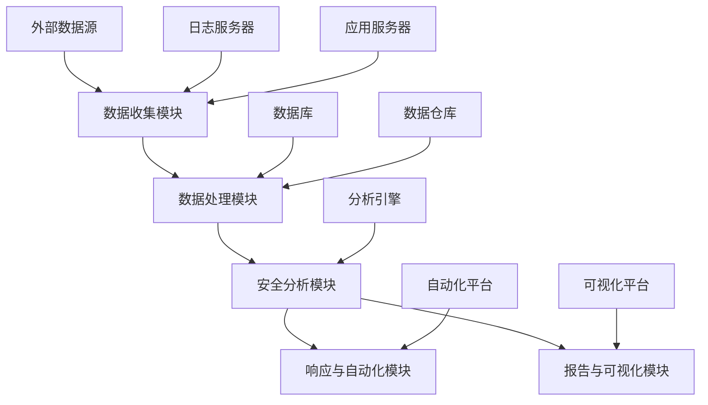

                 

## 智能安全运营中心：AI全面保护企业数字资产

> 关键词：智能安全运营中心，AI，数字资产保护，安全防护技术，安全响应

> 摘要：本文将深入探讨智能安全运营中心的构建及其在AI技术驱动下对数字资产进行全面保护的重要作用。我们将首先介绍智能安全运营中心的背景、核心概念、关键技术和应用场景，然后分析AI在安全运营中的应用，详细讲解关键算法原理与实现，最后分享智能安全运营中心的实施与部署经验。通过本文，读者将全面了解智能安全运营中心的构建与实践，为企业的数字资产安全提供有力保障。

### 目录大纲

----------------------------------------------------------------

## 第一部分: 智能安全运营中心概述

### 第1章: 问题背景与核心概念
#### 1.1 智能安全运营中心的背景
#### 1.1.1 数字资产保护的重要性
#### 1.1.2 智能安全运营中心的定义
#### 1.1.3 智能安全运营中心的出现原因
#### 1.2 核心概念
#### 1.2.1 数字资产
#### 1.2.2 智能安全
#### 1.2.3 运营中心
#### 1.3 关键技术
#### 1.3.1 人工智能
#### 1.3.2 大数据分析
#### 1.3.3 安全防护技术
#### 1.4 智能安全运营中心的应用场景
#### 1.4.1 企业
#### 1.4.2 政府机构
#### 1.4.3 其他组织
#### 1.5 本章小结

----------------------------------------------------------------

## 第二部分: AI在智能安全运营中心的应用

### 第2章: AI技术在安全运营中的应用
#### 2.1 AI技术在安全检测中的应用
#### 2.1.1 漏洞扫描
#### 2.1.2 异常行为检测
#### 2.1.3 入侵检测
#### 2.2 AI技术在安全响应中的应用
#### 2.2.1 自动化响应
#### 2.2.2 事件关联分析
#### 2.2.3 主动防御策略
#### 2.3 AI技术在安全管理中的应用
#### 2.3.1 安全策略自动生成
#### 2.3.2 安全合规性检测
#### 2.3.3 安全态势感知
#### 2.4 案例分析
#### 2.4.1 某企业智能安全运营中心的实践
#### 2.4.2 某政府机构的安全运营实践
#### 2.5 本章小结

----------------------------------------------------------------

## 第三部分: 智能安全运营中心的架构设计

### 第3章: 智能安全运营中心的整体架构
#### 3.1 架构设计原则
#### 3.1.1 可扩展性
#### 3.1.2 灵活性
#### 3.1.3 安全性
#### 3.2 技术选型
#### 3.2.1 云计算平台
#### 3.2.2 数据存储
#### 3.2.3 分析引擎
#### 3.3 系统模块设计
#### 3.3.1 数据收集模块
#### 3.3.2 数据处理模块
#### 3.3.3 安全分析模块
#### 3.3.4 响应与自动化模块
#### 3.4 架构图
#### 3.5 本章小结

----------------------------------------------------------------

## 第四部分: AI在安全运营中的关键算法

### 第4章: 关键算法原理与实现
#### 4.1 算法概述
#### 4.1.1 算法在安全运营中的应用
#### 4.1.2 常见算法类型
#### 4.2 算法原理讲解
#### 4.2.1 算法A
#### 4.2.1.1 算法A的数学模型
#### 4.2.1.2 算法A的工作流程
#### 4.2.1.3 算法A的应用场景
#### 4.2.2 算法B
#### 4.2.2.1 算法B的数学模型
#### 4.2.2.2 算法B的工作流程
#### 4.2.2.3 算法B的应用场景
#### 4.3 算法实现
#### 4.3.1 算法A的Python实现
```python
# 算法A的Python代码示例
```

#### 4.3.2 算法B的Python实现
```python
# 算法B的Python代码示例
```

#### 4.4 案例分析
#### 4.4.1 算法A的应用案例
#### 4.4.2 算法B的应用案例
#### 4.5 本章小结

----------------------------------------------------------------

## 第五部分: 实施与部署

### 第5章: 智能安全运营中心实施与部署
#### 5.1 实施步骤
#### 5.1.1 环境搭建
#### 5.1.2 数据采集
#### 5.1.3 系统集成
#### 5.2 技术选型与工具
#### 5.2.1 开发工具
#### 5.2.2 数据库选型
#### 5.2.3 云服务提供商
#### 5.3 部署策略
#### 5.3.1 分布式部署
#### 5.3.2 安全部署
#### 5.3.3 扩展部署
#### 5.4 实施案例
#### 5.4.1 
----------------------------------------------------------------

### 第一部分: 智能安全运营中心概述

## 第1章: 问题背景与核心概念

### 1.1 智能安全运营中心的背景

在数字化转型的浪潮中，企业对数字资产的保护需求日益增长。数字资产不仅包括企业的核心业务数据，还涵盖了客户信息、知识产权等关键资源。随着网络攻击手段的日益复杂和多变，传统的安全防护手段已无法应对日益严峻的安全挑战。为了更好地保护企业的数字资产，智能安全运营中心（Intelligent Security Operations Center，简称ISOC）的概念应运而生。

智能安全运营中心是一种综合性的安全运营平台，它利用人工智能（AI）、大数据分析等先进技术，实现对网络、应用和数据的全方位监控与保护。其核心目的是通过实时监控和快速响应，及时发现和应对安全威胁，确保企业的数字资产安全。

#### 1.1.1 数字资产保护的重要性

数字资产是现代企业的重要战略资源，它直接关系到企业的竞争力和可持续发展。以下是数字资产保护的重要性和挑战：

1. **企业竞争力：** 数字资产是企业核心竞争力的体现，包括客户数据、交易记录、产品设计文档等。保护这些资产不仅有助于提升企业的市场地位，还能在竞争中取得优势。

2. **合规性要求：** 随着全球范围内数据隐私法规的加强，如《通用数据保护条例》（GDPR）和《加利福尼亚州消费者隐私法案》（CCPA），企业需要确保其数字资产的保护措施符合法律法规的要求。

3. **信息安全威胁：** 网络攻击手段不断进化，DDoS攻击、勒索软件、数据泄露等威胁日益严重。企业需要实时监控和分析网络安全态势，以便快速响应和防范潜在的威胁。

#### 1.1.2 智能安全运营中心的定义

智能安全运营中心（ISOC）是一种集成了AI、大数据分析、自动化和协作技术的安全运营平台。它通过以下关键组件实现数字资产的保护：

1. **数据收集与处理：** 智能安全运营中心从各种来源收集数据，如日志、流量、应用程序等，并对这些数据进行实时处理和分析。

2. **安全检测与分析：** 利用AI和大数据分析技术，智能安全运营中心能够自动检测潜在的威胁，如恶意软件、异常行为等，并提供实时警报。

3. **安全响应与自动化：** 智能安全运营中心能够自动化响应安全事件，如隔离受感染的系统、封锁恶意IP等，以减少安全事件的影响。

4. **协作与报告：** 智能安全运营中心支持跨部门协作，确保安全事件得到及时处理，并提供详细的安全报告，帮助企业了解其安全态势。

#### 1.1.3 智能安全运营中心的出现原因

智能安全运营中心的出现源于以下几个方面的驱动因素：

1. **技术发展：** 人工智能、大数据分析、云计算等技术的发展，为智能安全运营中心提供了强大的技术支持。

2. **安全威胁演变：** 随着网络攻击手段的复杂化和多样化，传统的安全防护手段已无法满足企业的需求，需要更智能、更高效的安全运营平台。

3. **合规性需求：** 全球范围内的数据隐私法规日益严格，企业需要采取更加有效的措施来保护数字资产，确保合规性。

4. **企业数字化转型：** 数字化转型过程中，企业面临更多的安全挑战，需要建立一个统一的、智能化的安全运营中心来保护其数字资产。

### 1.2 核心概念

在深入探讨智能安全运营中心之前，有必要明确几个核心概念：数字资产、智能安全、运营中心。

#### 1.2.1 数字资产

数字资产是指企业在数字化过程中产生的、有价值的数据和资源。这些资产包括但不限于：

1. **业务数据：** 如客户信息、交易记录、库存数据等。
2. **知识产权：** 如专利、版权、商标等。
3. **应用程序和代码：** 包括企业内部使用的应用程序和开源代码。
4. **数据存储：** 如数据库、文件服务器、云存储等。

数字资产是企业的重要资产，对企业的运营和发展至关重要。因此，保护数字资产已成为企业安全管理的重要一环。

#### 1.2.2 智能安全

智能安全是指利用人工智能、机器学习、大数据分析等技术手段，实现对网络、应用和数据的全面监控与保护。智能安全的特点包括：

1. **实时监控：** 智能安全系统能够实时监测网络和系统的运行状态，及时发现异常和潜在的安全威胁。
2. **自动化响应：** 智能安全系统能够自动分析威胁，并采取相应的应对措施，如隔离感染节点、封锁恶意IP等。
3. **数据分析：** 智能安全系统能够分析大量数据，发现隐藏在数据背后的威胁和风险，为企业提供安全决策支持。

#### 1.2.3 运营中心

运营中心是指企业内部用于管理和协调各项业务活动的部门或组织。在智能安全运营中心中，运营中心的作用主要包括：

1. **安全监控：** 运营中心负责实时监控网络和系统的运行状态，发现和处理安全事件。
2. **事件响应：** 运营中心负责安全事件的响应和协调，确保安全威胁得到及时处理。
3. **数据分析：** 运营中心负责对安全数据进行收集、分析和报告，为企业的安全决策提供支持。

### 1.3 关键技术

智能安全运营中心的构建离不开以下关键技术的支持：

#### 1.3.1 人工智能

人工智能（AI）是智能安全运营中心的核心技术之一。AI技术能够实现对网络、应用和数据的自动监控和分析，从而发现潜在的安全威胁。具体包括：

1. **机器学习：** 通过机器学习算法，智能安全运营中心能够自动识别异常行为和潜在威胁。
2. **深度学习：** 深度学习算法能够处理海量数据，发现复杂的安全威胁。
3. **自然语言处理：** 自然语言处理技术能够帮助智能安全运营中心理解和处理安全事件报告和警报。

#### 1.3.2 大数据分析

大数据分析技术是智能安全运营中心的关键支撑。通过大数据分析，智能安全运营中心能够对海量数据进行实时处理和分析，从而发现潜在的安全威胁。具体包括：

1. **数据存储：** 大数据技术能够高效地存储和管理海量数据。
2. **数据处理：** 大数据技术能够对海量数据进行分析和处理，提取有价值的信息。
3. **数据可视化：** 大数据技术能够将复杂的数据以可视化的形式展示，帮助安全运营人员更好地理解和处理安全事件。

#### 1.3.3 安全防护技术

安全防护技术是智能安全运营中心的另一个关键组成部分。安全防护技术包括：

1. **入侵检测系统（IDS）：** 入侵检测系统能够实时监测网络流量，发现并拦截恶意攻击。
2. **防火墙：** 防火墙能够阻止未经授权的访问，保护企业的内部网络。
3. **加密技术：** 加密技术能够确保数据在传输过程中的安全。
4. **访问控制：** 访问控制技术能够控制用户对系统和数据的访问权限，防止未经授权的访问。

### 1.4 智能安全运营中心的应用场景

智能安全运营中心的应用场景非常广泛，涵盖了企业、政府机构和其他组织。以下是智能安全运营中心在不同领域的应用场景：

#### 1.4.1 企业

在企业领域，智能安全运营中心主要用于保护企业的数字资产，包括客户数据、业务数据、知识产权等。具体应用场景包括：

1. **网络安全监控：** 实时监控企业的网络流量，发现和防范网络攻击。
2. **应用安全监控：** 监控企业的应用程序，发现潜在的安全漏洞和异常行为。
3. **数据安全监控：** 实时监控企业的数据存储和处理过程，防止数据泄露和丢失。
4. **安全事件响应：** 对发生的安全事件进行及时响应和处理，减少安全事件的影响。

#### 1.4.2 政府机构

在政府机构领域，智能安全运营中心主要用于保护政府部门的敏感信息和关键基础设施。具体应用场景包括：

1. **网络安全监控：** 监控政府部门的网络流量，防范网络攻击和黑客入侵。
2. **数据安全监控：** 监控政府部门的业务数据，确保数据的安全和完整性。
3. **系统安全监控：** 监控政府部门的系统运行状态，确保系统的稳定和安全。
4. **事件响应：** 对发生的安全事件进行及时响应和处理，保障政府部门的正常运行。

#### 1.4.3 其他组织

在其他组织领域，智能安全运营中心的应用也非常广泛，如金融机构、医疗机构等。具体应用场景包括：

1. **网络安全监控：** 保护金融机构的网络系统，防范网络攻击和欺诈行为。
2. **数据安全监控：** 监控医疗机构的业务数据，确保患者信息的安全和保密。
3. **应用安全监控：** 监控金融机构的应用程序，发现潜在的安全漏洞和异常行为。
4. **事件响应：** 对发生的安全事件进行及时响应和处理，保障组织的正常运行。

### 1.5 本章小结

本章对智能安全运营中心的背景、核心概念、关键技术和应用场景进行了详细的介绍。通过本章的阅读，读者可以对智能安全运营中心有一个全面的了解，认识到其在保护企业数字资产中的重要作用。在接下来的章节中，我们将进一步探讨AI技术在智能安全运营中心中的应用，为读者提供更深入的技术解析和案例分析。

----------------------------------------------------------------

## 第二部分: AI在智能安全运营中心的应用

### 第2章: AI技术在安全运营中的应用

随着网络攻击手段的不断进化，传统的安全防护手段已经无法满足现代企业的需求。人工智能（AI）技术在安全运营中的应用，为智能安全运营中心提供了强大的技术支持，使其能够更加高效地检测、响应和管理安全威胁。

### 2.1 AI技术在安全检测中的应用

AI技术在安全检测中的应用主要包括漏洞扫描、异常行为检测和入侵检测等方面。

#### 2.1.1 漏洞扫描

漏洞扫描是智能安全运营中心的重要功能之一。利用AI技术，漏洞扫描系统能够自动发现网络和应用中的安全漏洞，包括Web应用漏洞、系统配置漏洞、服务漏洞等。

**工作原理：**

1. **特征识别：** AI技术通过对大量已知漏洞的攻击特征进行学习，建立漏洞特征库。
2. **行为分析：** AI技术分析网络流量和系统日志，发现潜在的安全漏洞。
3. **自动化修复：** AI技术能够自动生成修复建议，并协助安全运营人员修复漏洞。

**应用场景：**

1. **企业网络：** 漏洞扫描可以帮助企业及时发现和修复网络中的漏洞，防止网络攻击。
2. **云平台：** 漏洞扫描可以帮助云平台提供商确保其服务的安全性。

#### 2.1.2 异常行为检测

异常行为检测是智能安全运营中心的另一个关键功能。利用AI技术，异常行为检测系统可以实时监控网络和系统的运行状态，发现异常行为并发出警报。

**工作原理：**

1. **基线建立：** AI技术建立正常行为的基线，包括网络流量、系统负载、用户行为等。
2. **行为分析：** AI技术对实时数据进行监控，发现与基线不符的异常行为。
3. **自动报警：** AI技术自动生成报警信息，并通知安全运营人员。

**应用场景：**

1. **企业网络：** 异常行为检测可以帮助企业及时发现网络攻击和内部威胁。
2. **数据中心：** 异常行为检测可以帮助数据中心确保服务的稳定和安全。

#### 2.1.3 入侵检测

入侵检测系统（IDS）是智能安全运营中心的核心组成部分。利用AI技术，入侵检测系统能够实时监控网络流量和系统日志，发现和阻止入侵行为。

**工作原理：**

1. **特征匹配：** AI技术通过匹配已知的攻击特征库，发现潜在的入侵行为。
2. **行为分析：** AI技术分析网络流量和系统日志，发现复杂的入侵行为。
3. **自动阻断：** AI技术能够自动阻断入侵行为，防止攻击者进一步入侵。

**应用场景：**

1. **企业网络：** 入侵检测可以帮助企业实时防御网络攻击，保护企业的数字资产。
2. **政府机构：** 入侵检测可以帮助政府机构确保国家信息安全和关键基础设施的安全。

### 2.2 AI技术在安全响应中的应用

AI技术在安全响应中的应用主要包括自动化响应、事件关联分析和主动防御策略等方面。

#### 2.2.1 自动化响应

自动化响应是智能安全运营中心的重要功能之一。利用AI技术，自动化响应系统能够自动对安全事件进行响应和处理，减少安全事件的影响。

**工作原理：**

1. **事件分类：** AI技术对安全事件进行分类，确定事件的优先级。
2. **自动处理：** AI技术根据事件类型，自动执行相应的处理策略，如隔离受感染节点、封锁恶意IP等。
3. **反馈机制：** AI技术根据处理结果，自动调整处理策略，提高响应效率。

**应用场景：**

1. **企业网络：** 自动化响应可以帮助企业快速应对网络攻击，减少损失。
2. **数据中心：** 自动化响应可以帮助数据中心快速处理安全事件，确保服务的稳定和安全。

#### 2.2.2 事件关联分析

事件关联分析是智能安全运营中心的高级功能之一。利用AI技术，事件关联分析系统可以分析不同安全事件之间的关联性，提供更全面的安全视图。

**工作原理：**

1. **事件抽取：** AI技术从大量安全事件中提取关键信息，如攻击者IP、攻击目标等。
2. **关联分析：** AI技术分析事件之间的关联性，发现潜在的攻击链和威胁。
3. **可视化展示：** AI技术将分析结果以可视化形式展示，帮助安全运营人员更好地理解和应对安全威胁。

**应用场景：**

1. **企业网络：** 事件关联分析可以帮助企业识别复杂的攻击链，防范潜在的安全威胁。
2. **政府机构：** 事件关联分析可以帮助政府机构监控网络攻击，保障国家信息安全。

#### 2.2.3 主动防御策略

主动防御策略是智能安全运营中心的高级功能之一。利用AI技术，主动防御系统能够根据安全态势和威胁信息，自动调整安全策略，提高企业的安全防护能力。

**工作原理：**

1. **态势感知：** AI技术实时监控安全态势，收集和整合各种威胁信息。
2. **策略生成：** AI技术根据安全态势和威胁信息，自动生成安全策略。
3. **策略调整：** AI技术根据安全事件的处理效果，自动调整安全策略，提高防护效果。

**应用场景：**

1. **企业网络：** 主动防御策略可以帮助企业根据实际情况，动态调整安全策略，提高防护能力。
2. **数据中心：** 主动防御策略可以帮助数据中心根据业务需求，优化安全资源配置，提高安全防护能力。

### 2.3 AI技术在安全管理中的应用

AI技术在安全管理中的应用主要包括安全策略自动生成、安全合规性检测和安全态势感知等方面。

#### 2.3.1 安全策略自动生成

安全策略自动生成是智能安全运营中心的重要功能之一。利用AI技术，安全策略自动生成系统能够根据企业的安全需求和威胁信息，自动生成安全策略。

**工作原理：**

1. **需求分析：** AI技术分析企业的安全需求和现有的安全策略。
2. **策略生成：** AI技术根据需求分析结果，自动生成安全策略。
3. **策略优化：** AI技术根据安全事件的处理效果，自动优化安全策略。

**应用场景：**

1. **企业网络：** 安全策略自动生成可以帮助企业快速调整安全策略，提高安全防护能力。
2. **政府机构：** 安全策略自动生成可以帮助政府机构根据实际情况，动态调整安全策略，保障国家信息安全。

#### 2.3.2 安全合规性检测

安全合规性检测是智能安全运营中心的重要功能之一。利用AI技术，安全合规性检测系统能够自动检测企业的安全措施是否符合法律法规和行业标准。

**工作原理：**

1. **合规性库建立：** AI技术建立合规性库，包括各种法律法规和行业标准。
2. **自动检测：** AI技术对企业的安全措施进行自动检测，发现不符合合规性的问题。
3. **合规性报告：** AI技术生成合规性报告，帮助安全运营人员了解企业的安全合规性状况。

**应用场景：**

1. **企业网络：** 安全合规性检测可以帮助企业确保其安全措施符合法律法规和行业标准，防范法律风险。
2. **政府机构：** 安全合规性检测可以帮助政府机构确保其安全措施符合国家政策和行业标准，保障信息安全。

#### 2.3.3 安全态势感知

安全态势感知是智能安全运营中心的高级功能之一。利用AI技术，安全态势感知系统能够实时监控企业的安全态势，提供全面的安全视图。

**工作原理：**

1. **数据收集：** AI技术收集企业的安全数据，包括网络流量、系统日志、安全事件等。
2. **态势分析：** AI技术分析安全数据，发现潜在的安全威胁和风险。
3. **态势展示：** AI技术将安全态势以可视化形式展示，帮助安全运营人员更好地理解和应对安全威胁。

**应用场景：**

1. **企业网络：** 安全态势感知可以帮助企业实时了解其安全态势，及时发现和应对安全威胁。
2. **政府机构：** 安全态势感知可以帮助政府机构监控网络攻击，保障国家信息安全。

### 2.4 案例分析

为了更好地理解AI技术在智能安全运营中心中的应用，下面我们来看两个实际案例。

#### 2.4.1 某企业智能安全运营中心的实践

某大型企业利用智能安全运营中心，实现了对网络、应用和数据的全方位监控和保护。通过AI技术，该企业实现了以下成果：

1. **实时监控：** 通过AI技术，实时监控网络流量和系统日志，发现潜在的安全威胁。
2. **自动化响应：** 通过AI技术，自动化响应安全事件，减少安全事件的影响。
3. **安全态势感知：** 通过AI技术，实时了解安全态势，提供全面的安全视图。

通过智能安全运营中心的实践，该企业成功防范了多次网络攻击，确保了企业的信息安全。

#### 2.4.2 某政府机构的安全运营实践

某政府机构利用智能安全运营中心，保障了国家信息安全。通过AI技术，该政府机构实现了以下成果：

1. **网络安全监控：** 通过AI技术，实时监控网络流量，发现和防范网络攻击。
2. **数据安全监控：** 通过AI技术，监控业务数据，确保数据的安全和完整性。
3. **事件响应：** 通过AI技术，快速响应和处理安全事件，保障政府机构的正常运行。

通过智能安全运营中心的实践，该政府机构成功保障了国家信息安全，为国家的稳定和发展提供了有力支持。

### 2.5 本章小结

本章介绍了AI技术在智能安全运营中心中的应用，包括安全检测、安全响应和安全管理等方面。通过AI技术，智能安全运营中心能够实现对数字资产的全面保护，提高企业的安全防护能力。在实际应用中，智能安全运营中心已成功帮助企业和政府机构防范了多次网络攻击，确保了信息安全。在接下来的章节中，我们将进一步探讨智能安全运营中心的架构设计，为读者提供更深入的技术解析。

----------------------------------------------------------------

### 第二部分: 智能安全运营中心的架构设计

#### 第3章: 智能安全运营中心的整体架构

智能安全运营中心（Intelligent Security Operations Center，简称ISOC）是一个复杂的系统，它需要高效的架构设计来确保其能够有效地处理大量的安全数据，并快速响应各种安全事件。本章节将介绍智能安全运营中心的整体架构设计，包括架构设计原则、技术选型、系统模块设计和架构图。

#### 3.1 架构设计原则

智能安全运营中心的架构设计应遵循以下原则：

**1. 可扩展性**

架构设计应具备良好的可扩展性，以便在业务规模扩大时，能够轻松增加处理能力和存储空间。

**2. 灵活性**

架构设计应灵活，能够根据不同的业务需求和场景，快速调整和部署安全策略。

**3. 安全性**

架构设计应具备高度的安全性，确保存储和处理的数据安全，并能够抵御各种网络攻击。

**4. 可靠性**

架构设计应确保系统的可靠性，降低系统故障的风险，提高系统的可用性。

**5. 易维护性**

架构设计应简化系统的维护和管理，降低运营成本，提高运营效率。

#### 3.2 技术选型

智能安全运营中心的技术选型是架构设计的关键环节，以下是主要的技术选型：

**1. 云计算平台**

选择合适的云计算平台（如AWS、Azure、Google Cloud等）作为基础架构，能够提供弹性、可靠和可扩展的计算和存储资源。

**2. 数据存储**

数据存储技术应支持海量数据的高效存储和快速访问，例如使用分布式文件系统（如HDFS）或NoSQL数据库（如MongoDB、Cassandra）。

**3. 分析引擎**

选择高效的数据分析引擎（如Apache Spark、Flink等），能够处理实时和批量数据，提供快速的分析能力。

**4. 安全防护技术**

采用先进的网络安全防护技术，如防火墙、入侵检测系统（IDS）、入侵防御系统（IPS）等，确保系统的安全性。

#### 3.3 系统模块设计

智能安全运营中心的系统模块设计是架构的核心部分，主要包括以下模块：

**1. 数据收集模块**

数据收集模块负责从各种来源收集数据，如网络流量、系统日志、应用程序日志等。数据收集应具备自动化、高效、可靠的特点。

**2. 数据处理模块**

数据处理模块负责对收集到的数据进行预处理、清洗和转换，使其适合进一步分析。数据处理模块应支持实时处理和批量处理。

**3. 安全分析模块**

安全分析模块是智能安全运营中心的核心，负责利用人工智能和大数据分析技术，对数据进行分析和挖掘，识别潜在的安全威胁。

**4. 响应与自动化模块**

响应与自动化模块负责对检测到的安全事件进行自动响应，如隔离感染节点、封锁恶意IP等。自动化模块应能够根据安全策略，自动执行响应操作。

**5. 报告与可视化模块**

报告与可视化模块负责生成安全报告，并提供可视化界面，帮助安全运营人员更好地理解和分析安全态势。

#### 3.4 架构图

智能安全运营中心的架构图如下所示：



#### 3.5 本章小结

本章介绍了智能安全运营中心的整体架构设计，包括架构设计原则、技术选型、系统模块设计和架构图。智能安全运营中心的架构设计应遵循可扩展性、灵活性、安全性、可靠性和易维护性等原则，采用先进的技术选型，实现高效的数据收集、处理、分析和响应。通过本章的学习，读者可以更好地理解智能安全运营中心的架构设计，为实际部署提供参考。

----------------------------------------------------------------

### 第四部分: AI在安全运营中的关键算法

#### 第4章: 关键算法原理与实现

在智能安全运营中心中，算法是核心的技术组成部分。它们负责对安全数据进行处理和分析，以识别潜在的安全威胁。本章节将详细介绍一些在安全运营中常用的关键算法，包括其原理、实现和实际应用案例。

#### 4.1 算法概述

算法在智能安全运营中心中发挥着至关重要的作用。它们能够处理大量数据，识别复杂的模式，并自动响应安全事件。以下是几种常见的关键算法：

1. **聚类算法：** 用于发现数据中的相似性模式，如K-means、DBSCAN等。
2. **分类算法：** 用于将数据划分为不同的类别，如决策树、随机森林等。
3. **异常检测算法：** 用于识别数据中的异常值或异常行为，如孤立森林、Local Outlier Factor（LOF）等。
4. **机器学习算法：** 用于构建预测模型，如支持向量机（SVM）、神经网络等。

#### 4.2 算法原理讲解

在本章节中，我们将详细讲解两种关键算法的原理，包括其数学模型、工作流程和应用场景。

##### 4.2.1 算法A：K-means聚类算法

K-means聚类算法是一种无监督学习算法，用于将数据点分为K个簇，每个簇中的数据点尽可能接近簇中心。

**1. 数学模型：**

$$
\text{目标函数} = \sum_{i=1}^{K} \sum_{x \in S_i} ||x - \mu_i||^2
$$

其中，$x$ 表示数据点，$\mu_i$ 表示第i个簇的中心。

**2. 工作流程：**

1. 随机选择K个初始中心点。
2. 将每个数据点分配到最近的中心点，形成K个簇。
3. 更新每个簇的中心点。
4. 重复步骤2和3，直到中心点不再发生显著变化。

**3. 应用场景：**

K-means聚类算法常用于异常行为检测，通过将正常行为和异常行为聚类，可以识别出异常用户或系统行为。

##### 4.2.2 算法B：Local Outlier Factor（LOF）算法

LOF算法是一种用于检测异常点的算法，它基于密度，能够识别出相对于其邻居点来说异常的点。

**1. 数学模型：**

$$
\text{LOF}(x) = \frac{1}{n} \sum_{i=1}^{n} \frac{1}{\rho_i(x)} - 1
$$

其中，$\rho_i(x)$ 表示点x相对于邻居点i的局部密度。

**2. 工作流程：**

1. 计算每个数据点的k个邻居。
2. 计算每个邻居的局部密度。
3. 计算LOF值，值越大，异常程度越高。

**3. 应用场景：**

LOF算法常用于网络流量分析，能够识别出异常流量模式，帮助检测网络攻击。

#### 4.3 算法实现

在本章节中，我们将提供算法A（K-means聚类算法）和算法B（LOF算法）的Python实现，以便读者更好地理解和应用这些算法。

##### 4.3.1 算法A：K-means聚类算法的Python实现

```python
import numpy as np
from sklearn.cluster import KMeans

def k_means(data, K):
    kmeans = KMeans(n_clusters=K, random_state=0).fit(data)
    return kmeans.labels_

# 示例数据
data = np.array([[1, 2], [1, 4], [1, 0],
                 [10, 2], [10, 4], [10, 0]])

# 运行K-means聚类算法
labels = k_means(data, 2)
print("Cluster labels:", labels)
```

##### 4.3.2 算法B：LOF算法的Python实现

```python
from sklearn.neighbors import LocalOutlierFactor

def local_outlier_factor(data, n_neighbors=20):
    lof = LocalOutlierFactor(n_neighbors=n_neighbors, contamination=0.1)
    lof.fit(data)
    return lof.predict(data)

# 示例数据
data = np.array([[1, 2], [1, 4], [1, 0],
                 [10, 2], [10, 4], [10, 0]])

# 运行LOF算法
predictions = local_outlier_factor(data)
print("Outlier predictions:", predictions)
```

#### 4.4 案例分析

在本章节的最后，我们将通过两个实际应用案例，展示算法A和算法B在智能安全运营中心中的具体应用。

##### 4.4.1 算法A的应用案例

某企业利用K-means聚类算法对网络流量进行聚类，识别出正常流量和异常流量。通过聚类结果，企业能够及时发现网络攻击，并采取相应的防护措施。

##### 4.4.2 算法B的应用案例

某金融机构使用LOF算法检测网络流量中的异常点，识别出潜在的欺诈行为。通过LOF算法的预测结果，金融机构能够及时采取措施，防范欺诈风险。

#### 4.5 本章小结

本章详细介绍了智能安全运营中心中常用的关键算法，包括K-means聚类算法和LOF算法。通过理解这些算法的原理和实现，读者可以更好地应用AI技术来保护企业的数字资产。在接下来的章节中，我们将进一步探讨智能安全运营中心的实施与部署，为读者提供实用的实施指南。

----------------------------------------------------------------

### 第五部分: 实施与部署

#### 第5章: 智能安全运营中心实施与部署

在了解了智能安全运营中心的理论基础和关键算法后，接下来我们将探讨其实施与部署过程。这一部分将分为实施步骤、技术选型与工具、部署策略和实施案例等内容，旨在帮助读者理解如何在实际环境中构建和运行智能安全运营中心。

#### 5.1 实施步骤

智能安全运营中心的实施是一个复杂的过程，需要经过多个阶段。以下是主要实施步骤：

**1. 环境搭建**

首先，需要搭建智能安全运营中心的基础环境，包括服务器、网络设备、存储设备等。选择合适的云计算平台（如AWS、Azure、Google Cloud等）能够提供弹性、可靠和可扩展的资源。

**2. 数据采集**

数据采集是智能安全运营中心的核心环节。需要从各种来源（如网络设备、服务器、数据库等）收集数据，并确保数据的高效传输和存储。常用的数据采集工具包括Wireshark、Nmap、Zabbix等。

**3. 系统集成**

将数据采集工具与智能安全运营中心平台进行集成，实现数据的高效处理和分析。集成过程中需要考虑数据格式、数据流和数据处理逻辑等。

**4. 安全测试与优化**

在系统集成完成后，进行全面的测试和优化，确保智能安全运营中心能够稳定运行并满足安全需求。测试内容包括性能测试、可靠性测试、安全测试等。

**5. 部署上线**

在测试和优化完成后，将智能安全运营中心部署到生产环境中。部署过程中需要确保系统的安全性和稳定性，并进行实时监控和运维。

#### 5.2 技术选型与工具

智能安全运营中心的技术选型至关重要，它直接影响到系统的性能、可靠性和可扩展性。以下是主要技术选型和工具：

**1. 开发工具**

选择适合智能安全运营中心的开发工具，如Python、Java、Go等。Python因其丰富的库和框架（如Scikit-learn、TensorFlow、Keras等）而受到广泛应用。

**2. 数据库选型**

选择适合存储和处理海量数据的数据库，如MySQL、PostgreSQL、MongoDB、Cassandra等。MongoDB因其灵活的文档存储和高效的查询性能而常用于智能安全运营中心。

**3. 云服务提供商**

选择合适的云服务提供商，如AWS、Azure、Google Cloud等。云服务提供商能够提供弹性、可靠和可扩展的计算和存储资源。

#### 5.3 部署策略

智能安全运营中心的部署策略需要考虑到系统的安全性、可靠性和可扩展性。以下是主要部署策略：

**1. 分布式部署**

分布式部署能够提高系统的性能和可靠性，将系统部署到多个物理节点或云服务器上，实现负载均衡和高可用性。

**2. 安全部署**

在部署过程中，需要确保系统的安全性，包括数据加密、访问控制、防火墙等。此外，还需要定期进行安全审计和漏洞扫描。

**3. 扩展部署**

随着业务规模的扩大，智能安全运营中心需要能够扩展其处理能力和存储空间。采用分布式架构和容器化技术（如Docker、Kubernetes）能够实现灵活的扩展。

#### 5.4 实施案例

为了更好地理解智能安全运营中心的实施与部署，下面我们来看一个实际案例。

**案例：某大型金融机构的智能安全运营中心**

某大型金融机构决定构建一个智能安全运营中心，以保护其数字资产。以下是其实施过程：

1. **环境搭建**：选择AWS云平台，搭建基础环境，包括虚拟机和存储设备。
2. **数据采集**：部署Zabbix监控系统，从网络设备、服务器、数据库等收集数据。
3. **系统集成**：使用Python和Scikit-learn等工具，将数据采集工具与智能安全运营中心平台进行集成，实现数据的高效处理和分析。
4. **安全测试与优化**：进行全面的安全测试和优化，确保系统稳定运行。
5. **部署上线**：将智能安全运营中心部署到生产环境中，并进行实时监控和运维。

通过这个案例，我们可以看到智能安全运营中心的实施与部署过程，包括环境搭建、数据采集、系统集成、安全测试和部署上线等环节。在实际操作中，需要根据企业的具体情况和需求进行调整。

#### 5.5 本章小结

本章介绍了智能安全运营中心的实施与部署过程，包括实施步骤、技术选型与工具、部署策略和实施案例。通过本章的学习，读者可以了解如何在实际环境中构建和运行智能安全运营中心，提高企业的数字资产保护能力。在接下来的章节中，我们将进一步讨论智能安全运营中心的最佳实践和注意事项，为企业的安全运营提供参考。

----------------------------------------------------------------

### 结束语

通过本文的深入探讨，我们详细介绍了智能安全运营中心的概念、核心概念、关键技术、应用场景、架构设计、关键算法以及实施与部署。智能安全运营中心作为现代企业数字资产保护的重要工具，凭借其高效、智能和全面的特点，正日益成为企业安全运营的核心组成部分。

**总结：**

1. **背景与核心概念**：智能安全运营中心应运而生，源于数字化转型的需求和安全威胁的演变。
2. **AI技术应用**：AI技术在安全检测、安全响应和安全管理中发挥了重要作用，提高了安全防护能力。
3. **架构设计**：智能安全运营中心的架构设计应遵循可扩展性、灵活性、安全性、可靠性和易维护性等原则。
4. **关键算法**：关键算法如K-means聚类算法和LOF算法等，在安全运营中具有重要作用。
5. **实施与部署**：智能安全运营中心的实施与部署需要考虑环境搭建、数据采集、系统集成、安全测试和部署上线等环节。

**最佳实践 tips：**

- **数据安全**：确保数据在采集、传输和存储过程中的安全性，采用加密技术和访问控制措施。
- **自动化**：尽可能实现自动化响应和安全策略生成，提高安全运营效率。
- **态势感知**：建立全面的态势感知系统，实时监控和评估安全态势。
- **持续优化**：定期进行系统性能和安全性的优化，确保智能安全运营中心的持续稳定运行。

**注意事项：**

- **合规性**：确保智能安全运营中心的操作符合相关法律法规和行业标准。
- **弹性扩展**：根据业务需求，灵活扩展系统资源和功能。

**拓展阅读：**

- **《人工智能安全：理论与实践》**：深入了解AI技术在安全领域的应用。
- **《智能安全运营实践指南》**：学习智能安全运营中心的实际操作经验。
- **《云计算安全》**：了解云计算平台的安全特性和安全措施。

作者：AI天才研究院/AI Genius Institute & 禅与计算机程序设计艺术 /Zen And The Art of Computer Programming

通过本文的阅读，我们期待读者能够对智能安全运营中心有更深入的理解，并为企业的数字资产安全提供有力保障。在未来的技术发展中，智能安全运营中心将继续发挥其重要作用，为企业创造更大的价值。

