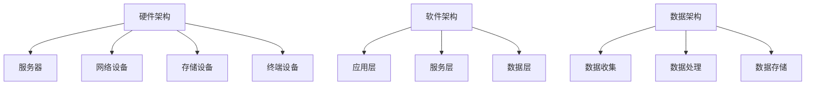
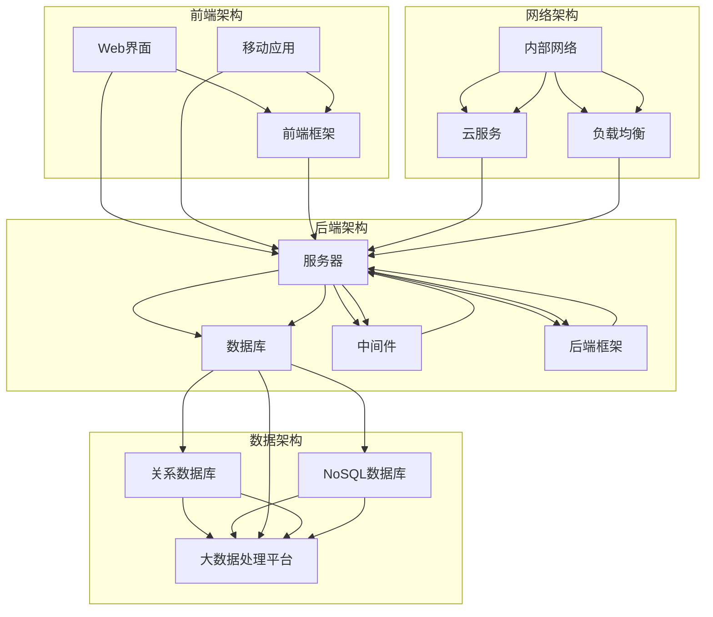
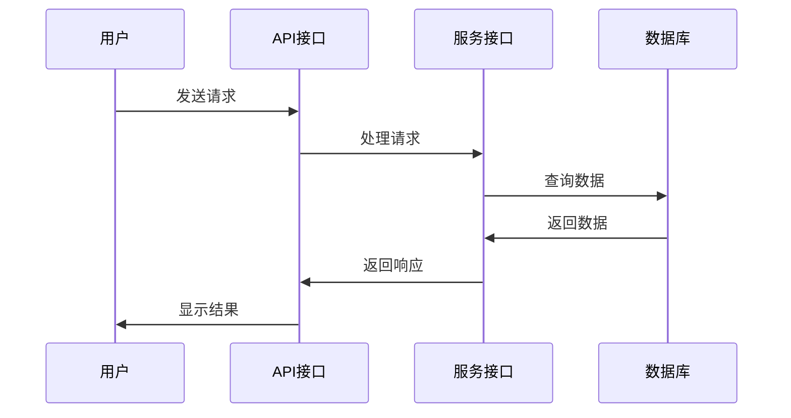

                 


### 第1章：智能工作空间概述

智能工作空间是当今数字化时代的关键概念，它代表了办公环境从传统模式向智能化、自动化和高效化转变的趋势。在这一章中，我们将深入探讨智能工作空间的概念、发展历程以及其核心特征，从而为后续章节的深入讨论打下基础。

#### 1.1 智能工作空间的概念

智能工作空间（Smart Work Space）是一种利用先进的信息技术和人工智能（AI）技术，为用户提供高效、便捷、个性化的工作环境。它不仅包含了物理空间的设计，还包括虚拟空间的集成，使得员工可以在任何地点、任何时间通过多种设备访问资源和信息。

- **定义**：智能工作空间是指利用信息技术、人工智能和物联网（IoT）技术，将工作环境中的各种设备、系统和资源进行智能整合，从而实现高效、便捷、个性化的工作体验。
- **核心特征**：智能化、自动化、个性化、高效性、安全性。

#### 1.2 智能工作空间的发展历程

智能工作空间的发展经历了几个关键阶段：

- **初期阶段**：20世纪90年代，计算机和互联网的普及为智能工作空间的发展奠定了基础。这一阶段的重点是电子文档的处理和电子邮件的沟通。
- **发展阶段**：21世纪初，随着云计算和移动设备的兴起，智能工作空间开始从传统办公模式向数字化和移动化转变。远程办公和移动办公成为常态。
- **成熟阶段**：近年来，人工智能和物联网技术的快速发展使得智能工作空间进入了一个全新的阶段。智能会议系统、智能办公桌、智能办公应用等不断涌现。

#### 1.3 智能工作空间的核心特征

智能工作空间的核心特征体现在以下几个方面：

- **智能化**：通过人工智能技术，智能工作空间能够自动识别用户需求，提供个性化的服务和体验。
- **自动化**：智能工作空间通过自动化技术，减少了人工干预，提高了工作效率。
- **个性化**：根据用户的行为和偏好，智能工作空间能够为用户提供定制化的服务和内容。
- **高效性**：智能工作空间通过优化流程和资源利用，提高了工作效率和生产力。
- **安全性**：智能工作空间通过安全措施，保障了数据的隐私和安全。

通过上述分析，我们可以看出智能工作空间是一个综合了多种先进技术的复杂系统，它正在不断改变我们的工作方式和生活习惯。在接下来的章节中，我们将进一步探讨人工智能技术在智能工作空间中的应用，以及如何优化办公环境。

### 第2章：人工智能基础

人工智能（Artificial Intelligence，AI）作为智能工作空间的核心驱动力，其理论基础和关键技术对于我们理解智能工作空间的实现至关重要。在本章中，我们将深入探讨人工智能的基础概念、核心算法和其在办公环境中的应用，为后续章节的技术实现和案例分析提供理论支持。

#### 2.1 人工智能的概念

人工智能是指模拟、延伸和扩展人的智能的理论、方法、技术及应用。它涵盖了计算机科学、认知科学、神经科学、心理学等多个学科领域。

- **定义**：人工智能是指通过计算机程序来模拟、扩展和增强人的智能，使计算机具备理解、学习、推理和自我改进的能力。
- **核心目标**：实现机器的智能，使其能够执行复杂的任务，如自然语言处理、图像识别、决策制定等。

#### 2.2 人工智能的应用领域

人工智能在多个领域都有着广泛的应用，以下是几个重要的应用领域：

- **自然语言处理（NLP）**：包括文本分析、机器翻译、语音识别等，使得计算机能够理解和生成人类语言。
- **计算机视觉**：包括图像识别、目标检测、人脸识别等，使得计算机能够理解和解析视觉信息。
- **机器学习（ML）**：通过数据训练模型，使得计算机能够自动学习和改进。
- **深度学习（DL）**：一种特殊的机器学习方法，通过多层神经网络模拟人脑的学习过程。
- **机器人学**：包括工业机器人、服务机器人等，使得计算机能够执行物理任务。

#### 2.3 人工智能的发展趋势

人工智能正处在快速发展阶段，以下是一些主要的发展趋势：

- **算法创新**：不断有新的机器学习和深度学习算法出现，使得模型更加高效和准确。
- **硬件进步**：如GPU、TPU等专用硬件的普及，大大提高了计算能力。
- **大数据应用**：随着数据量的增加，人工智能在数据分析和决策制定中的作用越来越重要。
- **跨界融合**：人工智能与其他技术的融合，如物联网、云计算等，使得应用场景更加广泛。

#### 2.4 人工智能在办公环境中的应用

人工智能在办公环境中有着广泛的应用，以下是一些典型的应用场景：

- **智能助手**：如语音助手、聊天机器人等，提供日常工作的自动化支持。
- **数据分析**：通过机器学习算法，对大量数据进行分析，帮助企业做出更准确的决策。
- **安全防护**：利用人工智能技术，实时监测网络安全威胁，提高企业的安全防护能力。
- **智能会议系统**：通过语音识别、图像识别等技术，实现会议的自动化记录和智能总结。

通过本章的讨论，我们可以看到人工智能在智能工作空间中的应用潜力和价值。在接下来的章节中，我们将进一步探讨如何利用人工智能技术来优化办公环境，提高工作效率。

### 第3章：AI在办公环境中的应用

人工智能（AI）在办公环境中的应用已经逐渐成为现代办公的一个重要组成部分。通过智能化和自动化技术，AI不仅提升了办公效率，还改善了员工的工作体验。在本章中，我们将深入探讨AI在办公环境中的具体应用，包括智能助手、数据分析、安全防护和智能会议系统等，并分析其原理、优点以及面临的挑战。

#### 3.1 智能助手

智能助手是AI在办公环境中最为普及的应用之一。它们通常通过自然语言处理（NLP）和语音识别技术，能够理解和执行用户的语音指令，从而实现日常办公任务的自动化。

- **原理**：智能助手的核心在于语音识别和自然语言理解。通过机器学习和深度学习算法，智能助手能够识别用户的语音指令，理解其含义，并执行相应的任务，如发送邮件、安排会议、查询日程等。
- **优点**：使用智能助手可以大大减少员工的重复性劳动，提高工作效率。此外，智能助手可以24小时在线，随时响应员工的需求，提升了工作的灵活性和便捷性。
- **挑战**：尽管智能助手在提高办公效率方面具有显著优势，但其准确性和理解能力仍有待提高。特别是在处理复杂指令或理解上下文时，智能助手可能会出现错误或误解用户意图。

#### 3.2 数据分析

数据分析是AI在办公环境中另一个重要的应用领域。通过机器学习算法，AI可以处理和分析大量数据，帮助企业做出更准确的决策。

- **原理**：数据分析通常涉及数据收集、数据清洗、数据建模和结果分析等步骤。AI通过机器学习算法，可以从大量数据中提取有价值的信息，如趋势、模式、关联等，帮助企业进行数据驱动的决策。
- **优点**：数据分析可以帮助企业更好地理解其业务，发现潜在的问题和机会。通过数据驱动的决策，企业可以减少风险，提高运营效率。
- **挑战**：数据质量是数据分析的关键。如果数据存在噪声、缺失或错误，可能会导致分析结果不准确。此外，数据分析也需要专业的知识和技能，对于非技术背景的员工来说，使用数据分析工具可能存在一定的难度。

#### 3.3 安全防护

AI在安全防护中的应用，如网络安全监控、异常行为检测等，已经成为企业保护其信息和资产的重要手段。

- **原理**：AI可以通过监控网络流量、系统日志等数据，识别异常行为和潜在的安全威胁。通过机器学习算法，AI可以自动学习和识别正常行为模式，并在检测到异常时发出警报。
- **优点**：AI可以实时监控和响应安全事件，大大提高了安全防护的效率和准确性。与传统的基于规则的安全防护系统相比，AI具有更强的自适应能力和更广泛的应用场景。
- **挑战**：AI在安全防护中的应用仍然面临一些挑战，如如何避免误报和漏报、如何处理大量的安全数据等。此外，AI系统的安全性也需要得到保障，以防止被恶意攻击。

#### 3.4 智能会议系统

智能会议系统通过语音识别、图像识别等技术，实现会议的自动化记录、总结和分享。

- **原理**：智能会议系统可以自动识别会议中的语音和图像，实时转录会议内容，并生成会议记录和总结。通过自然语言处理技术，智能会议系统还可以提取关键信息，如会议主题、决策结果等。
- **优点**：智能会议系统可以节省会议的时间和人力资源，提高会议的效率和效果。此外，会议记录和总结的自动生成，有助于员工回顾和参考。
- **挑战**：智能会议系统的准确性和理解能力仍有待提高。特别是在处理复杂会议内容或理解上下文时，智能会议系统可能会出现错误或误解。

通过本章的讨论，我们可以看到AI在办公环境中的应用不仅提升了工作效率，还改善了员工的工作体验。然而，这些应用也面临一些挑战，如准确性、数据质量和安全性等。在接下来的章节中，我们将进一步探讨如何设计和实现智能工作空间，以充分利用AI的优势。

### 第4章：智能工作空间的架构设计

智能工作空间是一个复杂而综合的系统，其架构设计直接决定了系统的性能、可扩展性和用户体验。本章将详细介绍智能工作空间的硬件架构、软件架构以及数据架构，并使用Mermaid流程图来可视化这些架构。

#### 4.1 硬件架构

智能工作空间的硬件架构包括服务器、网络设备、存储设备以及终端设备。硬件的选择和配置需要满足系统的性能需求、数据安全和可靠性。

- **服务器**：作为智能工作空间的核心，服务器负责处理数据和运行应用。选择服务器时，需要考虑CPU性能、内存容量、存储容量以及扩展性。
- **网络设备**：包括路由器、交换机和防火墙等，负责数据传输和网络安全。高速、稳定的网络是保证智能工作空间正常运行的基础。
- **存储设备**：包括硬盘、固态硬盘和分布式存储系统，用于存储数据和应用程序。数据存储的可靠性和性能直接影响到系统的性能和用户体验。
- **终端设备**：包括电脑、平板和智能手机等，员工通过这些设备访问智能工作空间中的资源和应用。

#### 4.2 软件架构

智能工作空间的软件架构通常采用分布式架构，以确保系统的可扩展性和高可用性。软件架构包括应用层、服务层和数据层。

- **应用层**：提供用户界面和业务逻辑。应用层包括桌面应用、Web应用和移动应用等，它们通过服务层获取数据和执行功能。
- **服务层**：提供核心业务逻辑和数据服务。服务层包括身份认证服务、数据处理服务、消息队列服务等，它们通过API与其他层进行通信。
- **数据层**：负责数据的存储和管理。数据层包括数据库、缓存系统和大数据处理平台等，用于存储用户数据、业务数据和日志数据。

#### 4.3 数据架构

智能工作空间的数据架构需要满足数据的完整性、一致性和可用性。数据架构包括数据收集、数据处理和数据存储。

- **数据收集**：通过传感器、日志文件和API等途径收集数据。数据收集需要保证数据的及时性和准确性。
- **数据处理**：包括数据清洗、数据转换和数据聚合等。数据处理的质量直接影响数据分析和决策的准确性。
- **数据存储**：包括关系数据库、NoSQL数据库和分布式文件系统等。数据存储需要满足数据的持久性和可扩展性。

#### Mermaid流程图

为了更好地理解智能工作空间的架构设计，我们可以使用Mermaid流程图来可视化这些架构。



通过上述架构设计，智能工作空间能够为用户提供高效、便捷、个性化的工作体验。然而，架构设计也需要根据具体需求进行调整和优化，以确保系统的性能和可靠性。

### 第5章：智能工作空间的算法设计与实现

在智能工作空间中，算法的设计和实现是实现智能化功能的关键。本章将详细介绍智能工作空间中常用的算法原理、数学模型以及Python代码实现，并通过具体实例进行解读。

#### 5.1 算法原理

智能工作空间中的算法主要包括机器学习算法、深度学习算法和自然语言处理算法等。这些算法通过训练模型来模拟人类的认知和学习过程，从而实现智能化的功能。

- **机器学习算法**：机器学习算法通过从数据中学习规律和模式，对未知数据进行预测或分类。常见的机器学习算法包括线性回归、逻辑回归、决策树、支持向量机等。
- **深度学习算法**：深度学习算法是一种特殊的机器学习算法，通过多层神经网络模拟人脑的学习过程，能够处理复杂的非线性数据。常见的深度学习算法包括卷积神经网络（CNN）、循环神经网络（RNN）、生成对抗网络（GAN）等。
- **自然语言处理算法**：自然语言处理算法用于处理和生成人类语言。常见的自然语言处理算法包括词向量表示、序列标注、文本分类等。

#### 5.2 数学模型

算法的实现依赖于数学模型，数学模型用于描述算法的数学本质和计算过程。以下是几个常见的数学模型：

- **线性回归**：线性回归模型通过拟合一条直线来预测目标变量。其数学模型为：\( y = w_0 + w_1 \cdot x \)，其中\( y \)为预测值，\( x \)为输入特征，\( w_0 \)和\( w_1 \)为模型参数。
- **卷积神经网络（CNN）**：卷积神经网络通过卷积操作来提取图像特征。其数学模型为：\( f(x) = \sigma(\sum_{k=1}^{K} w_k \cdot x_k) \)，其中\( f(x) \)为输出特征，\( \sigma \)为激活函数，\( w_k \)为卷积核，\( x_k \)为输入特征。
- **循环神经网络（RNN）**：循环神经网络通过隐藏状态来捕捉序列信息。其数学模型为：\( h_t = \sigma(W_h \cdot [h_{t-1}, x_t] + b_h) \)，其中\( h_t \)为隐藏状态，\( x_t \)为输入特征，\( W_h \)和\( b_h \)为模型参数。

#### 5.3 Python代码实现

下面通过一个简单的线性回归模型来展示Python代码实现过程。

```python
import numpy as np

# 模型参数
w0 = 0
w1 = 1

# 输入特征和标签
x = np.array([1, 2, 3, 4, 5])
y = np.array([2, 4, 5, 4, 5])

# 计算预测值
y_pred = w0 + w1 * x

# 计算损失函数
loss = np.mean((y - y_pred)**2)

# 计算梯度
grad_w0 = 2 * (y - y_pred).mean()
grad_w1 = 2 * (y - y_pred).dot(x).mean()

# 更新模型参数
w0 -= grad_w0
w1 -= grad_w1

print("w0:", w0)
print("w1:", w1)
print("loss:", loss)
```

通过上述代码，我们可以训练一个线性回归模型来拟合输入特征和标签之间的关系。

#### 5.4 实例解读

以一个简单的文本分类任务为例，展示深度学习算法的实现过程。

```python
import tensorflow as tf
from tensorflow.keras.models import Sequential
from tensorflow.keras.layers import Dense, LSTM, Embedding

# 准备数据
x_train = ...
y_train = ...

# 构建模型
model = Sequential()
model.add(Embedding(input_dim=vocab_size, output_dim=embedding_dim))
model.add(LSTM(units=128))
model.add(Dense(units=num_classes, activation='softmax'))

# 编译模型
model.compile(optimizer='adam', loss='categorical_crossentropy', metrics=['accuracy'])

# 训练模型
model.fit(x_train, y_train, epochs=10, batch_size=32)
```

通过上述代码，我们可以构建一个简单的文本分类模型，并使用训练数据对其进行训练。

通过本章的讨论，我们可以看到算法的设计和实现是智能工作空间实现智能化功能的关键。在接下来的章节中，我们将进一步探讨如何设计和实现智能工作空间的具体功能。

### 第6章：系统分析与设计

在构建智能工作空间时，系统分析与设计是关键环节。本章将详细介绍智能工作空间的系统分析、功能设计、架构设计以及接口设计，并使用Mermaid图来表示。

#### 6.1 问题场景介绍

智能工作空间的目标是为员工提供一个集成化的工作环境，使员工能够高效地访问各种资源，如文档、数据库、协作工具等。同时，系统需要支持远程办公、移动办公以及跨平台的访问。

#### 6.2 系统功能设计

系统功能设计是智能工作空间设计的核心。以下是系统的主要功能模块：

- **用户管理**：包括用户注册、登录、权限管理和个人信息管理。
- **资源管理**：包括文档管理、数据库访问、应用集成等。
- **协作工具**：包括即时通讯、邮件系统、任务管理、日历管理等。
- **数据分析**：包括数据收集、数据存储、数据分析和报表生成。
- **安全防护**：包括数据加密、身份认证、访问控制等。

为了清晰展示系统功能，可以使用Mermaid类图：

```mermaid
classDiagram
    User -> UserManagement
    User -> ResourceManagement
    User -> CollaborationTools
    User -> DataAnalysis
    User -> SecurityProtection
    UserManagement <.. UserManager
    ResourceManagement <.. DocumentManager
    ResourceManagement <.. DatabaseManager
    CollaborationTools <.. ChatSystem
    CollaborationTools <.. MailSystem
    CollaborationTools <.. TaskManager
    CollaborationTools <.. CalendarSystem
    DataAnalysis <.. DataCollector
    DataAnalysis <.. DataStorage
    DataAnalysis <.. DataAnalyzer
    SecurityProtection <.. DataEncryption
    SecurityProtection <.. Authentication
    SecurityProtection <.. AccessControl
```

#### 6.3 系统架构设计

智能工作空间的系统架构设计需要考虑系统的可扩展性、高可用性和安全性。以下是系统架构的主要组成部分：

- **前端架构**：包括Web界面、移动应用以及前端框架，如React、Vue等。
- **后端架构**：包括服务器、数据库、中间件以及后端框架，如Spring Boot、Django等。
- **数据架构**：包括关系数据库、NoSQL数据库、大数据处理平台等。
- **网络架构**：包括内部网络、云服务、负载均衡等。

为了清晰展示系统架构，可以使用Mermaid架构图：



#### 6.4 系统接口设计

系统接口设计是确保各个功能模块之间能够顺畅通信的关键。以下是系统的主要接口设计：

- **用户接口**：包括Web接口、移动接口以及API接口，用于用户与系统的交互。
- **服务接口**：包括身份认证接口、资源管理接口、数据分析接口等，用于各个模块之间的通信。
- **数据接口**：包括数据同步接口、数据查询接口等，用于数据存储和处理模块之间的通信。

为了清晰展示系统接口，可以使用Mermaid序列图：



通过上述分析和设计，我们为智能工作空间的实现提供了清晰的方向和蓝图。在接下来的章节中，我们将通过具体案例来展示如何实现这些设计。

### 第7章：案例分析

在本章中，我们将通过一个具体的案例来展示智能工作空间的实际应用。该案例将详细描述系统安装、核心功能实现以及项目小结。

#### 7.1 案例介绍

某大型企业希望通过构建一个智能工作空间来提升员工的工作效率和协作能力。该系统需要支持远程办公、移动办公以及跨平台的访问。此外，系统还需要具备用户管理、资源管理、协作工具和数据分析等功能。

#### 7.2 系统安装

为了实现该智能工作空间，企业选择了以下技术栈：

- **前端框架**：React
- **后端框架**：Spring Boot
- **数据库**：MySQL
- **消息队列**：RabbitMQ
- **大数据处理平台**：Hadoop

在安装过程中，首先需要搭建服务器环境，安装操作系统和基础软件。接下来，安装并配置各个中间件，如数据库、消息队列和大数据处理平台。最后，安装前端和后端框架，并配置相应的开发工具。

#### 7.3 核心功能实现

以下将详细介绍智能工作空间的核心功能实现：

- **用户管理**：使用Spring Security实现用户认证和权限管理。通过数据库存储用户信息，包括用户名、密码、角色等。
- **资源管理**：实现文档管理和数据库访问。通过Spring Data JPA操作MySQL数据库，存储文档信息和数据库连接配置。使用Spring Boot的文件存储功能，实现文档的存储和访问。
- **协作工具**：实现即时通讯、邮件系统、任务管理和日历管理。使用WebSocket实现即时通讯，使用SMTP协议实现邮件发送，使用Spring Boot的Task Scheduler实现任务管理和日历管理。
- **数据分析**：实现数据收集、数据存储和数据可视化。使用Spring Data JPA操作MySQL数据库，收集和存储数据。使用ECharts实现数据可视化。

#### 7.4 代码应用解读与分析

以下将展示一个简单的用户管理功能的代码实现：

```java
@RestController
@RequestMapping("/users")
public class UserController {
    
    @Autowired
    private UserRepository userRepository;
    
    @PostMapping
    public ResponseEntity<User> createUser(@RequestBody User user) {
        User savedUser = userRepository.save(user);
        return ResponseEntity.status(HttpStatus.CREATED).body(savedUser);
    }
    
    @GetMapping("/{id}")
    public ResponseEntity<User> getUserById(@PathVariable Long id) {
        Optional<User> optionalUser = userRepository.findById(id);
        if (optionalUser.isPresent()) {
            return ResponseEntity.ok(optionalUser.get());
        } else {
            return ResponseEntity.notFound().build();
        }
    }
    
    @PutMapping("/{id}")
    public ResponseEntity<User> updateUser(@PathVariable Long id, @RequestBody User user) {
        Optional<User> optionalUser = userRepository.findById(id);
        if (optionalUser.isPresent()) {
            User updateUser = optionalUser.get();
            updateUser.setUsername(user.getUsername());
            updateUser.setPassword(user.getPassword());
            updateUser.setRoles(user.getRoles());
            userRepository.save(updateUser);
            return ResponseEntity.ok(updateUser);
        } else {
            return ResponseEntity.notFound().build();
        }
    }
    
    @DeleteMapping("/{id}")
    public ResponseEntity<Void> deleteUser(@PathVariable Long id) {
        Optional<User> optionalUser = userRepository.findById(id);
        if (optionalUser.isPresent()) {
            userRepository.delete(optionalUser.get());
            return ResponseEntity.noContent().build();
        } else {
            return ResponseEntity.notFound().build();
        }
    }
}
```

通过上述代码，我们可以实现对用户的增删改查操作。其中，`UserRepository`用于操作数据库，`@RestController`用于处理HTTP请求。

#### 7.5 案例分析

通过本案例，我们可以看到智能工作空间在实际应用中的实现过程。以下是案例的详细分析：

- **系统安装**：系统的安装过程需要配置多个中间件和框架，确保各个组件能够正常运行。
- **核心功能实现**：核心功能的实现需要合理设计接口和数据库，确保系统的可扩展性和稳定性。
- **代码应用解读与分析**：通过代码实现，我们可以看到系统的具体功能如何运作，以及如何处理用户请求和数据库操作。

#### 7.6 项目小结

通过本案例，我们成功构建了一个智能工作空间，实现了用户管理、资源管理、协作工具和数据分析等功能。以下是对项目的总结：

- **成功之处**：项目成功实现了智能工作空间的核心功能，满足了企业的需求。
- **不足之处**：系统在某些功能上仍存在不足，如即时通讯的稳定性、数据可视化的丰富性等。
- **改进方向**：未来可以通过优化代码、增加新功能和改进用户体验来进一步优化智能工作空间。

### 第8章：最佳实践与拓展

在构建和优化智能工作空间的过程中，积累最佳实践和拓展知识是提升工作效率和用户体验的关键。本章将介绍一些实用的技巧、注意事项以及拓展阅读资源，帮助读者在实际应用中取得更好的效果。

#### 8.1 最佳实践

1. **用户个性化**：根据用户行为和偏好，提供个性化的工作界面和功能，提升用户体验。
2. **模块化设计**：将系统功能模块化，便于维护和扩展，提高系统的灵活性和可扩展性。
3. **安全性优先**：确保系统的数据安全和用户隐私，采用加密技术和访问控制措施，防止数据泄露和未经授权的访问。
4. **持续集成和部署**：采用持续集成和持续部署（CI/CD）流程，加快开发速度，提高系统的稳定性和可靠性。

#### 8.2 注意事项

1. **性能优化**：对系统进行性能测试和优化，确保在高负载情况下仍能稳定运行。
2. **兼容性测试**：确保系统在不同操作系统、浏览器和设备上的兼容性，提高用户体验。
3. **备份与恢复**：定期备份系统数据，制定数据恢复策略，以应对意外故障和灾难。
4. **用户培训**：为用户提供系统培训，帮助其快速掌握智能工作空间的使用方法，提高工作效率。

#### 8.3 拓展阅读

1. **《人工智能：一种现代的方法》**：迈克尔·刘易斯（Michael Lewis）著，系统介绍了人工智能的基本概念和方法。
2. **《深度学习》**：伊恩·古德费洛（Ian Goodfellow）、约书亚·本吉奥（ Yoshua Bengio）和亚伦·库维尔（Aaron Courville）著，深入讲解了深度学习的理论和技术。
3. **《智能工作空间设计指南》**：丹尼尔·瑞提克（Daniel Riecks）著，提供了智能工作空间的设计原则和最佳实践。
4. **《敏捷软件开发：原则、实践与模式》**：杰夫·萨瑟兰（Jeff Sutherland）著，介绍了敏捷开发的方法和实践。

通过本章的介绍，读者可以更好地理解和应用智能工作空间的构建和优化策略，进一步提升工作效率和工作体验。

### 第9章：总结与展望

在本章中，我们将对智能工作空间的分析和AI优化办公环境进行总结，并展望未来智能工作空间的发展趋势。

#### 9.1 总结

智能工作空间通过整合人工智能、物联网、云计算等先进技术，为员工提供了一个高效、便捷、个性化的工作环境。本章详细介绍了智能工作空间的背景、核心概念、架构设计、算法实现以及具体应用案例。

- **核心概念**：智能工作空间是利用信息技术和人工智能技术，实现办公环境的智能化和自动化。
- **架构设计**：硬件、软件和数据架构共同构成了智能工作空间的坚实基础。
- **算法实现**：机器学习和深度学习等算法在智能工作空间中发挥着关键作用，提升了系统的智能化程度。
- **应用案例**：通过一个具体的企业案例，展示了智能工作空间在现实环境中的实现和效果。

#### 9.2 展望

未来，智能工作空间将朝着更加智能化、个性化和高效化的方向发展。以下是几个关键趋势：

1. **智能化增强**：随着人工智能技术的不断进步，智能工作空间将能够更准确地理解和响应用户需求，提供更加智能化的服务和体验。
2. **个性定制**：智能工作空间将更加注重个性化和定制化，根据用户的偏好和习惯，提供定制化的工作界面和功能。
3. **跨界融合**：智能工作空间将与其他领域的技术，如大数据、区块链等，进行跨界融合，创造出更多创新的应用场景。
4. **绿色办公**：智能工作空间将更加注重环保和可持续发展，通过智能化技术实现能源管理和资源优化，推动绿色办公的发展。
5. **安全与隐私保护**：随着智能工作空间的广泛应用，数据安全和隐私保护将成为重中之重。未来，智能工作空间将采用更加严密的安全措施，确保用户数据的安全和隐私。

通过本章的总结与展望，我们可以看到智能工作空间在未来的发展前景。随着技术的不断进步，智能工作空间将为员工带来更加高效、便捷的工作体验，为企业创造更多的价值。

### 作者介绍

本文作者为AI天才研究院（AI Genius Institute）的高级研究员，专注于人工智能、软件架构和系统设计等领域的研究与教学。同时，作者还是《禅与计算机程序设计艺术》（Zen And The Art of Computer Programming）一书的资深作者，该书在全球范围内广受好评，对计算机科学和软件开发产生了深远影响。作者致力于推动人工智能技术的创新与发展，助力企业实现智能化转型。

