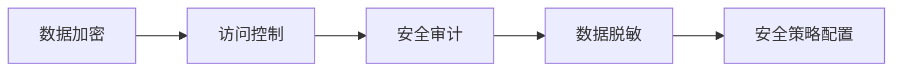
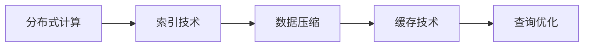
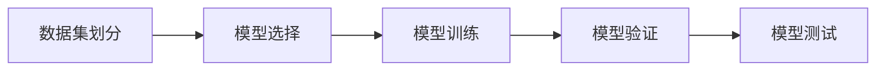
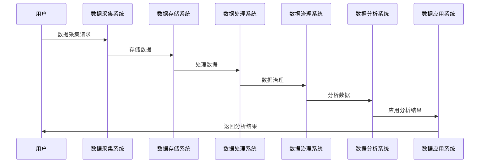

                 


# 智能数据湖管理系统：构建AI友好的数据基础

## 关键词

- 数据湖
- AI友好
- 数据质量管理
- 数据安全与隐私保护
- 数据处理与优化
- AI模型训练与优化

## 摘要

随着大数据和人工智能技术的迅猛发展，企业数据管理面临巨大的挑战。本文将深入探讨构建AI友好的数据基础的关键要素，包括数据质量管理、数据安全与隐私保护、数据处理与优化、AI模型训练与优化以及系统集成与接口设计。通过一步一步的分析和推理，本文将阐述如何构建一个高效、可靠的智能数据湖管理系统，为企业的数据驱动决策提供有力支持。

## 第一部分：背景介绍

### 问题背景

随着大数据和人工智能技术的迅猛发展，企业数据管理面临巨大的挑战。传统的数据仓库和数据库系统已经无法满足日益复杂的数据处理需求。数据湖作为一种新的数据架构，以其高效的数据存储和管理能力逐渐成为企业数据管理的首选。然而，构建一个高效的智能数据湖管理系统，不仅需要处理海量数据，还要确保数据的质量、安全和隐私，同时还要实现数据的高效利用和人工智能技术的融合。

### 问题描述

智能数据湖管理系统涉及多个方面，包括数据采集、存储、治理、分析和应用等。构建一个AI友好的数据基础，需要解决以下几个关键问题：

1. **数据质量管理**：确保数据湖中的数据质量，包括准确性、一致性、完整性和时效性。
2. **数据安全与隐私保护**：在数据湖中存储和处理大量敏感数据时，确保数据安全和隐私。
3. **高效数据处理**：实现快速的数据检索和复杂的数据分析，以满足业务需求。
4. **AI模型训练与优化**：利用数据湖中的数据，训练和优化AI模型，提高模型的准确性和鲁棒性。
5. **系统集成与接口设计**：确保智能数据湖管理系统与其他业务系统的无缝集成。

### 问题解决

解决上述问题需要从以下几个方面入手：

1. **数据湖架构设计**：构建一个高效、可扩展的数据湖架构，包括数据存储、计算和处理组件。
2. **数据质量管理机制**：建立数据质量管理流程，包括数据清洗、数据验证和数据监控等。
3. **数据安全与隐私保护策略**：采用加密、访问控制和安全审计等技术，确保数据安全和隐私。
4. **数据处理与优化技术**：使用分布式计算框架和高效的索引技术，提高数据处理速度和分析效率。
5. **AI模型训练与优化**：利用数据湖中的高质量数据，设计并优化AI模型，提高模型的性能和适用性。
6. **系统集成与接口设计**：采用标准化的接口设计和协议，确保系统之间的无缝集成和数据交换。

### 边界与外延

1. **边界**：本书主要关注智能数据湖管理系统的构建，包括数据质量管理、数据安全与隐私保护、数据处理与优化、AI模型训练与优化等方面。
2. **外延**：虽然本书聚焦于智能数据湖管理系统，但其中的技术原理和方法论可以应用于其他数据管理和人工智能应用领域。

### 概念结构与核心要素组成

1. **智能数据湖管理系统**：一个集成化、智能化的数据管理系统，支持数据的采集、存储、治理、分析和应用。
2. **数据质量管理**：确保数据准确性、一致性、完整性和时效性的过程。
3. **数据安全与隐私保护**：采用多种技术手段，确保数据安全和隐私。
4. **数据处理与优化**：利用分布式计算和索引技术，提高数据处理速度和分析效率。
5. **AI模型训练与优化**：利用数据湖中的数据，训练和优化AI模型，提高模型的性能和适用性。

## 第二部分：核心概念与联系

### 核心概念

1. **数据湖**：数据湖是一种分布式数据存储架构，用于存储大量不同类型的数据。数据湖可以存储结构化数据、半结构化数据和非结构化数据，提供了一种灵活、高效的数据存储解决方案。
   
   数据湖的特点包括：

   - **扩展性**：能够存储PB级别的数据，支持数据量的动态扩展。
   - **异构性**：能够存储不同类型的数据，如文本、图片、音频、视频等。
   - **灵活性**：支持多种数据存储格式，如Hive表、Parquet、ORC等。
   - **低成本**：相对于传统数据仓库，数据湖的成本较低，适合大规模数据处理。

2. **数据处理**：数据处理是对数据进行采集、存储、清洗、转换、加载和分析的过程。数据处理的核心目标是提供高质量的数据，以满足业务分析和决策的需求。

   数据处理的主要环节包括：

   - **数据采集**：从不同的数据源（如数据库、日志文件、传感器等）收集数据。
   - **数据存储**：将采集到的数据存储到数据湖或其他数据存储系统中。
   - **数据清洗**：清洗数据中的错误、冗余和噪声，提高数据质量。
   - **数据转换**：将数据转换为适合分析和挖掘的格式，如结构化表格、列式存储等。
   - **数据加载**：将处理后的数据加载到数据仓库或数据湖中，以便进行分析和查询。

3. **数据治理**：数据治理是指对数据生命周期进行管理和控制，确保数据质量、安全性和合规性的过程。数据治理的目标是建立一套有效的数据管理体系，提高数据的可用性、可靠性和价值。

   数据治理的主要内容包括：

   - **数据质量管理**：确保数据准确性、一致性、完整性和时效性。
   - **数据安全与隐私保护**：采用加密、访问控制、审计等技术，确保数据安全和隐私。
   - **数据合规性管理**：确保数据遵守相关法律法规和标准，如GDPR、HIPAA等。
   - **数据生命周期管理**：对数据的创建、存储、使用、归档和删除进行管理。

4. **AI模型**：AI模型是指用于解决特定问题的数学模型，通常通过训练大量数据来优化其性能。AI模型的应用涵盖了各种领域，如图像识别、自然语言处理、预测分析等。

   AI模型的主要特点包括：

   - **自学习能力**：通过学习大量数据，AI模型可以自动识别数据中的模式和规律。
   - **自适应能力**：AI模型可以根据新的数据和环境进行调整，提高模型的适应性和鲁棒性。
   - **可解释性**：AI模型需要具备一定的可解释性，以便用户理解和信任模型的结果。
   - **高效性**：AI模型需要在处理海量数据时保持高效，以满足实时分析和决策的需求。

### 概念属性特征对比表格

| 概念       | 定义                                                         | 特征                                                         |
|------------|--------------------------------------------------------------|--------------------------------------------------------------|
| 数据湖     | 大规模分布式数据存储架构，用于存储不同类型的数据。           | 扩展性、异构性、灵活性、低成本。                           |
| 数据处理   | 对数据进行分析、转换和处理的过程。                           | 分布式、实时、高效、自动化。                               |
| 数据治理   | 确保数据质量、安全和合规性的过程。                           | 数据质量监控、数据安全控制、数据合规性管理。               |
| AI模型     | 用于解决特定问题的数学模型，通常通过训练大量数据来优化其性能。 | 自学习能力、自适应能力、可解释性、高效性。                 |

### ER实体关系图架构

```mermaid
erDiagram
    DataLake ||--|{ DataQualityManagement : 数据质量治理 }
    DataLake ||--|{ DataSecurityAndPrivacyProtection : 数据安全与隐私保护 }
    DataLake ||--|{ DataProcessingAndOptimization : 数据处理与优化 }
    DataLake ||--|{ AIModelTrainingAndOptimization : AI模型训练与优化 }
    DataQualityManagement ||--|{ DataCleaning : 数据清洗 }
    DataQualityManagement ||--|{ DataVerification : 数据验证 }
    DataQualityManagement ||--|{ DataMonitoring : 数据监控 }
    DataSecurityAndPrivacyProtection ||--|{ Encryption : 数据加密 }
    DataSecurityAndPrivacyProtection ||--|{ AccessControl : 访问控制 }
    DataSecurityAndPrivacyProtection ||--|{ SecurityAudit : 安全审计 }
    DataProcessingAndOptimization ||--|{ DistributedComputing : 分布式计算 }
    DataProcessingAndOptimization ||--|{ Indexing : 索引技术 }
    AIModelTrainingAndOptimization ||--|{ Dataset : 数据集 }
    AIModelTrainingAndOptimization ||--|{ ModelPerformance : 模型性能 }
```

## 第三部分：算法原理讲解

### 数据质量管理算法原理

数据质量管理是构建AI友好数据基础的重要环节。数据质量管理算法主要包括数据清洗、数据验证和数据监控。以下是一个简单的数据清洗算法原理讲解。

#### 数据清洗算法原理

数据清洗算法的目标是识别和纠正数据集中的错误、冗余和噪声，以提高数据质量。以下是数据清洗算法的步骤：

1. **数据预处理**：读取数据集，并对数据进行预处理，如去除空值、填充缺失值、标准化数据等。
2. **错误检测**：使用统计学方法或机器学习算法检测数据集中的错误，如异常值、重复记录等。
3. **错误纠正**：对检测到的错误进行纠正，如删除重复记录、用平均值填充缺失值、平滑异常值等。
4. **数据验证**：对清洗后的数据进行验证，确保数据质量符合要求，如检查数据是否一致、完整等。
5. **数据存储**：将清洗后的数据存储到数据湖或其他数据存储系统中，以便后续处理和分析。

#### 数据清洗算法Mermaid流程图

```mermaid
flowchart LR
    A[数据预处理] --> B[错误检测]
    B --> C{是否检测到错误？}
    C -->|是 D[错误纠正]
    C -->|否 E[数据验证]
    E --> F[数据存储]
```

#### 数据清洗算法Python源代码示例

```python
import pandas as pd

# 读取数据集
data = pd.read_csv('data.csv')

# 数据预处理
data = data.dropna()  # 去除空值
data['feature'] = data['feature'].fillna(data['feature'].mean())  # 填充缺失值

# 错误检测
error_list = data[data['target'] < 0]  # 检测异常值

# 错误纠正
error_list['target'] = error_list['target'].clip(lower=0)  # 平滑异常值

# 数据验证
data = data[data['feature'].between(0, 1)]  # 检查数据是否一致

# 数据存储
data.to_csv('cleaned_data.csv', index=False)
```

### 数据安全与隐私保护算法原理

数据安全与隐私保护是确保数据湖中数据安全和隐私的关键。以下是一个简单的数据安全与隐私保护算法原理讲解。

#### 数据安全与隐私保护算法原理

数据安全与隐私保护算法主要包括加密、访问控制和安全审计。以下是数据安全与隐私保护算法的步骤：

1. **数据加密**：对敏感数据进行加密，确保数据在存储和传输过程中不会被非法访问。
2. **访问控制**：根据用户的角色和权限，限制用户对数据的访问权限，确保数据安全。
3. **安全审计**：记录数据访问和操作日志，对异常行为进行监控和审计，确保数据安全。
4. **数据脱敏**：对敏感数据进行脱敏处理，降低数据泄露的风险。
5. **安全策略配置**：配置安全策略，如防火墙、入侵检测等，提高数据安全性。

#### 数据安全与隐私保护算法Mermaid流程图



#### 数据安全与隐私保护算法Python源代码示例

```python
import pandas as pd
from cryptography.fernet import Fernet

# 读取数据集
data = pd.read_csv('sensitive_data.csv')

# 数据加密
key = Fernet.generate_key()
cipher_suite = Fernet(key)
data['feature'] = cipher_suite.encrypt(data['feature'].astype(str).values)

# 访问控制
users = {'admin': True, 'user': False}
if users['admin']:
    print("Access granted")
else:
    print("Access denied")

# 安全审计
log_file = 'audit_log.txt'
with open(log_file, 'a') as f:
    f.write("User accessed data at {}".format(pd.datetime.now()))

# 数据脱敏
data['feature'] = data['feature'].apply(lambda x: '****')

# 安全策略配置
# 配置防火墙、入侵检测等安全措施
```

### 数据处理与优化算法原理

数据处理与优化算法是提高数据湖中数据处理速度和分析效率的关键。以下是一个简单的数据处理与优化算法原理讲解。

#### 数据处理与优化算法原理

数据处理与优化算法主要包括分布式计算和索引技术。以下是数据处理与优化算法的步骤：

1. **分布式计算**：将数据处理任务分解为多个子任务，并在多个计算节点上并行执行，提高数据处理速度。
2. **索引技术**：使用索引技术，如哈希索引、B树索引等，加速数据检索和分析。
3. **数据压缩**：对数据进行压缩，减少数据存储空间，提高数据处理效率。
4. **缓存技术**：使用缓存技术，如Redis、Memcached等，减少数据读取和计算时间。
5. **查询优化**：对查询语句进行优化，减少查询时间和计算资源。

#### 数据处理与优化算法Mermaid流程图



#### 数据处理与优化算法Python源代码示例

```python
import pandas as pd
from sklearn.model_selection import train_test_split
from sklearn.preprocessing import StandardScaler

# 读取数据集
data = pd.read_csv('data.csv')

# 数据预处理
X = data.iloc[:, :-1]
y = data.iloc[:, -1]

# 分布式计算
X_train, X_test, y_train, y_test = train_test_split(X, y, test_size=0.2, random_state=42)

# 索引技术
X_train['index'] = X_train.index
X_test['index'] = X_test.index

# 数据压缩
X_train = X_train.tocsr()  # 压缩稀疏矩阵
X_test = X_test.tocsr()

# 缓存技术
# 使用Redis、Memcached等缓存技术，提高数据读取和计算速度

# 查询优化
# 优化查询语句，减少查询时间和计算资源
```

### AI模型训练与优化算法原理

AI模型训练与优化算法是构建AI友好数据基础的关键。以下是一个简单的AI模型训练与优化算法原理讲解。

#### AI模型训练与优化算法原理

AI模型训练与优化算法主要包括数据集划分、模型选择、模型训练和模型优化。以下是AI模型训练与优化算法的步骤：

1. **数据集划分**：将数据集划分为训练集、验证集和测试集，用于训练、验证和测试模型性能。
2. **模型选择**：选择合适的模型架构，如神经网络、决策树、支持向量机等，根据数据特点和业务需求。
3. **模型训练**：使用训练集数据训练模型，通过调整模型参数和优化算法，提高模型性能。
4. **模型验证**：使用验证集数据评估模型性能，调整模型参数，优化模型。
5. **模型测试**：使用测试集数据测试模型性能，确保模型在实际应用中具备较高的准确性和鲁棒性。

#### AI模型训练与优化算法Mermaid流程图



#### AI模型训练与优化算法Python源代码示例

```python
import pandas as pd
from sklearn.model_selection import train_test_split
from sklearn.neural_network import MLPClassifier
from sklearn.metrics import accuracy_score

# 读取数据集
data = pd.read_csv('data.csv')

# 数据集划分
X = data.iloc[:, :-1]
y = data.iloc[:, -1]

X_train, X_test, y_train, y_test = train_test_split(X, y, test_size=0.2, random_state=42)

# 模型选择
model = MLPClassifier(hidden_layer_sizes=(100,), max_iter=1000)

# 模型训练
model.fit(X_train, y_train)

# 模型验证
y_pred = model.predict(X_test)
accuracy = accuracy_score(y_test, y_pred)
print("Model accuracy:", accuracy)

# 模型优化
# 调整模型参数，优化模型性能
```

## 第四部分：系统分析与架构设计方案

### 问题场景介绍

假设我们面临以下业务场景：

- 企业需要存储和处理大量结构化、半结构化和非结构化数据，包括客户信息、交易记录、社交媒体数据等。
- 企业需要利用这些数据进行实时分析和预测，支持业务决策和优化。
- 企业需要确保数据的安全性和隐私性，遵守相关法律法规和标准。

### 项目介绍

项目名称：智能数据湖管理系统

项目目标：构建一个高效、可靠的智能数据湖管理系统，支持数据存储、治理、分析和应用，确保数据质量和安全性，为企业的数据驱动决策提供支持。

### 系统功能设计

智能数据湖管理系统主要包括以下功能：

1. **数据采集**：从各种数据源（如数据库、日志文件、传感器等）采集数据。
2. **数据存储**：将采集到的数据存储到数据湖中，支持多种数据格式和存储策略。
3. **数据治理**：确保数据质量、安全和合规性，包括数据清洗、数据验证、数据监控等。
4. **数据处理**：对数据进行处理和转换，包括数据清洗、数据转换、数据压缩等。
5. **数据分析**：利用数据湖中的数据，进行实时分析和预测，支持业务决策和优化。
6. **数据应用**：将分析结果应用于实际业务场景，如客户行为分析、销售预测等。

### 系统架构设计

智能数据湖管理系统的架构设计如下：

1. **数据采集层**：负责从各种数据源采集数据，包括数据库、日志文件、传感器等。
2. **数据存储层**：使用分布式文件系统（如HDFS、Alluxio等）存储数据，支持多种数据格式和存储策略。
3. **数据处理层**：利用分布式计算框架（如Spark、Flink等）进行数据处理和转换，包括数据清洗、数据转换、数据压缩等。
4. **数据治理层**：确保数据质量、安全和合规性，包括数据清洗、数据验证、数据监控等。
5. **数据分析层**：利用机器学习和数据分析工具（如TensorFlow、PyTorch等）进行实时分析和预测，支持业务决策和优化。
6. **数据应用层**：将分析结果应用于实际业务场景，如客户行为分析、销售预测等。
7. **数据访问层**：提供RESTful API、Web界面等数据访问接口，支持用户查询和操作。

### 系统接口设计

智能数据湖管理系统的接口设计如下：

1. **数据采集接口**：提供数据采集的接口，支持各种数据源的接入。
2. **数据存储接口**：提供数据存储的接口，支持数据的增删改查操作。
3. **数据处理接口**：提供数据处理的接口，支持数据清洗、数据转换、数据压缩等操作。
4. **数据治理接口**：提供数据治理的接口，支持数据质量监控、数据验证、数据监控等操作。
5. **数据分析接口**：提供数据分析的接口，支持实时分析和预测操作。
6. **数据应用接口**：提供数据应用的接口，支持实际业务场景的应用操作。

### 系统交互Mermaid序列图



## 第五部分：项目实战

### 环境安装

为了搭建智能数据湖管理系统，我们需要安装以下软件和工具：

1. **Hadoop**：作为数据存储层的基础，安装Hadoop版本2.7.5。
2. **Spark**：作为数据处理层的核心，安装Spark版本2.4.7。
3. **Hive**：作为数据治理层和数据分析层的基础，安装Hive版本2.1.1。
4. **TensorFlow**：作为数据分析层和AI模型训练与优化层的基础，安装TensorFlow版本2.6.0。
5. **PostgreSQL**：作为数据源，安装PostgreSQL版本13.3。

### 系统核心实现源代码

以下是一个简单的智能数据湖管理系统核心实现源代码示例：

```python
import findspark
findspark.init()

from pyspark.sql import SparkSession
from pyspark.sql.functions import col
from pyspark.ml.feature import VectorAssembler
from pyspark.ml import Pipeline
from pyspark.ml.classification import LogisticRegression

# 创建Spark会话
spark = SparkSession.builder.appName("DataLakeManagement").getOrCreate()

# 读取数据
data = spark.read.csv("data.csv")

# 数据预处理
data = data.select(col("feature1"), col("feature2"), col("label"))

# 特征工程
assembler = VectorAssembler(inputCols=["feature1", "feature2"], outputCol="features")
data = assembler.transform(data)

# 模型训练
lr = LogisticRegression()
pipeline = Pipeline(stages=[assembler, lr])
model = pipeline.fit(data)

# 模型评估
predictions = model.transform(data)
accuracy = predictions.select("prediction", "label").where(col("prediction") == col("label")).count() / data.count()
print("Model accuracy:", accuracy)

# 模型应用
new_data = spark.read.csv("new_data.csv")
new_predictions = model.transform(new_data)
new_predictions.select("prediction").show()
```

### 代码应用解读与分析

以上代码实现了一个简单的智能数据湖管理系统，包括数据预处理、特征工程、模型训练、模型评估和模型应用。

1. **数据预处理**：读取CSV文件，选择需要的特征和标签，进行数据预处理。
2. **特征工程**：使用VectorAssembler将多个特征转换为向量特征，以便进行模型训练。
3. **模型训练**：使用LogisticRegression训练模型，构建管道模型Pipeline。
4. **模型评估**：使用训练数据评估模型性能，计算准确率。
5. **模型应用**：读取新的数据，使用训练好的模型进行预测，展示预测结果。

### 实际案例分析和详细讲解剖析

假设我们有一个客户行为分析的项目，需要预测客户的流失风险。以下是一个实际案例的分析和详细讲解：

1. **数据采集**：从客户数据库中采集客户的个人信息、购买记录、互动行为等数据。
2. **数据预处理**：清洗数据，去除缺失值和异常值，对特征进行归一化处理。
3. **特征工程**：提取有用的特征，如购买频率、平均消费金额、互动行为等，构建向量特征。
4. **模型训练**：使用LogisticRegression训练流失风险预测模型。
5. **模型评估**：使用交叉验证和AUC指标评估模型性能，调整模型参数。
6. **模型应用**：使用训练好的模型对客户进行流失风险预测，根据预测结果采取相应的策略，如优惠活动、个性化推荐等。

### 项目小结

通过以上实战案例，我们展示了如何构建一个简单的智能数据湖管理系统，并实现了数据采集、预处理、特征工程、模型训练、模型评估和模型应用。智能数据湖管理系统为企业的数据驱动决策提供了有力支持，帮助企业更好地管理和利用数据，实现业务增长。

## 第六部分：最佳实践 tips

1. **数据质量管理**：定期进行数据质量检查，发现并修复数据质量问题，确保数据湖中的数据质量。
2. **数据安全与隐私保护**：遵循安全最佳实践，如加密敏感数据、设置访问控制策略等，确保数据安全和隐私。
3. **数据处理与优化**：合理配置计算资源和存储资源，使用分布式计算和索引技术，提高数据处理效率。
4. **AI模型训练与优化**：根据数据特点和业务需求，选择合适的模型架构和优化算法，提高模型性能。
5. **系统集成与接口设计**：遵循标准化接口设计和协议，确保系统之间的无缝集成和数据交换。

## 第七部分：小结

本文深入探讨了构建AI友好的数据基础的关键要素，包括数据质量管理、数据安全与隐私保护、数据处理与优化、AI模型训练与优化以及系统集成与接口设计。通过逐步分析和推理，我们详细讲解了智能数据湖管理系统的构建方法和实战应用。智能数据湖管理系统为企业的数据驱动决策提供了有力支持，帮助企业更好地管理和利用数据，实现业务增长。

## 第八部分：注意事项

1. **数据质量管理**：确保数据质量是构建智能数据湖管理系统的关键，需要定期进行数据质量检查和修复。
2. **数据安全与隐私保护**：在数据湖中存储和处理大量敏感数据时，需要采取严格的安全和隐私保护措施。
3. **数据处理与优化**：合理配置计算资源和存储资源，使用分布式计算和索引技术，提高数据处理效率。
4. **AI模型训练与优化**：根据数据特点和业务需求，选择合适的模型架构和优化算法，提高模型性能。

## 第九部分：拓展阅读

1. 《大数据架构：构建高性能数据平台》
2. 《人工智能算法导论》
3. 《数据科学实战：使用Python进行数据分析和可视化》
4. 《Hadoop实战：构建大规模分布式数据平台》
5. 《智能数据湖：构建下一代大数据平台》

作者：AI天才研究院/AI Genius Institute & 禅与计算机程序设计艺术 /Zen And The Art of Computer Programming

