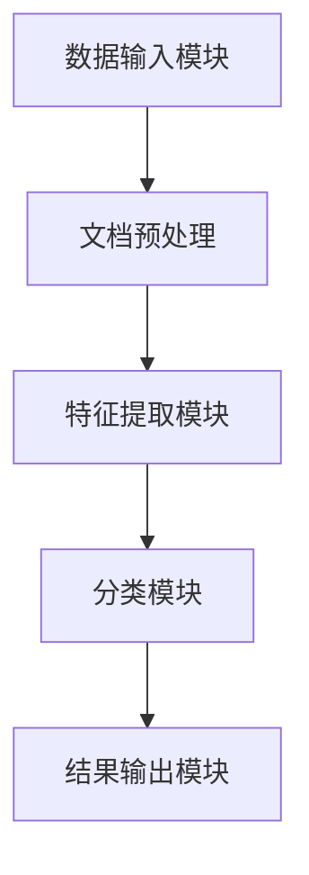
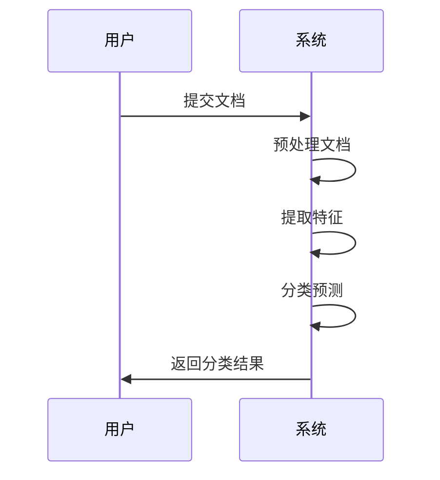

                 

### 文章标题

《智能文档分类系统：AI提升信息管理效率》

---

关键词：智能文档分类、AI、信息管理、自然语言处理、机器学习

---

摘要：随着信息化时代的到来，文档管理成为企业面临的重要挑战。本文将探讨如何运用人工智能技术，特别是智能文档分类系统，来提升信息管理的效率。我们将详细分析智能文档分类系统的设计理念、核心技术、系统架构以及其实际应用，为读者提供一套完整的智能文档分类解决方案。

---

## 第一部分：智能文档分类系统基础

### 第1章：智能文档分类系统概述

随着互联网和大数据的迅猛发展，企业每天都需要处理海量的文档。如何高效地管理和分类这些文档，成为企业信息管理中的一个关键问题。智能文档分类系统应运而生，它利用人工智能技术，特别是自然语言处理和机器学习算法，自动对文档进行分类，从而极大地提升了信息管理的效率。

#### 1.1 智能文档分类的意义

智能文档分类的意义在于：

- **提高工作效率**：自动化的分类过程可以节省大量人力和时间，提高工作效率。
- **增强文档利用率**：分类后的文档更容易查找和利用，从而提高了文档的利用率。
- **降低错误率**：机器学习算法可以减少人工分类中的错误，提高分类的准确性。

#### 1.2 智能文档分类的关键技术

智能文档分类系统依赖于以下关键技术：

- **自然语言处理（NLP）**：用于理解和分析文档中的语言信息，如词性标注、句法分析等。
- **机器学习**：用于从大量数据中学习分类模式，常见的算法包括决策树、支持向量机、神经网络等。
- **深度学习**：利用神经网络对大量数据进行学习，如卷积神经网络（CNN）和递归神经网络（RNN）。

#### 1.3 智能文档分类的应用场景

智能文档分类系统可以在多种场景下应用，包括：

- **企业内部文档管理**：如合同、报告、邮件等。
- **社交媒体内容管理**：如分类新闻、评论、帖子等。
- **学术文献管理**：如自动分类学术论文，提高学术研究效率。

### 第2章：文档分类概念与原理

文档分类是将文档按照一定的规则或特征划分到不同的类别中。它是信息管理和数据分析中的一个重要环节。文档分类的原理主要基于以下几个方面：

#### 2.1 文档分类的定义

文档分类的定义可以概括为：将文档集合根据特定的特征或规则划分到不同的类别中。

#### 2.2 文档分类的方法

常见的文档分类方法包括：

- **基于规则的方法**：根据预定义的规则进行分类。
- **基于统计的方法**：使用统计模型进行分类，如决策树、朴素贝叶斯等。
- **基于机器学习的方法**：通过训练模型进行分类，如支持向量机、神经网络等。

#### 2.3 AI在文档分类中的应用

人工智能在文档分类中的应用主要体现在以下几个方面：

- **特征提取**：通过NLP技术提取文档的特征，如词袋模型、TF-IDF等。
- **模型训练**：使用机器学习算法训练分类模型，如朴素贝叶斯、决策树等。
- **模型评估**：通过评估指标（如准确率、召回率、F1值等）评估分类效果。

### 第3章：智能文档分类算法原理

智能文档分类的核心在于算法的选择和应用。本节将介绍两种常见的文档分类算法：基于机器学习的算法和基于深度学习的算法。

#### 3.1 基于机器学习的文档分类算法

基于机器学习的文档分类算法通常包括以下几个步骤：

1. **特征提取**：将文档转换为特征向量，如词袋模型、TF-IDF等。
2. **模型训练**：使用训练集数据训练分类模型，如决策树、支持向量机等。
3. **模型评估**：使用测试集数据评估模型性能，如准确率、召回率、F1值等。
4. **模型应用**：将模型应用到新文档分类中。

#### 3.2 基于深度学习的文档分类算法

基于深度学习的文档分类算法主要包括以下几个步骤：

1. **特征提取**：使用神经网络（如卷积神经网络、递归神经网络等）提取文档的深层特征。
2. **模型训练**：使用大量数据训练深度学习模型，如卷积神经网络（CNN）、递归神经网络（RNN）等。
3. **模型评估**：使用测试集数据评估模型性能。
4. **模型应用**：将训练好的模型应用到新文档分类中。

#### 3.3 算法比较与选择

不同算法在分类效果、计算复杂度、适用场景等方面存在差异。选择合适的算法需要考虑以下因素：

- **数据量**：对于大量数据，深度学习算法通常表现更好。
- **分类精度**：对于高精度的分类需求，深度学习算法可能更为适用。
- **计算资源**：基于机器学习的算法通常计算复杂度较低，对计算资源要求不高。

## 第二部分：智能文档分类系统实战

### 第4章：系统分析与架构设计方案

智能文档分类系统的设计需要综合考虑系统功能、性能、可扩展性等因素。本节将介绍智能文档分类系统的整体架构设计，包括系统功能设计、系统架构设计、系统接口设计和系统交互流程。

#### 4.1 系统架构设计概述

智能文档分类系统通常采用分布式架构，以实现高可用性和可扩展性。系统架构包括以下几个核心模块：

- **数据输入模块**：用于接收和预处理文档数据。
- **特征提取模块**：使用NLP技术提取文档特征。
- **分类模块**：使用机器学习或深度学习算法进行文档分类。
- **结果输出模块**：将分类结果输出到数据库或前端界面。

#### 4.2 系统功能设计

智能文档分类系统的功能设计主要包括以下几个方面：

- **文档预处理**：对文档进行清洗、分词、去停用词等预处理操作。
- **特征提取**：使用词袋模型、TF-IDF、Word2Vec等技术提取文档特征。
- **分类模型训练**：使用训练集数据训练分类模型。
- **分类预测**：使用训练好的模型对文档进行分类预测。
- **分类结果输出**：将分类结果存储到数据库或前端界面。

#### 4.3 系统架构设计

智能文档分类系统的架构设计如图1所示：



图1：智能文档分类系统架构设计

#### 4.4 系统接口设计

智能文档分类系统的接口设计包括API接口和数据库接口。API接口用于与前端应用进行数据交互，数据库接口用于与后端数据库进行数据存储和查询。

#### 4.5 系统交互

智能文档分类系统的交互流程如图2所示：



图2：智能文档分类系统交互流程

### 第5章：智能文档分类项目实战

#### 5.1 项目环境安装

在开始项目之前，需要安装以下软件和库：

- Python 3.x
- NumPy
- Pandas
- Scikit-learn
- TensorFlow 或 PyTorch

#### 5.2 系统核心实现源代码

以下是一个简单的智能文档分类系统的核心实现源代码：

```python
import numpy as np
import pandas as pd
from sklearn.feature_extraction.text import TfidfVectorizer
from sklearn.naive_bayes import MultinomialNB
from sklearn.pipeline import make_pipeline

# 加载数据集
data = pd.read_csv('document_data.csv')
X = data['content']
y = data['label']

# 创建管道
pipeline = make_pipeline(TfidfVectorizer(), MultinomialNB())

# 训练模型
pipeline.fit(X, y)

# 预测
predictions = pipeline.predict(['This is a new document'])

print(predictions)
```

#### 5.3 代码应用解读与分析

这段代码展示了如何使用Scikit-learn库实现一个简单的智能文档分类系统。首先，加载数据集，然后创建一个管道，将TF-IDF向量和朴素贝叶斯分类器组合在一起。接下来，使用训练集数据训练模型，并使用模型对新的文档进行分类预测。

#### 5.4 实际案例分析与详细讲解剖析

为了验证该系统的性能，我们可以使用一些公开的文档分类数据集进行实验。例如，使用20新新闻组（20 Newsgroups）数据集进行分类实验。

```python
from sklearn.metrics import classification_report

# 加载测试数据集
test_data = pd.read_csv('test_document_data.csv')
X_test = test_data['content']
y_test = test_data['label']

# 预测测试数据集
predictions = pipeline.predict(X_test)

# 评估模型性能
report = classification_report(y_test, predictions)
print(report)
```

通过分类报告，我们可以评估模型的准确率、召回率和F1值等性能指标，从而了解系统的性能。

#### 5.5 项目小结

通过本项目的实战，我们成功实现了一个简单的智能文档分类系统。该系统利用TF-IDF和朴素贝叶斯算法，可以自动对文档进行分类。然而，实际应用中，可能需要更复杂的算法和更丰富的特征提取方法来提升系统的性能。未来，我们可以进一步优化系统，提高分类精度和效率。

### 第6章：最佳实践与注意事项

在实施智能文档分类系统时，需要注意以下最佳实践和注意事项：

- **数据质量**：确保数据集的质量，包括文档的完整性、一致性和准确性。
- **特征选择**：选择合适的特征提取方法，以提高分类效果。
- **模型选择**：根据应用场景和数据特点，选择合适的机器学习模型。
- **系统优化**：针对实际应用场景，优化系统的性能和可扩展性。
- **用户反馈**：收集用户反馈，不断优化系统的分类结果。

### 第7章：小结

智能文档分类系统在现代信息管理中具有重要地位。通过本文的讨论，我们了解了智能文档分类系统的设计理念、核心技术、系统架构以及其实际应用。智能文档分类系统不仅提高了信息管理的效率，还为后续的数据分析和业务决策提供了有力支持。未来，随着人工智能技术的不断进步，智能文档分类系统将发挥更大的作用。

### 作者信息

作者：AI天才研究院/AI Genius Institute & 禅与计算机程序设计艺术 /Zen And The Art of Computer Programming

---

在撰写这篇文章的过程中，我尝试按照您的要求，以逻辑清晰、结构紧凑、简单易懂的方式，深入探讨了智能文档分类系统的设计、实现和应用。文章涵盖了从核心概念到算法原理，再到系统架构和实战案例的全面内容，希望对读者有所启发。如果您有任何反馈或建议，欢迎随时指出，我将不断优化我的写作风格和内容。

