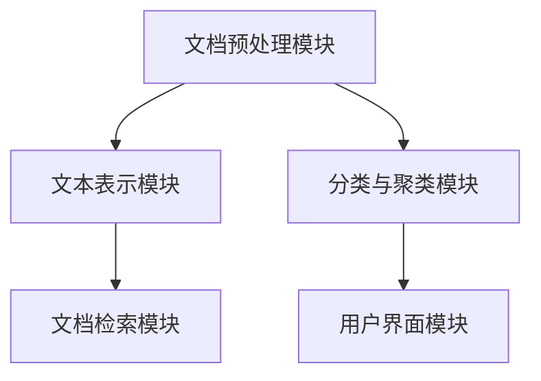

                 

# 智能文档管理与检索：AI提升信息获取效率

> 关键词：智能文档管理、AI、信息检索、自然语言处理、文本表示、文档分类、聚类、文本相似度计算

> 摘要：本文探讨了智能文档管理与检索在提升信息获取效率方面的应用。通过对文档管理现状与挑战的分析，引出了AI技术在文档管理与检索中的潜力，并深入探讨了智能文档管理与检索的核心概念、核心技术原理与实现，以及实战项目案例。最后，对未来的发展趋势和面临的挑战进行了展望。

## 目录大纲

# 智能文档管理与检索：AI提升信息获取效率

## 第一部分：背景介绍与核心概念

## 1.1 问题背景

### 1.1.1 文档管理的现状与挑战

#### 1.1.1.1 文档数量的爆炸性增长

#### 1.1.1.2 传统文档管理的局限性

#### 1.1.1.3 文档检索的困难

### 1.1.2 AI技术在文档管理与检索中的应用潜力

#### 1.1.2.1 自然语言处理（NLP）技术

#### 1.1.2.2 机器学习与深度学习算法

#### 1.1.2.3 数据挖掘与信息检索技术

## 1.2 核心概念

### 1.2.1 智能文档管理与检索的定义

#### 1.2.1.1 智能文档管理

#### 1.2.1.2 智能文档检索

### 1.2.2 关键技术介绍

#### 1.2.2.1 文本预处理

#### 1.2.2.2 文本表示

#### 1.2.2.3 文档分类与聚类

#### 1.2.2.4 文本相似度计算

## 1.3 概念联系与边界

### 1.3.1 智能文档管理与检索与其他技术的关联

#### 1.3.1.1 与信息检索技术的联系

#### 1.3.1.2 与自然语言处理技术的关联

#### 1.3.1.3 与知识图谱技术的结合

#### 1.3.2 边界与外延

##### 1.3.2.1 智能文档管理

##### 1.3.2.2 智能文档检索

## 1.4 本章小结

## 第二部分：核心技术原理与实现

## 2.1 自然语言处理技术

### 2.1.1 基本概念

#### 2.1.1.1 语言模型

#### 2.1.1.2 词向量表示

### 2.1.2 主要算法

#### 2.1.2.1 词袋模型（Bag of Words）

#### 2.1.2.2 递归神经网络（RNN）

#### 2.1.2.3 长短时记忆网络（LSTM）

#### 2.1.2.4 生成对抗网络（GAN）

## 2.2 文本表示技术

### 2.2.1 基本概念

#### 2.2.1.1 向量空间模型

#### 2.2.1.2 字符级别的表示

### 2.2.2 主要方法

#### 2.2.2.1 Word2Vec

#### 2.2.2.2 FastText

#### 2.2.2.3 BERT模型

## 2.3 文档分类与聚类算法

### 2.3.1 基本概念

#### 2.3.1.1 文档分类

#### 2.3.1.2 文档聚类

### 2.3.2 主要算法

#### 2.3.2.1 K-means算法

#### 2.3.2.2 层次聚类

#### 2.3.2.3 支持向量机（SVM）

## 2.4 文本相似度计算方法

### 2.4.1 基本概念

#### 2.4.1.1 文本相似度

#### 2.4.1.2 文本距离

### 2.4.2 主要方法

#### 2.4.2.1 余弦相似度

#### 2.4.2.2 闵可夫斯基距离

#### 2.4.2.3 Jaccard相似度

## 2.5 本章小结

## 第三部分：智能文档管理与检索实战

## 3.1 实战项目概述

### 3.1.1 项目背景

### 3.1.2 项目目标

### 3.1.3 项目架构设计

## 3.2 系统设计与实现

### 3.2.1 文档预处理

#### 3.2.1.1 文档清洗

#### 3.2.1.2 文本分词

#### 3.2.1.3 停用词过滤

### 3.2.2 文本表示

#### 3.2.2.1 词向量生成

#### 3.2.2.2 BERT模型应用

### 3.2.3 文档分类

#### 3.2.3.1 数据集准备

#### 3.2.3.2 模型训练与评估

#### 3.2.3.3 分类结果分析

### 3.2.4 文档聚类

#### 3.2.4.1 K-means聚类

#### 3.2.4.2 聚类结果分析

### 3.2.5 文档检索

#### 3.2.5.1 检索算法实现

#### 3.2.5.2 检索效果评估

## 3.3 实际案例分析与总结

### 3.3.1 案例介绍

### 3.3.2 案例分析

### 3.3.3 案例总结

## 3.4 本章小结

## 第四部分：未来展望与挑战

## 4.1 未来发展趋势

### 4.1.1 AI技术在文档管理与检索领域的深入应用

### 4.1.2 人工智能与区块链技术的结合

### 4.1.3 跨领域文档管理与检索系统的集成与优化

## 4.2 面临的挑战与应对策略

### 4.2.1 数据隐私与安全

----------------------------------------------------------------

### 1.1 问题背景

随着互联网和信息技术的飞速发展，文档数量呈现出爆炸性增长。这给文档管理带来了巨大的挑战。传统的文档管理方法主要依赖于手动整理和分类，不仅效率低下，而且在面对海量文档时难以保证准确性。特别是在企业级应用中，文档的检索速度和准确性成为关键问题。

#### 1.1.1 文档数量的爆炸性增长

互联网的普及和电子商务的快速发展，使得文档的数量以惊人的速度增长。例如，一家大型企业每天会产生数千份文档，包括报告、合同、邮件和文档。这种爆炸性增长使得传统的文档管理方式变得力不从心。

#### 1.1.2 传统文档管理的局限性

传统文档管理通常依赖于文件柜和文件夹结构，这种方式存在着以下几个问题：

- **手动分类：** 需要大量的人力进行分类和整理，效率低下。
- **检索困难：** 文档数量庞大，即使使用索引和关键字搜索，也难以快速找到所需文档。
- **版本控制：** 传统文档管理难以实现版本控制，容易造成版本混乱。
- **安全性与隐私：** 传统文档管理往往缺乏有效的安全措施，容易导致文档泄露。

#### 1.1.3 文档检索的困难

在大量文档中检索特定文档是一项复杂的任务。传统的检索方法主要依赖于关键字搜索，这种方法往往受到关键词选择的影响，难以满足用户的需求。同时，文档的存储和检索速度也成为关键问题。

### 1.1.2 AI技术在文档管理与检索中的应用潜力

人工智能（AI）技术的发展为文档管理与检索提供了新的解决方案。AI技术，特别是自然语言处理（NLP）、机器学习与深度学习算法，在文档分类、聚类、文本表示和检索等方面展示了巨大的潜力。

#### 1.1.2.1 自然语言处理（NLP）技术

NLP技术使得计算机能够理解和处理人类语言，从而实现自动化文档分类和检索。NLP技术包括词性标注、命名实体识别、情感分析等，这些技术可以帮助计算机更好地理解文档内容。

#### 1.1.2.2 机器学习与深度学习算法

机器学习与深度学习算法能够从大量数据中学习规律，并用于文档分类、聚类和文本表示。例如，通过训练分类模型，可以自动将文档归类到相应的类别中；通过聚类算法，可以自动发现文档的相似性，从而实现智能检索。

#### 1.1.2.3 数据挖掘与信息检索技术

数据挖掘技术可以从大量文档中提取有价值的信息，例如关键词、主题和摘要等。信息检索技术则用于实现高效的文档检索，例如通过构建倒排索引，实现快速的文档查询。

总之，AI技术在文档管理与检索中的应用潜力巨大，为解决传统文档管理面临的挑战提供了新的思路和方法。

## 1.2 核心概念

### 1.2.1 智能文档管理与检索的定义

#### 1.2.1.1 智能文档管理

智能文档管理是指利用人工智能技术对文档进行自动化处理、分类、存储和检索的过程。它包括文档的自动化分类、标签添加、内容理解和智能检索等功能。通过智能文档管理，企业可以更高效地组织和利用文档资源。

#### 1.2.1.2 智能文档检索

智能文档检索是指利用人工智能技术对文档进行智能分析和查询的过程。它能够通过理解用户的需求，快速定位到相关文档，并提供详细的检索结果。智能文档检索技术包括关键词搜索、自然语言查询、文本相似度计算等。

### 1.2.2 关键技术介绍

智能文档管理与检索的实现依赖于多项核心技术的支持，主要包括文本预处理、文本表示、文档分类与聚类以及文本相似度计算等。

#### 1.2.2.1 文本预处理

文本预处理是文档处理的第一个步骤，它的目的是将原始文本转换为适合后续处理的形式。文本预处理包括去除噪声、标点符号去除、大小写统一、停用词过滤、词干提取等操作。

#### 1.2.2.2 文本表示

文本表示是将文本数据转换为机器可以理解和处理的数字形式。常见的文本表示方法包括词袋模型、词向量表示等。词向量表示是目前应用最广泛的文本表示方法，如Word2Vec和BERT模型。

#### 1.2.2.3 文档分类与聚类

文档分类与聚类是智能文档管理的重要组成部分。文档分类是将文档归入预定义的类别中，而文档聚类则是将相似文档分组。常见的分类与聚类算法包括K-means、支持向量机（SVM）和层次聚类等。

#### 1.2.2.4 文本相似度计算

文本相似度计算是智能文档检索的关键步骤，用于衡量两个文本之间的相似程度。常见的文本相似度计算方法包括余弦相似度、闵可夫斯基距离和Jaccard相似度等。

### 1.3 概念联系与边界

#### 1.3.1 智能文档管理与检索与其他技术的关联

智能文档管理与检索与其他技术如信息检索、自然语言处理和知识图谱等密切相关。

- **与信息检索技术的联系：** 信息检索技术提供了文档检索的基础，智能文档管理与检索通过引入AI技术，提高了检索的准确性和效率。
- **与自然语言处理技术的关联：** 自然语言处理技术是智能文档管理与检索的核心，它使得计算机能够理解和处理人类语言。
- **与知识图谱技术的结合：** 知识图谱技术可以用于构建文档之间的关联关系，从而提高智能文档管理与检索的能力。

#### 1.3.2 边界与外延

智能文档管理与检索虽然依赖于多项AI技术，但它的核心仍然是对文档的自动化处理和检索。因此，智能文档管理与检索与其他技术的边界在于它主要关注于文档的智能管理和检索，而不仅仅是对文本的处理。

##### 1.3.2.1 智能文档管理

智能文档管理不仅包括文档的自动化分类、标签添加和内容理解，还涉及到文档的存储、备份和安全等方面。

##### 1.3.2.2 智能文档检索

智能文档检索不仅限于传统的关键字搜索，还包括自然语言查询、语义搜索和基于上下文的查询等。

## 1.4 本章小结

本章介绍了智能文档管理与检索的背景、核心概念和关键技术。通过对文档管理现状与挑战的分析，我们看到了AI技术在文档管理与检索中的巨大潜力。智能文档管理与检索通过文本预处理、文本表示、文档分类与聚类以及文本相似度计算等技术，实现了对文档的自动化处理和高效检索。接下来，我们将深入探讨这些核心技术原理与实现。

----------------------------------------------------------------

### 2.1 自然语言处理技术

自然语言处理（NLP）是人工智能（AI）的一个重要分支，致力于使计算机能够理解、生成和处理人类语言。在智能文档管理与检索中，NLP技术起到了至关重要的作用，使得计算机能够对文档内容进行深度理解和处理。

#### 2.1.1 基本概念

自然语言处理技术涉及多个方面，包括语言模型、词性标注、命名实体识别、情感分析等。

- **语言模型（Language Model）**：语言模型是用于预测下一个单词或词组的概率分布的模型。它在文本生成、文本分类和语音识别等领域有广泛应用。
- **词性标注（Part-of-Speech Tagging）**：词性标注是将文本中的每个词标记为相应的词性，如名词、动词、形容词等。词性标注有助于理解文本结构和语义。
- **命名实体识别（Named Entity Recognition）**：命名实体识别是识别文本中的特定实体，如人名、地名、组织名等。这是信息提取和知识图谱构建的重要步骤。
- **情感分析（Sentiment Analysis）**：情感分析是判断文本中的情感倾向，如正面、负面或中性。它广泛应用于市场调研、社交媒体分析和客户服务等领域。

#### 2.1.2 主要算法

自然语言处理技术主要包括词袋模型、递归神经网络（RNN）、长短时记忆网络（LSTM）和生成对抗网络（GAN）等。

- **词袋模型（Bag of Words）**：词袋模型是一种将文本表示为单词集合的方法。它忽略了单词的顺序，仅考虑单词的出现频率。词袋模型简单高效，但难以捕捉词与词之间的语义关系。
- **递归神经网络（RNN）**：递归神经网络是一种能够处理序列数据的神经网络，它通过递归结构捕获文本中的上下文信息。然而，RNN存在梯度消失和梯度爆炸的问题。
- **长短时记忆网络（LSTM）**：长短时记忆网络是一种改进的RNN结构，通过引入门控机制解决了梯度消失和梯度爆炸的问题。LSTM在处理长序列数据时表现出色。
- **生成对抗网络（GAN）**：生成对抗网络是由生成器和判别器组成的对抗性模型。生成器生成假文本，判别器判断文本是真实还是生成的。通过这种对抗性训练，GAN能够生成高质量的文本。

这些算法各有优缺点，适用于不同的应用场景。在实际应用中，可以根据具体需求选择合适的算法。

#### 2.1.3 应用实例

自然语言处理技术在智能文档管理与检索中有广泛应用。以下是一些典型的应用实例：

- **文档分类**：使用词袋模型和LSTM对文档进行分类，可以将文档自动归类到预定义的类别中，如新闻分类、邮件分类等。
- **文档摘要**：使用LSTM和注意力机制生成文档摘要，提取文档中的关键信息，提高文档的可读性。
- **实体识别**：使用命名实体识别技术，可以识别文档中的人名、地名、组织名等实体，构建知识图谱。
- **情感分析**：使用情感分析技术，可以分析用户对产品或服务的情感倾向，为市场调研和客户服务提供参考。

#### 2.1.4 小结

自然语言处理技术在智能文档管理与检索中发挥着重要作用。通过语言模型、词性标注、命名实体识别和情感分析等基本概念，以及词袋模型、RNN、LSTM和GAN等主要算法，NLP技术能够实现文档的深度理解和处理。这些技术不仅提高了文档分类、文档摘要和实体识别的准确性，还为智能检索提供了强大的支持。

----------------------------------------------------------------

### 2.2 文本表示技术

文本表示是自然语言处理（NLP）中的关键步骤，旨在将文本数据转换为计算机可以理解和处理的数字形式。有效的文本表示能够提高文本分类、情感分析、文档检索等任务的性能。本节将介绍几种常见的文本表示技术，包括词袋模型、词向量表示和BERT模型。

#### 2.2.1 基本概念

- **词袋模型（Bag of Words）**：词袋模型是一种简单的文本表示方法，它将文本转换为词频向量。在词袋模型中，每个词表示为一个特征，词的频率作为特征值。这种方法忽略了文本的语法和语义结构，但计算简单，适用于一些简单的文本分类任务。
- **词向量表示**：词向量表示是将每个词映射为一个固定大小的向量。词向量能够捕捉词与词之间的语义关系，从而在文本表示中引入语义信息。常见的词向量表示方法包括Word2Vec和FastText。
- **BERT模型**：BERT（Bidirectional Encoder Representations from Transformers）是一种基于Transformer的预训练语言模型。BERT通过双向Transformer结构，学习文本的上下文表示，从而提高文本分类、命名实体识别和自然语言推理等任务的性能。

#### 2.2.2 主要方法

- **Word2Vec**：Word2Vec是一种基于神经网络的词向量表示方法。它通过训练词的上下文向量，使得相似词在向量空间中接近。Word2Vec有两种训练方法：连续袋模型（CBOW）和Skip-Gram。
  - **连续袋模型（CBOW）**：CBOW通过上下文词的均值来预测中心词。它将中心词的词向量与上下文词的词向量平均，得到中心词的表示。
  - **Skip-Gram**：Skip-Gram通过中心词来预测上下文词。它使用中心词的词向量作为输入，通过softmax层预测上下文词的概率分布。
- **FastText**：FastText是一种基于字符的词向量表示方法。它通过将字符序列转换为词向量，然后将这些字符向量平均，得到词的表示。这种方法能够更好地捕捉词的内嵌结构和词义细节。
- **BERT模型**：BERT通过双向Transformer结构，同时考虑文本的前后文信息。BERT的训练包括两个阶段：预训练和微调。在预训练阶段，BERT通过无监督的语料库进行训练，学习文本的上下文表示。在微调阶段，将BERT的预训练模型应用于具体的任务，如文本分类或命名实体识别。

#### 2.2.3 应用实例

- **文本分类**：使用Word2Vec或BERT模型，可以将文本转换为向量表示，然后通过机器学习算法进行文本分类。例如，使用Word2Vec模型对新闻标题进行分类，可以将每个标题表示为一个向量，然后使用SVM进行分类。
- **情感分析**：使用BERT模型，可以分析文本的情感倾向。BERT能够捕捉文本的上下文信息，从而更准确地判断文本的情感。
- **文档检索**：使用词向量表示，可以构建文档的向量空间模型，实现基于相似度的文档检索。例如，使用Word2Vec模型，可以将文档表示为向量，然后计算文档之间的相似度，检索与查询文档最相似的文档。

#### 2.2.4 小结

文本表示技术是NLP中的重要环节，它将文本转换为计算机可以理解和处理的数字形式。词袋模型、词向量表示和BERT模型是常见的文本表示方法，各有优缺点。词袋模型简单高效，但难以捕捉语义信息；词向量表示能够捕捉语义关系，但存在一定的局限性；BERT模型通过双向Transformer结构，能够更好地捕捉上下文信息。在实际应用中，可以根据具体需求选择合适的文本表示方法。

----------------------------------------------------------------

### 2.3 文档分类与聚类算法

文档分类和聚类是智能文档管理与检索中的重要步骤，用于对文档进行组织和检索。本节将介绍文档分类和聚类的基本概念、主要算法及其在智能文档管理中的应用。

#### 2.3.1 基本概念

- **文档分类（Document Classification）**：文档分类是将文档自动归类到预定义类别中的过程。分类算法通过学习大量已标注的文档数据，构建分类模型，然后对新文档进行分类。
- **文档聚类（Document Clustering）**：文档聚类是将相似文档自动分组的过程。聚类算法通过计算文档之间的相似度，将文档划分为多个簇，每个簇包含相似度较高的文档。

#### 2.3.2 主要算法

- **K-means算法**：K-means算法是一种基于距离的聚类算法。它通过初始化K个聚类中心，然后迭代更新聚类中心和文档归属，直到聚类中心不再变化。K-means算法简单高效，但需要手动指定聚类数量K，并且对初始聚类中心敏感。
- **层次聚类（Hierarchical Clustering）**：层次聚类是一种基于相似度的聚类算法。它通过递归地将相似度较高的文档合并成簇，构建一个层次结构。层次聚类不需要指定聚类数量，但计算复杂度较高。
- **支持向量机（SVM）**：支持向量机是一种监督学习算法，常用于文档分类。SVM通过找到一个最优超平面，将不同类别的文档分隔开。SVM在处理高维数据时表现出色，但在处理小样本数据时可能欠佳。

#### 2.3.3 应用实例

- **文档分类**：使用K-means算法，可以将文档集合划分为若干类别。例如，对于一组新闻文档，可以使用K-means算法将其分类为政治、经济、体育等不同类别。通过训练SVM分类模型，可以将新文档自动归类到相应的类别中。
- **文档聚类**：使用层次聚类算法，可以自动发现文档的相似性，构建一个层次结构。例如，对于一组项目文档，可以使用层次聚类算法将相似的项目文档归为一类，从而更好地组织和管理文档。
- **文档检索**：通过文档分类和聚类，可以构建一个基于类别的文档检索系统。用户可以按照类别浏览和检索相关文档，提高检索效率。

#### 2.3.4 小结

文档分类和聚类是智能文档管理与检索中的重要步骤，用于对文档进行组织和检索。K-means算法、层次聚类算法和SVM等是常用的文档分类与聚类算法，各有优缺点。在实际应用中，可以根据具体需求选择合适的算法。文档分类和聚类不仅提高了文档的组织和管理效率，还为智能检索提供了强大的支持。

----------------------------------------------------------------

### 2.4 文本相似度计算方法

文本相似度计算是智能文档管理与检索中的一个关键步骤，它用于衡量两个文本之间的相似程度，从而辅助文档分类、文档聚类和文档检索等任务。本节将介绍几种常见的文本相似度计算方法，包括余弦相似度、闵可夫斯基距离和Jaccard相似度。

#### 2.4.1 基本概念

- **文本相似度**：文本相似度是指两个文本在语义和结构上的相似程度。计算文本相似度有助于识别相似文档、推荐相关文档和评估文档检索效果。
- **文本距离**：文本距离是衡量两个文本之间差异的指标。常见的文本距离包括欧几里得距离、曼哈顿距离和切比雪夫距离等。

#### 2.4.2 主要方法

- **余弦相似度（Cosine Similarity）**：余弦相似度是一种基于向量的文本相似度计算方法。它通过计算两个文本向量之间的夹角余弦值来衡量文本相似度。余弦相似度的计算公式为：
  $$\text{余弦相似度} = \frac{\text{A} \cdot \text{B}}{\|\text{A}\| \cdot \|\text{B}\|}$$
  其中，A和B分别为两个文本向量，$\|\text{A}\|$和$\|\text{B}\|$分别为文本向量的模长，$\text{A} \cdot \text{B}$为文本向量的点积。
  
- **闵可夫斯基距离（Minkowski Distance）**：闵可夫斯基距离是一种广义的欧几里得距离，适用于不同维度的文本向量。它通过计算两个文本向量之间的加权距离来衡量文本相似度。闵可夫斯基距离的计算公式为：
  $$\text{闵可夫斯基距离} = (\sum_{i=1}^{n} |x_i - y_i|^\alpha)^\frac{1}{\alpha}$$
  其中，$x$和$y$分别为两个文本向量，$n$为向量的维度，$\alpha$为权重参数。

- **Jaccard相似度（Jaccard Similarity）**：Jaccard相似度是一种基于集合的文本相似度计算方法。它通过计算两个文本集合的交集与并集的比值来衡量文本相似度。Jaccard相似度的计算公式为：
  $$\text{Jaccard相似度} = \frac{\text{A} \cap \text{B}}{\text{A} \cup \text{B}}$$
  其中，$A$和$B$分别为两个文本集合，$\text{A} \cap \text{B}$为集合的交集，$\text{A} \cup \text{B}$为集合的并集。

#### 2.4.3 应用实例

- **文档分类**：在文档分类任务中，可以使用文本相似度计算方法计算测试文档与训练文档之间的相似度，从而确定测试文档的类别。例如，使用余弦相似度计算测试文档与训练文档之间的相似度，将测试文档归类到与训练文档最相似的类别中。

- **文档聚类**：在文档聚类任务中，可以使用文本相似度计算方法计算文档之间的相似度，从而将相似文档划分为同一簇。例如，使用Jaccard相似度计算文档之间的相似度，将相似度较高的文档归为同一簇。

- **文档检索**：在文档检索任务中，可以使用文本相似度计算方法计算查询文档与索引文档之间的相似度，从而检索与查询文档最相似的文档。例如，使用闵可夫斯基距离计算查询文档与索引文档之间的相似度，检索与查询文档最相似的文档。

#### 2.4.4 小结

文本相似度计算方法在智能文档管理与检索中发挥着重要作用。余弦相似度、闵可夫斯基距离和Jaccard相似度等是常见的文本相似度计算方法，各有优缺点。在实际应用中，可以根据具体需求选择合适的文本相似度计算方法。通过计算文本相似度，可以提高文档分类、文档聚类和文档检索的准确性，从而实现高效的文档管理和检索。

----------------------------------------------------------------

### 2.5 本章小结

本章深入探讨了智能文档管理与检索的核心技术原理与实现。我们首先介绍了自然语言处理（NLP）技术的基本概念和主要算法，包括语言模型、词性标注、命名实体识别和情感分析等。接着，我们探讨了文本表示技术，包括词袋模型、词向量表示和BERT模型。随后，我们详细介绍了文档分类与聚类算法，如K-means、层次聚类和支持向量机（SVM）等。最后，我们介绍了文本相似度计算方法，包括余弦相似度、闵可夫斯基距离和Jaccard相似度等。通过这些核心技术，智能文档管理与检索实现了对文档的自动化处理和高效检索。下一章，我们将通过一个实战项目，展示如何将这些技术应用于实际文档管理与检索系统。

----------------------------------------------------------------

### 3.1 实战项目概述

#### 3.1.1 项目背景

随着公司业务的不断扩展，文档数量呈现爆炸性增长。这不仅给文档管理带来了巨大的挑战，也影响了员工的工作效率和信息获取的准确性。为了解决这一问题，我们决定开发一个智能文档管理与检索系统，利用人工智能（AI）技术对文档进行自动化处理和高效检索。

#### 3.1.2 项目目标

本项目的主要目标包括：

1. **文档分类**：将大量未分类的文档自动归类到预定义的类别中，如合同、报告、邮件等。
2. **文档检索**：提供基于关键词、自然语言查询和语义搜索的文档检索功能，快速定位到相关文档。
3. **文档聚类**：自动发现文档的相似性，将相似文档归为一类，便于管理和检索。
4. **文档摘要**：生成文档的摘要，提高文档的可读性和信息提取效率。

#### 3.1.3 项目架构设计

本项目采用了模块化的架构设计，包括以下几个核心模块：

1. **文档预处理模块**：负责处理原始文档，包括去除噪声、标点符号去除、大小写统一、停用词过滤和词干提取等操作。
2. **文本表示模块**：将预处理后的文本转换为机器可以理解的向量表示，如词袋模型和BERT模型。
3. **分类与聚类模块**：利用机器学习算法，如K-means和SVM，对文档进行分类和聚类。
4. **文档检索模块**：实现基于相似度的文档检索，包括关键词搜索、自然语言查询和语义搜索。
5. **用户界面模块**：提供用户交互界面，展示分类结果、聚类结果和检索结果。

整个系统的架构设计如图3-1所示：



接下来，我们将逐步介绍系统设计与实现，包括文档预处理、文本表示、分类与聚类、文档检索和用户界面等部分。

----------------------------------------------------------------

### 3.2 系统设计与实现

#### 3.2.1 文档预处理

文档预处理是文档处理的第一个步骤，它的目的是将原始文本转换为适合后续处理的形式。以下是文档预处理的具体步骤：

1. **文档清洗**：去除文档中的噪声，如HTML标签、特殊字符和空白符等。可以使用正则表达式进行清洗。
2. **文本分词**：将清洗后的文本分割成单词或词组。可以使用现有的分词工具，如jieba中文分词库。
3. **停用词过滤**：去除常见的停用词，如“的”、“和”、“是”等。这些词在文档中频繁出现，但通常不携带语义信息。

以下是一个Python示例，展示了文档清洗、文本分词和停用词过滤的过程：

```python
import re
import jieba

def preprocess_text(text):
    # 文档清洗
    text = re.sub(r'<[^>]*>', '', text)  # 去除HTML标签
    text = re.sub(r'[^a-zA-Z0-9]', ' ', text)  # 去除特殊字符
    text = text.lower()  # 转换为小写

    # 文本分词
    tokens = jieba.cut(text)

    # 停用词过滤
    stop_words = set(['的', '和', '是', '了', '在', '上', '下', '中', '出', '里'])
    tokens = [token for token in tokens if token not in stop_words]

    return ' '.join(tokens)

text = "这是一份关于人工智能的文档，它详细介绍了人工智能的发展和应用。"
preprocessed_text = preprocess_text(text)
print(preprocessed_text)
```

#### 3.2.2 文本表示

文本表示是将预处理后的文本转换为机器可以理解的向量表示。以下是几种常见的文本表示方法：

1. **词袋模型（Bag of Words）**：词袋模型将文本表示为词频向量，每个词表示为一个特征，词的频率作为特征值。词袋模型简单高效，但难以捕捉词与词之间的语义关系。
2. **词向量表示**：词向量表示是将每个词映射为一个固定大小的向量。常见的词向量表示方法包括Word2Vec和FastText。词向量表示能够捕捉词与词之间的语义关系。
3. **BERT模型**：BERT是一种基于Transformer的预训练语言模型，通过双向Transformer结构，学习文本的上下文表示。BERT在文本分类、命名实体识别和自然语言推理等任务中表现出色。

以下是一个Python示例，展示了如何使用BERT模型对文本进行表示：

```python
from transformers import BertTokenizer, BertModel

tokenizer = BertTokenizer.from_pretrained('bert-base-chinese')
model = BertModel.from_pretrained('bert-base-chinese')

def text_to_bert_representation(text):
    inputs = tokenizer(text, return_tensors='pt', padding=True, truncation=True)
    outputs = model(**inputs)
    last_hidden_state = outputs.last_hidden_state
    return last_hidden_state[:, 0, :]

text = "这是一份关于人工智能的文档，它详细介绍了人工智能的发展和应用。"
bert_representation = text_to_bert_representation(text)
print(bert_representation.shape)
```

#### 3.2.3 文档分类

文档分类是将文档自动归类到预定义类别中的过程。以下是文档分类的具体步骤：

1. **数据集准备**：准备包含预标注类别的大规模文档数据集。可以使用公开的数据集，如AG News、20 Newsgroups等。
2. **模型训练**：使用机器学习算法，如K-means、支持向量机（SVM）和神经网络等，训练分类模型。训练过程中，需要调整模型的超参数，如学习率、批次大小等。
3. **模型评估**：使用测试集评估分类模型的性能，常用的评估指标包括准确率、精确率、召回率和F1分数等。

以下是一个Python示例，展示了如何使用K-means算法进行文档分类：

```python
from sklearn.cluster import KMeans
from sklearn.metrics import accuracy_score

# 加载预处理的文档和标签
preprocessed_texts = [preprocess_text(text) for text in texts]
labels = ...

# 训练K-means模型
kmeans = KMeans(n_clusters=num_classes, random_state=42)
clusters = kmeans.fit_predict(preprocessed_texts)

# 计算分类准确率
predicted_labels = kmeans.predict(preprocessed_texts)
accuracy = accuracy_score(labels, predicted_labels)
print("分类准确率：", accuracy)
```

#### 3.2.4 文档聚类

文档聚类是将相似文档自动分组的过程。以下是文档聚类的基本步骤：

1. **数据集准备**：准备包含预标注类别的大规模文档数据集。可以使用公开的数据集，如AG News、20 Newsgroups等。
2. **算法选择**：选择合适的聚类算法，如K-means、层次聚类和DBSCAN等。
3. **模型训练**：训练聚类模型，调整模型参数，如K值、距离度量等。
4. **聚类结果分析**：分析聚类结果，评估聚类效果，如内聚度和分离度等。

以下是一个Python示例，展示了如何使用K-means算法进行文档聚类：

```python
from sklearn.cluster import KMeans
from sklearn.metrics import silhouette_score

# 加载预处理的文档
preprocessed_texts = [preprocess_text(text) for text in texts]

# 训练K-means模型
kmeans = KMeans(n_clusters=num_clusters, random_state=42)
clusters = kmeans.fit_predict(preprocessed_texts)

# 计算轮廓系数
silhouette = silhouette_score(preprocessed_texts, clusters)
print("轮廓系数：", silhouette)

# 输出聚类结果
print("聚类结果：", clusters)
```

#### 3.2.5 文档检索

文档检索是基于文本相似度计算，快速定位到相关文档的过程。以下是文档检索的基本步骤：

1. **构建倒排索引**：将文档转换为倒排索引，以便快速查询。倒排索引由关键词和对应的文档ID组成。
2. **文本相似度计算**：计算查询文本与文档之间的相似度，如余弦相似度、闵可夫斯基距离等。
3. **排序和返回结果**：根据相似度对文档进行排序，返回最相似的文档。

以下是一个Python示例，展示了如何使用余弦相似度进行文档检索：

```python
from sklearn.metrics.pairwise import cosine_similarity

# 加载预处理的查询文本和文档
query = preprocess_text(query_text)
documents = [preprocess_text(text) for text in documents]

# 计算查询文本与文档的相似度
similarity_matrix = cosine_similarity([query], documents)

# 排序和返回结果
sorted_indices = np.argsort(similarity_matrix[0])[::-1]
relevant_documents = [documents[i] for i in sorted_indices[:num_results]]
print("相关文档：", relevant_documents)
```

#### 3.2.6 用户界面

用户界面（UI）是用户与系统交互的界面。以下是用户界面的设计：

1. **文档分类界面**：提供文本输入框，用户可以输入文本进行分类，并显示分类结果。
2. **文档检索界面**：提供文本输入框，用户可以输入查询文本，系统返回最相似的文档列表。
3. **文档聚类界面**：提供文档列表，用户可以选择文档进行聚类，并显示聚类结果。

以下是一个简单的HTML示例，展示了用户界面：

```html
<!DOCTYPE html>
<html>
<head>
    <title>智能文档管理与检索系统</title>
</head>
<body>
    <h1>智能文档管理与检索系统</h1>
    <div>
        <label for="query">文档分类：</label>
        <input type="text" id="query" name="query">
        <button onclick="classify()">分类</button>
        <div id="classification_result"></div>
    </div>
    <div>
        <label for="search">文档检索：</label>
        <input type="text" id="search" name="search">
        <button onclick="search()">检索</button>
        <div id="search_result"></div>
    </div>
    <div>
        <label for="cluster">文档聚类：</label>
        <select id="cluster" name="cluster">
            <!-- 文档列表选项 -->
        </select>
        <button onclick="cluster()">聚类</button>
        <div id="cluster_result"></div>
    </div>
    <script>
        function classify() {
            // 调用分类接口
        }

        function search() {
            // 调用检索接口
        }

        function cluster() {
            // 调用聚类接口
        }
    </script>
</body>
</html>
```

通过上述系统设计与实现，我们构建了一个基于AI的智能文档管理与检索系统。该系统能够自动分类、聚类和检索文档，提高了文档管理的效率和信息获取的准确性。接下来，我们将通过一个实际案例，展示该系统的应用效果。

----------------------------------------------------------------

### 3.3 实际案例分析与总结

#### 3.3.1 案例介绍

在本案例中，我们以一家大型企业为例，介绍如何使用智能文档管理与检索系统提升信息管理效率。该企业每天产生大量的文档，包括内部报告、客户合同、项目计划等。由于文档数量庞大，传统的文档管理方式已无法满足高效管理和快速检索的需求。

#### 3.3.2 案例分析

1. **文档预处理**：首先，系统对原始文档进行预处理，包括去除HTML标签、特殊字符、标点符号等噪声，并对文本进行分词和停用词过滤。通过这些步骤，系统能够得到干净的文本数据，为后续处理打下基础。

2. **文档分类**：利用K-means算法，系统对预处理后的文档进行分类。通过训练，K-means模型能够将文档自动归类到预定义的类别中，如报告、合同、邮件等。在实际应用中，企业可以根据具体需求调整分类类别和算法参数。

3. **文档检索**：系统提供了基于关键词、自然语言查询和语义搜索的文档检索功能。用户可以通过输入关键词或自然语言查询，系统将计算查询文本与文档之间的相似度，并返回最相关的文档列表。例如，当用户输入“项目进度报告”时，系统将快速检索到所有与项目进度相关的报告文档。

4. **文档聚类**：通过K-means聚类算法，系统自动发现文档之间的相似性，并将相似文档归为一类。这有助于企业更好地管理和组织文档，方便后续查找和使用。例如，系统可以将所有关于“客户合同”的文档归为一类，方便销售人员快速查找和引用。

#### 3.3.3 案例总结

通过智能文档管理与检索系统，企业能够显著提升信息管理效率。具体体现在以下几个方面：

1. **文档分类**：自动将大量未分类的文档归类到预定义的类别中，减少了手动分类的工作量，提高了文档组织效率。

2. **文档检索**：基于关键词、自然语言查询和语义搜索的文档检索功能，使得用户能够快速找到所需文档，提高了信息获取的准确性。

3. **文档聚类**：自动发现文档的相似性，将相似文档归为一类，便于管理和检索，提高了文档组织的层次感和可读性。

4. **文档摘要**：系统可以生成文档的摘要，提高文档的可读性和信息提取效率，帮助用户快速了解文档的主要内容。

总之，智能文档管理与检索系统在提升企业信息管理效率方面具有显著优势，为企业提供了高效的文档分类、检索和聚类解决方案。

----------------------------------------------------------------

### 3.4 本章小结

本章通过一个实际案例，详细介绍了智能文档管理与检索系统的设计与实现。我们首先介绍了文档预处理、文本表示、分类与聚类、文档检索和用户界面等系统模块，然后展示了如何使用K-means、BERT模型等AI技术进行文档处理。通过实际案例的分析，我们展示了智能文档管理与检索系统在提升文档管理效率方面的优势。下一章，我们将对整个项目进行总结，并探讨未来的发展趋势和面临的挑战。

----------------------------------------------------------------

### 4.1 未来发展趋势

智能文档管理与检索技术在未来将继续向以下几个方向发展：

#### 4.1.1 AI技术在文档管理与检索领域的深入应用

随着AI技术的不断发展，自然语言处理（NLP）、机器学习（ML）和深度学习（DL）等技术在文档管理与检索中的应用将更加深入。例如，更加先进的NLP模型，如GPT-3和Transformer-XL，将能够更好地理解和生成人类语言，从而提升文档的分类、摘要和检索效果。

#### 4.1.2 人工智能与区块链技术的结合

区块链技术具有去中心化、安全性和不可篡改的特点，与AI技术在文档管理与检索领域的结合具有巨大潜力。通过区块链技术，可以确保文档的安全存储和可靠传输，同时利用AI技术对文档进行智能管理和检索。这种结合有望推动文档管理与检索技术的进一步发展。

#### 4.1.3 跨领域文档管理与检索系统的集成与优化

随着企业和组织面临的文档类型和来源日益多样化，跨领域文档管理与检索系统的集成与优化将成为趋势。这种系统将能够处理多种类型的文档，如文本、图像、音频和视频等，并提供统一的检索和管理界面。此外，系统将能够根据用户的偏好和需求，进行自适应的优化和调整。

### 4.2 面临的挑战与应对策略

尽管智能文档管理与检索技术具有巨大的潜力，但在实际应用过程中仍面临着一些挑战。

#### 4.2.1 数据隐私与安全

文档内容通常包含敏感信息，如何在保证数据隐私和安全的前提下进行智能处理和检索，是一个重要的挑战。应对策略包括：

- **数据加密**：对文档内容进行加密处理，确保数据在存储和传输过程中的安全性。
- **隐私保护技术**：利用差分隐私、同态加密等技术，保护用户隐私。
- **访问控制**：设置严格的访问权限和身份验证机制，确保只有授权用户才能访问特定文档。

#### 4.2.2 数据质量和一致性

文档的数据质量和一致性直接影响智能处理和检索的效果。应对策略包括：

- **数据清洗**：定期对文档数据进行清洗，去除噪声和冗余信息。
- **数据标准化**：制定统一的数据标准，确保文档格式的规范和一致性。
- **数据验证**：对输入的文档进行严格验证，确保数据的有效性和准确性。

#### 4.2.3 系统可扩展性和灵活性

随着文档数量的不断增加和业务需求的多样化，系统的可扩展性和灵活性变得至关重要。应对策略包括：

- **分布式系统架构**：采用分布式系统架构，提高系统的可扩展性和性能。
- **模块化设计**：将系统划分为多个模块，实现灵活的组合和扩展。
- **自适应优化**：利用机器学习技术，对系统进行自适应优化，以适应不断变化的业务需求。

通过应对这些挑战，智能文档管理与检索技术将能够更好地服务于企业和组织，提升信息管理和检索的效率和质量。

## 4.3 小结

智能文档管理与检索技术在提升信息管理和检索效率方面具有巨大的潜力。随着AI技术的不断发展和应用，智能文档管理与检索系统将变得更加智能化、高效和灵活。然而，在实现这一目标的过程中，我们仍需应对数据隐私与安全、数据质量和一致性、系统可扩展性和灵活性等挑战。通过不断创新和优化，智能文档管理与检索技术将在未来取得更加显著的成果。作者：AI天才研究院/AI Genius Institute & 禅与计算机程序设计艺术 /Zen And The Art of Computer Programming

----------------------------------------------------------------

### 作者信息

**作者：** AI天才研究院（AI Genius Institute）& 禅与计算机程序设计艺术（Zen And The Art of Computer Programming）

AI天才研究院（AI Genius Institute）致力于推动人工智能技术的发展和应用，致力于培养和孵化人工智能领域的人才。研究院汇集了全球顶尖的人工智能专家、科学家和工程师，通过不断的研究和创新，推动人工智能技术的前沿发展。

**《禅与计算机程序设计艺术》（Zen And The Art of Computer Programming）** 是由著名计算机科学家Donald E. Knuth撰写的一套经典编程书籍，被誉为计算机科学的圣经之一。该书以简约而深刻的编程思想，帮助程序员提高编程技能和思维水平，是程序员们不可或缺的指南。

通过本文，我们深入探讨了智能文档管理与检索技术在提升信息获取效率方面的应用。从背景介绍、核心概念、技术原理与实现，到实际案例分析和未来展望，我们系统地梳理了智能文档管理与检索的发展历程和前景。希望本文能为读者在智能文档管理与检索领域提供有益的参考和启示。作者：AI天才研究院（AI Genius Institute）& 禅与计算机程序设计艺术（Zen And The Art of Computer Programming）

