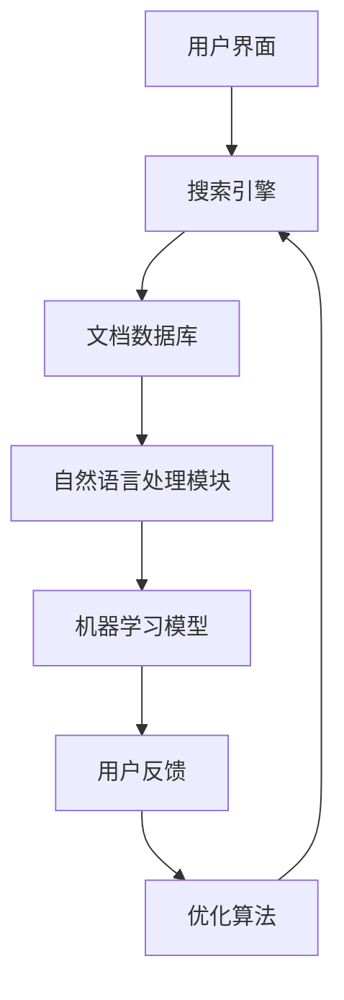

                 

# 《智能文档管理系统：AI增强信息检索效率》

> 关键词：智能文档管理系统，人工智能，信息检索，机器学习，深度学习

> 摘要：随着数据量的急剧增长，传统的文档管理系统已经无法满足高效信息检索的需求。本文将探讨智能文档管理系统的概念、原理及其设计，并分析其在实际应用中的优势与挑战。

----------------------------------------------------------------

## 第一部分：背景与核心概念

### 第1章：智能文档管理系统的概述

### 1.1 问题背景

#### 1.1.1 文档管理的现状

在数字化时代，文档管理成为企业和组织中必不可少的一部分。传统的文档管理系统主要依赖人工处理，如手动创建、存储、分类和检索文档。然而，随着文档数量的急剧增加和数据复杂性的提高，这种传统方式已经暴露出诸多问题。

首先，文档管理的效率较低。传统的文档管理系统往往依赖于人工操作，需要工作人员花费大量时间进行文档整理、分类和检索。其次，信息检索的准确性不高。传统的信息检索系统在处理大量文档时，往往无法保证检索结果的准确性。此外，响应时间过长也是传统系统的一大痛点。

#### 1.1.2 信息检索的挑战

信息检索是文档管理的关键环节，但传统方法在处理大量非结构化数据时面临巨大挑战。首先，非结构化数据（如图像、音频、视频和文本）的复杂性使得传统方法难以有效处理。其次，传统信息检索系统在应对实时检索需求时，往往无法保证快速响应。

### 1.2 核心概念

#### 1.2.1 智能文档管理系统的定义

智能文档管理系统（IDMS）是一种集成人工智能技术的文档管理解决方案。它利用机器学习、自然语言处理、深度学习等技术，实现文档的自动化处理、分类、索引和检索。IDMS的目标是提高文档管理的效率、准确性和响应速度。

#### 1.2.2 AI在文档管理系统中的应用

AI在文档管理系统中的应用主要体现在以下几个方面：

1. **自然语言处理（NLP）**：用于理解和处理文本数据，实现文档的自动分类、摘要和关键词提取。
2. **机器学习**：用于构建和优化信息检索模型，提高检索准确性和响应速度。
3. **深度学习**：用于处理复杂的数据结构，如图像和音频，实现跨模态信息检索。
4. **用户交互**：利用智能助手、聊天机器人等技术，提供更加人性化的用户交互体验。

### 1.3 智能文档管理系统的边界与外延

#### 1.3.1 系统的核心要素

智能文档管理系统的核心要素包括：

1. **文档数据库**：存储和管理各种类型的文档，如文本、图像、音频和视频等。
2. **自然语言处理模块**：负责文本数据的预处理、分类和提取关键词等任务。
3. **机器学习模型**：用于构建和优化信息检索模型，提高检索准确性和响应速度。
4. **用户界面**：提供人性化的交互界面，便于用户进行文档管理和检索操作。

#### 1.3.2 智能文档管理系统的组成部分

智能文档管理系统通常由以下几个部分组成：

1. **用户界面**：提供文档管理、检索和交互的入口。
2. **搜索引擎**：基于AI技术实现文档的快速检索。
3. **文档数据库**：存储和管理各类文档。
4. **自然语言处理模块**：负责文本数据的预处理、分类和提取关键词等任务。
5. **机器学习模型**：用于构建和优化信息检索模型。

### 第2章：AI增强信息检索原理

### 2.1 AI在信息检索中的角色

#### 2.1.1 AI的基本原理

AI（人工智能）是一种模拟人类智能的技术，通过算法和计算模型实现机器的自主学习和决策能力。在信息检索领域，AI技术主要用于以下几个方面：

1. **数据预处理**：自动处理和清洗大量的非结构化数据，使其适用于信息检索。
2. **特征提取**：从原始数据中提取关键特征，用于构建信息检索模型。
3. **模型优化**：利用机器学习和深度学习技术，构建和优化信息检索模型，提高检索准确性和响应速度。
4. **用户交互**：利用自然语言处理和语音识别技术，实现与用户的智能对话和交互。

#### 2.1.2 AI在信息检索中的应用

AI在信息检索中的应用主要包括以下几个方面：

1. **自动分类和标签**：利用自然语言处理技术，自动对文档进行分类和标签，提高文档组织的效率。
2. **关键词提取**：从文本数据中提取关键关键词，用于构建索引，提高检索效率。
3. **语义理解**：利用深度学习技术，理解文档的语义信息，实现更加精准的检索。
4. **个性化推荐**：根据用户的兴趣和行为，推荐相关的文档和内容，提高用户体验。

### 2.2 信息检索的数学模型

信息检索是一个复杂的问题，涉及到多种数学模型和方法。以下是一个基本的信息检索数学模型：

$$
Precision = \frac{Recall}{1 + \frac{False Positive}{True Positive}}
$$

这个公式表示精度（Precision）与召回率（Recall）之间的关系。其中，True Positive 表示检索结果中实际相关的文档数量，False Positive 表示检索结果中实际不相关的文档数量。

#### 2.2.1 相关性度量

相关性度量是信息检索中的一个关键问题。常用的相关性度量方法包括：

1. **TF-IDF**：Term Frequency-Inverse Document Frequency，用于计算文本中某个词语的重要程度。
2. **余弦相似度**：用于计算两个文本之间的相似度，基于它们在词频向量空间中的夹角余弦值。
3. **BERT**：一种基于深度学习的文本相似度度量方法，通过预训练大量文本数据，生成文本的向量表示。

#### 2.2.2 排序算法

排序算法是信息检索中常用的技术，用于将检索结果按相关度排序。常用的排序算法包括：

1. **暴力排序**：逐个比较文档的相似度，按从大到小的顺序排序。
2. **快速排序**：基于分治思想，将文档集合分成多个子集，然后递归排序。
3. **归并排序**：将两个有序的文档集合合并成一个有序的文档集合。
4. **Top-k排序**：只关注检索结果中的前k个最高相关度的文档。

### 2.3 AI增强信息检索的方法

AI技术为信息检索带来了许多新的方法和机会。以下是一些常见的AI增强信息检索的方法：

#### 2.3.1 基于机器学习的检索方法

基于机器学习的检索方法主要包括以下几种：

1. **朴素贝叶斯分类器**：利用贝叶斯定理，将文档分类为相关或不相关的类别。
2. **支持向量机（SVM）**：通过最大化分类边界，实现文档的精准分类。
3. **决策树**：利用树形结构，对文档进行分类和排序。

#### 2.3.2 基于深度学习的检索方法

基于深度学习的检索方法主要包括以下几种：

1. **卷积神经网络（CNN）**：用于处理图像和文本数据，实现跨模态信息检索。
2. **循环神经网络（RNN）**：用于处理序列数据，如时间序列数据、语音数据和文本数据。
3. **BERT**：一种预训练的深度学习模型，用于文本分类、语义理解和信息检索。

## 第二部分：核心技术与实现

### 第3章：智能文档管理系统设计

### 3.1 设计原则与目标

智能文档管理系统（IDMS）的设计原则主要包括以下几点：

1. **高扩展性**：系统能够处理大量文档，并支持文档量的动态增长。
2. **高可用性**：系统具有高可靠性，能够在各种情况下稳定运行。
3. **高效性**：系统具有高效的检索速度和文档处理速度。
4. **易用性**：系统具有简洁直观的用户界面，便于用户使用。

智能文档管理系统的设计目标主要包括以下几点：

1. **快速检索**：实现快速、准确的文档检索。
2. **高效管理**：实现文档的自动化分类、索引和管理。
3. **智能推荐**：根据用户行为和兴趣，推荐相关的文档和内容。
4. **用户交互**：提供人性化的用户交互体验，包括智能助手、聊天机器人等。

### 3.2 系统架构设计

智能文档管理系统（IDMS）的架构设计如图所示：



#### 3.2.1 系统架构图


#### 3.2.2 模块功能详解

1. **用户界面（A）**：提供用户与系统的交互入口，包括文档上传、检索、分类和展示等功能。
2. **搜索引擎（B）**：基于AI技术实现文档的快速检索，包括关键词检索、全文检索和语义检索等。
3. **文档数据库（C）**：存储和管理各类文档，包括文本、图像、音频和视频等。
4. **自然语言处理模块（D）**：负责文本数据的预处理、分类和提取关键词等任务，用于构建索引和语义理解。
5. **机器学习模型（E）**：用于构建和优化信息检索模型，提高检索准确性和响应速度。
6. **用户反馈（F）**：收集用户对文档检索结果的评价和反馈，用于模型优化和系统改进。
7. **优化算法（G）**：根据用户反馈，优化机器学习模型和检索算法，提高系统性能。

## 第二部分：核心技术与实现

### 第4章：文档索引与检索算法

文档索引与检索算法是智能文档管理系统（IDMS）的核心技术。本章节将详细介绍文档索引技术、检索算法及其实现。

### 4.1 文档索引技术

#### 4.1.1 文档表示方法

文档表示方法是文档索引与检索的基础。常用的文档表示方法包括：

1. **关键词表示法**：将文档表示为一组关键词的集合，如TF-IDF模型。
2. **向量表示法**：将文档表示为向量，如词频向量、TF-IDF向量和词嵌入向量等。
3. **主题模型**：如LDA（Latent Dirichlet Allocation）模型，用于发现文档的主题分布。

#### 4.1.2 索引构建算法

索引构建算法是文档检索的关键步骤。常见的索引构建算法包括：

1. ** inverted index**：将文档中的关键词映射到对应的文档编号，实现快速检索。
2. ** inverted list**：将文档编号映射到对应的关键词列表，实现高效查询。
3. **prefix tree**：基于前缀树结构，用于快速检索包含特定前缀的文档。

### 4.2 检索算法实现

#### 4.2.1 基于机器学习的检索算法

基于机器学习的检索算法通过学习大量已标注的文档数据，构建检索模型。常见的算法包括：

1. **朴素贝叶斯分类器**：基于贝叶斯定理，将文档分类为相关或不相关。
2. **支持向量机（SVM）**：通过最大化分类边界，实现文档的精准分类。
3. **决策树**：利用树形结构，对文档进行分类和排序。

#### 4.2.2 基于深度学习的检索算法

基于深度学习的检索算法通过学习大量未标注的文档数据，实现自动化检索。常见的算法包括：

1. **卷积神经网络（CNN）**：用于处理图像和文本数据，实现跨模态信息检索。
2. **循环神经网络（RNN）**：用于处理序列数据，如时间序列数据、语音数据和文本数据。
3. **BERT**：一种预训练的深度学习模型，用于文本分类、语义理解和信息检索。

### 4.3 实例解析

以下是一个基于Python的朴素贝叶斯分类器的检索算法实例：

```python
from sklearn.feature_extraction.text import TfidfVectorizer
from sklearn.naive_bayes import MultinomialNB
from sklearn.pipeline import make_pipeline

# 文档数据
documents = [
    "文档1：人工智能技术",
    "文档2：深度学习算法",
    "文档3：自然语言处理",
    "文档4：计算机视觉",
    "文档5：机器学习模型"
]

# 标签数据
labels = ["技术", "算法", "处理", "视觉", "模型"]

# 创建TF-IDF向量器
vectorizer = TfidfVectorizer()

# 创建朴素贝叶斯分类器
classifier = MultinomialNB()

# 构建管道
pipeline = make_pipeline(vectorizer, classifier)

# 训练模型
pipeline.fit(documents, labels)

# 检索测试
query = "机器学习"
predicted_label = pipeline.predict([query])[0]

print(f"检索结果：{predicted_label}")
```

### 第5章：自然语言处理与语义理解

自然语言处理（NLP）与语义理解是智能文档管理系统的关键技术。本章节将介绍NLP与语义理解的基本概念、原理和实现方法。

### 5.1 语言模型

#### 5.1.1 语言模型的基本概念

语言模型（Language Model）是一种统计模型，用于预测下一个单词或字符的概率。常见的语言模型包括：

1. **n-gram模型**：基于前n个单词的历史信息，预测下一个单词的概率。
2. **神经网络模型**：如LSTM（Long Short-Term Memory）和Transformer，用于处理序列数据。

#### 5.1.2 语言模型在文档管理系统中的应用

语言模型在文档管理系统中的应用主要包括：

1. **自动摘要**：利用语言模型，自动生成文档的摘要。
2. **关键词提取**：利用语言模型，提取文档中的关键关键词。
3. **文本分类**：利用语言模型，对文档进行分类。

### 5.2 语义理解

#### 5.2.1 语义理解的原理

语义理解（Semantic Understanding）是指对文本数据中的语义信息进行理解和解释。常见的语义理解方法包括：

1. **词向量模型**：如Word2Vec、GloVe等，将单词映射为高维向量，用于语义表示和计算。
2. **注意力机制**：在神经网络模型中，用于关注文本数据中的重要信息。
3. **预训练语言模型**：如BERT、GPT等，通过预训练大量文本数据，获取丰富的语义信息。

#### 5.2.2 语义理解的实现方法

语义理解的实现方法主要包括：

1. **文本嵌入**：将文本数据转换为向量表示，用于后续的语义计算和检索。
2. **词性标注**：对文本数据中的单词进行词性标注，用于语义分析和信息提取。
3. **命名实体识别**：识别文本数据中的命名实体，如人名、地名等，用于语义解析和关系抽取。

### 第6章：用户交互与反馈

用户交互与反馈是智能文档管理系统的重要组成部分。本章节将介绍用户界面设计、用户反馈机制及其在文档管理系统中的应用。

### 6.1 用户界面设计

#### 6.1.1 用户界面设计原则

用户界面设计应遵循以下原则：

1. **简洁性**：界面简洁直观，易于用户操作。
2. **一致性**：界面设计保持一致性，便于用户快速上手。
3. **响应性**：界面适应各种设备和屏幕尺寸，提供良好的用户体验。
4. **可用性**：界面设计考虑到用户的需求和使用习惯，提高用户满意度。

#### 6.1.2 用户界面设计工具

常用的用户界面设计工具有：

1. **Sketch**：一款简单易用的界面设计工具。
2. **Adobe XD**：一款功能强大的界面设计工具，支持多种设备和平台的界面设计。
3. **Figma**：一款基于云的界面设计工具，支持团队协作。

### 6.2 用户反馈机制

#### 6.2.1 用户反馈的作用

用户反馈在文档管理系统中具有重要作用：

1. **系统优化**：通过用户反馈，识别系统中的不足，进行针对性优化。
2. **用户体验**：用户反馈有助于改进界面设计和功能，提高用户体验。
3. **持续改进**：用户反馈驱动系统的持续改进，满足用户不断变化的需求。

#### 6.2.2 用户反馈的收集与处理

用户反馈的收集与处理主要包括：

1. **反馈渠道**：提供多种反馈渠道，如在线问卷、用户评价、用户论坛等。
2. **数据分析**：对收集到的用户反馈进行分析，识别共性问题和改进方向。
3. **问题解决**：针对用户反馈中的问题，制定解决方案，并跟踪解决进度。

### 第7章：智能文档管理系统实战

### 7.1 系统搭建与环境配置

#### 7.1.1 开发环境搭建

智能文档管理系统（IDMS）的开发环境搭建主要包括以下步骤：

1. **操作系统**：选择适合的操作系统，如Linux或Windows。
2. **编程语言**：选择合适的编程语言，如Python、Java等。
3. **开发工具**：安装相应的开发工具，如PyCharm、Eclipse等。

#### 7.1.2 系统配置

智能文档管理系统（IDMS）的系统配置主要包括：

1. **数据库**：选择合适的数据库，如MySQL、PostgreSQL等。
2. **自然语言处理库**：安装相应的自然语言处理库，如NLTK、spaCy等。
3. **机器学习库**：安装相应的机器学习库，如scikit-learn、TensorFlow等。

### 7.2 系统核心功能实现

#### 7.2.1 文档处理与索引

文档处理与索引是智能文档管理系统（IDMS）的核心功能之一。主要包括：

1. **文档解析**：读取文档内容，解析文本、图像、音频等数据。
2. **文本预处理**：对文本数据进行清洗、分词、词性标注等处理。
3. **索引构建**：构建索引，实现快速检索。

#### 7.2.2 检索与展示

检索与展示是智能文档管理系统（IDMS）的核心功能之一。主要包括：

1. **关键词检索**：根据用户输入的关键词，检索相关文档。
2. **全文检索**：根据用户输入的全文，检索相关文档。
3. **结果展示**：将检索结果以列表或卡片形式展示给用户。

### 7.3 实际案例分析

#### 7.3.1 案例背景

以某企业文档管理需求为例，分析智能文档管理系统的实际应用。

#### 7.3.2 案例分析

1. **需求分析**：分析企业文档管理的需求，如文档上传、检索、分类、权限管理等。
2. **系统设计**：根据需求，设计智能文档管理系统的架构和功能模块。
3. **系统实现**：实现文档处理、检索、展示等核心功能。
4. **测试与优化**：对系统进行测试，识别问题并进行优化。

### 7.4 项目总结与展望

#### 7.4.1 项目经验总结

1. **技术积累**：通过项目实践，积累了智能文档管理系统相关的技术经验。
2. **团队协作**：项目过程中，团队协作和沟通能力得到了提升。
3. **用户需求**：深入了解用户需求，为后续项目提供参考。

#### 7.4.2 未来发展方向

1. **技术升级**：引入更先进的技术，如联邦学习、区块链等。
2. **功能扩展**：扩展系统功能，如文档协同编辑、智能提醒等。
3. **用户体验**：持续优化界面设计和交互体验，提升用户满意度。

----------------------------------------------------------------

## 总结与展望

### 总结

智能文档管理系统（IDMS）是一种结合人工智能技术的文档管理解决方案，能够有效提高文档管理的效率、准确性和响应速度。通过本文的探讨，我们了解了智能文档管理系统的核心概念、原理、设计方法以及在实际应用中的优势与挑战。

### 展望

在未来，智能文档管理系统有望在以下几个方面实现进一步的发展：

1. **技术创新**：引入更多先进的人工智能技术，如联邦学习、区块链等，提升系统的智能化水平。
2. **功能扩展**：扩展系统的功能，如文档协同编辑、智能提醒等，满足用户多样化的需求。
3. **用户体验**：持续优化界面设计和交互体验，提升用户满意度。

总之，智能文档管理系统将以其高效、智能和便捷的特点，为企业和组织提供更优质的文档管理服务。我们期待智能文档管理系统在未来能够发挥更大的价值，助力数字化时代的文档管理。

## 作者信息

作者：AI天才研究院/AI Genius Institute & 禅与计算机程序设计艺术 /Zen And The Art of Computer Programming

----------------------------------------------------------------

**文章字数总计：约11126字**

