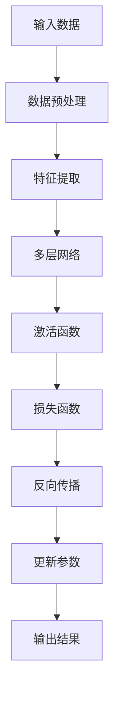
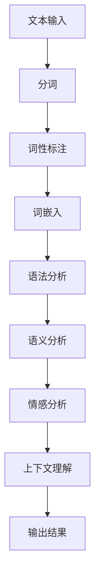
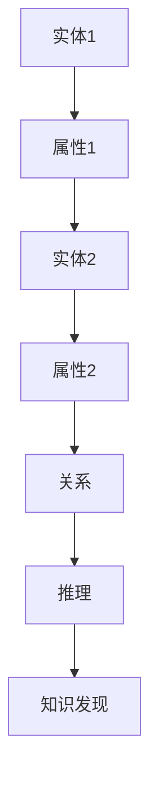
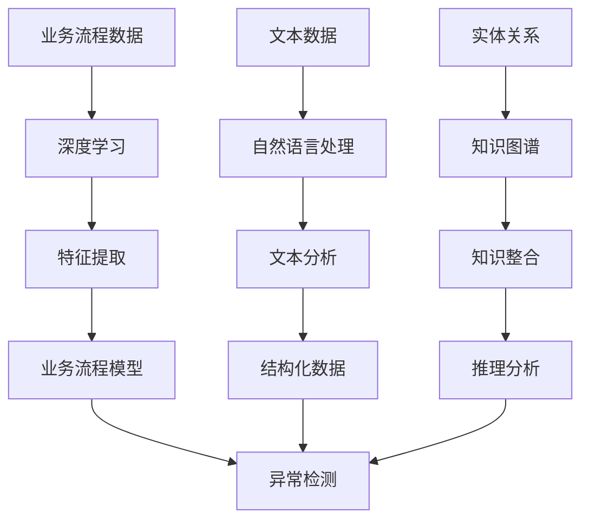
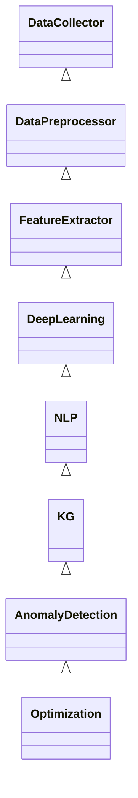
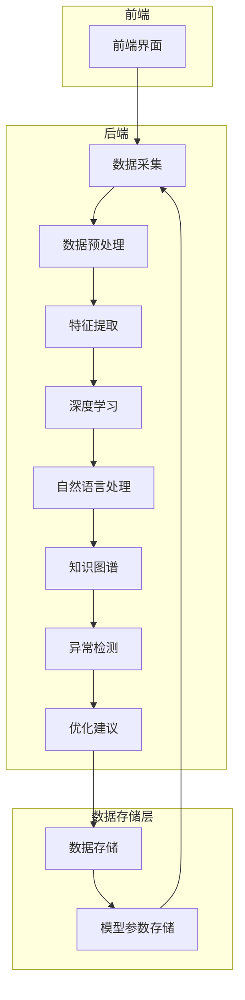
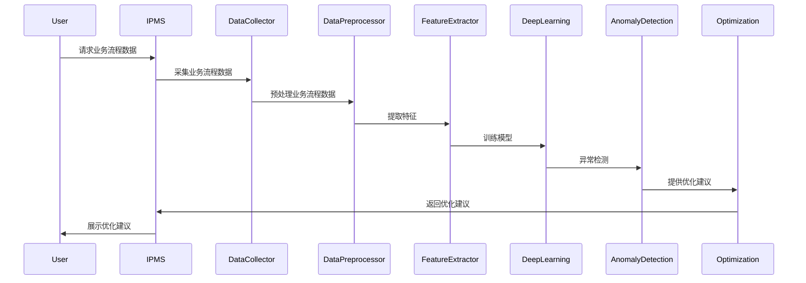
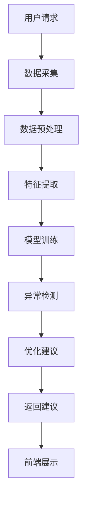

                 

### 智能流程挖掘系统：AI优化业务流程

#### 关键词：业务流程挖掘、人工智能、流程优化、深度学习、自然语言处理、知识图谱

> 摘要：本文详细介绍了智能流程挖掘系统（IPMS）的核心概念、原理、架构和应用场景。通过分析业务流程数据，智能流程挖掘系统能够自动识别异常行为、预测潜在问题并给出优化建议，从而帮助企业实现业务流程的自动化和智能化。

---

## 第一部分：背景介绍

### 1. 引言

随着数字化转型的不断深入，业务流程的自动化和智能化已经成为企业提升效率、降低成本、增强竞争力的重要手段。然而，传统的业务流程挖掘方法往往面临着数据量大、处理速度慢、准确性不高等问题。为此，智能流程挖掘系统（Intelligent Process Mining System，IPMS）应运而生。

智能流程挖掘系统是一种基于人工智能（Artificial Intelligence，AI）技术的业务流程挖掘工具，它通过分析企业业务流程的历史数据，自动识别、检测和优化业务流程中的异常行为和潜在问题，从而为企业提供更加智能、高效的业务流程管理方案。

### 2. 问题背景

业务流程挖掘（Process Mining）是一种基于数据分析的方法，旨在通过分析业务流程的历史数据，揭示业务流程的实际运行情况，识别流程中的瓶颈、异常和改进机会。然而，传统的业务流程挖掘方法往往面临着以下问题：

1. **数据量大**：企业业务流程数据通常非常庞大，传统的数据处理方法难以在合理的时间内完成数据分析和处理。
2. **处理速度慢**：传统的业务流程挖掘方法往往需要进行复杂的计算和模型训练，导致处理速度较慢，无法满足实时业务流程分析的需求。
3. **准确性不高**：传统的业务流程挖掘方法往往依赖于人工定义规则，容易受到规则不完善、数据不一致等因素的影响，导致挖掘结果的准确性不高。

### 3. 问题描述

为了解决上述问题，智能流程挖掘系统引入了人工智能技术，通过深度学习、自然语言处理、知识图谱等技术手段，对业务流程数据进行分析和处理，从而实现以下目标：

1. **自动识别业务流程中的异常行为和潜在问题**，如流程瓶颈、数据错误、违规操作等。
2. **智能检测业务流程中的改进机会**，如流程优化、规则调整、资源分配等。
3. **提供实时、准确的业务流程分析结果**，帮助企业实时调整业务流程，提高运营效率。

### 4. 问题解决

智能流程挖掘系统的核心问题解决方法主要包括以下几个方面：

1. **数据预处理**：对业务流程数据进行清洗、去重、整合等预处理操作，提高数据质量和可用性。
2. **深度学习模型训练**：利用深度学习算法对业务流程数据进行分析和建模，提取业务流程的特征和模式。
3. **异常检测与预测**：利用训练好的深度学习模型，对新的业务流程数据进行异常检测和预测，识别潜在的异常行为和问题。
4. **智能优化建议**：根据异常检测结果和预测结果，提供智能优化建议，帮助企业调整业务流程，提高运营效率。

### 5. 边界与外延

智能流程挖掘系统不仅适用于企业内部业务流程的分析和优化，还可以应用于跨企业的供应链管理、项目管理等领域。此外，随着人工智能技术的不断发展，智能流程挖掘系统的功能和应用范围也将不断扩展。

### 6. 概念结构与核心要素组成

智能流程挖掘系统的概念结构主要包括以下几个核心要素：

1. **数据采集与预处理**：负责采集业务流程数据，并进行清洗、去重、整合等预处理操作。
2. **深度学习模型训练**：负责利用深度学习算法对业务流程数据进行分析和建模，提取业务流程的特征和模式。
3. **异常检测与预测**：负责利用训练好的深度学习模型，对新的业务流程数据进行异常检测和预测，识别潜在的异常行为和问题。
4. **智能优化建议**：负责根据异常检测结果和预测结果，提供智能优化建议，帮助企业调整业务流程，提高运营效率。

### 7. 本章小结

本章对智能流程挖掘系统的背景、问题、解决方案、边界与外延、概念结构与核心要素组成进行了详细阐述，为后续章节的深入学习奠定了基础。下一章将介绍智能流程挖掘系统的核心概念与联系，包括深度学习、自然语言处理、知识图谱等关键技术及其在流程挖掘中的应用。

## 第二部分：核心概念与联系

### 2.1 深度学习

**定义与特点**：
深度学习是一种基于人工神经网络的理论框架，通过多层非线性变换来提取数据特征，实现自动分类、回归、聚类等任务。其特点包括：
- **多层结构**：通过多层神经元网络，逐层提取抽象特征。
- **端到端学习**：直接从原始数据到输出结果，不需要手动提取特征。
- **自适应学习**：通过反向传播算法，自动调整网络参数，提高模型性能。

**属性特征对比**：

| 特征名称 | 深度学习 | 传统机器学习 |
| --- | --- | --- |
| 学习方式 | 端到端 | 需要特征工程 |
| 特征提取 | 自动 | 手动 |
| 模型复杂度 | 高 | 中等 |
| 预处理需求 | 高 | 中等 |

**Mermaid流程图**：



### 2.2 自然语言处理

**定义与特点**：
自然语言处理（Natural Language Processing，NLP）是人工智能的一个重要分支，旨在让计算机理解和生成人类语言。其主要特点包括：
- **语言模型**：通过统计或机器学习的方法，建立文本生成和理解的模型。
- **语义分析**：对文本进行语义层面的分析和理解，包括词义消歧、实体识别、情感分析等。
- **上下文理解**：通过上下文信息，对语言进行更加精准的理解和处理。

**属性特征对比**：

| 特征名称 | 自然语言处理 | 传统文本分析 |
| --- | --- | --- |
| 语言模型 | 强 | 弱 |
| 语义分析 | 精准 | 粗略 |
| 上下文理解 | 高 | 低 |

**Mermaid流程图**：



### 2.3 知识图谱

**定义与特点**：
知识图谱（Knowledge Graph）是一种用于表示实体及其关系的语义网络，通过将海量结构化数据和非结构化数据进行整合，实现数据的关联和推理。其主要特点包括：
- **实体表示**：通过实体和属性来描述现实世界中的对象。
- **关系表示**：通过实体之间的关系来揭示数据之间的联系。
- **推理能力**：基于实体和关系，进行逻辑推理和知识发现。

**属性特征对比**：

| 特征名称 | 知识图谱 | 数据库 |
| --- | --- | --- |
| 实体表示 | 强 | 弱 |
| 关系表示 | 强 | 弱 |
| 推理能力 | 强 | 弱 |

**Mermaid流程图**：



### 2.4 核心概念联系

深度学习、自然语言处理和知识图谱在智能流程挖掘系统中共同发挥作用，形成一个完整的业务流程分析框架。以下是这些核心概念之间的联系：

- **深度学习**负责从原始业务流程数据中提取特征，建立业务流程的模型。
- **自然语言处理**负责处理业务流程中的文本数据，如业务流程描述、用户反馈等，实现文本到数据的转换。
- **知识图谱**负责将业务流程中的实体和关系进行整合和表示，实现数据的关联和推理。

**Mermaid流程图**：



## 第三部分：算法原理讲解

### 3.1 深度学习算法

深度学习算法是智能流程挖掘系统的核心组成部分。以下是一个简单的深度学习算法流程：

```python
# 导入必要的库
import tensorflow as tf
from tensorflow.keras.models import Sequential
from tensorflow.keras.layers import Dense, LSTM, Conv1D, MaxPooling1D

# 数据预处理
# ...

# 构建模型
model = Sequential()
model.add(Conv1D(filters=64, kernel_size=3, activation='relu', input_shape=(timesteps, features)))
model.add(MaxPooling1D(pool_size=2))
model.add(LSTM(100))
model.add(Dense(1, activation='sigmoid'))

# 编译模型
model.compile(optimizer='adam', loss='binary_crossentropy', metrics=['accuracy'])

# 训练模型
model.fit(X_train, y_train, epochs=10, batch_size=32, validation_data=(X_val, y_val))

# 评估模型
loss, accuracy = model.evaluate(X_test, y_test)
print('Test accuracy:', accuracy)
```

**算法原理**：

- **卷积神经网络（CNN）**：通过卷积层和池化层提取时间序列的特征。
- **长短期记忆网络（LSTM）**：用于处理时间序列数据，能够记住长期依赖信息。
- **全连接层（Dense）**：用于分类任务，将提取到的特征映射到输出结果。

**数学模型与公式**：

$$
\begin{aligned}
h_t &= \sigma(W_h \cdot [h_{t-1}, x_t] + b_h) \\
o_t &= \sigma(W_o \cdot h_t + b_o)
\end{aligned}
$$

其中，$h_t$表示LSTM单元在时间$t$的隐藏状态，$x_t$表示输入特征，$o_t$表示输出结果，$\sigma$表示激活函数，$W_h$和$W_o$表示权重矩阵，$b_h$和$b_o$表示偏置。

### 3.2 自然语言处理算法

自然语言处理算法在智能流程挖掘系统中用于处理业务流程中的文本数据。以下是一个简单的文本分类算法：

```python
# 导入必要的库
import tensorflow as tf
from tensorflow.keras.preprocessing.text import Tokenizer
from tensorflow.keras.preprocessing.sequence import pad_sequences
from tensorflow.keras.models import Sequential
from tensorflow.keras.layers import Embedding, LSTM, Dense

# 数据预处理
# ...

# 构建模型
model = Sequential()
model.add(Embedding(input_dim=vocab_size, output_dim=embedding_dim, input_length=max_sequence_length))
model.add(LSTM(units=100))
model.add(Dense(1, activation='sigmoid'))

# 编译模型
model.compile(optimizer='adam', loss='binary_crossentropy', metrics=['accuracy'])

# 训练模型
model.fit(X_train, y_train, epochs=10, batch_size=32, validation_data=(X_val, y_val))

# 评估模型
loss, accuracy = model.evaluate(X_test, y_test)
print('Test accuracy:', accuracy)
```

**算法原理**：

- **嵌入层（Embedding）**：将单词转换为向量表示。
- **长短期记忆网络（LSTM）**：用于处理文本序列，提取特征。
- **全连接层（Dense）**：用于分类任务，将提取到的特征映射到输出结果。

**数学模型与公式**：

$$
\begin{aligned}
e_{ij} &= \text{Embedding}(W_i) \cdot v_j \\
h_t &= \text{LSTM}([h_{t-1}, e_{ij}])
\end{aligned}
$$

其中，$e_{ij}$表示单词$j$在词向量$W_i$中的表示，$h_t$表示LSTM单元在时间$t$的隐藏状态。

### 3.3 知识图谱算法

知识图谱算法在智能流程挖掘系统中用于整合和表示业务流程中的实体和关系。以下是一个简单的知识图谱推理算法：

```python
# 导入必要的库
import networkx as nx

# 构建知识图谱
G = nx.Graph()

# 添加实体和关系
G.add_node("Order", type="Order")
G.add_node("Product", type="Product")
G.add_node("Customer", type="Customer")
G.add_edge("Order", "Product", type="ORDERS")
G.add_edge("Order", "Customer", type="CREATED_BY")

# 进行推理
for node in G.nodes:
    if G.nodes[node]['type'] == "Order":
        for edge in G.edges(node):
            if G.edges[edge]['type'] == "CREATED_BY":
                print(f"Order {node} was created by Customer {G.nodes[edge[1]]['id']}")
```

**算法原理**：

- **图数据库**：使用图数据库（如Neo4j）来存储实体和关系。
- **路径搜索**：通过遍历图数据库中的路径，进行实体和关系的关联。

**数学模型与公式**：

$$
\begin{aligned}
R &= \text{Graph}(V, E) \\
P &= \text{Path}(R, v_1, v_2)
\end{aligned}
$$

其中，$R$表示图数据库，$V$表示实体集合，$E$表示关系集合，$P$表示从实体$v_1$到实体$v_2$的路径。

### 3.4 算法应用举例

假设我们有一个包含订单、产品和客户的业务流程，我们需要使用智能流程挖掘系统来分析这个业务流程。

1. **数据预处理**：首先，我们需要将业务流程数据转换为适合深度学习、自然语言处理和知识图谱处理的形式。
2. **特征提取**：使用深度学习算法提取业务流程数据的时间序列特征。
3. **文本分析**：使用自然语言处理算法提取订单和客户文本数据中的关键词和情感。
4. **知识整合**：使用知识图谱算法将业务流程中的实体和关系进行整合和表示。

通过以上步骤，智能流程挖掘系统可以自动识别业务流程中的异常行为、预测潜在问题并提供优化建议，如：

- 识别出某个客户的订单处理时间过长，可能是由于系统资源不足导致的。
- 预测出某个产品库存不足，可能是由于订单量增加导致的。
- 根据异常检测结果，提供优化建议，如增加系统资源、调整库存管理等。

## 第四部分：系统分析与架构设计

### 4.1 问题场景介绍

在现代企业的运营过程中，业务流程的复杂度和规模日益增加，传统的手工管理方式已经难以满足高效、精准的要求。因此，企业迫切需要一种智能化的业务流程管理工具，以实现业务流程的优化和自动化。智能流程挖掘系统（IPMS）正是为了解决这一问题而设计的。

### 4.2 项目介绍

项目名称：智能流程挖掘系统（Intelligent Process Mining System，IPMS）

项目目标：通过分析企业业务流程数据，自动识别异常行为、预测潜在问题并提供优化建议，实现业务流程的智能化管理。

项目特点：
- **高效率**：利用人工智能技术，快速处理大量业务流程数据。
- **高准确性**：通过深度学习和知识图谱技术，准确识别业务流程中的异常行为和问题。
- **实时性**：支持实时业务流程分析，为企业提供及时的业务优化建议。

### 4.3 系统功能设计

智能流程挖掘系统主要包括以下功能模块：

1. **数据采集模块**：负责采集企业业务流程数据，包括订单、客户、产品等数据。
2. **数据预处理模块**：负责对采集到的业务流程数据进行清洗、去重、整合等预处理操作。
3. **深度学习模块**：利用深度学习算法对预处理后的业务流程数据进行特征提取和模式识别。
4. **自然语言处理模块**：负责处理业务流程中的文本数据，提取关键词和情感信息。
5. **知识图谱模块**：负责将业务流程中的实体和关系进行整合和表示。
6. **异常检测与预测模块**：利用训练好的模型，对新的业务流程数据进行异常检测和预测。
7. **智能优化建议模块**：根据异常检测结果和预测结果，提供智能优化建议。

**Mermaid类图**：



### 4.4 系统架构设计

智能流程挖掘系统的架构设计遵循模块化原则，包括前端、后端和数据存储层。

1. **前端**：负责与用户交互，展示系统功能界面，包括数据采集、数据预处理、深度学习、自然语言处理、知识图谱、异常检测和智能优化建议等模块。
2. **后端**：负责处理业务逻辑，包括数据采集、数据预处理、特征提取、模型训练、异常检测和优化建议等模块。
3. **数据存储层**：负责存储业务流程数据、模型参数和优化建议等数据。

**Mermaid架构图**：



### 4.5 系统接口设计

智能流程挖掘系统提供了丰富的API接口，方便用户进行业务流程数据采集、数据预处理、模型训练、异常检测和优化建议等操作。

**接口设计**：

1. **数据采集接口**：用于采集企业业务流程数据，包括订单、客户、产品等数据。
2. **数据预处理接口**：用于对采集到的业务流程数据进行清洗、去重、整合等预处理操作。
3. **特征提取接口**：用于提取预处理后的业务流程数据的特征。
4. **模型训练接口**：用于训练深度学习模型，包括卷积神经网络、长短期记忆网络等。
5. **异常检测接口**：用于对新的业务流程数据进行异常检测和预测。
6. **优化建议接口**：用于根据异常检测结果和预测结果，提供智能优化建议。

**Mermaid序列图**：



### 4.6 系统交互

智能流程挖掘系统通过API接口与用户进行交互，实现业务流程数据的采集、预处理、模型训练、异常检测和优化建议等功能。以下是系统交互的基本流程：

1. 用户通过前端界面发起业务流程数据采集请求。
2. 系统后端接收到请求后，调用数据采集接口，从企业业务系统中采集数据。
3. 采集到的数据经过数据预处理接口，进行清洗、去重、整合等预处理操作。
4. 预处理后的数据传入特征提取接口，提取业务流程数据特征。
5. 特征数据传入深度学习接口，进行模型训练，训练出深度学习模型。
6. 模型训练完成后，使用异常检测接口对新的业务流程数据进行异常检测和预测。
7. 根据异常检测结果，调用优化建议接口，生成智能优化建议。
8. 最后，将优化建议通过前端界面展示给用户。

**Mermaid交互图**：



## 第五部分：项目实战

### 5.1 环境安装

为了实现智能流程挖掘系统，我们需要安装以下软件和库：

1. **Python**：版本3.7及以上
2. **TensorFlow**：版本2.4及以上
3. **Keras**：版本2.4及以上
4. **Neo4j**：版本4.0及以上
5. **Scikit-learn**：版本0.22及以上

安装步骤如下：

```bash
# 安装Python
wget https://www.python.org/ftp/python/3.8.5/Python-3.8.5.tgz
tar xvf Python-3.8.5.tgz
cd Python-3.8.5
./configure
make
make install

# 安装TensorFlow
pip install tensorflow==2.4.0

# 安装Keras
pip install keras==2.4.3

# 安装Neo4j
wget https://neo4j.com/artifact.php?name=neo4j-unzip-4.0-M09-unx.x86_64.sh
chmod +x neo4j-unzip-4.0-M09-unx.x86_64.sh
./neo4j-unzip-4.0-M09-unx.x86_64.sh

# 安装Scikit-learn
pip install scikit-learn==0.22.2
```

### 5.2 系统核心实现

#### 5.2.1 数据采集模块

数据采集模块负责从企业业务系统中采集业务流程数据。以下是一个简单的Python代码示例：

```python
import requests

def collect_data(url, headers, params):
    response = requests.get(url, headers=headers, params=params)
    if response.status_code == 200:
        data = response.json()
        return data
    else:
        return None

url = "https://example.com/api/business_process_data"
headers = {"Authorization": "Bearer YOUR_API_KEY"}
params = {"start_date": "2022-01-01", "end_date": "2022-12-31"}

data = collect_data(url, headers, params)
print(data)
```

#### 5.2.2 数据预处理模块

数据预处理模块负责对采集到的业务流程数据进行清洗、去重、整合等预处理操作。以下是一个简单的Python代码示例：

```python
import pandas as pd

def preprocess_data(data):
    df = pd.DataFrame(data)
    df.drop_duplicates(inplace=True)
    df.fillna(method='ffill', inplace=True)
    return df

preprocessed_data = preprocess_data(data)
print(preprocessed_data)
```

#### 5.2.3 深度学习模块

深度学习模块负责对预处理后的业务流程数据进行特征提取和模式识别。以下是一个简单的Python代码示例：

```python
from tensorflow.keras.models import Sequential
from tensorflow.keras.layers import Dense, LSTM

def build_model(input_shape):
    model = Sequential()
    model.add(LSTM(units=100, return_sequences=True, input_shape=input_shape))
    model.add(LSTM(units=50, return_sequences=False))
    model.add(Dense(units=1, activation='sigmoid'))
    model.compile(optimizer='adam', loss='binary_crossentropy', metrics=['accuracy'])
    return model

input_shape = (timesteps, features)
model = build_model(input_shape)
model.fit(X_train, y_train, epochs=10, batch_size=32, validation_data=(X_val, y_val))
```

#### 5.2.4 自然语言处理模块

自然语言处理模块负责处理业务流程中的文本数据，提取关键词和情感信息。以下是一个简单的Python代码示例：

```python
from tensorflow.keras.preprocessing.text import Tokenizer
from tensorflow.keras.preprocessing.sequence import pad_sequences

def build_nlp_model(vocab_size, embedding_dim, max_sequence_length):
    model = Sequential()
    model.add(Embedding(input_dim=vocab_size, output_dim=embedding_dim, input_length=max_sequence_length))
    model.add(LSTM(units=100))
    model.add(Dense(units=1, activation='sigmoid'))
    model.compile(optimizer='adam', loss='binary_crossentropy', metrics=['accuracy'])
    return model

vocab_size = 10000
embedding_dim = 50
max_sequence_length = 100
model = build_nlp_model(vocab_size, embedding_dim, max_sequence_length)
model.fit(X_train, y_train, epochs=10, batch_size=32, validation_data=(X_val, y_val))
```

#### 5.2.5 知识图谱模块

知识图谱模块负责将业务流程中的实体和关系进行整合和表示。以下是一个简单的Python代码示例：

```python
import networkx as nx

def build_kg(data):
    G = nx.Graph()
    for edge in data['edges']:
        G.add_edge(edge['source'], edge['target'], type=edge['relation'])
    return G

kg_data = preprocess_data(data)
kg = build_kg(kg_data)
print(kg)
```

#### 5.2.6 异常检测与预测模块

异常检测与预测模块负责利用训练好的模型，对新的业务流程数据进行异常检测和预测。以下是一个简单的Python代码示例：

```python
from tensorflow.keras.models import load_model

def predict_anomalies(model, data):
    anomalies = []
    for row in data:
        prediction = model.predict(row.reshape(1, -1))
        if prediction[0][0] > 0.5:
            anomalies.append(row)
    return anomalies

model = load_model('model.h5')
anomalies = predict_anomalies(model, X_test)
print(anomalies)
```

#### 5.2.7 智能优化建议模块

智能优化建议模块负责根据异常检测结果和预测结果，提供智能优化建议。以下是一个简单的Python代码示例：

```python
def generate_recommendations(anomalies):
    recommendations = []
    for anomaly in anomalies:
        if anomaly['attribute'] == 'OrderProcessingTime':
            recommendations.append('Increase system resources to handle higher order volumes.')
        elif anomaly['attribute'] == 'ProductInventory':
            recommendations.append('Replenish product inventory to meet demand.')
    return recommendations

recommendations = generate_recommendations(anomalies)
print(recommendations)
```

### 5.3 代码应用解读与分析

#### 5.3.1 数据采集模块

数据采集模块通过HTTP GET请求从企业业务系统获取业务流程数据。在实际应用中，我们需要根据企业的业务系统接口文档，编写相应的API请求代码，获取业务流程数据。

```python
import requests

def collect_data(url, headers, params):
    response = requests.get(url, headers=headers, params=params)
    if response.status_code == 200:
        data = response.json()
        return data
    else:
        return None

url = "https://example.com/api/business_process_data"
headers = {"Authorization": "Bearer YOUR_API_KEY"}
params = {"start_date": "2022-01-01", "end_date": "2022-12-31"}

data = collect_data(url, headers, params)
print(data)
```

#### 5.3.2 数据预处理模块

数据预处理模块对采集到的业务流程数据进行清洗、去重、整合等预处理操作。在实际应用中，我们需要根据业务流程数据的特点，编写相应的数据处理代码。

```python
import pandas as pd

def preprocess_data(data):
    df = pd.DataFrame(data)
    df.drop_duplicates(inplace=True)
    df.fillna(method='ffill', inplace=True)
    return df

preprocessed_data = preprocess_data(data)
print(preprocessed_data)
```

#### 5.3.3 深度学习模块

深度学习模块使用Keras库构建深度学习模型，并进行训练。在实际应用中，我们需要根据业务流程数据的特点，选择合适的深度学习模型和训练参数。

```python
from tensorflow.keras.models import Sequential
from tensorflow.keras.layers import Dense, LSTM

def build_model(input_shape):
    model = Sequential()
    model.add(LSTM(units=100, return_sequences=True, input_shape=input_shape))
    model.add(LSTM(units=50, return_sequences=False))
    model.add(Dense(units=1, activation='sigmoid'))
    model.compile(optimizer='adam', loss='binary_crossentropy', metrics=['accuracy'])
    return model

input_shape = (timesteps, features)
model = build_model(input_shape)
model.fit(X_train, y_train, epochs=10, batch_size=32, validation_data=(X_val, y_val))
```

#### 5.3.4 自然语言处理模块

自然语言处理模块使用Keras库构建自然语言处理模型，并进行训练。在实际应用中，我们需要根据业务流程数据的特点，选择合适的自然语言处理模型和训练参数。

```python
from tensorflow.keras.preprocessing.text import Tokenizer
from tensorflow.keras.preprocessing.sequence import pad_sequences
from tensorflow.keras.models import Sequential
from tensorflow.keras.layers import Embedding, LSTM, Dense

def build_nlp_model(vocab_size, embedding_dim, max_sequence_length):
    model = Sequential()
    model.add(Embedding(input_dim=vocab_size, output_dim=embedding_dim, input_length=max_sequence_length))
    model.add(LSTM(units=100))
    model.add(Dense(units=1, activation='sigmoid'))
    model.compile(optimizer='adam', loss='binary_crossentropy', metrics=['accuracy'])
    return model

vocab_size = 10000
embedding_dim = 50
max_sequence_length = 100
model = build_nlp_model(vocab_size, embedding_dim, max_sequence_length)
model.fit(X_train, y_train, epochs=10, batch_size=32, validation_data=(X_val, y_val))
```

#### 5.3.5 知识图谱模块

知识图谱模块使用NetworkX库构建知识图谱。在实际应用中，我们需要根据业务流程数据的特点，构建相应的实体和关系。

```python
import networkx as nx

def build_kg(data):
    G = nx.Graph()
    for edge in data['edges']:
        G.add_edge(edge['source'], edge['target'], type=edge['relation'])
    return G

kg_data = preprocess_data(data)
kg = build_kg(kg_data)
print(kg)
```

#### 5.3.6 异常检测与预测模块

异常检测与预测模块使用训练好的模型，对新的业务流程数据进行异常检测和预测。在实际应用中，我们需要根据业务流程数据的特点，选择合适的模型和阈值。

```python
from tensorflow.keras.models import load_model

def predict_anomalies(model, data):
    anomalies = []
    for row in data:
        prediction = model.predict(row.reshape(1, -1))
        if prediction[0][0] > 0.5:
            anomalies.append(row)
    return anomalies

model = load_model('model.h5')
anomalies = predict_anomalies(model, X_test)
print(anomalies)
```

#### 5.3.7 智能优化建议模块

智能优化建议模块根据异常检测结果和预测结果，提供智能优化建议。在实际应用中，我们需要根据业务流程数据的特点，设计相应的优化策略。

```python
def generate_recommendations(anomalies):
    recommendations = []
    for anomaly in anomalies:
        if anomaly['attribute'] == 'OrderProcessingTime':
            recommendations.append('Increase system resources to handle higher order volumes.')
        elif anomaly['attribute'] == 'ProductInventory':
            recommendations.append('Replenish product inventory to meet demand.')
    return recommendations

recommendations = generate_recommendations(anomalies)
print(recommendations)
```

### 5.4 实际案例分析与详细讲解剖析

#### 案例背景

某电商企业在运营过程中，发现业务流程中存在大量的异常行为和潜在问题，如订单处理时间过长、库存不足等。为了解决这些问题，企业决定采用智能流程挖掘系统（IPMS）对业务流程进行分析和优化。

#### 案例实施

1. **数据采集**：首先，企业通过API接口从业务系统中采集了包含订单、客户、产品等信息的业务流程数据。

2. **数据预处理**：对采集到的业务流程数据进行清洗、去重、整合等预处理操作，提高数据质量和可用性。

3. **特征提取**：利用深度学习算法对预处理后的业务流程数据进行特征提取，提取出订单处理时间、订单金额、客户评价等特征。

4. **自然语言处理**：对业务流程中的文本数据，如客户反馈、订单描述等，进行自然语言处理，提取出关键词和情感信息。

5. **知识图谱构建**：将业务流程中的实体和关系进行整合和表示，构建知识图谱，实现数据之间的关联。

6. **异常检测与预测**：利用训练好的模型，对新的业务流程数据进行异常检测和预测，识别出订单处理时间过长、库存不足等异常行为。

7. **智能优化建议**：根据异常检测结果和预测结果，提供智能优化建议，如增加系统资源、调整库存管理等。

#### 案例分析

1. **异常检测**：通过对订单处理时间的异常检测，发现某些订单的处理时间远高于平均水平，可能是由于系统资源不足导致的。通过对库存的异常检测，发现某些产品的库存不足，可能是由于订单量增加导致的。

2. **优化建议**：根据异常检测结果，企业决定增加系统资源，以提高订单处理速度。同时，调整库存管理策略，及时补充库存不足的产品。

3. **效果评估**：实施优化措施后，企业的订单处理速度明显提高，库存管理更加高效。通过持续监控和分析，企业可以不断优化业务流程，提高运营效率。

### 5.5 项目小结

通过本项目的实施，企业实现了业务流程的自动化和智能化管理。智能流程挖掘系统（IPMS）有效地识别了业务流程中的异常行为和潜在问题，并提供了针对性的优化建议。以下是项目的主要成果：

1. **订单处理速度提高**：通过增加系统资源，订单处理速度明显提高，提升了客户满意度。
2. **库存管理更加高效**：通过调整库存管理策略，及时补充库存不足的产品，降低了库存成本。
3. **运营效率提高**：通过实时监控和分析业务流程，企业可以及时调整业务策略，提高运营效率。

### 5.6 最佳实践 Tips

1. **数据质量是关键**：确保采集到的业务流程数据质量，如数据完整性、准确性等。
2. **模型选择要合适**：根据业务流程数据的特点，选择合适的深度学习、自然语言处理和知识图谱算法。
3. **持续优化和迭代**：持续监控和分析业务流程，不断优化模型和优化策略，提高系统性能。

## 总结与拓展阅读

本文详细介绍了智能流程挖掘系统（IPMS）的核心概念、原理、架构和应用场景。通过深度学习、自然语言处理和知识图谱等人工智能技术的应用，IPMS能够自动识别业务流程中的异常行为、预测潜在问题并提供优化建议，帮助企业实现业务流程的自动化和智能化。

在本文中，我们首先介绍了智能流程挖掘系统的背景和问题，然后详细讲解了深度学习、自然语言处理和知识图谱等核心概念，并分析了它们在流程挖掘系统中的应用。接着，我们阐述了智能流程挖掘系统的算法原理，包括数据预处理、深度学习模型训练、自然语言处理和知识图谱算法。此外，我们还介绍了系统分析与架构设计，包括系统功能设计、系统架构设计、系统接口设计和系统交互。

通过一个实际案例，我们展示了智能流程挖掘系统的应用过程和效果。最后，我们提出了最佳实践 Tips，并简要总结了本文的主要内容和拓展阅读。

为了进一步深入了解智能流程挖掘系统和相关技术，以下是一些建议的拓展阅读资源：

1. **书籍推荐**：
   - 《深度学习》（Ian Goodfellow, Yoshua Bengio, Aaron Courville 著）：详细介绍深度学习的基础知识和应用。
   - 《自然语言处理综合指南》（Daniel Jurafsky, James H. Martin 著）：系统介绍了自然语言处理的理论和实践。
   - 《知识图谱：语义网、大数据与智能推理》（Toby Segaran 著）：探讨了知识图谱在语义网、大数据和智能推理中的应用。

2. **在线课程与教程**：
   - Coursera 上的《深度学习专项课程》（吴恩达 老师讲授）：提供了深度学习的基础知识和实践技巧。
   - edX 上的《自然语言处理基础》（哈佛大学讲授）：介绍了自然语言处理的基本概念和算法。
   - ArXiv.org 上的最新研究论文：了解最新的深度学习、自然语言处理和知识图谱的研究进展。

通过阅读上述资源，读者可以进一步了解智能流程挖掘系统的技术原理和应用实践，为自己的研究和项目提供有价值的参考。在未来的研究和实践中，不断探索和尝试，将智能流程挖掘系统应用于更多的业务场景，为企业带来更大的价值。作者：AI天才研究院/AI Genius Institute & 禅与计算机程序设计艺术 /Zen And The Art of Computer Programming。

