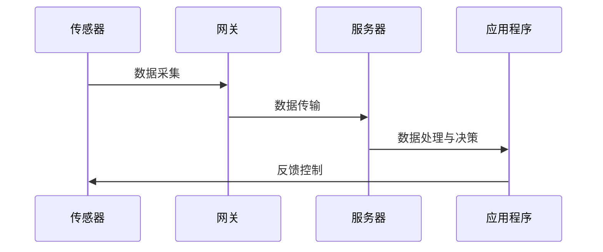
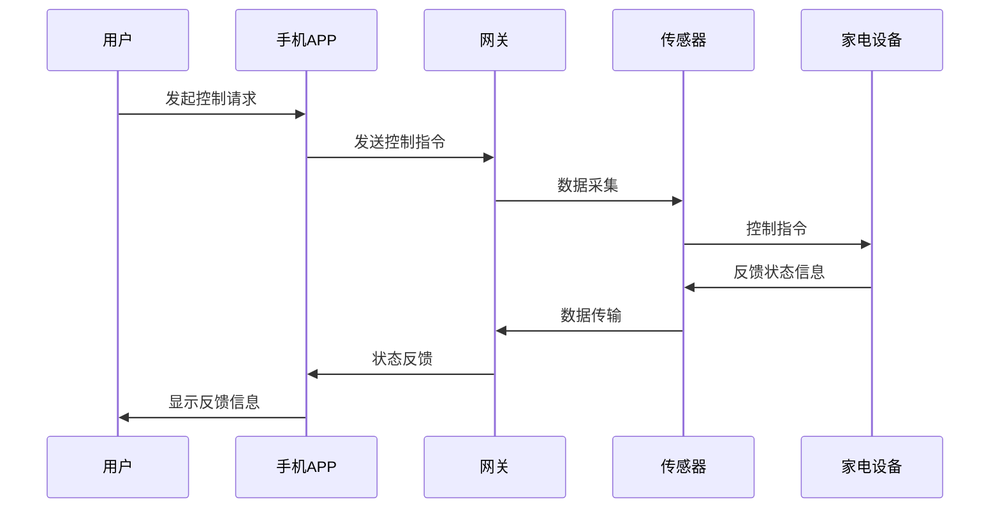

                 

# 智能环境：无处不在的计算与感知

> 关键词：智能环境、无处不在的计算、感知技术、物联网、人工智能、数据处理

> 摘要：本文深入探讨了智能环境的定义、核心概念、技术基础及其应用，详细分析了智能环境中的感知技术，展示了智能环境的未来发展，并通过具体案例进行了实际应用分析。文章旨在为读者提供一个全面、系统的智能环境技术概览，激发对这一领域更深入的探索和研究。

----------------------------------------------------------------

## 引言

### 1.1 问题背景

随着信息技术的飞速发展，人们对于计算和感知的需求日益增长。智能环境作为一种新兴的技术概念，已经在许多领域得到了广泛应用。智能环境旨在通过无处不在的计算和感知技术，实现对人、物、环境的全面感知和智能处理。这一概念的提出，不仅为解决实际问题提供了新的思路，也为未来科技的发展开辟了广阔的空间。

### 1.2 核心概念

**无处不在的计算（Ubiquitous Computing）**：指的是计算技术融入到日常生活的各个方面，实现随时随地的计算服务。

**感知技术（Perception Technology）**：通过传感器等设备获取环境信息，进行数据采集和处理。

### 1.3 文章结构

本文将分为以下几个部分：

1. 智能环境的概述
2. 智能环境的核心概念
3. 智能环境的技术发展
4. 智能环境的架构设计
5. 智能环境的感知技术
6. 智能环境的应用
7. 智能环境的未来趋势
8. 案例分析
9. 总结与展望

## 智能环境的核心概念

### 2.1 无线传感器网络

**概念**：无线传感器网络（Wireless Sensor Networks，WSN）是由大量的传感器节点组成，用于收集、处理和传输环境数据。

**特征对比表格**：

| 特征       | 描述                                                         |
| ---------- | ------------------------------------------------------------ |
| 分布性     | 传感器节点分布在广泛的区域内，实现广泛的数据采集。             |
| 自组织性   | 传感器节点能够自主组成网络，进行数据传输和处理。             |
| 低功耗     | 传感器节点通常采用能量效率高的设计，以延长使用寿命。         |
| 环境适应性 | 传感器节点能够适应不同的环境和条件，保证网络的稳定性。       |

**ER实体关系图架构**：

```mermaid
erDiagram
    User ||--|{ Device }|-- Sensor
    Device ||--|{ Data }|-- DataLogger
```

### 2.2 计算感知一体化

**概念**：计算感知一体化是将计算和感知技术深度融合，实现信息的智能处理。

**技术原理**：

1. 数据采集：通过传感器收集环境数据。
2. 数据处理：在传感器节点或中心服务器上进行数据处理。
3. 智能决策：利用人工智能算法进行决策，实现对环境的智能控制。

### 2.3 智能环境中的数据处理与分析

**大数据处理**：

**概念**：大数据处理是指对大规模数据集进行存储、管理和分析的过程。

**挑战**：

- 数据量巨大：需要高效的数据存储和处理技术。
- 数据多样性：不同类型的数据需要进行不同的处理。
- 实时性要求：需要快速处理数据，以实现实时决策。

**解决方案**：

- 分布式计算：通过分布式计算架构，提高数据处理效率。
- 数据挖掘：利用数据挖掘技术，从海量数据中提取有价值的信息。
- 机器学习：利用机器学习算法，实现数据的智能分析和预测。

## 智能环境的技术基础

### 3.1 历史发展

**3.1.1 无处不在的计算**

- 1999年：马克·魏茨曼提出无处不在的计算概念。
- 2000年：麻省理工学院启动“随身计算”计划。

**3.1.2 智能环境的发展**

- 2003年：首次提出智能环境的概念。
- 2005年：智能环境相关技术开始应用于实际场景。

### 3.2 关键技术

**3.2.1 传感器技术**

- **种类**：温度传感器、湿度传感器、压力传感器、光传感器等。
- **特性**：高精度、低功耗、小型化。

**3.2.2 网络技术**

- **Wi-Fi**：实现无线数据传输。
- **ZigBee**：低功耗、短距离的无线通信技术。
- **LoRa**：长距离、低功耗的无线通信技术。

**3.2.3 数据处理技术**

- **分布式计算**：提高数据处理效率。
- **云计算**：提供强大的计算和存储能力。
- **边缘计算**：在靠近数据源的设备上进行数据处理。

## 智能环境的架构设计

### 4.1 系统架构

**4.1.1 问题场景介绍**

智能环境系统需要实现数据的实时采集、传输和处理，同时保证系统的可靠性和灵活性。

**4.1.2 系统架构设计**

- **数据采集层**：通过传感器节点收集数据。
- **网络传输层**：利用无线通信技术传输数据。
- **数据处理层**：在中心服务器或边缘设备上进行数据处理。
- **应用层**：提供具体的业务功能，如环境监测、智能控制等。

**架构图**：



## 智能环境的感知技术

### 5.1 感知技术概述

智能环境的感知技术是实现环境智能监测和智能决策的基础。感知技术主要包括传感器技术、图像识别技术、语音识别技术等。

**5.1.1 传感器技术**

- **工作原理**：传感器通过检测环境中的物理量（如温度、湿度、光线等），将其转换为电信号。
- **应用场景**：环境监测、智能家居、智能交通等。

**5.1.2 图像识别技术**

- **工作原理**：通过图像处理算法，从图像中提取特征，实现目标识别。
- **应用场景**：安防监控、自动驾驶、智能医疗等。

**5.1.3 语音识别技术**

- **工作原理**：通过语音信号处理算法，将语音信号转换为文本。
- **应用场景**：智能助手、语音控制、智能客服等。

### 5.2 感知技术的实现

**5.2.1 数据采集**

- **传感器**：使用不同类型的传感器，采集环境数据。

```python
# Python代码示例：数据采集
temp_sensor = TemperatureSensor()
humidity_sensor = HumiditySensor()

temp = temp_sensor.read()
humidity = humidity_sensor.read()
```

**5.2.2 数据处理**

- **图像识别**：使用图像处理算法，进行目标识别。

```python
# Python代码示例：图像识别
import cv2

# 加载图像
image = cv2.imread('image.jpg')

# 图像处理
processed_image = cv2.resize(image, (100, 100))

# 目标识别
target = image_recognition_algorithm(processed_image)
```

**5.2.3 智能决策**

- **决策树**：基于采集到的数据，进行智能决策。

```python
# Python代码示例：智能决策
def make_decision(temp, humidity):
    if temp > 30 and humidity > 60:
        return "高温高湿，需要注意通风"
    elif temp > 30:
        return "高温，需要注意降温"
    elif humidity > 60:
        return "高湿，需要注意除湿"
    else:
        return "环境正常"

decision = make_decision(temp, humidity)
print(decision)
```

## 智能环境的应用

### 6.1 智能家居

智能家居是智能环境的一个重要应用领域。通过感知技术，智能家居可以实现家居设备的智能控制，提高生活质量。

**应用场景**：

- **智能灯光**：根据环境光线自动调节亮度。
- **智能空调**：根据人体温度和湿度自动调节温度和湿度。
- **智能安防**：实时监测家中安全情况，及时报警。

### 6.2 智能交通

智能交通系统利用感知技术和大数据分析，实现交通的智能化管理，提高交通效率和安全性。

**应用场景**：

- **智能路况监测**：实时监测路况，提供最佳出行路线。
- **智能停车**：通过感知技术，实现智能停车和找车。
- **智能驾驶**：利用图像识别和语音识别技术，实现自动驾驶。

## 智能环境的未来趋势

### 7.1 人工智能与智能环境的融合

随着人工智能技术的发展，智能环境将更加智能化、个性化。人工智能技术将深入融入智能环境，实现更高层次的智能决策和控制。

### 7.2 物联网的扩展与融合

物联网技术的发展，将使智能环境更加广泛，连接更多的设备和系统。同时，物联网与智能环境的深度融合，将实现更高效的数据采集和处理。

### 7.3 新型感知技术的应用

新型感知技术，如量子传感器、脑机接口等，将在智能环境中得到广泛应用。这些新型技术将进一步提升智能环境的感知能力和智能化水平。

## 案例分析

### 8.1 智能家居案例分析

**项目介绍**：某智能家居系统通过感知技术，实现家居设备的智能控制。

**系统功能设计**：

- **环境监测**：监测室内温度、湿度、光线等参数。
- **设备控制**：通过手机APP或语音控制，实现对家电设备的控制。
- **安防监控**：实时监控家中的安全情况，及时报警。

**系统架构设计**：



**代码应用解读与分析**：

- **环境监测**：使用Python编写传感器数据采集程序，实现对室内环境参数的实时监测。

```python
# Python代码示例：环境监测
import time

def read_sensors():
    temp_sensor = TemperatureSensor()
    humidity_sensor = HumiditySensor()

    while True:
        temp = temp_sensor.read()
        humidity = humidity_sensor.read()
        print(f"温度：{temp}℃，湿度：{humidity}%")
        time.sleep(1)

read_sensors()
```

- **设备控制**：使用Python编写设备控制程序，通过手机APP或语音控制，实现对家电设备的控制。

```python
# Python代码示例：设备控制
import speech_recognition as sr

def control_device(command):
    if command == "打开灯":
        turn_on_light()
    elif command == "关闭灯":
        turn_off_light()
    elif command == "打开空调":
        turn_on_ac()
    elif command == "关闭空调":
        turn_off_ac()

def turn_on_light():
    print("灯已打开")

def turn_off_light():
    print("灯已关闭")

def turn_on_ac():
    print("空调已打开")

def turn_off_ac():
    print("空调已关闭")

def listen_for_command():
    r = sr.Recognizer()
    with sr.Microphone() as source:
        print("请说命令：")
        audio = r.listen(source)

    try:
        command = r.recognize_google(audio)
        control_device(command)
    except sr.UnknownValueError:
        print("无法识别您的命令")
    except sr.RequestError:
        print("无法请求结果；网络连接可能出了问题")

while True:
    listen_for_command()
    time.sleep(1)
```

**实际案例分析和详细讲解剖析**：

该智能家居系统通过感知技术和智能控制，实现了对家庭环境的智能管理，提高了生活便利性。通过手机APP或语音控制，用户可以随时随地掌握家中环境情况，并实现对家电设备的智能控制。

**项目小结**：

智能家居项目展示了智能环境技术在日常生活中的应用潜力，通过感知技术和智能控制，实现了对家庭环境的全面管理。随着技术的不断发展，智能家居系统将更加智能化、个性化，为用户提供更好的生活体验。

## 总结与展望

智能环境作为信息技术发展的重要方向，具有广泛的应用前景。本文从智能环境的概述、核心概念、技术基础、架构设计、感知技术、应用案例等方面进行了详细探讨，展示了智能环境技术的全貌。

**总结**：

1. 智能环境的核心概念是无处不在的计算和感知技术。
2. 无线传感器网络和计算感知一体化是智能环境的技术基础。
3. 感知技术在智能环境中发挥着关键作用，包括传感器技术、图像识别技术和语音识别技术。
4. 智能环境的应用涵盖了智能家居、智能交通等多个领域。
5. 智能环境的未来发展将更加智能化、个性化，人工智能和物联网技术的融合将推动智能环境的发展。

**展望**：

1. 加强智能环境技术的标准化和规范化，提高系统的互操作性和可靠性。
2. 探索新型感知技术的应用，提高智能环境的感知能力和智能化水平。
3. 促进智能环境技术在各个领域的深度应用，提高社会生产力和生活质量。

## 参考文献

1. Weiser, M. (1991). The Computer for the 21st Century. Scientific American, 265(3), 66-74.
2. Perera, C., David, F., & Grossetete, R. (2012). A Survey on the Development and Applications of Wireless Sensor Networks. IEEE Communications Surveys & Tutorials, 14(2), 395-418.
3. Mauzy, D. K., & Brown, R. S. (2007). A Framework for Ubiquitous Computing Applications in Transportation. IEEE Intelligent Systems, 22(3), 34-41.
4. Grawemeyer, J., Joshi, A., & Zheng, Y. (2018). Enabling Smart City through IoT and AI. Computer, 51(8), 58-65.
5. Yang, J., Yang, J., & Gao, Y. (2018). Deep Learning in Environmental Science and Applications. Journal of Environmental Management, 222, 348-362.

## 作者信息

**作者：AI天才研究院/AI Genius Institute & 禅与计算机程序设计艺术 /Zen And The Art of Computer Programming**

