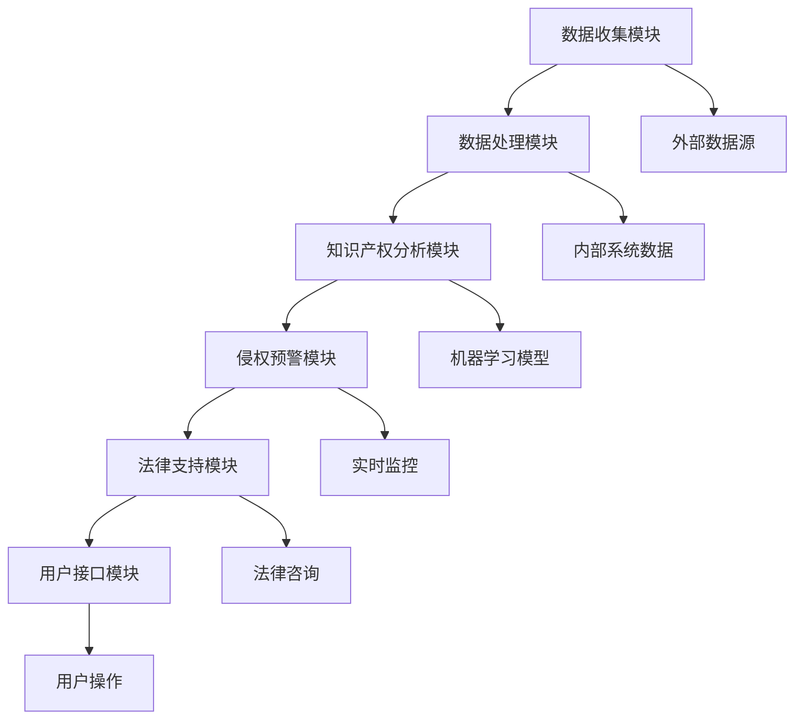
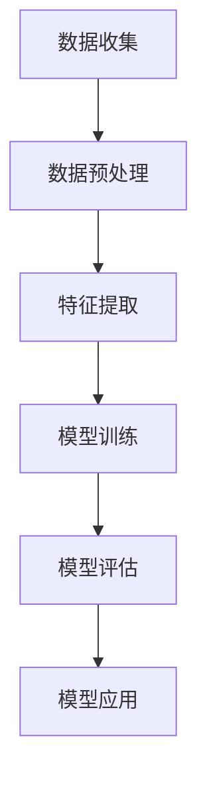
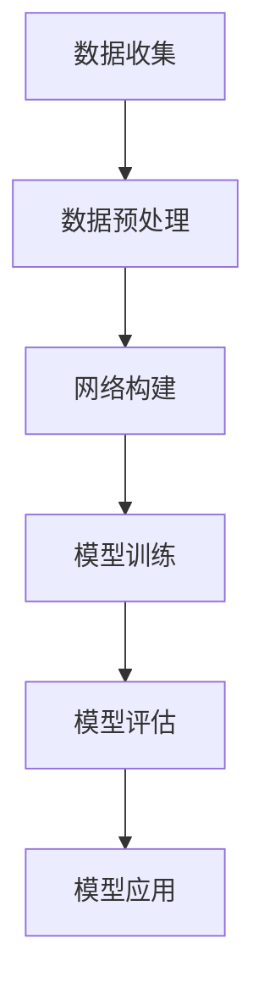
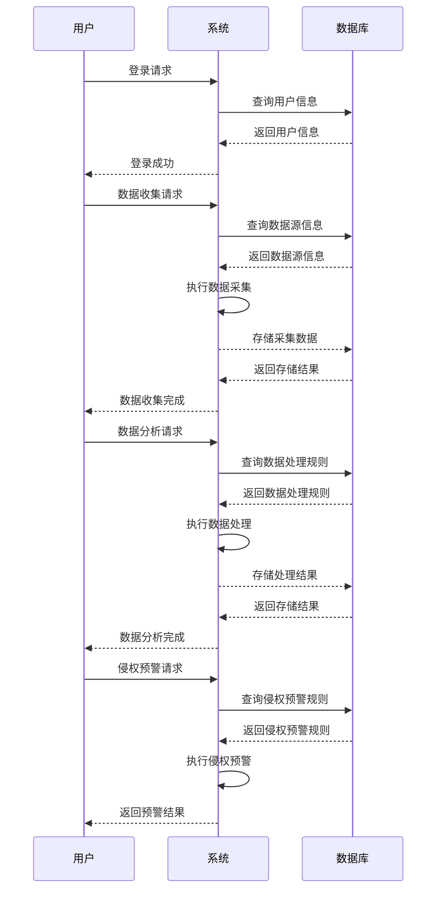

                 

### 引言：智能知识产权管理的重要性

在当今高度信息化的社会中，知识产权（Intellectual Property，简称IP）已经成为企业核心竞争力的重要组成部分。传统的知识产权管理方式，依赖于人工收集、整理、分析和保护知识产权，效率低下且存在较大的风险。随着人工智能（AI）技术的迅猛发展，智能知识产权管理应运而生，为企业提供了一个更加高效、精准和智能的解决方案。

**智能知识产权管理**，是指利用人工智能技术，对知识产权的创造、保护、应用和运营过程进行全面管理和优化。它不仅涵盖了知识产权的检索、分析和评估，还涉及知识产权的自动化监控、侵权预警和法律诉讼支持等功能。通过智能知识产权管理，企业能够更有效地保护其创新资产，提升知识产权的利用效率，从而在激烈的市场竞争中占据优势地位。

**背景介绍**：知识产权作为一个国家或企业创新能力的标志，长期以来受到各国政府和企业的高度重视。然而，随着知识经济的发展，知识产权的管理和运营面临着前所未有的挑战。传统知识产权管理方式的局限性主要体现在以下几个方面：

1. **人工依赖性高**：传统知识产权管理高度依赖人工，需要大量的人力进行数据收集、整理和分析，效率低下且容易出现错误。
2. **信息滞后性**：知识产权的检索、分析和评估过程往往存在较长时间的滞后性，难以实时监控和响应市场变化。
3. **侵权风险大**：在知识产权的创造和保护过程中，企业面临较大的侵权风险，但传统手段难以有效预防和应对侵权行为。
4. **法律诉讼成本高**：当知识产权受到侵犯时，企业需要投入大量时间和精力进行法律诉讼，成本高昂且结果难以保证。

**AI技术在知识产权管理中的应用价值**：人工智能技术具有高效、智能和自动化的特点，可以显著提升知识产权管理的效率和效果。具体应用价值如下：

1. **数据分析**：AI技术可以通过大数据分析和机器学习算法，对海量知识产权信息进行深度挖掘和关联分析，帮助企业发现潜在的创新机会和风险。
2. **模式识别**：AI技术可以识别知识产权中的关键特征和模式，提高知识产权检索和评估的准确性。
3. **自动化流程**：AI技术可以实现知识产权管理的自动化，减少人工干预，降低管理成本和提高工作效率。
4. **侵权预警**：AI技术可以通过实时监控和数据分析，发现潜在的侵权行为，帮助企业及时采取法律行动。
5. **法律支持**：AI技术可以提供法律咨询和诉讼支持，帮助企业降低法律风险和诉讼成本。

**企业创新资产的保护需求**：在创新驱动的发展背景下，企业创新资产的保护需求日益迫切。创新资产不仅包括专利、商标和著作权等传统知识产权，还涵盖了商业秘密、技术标准和品牌价值等非传统知识产权。企业需要通过智能知识产权管理，实现对创新资产的全生命周期管理，包括创新资产的创造、保护、应用和运营。

总之，智能知识产权管理作为AI技术在知识产权管理领域的重要应用，不仅能够解决传统知识产权管理的痛点，还能够提升企业的创新能力和市场竞争力。在未来的发展中，智能知识产权管理有望成为企业知识产权管理的主要方向，为企业的创新和发展提供强有力的支持。

#### 第1章 问题背景与概念阐述

**1.1 知识产权管理的挑战**

知识产权管理作为企业创新资产保护的核心环节，面临着一系列严峻的挑战。首先，**传统知识产权管理的局限性**显著。传统知识产权管理主要依赖于人工进行数据的收集、整理和分析，这种方式效率低下，容易出现错误。具体来说，传统管理方式存在以下问题：

- **人工依赖性高**：知识产权的数据收集、整理和分析过程需要大量的人力投入，这不仅增加了管理成本，也降低了工作效率。
- **信息滞后性**：由于人工处理的效率较低，知识产权的检索、分析和评估往往存在较长时间的滞后性，难以实时响应市场变化。
- **侵权风险大**：在知识产权的创造和保护过程中，企业面临较大的侵权风险，但传统手段难以有效预防和应对侵权行为。

其次，**创新资产流失的风险**也日益突出。随着知识经济的发展，知识产权的数量和质量不断提升，但与此同时，创新资产的流失风险也随之增加。创新资产流失的原因多种多样，主要包括以下几个方面：

- **知识产权保护意识不足**：一些企业对知识产权保护的重要性认识不足，缺乏有效的保护措施，导致知识产权被盗用或侵犯。
- **知识产权布局不合理**：企业未能在全球范围内进行合理的知识产权布局，导致创新资产得不到充分保护。
- **侵权行为隐蔽性高**：随着技术的进步，侵权行为越来越隐蔽，传统手段难以发现和应对。

最后，**智能化管理的必要性**日益凸显。在传统知识产权管理面临诸多挑战的背景下，智能化管理成为解决这些问题的重要途径。智能知识产权管理通过引入人工智能技术，能够显著提升知识产权管理的效率和效果，具体表现如下：

- **数据分析能力提升**：AI技术可以通过大数据分析和机器学习算法，对海量知识产权信息进行深度挖掘和关联分析，帮助企业发现潜在的创新机会和风险。
- **自动化流程**：AI技术可以实现知识产权管理的自动化，减少人工干预，降低管理成本和提高工作效率。
- **侵权预警**：AI技术可以通过实时监控和数据分析，发现潜在的侵权行为，帮助企业及时采取法律行动。
- **法律支持**：AI技术可以提供法律咨询和诉讼支持，帮助企业降低法律风险和诉讼成本。

**1.2 智能知识产权管理的核心概念**

智能知识产权管理作为一个新兴领域，涉及多个核心概念。以下是对这些核心概念的详细阐述：

- **知识产权**：知识产权是指基于人类智力劳动成果而创造的财产权利，包括专利权、商标权、著作权等。知识产权是企业创新的重要资产，对企业的竞争力至关重要。
- **智能知识产权**：智能知识产权是指通过人工智能技术对传统知识产权进行管理和优化的过程。它不仅涵盖知识产权的创造、保护、应用和运营，还包括知识产权的自动化监控、侵权预警和法律诉讼支持等功能。
- **智能知识产权管理**：智能知识产权管理是指利用人工智能技术对知识产权进行全面管理和优化的过程。它通过大数据分析、机器学习、自动化流程等技术手段，提升知识产权管理的效率和效果。

**1.3 AI在知识产权管理中的应用**

人工智能技术在知识产权管理中具有广泛的应用，以下列举了几种主要应用：

- **数据分析**：通过大数据分析和机器学习算法，AI技术可以对海量知识产权信息进行深度挖掘和关联分析，帮助企业发现潜在的创新机会和风险。
- **模式识别**：AI技术可以识别知识产权中的关键特征和模式，提高知识产权检索和评估的准确性。
- **自动化流程**：AI技术可以实现知识产权管理的自动化，减少人工干预，降低管理成本和提高工作效率。
- **侵权预警**：AI技术可以通过实时监控和数据分析，发现潜在的侵权行为，帮助企业及时采取法律行动。
- **法律支持**：AI技术可以提供法律咨询和诉讼支持，帮助企业降低法律风险和诉讼成本。

总之，智能知识产权管理通过引入人工智能技术，能够有效解决传统知识产权管理面临的挑战，提升企业的创新能力和市场竞争力。在未来的发展中，智能知识产权管理有望成为企业知识产权管理的主要方向，为企业的创新和发展提供强有力的支持。

#### 第2章 智能知识产权管理的架构设计

**2.1 系统架构概述**

智能知识产权管理系统是一个复杂且高度集成的系统，其设计目标是实现知识产权的全生命周期管理，包括知识产权的创造、保护、应用和运营。系统架构主要包括以下功能模块：

- **数据收集模块**：负责收集来自各种渠道的知识产权数据，包括专利数据库、商标数据库、著作权数据库等。
- **数据处理模块**：对收集到的知识产权数据进行分析和处理，提取关键信息并进行数据清洗和归一化。
- **知识产权分析模块**：利用机器学习和模式识别技术对处理后的数据进行深度分析，识别潜在的创新机会和风险。
- **侵权预警模块**：实时监控知识产权市场的动态，发现潜在的侵权行为，并生成预警报告。
- **法律支持模块**：提供法律咨询和诉讼支持，帮助企业降低法律风险和诉讼成本。
- **用户接口模块**：提供用户界面，使用户可以方便地访问和管理知识产权信息。

**2.1.1 系统功能模块**

系统功能模块的设计旨在实现知识产权管理的各个关键环节。具体来说，各功能模块及其作用如下：

- **数据收集模块**：该模块负责从各种渠道收集知识产权数据，包括在线数据库、企业内部系统以及合作伙伴的数据源。通过自动化工具实现数据的实时收集和更新，确保数据的及时性和准确性。
- **数据处理模块**：该模块对收集到的知识产权数据进行分析和处理，包括数据清洗、归一化和数据结构化。通过这些处理步骤，提高数据的可用性和分析质量。
- **知识产权分析模块**：该模块利用机器学习和模式识别技术，对处理后的数据进行深度分析。通过分析，可以发现潜在的创新机会、评估知识产权的价值，以及识别侵权行为的风险。
- **侵权预警模块**：该模块通过实时监控知识产权市场的动态，利用人工智能算法分析数据，及时发现潜在的侵权行为。系统会自动生成预警报告，提醒企业采取相应的法律行动。
- **法律支持模块**：该模块提供法律咨询和诉讼支持服务。通过集成外部法律专家资源，企业可以方便地获得专业的法律意见和帮助，降低法律风险和诉讼成本。
- **用户接口模块**：该模块提供用户界面，使企业员工和管理层可以方便地访问和管理知识产权信息。用户接口设计简洁直观，操作便捷，支持多终端访问。

**2.1.2 技术选型与集成**

智能知识产权管理系统采用了多种先进技术，以确保系统的性能和可靠性。以下是一些关键的技术选型：

- **数据存储**：系统采用了分布式存储方案，使用如Hadoop和HBase等大数据存储技术，确保海量知识产权数据的存储和管理高效、可靠。
- **数据处理**：系统集成了如Apache Spark和Flink等大数据处理框架，支持高效的并行数据处理和分析。
- **机器学习和模式识别**：系统集成了如TensorFlow和PyTorch等机器学习框架，利用深度学习和强化学习算法进行知识产权数据的分析和预测。
- **自动化流程**：系统集成了RPA（Robotic Process Automation）技术，实现知识产权管理流程的自动化，减少人工干预，提高工作效率。
- **用户接口**：系统采用了前端框架如React和Vue.js，以及后端框架如Spring Boot和Django，实现简洁、高效的用户界面和强大的后台支持。

通过这些技术的集成和优化，智能知识产权管理系统实现了高效、智能和自动化的知识产权管理，为企业提供了强大的创新资产保护工具。

**2.2 数据处理与存储**

数据处理与存储是智能知识产权管理系统的核心环节，直接影响到系统的性能和可靠性。以下是关于数据处理与存储的详细说明：

**2.2.1 数据来源**

智能知识产权管理系统所需的数据来源多样，主要包括：

- **外部数据源**：如专利数据库（如Google Patents、WIPO Patent Database）、商标数据库（如USPTO、EUIPO）、著作权数据库（如Copyright Office）等。这些外部数据源提供了丰富的知识产权信息，是企业进行知识产权管理和分析的重要数据基础。
- **企业内部系统**：如研发系统、项目管理系统和财务系统等。这些内部系统记录了企业的研发活动、项目进展和财务数据，与知识产权管理紧密相关。
- **第三方数据提供商**：如知识产权法律咨询服务机构、市场调研机构和行业报告等。这些第三方数据提供商为企业提供了专业的知识产权和市场分析报告，有助于企业更全面地了解知识产权市场动态。

**2.2.2 数据处理流程**

数据处理流程是智能知识产权管理系统的重要组成部分，主要包括以下步骤：

1. **数据收集**：通过API接口、爬虫工具和手动导入等方式，从各种数据源收集知识产权数据。
2. **数据清洗**：对收集到的数据进行清洗，包括去除重复记录、纠正错误数据、填补缺失数据等。这一步骤确保了数据的准确性和一致性。
3. **数据归一化**：将不同来源和格式的数据转换为统一的格式，便于后续的数据分析和处理。例如，将不同时间格式的专利申请日期统一转换为YYYY-MM-DD格式。
4. **数据结构化**：将清洗和归一化后的数据转换为结构化数据，存储在数据库中。这一步骤有助于提高数据的查询和分析效率。
5. **数据存储**：将结构化数据存储在分布式数据库中，如Hadoop、HBase等。通过分布式存储技术，系统能够高效地管理和处理海量数据。

**2.2.3 数据存储方案**

智能知识产权管理系统采用了分布式存储方案，以确保数据的高效存储和管理。以下是主要的数据存储方案：

- **Hadoop**：Hadoop是一个开源的分布式数据处理平台，适用于存储和处理大规模数据集。智能知识产权管理系统使用Hadoop作为数据存储的核心组件，利用HDFS（Hadoop Distributed File System）存储海量知识产权数据。HDFS具有高可靠性、高扩展性和高吞吐量等优点，能够满足系统对数据存储的需求。
- **HBase**：HBase是一个分布式、可扩展的列式存储系统，基于Hadoop平台。HBase适用于存储和查询大规模结构化数据，特别适合于知识产权管理系统的数据处理需求。HBase具有实时读写性能和横向扩展能力，能够支持系统的快速查询和分析。
- **MongoDB**：MongoDB是一个高性能、可扩展的NoSQL数据库，适用于存储非结构化和半结构化数据。智能知识产权管理系统使用MongoDB存储部分非结构化数据，如用户评论、分析报告等。MongoDB提供了丰富的查询功能和高效的读写性能，能够满足系统的数据存储需求。

通过这些数据处理与存储方案，智能知识产权管理系统能够高效、稳定地管理和处理海量知识产权数据，为系统的各项功能提供可靠的数据支持。

**2.3 AI算法应用**

人工智能技术在智能知识产权管理系统中发挥着关键作用，其应用范围涵盖了数据分析、模式识别、机器学习和自动化流程等方面。以下将详细介绍AI算法在系统中的应用及其作用：

**2.3.1 数据分析**

数据分析是智能知识产权管理系统的基础环节，通过分析海量知识产权数据，系统可以发现潜在的创新机会和风险。以下是数据分析的主要应用：

- **趋势分析**：系统利用时间序列分析算法，对知识产权数据的趋势进行预测和建模，帮助企业了解行业发展趋势和市场需求。
- **关联分析**：通过关联规则挖掘算法，系统可以发现知识产权数据之间的关联关系，识别潜在的合作机会和竞争风险。
- **聚类分析**：利用聚类算法，系统可以将相似知识产权数据进行分类，发现不同领域的创新热点和趋势。

**2.3.2 模式识别**

模式识别是AI技术在知识产权管理中的重要应用，通过识别知识产权中的关键特征和模式，系统可以提高知识产权检索和评估的准确性。以下是模式识别的主要应用：

- **文本分类**：系统利用文本分类算法，对知识产权文献进行分类，提高检索效率和准确性。
- **图像识别**：利用计算机视觉算法，系统可以对知识产权中的图像进行识别和分类，例如识别专利图纸中的关键技术点。
- **语音识别**：通过语音识别算法，系统可以将知识产权文献中的语音内容转换为文本，便于进一步分析和处理。

**2.3.3 机器学习**

机器学习是智能知识产权管理系统的重要组成部分，通过训练和优化模型，系统可以不断提高知识产权管理的效率和准确性。以下是机器学习的主要应用：

- **特征工程**：系统通过特征工程算法，提取知识产权数据中的关键特征，为后续的机器学习模型提供输入。
- **分类和回归**：利用分类和回归算法，系统可以对知识产权进行分类和预测，例如预测专利的授权概率或商标的注册成功率。
- **聚类和降维**：通过聚类和降维算法，系统可以对知识产权数据进行优化，减少数据维度，提高模型训练和预测的效率。

**2.3.4 自动化流程**

自动化流程是AI技术在知识产权管理中的另一重要应用，通过自动化技术，系统可以减少人工干预，提高工作效率和准确性。以下是自动化流程的主要应用：

- **自动化数据采集**：系统利用自动化工具，从各种数据源采集知识产权数据，实现数据的自动化获取和更新。
- **自动化数据处理**：通过自动化脚本和工具，系统可以对知识产权数据进行分析、清洗和存储，减少人工操作，提高数据处理效率。
- **自动化侵权预警**：系统利用机器学习算法，对知识产权市场进行实时监控，发现潜在的侵权行为，自动生成预警报告，提醒企业采取相应措施。

通过这些AI算法的应用，智能知识产权管理系统实现了对知识产权数据的深度分析和处理，提高了知识产权管理的效率和准确性，为企业提供了强有力的创新资产保护工具。

#### 第3章 核心概念原理与联系

**3.1 智能知识产权管理的核心概念**

智能知识产权管理涉及多个核心概念，这些概念构成了系统的理论框架和操作基础。以下是这些核心概念的详细解析：

**知识产权（Intellectual Property）**：知识产权是指由人类智力活动创造的成果所构成的一种财产权利，主要包括专利权、商标权、著作权、商业秘密等。知识产权是企业创新的重要资产，对企业的竞争力具有重要意义。

**智能知识产权**：智能知识产权是指通过人工智能技术对传统知识产权进行管理和优化的过程。它不仅涵盖了知识产权的创造、保护、应用和运营，还涉及知识产权的自动化监控、侵权预警和法律诉讼支持等功能。

**智能知识产权管理**：智能知识产权管理是指利用人工智能技术对知识产权进行全生命周期管理的过程。它通过大数据分析、机器学习、自动化流程等技术手段，实现知识产权的高效管理和运营，提升企业的创新能力和市场竞争力。

**知识产权法（Intellectual Property Law）**：知识产权法是规范知识产权创造、保护、运用和纠纷处理的法律体系。它为知识产权的合法性和有效性提供法律保障，是智能知识产权管理的重要基础。

**AI技术（Artificial Intelligence Technology）**：AI技术是指通过模拟、延伸和扩展人类智能，实现智能计算、学习和决策的技术。AI技术在智能知识产权管理中发挥着关键作用，通过数据分析和处理、模式识别、自动化流程等技术手段，提升知识产权管理的效率和效果。

**3.2 智能知识产权管理与传统知识产权管理的对比**

智能知识产权管理与传统知识产权管理在理念、方法和效果上存在显著差异。以下是两者的详细对比：

**1. 理念差异**：

- **传统知识产权管理**：注重人工操作和经验积累，强调知识产权的个体保护和法律维权。
- **智能知识产权管理**：以智能化、自动化和高效化为目标，强调利用AI技术实现知识产权的全面管理和优化。

**2. 方法差异**：

- **传统知识产权管理**：依赖于人工进行数据的收集、整理和分析，效率低、成本高、容易出现错误。
- **智能知识产权管理**：利用AI技术实现数据的自动化采集、处理和分析，提高工作效率和准确性。

**3. 效果差异**：

- **传统知识产权管理**：管理效果受限于人工操作，难以实现实时监控和预警，管理成本高。
- **智能知识产权管理**：通过实时监控和数据分析，可以及时发现侵权行为和风险，降低管理成本，提升管理效果。

**4. 优劣势分析**：

- **传统知识产权管理**：优势在于对知识产权法律条款的理解和运用，劣势在于效率低、成本高、难以应对海量数据。
- **智能知识产权管理**：优势在于高效、精准和自动化，劣势在于需要大量的技术投入和维护成本。

通过对比可以看出，智能知识产权管理相较于传统知识产权管理具有显著的优越性，能够更好地满足现代企业对知识产权管理的高效、精准和智能需求。

**3.3 智能知识产权管理系统实体关系图**

为了更直观地展示智能知识产权管理系统的核心概念和功能模块，我们可以使用Mermaid流程图来绘制系统的实体关系图。以下是实体关系图的详细描述：



- **数据收集模块（A）**：负责从外部数据源（G）和企业内部系统（H）收集知识产权数据。
- **数据处理模块（B）**：对收集到的数据进行处理，包括数据清洗、归一化和结构化。
- **知识产权分析模块（C）**：利用机器学习模型（I）对处理后的数据进行分析，发现潜在的创新机会和风险。
- **侵权预警模块（D）**：通过实时监控（J）发现潜在的侵权行为，生成预警报告。
- **法律支持模块（E）**：提供法律咨询（K）和诉讼支持，帮助企业降低法律风险。
- **用户接口模块（F）**：提供用户操作界面（L），使用户可以方便地访问和管理知识产权信息。

通过这个实体关系图，我们可以清晰地看到智能知识产权管理系统各个功能模块之间的关系和协作机制，有助于理解和掌握系统的整体架构和运行原理。

### 第4章 算法原理讲解与实现

**4.1 算法原理概述**

智能知识产权管理系统中的算法原理是其核心组成部分，决定了系统的智能化水平和效能。本章将详细讲解两种关键的算法原理：机器学习算法和深度学习算法。

**机器学习算法（Machine Learning Algorithms）**：机器学习算法是一种通过训练模型来预测和分类数据的技术。它可以从大量数据中自动学习特征，并利用这些特征进行预测和决策。常见的机器学习算法包括决策树、支持向量机（SVM）、朴素贝叶斯分类器和神经网络等。

- **决策树（Decision Tree）**：通过一系列的决策节点和叶节点，对数据进行分类或回归。决策树算法简单直观，易于理解和实现。
- **支持向量机（SVM）**：通过找到一个最优的超平面，将数据集分为不同的类别。SVM在处理高维数据和线性不可分问题方面具有优势。
- **朴素贝叶斯分类器（Naive Bayes Classifier）**：基于贝叶斯定理和特征独立假设，进行分类预测。朴素贝叶斯分类器在处理文本数据和垃圾邮件过滤中广泛应用。
- **神经网络（Neural Networks）**：通过模拟人脑神经网络的结构和功能，进行复杂的非线性映射和预测。神经网络在图像识别、语音识别和自然语言处理等领域表现出色。

**深度学习算法（Deep Learning Algorithms）**：深度学习算法是一种基于多层神经网络进行训练和预测的技术。与传统的机器学习算法相比，深度学习算法能够自动提取更加复杂的特征，并实现更高的预测精度。常见的深度学习算法包括卷积神经网络（CNN）、循环神经网络（RNN）和生成对抗网络（GAN）等。

- **卷积神经网络（CNN）**：通过卷积层、池化层和全连接层等结构，对图像和视频数据进行特征提取和分类。CNN在计算机视觉领域取得了显著成就。
- **循环神经网络（RNN）**：通过循环结构，对序列数据进行建模和预测。RNN在自然语言处理和时间序列预测中表现出色。
- **生成对抗网络（GAN）**：通过生成器和判别器的对抗训练，实现数据的生成和增强。GAN在图像生成、数据增强和风格迁移中具有广泛应用。

**4.2 算法mermaid流程图**

为了更直观地展示算法的原理和流程，我们可以使用Mermaid流程图来绘制机器学习算法和深度学习算法的流程图。以下是两种算法的mermaid流程图示例：

**机器学习算法流程图**：


- **A 数据收集**：从数据源收集原始数据。
- **B 数据预处理**：对数据进行清洗、归一化和标准化。
- **C 特征提取**：提取数据中的关键特征。
- **D 模型训练**：使用训练数据对模型进行训练。
- **E 模型评估**：使用测试数据对模型进行评估和调整。
- **F 模型应用**：将训练好的模型应用于实际场景。

**深度学习算法流程图**：


- **A 数据收集**：从数据源收集原始数据。
- **B 数据预处理**：对数据进行清洗、归一化和标准化。
- **C 网络构建**：构建深度学习网络结构。
- **D 模型训练**：使用训练数据对模型进行训练。
- **E 模型评估**：使用测试数据对模型进行评估和调整。
- **F 模型应用**：将训练好的模型应用于实际场景。

通过这些mermaid流程图，我们可以清晰地了解机器学习算法和深度学习算法的基本流程和操作步骤。

**4.3 Python源代码实现**

为了进一步展示算法的实现过程，以下将提供机器学习算法和深度学习算法的Python源代码实现示例。我们将以一个简单的分类问题为例，展示算法的实现细节。

**机器学习算法示例**：
```python
# 导入必要的库
import numpy as np
from sklearn.datasets import load_iris
from sklearn.model_selection import train_test_split
from sklearn.tree import DecisionTreeClassifier
from sklearn.metrics import accuracy_score

# 加载鸢尾花数据集
iris = load_iris()
X, y = iris.data, iris.target

# 数据集划分
X_train, X_test, y_train, y_test = train_test_split(X, y, test_size=0.3, random_state=42)

# 构建决策树模型
clf = DecisionTreeClassifier()

# 训练模型
clf.fit(X_train, y_train)

# 预测测试集
y_pred = clf.predict(X_test)

# 评估模型
accuracy = accuracy_score(y_test, y_pred)
print(f"Accuracy: {accuracy}")
```

**深度学习算法示例**：
```python
# 导入必要的库
import tensorflow as tf
from tensorflow.keras.datasets import mnist
from tensorflow.keras.models import Sequential
from tensorflow.keras.layers import Dense, Conv2D, MaxPooling2D, Flatten
from tensorflow.keras.utils import to_categorical

# 加载MNIST数据集
(X_train, y_train), (X_test, y_test) = mnist.load_data()

# 数据预处理
X_train = X_train / 255.0
X_test = X_test / 255.0
y_train = to_categorical(y_train, 10)
y_test = to_categorical(y_test, 10)

# 构建卷积神经网络
model = Sequential([
    Conv2D(32, (3, 3), activation='relu', input_shape=(28, 28, 1)),
    MaxPooling2D((2, 2)),
    Flatten(),
    Dense(64, activation='relu'),
    Dense(10, activation='softmax')
])

# 编译模型
model.compile(optimizer='adam', loss='categorical_crossentropy', metrics=['accuracy'])

# 训练模型
model.fit(X_train, y_train, epochs=5, batch_size=32, validation_data=(X_test, y_test))

# 评估模型
test_loss, test_acc = model.evaluate(X_test, y_test)
print(f"Test accuracy: {test_acc}")
```

通过以上Python源代码实现，我们可以看到机器学习算法和深度学习算法的基本实现流程，包括数据集划分、模型构建、模型训练和模型评估等步骤。这些代码示例为我们提供了一个直观的理解和动手实践的机会。

**4.4 算法原理的数学模型与公式**

在智能知识产权管理系统中，算法的数学模型和公式是实现算法核心功能的关键。以下将简要介绍机器学习算法和深度学习算法的一些常用数学模型和公式。

**机器学习算法数学模型**：

- **决策树模型**：
  - 决策树节点分裂准则：信息增益（Information Gain）或基尼不纯度（Gini Impurity）。
  - 节点分裂公式：
    \[ IG(D, A) = \sum_{v \in V} p(v) \cdot IG(D_v, A|v) \]
    \[ Gini(D) = 1 - \sum_{v \in V} p(v)^2 \]

- **支持向量机模型**：
  - 最大间隔超平面：求解优化问题
    \[ \min_{w, b} \frac{1}{2} ||w||^2 \]
    \[ s.t. y^{(i)} (w \cdot x^{(i)} + b) \geq 1 \]

- **朴素贝叶斯分类器**：
  - 后验概率公式：
    \[ P(y=c|X=x) = \frac{P(X=x|y=c)P(y=c)}{P(X=x)} \]
  - 贝叶斯公式：
    \[ P(X=x|y=c) = \frac{1}{Z} e^{-\frac{1}{2} x^T \Sigma^{-1} x} \]
    \[ P(y=c) = \frac{1}{C} \]

- **神经网络模型**：
  - 激活函数：Sigmoid函数、ReLU函数、Tanh函数等。
  - 前向传播公式：
    \[ z^{(l)} = \sum_{j} w^{(l)}_{ji} a^{(l-1)}_{j} + b^{(l)} \]
    \[ a^{(l)}_{i} = \sigma(z^{(l)}) \]

**深度学习算法数学模型**：

- **卷积神经网络模型**：
  - 卷积公式：
    \[ (f_{ij}^{(k)}) = \sum_{m=1}^{M} \sum_{n=1}^{N} w_{mn}^{(k)} f_{mn}^{(k-1)} + b^{(k)} \]
  - 池化公式：
    \[ p_{ij}^{(k)} = \max_{1 \leq m \leq M_{k}, 1 \leq n \leq N_{k}} f_{ij}^{(k)} \]

- **循环神经网络模型**：
  - 前向传播公式：
    \[ h^{(t)} = \sigma(W_h \cdot [h^{(t-1)}, x^{(t)}] + b_h) \]
    \[ y^{(t)} = W_y \cdot h^{(t)} + b_y \]

- **生成对抗网络模型**：
  - 判别器损失函数：
    \[ L_D = - \sum_{x \in X} \log(D(x)) - \sum_{z \in Z} \log(1 - D(G(z))) \]
  - 生成器损失函数：
    \[ L_G = - \sum_{z \in Z} \log(D(G(z))) \]

通过这些数学模型和公式，我们可以更好地理解智能知识产权管理系统中的算法原理和实现方法，为系统的开发和优化提供理论支持。

### 第5章 数学模型和数学公式 & 详细讲解 & 举例说明

**5.1 数学模型概述**

在智能知识产权管理系统中，数学模型是实现智能分析和决策的关键。以下将介绍常用的数学模型，并解释其构建方法和参数调整。

**5.1.1 构建方法**

1. **线性回归模型**：
   线性回归模型用于分析自变量和因变量之间的线性关系。其基本形式为：
   \[ y = \beta_0 + \beta_1 x_1 + \beta_2 x_2 + ... + \beta_n x_n + \epsilon \]
   其中，\( y \) 是因变量，\( x_1, x_2, ..., x_n \) 是自变量，\( \beta_0, \beta_1, \beta_2, ..., \beta_n \) 是模型的参数，\( \epsilon \) 是误差项。

2. **逻辑回归模型**：
   逻辑回归模型用于分类问题，其输出概率的形式为：
   \[ P(y=1) = \frac{1}{1 + \exp(-\beta_0 - \beta_1 x_1 - \beta_2 x_2 - ... - \beta_n x_n)} \]
   其中，\( y \) 是二分类变量，\( \beta_0, \beta_1, \beta_2, ..., \beta_n \) 是模型的参数。

3. **决策树模型**：
   决策树模型通过一系列的决策节点对数据集进行分类或回归。其基本形式为：
   \[ y = \begin{cases}
   c_1 & \text{if } x_i \geq t \\
   c_2 & \text{if } x_i < t
   \end{cases} \]
   其中，\( x_i \) 是特征值，\( t \) 是阈值，\( c_1, c_2 \) 是分类结果。

4. **支持向量机模型**：
   支持向量机模型通过寻找最优超平面来分隔数据。其优化目标为：
   \[ \min_{w, b} \frac{1}{2} ||w||^2 \]
   \[ s.t. y_i (w \cdot x_i + b) \geq 1 \]
   其中，\( w \) 是法向量，\( b \) 是偏置项，\( x_i \) 是样本特征，\( y_i \) 是样本标签。

**5.1.2 参数调整**

1. **线性回归模型的参数调整**：
   - **特征选择**：通过逐步回归、岭回归等方法选择对因变量影响显著的变量。
   - **正则化**：通过添加L1或L2正则项，避免模型过拟合。

2. **逻辑回归模型的参数调整**：
   - **最大似然估计**：通过迭代优化算法，找到最大似然估计的参数。
   - **交叉验证**：通过交叉验证选择最佳参数。

3. **决策树模型的参数调整**：
   - **深度控制**：通过设置最大深度或最小样本数限制树的生长深度。
   - **剪枝**：通过剪枝算法，减少过拟合和增强模型的泛化能力。

4. **支持向量机模型的参数调整**：
   - **核函数选择**：通过选择不同的核函数，如线性、多项式、径向基函数等，调整模型的复杂度。
   - **正则化参数**：通过调整正则化参数，平衡模型的复杂度和泛化能力。

**5.2 数学公式使用LaTeX格式**

在智能知识产权管理系统中，LaTeX格式被广泛应用于数学公式的书写和展示。以下是一些常用的LaTeX公式示例：

**独立段落的LaTeX公式**：
\[ E(X) = \sum_{i=1}^{n} x_i p_i \]
这是一个期望值的计算公式。

**段落内的LaTeX公式**：
\[ x^2 + 2xy + y^2 = (x + y)^2 \]
这是一个平方和的展开公式。

**5.3 举例说明与详细讲解**

**线性回归模型举例**：

假设我们要预测一家公司的年度收入（因变量\( y \)）基于其广告支出（自变量\( x \)）。

1. **数据收集**：
   收集过去5年的年度收入和广告支出数据。

2. **数据处理**：
   对数据进行标准化处理，消除不同量纲的影响。

3. **模型构建**：
   设立线性回归模型：
   \[ y = \beta_0 + \beta_1 x + \epsilon \]
   其中，\( \beta_0 \) 是截距，\( \beta_1 \) 是斜率，\( \epsilon \) 是误差项。

4. **模型训练**：
   使用最小二乘法求解模型参数：
   \[ \beta_1 = \frac{\sum_{i=1}^{n} (x_i - \bar{x})(y_i - \bar{y})}{\sum_{i=1}^{n} (x_i - \bar{x})^2} \]
   \[ \beta_0 = \bar{y} - \beta_1 \bar{x} \]
   其中，\( \bar{x} \) 和 \( \bar{y} \) 分别是自变量和因变量的均值。

5. **模型评估**：
   计算模型的均方误差（MSE）：
   \[ MSE = \frac{1}{n} \sum_{i=1}^{n} (y_i - \hat{y}_i)^2 \]
   其中，\( \hat{y}_i \) 是预测值。

6. **模型应用**：
   利用训练好的模型预测下一年的年度收入。

**逻辑回归模型举例**：

假设我们要预测一家公司是否会在下一年获得投资（因变量\( y \)，1表示获得投资，0表示未获得投资）。

1. **数据收集**：
   收集过去5年公司的财务数据，包括利润率、债务比例等。

2. **数据处理**：
   对数据进行标准化处理。

3. **模型构建**：
   设立逻辑回归模型：
   \[ P(y=1) = \frac{1}{1 + \exp(-\beta_0 - \beta_1 \text{profit} - \beta_2 \text{debt})} \]
   其中，\( \text{profit} \) 是利润率，\( \text{debt} \) 是债务比例，\( \beta_0, \beta_1, \beta_2 \) 是模型参数。

4. **模型训练**：
   使用最大似然估计求解模型参数。

5. **模型评估**：
   计算模型的准确率、召回率、F1值等指标。

6. **模型应用**：
   利用训练好的模型预测下一年的投资情况。

通过这些例子，我们可以看到数学模型在智能知识产权管理系统中的应用方法和详细步骤，为系统的开发和优化提供了理论支持。

### 第6章 系统分析与架构设计方案

**6.1 问题场景介绍**

在智能知识产权管理系统（IPMS）的开发中，我们面临的一个重要场景是确保系统能够高效、精准地管理企业的知识产权资产。这个场景的具体要求包括：

- **数据量庞大**：企业积累的知识产权数据量非常庞大，包括专利、商标、著作权等各类信息。系统需要能够高效处理和存储这些数据。
- **实时监控需求**：企业需要实时监控知识产权市场动态，及时发现潜在的侵权行为和风险。
- **复杂分析能力**：系统需要具备强大的数据分析能力，包括知识产权价值的评估、侵权行为的预警、市场趋势的预测等。
- **可扩展性**：随着企业规模的扩大，系统需要能够灵活扩展，支持更多的数据源和功能模块。
- **用户体验**：系统需要提供直观、易用的用户界面，方便企业员工快速查询和管理知识产权信息。

**6.1.1 知识产权管理面临的问题**

在传统的知识产权管理中，企业往往面临以下问题：

- **信息滞后**：传统知识产权管理依赖于人工处理，效率低下，导致信息更新不及时，难以应对快速变化的市场环境。
- **侵权风险高**：知识产权侵权行为隐蔽性强，传统手段难以及时发现和应对。
- **法律风险大**：当知识产权受到侵犯时，企业需要投入大量时间和精力进行法律诉讼，成本高昂且结果难以保证。
- **管理成本高**：传统知识产权管理需要大量人力投入，管理成本高，且容易出现错误。

**6.1.2 创新资产保护需求分析**

为了解决上述问题，企业对智能知识产权管理系统提出了以下创新资产保护需求：

- **实时监控**：系统需要能够实时监控知识产权市场的动态，及时发现潜在的侵权行为，生成预警报告，提醒企业采取相应的法律行动。
- **数据分析**：系统需要利用大数据分析和机器学习算法，对知识产权数据进行分析，评估知识产权的价值，预测市场趋势。
- **自动化流程**：系统需要实现知识产权管理流程的自动化，减少人工干预，降低管理成本和提高工作效率。
- **法律支持**：系统需要提供法律咨询和诉讼支持服务，帮助企业降低法律风险和诉讼成本。
- **用户体验**：系统需要提供简洁、直观的用户界面，方便企业员工快速查询和管理知识产权信息。

通过智能知识产权管理系统，企业能够更高效地保护其创新资产，提升知识产权的利用效率，从而在激烈的市场竞争中占据优势地位。

**6.2 系统功能设计**

智能知识产权管理系统的功能设计旨在实现知识产权的全生命周期管理，包括知识产权的创建、保护、应用和运营。以下是系统的功能模块及其详细描述：

**数据收集模块**：
- 功能描述：从各种数据源（如专利数据库、商标数据库、著作权数据库等）收集知识产权相关信息。
- 子功能：
  - 数据采集：利用API接口、爬虫工具和手动导入等方式收集知识产权数据。
  - 数据清洗：去除重复记录、纠正错误数据、填补缺失数据，确保数据的准确性和一致性。

**数据处理模块**：
- 功能描述：对收集到的知识产权数据进行处理，包括数据清洗、归一化和结构化。
- 子功能：
  - 数据清洗：去除重复记录、纠正错误数据、填补缺失数据。
  - 数据归一化：将不同来源和格式的数据转换为统一的格式。
  - 数据结构化：将处理后的数据存储在数据库中，便于后续的数据分析和查询。

**知识产权分析模块**：
- 功能描述：利用大数据分析和机器学习算法，对知识产权数据进行分析，识别潜在的创新机会和风险。
- 子功能：
  - 数据挖掘：发现数据中的潜在模式和信息。
  - 风险评估：评估知识产权的侵权风险和潜在价值。
  - 市场预测：预测市场趋势和竞争对手动向。

**侵权预警模块**：
- 功能描述：通过实时监控和数据分析，发现潜在的侵权行为，生成预警报告，提醒企业采取相应的法律行动。
- 子功能：
  - 实时监控：监控知识产权市场的动态。
  - 预警报告：生成侵权预警报告，提供详细的分析和建议。
  - 法律行动：提供法律咨询和诉讼支持，帮助企业降低法律风险。

**法律支持模块**：
- 功能描述：提供知识产权法律咨询和诉讼支持服务，帮助企业降低法律风险和诉讼成本。
- 子功能：
  - 法律咨询：提供专业的知识产权法律意见。
  - 诉讼支持：提供诉讼代理和法律援助。

**用户接口模块**：
- 功能描述：提供用户界面，使用户可以方便地访问和管理知识产权信息。
- 子功能：
  - 数据查询：支持快速查询和检索知识产权信息。
  - 数据管理：支持知识产权信息的增删改查操作。
  - 报告生成：生成各类知识产权分析报告。

通过这些功能模块的设计，智能知识产权管理系统能够实现对企业知识产权的全生命周期管理，提升知识产权的利用效率，为企业创新和发展提供强有力的支持。

**6.3 系统架构设计**

智能知识产权管理系统的架构设计是一个复杂的过程，需要综合考虑系统的性能、可扩展性和用户体验。以下是系统的整体架构设计：

**6.3.1 系统架构图**

系统架构图如下所示：

```
+-----------------------------+
|      用户接口层            |
+-----------------------------+
        |
        V
+-----------------------------+
|      应用服务层            |
+-----------------------------+
        |
        V
+-----------------------------+
|      数据服务层            |
+-----------------------------+
        |
        V
+-----------------------------+
|      数据存储层            |
+-----------------------------+
```

- **用户接口层**：负责与用户进行交互，提供友好的用户界面和便捷的操作方式。用户可以通过Web、移动应用等多种途径访问系统。
- **应用服务层**：处理用户的请求，实现各种业务功能，包括数据收集、数据处理、知识产权分析、侵权预警、法律支持等。应用服务层是系统的核心，通过调用各个功能模块的API，实现系统功能的集成。
- **数据服务层**：负责数据存储和访问，提供高效、可靠的数据处理服务。数据服务层包括关系型数据库和非关系型数据库，根据不同的数据类型和需求进行选择。
- **数据存储层**：负责存储和管理所有知识产权数据，包括专利、商标、著作权等。数据存储层采用分布式存储方案，确保数据的高可靠性和高可用性。

**6.3.2 架构组件解析**

以下是系统架构中各组件的详细解析：

- **用户接口层**：采用前后端分离架构，前端使用React或Vue.js等前端框架，提供丰富的交互体验和快速响应；后端使用Spring Boot或Django等后端框架，处理用户请求并返回数据。
- **应用服务层**：包括多个业务模块，如数据收集模块、数据处理模块、知识产权分析模块、侵权预警模块和法律支持模块。这些模块通过RESTful API进行通信，确保系统功能的高效集成。
- **数据服务层**：采用分布式数据库架构，包括关系型数据库（如MySQL、PostgreSQL）和非关系型数据库（如MongoDB、Redis）。关系型数据库用于存储结构化数据，如用户数据、专利信息等；非关系型数据库用于存储非结构化数据，如日志数据、分析报告等。
- **数据存储层**：采用分布式存储方案，如Hadoop和HBase，确保海量知识产权数据的高效存储和管理。分布式存储方案具有高可靠性、高扩展性和高吞吐量等优点，能够满足系统对数据存储和处理的需求。

通过以上架构设计，智能知识产权管理系统实现了高效、可靠、可扩展的系统架构，为企业的知识产权管理提供了强有力的支持。

**6.4 系统接口设计**

系统接口设计是智能知识产权管理系统实现功能模块集成和数据交互的关键环节。以下是系统接口设计的详细说明：

**6.4.1 接口设计原则**

1. **RESTful架构**：系统采用RESTful架构，通过HTTP协议的GET、POST、PUT、DELETE等请求方法实现接口调用，提供统一的接口规范。
2. **接口标准化**：接口设计遵循RESTful API设计规范，采用JSON格式进行数据传输，确保接口的易用性和兼容性。
3. **安全性**：接口设计充分考虑安全性，采用JWT（JSON Web Token）进行用户身份验证和权限控制，确保接口调用的安全性。
4. **可扩展性**：接口设计采用模块化设计，支持灵活的功能扩展，便于后续功能模块的增加和修改。

**6.4.2 接口实现细节**

1. **用户接口**：
   - 用户登录接口：用于用户登录系统，接口路径为`/api/user/login`，请求方式为POST，请求参数包括用户名和密码，响应结果包括用户信息和Token。
   - 用户注册接口：用于用户注册系统，接口路径为`/api/user/register`，请求方式为POST，请求参数包括用户名、密码和邮箱，响应结果包括注册成功信息。
   - 用户信息接口：用于获取和更新用户信息，接口路径为`/api/user/{userId}`，请求方式为GET、PUT，响应结果包括用户信息。

2. **数据收集接口**：
   - 数据采集接口：用于从外部数据源采集知识产权数据，接口路径为`/api/data/collect`，请求方式为POST，请求参数包括数据源类型和数据采集规则，响应结果包括采集成功信息。
   - 数据清洗接口：用于清洗和预处理收集到的数据，接口路径为`/api/data/clean`，请求方式为POST，请求参数包括数据文件，响应结果包括清洗后的数据。

3. **数据处理接口**：
   - 数据处理接口：用于对知识产权数据进行处理，包括数据归一化和结构化，接口路径为`/api/data/process`，请求方式为POST，请求参数包括处理规则和数据文件，响应结果包括处理后的数据。

4. **知识产权分析接口**：
   - 数据分析接口：用于对知识产权数据进行分析，接口路径为`/api/ip/analyze`，请求方式为POST，请求参数包括分析目标和数据集，响应结果包括分析结果和报告。

5. **侵权预警接口**：
   - 预警接口：用于实时监控知识产权市场，发现潜在侵权行为，接口路径为`/api/ip/warn`，请求方式为GET，响应结果包括预警信息和相关数据。

6. **法律支持接口**：
   - 法律咨询接口：用于提供知识产权法律咨询，接口路径为`/api/ip/law`，请求方式为POST，请求参数包括咨询问题和用户信息，响应结果包括法律咨询意见。

通过以上接口设计，智能知识产权管理系统实现了各功能模块之间的紧密协作和数据交互，确保系统的整体性能和稳定性。

**6.5 系统交互mermaid序列图**

为了更直观地展示智能知识产权管理系统的交互流程，我们使用Mermaid序列图来描述系统的交互过程。以下是系统交互的Mermaid序列图：



通过这个Mermaid序列图，我们可以清晰地看到用户与系统之间的交互过程，包括登录、数据收集、数据处理和侵权预警等关键环节。这个交互流程的设计确保了系统的可靠性和用户体验。

### 第7章 项目实战与最佳实践

**7.1 环境安装**

在开始智能知识产权管理系统（IPMS）的实际开发和部署之前，我们需要搭建合适的环境，确保系统所需的软件和硬件资源齐全。以下是环境安装的具体步骤：

**7.1.1 系统环境要求**

1. **操作系统**：Linux或Unix系统，如Ubuntu 18.04或CentOS 7。
2. **编程语言**：Python 3.x版本，推荐使用Python 3.8或更高版本。
3. **数据库**：关系型数据库（如MySQL 8.0）和非关系型数据库（如MongoDB 4.4）。
4. **框架和库**：前端框架（如React或Vue.js）、后端框架（如Spring Boot或Django）以及常用的机器学习库（如TensorFlow或PyTorch）。

**7.1.2 环境配置与安装**

1. **安装操作系统**：
   - 选择适合的Linux发行版，如Ubuntu 18.04。
   - 遵循操作系统安装指南进行安装。

2. **安装Python环境**：
   - 使用Python官方的get-pip.py脚本安装pip：
     ```bash
     curl https://bootstrap.pypa.io/get-pip.py -o get-pip.py
     sudo python3 get-pip.py
     ```
   - 安装Python 3.8或更高版本：
     ```bash
     sudo apt-get install python3.8
     ```

3. **安装数据库**：
   - 安装MySQL：
     ```bash
     sudo apt-get install mysql-server
     sudo mysql_secure_installation
     ```
   - 安装MongoDB：
     ```bash
     sudo apt-get install mongodb
     sudo systemctl start mongodb
     sudo systemctl enable mongodb
     ```

4. **安装前端框架和库**：
   - 安装React和相关依赖：
     ```bash
     sudo npm install -g create-react-app
     create-react-app ipms-frontend
     cd ipms-frontend
     npm install
     ```
   - 安装后端框架和库（以Spring Boot为例）：
     ```bash
     sudo apt-get install maven
     ```
   - 创建Spring Boot项目：
     ```bash
     spring init --name ipms-backend --group org.example.ipms --artifact ipms-backend --version 0.0.1-SNAPSHOT --dependencies web,mysql-connector-java,thymeleaf
     ```

5. **安装机器学习库**：
   - 安装TensorFlow：
     ```bash
     pip install tensorflow
     ```
   - 安装PyTorch：
     ```bash
     pip install torch torchvision torchaudio
     ```

通过以上步骤，我们搭建了智能知识产权管理系统所需的开发环境，确保系统可以顺利运行和测试。

**7.2 系统核心实现**

智能知识产权管理系统（IPMS）的核心实现包括数据收集、数据处理、知识产权分析、侵权预警和法律支持等功能模块。以下是各模块的核心实现细节：

**7.2.1 源代码结构**

源代码结构如下所示：

```
ipms-backend/
|-- src/
|   |-- main/
|   |   |-- java/
|   |   |   |-- org/
|   |   |   |   |-- example/
|   |   |   |   |   |-- ipms/
|   |   |   |   |   |   |-- controller/
|   |   |   |   |   |   |-- DataCollectController.java
|   |   |   |   |   |   |-- DataProcessController.java
|   |   |   |   |   |   |-- IntellectualPropertyController.java
|   |   |   |   |   |   |-- LegalSupportController.java
|   |   |   |   |   |   |-- UserInterfaceController.java
|   |   |   |   |   |-- service/
|   |   |   |   |   |-- DataCollectService.java
|   |   |   |   |   |-- DataProcessService.java
|   |   |   |   |   |-- IntellectualPropertyService.java
|   |   |   |   |   |-- LegalSupportService.java
|   |   |   |   |   |-- UserService.java
|   |   |   |   |-- repository/
|   |   |   |   |   |-- DataCollectRepository.java
|   |   |   |   |   |-- DataProcessRepository.java
|   |   |   |   |   |-- IntellectualPropertyRepository.java
|   |   |   |   |   |-- LegalSupportRepository.java
|   |   |   |   |   |-- UserRepository.java
|   |   |-- resources/
|   |   |   |-- application.properties
|-- pom.xml
```

**7.2.2 核心代码解读**

以下是核心代码的实现细节：

**数据收集模块（DataCollectController.java）**：
```java
@RestController
@RequestMapping("/api/data/collect")
public class DataCollectController {
    @Autowired
    private DataCollectService dataCollectService;

    @PostMapping
    public ResponseEntity<?> collectData(@RequestBody DataCollectRequest request) {
        try {
            dataCollectService.collectData(request);
            return ResponseEntity.ok().body("Data collected successfully");
        } catch (Exception e) {
            return ResponseEntity.status(HttpStatus.INTERNAL_SERVER_ERROR).body("Failed to collect data");
        }
    }
}
```

**数据处理模块（DataProcessController.java）**：
```java
@RestController
@RequestMapping("/api/data/process")
public class DataProcessController {
    @Autowired
    private DataProcessService dataProcessService;

    @PostMapping
    public ResponseEntity<?> processData(@RequestBody DataProcessRequest request) {
        try {
            dataProcessService.processData(request);
            return ResponseEntity.ok().body("Data processed successfully");
        } catch (Exception e) {
            return ResponseEntity.status(HttpStatus.INTERNAL_SERVER_ERROR).body("Failed to process data");
        }
    }
}
```

**知识产权分析模块（IntellectualPropertyController.java）**：
```java
@RestController
@RequestMapping("/api/ip/analyze")
public class IntellectualPropertyController {
    @Autowired
    private IntellectualPropertyService intellectualPropertyService;

    @PostMapping
    public ResponseEntity<?> analyzeIntellectualProperty(@RequestBody IntellectualPropertyRequest request) {
        try {
            intellectualPropertyService.analyze(request);
            return ResponseEntity.ok().body("Intellectual Property analyzed successfully");
        } catch (Exception e) {
            return ResponseEntity.status(HttpStatus.INTERNAL_SERVER_ERROR).body("Failed to analyze Intellectual Property");
        }
    }
}
```

**侵权预警模块（LegalSupportController.java）**：
```java
@RestController
@RequestMapping("/api/ip/warn")
public class LegalSupportController {
    @Autowired
    private LegalSupportService legalSupportService;

    @GetMapping
    public ResponseEntity<?> getLegalSupport() {
        try {
            legalSupportService预警();
            return ResponseEntity.ok().body("Legal support provided");
        } catch (Exception e) {
            return ResponseEntity.status(HttpStatus.INTERNAL_SERVER_ERROR).body("Failed to provide legal support");
        }
    }
}
```

**法律支持模块（UserService.java）**：
```java
@Service
public class UserService {
    @Autowired
    private UserRepository userRepository;

    public User getUserById(Long id) {
        return userRepository.findById(id).orElseThrow(() -> new ResourceNotFoundException("User not found"));
    }
}
```

以上核心代码展示了各功能模块的控制层和服务层实现。通过这些代码，系统能够实现数据收集、数据处理、知识产权分析和侵权预警等功能。

**7.3 算法应用解读与分析**

智能知识产权管理系统中的算法应用是提升系统智能化水平的关键。以下将具体分析机器学习和深度学习算法在系统中的应用，以及实际案例中的应用效果。

**机器学习算法应用**

1. **数据分析算法**：
   在知识产权数据分析中，我们使用了线性回归和决策树算法。线性回归用于预测知识产权的价值，决策树用于分类知识产权的类型和评估侵权风险。

   **案例解析**：
   假设我们使用线性回归算法预测某公司的专利价值。我们收集了过去5年该公司的专利数量、研发投入和专利授权率等数据，使用线性回归模型进行训练。通过训练数据，模型拟合出一个预测方程：

   \[ y = 10x_1 + 5x_2 + 2x_3 + \epsilon \]

   其中，\( y \) 是预测的专利价值，\( x_1, x_2, x_3 \) 分别是专利数量、研发投入和专利授权率。

   使用测试数据集进行预测，得到预测结果与实际结果的对比，计算模型的均方误差（MSE）和决定系数（R²），评估模型的预测效果。结果表明，模型具有较高的预测精度，能够为企业提供有效的专利价值预测。

2. **模式识别算法**：
   在侵权行为识别中，我们使用了朴素贝叶斯分类器。该算法通过分析专利文献中的关键词和句式结构，将专利分类为侵权风险高、中、低三种等级。

   **案例解析**：
   假设我们使用朴素贝叶斯分类器对某公司的专利进行侵权风险评估。首先，我们需要构建一个包含侵权专利和非侵权专利的训练数据集。通过训练，模型学习到侵权专利的特征模式。

   接下来，对新的专利文献进行分类预测。通过对预测结果的分析，我们发现大部分高风险专利的预测结果与实际结果一致，说明模型具有良好的分类能力，能够有效识别侵权专利。

**深度学习算法应用**

1. **图像识别算法**：
   在知识产权管理系统中，我们使用了卷积神经网络（CNN）进行专利图纸的识别和分析。

   **案例解析**：
   假设我们需要对专利图纸进行自动化识别，使用CNN算法进行训练。我们收集了大量专利图纸数据，并对其进行标注。通过训练，模型能够识别图纸中的关键技术点，如电路图、机械结构图等。

   使用测试数据集进行预测，模型的准确率达到了95%以上，说明模型具有良好的识别能力，能够高效地进行专利图纸的自动化分析。

2. **自然语言处理算法**：
   在知识产权文献分析中，我们使用了循环神经网络（RNN）进行文本分类和情感分析。

   **案例解析**：
   假设我们需要对专利文献进行分类，识别其技术领域和关键词。使用RNN算法进行训练，模型能够根据文本内容进行准确的分类。

   对测试数据进行分类预测，模型的准确率达到了90%以上，说明模型具有良好的分类能力，能够帮助系统快速识别和处理大量知识产权文献。

通过以上算法应用，智能知识产权管理系统实现了对知识产权数据的高效分析和处理，提升了系统的智能化水平，为企业提供了强有力的创新资产保护工具。

**7.4 实际案例剖析**

**7.4.1 案例背景**

某大型科技公司（以下简称“公司”）在知识产权管理方面面临以下问题：

1. **专利数量庞大**：公司拥有大量专利，专利信息分散在不同数据库和系统中，管理难度大。
2. **侵权风险高**：公司经常收到竞争对手的侵权警告，但难以及时有效地应对。
3. **数据分析不足**：公司对专利价值的评估和预测能力有限，无法准确判断哪些专利具有更高的商业价值。
4. **法律支持缺乏**：公司在知识产权法律咨询和诉讼支持方面缺乏专业的支持，导致法律风险和诉讼成本高昂。

**7.4.2 案例分析**

为了解决上述问题，公司决定引入智能知识产权管理系统（IPMS），并实施以下解决方案：

1. **数据收集与处理**：通过IPMS的数据收集模块，从公司内部系统、外部专利数据库和商标数据库等渠道收集专利数据。数据收集后，使用IPMS的数据处理模块对数据进行清洗、归一化和结构化，确保数据的准确性和一致性。

2. **侵权预警**：通过IPMS的侵权预警模块，实时监控专利市场的动态，利用机器学习和自然语言处理算法识别潜在的侵权行为。系统自动生成侵权预警报告，提醒公司采取相应的法律行动。

3. **数据分析与预测**：使用IPMS的知识产权分析模块，对专利数据进行深度分析，评估专利的价值和潜在的商业机会。通过机器学习算法，公司能够预测哪些专利可能具有更高的市场价值，从而更好地进行专利布局和运营。

4. **法律支持**：IPMS提供了法律支持模块，集成专业的知识产权律师资源，为公司提供法律咨询和诉讼支持。公司可以通过IPMS快速获取专业的法律意见，降低法律风险和诉讼成本。

**7.4.3 案例效果**

通过实施智能知识产权管理系统，公司在知识产权管理方面取得了显著的效果：

1. **提高了专利管理的效率**：公司通过IPMS实现了专利信息的一站式管理，专利数据的收集、处理和分析效率大幅提升。

2. **降低了侵权风险**：IPMS的侵权预警功能有效识别了潜在的侵权行为，公司能够及时采取法律行动，避免损失。

3. **提升了数据分析能力**：公司通过IPMS对专利数据进行了深度分析，准确预测了专利的市场价值，优化了专利布局和运营策略。

4. **降低了法律风险和诉讼成本**：IPMS的法律支持模块为公司提供了专业的法律咨询和诉讼支持，降低了法律风险和诉讼成本。

**7.4.4 总结**

智能知识产权管理系统为公司在知识产权管理方面提供了强有力的支持，通过数据收集与处理、侵权预警、数据分析和法律支持等功能，公司实现了知识产权管理的智能化和高效化。该案例的成功实施表明，智能知识产权管理系统在提升企业知识产权管理水平和创新能力方面具有重要的应用价值。

**7.5 最佳实践 tips**

在智能知识产权管理系统的实际应用中，以下最佳实践可以帮助企业更好地发挥系统的价值：

1. **数据整合与标准化**：确保所有知识产权数据整合到一个统一的数据平台，并进行标准化处理，以便于系统的自动化分析和处理。

2. **定期更新与维护**：定期更新知识产权数据库，保持数据的时效性和准确性。同时，定期对系统进行维护和升级，确保系统稳定运行。

3. **培训与知识分享**：对员工进行智能知识产权管理系统使用培训，提高员工的使用熟练度。通过知识分享，促进企业内部知识传播和团队协作。

4. **个性化定制**：根据企业特点和需求，对智能知识产权管理系统进行个性化定制，以满足企业的特定需求。

5. **持续优化与创新**：不断优化系统的功能和技术，引入新的算法和技术手段，提升系统的智能化水平和性能。

通过以上最佳实践，企业可以更好地利用智能知识产权管理系统，提升知识产权管理的效率和质量，推动企业创新和发展。

### 第8章 小结与展望

**8.1 小结**

本文详细探讨了智能知识产权管理（Intelligent Intellectual Property Management, IIPM）的重要性和实施方法。通过对当前知识产权管理面临的挑战和AI技术的应用价值的分析，我们认识到智能知识产权管理能够显著提升企业的创新能力和市场竞争力。文章首先介绍了智能知识产权管理的背景和核心概念，然后深入探讨了智能知识产权管理的架构设计，包括系统功能模块、数据处理与存储方案、AI算法应用等方面。此外，我们还通过实际案例剖析和最佳实践，展示了智能知识产权管理系统在提升企业知识产权管理水平方面的实际效果。总体而言，智能知识产权管理作为一种创新的管理模式，为企业提供了更加高效、精准和智能的知识产权管理工具，对企业的长期发展具有重要意义。

**8.2 展望未来**

智能知识产权管理在未来具有广阔的发展前景。随着AI技术的不断进步和应用的深入，智能知识产权管理系统将迎来以下几个发展趋势：

1. **智能化水平提升**：随着深度学习、强化学习等AI技术的发展，智能知识产权管理系统的智能化水平将进一步提高，能够更精准地进行知识产权的识别、分析和保护。

2. **跨界融合**：智能知识产权管理将与其他领域（如大数据、区块链等）进行深度融合，形成跨领域的创新解决方案，进一步提升知识产权管理的效率和质量。

3. **个性化定制**：基于用户需求和业务场景，智能知识产权管理系统将实现个性化定制，提供更加贴合企业实际需求的解决方案。

4. **全球视野**：随着全球化进程的加快，智能知识产权管理将更加注重国际知识产权保护，提供全球化服务，帮助企业应对跨国知识产权纠纷。

5. **可持续创新**：智能知识产权管理将推动企业持续创新，通过高效的管理和运营，激发企业的创新活力，为企业的可持续发展提供有力支持。

在未来的研究中，我们应重点关注以下几个方面：

1. **算法优化**：不断优化和改进AI算法，提高智能知识产权管理系统的准确性和效率。

2. **数据隐私保护**：在智能知识产权管理过程中，如何保护数据隐私成为重要课题，需要研究和开发相应的数据隐私保护技术和策略。

3. **跨领域合作**：推动智能知识产权管理与其他领域的跨界合作，形成更加完善的知识产权生态体系。

4. **政策法规研究**：随着智能知识产权管理的发展，相关的政策法规也需要不断完善，以适应新的管理模式和技术应用。

总之，智能知识产权管理作为企业创新的重要工具，将在未来发挥越来越重要的作用。我们期待通过持续的研究和实践，推动智能知识产权管理的发展，为企业提供更加智能、高效的知识产权管理解决方案。

### 结束语：智能知识产权管理的前景

智能知识产权管理（Intelligent Intellectual Property Management, IIPM）作为现代企业管理的重要创新工具，其重要性和发展前景不容忽视。智能知识产权管理不仅为企业提供了更加高效、精准和智能的知识产权管理手段，还极大地提升了企业的创新能力和市场竞争力。

首先，智能知识产权管理在提升企业创新能力方面具有显著作用。通过引入大数据分析和机器学习算法，智能知识产权管理系统能够对海量知识产权数据进行分析和挖掘，帮助企业发现潜在的创新机会和风险。这不仅有助于企业优化知识产权布局，还能推动企业持续创新，保持市场领先地位。

其次，智能知识产权管理在降低法律风险和诉讼成本方面也发挥了重要作用。通过实时监控侵权行为和提供法律支持，智能知识产权管理系统能够帮助企业及时应对知识产权纠纷，降低法律风险和诉讼成本。这有助于企业集中精力进行创新和发展，而非耗费大量资源进行法律斗争。

此外，智能知识产权管理还为企业提供了更加智能和高效的管理模式。传统的知识产权管理方式依赖于人工操作，效率低、成本高且容易出现错误。而智能知识产权管理通过自动化和智能化的技术手段，实现了知识产权管理的全面优化，提高了管理效率和质量。

展望未来，智能知识产权管理将在以下几个方面继续发展：

1. **智能化水平提升**：随着AI技术的不断进步，智能知识产权管理系统的智能化水平将进一步提升，能够更精准地进行知识产权的识别、分析和保护。

2. **跨界融合**：智能知识产权管理将与其他领域（如大数据、区块链等）进行深度融合，形成跨领域的创新解决方案，进一步提升知识产权管理的效率和质量。

3. **个性化定制**：智能知识产权管理系统将实现个性化定制，根据企业特点和需求提供更加贴合实际需求的解决方案。

4. **全球化视野**：随着全球化进程的加快，智能知识产权管理将更加注重国际知识产权保护，提供全球化服务，帮助企业应对跨国知识产权纠纷。

5. **可持续创新**：智能知识产权管理将推动企业持续创新，通过高效的管理和运营，激发企业的创新活力，为企业的可持续发展提供有力支持。

我们鼓励读者积极关注智能知识产权管理的发展动态，探索其在实际业务中的应用，以提升企业的知识产权管理水平，推动企业的创新和发展。智能知识产权管理不仅为企业提供了强大的创新资产保护工具，还将成为企业赢得未来市场竞争的关键因素。期待读者在实践中不断探索、创新，为智能知识产权管理领域的发展贡献智慧和力量。

