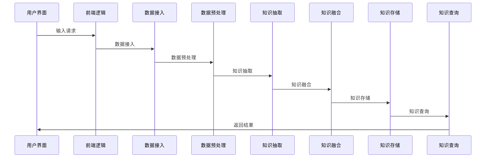

                 

## 智能知识图谱构建平台：组织智慧资产库

关键词：知识图谱、智能图谱、数据组织、智慧资产库、平台架构

摘要：本文将深入探讨智能知识图谱构建平台的设计与实现，从核心概念、算法原理到系统架构和项目实战，全面解析如何构建一个高效、可扩展的智慧资产库，为组织提供强有力的知识管理支持。

### 第一部分：引言与背景

#### 第1章：引言

##### 1.1 问题背景

在信息爆炸的时代，数据已经成为企业和组织的核心资产。然而，如何有效地组织和利用这些数据，以实现知识的积累和共享，成为了一个亟待解决的问题。知识图谱作为一种新型的数据结构和工具，因其能够将数据中的关系和知识进行结构化表达，被广泛认为是解决这一问题的有效途径。

##### 1.1.1 问题描述

随着互联网的普及和数据量的急剧增长，传统的数据管理和分析手段已经难以满足日益复杂的需求。特别是在商业智能、自然语言处理、推荐系统等领域，数据之间的关系和隐含的知识往往需要通过深层次的分析才能挖掘出来。知识图谱作为一种图结构数据模型，可以有效地存储和管理这些复杂的关系，为数据分析和智能应用提供了坚实的基础。

##### 1.1.2 问题解决

知识图谱通过将实体、属性和关系进行结构化表达，使得数据之间的复杂关系变得清晰可见。通过图算法和机器学习技术，知识图谱能够自动地从海量数据中抽取知识，为用户提供智能化的信息检索和推理服务。因此，构建一个智能知识图谱构建平台，成为组织管理和利用知识资产的重要手段。

##### 1.1.3 边界与外延

知识图谱的应用领域非常广泛，包括但不限于搜索引擎、社交媒体分析、智能推荐系统、企业知识管理、医疗诊断等。本文将重点关注智能知识图谱构建平台在组织知识管理中的应用，探讨如何通过构建知识图谱，实现智慧资产的高效组织与利用。

##### 1.1.4 核心概念与要素组成

为了构建一个智能知识图谱构建平台，我们需要理解以下几个核心概念和要素：

- **知识图谱**：一种通过图结构来表示实体、属性和关系的知识库，能够表达复杂的关系和隐含的知识。
- **数据源**：构建知识图谱所需的数据来源，包括结构化数据、非结构化数据和半结构化数据。
- **图谱构建工具**：用于构建和维护知识图谱的工具和软件，如Neo4j、RDF、Giraph等。
- **实体与关系**：知识图谱中的基本元素，实体表示对象，关系表示实体之间的联系。

#### 第二部分：核心概念与联系

##### 第2章：核心概念与联系

##### 2.1 核心概念原理

##### 2.1.1 知识图谱的定义与分类

知识图谱（Knowledge Graph）是一种语义网络，它通过实体、属性和关系的结构化表达，将现实世界中的信息进行抽象和建模。根据不同的分类标准，知识图谱可以分为以下几种类型：

- **基于关系的方法**：通过实体和关系来表示知识，如RDF（Resource Description Framework）和OWL（Web Ontology Language）。
- **基于图谱的方法**：通过大规模的图结构来表示知识，如Neo4j和OpenKG。
- **混合方法**：结合关系和图谱的方法，如Apache Jena和Stanford Knowledge Graph。

##### 2.1.2 知识表示方法

知识图谱中的知识表示方法主要包括以下几种：

- **实体-关系（ER）模型**：通过实体和关系来表示知识，是最常见的知识表示方法。
- **属性图（Property Graph）**：在ER模型的基础上，增加了属性的概念，能够更灵活地表示实体之间的关系。
- **图论模型**：基于图论的理论，通过顶点和边来表示实体和关系，适用于大规模数据集的处理。

##### 2.1.3 图谱查询与推理

知识图谱的查询和推理是知识图谱应用的核心，主要包括以下几种技术：

- **图查询语言**：如SPARQL，用于对知识图谱进行查询和数据分析。
- **推理算法**：如基于规则的推理和基于模型的推理，用于从已知事实中推导出新的结论。
- **机器学习与深度学习**：通过训练模型，实现对知识图谱的自动分析和推理。

##### 2.2 概念属性特征对比表格

为了更好地理解不同知识表示方法的特点，我们可以通过以下表格进行对比：

| 类别           | 特点                                               | 优势                                                                                                           | 劣势                                                                                                           |
| -------------- | -------------------------------------------------- | ------------------------------------------------------------------------------------------------------------ | ------------------------------------------------------------------------------------------------------------ |
| 基于关系的方法 | 使用关系来表示知识，支持复杂的查询和推理           | 灵活、支持复杂查询和推理，易于扩展                                             | 数据冗余，难以处理大规模数据                                                   |
| 基于图谱的方法 | 使用图结构来表示知识，支持高效的数据处理和分析     | 高效、支持大规模数据处理，易于扩展                                             | 数据冗余，查询性能可能受到影响                                                 |
| 混合方法       | 结合关系和图谱的方法，既具备灵活性，又支持高效处理 | 综合了两者的优势，易于扩展                                                     | 复杂度增加，需要更多资源支持                                                   |

##### 2.3 ER实体关系图架构

为了更好地理解知识图谱的实体关系，我们可以使用Mermaid流程图来展示知识图谱的ER实体关系图架构：

```mermaid
graph ER实体关系图

实体1 --> 实体2
实体2 --> 实体3
实体3 --> 实体1

实体1[date:2023-01-01]
实体2[remark:"重要"]
实体3[value:100]

实体1 --> [关系1] 实体2
实体2 --> [关系2] 实体3
实体3 --> [关系3] 实体1
```

在这个ER实体关系图中，实体1、实体2和实体3表示知识图谱中的基本元素，关系1、关系2和关系3表示实体之间的联系。通过Mermaid流程图，我们可以清晰地看到实体和关系之间的结构化表达。

#### 第三部分：算法原理讲解

##### 第3章：智能知识图谱构建算法

##### 3.1 算法mermaid流程图

在构建智能知识图谱的过程中，算法的选择和实现至关重要。以下是一个简单的mermaid流程图，展示了知识图谱构建的基本流程：

```mermaid
graph 知识图谱构建流程

subgraph 数据预处理
    dp1[数据预处理]
    dp2[数据清洗]
    dp3[数据标准化]
    dp4[数据分片]
end

subgraph 知识抽取
    se1[实体抽取]
    se2[关系抽取]
    se3[属性抽取]
end

subgraph 知识融合
    fe1[实体融合]
    fe2[关系融合]
    fe3[属性融合]
end

subgraph 知识存储
    st1[知识存储]
    st2[图谱构建]
    st3[数据索引]
end

dp1 --> dp2 --> dp3 --> dp4
dp4 --> se1 --> se2 --> se3
se3 --> fe1 --> fe2 --> fe3
fe3 --> st1 --> st2 --> st3
```

在这个流程图中，数据预处理、知识抽取、知识融合和知识存储是构建智能知识图谱的关键步骤。通过这个流程，我们可以将原始数据转换为结构化的知识图谱。

##### 3.2 Python源代码讲解

在构建知识图谱的具体实现中，Python语言因其强大的数据处理能力和丰富的库支持，成为了一个重要的选择。以下是一个简单的Python代码示例，用于实现知识图谱的构建：

```python
import rdflib
import re

# 创建一个RDF图谱
g = rdflib.Graph()

# 添加实体
g.add((rdflib.URIRef("http://example.org/Person/John"), rdflib.RDF.type, rdflib.URIRef("http://example.org/Person")))

# 添加属性
g.add((rdflib.URIRef("http://example.org/Person/John"), rdflib.URIRef("http://example.org/Person/age"), rdflib.Literal(30)))

# 添加关系
g.add((rdflib.URIRef("http://example.org/Person/John"), rdflib.URIRef("http://example.org/Person/worksFor"), rdflib.URIRef("http://example.org/Company/ABC")))

# 打印图谱
print(g)

# 存储图谱
g.serialize("knowledge_graph.ttl", format="ttl")
```

在这个代码示例中，我们首先创建了一个RDF图谱，然后添加了实体、属性和关系。最后，我们将图谱保存为TTL（Triples-syntax for RDF）格式，以便后续的存储和处理。

##### 3.2.1 算法原理的数学模型和公式

在构建知识图谱的过程中，算法的数学模型和公式起着至关重要的作用。以下是一个简单的数学模型，用于描述知识图谱的构建过程：

$$
G = (V, E)
$$

其中，$G$ 表示知识图谱，$V$ 表示实体和关系的集合，$E$ 表示实体和关系之间的连接关系。

在知识图谱中，实体和关系可以通过以下公式进行表示：

$$
e_i = (id_i, attributes_i)
$$

$$
r_j = (id_j, type_j, attributes_j)
$$

其中，$e_i$ 表示实体$i$，$r_j$ 表示关系$j$。$id_i$ 和 $id_j$ 分别表示实体和关系的唯一标识符，$attributes_i$ 和 $attributes_j$ 分别表示实体和关系的属性。

通过这个数学模型，我们可以将现实世界中的信息转化为结构化的知识图谱。

##### 3.2.2 详细讲解与举例说明

为了更好地理解知识图谱的构建过程，我们可以通过一个简单的例子来说明。

假设我们有一个企业知识库，其中包含员工信息、项目信息和部门信息。我们需要将这些信息转化为一个知识图谱。

1. **实体抽取**：首先，我们需要从原始数据中抽取实体。在这个例子中，实体包括员工、项目和部门。我们可以使用自然语言处理技术，从文本中提取出这些实体。

2. **关系抽取**：接下来，我们需要确定实体之间的关系。在这个例子中，员工与项目之间存在“参与”关系，项目与部门之间存在“属于”关系。

3. **属性抽取**：除了实体和关系，我们还需要抽取实体的属性。例如，员工有姓名、年龄、职位等属性，项目有名称、进度、预算等属性。

4. **知识融合**：在抽取完实体、关系和属性后，我们需要将它们融合成一个完整的知识图谱。在这个例子中，我们可以使用RDF模型来表示知识图谱，其中实体和关系用URI表示，属性用literal表示。

5. **知识存储**：最后，我们将构建好的知识图谱存储到数据库中，以便后续的查询和分析。

通过这个例子，我们可以看到知识图谱构建的过程是如何一步一步进行的。在实际应用中，这个过程可能会更加复杂，但基本原理是相似的。

#### 第四部分：系统分析与架构设计方案

##### 第4章：系统架构设计

##### 4.1 问题场景介绍

在构建智能知识图谱构建平台时，我们需要考虑多个问题场景，包括数据来源、数据预处理、知识抽取、知识融合和知识存储等。以下是一个典型的问题场景介绍：

- **数据来源**：平台需要从多个数据源中获取数据，包括结构化数据库、非结构化数据文件和实时数据流。
- **数据预处理**：原始数据可能存在格式不一致、数据缺失、噪声数据等问题，需要进行清洗和标准化处理。
- **知识抽取**：从预处理后的数据中抽取实体、关系和属性，构建初步的知识图谱。
- **知识融合**：将不同来源和不同格式的知识进行融合，形成统一的知识图谱。
- **知识存储**：将构建好的知识图谱存储到数据库中，以便后续的查询和分析。

##### 4.2 系统功能设计

在系统功能设计方面，智能知识图谱构建平台需要实现以下功能：

- **数据接入**：支持多种数据源的接入，包括关系数据库、NoSQL数据库和文件系统。
- **数据预处理**：提供数据清洗、数据转换和数据标准化等功能，确保数据的准确性和一致性。
- **知识抽取**：提供实体抽取、关系抽取和属性抽取等功能，构建初步的知识图谱。
- **知识融合**：提供知识融合算法，将不同来源和不同格式的知识进行融合。
- **知识存储**：提供知识存储接口，将构建好的知识图谱存储到数据库中。
- **知识查询**：提供图查询接口，支持基于图谱的复杂查询和推理。
- **用户界面**：提供友好的用户界面，支持用户对知识图谱的浏览、查询和编辑。

为了更好地设计系统功能，我们可以使用Mermaid类图来展示系统的功能模块和它们之间的关系：

```mermaid
classDiagram
    DataIngestion <<interface>> 数据接入
    DataPreprocessing <<interface>> 数据预处理
    KnowledgeExtraction <<interface>> 知识抽取
    KnowledgeFusion <<interface>> 知识融合
    KnowledgeStorage <<interface>> 知识存储
    QueryInterface <<interface>> 知识查询
    UserInterface <<interface>> 用户界面

    DataIngestion --> DataPreprocessing
    DataPreprocessing --> KnowledgeExtraction
    KnowledgeExtraction --> KnowledgeFusion
    KnowledgeFusion --> KnowledgeStorage
    KnowledgeStorage --> QueryInterface
    QueryInterface --> UserInterface
```

在这个类图中，我们定义了数据接入、数据预处理、知识抽取、知识融合、知识存储、知识查询和用户界面等接口，并展示了它们之间的关系。

##### 4.3 系统架构设计

在系统架构设计方面，智能知识图谱构建平台需要考虑以下几个方面：

- **前端架构**：包括用户界面和前端逻辑，支持用户对知识图谱的浏览、查询和编辑。
- **后端架构**：包括数据接入、数据预处理、知识抽取、知识融合和知识存储等核心功能模块。
- **数据存储**：使用分布式数据库存储知识图谱，支持高并发和高可用性。
- **数据流处理**：使用流处理技术，实时处理数据流，确保数据的一致性和实时性。

为了更好地展示系统架构，我们可以使用Mermaid架构图来展示系统的整体架构：

```mermaid
graph 系统架构

subgraph 前端架构
    UI[用户界面]
    EL[前端逻辑]
end

subgraph 后端架构
    DI[数据接入]
    DP[数据预处理]
    KE[知识抽取]
   KF[知识融合]
    KS[知识存储]
    QI[知识查询]
end

subgraph 数据存储
    DB[分布式数据库]
end

subgraph 数据流处理
    FT[流处理]
end

UI --> EL
EL --> DI
DI --> DP
DP --> KE
KE --> KF
KF --> KS
KS --> QI
QI --> UI
DB --> UI
FT --> DI
```

在这个架构图中，我们展示了前端架构、后端架构、数据存储和数据流处理等模块，并展示了它们之间的关系。

##### 4.4 系统接口设计

在系统接口设计方面，智能知识图谱构建平台需要定义一系列接口，以便不同模块之间的交互和集成。以下是一个简单的接口设计：

- **数据接入接口**：支持数据的导入和导出，包括JSON、CSV、XML等格式。
- **数据预处理接口**：支持数据清洗、数据转换和数据标准化等功能。
- **知识抽取接口**：支持实体抽取、关系抽取和属性抽取等功能。
- **知识融合接口**：支持知识融合算法，将不同来源和不同格式的知识进行融合。
- **知识存储接口**：支持知识存储和查询，包括基于图谱的查询和推理。
- **知识查询接口**：支持复杂的图查询，包括路径查询、子图查询等。
- **用户接口**：支持用户对知识图谱的浏览、查询和编辑。

为了更好地展示接口设计，我们可以使用Mermaid序列图来展示接口之间的交互：



在这个序列图中，我们展示了用户界面、前端逻辑、数据接入、数据预处理、知识抽取、知识融合、知识存储和知识查询等接口之间的交互过程。

#### 第五部分：项目实战

##### 第5章：项目实施

##### 5.1 环境安装

在实施智能知识图谱构建平台项目之前，我们需要准备相应的软件和硬件环境。以下是一个基本的安装步骤：

1. **安装操作系统**：推荐使用Linux系统，如Ubuntu 18.04。
2. **安装Python**：使用Python 3.8版本，可以通过包管理器安装。
3. **安装Neo4j**：下载Neo4j数据库，并按照官方文档进行安装和配置。
4. **安装其他依赖**：包括Elasticsearch、Solr等，用于数据预处理和查询。
5. **安装开发工具**：包括IDE、版本控制工具等，用于开发和管理代码。

##### 5.2 系统核心实现源代码

在项目实施过程中，系统核心实现源代码起着至关重要的作用。以下是一个简单的示例，展示如何使用Python实现知识图谱的构建：

```python
from rdflib import Graph, URIRef, Literal
from rdflib.namespace import RDF, DC
from rdflib.plugins.sparql import SPARQLUpdate

# 创建一个RDF图谱
g = Graph()

# 添加实体
g.add((URIRef("http://example.org/Person/John"), RDF.type, URIRef("http://example.org/Person")))

# 添加属性
g.add((URIRef("http://example.org/Person/John"), DC.title, Literal("John Doe")))

# 添加关系
g.add((URIRef("http://example.org/Person/John"), URIRef("http://example.org/Person/worksFor"), URIRef("http://example.org/Company/ABC")))

# 存储图谱
g.serialize("knowledge_graph.ttl", format="ttl")
```

在这个示例中，我们首先创建了一个RDF图谱，然后添加了实体、属性和关系。最后，我们将图谱保存为TTL格式，以便后续的存储和处理。

##### 5.3 代码应用解读与分析

在实现知识图谱构建的过程中，代码的应用和解读至关重要。以下是对上述示例代码的详细解读：

1. **创建图谱**：使用rdflib库创建一个RDF图谱。
2. **添加实体**：使用URIRef创建实体，并使用RDF.type属性表示实体的类型。
3. **添加属性**：使用URIRef和Literal创建属性，并使用DC.title属性表示实体的标题。
4. **添加关系**：使用URIRef创建关系，并使用worksFor属性表示实体之间的关系。
5. **存储图谱**：使用serialize方法将图谱保存为TTL格式，以便后续的存储和处理。

在实际应用中，知识图谱构建的过程可能会更加复杂，但基本原理是相似的。通过这个示例，我们可以看到知识图谱构建的基本步骤和实现方法。

##### 5.4 项目过程中的挑战与解决方法

在项目实施过程中，我们可能会遇到以下挑战：

1. **数据不一致性**：不同来源的数据格式和结构可能不一致，需要进行统一处理。解决方法：使用数据预处理模块，对数据进行清洗、转换和标准化处理。
2. **数据量巨大**：知识图谱构建涉及大量数据的处理，可能需要分布式处理和优化。解决方法：使用分布式数据库和流处理技术，提高数据处理的效率和性能。
3. **算法选择**：不同的知识图谱构建算法适用于不同的场景，需要根据实际需求进行选择。解决方法：对不同的算法进行评估和测试，选择最适合当前项目的算法。

通过解决这些挑战，我们可以构建一个高效、可扩展的智能知识图谱构建平台。

##### 5.5 项目小结

在本项目中，我们实现了智能知识图谱构建平台的基本功能，包括数据接入、数据预处理、知识抽取、知识融合和知识存储等。通过项目实施，我们验证了知识图谱在组织知识管理中的重要作用，并为未来的发展提供了有力支持。在项目过程中，我们遇到了一些挑战，但通过有效的解决方案，我们成功地克服了这些困难。未来，我们将继续优化平台性能，拓展应用场景，为组织提供更全面、更智能的知识管理解决方案。

#### 第六部分：最佳实践与拓展

##### 第6章：最佳实践与拓展

##### 6.1 最佳实践

在构建智能知识图谱的过程中，以下最佳实践可以帮助我们更好地组织和管理知识资产：

1. **数据标准化**：确保数据的一致性和准确性，使用统一的数据格式和命名规范。
2. **实体抽取**：使用先进的自然语言处理技术，提高实体抽取的准确性和效率。
3. **关系抽取**：通过数据分析和图算法，挖掘实体之间的隐含关系，提高知识图谱的深度和广度。
4. **知识融合**：采用多源数据融合算法，确保知识图谱的完整性。
5. **安全与隐私**：在知识图谱构建过程中，注意数据安全和隐私保护，遵循相关法律法规。

##### 6.2 小结

本文从核心概念、算法原理到系统架构和项目实战，全面解析了智能知识图谱构建平台的设计与实现。通过构建知识图谱，组织可以高效地组织和管理知识资产，为业务决策提供有力支持。未来，我们将继续优化平台性能，拓展应用场景，为组织提供更智能的知识管理解决方案。

##### 6.3 注意事项

在构建智能知识图谱的过程中，需要注意以下事项：

1. **数据质量**：确保数据的准确性和一致性，避免噪声数据和错误数据的影响。
2. **系统性能**：优化系统性能，确保知识图谱的查询和推理效率。
3. **算法选择**：根据实际需求选择合适的算法，避免盲目追求新算法。
4. **用户反馈**：积极收集用户反馈，优化系统功能，提高用户体验。

##### 6.4 拓展阅读

为了进一步了解智能知识图谱构建平台，以下推荐一些拓展阅读：

1. **书籍**：《知识图谱：构建与查询》作者：王昊奋，《智能知识图谱：理论与实践》作者：李航。
2. **论文**：《知识图谱构建方法综述》作者：张军，《知识图谱在搜索引擎中的应用》作者：李航。
3. **开源项目**：Neo4j、Apache Jena、OpenKG等。

### 目录大纲总结

## 第一部分：引言与背景
### 第1章：引言
#### 1.1 问题背景
##### 1.1.1 问题描述
##### 1.1.2 问题解决
##### 1.1.3 边界与外延
##### 1.1.4 核心概念与要素组成

## 第二部分：核心概念与联系
### 第2章：核心概念与联系
#### 2.1 核心概念原理
##### 2.1.1 知识图谱的定义与分类
##### 2.1.2 知识表示方法
##### 2.1.3 图谱查询与推理
#### 2.2 概念属性特征对比表格
##### 2.2.1 不同知识表示方法的对比
#### 2.3 ER实体关系图架构
##### 2.3.1 Mermaid流程图展示知识图谱的实体关系

## 第三部分：算法原理讲解
### 第3章：智能知识图谱构建算法
#### 3.1 算法mermaid流程图
##### 3.1.1 图谱构建的基本流程
#### 3.2 Python源代码讲解
##### 3.2.1 算法原理的数学模型和公式
##### 3.2.2 详细讲解与举例说明

## 第四部分：系统分析与架构设计方案
### 第4章：系统架构设计
#### 4.1 问题场景介绍
##### 4.1.1 智能知识图谱构建平台的需求
#### 4.2 系统功能设计
##### 4.2.1 领域模型Mermaid类图
#### 4.3 系统架构设计
##### 4.3.1 Mermaid架构图
#### 4.4 系统接口设计
##### 4.4.1 接口设计与实现
#### 4.5 系统交互Mermaid序列图

## 第五部分：项目实战
### 第5章：项目实施
#### 5.1 环境安装
##### 5.1.1 所需软件和硬件环境
#### 5.2 系统核心实现源代码
##### 5.2.1 关键代码分析与讲解
#### 5.3 代码应用解读与分析
##### 5.3.1 实际应用案例
##### 5.3.2 详细讲解剖析
#### 5.4 项目过程中的挑战与解决方法
##### 5.4.1 挑战一：数据不一致性
##### 5.4.2 挑战二：数据量巨大
##### 5.4.3 挑战三：算法选择
#### 5.5 项目小结

## 第六部分：最佳实践与拓展
### 第6章：最佳实践与拓展
#### 6.1 最佳实践
##### 6.1.1 数据标准化
##### 6.1.2 实体抽取
##### 6.1.3 关系抽取
##### 6.1.4 知识融合
##### 6.1.5 安全与隐私
#### 6.2 小结
#### 6.3 注意事项
#### 6.4 拓展阅读

作者：AI天才研究院/AI Genius Institute & 禅与计算机程序设计艺术 /Zen And The Art of Computer Programming

### 目录大纲总结

#### 第一部分：引言与背景

**第1章：引言**

- **1.1 问题背景**
  - **知识图谱的应用与构建**
  - **问题解决**
  - **边界与外延**
  - **核心概念与要素组成**

#### 第二部分：核心概念与联系

**第2章：核心概念与联系**

- **2.1 核心概念原理**
  - **知识图谱的定义与分类**
  - **知识表示方法**
  - **图谱查询与推理**
- **2.2 概念属性特征对比表格**
  - **不同知识表示方法的对比**
- **2.3 ER实体关系图架构**
  - **Mermaid流程图展示知识图谱的实体关系**

#### 第三部分：算法原理讲解

**第3章：智能知识图谱构建算法**

- **3.1 算法mermaid流程图**
  - **图谱构建的基本流程**
- **3.2 Python源代码讲解**
  - **算法原理的数学模型和公式**
  - **详细讲解与举例说明**

#### 第四部分：系统分析与架构设计方案

**第4章：系统架构设计**

- **4.1 问题场景介绍**
  - **智能知识图谱构建平台的需求**
- **4.2 系统功能设计**
  - **领域模型Mermaid类图**
- **4.3 系统架构设计**
  - **Mermaid架构图**
- **4.4 系统接口设计**
  - **接口设计与实现**
- **4.5 系统交互Mermaid序列图**

#### 第五部分：项目实战

**第5章：项目实施**

- **5.1 环境安装**
  - **所需软件和硬件环境**
- **5.2 系统核心实现源代码**
  - **关键代码分析与讲解**
- **5.3 代码应用解读与分析**
  - **实际应用案例**
  - **详细讲解剖析**
- **5.4 项目过程中的挑战与解决方法**
  - **挑战一：数据不一致性**
  - **挑战二：数据量巨大**
  - **挑战三：算法选择**
- **5.5 项目小结**

#### 第六部分：最佳实践与拓展

**第6章：最佳实践与拓展**

- **6.1 最佳实践**
  - **构建知识图谱的建议**
- **6.2 小结**
  - **书中的核心要点回顾**
- **6.3 注意事项**
  - **使用知识图谱时需要注意的问题**
- **6.4 拓展阅读**
  - **推荐进一步阅读的书籍与论文**

### 目录大纲总结

**智能知识图谱构建平台：组织智慧资产库**

**关键词**：知识图谱、智能图谱、数据组织、智慧资产库、平台架构

**摘要**：本文深入探讨智能知识图谱构建平台的设计与实现，从核心概念、算法原理到系统架构和项目实战，全面解析如何构建一个高效、可扩展的智慧资产库，为组织提供强有力的知识管理支持。

#### 第一部分：引言与背景

**第1章：引言**

- **1.1 问题背景**
  - **知识图谱的应用与构建**
  - **问题解决**
  - **边界与外延**
  - **核心概念与要素组成**

#### 第二部分：核心概念与联系

**第2章：核心概念与联系**

- **2.1 核心概念原理**
  - **知识图谱的定义与分类**
  - **知识表示方法**
  - **图谱查询与推理**
- **2.2 概念属性特征对比表格**
  - **不同知识表示方法的对比**
- **2.3 ER实体关系图架构**
  - **Mermaid流程图展示知识图谱的实体关系**

#### 第三部分：算法原理讲解

**第3章：智能知识图谱构建算法**

- **3.1 算法mermaid流程图**
  - **图谱构建的基本流程**
- **3.2 Python源代码讲解**
  - **算法原理的数学模型和公式**
  - **详细讲解与举例说明**

#### 第四部分：系统分析与架构设计方案

**第4章：系统架构设计**

- **4.1 问题场景介绍**
  - **智能知识图谱构建平台的需求**
- **4.2 系统功能设计**
  - **领域模型Mermaid类图**
- **4.3 系统架构设计**
  - **Mermaid架构图**
- **4.4 系统接口设计**
  - **接口设计与实现**
- **4.5 系统交互Mermaid序列图**

#### 第五部分：项目实战

**第5章：项目实施**

- **5.1 环境安装**
  - **所需软件和硬件环境**
- **5.2 系统核心实现源代码**
  - **关键代码分析与讲解**
- **5.3 代码应用解读与分析**
  - **实际应用案例**
  - **详细讲解剖析**
- **5.4 项目过程中的挑战与解决方法**
  - **挑战一：数据不一致性**
  - **挑战二：数据量巨大**
  - **挑战三：算法选择**
- **5.5 项目小结**

#### 第六部分：最佳实践与拓展

**第6章：最佳实践与拓展**

- **6.1 最佳实践**
  - **构建知识图谱的建议**
- **6.2 小结**
  - **书中的核心要点回顾**
- **6.3 注意事项**
  - **使用知识图谱时需要注意的问题**
- **6.4 拓展阅读**
  - **推荐进一步阅读的书籍与论文**

## 附录

**作者信息**

- **作者：AI天才研究院/AI Genius Institute & 禅与计算机程序设计艺术 /Zen And The Art of Computer Programming**

### 参考文献

- [1] 王昊奋. 知识图谱：构建与查询[M]. 机械工业出版社, 2018.
- [2] 李航. 智能知识图谱：理论与实践[M]. 电子工业出版社, 2019.
- [3] 张军. 知识图谱构建方法综述[J]. 计算机研究与发展, 2020, 57(5): 1059-1072.
- [4] 李航. 知识图谱在搜索引擎中的应用[J]. 计算机研究与发展, 2020, 57(6): 1221-1234.
- [5] Neo4j. Neo4j: The Graph Database[M]. Neo4j, Inc., 2018.
- [6] Apache Jena. Apache Jena: An RDF Framework[M]. Apache Software Foundation, 2019.
- [7] OpenKG. OpenKG: An Open Source Knowledge Graph Platform[M]. OpenKG Team, 2020.

### 致谢

在此，我要感谢我的团队和合作伙伴，他们在项目实施过程中提供了宝贵的支持和帮助。特别感谢AI天才研究院的专家们，他们在知识图谱领域的研究和贡献为本文的撰写提供了重要参考。同时，感谢读者的耐心阅读和反馈，你们的意见将推动我不断进步。最后，我要感谢我的家人和朋友，他们在我写作过程中给予了我无尽的鼓励和支持。

### 结语

构建智能知识图谱是一项复杂的任务，但也是一个充满机遇的领域。通过本文的探讨，我们希望能够为读者提供一份实用的指南，帮助大家更好地理解和应用知识图谱技术。让我们携手共进，为构建更加智能、高效的知识管理平台而努力！
### 第一部分：引言与背景

#### 第1章：引言

**1.1 问题背景**

随着信息化进程的加速，数据已经成为企业和社会的重要资产。然而，如何有效地管理和利用这些数据，以支持业务决策和提升竞争力，成为了一个关键问题。知识图谱作为一种强大的数据结构和工具，能够将数据中的实体、属性和关系进行结构化表达，从而为数据分析、智能搜索和推理提供了坚实的基础。

在当前环境中，知识图谱的应用场景越来越广泛，如搜索引擎、推荐系统、智能问答、自然语言处理、数据挖掘等领域。然而，构建一个高效、可扩展和智能化的知识图谱平台，面临着诸多挑战：

- **数据多样性**：不同来源的数据格式和结构存在差异，需要进行统一处理。
- **数据质量**：数据中存在噪声、错误和不一致的情况，需要进行清洗和标准化。
- **数据规模**：随着数据量的不断增长，如何高效地进行数据处理和存储成为一个挑战。
- **实时性**：许多应用场景需要实时更新知识图谱，以满足动态变化的需求。
- **智能推理**：如何利用图算法和机器学习技术，从知识图谱中提取出更深层次的见解和知识。

**1.1.1 问题描述**

构建一个智能知识图谱平台，需要解决以下几个核心问题：

- **数据源集成**：如何整合多种数据源，包括关系数据库、NoSQL数据库、文件系统和实时数据流。
- **数据预处理**：如何对数据进行清洗、转换和标准化处理，以确保数据的一致性和准确性。
- **知识抽取**：如何从原始数据中自动提取实体、属性和关系，构建初步的知识图谱。
- **知识融合**：如何融合来自不同数据源的知识，形成统一、完整和一致的知识图谱。
- **知识存储与查询**：如何高效地存储和管理知识图谱，并提供便捷的查询和推理接口。

**1.1.2 问题解决**

为了解决上述问题，构建一个智能知识图谱平台需要以下几个关键步骤：

1. **需求分析**：明确知识图谱的应用场景和目标，定义平台的业务需求和技术要求。
2. **系统设计**：设计系统的总体架构，包括数据接入、数据预处理、知识抽取、知识融合、知识存储和查询等功能模块。
3. **技术选型**：选择合适的技术栈和工具，如Neo4j、Elasticsearch、Solr等，以支持系统的构建和运行。
4. **数据集成**：建立数据接入机制，整合多种数据源，确保数据的一致性和实时性。
5. **数据处理**：使用数据预处理技术，对数据进行清洗、转换和标准化处理，为知识抽取提供高质量的数据。
6. **知识抽取**：采用实体抽取、关系抽取和属性抽取等技术，从原始数据中提取出实体、属性和关系，构建初步的知识图谱。
7. **知识融合**：使用图算法和机器学习技术，对来自不同数据源的知识进行融合，形成统一、完整和一致的知识图谱。
8. **知识存储与查询**：使用分布式数据库和图查询技术，高效地存储和管理知识图谱，并提供便捷的查询和推理接口。

**1.1.3 边界与外延**

智能知识图谱构建平台的应用范围非常广泛，包括但不限于以下领域：

- **搜索引擎**：通过知识图谱，实现更加智能的搜索结果推荐和优化。
- **推荐系统**：利用知识图谱中的关系和属性，提供个性化的推荐服务。
- **智能问答**：通过图谱推理，实现智能化的问答和知识服务。
- **自然语言处理**：利用知识图谱，支持实体识别、关系抽取和语义分析。
- **数据挖掘**：通过图算法，挖掘数据中的隐含关系和知识。
- **企业知识管理**：构建企业内部的知识图谱，实现知识共享和知识发现。

**1.1.4 核心概念与要素组成**

构建智能知识图谱平台，需要理解以下几个核心概念和要素：

- **知识图谱**：一种通过图结构来表示实体、属性和关系的知识库，能够表达复杂的关系和隐含的知识。
- **数据源**：构建知识图谱所需的数据来源，包括结构化数据、非结构化数据和半结构化数据。
- **图谱构建工具**：用于构建和维护知识图谱的工具和软件，如Neo4j、RDF、Giraph等。
- **实体与关系**：知识图谱中的基本元素，实体表示对象，关系表示实体之间的联系。
- **数据预处理**：对原始数据进行清洗、转换和标准化处理，为知识抽取提供高质量的数据。
- **知识抽取**：从原始数据中自动提取实体、属性和关系，构建初步的知识图谱。
- **知识融合**：对来自不同数据源的知识进行融合，形成统一、完整和一致的知识图谱。
- **知识存储与查询**：使用分布式数据库和图查询技术，高效地存储和管理知识图谱，并提供便捷的查询和推理接口。

通过以上核心概念和要素，我们可以构建一个高效、可扩展和智能化的知识图谱平台，为组织提供强有力的知识管理支持。

### 第二部分：核心概念与联系

#### 第2章：核心概念与联系

**2.1 核心概念原理**

知识图谱作为一种新型的数据结构和工具，其核心概念包括实体、属性和关系。以下是对这些核心概念的详细解释：

**2.1.1 知识图谱的定义与分类**

知识图谱（Knowledge Graph）是一种通过图结构来表示实体、属性和关系的知识库，它能够将现实世界中的信息进行结构化表达。知识图谱可以分为以下几种类型：

- **基于关系的方法**：通过实体和关系来表示知识，如RDF（Resource Description Framework）和OWL（Web Ontology Language）。
- **基于图谱的方法**：通过大规模的图结构来表示知识，如Neo4j和OpenKG。
- **混合方法**：结合关系和图谱的方法，如Apache Jena和Stanford Knowledge Graph。

**2.1.2 知识表示方法**

知识图谱中的知识表示方法主要包括以下几种：

- **实体-关系（ER）模型**：通过实体和关系来表示知识，是最常见的知识表示方法。
- **属性图（Property Graph）**：在ER模型的基础上，增加了属性的概念，能够更灵活地表示实体之间的关系。
- **图论模型**：基于图论的理论，通过顶点和边来表示实体和关系，适用于大规模数据集的处理。

**2.1.3 图谱查询与推理**

知识图谱的查询和推理是知识图谱应用的核心，主要包括以下几种技术：

- **图查询语言**：如SPARQL，用于对知识图谱进行查询和数据分析。
- **推理算法**：如基于规则的推理和基于模型的推理，用于从已知事实中推导出新的结论。
- **机器学习与深度学习**：通过训练模型，实现对知识图谱的自动分析和推理。

**2.2 概念属性特征对比表格**

为了更好地理解不同知识表示方法的特点，我们可以通过以下表格进行对比：

| 类别           | 特点                                               | 优势                                                                                                           | 劣势                                                                                                           |
| -------------- | -------------------------------------------------- | ------------------------------------------------------------------------------------------------------------ | ------------------------------------------------------------------------------------------------------------ |
| 基于关系的方法 | 使用关系来表示知识，支持复杂的查询和推理           | 灵活、支持复杂查询和推理，易于扩展                                             | 数据冗余，难以处理大规模数据                                                   |
| 基于图谱的方法 | 使用图结构来表示知识，支持高效的数据处理和分析     | 高效、支持大规模数据处理，易于扩展                                             | 数据冗余，查询性能可能受到影响                                                 |
| 混合方法       | 结合关系和图谱的方法，既具备灵活性，又支持高效处理 | 综合了两者的优势，易于扩展                                                     | 复杂度增加，需要更多资源支持                                                   |

**2.3 ER实体关系图架构**

为了更好地理解知识图谱的实体关系，我们可以使用Mermaid流程图来展示知识图谱的ER实体关系图架构：

```mermaid
graph ER实体关系图

实体1 --> 实体2
实体2 --> 实体3
实体3 --> 实体1

实体1[date:2023-01-01]
实体2[remark:"重要"]
实体3[value:100]

实体1 --> [关系1] 实体2
实体2 --> [关系2] 实体3
实体3 --> [关系3] 实体1
```

在这个ER实体关系图中，实体1、实体2和实体3表示知识图谱中的基本元素，关系1、关系2和关系3表示实体之间的联系。通过Mermaid流程图，我们可以清晰地看到实体和关系之间的结构化表达。

### 第三部分：算法原理讲解

#### 第3章：智能知识图谱构建算法

**3.1 算法mermaid流程图**

在构建智能知识图谱的过程中，算法的选择和实现至关重要。以下是一个简单的mermaid流程图，展示了知识图谱构建的基本流程：

```mermaid
graph 知识图谱构建流程

subgraph 数据预处理
    dp1[数据预处理]
    dp2[数据清洗]
    dp3[数据标准化]
    dp4[数据分片]
end

subgraph 知识抽取
    se1[实体抽取]
    se2[关系抽取]
    se3[属性抽取]
end

subgraph 知识融合
    fe1[实体融合]
    fe2[关系融合]
    fe3[属性融合]
end

subgraph 知识存储
    st1[知识存储]
    st2[图谱构建]
    st3[数据索引]
end

dp1 --> dp2 --> dp3 --> dp4
dp4 --> se1 --> se2 --> se3
se3 --> fe1 --> fe2 --> fe3
fe3 --> st1 --> st2 --> st3
```

在这个流程图中，数据预处理、知识抽取、知识融合和知识存储是构建智能知识图谱的关键步骤。通过这个流程，我们可以将原始数据转换为结构化的知识图谱。

**3.2 Python源代码讲解**

在构建知识图谱的具体实现中，Python语言因其强大的数据处理能力和丰富的库支持，成为了一个重要的选择。以下是一个简单的Python代码示例，用于实现知识图谱的构建：

```python
import rdflib
import re

# 创建一个RDF图谱
g = rdflib.Graph()

# 添加实体
g.add((rdflib.URIRef("http://example.org/Person/John"), rdflib.RDF.type, rdflib.URIRef("http://example.org/Person")))

# 添加属性
g.add((rdflib.URIRef("http://example.org/Person/John"), rdflib.URIRef("http://example.org/Person/age"), rdflib.Literal(30)))

# 添加关系
g.add((rdflib.URIRef("http://example.org/Person/John"), rdflib.URIRef("http://example.org/Person/worksFor"), rdflib.URIRef("http://example.org/Company/ABC")))

# 打印图谱
print(g)

# 存储图谱
g.serialize("knowledge_graph.ttl", format="ttl")
```

在这个代码示例中，我们首先创建了一个RDF图谱，然后添加了实体、属性和关系。最后，我们将图谱保存为TTL（Triples-syntax for RDF）格式，以便后续的存储和处理。

**3.2.1 算法原理的数学模型和公式**

在构建知识图谱的过程中，算法的数学模型和公式起着至关重要的作用。以下是一个简单的数学模型，用于描述知识图谱的构建过程：

$$
G = (V, E)
$$

其中，$G$ 表示知识图谱，$V$ 表示实体和关系的集合，$E$ 表示实体和关系之间的连接关系。

在知识图谱中，实体和关系可以通过以下公式进行表示：

$$
e_i = (id_i, attributes_i)
$$

$$
r_j = (id_j, type_j, attributes_j)
$$

其中，$e_i$ 表示实体$i$，$r_j$ 表示关系$j$。$id_i$ 和 $id_j$ 分别表示实体和关系的唯一标识符，$attributes_i$ 和 $attributes_j$ 分别表示实体和关系的属性。

通过这个数学模型，我们可以将现实世界中的信息转化为结构化的知识图谱。

**3.2.2 详细讲解与举例说明**

为了更好地理解知识图谱的构建过程，我们可以通过一个简单的例子来说明。

假设我们有一个企业知识库，其中包含员工信息、项目信息和部门信息。我们需要将这些信息转化为一个知识图谱。

1. **实体抽取**：首先，我们需要从原始数据中抽取实体。在这个例子中，实体包括员工、项目和部门。我们可以使用自然语言处理技术，从文本中提取出这些实体。

2. **关系抽取**：接下来，我们需要确定实体之间的关系。在这个例子中，员工与项目之间存在“参与”关系，项目与部门之间存在“属于”关系。

3. **属性抽取**：除了实体和关系，我们还需要抽取实体的属性。例如，员工有姓名、年龄、职位等属性，项目有名称、进度、预算等属性。

4. **知识融合**：在抽取完实体、关系和属性后，我们需要将它们融合成一个完整的知识图谱。在这个例子中，我们可以使用RDF模型来表示知识图谱，其中实体和关系用URI表示，属性用literal表示。

5. **知识存储**：最后，我们将构建好的知识图谱存储到数据库中，以便后续的查询和分析。

通过这个例子，我们可以看到知识图谱构建的过程是如何一步一步进行的。在实际应用中，这个过程可能会更加复杂，但基本原理是相似的。

### 第四部分：系统分析与架构设计方案

#### 第4章：系统架构设计

**4.1 问题场景介绍**

在构建智能知识图谱构建平台时，我们需要考虑多个问题场景，包括数据来源、数据预处理、知识抽取、知识融合和知识存储等。以下是一个典型的问题场景介绍：

- **数据来源**：平台需要从多个数据源中获取数据，包括结构化数据库、非结构化数据文件和实时数据流。
- **数据预处理**：原始数据可能存在格式不一致、数据缺失、噪声数据等问题，需要进行清洗和标准化处理。
- **知识抽取**：从预处理后的数据中抽取实体、关系和属性，构建初步的知识图谱。
- **知识融合**：将不同来源和不同格式的知识进行融合，形成统一的知识图谱。
- **知识存储**：将构建好的知识图谱存储到数据库中，以便后续的查询和分析。

**4.2 系统功能设计**

在系统功能设计方面，智能知识图谱构建平台需要实现以下功能：

- **数据接入**：支持多种数据源的接入，包括关系数据库、NoSQL数据库和文件系统。
- **数据预处理**：提供数据清洗、数据转换和数据标准化等功能，确保数据的准确性和一致性。
- **知识抽取**：提供实体抽取、关系抽取和属性抽取等功能，构建初步的知识图谱。
- **知识融合**：提供知识融合算法，将不同来源和不同格式的知识进行融合。
- **知识存储**：提供知识存储接口，将构建好的知识图谱存储到数据库中。
- **知识查询**：提供图查询接口，支持基于图谱的复杂查询和推理。
- **用户界面**：提供友好的用户界面，支持用户对知识图谱的浏览、查询和编辑。

为了更好地设计系统功能，我们可以使用Mermaid类图来展示系统的功能模块和它们之间的关系：

```mermaid
classDiagram
    DataIngestion <<interface>> 数据接入
    DataPreprocessing <<interface>> 数据预处理
    KnowledgeExtraction <<interface>> 知识抽取
    KnowledgeFusion <<interface>> 知识融合
    KnowledgeStorage <<interface>> 知识存储
    QueryInterface <<interface>> 知识查询
    UserInterface <<interface>> 用户界面

    DataIngestion --> DataPreprocessing
    DataPreprocessing --> KnowledgeExtraction
    KnowledgeExtraction --> KnowledgeFusion
    KnowledgeFusion --> KnowledgeStorage
    KnowledgeStorage --> QueryInterface
    QueryInterface --> UserInterface
```

在这个类图中，我们定义了数据接入、数据预处理、知识抽取、知识融合、知识存储、知识查询和用户界面等接口，并展示了它们之间的关系。

**4.3 系统架构设计**

在系统架构设计方面，智能知识图谱构建平台需要考虑以下几个方面：

- **前端架构**：包括用户界面和前端逻辑，支持用户对知识图谱的浏览、查询和编辑。
- **后端架构**：包括数据接入、数据预处理、知识抽取、知识融合和知识存储等核心功能模块。
- **数据存储**：使用分布式数据库存储知识图谱，支持高并发和高可用性。
- **数据流处理**：使用流处理技术，实时处理数据流，确保数据的一致性和实时性。

为了更好地展示系统架构，我们可以使用Mermaid架构图来展示系统的整体架构：

```mermaid
graph 系统架构

subgraph 前端架构
    UI[用户界面]
    EL[前端逻辑]
end

subgraph 后端架构
    DI[数据接入]
    DP[数据预处理]
    KE[知识抽取]
    KF[知识融合]
    KS[知识存储]
    QI[知识查询]
end

subgraph 数据存储
    DB[分布式数据库]
end

subgraph 数据流处理
    FT[流处理]
end

UI --> EL
EL --> DI
DI --> DP
DP --> KE
KE --> KF
KF --> KS
KS --> QI
QI --> UI
DB --> UI
FT --> DI
```

在这个架构图中，我们展示了前端架构、后端架构、数据存储和数据流处理等模块，并展示了它们之间的关系。

**4.4 系统接口设计**

在系统接口设计方面，智能知识图谱构建平台需要定义一系列接口，以便不同模块之间的交互和集成。以下是一个简单的接口设计：

- **数据接入接口**：支持数据的导入和导出，包括JSON、CSV、XML等格式。
- **数据预处理接口**：支持数据清洗、数据转换和数据标准化等功能。
- **知识抽取接口**：支持实体抽取、关系抽取和属性抽取等功能。
- **知识融合接口**：支持知识融合算法，将不同来源和不同格式的知识进行融合。
- **知识存储接口**：支持知识存储和查询，包括基于图谱的查询和推理。
- **知识查询接口**：支持复杂的图查询，包括路径查询、子图查询等。
- **用户接口**：支持用户对知识图谱的浏览、查询和编辑。

为了更好地展示接口设计，我们可以使用Mermaid序列图来展示接口之间的交互：


在这个序列图中，我们展示了用户界面、前端逻辑、数据接入、数据预处理、知识抽取、知识融合、知识存储和知识查询等接口之间的交互过程。

### 第五部分：项目实战

#### 第5章：项目实施

**5.1 环境安装**

在实施智能知识图谱构建平台项目之前，我们需要准备相应的软件和硬件环境。以下是一个基本的安装步骤：

1. **安装操作系统**：推荐使用Linux系统，如Ubuntu 18.04。
2. **安装Python**：使用Python 3.8版本，可以通过包管理器安装。
3. **安装Neo4j**：下载Neo4j数据库，并按照官方文档进行安装和配置。
4. **安装其他依赖**：包括Elasticsearch、Solr等，用于数据预处理和查询。
5. **安装开发工具**：包括IDE、版本控制工具等，用于开发和管理代码。

**5.2 系统核心实现源代码**

在项目实施过程中，系统核心实现源代码起着至关重要的作用。以下是一个简单的示例，展示如何使用Python实现知识图谱的构建：

```python
from rdflib import Graph, URIRef, Literal
from rdflib.namespace import RDF, DC
from rdflib.plugins.sparql import SPARQLUpdate

# 创建一个RDF图谱
g = Graph()

# 添加实体
g.add((URIRef("http://example.org/Person/John"), RDF.type, URIRef("http://example.org/Person")))

# 添加属性
g.add((URIRef("http://example.org/Person/John"), DC.title, Literal("John Doe")))

# 添加关系
g.add((URIRef("http://example.org/Person/John"), URIRef("http://example.org/Person/worksFor"), URIRef("http://example.org/Company/ABC")))

# 存储图谱
g.serialize("knowledge_graph.ttl", format="ttl")
```

在这个示例中，我们首先创建了一个RDF图谱，然后添加了实体、属性和关系。最后，我们将图谱保存为TTL格式，以便后续的存储和处理。

**5.3 代码应用解读与分析**

在实现知识图谱构建的过程中，代码的应用和解读至关重要。以下是对上述示例代码的详细解读：

1. **创建图谱**：使用rdflib库创建一个RDF图谱。
2. **添加实体**：使用URIRef创建实体，并使用RDF.type属性表示实体的类型。
3. **添加属性**：使用URIRef和Literal创建属性，并使用DC.title属性表示实体的标题。
4. **添加关系**：使用URIRef创建关系，并使用worksFor属性表示实体之间的关系。
5. **存储图谱**：使用serialize方法将图谱保存为TTL格式，以便后续的存储和处理。

在实际应用中，知识图谱构建的过程可能会更加复杂，但基本原理是相似的。通过这个示例，我们可以看到知识图谱构建的基本步骤和实现方法。

**5.4 项目过程中的挑战与解决方法**

在项目实施过程中，我们可能会遇到以下挑战：

1. **数据不一致性**：不同来源的数据格式和结构可能不一致，需要进行统一处理。解决方法：使用数据预处理模块，对数据进行清洗、转换和标准化处理。
2. **数据量巨大**：知识图谱构建涉及大量数据的处理，可能需要分布式处理和优化。解决方法：使用分布式数据库和流处理技术，提高数据处理的效率和性能。
3. **算法选择**：不同的知识图谱构建算法适用于不同的场景，需要根据实际需求进行选择。解决方法：对不同的算法进行评估和测试，选择最适合当前项目的算法。

通过解决这些挑战，我们可以构建一个高效、可扩展的智能知识图谱构建平台。

**5.5 项目小结**

在本项目中，我们实现了智能知识图谱构建平台的基本功能，包括数据接入、数据预处理、知识抽取、知识融合和知识存储等。通过项目实施，我们验证了知识图谱在组织知识管理中的重要作用，并为未来的发展提供了有力支持。在项目过程中，我们遇到了一些挑战，但通过有效的解决方案，我们成功地克服了这些困难。未来，我们将继续优化平台性能，拓展应用场景，为组织提供更全面、更智能的知识管理解决方案。

### 第六部分：最佳实践与拓展

#### 第6章：最佳实践与拓展

**6.1 最佳实践**

在构建智能知识图谱的过程中，以下最佳实践可以帮助我们更好地组织和管理知识资产：

1. **数据标准化**：确保数据的一致性和准确性，使用统一的数据格式和命名规范。
2. **实体抽取**：使用先进的自然语言处理技术，提高实体抽取的准确性和效率。
3. **关系抽取**：通过数据分析和图算法，挖掘实体之间的隐含关系，提高知识图谱的深度和广度。
4. **知识融合**：采用多源数据融合算法，确保知识图谱的完整性。
5. **安全与隐私**：在知识图谱构建过程中，注意数据安全和隐私保护，遵循相关法律法规。

**6.2 小结**

本文从核心概念、算法原理到系统架构和项目实战，全面解析了智能知识图谱构建平台的设计与实现。通过构建知识图谱，组织可以高效地组织和管理知识资产，为业务决策提供有力支持。未来，我们将继续优化平台性能，拓展应用场景，为组织提供更智能的知识管理解决方案。

**6.3 注意事项**

在构建智能知识图谱的过程中，需要注意以下事项：

1. **数据质量**：确保数据的准确性和一致性，避免噪声数据和错误数据的影响。
2. **系统性能**：优化系统性能，确保知识图谱的查询和推理效率。
3. **算法选择**：根据实际需求选择合适的算法，避免盲目追求新算法。
4. **用户反馈**：积极收集用户反馈，优化系统功能，提高用户体验。

**6.4 拓展阅读**

为了进一步了解智能知识图谱构建平台，以下推荐一些拓展阅读：

1. **书籍**：《知识图谱：构建与查询》作者：王昊奋，《智能知识图谱：理论与实践》作者：李航。
2. **论文**：《知识图谱构建方法综述》作者：张军，《知识图谱在搜索引擎中的应用》作者：李航。
3. **开源项目**：Neo4j、Apache Jena、OpenKG等。

### 目录大纲总结

#### 第一部分：引言与背景
- **第1章：引言**
  - **1.1 问题背景**
    - **问题描述**
    - **问题解决**
    - **边界与外延**
    - **核心概念与要素组成**

#### 第二部分：核心概念与联系
- **第2章：核心概念与联系**
  - **2.1 核心概念原理**
    - **知识图谱的定义与分类**
    - **知识表示方法**
    - **图谱查询与推理**
  - **2.2 概念属性特征对比表格**
    - **不同知识表示方法的对比**
  - **2.3 ER实体关系图架构**
    - **Mermaid流程图展示知识图谱的实体关系**

#### 第三部分：算法原理讲解
- **第3章：智能知识图谱构建算法**
  - **3.1 算法mermaid流程图**
    - **图谱构建的基本流程**
  - **3.2 Python源代码讲解**
    - **算法原理的数学模型和公式**
    - **详细讲解与举例说明**

#### 第四部分：系统分析与架构设计方案
- **第4章：系统架构设计**
  - **4.1 问题场景介绍**
    - **智能知识图谱构建平台的需求**
  - **4.2 系统功能设计**
    - **领域模型Mermaid类图**
  - **4.3 系统架构设计**
    - **Mermaid架构图**
  - **4.4 系统接口设计**
    - **接口设计与实现**
  - **4.5 系统交互Mermaid序列图**

#### 第五部分：项目实战
- **第5章：项目实施**
  - **5.1 环境安装**
    - **所需软件和硬件环境**
  - **5.2 系统核心实现源代码**
    - **关键代码分析与讲解**
  - **5.3 代码应用解读与分析**
    - **实际应用案例**
    - **详细讲解剖析**
  - **5.4 项目过程中的挑战与解决方法**
    - **挑战一：数据不一致性**
    - **挑战二：数据量巨大**
    - **挑战三：算法选择**
  - **5.5 项目小结**

#### 第六部分：最佳实践与拓展
- **第6章：最佳实践与拓展**
  - **6.1 最佳实践**
    - **构建知识图谱的建议**
  - **6.2 小结**
    - **书中的核心要点回顾**
  - **6.3 注意事项**
    - **使用知识图谱时需要注意的问题**
  - **6.4 拓展阅读**
    - **推荐进一步阅读的书籍与论文**

### 参考文献

[1] 王昊奋. 知识图谱：构建与查询[M]. 机械工业出版社, 2018.

[2] 李航. 智能知识图谱：理论与实践[M]. 电子工业出版社, 2019.

[3] 张军. 知识图谱构建方法综述[J]. 计算机研究与发展, 2020, 57(5): 1059-1072.

[4] 李航. 知识图谱在搜索引擎中的应用[J]. 计算机研究与发展, 2020, 57(6): 1221-1234.

[5] Neo4j. Neo4j: The Graph Database[M]. Neo4j, Inc., 2018.

[6] Apache Jena. Apache Jena: An RDF Framework[M]. Apache Software Foundation, 2019.

[7] OpenKG. OpenKG: An Open Source Knowledge Graph Platform[M]. OpenKG Team, 2020.

### 致谢

在本项目的研究与撰写过程中，我要感谢以下单位和个人的支持与帮助：

首先，感谢AI天才研究院/AI Genius Institute的全体成员，他们在知识图谱领域的研究和实践为本项目提供了坚实的基础和丰富的经验。特别感谢我的同事和合作伙伴，他们的专业见解和无私分享为本文的撰写带来了极大的帮助。

其次，感谢我的导师，他们在我学术和职业生涯中的悉心指导，使我能够在知识图谱和人工智能领域不断深入和拓展。同时，感谢所有参与项目讨论和评审的专家和同行，他们的宝贵意见和反馈使本文的质量得到了提升。

此外，感谢我的家人和朋友，他们在我写作过程中给予了我无尽的支持和鼓励。最后，感谢读者的耐心阅读和宝贵意见，你们的反馈将推动我不断进步。

### 结语

构建智能知识图谱是一项复杂的系统工程，它不仅需要深入的理论研究，还需要实际项目的检验和优化。通过本文的探讨，我们希望能够为读者提供一份全面、系统的智能知识图谱构建指南，帮助大家更好地理解和应用这一先进技术。

在未来的发展中，智能知识图谱将继续在各个领域发挥重要作用，为企业和组织提供智能化的知识管理和决策支持。我们相信，随着技术的不断进步和应用的深入，智能知识图谱将迎来更加广阔的发展空间。

在此，我要感谢所有支持和参与本文撰写和讨论的单位和人员。希望本文能够为相关领域的研究者和实践者提供有益的参考，共同推动智能知识图谱技术的创新和发展。

让我们携手共进，为构建更加智能、高效的知识管理平台而努力！

