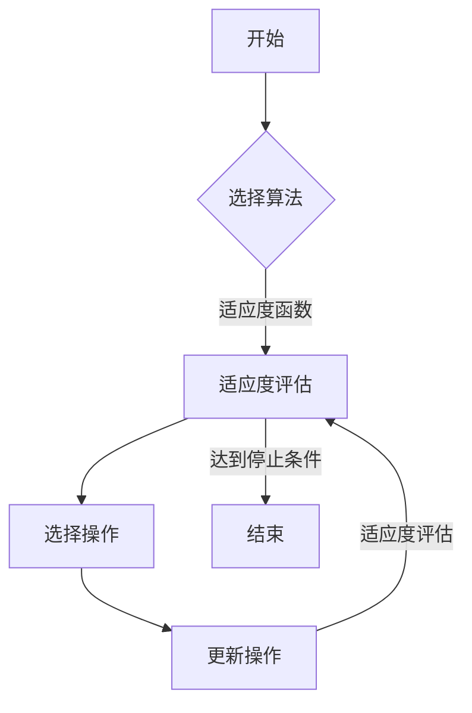

                 

### 目录大纲

为了撰写一篇内容丰富、逻辑清晰、具有深度和专业性的技术博客文章，我们将遵循以下详细的目录大纲结构。每个章节将具体阐述其主题，确保文章的内容结构紧凑，层次分明。

## 第一部分：背景介绍

### 1.1 问题背景

- **1.1.1 资源浪费现状**：描述当前资源浪费的现状，以及这对企业和整个社会的影响。
- **1.1.2 AI在资源优化中的应用**：介绍人工智能技术在资源优化领域的应用潜力，包括现有案例和研究。

### 1.2 智能资产优化平台

- **1.2.1 定义**：明确智能资产优化平台的概念和定义。
- **1.2.2 关键功能**：详细列出平台的核心功能，如资源监控、效率评估、优化策略等。
- **1.2.3 市场需求**：分析智能资产优化平台的市场需求和潜在的客户群体。

### 1.3 AI提升资源使用效率

- **1.3.1 基本原理**：阐述AI提升资源使用效率的基本原理，如机器学习、深度学习和优化算法等。
- **1.3.2 技术特点**：讨论AI技术提升资源使用效率的特点和优势。
- **1.3.3 应用领域**：列举AI技术在资源优化中的主要应用领域，如数据中心、物联网、智能制造等。

### 1.4 边界与外延

- **1.4.1 智能资产优化平台的适用范围**：讨论平台的适用范围和限制条件。
- **1.4.2 AI技术边界**：探讨AI技术的边界和未来发展方向。

### 1.5 本章小结

- 总结本章节的主要观点，为后续内容打下基础。

## 第二部分：核心概念与联系

### 2.1 智能资产优化平台核心概念

- **2.1.1 资产定义与分类**：详细解释资产的定义和分类方法。
- **2.1.2 优化目标**：明确智能资产优化平台的主要优化目标。
- **2.1.3 优化算法**：介绍常用的优化算法及其在平台中的应用。

### 2.2 AI技术在智能资产优化平台中的应用

- **2.2.1 机器学习算法**：讨论机器学习算法在资源优化中的应用和优势。
- **2.2.2 深度学习模型**：介绍深度学习模型及其在资源优化中的应用。
- **2.2.3 强化学习算法**：阐述强化学习算法在资源优化中的独特作用。

### 2.3 概念属性特征对比表格

- **2.3.1 算法对比**：列出不同算法的属性特征并进行对比。
- **2.3.2 技术对比**：对比不同AI技术在资源优化中的应用效果。

### 2.4 ER实体关系图架构

- **2.4.1 数据模型设计**：设计平台所需的数据模型。
- **2.4.2 关系映射**：解释实体关系图中的实体和关系。

### 2.5 本章小结

- 总结本章节的主要观点，为后续内容打下基础。

## 第三部分：算法原理讲解

### 3.1 智能优化算法原理

- **3.1.1 优化算法概述**：介绍智能优化算法的基本概念和分类。
- **3.1.2 算法流程图**：使用Mermaid绘制智能优化算法的流程图。

### 3.2 算法流程图（使用Mermaid绘制）



### 3.3 Python源代码讲解

```python
# Python代码示例
def optimize_resource(assets, algorithm):
    # 代码实现
    pass

# 算法原理详细讲解
```

### 3.4 数学模型和数学公式

$$
\text{适应度} = f(\text{资源利用率}, \text{效率})
$$

### 3.5 举例说明

- **3.5.1 实例1**：提供一个简单的优化实例，并解释其工作原理。
- **3.5.2 实例2**：提供另一个优化实例，展示不同算法在实例中的表现。

### 3.6 本章小结

- 总结本章节的主要观点，为后续内容打下基础。

## 第四部分：系统分析与架构设计方案

### 4.1 问题场景介绍

- **4.1.1 智能资产优化问题**：描述智能资产优化面临的实际问题和挑战。
- **4.1.2 现有解决方案**：分析现有解决方案的优缺点。

### 4.2 项目介绍

- **4.2.1 项目背景**：介绍项目的起源和目标。
- **4.2.2 项目目标**：明确项目希望达到的预期效果。

### 4.3 系统功能设计

- **4.3.1 功能模块**：详细列出系统的各个功能模块。
- **4.3.2 领域模型（使用Mermaid绘制类图）**：使用Mermaid绘制系统的类图，展示领域模型。

### 4.4 系统架构设计

- **4.4.1 系统架构**：介绍系统的整体架构。
- **4.4.2 架构设计（使用Mermaid绘制架构图）**：使用Mermaid绘制系统的架构图，展示系统模块之间的关系。

### 4.5 系统接口设计

- **4.5.1 接口规范**：详细描述系统接口的规范。
- **4.5.2 接口设计**：展示系统接口的设计图。

### 4.6 系统交互

- **4.6.1 交互流程（使用Mermaid绘制序列图）**：使用Mermaid绘制系统的交互序列图，展示系统组件之间的交互流程。

### 4.7 本章小结

- 总结本章节的主要观点，为后续内容打下基础。

## 第五部分：项目实战

### 5.1 环境安装

- **5.1.1 环境准备**：介绍项目所需的环境设置。
- **5.1.2 工具安装**：列出并解释所需的工具和库。

### 5.2 系统核心实现

- **5.2.1 核心模块代码**：展示系统核心模块的代码。
- **5.2.2 代码应用解读**：对核心代码进行解读和分析。

### 5.3 实际案例分析

- **5.3.1 案例背景**：描述案例的具体背景。
- **5.3.2 案例分析与解读**：分析案例中应用的算法和策略，并进行详细解读。

### 5.4 项目小结

- 总结项目的实现过程，分享经验和教训。

### 5.5 最佳实践 tips、小结、注意事项、拓展阅读

- **最佳实践 tips**：提供实施智能资产优化平台的最佳实践建议。
- **小结**：总结文章的主要观点和结论。
- **注意事项**：提醒读者注意的重要事项。
- **拓展阅读**：推荐进一步学习的资源。

通过上述详细的目录大纲，我们可以确保文章的内容结构合理，逻辑连贯，同时为撰写每个章节提供明确的方向和内容框架。在接下来的步骤中，我们将逐步填充每个章节的内容，确保文章的专业性和可读性。

