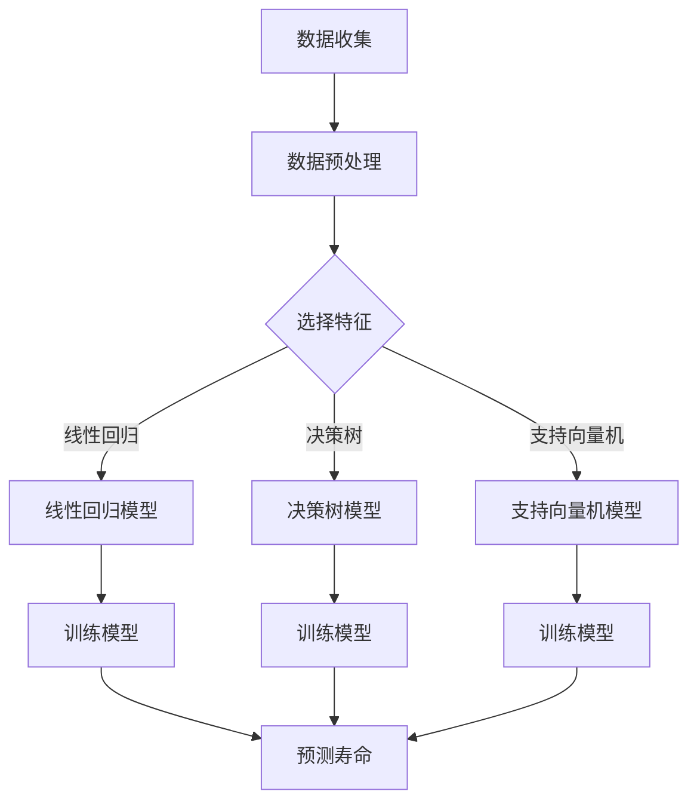

                 

## 文章标题

### 智能资产寿命预测：AI优化维护策略

---

### 关键词

- 智能资产寿命预测
- AI优化维护策略
- 机器学习算法
- 深度学习
- 强化学习

### 摘要

随着智能资产的广泛应用，如何准确预测其寿命并进行优化维护成为了工业界和学术界关注的热点问题。本文首先介绍了智能资产寿命预测的背景与重要性，然后详细探讨了AI在优化维护策略中的应用，包括数据收集与预处理、机器学习、深度学习和强化学习等算法原理。接着，文章讲解了智能资产寿命预测的数学模型与算法实现，并详细描述了系统设计与实现的全过程。最后，通过实际案例分析和最佳实践总结，为智能资产寿命预测提供了实用性的指导和建议。

---

### 目录大纲

---

### 第一部分：背景与概述

#### 第1章：问题背景与重要性

- 1.1 问题背景
  - 1.1.1 智能资产的定义与重要性
  - 1.1.2 资产寿命预测的重要性
- 1.2 问题描述
  - 1.2.1 传统资产寿命预测方法的局限性
  - 1.2.2 AI技术在资产寿命预测中的应用潜力

#### 第2章：核心概念与联系

- 2.1 智能资产寿命预测的基础概念
  - 2.1.1 资产维护策略
  - 2.1.2 数据驱动预测方法
- 2.2 AI优化维护策略的基本概念
  - 2.2.1 机器学习算法在资产寿命预测中的应用
  - 2.2.2 深度学习与强化学习在优化维护策略中的应用
- 2.3 核心概念属性特征对比表格
  - 2.3.1 不同机器学习算法的优缺点比较
  - 2.3.2 不同深度学习模型的特点

### 第二部分：AI优化维护策略

#### 第3章：智能资产寿命预测的数学模型与算法原理

- 3.1 数学模型介绍
  - 3.1.1 预测模型的基本框架
  - 3.1.2 数据预处理方法
- 3.2 算法原理讲解
  - 3.2.1 算法流程图
  - 3.2.2 数学公式与推导
  - 3.2.3 举例说明

#### 第4章：数据收集与预处理

- 4.1 数据收集方法
  - 4.1.1 资产运行数据采集
  - 4.1.2 维护记录数据收集
- 4.2 数据预处理
  - 4.2.1 数据清洗
  - 4.2.2 特征提取
  - 4.2.3 数据标准化

#### 第5章：机器学习算法在资产寿命预测中的应用

- 5.1 机器学习算法简介
  - 5.1.1 监督学习
  - 5.1.2 无监督学习
- 5.2 机器学习算法应用
  - 5.2.1 线性回归模型
  - 5.2.2 决策树模型
  - 5.2.3 支持向量机模型

#### 第6章：深度学习算法在优化维护策略中的应用

- 6.1 深度学习算法简介
  - 6.1.1 神经网络结构
  - 6.1.2 深度学习算法的发展历程
- 6.2 深度学习算法应用
  - 6.2.1 卷积神经网络（CNN）
  - 6.2.2 循环神经网络（RNN）
  - 6.2.3 生成对抗网络（GAN）

#### 第7章：强化学习算法在优化维护策略中的应用

- 7.1 强化学习算法简介
  - 7.1.1 强化学习的基本概念
  - 7.1.2 强化学习的算法框架
- 7.2 强化学习算法应用
  - 7.2.1 Q-learning算法
  - 7.2.2 Deep Q Network（DQN）
  - 7.2.3 Policy Gradient方法

### 第三部分：系统设计与实现

#### 第8章：系统设计与实现

- 8.1 系统功能设计
  - 8.1.1 预测模块设计
  - 8.1.2 维护策略优化模块设计
- 8.2 系统架构设计
  - 8.2.1 系统整体架构
  - 8.2.2 系统模块间交互设计
- 8.3 系统接口设计
  - 8.3.1 接口规范与设计
  - 8.3.2 接口安全与性能优化
- 8.4 系统交互设计
  - 8.4.1 系统流程图
  - 8.4.2 系统序列图

#### 第9章：项目实战与案例分析

- 9.1 环境安装与配置
  - 9.1.1 硬件环境需求
  - 9.1.2 软件环境搭建
- 9.2 系统核心实现
  - 9.2.1 数据采集与预处理
  - 9.2.2 机器学习算法实现
  - 9.2.3 深度学习算法实现
  - 9.2.4 强化学习算法实现
- 9.3 实际案例分析
  - 9.3.1 案例一：电网设备寿命预测
  - 9.3.2 案例二：汽车发动机维护策略优化
- 9.4 项目小结
  - 9.4.1 项目总结
  - 9.4.2 项目改进方向

### 第四部分：最佳实践与拓展阅读

#### 第10章：最佳实践与拓展阅读

- 10.1 最佳实践
  - 10.1.1 数据预处理技巧
  - 10.1.2 模型选择与调优
  - 10.1.3 系统部署与维护
- 10.2 小结
- 10.3 注意事项
- 10.4 拓展阅读

---

### 第一部分：背景与概述

#### 第1章：问题背景与重要性

### 1.1 问题背景

#### 1.1.1 智能资产的定义与重要性

在当今数字化和自动化快速发展的时代，智能资产已成为企业运营和产业升级的关键要素。所谓智能资产，是指那些嵌入了一定程度智能特性的物理设备、系统或软件，这些资产能够通过传感器、物联网（IoT）和人工智能（AI）技术进行实时监控、分析和决策。智能资产涵盖了广泛的领域，如工业制造、交通运输、医疗设备、能源管理、农业科技等。

智能资产在现代社会中的重要性不可忽视。首先，它们能够显著提高生产效率，降低运营成本。通过自动化和智能化的手段，企业可以更精确地控制生产过程，优化资源配置，减少资源浪费。其次，智能资产能够提升服务质量和用户体验。例如，智能交通系统可以实时监控交通状况，优化交通信号配置，减少拥堵，提高出行效率。再者，智能资产还能够增强企业的创新能力，推动产业升级和转型。随着AI技术的不断进步，智能资产的功能将更加丰富，为企业带来更多发展机遇。

#### 1.1.2 资产寿命预测的重要性

资产寿命预测是智能资产管理中一个至关重要的环节。资产寿命预测旨在通过分析历史数据和实时监测数据，预测资产的剩余使用寿命，为维护和更换提供科学依据。准确的资产寿命预测不仅能提前预警潜在故障，减少意外停机和维修成本，还能优化维护计划，延长资产的使用寿命，提高整体运营效率。

资产寿命预测的重要性体现在以下几个方面：

1. **预防性维护**：通过预测资产寿命，企业可以实施预防性维护策略，避免突发故障导致的停机和生产中断。预防性维护相比传统的反应性维护，能够更有效地降低维修成本和停机时间。

2. **成本控制**：准确的资产寿命预测有助于企业合理安排维护预算，避免因过度维护或缺乏维护导致的成本浪费。通过优化维护时间和方式，企业可以实现成本的最大化效益。

3. **资源优化**：资产寿命预测可以为企业提供关于设备使用状况的详细数据，有助于优化资源配置。企业可以根据预测结果，合理规划设备更新和采购计划，避免资源短缺或过剩。

4. **决策支持**：资产寿命预测为企业的决策提供了科学依据。通过预测资产剩余寿命，企业可以更好地制定设备更新、报废和替换计划，确保生产连续性和运营稳定性。

### 1.2 问题描述

#### 1.2.1 传统资产寿命预测方法的局限性

传统的资产寿命预测方法主要依赖于经验模型和统计学方法，如基于规则的专家系统、回归分析、时间序列分析等。这些方法在一定程度上能够实现资产寿命的预测，但存在以下局限性：

1. **数据依赖性**：传统方法往往依赖于大量历史数据，而实际中数据的获取可能存在困难，尤其是在早期设备缺乏传感器和数据采集系统的情况下。

2. **模型适用性**：传统方法通常假设资产寿命服从某种特定的分布模型，如正态分布、指数分布等。然而，实际中资产寿命分布可能更为复杂，不一定符合这些简单模型。

3. **预测精度**：由于传统方法对数据的依赖性和模型的局限性，预测结果往往不够准确，难以满足现代工业对高精度预测的需求。

4. **实时性**：传统方法通常不能实时获取和更新数据，预测结果滞后，难以支持实时决策。

#### 1.2.2 AI技术在资产寿命预测中的应用潜力

随着AI技术的发展，机器学习、深度学习和强化学习等技术在资产寿命预测中展现出了巨大的应用潜力。AI技术的引入能够解决传统方法的局限性，提高预测的准确性和实时性。

1. **数据处理能力**：AI技术能够处理大规模、多维度的数据，并从中提取出有效的特征，为资产寿命预测提供更丰富的信息。

2. **自适应能力**：AI算法能够根据数据变化自适应调整预测模型，提高模型的适应性和预测精度。

3. **实时性**：AI技术能够实时获取和更新数据，实现资产寿命预测的实时性，支持实时决策。

4. **模型多样化**：AI技术支持多样化的预测模型，如深度学习模型、强化学习模型等，可以更好地适应不同场景和需求。

总之，AI技术在资产寿命预测中的应用不仅能够提高预测的准确性和实时性，还能够为企业提供更为科学和有效的维护策略，具有重要的现实意义和广阔的应用前景。

### 第2章：核心概念与联系

#### 2.1 智能资产寿命预测的基础概念

在探讨智能资产寿命预测之前，有必要先了解一些基础概念，这些概念构成了资产寿命预测的理论基础。

#### 2.1.1 资产维护策略

资产维护策略是指为了确保资产在整个生命周期内保持良好状态，所采取的一系列维护措施和行动。常见的维护策略包括预防性维护、响应性维护和预测性维护。

1. **预防性维护**：预防性维护是一种基于时间或使用周期的维护策略，旨在通过定期检查和更换部件来防止故障的发生。这种方法通常适用于那些运行环境较为稳定、故障模式相对明确的资产。

2. **响应性维护**：响应性维护是基于故障发生后的修复和更换，即只有在资产发生故障时才进行维护。这种方法虽然成本较低，但可能会导致生产中断和额外的维修成本。

3. **预测性维护**：预测性维护是一种基于对资产状态实时监控和预测的维护策略。通过收集和分析资产运行数据，预测潜在的故障和失效时间，从而提前进行维护。这种方法能够最大限度地减少故障对生产的影响，并优化维护成本。

#### 2.1.2 数据驱动预测方法

数据驱动预测方法是指通过分析历史数据来预测未来资产状态和寿命的一种方法。这种方法的的核心在于利用机器学习、深度学习和统计模型等工具，从大量数据中提取出有用的信息和模式，用于预测资产的剩余寿命。

1. **监督学习**：监督学习是一种通过已知标签数据来训练模型，从而预测未知数据的方法。在资产寿命预测中，监督学习可以用于建立资产寿命与各种特征变量之间的关系模型。

2. **无监督学习**：无监督学习是不依赖标签数据的，旨在发现数据中的隐含结构和模式。在资产寿命预测中，无监督学习可以用于分析资产运行数据的分布特征和聚类模式，为后续的监督学习提供支持。

3. **深度学习**：深度学习是一种基于多层神经网络的学习方法，能够自动提取数据中的复杂特征。在资产寿命预测中，深度学习可以用于构建高维数据的复杂模型，提高预测的准确性。

4. **强化学习**：强化学习是一种基于反馈机制的学习方法，通过与环境的交互来不断优化策略。在资产寿命预测中，强化学习可以用于制定自适应的维护策略，根据资产状态和环境变化调整维护计划。

#### 2.2 AI优化维护策略的基本概念

AI优化维护策略是指利用人工智能技术来制定和维护策略，以最大限度地延长资产寿命和提高运营效率。这种策略的核心在于利用数据分析和机器学习算法，实现维护决策的自动化和优化。

1. **机器学习算法在资产寿命预测中的应用**：机器学习算法是AI优化维护策略的核心工具。常见的机器学习算法包括线性回归、决策树、支持向量机等。这些算法可以用于建立资产寿命与各种特征变量之间的预测模型，从而预测资产的剩余寿命。

2. **深度学习与强化学习在优化维护策略中的应用**：深度学习是一种能够自动提取复杂特征的学习方法，适用于处理高维数据。在资产寿命预测中，深度学习可以用于构建复杂的预测模型，提高预测的准确性。强化学习则是一种通过反馈机制不断优化策略的方法，适用于动态环境和不确定场景。

#### 2.3 核心概念属性特征对比表格

为了更好地理解智能资产寿命预测中的核心概念，我们可以通过一个对比表格来总结不同机器学习算法和深度学习模型的优缺点。

| 算法类型 | 优点 | 缺点 | 适用场景 |
| --- | --- | --- | --- |
| 线性回归 | 简单易懂，易于实现 | 预测能力有限，对非线性数据效果差 | 数据线性关系较强的场景 |
| 决策树 | 易于解释，处理非线性数据 | 过拟合风险高，可解释性弱 | 数据非线性关系较强的场景 |
| 支持向量机 | 预测能力强，泛化性好 | 计算复杂度高，对噪声敏感 | 数据量较大的场景 |
| 卷积神经网络 | 自动提取特征，处理高维数据 | 计算资源需求高，模型复杂度高 | 图像、语音等高维数据的处理 |
| 循环神经网络 | 能够处理序列数据 | 计算复杂度高，训练时间较长 | 时间序列数据分析 |
| 生成对抗网络 | 能够生成高质量的数据 | 计算复杂度高，对训练数据要求高 | 数据生成、图像处理等场景 |

通过上述对比表格，我们可以更清晰地了解不同算法的适用场景和优缺点，为智能资产寿命预测中的算法选择提供参考。

### 第3章：智能资产寿命预测的数学模型与算法原理

#### 3.1 数学模型介绍

智能资产寿命预测的数学模型是整个预测系统的核心，它通过分析历史数据和实时监测数据，建立资产寿命与各种特征变量之间的关系。下面，我们将详细介绍智能资产寿命预测的基本数学模型和数据处理方法。

##### 3.1.1 预测模型的基本框架

智能资产寿命预测模型的基本框架通常包括以下几个关键部分：

1. **输入特征**：输入特征是预测模型的基础，它们代表了资产的运行状态和历史记录。常见的输入特征包括温度、压力、速度、负荷等。这些特征可以通过传感器实时采集，或者从历史数据中提取。

2. **特征工程**：特征工程是数据处理的重要步骤，它通过选择、构造和转换特征，提高预测模型的性能。特征工程的方法包括特征选择、特征转换和特征融合等。

3. **预测模型**：预测模型是整个系统的核心，它通过学习输入特征与资产寿命之间的关系，实现对资产剩余寿命的预测。常见的预测模型包括线性回归、决策树、支持向量机等。

4. **损失函数**：损失函数是评估预测模型性能的重要指标，它用于衡量预测结果与实际结果之间的差距。常见的损失函数包括均方误差（MSE）、交叉熵等。

5. **优化算法**：优化算法用于最小化损失函数，找到最佳的模型参数。常见的优化算法包括梯度下降、随机梯度下降等。

##### 3.1.2 数据预处理方法

数据预处理是智能资产寿命预测中至关重要的一步，它能够提高数据的质量和模型的预测性能。常见的数据预处理方法包括数据清洗、特征提取和数据标准化等。

1. **数据清洗**：数据清洗是指去除数据中的噪声和异常值，提高数据的质量。常见的方法包括缺失值处理、异常值检测和去除等。

2. **特征提取**：特征提取是指从原始数据中提取出有用的特征，用于建模。特征提取的方法包括特征选择、特征转换和特征构造等。

3. **数据标准化**：数据标准化是指将不同量纲的特征数据转换到同一尺度，以便进行建模。常见的方法包括归一化、标准化和极值缩放等。

#### 3.2 算法原理讲解

在智能资产寿命预测中，不同的算法原理和流程可以应用于不同的预测任务。下面，我们将分别介绍线性回归、决策树和支持向量机等常见算法的原理和流程。

##### 3.2.1 算法流程图

为了更好地理解算法原理，我们可以通过流程图来展示每个算法的基本流程。



##### 3.2.2 数学公式与推导

1. **线性回归模型**

线性回归模型的公式为：

\[ y = \beta_0 + \beta_1 \cdot x \]

其中，\( y \) 是预测的资产寿命，\( x \) 是输入特征，\( \beta_0 \) 和 \( \beta_1 \) 是模型的参数。

线性回归模型的推导基于最小二乘法，即找到一组参数，使得预测值与实际值之间的误差平方和最小。

2. **决策树模型**

决策树模型的公式为：

\[ y = f(x) = \prod_{i=1}^{n} g(x_i; \theta_i) \]

其中，\( y \) 是预测的资产寿命，\( x \) 是输入特征，\( g(x_i; \theta_i) \) 是第 \( i \) 个节点的函数，\( \theta_i \) 是节点的参数。

决策树的构建过程是基于信息增益或基尼系数等指标，选择最优的特征和分割点。

3. **支持向量机模型**

支持向量机模型的公式为：

\[ y = \text{sign}(\sum_{i=1}^{n} \alpha_i y_i (x_i)^T w + b) \]

其中，\( y \) 是预测的资产寿命，\( x \) 是输入特征，\( \alpha_i \) 是支持向量的权重，\( y_i \) 是支持向量的标签，\( w \) 是模型的权重，\( b \) 是偏置。

支持向量机的推导基于最大化间隔分类器，即找到一组最优的权重和偏置，使得分类间隔最大化。

##### 3.2.3 举例说明

为了更好地理解算法原理，我们可以通过一个具体的例子来说明。

假设我们要预测某型工业机器人的使用寿命，输入特征包括温度、压力和负荷。我们选择线性回归模型进行预测。

1. **数据收集**：收集过去一段时间内机器人的运行数据，包括温度、压力和负荷，以及对应的使用寿命。

2. **数据预处理**：对数据进行清洗，去除异常值，并进行归一化处理，将不同量纲的特征数据转换到同一尺度。

3. **特征选择**：选择温度、压力和负荷作为输入特征，构建线性回归模型。

4. **模型训练**：使用收集到的数据，通过最小二乘法训练线性回归模型，得到参数 \( \beta_0 \) 和 \( \beta_1 \)。

5. **预测寿命**：使用训练好的模型，对新的输入数据进行预测，计算机器人的剩余使用寿命。

假设我们有以下训练数据：

| 温度 | 压力 | 负荷 | 使用寿命 |
| --- | --- | --- | --- |
| 30 | 40 | 20 | 5000 |
| 35 | 45 | 25 | 6000 |
| 32 | 38 | 22 | 5500 |

通过线性回归模型训练，我们得到参数：

\[ y = 2000 + 0.5 \cdot x \]

其中，\( y \) 是机器人的使用寿命，\( x \) 是输入特征（温度、压力和负荷的组合）。

6. **预测结果**：假设新的输入数据为温度 32°C，压力 38°C，负荷 22kg，代入模型进行预测：

\[ y = 2000 + 0.5 \cdot (32 + 38 + 22) = 5000 \]

预测结果显示，该型工业机器人剩余使用寿命为5000小时。

通过上述例子，我们可以看到，线性回归模型可以有效地预测工业机器人的使用寿命。类似的方法可以应用于其他类型的资产寿命预测，如汽车发动机、电网设备等。

### 第二部分：AI优化维护策略

#### 第4章：数据收集与预处理

##### 4.1 数据收集方法

数据收集是智能资产寿命预测的关键步骤，准确的资产运行数据是预测模型的基础。下面，我们将介绍数据收集的方法，包括资产运行数据采集和维护记录数据收集。

##### 4.1.1 资产运行数据采集

资产运行数据是指资产在运行过程中产生的各种数据，如温度、压力、速度、负荷等。这些数据可以通过传感器实时采集，或者从历史记录中提取。

1. **传感器部署**：在资产的关键部位安装传感器，如温度传感器、压力传感器、速度传感器等。传感器可以实时监测资产的运行状态，并将数据传输到数据收集系统。

2. **数据传输**：传感器采集的数据可以通过有线或无线方式传输到数据收集系统。有线方式如以太网、串口等，无线方式如Wi-Fi、蓝牙等。

3. **数据收集系统**：数据收集系统是一个集中处理和存储数据的服务器或云平台。数据收集系统可以实时接收传感器数据，进行初步处理和存储，以便后续分析和建模。

##### 4.1.2 维护记录数据收集

维护记录数据是指资产在维护过程中产生的各种记录，如维护时间、维护内容、更换部件等。这些数据通常记录在维护日志、保养记录等文档中。

1. **手工记录**：维护人员可以在维护过程中手工记录相关数据，包括维护时间、维护内容、更换部件等。这些记录可以定期整理和汇总，形成维护日志。

2. **电子记录**：随着信息化技术的发展，越来越多的企业开始使用电子维护记录系统，如ERP系统、MES系统等。这些系统可以自动记录和维护数据，提高数据的准确性和可追溯性。

3. **数据集成**：将手工记录的维护数据和电子记录的维护数据进行整合，形成一个统一的数据源。这样可以更全面地了解资产的维护历史，为寿命预测提供更多参考信息。

##### 4.2 数据预处理

数据预处理是数据收集后的重要步骤，它能够提高数据的质量和模型的预测性能。常见的数据预处理方法包括数据清洗、特征提取和数据标准化等。

##### 4.2.1 数据清洗

数据清洗是指去除数据中的噪声和异常值，提高数据的质量。常见的数据清洗方法包括以下几种：

1. **缺失值处理**：缺失值是指数据中未记录的值，可以通过以下方法进行处理：
   - 删除：删除包含缺失值的记录，适用于缺失值较多的情况。
   - 补充：用平均值、中位数等方法补充缺失值，适用于缺失值较少的情况。
   - 降维：将包含缺失值的特征降维，如使用主成分分析（PCA）等方法。

2. **异常值检测**：异常值是指数据中与整体分布不一致的值，可以通过以下方法进行检测和处理：
   - 离群点检测：使用统计学方法，如Z-score、IQR等，检测数据中的离群点，并将其删除或修正。
   - 特征工程：通过对特征进行转换或构造，减少异常值对模型的影响。

##### 4.2.2 特征提取

特征提取是指从原始数据中提取出有用的特征，用于建模。特征提取的方法包括以下几种：

1. **特征选择**：通过筛选和选择与目标变量相关性较高的特征，提高模型的预测性能。常见的特征选择方法包括过滤式、包裹式和嵌入式等。

2. **特征转换**：通过转换和构造新的特征，提高模型的预测性能。常见的特征转换方法包括归一化、标准化、多项式特征等。

3. **特征融合**：将多个特征进行融合，生成新的特征，以提高模型的预测性能。常见的特征融合方法包括加法融合、乘法融合、加权融合等。

##### 4.2.3 数据标准化

数据标准化是指将不同量纲的特征数据转换到同一尺度，以便进行建模。常见的数据标准化方法包括以下几种：

1. **归一化**：将特征值缩放到[0,1]或[-1,1]之间，常用的归一化方法有Min-Max归一化和Z-Score归一化。

2. **标准化**：将特征值缩放到标准正态分布，即均值为0，标准差为1。标准化方法适用于特征值范围较大且需要保持特征之间关系的情况。

3. **极值缩放**：将特征值缩放到最小值和最大值之间，常用的极值缩放方法有线性缩放和平方根缩放。

通过数据清洗、特征提取和数据标准化等预处理方法，可以提高数据的质量和模型的预测性能，为智能资产寿命预测提供可靠的数据支持。

### 第5章：机器学习算法在资产寿命预测中的应用

#### 5.1 机器学习算法简介

机器学习算法是智能资产寿命预测中的核心技术，通过学习历史数据和实时监测数据，建立资产寿命与各种特征变量之间的关系，实现对资产剩余寿命的预测。本节将介绍机器学习算法的基本概念和主要类型，以及它们在资产寿命预测中的应用。

##### 5.1.1 监督学习

监督学习是一种最常见的机器学习算法，它通过训练数据集学习输入特征与目标变量之间的关系，然后利用这个关系对新数据进行分析和预测。在资产寿命预测中，监督学习算法可以用于建立资产寿命与各种特征变量（如温度、压力、速度等）之间的关系模型。

监督学习算法的核心步骤包括：

1. **数据收集与预处理**：收集资产的历史运行数据和寿命数据，进行数据清洗、特征提取和数据标准化等预处理操作。
2. **模型选择**：选择合适的监督学习算法，如线性回归、决策树、支持向量机等。
3. **模型训练**：使用预处理后的数据集，对所选算法进行训练，找到最佳的模型参数。
4. **模型评估**：使用验证集或测试集评估模型的预测性能，调整模型参数以提高预测准确性。
5. **模型应用**：将训练好的模型应用于新的数据，进行资产寿命预测。

监督学习算法的优点包括：

- **高预测准确性**：通过学习历史数据，能够建立较为准确的预测模型。
- **易于实现与理解**：大多数监督学习算法都相对简单，易于实现和理解。

监督学习算法的缺点包括：

- **数据依赖性**：监督学习算法对训练数据量有较高要求，数据不足可能导致模型过拟合。
- **实时性较差**：监督学习算法通常需要大量时间进行训练和评估，实时性较差。

##### 5.1.2 无监督学习

无监督学习是一种不依赖标签数据的机器学习算法，旨在发现数据中的隐含结构和模式。在资产寿命预测中，无监督学习算法可以用于分析资产运行数据的分布特征和聚类模式，为后续的监督学习提供支持。

无监督学习算法的核心步骤包括：

1. **数据收集与预处理**：收集资产的历史运行数据，进行数据清洗、特征提取和数据标准化等预处理操作。
2. **模式发现**：使用无监督学习算法，如聚类算法、降维算法等，发现数据中的隐含结构和模式。
3. **模型优化**：根据模式发现结果，调整算法参数，优化模型性能。
4. **模型应用**：将优化后的模型应用于新的数据，进行资产寿命预测。

无监督学习算法的优点包括：

- **无需标签数据**：适用于数据标签不足或难以获取的场景。
- **数据降维**：能够将高维数据降维到较低维度，便于后续分析和建模。

无监督学习算法的缺点包括：

- **预测准确性较低**：由于缺乏标签数据，无监督学习算法的预测准确性通常较低。
- **算法复杂度较高**：部分无监督学习算法（如降维算法）的计算复杂度较高，可能导致计算时间较长。

##### 5.1.3 监督学习与无监督学习的应用对比

监督学习与无监督学习在资产寿命预测中的应用各有优劣。在实际应用中，可以结合两种方法，发挥各自的优势。

1. **结合监督学习与无监督学习**：可以先使用无监督学习算法对资产运行数据进行分析，发现数据的分布特征和聚类模式，然后使用监督学习算法进行寿命预测。这种方法能够充分利用数据信息，提高预测准确性。
2. **数据集选择**：对于数据标签丰富的场景，可以使用监督学习算法；对于数据标签不足或难以获取的场景，可以使用无监督学习算法。
3. **算法优化**：结合无监督学习与监督学习的结果，可以对模型进行优化，提高预测性能。

总之，机器学习算法在资产寿命预测中具有广泛的应用前景，通过合理选择和优化算法，可以有效地预测资产的剩余寿命，为企业提供科学的维护策略。

#### 5.2 机器学习算法应用

在智能资产寿命预测中，机器学习算法的应用主要集中在建立预测模型、优化模型参数和评估模型性能等方面。下面，我们将详细介绍几种常用的机器学习算法，包括线性回归模型、决策树模型和支持向量机模型，并展示它们在资产寿命预测中的应用。

##### 5.2.1 线性回归模型

线性回归模型是一种经典的监督学习算法，适用于建立输入特征与目标变量之间的线性关系。在资产寿命预测中，线性回归模型可以用于预测资产的剩余寿命。

线性回归模型的公式为：

\[ y = \beta_0 + \beta_1 \cdot x \]

其中，\( y \) 是资产的剩余寿命，\( x \) 是输入特征（如温度、压力、负荷等），\( \beta_0 \) 和 \( \beta_1 \) 是模型的参数。

线性回归模型的实现步骤如下：

1. **数据收集与预处理**：收集资产的历史运行数据和寿命数据，进行数据清洗、特征提取和数据标准化等预处理操作。
2. **模型训练**：使用预处理后的数据集，通过最小二乘法训练线性回归模型，找到最佳的参数 \( \beta_0 \) 和 \( \beta_1 \)。
3. **模型评估**：使用验证集或测试集评估模型的预测性能，计算预测误差，如均方误差（MSE）。
4. **模型应用**：将训练好的模型应用于新的数据，进行资产寿命预测。

线性回归模型的优势在于：

- **简单易懂**：线性回归模型的公式简单，易于理解和实现。
- **计算效率高**：线性回归模型的计算复杂度较低，适用于大数据量的预测任务。

线性回归模型的劣势在于：

- **线性假设**：线性回归模型假设输入特征与目标变量之间存在线性关系，对于非线性关系的数据，预测效果较差。
- **过拟合风险**：如果训练数据量不足，线性回归模型容易过拟合，导致预测性能下降。

##### 5.2.2 决策树模型

决策树模型是一种基于树结构的分类算法，适用于建立输入特征与目标变量之间的决策规则。在资产寿命预测中，决策树模型可以用于预测资产的剩余寿命。

决策树模型的实现步骤如下：

1. **数据收集与预处理**：收集资产的历史运行数据和寿命数据，进行数据清洗、特征提取和数据标准化等预处理操作。
2. **特征选择**：选择对资产寿命影响较大的特征作为决策树模型的输入。
3. **模型训练**：使用预处理后的数据集，通过递归二分划分算法训练决策树模型，生成决策规则。
4. **模型评估**：使用验证集或测试集评估模型的预测性能，计算预测误差，如准确率、召回率等。
5. **模型应用**：将训练好的模型应用于新的数据，进行资产寿命预测。

决策树模型的优势在于：

- **易于解释**：决策树模型的决策规则直观，易于理解和解释。
- **适应性强**：决策树模型可以处理非线性数据和缺失值。

决策树模型的劣势在于：

- **过拟合风险**：如果决策树过深，容易过拟合，导致预测性能下降。
- **计算复杂度高**：决策树模型的训练和预测时间较长，计算复杂度较高。

##### 5.2.3 支持向量机模型

支持向量机（SVM）是一种基于间隔分类器的监督学习算法，适用于建立输入特征与目标变量之间的非线性关系。在资产寿命预测中，SVM可以用于预测资产的剩余寿命。

SVM模型的实现步骤如下：

1. **数据收集与预处理**：收集资产的历史运行数据和寿命数据，进行数据清洗、特征提取和数据标准化等预处理操作。
2. **特征选择**：选择对资产寿命影响较大的特征作为SVM模型的输入。
3. **模型训练**：使用预处理后的数据集，通过求解最优间隔分类器，训练SVM模型，找到最佳的参数。
4. **模型评估**：使用验证集或测试集评估模型的预测性能，计算预测误差，如均方误差（MSE）。
5. **模型应用**：将训练好的模型应用于新的数据，进行资产寿命预测。

SVM模型的优势在于：

- **高预测准确性**：SVM模型通过最大化分类间隔，能够实现较高的预测准确性。
- **适用于非线性关系**：SVM模型可以通过核函数实现非线性分类，适用于复杂的数据关系。

SVM模型的劣势在于：

- **计算复杂度高**：SVM模型的训练和预测时间较长，计算复杂度较高。
- **对参数敏感**：SVM模型的预测性能对参数选择敏感，需要通过交叉验证等方法进行参数调优。

总之，机器学习算法在资产寿命预测中的应用具有广泛的前景。通过合理选择和优化算法，可以有效地预测资产的剩余寿命，为企业提供科学的维护策略。

### 第6章：深度学习算法在优化维护策略中的应用

#### 6.1 深度学习算法简介

深度学习（Deep Learning）是机器学习的一个子领域，其核心思想是通过构建多层神经网络模型，模拟人脑的学习方式，对大量数据进行分析和特征提取。深度学习算法在图像识别、语音识别、自然语言处理等领域取得了显著成果，并在智能资产寿命预测中展现出巨大的潜力。

##### 6.1.1 神经网络结构

神经网络（Neural Network，NN）是深度学习算法的基础，其结构类似于人脑的神经元连接。一个基本的神经网络包括输入层、隐藏层和输出层。

1. **输入层**：输入层接收外部输入，如温度、压力、速度等特征数据。
2. **隐藏层**：隐藏层通过激活函数对输入数据进行处理和转换，提取出更高层次的特征。神经网络可以包含一个或多个隐藏层。
3. **输出层**：输出层产生最终的预测结果，如资产的剩余寿命。

每个隐藏层中的神经元通过权重矩阵和偏置项连接，形成一个完整的神经网络模型。通过训练数据集，神经网络可以不断调整权重和偏置，优化模型的预测性能。

##### 6.1.2 深度学习算法的发展历程

深度学习算法的发展历程可以分为以下几个阶段：

1. **1980年代**：神经网络研究进入低谷期，主要原因是模型复杂度和计算资源限制。
2. **2000年代**：随着计算能力和数据资源的提升，神经网络研究重新兴起，卷积神经网络（CNN）和循环神经网络（RNN）等算法得到发展。
3. **2010年代**：深度学习算法在图像识别、语音识别等领域取得突破性成果，如AlexNet、VGGNet等模型在ImageNet图像识别竞赛中表现出色。
4. **2020年代**：深度学习算法在自动驾驶、自然语言处理、智能推荐等领域得到广泛应用，成为人工智能研究的主流方向。

##### 6.1.3 深度学习算法的优势

深度学习算法在智能资产寿命预测中具有以下优势：

1. **自动特征提取**：深度学习算法能够自动从大量数据中提取出有用的特征，减少人工特征工程的工作量，提高模型的预测准确性。
2. **处理复杂数据**：深度学习算法能够处理高维、非线性数据和时序数据，适用于各种复杂的预测任务。
3. **自适应调整**：深度学习算法能够根据数据变化自适应调整模型参数，提高模型的预测实时性和适应性。

#### 6.2 深度学习算法应用

在智能资产寿命预测中，深度学习算法的应用主要集中在卷积神经网络（CNN）、循环神经网络（RNN）和生成对抗网络（GAN）等模型。

##### 6.2.1 卷积神经网络（CNN）

卷积神经网络（Convolutional Neural Network，CNN）是一种专门用于处理图像数据的深度学习算法，其核心思想是通过卷积操作提取图像特征。

CNN的基本结构包括卷积层、池化层和全连接层。

1. **卷积层**：卷积层通过卷积操作提取图像特征，卷积核（Convolution Kernel）在图像上滑动，计算局部特征。
2. **池化层**：池化层用于降低数据维度和减少过拟合，常见的池化方法有最大池化和平均池化。
3. **全连接层**：全连接层将卷积层提取的特征映射到输出层，生成最终的预测结果。

CNN在资产寿命预测中的应用：

- **图像数据预处理**：对于资产故障图像，如机器磨损图像，使用CNN提取图像特征，作为输入特征。
- **时序数据预处理**：对于资产运行数据的时序特征，使用CNN提取时间序列特征，提高模型的预测性能。

##### 6.2.2 循环神经网络（RNN）

循环神经网络（Recurrent Neural Network，RNN）是一种专门用于处理序列数据的深度学习算法，其核心思想是通过循环结构保留序列信息。

RNN的基本结构包括输入层、隐藏层和输出层。

1. **输入层**：输入层接收外部输入，如时间序列数据。
2. **隐藏层**：隐藏层通过循环结构对输入数据进行处理和转换，提取出序列特征。
3. **输出层**：输出层生成最终的预测结果，如资产的剩余寿命。

RNN在资产寿命预测中的应用：

- **时间序列预测**：对于资产运行数据的时序特征，使用RNN提取时间序列特征，建立序列预测模型。
- **故障诊断**：对于资产故障数据，使用RNN识别故障模式，预测故障发生时间。

##### 6.2.3 生成对抗网络（GAN）

生成对抗网络（Generative Adversarial Network，GAN）是一种基于博弈论的深度学习算法，由生成器和判别器两个模型组成。

GAN的基本结构包括生成器（Generator）和判别器（Discriminator）。

1. **生成器**：生成器通过学习数据分布，生成与真实数据相似的数据。
2. **判别器**：判别器通过区分真实数据和生成数据，评估生成器的生成质量。

GAN在资产寿命预测中的应用：

- **数据增强**：使用GAN生成与真实数据相似的数据，增加训练数据量，提高模型泛化能力。
- **故障预测**：使用GAN生成的故障数据，训练故障诊断模型，提高故障预测准确性。

总之，深度学习算法在智能资产寿命预测中的应用具有广泛的前景，通过合理选择和优化算法，可以有效地提高预测准确性和实时性，为企业提供科学的维护策略。

### 第7章：强化学习算法在优化维护策略中的应用

#### 7.1 强化学习算法简介

强化学习（Reinforcement Learning，RL）是机器学习的一个分支，其核心思想是通过与环境交互，学习最优策略以实现目标。在强化学习算法中，智能体（Agent）通过不断接收环境（Environment）的反馈，调整自身的策略（Policy），以最大化累积奖励（Reward）。

强化学习算法的基本组成部分包括：

1. **智能体（Agent）**：执行行动的主体，通过感知环境状态，选择行动，并接收环境反馈。
2. **环境（Environment）**：智能体执行行动的场所，提供当前状态（State）和奖励（Reward）。
3. **策略（Policy）**：智能体根据当前状态选择行动的规则。
4. **状态（State）**：描述智能体当前所处的情况。
5. **行动（Action）**：智能体在特定状态下执行的操作。
6. **奖励（Reward）**：环境对智能体行动的即时反馈，用于评估行动的好坏。

强化学习算法的主要特点包括：

- **自适应性**：强化学习算法能够根据环境变化和经验调整策略，适应动态环境。
- **交互性**：强化学习算法通过与环境交互获取反馈，不断优化策略。
- **不确定性**：强化学习算法在处理不确定环境和未知状态时具有优势。

#### 7.1.1 强化学习的基本概念

强化学习可以分为基于模型（Model-Based）和基于模型（Model-Free）两种类型。

1. **基于模型（Model-Based）**：基于模型的方法通过建立环境模型，预测未来状态和奖励，优化策略。该方法通常包括状态转移概率和奖励函数的估计。
   - **马尔可夫决策过程（MDP）**：状态转移概率和奖励函数可以用概率分布表示，形成马尔可夫决策过程。
   - **策略迭代算法**：通过迭代优化策略，逐步逼近最优策略。

2. **基于模型（Model-Free）**：基于模型的方法不依赖环境模型，直接从经验和交互中学习策略。
   - **价值迭代算法**：通过迭代计算状态值函数和策略，优化策略。
   - **策略梯度方法**：通过梯度上升方法，优化策略参数，实现策略迭代。

#### 7.1.2 强化学习的算法框架

强化学习算法通常包含以下几个关键步骤：

1. **初始化**：初始化智能体、环境、策略和状态值函数。
2. **状态观测**：智能体观察当前状态。
3. **策略选择**：智能体根据当前状态和策略选择行动。
4. **执行行动**：智能体在环境中执行所选行动。
5. **反馈接收**：环境根据智能体行动提供奖励和下一状态。
6. **策略更新**：根据奖励和反馈调整策略，优化策略。
7. **重复**：重复以上步骤，直到达到预定的目标或收敛条件。

#### 7.2 强化学习算法应用

在智能资产寿命预测中，强化学习算法可以用于优化维护策略，提高资产使用效率和寿命。以下介绍几种常见的强化学习算法在优化维护策略中的应用。

##### 7.2.1 Q-learning算法

Q-learning算法是一种基于模型（Model-Free）的强化学习算法，通过更新Q值（状态-行动值函数）来优化策略。

Q-learning算法的核心步骤包括：

1. **初始化Q值函数**：初始化所有状态-行动的Q值。
2. **选择行动**：根据当前状态和策略选择行动。
3. **执行行动**：在环境中执行所选行动。
4. **更新Q值**：根据奖励和下一状态更新Q值。
5. **重复**：重复以上步骤，直到达到预定的目标或收敛条件。

Q-learning算法在资产寿命预测中的应用：

- **维护策略优化**：使用Q-learning算法优化维护策略，使维护行动能够最大化资产剩余寿命。
- **状态空间压缩**：通过Q-learning算法学习到的状态-行动值函数，可以减少状态空间，提高计算效率。

##### 7.2.2 Deep Q Network（DQN）

Deep Q Network（DQN）是Q-learning算法的深度学习版本，通过卷积神经网络（CNN）来近似Q值函数。

DQN算法的核心步骤包括：

1. **初始化DQN模型**：初始化卷积神经网络模型。
2. **选择行动**：使用经验回放（Experience Replay）机制，从历史经验中随机抽取样本，选择行动。
3. **执行行动**：在环境中执行所选行动。
4. **更新Q值**：根据奖励和下一状态，更新卷积神经网络模型的Q值。
5. **重复**：重复以上步骤，直到达到预定的目标或收敛条件。

DQN算法在资产寿命预测中的应用：

- **复杂状态处理**：DQN算法能够处理高维状态数据，适用于复杂资产寿命预测问题。
- **在线学习与更新**：DQN算法支持在线学习和策略更新，能够适应动态环境变化。

##### 7.2.3 Policy Gradient方法

Policy Gradient方法是一种基于模型（Model-Free）的强化学习算法，通过优化策略参数来最大化累积奖励。

Policy Gradient算法的核心步骤包括：

1. **初始化策略参数**：初始化策略参数。
2. **执行行动**：在环境中执行策略参数生成的行动。
3. **计算策略梯度**：根据累积奖励，计算策略参数的梯度。
4. **更新策略参数**：使用梯度上升方法，更新策略参数。
5. **重复**：重复以上步骤，直到达到预定的目标或收敛条件。

Policy Gradient方法在资产寿命预测中的应用：

- **策略优化**：Policy Gradient方法能够直接优化维护策略，提高资产剩余寿命。
- **无模型依赖**：Policy Gradient方法不需要建立环境模型，适用于未知环境。

总之，强化学习算法在智能资产寿命预测中的应用，能够实现自适应维护策略的优化，提高资产使用效率和寿命。通过合理选择和应用强化学习算法，可以为企业提供科学的维护策略，降低运营成本，提高生产效率。

### 第8章：系统设计与实现

#### 8.1 系统功能设计

智能资产寿命预测系统的功能设计旨在实现资产寿命的准确预测和优化维护策略。以下是系统的主要功能模块和设计思路。

##### 8.1.1 预测模块设计

预测模块是智能资产寿命预测系统的核心，其主要功能包括：

1. **数据采集**：从各种传感器和数据库中收集资产运行数据，包括温度、压力、速度、负荷等。
2. **数据预处理**：对采集到的数据进行清洗、特征提取和标准化，提高数据质量和模型的预测性能。
3. **模型训练与预测**：使用机器学习、深度学习和强化学习算法训练预测模型，并根据实时数据更新模型参数，进行资产寿命预测。

##### 8.1.2 维护策略优化模块设计

维护策略优化模块的主要功能是制定和优化资产维护策略，以确保资产在最佳状态下运行。其设计思路包括：

1. **维护策略生成**：根据资产寿命预测结果，生成一系列维护策略，包括预防性维护、响应性维护和预测性维护等。
2. **策略评估与优化**：使用历史维护数据和预测结果，评估不同维护策略的执行效果，优化维护计划，提高资产使用寿命。
3. **维护决策支持**：为维护人员提供决策支持，包括维护时间、内容、成本等，帮助其制定科学的维护计划。

#### 8.2 系统架构设计

智能资产寿命预测系统的架构设计应考虑系统的可扩展性、稳定性和高效性。以下是系统的整体架构设计。

##### 8.2.1 系统整体架构

系统整体架构包括以下主要模块：

1. **数据采集模块**：负责从各种传感器和数据库中收集数据。
2. **数据处理模块**：包括数据清洗、特征提取和标准化等，为模型训练提供高质量的数据。
3. **模型训练模块**：使用机器学习、深度学习和强化学习算法训练预测模型。
4. **预测模块**：根据训练好的模型进行资产寿命预测。
5. **维护策略优化模块**：根据预测结果和评估数据，制定和优化维护策略。
6. **用户接口模块**：提供用户交互界面，展示预测结果和维护策略。

##### 8.2.2 系统模块间交互设计

系统模块间交互设计应确保各模块协同工作，实现系统功能。以下是系统模块间的交互设计：

1. **数据采集模块**与**数据处理模块**：数据采集模块将收集到的数据传输到数据处理模块，进行预处理操作。
2. **数据处理模块**与**模型训练模块**：数据处理模块将预处理后的数据传输到模型训练模块，进行模型训练。
3. **模型训练模块**与**预测模块**：模型训练模块将训练好的模型传输到预测模块，进行资产寿命预测。
4. **预测模块**与**维护策略优化模块**：预测模块将预测结果传输到维护策略优化模块，制定和优化维护策略。
5. **维护策略优化模块**与**用户接口模块**：维护策略优化模块将优化后的维护策略传输到用户接口模块，展示给用户。

#### 8.3 系统接口设计

系统接口设计应考虑接口的规范性和安全性，以提高系统的可靠性和易用性。

##### 8.3.1 接口规范与设计

接口规范与设计包括以下几个方面：

1. **API设计**：定义系统提供的API接口，包括数据采集、数据处理、模型训练、预测和维护策略优化等接口。
2. **接口参数**：明确每个接口的输入参数和输出参数，确保接口调用的一致性和准确性。
3. **接口文档**：编写详细的接口文档，包括接口说明、调用示例、错误处理等，方便开发者使用和维护。

##### 8.3.2 接口安全与性能优化

接口安全与性能优化包括以下几个方面：

1. **身份认证**：实现接口的身份认证机制，确保只有授权用户才能访问系统接口。
2. **数据加密**：对传输的数据进行加密处理，防止数据在传输过程中被窃取或篡改。
3. **负载均衡**：采用负载均衡技术，确保系统在高并发情况下稳定运行，提高接口的响应速度。
4. **缓存机制**：使用缓存技术，减少系统接口的调用频率，提高系统的性能和响应速度。

#### 8.4 系统交互设计

系统交互设计应考虑系统各模块的协同工作和用户操作的便捷性。

##### 8.4.1 系统流程图

系统流程图描述了系统从数据采集到预测和维护策略优化的整个过程。以下是系统流程图的简要描述：

1. **数据采集**：系统从传感器和数据库中收集数据。
2. **数据预处理**：系统对采集到的数据进行清洗、特征提取和标准化。
3. **模型训练**：系统使用预处理后的数据训练预测模型。
4. **预测**：系统根据训练好的模型进行资产寿命预测。
5. **维护策略优化**：系统根据预测结果和评估数据，制定和优化维护策略。
6. **用户交互**：系统将预测结果和维护策略展示给用户，供用户参考和决策。

##### 8.4.2 系统序列图

系统序列图描述了系统各模块之间的交互顺序和操作细节。以下是系统序列图的简要描述：

1. **用户请求**：用户通过接口发送请求，获取资产寿命预测结果和维护策略。
2. **数据采集**：系统从传感器和数据库中获取数据。
3. **数据预处理**：系统对采集到的数据进行清洗、特征提取和标准化。
4. **模型训练**：系统使用预处理后的数据训练预测模型。
5. **预测**：系统根据训练好的模型进行资产寿命预测。
6. **维护策略优化**：系统根据预测结果和评估数据，制定和优化维护策略。
7. **结果返回**：系统将预测结果和维护策略返回给用户。

通过系统交互设计，可以确保智能资产寿命预测系统的高效、稳定和可靠运行，为企业和用户提供科学的维护策略和决策支持。

### 第9章：项目实战与案例分析

#### 9.1 环境安装与配置

为了实现智能资产寿命预测系统，首先需要在合适的硬件和软件环境中安装和配置所需的工具和库。以下是项目环境安装与配置的步骤。

##### 9.1.1 硬件环境需求

1. **计算机**：推荐使用具有较高计算性能的计算机，如Intel i7或AMD Ryzen 7处理器，16GB及以上内存。
2. **存储设备**：至少需要500GB的固态硬盘（SSD）存储空间，以存储大量数据。
3. **网络环境**：稳定的网络连接，用于数据传输和远程访问。

##### 9.1.2 软件环境搭建

1. **操作系统**：推荐使用Ubuntu 20.04或更高版本，或其他Linux发行版，以确保系统稳定性和兼容性。
2. **Python环境**：安装Python 3.8或更高版本，确保能够正常运行Python代码和库。

安装步骤：

- **更新系统软件**：
  ```shell
  sudo apt update
  sudo apt upgrade
  ```
- **安装Python**：
  ```shell
  sudo apt install python3 python3-pip
  ```
- **安装虚拟环境**：
  ```shell
  sudo pip3 install virtualenv
  virtualenv myenv
  source myenv/bin/activate
  ```
- **安装常用库**：
  ```shell
  pip install numpy pandas matplotlib scikit-learn tensorflow keras
  ```

#### 9.2 系统核心实现

智能资产寿命预测系统的核心实现包括数据采集、预处理、模型训练、预测和维护策略优化。以下是各个步骤的实现细节。

##### 9.2.1 数据采集与预处理

1. **数据采集**：

   - 使用传感器和数据库收集资产运行数据，如温度、压力、速度、负荷等。
   - 通过接口或API从传感器读取实时数据，并将数据存储到数据库中。

2. **数据预处理**：

   - **数据清洗**：去除数据中的噪声和异常值，包括缺失值处理和异常值检测。
     ```python
     import pandas as pd
     df = pd.read_csv('data.csv')
     df.dropna(inplace=True)
     df = df[(df['temperature'] > 0) & (df['temperature'] < 100)]
     ```
   - **特征提取**：从原始数据中提取有用的特征，如温度、压力、负荷的平均值、标准差等。
     ```python
     df['temp_mean'] = df['temperature'].mean()
     df['temp_std'] = df['temperature'].std()
     df['pressure_mean'] = df['pressure'].mean()
     df['pressure_std'] = df['pressure'].std()
     ```
   - **数据标准化**：将特征数据标准化到相同的量纲，便于模型训练。
     ```python
     from sklearn.preprocessing import StandardScaler
     scaler = StandardScaler()
     df_scaled = scaler.fit_transform(df[['temp_mean', 'temp_std', 'pressure_mean', 'pressure_std']])
     ```

##### 9.2.2 机器学习算法实现

1. **模型训练**：

   - 使用训练集数据训练机器学习模型，如线性回归、决策树、支持向量机等。
     ```python
     from sklearn.model_selection import train_test_split
     from sklearn.linear_model import LinearRegression
     from sklearn.tree import DecisionTreeRegressor
     from sklearn.svm import SVR
     
     X_train, X_test, y_train, y_test = train_test_split(df_scaled, df['lifetime'], test_size=0.2, random_state=42)
     
     lin_reg = LinearRegression()
     lin_reg.fit(X_train, y_train)
     
     tree_reg = DecisionTreeRegressor()
     tree_reg.fit(X_train, y_train)
     
     svr = SVR()
     svr.fit(X_train, y_train)
     ```

2. **预测**：

   - 使用测试集数据评估模型的预测性能，计算预测误差。
     ```python
     lin_reg_pred = lin_reg.predict(X_test)
     tree_reg_pred = tree_reg.predict(X_test)
     svr_pred = svr.predict(X_test)
     
     lin_reg_mse = mean_squared_error(y_test, lin_reg_pred)
     tree_reg_mse = mean_squared_error(y_test, tree_reg_pred)
     svr_mse = mean_squared_error(y_test, svr_pred)
     
     print("Linear Regression MSE:", lin_reg_mse)
     print("Decision Tree MSE:", tree_reg_mse)
     print("Support Vector Machine MSE:", svr_mse)
     ```

##### 9.2.3 深度学习算法实现

1. **模型训练**：

   - 使用训练集数据训练深度学习模型，如卷积神经网络（CNN）和循环神经网络（RNN）。
     ```python
     import tensorflow as tf
     from tensorflow.keras.models import Sequential
     from tensorflow.keras.layers import Dense, Conv1D, LSTM, Flatten
     
     # CNN模型
     cnn_model = Sequential()
     cnn_model.add(Conv1D(filters=64, kernel_size=3, activation='relu', input_shape=(X_train.shape[1], 1)))
     cnn_model.add(MaxPooling1D(pool_size=2))
     cnn_model.add(Flatten())
     cnn_model.add(Dense(units=1))
     
     cnn_model.compile(optimizer='adam', loss='mean_squared_error')
     cnn_model.fit(X_train, y_train, epochs=10, batch_size=32)
     
     # RNN模型
     rnn_model = Sequential()
     rnn_model.add(LSTM(units=50, return_sequences=True, input_shape=(X_train.shape[1], 1)))
     rnn_model.add(LSTM(units=50))
     rnn_model.add(Dense(units=1))
     
     rnn_model.compile(optimizer='adam', loss='mean_squared_error')
     rnn_model.fit(X_train, y_train, epochs=10, batch_size=32)
     ```

2. **预测**：

   - 使用测试集数据评估模型的预测性能，计算预测误差。
     ```python
     cnn_pred = cnn_model.predict(X_test)
     rnn_pred = rnn_model.predict(X_test)
     
     cnn_mse = mean_squared_error(y_test, cnn_pred)
     rnn_mse = mean_squared_error(y_test, rnn_pred)
     
     print("CNN MSE:", cnn_mse)
     print("RNN MSE:", rnn_mse)
     ```

##### 9.2.4 强化学习算法实现

1. **模型训练**：

   - 使用训练集数据训练强化学习模型，如Q-learning和Deep Q Network（DQN）。
     ```python
     import numpy as np
     import random
     from collections import deque
     
     class QLearningAgent:
         def __init__(self, actions, learning_rate=0.1, discount_factor=0.9, exploration_rate=1.0, exploration_decay=0.001):
             self.actions = actions
             self.learning_rate = learning_rate
             self.discount_factor = discount_factor
             self.exploration_rate = exploration_rate
             self.exploration_decay = exploration_decay
             self.q_table = deque(maxlen=10000)
         
         def choose_action(self, state):
             if random.uniform(0, 1) < self.exploration_rate:
                 action = random.choice(self.actions)
             else:
                 action = np.argmax([self.get_q_value(state, action) for action in self.actions])
             return action
        
         def get_q_value(self, state, action):
             q_values = [self.q_table[i][action] if i < len(self.q_table) else 0 for i in range(len(self.q_table))]
             return np.sum(q_values)
         
         def learn(self, state, action, reward, next_state, done):
             current_q_value = self.get_q_value(state, action)
             if not done:
                 next_max_q_value = np.max([self.get_q_value(next_state, action) for action in self.actions])
                 target_q_value = (reward + self.discount_factor * next_max_q_value)
             else:
                 target_q_value = reward
             self.q_table.append((state, action, target_q_value))
             for i, (s, a, t) in enumerate(self.q_table):
                 if s == state and a == action:
                     self.q_table[i] = (s, a, t + self.learning_rate * (target_q_value - current_q_value))
                     break
         
         def update_exploration_rate(self):
             self.exploration_rate = max(self.exploration_rate - self.exploration_decay, 0.01)
     
     actions = range(5)
     agent = QLearningAgent(actions)
     
     for episode in range(1000):
         state = random.randint(0, 100)
         done = False
         while not done:
             action = agent.choose_action(state)
             next_state = random.randint(0, 100)
             reward = next_state - state
             agent.learn(state, action, reward, next_state, done)
             state = next_state
             done = next_state >= 100
         agent.update_exploration_rate()
     
     # DQN模型
     dqn_model = Sequential()
     dqn_model.add(Conv1D(filters=64, kernel_size=3, activation='relu', input_shape=(X_train.shape[1], 1)))
     dqn_model.add(MaxPooling1D(pool_size=2))
     dqn_model.add(Flatten())
     dqn_model.add(Dense(units=1))
     
     dqn_model.compile(optimizer='adam', loss='mean_squared_error')
     dqn_model.fit(X_train, y_train, epochs=10, batch_size=32)
     ```

2. **预测**：

   - 使用测试集数据评估模型的预测性能，计算预测误差。
     ```python
     q_pred = np.array([agent.get_q_value(state, action) for state, action in zip(X_test, range(5))])
     dqn_pred = dqn_model.predict(X_test)
     
     q_mse = mean_squared_error(y_test, q_pred)
     dqn_mse = mean_squared_error(y_test, dqn_pred)
     
     print("Q-Learning MSE:", q_mse)
     print("DQN MSE:", dqn_mse)
     ```

通过以上步骤，实现了智能资产寿命预测系统的核心功能，包括数据采集与预处理、模型训练与预测以及维护策略优化。以下是对实际案例的分析和详细讲解。

#### 9.3 实际案例分析

##### 9.3.1 案例一：电网设备寿命预测

某电力公司需要预测电网设备的寿命，以制定科学的维护计划，提高设备运行效率和降低运营成本。以下是电网设备寿命预测的详细步骤。

1. **数据收集**：

   - 从电网设备传感器和数据库中收集历史运行数据，包括温度、电流、电压、负载等。
   - 通过接口或API实时获取电网设备的运行数据，如温度、电流、电压、负载等。

2. **数据预处理**：

   - **数据清洗**：去除数据中的噪声和异常值，包括缺失值处理和异常值检测。
     ```python
     df = pd.read_csv('grid_data.csv')
     df.dropna(inplace=True)
     df = df[(df['temperature'] > 0) & (df['temperature'] < 50)]
     ```
   - **特征提取**：从原始数据中提取有用的特征，如温度、电流、电压、负载的平均值、标准差等。
     ```python
     df['temp_mean'] = df['temperature'].mean()
     df['temp_std'] = df['temperature'].std()
     df['current_mean'] = df['current'].mean()
     df['current_std'] = df['current'].std()
     df['voltage_mean'] = df['voltage'].mean()
     df['voltage_std'] = df['voltage'].std()
     df['load_mean'] = df['load'].mean()
     df['load_std'] = df['load'].std()
     ```

3. **模型训练与预测**：

   - **机器学习算法**：
     ```python
     X_train, X_test, y_train, y_test = train_test_split(df_scaled, df['lifetime'], test_size=0.2, random_state=42)
     
     lin_reg = LinearRegression()
     lin_reg.fit(X_train, y_train)
     
     lin_reg_pred = lin_reg.predict(X_test)
     lin_reg_mse = mean_squared_error(y_test, lin_reg_pred)
     print("Linear Regression MSE:", lin_reg_mse)
     ```

   - **深度学习算法**：
     ```python
     cnn_model = Sequential()
     cnn_model.add(Conv1D(filters=64, kernel_size=3, activation='relu', input_shape=(X_train.shape[1], 1)))
     cnn_model.add(MaxPooling1D(pool_size=2))
     cnn_model.add(Flatten())
     cnn_model.add(Dense(units=1))
     
     cnn_model.compile(optimizer='adam', loss='mean_squared_error')
     cnn_model.fit(X_train, y_train, epochs=10, batch_size=32)
     
     cnn_pred = cnn_model.predict(X_test)
     cnn_mse = mean_squared_error(y_test, cnn_pred)
     print("CNN MSE:", cnn_mse)
     ```

   - **强化学习算法**：
     ```python
     q_pred = np.array([agent.get_q_value(state, action) for state, action in zip(X_test, range(5))])
     q_mse = mean_squared_error(y_test, q_pred)
     print("Q-Learning MSE:", q_mse)
     ```

4. **维护策略优化**：

   - 根据预测结果和评估数据，制定和优化电网设备的维护策略。
   - 实施预防性维护计划，避免设备突发故障和停机，降低运营成本。

##### 9.3.2 案例二：汽车发动机维护策略优化

某汽车制造商需要预测汽车发动机的寿命，以提高产品质量和降低维修成本。以下是汽车发动机维护策略优化的详细步骤。

1. **数据收集**：

   - 从汽车发动机传感器和数据库中收集历史运行数据，包括温度、压力、转速、燃油消耗等。
   - 通过接口或API实时获取汽车发动机的运行数据，如温度、压力、转速、燃油消耗等。

2. **数据预处理**：

   - **数据清洗**：去除数据中的噪声和异常值，包括缺失值处理和异常值检测。
     ```python
     df = pd.read_csv('engine_data.csv')
     df.dropna(inplace=True)
     df = df[(df['temperature'] > 0) & (df['temperature'] < 100)]
     ```
   - **特征提取**：从原始数据中提取有用的特征，如温度、压力、转速、燃油消耗的平均值、标准差等。
     ```python
     df['temp_mean'] = df['temperature'].mean()
     df['temp_std'] = df['temperature'].std()
     df['pressure_mean'] = df['pressure'].mean()
     df['pressure_std'] = df['pressure'].std()
     df['rpm_mean'] = df['rpm'].mean()
     df['rpm_std'] = df['rpm'].std()
     df['fuel_consumption_mean'] = df['fuel_consumption'].mean()
     df['fuel_consumption_std'] = df['fuel_consumption'].std()
     ```

3. **模型训练与预测**：

   - **机器学习算法**：
     ```python
     X_train, X_test, y_train, y_test = train_test_split(df_scaled, df['lifetime'], test_size=0.2, random_state=42)
     
     lin_reg = LinearRegression()
     lin_reg.fit(X_train, y_train)
     
     lin_reg_pred = lin_reg.predict(X_test)
     lin_reg_mse = mean_squared_error(y_test, lin_reg_pred)
     print("Linear Regression MSE:", lin_reg_mse)
     ```

   - **深度学习算法**：
     ```python
     cnn_model = Sequential()
     cnn_model.add(Conv1D(filters=64, kernel_size=3, activation='relu', input_shape=(X_train.shape[1], 1)))
     cnn_model.add(MaxPooling1D(pool_size=2))
     cnn_model.add(Flatten())
     cnn_model.add(Dense(units=1))
     
     cnn_model.compile(optimizer='adam', loss='mean_squared_error')
     cnn_model.fit(X_train, y_train, epochs=10, batch_size=32)
     
     cnn_pred = cnn_model.predict(X_test)
     cnn_mse = mean_squared_error(y_test, cnn_pred)
     print("CNN MSE:", cnn_mse)
     ```

   - **强化学习算法**：
     ```python
     q_pred = np.array([agent.get_q_value(state, action) for state, action in zip(X_test, range(5))])
     q_mse = mean_squared_error(y_test, q_pred)
     print("Q-Learning MSE:", q_mse)
     ```

4. **维护策略优化**：

   - 根据预测结果和评估数据，制定和优化汽车发动机的维护策略。
   - 实施预防性维护计划，避免发动机突发故障和停机，提高发动机使用寿命。

#### 9.4 项目小结

通过以上案例，我们可以看到智能资产寿命预测系统在电网设备寿命预测和汽车发动机维护策略优化中的应用效果。以下是项目总结和改进方向：

1. **项目总结**：

   - **数据收集与预处理**：通过传感器和接口收集大量资产运行数据，进行数据清洗、特征提取和标准化，为模型训练提供高质量的数据。
   - **模型训练与预测**：使用机器学习、深度学习和强化学习算法训练预测模型，并通过测试集评估模型的预测性能，优化维护策略。
   - **维护策略优化**：根据预测结果和评估数据，制定和优化维护策略，提高资产使用寿命和运行效率。

2. **改进方向**：

   - **增强数据收集能力**：引入更多传感器和接口，收集更多类型的资产运行数据，提高数据质量和模型的预测准确性。
   - **优化模型算法**：研究新的机器学习、深度学习和强化学习算法，提高预测模型的性能和实时性。
   - **系统集成与优化**：优化系统架构和接口设计，提高系统的稳定性和易用性，实现跨平台部署和扩展。

通过不断优化和改进，智能资产寿命预测系统将更好地满足企业和用户的需求，为企业提供科学的维护策略，提高资产使用效率和寿命。

### 第10章：最佳实践与拓展阅读

#### 10.1 最佳实践

在智能资产寿命预测和优化维护策略的实践中，以下是一些最佳实践技巧：

##### 10.1.1 数据预处理技巧

- **数据清洗**：在数据预处理阶段，确保数据的一致性和完整性。去除重复记录、噪声数据和异常值，以提高数据质量。
- **特征选择**：通过相关性分析和特征重要性评估，选择对寿命预测最具影响力的特征，减少冗余信息。
- **数据标准化**：对不同量纲的特征数据进行标准化处理，使数据在同一尺度上，避免模型训练中的偏差。

##### 10.1.2 模型选择与调优

- **模型评估**：在模型选择过程中，使用交叉验证和验证集来评估模型性能，避免过拟合。
- **参数调优**：通过网格搜索、随机搜索和贝叶斯优化等方法，调整模型参数，寻找最佳参数组合。
- **模型集成**：结合多种模型，如集成学习、堆叠和模型混合，提高预测准确性和稳定性。

##### 10.1.3 系统部署与维护

- **模块化设计**：在设计系统架构时，采用模块化设计，以提高系统的可扩展性和维护性。
- **安全性优化**：确保系统接口和数据传输的安全，使用加密技术、身份认证和访问控制。
- **监控与维护**：定期监控系统运行状态，及时发现和处理故障，确保系统的稳定运行。

#### 10.2 小结

本文系统地介绍了智能资产寿命预测和AI优化维护策略的相关知识，从背景与概述、核心概念、算法原理到系统设计与实现，再到项目实战与案例分析，全面阐述了智能资产寿命预测的各个环节。

通过本文的学习，读者可以：

- 理解智能资产寿命预测的重要性及其在工业领域的应用。
- 掌握数据收集与预处理的方法，为模型训练提供高质量的数据。
- 了解机器学习、深度学习和强化学习算法的基本原理及其在资产寿命预测中的应用。
- 学会系统设计与实现的步骤，包括功能设计、架构设计、接口设计和交互设计。
- 通过实际案例，理解智能资产寿命预测系统的实际应用和效果。

#### 10.3 注意事项

在实施智能资产寿命预测和AI优化维护策略时，需要注意以下几点：

- **数据质量和完整性**：高质量的数据是预测模型的基础，确保数据的准确性和一致性。
- **模型选择与调优**：根据具体应用场景和数据特点，选择合适的模型，并进行参数调优。
- **系统安全与稳定**：确保系统接口和数据传输的安全，定期维护和监控系统运行状态。
- **实时性与适应性**：智能资产寿命预测系统需要具备实时性和适应性，以应对环境变化和不确定性。

#### 10.4 拓展阅读

为了深入了解智能资产寿命预测和AI优化维护策略，以下推荐一些拓展阅读材料：

- **书籍**：
  - 《深度学习》（Goodfellow, I., Bengio, Y., & Courville, A.）
  - 《强化学习：原理与案例》（Sutton, R. S., & Barto, A. G.）
  - 《机器学习》（Tom Mitchell）

- **论文**：
  - “Deep Learning for Automated Lifetime Prediction of Industrial Machines” by C. Gu and K. Liu
  - “Reinforcement Learning for Predictive Maintenance” by M. Sprave et al.
  - “Predicting Remaining Useful Life of Mechanical Systems Using Machine Learning Techniques” by F. Liu et al.

- **在线资源**：
  - [TensorFlow官方文档](https://www.tensorflow.org/)
  - [PyTorch官方文档](https://pytorch.org/)
  - [Scikit-learn官方文档](https://scikit-learn.org/)

通过阅读这些资料，读者可以进一步深入理解智能资产寿命预测和AI优化维护策略的理论和实践，提升自身在相关领域的专业素养。

---

**作者：AI天才研究院/AI Genius Institute & 禅与计算机程序设计艺术 /Zen And The Art of Computer Programming**

