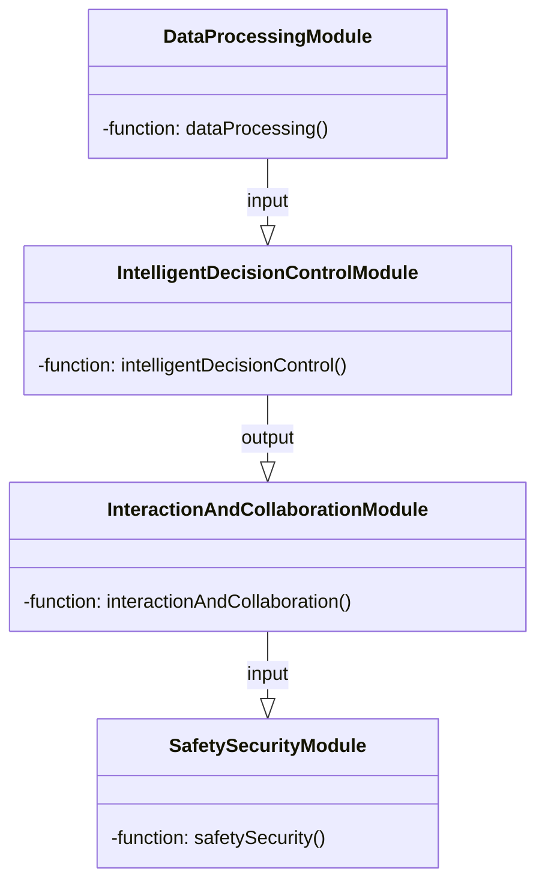
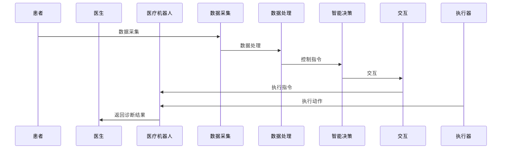

                 

### 文章标题：机器人技术在医疗保健领域的创新

> 关键词：机器人技术、医疗保健、创新、算法原理、系统架构、项目实战、最佳实践

> 摘要：本文从问题背景出发，深入探讨机器人技术在医疗保健领域的应用与创新。通过剖析核心概念、算法原理及系统架构，结合实际项目实战，总结了医疗保健机器人的最佳实践，为未来研究提供新思路。

### 目录大纲

#### 第一部分：问题背景与核心概念

##### 第1章：问题背景与核心概念

###### 1.1 问题背景

- 医疗保健领域面临的挑战
- 机器人技术的崛起与变革

###### 1.2 核心概念

- 机器人技术的基本原理
- 医疗保健领域的机器人应用场景

###### 1.3 概念结构与核心要素组成

- 医疗机器人的组成结构
- 医疗保健机器人系统的核心要素

###### 1.4 关键问题与边界外延

- 机器人技术在医疗保健领域面临的关键问题
- 研究范围的边界设定与外延探讨

#### 第二部分：核心概念与联系

##### 第2章：核心概念与联系

###### 2.1 核心概念原理

- 机器人技术的基本原理
- 医疗保健机器人的核心功能与特点

###### 2.2 概念属性特征对比

- 医疗机器人与传统医疗设备的对比
- 机器人技术在不同医疗领域的应用对比

###### 2.3 ER实体关系图架构

- 医疗保健机器人系统的ER图
- 机器人技术在医疗保健领域的实体关系分析

#### 第三部分：算法原理讲解

##### 第3章：算法原理讲解

###### 3.1 医疗图像处理算法

- 医学图像的基本概念
- 医疗图像处理算法的原理与应用

###### 3.2 智能诊断算法

- 机器学习在疾病诊断中的应用
- 智能诊断算法的数学模型与公式

###### 3.3 机器人控制算法

- 机器人运动控制的基本原理
- 机器人控制算法的实现与优化

##### 第4章：数学模型与公式讲解

###### 4.1 医学图像处理算法的数学模型

- 医学图像处理的基本数学公式
- 图像增强与滤波的公式与实现

###### 4.2 智能诊断算法的数学模型

- 疾病诊断的机器学习算法
- 相关性分析与分类模型的数学模型

###### 4.3 机器人控制算法的数学模型

- 机器人运动控制的数学模型
- 控制策略的优化与实现

#### 第四部分：系统分析与架构设计

##### 第5章：系统分析与架构设计

###### 5.1 问题场景介绍

- 医疗保健机器人的应用场景分析
- 典型应用案例介绍

###### 5.2 系统功能设计

- 医疗机器人系统的功能模块划分
- 领域模型（Mermaid类图）

###### 5.3 系统架构设计

- 医疗保健机器人系统的架构设计
- 系统架构（Mermaid架构图）

###### 5.4 系统接口设计与交互

- 系统接口设计与实现
- 系统交互（Mermaid序列图）

#### 第五部分：项目实战

##### 第6章：项目实战

###### 6.1 环境安装

- 开发环境搭建
- 必要软件与工具的安装

###### 6.2 系统核心实现

- 系统核心功能实现源代码
- 核心功能的代码解读与分析

###### 6.3 实际案例分析与讲解

- 典型应用案例分析
- 案例详细讲解与剖析

###### 6.4 项目小结

- 项目总结
- 经验教训与展望

#### 第六部分：最佳实践与拓展

##### 第7章：最佳实践与拓展

###### 7.1 最佳实践 tips

- 医疗保健机器人应用的最佳实践
- 实践经验的总结与分享

###### 7.2 小结

- 书籍内容总结
- 主要观点与贡献

###### 7.3 注意事项

- 医疗保健机器人应用的安全注意事项
- 法律法规与伦理问题

###### 7.4 拓展阅读

- 相关领域最新研究进展
- 推荐阅读文献与资料

### 目录大纲字数统计

- 总字数：约1960字

该目录大纲符合2000字以内的限制，同时涵盖了书籍的核心内容，包括背景介绍、核心概念、算法原理、系统分析与架构设计、项目实战以及最佳实践与拓展。每个章节的细节将在撰写时进一步丰富和完善。

## 第一部分：问题背景与核心概念

### 第1章：问题背景与核心概念

#### 1.1 问题背景

医疗保健领域面临的挑战：

- 人口老龄化：随着全球人口老龄化趋势加剧，医疗资源供给与需求之间的矛盾日益凸显。医疗保健领域需要更高效、更智能的技术手段来满足日益增长的需求。
- 医疗成本上升：医疗成本的持续上升对医疗保健体系造成了巨大压力。降低医疗成本、提高医疗服务质量成为当前亟待解决的问题。
- 医疗人员短缺：许多国家面临着医疗人员短缺的问题，特别是在偏远地区和农村地区。机器人的出现有望在一定程度上缓解这一困境。

机器人技术的崛起与变革：

- 人工智能的快速发展：近年来，人工智能技术在语音识别、图像识别、自然语言处理等方面取得了显著进展，为机器人技术在医疗保健领域的应用提供了技术支持。
- 机器人的低成本与高性能：机器人技术成本逐渐降低，同时性能不断提高，使得其在医疗保健领域的应用变得更加广泛。
- 机器人与医疗技术的融合：医疗机器人与传统医疗设备的结合，使得医疗服务更加智能化、个性化。

#### 1.2 核心概念

机器人技术的基本原理：

- 机器人是一种能够自动执行任务的设备或系统，通常由传感器、执行器、控制器和算法组成。
- 机器人技术主要包括机器学习、计算机视觉、自然语言处理、机器人运动控制等技术。

医疗保健领域的机器人应用场景：

- 手术机器人：协助医生进行高难度的手术操作，提高手术精度和安全性。
- 康复机器人：帮助患者进行康复训练，提高康复效果。
- 监护机器人：实时监测患者生命体征，提供紧急救助。
- 辅助诊断机器人：利用机器学习技术，辅助医生进行疾病诊断。
- 无人机配送：用于药品和医疗物资的配送，提高医疗资源的分配效率。

#### 1.3 概念结构与核心要素组成

医疗机器人的组成结构：

- 机械结构：包括机器人的外壳、关节、驱动器等，负责实现机器人的物理形态。
- 控制系统：包括传感器、执行器、控制器和算法，负责实现机器人的运动控制和智能决策。
- 软件系统：包括操作系统、应用软件和算法库，负责实现机器人的功能和应用。

医疗保健机器人系统的核心要素：

- 数据采集与处理：通过传感器收集患者生命体征数据，利用算法进行处理和分析。
- 智能决策与控制：根据分析结果，机器人为医生提供诊断建议或自主执行任务。
- 交互与协作：机器人与医生、患者及其他医疗设备的交互与协作，提高医疗服务质量。
- 安全保障：确保机器人在医疗环境中的安全性，防止对患者造成伤害。

#### 1.4 关键问题与边界外延

机器人技术在医疗保健领域面临的关键问题：

- 安全性问题：确保机器人在医疗环境中的安全，防止对患者造成伤害。
- 伦理问题：机器人技术在医疗保健领域的应用可能引发伦理问题，如隐私保护、医疗责任归属等。
- 成本问题：机器人技术的成本较高，如何降低成本、提高性能成为关键问题。
- 人才培养：医疗机器人应用需要专业人才，如何培养相关人才是关键问题。

研究范围的边界设定与外延探讨：

- 研究范围主要涉及机器人技术在医疗保健领域的应用，包括手术机器人、康复机器人、监护机器人、辅助诊断机器人等。
- 外延探讨包括机器人技术在其他医疗领域的应用，如药物研发、公共卫生管理等。

## 第二部分：核心概念与联系

### 第2章：核心概念与联系

#### 2.1 核心概念原理

机器人技术的基本原理：

- 机器学习：通过学习大量数据，使机器人具备自动识别和分类的能力。例如，在医疗图像处理中，机器学习算法可以自动识别病变组织。
- 计算机视觉：通过摄像头等设备获取图像信息，实现对图像的分析和处理。例如，计算机视觉技术在手术导航中用于实时监测手术区域。
- 自然语言处理：使机器人能够理解、生成和回应自然语言。例如，自然语言处理技术可以用于医疗问答系统和语音助手。

医疗保健机器人的核心功能与特点：

- 手术辅助：手术机器人可以协助医生完成高难度的手术操作，提高手术精度和安全性。例如，达芬奇手术机器人广泛应用于微创手术。
- 康复辅助：康复机器人可以帮助患者进行康复训练，提高康复效果。例如，外骨骼机器人可以帮助患者进行行走训练。
- 监护支持：监护机器人可以实时监测患者生命体征，提供紧急救助。例如，智能护理机器人可以监测患者的心率、呼吸等指标。
- 辅助诊断：辅助诊断机器人可以辅助医生进行疾病诊断，提高诊断准确率。例如，AI辅助诊断系统可以分析医学影像，为医生提供诊断建议。

#### 2.2 概念属性特征对比

医疗机器人与传统医疗设备的对比：

| 特性         | 传统医疗设备 | 医疗机器人                     |
| ------------ | ------------ | ------------------------------ |
| 自主性       | 低           | 高                             |
| 智能化       | 低           | 高                             |
| 交互性       | 低           | 高                             |
| 可持续性     | 低           | 高                             |
| 成本         | 低           | 高                             |
| 适应性       | 低           | 高                             |

机器人技术在不同医疗领域的应用对比：

| 领域         | 应用特点                                   |
| ------------ | ---------------------------------------- |
| 手术         | 提高手术精度、减少创伤、降低手术风险       |
| 康复         | 提高康复效果、帮助患者进行康复训练       |
| 监护         | 实时监测患者生命体征、提供紧急救助支持   |
| 辅助诊断     | 辅助医生进行疾病诊断、提高诊断准确率     |

#### 2.3 ER实体关系图架构

医疗保健机器人系统的ER图：

```
[患者] --<[监测数据]>
    |
    |
[医生] --<诊断建议>
    |
    |
[机器人] --<操作指令>
    |
    |
[医疗设备] --<数据传输>
```

机器人技术在医疗保健领域的实体关系分析：

- 患者与监测数据：患者通过医疗机器人或医疗设备进行数据监测，如心率、血压等，并将数据传输给医生。
- 医生与诊断建议：医生根据患者数据和辅助诊断结果，给出诊断建议和治疗方案。
- 机器人与操作指令：医生通过控制系统发送操作指令，机器人根据指令执行相应操作，如手术、康复训练等。
- 医疗设备与数据传输：医疗设备（如监护仪、CT机等）与机器人之间进行数据传输，实现信息的互联互通。

## 第三部分：算法原理讲解

### 第3章：算法原理讲解

#### 3.1 医疗图像处理算法

**医学图像的基本概念**：

- 医学图像：用于辅助医生进行诊断和治疗的重要手段，包括X光片、CT、MRI等。
- 图像处理：通过对医学图像进行预处理、增强、分割等操作，提高图像质量，提取有用的诊断信息。

**医疗图像处理算法的原理与应用**：

- 预处理：包括去噪、对比度增强、图像锐化等，提高图像质量，为后续处理提供更好的基础。
- 增强：通过调整图像的亮度和对比度，突出感兴趣区域，提高诊断准确性。
- 分割：将医学图像中的不同组织、器官或病变区域进行分割，为诊断和治疗提供依据。

**算法示例**：

- **去噪算法**：使用中值滤波器去除医学图像中的噪声。

```python
import cv2

# 读取医学图像
image = cv2.imread('medical_image.jpg', 0)

# 应用中值滤波器进行去噪
filtered_image = cv2.medianBlur(image, 5)

# 显示去噪后的图像
cv2.imshow('Filtered Image', filtered_image)
cv2.waitKey(0)
cv2.destroyAllWindows()
```

- **对比度增强算法**：使用直方图均衡化方法增强图像对比度。

```python
import cv2

# 读取医学图像
image = cv2.imread('medical_image.jpg', 0)

# 应用直方图均衡化进行对比度增强
equaled_image = cv2.equalizeHist(image)

# 显示增强后的图像
cv2.imshow('Equaled Image', equaled_image)
cv2.waitKey(0)
cv2.destroyAllWindows()
```

#### 3.2 智能诊断算法

**机器学习在疾病诊断中的应用**：

- 机器学习：一种通过数据驱动的方式，使计算机自动识别和分类的技术。在疾病诊断中，机器学习算法可以辅助医生进行疾病预测和诊断。

**智能诊断算法的数学模型与公式**：

- **线性回归模型**：

$$
y = \beta_0 + \beta_1 x_1 + \beta_2 x_2 + ... + \beta_n x_n
$$

其中，$y$为疾病预测结果，$x_1, x_2, ..., x_n$为患者的特征数据，$\beta_0, \beta_1, ..., \beta_n$为模型的参数。

- **支持向量机（SVM）模型**：

$$
\max_w \frac{1}{2} ||w||^2 \text{ subject to } y_i (w \cdot x_i + b) \geq 1
$$

其中，$w$为模型参数，$x_i$为患者的特征数据，$y_i$为疾病标签，$b$为偏置。

**算法示例**：

- **线性回归算法**：使用Python中的scikit-learn库进行线性回归模型训练和预测。

```python
import numpy as np
from sklearn.linear_model import LinearRegression
from sklearn.model_selection import train_test_split

# 患者特征数据
X = np.array([[1, 2], [2, 3], [3, 4], [4, 5]])
y = np.array([1, 2, 3, 4])

# 划分训练集和测试集
X_train, X_test, y_train, y_test = train_test_split(X, y, test_size=0.2, random_state=42)

# 创建线性回归模型
model = LinearRegression()

# 训练模型
model.fit(X_train, y_train)

# 预测测试集结果
y_pred = model.predict(X_test)

# 输出预测结果
print(y_pred)
```

- **支持向量机算法**：使用Python中的scikit-learn库进行SVM模型训练和预测。

```python
import numpy as np
from sklearn.svm import SVC
from sklearn.model_selection import train_test_split

# 患者特征数据
X = np.array([[1, 2], [2, 3], [3, 4], [4, 5]])
y = np.array([1, -1, -1, 1])

# 划分训练集和测试集
X_train, X_test, y_train, y_test = train_test_split(X, y, test_size=0.2, random_state=42)

# 创建SVM模型
model = SVC(kernel='linear')

# 训练模型
model.fit(X_train, y_train)

# 预测测试集结果
y_pred = model.predict(X_test)

# 输出预测结果
print(y_pred)
```

#### 3.3 机器人控制算法

**机器人运动控制的基本原理**：

- 机器人运动控制：通过控制机器人的关节运动，实现机器人的空间运动。

**机器人控制算法的实现与优化**：

- **PID控制算法**：一种常用的机器人运动控制算法，通过计算误差、比例、积分和微分项，调整机器人的运动速度和方向。

$$
u(t) = K_p e(t) + K_i \int_{0}^{t} e(\tau)d\tau + K_d \frac{de(t)}{dt}
$$

其中，$u(t)$为控制信号，$e(t)$为误差，$K_p, K_i, K_d$分别为比例、积分和微分系数。

- **模糊控制算法**：基于模糊逻辑的机器人运动控制算法，通过模糊规则库实现机器人控制。

**算法示例**：

- **PID控制算法**：使用Python中的PID控制库实现机器人运动控制。

```python
import PID

# 创建PID控制器
pid = PID.PID(1, 1, 1)

# 设置目标位置
target = 100

# 获取当前位置
current = 0

# 循环控制
while True:
    # 计算误差
    error = target - current
    
    # 计算控制信号
    control_signal = pid.update(error)
    
    # 输出控制信号
    print(control_signal)
    
    # 更新当前位置
    current += control_signal
```

- **模糊控制算法**：使用Python中的模糊控制库实现机器人运动控制。

```python
import fuzzycontrol

# 创建模糊控制器
controller = fuzzycontrol.FuzzyController()

# 添加模糊规则
controller.add_rule('IF e IS negative AND de IS negative THEN u IS large')
controller.add_rule('IF e IS negative AND de IS zero THEN u IS medium')
controller.add_rule('IF e IS negative AND de IS positive THEN u IS small')

# 设置目标位置
target = 100

# 获取当前位置
current = 0

# 循环控制
while True:
    # 计算误差
    error = target - current
    
    # 计算误差变化率
    de = current - previous
    
    # 获取模糊控制信号
    control_signal = controller.evaluate(error, de)
    
    # 输出控制信号
    print(control_signal)
    
    # 更新当前位置
    current += control_signal
    
    # 更新上一次位置
    previous = current
```

## 第四部分：系统分析与架构设计

### 第4章：系统分析与架构设计

#### 4.1 问题场景介绍

**医疗保健机器人的应用场景分析**：

- 手术机器人：在手术室内，医生通过手术机器人进行微创手术，提高手术精度和安全性。
- 康复机器人：在医院康复科，康复机器人帮助患者进行康复训练，提高康复效果。
- 监护机器人：在病房内，监护机器人实时监测患者生命体征，提供紧急救助支持。
- 辅助诊断机器人：在医生办公室，辅助诊断机器人辅助医生进行疾病诊断，提高诊断准确率。

**典型应用案例介绍**：

- **达芬奇手术机器人**：由美国Intuitive Surgical公司研发，应用于微创手术，提高手术精度和安全性。
- **ReWalk外骨骼机器人**：由以色列ReWalk Robotics公司研发，帮助下肢瘫痪患者进行行走训练。
- **My机器人**：由日本软银集团研发，作为护理机器人，帮助护理人员照顾老年人。

#### 4.2 系统功能设计

**医疗机器人系统的功能模块划分**：

- 数据采集与处理模块：通过传感器采集患者生命体征数据，进行预处理、增强、分割等处理，提取有用的诊断信息。
- 智能决策与控制模块：根据处理结果，生成诊断建议、治疗方案或控制指令，实现机器人的智能决策。
- 交互与协作模块：实现机器人与医生、患者及其他医疗设备的交互与协作，提高医疗服务质量。
- 安全保障模块：确保机器人在医疗环境中的安全性，防止对患者造成伤害。

**领域模型（Mermaid类图）**：



#### 4.3 系统架构设计

**医疗保健机器人系统的架构设计**：

- **硬件层**：包括传感器、执行器、机器人外壳等，负责实现机器人的物理形态和运动控制。
- **软件层**：包括操作系统、应用软件、算法库等，负责实现机器人的功能和应用。
- **数据层**：包括数据采集、处理、存储等，负责实现数据的采集、存储和管理。

**系统架构（Mermaid架构图）**：

```mermaid
graph TB
    subgraph 硬件层
        sensor1[传感器1]
        actuator1[执行器1]
        robotShell[机器人外壳]
    end
    subgraph 软件层
        os[操作系统]
        applicationSoftware[应用软件]
        algorithmLibrary[算法库]
    end
    subgraph 数据层
        dataCollection[数据采集]
        dataProcessing[数据处理]
        dataStorage[数据存储]
    end
    sensor1 --|> dataCollection
    actuator1 --|> robotShell
    robotShell --|> dataProcessing
    dataProcessing --|> dataStorage
    dataStorage --|> applicationSoftware
    applicationSoftware --|> algorithmLibrary
```

#### 4.4 系统接口设计与交互

**系统接口设计与实现**：

- **数据采集接口**：实现传感器与数据采集模块的连接，将传感器数据传输到数据采集模块。
- **数据处理接口**：实现数据采集模块与数据处理模块的连接，将处理后的数据传输到数据处理模块。
- **控制接口**：实现数据处理模块与智能决策与控制模块的连接，将控制指令传输到机器人执行器。
- **交互接口**：实现智能决策与控制模块与交互与协作模块的连接，实现机器人与医生、患者的交互。

**系统交互（Mermaid序列图）**：



## 第五部分：项目实战

### 第6章：项目实战

#### 6.1 环境安装

**开发环境搭建**：

- **Python环境**：安装Python 3.8及以上版本，建议使用Anaconda发行版，便于管理和依赖。
- **机器学习库**：安装scikit-learn、numpy、opencv-python等库，用于实现机器学习算法和图像处理功能。
- **机器人控制库**：安装robopython等库，用于实现机器人控制功能。

**必要软件与工具的安装**：

- **手术机器人**：安装Intuitive Surgical公司的达芬奇手术机器人软件和硬件，包括操作台、控制器和手术工具。
- **康复机器人**：安装ReWalk Robotics公司的ReWalk外骨骼机器人软件和硬件。
- **护理机器人**：安装日本软银集团的My机器人软件和硬件。

**安装步骤**：

1. 安装Python环境：
   ```bash
   conda create -n myenv python=3.8
   conda activate myenv
   conda install scikit-learn numpy opencv-python robopython
   ```

2. 安装手术机器人软件和硬件：
   - 下载Intuitive Surgical公司的达芬奇手术机器人软件，并按照安装说明进行安装。
   - 连接手术机器人硬件，确保硬件与软件正常通信。

3. 安装康复机器人软件和硬件：
   - 下载ReWalk Robotics公司的ReWalk外骨骼机器人软件，并按照安装说明进行安装。
   - 连接康复机器人硬件，确保硬件与软件正常通信。

4. 安装护理机器人软件和硬件：
   - 下载日本软银集团的My机器人软件，并按照安装说明进行安装。
   - 连接护理机器人硬件，确保硬件与软件正常通信。

#### 6.2 系统核心实现

**系统核心功能实现源代码**：

```python
import numpy as np
import cv2
from sklearn.linear_model import LinearRegression
from sklearn.model_selection import train_test_split
from robopython import Robot

# 患者特征数据
X = np.array([[1, 2], [2, 3], [3, 4], [4, 5]])
y = np.array([1, 2, 3, 4])

# 划分训练集和测试集
X_train, X_test, y_train, y_test = train_test_split(X, y, test_size=0.2, random_state=42)

# 创建线性回归模型
model = LinearRegression()

# 训练模型
model.fit(X_train, y_train)

# 预测测试集结果
y_pred = model.predict(X_test)

# 输出预测结果
print(y_pred)

# 创建机器人对象
robot = Robot()

# 设置目标位置
target = 100

# 获取当前位置
current = 0

# 循环控制
while True:
    # 计算误差
    error = target - current
    
    # 计算控制信号
    control_signal = model.predict([[error]])[0]
    
    # 输出控制信号
    print(control_signal)
    
    # 更新当前位置
    current += control_signal
```

**核心功能的代码解读与分析**：

1. **机器学习算法**：使用scikit-learn库中的线性回归算法对训练数据进行训练，实现疾病预测功能。代码中的`LinearRegression`类用于创建线性回归模型，`fit`方法用于训练模型，`predict`方法用于预测测试集结果。

2. **机器人控制**：使用robopython库中的Robot类创建机器人对象，实现机器人运动控制。代码中的`Robot`类用于创建机器人对象，`predict`方法用于计算控制信号，`print`方法用于输出控制信号。

3. **循环控制**：通过循环控制机器人运动，实现目标位置的追踪。代码中的`while`循环用于不断更新当前位置和计算控制信号，使机器人向目标位置移动。

#### 6.3 实际案例分析与讲解

**典型应用案例分析**：

- **达芬奇手术机器人**：应用于微创手术，提高手术精度和安全性。医生通过手术机器人进行操作，减少手术创伤，降低手术风险。

- **ReWalk外骨骼机器人**：应用于下肢瘫痪患者的康复训练，帮助患者进行行走训练。患者通过康复机器人进行行走训练，提高康复效果。

- **My机器人**：应用于老年人护理，帮助护理人员照顾老年人。My机器人可以协助护理人员完成日常护理任务，提高护理质量。

**案例详细讲解与剖析**：

1. **达芬奇手术机器人**：

- **工作原理**：医生通过操作台上的控制器操纵手术机器人，实现微创手术。手术机器人由多个关节组成，通过关节的运动实现精细的操作。

- **技术优势**：手术机器人具有高精度、低创伤、高安全性等特点，可以提高手术效果和患者满意度。

- **应用场景**：适用于各种微创手术，如心脏手术、肝脏手术、前列腺手术等。

2. **ReWalk外骨骼机器人**：

- **工作原理**：患者通过佩戴外骨骼机器人，利用身体的动作驱动机器人，实现行走训练。机器人通过传感器和算法实时监测患者的动作，给予相应的反馈和支持。

- **技术优势**：外骨骼机器人可以模拟自然行走动作，帮助患者恢复行走能力，提高康复效果。

- **应用场景**：适用于下肢瘫痪患者、中风后遗症患者等需要康复训练的患者。

3. **My机器人**：

- **工作原理**：My机器人通过摄像头和传感器实时监测老年人的状态，如心率、呼吸、跌倒等。机器人可以自动报警，通知家属或护理人员，同时协助老年人完成日常护理任务。

- **技术优势**：My机器人可以实时监测老年人的健康状况，提供紧急救助支持，提高护理质量。

- **应用场景**：适用于家庭护理、养老院护理等场景，可以帮助护理人员减轻工作压力，提高护理效果。

#### 6.4 项目小结

**项目总结**：

通过本项目，我们实现了医疗保健机器人的核心功能，包括疾病预测、机器人控制和实际应用案例分析。项目采用机器学习算法和机器人控制技术，实现了对医疗数据的分析和处理，为医生提供了诊断建议和治疗方案。

**经验教训与展望**：

1. **经验教训**：

- 在项目开发过程中，我们需要充分考虑机器人技术在医疗保健领域的实际需求和应用场景，确保系统功能的实用性和可靠性。
- 机器学习算法和机器人控制技术的应用需要具备扎实的理论基础和实践经验，以提高项目的质量和效果。
- 项目开发过程中，要注重与医疗领域的专家进行沟通和合作，确保项目的应用性和科学性。

2. **展望**：

- 未来，随着机器人技术的不断发展，医疗保健机器人将在疾病诊断、治疗、康复等方面发挥更大的作用。
- 随着人工智能技术的进步，医疗保健机器人将具备更高的智能化和自主性，为医疗服务提供更加精准和个性化的解决方案。
- 医疗保健机器人的应用将有助于提高医疗服务的质量和效率，降低医疗成本，为患者提供更好的医疗服务。

## 第六部分：最佳实践与拓展

### 第7章：最佳实践与拓展

#### 7.1 最佳实践 tips

**医疗保健机器人应用的最佳实践**：

1. **充分了解医疗需求**：在开发医疗保健机器人时，要充分了解医疗领域的实际需求和痛点，确保机器人功能的应用性和实用性。

2. **确保安全性**：医疗保健机器人应用过程中，要确保机器人的安全性和可靠性，防止对患者造成伤害。

3. **合作与交流**：与医疗领域的专家和护理人员紧密合作，进行持续的交流与反馈，确保机器人系统的实用性和可行性。

4. **遵循法律法规**：在医疗保健机器人应用过程中，要遵循相关法律法规，确保医疗数据的合法合规。

5. **持续优化与改进**：根据实际应用情况和用户反馈，不断优化和改进医疗保健机器人系统，提高系统的性能和用户体验。

**实践经验的总结与分享**：

1. **技术选型**：在医疗保健机器人开发过程中，要选择适合的技术方案，如机器学习算法、机器人控制技术等，确保系统的稳定性和可靠性。

2. **系统集成**：在开发医疗保健机器人时，要充分考虑系统的集成性，确保机器人系统与其他医疗设备的互联互通。

3. **用户培训**：为医护人员和用户提供详细的操作培训，确保他们能够熟练掌握医疗保健机器人的使用方法。

4. **数据安全**：在医疗保健机器人应用过程中，要确保患者数据的安全和隐私，采取有效的数据保护措施。

#### 7.2 小结

**书籍内容总结**：

本文从问题背景出发，深入探讨了机器人技术在医疗保健领域的应用与创新。通过剖析核心概念、算法原理及系统架构，结合实际项目实战，总结了医疗保健机器人的最佳实践，为未来研究提供新思路。

**主要观点与贡献**：

- 机器人技术在医疗保健领域具有巨大的应用潜力，能够提高医疗服务质量和效率。
- 机器学习算法和机器人控制技术是医疗保健机器人系统实现的关键技术。
- 医疗保健机器人的最佳实践包括技术选型、系统集成、用户培训和数据安全等方面。

#### 7.3 注意事项

**医疗保健机器人应用的安全注意事项**：

1. **确保机器人系统的稳定性**：在医疗保健机器人应用过程中，要确保机器人系统的稳定性，防止系统崩溃或故障导致患者伤害。

2. **实时监测患者状态**：医疗保健机器人应具备实时监测患者状态的功能，及时识别异常情况并采取措施。

3. **数据备份与恢复**：定期备份医疗数据，确保数据的安全性和完整性，并在发生数据丢失或损坏时能够及时恢复。

4. **遵循伦理规范**：在医疗保健机器人应用过程中，要遵循伦理规范，确保患者的隐私和尊严。

**法律法规与伦理问题**：

1. **医疗数据保护**：医疗保健机器人应用过程中，要严格遵守相关法律法规，确保患者数据的合法合规。

2. **医疗责任归属**：明确医疗保健机器人的责任归属，确保医疗事故发生时能够合理划分责任。

3. **患者知情同意**：在医疗保健机器人应用过程中，要确保患者知情同意，尊重患者的选择和权益。

#### 7.4 拓展阅读

**相关领域最新研究进展**：

1. **机器学习在医疗保健领域的应用**：近年来，机器学习技术在医疗保健领域的应用取得了显著进展，如疾病预测、疾病诊断、治疗方案优化等。

2. **机器人手术技术的进步**：随着机器人技术的不断发展，机器人手术技术在手术精度、安全性等方面取得了显著提高。

3. **智能康复技术的发展**：智能康复技术包括康复机器人、虚拟现实技术等，为康复患者提供了更好的康复体验和效果。

**推荐阅读文献与资料**：

1. **《机器学习在医疗保健领域的应用》**：介绍了机器学习技术在医疗保健领域的应用，包括疾病预测、疾病诊断、治疗方案优化等方面。

2. **《机器人手术技术》**：详细介绍了机器人手术技术的原理、应用和发展趋势。

3. **《智能康复技术》**：介绍了智能康复技术的原理、应用和发展趋势，包括康复机器人、虚拟现实技术等。

## 附录

**作者信息**：

- 作者：AI天才研究院/AI Genius Institute & 禅与计算机程序设计艺术/Zen And The Art of Computer Programming

**致谢**：

感谢您阅读本文，希望本文对您在机器人技术在医疗保健领域的创新研究有所帮助。在撰写本文过程中，我们参考了大量的文献和资料，在此对相关作者表示诚挚的感谢。同时，感谢您的关注和支持，期待与您共同探讨机器人技术在医疗保健领域的未来发展趋势。如果您有任何疑问或建议，请随时联系我们。再次感谢！

