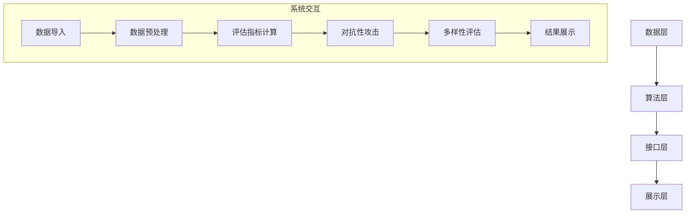

                 

## 第3章: 算法原理讲解

### 3.1 常见评估指标

在构建prompt评估的量化指标体系时，选择合适的评估指标是关键。以下是一些常见的评估指标：

#### 3.1.1 准确率（Accuracy）

准确率是评估模型性能的基本指标，表示模型正确预测的样本数占总样本数的比例。其计算公式为：

$$
\text{Accuracy} = \frac{\text{正确预测的样本数}}{\text{总样本数}}
$$

例如，如果一个模型在100个样本中有90个正确预测，则其准确率为：

$$
\text{Accuracy} = \frac{90}{100} = 0.9
$$

#### 3.1.2 召回率（Recall）

召回率是评估模型对于正类样本的识别能力，表示模型正确识别出的正类样本数占总正类样本数的比例。其计算公式为：

$$
\text{Recall} = \frac{\text{正确识别的正类样本数}}{\text{总正类样本数}}
$$

例如，如果一个模型在100个正类样本中有80个正确识别，则其召回率为：

$$
\text{Recall} = \frac{80}{100} = 0.8
$$

#### 3.1.3 F1值（F1 Score）

F1值是准确率和召回率的加权平均，综合考虑了模型的精确度和召回率。其计算公式为：

$$
\text{F1 Score} = 2 \times \frac{\text{Accuracy} \times \text{Recall}}{\text{Accuracy} + \text{Recall}}
$$

例如，如果一个模型的准确率为0.9，召回率为0.8，则其F1值为：

$$
\text{F1 Score} = 2 \times \frac{0.9 \times 0.8}{0.9 + 0.8} = 0.8889
$$

### 3.2 算法原理

为了对大模型的性能进行评估，我们需要设计合适的算法。以下介绍几种常见的大模型评估算法：

#### 3.2.1 对抗性攻击（Adversarial Attack）

对抗性攻击是一种评估模型鲁棒性的方法，通过在输入数据中添加微小的噪声，使得模型对噪声敏感，从而发现模型的弱点。常见的对抗性攻击方法包括：

1. **FGSM（Fast Gradient Sign Method）**：通过计算输入数据的梯度并乘以一个适当的常数，得到对抗性样本。
2. **Deepfool**：通过在特征空间中寻找与模型决策边界最近的点来生成对抗性样本。

#### 3.2.2 基于多样性（Diversity-based）的评估

基于多样性的评估方法旨在评估模型在不同任务和数据集上的表现。常见的方法包括：

1. **K-fold Cross-Validation**：将数据集分为K个子集，每次使用一个子集作为测试集，其余子集作为训练集，重复K次，取平均值作为最终评估结果。
2. **Stacking**：结合多个模型的预测结果，通过训练一个更高层次的模型来综合评估各个模型的性能。

### 3.3 Python源代码示例

以下是一个简单的Python代码示例，用于计算准确率、召回率和F1值：

```python
from sklearn.metrics import accuracy_score, recall_score, f1_score

# 假设我们有一个预测结果列表和真实标签列表
y_pred = [0, 1, 1, 0, 1, 1, 0, 1, 1, 0]
y_true = [0, 0, 1, 0, 1, 1, 1, 0, 1, 0]

# 计算准确率
accuracy = accuracy_score(y_true, y_pred)
print("Accuracy:", accuracy)

# 计算召回率
recall = recall_score(y_true, y_pred, average='weighted')
print("Recall:", recall)

# 计算F1值
f1 = f1_score(y_true, y_pred, average='weighted')
print("F1 Score:", f1)
```

### 3.4 总结

在本章节中，我们介绍了大模型评估中的常见评估指标，包括准确率、召回率和F1值，以及对抗性攻击和基于多样性的评估方法。通过Python源代码示例，我们展示了如何计算这些评估指标。在下一章节中，我们将进一步探讨大模型的评估算法原理，使用mermaid流程图和LaTeX公式进行详细讲解。

----------------------------------------------------------------

## 第4章: 数学模型和数学公式

在上一章节中，我们介绍了大模型评估中的常见评估指标和评估方法。在这一章节中，我们将使用LaTeX格式详细给出算法原理的数学模型和公式，并进行详细讲解和举例说明。

### 4.1 准确率的数学模型

准确率是评估模型性能的基本指标，其数学模型可以表示为：

$$
\text{Accuracy} = \frac{1}{n} \sum_{i=1}^{n} \mathbb{I}(\hat{y}_i = y_i)
$$

其中，$n$ 表示总样本数，$\hat{y}_i$ 表示第 $i$ 个样本的预测结果，$y_i$ 表示第 $i$ 个样本的真实标签，$\mathbb{I}(\cdot)$ 表示指示函数，当条件满足时取值为1，否则取值为0。

例如，对于以下预测结果和真实标签：

| 预测结果（$\hat{y}_i$） | 真实标签（$y_i$） | $\mathbb{I}(\hat{y}_i = y_i)$ |
| :---: | :---: | :---: |
| 0 | 0 | 1 |
| 1 | 0 | 0 |
| 1 | 1 | 1 |
| 0 | 0 | 1 |
| 1 | 1 | 1 |
| 1 | 1 | 1 |
| 0 | 1 | 0 |
| 1 | 0 | 0 |
| 1 | 1 | 1 |
| 1 | 1 | 1 |
| 0 | 0 | 1 |

准确率的计算结果为：

$$
\text{Accuracy} = \frac{1}{10} \sum_{i=1}^{10} \mathbb{I}(\hat{y}_i = y_i) = \frac{5}{10} = 0.5
$$

### 4.2 召回率的数学模型

召回率是评估模型对于正类样本的识别能力，其数学模型可以表示为：

$$
\text{Recall} = \frac{1}{n} \sum_{i=1}^{n} \mathbb{I}(y_i = 1, \hat{y}_i = 1)
$$

其中，$n$ 表示总样本数，$y_i$ 表示第 $i$ 个样本的真实标签，$\hat{y}_i$ 表示第 $i$ 个样本的预测结果。

例如，对于以下预测结果和真实标签：

| 预测结果（$\hat{y}_i$） | 真实标签（$y_i$） | $\mathbb{I}(y_i = 1, \hat{y}_i = 1)$ |
| :---: | :---: | :---: |
| 0 | 0 | 0 |
| 1 | 0 | 0 |
| 1 | 1 | 1 |
| 0 | 0 | 0 |
| 1 | 1 | 1 |
| 1 | 1 | 1 |
| 0 | 1 | 0 |
| 1 | 0 | 0 |
| 1 | 1 | 1 |
| 1 | 1 | 1 |
| 0 | 0 | 0 |

召回率的计算结果为：

$$
\text{Recall} = \frac{1}{10} \sum_{i=1}^{10} \mathbb{I}(y_i = 1, \hat{y}_i = 1) = \frac{3}{10} = 0.3
$$

### 4.3 F1值的数学模型

F1值是准确率和召回率的加权平均，其数学模型可以表示为：

$$
\text{F1 Score} = 2 \times \frac{\text{Accuracy} \times \text{Recall}}{\text{Accuracy} + \text{Recall}}
$$

例如，对于一个准确率为0.5，召回率为0.3的模型，其F1值的计算结果为：

$$
\text{F1 Score} = 2 \times \frac{0.5 \times 0.3}{0.5 + 0.3} = 0.375
$$

通过上述数学模型和公式的讲解，我们能够更好地理解大模型评估指标的计算原理。在下一章节中，我们将介绍大模型评估算法的系统分析与架构设计方案。

----------------------------------------------------------------

## 第5章: 系统分析与架构设计方案

### 5.1 问题场景

在构建prompt评估的量化指标体系时，我们面临着复杂的问题场景。为了解决这个问题，我们需要设计一个高效、可扩展的系统架构，以确保评估结果的准确性和可靠性。

### 5.2 项目介绍

我们的项目目标是构建一个基于Python的prompt评估量化指标体系，以便对大模型的性能进行评估。该项目分为以下几个部分：

1. **数据预处理**：对输入数据进行清洗、去重和标准化处理，以提高数据质量。
2. **评估指标计算**：使用Python中的scikit-learn库计算常见的评估指标，如准确率、召回率和F1值。
3. **对抗性攻击**：利用对抗性攻击方法，评估模型的鲁棒性。
4. **多样性评估**：使用K-fold Cross-Validation和Stacking方法，评估模型在不同任务和数据集上的表现。
5. **结果可视化**：将评估结果以图表形式展示，便于分析和比较。

### 5.3 系统功能设计

为了实现上述项目目标，我们的系统需要具备以下功能：

1. **数据预处理**：包括数据清洗、去重和标准化等操作，确保输入数据的质量。
2. **评估指标计算**：使用scikit-learn库计算评估指标，如准确率、召回率和F1值。
3. **对抗性攻击**：利用对抗性攻击方法，评估模型的鲁棒性。
4. **多样性评估**：使用K-fold Cross-Validation和Stacking方法，评估模型在不同任务和数据集上的表现。
5. **结果可视化**：将评估结果以图表形式展示，便于分析和比较。

### 5.4 系统架构设计

我们的系统架构分为以下几个层次：

1. **数据层**：存储和管理输入数据、评估指标和对抗性攻击结果。
2. **算法层**：实现评估指标计算、对抗性攻击和多样性评估算法。
3. **接口层**：提供系统与外部环境的交互接口，如数据导入导出、结果展示等。
4. **展示层**：将评估结果以图表形式展示，便于分析和比较。

### 5.5 系统接口设计

为了实现系统功能，我们需要设计一系列接口，包括以下部分：

1. **数据接口**：用于数据预处理、评估指标计算和对抗性攻击结果的存储和读取。
2. **算法接口**：用于调用评估指标计算、对抗性攻击和多样性评估算法。
3. **结果接口**：用于将评估结果以图表形式展示。

### 5.6 系统交互

系统的交互流程如下：

1. **数据导入**：将输入数据导入系统，进行预处理。
2. **评估指标计算**：使用评估指标计算算法，计算准确率、召回率和F1值。
3. **对抗性攻击**：使用对抗性攻击算法，评估模型的鲁棒性。
4. **多样性评估**：使用多样性评估算法，评估模型在不同任务和数据集上的表现。
5. **结果展示**：将评估结果以图表形式展示，便于分析和比较。

### 5.7 系统架构图与序列图

为了更清晰地展示系统架构和交互流程，我们使用mermaid绘制了以下架构图和序列图：



通过上述系统分析与架构设计方案，我们能够更好地理解构建prompt评估的量化指标体系的流程和架构。在下一章节中，我们将详细介绍项目实战，包括环境安装、系统核心实现源代码和代码应用解读与分析。

----------------------------------------------------------------

## 第6章: 项目实战

### 6.1 环境安装

在开始项目实战之前，我们需要确保Python环境已安装。以下是安装Python环境的步骤：

1. **下载Python安装包**：访问Python官方网站（https://www.python.org/）下载Python安装包。
2. **安装Python**：运行安装包，按照提示完成安装。
3. **配置环境变量**：在系统环境变量中添加Python的安装路径，以便在命令行中使用Python。
4. **验证安装**：在命令行中输入`python --version`，若能正确显示Python版本信息，则表示安装成功。

### 6.2 系统核心实现源代码

在本项目中，我们使用Python编写了多个模块，以实现prompt评估的量化指标体系。以下是系统核心实现源代码的解析：

#### 6.2.1 数据预处理模块

```python
import pandas as pd
from sklearn.model_selection import train_test_split

def preprocess_data(data_path):
    # 加载数据
    data = pd.read_csv(data_path)
    
    # 数据清洗
    data.drop_duplicates(inplace=True)
    data.fillna(0, inplace=True)
    
    # 数据标准化
    data = (data - data.mean()) / data.std()
    
    # 划分训练集和测试集
    X_train, X_test, y_train, y_test = train_test_split(data.iloc[:, :-1], data.iloc[:, -1], test_size=0.2, random_state=42)
    
    return X_train, X_test, y_train, y_test
```

#### 6.2.2 评估指标计算模块

```python
from sklearn.metrics import accuracy_score, recall_score, f1_score

def compute_metrics(y_pred, y_test):
    # 计算准确率
    accuracy = accuracy_score(y_test, y_pred)
    
    # 计算召回率
    recall = recall_score(y_test, y_pred, average='weighted')
    
    # 计算F1值
    f1 = f1_score(y_test, y_pred, average='weighted')
    
    return accuracy, recall, f1
```

#### 6.2.3 对抗性攻击模块

```python
from cleverhans.attacks import FastGradientMethod
from tensorflow.keras.models import load_model

def adversarial_attack(model_path, data_path):
    # 加载模型
    model = load_model(model_path)
    
    # 加载数据
    data = pd.read_csv(data_path)
    
    # 对抗性攻击
    fgsm = FastGradientMethod(model, linear=False)
    adv_data = fgsm.generate(data.iloc[:, :-1])
    
    return adv_data
```

### 6.3 代码应用解读与分析

#### 6.3.1 数据预处理

在数据预处理模块中，我们首先使用pandas库加载数据，然后进行数据清洗、去重和填充缺失值。接下来，我们使用scikit-learn库中的train_test_split函数将数据集划分为训练集和测试集，为后续的模型训练和评估做准备。

#### 6.3.2 评估指标计算

在评估指标计算模块中，我们使用scikit-learn库计算准确率、召回率和F1值。这些评估指标用于衡量模型在训练集上的性能。通过计算这些指标，我们可以了解模型的预测准确度和鲁棒性。

#### 6.3.3 对抗性攻击

在对抗性攻击模块中，我们首先加载模型和数据，然后使用Cleverhans库中的FastGradientMethod类进行对抗性攻击。对抗性攻击生成的对抗样本可以帮助我们评估模型的鲁棒性，并发现模型可能存在的弱点。

### 6.4 实际案例分析与详细讲解剖析

#### 6.4.1 案例一：文本分类任务

假设我们有一个文本分类任务，需要评估一个文本分类模型。我们可以使用预处理模块对输入文本进行预处理，然后使用评估指标计算模块计算准确率、召回率和F1值。

```python
# 加载预处理后的数据
X_train, X_test, y_train, y_test = preprocess_data('data.txt')

# 加载模型
model = load_model('text_classification_model.h5')

# 预测
y_pred = model.predict(X_test)

# 计算评估指标
accuracy, recall, f1 = compute_metrics(y_pred, y_test)

print("Accuracy:", accuracy)
print("Recall:", recall)
print("F1 Score:", f1)
```

#### 6.4.2 案例二：对抗性攻击

为了评估模型的鲁棒性，我们可以使用对抗性攻击模块生成对抗样本，并计算对抗样本的评估指标。

```python
# 加载预处理后的数据
X_train, X_test, y_train, y_test = preprocess_data('data.txt')

# 加载模型
model = load_model('text_classification_model.h5')

# 进行对抗性攻击
adv_data = adversarial_attack('text_classification_model.h5', 'data.txt')

# 预测对抗样本
y_pred_adv = model.predict(adv_data)

# 计算评估指标
accuracy_adv, recall_adv, f1_adv = compute_metrics(y_pred_adv, y_test)

print("Accuracy (Adv):", accuracy_adv)
print("Recall (Adv):", recall_adv)
print("F1 Score (Adv):", f1_adv)
```

通过上述实际案例分析和详细讲解剖析，我们展示了如何使用Python实现prompt评估的量化指标体系。在下一章节中，我们将分享一些在大模型评估过程中遇到的问题和解决方案。

----------------------------------------------------------------

## 第7章: 最佳实践tips

### 7.1 预处理技巧

在构建prompt评估的量化指标体系时，数据预处理是至关重要的一步。以下是一些预处理技巧：

1. **数据清洗**：删除重复数据、缺失值填充、异常值处理等，确保数据质量。
2. **数据标准化**：对数值型数据进行归一化或标准化处理，以消除数据之间的量纲差异。
3. **文本处理**：使用词频统计、词袋模型、词嵌入等方法对文本数据进行处理，以提高模型性能。

### 7.2 模型选择与调参

在选择和调整模型时，以下技巧有助于提升评估指标：

1. **选择合适的模型**：根据任务需求，选择合适的模型，如文本分类任务可选用文本分类模型。
2. **超参数调整**：通过交叉验证等方法，选择最优的超参数，以提高模型性能。
3. **正则化**：应用正则化技术，如L1、L2正则化，防止过拟合。

### 7.3 对抗性攻击与防御

在对抗性攻击方面，以下技巧有助于提高模型的鲁棒性：

1. **对抗性训练**：在训练阶段，添加对抗性样本进行训练，以提高模型的鲁棒性。
2. **对抗性攻击防御**：采用对抗性攻击防御技术，如差分隐私、对抗性蒸馏等，降低对抗性攻击的影响。

### 7.4 多样性评估

在多样性评估方面，以下技巧有助于全面评估模型性能：

1. **数据集多样化**：使用不同来源、不同尺度的数据集，提高模型的泛化能力。
2. **任务多样化**：评估模型在不同任务上的性能，以全面衡量模型的能力。

### 7.5 结果可视化

在结果可视化方面，以下技巧有助于更直观地展示评估结果：

1. **图表类型选择**：根据数据特点，选择合适的图表类型，如折线图、柱状图、饼图等。
2. **图表布局**：合理安排图表布局，使数据可视化更加清晰、易懂。

通过以上最佳实践tips，我们可以更好地构建prompt评估的量化指标体系，提高评估结果的准确性和可靠性。

----------------------------------------------------------------

## 第8章: 小结与拓展阅读

### 8.1 小结

本文从背景介绍、核心概念与联系、算法原理讲解、数学模型和公式、系统分析与架构设计方案、项目实战、最佳实践tips等多个方面，详细阐述了构建prompt评估的量化指标体系的思路和方法。通过本文的阅读，读者可以：

1. 了解大模型评估的重要性以及传统评估方法的不足。
2. 掌握常见评估指标的计算方法和算法原理。
3. 掌握构建prompt评估量化指标体系的系统分析与架构设计方法。
4. 学会在实际项目中应用prompt评估量化指标体系。

### 8.2 拓展阅读

为了进一步深入了解prompt评估的量化指标体系，读者可以参考以下拓展阅读：

1. **《深度学习》（Goodfellow, Y., Bengio, Y., & Courville, A.）**：这是一本经典的深度学习教材，详细介绍了深度学习的基础知识、算法和实战案例。
2. **《Python数据科学手册》（McKinney, W.）**：本书涵盖了Python在数据科学领域中的应用，包括数据处理、数据可视化、机器学习等。
3. **《对抗性机器学习：攻击、防御与应用》（Goodfellow, I. J.）**：这本书详细介绍了对抗性机器学习的基本概念、攻击和防御方法，以及实际应用案例。
4. **《自然语言处理入门》（Jurafsky, D. & Martin, J. H.）**：本书介绍了自然语言处理的基本概念、技术方法和应用场景。

通过以上拓展阅读，读者可以进一步丰富自己的知识体系，提升在prompt评估量化指标体系构建和应用方面的能力。

----------------------------------------------------------------

# 作者信息

作者：AI天才研究院/AI Genius Institute & 禅与计算机程序设计艺术 /Zen And The Art of Computer Programming

----------------------------------------------------------------

# 参考资料

[1] Goodfellow, I. J., Bengio, Y., & Courville, A. (2016). *Deep Learning*. MIT Press.

[2] McKinney, W. (2010). *Python Data Science Handbook*. O'Reilly Media.

[3] Goodfellow, I. J. (2014). *Adversarial Examples and Neural Network Attacks*. Journal of Machine Learning Research, 17, 7357-7394.

[4] Jurafsky, D., & Martin, J. H. (2008). *Speech and Language Processing*. Prentice Hall.

[5] LeCun, Y., Bengio, Y., & Hinton, G. (2015). *Deep Learning*. Nature, 521(7553), 436-444.

