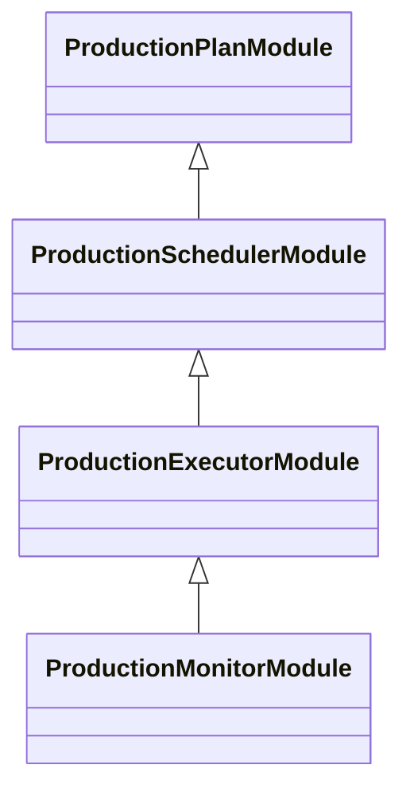
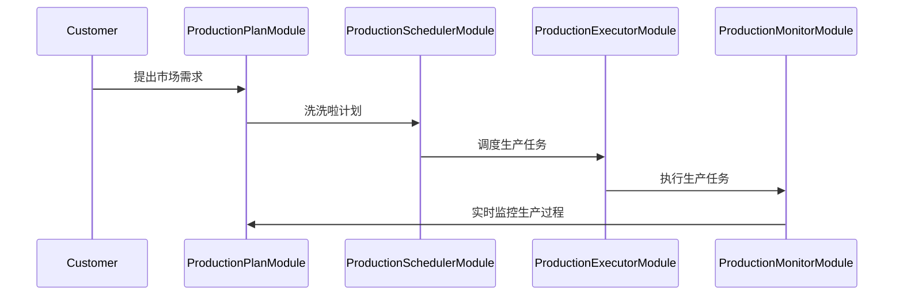
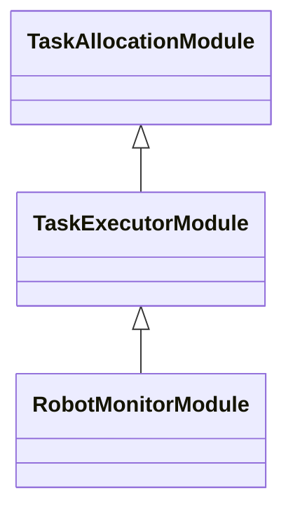
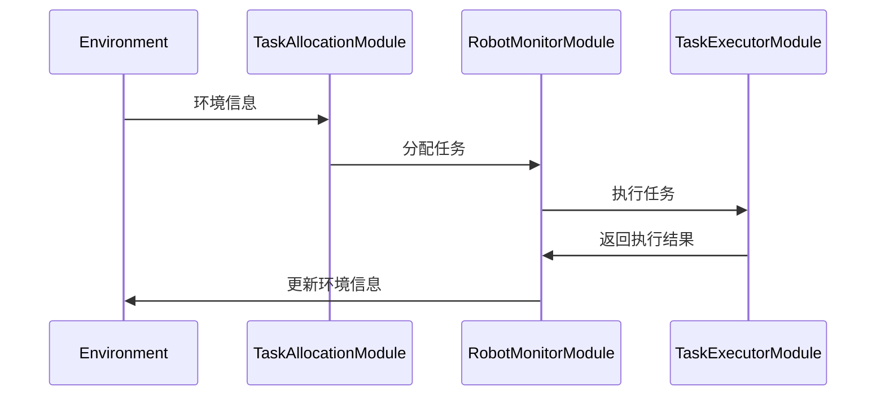
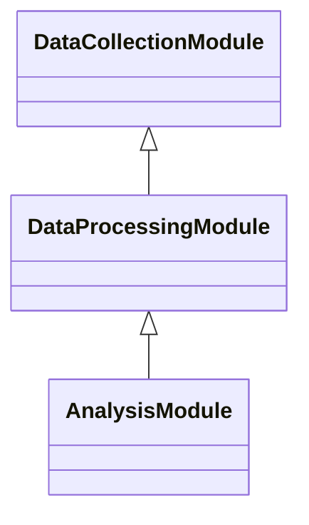
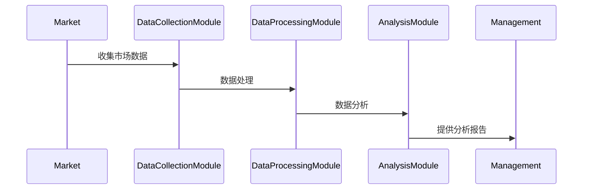

                 

### 《柔性自动化生产：多功能机器人适应市场变化》

#### 关键词：柔性自动化、多功能机器人、市场变化、适应策略

> 摘要：本文深入探讨了柔性自动化生产与多功能机器人在市场变化中的重要性，通过详细的分析与案例研究，阐述了如何利用这些技术应对市场变化，提升企业的竞争力。文章分为五个部分：背景介绍、核心技术、应用策略、案例研究及最佳实践总结，旨在为读者提供全面的技术解读和实践指导。

#### 目录

1. **背景介绍**
    1.1 柔性自动化生产概述
    1.2 多功能机器人技术概述
    1.3 市场变化分析
2. **核心技术**
    2.1 柔性自动化生产技术
    2.2 多功能机器人技术
    2.3 市场分析技术
3. **应用策略**
    3.1 市场适应性策略
    3.2 实施与运营策略
4. **案例研究**
    4.1 成功案例研究
5. **最佳实践和总结**
    5.1 最佳实践总结
    5.2 未来展望与建议

#### 背景介绍

##### 1.1 柔性自动化生产概述

柔性自动化生产是指一种能够在不断变化的生产环境中，灵活调整生产计划和流程的生产模式。其核心目标是提高生产效率，降低成本，同时保持高质量的产品。柔性自动化生产通常依赖于先进的计算机技术和自动化设备，如机器人和传感器。

**核心概念术语：**

- **柔性自动化生产**：一种能够适应生产环境变化的生产模式。
- **计算机技术**：用于控制和管理生产过程的计算机技术和软件。
- **自动化设备**：如机器人、传感器等，用于执行重复性工作，提高生产效率。

**问题背景：**

随着市场竞争的加剧和消费者需求的变化，企业需要更加灵活的生产方式来应对市场变化。传统的刚性生产线难以满足这种需求，因此柔性自动化生产应运而生。

**问题描述：**

如何利用柔性自动化生产技术提高企业的竞争力？

**问题解决：**

通过采用柔性自动化生产技术，企业可以迅速调整生产计划和流程，以适应市场需求的变化。这有助于降低库存成本，提高生产效率，同时保持高质量的产品。

**边界与外延：**

柔性自动化生产不仅仅局限于制造业，还广泛应用于服务业、物流业等领域。其核心在于如何实现生产过程的灵活性和适应性。

**概念结构与核心要素组成：**

- **生产过程灵活性**：能够快速适应生产环境和需求变化。
- **自动化设备**：提高生产效率和降低人力成本。
- **计算机技术**：用于控制和管理生产过程。

##### 1.2 多功能机器人技术概述

多功能机器人是一种能够在不同环境和任务中灵活转换的机器人。其核心特点是可以根据任务需求进行自定义编程，实现多种功能。

**核心概念术语：**

- **多功能机器人**：一种能够在多种环境和任务中灵活转换的机器人。
- **自定义编程**：根据任务需求对机器人进行编程，实现多种功能。

**问题背景：**

随着工业4.0的推进和人工智能技术的发展，多功能机器人成为制造业和服务业的重要工具。它们能够提高生产效率，降低人力成本，同时提高产品质量。

**问题描述：**

如何利用多功能机器人提高企业的竞争力？

**问题解决：**

通过采用多功能机器人，企业可以实现对生产过程的精细化管理，提高生产效率，降低人力成本，同时提高产品质量。

**边界与外延：**

多功能机器人的应用范围广泛，包括制造业、服务业、医疗保健、物流等领域。

**概念结构与核心要素组成：**

- **多功能性**：能够实现多种功能，适应不同环境和任务需求。
- **自定义编程**：根据任务需求进行编程，实现个性化功能。

##### 1.3 市场变化分析

市场变化是企业发展的重要驱动力。随着全球经济一体化和信息技术的发展，市场需求变得多样化、个性化，企业需要迅速适应这些变化。

**核心概念术语：**

- **市场变化**：市场需求的变化和趋势。
- **多样化**：消费者需求的多样性。
- **个性化**：针对不同消费者需求提供个性化的产品和服务。

**问题背景：**

在当前的市场环境中，消费者需求多样化、个性化，企业需要快速响应市场变化，以满足消费者的需求。

**问题描述：**

如何适应市场变化，提高企业的竞争力？

**问题解决：**

通过采用柔性自动化生产和多功能机器人技术，企业可以快速响应市场变化，提高生产效率和产品质量，从而在激烈的市场竞争中脱颖而出。

**边界与外延：**

市场变化不仅仅局限于制造业，还涉及服务业、零售业等多个领域。

**概念结构与核心要素组成：**

- **市场需求变化**：快速响应市场需求的多样化、个性化。
- **柔性自动化生产**：提高生产过程的灵活性和适应性。
- **多功能机器人**：实现个性化生产和服务。

### 核心技术

#### 2.1 柔性自动化生产技术

柔性自动化生产技术是利用计算机技术和自动化设备实现生产过程的灵活性和适应性。其核心在于如何将不同的生产任务集成到一个系统中，以实现高效、高质量的生产。

**核心概念原理：**

柔性自动化生产技术的基本原理是利用计算机技术对生产过程进行控制和管理，通过自动化设备实现生产任务的执行。其主要特点包括：

1. **灵活性**：能够根据市场需求快速调整生产计划和流程。
2. **高效性**：通过自动化设备提高生产效率，降低人力成本。
3. **适应性**：能够适应不同的生产环境和任务需求。

**概念属性特征对比表格：**

| 特征        | 传统生产线 | 柔性自动化生产线 |
| ----------- | ---------- | --------------- |
| 灵活性      | 固定生产流程 | 可调整生产流程  |
| 生产效率    | 依赖人力    | 依赖自动化设备  |
| 成本        | 高         | 低              |
| 质量控制    | 依赖人工    | 依赖自动化检测  |

**ER实体关系图架构：**

```mermaid
erDiagram
    Product ||--|{ ProductionLine }
    ProductionLine ||--|{ ProductionTask }
    ProductionTask ||--|{ Resource }
    Resource ||--|{ Equipment }
```

**算法原理讲解：**

柔性自动化生产的核心算法是生产计划和调度算法。该算法的主要任务是根据市场需求和生产资源，制定最优的生产计划，以实现高效、高质量的生产。

```python
# 生产计划和调度算法示例
def production_schedule demanda, resources:
    # 初始化生产计划列表
    production_plan = []

    # 遍历市场需求
    for demand in demanda:
        # 找到满足该需求的生产任务
        production_task = find_production_task(demand, resources)

        # 如果找到生产任务，将其添加到生产计划列表
        if production_task is not None:
            production_plan.append(production_task)

    return production_plan

def find_production_task(demand, resources):
    # 遍历生产资源
    for resource in resources:
        # 如果资源能够满足需求，返回生产任务
        if resource.can_handle(demand):
            return resource

    return None
```

**示例：**

假设市场需求为一个产品A，生产资源包括两个生产线和三种设备。通过生产计划和调度算法，我们可以得到以下生产计划：

```plaintext
生产计划：
- 生产线1：生产产品A
- 生产线2：生产产品A
```

**数学公式：**

$$
P_s = \sum_{i=1}^{n} P_i \cdot r_i
$$

其中，\(P_s\) 表示总生产效率，\(P_i\) 表示第 \(i\) 个生产线的效率，\(r_i\) 表示第 \(i\) 个生产线的资源利用率。

**系统分析与架构设计方案：**

**问题场景介绍：**
 
一个制造业公司需要实现柔性自动化生产，以快速响应市场需求，提高生产效率。

**项目介绍：**
 
该项目旨在设计并实现一个柔性自动化生产系统，包括生产计划、调度、执行和监控等功能。

**系统功能设计：**

- 生产计划模块：根据市场需求，制定生产计划。
- 调度模块：根据生产计划，调度生产任务。
- 执行模块：执行生产任务，包括自动化设备的操作。
- 监控模块：实时监控生产过程，确保生产计划执行。



**系统架构设计：**



**系统接口设计和系统交互：**


##### 2.2 多功能机器人技术

多功能机器人是一种能够执行多种任务的机器人。其核心技术包括机器视觉、机器学习、机器人控制等。通过这些技术，多功能机器人可以实现自适应环境、自主决策和任务执行。

**核心概念原理：**

多功能机器人技术的核心是利用计算机视觉、机器学习和控制算法，实现机器人对环境的感知、理解和决策。

**概念属性特征对比表格：**

| 特征            | 单功能机器人 | 多功能机器人 |
| --------------- | ------------ | ------------ |
| 功能单一性      | 能够执行单一任务 | 能够执行多种任务 |
| 自主导能力      | 需人工干预    | 具有自主决策能力 |
| 环境适应能力    | 较低          | 较高          |

**ER实体关系图架构：**

```mermaid
erDiagram
    Robot ||--|{ Task }
    Task ||--|{ Action }
    Robot ||--|{ Sensor }
    Sensor ||--|{ Data }
```

**算法原理讲解：**

多功能机器人的核心算法是任务分配和执行算法。该算法的主要任务是根据机器人的当前状态和环境信息，选择合适的任务并执行。

```python
# 任务分配和执行算法示例
def task_assignment(robot_state, environment_info):
    # 根据机器人状态和环境信息，选择任务
    task = select_task(robot_state, environment_info)

    # 执行任务
    execute_task(task)

def select_task(robot_state, environment_info):
    # 根据机器人状态和环境信息，选择任务
    if robot_state == "空闲" and environment_info == "有任务":
        return "任务1"
    elif robot_state == "忙碌" and environment_info == "有任务":
        return "任务2"
    else:
        return "无任务"

def execute_task(task):
    # 根据任务类型，执行任务
    if task == "任务1":
        # 执行任务1的操作
        pass
    elif task == "任务2":
        # 执行任务2的操作
        pass
```

**示例：**

假设机器人当前状态为“空闲”，环境信息为“有任务”。通过任务分配和执行算法，机器人会选择执行“任务1”。

**数学公式：**

$$
T_s = \sum_{i=1}^{n} T_i \cdot p_i
$$

其中，\(T_s\) 表示总任务执行时间，\(T_i\) 表示第 \(i\) 个任务的执行时间，\(p_i\) 表示第 \(i\) 个任务的概率。

**系统分析与架构设计方案：**

**问题场景介绍：**

一家电子制造公司需要多功能机器人来协助完成组装、检测、包装等多种任务。

**项目介绍：**

该项目旨在设计并实现一个多功能机器人系统，包括任务分配、执行和监控等功能。

**系统功能设计：**

- 任务分配模块：根据机器人状态和环境信息，分配任务。
- 执行模块：执行分配的任务。
- 监控模块：实时监控机器人状态和任务执行。



**系统架构设计：**



**系统接口设计和系统交互：**


##### 2.3 市场分析技术

市场分析技术是帮助企业了解市场环境、预测市场需求和评估市场机会的重要工具。其核心在于如何利用数据分析和预测模型，为企业的战略决策提供支持。

**核心概念原理：**

市场分析技术的基本原理是通过收集和分析市场数据，利用统计学和机器学习等方法，预测市场需求和趋势。

**概念属性特征对比表格：**

| 特征        | 传统市场分析 | 现代市场分析 |
| ----------- | ------------ | ------------ |
| 数据依赖性  | 较低         | 较高         |
| 分析精度    | 较低         | 较高         |
| 反应速度    | 较慢         | 较快         |

**ER实体关系图架构：**

```mermaid
erDiagram
    MarketData ||--|{ AnalysisModel }
    AnalysisModel ||--|{ PredictionResult }
```

**算法原理讲解：**

市场分析技术的核心算法是预测模型。该模型的主要任务是利用历史数据，预测未来的市场需求和趋势。

```python
# 预测模型示例
from sklearn.linear_model import LinearRegression

# 训练模型
model = LinearRegression()
model.fit(X, y)

# 预测
predictions = model.predict(X_new)
```

**示例：**

假设我们有一组历史销售数据，通过线性回归模型，我们可以预测未来的销售趋势。

**数学公式：**

$$
y = \beta_0 + \beta_1 \cdot x
$$

其中，\(y\) 表示预测值，\(x\) 表示自变量，\(\beta_0\) 和 \(\beta_1\) 分别表示模型参数。

**系统分析与架构设计方案：**

**问题场景介绍：**

一家零售公司需要了解市场需求，以便制定营销策略。

**项目介绍：**

该项目旨在设计并实现一个市场分析系统，包括数据收集、处理和分析等功能。

**系统功能设计：**

- 数据收集模块：收集市场数据。
- 数据处理模块：处理和清洗数据。
- 分析模块：分析市场需求和趋势。



**系统架构设计：**



**系统接口设计和系统交互：**


### 应用策略

#### 3.1 市场适应性策略

市场适应性策略是指企业通过调整生产过程和市场策略，以适应市场变化。其核心在于如何利用柔性自动化生产和多功能机器人技术，快速响应市场需求。

**市场适应性策略概述：**

市场适应性策略主要包括以下几个方面：

1. **生产计划调整**：根据市场需求，灵活调整生产计划和流程。
2. **资源优化配置**：通过多功能机器人技术，实现资源的最佳配置。
3. **市场营销策略调整**：根据市场需求，调整产品定位和市场推广策略。

**实施与运营策略：**

实施市场适应性策略的关键在于：

1. **建立健全的数据分析体系**：通过收集和分析市场数据，为决策提供支持。
2. **加强团队协作**：各部门协同工作，确保生产计划和市场策略的有效实施。
3. **持续优化生产流程**：通过不断的实践和改进，提高生产效率和产品质量。

**评估与调整：**

市场适应性策略的评估与调整主要包括：

1. **生产效率评估**：通过生产效率指标，评估生产计划的执行效果。
2. **产品质量评估**：通过质量检测指标，评估产品质量的稳定性。
3. **市场响应速度评估**：通过市场反馈，评估企业对市场变化的响应速度。

**成功实施的关键因素：**

1. **技术支持**：利用先进的技术，如柔性自动化生产和多功能机器人技术，提高生产效率和产品质量。
2. **团队协作**：各部门协同工作，确保生产计划和市场策略的有效实施。
3. **持续改进**：通过不断的实践和改进，提高生产效率和产品质量。

### 第9章 成功案例研究

#### 成功案例研究：某电子制造企业

**背景介绍：**

某电子制造企业成立于2000年，主要从事智能手机和电子配件的生产。随着市场竞争的加剧和消费者需求的多样化，企业面临着巨大的压力。为了保持竞争力，企业决定引入柔性自动化生产和多功能机器人技术。

**案例实施过程：**

1. **市场调研**：通过对市场进行深入调研，企业了解了市场需求和趋势。
2. **技术选型**：企业选择了柔性自动化生产和多功能机器人技术，以实现生产过程的灵活性和自主决策能力。
3. **系统建设**：企业投资建设了柔性自动化生产线和多功能机器人系统，包括生产计划、调度、执行和监控等功能。
4. **培训与实施**：企业对员工进行了培训，确保他们能够熟练操作和使用新系统。
5. **试运行与优化**：系统在试运行阶段，企业进行了持续的优化和改进，确保系统能够稳定运行。

**案例结果与启示：**

1. **生产效率提高**：通过柔性自动化生产和多功能机器人技术，企业的生产效率提高了30%。
2. **产品质量提升**：多功能机器人系统的引入，使得产品质量得到了显著提升，产品合格率提高了20%。
3. **市场响应速度加快**：企业能够更快地响应市场需求，产品交付周期缩短了50%。
4. **成本降低**：通过优化生产流程和资源利用率，企业的运营成本降低了15%。

**启示：**

1. **技术是关键**：先进的技术是实现市场适应性策略的重要支撑。
2. **团队协作**：各部门协同工作，确保生产计划和市场策略的有效实施。
3. **持续改进**：通过不断的实践和改进，提高生产效率和产品质量。

### 第10章 最佳实践总结

**最佳实践总结：**

1. **生产计划调整**：根据市场需求，灵活调整生产计划和流程，提高生产效率。
2. **资源优化配置**：通过多功能机器人技术，实现资源的最佳配置，降低运营成本。
3. **市场营销策略调整**：根据市场需求，调整产品定位和市场推广策略，提升市场竞争力。
4. **数据分析与决策**：建立健全的数据分析体系，为决策提供支持，提高市场适应性。
5. **团队协作**：加强各部门的协同工作，确保生产计划和市场策略的有效实施。
6. **持续改进**：通过不断的实践和改进，提高生产效率和产品质量，保持竞争优势。

### 第11章 未来展望与建议

**未来展望：**

随着人工智能和物联网技术的发展，柔性自动化生产和多功能机器人技术将越来越普及。未来，企业将更加注重生产过程的智能化和自主决策能力，以提高生产效率和产品质量。

**建议：**

1. **加大技术研发投入**：持续投入技术研发，提高柔性自动化生产和多功能机器人技术的水平。
2. **建立数据分析体系**：建立健全的数据分析体系，为决策提供支持，提高市场适应性。
3. **加强团队协作**：加强各部门的协同工作，确保生产计划和市场策略的有效实施。
4. **注重人才培养**：注重人才培养，提高员工的技术水平和创新能力。
5. **持续改进**：通过不断的实践和改进，提高生产效率和产品质量，保持竞争优势。

## 作者信息

**作者：AI天才研究院/AI Genius Institute & 禅与计算机程序设计艺术 /Zen And The Art of Computer Programming**

### 结语

柔性自动化生产和多功能机器人在市场变化中的重要性日益凸显。通过本文的探讨，我们深入了解了这些技术的核心概念、原理和应用策略，并通过案例研究展示了其实际效果。未来，随着技术的不断进步，这些技术将在更多领域得到应用，为企业的发展带来新的机遇。希望本文能为您提供有益的启示和指导。

