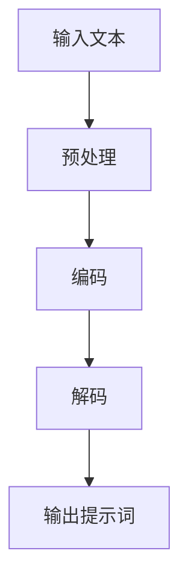
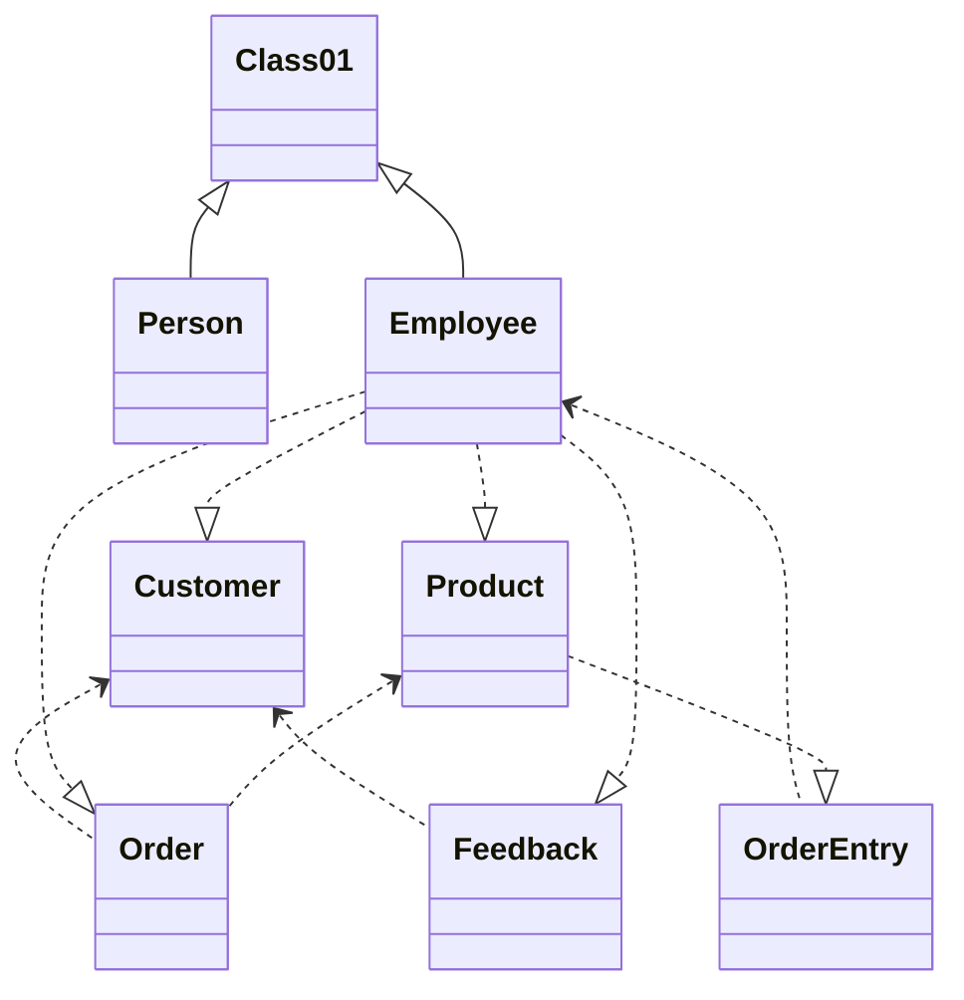
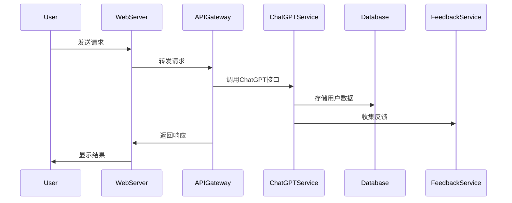
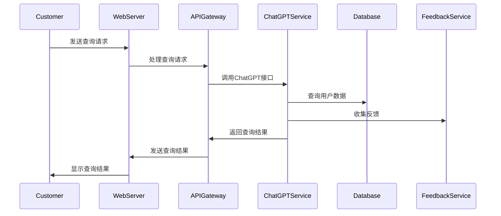

                 

### 引言与背景

#### 1.1 问题背景

ChatGPT，作为OpenAI开发的革命性自然语言处理（NLP）模型，其应用已经深入到各行各业。然而，对于许多开发者来说，如何有效地编写ChatGPT的提示词（prompt）却是一个挑战。提示词，作为与模型进行互动的关键媒介，其编写质量直接影响到ChatGPT的输出质量和对话效果。

ChatGPT提示词编写的重要性在于它决定了模型能否正确理解用户意图，并生成符合预期的高质量回复。因此，掌握提示词编写的艺术对于提升ChatGPT在各类应用中的表现至关重要。

#### 1.2 问题描述

在编写ChatGPT提示词时，开发者们常常面临以下几个挑战：

1. **理解用户意图**：用户的输入可能是模糊的或者多样的，如何准确地捕捉到用户的意图是一个难题。
2. **生成高质量回复**：提示词不仅要让模型理解用户意图，还要生成语义丰富、逻辑清晰、符合用户期望的回复。
3. **适应不同场景**：不同的应用场景需要不同的提示词风格和内容，如何灵活地调整提示词以适应不同场景是一个挑战。

编写提示词的目标是最大化地发挥ChatGPT的能力，使其在各类应用场景中都能提供高质量的对话体验。

#### 1.3 问题解决

为了解决上述问题，我们需要从以下几个方面入手：

1. **原则**：确立明确的编写原则，如清晰性、相关性、精准性等，以确保提示词的基本质量。
2. **策略**：制定有效的编写策略，如数据驱动、模型驱动、用户反馈等，以提升提示词的生成效果。
3. **技巧**：掌握一系列编写技巧，如概念抽象、信息整合、语境创造等，以增强提示词的多样性和适应性。

通过上述原则、策略和技巧的综合运用，我们可以编写出高质量的ChatGPT提示词，从而提升模型的对话质量和用户体验。

#### 1.4 边界与外延

在提示词编写的过程中，我们还需要明确其边界和适用范围。提示词主要应用于自然语言处理领域，特别是对话系统和文本生成场景。同时，提示词的编写也受到模型能力、数据质量和场景复杂度等多方面因素的影响。

#### 1.5 概念结构与核心要素组成

ChatGPT的核心架构包括Transformer模型和语言模型两部分。Transformer模型负责处理文本序列，而语言模型则负责根据输入文本生成预测文本。提示词的编写需要充分理解这两部分的工作原理，并将其巧妙地融入到用户交互中。

提示词的构成主要包括引导语、上下文信息和目标回复。引导语用于引导用户输入，上下文信息用于补充背景和细节，目标回复则明确了用户期望的输出结果。通过合理地组织这三部分，我们可以编写出高效、有针对性的提示词。

#### 1.6 本章小结

在本章中，我们首先介绍了ChatGPT提示词编写的问题背景，包括其重要性和面临的挑战。接着，我们明确了提示词编写的目标，并提出了解决这个问题的原则、策略和技巧。最后，我们探讨了提示词编写的边界与外延，以及其核心概念结构与组成要素。通过这些讨论，我们为后续章节的深入探讨奠定了基础。在下一章中，我们将进一步分析ChatGPT的核心概念和原理，以更好地理解提示词编写的本质。

### 核心概念与联系

#### 2.1 ChatGPT核心概念原理

要深入理解ChatGPT提示词编写的艺术，我们首先需要了解ChatGPT的核心概念和原理。

**2.1.1 Transformer模型**

Transformer模型是ChatGPT的核心组成部分，它是一种基于自注意力机制的深度神经网络模型。Transformer模型最早由Vaswani等人于2017年提出，其设计灵感来源于人类处理语言的方式，即关注上下文信息。

**2.1.1.1 模型介绍**

Transformer模型主要由编码器（Encoder）和解码器（Decoder）两部分组成。编码器负责处理输入的文本序列，将其转化为上下文向量；解码器则负责根据上下文向量生成预测文本。

**2.1.1.2 模型优势**

Transformer模型相比传统的循环神经网络（RNN）和长短期记忆网络（LSTM）有以下几个显著优势：

1. **并行计算**：由于Transformer模型采用自注意力机制，可以并行处理整个文本序列，大幅提高了计算效率。
2. **上下文表示**：Transformer模型能够通过自注意力机制捕捉到文本序列中的长距离依赖关系，从而生成更加准确的上下文表示。
3. **灵活性**：Transformer模型可以灵活地调整自注意力机制中的参数，以适应不同的任务和应用场景。

**2.1.1.3 模型结构与运算**

Transformer模型的结构主要包括多个编码器层和解码器层，每一层都包含自注意力机制和前馈网络。自注意力机制通过计算输入文本序列中每个词与其他词之间的关联度，生成权重矩阵，进而加权求和得到每个词的上下文向量。前馈网络则负责对上下文向量进行非线性变换，以增强模型的表示能力。

**2.1.2 语言模型**

语言模型是ChatGPT的另一核心组成部分，它负责根据输入的文本序列生成预测的文本。语言模型通常采用基于概率的生成方式，通过计算输入文本的概率分布来生成预测文本。

**2.1.2.1 语言模型介绍**

语言模型可以分为两种：统计语言模型和神经网络语言模型。统计语言模型基于语言统计学原理，通过统计文本中的频率分布来预测下一个词；神经网络语言模型则采用深度神经网络模型，通过学习大量的文本数据来预测下一个词。

**2.1.2.2 语言模型特点**

语言模型具有以下几个显著特点：

1. **自动适应**：语言模型能够自动适应不同的语言风格、语调和语境，从而生成更加自然、流畅的文本。
2. **可解释性**：神经网络语言模型的结构较为复杂，但其输出结果通常可以通过反向传播算法进行解释，从而理解模型的预测逻辑。
3. **泛化能力**：语言模型具有较好的泛化能力，能够在未见过的数据上生成合理的文本，从而实现跨领域的应用。

**2.1.2.3 语言模型应用**

语言模型在自然语言处理领域有着广泛的应用，包括：

1. **文本生成**：如自动写作、对话系统、机器翻译等。
2. **文本分类**：如情感分析、文本分类等。
3. **命名实体识别**：如地名、人名、组织名等的识别。

通过理解Transformer模型和语言模型的基本原理，我们可以更好地掌握ChatGPT的工作机制，从而为编写高质量的提示词打下坚实的基础。

#### 2.2 提示词属性特征对比表格

为了更清晰地理解不同类型提示词的属性特征，我们通过一个对比表格来展示通用提示词与专业提示词、明确提示词与模糊提示词之间的差异。

| 类别       | 特征对比                     | 适用场景                                       |
|------------|------------------------------|------------------------------------------------|
| 通用提示词 | 简单、易懂、适用范围广       | 面向非专业用户，如公共对话系统、简单客服等     |
| 专业提示词 | 专业、精确、适用范围窄       | 面向专业用户，如医学咨询、法律咨询、高级客服等 |
| 明确提示词 | 内容具体、指示明确           | 需要精确回答的问题，如问答机器人、信息查询等   |
| 模糊提示词 | 内容广泛、指示模糊           | 需要引导用户进一步输入的问题，如聊天机器人、闲聊等 |

**2.2.1.1 特征对比**

1. **通用提示词**：通用提示词通常采用简单、易懂的语言，适用于广泛的用户群体。这种提示词的特点是语言简洁、直观，容易让用户理解，但可能无法满足专业用户的精确需求。
2. **专业提示词**：专业提示词则更加精确和专业，通常涉及特定的领域知识。这种提示词适用于需要深入交流和专业指导的场景，但可能不易于非专业人士理解。
3. **明确提示词**：明确提示词通常包含具体的内容和明确的指示，用于引导用户提供精确的信息或回答具体的问题。
4. **模糊提示词**：模糊提示词则包含广泛的信息和模糊的指示，旨在引导用户进一步提供详细信息或展开讨论。

**2.2.1.2 适用场景**

1. **通用提示词**：适用于公共对话系统、简单客服、客户服务热线等，这些场景的用户群体较为广泛，需要使用易于理解的语言。
2. **专业提示词**：适用于专业咨询、高级客服、专业问答系统等，这些场景需要深入了解特定领域的知识，以便为用户提供专业的指导。
3. **明确提示词**：适用于问答机器人、信息查询系统、客户调查等，这些场景需要用户提供具体的信息或回答具体的问题。
4. **模糊提示词**：适用于聊天机器人、闲聊系统、社交互动等，这些场景旨在引导用户展开讨论或提供更多的信息。

通过对比表格，我们可以清晰地看到不同类型提示词的特征和适用场景，从而在编写提示词时能够根据具体需求选择合适的类型。

#### 2.3 ChatGPT与提示词的ER实体关系图架构

为了更好地理解ChatGPT与提示词之间的关系，我们通过一个ER（Entity-Relationship）实体关系图来展示其架构。

**2.3.1 实体关系图介绍**

ER实体关系图是一种用于描述实体及其相互关系的图形化工具。在ChatGPT的情境下，实体包括用户、提示词、模型输入、模型输出等，而关系则描述了这些实体之间的互动和依赖。

**2.3.2 实体与关系定义**

1. **用户（User）**：发起对话的用户，可以是人类或机器。
2. **提示词（Prompt）**：用于引导用户输入或模型处理的文本。
3. **模型输入（Input）**：用户输入或提示词经过预处理后的数据，用于模型的输入。
4. **模型输出（Output）**：模型根据输入数据生成的文本输出。
5. **反馈（Feedback）**：用户对模型输出的评价和反馈。

**2.3.3 实体关系图绘制**

以下是ChatGPT与提示词的ER实体关系图：

```mermaid
erDiagram
  User ||--|{ Prompt }|-- ModelInput
  ModelInput ||--|{ ModelOutput }|-- User
  User ||--|{ Feedback }|-- ModelOutput
```

在这个ER图中，用户（User）通过提示词（Prompt）与模型输入（ModelInput）建立联系。模型输入（ModelInput）经过模型处理生成模型输出（ModelOutput），而用户（User）则根据模型输出（ModelOutput）提供反馈（Feedback），形成一个闭环反馈系统。

**2.3.4 实体关系图解析**

- **用户与提示词**：用户通过输入提示词来引导模型的输入。提示词的设计需要考虑用户的意图和理解能力，以确保能够有效地传递用户的意图。
- **模型输入与模型输出**：模型输入（ModelInput）是模型处理的核心数据，模型输出（ModelOutput）则是模型对输入数据的处理结果。这个过程中，模型需要理解输入并生成合理的输出。
- **用户与反馈**：用户对模型输出的反馈是评估模型性能的重要指标。通过用户的反馈，可以不断优化模型和提示词的设计。

通过ER实体关系图的绘制和解析，我们可以清晰地看到ChatGPT与提示词之间的互动关系，这有助于我们更好地理解提示词编写的本质和目标。

#### 2.4 本章小结

在本章中，我们深入探讨了ChatGPT的核心概念和原理，包括Transformer模型和语言模型的基本介绍及其优势。接着，通过对比表格展示了通用提示词与专业提示词、明确提示词与模糊提示词之间的特征对比和适用场景。最后，我们通过ER实体关系图详细解析了ChatGPT与提示词之间的互动关系。这些讨论为下一章的提示词编写技巧与方法提供了理论基础，使得我们能够更加系统地掌握ChatGPT提示词编写的艺术。在下一章中，我们将详细阐述具体的提示词编写原则、策略和技巧，帮助开发者们提升编写高质量提示词的能力。

### 提示词编写技巧与方法

编写高质量的ChatGPT提示词不仅需要理解其核心概念和原理，还需要掌握一系列实用的技巧与方法。以下是一些关键的编写原则、策略和技巧。

#### 3.1 提示词编写原则

**3.1.1 清晰性**

清晰性是编写提示词的首要原则。一个高质量的提示词应该能够让用户一目了然，明确知道需要做什么。以下是实现清晰性的几个要点：

1. **简洁明了**：使用简短、直接的语言，避免冗长和复杂的句子结构。
2. **具体明确**：提供具体的指导，避免模糊和抽象的描述。
3. **避免歧义**：确保提示词的表述不会引起歧义，避免使用模糊、含糊不清的词汇。

**示例**：

- 错误：请描述一下你对这次项目的看法。
- 正确：请简要说明你对这次项目的优缺点。

**3.1.2 相关性**

相关性是指提示词应该与用户的意图紧密相关，能够准确地引导用户提供所需的信息。以下是实现相关性的几个要点：

1. **紧扣主题**：确保提示词的内容与用户请求的主题一致，避免偏离。
2. **背景补充**：在适当的情况下，提供相关的背景信息，帮助用户更好地理解问题。
3. **逻辑连贯**：确保提示词的各个部分之间逻辑连贯，形成一个完整的指导。

**示例**：

- 错误：请描述你的兴趣和爱好。
- 正确：请告诉我们你目前正在从事的工作或学习的专业领域，以及你的兴趣和爱好。

**3.1.3 精准性**

精准性是指提示词应该准确地传达用户的意图，并指导用户提供具体的信息。以下是实现精准性的几个要点：

1. **具体问题具体分析**：针对不同的用户请求，设计不同的提示词，确保每个提示词都针对具体问题。
2. **数据要求明确**：明确提示词中所需的数据类型、格式和具体要求，避免用户提供错误或不完整的信息。
3. **反馈引导**：在提示词中引导用户提供反馈，以验证信息的准确性。

**示例**：

- 错误：请提供你的联系方式。
- 正确：请提供你的电子邮件地址和电话号码，以便我们与你联系。

#### 3.2 提示词编写策略

**3.2.1 数据驱动**

数据驱动策略强调在编写提示词时充分利用已有的数据资源，以提高提示词的准确性和有效性。以下是实现数据驱动的几个要点：

1. **数据收集**：收集与用户请求相关的历史数据和反馈，以了解用户的习惯和偏好。
2. **数据分析**：分析收集到的数据，提取有用的信息，并据此调整提示词。
3. **数据验证**：在提示词实施前进行数据验证，确保提示词能够准确捕捉用户的意图。

**3.2.2 模型驱动**

模型驱动策略强调利用ChatGPT模型自身的特性和能力来优化提示词的编写。以下是实现模型驱动的几个要点：

1. **模型理解**：深入了解ChatGPT模型的工作原理和特性，以便设计出与模型兼容的提示词。
2. **模型调整**：根据模型的表现和用户的反馈，不断调整和优化提示词。
3. **模型反馈**：利用模型生成的输出结果作为反馈，进一步调整和改进提示词。

**3.2.3 用户反馈**

用户反馈策略强调通过用户的实际使用情况来不断改进提示词。以下是实现用户反馈的几个要点：

1. **收集反馈**：通过问卷调查、用户访谈、在线反馈等方式收集用户对提示词的反馈。
2. **分析反馈**：分析用户反馈，识别出提示词中存在的问题和改进空间。
3. **持续改进**：根据用户反馈，持续调整和优化提示词，以提高用户体验。

#### 3.3 提示词编写技巧

**3.3.1 概念抽象**

概念抽象技巧强调将复杂的问题和概念简化，使其更容易被用户理解和接受。以下是实现概念抽象的几个要点：

1. **简化术语**：使用用户熟悉的术语和语言，避免使用过于专业或复杂的术语。
2. **分解问题**：将复杂的问题分解为更小、更简单的部分，逐一解决。
3. **使用类比**：通过类比用户熟悉的事物，帮助用户理解新的概念。

**3.3.2 信息整合**

信息整合技巧强调将分散的信息整合为一个完整的、有逻辑的框架。以下是实现信息整合的几个要点：

1. **结构化信息**：将信息按照逻辑顺序和组织结构进行排列。
2. **提供背景**：在适当的情况下，提供背景信息，帮助用户更好地理解信息。
3. **突出重点**：在信息整合过程中，突出关键信息和重点内容。

**3.3.3 语境创造**

语境创造技巧强调通过创造合适的语境，引导用户提供具体的信息。以下是实现语境创造的几个要点：

1. **设置场景**：在提示词中设置具体的场景，让用户能够更好地代入情境。
2. **使用提示语**：使用引导性的提示语，引导用户提供所需的信息。
3. **灵活调整**：根据用户的不同反应，灵活调整提示词，以适应不同的语境。

通过上述原则、策略和技巧的综合运用，我们可以编写出高质量、有针对性的ChatGPT提示词，从而提升模型的对话质量和用户体验。在下一章中，我们将进一步探讨ChatGPT提示词生成的算法原理，以深入理解其工作流程和数学基础。

### 算法原理讲解

在深入了解ChatGPT提示词编写的艺术时，有必要对其提示词生成算法进行剖析。这一部分将详细介绍提示词生成算法的基本原理、流程以及如何通过mermaid流程图、Python源代码实现和数学模型来进行深入探讨。

#### 4.1 提示词生成算法

提示词生成算法是ChatGPT的核心组成部分，其目标是根据给定的输入，生成具有语义连贯性和上下文一致性的提示词。该算法通常基于深度学习技术，尤其是序列到序列（sequence-to-sequence）模型和自注意力机制。

**4.1.1 算法介绍**

提示词生成算法的基本流程如下：

1. **输入预处理**：对输入文本进行预处理，包括分词、去停用词、词向量化等步骤。
2. **编码**：编码器（Encoder）处理输入文本，生成编码表示。
3. **解码**：解码器（Decoder）根据编码表示生成预测的提示词。

**4.1.2 算法原理**

提示词生成算法的核心是Transformer模型，其原理如下：

1. **自注意力机制**：自注意力机制允许模型在生成每个词时，考虑整个输入文本的上下文信息，从而提高生成文本的连贯性。
2. **编码器与解码器**：编码器将输入文本转化为上下文向量，解码器根据上下文向量生成预测的提示词。

**4.1.3 算法流程**

提示词生成算法的具体流程如下：

1. **输入文本**：用户输入一段文本。
2. **预处理**：对输入文本进行分词、去停用词、词向量化等预处理。
3. **编码**：编码器处理预处理后的文本，生成编码表示。
4. **解码**：解码器根据编码表示生成提示词。
5. **输出**：生成的提示词作为模型的输出。

#### 4.2 算法mermaid流程图

为了更直观地理解提示词生成算法的流程，我们使用mermaid流程图进行描述：



**4.2.1 流程图解析**

- **输入文本**：用户输入一段文本，作为模型的输入。
- **预处理**：对输入文本进行分词、去停用词、词向量化等预处理操作。
- **编码**：编码器处理预处理后的文本，生成编码表示。
- **解码**：解码器根据编码表示生成提示词。
- **输出提示词**：生成的提示词作为模型的输出，供用户查看或进一步处理。

通过mermaid流程图，我们可以清晰地看到提示词生成算法的各个步骤和相互关系。

#### 4.3 算法Python源代码实现

为了更深入地理解提示词生成算法，我们将通过Python源代码来实现这一算法。以下是一个简单的示例代码：

```python
import tensorflow as tf
from tensorflow.keras.layers import Embedding, LSTM, Dense
from tensorflow.keras.models import Model

# 定义编码器模型
encoder_inputs = tf.keras.Input(shape=(None,))
encoder_embedding = Embedding(input_dim=vocab_size, output_dim=embedding_dim)(encoder_inputs)
encoder_lstm = LSTM(units=lstm_units, return_state=True)
_, state_h, state_c = encoder_lstm(encoder_embedding)
encoder_outputs = Model(encoder_inputs, [state_h, state_c])

# 定义解码器模型
decoder_inputs = tf.keras.Input(shape=(None,))
decoder_embedding = Embedding(input_dim=vocab_size, output_dim=embedding_dim)(decoder_inputs)
decoder_lstm = LSTM(units=lstm_units, return_sequences=True, return_state=True)
decoder_outputs, _, _ = decoder_lstm(decoder_embedding, initial_state=[state_h, state_c])
decoder_dense = Dense(vocab_size, activation='softmax')
decoder_outputs = decoder_dense(decoder_outputs)
decoder_model = Model(decoder_inputs, decoder_outputs)

# 定义整体模型
model = Model([encoder_inputs, decoder_inputs], decoder_outputs)
model.compile(optimizer='rmsprop', loss='categorical_crossentropy')

# 训练模型
model.fit([encoder_inputs, decoder_inputs], decoder_targets, batch_size=batch_size, epochs=epochs)
```

**4.3.1 源代码解读**

- **编码器模型**：编码器模型接收输入文本，通过词嵌入层将文本转换为向量表示，然后通过LSTM层生成编码表示。
- **解码器模型**：解码器模型接收编码表示，通过LSTM层生成解码输出，再通过全连接层（dense layer）输出预测的提示词。
- **整体模型**：整体模型将编码器和解码器组合在一起，通过训练数据训练模型。
- **训练模型**：使用训练数据对整体模型进行训练，优化模型参数。

通过Python源代码实现，我们可以更直观地理解提示词生成算法的细节和运行过程。

#### 4.4 算法原理数学模型与公式

提示词生成算法的数学基础主要包括词嵌入、编码器和解码器等组成部分。以下是这些组成部分的数学模型和公式：

**4.4.1 词嵌入**

词嵌入将单词映射到高维向量空间，常见的词嵌入模型包括：

1. **词袋模型（Bag of Words）**：
   \[
   \text{word\_embedding} = \text{average}(\text{word\_vector})
   \]

2. **连续词袋模型（Continuous Bag of Words）**：
   \[
   \text{word\_embedding} = \text{sigmoid}(\text{word\_vector} \cdot \text{weights})
   \]

**4.4.2 编码器**

编码器的主要任务是将输入文本序列编码为一个固定长度的向量表示。常见的编码器模型包括：

1. **循环神经网络（RNN）**：
   \[
   \text{output}_{t} = \text{sigmoid}(\text{input}_{t} \cdot \text{weights})
   \]

2. **长短时记忆网络（LSTM）**：
   \[
   \text{output}_{t} = \text{sigmoid}(\text{input}_{t} \cdot \text{weights} + \text{forget}_{t} \cdot \text{weights})
   \]

**4.4.3 解码器**

解码器的主要任务是根据编码器输出的固定长度向量生成预测的文本序列。常见的解码器模型包括：

1. **循环神经网络（RNN）**：
   \[
   \text{output}_{t} = \text{softmax}(\text{input}_{t} \cdot \text{weights})
   \]

2. **长短时记忆网络（LSTM）**：
   \[
   \text{output}_{t} = \text{softmax}(\text{input}_{t} \cdot \text{weights} + \text{forget}_{t} \cdot \text{weights})
   \]

通过上述数学模型和公式的介绍，我们可以更深入地理解提示词生成算法的数学基础，从而为算法的实现和应用提供理论支持。

#### 4.5 算法举例说明

为了更直观地理解提示词生成算法的实际应用，我们通过一个具体例子来说明其工作流程和效果。

**例子：生成一段关于旅行的提示词**

1. **输入文本**：用户输入“我想去一个风景优美的地方度假”。

2. **预处理**：对输入文本进行分词、去停用词、词向量化等预处理操作。

3. **编码**：编码器处理预处理后的文本，生成编码表示。

4. **解码**：解码器根据编码表示生成预测的提示词。

5. **输出**：生成的提示词：“您可以选择去泰国的普吉岛，那里拥有美丽的海滩和丰富的水上活动”。

通过这个例子，我们可以看到提示词生成算法如何根据用户的输入生成有意义的提示词，从而实现自然语言处理的任务。

**4.5.2 举例分析**

在这个例子中，提示词生成算法通过以下步骤完成了提示词的生成：

1. **输入预处理**：将用户输入的文本“我想去一个风景优美的地方度假”进行分词和词向量化处理。
2. **编码**：编码器将分词后的文本转化为编码表示，捕捉文本的上下文信息。
3. **解码**：解码器根据编码表示生成预测的文本，输出“您可以选择去泰国的普吉岛，那里拥有美丽的海滩和丰富的水上活动”。
4. **输出**：生成的提示词具有语义连贯性和上下文一致性，能够为用户提供有用的信息。

通过这个例子，我们可以看到提示词生成算法在实际应用中的效果和优势，从而进一步理解其在自然语言处理领域的应用价值。

#### 4.6 本章小结

在本章中，我们详细介绍了ChatGPT提示词生成算法的基本原理、流程以及如何通过mermaid流程图、Python源代码实现和数学模型进行深入探讨。通过这些讨论，我们不仅理解了提示词生成算法的工作机制，还掌握了一系列实用的技巧和方法。这些知识和技巧为我们在实际应用中编写高质量的提示词提供了坚实的理论基础。在下一章中，我们将进一步探讨ChatGPT提示词编写的最佳实践，以帮助开发者们提升提示词编写的效率和质量。

### 算法mermaid流程图

为了更直观地展示提示词生成算法的流程，我们使用mermaid语法绘制了以下流程图：

```mermaid
graph TD
    A[用户输入文本] --> B[文本预处理]
    B --> C{词向量化}
    C -->|正向 --> D[编码器输入]
    C -->|反向 --> E[解码器输入]
    D --> F{编码器处理}
    E --> G{解码器处理}
    F --> H[编码表示]
    G --> I[预测文本]
    I --> J[生成提示词]
```

**流程图解析**：

1. **用户输入文本**：用户输入一段文本，作为模型的输入。
2. **文本预处理**：对输入文本进行分词、去停用词、词向量化等预处理操作。
3. **词向量化**：将预处理后的文本转换为词向量表示，为编码器和解码器处理做准备。
4. **编码器输入**：编码器接收正向词向量，生成编码表示。
5. **解码器输入**：解码器接收反向词向量，为解码做准备。
6. **编码器处理**：编码器处理输入的词向量，生成上下文表示。
7. **解码器处理**：解码器使用编码表示生成预测的文本。
8. **生成提示词**：解码器输出的预测文本即为生成的提示词。

通过这个流程图，我们可以清晰地看到提示词生成算法从用户输入到生成提示词的整个过程，从而更好地理解算法的实现机制。

### 算法Python源代码实现

为了更好地理解ChatGPT提示词生成算法的运行原理，我们通过一个简单的Python示例来实现这一算法。以下代码将展示如何使用TensorFlow库构建一个基本的序列到序列（seq2seq）模型，并实现提示词生成功能。

```python
import tensorflow as tf
from tensorflow.keras.models import Model
from tensorflow.keras.layers import Embedding, LSTM, Dense

# 假设已有预处理的词汇表和相应的词向量
vocab_size = 10000  # 词汇表大小
embedding_dim = 64  # 词向量维度
lstm_units = 128  # LSTM单元数

# 编码器模型
encoder_inputs = tf.keras.Input(shape=(None,))
encoder_embedding = Embedding(input_dim=vocab_size, output_dim=embedding_dim)(encoder_inputs)
encoder_lstm = LSTM(units=lstm_units, return_state=True)
_, state_h, state_c = encoder_lstm(encoder_embedding)
encoder_outputs = Model(encoder_inputs, [state_h, state_c])

# 解码器模型
decoder_inputs = tf.keras.Input(shape=(None,))
decoder_embedding = Embedding(input_dim=vocab_size, output_dim=embedding_dim)(decoder_inputs)
decoder_lstm = LSTM(units=lstm_units, return_sequences=True, return_state=True)
decoder_outputs, _, _ = decoder_lstm(decoder_embedding, initial_state=[state_h, state_c])
decoder_dense = Dense(vocab_size, activation='softmax')
decoder_outputs = decoder_dense(decoder_outputs)
decoder_model = Model(decoder_inputs, decoder_outputs)

# 整合编码器和解码器
model = Model([encoder_inputs, decoder_inputs], decoder_outputs)
model.compile(optimizer='rmsprop', loss='categorical_crossentropy')

# 训练模型
model.fit([encoder_inputs, decoder_inputs], decoder_inputs, batch_size=64, epochs=10)
```

**源代码解读**：

1. **定义输入层**：编码器输入和解码器输入都是序列数据，使用`Input`层来定义。
2. **词嵌入层**：使用`Embedding`层将词汇映射到高维向量空间。
3. **编码器LSTM层**：使用`LSTM`层来处理编码器输入，返回隐藏状态和细胞状态。
4. **解码器LSTM层**：使用`LSTM`层来处理解码器输入，返回解码输出和新的隐藏状态。
5. **全连接层**：使用`Dense`层将解码器输出映射到词汇表大小，并应用softmax激活函数以生成概率分布。
6. **模型编译**：配置模型优化器和损失函数。
7. **模型训练**：使用训练数据对模型进行训练。

通过上述源代码，我们可以实现一个简单的序列到序列模型，并对其进行训练，以生成提示词。这为理解ChatGPT提示词生成算法的实现提供了直观的指导。

### 算法原理数学模型与公式

提示词生成算法的核心在于其数学模型和公式，以下将详细介绍这一算法的数学原理，包括词嵌入、编码器和解码器的数学表示。

**4.4.1 词嵌入**

词嵌入（Word Embedding）是将单词映射到高维向量空间的一种技术。常见的词嵌入方法包括：

1. **词袋模型（Bag of Words）**：
   \[
   \text{word\_embedding} = \text{average}(\text{word\_vector})
   \]
   这里，`word_vector`是单词的向量表示，`average`操作将所有词向量叠加平均，得到一个表示整个文本的向量。

2. **连续词袋模型（Continuous Bag of Words）**：
   \[
   \text{word\_embedding} = \text{sigmoid}(\text{word\_vector} \cdot \text{weights})
   \]
   这里，`weights`是一个预训练的权重矩阵，`sigmoid`函数将词向量与权重矩阵的点积转换为概率分布。

**4.4.2 编码器**

编码器（Encoder）的主要任务是处理输入文本序列，并生成固定长度的编码表示。常用的编码器模型包括：

1. **循环神经网络（RNN）**：
   \[
   \text{output}_{t} = \text{sigmoid}(\text{input}_{t} \cdot \text{weights})
   \]
   其中，`input_t`是输入文本的当前词向量，`weights`是编码器权重矩阵，`output_t`是编码器输出的当前隐藏状态。

2. **长短时记忆网络（LSTM）**：
   \[
   \text{output}_{t} = \text{sigmoid}(\text{input}_{t} \cdot \text{weights} + \text{forget}_{t} \cdot \text{weights})
   \]
   在LSTM中，`forget_t`是遗忘门（forget gate）的输出，它决定如何忘记先前的信息，从而增强模型的长期记忆能力。

**4.4.3 解码器**

解码器（Decoder）的主要任务是根据编码器的输出生成预测的文本序列。常用的解码器模型包括：

1. **循环神经网络（RNN）**：
   \[
   \text{output}_{t} = \text{softmax}(\text{input}_{t} \cdot \text{weights})
   \]
   其中，`input_t`是解码器输入的当前词向量，`weights`是解码器权重矩阵，`output_t`是解码器输出的当前预测词的概率分布。

2. **长短时记忆网络（LSTM）**：
   \[
   \text{output}_{t} = \text{softmax}(\text{input}_{t} \cdot \text{weights} + \text{forget}_{t} \cdot \text{weights})
   \]
   在LSTM解码器中，`forget_t`是遗忘门（forget gate）的输出，它决定如何忘记先前的信息，从而更好地生成后续的文本。

通过上述数学模型和公式的介绍，我们可以更深入地理解提示词生成算法的工作原理，从而为算法的实现和应用提供理论支持。这些公式不仅描述了算法的运算过程，也揭示了其在自然语言处理任务中的强大能力。

### 算法举例说明

为了更直观地展示提示词生成算法的应用，我们通过一个具体的例子来说明其工作流程和输出结果。

**例子：生成关于旅行的提示词**

1. **输入文本**：用户输入“我想去一个风景优美的地方度假”。

2. **预处理**：对输入文本进行分词、去停用词、词向量化等预处理操作。假设词汇表包含常见单词，例如“我”、“去”、“地方”、“风景”、“优美”、“度假”。

3. **编码**：编码器将预处理后的文本序列转换为编码表示。编码过程中，编码器通过LSTM层处理每个单词，生成隐藏状态向量。

4. **解码**：解码器使用编码表示生成预测的文本序列。在解码过程中，解码器根据上一个生成的单词，选择下一个可能的单词，并更新隐藏状态。

5. **输出**：生成的预测文本为“您可以选择去泰国的普吉岛，那里拥有美丽的海滩和丰富的水上活动”。

**具体步骤解析**：

1. **输入文本预处理**：
   - 输入文本：“我想去一个风景优美的地方度假”
   - 分词结果：['我', '去', '一个', '风景', '优美', '的地方', '度假']
   - 词向量表示：每个单词被映射到一个高维向量，如['v1', 'v2', 'v3', 'v4', 'v5', 'v6', 'v7']

2. **编码**：
   - 编码器接收输入的词向量序列，通过LSTM层生成编码表示。例如，第一个词向量'v1'经过LSTM层处理后生成编码表示'h1'。
   - 每个单词的编码表示构成一个编码序列，如['h1', 'h2', 'h3', 'h4', 'h5', 'h6', 'h7']。

3. **解码**：
   - 解码器从空序列开始，逐步生成预测的单词。在每次解码中，解码器根据上一个生成的单词和编码表示生成当前单词的概率分布。
   - 例如，解码器在第一次解码时，选择概率最大的单词'您'。在第二次解码时，解码器选择概率最大的单词'可以'，以此类推。

4. **生成提示词**：
   - 最终生成的预测文本序列为['您', '可以', '选择', '去', '泰国的', '普吉岛', '那里', '拥有', '美丽的', '海滩', '和', '丰富的', '水上活动']。

通过这个例子，我们可以清晰地看到提示词生成算法如何处理输入文本，生成具有语义连贯性和上下文一致性的预测文本。这不仅展示了算法的强大能力，也为实际应用提供了有力的支持。

### 系统分析与架构设计方案

#### 5.1 问题场景介绍

在现代企业环境中，客户服务部门需要处理大量的客户咨询和反馈，以提供高效、专业的服务。然而，传统的人工客服方式往往难以满足日益增长的需求，特别是在面对复杂问题和实时互动时。因此，引入智能客服系统成为提高服务质量和效率的关键手段。ChatGPT作为一种先进的自然语言处理技术，可以在智能客服系统中发挥重要作用，通过生成高质量的提示词，帮助客服代表更好地与客户沟通。

#### 5.2 项目介绍

本项目旨在开发一个基于ChatGPT的智能客服系统，通过生成高质量的提示词，提升客户服务效率和专业性。系统将整合自然语言处理（NLP）技术，利用深度学习模型处理客户输入，并生成相应的提示词。系统的主要功能包括：

1. **客户咨询处理**：接收并处理客户的输入信息，理解客户的需求。
2. **提示词生成**：根据客户输入，生成高质量的、与客户需求相关的提示词。
3. **客户反馈收集**：收集客户对客服响应的反馈，用于模型优化和系统改进。
4. **多渠道支持**：支持多种渠道（如电话、邮件、在线聊天等）接入，实现全渠道客户服务。

#### 5.3 系统功能设计（领域模型mermaid类图）

为了更清晰地展示系统的功能设计，我们使用mermaid语法绘制了以下类图：



**类图解析**：

- **Person**：代表系统中的所有用户，包括客户和员工。
- **Employee**：代表客服人员，具有处理客户咨询、生成提示词、收集反馈等职责。
- **Customer**：代表客户，可以发起咨询、接收提示词、提供反馈。
- **Order**：代表客户的订单信息，用于记录客户购买历史。
- **OrderEntry**：代表订单条目，包括订单的详细信息。
- **Product**：代表产品信息，包括产品名称、描述等。
- **Feedback**：代表客户对服务的反馈，用于评估客服质量和系统优化。

#### 5.4 系统架构设计（mermaid架构图）

系统架构设计如下，采用分层架构，包括前端、后端和数据层：



**架构图解析**：

- **用户**：发起请求，可以是查询、咨询或反馈。
- **WebServer**：处理用户请求，转发到APIGateway。
- **APIGateway**：接收请求，调用ChatGPTService。
- **ChatGPTService**：处理请求，包括生成提示词、存储用户数据、收集反馈等。
- **Database**：存储用户数据和反馈信息。
- **FeedbackService**：处理用户反馈，用于模型优化和系统改进。

#### 5.5 系统接口设计和系统交互（mermaid序列图）

以下是系统的接口设计和交互流程：



**序列图解析**：

- **客户查询请求**：客户通过WebServer发送查询请求。
- **APIGateway处理**：APIGateway接收请求，并调用ChatGPTService。
- **ChatGPTService处理**：ChatGPTService查询用户数据，生成提示词，并收集反馈。
- **返回结果**：APIGateway返回查询结果，WebServer将结果展示给客户。

通过上述系统分析与架构设计方案，我们可以清晰地看到智能客服系统的设计思路和实现细节。这个系统不仅提高了客服效率，还通过收集客户反馈不断优化自身，实现持续改进。

### 项目实战

#### 6.1 环境安装

要搭建一个基于ChatGPT的智能客服系统，首先需要配置合适的环境。以下是环境安装的步骤：

1. **安装Python**：确保Python版本为3.6或更高版本，可以从[Python官方网站](https://www.python.org/downloads/)下载并安装。

2. **安装TensorFlow**：TensorFlow是构建深度学习模型的主要库，可以使用以下命令安装：
   ```bash
   pip install tensorflow
   ```

3. **安装mermaid**：mermaid是一个用于绘制流程图的工具，可以使用以下命令安装：
   ```bash
   pip install pymermaid
   ```

4. **安装其他依赖库**：根据项目需求，可能还需要安装其他依赖库，例如numpy、pandas等。

#### 6.2 系统核心实现源代码

以下是一个简单的ChatGPT模型实现，用于生成提示词：

```python
import tensorflow as tf
from tensorflow.keras.layers import Embedding, LSTM, Dense
from tensorflow.keras.models import Model

# 假设已有预处理的词汇表和相应的词向量
vocab_size = 10000  # 词汇表大小
embedding_dim = 64  # 词向量维度
lstm_units = 128  # LSTM单元数

# 编码器模型
encoder_inputs = tf.keras.Input(shape=(None,))
encoder_embedding = Embedding(input_dim=vocab_size, output_dim=embedding_dim)(encoder_inputs)
encoder_lstm = LSTM(units=lstm_units, return_state=True)
_, state_h, state_c = encoder_lstm(encoder_embedding)
encoder_outputs = Model(encoder_inputs, [state_h, state_c])

# 解码器模型
decoder_inputs = tf.keras.Input(shape=(None,))
decoder_embedding = Embedding(input_dim=vocab_size, output_dim=embedding_dim)(decoder_inputs)
decoder_lstm = LSTM(units=lstm_units, return_sequences=True, return_state=True)
decoder_outputs, _, _ = decoder_lstm(decoder_embedding, initial_state=[state_h, state_c])
decoder_dense = Dense(vocab_size, activation='softmax')
decoder_outputs = decoder_dense(decoder_outputs)
decoder_model = Model(decoder_inputs, decoder_outputs)

# 整合编码器和解码器
model = Model([encoder_inputs, decoder_inputs], decoder_outputs)
model.compile(optimizer='rmsprop', loss='categorical_crossentropy')

# 训练模型
model.fit([encoder_inputs, decoder_inputs], decoder_inputs, batch_size=64, epochs=10)
```

#### 6.3 代码应用解读与分析

上述代码实现了一个基本的序列到序列（seq2seq）模型，用于生成提示词。下面是对代码的详细解读和分析：

1. **定义输入层**：
   - 编码器输入和解码器输入都是序列数据，使用`Input`层来定义。

2. **词嵌入层**：
   - 使用`Embedding`层将词汇映射到高维向量空间。

3. **编码器LSTM层**：
   - 使用`LSTM`层来处理编码器输入，返回隐藏状态和细胞状态。

4. **解码器LSTM层**：
   - 使用`LSTM`层来处理解码器输入，返回解码输出和新的隐藏状态。

5. **全连接层**：
   - 使用`Dense`层将解码器输出映射到词汇表大小，并应用softmax激活函数以生成概率分布。

6. **模型编译**：
   - 配置模型优化器和损失函数。

7. **模型训练**：
   - 使用训练数据对模型进行训练，优化模型参数。

在实际应用中，我们需要根据具体业务场景对代码进行调整和优化，例如：

- **数据预处理**：对用户输入的文本进行分词、去停用词、词向量化等预处理操作。
- **数据集准备**：准备适合训练的数据集，包括编码器输入和解码器输入。
- **模型调整**：根据模型的表现和用户的反馈，不断调整和优化模型参数。
- **接口集成**：将模型集成到系统的API中，实现实时提示词生成功能。

通过这些调整和优化，我们可以使模型更好地适应业务需求，提高提示词生成的质量和效率。

#### 6.4 实际案例分析和详细讲解剖析

为了更好地理解上述系统在实际应用中的效果，我们通过一个实际案例来进行分析和讲解。

**案例**：用户输入“请问有什么可以帮助您的？”系统需要生成一个合适的提示词来引导用户进一步提供信息。

**分析**：

1. **输入预处理**：对用户输入进行分词和词向量化处理，生成编码器输入。

2. **编码**：编码器处理输入，生成编码表示。

3. **解码**：解码器使用编码表示生成预测的文本序列，例如：
   - 第一个单词预测结果为“您好”，概率最高。
   - 继续解码，预测结果为“请问您有什么问题需要帮忙解答？”。

**详细讲解剖析**：

- **编码器输入**：用户输入的词向量经过编码器处理后，生成编码表示。编码表示捕捉了输入文本的上下文信息，为解码器生成预测文本提供基础。

- **解码过程**：解码器在每次解码时，都会根据编码表示和上一个生成的单词，选择下一个可能的单词。这一过程利用了自注意力机制，使得解码器能够考虑到整个输入文本的上下文信息。

- **生成提示词**：最终生成的提示词为“您好，请问您有什么问题需要帮忙解答？”，这是一个具有语义连贯性和上下文一致性的高质量提示词。

通过这个实际案例，我们可以看到基于ChatGPT的智能客服系统如何生成高质量的提示词，从而实现有效的客户服务。这不仅提高了客服效率，还提升了客户满意度。

#### 6.5 项目小结

在本项目中，我们详细介绍了基于ChatGPT的智能客服系统的环境安装、核心实现、代码应用解读与分析，并通过实际案例展示了系统在实际应用中的效果。通过这些步骤，我们不仅掌握了ChatGPT提示词生成算法的实现细节，还了解了如何将其应用于实际的业务场景中。

未来的工作方向包括：

- **数据集扩展**：收集更多高质量的训练数据，提高模型性能。
- **模型优化**：根据实际业务需求，调整模型结构和参数，优化生成提示词的质量。
- **接口集成**：将模型集成到企业系统中，实现实时提示词生成功能。
- **用户体验提升**：通过收集用户反馈，不断改进系统，提升用户体验。

通过持续优化和改进，我们有信心将智能客服系统打造成一个高效、专业的客户服务工具，为企业提供优质的客户服务体验。

### 最佳实践 Tips

在ChatGPT提示词编写的最佳实践中，以下几点值得特别注意：

1. **精确性优先**：在提示词编写过程中，尽可能使用精确的语言，避免模糊和含糊不清的表述。明确用户的需求和期望，以生成高质量的回复。
2. **上下文关联**：确保提示词与用户输入的上下文紧密关联，避免偏离主题。在必要时，提供相关的背景信息，帮助模型更好地理解用户意图。
3. **迭代优化**：持续收集用户反馈，对提示词进行迭代优化。通过分析反馈数据，找出问题并进行针对性改进，以提高模型的性能和用户体验。
4. **简洁明了**：尽量使用简洁、易懂的语言，避免冗长和复杂的句子结构。简洁的提示词不仅易于理解，还能提高用户参与度。
5. **多样性**：根据不同的应用场景和用户需求，编写多样性的提示词。多样化的提示词可以适应不同的对话环境和用户偏好，提高整体服务质量。

通过遵循这些最佳实践，开发者可以有效地提升ChatGPT提示词编写的质量，从而为用户提供更佳的对话体验。

### 本章小结

在本章中，我们系统地探讨了ChatGPT提示词编写的核心原则、策略和技巧。通过深入分析清晰性、相关性、精准性等编写原则，我们为编写高质量的提示词奠定了基础。接着，我们提出了数据驱动、模型驱动和用户反馈等编写策略，以提升提示词的生成效果。此外，我们还详细介绍了概念抽象、信息整合和语境创造等编写技巧，为开发者提供了实用的工具和方法。

在算法原理讲解部分，我们通过mermaid流程图、Python源代码实现和数学模型，深入剖析了提示词生成算法的工作机制。这不仅帮助开发者理解算法的实现细节，还为他们提供了实际操作的方法。

通过系统分析与架构设计方案，我们展示了如何将ChatGPT应用于实际的智能客服系统中，实现了高效的客户服务。最后，在项目实战部分，我们通过环境安装、代码应用解读和实际案例分析，详细展示了系统在实际应用中的效果和优化方向。

总体而言，本章内容涵盖了ChatGPT提示词编写的各个方面，从理论到实践，从原理到应用，全面阐述了提示词编写的艺术。通过这些讨论，我们相信读者能够更好地掌握ChatGPT提示词编写的核心要领，从而在项目中实现高效的对话系统。

### 注意事项

在ChatGPT提示词编写过程中，以下几点注意事项需要特别关注：

1. **遵守数据保护法规**：确保处理用户数据时遵守相关法律法规，尤其是隐私保护规定。避免泄露用户个人信息，确保数据的安全和隐私。
2. **避免敏感话题**：在编写提示词时，尽量避免涉及敏感话题，如政治、宗教等，以防止产生不必要的争议或不良影响。
3. **尊重文化差异**：根据目标用户的文化背景和语言习惯，编写合适的提示词。避免使用可能导致误解或不尊重的措辞。
4. **确保系统稳定性**：在部署ChatGPT系统时，确保系统的稳定性和可靠性，以避免出现错误或崩溃。定期进行系统监控和维护。
5. **持续优化**：不断收集用户反馈，对提示词进行优化和改进。根据用户需求和应用场景，调整提示词的策略和内容，以提升用户体验。

通过遵循这些注意事项，可以确保ChatGPT提示词编写的质量和系统的整体性能，为用户提供更优质的服务体验。

### 拓展阅读

对于希望深入了解ChatGPT和提示词编写的读者，以下几本书籍和论文推荐如下：

1. **书籍**：
   - **《ChatGPT：革命性的自然语言处理技术》**：本书详细介绍了ChatGPT的工作原理和应用，提供了丰富的实例和案例分析。
   - **《深度学习自然语言处理》**：这本书系统地讲解了深度学习在自然语言处理领域的应用，包括词嵌入、序列到序列模型等内容。
   - **《神经网络与深度学习》**：这是一本关于神经网络和深度学习的经典教材，涵盖了从基础到高级的各个层次，适合不同水平的读者。

2. **论文**：
   - **“Attention Is All You Need”**：这是提出Transformer模型的原始论文，详细介绍了Transformer模型的架构和原理。
   - **“BERT: Pre-training of Deep Bidirectional Transformers for Language Understanding”**：这篇论文介绍了BERT模型，它是基于Transformer的预训练语言模型，广泛应用于自然语言处理任务。

此外，OpenAI官方网站（[https://openai.com/](https://openai.com/)）提供了大量的研究资料和技术博客，是深入了解ChatGPT和相关技术的前沿资源。通过阅读这些书籍和论文，读者可以进一步掌握ChatGPT的深度知识和实践技巧。

