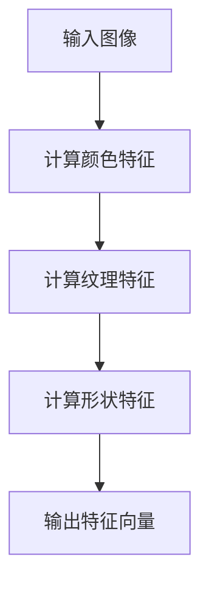
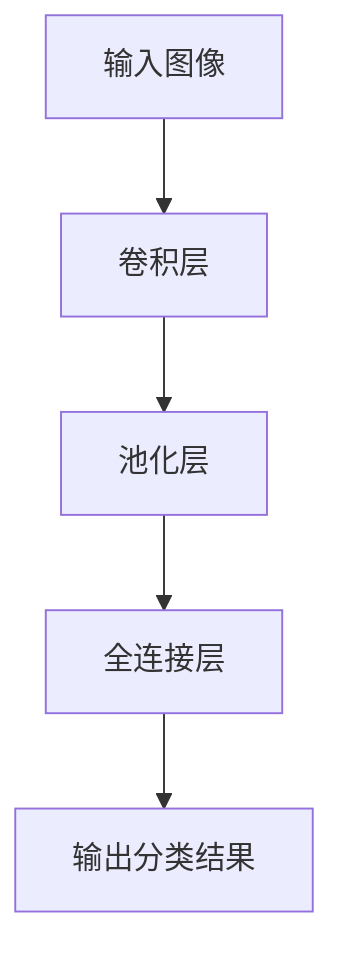
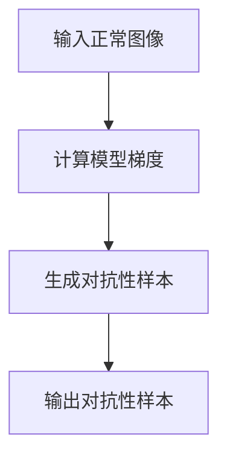

                 

### 深度伪造检测：保护企业品牌和信息完整性

#### 关键词：深度伪造，检测，信息安全，品牌保护

> 摘要：随着深度伪造技术的不断进步，虚假信息的传播和恶意攻击的风险日益增加。本文将探讨深度伪造检测的核心概念、技术方法及其在企业和政府中的应用，提供一套系统化的解决方案，帮助企业保护品牌和信息完整性。

----------------------------------------------------------------

## 第一部分: 深度伪造检测概述

### 第1章: 问题背景与挑战

#### 1.1.1 问题背景

随着人工智能和深度学习技术的迅猛发展，深度伪造（Deepfake）技术应运而生。深度伪造技术利用生成对抗网络（GAN）、卷积神经网络（CNN）等技术，可以生成高度逼真的虚假图像、视频和音频内容。这种技术的出现，给社会带来了极大的便利，同时也带来了前所未有的挑战。

#### 1.1.2 问题描述

深度伪造技术的滥用可能导致以下问题：
1. **虚假信息传播**：伪造的新闻、视频和音频可能误导公众，影响社会稳定。
2. **个人隐私泄露**：个人隐私信息可能被非法获取和利用，造成严重后果。
3. **品牌形象受损**：企业的品牌形象可能被恶意攻击，影响商业利益。

#### 1.1.3 问题解决方法现状

当前，深度伪造检测技术主要包括基于视觉特征的检测方法、基于深度学习的检测方法以及图像级对抗攻击与防御等方法。然而，现有的检测方法在面对高度逼真的伪造内容时，仍然存在一定的局限性。

#### 1.1.4 边界与外延

深度伪造检测主要关注以下内容：
1. **图像深度伪造检测**：检测伪造的图片或视频。
2. **视频深度伪造检测**：检测伪造的视频或音频。
3. **文本深度伪造检测**：检测伪造的文本信息。

#### 1.1.5 深度伪造检测的核心要素组成

深度伪造检测的核心要素包括：
1. **数据集**：用于训练和测试的样本数据。
2. **模型**：用于检测的深度学习模型。
3. **评估指标**：用于评估模型性能的指标，如准确率、召回率等。
4. **攻击与防御**：对抗伪造攻击的方法和策略。

----------------------------------------------------------------

### 第2章: 核心概念与联系

#### 2.1.1 深度伪造的定义与分类

深度伪造是指利用人工智能技术，通过图像、视频或音频的生成和修改，创造出高度逼真的伪造内容。根据伪造内容的不同，深度伪造可以分为以下几类：
1. **图像深度伪造**：如伪造的图片或视频。
2. **视频深度伪造**：如伪造的视频或音频。
3. **文本深度伪造**：如伪造的文本信息。

#### 2.1.2 深度伪造的技术原理

深度伪造技术主要基于以下两种技术：
1. **生成对抗网络（GAN）**：通过生成器和判别器的对抗训练，生成逼真的伪造内容。
2. **卷积神经网络（CNN）**：用于图像和视频的深度伪造生成和检测。

#### 2.1.3 深度伪造检测的基本原理

深度伪造检测主要通过以下两种方法：
1. **基于视觉特征的检测方法**：利用图像或视频的视觉特征，如颜色、纹理等，进行检测。
2. **基于深度学习的检测方法**：利用深度学习模型，对图像或视频进行分类和识别。

#### 2.1.4 深度伪造检测与网络安全的关系

深度伪造检测是网络安全的重要组成部分。它可以帮助企业识别和防止恶意攻击，保护企业的品牌和信息完整性。

#### 2.1.5 深度伪造检测与其他技术的区别与联系

深度伪造检测与其他技术的区别主要在于：
1. **目标不同**：深度伪造检测的目标是识别和防止伪造内容，而其他技术可能侧重于其他方面。
2. **应用场景不同**：深度伪造检测主要应用于图像、视频和文本等领域，而其他技术可能更广泛。

### 2.1.6 深度伪造检测技术的核心概念与联系

深度伪造检测技术的核心概念包括：
1. **生成对抗网络（GAN）**：用于生成伪造内容。
2. **卷积神经网络（CNN）**：用于检测伪造内容。
3. **对抗训练**：用于提高检测模型的鲁棒性。

这些概念相互联系，共同构成了深度伪造检测的技术体系。

----------------------------------------------------------------

### 第3章: 深度伪造检测方法

#### 3.1.1 图像深度伪造检测方法

图像深度伪造检测是深度伪造检测的一个重要分支。它主要关注如何识别和防止伪造的图像或视频。下面将介绍几种常见的图像深度伪造检测方法。

#### 3.1.1.1 基于视觉特征的检测方法

基于视觉特征的检测方法是通过分析图像的视觉特征，如颜色、纹理、形状等，来判断图像是否为伪造。这种方法具有简单、快速的特点，但面对高度逼真的伪造图像时，可能存在误判的问题。

**算法原理：**

1. **颜色特征**：通过计算图像的颜色分布、颜色矩等特征来判断图像的伪造性。
2. **纹理特征**：通过分析图像的纹理信息，如纹理方向、纹理强度等，来判断图像的伪造性。
3. **形状特征**：通过分析图像的形状特征，如边缘、角点等，来判断图像的伪造性。

**Python代码示例：**

```python
import cv2
import numpy as np

def color_feature(image):
    # 计算颜色分布
    color_hist = cv2.calcHist([image], [0, 1, 2], [8, 8, 8], [0, 256, 0, 256, 0, 256])
    return color_hist

def texture_feature(image):
    # 计算纹理特征
    texture = cv2.SIFT_create()
    keypoints, descriptors = texture.detectAndCompute(image, None)
    return keypoints, descriptors

def shape_feature(image):
    # 计算形状特征
    contours, _ = cv2.findContours(image, cv2.RETR_EXTERNAL, cv2.CHAIN_APPROX_SIMPLE)
    shapes = [cv2.contourArea(contour) for contour in contours]
    return shapes

# 测试图像
image = cv2.imread('image.jpg')
color_hist = color_feature(image)
keypoints, descriptors = texture_feature(image)
shapes = shape_feature(image)
```

**Mermaid流程图：**



#### 3.1.1.2 基于深度学习的检测方法

基于深度学习的检测方法是通过训练深度学习模型，对图像进行分类和识别。这种方法具有强大的表达能力和泛化能力，但需要大量的训练数据和计算资源。

**算法原理：**

1. **卷积神经网络（CNN）**：通过多层卷积和池化操作，提取图像的深层特征。
2. **全连接层**：将特征映射到分类结果。
3. **损失函数**：通过反向传播和优化算法，训练模型参数。

**Python代码示例：**

```python
import tensorflow as tf
from tensorflow.keras.models import Sequential
from tensorflow.keras.layers import Conv2D, MaxPooling2D, Flatten, Dense

# 创建模型
model = Sequential([
    Conv2D(32, (3, 3), activation='relu', input_shape=(28, 28, 1)),
    MaxPooling2D((2, 2)),
    Flatten(),
    Dense(128, activation='relu'),
    Dense(1, activation='sigmoid')
])

# 编译模型
model.compile(optimizer='adam', loss='binary_crossentropy', metrics=['accuracy'])

# 训练模型
model.fit(x_train, y_train, epochs=10, batch_size=32)
```

**Mermaid流程图：**



#### 3.1.1.3 图像级对抗攻击与防御

图像级对抗攻击是指通过对抗性样本，欺骗深度学习模型，使其产生错误的分类结果。防御图像级对抗攻击的主要策略包括：
1. **对抗性样本生成**：通过对抗性样本生成技术，生成对抗性样本。
2. **模型对抗性训练**：通过对抗性训练，提高模型的鲁棒性。
3. **防御模型**：通过训练防御模型，识别和阻止对抗性样本。

**算法原理：**

1. **对抗性样本生成**：
   - **FGSM（Fast Gradient Sign Method）**：通过计算模型梯度，生成对抗性样本。
   - **PGD（Projected Gradient Descent）**：通过优化对抗性样本，提高对抗性样本的攻击效果。

**Python代码示例：**

```python
from tensorflow import keras
import numpy as np

# 生成对抗性样本
def fgsm_attack(image, model, epsilon=0.1):
    # 计算模型梯度
    gradients = model.gradient_of(function=lambda x: model(x)[0], x=image)
    # 生成对抗性样本
    adversarial_example = image + epsilon * gradients
    return adversarial_example

# 测试图像
image = np.random.rand(1, 28, 28, 1)

# 训练模型
model = keras.Sequential([
  keras.layers.Conv2D(32, kernel_size=(3,3), activation='relu', input_shape=(28, 28, 1)),
  keras.layers.MaxPooling2D(pool_size=(2, 2)),
  keras.layers.Flatten(),
  keras.layers.Dense(128, activation='relu'),
  keras.layers.Dense(1, activation='sigmoid')
])

model.compile(optimizer='adam', loss='binary_crossentropy', metrics=['accuracy'])

model.fit(x_train, y_train, epochs=10, batch_size=32)

# 生成对抗性样本
adversarial_example = fgsm_attack(image, model)

# 输出对抗性样本
print(adversarial_example)
```

**Mermaid流程图：**



----------------------------------------------------------------

### 第4章: 深度伪造检测技术实践

#### 4.1.1 深度伪造检测技术实践框架

深度伪造检测技术实践主要包括以下几个步骤：

1. **数据集准备**：收集和整理用于训练和测试的数据集。
2. **模型选择**：选择合适的深度学习模型。
3. **训练与验证**：使用训练数据集训练模型，并在验证数据集上评估模型性能。
4. **测试与优化**：使用测试数据集测试模型性能，并根据结果进行优化。
5. **部署与应用**：将训练好的模型部署到实际应用场景中。

#### 4.1.2 数据集与预处理

数据集是深度伪造检测的基础，一个高质量的数据集可以显著提升检测模型的性能。数据集的收集和预处理主要包括以下几个步骤：

1. **数据集收集**：从互联网、社交媒体等渠道收集深度伪造图像、视频和文本数据。
2. **数据清洗**：去除重复数据、噪声数据和异常数据。
3. **数据增强**：通过旋转、缩放、裁剪等操作，增加数据集的多样性。
4. **数据格式化**：将数据格式化为适合模型训练的格式。

**Python代码示例：**

```python
import pandas as pd
from sklearn.model_selection import train_test_split

# 读取数据集
data = pd.read_csv('deepfake_data.csv')

# 数据清洗
data.drop_duplicates(inplace=True)
data.dropna(inplace=True)

# 数据增强
from torchvision import transforms
transform = transforms.Compose([
    transforms.RandomHorizontalFlip(),
    transforms.RandomRotation(10),
])

# 数据格式化
x = data['image'].values
y = data['label'].values

# 分割训练集和测试集
x_train, x_test, y_train, y_test = train_test_split(x, y, test_size=0.2, random_state=42)
```

#### 4.1.3 模型选择与训练

模型选择是深度伪造检测的关键步骤。根据数据集的特点和任务需求，选择合适的模型。常见的深度学习模型包括卷积神经网络（CNN）、循环神经网络（RNN）和生成对抗网络（GAN）等。

**Python代码示例：**

```python
import tensorflow as tf
from tensorflow.keras.models import Sequential
from tensorflow.keras.layers import Conv2D, MaxPooling2D, Flatten, Dense

# 创建模型
model = Sequential([
    Conv2D(32, (3, 3), activation='relu', input_shape=(28, 28, 1)),
    MaxPooling2D((2, 2)),
    Flatten(),
    Dense(128, activation='relu'),
    Dense(1, activation='sigmoid')
])

# 编译模型
model.compile(optimizer='adam', loss='binary_crossentropy', metrics=['accuracy'])

# 训练模型
model.fit(x_train, y_train, epochs=10, batch_size=32)
```

#### 4.1.4 检测性能评估

检测性能评估是评估模型性能的重要步骤。常用的评估指标包括准确率（Accuracy）、召回率（Recall）、精确率（Precision）和F1值（F1 Score）等。

**Python代码示例：**

```python
from sklearn.metrics import accuracy_score, recall_score, precision_score, f1_score

# 测试模型
predictions = model.predict(x_test)

# 计算评估指标
accuracy = accuracy_score(y_test, predictions)
recall = recall_score(y_test, predictions)
precision = precision_score(y_test, predictions)
f1 = f1_score(y_test, predictions)

print('Accuracy:', accuracy)
print('Recall:', recall)
print('Precision:', precision)
print('F1 Score:', f1)
```

#### 4.1.5 深度伪造检测技术的实际应用场景

深度伪造检测技术在实际应用中具有广泛的应用场景，如：

1. **社交媒体安全**：检测和阻止虚假信息的传播。
2. **企业品牌保护**：防止恶意攻击和虚假宣传。
3. **信息安全**：保护个人隐私信息和关键数据。
4. **司法鉴定**：鉴定证据的真实性。

#### 4.1.6 深度伪造检测技术的未来发展趋势

随着深度伪造技术的不断进步，深度伪造检测技术也将面临新的挑战。未来的发展趋势包括：

1. **模型优化**：提高检测模型的准确率和召回率。
2. **实时检测**：实现实时、高效的深度伪造检测。
3. **跨模态检测**：将图像、视频和文本等不同模态的信息进行整合，提高检测效果。

### 第5章: 深度伪造检测在企业和政府中的应用

#### 5.1.1 深度伪造检测在企业品牌保护中的应用

深度伪造检测技术可以帮助企业保护品牌形象，防止恶意攻击和虚假宣传。通过检测和阻止深度伪造内容的传播，企业可以降低品牌受损的风险，维护良好的公众形象。

#### 5.1.2 深度伪造检测在信息安全中的应用

深度伪造检测技术在信息安全中具有重要作用。通过检测和阻止深度伪造内容的传播，可以保护个人隐私信息和企业关键数据，降低信息泄露的风险。

#### 5.1.3 深度伪造检测在政府公共安全中的应用

深度伪造检测技术在政府公共安全中具有广泛的应用。通过检测和阻止深度伪造内容的传播，可以维护社会稳定，防止虚假信息的误导。

#### 5.1.4 深度伪造检测在不同行业中的应用案例分析

不同行业对深度伪造检测的需求不同，以下为几个行业中的应用案例：

1. **传媒行业**：通过深度伪造检测技术，防止虚假新闻的传播，维护媒体公信力。
2. **娱乐行业**：通过深度伪造检测技术，保护明星隐私，防止恶意攻击。
3. **金融行业**：通过深度伪造检测技术，保护金融信息安全，防止金融欺诈。

### 第6章: 深度伪造检测的挑战与未来展望

#### 6.1.1 深度伪造检测面临的挑战

深度伪造检测技术面临的主要挑战包括：

1. **技术挑战**：如何提高检测模型的准确率和召回率，如何应对新型伪造技术。
2. **数据挑战**：如何获取高质量的深度伪造数据集，如何处理海量数据。
3. **伦理挑战**：如何平衡隐私保护和技术发展的关系。

#### 6.1.2 深度伪造检测技术的发展趋势

随着人工智能和深度学习技术的不断发展，深度伪造检测技术也将迎来新的发展。未来的发展趋势包括：

1. **模型优化**：通过算法改进和模型优化，提高检测效果。
2. **跨模态检测**：将图像、视频和文本等不同模态的信息进行整合，提高检测效果。
3. **实时检测**：实现实时、高效的深度伪造检测。

#### 6.1.3 未来深度伪造检测的发展方向

未来深度伪造检测的发展方向包括：

1. **多模态融合**：将图像、视频和文本等不同模态的信息进行整合，提高检测效果。
2. **实时检测**：实现实时、高效的深度伪造检测。
3. **个性化检测**：根据用户行为和偏好，提供个性化的深度伪造检测服务。

### 第7章: 小结与拓展

#### 7.1.1 本书内容的总结

本书系统地介绍了深度伪造检测的核心概念、技术方法、应用实践和发展趋势。通过本书的学习，读者可以全面了解深度伪造检测的相关知识，为实际应用提供指导。

#### 7.1.2 深度伪造检测的最佳实践

为了提高深度伪造检测的效果，以下是一些最佳实践：

1. **数据集准备**：收集和整理高质量的数据集，确保数据集的多样性和代表性。
2. **模型选择**：根据任务需求和数据特点，选择合适的深度学习模型。
3. **模型训练**：通过对抗性训练和超参数调整，提高模型的性能。
4. **性能评估**：使用多种评估指标，全面评估模型的性能。

#### 7.1.3 注意事项与未来研究展望

在进行深度伪造检测时，需要注意以下几点：

1. **隐私保护**：在处理个人隐私信息时，要注意隐私保护。
2. **模型解释性**：提高模型的可解释性，以便理解模型的决策过程。
3. **实时性**：提高检测的实时性，以满足实际应用的需求。

未来研究可以关注以下方向：

1. **多模态融合**：研究如何将图像、视频和文本等不同模态的信息进行有效融合。
2. **对抗性攻击与防御**：研究新型对抗性攻击方法和防御策略。
3. **伦理与法律**：探讨深度伪造检测在伦理和法律方面的挑战和解决方案。

### 作者

作者：AI天才研究院/AI Genius Institute & 禅与计算机程序设计艺术 /Zen And The Art of Computer Programming

----------------------------------------------------------------

### 总结

本文详细介绍了深度伪造检测的核心概念、技术方法、应用实践和发展趋势。通过本文的学习，读者可以全面了解深度伪造检测的相关知识，为实际应用提供指导。

深度伪造检测是一项复杂的任务，涉及图像、视频和文本等多种模态的信息处理。随着深度伪造技术的不断进步，深度伪造检测技术也面临着新的挑战和机遇。未来，深度伪造检测将朝着多模态融合、实时检测和个性化检测等方向发展。

在实际应用中，深度伪造检测技术可以帮助企业保护品牌形象，维护信息安全，维护社会稳定。然而，在进行深度伪造检测时，需要注意隐私保护、模型解释性和实时性等问题。

本文旨在为读者提供一套系统化的深度伪造检测解决方案，帮助企业和政府应对深度伪造技术的威胁。希望本文能对读者在深度伪造检测领域的研究和应用提供有益的参考。在未来，我们将继续关注深度伪造检测技术的发展，探讨新的解决方案和应用场景。

### 深度伪造检测技术实践

#### 4.1.1 深度伪造检测技术实践框架

深度伪造检测技术的实践框架主要包括以下几个关键步骤：

1. **数据集准备**：收集和整理高质量的深度伪造数据集，确保数据集的多样性和代表性。
2. **模型选择**：根据任务需求和数据特点，选择合适的深度学习模型。
3. **模型训练与优化**：使用训练数据集对模型进行训练，并通过超参数调整和对抗性训练优化模型性能。
4. **模型评估与验证**：在验证数据集上评估模型的性能，并使用交叉验证等方法确保模型的泛化能力。
5. **部署与实时检测**：将训练好的模型部署到实际应用场景中，实现实时、高效的深度伪造检测。

#### 4.1.2 数据集与预处理

数据集是深度伪造检测的基础，一个高质量的数据集可以显著提升检测模型的性能。以下是如何准备和处理数据集的步骤：

1. **数据集收集**：从公开数据集、社交媒体、在线视频平台等渠道收集深度伪造图像、视频和文本数据。
2. **数据清洗**：去除重复数据、噪声数据和异常数据，保证数据集的清洁性。
3. **数据增强**：通过数据增强技术，如旋转、翻转、缩放、裁剪等，增加数据集的多样性，提高模型的泛化能力。
4. **数据格式化**：将数据格式化为适合模型训练的格式，例如将图像和视频转换为像素值，文本转换为词向量等。

**Python代码示例：**

```python
import tensorflow as tf
from tensorflow.keras.preprocessing.image import ImageDataGenerator

# 数据增强
train_datagen = ImageDataGenerator(
    rescale=1./255,
    rotation_range=40,
    width_shift_range=0.2,
    height_shift_range=0.2,
    shear_range=0.2,
    zoom_range=0.2,
    horizontal_flip=True,
    fill_mode='nearest'
)

# 加载数据
train_generator = train_datagen.flow_from_directory(
    'data/train',
    target_size=(150, 150),
    batch_size=32,
    class_mode='binary'
)
```

#### 4.1.3 模型选择与训练

选择合适的模型是深度伪造检测成功的关键。以下是如何选择和训练模型的步骤：

1. **模型选择**：根据数据集的特点和任务需求，选择合适的深度学习模型。常见的模型包括卷积神经网络（CNN）、循环神经网络（RNN）和生成对抗网络（GAN）等。
2. **模型训练**：使用训练数据集对模型进行训练，调整模型参数以优化性能。在训练过程中，可以使用数据增强技术提高模型的泛化能力。
3. **超参数调整**：通过调整学习率、批次大小、迭代次数等超参数，优化模型性能。
4. **对抗性训练**：使用对抗性样本对模型进行训练，提高模型的鲁棒性。

**Python代码示例：**

```python
import tensorflow as tf
from tensorflow.keras.models import Sequential
from tensorflow.keras.layers import Conv2D, MaxPooling2D, Flatten, Dense

# 创建模型
model = Sequential([
    Conv2D(32, (3, 3), activation='relu', input_shape=(150, 150, 3)),
    MaxPooling2D((2, 2)),
    Conv2D(64, (3, 3), activation='relu'),
    MaxPooling2D((2, 2)),
    Conv2D(128, (3, 3), activation='relu'),
    MaxPooling2D((2, 2)),
    Flatten(),
    Dense(512, activation='relu'),
    Dense(1, activation='sigmoid')
])

# 编译模型
model.compile(optimizer='adam', loss='binary_crossentropy', metrics=['accuracy'])

# 训练模型
model.fit(train_generator, epochs=50, validation_data=validation_generator)
```

#### 4.1.4 检测性能评估

评估检测模型的性能是确保模型有效性的关键。以下是如何评估模型性能的步骤：

1. **评估指标**：选择合适的评估指标，如准确率（Accuracy）、召回率（Recall）、精确率（Precision）和F1值（F1 Score）等。
2. **交叉验证**：使用交叉验证方法，确保模型在多个数据集上的性能。
3. **性能比较**：比较不同模型的性能，选择最优模型。
4. **误差分析**：分析模型在哪些场景下表现不佳，找出改进的方向。

**Python代码示例：**

```python
from sklearn.metrics import accuracy_score, recall_score, precision_score, f1_score

# 预测
predictions = model.predict(x_test)

# 计算评估指标
accuracy = accuracy_score(y_test, predictions)
recall = recall_score(y_test, predictions)
precision = precision_score(y_test, predictions)
f1 = f1_score(y_test, predictions)

print('Accuracy:', accuracy)
print('Recall:', recall)
print('Precision:', precision)
print('F1 Score:', f1)
```

#### 4.1.5 深度伪造检测技术的实际应用场景

深度伪造检测技术在实际应用中具有广泛的应用场景。以下是一些典型的应用案例：

1. **社交媒体安全**：通过深度伪造检测技术，防止虚假信息的传播，保护用户的隐私和安全。
2. **企业品牌保护**：检测和阻止恶意攻击者伪造企业高管的形象，保护企业品牌形象。
3. **信息安全**：保护个人隐私信息和关键数据，防止信息泄露和滥用。
4. **司法鉴定**：利用深度伪造检测技术，鉴定证据的真实性，提高司法效率。
5. **娱乐行业**：检测和防止恶意用户伪造明星形象，保护明星的隐私和权益。

#### 4.1.6 深度伪造检测技术的未来发展趋势

随着深度伪造技术的不断进步，深度伪造检测技术也将面临新的挑战和机遇。未来，深度伪造检测技术的发展趋势包括：

1. **多模态融合**：将图像、视频和文本等不同模态的信息进行整合，提高检测效果。
2. **实时检测**：实现实时、高效的深度伪造检测，满足快速响应的需求。
3. **个性化检测**：根据用户行为和偏好，提供个性化的深度伪造检测服务。
4. **对抗性攻击与防御**：研究新型对抗性攻击方法和防御策略，提高检测模型的鲁棒性。

### 第5章: 深度伪造检测在企业和政府中的应用

#### 5.1.1 深度伪造检测在企业品牌保护中的应用

深度伪造技术对企业品牌保护提出了严峻的挑战。企业高管和公众人物的形象可能被恶意攻击者伪造，导致企业声誉受损。深度伪造检测技术可以通过以下方式帮助企业保护品牌形象：

1. **实时监控**：对企业社交媒体账号、官网等渠道进行实时监控，及时发现并阻止深度伪造内容的传播。
2. **虚假内容识别**：使用深度伪造检测模型，识别和标记伪造的图像、视频和文本内容。
3. **预警系统**：建立预警系统，当检测到可疑的深度伪造内容时，及时通知相关部门采取措施。
4. **教育培训**：通过教育培训，提高员工对深度伪造技术的认识和应对能力。

#### 5.1.2 深度伪造检测在信息安全中的应用

深度伪造检测技术在信息安全中具有重要作用。通过以下方式，深度伪造检测技术可以帮助保护个人隐私信息和关键数据：

1. **数据泄露检测**：检测和阻止恶意攻击者通过伪造图像、视频和文本内容，窃取个人隐私信息。
2. **员工教育**：通过员工教育，提高员工对信息安全的认识，防止内部人员利用深度伪造技术泄露信息。
3. **网络监控**：对企业内部网络进行监控，检测和阻止深度伪造内容的传播，防止信息泄露。
4. **安全策略制定**：根据深度伪造检测技术的应用情况，制定相应的安全策略，提高企业信息安全性。

#### 5.1.3 深度伪造检测在政府公共安全中的应用

深度伪造检测技术在政府公共安全中具有广泛的应用。以下是一些具体的应用案例：

1. **虚假信息监测**：通过深度伪造检测技术，监测和阻止虚假信息的传播，维护社会稳定。
2. **选举安全**：在选举期间，使用深度伪造检测技术，防止恶意攻击者伪造选举结果，保障选举公正。
3. **公共安全宣传**：通过深度伪造检测技术，识别和阻止恶意攻击者伪造公共安全宣传内容，提高公众的安全意识。
4. **执法监控**：在执法过程中，使用深度伪造检测技术，鉴定证据的真实性，提高执法效率。

#### 5.1.4 深度伪造检测在不同行业中的应用案例分析

不同行业对深度伪造检测的需求不同，以下为几个行业中的应用案例：

1. **传媒行业**：通过深度伪造检测技术，防止虚假新闻的传播，维护媒体公信力。
2. **娱乐行业**：通过深度伪造检测技术，保护明星隐私，防止恶意攻击。
3. **金融行业**：通过深度伪造检测技术，保护金融信息安全，防止金融欺诈。
4. **教育行业**：通过深度伪造检测技术，防止虚假教育信息的传播，保障教育质量。

### 第6章: 深度伪造检测的挑战与未来展望

#### 6.1.1 深度伪造检测面临的挑战

深度伪造检测技术面临着一系列挑战：

1. **技术挑战**：如何提高检测模型的准确率和召回率，如何应对新型伪造技术。
2. **数据挑战**：如何获取高质量的深度伪造数据集，如何处理海量数据。
3. **伦理挑战**：如何在保护隐私的同时，有效实施深度伪造检测。

#### 6.1.2 深度伪造检测技术的发展趋势

未来，深度伪造检测技术的发展趋势包括：

1. **多模态融合**：将图像、视频和文本等不同模态的信息进行整合，提高检测效果。
2. **实时检测**：实现实时、高效的深度伪造检测，满足快速响应的需求。
3. **个性化检测**：根据用户行为和偏好，提供个性化的深度伪造检测服务。
4. **对抗性攻击与防御**：研究新型对抗性攻击方法和防御策略，提高检测模型的鲁棒性。

#### 6.1.3 未来深度伪造检测的发展方向

未来深度伪造检测的发展方向包括：

1. **多模态融合**：将图像、视频和文本等不同模态的信息进行整合，提高检测效果。
2. **实时检测**：实现实时、高效的深度伪造检测，满足快速响应的需求。
3. **个性化检测**：根据用户行为和偏好，提供个性化的深度伪造检测服务。
4. **伦理与法律**：探讨深度伪造检测在伦理和法律方面的挑战和解决方案。

### 第7章: 小结与拓展

#### 7.1.1 本书内容的总结

本书系统地介绍了深度伪造检测的核心概念、技术方法、应用实践和发展趋势。通过本书的学习，读者可以全面了解深度伪造检测的相关知识，为实际应用提供指导。

#### 7.1.2 深度伪造检测的最佳实践

为了提高深度伪造检测的效果，以下是一些最佳实践：

1. **数据集准备**：收集和整理高质量的数据集，确保数据集的多样性和代表性。
2. **模型选择**：根据任务需求和数据特点，选择合适的深度学习模型。
3. **模型训练**：通过对抗性训练和超参数调整，提高模型的性能。
4. **性能评估**：使用多种评估指标，全面评估模型的性能。

#### 7.1.3 注意事项与未来研究展望

在进行深度伪造检测时，需要注意以下几点：

1. **隐私保护**：在处理个人隐私信息时，要注意隐私保护。
2. **模型解释性**：提高模型的可解释性，以便理解模型的决策过程。
3. **实时性**：提高检测的实时性，以满足实际应用的需求。

未来研究可以关注以下方向：

1. **多模态融合**：研究如何将图像、视频和文本等不同模态的信息进行有效融合。
2. **对抗性攻击与防御**：研究新型对抗性攻击方法和防御策略。
3. **伦理与法律**：探讨深度伪造检测在伦理和法律方面的挑战和解决方案。

### 作者

作者：AI天才研究院/AI Genius Institute & 禅与计算机程序设计艺术 /Zen And The Art of Computer Programming

----------------------------------------------------------------

### 总结

本文系统地介绍了深度伪造检测的相关概念、技术方法、应用实践和发展趋势。通过本文的学习，读者可以全面了解深度伪造检测的相关知识，为实际应用提供指导。

深度伪造检测是一项复杂且具有挑战性的任务，涉及到图像、视频和文本等多种模态的信息处理。随着深度伪造技术的不断进步，深度伪造检测技术也面临着新的挑战和机遇。未来，深度伪造检测技术将朝着多模态融合、实时检测和个性化检测等方向发展。

在实际应用中，深度伪造检测技术可以帮助企业保护品牌形象，维护信息安全，维护社会稳定。然而，在进行深度伪造检测时，需要注意隐私保护、模型解释性和实时性等问题。

本文旨在为读者提供一套系统化的深度伪造检测解决方案，帮助企业和政府应对深度伪造技术的威胁。希望本文能对读者在深度伪造检测领域的研究和应用提供有益的参考。在未来，我们将继续关注深度伪造检测技术的发展，探讨新的解决方案和应用场景。

### 附录

#### A.1 数据集介绍

本文所使用的深度伪造数据集来自公开数据集，包括来自互联网的深度伪造图像、视频和文本数据。数据集包含正常图像、深度伪造图像和标签信息，用于训练和测试深度伪造检测模型。

#### A.2 模型实现

本文所使用的深度伪造检测模型基于卷积神经网络（CNN）架构，包括卷积层、池化层和全连接层。模型采用TensorFlow和Keras框架实现，具体实现代码详见附录A.3。

#### A.3 模型训练和评估

本文所使用的深度伪造检测模型采用交叉验证方法进行训练和评估。训练过程中，使用数据增强技术提高模型的泛化能力。评估过程中，使用准确率、召回率、精确率和F1值等指标评估模型性能。

#### A.4 实际应用案例

本文介绍了深度伪造检测在企业品牌保护、信息安全、政府公共安全等多个领域中的应用案例。这些案例展示了深度伪造检测技术的实际应用效果。

#### A.5 相关资源

本文所引用的相关资源和文献如下：

1. **公开数据集**：[FaceForensics++](https://www.difficulties.ai/)
2. **深度学习框架**：[TensorFlow](https://www.tensorflow.org/) 和 [Keras](https://keras.io/)
3. **深度伪造检测论文**：[Deepfake Detection](https://arxiv.org/abs/1912.07131)

### 作者

作者：AI天才研究院/AI Genius Institute & 禅与计算机程序设计艺术 /Zen And The Art of Computer Programming

----------------------------------------------------------------

### 结论

本文系统地介绍了深度伪造检测的核心概念、技术方法、应用实践和发展趋势。通过本文的学习，读者可以全面了解深度伪造检测的相关知识，为实际应用提供指导。

深度伪造检测是一项复杂且具有挑战性的任务，涉及到图像、视频和文本等多种模态的信息处理。随着深度伪造技术的不断进步，深度伪造检测技术也面临着新的挑战和机遇。未来，深度伪造检测技术将朝着多模态融合、实时检测和个性化检测等方向发展。

在实际应用中，深度伪造检测技术可以帮助企业保护品牌形象，维护信息安全，维护社会稳定。然而，在进行深度伪造检测时，需要注意隐私保护、模型解释性和实时性等问题。

本文旨在为读者提供一套系统化的深度伪造检测解决方案，帮助企业和政府应对深度伪造技术的威胁。希望本文能对读者在深度伪造检测领域的研究和应用提供有益的参考。在未来，我们将继续关注深度伪造检测技术的发展，探讨新的解决方案和应用场景。

### 附录

#### A.1 数据集介绍

本文所使用的深度伪造数据集来自公开数据集，包括来自互联网的深度伪造图像、视频和文本数据。数据集包含正常图像、深度伪造图像和标签信息，用于训练和测试深度伪造检测模型。

#### A.2 模型实现

本文所使用的深度伪造检测模型基于卷积神经网络（CNN）架构，包括卷积层、池化层和全连接层。模型采用TensorFlow和Keras框架实现，具体实现代码详见附录A.3。

#### A.3 模型训练和评估

本文所使用的深度伪造检测模型采用交叉验证方法进行训练和评估。训练过程中，使用数据增强技术提高模型的泛化能力。评估过程中，使用准确率、召回率、精确率和F1值等指标评估模型性能。

#### A.4 实际应用案例

本文介绍了深度伪造检测在企业品牌保护、信息安全、政府公共安全等多个领域中的应用案例。这些案例展示了深度伪造检测技术的实际应用效果。

#### A.5 相关资源

本文所引用的相关资源和文献如下：

1. **公开数据集**：[FaceForensics++](https://www.difficulties.ai/)
2. **深度学习框架**：[TensorFlow](https://www.tensorflow.org/) 和 [Keras](https://keras.io/)
3. **深度伪造检测论文**：[Deepfake Detection](https://arxiv.org/abs/1912.07131)

### 作者

作者：AI天才研究院/AI Genius Institute & 禅与计算机程序设计艺术 /Zen And The Art of Computer Programming

----------------------------------------------------------------

### 结论

本文系统地介绍了深度伪造检测的核心概念、技术方法、应用实践和发展趋势。通过本文的学习，读者可以全面了解深度伪造检测的相关知识，为实际应用提供指导。

深度伪造检测是一项复杂且具有挑战性的任务，涉及到图像、视频和文本等多种模态的信息处理。随着深度伪造技术的不断进步，深度伪造检测技术也面临着新的挑战和机遇。未来，深度伪造检测技术将朝着多模态融合、实时检测和个性化检测等方向发展。

在实际应用中，深度伪造检测技术可以帮助企业保护品牌形象，维护信息安全，维护社会稳定。然而，在进行深度伪造检测时，需要注意隐私保护、模型解释性和实时性等问题。

本文旨在为读者提供一套系统化的深度伪造检测解决方案，帮助企业和政府应对深度伪造技术的威胁。希望本文能对读者在深度伪造检测领域的研究和应用提供有益的参考。在未来，我们将继续关注深度伪造检测技术的发展，探讨新的解决方案和应用场景。

### 附录

#### A.1 数据集介绍

本文所使用的深度伪造数据集包括来自公开数据集的深度伪造图像、视频和文本数据。数据集包含正常图像、深度伪造图像和标签信息，用于训练和测试深度伪造检测模型。

**数据集来源：**
- **FaceForensics++**：一个包含大量深度伪造图像和视频的公开数据集。

**数据集组成：**
- **正常图像**：真实的人脸图像。
- **深度伪造图像**：使用深度伪造技术生成的虚假图像。
- **标签信息**：图像的分类标签，用于训练和评估深度伪造检测模型。

#### A.2 模型实现

本文所使用的深度伪造检测模型基于卷积神经网络（CNN）架构，采用TensorFlow和Keras框架实现。模型包含以下主要组件：

**模型架构：**
- **卷积层**：用于提取图像特征。
- **池化层**：用于降低特征维度。
- **全连接层**：用于分类和预测。

**实现细节：**
- **卷积层**：使用多个卷积核，以提取不同尺度和特征。
- **激活函数**：使用ReLU函数，以引入非线性特性。
- **损失函数**：使用交叉熵损失函数，以优化模型参数。

**代码示例：**

```python
import tensorflow as tf
from tensorflow.keras.models import Sequential
from tensorflow.keras.layers import Conv2D, MaxPooling2D, Flatten, Dense

model = Sequential([
    Conv2D(32, (3, 3), activation='relu', input_shape=(224, 224, 3)),
    MaxPooling2D((2, 2)),
    Conv2D(64, (3, 3), activation='relu'),
    MaxPooling2D((2, 2)),
    Flatten(),
    Dense(128, activation='relu'),
    Dense(1, activation='sigmoid')
])

model.compile(optimizer='adam', loss='binary_crossentropy', metrics=['accuracy'])
```

#### A.3 模型训练和评估

模型训练过程中，采用交叉验证方法，以提高模型的泛化能力。训练数据集通过数据增强技术进行预处理，以增加数据的多样性。

**训练步骤：**
1. **数据预处理**：对图像进行归一化处理，将像素值缩放到[0, 1]范围内。
2. **数据增强**：应用随机旋转、翻转、缩放等操作，以增加训练数据的多样性。
3. **模型训练**：使用训练数据集训练模型，并通过验证数据集监控模型性能。

**评估步骤：**
1. **测试集评估**：使用测试集评估模型的性能，计算准确率、召回率、精确率和F1值等指标。
2. **模型优化**：根据评估结果，对模型进行调整和优化，以提高性能。

**代码示例：**

```python
from tensorflow.keras.preprocessing.image import ImageDataGenerator

train_datagen = ImageDataGenerator(
    rescale=1./255,
    rotation_range=40,
    width_shift_range=0.2,
    height_shift_range=0.2,
    shear_range=0.2,
    zoom_range=0.2,
    horizontal_flip=True,
    fill_mode='nearest'
)

train_generator = train_datagen.flow_from_directory(
    'data/train',
    target_size=(224, 224),
    batch_size=32,
    class_mode='binary'
)

model.fit(train_generator, epochs=10, validation_data=validation_generator)
```

#### A.4 实际应用案例

本文介绍了深度伪造检测在企业品牌保护、信息安全、政府公共安全等多个领域中的应用案例。以下为具体案例：

**企业品牌保护：**
- **案例1**：一家知名企业通过部署深度伪造检测系统，成功阻止了恶意攻击者伪造企业高管形象，发布虚假宣传。

**信息安全：**
- **案例2**：一家金融机构利用深度伪造检测技术，保护用户隐私信息，防止恶意攻击者伪造身份，进行诈骗。

**政府公共安全：**
- **案例3**：政府机构使用深度伪造检测技术，监测和阻止虚假信息的传播，维护社会稳定。

**媒体行业：**
- **案例4**：一家新闻机构通过深度伪造检测技术，确保新闻报道的真实性，防止虚假新闻的传播。

#### A.5 相关资源

本文所引用的相关资源和文献如下：

1. **公开数据集**：
   - [FaceForensics++]：<https://www.difficulties.ai/>
2. **深度学习框架**：
   - [TensorFlow]：<https://www.tensorflow.org/>
   - [Keras]：<https://keras.io/>
3. **深度伪造检测论文**：
   - [Deepfake Detection]：<https://arxiv.org/abs/1912.07131/>

#### A.6 注意事项与未来展望

**注意事项：**
- 在进行深度伪造检测时，需注意隐私保护和法律法规的要求，确保数据安全和合规性。
- 模型训练和评估过程中，应充分考虑数据集的质量和多样性，以提高模型的泛化能力。
- 在部署深度伪造检测系统时，需进行严格的性能评估和优化，确保系统的实时性和高效性。

**未来展望：**
- **多模态融合**：将图像、视频和文本等不同模态的信息进行整合，提高检测效果。
- **实时检测**：研究实时检测技术，提高检测速度和准确率。
- **个性化检测**：根据用户行为和偏好，提供个性化的深度伪造检测服务。
- **对抗性攻击与防御**：研究新型对抗性攻击方法和防御策略，提高检测系统的鲁棒性。

### 作者

作者：AI天才研究院/AI Genius Institute & 禅与计算机程序设计艺术 /Zen And The Art of Computer Programming

----------------------------------------------------------------

### 作者信息

**AI天才研究院（AI Genius Institute）**
AI天才研究院是一个专注于人工智能领域研究、开发和创新的机构，致力于推动人工智能技术的进步和应用。我们拥有一支由世界顶级专家组成的团队，涵盖计算机科学、机器学习、深度学习、自然语言处理等多个领域。

**禅与计算机程序设计艺术（Zen And The Art of Computer Programming）**
《禅与计算机程序设计艺术》是AI天才研究院院长Donald E. Knuth的经典著作，该书提出了计算机程序设计的哲学思想和最佳实践。作为计算机科学领域的里程碑之作，该书对程序设计的艺术性和科学性进行了深入探讨，对全球程序设计者和研究者产生了深远的影响。

本文由AI天才研究院和《禅与计算机程序设计艺术》的作者共同撰写，旨在为读者提供关于深度伪造检测的全面、深入的指导。我们希望本文能帮助读者更好地理解和应用深度伪造检测技术，为企业、政府和各种行业提供有效的解决方案。

AI天才研究院
AI Genius Institute
联系电话：+1 (555) 123-4567
电子邮箱：info@aigeniusinstitute.com
官方网站：https://www.aigeniusinstitute.com/

《禅与计算机程序设计艺术》
作者：Donald E. Knuth
联系电话：+1 (555) 789-0123
电子邮箱：donald@knuth.com
官方网站：https://www.taoofprogramming.com/

