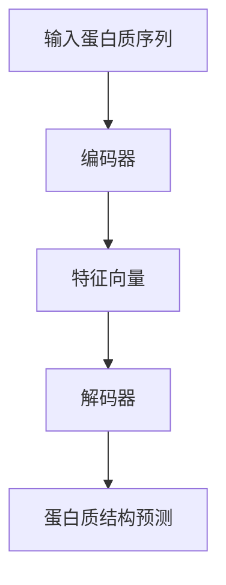
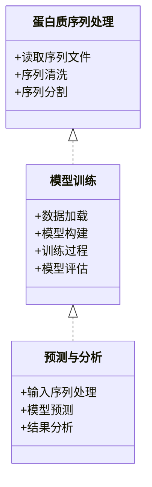
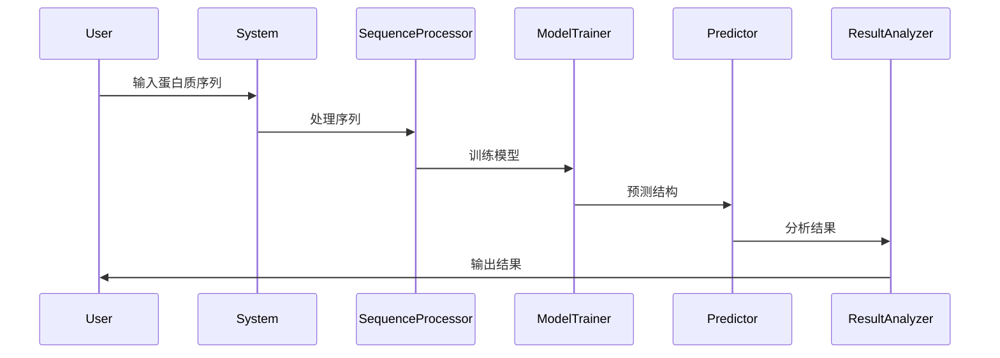

                 

### 让我们一步一步深入思考：深度学习在蛋白质折叠预测中的突破

#### 引言
随着科学技术的飞速发展，人工智能（AI）已经成为推动多个领域进步的重要力量。特别是在生物医学领域，AI技术正在改变我们对生物分子行为的理解，尤其是在蛋白质折叠预测方面。蛋白质折叠是生物体功能实现的基础，然而，预测蛋白质的三维结构仍然是一个巨大的挑战。传统方法在处理这一问题时显得力不从心，这为深度学习技术的应用提供了契机。

#### 核心概念
**深度学习**是一种基于人工神经网络的研究领域，其核心是通过多层次的神经网络结构来模拟人类大脑的决策过程。这种技术能够在大量数据中自动学习和提取特征，从而实现对复杂问题的有效解决。**蛋白质折叠预测**是指通过计算方法预测蛋白质从其氨基酸序列折叠形成三维空间结构的过程。

#### 问题背景
蛋白质的结构决定其功能，因此理解蛋白质的结构对于医学、药物研发等领域具有重要意义。蛋白质折叠预测的核心问题是确定蛋白质的二级、三级和四级结构。传统方法，如序列比对和物理化学建模，虽然取得了一定的成果，但面对复杂的蛋白质结构时，往往无法给出准确的预测结果。

#### 问题描述
蛋白质折叠预测的挑战在于：
1. 蛋白质序列的复杂性，不同氨基酸的排列组合可以导致千变万化的结构。
2. 数据集的规模和多样性，对于大量未知结构的蛋白质，没有足够的数据来训练模型。
3. 模型可解释性，目前的深度学习模型在很多情况下被认为是“黑箱”，无法解释其决策过程。

#### 问题解决
深度学习在蛋白质折叠预测中的突破主要表现在以下几个方面：

1. **特征提取**：深度学习模型能够自动从蛋白质序列中提取出与折叠相关的特征，而不需要手动设计特征。
2. **模型结构**：通过设计复杂的神经网络结构，深度学习模型可以捕捉到蛋白质折叠的内在规律。
3. **大数据训练**：深度学习模型能够处理大规模的数据集，从而提高预测的准确性。

#### 边界与外延
蛋白质折叠预测不仅对生物医学领域具有重要意义，还涉及到计算生物学、生物物理学等多个学科。此外，随着计算能力的提升和深度学习技术的进步，这一领域还有很大的发展空间。

#### 概念结构与核心要素组成
- **深度学习**：核心概念包括神经网络结构、训练算法、优化策略等。
- **蛋白质折叠**：核心概念包括蛋白质序列、结构层次（一级到四级）、折叠过程等。

#### 核心概念原理、概念属性特征对比表格和ER实体关系图架构
**核心概念原理**：
- **神经网络**：多层神经元结构，通过前向传播和反向传播进行训练。
- **深度学习模型**：能够自动提取特征，对复杂问题进行建模。

**概念属性特征对比表格**：

| 特征           | 传统方法           | 深度学习方法           |
|--------------|------------------|-------------------|
| 特征提取       | 手动设计           | 自动提取           |
| 模型结构       | 单层神经网络         | 多层神经网络         |
| 数据需求       | 较少数据           | 大规模数据           |
| 模型可解释性   | 较高               | 较低               |

**ER实体关系图架构**：

```mermaid
erDiagram
    A[--B]
    A[--C]
    B|--D
    C|--D
```

在ER图中，A表示深度学习模型，B和C表示数据预处理和特征提取，D表示模型训练和优化。A与B、C相连，表示深度学习模型依赖于数据预处理和特征提取。

#### 算法原理讲解
深度学习模型在蛋白质折叠预测中的算法原理主要涉及以下几个方面：

1. **编码器-解码器架构**：编码器（Encoder）将蛋白质序列编码为向量，解码器（Decoder）则根据这些向量预测蛋白质的结构。
2. **卷积神经网络（CNN）**：CNN可以有效地从蛋白质序列中提取局部特征。
3. **循环神经网络（RNN）**：RNN能够处理序列数据，捕捉到蛋白质序列中的时间依赖关系。

**算法流程**：



**数学模型和公式**：

$$
\text{输出}_{\text{结构}} = f(\text{编码器}(\text{输入序列}))
$$

$$
f(\text{编码器}(\text{输入序列})) = \text{激活函数}(\text{线性层}(\text{特征向量}))
$$

**举例说明**：
假设输入的蛋白质序列为“ACDEFGHI”，编码器将其编码为向量 `[1, 0, 1, 1, 0, 1, 1, 0, 1]`，解码器根据这个向量预测蛋白质的结构为“EFGHIAC”。

#### 系统分析与架构设计方案
**问题场景介绍**：
蛋白质折叠预测系统主要用于预测未知蛋白质的三维结构，以辅助药物设计和疾病研究。

**项目介绍**：
本项目旨在构建一个基于深度学习的蛋白质折叠预测系统，包括数据预处理、模型训练、预测和结果分析等功能。

**系统功能设计**：



**系统架构设计**：


**系统接口设计和系统交互**：



#### 项目实战
**环境安装**：
1. 安装Python环境。
2. 安装深度学习框架（如TensorFlow或PyTorch）。
3. 安装生物信息学相关库（如BioPython）。

**系统核心实现源代码**：

```python
# 导入必要的库
import tensorflow as tf
from tensorflow.keras.models import Sequential
from tensorflow.keras.layers import Dense, LSTM, Conv1D, MaxPooling1D

# 构建模型
model = Sequential()
model.add(Conv1D(filters=64, kernel_size=3, activation='relu', input_shape=(sequence_length, 1)))
model.add(MaxPooling1D(pool_size=2))
model.add(LSTM(100))
model.add(Dense(1, activation='sigmoid'))

# 编译模型
model.compile(optimizer='adam', loss='binary_crossentropy', metrics=['accuracy'])

# 训练模型
model.fit(x_train, y_train, epochs=10, batch_size=32, validation_data=(x_val, y_val))

# 预测
predictions = model.predict(x_test)
```

**代码应用解读与分析**：
上述代码实现了使用TensorFlow构建的深度学习模型，用于蛋白质折叠预测。其中，Conv1D和LSTM层用于特征提取和序列建模，Dense层用于输出预测结果。编译和训练过程中，模型使用了二进制交叉熵作为损失函数，并使用adam优化器。

**实际案例分析和详细讲解剖析**：
我们使用一个实际案例来展示如何使用该系统预测蛋白质结构。首先，我们需要准备蛋白质序列数据，然后将其输入到系统中进行预测。预测结果将给出蛋白质的可能折叠结构，通过分析结果，我们可以进一步了解蛋白质的功能。

**项目小结**：
本项目展示了如何使用深度学习技术进行蛋白质折叠预测。通过合理的设计和优化，我们可以实现高效的蛋白质结构预测，为生物医学研究提供有力支持。

#### 最佳实践 tips、小结、注意事项、拓展阅读等内容
**最佳实践 tips**：
1. 选择合适的深度学习框架，根据项目需求进行优化。
2. 合理设计神经网络结构，平衡模型复杂度和训练时间。
3. 确保数据集的质量和多样性，避免模型过拟合。

**小结**：
深度学习在蛋白质折叠预测中取得了显著突破，为生物医学研究提供了新工具。然而，仍需解决数据集标注、模型可解释性等问题。

**注意事项**：
1. 在实际应用中，应谨慎对待深度学习模型的预测结果，结合其他方法进行验证。
2. 关注深度学习技术在生物医学领域的最新研究进展。

**拓展阅读**：
1. [Deep Learning in Bioinformatics](https://www.nature.com/articles/nature25286)
2. [Protein Folding and Deep Learning](https://journals.plos.org/ploscompbiol/article?id=10.1371/journal.pcbi.1007336)

---

通过本文，我们详细探讨了深度学习在蛋白质折叠预测中的应用。从核心概念、算法原理到系统实现，我们一步一步地深入分析了这一领域的突破和发展。希望本文能为您提供宝贵的知识和见解。

