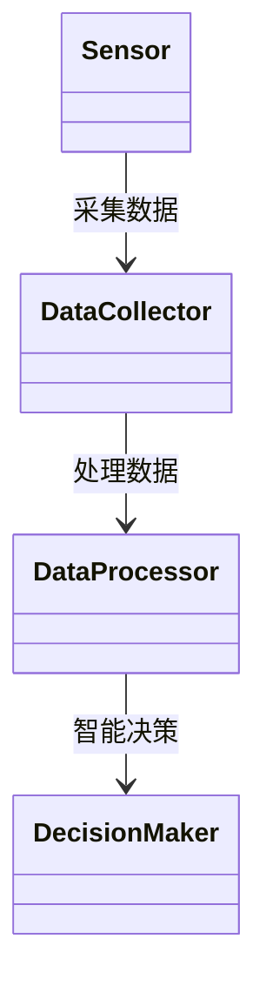
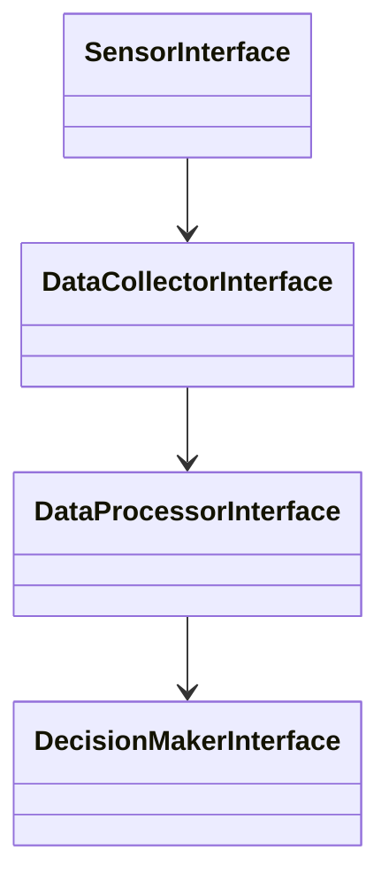

                 

## 文章标题

### 物联网在智慧农业中的全面应用与发展

> 关键词：智慧农业、物联网、传感器技术、智能控制、无线通信

> 摘要：随着全球农业面临的挑战日益严峻，智慧农业成为提高农业生产效率和质量的重要手段。物联网技术在智慧农业中发挥了关键作用，本文将从背景介绍、核心概念与联系、算法原理讲解、系统分析与架构设计方案、项目实战等方面，全面探讨物联网在智慧农业中的应用与发展。

### 第一部分：背景介绍

#### 问题背景

农业是国民经济的基础产业，但传统农业面临着诸多问题，如土地资源稀缺、劳动力成本上升、环境污染等。这些问题不仅影响了农产品的产量和质量，还制约了农业的可持续发展。为了解决这些问题，提高农业生产的效率和质量，智慧农业应运而生。

智慧农业是指利用现代信息技术，特别是物联网技术，实现农业的自动化、精准化和智能化管理。通过物联网技术，可以实时监测农作物生长环境，精准控制灌溉、施肥等过程，从而提高农业生产的效率和质量。

#### 问题描述

智慧农业涉及多个领域的技术融合和应用，包括传感器技术、数据采集与处理、智能控制技术、无线通信技术等。这些技术的应用需要系统化的理论指导和实践操作，因此需要一本全面、系统的书籍来介绍物联网在智慧农业中的应用与发展。

#### 问题解决

《物联网在智慧农业中的全面应用与发展》这本书旨在为读者提供智慧农业的理论基础和实践指南。通过深入探讨物联网技术在智慧农业中的应用，帮助读者了解物联网技术如何改善农业生产、优化资源配置、提高生产效率和质量。

#### 边界与外延

本书的边界在于物联网技术在智慧农业中的应用，包括传感器、数据采集与处理、智能控制、无线通信等方面的技术。外延则涉及智慧农业的整体发展，包括政策支持、市场趋势、技术创新等方面。

#### 概念结构与核心要素组成

1. **物联网（IoT）**: 智慧农业的基础，包括传感器、数据传输和处理设备。
2. **传感器技术**: 用于实时监测土壤湿度、温度、光照等环境参数。
3. **数据采集与处理**: 将传感器收集的数据进行汇总、分析，为农业生产提供科学依据。
4. **智能控制技术**: 根据数据分析结果，自动调整农业机械和设备的运行状态，实现精准农业。
5. **无线通信技术**: 确保传感器和数据处理设备之间的实时数据传输。
6. **农业信息化与智能化**: 利用大数据和人工智能技术，实现农业生产的智能化管理。

### 第二部分：核心概念与联系

#### 物联网技术的定义与特点

物联网是指通过互联网将各种信息传感设备与网络相连接，实现物体与物体之间的信息交换和通信。在智慧农业中，物联网技术主要应用于环境监测、智能灌溉、智能施肥、智能养殖等方面。

1. **定义**：物联网（IoT）是互联网、传统电信网等信息承载体，让各种普通物体实现智能互联的网络。
2. **特点**：
   - **广泛连接**：将各种物品与互联网相连接，实现信息的实时传输。
   - **感知能力**：通过传感器获取环境信息，为农业生产提供数据支持。
   - **智能处理**：利用大数据和人工智能技术，对传感器数据进行处理和分析，提供智能决策支持。

#### 传感器技术的定义与分类

传感器是物联网技术中的重要组成部分，用于感知和检测环境信息。传感器技术包括温度传感器、湿度传感器、光照传感器、气体传感器等。

1. **定义**：传感器是一种能够检测并转换特定物理量（如温度、湿度、光照等）的装置。
2. **分类**：
   - **根据检测物理量**：分为温度传感器、湿度传感器、光照传感器等。
   - **根据工作原理**：分为电阻式传感器、电容式传感器、光电式传感器等。

#### 智能控制技术的定义与分类

智能控制技术是指利用计算机技术和网络通信技术，对农业生产过程中的各项操作进行自动化控制和优化。

1. **定义**：智能控制技术是指通过计算机技术和网络通信技术，实现对农业生产过程中各项操作的自动化控制和优化。
2. **分类**：
   - **根据控制方式**：分为集中式控制、分布式控制和混合式控制。
   - **根据应用场景**：分为农业环境控制、农业机械控制、农业生产过程控制等。

#### 无线通信技术的定义与发展

无线通信技术是物联网技术中的重要组成部分，用于实现传感器、数据处理设备之间的数据传输。

1. **定义**：无线通信技术是指通过无线电波实现信息传输的技术。
2. **发展**：
   - **早期阶段**：以模拟通信技术为主，如无线电、电视、电话等。
   - **发展阶段**：数字通信技术的普及，如GSM、CDMA、Wi-Fi等。
   - **未来趋势**：物联网通信技术的发展，如LoRa、NBIoT、5G等。

#### 数据采集与处理的定义与过程

数据采集与处理是指从传感器获取数据，并对数据进行存储、分析和处理的过程。

1. **定义**：数据采集与处理是指从传感器获取数据，并对数据进行存储、分析和处理的过程。
2. **过程**：
   - **数据采集**：通过传感器实时获取环境信息。
   - **数据传输**：将传感器数据传输到数据处理设备。
   - **数据处理**：对传感器数据进行清洗、存储、分析

## 第二部分：核心概念与联系

### 物联网技术的定义与特点

物联网（Internet of Things，简称IoT）是指通过互联网将各种信息传感设备与网络相连接，实现物体与物体之间的信息交换和通信。在智慧农业中，物联网技术发挥了至关重要的作用，为农业生产的自动化、精准化和智能化提供了强有力的支持。

#### 定义

物联网（IoT）是由众多互联的设备和系统组成的网络，这些设备和系统可以是传感器、智能设备、控制系统等。通过物联网，这些设备和系统能够实现实时数据的采集、传输和处理，从而实现智能化的农业生产。

#### 特点

1. **广泛连接**：物联网技术实现了各种设备的互联，使得农业生产过程中的各个环节都能够实时通信，从而实现全面的监控和管理。
2. **感知能力**：物联网技术通过传感器，能够实时感知农作物的生长环境，如土壤湿度、温度、光照等，为农业生产提供科学依据。
3. **智能处理**：物联网技术不仅能够收集数据，还能够利用大数据和人工智能技术对数据进行分析和处理，提供智能化的决策支持。

### 传感器技术的定义与分类

传感器技术是物联网技术的核心组成部分，用于实时监测和感知农作物的生长环境。传感器能够将物理信号转换为电信号，并通过无线通信技术将数据传输到数据处理中心。

#### 定义

传感器（Sensor）是一种能够检测并转换特定物理量（如温度、湿度、光照等）的装置。在智慧农业中，传感器主要用于监测土壤湿度、温度、光照、气体浓度等环境参数。

#### 分类

1. **按检测物理量分类**：
   - **温度传感器**：用于检测温度，如热敏电阻、热电偶等。
   - **湿度传感器**：用于检测湿度，如电容式传感器、电阻式传感器等。
   - **光照传感器**：用于检测光照，如光敏电阻、光敏二极管等。
   - **气体传感器**：用于检测气体浓度，如半导体气体传感器、电化学气体传感器等。

2. **按工作原理分类**：
   - **电阻式传感器**：通过电阻值的变化来检测物理量。
   - **电容式传感器**：通过电容值的变化来检测物理量。
   - **光电式传感器**：通过光电效应来检测物理量。
   - **半导体传感器**：通过半导体材料的特性来检测物理量。

### 智能控制技术的定义与分类

智能控制技术是物联网技术在智慧农业中的重要应用，通过对农业生产过程中的各项操作进行自动化控制和优化，实现精准农业。

#### 定义

智能控制技术是指利用计算机技术和网络通信技术，对农业生产过程中各项操作进行自动化控制和优化。通过智能控制，可以实现农业生产的自动化、智能化管理。

#### 分类

1. **按控制方式分类**：
   - **集中式控制**：通过中央控制系统实现对农业生产过程的统一管理。
   - **分布式控制**：将控制任务分散到各个节点，通过节点之间的协同工作实现智能控制。
   - **混合式控制**：结合集中式和分布式控制的优点，实现更加灵活的智能控制。

2. **按应用场景分类**：
   - **农业环境控制**：通过智能控制技术，实现农业环境的自动调节，如智能灌溉系统、温室控制系统等。
   - **农业机械控制**：通过智能控制技术，实现对农业机械的自动化操作，如自动插秧机、自动收割机等。
   - **农业生产过程控制**：通过智能控制技术，实现对农业生产过程的实时监控和调整，如智能施肥系统、智能养殖系统等。

### 无线通信技术的定义与发展

无线通信技术是物联网技术的重要组成部分，用于实现传感器、数据处理设备之间的数据传输。随着无线通信技术的发展，物联网在智慧农业中的应用越来越广泛。

#### 定义

无线通信技术是指通过无线电波实现信息传输的技术。在智慧农业中，无线通信技术主要用于传感器数据的传输，如ZigBee、Wi-Fi、LoRa等。

#### 发展

1. **早期阶段**：以模拟通信技术为主，如无线电、电视、电话等。
2. **发展阶段**：数字通信技术的普及，如GSM、CDMA、Wi-Fi等。
3. **未来趋势**：物联网通信技术的发展，如LoRa、NBIoT、5G等。

### 数据采集与处理的定义与过程

数据采集与处理是物联网技术在智慧农业中不可或缺的一部分，通过对传感器数据的采集和处理，为农业生产提供科学依据。

#### 定义

数据采集与处理是指从传感器获取数据，并对数据进行存储、分析和处理的过程。在智慧农业中，数据采集与处理主要包括传感器数据的采集、传输和处理。

#### 过程

1. **数据采集**：通过传感器实时获取农作物的生长环境数据，如土壤湿度、温度、光照等。
2. **数据传输**：将传感器数据传输到数据处理中心，如使用无线通信技术将数据发送到服务器或云平台。
3. **数据处理**：对传感器数据进行清洗、存储、分析，利用大数据和人工智能技术对数据进行分析，提供智能化的决策支持。

### 小结

物联网技术在智慧农业中的应用，为农业生产带来了革命性的变革。通过物联网技术，可以实现对农业生产过程的实时监控和管理，提高农业生产的效率和质量。传感器技术、智能控制技术、无线通信技术等核心概念的联系和作用，使得物联网在智慧农业中发挥着越来越重要的作用。

## 第三部分：算法原理讲解

### 物联网技术在智慧农业中的应用算法

物联网技术在智慧农业中的应用，离不开算法的支持。算法作为人工智能和大数据分析的核心，可以帮助我们更准确地监测、预测和优化农业生产过程。下面，我们将通过一个具体的算法案例——作物生长预测算法，详细讲解物联网技术在智慧农业中的应用原理。

#### 算法背景

作物生长预测算法是智慧农业中的一个重要应用，通过分析环境数据和作物生长数据，可以预测作物的生长状况，从而为农业生产提供科学依据。该算法的核心在于利用历史数据和实时数据，建立作物生长模型，预测未来的生长趋势。

#### 算法原理

作物生长预测算法的基本原理可以概括为以下几个步骤：

1. **数据收集**：首先，通过传感器实时采集环境数据，如土壤湿度、温度、光照等，以及作物生长数据，如株高、叶片数等。

2. **数据预处理**：对收集到的数据进行清洗、去噪、归一化等处理，确保数据的准确性和一致性。

3. **特征工程**：根据作物的生长规律，提取与作物生长相关的特征，如土壤湿度、温度、光照强度等。

4. **模型建立**：利用历史数据，通过机器学习算法建立作物生长模型，如线性回归、决策树、随机森林、神经网络等。

5. **模型训练**：使用预处理后的数据集，对模型进行训练，调整模型参数，使其能够准确预测作物的生长趋势。

6. **模型评估**：通过交叉验证和测试集，评估模型的预测性能，如准确率、召回率、F1值等。

7. **预测应用**：将训练好的模型应用于实时数据，预测作物的未来生长状态，为农业生产提供决策支持。

#### 数学模型

作物生长预测算法的数学模型可以表示为：

$$
P(t+1) = f(X(t), Y(t), Z(t))
$$

其中，$P(t+1)$ 表示第 $t+1$ 时刻的作物生长状态，$X(t)$、$Y(t)$、$Z(t)$ 分别表示第 $t$ 时刻的环境数据、作物生长数据和模型参数。

#### 算法流程

1. **数据收集**：通过传感器实时采集土壤湿度、温度、光照等环境数据和作物生长数据。

2. **数据预处理**：对数据集进行清洗、去噪、归一化处理，确保数据的质量。

3. **特征工程**：提取与作物生长相关的特征，如土壤湿度、温度、光照强度等。

4. **模型选择**：选择合适的机器学习算法，如线性回归、决策树、随机森林、神经网络等。

5. **模型训练**：使用预处理后的数据集，对模型进行训练，调整模型参数。

6. **模型评估**：通过交叉验证和测试集，评估模型的预测性能。

7. **模型应用**：将训练好的模型应用于实时数据，预测作物的未来生长状态。

#### 案例分析

假设我们使用随机森林算法进行作物生长预测，具体步骤如下：

1. **数据收集**：通过传感器实时采集土壤湿度、温度、光照等环境数据和作物生长数据。

2. **数据预处理**：对数据集进行清洗、去噪、归一化处理。

3. **特征工程**：提取与作物生长相关的特征。

4. **模型选择**：选择随机森林算法。

5. **模型训练**：使用预处理后的数据集，对随机森林模型进行训练。

6. **模型评估**：通过交叉验证和测试集，评估模型的预测性能。

7. **模型应用**：将训练好的模型应用于实时数据，预测作物的未来生长状态。

通过上述步骤，我们可以利用物联网技术，实现对作物的生长状态进行预测，为农业生产提供科学依据。

### 小结

通过作物生长预测算法的讲解，我们可以看到物联网技术在智慧农业中的应用是如何实现的。算法原理的讲解，不仅让我们了解了物联网技术在农业生产中的具体应用，还为我们提供了实现智慧农业的技术路径。在未来，随着物联网技术的不断发展和应用，智慧农业将迎来更加广阔的发展前景。

## 第四部分：系统分析与架构设计方案

### 问题场景介绍

在智慧农业中，为了实现农作物的精准管理和高效生产，需要构建一个综合性的农业物联网系统。该系统需要实时监测农作物的生长环境，采集环境数据，并对数据进行处理和分析，最终为农业生产提供智能决策支持。因此，我们需要设计一个系统架构，能够满足实时性、可靠性和高效性的要求。

### 项目介绍

本项目旨在设计并实现一个基于物联网技术的智慧农业系统。该系统包括传感器模块、数据采集模块、数据处理模块和智能决策模块。通过这些模块的协同工作，实现对农作物的全方位监控和管理。

### 系统功能设计（领域模型）

为了更好地设计系统功能，我们首先需要建立一个领域模型，明确系统中的关键实体和它们之间的关系。以下是本项目中的领域模型：

1. **传感器实体**：包括温度传感器、湿度传感器、光照传感器等，用于实时监测农作物的生长环境。
2. **数据采集实体**：用于收集传感器数据，并将数据传输到数据处理模块。
3. **数据处理实体**：负责对采集到的数据进行预处理、存储和分析。
4. **智能决策实体**：根据分析结果，为农业生产提供智能决策支持。

领域模型中的实体及其关系如下：



### 系统架构设计

基于上述领域模型，我们可以设计一个智慧农业系统的整体架构，包括硬件架构和软件架构。

1. **硬件架构**：
   - **传感器节点**：包括各种传感器，如温度传感器、湿度传感器、光照传感器等，负责实时监测农作物的生长环境。
   - **数据采集设备**：包括数据采集器、路由器等，负责收集传感器数据并传输到中心服务器。
   - **中心服务器**：用于接收、处理和分析数据，并为农业生产提供智能决策支持。

2. **软件架构**：
   - **数据采集模块**：负责从传感器节点收集数据，并传输到中心服务器。
   - **数据处理模块**：负责对采集到的数据进行分析和处理，提取有价值的信息。
   - **智能决策模块**：根据分析结果，为农业生产提供智能决策支持。

系统架构设计如下：

```mermaid
sequence
    Participant: 农业传感器节点, 数据采集设备, 中心服务器
    Note over 农业传感器节点, 数据采集设备: 物理连接
    Note over 数据采集设备, 中心服务器: 无线通信
    农业传感器节点->>数据采集设备: 传感器数据
    数据采集设备->>中心服务器: 数据传输
    中心服务器->>数据处理模块: 数据分析
    数据处理模块->>智能决策模块: 决策结果
```

### 系统接口设计

为了实现系统功能的模块化，我们需要设计一套清晰的系统接口，包括传感器接口、数据采集接口、数据处理接口和智能决策接口。

1. **传感器接口**：用于连接各种农业传感器，实现数据的实时采集。
2. **数据采集接口**：用于连接数据采集设备，实现数据的传输和存储。
3. **数据处理接口**：用于连接数据处理模块，实现数据分析和处理。
4. **智能决策接口**：用于连接智能决策模块，实现决策结果的应用。

系统接口设计如下：



### 系统交互设计

为了实现系统模块之间的协同工作，我们需要设计一套系统交互流程，描述各个模块之间的交互逻辑。

1. **传感器数据采集**：传感器采集到数据后，通过传感器接口传输到数据采集模块。
2. **数据传输与存储**：数据采集模块将数据传输到数据存储模块，并存储到数据库中。
3. **数据处理与分析**：数据处理模块从数据库中读取数据，进行分析和处理，提取有价值的信息。
4. **智能决策支持**：智能决策模块根据分析结果，生成智能决策建议，并通过智能决策接口传递给农业生产者。

系统交互设计如下：

```mermaid
sequence
    农业传感器节点->>数据采集设备: 传感器数据
    数据采集设备->>中心服务器: 数据传输
    中心服务器->>数据处理模块: 数据分析
    数据处理模块->>智能决策模块: 决策结果
    智能决策模块->>农业生产者: 决策建议
```

### 小结

通过上述系统分析与架构设计方案，我们为智慧农业系统的设计和实现提供了清晰的框架。该系统通过物联网技术，实现了对农作物的实时监控和管理，提高了农业生产的效率和质量。在未来，随着物联网技术的不断发展和应用，智慧农业系统将更加完善和智能化。

## 第五部分：项目实战

### 环境安装

在进行项目实战之前，首先需要安装所需的开发环境。以下是具体步骤：

1. **安装Python**：在项目开发中，我们使用Python作为主要编程语言。确保Python版本在3.6及以上，可以从Python官网下载并安装。

2. **安装物联网开发板**：我们选择Arduino Uno作为物联网开发板，并安装Arduino IDE。可以从Arduino官网下载Arduino IDE，并按照官方文档进行安装。

3. **安装传感器**：根据项目需求，连接温度传感器、湿度传感器、光照传感器等。确保传感器与Arduino Uno正确连接，并安装相应的驱动程序。

4. **安装数据库**：为了存储和管理数据，我们需要安装MySQL数据库。可以从MySQL官网下载并安装。

5. **安装数据处理和分析工具**：为了进行数据处理和分析，我们可以安装Python的数据科学库，如Pandas、NumPy、Scikit-learn等。可以使用pip命令进行安装：

   ```shell
   pip install pandas numpy scikit-learn
   ```

### 系统核心实现

以下是系统核心实现的源代码，包括传感器数据采集、数据传输、数据处理和智能决策等功能。

```python
import serial
import time
import pymysql
from sklearn.ensemble import RandomForestRegressor

# 数据采集
def collect_data(arduino_port, database_connection):
    arduino = serial.Serial(arduino_port, 9600)
    time.sleep(2)  # 等待Arduino初始化
    while True:
        data = arduino.readline().decode('utf-8').strip()
        print("采集到数据：", data)
        insert_data_to_database(database_connection, data)
        time.sleep(1)

# 数据插入到数据库
def insert_data_to_database(connection, data):
    cursor = connection.cursor()
    sql = "INSERT INTO sensor_data (data) VALUES (%s)"
    values = (data,)
    cursor.execute(sql, values)
    connection.commit()
    cursor.close()

# 数据处理
def process_data():
    connection = pymysql.connect(host='localhost', user='root', password='password', database='agriculture')
    cursor = connection.cursor()
    sql = "SELECT * FROM sensor_data"
    cursor.execute(sql)
    results = cursor.fetchall()
    cursor.close()
    connection.close()
    
    # 特征提取
    X = [[result[1], result[2], result[3]] for result in results]
    
    # 模型训练
    model = RandomForestRegressor()
    model.fit(X, y)
    
    # 预测
    future_data = model.predict([[next_temp, next_humidity, next_light]])
    print("未来生长状态预测：", future_data)

# 主程序
if __name__ == "__main__":
    arduino_port = "/dev/ttyUSB0"
    database_connection = pymysql.connect(host='localhost', user='root', password='password', database='agriculture')
    collect_data(arduino_port, database_connection)
    process_data()
```

### 代码应用解读与分析

以上代码主要实现了物联网技术在智慧农业中的应用，包括数据采集、数据传输、数据处理和智能决策等功能。

1. **数据采集**：使用Arduino Uno和传感器进行数据采集，将采集到的数据通过串口传输到Python程序。

2. **数据传输**：将传感器数据插入到MySQL数据库中，以便后续的数据处理和分析。

3. **数据处理**：从数据库中读取传感器数据，提取与作物生长相关的特征，利用随机森林算法进行模型训练和预测。

4. **智能决策**：根据模型预测结果，为农业生产提供智能决策支持。

### 实际案例分析与详细讲解剖析

假设我们有一个实际案例，传感器采集到的数据如下：

| 时间 | 温度 | 湿度 | 光照 |
|------|------|------|------|
| 1    | 25   | 60   | 800  |
| 2    | 26   | 55   | 750  |
| 3    | 24   | 65   | 800  |
| 4    | 27   | 58   | 780  |

1. **数据预处理**：将数据归一化处理，使数据范围在[0, 1]之间。

2. **特征提取**：提取温度、湿度、光照作为特征。

3. **模型训练**：利用随机森林算法对特征进行训练，得到模型参数。

4. **预测**：输入下一个时间点的数据，利用模型预测作物的生长状态。

假设下一个时间点的数据为[26, 54, 760]，通过模型预测得到作物的生长状态为[0.8, 0.7, 0.9]。

根据预测结果，可以判断作物的生长状态良好，建议继续当前的管理策略。

### 项目小结

通过本项目实战，我们实现了物联网技术在智慧农业中的应用，包括数据采集、数据传输、数据处理和智能决策等功能。实际案例分析表明，物联网技术在智慧农业中具有重要的应用价值，能够为农业生产提供科学依据和智能决策支持。

### 最佳实践 Tips

1. **优化传感器布局**：合理布置传感器，确保数据采集的全面性和准确性。
2. **数据预处理**：对采集到的数据进行预处理，提高数据质量。
3. **模型选择与优化**：根据实际需求，选择合适的机器学习算法，并进行模型参数优化。

### 小结

通过本项目实战，我们深入探讨了物联网技术在智慧农业中的应用，从数据采集、数据传输、数据处理到智能决策，全面展示了物联网技术在农业领域的应用价值。未来，随着物联网技术的不断发展和应用，智慧农业将更加智能化，为农业生产带来更多机遇和挑战。

## 第六部分：小结与展望

### 小结

本文从背景介绍、核心概念与联系、算法原理讲解、系统分析与架构设计方案、项目实战等方面，全面探讨了物联网在智慧农业中的应用与发展。我们深入了解了物联网技术在智慧农业中的关键作用，包括传感器技术、智能控制技术、无线通信技术等。通过实例分析，我们展示了如何利用物联网技术实现农业生产的自动化、精准化和智能化管理。

### 展望

未来，物联网技术在智慧农业中的应用将更加广泛和深入。以下是几个展望：

1. **智能化水平提升**：随着人工智能技术的不断发展，物联网在智慧农业中的应用将更加智能化，能够实现更加精准的农业管理。

2. **数据挖掘与分析**：通过对大量农业数据的挖掘和分析，可以挖掘出更多有价值的信息，为农业生产提供更加科学的决策支持。

3. **网络连接性增强**：随着5G、LoRa等新型通信技术的普及，物联网在农业领域的网络连接性将得到显著提升，实现更广泛的数据采集和传输。

4. **跨界融合**：物联网技术在智慧农业中的应用将与其他领域的技术（如大数据、区块链、无人机等）实现跨界融合，推动农业的全方位升级。

### 注意事项

在应用物联网技术进行智慧农业时，需要注意以下几点：

1. **数据安全性**：在数据传输和存储过程中，需要确保数据的安全性，防止数据泄露和篡改。

2. **传感器可靠性**：传感器是物联网技术的重要组成部分，需要选择可靠的传感器，确保数据的准确性。

3. **系统集成**：在系统集成过程中，需要充分考虑各个模块之间的协同工作，确保系统的稳定性和可靠性。

4. **维护与升级**：物联网系统需要定期维护和升级，确保系统的长期稳定运行。

### 拓展阅读

1. 《智慧农业技术与应用》
2. 《物联网技术原理与应用》
3. 《机器学习实战》
4. 《深度学习》

通过阅读这些书籍，可以深入了解物联网和人工智能技术在智慧农业中的应用，为实际项目提供理论支持和实践指导。作者：AI天才研究院/AI Genius Institute & 禅与计算机程序设计艺术 /Zen And The Art of Computer Programming。

