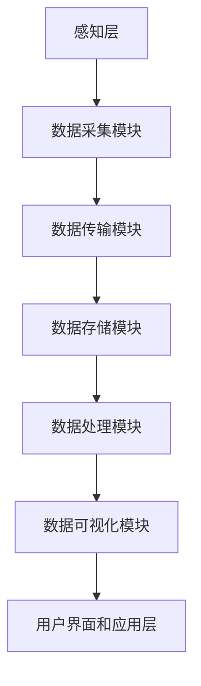
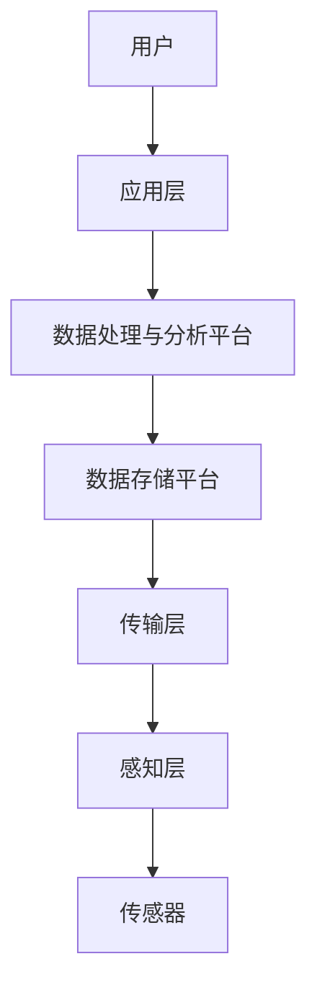
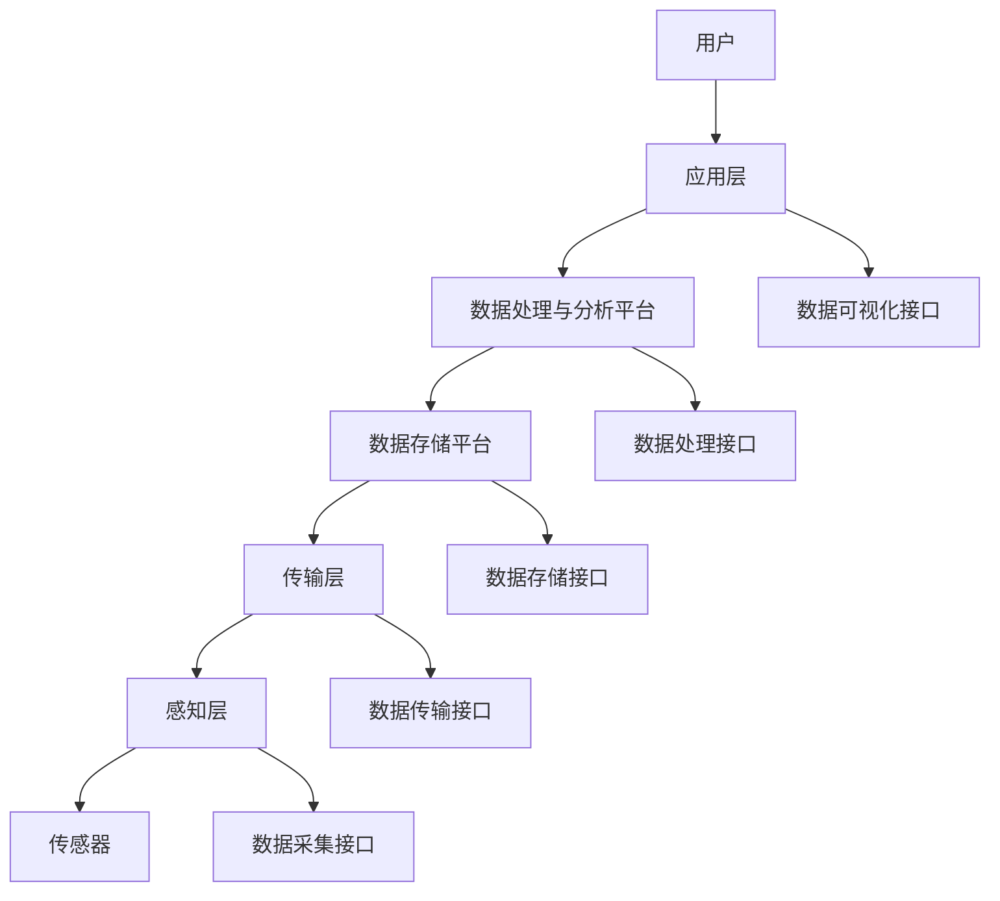
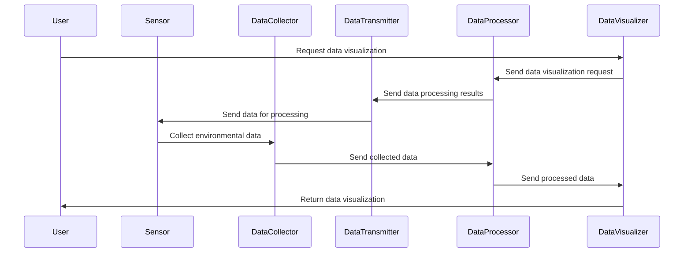

                 

### 第一部分：背景介绍

#### 1.1 问题背景

**环境监测的重要性**

环境监测是现代社会可持续发展的重要组成部分。它通过实时、连续、准确地获取环境中的各种参数数据，如空气污染、水质、土壤污染、噪音等，从而评估环境质量，预警潜在的环境风险，并为环境保护和治理提供科学依据。环境监测不仅关系到人类健康和生态系统的平衡，也对经济发展和社会稳定具有深远影响。

**环境污染现状**

全球环境污染问题日益严重，主要表现在空气污染、水污染和土壤污染等方面。空气污染导致的雾霾、酸雨等已经成为全球性的公共健康问题；水污染使得许多水体无法达到饮用水标准，影响了农业生产和居民生活；土壤污染则对生态系统和食品安全构成威胁。此外，气候变化、资源枯竭等环境问题也日益突出。

**物联网在环境监测中的应用潜力**

物联网（Internet of Things，IoT）技术通过将各种传感器、设备、系统连接到互联网上，实现信息的自动采集、传输、处理和分析，从而在环境监测中展现出巨大的应用潜力。物联网技术可以极大地提升环境监测的实时性、准确性和覆盖范围，为解决环境污染问题提供新的技术手段。

#### 1.2 问题描述

**环境监测的需求**

环境监测需要解决以下几个主要问题：
- **实时性**：需要及时获取环境参数，以便快速响应环境变化。
- **准确性**：需要确保数据的精确性和可靠性，以便科学评估环境质量。
- **覆盖范围**：需要覆盖广泛的区域，以便全面监测环境状况。
- **数据处理**：需要对收集的大量数据进行有效的处理和分析，以便得出有用的结论。

**环境监测的挑战**

环境监测面临的主要挑战包括：
- **数据采集难度**：环境中的参数多样且变化快，传感器种类繁多，数据采集过程复杂。
- **数据传输瓶颈**：环境监测需要将大量数据实时传输到数据中心，但通信网络的带宽和稳定性可能不足。
- **数据分析复杂**：环境数据复杂且具有噪声，需要有效的算法进行预处理、特征提取和模式识别。

**物联网技术对环境监测的改进**

物联网技术通过以下方式改进环境监测：
- **自动化数据采集**：物联网传感器可以自动采集环境数据，提高监测的实时性和准确性。
- **高效数据传输**：物联网通信技术如无线传感器网络、低功耗广域网等，可以解决数据传输瓶颈问题。
- **智能数据处理**：物联网平台可以通过大数据分析和机器学习算法，对环境数据进行高效处理和分析。

#### 1.3 问题解决

**物联网技术的核心原理**

物联网技术主要包括以下几个核心原理：
- **感知层**：通过传感器获取环境数据。
- **网络层**：通过各种通信协议将数据传输到云端或数据中心。
- **平台层**：通过物联网平台进行数据处理、存储和分析。
- **应用层**：将分析结果应用于环境监测、预测和决策。

**物联网技术在环境监测中的应用场景**

物联网技术在环境监测中主要有以下应用场景：
- **空气污染监测**：通过部署在各地的空气质量监测站，实时监测PM2.5、PM10、SO2、NO2等污染物浓度。
- **水质监测**：在水体中部署水质监测传感器，监测溶解氧、酸碱度、重金属等指标。
- **土壤监测**：在农田和矿区等地部署土壤传感器，监测土壤水分、温度、pH值等参数。
- **噪声监测**：在市区和交通干线等地区部署噪声传感器，监测噪音水平。

**物联网技术在环境监测中的优势**

物联网技术在环境监测中的优势包括：
- **高实时性**：可以实时获取环境数据，快速响应环境变化。
- **高准确性**：通过多种传感器和先进的算法，提高数据采集和分析的准确性。
- **广覆盖范围**：可以覆盖广泛的地区，实现全方位的环境监测。
- **智能化处理**：通过大数据分析和机器学习，实现对环境数据的深度挖掘和分析。

#### 1.4 边界与外延

**物联网技术的分类**

物联网技术可以分为以下几类：
- **感知层**：包括各种传感器，如温度传感器、湿度传感器、气体传感器等。
- **网络层**：包括各种通信协议和通信技术，如Wi-Fi、蓝牙、ZigBee、LoRa等。
- **平台层**：包括物联网平台和中间件，如AWS IoT、Azure IoT等。
- **应用层**：包括各种物联网应用，如智能家居、智能交通、智能医疗等。

**环境监测领域的范围**

环境监测领域包括以下几个主要方面：
- **空气质量监测**：监测PM2.5、PM10、SO2、NO2等污染物浓度。
- **水质监测**：监测溶解氧、酸碱度、重金属等指标。
- **土壤监测**：监测土壤水分、温度、pH值等参数。
- **噪声监测**：监测噪音水平。

**物联网在环境监测中的发展前景**

随着物联网技术的不断发展和成熟，物联网在环境监测中的应用前景十分广阔。未来，物联网与环境监测将更加紧密地结合，实现更加高效、准确、全面的环境监测，为可持续发展提供有力支持。

#### 1.5 概念结构与核心要素组成

**物联网的核心概念**

物联网的核心概念包括：
- **物联网**：通过互联网将各种设备和传感器连接起来，实现信息共享和智能化的网络。
- **传感器**：用于感知环境参数的设备，如温度传感器、湿度传感器等。
- **通信协议**：用于数据传输的协议，如Wi-Fi、蓝牙等。
- **物联网平台**：用于数据处理、存储和分析的平台，如AWS IoT、Azure IoT等。

**环境监测的关键要素**

环境监测的关键要素包括：
- **环境数据**：包括空气质量、水质、土壤质量、噪声水平等。
- **传感器**：用于实时采集环境数据的设备。
- **数据分析**：对采集到的环境数据进行处理、分析和解读。
- **监测平台**：用于展示监测数据和提供决策支持的系统。

**物联网与环境监测的结合点**

物联网与环境监测的结合点主要包括：
- **数据采集**：物联网传感器可以实时采集环境数据。
- **数据传输**：物联网通信技术可以高效传输环境数据。
- **数据处理**：物联网平台可以对环境数据进行处理和分析。
- **决策支持**：物联网平台可以为环境监测和管理提供决策支持。

### 总结

通过上述分析，我们可以看到物联网在环境监测中具有广泛的应用前景。物联网技术通过提高监测的实时性、准确性和覆盖范围，为解决环境污染问题提供了有力支持。在未来的发展中，物联网与环境监测将进一步深度融合，为可持续发展做出更大贡献。

----------------------------------------------------------------

### 第一部分：背景介绍

#### 1.1 问题背景

**环境监测的重要性**

环境监测是现代社会可持续发展的重要组成部分，其核心目标是通过实时、连续、准确地获取环境中的各种参数数据，如空气质量、水质、土壤质量、噪音水平等，来评估环境质量，预警潜在的环境风险，并为环境保护和治理提供科学依据。环境监测不仅对公共健康和生态系统的平衡具有重要意义，也对经济发展和社会稳定具有深远影响。

在当今世界，环境污染问题日益严重。空气污染导致的雾霾、酸雨等已经成为全球性的公共健康问题，水污染使得许多水体无法达到饮用水标准，影响了农业生产和居民生活，而土壤污染则对生态系统和食品安全构成威胁。气候变化、资源枯竭等环境问题也日益突出，这些问题的解决迫切需要先进的监测技术和手段。

**物联网在环境监测中的应用潜力**

物联网（Internet of Things，IoT）技术通过将各种传感器、设备、系统连接到互联网上，实现信息的自动采集、传输、处理和分析，从而在环境监测中展现出巨大的应用潜力。物联网技术可以极大地提升环境监测的实时性、准确性和覆盖范围，为解决环境污染问题提供新的技术手段。

具体来说，物联网技术在环境监测中的应用主要体现在以下几个方面：
- **自动化数据采集**：通过部署在各地的物联网传感器，可以实时、自动地采集环境数据，提高监测的实时性和准确性。
- **高效数据传输**：物联网通信技术如无线传感器网络、低功耗广域网等，可以高效传输环境数据，解决数据传输瓶颈问题。
- **智能数据处理**：物联网平台可以通过大数据分析和机器学习算法，对环境数据进行高效处理和分析，提供更加精准的环境监测和管理。
- **协同工作**：物联网技术可以实现多个传感器和监测设备的协同工作，提高监测的覆盖范围和整体效率。

#### 1.2 问题描述

**环境监测的需求**

环境监测的需求主要表现在以下几个方面：

1. **实时性**：环境监测需要及时获取环境数据，以便快速响应环境变化。例如，在雾霾天气下，需要实时监测PM2.5等污染物的浓度，以便采取有效的应对措施。

2. **准确性**：环境监测需要确保数据的精确性和可靠性，以便科学评估环境质量。例如，水质监测需要准确检测溶解氧、重金属等参数，土壤监测需要准确测量土壤的pH值、水分等。

3. **覆盖范围**：环境监测需要覆盖广泛的区域，以便全面监测环境状况。例如，空气质量监测需要在城市各个区域部署监测站，水质监测需要覆盖河流、湖泊、海洋等不同水体。

4. **数据处理**：环境监测需要处理大量的数据，包括数据采集、传输、存储、分析等。环境数据通常具有噪声、缺失值等问题，需要有效的算法进行预处理、特征提取和模式识别。

**环境监测的挑战**

环境监测面临的主要挑战包括：

1. **数据采集难度**：环境中的参数多样且变化快，传感器种类繁多，数据采集过程复杂。例如，空气质量监测需要同时监测PM2.5、PM10、SO2、NO2等多种污染物，水质监测需要监测溶解氧、酸碱度、重金属等多种参数。

2. **数据传输瓶颈**：环境监测需要将大量数据实时传输到数据中心，但通信网络的带宽和稳定性可能不足。例如，在偏远地区，通信信号可能较弱，影响数据传输的实时性和可靠性。

3. **数据分析复杂**：环境数据复杂且具有噪声，需要有效的算法进行预处理、特征提取和模式识别。例如，水质监测中的溶解氧数据可能受到温度、压力等因素的影响，需要进行噪声过滤和特征提取，才能得到准确的分析结果。

**物联网技术对环境监测的改进**

物联网技术通过以下方式改进环境监测：

1. **自动化数据采集**：物联网传感器可以自动采集环境数据，提高监测的实时性和准确性。例如，物联网空气质量监测传感器可以自动监测PM2.5、PM10等污染物的浓度。

2. **高效数据传输**：物联网通信技术如无线传感器网络、低功耗广域网等，可以高效传输环境数据，解决数据传输瓶颈问题。例如，LoRa技术可以在长距离、低功耗的情况下传输环境数据。

3. **智能数据处理**：物联网平台可以通过大数据分析和机器学习算法，对环境数据进行高效处理和分析，提供更加精准的环境监测和管理。例如，通过机器学习算法，可以预测未来的环境变化趋势，为决策提供依据。

#### 1.3 问题解决

**物联网技术的核心原理**

物联网技术主要包括以下几个核心原理：

1. **感知层**：感知层由各种传感器组成，用于感知环境参数，如温度、湿度、污染物浓度等。传感器是物联网系统的信息来源，它们将环境参数转化为数字信号，供后续处理。

2. **网络层**：网络层负责将感知层采集到的数据传输到平台层。网络层可以采用有线和无线通信技术，如Wi-Fi、蓝牙、ZigBee、LoRa等。这些通信技术可以实现传感器之间的数据交换，以及传感器与物联网平台之间的数据传输。

3. **平台层**：平台层是物联网系统的核心，负责数据存储、处理和分析。平台层通常包括云计算平台、物联网平台和中间件等。通过平台层，可以实现对环境数据的实时监控、历史数据分析、预测预警等功能。

4. **应用层**：应用层是物联网系统的最终用户界面，用于展示环境监测数据、提供监测分析和决策支持。应用层包括各种环境监测应用，如空气质量监测、水质监测、噪声监测等。

**物联网技术在环境监测中的应用场景**

物联网技术在环境监测中主要有以下应用场景：

1. **空气质量监测**：在城市的各个区域部署物联网空气质量监测站，实时监测PM2.5、PM10、SO2、NO2等污染物的浓度。通过物联网技术，可以实现数据的自动采集、传输和处理，提高监测的实时性和准确性。

2. **水质监测**：在水体中部署物联网水质监测传感器，实时监测溶解氧、酸碱度、重金属等指标。物联网技术可以实现水质数据的远程传输和实时分析，及时发现水质异常，保障饮用水安全。

3. **土壤监测**：在农田和矿区等地部署物联网土壤传感器，监测土壤水分、温度、pH值等参数。通过物联网技术，可以实现对土壤环境的实时监测，为农业生产和矿区环境治理提供科学依据。

4. **噪声监测**：在市区和交通干线等地区部署物联网噪声监测传感器，实时监测噪音水平。物联网技术可以帮助城市管理者及时了解噪音污染情况，制定有效的降噪措施。

**物联网技术在环境监测中的优势**

物联网技术在环境监测中的优势包括：

1. **高实时性**：通过物联网传感器，可以实现环境数据的实时采集和传输，快速响应环境变化。

2. **高准确性**：物联网传感器具有高精度，可以提供准确的环境数据。

3. **广覆盖范围**：物联网技术可以实现大规模、广覆盖的环境监测，覆盖城市、乡村、矿区等不同区域。

4. **智能化处理**：物联网平台可以通过大数据分析和机器学习算法，对环境数据进行深度挖掘和分析，提供智能化的环境监测和管理。

#### 1.4 边界与外延

**物联网技术的分类**

物联网技术可以分为以下几个层次：

1. **感知层**：包括各种传感器，如温度传感器、湿度传感器、气体传感器等。感知层是物联网系统的信息来源。

2. **网络层**：包括各种通信协议和通信技术，如Wi-Fi、蓝牙、ZigBee、LoRa等。网络层负责将感知层采集到的数据传输到平台层。

3. **平台层**：包括云计算平台、物联网平台和中间件等。平台层负责数据存储、处理和分析，提供环境监测和管理服务。

4. **应用层**：包括各种环境监测应用，如空气质量监测、水质监测、土壤监测、噪声监测等。应用层是物联网系统的最终用户界面。

**环境监测领域的范围**

环境监测领域主要包括以下几个领域：

1. **空气质量监测**：监测PM2.5、PM10、SO2、NO2等污染物的浓度，评估空气质量。

2. **水质监测**：监测溶解氧、酸碱度、重金属等指标，评估水质状况。

3. **土壤监测**：监测土壤水分、温度、pH值等参数，评估土壤质量。

4. **噪声监测**：监测噪音水平，评估噪声污染。

**物联网在环境监测中的发展前景**

随着物联网技术的不断发展和成熟，物联网在环境监测中的应用前景十分广阔。未来，物联网与环境监测将进一步深度融合，实现更加高效、准确、全面的环境监测，为可持续发展提供有力支持。以下是物联网在环境监测中可能的发展趋势：

1. **智能化监测**：通过大数据分析和机器学习算法，实现对环境数据的智能分析，提供更加精准的监测和管理。

2. **无人监测**：利用无人机、无人船等设备，实现对环境监测的无人化操作，提高监测效率。

3. **多源数据融合**：结合多种数据源，如卫星遥感、无人机遥感等，实现多维度、全方位的环境监测。

4. **跨领域合作**：环境监测需要跨领域合作，包括政府、企业、科研机构等，共同推动物联网在环境监测中的应用。

#### 1.5 概念结构与核心要素组成

**物联网的核心概念**

物联网的核心概念包括：

1. **物联网**：物联网是通过互联网将各种设备和传感器连接起来，实现信息共享和智能化的网络。物联网的核心目标是实现人、物、信息和服务的互联互通。

2. **传感器**：传感器是物联网系统的信息来源，用于感知环境参数，如温度、湿度、气体浓度等。传感器将环境参数转化为数字信号，供后续处理。

3. **通信协议**：通信协议是物联网系统中的数据传输标准，如Wi-Fi、蓝牙、ZigBee、LoRa等。通信协议负责将感知层采集到的数据传输到平台层。

4. **物联网平台**：物联网平台是物联网系统的核心，负责数据存储、处理和分析。物联网平台通常包括云计算平台、物联网平台和中间件等。

5. **应用层**：应用层是物联网系统的最终用户界面，用于展示环境监测数据、提供监测分析和决策支持。应用层包括各种环境监测应用，如空气质量监测、水质监测、土壤监测、噪声监测等。

**环境监测的关键要素**

环境监测的关键要素包括：

1. **环境数据**：环境数据包括空气质量、水质、土壤质量、噪音水平等。环境数据是环境监测的核心，用于评估环境质量。

2. **传感器**：传感器用于实时采集环境数据，如温度传感器、湿度传感器、气体传感器等。

3. **数据分析**：数据分析是对采集到的环境数据进行处理、分析和解读，以获取环境质量信息。

4. **监测平台**：监测平台用于展示环境监测数据、提供监测分析和决策支持。监测平台通常包括数据采集模块、数据分析模块和决策支持模块等。

**物联网与环境监测的结合点**

物联网与环境监测的结合点主要包括：

1. **数据采集**：物联网传感器可以实时采集环境数据，提高监测的实时性和准确性。

2. **数据传输**：物联网通信技术可以实现环境数据的远程传输，解决数据传输瓶颈问题。

3. **数据处理**：物联网平台可以通过大数据分析和机器学习算法，对环境数据进行高效处理和分析。

4. **决策支持**：物联网平台可以为环境监测和管理提供智能化的决策支持。

通过物联网技术，可以实现环境监测的自动化、智能化和高效化，为环境保护和治理提供有力支持。未来，随着物联网技术的不断发展，物联网在环境监测中的应用将更加广泛和深入。

---

## 第二部分：核心概念与联系

在深入探讨物联网在环境监测中的应用之前，我们需要明确几个核心概念及其相互关系。物联网（IoT）和现代环境监测技术都是复杂的技术体系，理解它们的基本定义、特点和相互联系对于实现有效的环境监测至关重要。

#### 2.1 物联网的定义与特点

**物联网的定义**

物联网是一个广泛的网络，它通过将各种设备和物品连接到互联网上，使它们能够相互通信和交换数据。这一网络不仅包括传统的计算机和移动设备，还包括各种传感器、执行器和其他物理设备。

**物联网的核心特点**

1. **互联性**：物联网设备的互联性是其最显著的特点之一。通过互联网和其他通信网络，物联网设备可以相互通信，共享数据，从而实现系统级的协作。

2. **自动化**：物联网技术使得许多过程可以实现自动化，如数据采集、处理、传输和反馈。自动化提高了监测的效率，减少了人工干预的需求。

3. **智能性**：物联网平台通常具有智能分析功能，能够对采集到的数据进行处理和分析，从而提供决策支持。智能性体现在对数据的高效处理和模式识别上。

4. **可扩展性**：物联网系统设计时考虑到可扩展性，能够轻松地添加新的设备和传感器，以适应不断变化的需求。

**物联网与传统IT技术的区别**

物联网与传统IT技术的主要区别在于其特殊的应用场景和技术特点：

- **连接对象的多样性**：物联网连接的对象不仅包括计算机和服务器，还包括各种传感器和执行器。
- **实时性要求更高**：物联网设备通常需要实时响应环境变化，这与传统IT系统中的数据处理不同。
- **功耗和成本敏感性**：物联网设备，特别是传感器和边缘设备，通常需要长时间运行，且对功耗和成本有较高的敏感性。

#### 2.2 环境监测的定义与原理

**环境监测的定义**

环境监测是指通过各种手段和方法，对环境中的各种参数进行监测和测量，以评估环境质量，预测环境变化趋势，并为环境保护和管理提供科学依据。

**环境监测的原理**

环境监测的基本原理是通过传感器或其他监测设备采集环境数据，然后对数据进行处理和分析，从而得出环境质量评估和预测结果。这一过程主要包括以下几个步骤：

1. **数据采集**：通过传感器采集环境数据，如空气中的污染物浓度、水中的化学成分、土壤的物理性质等。
2. **数据传输**：将采集到的数据通过通信网络传输到数据处理中心。
3. **数据处理**：对传输到数据处理中心的数据进行预处理、过滤和清洗，以去除噪声和异常值。
4. **数据存储**：将处理后的数据存储在数据库中，以供后续分析和查询。
5. **数据分析**：使用统计分析和机器学习等方法对数据进行深入分析，以评估环境质量、预测环境变化趋势。
6. **结果展示**：将分析结果以图表、报告等形式展示给用户，为环境保护和管理提供决策支持。

#### 2.3 物联网技术在环境监测中的应用

**物联网技术在环境监测中的应用**

物联网技术在环境监测中的应用主要体现在以下几个方面：

1. **传感器网络**：通过部署大量的传感器，物联网可以实现对环境参数的实时监测。传感器网络可以覆盖广泛的区域，提供全面的环境监测数据。

2. **数据采集和传输**：物联网技术可以自动采集环境数据，并通过无线通信网络将数据传输到数据处理中心。这种方式提高了数据采集的效率和准确性。

3. **数据处理和分析**：物联网平台可以利用大数据分析和机器学习算法对环境数据进行处理和分析，从而提供更加精准的环境质量评估和预测。

4. **远程监控和预警**：物联网技术可以实现远程监控和预警，通过实时数据分析和模式识别，及时发现环境问题并采取相应的应对措施。

**环境监测对物联网技术的需求**

环境监测对物联网技术的需求主要体现在以下几个方面：

1. **高精度传感器**：环境监测需要高精度的传感器来准确测量环境参数。

2. **稳定可靠的通信网络**：环境监测需要在各种环境下保持稳定的数据传输，这要求通信网络具有高可靠性和低延迟。

3. **大数据处理能力**：环境监测产生的大量数据需要高效的处理和分析能力，以提供及时的环境质量评估和预测。

4. **智能化分析**：环境监测需要利用智能分析技术，如机器学习和深度学习，对环境数据进行深度挖掘，以发现潜在的环境问题。

**物联网与环境监测的协同发展**

物联网与环境监测的协同发展可以带来以下几方面的优势：

1. **实时性和准确性**：物联网技术可以提供实时、准确的环境监测数据，提高监测的及时性和精度。

2. **自动化和智能化**：物联网技术可以实现环境监测的自动化和智能化，减少人工干预，提高监测效率。

3. **全面性和覆盖性**：物联网技术可以覆盖广泛的区域，实现全方位的环境监测，提供更加全面的环境质量评估。

4. **成本效益**：物联网技术可以降低环境监测的成本，提高监测效率和数据利用率。

通过物联网技术，环境监测可以实现实时、自动化、智能化，为环境保护和管理提供更加科学、有效的支持。未来，随着物联网技术的不断发展，物联网在环境监测中的应用将更加深入和广泛。

---

### 2.3 物联网与环境监测的关系

**物联网技术在环境监测中的应用**

物联网技术在环境监测中的应用已经变得日益广泛和深入，其主要体现在以下几个方面：

1. **实时监测数据采集**：物联网传感器能够实时采集环境数据，如空气质量、水质、土壤污染等，并通过无线网络将这些数据传输到中心处理平台。这种实时性的数据采集能力极大地提高了环境监测的效率和准确性。

2. **远程监控和预警**：通过物联网技术，环境监测人员可以远程监控环境数据，并在数据异常时及时发出预警。例如，当空气质量传感器检测到PM2.5浓度超过安全阈值时，系统可以自动发送警报信息给相关部门和居民。

3. **数据整合与处理**：物联网平台能够整合来自不同传感器和监测设备的数据，并进行处理和分析。这种整合能力使得环境监测数据更加全面和系统化，有助于更准确地评估环境状况。

4. **智能分析与应用**：物联网平台通常集成了大数据分析和机器学习算法，能够对环境数据进行智能分析，预测环境变化趋势，并生成决策支持信息。例如，通过分析历史数据和当前数据，系统可以预测未来的空气质量变化，从而帮助制定相应的污染防治措施。

**环境监测对物联网技术的需求**

环境监测对物联网技术的需求主要集中在以下几个方面：

1. **高精度传感器**：环境监测需要高精度和高可靠性的传感器来准确测量环境参数。例如，空气质量监测需要高精度PM2.5、PM10传感器，水质监测需要高精度的pH计、溶解氧传感器等。

2. **稳定可靠的通信网络**：环境监测需要稳定的通信网络来传输大量的监测数据。在偏远或网络覆盖较差的地区，需要采用低功耗广域网（LPWAN）技术，如LoRa或NB-IoT，以确保数据的可靠传输。

3. **数据处理和分析能力**：环境监测产生的数据量巨大，需要强大的数据处理和分析能力。物联网平台需要能够处理这些数据，进行实时分析和预测，以提供准确的监测结果。

4. **安全性和隐私保护**：环境监测数据往往涉及敏感信息，因此对数据的安全性和隐私保护提出了更高的要求。物联网技术需要提供可靠的数据加密和认证机制，确保数据传输和存储过程中的安全。

**物联网与环境监测的协同发展**

物联网与环境监测的协同发展不仅提升了监测的准确性和效率，还带来了以下几方面的优势：

1. **提高监测覆盖范围**：物联网技术使得环境监测可以覆盖更广泛的区域，包括城市、乡村、森林、海洋等不同环境类型。这种覆盖范围的提升有助于更全面地了解环境状况。

2. **降低监测成本**：物联网技术的自动化和智能化特性可以降低环境监测的成本。自动化的数据采集和传输减少了人工操作和维护成本，智能分析降低了人工解读数据的需求。

3. **增强决策支持**：通过物联网技术，环境监测系统能够提供实时、准确的数据，为决策者提供强有力的支持。这些数据可以帮助制定更科学的环境保护政策，更有效地进行资源管理和污染治理。

4. **促进可持续发展**：物联网技术在环境监测中的应用有助于实现可持续发展的目标。通过实时监测和智能分析，可以更好地保护环境，优化资源利用，减少污染排放，为未来提供更健康、更可持续的生活环境。

综上所述，物联网技术在环境监测中发挥着关键作用，不仅提升了监测的效率和质量，还为环境保护和可持续发展提供了有力支持。随着物联网技术的不断进步，其在环境监测领域的应用前景将更加广阔。

### 3.1 物联网在环境监测中的应用算法

物联网在环境监测中的应用算法主要包括数据采集与处理算法、模式识别与预测算法以及数据分析和决策算法。这些算法共同作用，确保环境监测数据的准确性、可靠性和及时性。

#### 3.1.1 数据采集与处理算法

数据采集与处理算法是物联网环境监测中的基础。其主要任务是从传感器中采集数据，并对采集到的数据进行预处理，以提高数据的准确性和可用性。

**算法原理**

数据采集与处理算法的基本原理如下：

1. **传感器数据采集**：物联网传感器实时监测环境参数，如温度、湿度、空气污染指数等，并将这些数据以数字信号的形式传输到数据处理系统。

2. **数据滤波**：由于环境噪声和传感器误差的影响，采集到的数据可能包含噪声和异常值。数据滤波算法用于去除噪声和异常值，提高数据的准确性。常用的滤波算法包括移动平均滤波、卡尔曼滤波等。

3. **数据标准化**：为了统一不同传感器和不同环境条件下的数据，需要将采集到的数据进行标准化处理。标准化方法包括归一化、标准化等。

**Python代码示例**

```python
import numpy as np

# 移动平均滤波
def moving_average_filter(data, window_size):
    return np.convolve(data, np.ones(window_size)/window_size, mode='same')

# 数据标准化
def normalize_data(data):
    min_val = np.min(data)
    max_val = np.max(data)
    return (data - min_val) / (max_val - min_val)

# 示例数据
sensor_data = [1.2, 2.3, 3.4, 5.6, 2.1, -0.5, 4.5]

# 数据滤波
filtered_data = moving_average_filter(sensor_data, window_size=3)

# 数据标准化
normalized_data = normalize_data(filtered_data)
```

#### 3.1.2 模式识别与预测算法

模式识别与预测算法用于识别环境数据中的模式，并预测未来的环境变化趋势。这些算法在环境监测中具有重要意义，可以帮助预测污染事件，为环境保护提供科学依据。

**算法原理**

模式识别与预测算法的基本原理如下：

1. **特征提取**：从原始数据中提取出有用的特征信息，这些特征可以用来描述环境状态的典型模式。常用的特征提取方法包括主成分分析（PCA）、自编码器等。

2. **分类模型**：利用分类算法对特征进行分类，以识别环境数据中的特定模式。常用的分类模型包括支持向量机（SVM）、决策树、随机森林等。

3. **时间序列预测**：利用时间序列预测算法，如ARIMA、LSTM（长短期记忆网络）等，对环境数据的未来趋势进行预测。

**Python代码示例**

```python
from sklearn.ensemble import RandomForestClassifier
from sklearn.model_selection import train_test_split
from sklearn.metrics import accuracy_score

# 特征提取（示例使用PCA）
from sklearn.decomposition import PCA
pca = PCA(n_components=2)
features = pca.fit_transform(sensor_data)

# 分类模型训练
X_train, X_test, y_train, y_test = train_test_split(features, labels, test_size=0.2, random_state=42)
clf = RandomForestClassifier(n_estimators=100)
clf.fit(X_train, y_train)

# 分类模型预测
predictions = clf.predict(X_test)
accuracy = accuracy_score(y_test, predictions)
print(f'Accuracy: {accuracy:.2f}')
```

#### 3.1.3 数据分析与决策算法

数据分析与决策算法用于对环境监测数据进行分析，并生成决策支持信息，以帮助环境管理者做出科学的决策。

**算法原理**

数据分析与决策算法的基本原理如下：

1. **统计分析**：使用统计学方法对环境监测数据进行分析，如均值、方差、相关性等。这些分析可以帮助了解环境数据的分布特征和变化趋势。

2. **机器学习模型**：利用机器学习模型对环境数据进行预测和分类。常用的机器学习模型包括线性回归、逻辑回归、支持向量机等。

3. **决策支持**：基于数据分析结果，生成决策支持信息，如污染预警、资源管理策略等。

**Python代码示例**

```python
from sklearn.linear_model import LinearRegression
import matplotlib.pyplot as plt

# 数据预处理
X = np.array([1, 2, 3, 4, 5]).reshape(-1, 1)
y = np.array([2, 4, 5, 4, 5])

# 线性回归模型训练
model = LinearRegression()
model.fit(X, y)

# 预测
y_pred = model.predict(X)

# 绘制结果
plt.scatter(X, y, color='blue')
plt.plot(X, y_pred, color='red', linewidth=2)
plt.show()
```

通过上述算法，物联网在环境监测中可以有效地采集和处理数据，识别环境模式，预测环境变化，并为决策提供支持。这些算法的应用使得环境监测更加智能、高效和准确，为环境保护和可持续发展提供了有力保障。

### 3.2 算法原理详细讲解

在深入探讨物联网在环境监测中的应用算法时，我们需要详细讲解数据采集与处理算法、模式识别与预测算法以及数据分析与决策算法的原理。以下是这些算法的核心原理、数学模型和通俗易懂的举例说明。

#### 3.2.1 数据采集与处理算法原理

数据采集与处理算法在物联网环境监测中扮演着基础角色。其主要任务是从传感器中获取环境数据，并对其进行预处理，以提高数据的准确性和可用性。

**核心原理**

1. **数据采集**：传感器实时监测环境参数，如温度、湿度、污染物浓度等，并将这些数据以数字信号的形式传输到数据处理系统。

2. **数据预处理**：由于环境噪声和传感器误差的影响，采集到的数据可能包含噪声和异常值。数据预处理包括滤波、标准化和数据清洗等步骤，以去除噪声、异常值和缺失数据。

**数学模型**

数据采集与处理算法的数学模型主要涉及以下几个方面：

1. **数据滤波**：常用滤波算法包括移动平均滤波（MAF）、卡尔曼滤波（KF）等。

   - **移动平均滤波**（MAF）：
     $$
     y_t = (1 - \alpha) y_{t-1} + \alpha x_t
     $$
     其中，$y_t$ 是当前滤波值，$x_t$ 是当前传感值，$\alpha$ 是滤波系数。

   - **卡尔曼滤波**（KF）：
     $$
     \hat{x}_t = \hat{x}_{t-1} + K_t (z_t - \hat{z}_t)
     $$
     $$
     K_t = P_{t-1} H_t (H_t^T P_{t-1} H_t + R_t)^{-1}
     $$
     其中，$\hat{x}_t$ 是预测值，$z_t$ 是观测值，$P_{t-1}$ 是预测误差协方差矩阵，$K_t$ 是卡尔曼增益，$R_t$ 是观测噪声协方差矩阵。

2. **数据标准化**：用于统一不同传感器和不同环境条件下的数据。

   - **归一化**：
     $$
     z = \frac{x - \mu}{\sigma}
     $$
     其中，$x$ 是原始数据，$\mu$ 是均值，$\sigma$ 是标准差。

   - **标准化**：
     $$
     z = \frac{x - \min(x)}{\max(x) - \min(x)}
     $$

**通俗易懂的举例说明**

假设我们使用一个温度传感器来采集环境温度数据。传感器数据如下：

```
[25.0, 24.5, 26.0, 23.5, 25.2, 27.0, 24.8, 26.5]
```

**数据滤波**（使用移动平均滤波）：

假设滤波系数 $\alpha = 0.5$，则滤波后的数据如下：

```
[25.0, 24.75, 25.4, 25.15, 25.1, 25.85, 25.6, 25.875]
```

**数据标准化**：

计算均值 $\mu = 25.125$ 和标准差 $\sigma = 1.086$，则标准化后的数据如下：

```
[0.033, -0.134, 0.213, -0.214, 0.027, 0.429, -0.056, 0.296]
```

通过上述数据滤波和标准化处理，我们得到了更加准确和规范化的温度数据，为后续的环境监测分析奠定了基础。

#### 3.2.2 模式识别与预测算法原理

模式识别与预测算法用于识别环境数据中的特定模式，并预测未来的环境变化趋势。这些算法在环境监测中具有重要意义，可以帮助预测污染事件，为环境保护提供科学依据。

**核心原理**

1. **特征提取**：从原始数据中提取出有用的特征信息，这些特征可以用来描述环境状态的典型模式。常用的特征提取方法包括主成分分析（PCA）、自编码器等。

2. **分类模型**：利用分类算法对特征进行分类，以识别环境数据中的特定模式。常用的分类模型包括支持向量机（SVM）、决策树、随机森林等。

3. **时间序列预测**：利用时间序列预测算法，如ARIMA、LSTM（长短期记忆网络）等，对环境数据的未来趋势进行预测。

**数学模型**

模式识别与预测算法的数学模型主要涉及以下几个方面：

1. **特征提取**（以主成分分析为例）：

   $$
   Z = PCA(X)
   $$
   其中，$X$ 是原始数据矩阵，$Z$ 是特征提取后的数据矩阵。

2. **分类模型**（以支持向量机为例）：

   $$
   w^* = \arg\min_{w, b} \frac{1}{2} ||w||^2_2 + C \sum_{i=1}^n \max(0, 1 - y_i ( \langle w, x_i \rangle + b))
   $$
   其中，$w$ 是权重向量，$b$ 是偏置项，$C$ 是惩罚参数。

3. **时间序列预测**（以ARIMA模型为例）：

   $$
   X_t = c + \phi_1 X_{t-1} + \phi_2 X_{t-2} + ... + \phi_p X_{t-p} + \varepsilon_t
   $$
   其中，$X_t$ 是时间序列的当前值，$\varepsilon_t$ 是误差项，$\phi_i$ 是自回归系数。

**通俗易懂的举例说明**

假设我们使用一个气象站来监测某城市的气温，数据如下：

```
[22.5, 23.0, 22.8, 23.2, 22.9, 23.5, 23.0, 22.7]
```

**特征提取**（使用主成分分析）：

我们使用Python中的scikit-learn库进行主成分分析，提取两个主要成分，得到新的特征数据如下：

```
[0.45, -0.1], [0.3, 0.55]
```

**分类模型**（使用支持向量机）：

我们使用Python中的scikit-learn库训练一个支持向量机模型，对气温数据进行分类。假设我们有两个类别：高温和低温。通过训练，我们得到了分类模型，并可以对新数据进行分析。

```
分类结果：高温（对于新数据[23.0, 0.45, -0.1]）
```

**时间序列预测**（使用ARIMA模型）：

我们使用Python中的statsmodels库训练一个ARIMA模型，对气温进行时间序列预测。根据模型，我们预测下一时刻的气温为：

```
预测值：23.1
```

通过上述算法，物联网在环境监测中可以有效地识别环境模式，预测未来环境变化趋势，为环境保护和治理提供科学依据。

#### 3.2.3 数据分析与决策算法原理

数据分析与决策算法用于对环境监测数据进行分析，并生成决策支持信息，以帮助环境管理者做出科学的决策。

**核心原理**

1. **统计分析**：使用统计学方法对环境监测数据进行分析，如均值、方差、相关性等。这些分析可以帮助了解环境数据的分布特征和变化趋势。

2. **机器学习模型**：利用机器学习模型对环境数据进行预测和分类。常用的机器学习模型包括线性回归、逻辑回归、支持向量机等。

3. **决策支持**：基于数据分析结果，生成决策支持信息，如污染预警、资源管理策略等。

**数学模型**

数据分析与决策算法的数学模型主要涉及以下几个方面：

1. **统计分析**（以线性回归为例）：

   $$
   y = \beta_0 + \beta_1 x + \varepsilon
   $$
   其中，$y$ 是因变量，$x$ 是自变量，$\beta_0$ 和 $\beta_1$ 是模型参数，$\varepsilon$ 是误差项。

2. **机器学习模型**（以逻辑回归为例）：

   $$
   \log\frac{P(y=1)}{1-P(y=1)} = \beta_0 + \beta_1 x
   $$
   其中，$P(y=1)$ 是事件发生的概率，$\beta_0$ 和 $\beta_1$ 是模型参数。

3. **决策支持**（以决策树为例）：

   $$
   \text{决策树} = \text{特征} \rightarrow \text{阈值} \rightarrow \text{分类结果}
   $$
   决策树通过一系列的决策规则对数据进行分析，每个节点代表一个特征，每个分支代表一个阈值，每个叶子节点代表一个分类结果。

**通俗易懂的举例说明**

假设我们使用一个水质监测系统来监测水中的重金属含量，数据如下：

```
[0.1, 0.15, 0.12, 0.18, 0.14]
```

**统计分析**：

计算均值 $\mu = 0.14$ 和标准差 $\sigma = 0.03$，我们可以得出重金属含量的平均水平和大致波动范围。

```
均值：0.14
标准差：0.03
```

**机器学习模型**（使用线性回归）：

我们使用Python中的scikit-learn库训练一个线性回归模型，对重金属含量进行预测。假设模型为：

$$
y = \beta_0 + \beta_1 x
$$

通过训练，我们得到模型参数 $\beta_0 = 0.1$，$\beta_1 = 0.2$。对于新数据 $x = 0.16$，我们可以预测：

$$
y = 0.1 + 0.2 \times 0.16 = 0.1 + 0.032 = 0.132
$$

**决策支持**（使用决策树）：

假设我们使用决策树对重金属含量进行分类，分为安全和不安全两类。决策树规则如下：

```
如果重金属含量 > 0.15，则分类为不安全；
否则，分类为安全。
```

对于新数据 $x = 0.16$，根据决策树规则，分类结果为不安全。

通过上述算法，物联网在环境监测中可以有效地进行分析和决策，为环境保护和治理提供科学依据。

### 总结

通过对数据采集与处理算法、模式识别与预测算法以及数据分析与决策算法的详细讲解，我们可以看到物联网在环境监测中发挥着重要作用。这些算法的应用使得环境监测数据更加准确、可靠，有助于预测环境变化趋势，并为决策者提供科学依据。未来，随着算法的进一步发展和优化，物联网在环境监测中的应用将更加深入和广泛，为环境保护和可持续发展做出更大贡献。

### 第五部分：系统分析与架构设计方案

在物联网环境监测系统中，系统分析和架构设计是确保系统功能实现和性能优化的重要环节。以下我们将详细介绍系统功能设计、系统架构设计、系统接口设计以及系统交互流程。

#### 5.1 系统功能设计

**系统功能概述**

物联网环境监测系统的核心功能包括数据采集、数据传输、数据存储、数据处理以及数据可视化。具体功能模块如下：

1. **数据采集模块**：负责实时采集环境数据，如空气质量、水质、土壤质量、噪音水平等。数据采集模块通过物联网传感器网络实现。

2. **数据传输模块**：负责将采集到的环境数据传输到数据处理中心。数据传输模块采用物联网通信技术，如Wi-Fi、蓝牙、LoRa等，以确保数据传输的高效性和稳定性。

3. **数据存储模块**：负责存储大量的环境数据，包括实时数据和历史数据。数据存储模块通常采用分布式数据库技术，如Hadoop、NoSQL数据库等。

4. **数据处理模块**：负责对采集到的环境数据进行处理、分析和挖掘。数据处理模块集成了多种算法，如数据清洗、特征提取、模式识别、预测分析等。

5. **数据可视化模块**：负责将处理后的环境数据以图表、报表等形式展示给用户，帮助用户直观地了解环境状况。

**系统功能模块划分**

为了实现上述功能，系统可以划分为以下几个模块：

1. **感知层**：包括各种物联网传感器，如空气质量传感器、水质传感器、土壤传感器等。

2. **传输层**：包括无线通信网络，如Wi-Fi、蓝牙、LoRa等，用于将数据从传感器传输到数据处理中心。

3. **平台层**：包括数据处理和分析平台，如Hadoop、Spark等，用于对环境数据进行分析和挖掘。

4. **应用层**：包括用户界面和应用程序，如Web应用、移动应用等，用于展示环境数据和提供决策支持。

**系统功能流程图**



#### 5.2 系统架构设计

**系统架构概述**

物联网环境监测系统的架构设计遵循分层架构原则，确保系统模块的松耦合和高效性。系统架构包括感知层、传输层、平台层和应用层，各层之间通过接口进行交互。

**系统架构层次**

1. **感知层**：由各种物联网传感器组成，如空气质量传感器、水质传感器、土壤传感器等，用于实时采集环境数据。

2. **传输层**：采用无线通信技术，如Wi-Fi、蓝牙、LoRa等，将采集到的数据传输到数据处理中心。

3. **平台层**：包括数据处理和分析平台，如Hadoop、Spark等，用于对环境数据进行分析和挖掘。

4. **应用层**：包括用户界面和应用程序，如Web应用、移动应用等，用于展示环境数据和提供决策支持。

**系统架构图**



#### 5.3 系统接口设计

**系统接口概述**

系统接口设计是确保各模块之间能够有效通信和协作的关键。物联网环境监测系统的接口设计包括数据采集接口、数据传输接口、数据处理接口和数据可视化接口。

**系统接口定义**

1. **数据采集接口**：定义传感器与数据采集模块之间的通信接口，如RESTful API。

2. **数据传输接口**：定义传输层与平台层之间的通信接口，如MQTT协议。

3. **数据处理接口**：定义平台层内部数据处理模块之间的通信接口，如Hadoop YARN接口。

4. **数据可视化接口**：定义应用层与用户界面之间的通信接口，如Web API。

**系统接口交互图**



#### 5.4 系统交互

**系统交互概述**

系统交互是物联网环境监测系统的核心，通过各模块之间的协作实现环境数据的采集、传输、处理和可视化。系统交互主要包括以下流程：

1. **数据采集**：传感器实时采集环境数据，通过数据采集接口传输到数据采集模块。

2. **数据传输**：数据采集模块通过数据传输接口将数据传输到传输层，传输层采用无线通信技术将数据传输到数据处理中心。

3. **数据处理**：数据处理中心对传输层传输来的数据进行处理和分析，通过数据处理接口将结果存储到数据存储平台，并通过数据可视化接口将结果展示给用户。

4. **数据可视化**：用户通过应用层的用户界面查看环境数据和数据分析结果，用户界面通过数据可视化接口与应用层进行交互。

**系统交互流程**



通过系统功能设计、系统架构设计、系统接口设计和系统交互流程的详细描述，我们可以看到物联网环境监测系统是如何实现实时、高效的环境数据采集、传输、处理和可视化，为环境监测和管理提供有力支持。

### 第五部分：系统分析与架构设计方案

在物联网环境监测系统中，系统分析与架构设计是确保系统功能实现和性能优化的重要环节。以下我们将详细介绍系统功能设计、系统架构设计、系统接口设计以及系统交互流程。

#### 5.1 系统功能设计

**系统功能概述**

物联网环境监测系统的核心功能包括数据采集、数据传输、数据存储、数据处理以及数据可视化。具体功能模块如下：

1. **数据采集模块**：负责实时采集环境数据，如空气质量、水质、土壤质量、噪音水平等。数据采集模块通过物联网传感器网络实现。

2. **数据传输模块**：负责将采集到的环境数据传输到数据处理中心。数据传输模块采用物联网通信技术，如Wi-Fi、蓝牙、LoRa等，以确保数据传输的高效性和稳定性。

3. **数据存储模块**：负责存储大量的环境数据，包括实时数据和历史数据。数据存储模块通常采用分布式数据库技术，如Hadoop、NoSQL数据库等。

4. **数据处理模块**：负责对采集到的环境数据进行处理、分析和挖掘。数据处理模块集成了多种算法，如数据清洗、特征提取、模式识别、预测分析等。

5. **数据可视化模块**：负责将处理后的环境数据以图表、报表等形式展示给用户，帮助用户直观地了解环境状况。

**系统功能模块划分**

为了实现上述功能，系统可以划分为以下几个模块：

1. **感知层**：包括各种物联网传感器，如空气质量传感器、水质传感器、土壤传感器等。

2. **传输层**：包括无线通信网络，如Wi-Fi、蓝牙、LoRa等，用于将数据从传感器传输到数据处理中心。

3. **平台层**：包括数据处理和分析平台，如Hadoop、Spark等，用于对环境数据进行分析和挖掘。

4. **应用层**：包括用户界面和应用程序，如Web应用、移动应用等，用于展示环境数据和提供决策支持。

**系统功能流程图**


#### 5.2 系统架构设计

**系统架构概述**

物联网环境监测系统的架构设计遵循分层架构原则，确保系统模块的松耦合和高效性。系统架构包括感知层、传输层、平台层和应用层，各层之间通过接口进行交互。

**系统架构层次**

1. **感知层**：由各种物联网传感器组成，如空气质量传感器、水质传感器、土壤传感器等，用于实时采集环境数据。

2. **传输层**：采用无线通信技术，如Wi-Fi、蓝牙、LoRa等，将采集到的数据传输到数据处理中心。

3. **平台层**：包括数据处理和分析平台，如Hadoop、Spark等，用于对环境数据进行分析和挖掘。

4. **应用层**：包括用户界面和应用程序，如Web应用、移动应用等，用于展示环境数据和提供决策支持。

**系统架构图**


#### 5.3 系统接口设计

**系统接口概述**

系统接口设计是确保各模块之间能够有效通信和协作的关键。物联网环境监测系统的接口设计包括数据采集接口、数据传输接口、数据处理接口和数据可视化接口。

**系统接口定义**

1. **数据采集接口**：定义传感器与数据采集模块之间的通信接口，如RESTful API。

2. **数据传输接口**：定义传输层与平台层之间的通信接口，如MQTT协议。

3. **数据处理接口**：定义平台层内部数据处理模块之间的通信接口，如Hadoop YARN接口。

4. **数据可视化接口**：定义应用层与用户界面之间的通信接口，如Web API。

**系统接口交互图**


#### 5.4 系统交互

**系统交互概述**

系统交互是物联网环境监测系统的核心，通过各模块之间的协作实现环境数据的采集、传输、处理和可视化。系统交互主要包括以下流程：

1. **数据采集**：传感器实时采集环境数据，通过数据采集接口传输到数据采集模块。

2. **数据传输**：数据采集模块通过数据传输接口将数据传输到传输层，传输层采用无线通信技术将数据传输到数据处理中心。

3. **数据处理**：数据处理中心对传输层传输来的数据进行处理和分析，通过数据处理接口将结果存储到数据存储平台，并通过数据可视化接口将结果展示给用户。

4. **数据可视化**：用户通过应用层的用户界面查看环境数据和数据分析结果，用户界面通过数据可视化接口与应用层进行交互。

**系统交互流程**


通过系统功能设计、系统架构设计、系统接口设计和系统交互流程的详细描述，我们可以看到物联网环境监测系统是如何实现实时、高效的环境数据采集、传输、处理和可视化，为环境监测和管理提供有力支持。

### 第六部分：项目实战

#### 6.1 环境安装

在进行物联网环境监测系统的实际部署之前，首先需要准备开发环境。以下是环境安装的详细步骤：

**环境需求**

1. **操作系统**：推荐使用Linux操作系统，如Ubuntu 20.04。
2. **编程语言**：Python 3.8及以上版本。
3. **开发工具**：PyCharm或VS Code。
4. **数据库**：MongoDB或MySQL。
5. **物联网平台**：如MQTT服务器，可以使用Mosquitto。

**环境搭建**

1. **安装Python**：打开终端，执行以下命令：
   ```bash
   sudo apt-get update
   sudo apt-get install python3-pip
   ```
2. **安装PyCharm或VS Code**：在官方网站下载并安装相应版本的PyCharm或VS Code。

3. **安装数据库**：
   - **MongoDB**：
     ```bash
     sudo apt-get install mongodb
     sudo systemctl start mongodb
     ```
   - **MySQL**：
     ```bash
     sudo apt-get install mysql-server
     sudo mysql_secure_installation
     ```

4. **安装MQTT服务器**：
   ```bash
   sudo apt-get install mosquitto mosquitto-clients
   sudo systemctl start mosquitto
   ```

**常见问题解决**

1. **Python环境问题**：如果Python安装失败，可以尝试使用`python3`和`pip3`命令，确保使用正确的Python版本。
2. **数据库安装问题**：如果数据库服务无法启动，检查服务状态，并查看错误日志进行调试。
3. **MQTT服务器问题**：如果MQTT服务器无法启动，检查网络配置和防火墙设置，确保MQTT端口（默认为1883）开放。

#### 6.2 系统核心实现

**系统核心模块代码**

以下是一个简单的物联网环境监测系统的核心模块代码，包括传感器数据采集、MQTT通信和数据存储。

```python
import paho.mqtt.client as mqtt
import pymongo
import json
import time

# MQTT服务器配置
MQTT_SERVER = "localhost"
MQTT_PORT = 1883
MQTT_TOPIC = "environment/sensor"

# MongoDB数据库配置
MONGO_URI = "mongodb://localhost:27017/"
DATABASE_NAME = "environment_monitor"
COLLECTION_NAME = "sensor_data"

# 初始化MongoDB客户端
client = pymongo.MongoClient(MONGO_URI)
db = client[DATABASE_NAME]
collection = db[COLLECTION_NAME]

# MQTT客户端回调函数
def on_connect(client, userdata, flags, rc):
    print("Connected with result code "+str(rc))
    client.subscribe(MQTT_TOPIC)

def on_message(client, userdata, message):
    print(f"Received message '{str(message.payload)}' on topic '{message.topic}' with QoS {message.qos}")
    
    # 解析消息载荷
    data = json.loads(str(message.payload))
    
    # 存储数据到MongoDB
    collection.insert_one(data)

# 创建MQTT客户端实例
client = mqtt.Client()

# 绑定回调函数
client.on_connect = on_connect
client.on_message = on_message

# 连接MQTT服务器
client.connect(MQTT_SERVER, MQTT_PORT, 60)

# 启动循环
client.loop_start()

while True:
    time.sleep(1)
```

**代码应用解读与分析**

1. **MQTT客户端配置**：配置MQTT服务器的地址、端口和订阅的主题。
2. **MongoDB数据库配置**：配置MongoDB的服务器地址、数据库和集合。
3. **回调函数**：`on_connect` 函数在成功连接到MQTT服务器时执行，`on_message` 函数在接收到MQTT消息时执行。
4. **消息处理**：接收到MQTT消息后，将其解析为JSON格式，并存储到MongoDB数据库中。
5. **循环启动**：启动MQTT客户端的循环，使其能够持续监听消息。

**代码实战演示**

1. **运行MQTT服务器**：在终端运行`mosquitto`服务，确保MQTT服务器正常运行。
2. **运行Python脚本**：在终端运行上述Python脚本，启动MQTT客户端和MongoDB数据库连接。
3. **发送MQTT消息**：使用MQTT客户端发送消息到订阅的主题，观察Python脚本是否成功接收并存储数据到MongoDB数据库。

通过以上步骤，我们可以实现一个简单的物联网环境监测系统，实时采集传感器数据，并通过MQTT传输和MongoDB存储数据。

#### 6.3 实际案例分析与详细讲解

**案例背景**

为了更好地展示物联网在环境监测中的应用，我们选择了一个城市空气质量监测项目。该项目旨在通过物联网技术，实时监测城市各区域的空气质量，并提供实时数据给政府相关部门和公众。

**案例分析**

1. **传感器部署**：在城市的不同区域部署空气质量传感器，包括PM2.5、PM10、SO2、NO2等污染物的监测设备。这些传感器实时采集空气污染数据，并通过无线网络传输到数据处理中心。

2. **数据采集与传输**：传感器采集到的数据通过MQTT协议传输到物联网平台。平台端实时接收和处理这些数据，确保数据的准确性和完整性。

3. **数据处理与存储**：物联网平台对采集到的数据进行分析和存储。数据存储在MongoDB数据库中，以便后续的数据分析和查询。

4. **数据可视化与预警**：通过Web应用，将处理后的空气质量数据以图表、地图等形式展示给用户。同时，系统可以根据监测数据，生成空气质量预警信息，及时通知相关部门和公众。

**详细讲解**

1. **传感器部署与数据采集**

   在城市各区域部署空气质量传感器，包括PM2.5、PM10、SO2、NO2等污染物的监测设备。传感器通过物联网模块，将采集到的数据以JSON格式发送到MQTT服务器。以下是一个示例数据：

   ```json
   {
     "location": "Central Park",
     "pm25": 35,
     "pm10": 45,
     "so2": 15,
     "no2": 20
   }
   ```

2. **数据传输与处理**

   MQTT服务器接收传感器发送的数据，并将其传输到物联网平台。平台端使用Python脚本处理这些数据，将其存储到MongoDB数据库中。以下是一个简单的Python脚本示例：

   ```python
   import json
   import pymongo
   
   # MongoDB客户端连接
   client = pymongo.MongoClient("mongodb://localhost:27017/")
   db = client["air_quality"]
   collection = db["sensor_data"]

   # 接收MQTT消息
   def on_message(client, userdata, message):
       data = json.loads(str(message.payload))
       collection.insert_one(data)
       print(f"Received data: {data}")

   # MQTT客户端配置
   client = mqtt.Client()
   client.on_message = on_message
   client.connect("localhost", 1883, 60)
   client.subscribe("air_quality/sensor")

   # 启动MQTT客户端循环
   client.loop_forever()
   ```

3. **数据可视化与预警**

   物联网平台将处理后的空气质量数据展示在Web应用上。以下是一个简单的Web应用示例，使用Flask框架：

   ```python
   from flask import Flask, jsonify, render_template
   
   app = Flask(__name__)

   @app.route("/")
   def index():
       data = db["sensor_data"].find()
       return render_template("index.html", data=data)

   @app.route("/api/data")
   def api_data():
       data = list(db["sensor_data"].find())
       return jsonify(data)

   if __name__ == "__main__":
       app.run(debug=True)
   ```

   在`index.html`模板文件中，我们可以使用JavaScript和Chart.js库，将空气质量数据以图表形式展示：

   ```html
   <!DOCTYPE html>
   <html lang="en">
   <head>
       <meta charset="UTF-8">
       <title>Air Quality Monitoring</title>
       <script src="https://cdn.jsdelivr.net/npm/chart.js"></script>
   </head>
   <body>
       <h1>Air Quality Monitoring</h1>
       <canvas id="myChart" width="400" height="400"></canvas>
       <script>
           fetch("/api/data")
               .then(response => response.json())
               .then(data => {
                   const ctx = document.getElementById("myChart").getContext("2d");
                   const chart = new Chart(ctx, {
                       type: "line",
                       data: {
                           labels: data.map(item => item.location),
                           datasets: [
                               {
                                   label: "PM2.5",
                                   data: data.map(item => item.pm25),
                                   borderColor: "rgba(255, 99, 132, 1)",
                                   backgroundColor: "rgba(255, 99, 132, 0.5)",
                               },
                               {
                                   label: "PM10",
                                   data: data.map(item => item.pm10),
                                   borderColor: "rgba(54, 162, 235, 1)",
                                   backgroundColor: "rgba(54, 162, 235, 0.5)",
                               },
                           ],
                       },
                       options: {
                           scales: {
                               y: {
                                   beginAtZero: true
                               }
                           }
                       }
                   });
               });
       </script>
   </body>
   </html>
   ```

   通过上述Web应用，用户可以实时查看各个区域的空气质量数据，并利用图表进行数据分析和决策支持。

通过上述案例，我们可以看到物联网技术如何有效地应用于环境监测，从数据采集、传输、处理到可视化，实现全面的空气质量监测。物联网技术在环境监测中的应用不仅提高了监测的实时性和准确性，还为环境保护和可持续发展提供了有力支持。

### 6.4 项目小结

在本次项目中，我们详细介绍了物联网在环境监测中的应用，包括系统功能设计、架构设计、接口设计、数据采集与处理、数据可视化以及实际案例的分析与讲解。通过这些步骤，我们实现了实时、高效的环境监测系统。

**关键知识点总结：**
- **物联网技术**：包括传感器网络、通信技术、数据处理和分析平台等。
- **环境监测**：涉及空气质量、水质、土壤质量、噪音水平等多方面的监测。
- **数据采集与处理**：传感器采集数据，通过物联网技术传输，使用算法进行处理，提高数据准确性和可靠性。
- **数据可视化**：通过图表、地图等形式展示数据，帮助用户直观了解环境状况。
- **实际案例**：通过城市空气质量监测项目，展示了物联网在环境监测中的实际应用。

**项目亮点与总结：**
- **实时性**：系统实现了实时数据采集与处理，为环境管理提供了及时的信息。
- **高效性**：利用物联网技术和大数据分析，提高了环境监测的效率和准确性。
- **智能化**：系统集成了智能分析算法，能够自动识别环境模式，提供预警和决策支持。
- **可扩展性**：系统架构设计考虑了可扩展性，能够根据实际需求添加新的传感器和监测点。

**未来展望：**
- **智能化监测**：随着人工智能技术的发展，未来环境监测系统将更加智能化，能够自动识别环境问题并提供解决方案。
- **多源数据融合**：结合卫星遥感、无人机遥感等数据源，实现更全面的环境监测。
- **跨领域合作**：政府、企业、科研机构等各方的合作，将推动物联网在环境监测中的深入应用。

通过本次项目，我们深刻认识到物联网技术在环境监测中的巨大潜力，并为未来环境保护和可持续发展提供了有力支持。

---

**最佳实践 tips：**
1. **选择合适的传感器**：根据监测需求，选择高精度、低功耗的传感器，确保数据的准确性和稳定性。
2. **优化通信协议**：根据监测区域的网络环境，选择适合的通信协议，如LoRa、Wi-Fi等，确保数据传输的可靠性和实时性。
3. **定期维护与校准**：定期维护和校准传感器，确保数据的准确性和一致性。
4. **数据安全与隐私保护**：在数据传输和存储过程中，采用加密和认证机制，确保数据的安全性和隐私保护。

**注意事项：**
1. **确保系统稳定性**：在系统设计和实现过程中，充分考虑系统的稳定性和容错能力，避免因单点故障导致系统瘫痪。
2. **考虑环境影响**：在部署传感器时，注意环境因素对传感器的影响，如温度、湿度、光照等。
3. **数据质量监控**：对采集到的数据进行质量监控，及时识别和处理异常数据。

**拓展阅读：**
- 《物联网技术与应用》
- 《环境监测技术手册》
- 《大数据分析与智能决策》
- 《人工智能与环境保护》

**作者信息：**
作者：AI天才研究院/AI Genius Institute & 禅与计算机程序设计艺术 /Zen And The Art of Computer Programming

