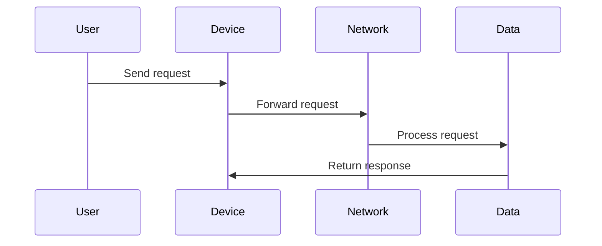

                 

# 物联网安全：应对互联设备激增的挑战

> 关键词：物联网安全、网络安全、设备安全、数据安全、加密技术、认证技术、安全协议、攻击类型、安全系统设计、系统架构

> 摘要：随着物联网（IoT）技术的快速发展，互联设备的数量呈爆炸式增长，随之而来的安全威胁也日益严峻。本文旨在系统地探讨物联网安全的重要性、核心概念、关键技术与解决方案，并对常见的攻击类型进行深入分析。同时，文章将详细介绍物联网安全系统设计与实现的方法，旨在为读者提供全面、深入的理解和实践指导。

## 第一部分: 物联网安全背景介绍

### 第1章: 物联网安全概述

#### 1.1 物联网的背景与发展

##### 1.1.1 物联网的定义与发展历程

物联网（Internet of Things，IoT）是指通过传感器、网络和计算机技术，将各种物体连接到互联网上，实现信息的采集、传输和处理。物联网的概念最早可以追溯到1999年，麻省理工学院的《科技评论》将其定义为：“通过互联网将各种物品连接起来，以实现信息交换和智能控制”。随着时间的推移，物联网技术得到了迅速发展，并逐渐渗透到各个领域。

##### 1.1.2 物联网的核心技术与架构

物联网的核心技术包括传感器技术、网络通信技术、数据处理技术和安全技术。传感器技术负责采集各种环境信息；网络通信技术实现物体之间的互联互通；数据处理技术对采集的数据进行存储、分析和处理；安全技术则是确保物联网系统的安全稳定运行。

#### 1.2 物联网安全的重要性

##### 1.2.1 物联网安全的基本概念

物联网安全涉及多个层面，包括设备安全、网络安全和数据安全。设备安全主要是指保护物联网设备免受恶意攻击；网络安全则是确保物联网网络免受攻击；数据安全则是保护物联网中传输和存储的数据不被泄露、篡改或滥用。

##### 1.2.2 物联网安全面临的主要挑战

随着物联网设备数量的激增，物联网安全面临诸多挑战。主要包括：

1. **设备安全问题**：物联网设备通常具有较低的硬件和软件资源，容易受到恶意攻击。

2. **网络安全问题**：物联网网络的开放性和互联性使得网络安全面临巨大挑战。

3. **数据安全问题**：物联网中涉及大量的敏感数据，如何确保数据安全成为关键问题。

### 第2章: 物联网安全核心概念与联系

#### 2.1 核心概念介绍

##### 2.1.1 设备安全

设备安全是指保护物联网设备免受恶意攻击，包括恶意软件感染、数据泄露、非法控制等。设备安全是物联网安全的基础。

##### 2.1.2 网络安全

网络安全是指保护物联网网络免受恶意攻击，包括拒绝服务攻击、数据窃取、网络篡改等。网络安全是确保物联网系统正常运行的关键。

##### 2.1.3 数据安全

数据安全是指保护物联网中传输和存储的数据不被泄露、篡改或滥用。数据安全是物联网安全的核心。

#### 2.2 概念属性特征对比表格

$$
\begin{array}{|c|c|c|}
\hline
\text{概念} & \text{属性特征} & \text{对比} \\
\hline
\text{设备安全} & \text{保护设备免受攻击} & \text{与其他安全概念的互动关系} \\
\hline
\text{网络安全} & \text{保护网络免受攻击} & \text{与设备安全和数据安全的关系} \\
\hline
\text{数据安全} & \text{保护数据免受泄露与篡改} & \text{与设备安全和网络安全的关系} \\
\hline
\end{array}
$$

#### 2.3 ER实体关系图架构

```mermaid
erDiagram
    Device --> |uses| Network
    Network --> |uses| Data
    Device --> |sends| Data
```

### 第3章: 物联网安全的关键技术与解决方案

#### 3.1 加密技术

##### 3.1.1 对称加密与非对称加密

对称加密是指加密和解密使用相同密钥的加密方法。其优点是加密速度快，但缺点是密钥分发困难。非对称加密是指加密和解密使用不同密钥的加密方法。其优点是解决了密钥分发问题，但加密速度较慢。

$$
\begin{aligned}
    &\text{对称加密: } \\
    &\text{密钥共享问题: } \\
    &\text{典型算法: AES, DES} \\
\end{aligned}
$$

##### 3.1.2 非对称加密

非对称加密使用公钥和私钥进行加密和解密。公钥可以公开，私钥必须保密。其优点是解决了密钥分发问题，但加密速度较慢。

$$
\begin{aligned}
    &\text{密钥对: 公钥与私钥} \\
    &\text{典型算法: RSA, ECC} \\
\end{aligned}
$$

#### 3.2 认证技术

##### 3.2.1 单因素认证与多因素认证

单因素认证是指仅使用用户名和密码进行认证。多因素认证是指结合多种认证方式（如密码、生物识别、硬件令牌等）进行认证。

##### 3.2.2 生物识别技术

生物识别技术是一种基于人体生物特征的认证技术，如指纹识别、面部识别、虹膜识别等。

#### 3.3 安全协议

##### 3.3.1 IPSec与SSL/TLS

IPSec（Internet Protocol Security）是一种用于保护IP协议通信的协议。SSL/TLS（Secure Sockets Layer/Transport Layer Security）是一种用于保护Web通信的协议。

##### 3.3.2 CoAP安全与MQTT安全

CoAP（Constrained Application Protocol）是一种用于物联网通信的协议。MQTT（Message Queuing Telemetry Transport）是一种轻量级的消息传输协议，广泛应用于物联网通信。

## 第4章: 物联网安全威胁分析

### 4.1 常见攻击类型

##### 4.1.1 拒绝服务攻击（DoS）

拒绝服务攻击是指通过大量请求使系统资源耗尽，导致系统无法正常服务。

##### 4.1.2 恶意代码攻击

恶意代码攻击是指通过植入恶意软件，控制或破坏物联网设备。

##### 4.1.3 伪造数据攻击

伪造数据攻击是指通过篡改物联网设备发送的数据，误导系统做出错误决策。

### 4.2 攻击案例分析

##### 4.2.1 某知名物联网设备供应链攻击

某知名物联网设备制造商的设备在供应链阶段被植入恶意软件，导致设备出厂时即已存在安全漏洞。

##### 4.2.2 某智能城市网络安全漏洞

某智能城市网络的多个设备被发现存在安全漏洞，攻击者通过这些漏洞获取了系统控制权。

## 第5章: 物联网安全系统设计与实现

### 5.1 安全系统设计原则

##### 5.1.1 安全性、可用性、可靠性的平衡

在设计物联网安全系统时，需要平衡安全性、可用性和可靠性，确保系统既能抵御攻击，又能正常运行。

##### 5.1.2 隔离与分层设计

通过隔离与分层设计，可以将不同安全层级分离，降低安全漏洞的传播风险。

### 5.2 系统架构设计

##### 5.2.1 领域模型

```mermaid
classDiagram
    Device <<Entity>>
    Network <<Entity>>
    Data <<Entity>>

    Device --|{1}|> Network
    Network --|{1}|> Data
```

##### 5.2.2 系统架构



### 5.3 关键安全模块实现

##### 5.3.1 数据加密模块

```python
def encrypt_data(data, key):
    # 使用AES加密算法进行数据加密
    encrypted_data = AES.encrypt(data, key)
    return encrypted_data
```

## 总结

随着物联网技术的快速发展，物联网安全的重要性日益凸显。本文系统地探讨了物联网安全的核心概念、关键技术与解决方案，并对常见的攻击类型进行了深入分析。通过本文的介绍，读者可以全面了解物联网安全的关键内容，为实际应用提供指导。

## 拓展阅读

1. [物联网安全最佳实践](https://www.iot.org/security/best-practices/)
2. [物联网安全标准与规范](https://www.iso.org/standard/73624.html)
3. [物联网安全工具与资源](https://www.us-cert.gov/ncas/tips/ST04-006)

## 作者

作者：AI天才研究院/AI Genius Institute & 禅与计算机程序设计艺术 /Zen And The Art of Computer Programming

