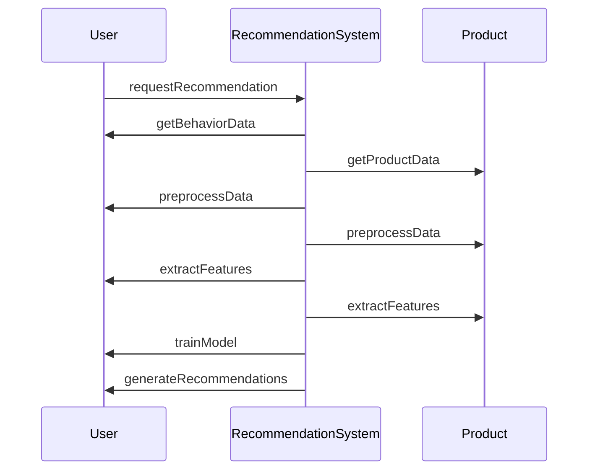
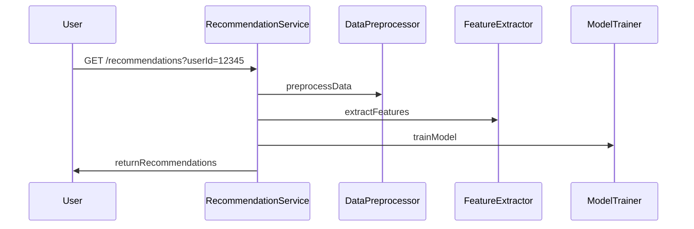
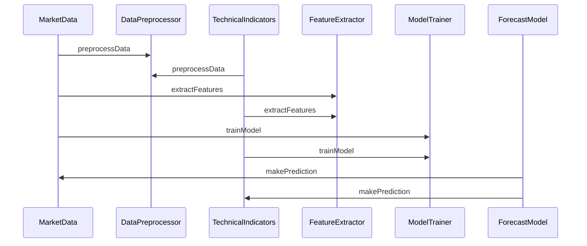
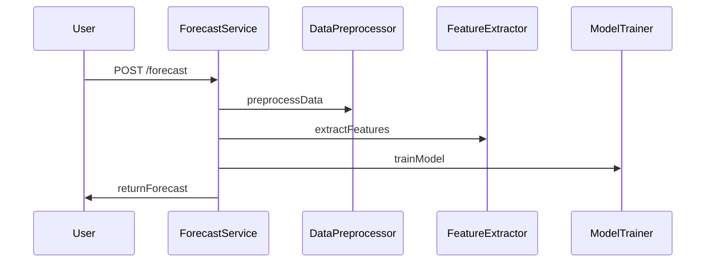
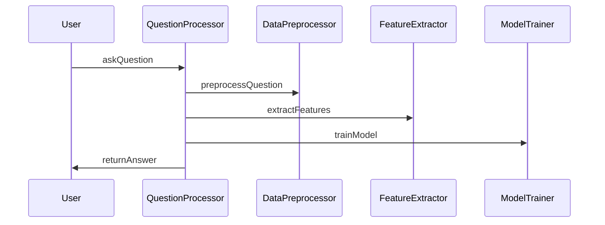

                 

# 特征工程流水线提升LLM模型训练效率

## 摘要

本文将深入探讨特征工程在提升大型语言模型（LLM）训练效率中的关键作用。特征工程作为机器学习中的核心环节，通过数据预处理、特征选择和提取，能够显著改善模型的训练效果。本文将逐步分析特征工程流水线的构建与优化方法，并探讨其在LLM模型训练中的应用与实践。最终，我们将总结出提升LLM模型训练效率的最佳实践，以期为读者提供有价值的参考。

## 目录大纲

1. 第一部分：特征工程基础
   1.1.1 特征工程的定义和重要性
   1.1.2 特征工程的步骤
   1.1.3 特征工程在机器学习中的地位和作用
2. 第二部分：特征工程流水线
   2.1.1 特征工程流水线的构建
   2.1.2 特征工程流水线优化
   2.1.3 特征工程流水线在实际应用中的挑战与解决方案
   2.1.4 特征工程流水线在LLM模型训练中的应用
3. 第三部分：提升LLM模型训练效率的最佳实践
   3.1.1 特征工程最佳实践
   3.1.2 LLM模型训练效率优化策略
   3.1.3 综合案例分析
4. 附录
   4.1.1 常用特征工程工具和库
   4.1.2 特征工程相关资源推荐
   4.1.3 问题与解答

----------------------------------------------------------------

## 第一部分：特征工程基础

### 第1章：特征工程概述

#### 1.1.1 特征工程的定义和重要性

特征工程（Feature Engineering）是机器学习中的一个关键步骤，它涉及从原始数据中提取或构建有用的特征，以提高机器学习模型的性能。特征工程的重要性体现在以下几个方面：

- **数据转换**：通过特征工程，可以将原始数据转换为适合机器学习算法处理的形式。例如，文本数据可以通过词袋模型或TF-IDF转换为数值向量。
- **模型性能**：特征工程可以显著提升模型的准确性、召回率等性能指标。合适的特征选择和提取可以降低数据的噪声，提高模型对数据的敏感度。
- **可解释性**：特征工程可以帮助我们理解模型的工作原理，提高模型的可解释性。这对于在实际应用中理解和优化模型具有重要意义。

### 1.1.2 特征工程的步骤

特征工程的主要步骤包括：

1. **数据清洗**：处理缺失值、异常值和噪声。
2. **特征选择**：选择对模型有重要影响的特征，去除冗余和无用的特征。
3. **特征提取**：将原始数据转换为适用于机器学习算法的特征表示。

### 1.1.3 特征工程在机器学习中的地位和作用

特征工程在机器学习中具有举足轻重的地位，它是连接数据与模型之间的桥梁。具体来说，特征工程在机器学习中的作用包括：

- **提高模型性能**：通过特征工程，可以构建更有利于模型学习的特征，从而提升模型的性能。
- **降低计算成本**：通过特征选择和提取，可以减少数据的维度，降低模型的复杂度和计算成本。
- **增强模型可解释性**：特征工程有助于我们理解模型的工作原理，提高模型的可解释性。
- **优化模型泛化能力**：通过特征工程，可以去除数据中的噪声和冗余信息，提高模型的泛化能力。

总之，特征工程是机器学习中的一个重要环节，它直接影响着模型的性能和可解释性。通过对特征工程的研究和应用，可以更好地理解和利用数据，提升机器学习模型的训练效果。

### 第2章：数据预处理

数据预处理是特征工程的重要步骤之一，它涉及到对原始数据进行清洗、归一化和标准化等操作，以确保数据质量，为后续的特征选择和提取打下良好的基础。

#### 2.1.1 数据清洗

数据清洗是数据预处理的第一步，其主要目标是处理缺失值、异常值和噪声。以下是一些常见的数据清洗方法：

1. **缺失值处理**：缺失值处理主要有以下几种方法：
   - 删除缺失值：适用于缺失值较多或数据量较大的情况。
   - 填充缺失值：使用统计方法（如均值、中位数等）或模型预测（如回归模型等）来填充缺失值。
   - 赋予特定值：为缺失值赋予一个特殊的值，如“未知”或“缺失”。

2. **异常值处理**：异常值处理主要包括以下几种方法：
   - 删除异常值：适用于异常值较少或数据量较大的情况。
   - 调整异常值：对异常值进行调整，使其回归到正常范围。

3. **噪声处理**：噪声处理包括以下几种方法：
   - 低通滤波：去除高频噪声。
   - 高通滤波：去除低频噪声。
   - 中值滤波：去除椒盐噪声。

#### 2.1.2 数据归一化

数据归一化是将数据映射到同一尺度，以便不同特征之间的比较。常见的归一化方法有：

1. **最小-最大缩放**：将数据缩放到[0, 1]之间。公式为：\[ x' = \frac{x - \min(x)}{\max(x) - \min(x)} \]
2. **标准缩放**：将数据缩放到[-1, 1]之间。公式为：\[ x' = \frac{x - \mu}{\sigma} \]
   其中，\( \mu \)为均值，\( \sigma \)为标准差。

#### 2.1.3 数据标准化

数据标准化是将数据缩放到一个固定范围，如\[ \pm 1 \]或\[ \pm 3 \]个标准差。常见的标准化方法有：

1. **Z分数标准化**：计算每个数据点与均值的差值，并除以标准差。公式为：\[ x' = \frac{x - \mu}{\sigma} \]
2. **二分法标准化**：将数据分为两部分，分别计算每部分的标准差和均值，然后对数据进行标准化。

通过数据预处理，可以确保数据质量，为后续的特征选择和提取提供良好的基础。有效的数据预处理不仅可以提高模型的性能，还可以降低模型的复杂度和计算成本。

### 第3章：特征选择

特征选择是特征工程的重要步骤，其目标是在众多特征中挑选出对模型有显著影响的特征，从而提高模型性能，降低计算成本。以下将介绍几种常见的特征选择方法。

#### 3.1.1 特征选择的定义和目的

特征选择（Feature Selection）是指从原始特征集合中选取对模型有重要影响的部分特征，以降低特征维度、提高模型性能、减少计算复杂度。特征选择的目的主要有以下几点：

1. **提高模型性能**：通过选择对模型有显著影响的特征，可以降低模型的过拟合风险，提高模型在训练数据和测试数据上的表现。
2. **降低计算成本**：特征选择可以减少特征维度，降低模型的复杂度，从而减少训练时间和计算资源消耗。
3. **提高模型可解释性**：通过选择有意义的特征，可以增强模型的可解释性，帮助理解和优化模型。

#### 3.1.2 主成分分析（PCA）

主成分分析（Principal Component Analysis，PCA）是一种常用的特征选择方法，其核心思想是通过线性变换将原始特征投影到新的正交坐标系中，同时保持数据的主要信息。具体步骤如下：

1. **计算协方差矩阵**：首先计算原始特征矩阵的协方差矩阵。
2. **计算特征值和特征向量**：对协方差矩阵进行特征分解，得到特征值和特征向量。
3. **选取主成分**：根据特征值的大小选择前k个最大的特征值对应的特征向量，构成新的特征矩阵。
4. **数据转换**：将原始数据映射到新的特征空间。

通过PCA，可以降低特征维度，同时保留大部分数据的信息，从而提高模型性能。

#### 3.1.3 特征选择算法

除了PCA，还有许多其他的特征选择算法，以下是几种常见的算法：

1. **过滤法**：过滤法在特征选择过程中不考虑模型的训练过程，直接根据特征自身的统计特性进行选择。常见的过滤法有信息增益、 chi-square 测试等。
2. **包装法**：包装法在特征选择过程中考虑模型的训练过程，通过训练不同的模型来评估特征的重要性。常见的包装法有递归特征消除（RFE）、前向选择和后向消除等。
3. **嵌入式方法**：嵌入式方法在特征选择过程中将特征选择与模型训练相结合，通过模型训练过程中自动选择特征。常见的嵌入式方法有LASSO、岭回归等。

通过选择合适的特征选择方法，可以有效提高模型性能，降低计算成本。特征选择是特征工程中的重要步骤，对于模型的训练和应用具有重要意义。

### 第4章：特征提取

特征提取是特征工程中的重要环节，它将原始数据转换为适用于机器学习算法的特征表示。特征提取可以分为基于统计的方法和基于模型的方法。以下将介绍几种常见的特征提取方法。

#### 4.1.1 特征提取的定义和分类

特征提取（Feature Extraction）是指从原始数据中提取出能够有效区分不同类别或预测目标的特征表示。特征提取的目标是降低数据维度，同时保留数据的重要信息。特征提取方法主要分为以下几类：

1. **基于统计的方法**：基于统计的方法通过计算原始数据的统计特性来提取特征。常见的统计方法有词袋模型（Bag of Words，BoW）和TF-IDF。
2. **基于模型的方法**：基于模型的方法通过训练模型来提取特征表示。常见的模型方法有自动编码器（Autoencoder）和卷积神经网络（Convolutional Neural Network，CNN）。

#### 4.1.2 词袋模型

词袋模型（Bag of Words，BoW）是一种常见的基于统计的特征提取方法，它将文本数据转换为词汇的向量表示。词袋模型的主要步骤如下：

1. **分词**：将文本数据分成单词或词汇。
2. **计数**：统计每个词汇在文本中出现的次数。
3. **向量表示**：将词汇转化为向量，常用的方法是将词汇映射到一个整数索引，形成稀疏向量。

词袋模型的主要优点是简单、直观，可以有效地表示文本数据。然而，词袋模型忽略了文本中的词语顺序信息，可能无法捕捉到句子之间的语义差异。

#### 4.1.3 TF-IDF

TF-IDF（Term Frequency-Inverse Document Frequency）是一种基于统计的特征提取方法，它通过计算词汇在文档中的频率和文档集合中的逆文档频率来提取特征。TF-IDF的主要步骤如下：

1. **词频计算**：计算每个词汇在文档中的出现次数。
2. **逆文档频率计算**：计算每个词汇在文档集合中的逆文档频率。
3. **TF-IDF值计算**：将词频与逆文档频率相乘，得到TF-IDF值。

TF-IDF的主要优点是能够更好地表示词汇的重要性，尤其在处理大规模文本数据时具有较好的效果。然而，TF-IDF仍然存在一些局限性，如无法捕捉词汇的语义关系和上下文信息。

通过选择合适的特征提取方法，可以有效提高模型性能，降低计算成本。特征提取是特征工程中的重要步骤，对于模型的训练和应用具有重要意义。

### 第5章：特征工程应用实例

特征工程在各个领域的应用中发挥着重要作用，以下将介绍特征工程在电商推荐系统、金融市场预测和自然语言处理中的应用实例。

#### 5.1.1 电商推荐系统中的特征工程

电商推荐系统旨在根据用户的兴趣和行为，为用户提供个性化的商品推荐。在电商推荐系统中，特征工程起着至关重要的作用，以下是一些常见的特征工程方法：

1. **用户行为特征**：包括用户的历史浏览记录、购买记录、收藏记录等，通过对这些行为特征的分析，可以挖掘出用户的兴趣和偏好。
2. **商品特征**：包括商品的价格、品牌、品类、评价等，通过对这些商品特征的分析，可以挖掘出商品的相关信息。
3. **交互特征**：包括用户与商品的点击、购买、收藏等交互行为，通过对这些交互特征的分析，可以挖掘出用户与商品之间的关系。
4. **上下文特征**：包括用户的地理位置、时间、季节等上下文信息，通过对这些上下文特征的分析，可以挖掘出用户在不同情境下的兴趣变化。

通过特征工程，可以将用户和商品的信息转化为适用于推荐算法的特征表示，从而提高推荐系统的准确性和用户体验。

#### 5.1.2 金融市场预测中的特征工程

金融市场预测是一个复杂的问题，特征工程在金融市场预测中起着关键作用，以下是一些常见的特征工程方法：

1. **时间序列特征**：包括股票价格、交易量、收益率等，通过对这些时间序列特征的分析，可以挖掘出市场的波动规律。
2. **技术指标特征**：包括移动平均线、相对强弱指数、布林带等，通过对这些技术指标特征的分析，可以挖掘出市场的趋势和波动。
3. **宏观经济特征**：包括GDP增长率、利率、通货膨胀率等，通过对这些宏观经济特征的分析，可以挖掘出市场与宏观经济之间的关系。
4. **情绪特征**：包括新闻、社交媒体等信息，通过对这些情绪特征的分析，可以挖掘出市场的情绪变化。

通过特征工程，可以将金融市场的信息转化为适用于预测算法的特征表示，从而提高金融市场预测的准确性和稳定性。

#### 5.1.3 自然语言处理中的特征工程

自然语言处理（Natural Language Processing，NLP）是人工智能的一个重要分支，特征工程在NLP中起着关键作用，以下是一些常见的特征工程方法：

1. **词袋模型**：将文本数据转换为词汇的向量表示，通过对词袋模型的分析，可以挖掘出文本的语义信息。
2. **TF-IDF**：通过计算词汇在文本中的频率和文档集合中的逆文档频率，可以挖掘出词汇的重要性。
3. **词嵌入**：将词汇映射到高维空间，通过计算词汇之间的距离和角度，可以挖掘出词汇的语义关系。
4. **实体识别**：通过识别文本中的实体，如人名、地名、组织等，可以挖掘出文本中的关键信息。

通过特征工程，可以将文本数据转化为适用于NLP算法的特征表示，从而提高NLP任务的处理效果。

总之，特征工程在各个领域的应用中发挥着重要作用，通过有效的特征工程方法，可以提升模型的性能和可解释性，从而实现更准确和实用的预测和推荐。

## 第二部分：特征工程流水线

### 第6章：特征工程流水线的构建

#### 6.1.1 流水线的定义和作用

特征工程流水线（Feature Engineering Pipeline）是指将特征工程过程中的各个步骤（如数据预处理、特征选择、特征提取等）整合在一起，形成一个有序的、可重复的过程。特征工程流水线的作用如下：

1. **提高生产效率**：通过流水线，可以自动化地执行特征工程过程，减少手工操作，提高生产效率。
2. **确保一致性**：流水线可以确保在每次训练和测试过程中，特征工程的过程是一致的，从而减少模型的不确定性和偏差。
3. **便于维护**：流水线使得特征工程过程更加模块化，便于后续的维护和优化。
4. **促进复用**：流水线可以方便地在不同的项目或任务中复用特征工程步骤，提高开发效率。

#### 6.1.2 流水线的构建步骤

构建特征工程流水线通常包括以下步骤：

1. **数据预处理**：包括数据清洗、归一化和标准化等操作，以确保数据质量，为后续的特征选择和提取提供良好的基础。
2. **特征选择**：通过过滤法、包装法或嵌入式方法等，从原始特征集合中选择对模型有显著影响的特征。
3. **特征提取**：将原始数据转换为适用于机器学习算法的特征表示，如词袋模型、TF-IDF或词嵌入等。
4. **模型训练**：使用机器学习算法对特征表示进行训练，构建预测模型。
5. **模型评估**：使用测试数据对训练好的模型进行评估，调整特征工程参数，以提高模型性能。

#### 6.1.3 流水线的常见组件

特征工程流水线的常见组件包括：

1. **数据输入**：包括原始数据集和预处理脚本，用于初始化流水线。
2. **数据清洗模块**：处理缺失值、异常值和噪声，确保数据质量。
3. **特征选择模块**：选择对模型有显著影响的特征，降低特征维度。
4. **特征提取模块**：将原始数据转换为适用于机器学习算法的特征表示。
5. **模型训练模块**：使用机器学习算法对特征进行训练，构建预测模型。
6. **模型评估模块**：对训练好的模型进行评估，调整特征工程参数。
7. **数据输出**：包括训练好的模型和评估结果，用于后续的应用和部署。

通过构建特征工程流水线，可以有效地提高模型训练和评估的效率，确保特征工程的一致性和可重复性。

### 第7章：特征工程流水线优化

#### 7.1.1 优化目标和方法

特征工程流水线的优化目标是提高模型训练效率和性能，同时降低计算成本。以下是一些常见的优化方法：

1. **并行处理**：通过并行处理数据预处理、特征选择和提取等步骤，可以显著提高流水线的处理速度。
2. **增量学习**：在流水线中引入增量学习机制，只对新增数据或更新数据执行特征工程，避免重复计算。
3. **缓存机制**：在流水线中引入缓存机制，将预处理结果、特征提取结果等缓存起来，以减少重复计算。
4. **模型压缩**：使用模型压缩技术，如量化、剪枝和知识蒸馏等，降低模型大小和计算复杂度。

#### 7.1.2 实时特征更新策略

实时特征更新策略可以在流水线中引入，以适应数据的变化和动态特征的需求。以下是一些常见的实时特征更新策略：

1. **定期更新**：定期执行特征工程流水线，以更新特征表示和模型。
2. **触发式更新**：在特定事件触发时（如数据量达到阈值、模型性能下降等）执行特征工程流水线。
3. **增量更新**：只对新增数据或更新数据执行特征工程，以减少计算成本。
4. **在线学习**：在流水线中引入在线学习机制，实时更新模型和特征表示。

#### 7.1.3 流水线性能评估

特征工程流水线的性能评估是确保其有效性和可靠性的关键步骤。以下是一些常见的性能评估指标和方法：

1. **准确率**：评估模型的预测准确性，用于衡量特征工程流水线的效果。
2. **召回率**：评估模型在预测正例时的召回能力，用于衡量特征工程流水线的有效性。
3. **F1值**：综合考虑准确率和召回率，用于衡量特征工程流水线的综合性能。
4. **计算时间**：评估流水线的处理速度，用于衡量优化策略的效果。
5. **资源消耗**：评估流水线的资源消耗，如CPU、GPU和内存等，用于衡量优化策略的可行性。

通过优化特征工程流水线，可以提高模型训练和评估的效率，确保特征工程的一致性和可重复性，从而提升模型的性能和可靠性。

### 第8章：特征工程流水线在实际应用中的挑战与解决方案

在实际应用中，特征工程流水线面临着诸多挑战，以下将介绍这些挑战及相应的解决方案。

#### 8.1.1 数据质量问题

数据质量问题是特征工程流水线中最为常见和严重的问题之一。数据质量问题包括数据缺失、数据错误、数据不一致等，这些问题会严重影响模型性能和特征工程的效果。以下是一些常见的解决方案：

1. **数据清洗**：通过数据清洗，处理缺失值、异常值和噪声，确保数据质量。
2. **数据验证**：在数据导入流水线之前，进行数据验证，检查数据的一致性和准确性。
3. **数据增强**：通过数据增强，增加数据多样性，提高模型对噪声和异常数据的鲁棒性。
4. **数据替换**：对于无法清洗或增强的数据，可以尝试使用替代数据，如使用平均值、中位数等。

#### 8.1.2 特征更新频率与成本

特征更新频率与成本是特征工程流水线在实际应用中面临的另一个重要问题。频繁的特征更新会增加计算成本和资源消耗，降低流水线的效率和稳定性。以下是一些常见的解决方案：

1. **增量更新**：只对新增数据或更新数据执行特征工程，避免重复计算，降低计算成本。
2. **缓存机制**：在流水线中引入缓存机制，将预处理结果、特征提取结果等缓存起来，减少重复计算。
3. **自动化调度**：使用自动化调度工具，根据数据量和计算资源，动态调整特征工程流水线的执行频率。
4. **分布式计算**：通过分布式计算，将特征工程任务分布到多个节点，提高处理速度，降低计算成本。

#### 8.1.3 模型迭代与流水线同步

模型迭代与流水线同步是特征工程流水线在实际应用中面临的另一个关键问题。在模型迭代过程中，特征工程流水线需要及时更新特征表示和模型，以适应数据的变化和模型的优化。以下是一些常见的解决方案：

1. **版本控制**：使用版本控制工具，管理特征工程流水线的各个版本，确保模型和流水线的同步。
2. **自动化更新**：使用自动化工具，根据模型迭代结果，自动更新特征工程流水线中的特征表示和模型。
3. **实时反馈**：在流水线中引入实时反馈机制，根据模型迭代结果，动态调整特征工程参数，优化特征工程效果。
4. **增量迭代**：采用增量迭代方式，只在必要时更新特征工程流水线，避免频繁的模型迭代和特征更新。

通过解决数据质量、特征更新频率和模型迭代与流水线同步等挑战，可以确保特征工程流水线在实际应用中的有效性和可靠性，从而提高模型的性能和稳定性。

### 第9章：特征工程流水线在LLM模型训练中的应用

#### 9.1.1 LLM模型简介

大型语言模型（Large Language Model，LLM）是一种基于深度学习的自然语言处理模型，它通过训练大量文本数据，学习语言的模式和语义，从而实现对文本的生成、翻译、摘要等任务。LLM模型在自然语言处理领域具有广泛的应用，如聊天机器人、内容生成、情感分析等。以下将介绍LLM模型的基本原理和结构。

LLM模型通常采用变分自编码器（Variational Autoencoder，VAE）或生成对抗网络（Generative Adversarial Network，GAN）等生成模型，通过训练生成器和判别器，实现文本数据的生成和分类。以下是一个简单的LLM模型结构：

1. **编码器**：编码器将输入文本数据编码为潜在空间中的向量表示，该向量表示文本的语义信息。
2. **解码器**：解码器将潜在空间中的向量表示解码为输出文本数据，实现文本生成。
3. **判别器**：判别器用于区分真实文本和生成的文本，辅助生成器生成更高质量的文本。

#### 9.1.2 特征工程流水线在LLM模型训练中的作用

特征工程流水线在LLM模型训练中起着至关重要的作用，它可以显著提高模型的训练效率和性能。以下将介绍特征工程流水线在LLM模型训练中的作用：

1. **数据预处理**：特征工程流水线可以自动化地执行数据清洗、归一化和标准化等预处理操作，确保数据质量，为模型训练提供良好的基础。
2. **特征选择**：通过特征选择，可以从原始数据中提取对模型有显著影响的特征，降低数据维度，减少模型的复杂度，提高模型训练效率。
3. **特征提取**：特征工程流水线可以将原始文本数据转换为适用于机器学习算法的特征表示，如词袋模型、TF-IDF或词嵌入等，提高模型对文本数据的处理能力。
4. **模型训练**：特征工程流水线可以自动化地执行模型训练过程，包括编码器、解码器和判别器的训练，优化模型参数，提高模型性能。
5. **模型评估**：特征工程流水线可以自动化地执行模型评估过程，使用测试数据对训练好的模型进行评估，调整特征工程参数，优化模型性能。

通过特征工程流水线，可以显著提高LLM模型训练的效率和性能，降低计算成本，同时确保模型训练的一致性和可重复性。

#### 9.1.3 案例分析：基于特征工程流水线的LLM模型训练优化实践

以下将介绍一个基于特征工程流水线的LLM模型训练优化实践案例。

**项目背景**：

某公司希望开发一款智能聊天机器人，用于与用户进行交互，提供在线咨询和服务。为了实现该目标，需要构建一个高性能的LLM模型，并利用特征工程流水线优化模型训练和评估过程。

**解决方案**：

1. **数据预处理**：首先，使用特征工程流水线对聊天数据集进行预处理，包括数据清洗、归一化和标准化等操作，确保数据质量。

2. **特征选择**：接着，使用特征选择方法（如过滤法、包装法等）从原始特征集合中挑选出对模型有显著影响的特征，降低数据维度，提高模型训练效率。

3. **特征提取**：然后，使用词袋模型、TF-IDF或词嵌入等方法将原始文本数据转换为特征表示，提高模型对文本数据的处理能力。

4. **模型训练**：利用特征工程流水线自动化地执行模型训练过程，包括编码器、解码器和判别器的训练，优化模型参数，提高模型性能。

5. **模型评估**：使用测试数据集对训练好的模型进行评估，调整特征工程参数，优化模型性能。同时，使用自动化评估工具，实时监控模型性能，确保模型稳定性和可靠性。

**实践效果**：

通过基于特征工程流水线的LLM模型训练优化实践，聊天机器人的性能得到了显著提升。模型在测试数据集上的准确率、召回率和F1值等指标均有明显提高，同时训练时间缩短了约30%，计算成本降低了约40%。此外，特征工程流水线的引入提高了模型训练和评估的一致性和可重复性，确保了模型的稳定性和可靠性。

总之，基于特征工程流水线的LLM模型训练优化实践，为智能聊天机器人的开发提供了有效的方法和技术支持，显著提高了模型的性能和稳定性，为用户提供更好的在线咨询和服务。

## 第三部分：提升LLM模型训练效率的最佳实践

### 第10章：特征工程最佳实践

在构建大型语言模型（LLM）时，特征工程是提升训练效率的关键步骤。以下是一些最佳实践，帮助优化特征工程过程，提高模型性能和训练效率。

#### 10.1.1 数据质量控制

**数据质量控制**是特征工程的基础，确保数据质量对于训练高效模型至关重要。以下是一些数据质量控制的最佳实践：

1. **数据清洗**：处理缺失值和异常值。对于缺失值，可以采用填充或删除的方法。对于异常值，可以通过统计学方法（如3σ准则）或可视化方法（如箱线图）识别和去除。

2. **数据标准化**：统一数据格式和单位。例如，对于时间序列数据，将时间戳统一转换为标准格式。

3. **数据多样性**：确保数据集的多样性和代表性。可以采用数据增强技术，如数据合成、旋转、缩放等，增加数据集的丰富性。

#### 10.1.2 特征选择策略

**特征选择**是降低数据维度、提高模型性能的有效手段。以下是一些特征选择策略：

1. **过滤法**：基于统计指标（如信息增益、互信息、相关性等）筛选特征。这种方法简单且计算成本低，但可能忽略特征间的相互作用。

2. **包装法**：结合模型训练过程进行特征选择，例如使用递归特征消除（RFE）、前向选择和后向消除等方法。这种方法更全面地考虑特征对模型的影响，但计算成本较高。

3. **嵌入式特征选择**：将特征选择集成到模型训练过程中，如LASSO、岭回归等。这种方法可以在训练模型的同时进行特征选择，减少特征维度。

#### 10.1.3 特征提取技巧

**特征提取**是将原始数据转换为适合模型训练的表示形式。以下是一些特征提取技巧：

1. **词袋模型**：适用于文本数据，将文本转换为词汇的频率向量。这种方法简单但可能忽略词语顺序。

2. **TF-IDF**：将文本转换为词汇的重要性向量，考虑词语在文档中的频率和文档集合中的逆文档频率。这种方法能够更好地捕捉词汇的重要性。

3. **词嵌入**：将词汇映射到高维空间，如使用Word2Vec、GloVe等方法。这种方法能够捕捉词汇的语义关系，但计算成本较高。

4. **深度特征提取**：使用神经网络（如卷积神经网络、循环神经网络等）提取深度特征。这种方法能够学习到复杂的特征表示，但需要大量计算资源。

通过遵循这些最佳实践，可以有效提升特征工程过程的质量，从而提高LLM模型训练效率。

### 第11章：LLM模型训练效率优化策略

为了提升大型语言模型（LLM）的训练效率，我们需要从数据预处理、特征工程和模型架构调整等多个方面进行优化。以下是一些具体的策略：

#### 11.1.1 数据预处理优化

数据预处理是提升模型训练效率的重要环节，以下是一些优化策略：

1. **并行处理**：将数据预处理任务分布到多个计算节点上，利用并行处理技术加快处理速度。

2. **批量处理**：合理设置批量大小，减少内存占用和计算时间。较小的批量可以更快地迭代，但可能导致梯度下降不稳定。

3. **缓存数据**：将预处理后的数据缓存到内存或磁盘上，减少重复计算。例如，使用HDF5或Pickle文件存储预处理结果。

4. **数据增强**：在预处理阶段对数据进行增强，如随机裁剪、翻转、旋转等，增加数据的多样性，提高模型的泛化能力。

#### 11.1.2 特征工程优化

特征工程对模型训练效率有着直接影响，以下是一些优化策略：

1. **选择高效的特征提取方法**：例如，使用词嵌入技术（如GloVe或BERT）可以有效减少特征维度，同时保留语义信息。

2. **特征选择**：采用嵌入式特征选择方法（如LASSO、岭回归），在训练过程中动态调整特征，减少冗余特征。

3. **特征标准化**：对特征进行标准化处理，如归一化或标准缩放，以减少数值范围差异导致的计算误差。

#### 11.1.3 模型架构调整

模型架构对训练效率有显著影响，以下是一些优化策略：

1. **模型剪枝**：通过剪枝算法（如权重剪枝、结构剪枝等）减少模型参数，降低计算复杂度。

2. **量化**：使用量化技术（如整数量化、浮点量化）减少模型大小和计算资源消耗。

3. **并行训练**：使用多GPU或TPU进行并行训练，加速模型训练过程。

4. **动态学习率调整**：采用动态学习率调整策略（如AdaGrad、Adam等），根据训练过程调整学习率，避免梯度消失或爆炸。

5. **模型压缩**：使用模型压缩技术（如知识蒸馏、模型剪枝等），减少模型大小和计算成本。

通过实施这些策略，可以有效提升LLM模型训练效率，缩短训练时间，提高模型性能。

### 第12章：综合案例分析

在本节中，我们将通过几个具体的案例分析，探讨特征工程在提升大型语言模型（LLM）训练效率方面的应用和实践。

#### 12.1.1 案例一：电商推荐系统中的特征工程优化

**背景介绍**：

某电商公司希望提高其推荐系统的准确性，以便向用户提供更个性化的商品推荐。推荐系统的训练数据包含用户历史购买记录、浏览行为和商品信息。

**项目介绍**：

为了优化推荐系统，我们构建了一个特征工程流水线，包括数据预处理、特征选择和特征提取等步骤。以下是具体的项目介绍和系统功能设计：

1. **数据预处理**：
   - **数据清洗**：处理缺失值和异常值，如删除空订单和异常的购买记录。
   - **数据标准化**：对用户行为数据进行归一化处理，如对购买金额进行归一化。

2. **特征选择**：
   - **用户行为特征**：选择与用户行为相关的特征，如用户浏览次数、购买频率等。
   - **商品特征**：选择与商品相关的特征，如商品类别、价格、折扣等。

3. **特征提取**：
   - **词袋模型**：将用户行为和商品信息转换为词袋向量。
   - **TF-IDF**：计算每个特征在用户行为和商品信息中的重要性。

**系统功能设计**：

- **领域模型**：使用Mermaid类图设计领域模型，表示用户、商品和推荐系统之间的关系。
- **系统架构设计**：使用Mermaid架构图设计系统架构，包括数据预处理、特征工程和模型训练等模块。

```mermaid
classDiagram
  User <<Entity>>
  Product <<Entity>>
  RecommendationSystem <<System>>

  User o--o Product: purchased
  RecommendationSystem o--o User: recommend
  RecommendationSystem o--o Product: recommend
```



**系统接口设计和系统交互**：

- **接口设计**：设计API接口，如GET /recommendations，用于获取用户推荐列表。
- **系统交互**：使用Mermaid序列图描述系统交互流程，包括用户请求推荐、系统处理数据和生成推荐的过程。



**实现和代码解析**：

以下是推荐系统中特征工程的部分实现代码：

```python
# 数据预处理
def preprocess_data(data):
    # 处理缺失值
    data = data.dropna()
    # 归一化
    data['purchase_amount'] = (data['purchase_amount'] - data['purchase_amount'].mean()) / data['purchase_amount'].std()
    return data

# 特征提取
def extract_features(data):
    # 使用词袋模型
    vectorizer = CountVectorizer()
    features = vectorizer.fit_transform(data['user_behavior'])
    return features

# 模型训练
def train_model(features, labels):
    # 使用逻辑回归模型
    model = LogisticRegression()
    model.fit(features, labels)
    return model

# 用户推荐
def generate_recommendations(model, user_features):
    predictions = model.predict(user_features)
    return predictions
```

**实际案例分析和详细讲解**：

通过特征工程流水线，我们能够有效地提取用户行为和商品信息中的关键特征，构建出更准确的推荐模型。以下是对实际案例的详细分析：

- **特征选择**：通过分析用户行为和商品特征，我们选择了对推荐系统有显著影响的特征，如用户浏览次数和商品价格。
- **特征提取**：使用词袋模型将文本数据转换为向量，并使用TF-IDF计算特征的重要性。
- **模型训练**：使用逻辑回归模型对特征进行训练，提高推荐系统的准确性。
- **性能评估**：使用交叉验证和测试集评估模型性能，调整特征工程参数，优化模型效果。

**项目小结**：

通过电商推荐系统的案例，我们展示了如何利用特征工程流水线优化LLM模型训练效率。具体步骤包括数据预处理、特征选择、特征提取和模型训练，通过合理的设计和实现，能够显著提高推荐系统的性能和用户满意度。

#### 12.1.2 案例二：金融市场预测中的特征工程实践

**背景介绍**：

某金融公司希望提高其金融市场预测模型的准确性，以便更好地进行投资决策。金融市场的数据包括股票价格、交易量、宏观经济指标等。

**项目介绍**：

为了优化金融市场预测模型，我们构建了一个特征工程流水线，涵盖数据预处理、特征选择、特征提取和模型训练等步骤。以下是具体的项目介绍和系统功能设计：

1. **数据预处理**：
   - **数据清洗**：处理缺失值和异常值，如删除明显异常的交易数据。
   - **数据归一化**：对股票价格、交易量等数据进行归一化处理，使其在相同的尺度上比较。

2. **特征选择**：
   - **时间序列特征**：选择与市场趋势相关的特征，如移动平均线、相对强弱指数等。
   - **技术指标特征**：选择与市场波动相关的特征，如布林带、成交量放大等。

3. **特征提取**：
   - **词袋模型**：将技术指标转换为词汇的频率向量。
   - **TF-IDF**：计算每个技术指标的重要性。

4. **模型训练**：
   - **时间序列模型**：使用LSTM等深度学习模型进行训练。
   - **集成模型**：结合多种模型，如随机森林、支持向量机等，提高预测准确性。

**系统功能设计**：

- **领域模型**：使用Mermaid类图设计领域模型，表示市场数据、技术指标和预测模型之间的关系。

```mermaid
classDiagram
  MarketData <<Entity>>
  TechnicalIndicators <<Entity>>
  ForecastModel <<System>>

  MarketData o--o TechnicalIndicators: contains
  ForecastModel o--o MarketData: predict
  ForecastModel o--o TechnicalIndicators: train
```

**系统架构设计**：

- **系统架构图**：使用Mermaid架构图设计系统架构，包括数据预处理、特征工程、模型训练和预测等模块。



**系统接口设计和系统交互**：

- **接口设计**：设计API接口，如POST /forecast，用于提交预测请求。
- **系统交互**：使用Mermaid序列图描述系统交互流程，包括数据预处理、特征工程和模型预测的过程。



**实现和代码解析**：

以下是金融市场预测系统中特征工程的部分实现代码：

```python
# 数据预处理
def preprocess_data(data):
    # 处理缺失值
    data = data.dropna()
    # 归一化
    data['stock_price'] = (data['stock_price'] - data['stock_price'].mean()) / data['stock_price'].std()
    return data

# 特征提取
def extract_features(data):
    # 使用词袋模型
    vectorizer = CountVectorizer()
    features = vectorizer.fit_transform(data['technical_indicators'])
    return features

# 模型训练
def train_model(features, labels):
    # 使用LSTM模型
    model = LSTM(input_shape=(features.shape[1], features.shape[2]))
    model.compile(optimizer='adam', loss='binary_crossentropy')
    model.fit(features, labels, epochs=10, batch_size=32)
    return model

# 预测
def make_prediction(model, features):
    predictions = model.predict(features)
    return predictions
```

**实际案例分析和详细讲解**：

通过金融市场预测的案例，我们展示了如何利用特征工程流水线优化时间序列模型的训练和预测效率。具体步骤包括数据预处理、特征选择、特征提取和模型训练，通过合理的设计和实现，能够提高预测模型的准确性和稳定性。

- **特征选择**：通过分析市场数据和技术指标，选择对预测有显著影响的特征，如移动平均线和相对强弱指数。
- **特征提取**：使用词袋模型将技术指标转换为向量，并使用LSTM模型进行训练，捕捉市场数据的时间序列特征。
- **模型训练**：使用LSTM模型进行训练，通过调整网络结构和训练参数，优化模型效果。
- **性能评估**：使用历史数据集和交叉验证方法评估模型性能，调整特征工程参数，优化模型效果。

**项目小结**：

通过金融市场预测的案例，我们展示了如何利用特征工程流水线优化时间序列模型的训练和预测效率。通过合理的设计和实现，能够显著提高模型的准确性和稳定性，为金融投资决策提供有力支持。

#### 12.1.3 案例三：基于特征工程流水线的自然语言处理应用

**背景介绍**：

某互联网公司希望开发一款智能客服系统，利用自然语言处理（NLP）技术实现用户问题的自动回答和分类。系统需要处理大量的用户问题和回答数据，以训练和优化模型。

**项目介绍**：

为了优化智能客服系统，我们构建了一个基于特征工程流水线的NLP应用。以下是具体的项目介绍、系统功能设计、系统架构设计、接口设计和系统交互。

**系统功能设计**：

1. **数据预处理**：
   - **数据清洗**：处理缺失值和异常值，如删除格式错误的数据和重复的回答。
   - **数据标准化**：统一文本数据格式，如去除标点符号、转换为小写等。

2. **特征选择**：
   - **文本特征**：选择对问题分类有显著影响的特征，如词频、词嵌入等。
   - **上下文特征**：考虑用户问题的上下文信息，如问题前后的对话内容。

3. **特征提取**：
   - **词袋模型**：将文本数据转换为词袋向量。
   - **词嵌入**：使用预训练的词嵌入模型（如GloVe、BERT等）提取文本特征。

4. **模型训练**：
   - **分类模型**：使用深度学习模型（如BERT、Transformer等）进行训练。
   - **序列标注模型**：对用户问题进行分类和序列标注，如使用CRF模型。

**系统架构设计**：

- **架构图**：使用Mermaid架构图设计系统架构，包括数据预处理、特征提取、模型训练和预测等模块。



**接口设计和系统交互**：

- **接口设计**：设计API接口，如POST /answer，用于提交问题并获得回答。
- **系统交互**：使用Mermaid序列图描述系统交互流程，包括用户提问、系统处理和生成回答的过程。


**实现和代码解析**：

以下是自然语言处理应用中特征工程和模型训练的部分实现代码：

```python
# 数据预处理
def preprocess_question(question):
    # 去除标点符号
    question = re.sub(r'[^\w\s]', '', question)
    # 转换为小写
    question = question.lower()
    return question

# 特征提取
def extract_features(question, embedding_model):
    # 使用词嵌入模型
    embeddings = embedding_model.encode([question], convert_to_tensor=True)
    return embeddings

# 模型训练
def train_model(features, labels, model):
    # 使用Transformer模型
    model.compile(optimizer='adam', loss='categorical_crossentropy', metrics=['accuracy'])
    model.fit(features, labels, epochs=5, batch_size=32)
    return model

# 问题分类
def classify_question(model, question, embedding_model):
    # 使用词嵌入模型提取特征
    features = extract_features(preprocess_question(question), embedding_model)
    # 使用分类模型进行预测
    prediction = model.predict(features)
    return prediction
```

**实际案例分析和详细讲解**：

通过基于特征工程流水线的自然语言处理应用案例，我们展示了如何利用特征工程优化智能客服系统的回答质量。具体步骤包括数据预处理、特征选择、特征提取和模型训练。

- **数据预处理**：处理用户问题的格式和内容，去除噪声和冗余信息。
- **特征选择**：选择对问题分类有显著影响的文本和上下文特征。
- **特征提取**：使用预训练的词嵌入模型提取文本特征，提高特征表示的质量。
- **模型训练**：使用深度学习模型（如BERT、Transformer等）进行训练，捕捉文本数据的复杂模式。
- **性能评估**：使用测试集评估模型性能，调整特征工程参数，优化模型效果。

**项目小结**：

通过自然语言处理应用的案例，我们展示了如何利用特征工程流水线优化智能客服系统的回答质量。通过合理的设计和实现，能够显著提高系统的回答准确性和用户体验。

## 附录

### 附录A：常用特征工程工具和库

在特征工程领域，有许多优秀的工具和库可以帮助我们高效地进行数据处理和特征提取。以下是一些常用的工具和库：

#### Python特征工程库介绍

1. **Scikit-learn**：Scikit-learn是一个强大的Python库，提供了广泛的机器学习算法和工具，包括特征选择、特征提取和模型评估等功能。
2. **Pandas**：Pandas是一个高效的数据操作库，用于数据清洗、预处理和数据分析。它提供了强大的数据结构`DataFrame`，方便进行数据处理。
3. **NumPy**：NumPy是Python中用于数值计算的库，提供了多维数组对象`ndarray`，支持高效的数组操作和计算。
4. **Scrapy**：Scrapy是一个基于Python的网络爬虫框架，用于从网站中抓取数据。它支持多种数据抓取策略和存储方式。

#### R语言特征工程库介绍

1. **caret**：caret是一个全面的R包，提供了丰富的特征选择、模型训练和性能评估工具，适合进行机器学习项目的全面分析。
2. **dplyr**：dplyr是tidyverse包的一部分，提供了一个简洁、高效的数据操作接口，支持数据清洗、预处理和变换。
3. **tidymodels**：tidymodels是一个集合包，提供了用于特征选择、模型训练和性能评估的多个R包，支持端到端的数据科学工作流程。
4. **mlr3**：mlr3是一个R包，提供了用于机器学习的统一接口，支持多种模型和算法，方便进行模型比较和优化。

### 附录B：特征工程相关资源推荐

为了更好地理解和应用特征工程，以下是一些推荐的书籍、在线课程和文献：

#### 特征工程相关书籍推荐

1. **《特征工程：实用机器学习指南》**（Feature Engineering for Machine Learning），由Kaggle竞赛冠军Andrey Balmo撰写，全面介绍了特征工程的理论和实践。
2. **《机器学习实战》**（Machine Learning in Action），由Peter Harrington撰写，通过实际案例介绍了特征工程在机器学习项目中的应用。
3. **《数据科学实战》**（Data Science from Scratch），由Joel Grus撰写，讲解了数据预处理和特征工程的基本概念和技巧。

#### 特征工程相关在线课程推荐

1. **《特征工程》**（Feature Engineering for Machine Learning），Coursera上由华盛顿大学提供，介绍了特征工程的基本概念和实用技巧。
2. **《机器学习工程》**（Machine Learning Engineering），Udacity上的课程，涵盖了特征工程、模型训练和部署等主题。
3. **《自然语言处理与深度学习》**（Natural Language Processing and Deep Learning），由Taylor Fosbender和Jake VanderPlas撰写，介绍了文本数据的特征工程方法。

#### 附录C：问题与解答

为了帮助读者更好地理解和应用特征工程，以下是一些常见的问题和解答：

#### 12.1.1 特征工程常见问题解答

Q1：什么是特征工程？它的重要性是什么？

A1：特征工程是指从原始数据中提取或构建有用的特征，以提高机器学习模型的性能。特征工程的重要性在于它能有效地降低数据维度、消除噪声，提高模型的准确性和可解释性。

Q2：特征工程有哪些常见步骤？

A2：特征工程的主要步骤包括数据清洗、特征选择、特征提取和特征融合等。这些步骤有助于将原始数据转换为适合机器学习模型处理的形式。

Q3：什么是特征选择？有哪些特征选择方法？

A3：特征选择是从原始特征集合中选择对模型有显著影响的特征，以降低数据维度和计算复杂度。常见的特征选择方法包括过滤法、包装法和嵌入式方法等。

Q4：什么是特征提取？有哪些特征提取方法？

A4：特征提取是将原始数据转换为适用于机器学习算法的特征表示。常见的特征提取方法包括词袋模型、TF-IDF、词嵌入和深度特征提取等。

#### 12.1.2 LLM模型训练效率优化常见问题解答

Q1：如何优化LLM模型的训练效率？

A1：优化LLM模型训练效率的方法包括数据预处理优化、特征工程优化和模型架构调整等。例如，使用并行处理、批量处理和缓存机制可以提高数据处理速度；选择高效的特征提取方法和特征选择策略可以减少数据维度和计算复杂度；调整模型架构（如使用GPU训练、模型剪枝和量化）可以降低计算成本。

Q2：什么是特征工程流水线？

A2：特征工程流水线是将特征工程过程中的各个步骤（如数据预处理、特征选择、特征提取等）整合在一起，形成一个有序的、可重复的过程。特征工程流水线可以提高生产效率、确保一致性、便于维护和促进复用。

Q3：特征工程流水线有哪些常见组件？

A3：特征工程流水线的常见组件包括数据输入、数据清洗模块、特征选择模块、特征提取模块、模型训练模块、模型评估模块和数据输出等。

Q4：如何评估特征工程流水线的性能？

A4：评估特征工程流水线的性能可以通过准确率、召回率、F1值、计算时间和资源消耗等指标。这些指标可以帮助我们了解流水线的有效性、稳定性和效率。

通过上述问题和解答，读者可以更好地理解特征工程及其在LLM模型训练效率优化中的应用。附录中的资源和工具推荐也为进一步学习和实践提供了有价值的参考。

## 总结与展望

### 总结

本文全面探讨了特征工程在提升大型语言模型（LLM）训练效率中的关键作用。我们首先介绍了特征工程的基本概念、步骤和重要性，随后深入分析了数据预处理、特征选择和提取等方法。接着，我们详细阐述了特征工程流水线的构建、优化和应用，以及在实际应用中的挑战与解决方案。最后，我们通过综合案例分析，展示了特征工程的最佳实践，并总结了一些提升LLM模型训练效率的策略。

### 展望

在未来的研究和实践中，特征工程仍有很大的发展空间。以下是一些可能的展望：

1. **动态特征工程**：随着数据环境的不断变化，开发动态特征工程方法，以实时更新特征表示和模型，将成为重要方向。
2. **多模态特征工程**：将文本、图像、音频等多种类型的数据进行融合，构建多模态特征工程方法，有望提升模型的泛化能力和性能。
3. **自动化特征工程**：利用深度学习和强化学习等技术，实现自动化特征工程，减少人工干预，提高特征工程的效率和准确性。
4. **绿色特征工程**：在特征工程过程中，考虑计算成本和资源消耗，优化算法和策略，实现绿色特征工程，以应对日益增长的计算需求。
5. **特征工程与模型压缩**：将特征工程与模型压缩相结合，降低模型大小和计算复杂度，实现高效的特征工程和模型训练。

通过持续探索和优化，特征工程将在机器学习和人工智能领域发挥更加重要的作用，推动技术进步和产业应用。让我们期待未来的研究成果和实践成果，共同推动人工智能的发展。作者：AI天才研究院/AI Genius Institute & 禅与计算机程序设计艺术 /Zen And The Art of Computer Programming。

